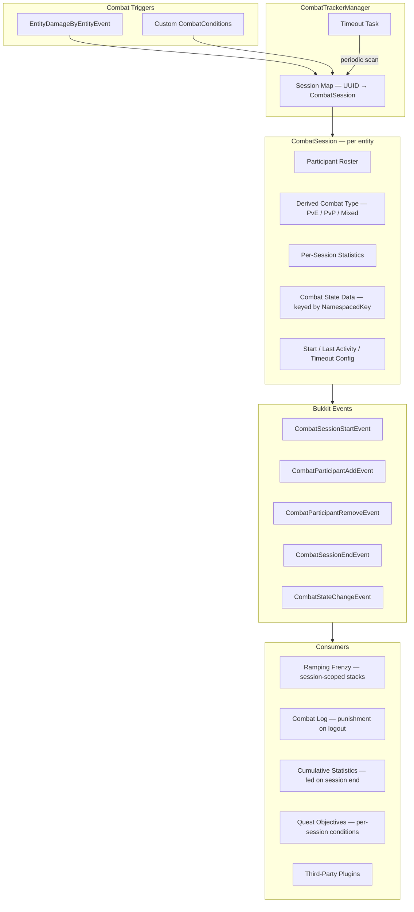
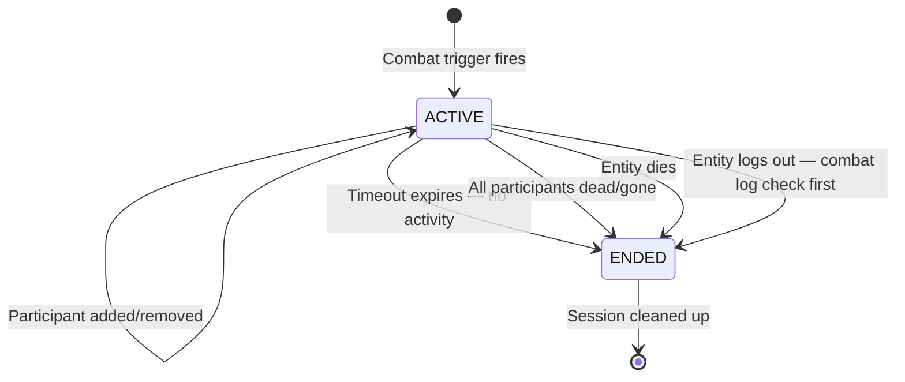
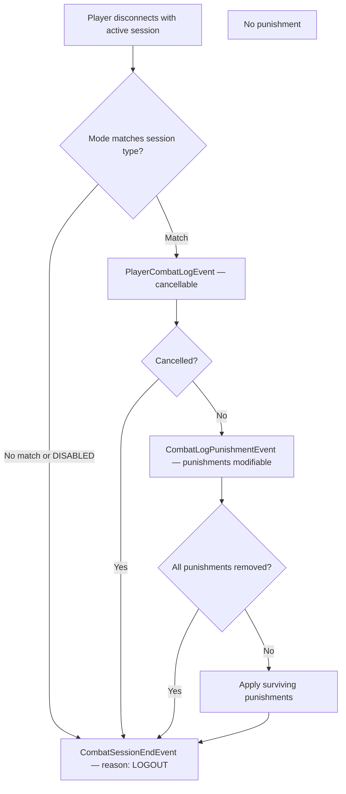
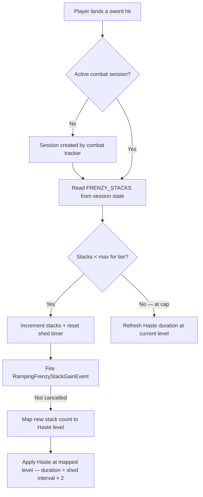
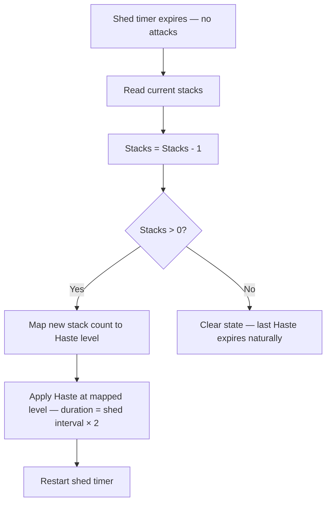

# Combat Tracker & Ramping Frenzy

> **Last Updated:** 2026-06-04
> **Status:** HLD — not yet implemented
> **Scope:** Per-entity combat session tracking, extensible combat state platform, combat log system, Ramping Frenzy ability

---

## Overview

The combat tracker is a **platform** for combat-aware features in McRPG. It provides a per-entity session model that tracks who each entity is fighting, how long they've been fighting, and what's happened during the fight. Abilities, statistics, quests, and third-party plugins build on top of it rather than rolling their own ad-hoc combat state (as BleedManager does today).

**Ramping Frenzy** is the first consumer: an innate passive Swords ability that grants ramping Haste potion effects as a player builds attack stacks during combat, with a wind-down cascade when stacks shed.

---

## Architecture Overview



---

## Core Concepts

### 1. Combat Session Model

Each entity that enters combat gets its own `CombatSession`. Sessions are **per-entity, not shared** — two players fighting each other each have their own session, each tracking the other as a participant. This avoids the complexity of session merging/splitting when engagements overlap.

```
Player A attacks Player B:
  A's session: participants={B}, type=PVP
  B's session: participants={A}, type=PVP

Player C attacks Player A:
  A's session: participants={B, C}, type=PVP
  C's session: participants={A}, type=PVP
  B's session: unchanged — {A}, type=PVP

Player B dies:
  B's session: ends (death)
  A's session: participants={C}, type=PVP
```

**Participant tracking** stores the entity's UUID, its classification (player or mob, with entity type for mobs), and a **per-participant last-interaction timestamp**. This timestamp is updated whenever the session owner and that specific participant interact (damage in either direction). If a participant's last-interaction time exceeds the session timeout without any new interaction, that participant is removed from the roster (fires `CombatParticipantRemoveEvent` with reason `TIMEOUT`) — even if the session itself is still active due to other participants.

```
Player A fights Player B and Mob 1:
  A's session: participants={B (3s ago), Mob1 (0.5s ago)}

8 seconds pass with A only attacking Mob 1:
  A's session: participants={Mob1 (0.5s ago)}
  → B timed out and was removed, session type transitions PVP → PVE
  → B's session also removes A if A timed out there
```

This keeps the roster honest — a player doesn't stay flagged as "in PvP" because they grazed someone 30 seconds ago.

The participant roster enables the derived `CombatType`:

| Roster contains | Derived type |
|-----------------|-------------|
| Only mobs | `PVE` |
| At least one player | `PVP` |

The derived type is recomputed whenever the participant roster changes. A session that starts as PvE and gains a player participant transitions to PvP.

### 2. Session Lifecycle



**Entry:** A session is created (or an existing one updated) when a combat trigger fires for an entity that either has no session or whose session should add a new participant. The primary trigger is `EntityDamageByEntityEvent`; custom `CombatCondition` implementations can provide additional triggers (see §5).

**Timeout:** Each combat event involving the entity resets a configurable inactivity timer (default: 8 seconds). When the timer expires with no new combat events, the session ends naturally.

**Hard stop:** If all participants in an entity's session are dead or otherwise invalid (despawned, unloaded, logged out), the session ends immediately without waiting for the timeout. There's no one left to fight.

**Death:** When an entity dies, their own session ends. They are also removed from the participant rosters of all other sessions that referenced them.

**Logout:** When a player logs out with an active session, the combat log system (§6) evaluates the session *before* cleanup. Then the session ends and the player is removed from other sessions' rosters.

### 3. Per-Session Statistics

Each `CombatSession` carries a lightweight statistics container that tracks values scoped to the current combat engagement. These reset when the session ends.

**Built-in per-session stats:**

| Statistic | Type | Description |
|-----------|------|-------------|
| `damage_dealt` | DOUBLE | Total damage dealt during this session |
| `damage_taken` | DOUBLE | Total damage taken during this session |
| `healing_dealt` | DOUBLE | Total healing applied to other entities during this session |
| `healing_received` | DOUBLE | Total healing received from other entities during this session |
| `hits_landed` | LONG | Attack count during this session |
| `hits_received` | LONG | Times hit during this session |
| `kills` | LONG | Entities killed during this session |
| `session_duration` | DOUBLE | Elapsed seconds (computed at query time) |

**Cumulative feed:** When a session ends, its final per-session stats can be folded into the entity's cumulative McCore statistics. For example, `damage_dealt` during the session increments the global `McRPGStatistic.DAMAGE_DEALT`. This happens via the `CombatSessionEndEvent`, so it's observable and cancellable by third parties.

**Third-party per-session stats:** Plugins can register custom per-session statistic keys via the combat tracker API. These follow the same lifecycle — tracked during the session, available for query, included in the end event for cumulative processing.

**Combat-adjacent interactions (healing):** Healing an ally does **not** create a combat session or add the healer as a participant — healers who choose non-aggressive actions shouldn't be punished by combat log detection. However, healing events that involve an entity with an active combat session still update stats:

- **Target has an active session:** `healing_received` is incremented on the target's session.
- **Healer has an active session (from their own combat):** `healing_dealt` is incremented on the healer's session.
- **Healer has no session:** The healing is not tracked as a per-session stat for the healer. Cumulative lifetime healing statistics can be tracked via the standard McCore statistics system independently of combat sessions.

This captures "healed an ally for X health in one combat" when the healer is also fighting (the common group PvE/PvP case), without forcing non-combatant healers into combat. A server that wants healing to trigger combat entry can achieve this via a custom `CombatCondition` (see §5c).

**Use cases:**
- Quest objectives: "Deal 500 damage in a single combat" — query `damage_dealt` from the active session
- Achievement triggers: "Get an Archery combo of 3 on 3 different players in one combat" — custom per-session stat tracking unique player archery combos
- Balance analytics: average combat duration, damage-per-session distributions

### 4. Combat State Data

Abilities and third-party plugins can attach **typed, keyed state** to a combat session. This is the mechanism that replaces ad-hoc managers like `BleedManager` — instead of each ability maintaining its own `Map<UUID, State>`, state rides on the combat session and gets automatic lifecycle management.

```java
// Keyed by NamespacedKey, typed via CombatStateType<T>
CombatStateType<Integer> FRENZY_STACKS = CombatStateType.of(
    new NamespacedKey("mcrpg", "ramping_frenzy_stacks"),
    Integer.class, 0  // default value
);

// Read/write during combat
session.getState(FRENZY_STACKS);              // → 0 (default)
session.setState(FRENZY_STACKS, 5);           // → 5
session.modifyState(FRENZY_STACKS, s -> s + 1); // → 6
```

**Lifecycle scoping:** State types declare their lifecycle at registration time:

| Scope | Behavior |
|-------|----------|
| `SESSION` | Cleared when the session ends. Default. Used for transient combat mechanics like Ramping Frenzy stacks. |
| `PERSISTENT` | Survives session boundaries. The combat tracker preserves the value and re-attaches it to the entity's next session. Used for cross-combat tracking like "times entered combat today." |

**Persistent state DAO:** The combat tracker provides automatic persistence for `PERSISTENT`-scoped state via a generic key-value table (`combat_persistent_state`: uuid, namespaced_key, serialized_value). Registrants declare a serializer/deserializer when creating their `CombatStateType<T>`, and the tracker handles save-on-session-end, load-on-session-start, and save-on-shutdown. This prevents every integration from rolling its own save/load boilerplate. The registrant is still responsible for cleanup policy (TTL, daily reset, etc.) — the tracker stores and loads, but doesn't know when data is stale.

```java
// Persistent state with automatic DAO handling
CombatStateType<Integer> COMBAT_COUNT = CombatStateType.persistent(
    new NamespacedKey("myplugin", "combats_today"),
    Integer.class,
    0,                              // default value
    Object::toString,               // serializer
    Integer::parseInt               // deserializer
);
combatTrackerManager.registerStateType(COMBAT_COUNT);
```

**Events:** `CombatStateChangeEvent` fires on every `setState` / `modifyState` call, carrying the old and new values. Third-party plugins can observe or cancel state transitions.

### 5. Third-Party Integration

The combat tracker is designed as an extensible platform with three integration surfaces:

#### 5a. Events

All session lifecycle transitions fire cancellable Bukkit events:

| Event | When | Cancellable | Key data |
|-------|------|-------------|----------|
| `CombatSessionStartEvent` | New session created | Yes — cancelling prevents combat entry | Entity, trigger source, initial participants |
| `CombatParticipantAddEvent` | New participant joins an existing session | Yes — cancelling prevents the add | Session owner, new participant, updated combat type |
| `CombatParticipantRemoveEvent` | Participant removed (death, logout, despawn, timeout) | No — informational | Session owner, removed participant, removal reason (`DEATH`, `LOGOUT`, `DESPAWN`, `TIMEOUT`) |
| `CombatSessionEndEvent` | Session ending | No — informational | Entity, final participants, session duration, per-session stats, all combat state data, end reason |
| `CombatStateChangeEvent` | Combat state data modified | Yes — cancelling prevents the state change | Session owner, state key, old value, new value |
| `PlayerCombatLogEvent` | Player logout detected as combat log | Yes — cancelling exempts the player from punishment | Player, session, derived combat type, participant roster |
| `CombatLogPunishmentEvent` | Punishments about to be applied for combat log | Individual punishments modifiable | Player, session, map of punishment type → enabled |

Third-party plugins listen to these at standard Bukkit event priorities.

#### 5b. Custom Combat State Registration

Plugins register `CombatStateType<T>` instances during their `onEnable` to attach arbitrary typed data to combat sessions. The combat tracker manages storage and lifecycle; the plugin reads/writes via the session API.

```java
// Registration (plugin onEnable)
CombatStateType<MyData> MY_STATE = CombatStateType.of(myKey, MyData.class, defaultValue);
combatTrackerManager.registerStateType(MY_STATE);

// Usage (event handlers, ability activation)
CombatSession session = combatTrackerManager.getSession(entityUUID);
session.setState(MY_STATE, newValue);
```

#### 5c. Custom Combat Conditions

Plugins can register `CombatCondition` implementations that define additional triggers for entering or sustaining combat beyond the default damage-event trigger:

```java
public interface CombatCondition {

    /**
     * @return The unique key identifying this condition.
     */
    @NotNull NamespacedKey getKey();

    /**
     * Evaluates whether the given entity should be considered
     * in combat due to this condition.
     *
     * @param entity The entity to evaluate.
     * @return {@code true} if this condition puts the entity in combat.
     */
    boolean isInCombat(@NotNull LivingEntity entity);

    /**
     * @return The participants implied by this condition, if any.
     *         Empty if the condition is proximity-based rather than
     *         entity-vs-entity.
     */
    @NotNull Set<UUID> getImpliedParticipants(@NotNull LivingEntity entity);
}
```

**Use cases:**
- Boss proximity: a plugin marks players as "in combat" when within 30 blocks of a boss mob
- Arena plugins: combat state forced while inside an arena region
- Aggro-based: mob has aggro on the player even without damage yet

Custom conditions are evaluated by the timeout task alongside the standard inactivity check. A session won't timeout while any registered condition still returns `true` for the entity.

### 6. Combat Log System

The combat tracker provides the data; the combat log system defines the **policy** for what happens when a player logs out during combat. The system uses a two-event model that separates **detection** from **punishment**, giving third-party plugins distinct hooks for each concern.

**Configuration:**

```yaml
# config.yml
combat:
  combat-log:
    mode: PLAYERS          # DISABLED, PLAYERS, MOBS_AND_PLAYERS
    punishment:
      kill-on-logout: true
      drop-items: true
      broadcast-message: true
```

| Mode | Behavior |
|------|----------|
| `DISABLED` | No combat log detection or punishment |
| `PLAYERS` | Only punish if the session's derived type is PvP (at least one player participant) |
| `MOBS_AND_PLAYERS` | Punish for any active combat session regardless of participant types |

**Event flow on logout with active session:**



| Event | Purpose | Cancellable | Key data |
|-------|---------|-------------|----------|
| `PlayerCombatLogEvent` | Detection — should this count as a combat log? | Yes — exempts the player entirely (staff, vanished, etc.) | Player, session, derived combat type, participant roster |
| `CombatLogPunishmentEvent` | Policy — what punishments apply? | Individual punishments are togglable | Player, session, map of punishment type → enabled. Plugins can disable `kill-on-logout` while keeping `broadcast-message`, or add custom punishments |

**Punishment extensibility:** Built-in punishments (kill, drop items, broadcast) cover common cases. Third-party plugins modify the punishment set in `CombatLogPunishmentEvent` or listen to `CombatSessionEndEvent` with reason `LOGOUT` for custom consequences (economy penalties, temporary bans, etc.).

### 7. Ramping Frenzy

Ramping Frenzy is an **innate passive** Swords ability — always active, no unlock gate, no mana cost. It rewards sustained aggression by granting escalating Haste as the player lands consecutive attacks, with a gradual wind-down when they stop.

#### Stack Mechanics

**Gaining stacks:** Each melee hit with a sword adds one stack (global — any target, not per-target). The stack count is stored as session-scoped combat state via `CombatStateType<Integer>`.

**Stack shed model:** When the player stops attacking, stacks decay one at a time on a configurable interval (e.g., one stack lost every 1.5 seconds of inactivity). Each attack resets the shed timer. This creates a "maintain your tempo" dynamic — brief pauses are forgiven, but extended lulls erode your stacks.

**Wind-down — continuous Haste with smooth downgrade:** Rather than discrete pulses on each stack shed, Ramping Frenzy maintains a **continuous Haste effect** that downgrades smoothly as stacks decay. Paper's potion effect system supports multiple effects on the same player — only the highest level and longest remaining duration is displayed and applied. The ability leverages this:

- **While attacking:** Each hit applies Haste at the current stack-mapped level with a duration of `shed_interval × 2` (overlap buffer). Refreshed on every hit, so the effect never flickers during active combat.
- **On stack shed:** The shed applies Haste at the **new** (potentially lower) level with the same overlap duration. If a higher-level Haste from the previous state hasn't expired yet, Paper naturally shows the higher one until it runs out, then the lower one takes over seamlessly.
- **On stacks reaching 0 or session end:** No new Haste is applied. The last applied effect expires naturally within one shed interval — short enough to not linger.

```
Example — player at 10 stacks stops attacking (shed interval: 1.5s):

  t=0s:   10 stacks → Haste IV active (applied with 3s duration)
  t=1.5s:  9 stacks → Haste III applied (3s duration). Paper still shows IV (1.5s left)
  t=3.0s:  8 stacks → Haste III applied. Previous IV expired → III now displayed
  t=4.5s:  7 stacks → Haste III applied (still in III range)
  t=6.0s:  6 stacks → Haste II applied. III has 1.5s left → III shown briefly
  ...
  t=19.5s: 1 stack  → Haste I applied
  t=21.0s: 0 stacks → nothing applied. Last Haste I expires within 3s
```

This creates the Warwick/Lethal Tempo-style ramp-down: the effect fades gradually through each Haste tier rather than vanishing abruptly. No flicker, no jarring re-application — Paper handles the display priority natively.

#### Haste Tier Mapping

Stack count maps to Haste level in groups of 3, scaling up to Haste V:

| Stack range | Haste level | Fantasy |
|-------------|-------------|---------|
| 1–3 | Haste I | Warming up |
| 4–6 | Haste II | Finding rhythm |
| 7–9 | Haste III | In the zone |
| 10–12 | Haste IV | Berserking |
| 13–15 | Haste V | Full frenzy |

These thresholds, the max stack count, and the Haste levels are all configurable via Parser formulas in the Swords config.

#### Tier Progression

Ability tiers gate how high the player can climb the Haste ladder:

| Axis | T1 | T2 | T3 | T4 | T5 | Config key |
|------|-----|-----|-----|-----|-----|------------|
| Max stacks | 6 | 9 | 11 | 13 | 15 | `max-stacks` |
| Max Haste reachable | II | III | III (nearly IV) | IV (nearly V) | V | (derived from max stacks) |
| Shed interval | 1.0s | 1.1s | 1.2s | 1.35s | 1.5s | `shed-interval` |

At T1, the player caps at 6 stacks (Haste II) and stacks decay quickly — a taste of the mechanic. By T5, the full 15-stack Haste V is reachable with a generous 1.5s shed interval, rewarding sustained aggression with a dramatic combat speed boost. This makes tier progression feel like mastery — higher-tier players sustain the frenzy more easily and reach higher peaks.

#### Activation Flow





#### Combat Session Integration

Ramping Frenzy registers a `SESSION`-scoped `CombatStateType<Integer>` for its stack count. When the combat session ends (death, timeout, logout), the stacks are automatically cleared — no manual cleanup needed. The shed task cancels itself when it detects the session is gone. The last applied Haste effect expires naturally within one overlap window.

This replaces what would otherwise be a `RampingFrenzyManager` with a `Map<UUID, Integer>` and manual cleanup on quit/death/world-change — exactly the ad-hoc pattern the combat tracker is designed to eliminate.

---

## Configuration

### Combat Tracker

```yaml
# config.yml
combat:
  session:
    timeout-seconds: 8              # Inactivity before session ends
    condition-check-interval: 20    # Ticks between custom condition evaluations
  combat-log:
    mode: PLAYERS                   # DISABLED, PLAYERS, MOBS_AND_PLAYERS
    punishment:
      kill-on-logout: true
      drop-items: true
      broadcast-message: true
  per-session-statistics:
    feed-to-cumulative: true        # Fold session stats into global stats on end
```

### Ramping Frenzy

```yaml
# swords_configuration.yml
ability-configuration:
  ramping-frenzy:
    enabled: true
    amount-of-tiers: 5
    stacks-per-haste-level: 3        # 3 stacks = one Haste tier
    tier-configuration:
      all-tiers:
        max-stacks: "3+(2.4*tier)"    # T1=6, T2=8, T3=10, T4=13, T5=15
        shed-interval: "0.9+(0.12*tier)"  # T1=1.0s, T5=1.5s
      tier-1:
        max-stacks: 6
      tier-2:
        max-stacks: 9
      tier-3:
        max-stacks: 11
      tier-4:
        max-stacks: 13
      tier-5:
        max-stacks: 15
```

---

## Extension Points Summary

| Extension | Mechanism | Use case |
|-----------|-----------|----------|
| Custom combat triggers | Register `CombatCondition` | Boss proximity, arena regions, healing-as-combat |
| Custom session state | Register `CombatStateType<T>` with `SESSION` or `PERSISTENT` scope | Ability stacks, combo counters, buff tracking |
| Persistent state storage | Declare serializer on `CombatStateType`; tracker handles DAO | Cross-combat tracking without custom tables |
| Session lifecycle hooks | Listen to `CombatSession*Event` | Analytics, combat log plugins, UI overlays |
| Combat log detection | Listen to `PlayerCombatLogEvent` | Staff exemption, vanish integration |
| Combat log punishment | Listen to `CombatLogPunishmentEvent` | Modify/add/remove individual punishments |
| Custom per-session statistics | Register stat keys via combat tracker API | Plugin-specific combat metrics |
| Ramping Frenzy interaction | Listen to `RampingFrenzyStackGainEvent` | Synergy abilities, UI feedback |

---

## Resolved Design Decisions

### Per-Entity Sessions (Not Shared)

**Decision:** Each entity has its own `CombatSession` with its own participant roster, rather than a single shared session object that all combatants point to.

**Why:** Shared sessions require merging when two independent fights collide (A fights B, C fights D, then C attacks A — merge into one session?) and splitting when sub-groups disengage. Merge/split logic is complex and creates unintuitive side effects: B becomes "in combat with" D even though they never interacted. Per-entity sessions avoid this entirely. Each entity's session is their own view of who they're fighting.

**Trade-off:** Answering "who was in this whole battle?" requires graph traversal across sessions rather than reading one roster. A utility method (`getConnectedCombatants(UUID)`) can provide this on demand without the complexity of maintaining shared sessions as the source of truth.

### Combat Type Derived, Not Declared

**Decision:** A session's combat type (PvE, PvP) is derived from the participant roster, not declared at creation time.

**Why:** A fight can start as PvE (player vs mob) and become PvP when another player joins. Deriving the type from the current roster means it's always accurate without explicit transition logic.

### State Scoping Over Uniform Lifetime

**Decision:** Combat state data supports both `SESSION` (auto-cleared) and `PERSISTENT` (survives session boundaries) scopes, rather than forcing all state to end with the session.

**Why:** Most combat state is transient (Ramping Frenzy stacks, active buffs), but some cross-combat tracking is valuable ("times entered combat today," "total PvP sessions this week"). Persistent state still requires the registrant to manage its own cleanup (TTL, daily reset), but the combat tracker provides the storage and attachment mechanism.

### Combat Tracker in McRPG, Not McCore

**Decision:** The combat tracker lives in `us.eunoians.mcrpg.combat`, not in McCore.

**Why:** The combat tracker is tightly coupled to McRPG's entity model (`AbilityHolder`, `McRPGPlayer`), ability system, and content expansion pattern. While it's extensible by third-party plugins, those plugins are extending *McRPG*, not building unrelated products. McCore is for abstractions that multiple independent plugins share.

### Per-Participant Timeout (Not Session-Wide Only)

**Decision:** Each participant in a session has its own last-interaction timestamp. Participants that haven't interacted with the session owner past the timeout are individually removed, even if the session is still active with other participants.

**Why:** Without per-participant timeout, a player who grazes an opponent in PvP and then fights mobs for 30 seconds stays flagged as "in PvP" because the player participant is still in the roster. Per-participant timeout keeps the roster honest and the derived combat type accurate. This directly affects combat log punishment — a player shouldn't be punished for "PvP combat logging" when their only player interaction was 30 seconds ago.

### Healing Does Not Trigger Combat

**Decision:** Healing an ally does not create a combat session or add the healer as a participant. Healing stats are tracked on existing sessions but don't trigger new ones.

**Why:** Healers chose a non-aggressive action. Forcing them into combat because they healed a friend who was fighting creates unintuitive combat log punishment for medic-style players. However, healing stats (`healing_dealt`, `healing_received`) are still tracked on any existing sessions — the common case (healer is also fighting) gets full coverage. Servers that want healing to trigger combat can register a custom `CombatCondition`.

### Tracker-Managed DAO for Persistent State

**Decision:** The combat tracker provides automatic persistence for `PERSISTENT`-scoped state via a generic key-value table, rather than expecting each integration to handle its own DAO.

**Why:** Every persistent state consumer would otherwise reimplement the same save-on-shutdown, load-on-login, session-boundary-transfer boilerplate. The tracker already owns the lifecycle — centralizing persistence avoids duplicate code and ensures consistent save timing. Registrants just provide a serializer/deserializer; the tracker does the rest.

### Two-Event Combat Log Model

**Decision:** Combat log detection (`PlayerCombatLogEvent`) and punishment (`CombatLogPunishmentEvent`) are separate events, rather than a single combined event.

**Why:** Different plugins need different hooks. A vanish plugin needs to exempt players from detection entirely — cancelling `PlayerCombatLogEvent`. An economy plugin needs to modify punishments — adding a gold penalty in `CombatLogPunishmentEvent` while keeping the built-in kill-on-logout. Combining these into one event forces plugins to inspect and manipulate both concerns simultaneously.

### Stack Shed Model (Not Hard Reset)

**Decision:** Ramping Frenzy stacks decay one at a time on a timer, rather than all stacks expiring at once after a flat duration.

**Why:** The shed model creates a "maintain your tempo" dynamic with a gradual wind-down. This feels like momentum fading rather than a binary on/off switch. It rewards players who keep up pressure and creates a satisfying wind-down when they disengage — inspired by League of Legends' Lethal Tempo / Warwick's attack speed ramping.

### Continuous Haste via Paper Potion Stacking (Not Discrete Pulses)

**Decision:** Ramping Frenzy maintains a continuous Haste effect that downgrades smoothly as stacks shed, rather than applying discrete short pulses on each shed event.

**Why:** Rapid short Haste pulses (e.g., 0.75s each) are jarring and hard for players to read — the effect flickers and there's no intuitive way to tell how many stacks remain. Paper's potion system supports multiple concurrent effects, displaying only the highest level and longest remaining duration. By applying overlapping Haste effects with duration = `shed_interval × 2`, level transitions happen seamlessly: the old higher-level effect naturally expires and the lower one takes over. The player reads their current Haste level from the vanilla potion effect indicator — no custom HUD element needed.

---

## Open Questions

1. **Participant capacity:** Should sessions have a max participant count to prevent degenerate cases (e.g., a mob farm with 50 entities)? A cap (or tiered tracking — full tracking for players, lightweight for mobs) might be needed for performance.

2. **Projectile attribution:** When a player shoots an arrow that hits a mob 3 seconds later, the `EntityDamageByEntityEvent` damager is the arrow (Projectile), not the player. The combat tracker needs to resolve the shooter via `Projectile.getShooter()`. This is straightforward but worth calling out — any custom `CombatCondition` that works with ranged attacks needs the same resolution.

3. **AoE and indirect damage:** If Player A's Bleed DOT is ticking on Mob 1, does that count as ongoing combat activity (resetting A's timeout), or only direct attacks? Leaning toward yes — the DOT is A's active effect — but this means Bleed (and future DOTs) need to carry attribution back to the source player.

4. **Session persistence across server restarts:** Do active combat sessions survive a server restart/reload? Leaning toward no — sessions are transient in-memory state. A restart clears all sessions. Combat log punishment would need to handle the edge case of a crash during combat separately (probably outside scope).

5. **Display integration:** Should there be any visual indicator that a player is "in combat" (e.g., a subtitle message, sound cue on combat enter/exit)? This would help players know when it's safe to log out. Not blocking for the combat tracker itself, but a natural follow-up.
