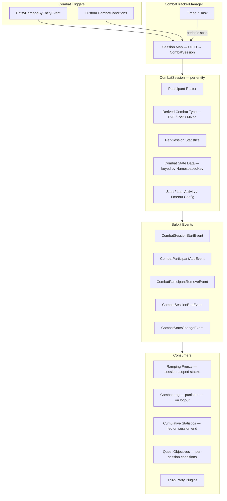
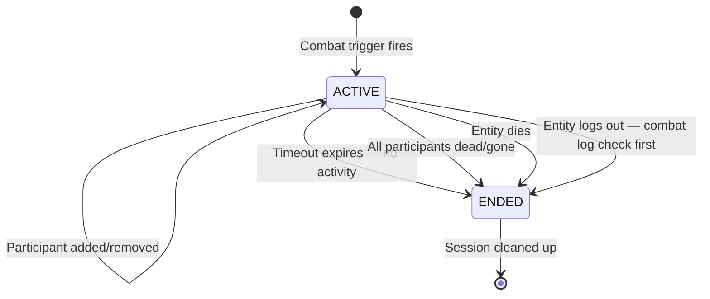
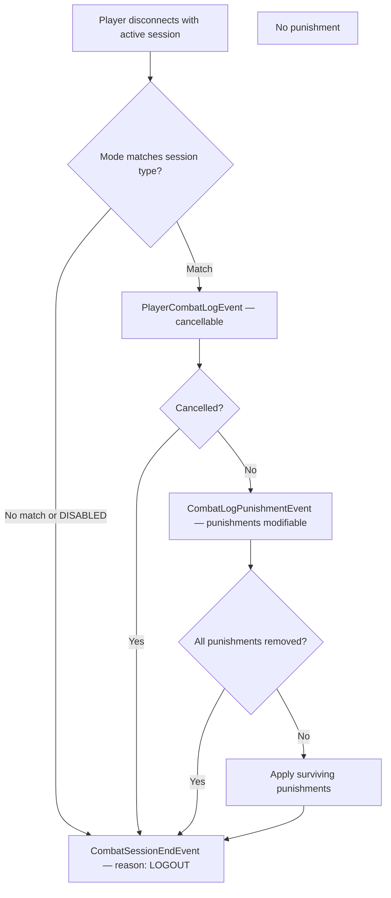
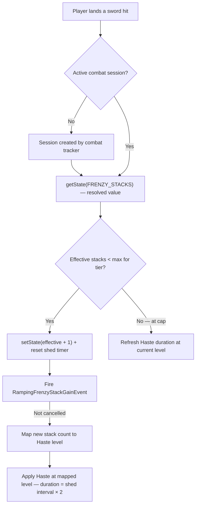
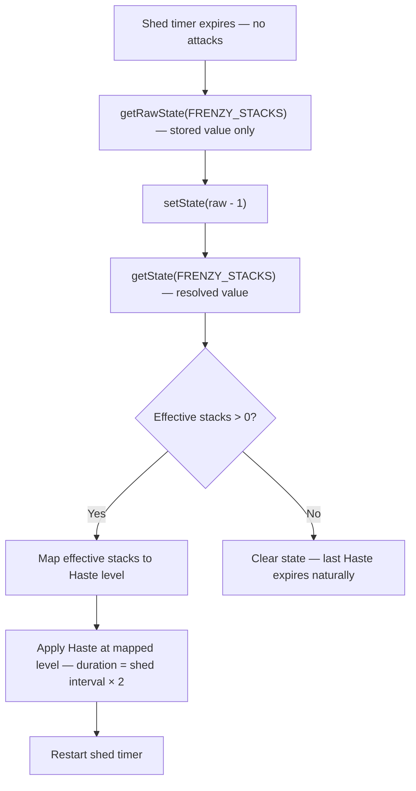
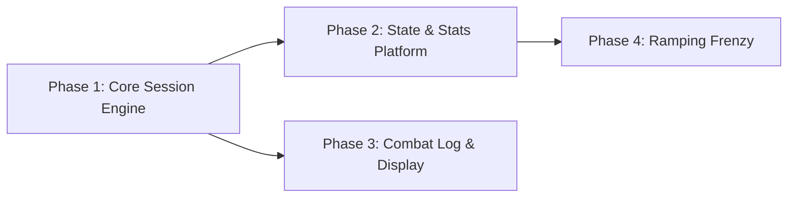

# Combat Tracker & Ramping Frenzy

> **Last Updated:** 2026-06-16
> **Status:** HLD — not yet implemented
> **Scope:** Per-entity combat session tracking, extensible combat state platform, combat log system, Ramping Frenzy ability

---

## Overview

The combat tracker is a **platform** for combat-aware features in McRPG. It provides a per-entity session model that tracks who each entity is fighting, how long they've been fighting, and what's happened during the fight. Abilities, statistics, quests, and third-party plugins build on top of it rather than rolling their own ad-hoc combat state (as BleedManager does today).

**Ramping Frenzy** is the first consumer: an innate passive Swords ability that grants ramping Haste potion effects as a player builds attack stacks during combat, with a wind-down cascade when stacks shed.

---

## Architecture Overview



---

## Core Concepts

### 1. Combat Session Model

Each entity that enters combat gets its own `CombatSession`. Sessions are **per-entity, not shared** — two players fighting each other each have their own session, each tracking the other as a participant. This avoids the complexity of session merging/splitting when engagements overlap.

```
Player A attacks Player B:
  A's session: participants={B}, type=PVP
  B's session: participants={A}, type=PVP

Player C attacks Player A:
  A's session: participants={B, C}, type=PVP
  C's session: participants={A}, type=PVP
  B's session: unchanged — {A}, type=PVP

Player B dies:
  B's session: ends (death)
  A's session: participants={C}, type=PVP
```

**Participant tracking** stores the entity's UUID, its classification (player or mob, with entity type for mobs), and a **per-participant last-interaction timestamp**. This timestamp is updated whenever the session owner and that specific participant interact (damage in either direction). If a participant's last-interaction time exceeds the session timeout without any new interaction, that participant is removed from the roster (fires `CombatParticipantRemoveEvent` with reason `TIMEOUT`) — even if the session itself is still active due to other participants.

**Participant capacity:** Player participant slots are **unlimited** — every player interaction is tracked to ensure complete PvP attribution and combat log coverage. Mob participant slots use a configurable **FIFO queue** (default: 16). When the queue is full, the oldest mob participant is evicted to make room for the newest. If an evicted mob is still actively fighting, the next damage event re-adds it immediately — FIFO naturally prioritizes recent combatants. This prevents degenerate cases like mob farms from unbounded roster growth while keeping the mob roster fresh.

```
Player A fights Player B and Mob 1:
  A's session: participants={B (3s ago), Mob1 (0.5s ago)}

8 seconds pass with A only attacking Mob 1:
  A's session: participants={Mob1 (0.5s ago)}
  → B timed out and was removed, session type transitions PVP → PVE
  → B's session also removes A if A timed out there
```

This keeps the roster honest — a player doesn't stay flagged as "in PvP" because they grazed someone 30 seconds ago.

The participant roster enables the derived `CombatType`:

| Roster contains | Derived type |
|-----------------|-------------|
| Only mobs | `PVE` |
| At least one player | `PVP` |

The derived type is recomputed whenever the participant roster changes. A session that starts as PvE and gains a player participant transitions to PvP.

### 2. Session Lifecycle



**Entry:** A session is created (or an existing one updated) when a combat trigger fires for an entity that either has no session or whose session should add a new participant. The primary trigger is `EntityDamageByEntityEvent`; custom `CombatCondition` implementations can provide additional triggers (see §5).

**Projectile resolution:** When the damager is a `Projectile`, the combat tracker resolves the source entity via `Projectile.getShooter()`. McRPG sets a PDC timestamp on projectiles at fire time, enabling downstream consumers (combo abilities, timing-based scaling) to access flight time and launch ordering.

**DOT and indirect damage attribution:** Damage-over-time effects (Bleed, future DOTs) and AoE splash damage carry the source player's UUID and count as ongoing combat activity — they reset the source's session timeout and maintain the participant relationship. The combat tracker doesn't distinguish direct from indirect damage; it only needs the source UUID.

**Timeout:** Each combat event involving the entity resets a configurable inactivity timer (default: 8 seconds). When the timer expires with no new combat events, the session ends naturally.

**Hard stop:** If all participants in an entity's session are dead or otherwise invalid (despawned, unloaded, logged out), the session ends immediately without waiting for the timeout. There's no one left to fight.

**Death:** When an entity dies, their own session ends. They are also removed from the participant rosters of all other sessions that referenced them.

**Logout:** When a player logs out with an active session, the combat log system (§6) evaluates the session *before* cleanup. Then the session ends and the player is removed from other sessions' rosters.

### 3. Per-Session Statistics

Each `CombatSession` carries a lightweight statistics container that tracks values scoped to the current combat engagement. These reset when the session ends.

**Built-in per-session stats:**

| Statistic | Type | Description |
|-----------|------|-------------|
| `damage_dealt` | DOUBLE | Total damage dealt during this session |
| `damage_taken` | DOUBLE | Total damage taken during this session |
| `healing_dealt` | DOUBLE | Total healing applied to other entities during this session |
| `healing_received` | DOUBLE | Total healing received from other entities during this session |
| `hits_landed` | LONG | Attack count during this session |
| `hits_received` | LONG | Times hit during this session |
| `kills` | LONG | Entities killed during this session |
| `session_duration` | DOUBLE | Elapsed seconds (computed at query time) |

**Cumulative feed:** When a session ends, its final per-session stats can be folded into the entity's cumulative McCore statistics. For example, `damage_dealt` during the session increments the global `McRPGStatistic.DAMAGE_DEALT`. This happens via the `CombatSessionEndEvent`, so it's observable and cancellable by third parties.

**Third-party per-session stats:** Plugins can register custom per-session statistic keys via the combat tracker API. These follow the same lifecycle — tracked during the session, available for query, included in the end event for cumulative processing.

**Combat-adjacent interactions (healing):** Healing an ally does **not** create a combat session or add the healer as a participant — healers who choose non-aggressive actions shouldn't be punished by combat log detection. However, healing events that involve an entity with an active combat session still update stats:

- **Target has an active session:** `healing_received` is incremented on the target's session.
- **Healer has an active session (from their own combat):** `healing_dealt` is incremented on the healer's session.
- **Healer has no session:** The healing is not tracked as a per-session stat for the healer. Cumulative lifetime healing statistics can be tracked via the standard McCore statistics system independently of combat sessions.

This captures "healed an ally for X health in one combat" when the healer is also fighting (the common group PvE/PvP case), without forcing non-combatant healers into combat. A server that wants healing to trigger combat entry can achieve this via a custom `CombatCondition` (see §5c).

**Use cases:**
- Quest objectives: "Deal 500 damage in a single combat" — query `damage_dealt` from the active session
- Achievement triggers: "Get an Archery combo of 3 on 3 different players in one combat" — custom per-session stat tracking unique player archery combos
- Balance analytics: average combat duration, damage-per-session distributions

### 4. Combat State Data

Abilities and third-party plugins can attach **typed, keyed state** to a combat session. This is the mechanism that replaces ad-hoc managers like `BleedManager` — instead of each ability maintaining its own `Map<UUID, State>`, state rides on the combat session and gets automatic lifecycle management.

```java
// Simple state — no resolver, raw value returned directly
CombatStateType<Integer> HIT_STREAK = CombatStateType.of(
    new NamespacedKey("mcrpg", "hit_streak"),
    Integer.class, 0  // default value
);

// Read/write during combat
session.getState(HIT_STREAK);              // → 0 (default)
session.setState(HIT_STREAK, 5);           // → 5
session.modifyState(HIT_STREAK, s -> s + 1); // → 6
```

**Resolved state types:** A `CombatStateType<T>` can optionally declare a `CombatStateResolver<T>` — a function that computes the **effective** value from the raw stored value plus external context (the session, the entity's current state). When a resolver is present:

- `getState(type)` returns the **resolved** value — the resolver's output
- `getRawState(type)` returns the **stored** value — what was last written via `setState`
- `setState(type, value)` writes to raw storage only — the resolver is not involved in writes

This follows the same pattern as `PlayerStatInstance.getEffectiveMax()`, which computes base + modifiers on read rather than storing the computed value.

```java
// Resolved state — effective value computed on every read
CombatStateType<Integer> FRENZY_STACKS = CombatStateType.resolved(
    new NamespacedKey("mcrpg", "ramping_frenzy_stacks"),
    Integer.class, 0,
    (session, rawStacks) -> {
        int hasteFloor = computeFloorFromActiveHaste(session.getEntityUUID());
        return Math.max(rawStacks, hasteFloor);
    }
);

// Caller always gets the effective value — no manual floor checks needed
session.getState(FRENZY_STACKS);     // → max(stored, haste floor)
session.getRawState(FRENZY_STACKS);  // → just the stored value
```

**Design:** Resolvers are pure functions of (session, rawValue) → effectiveValue. They must be side-effect-free — reads should never mutate state. The resolver runs on every `getState()` call, so it should be lightweight (checking active potion effects is O(1) in Paper).

Most state types don't need a resolver — `CombatStateType.of(...)` creates a simple type where `getState()` returns the raw value directly. Only types where external factors influence the effective value declare one via `CombatStateType.resolved(...)`.

**Lifecycle scoping:** State types declare their lifecycle at registration time:

| Scope | Behavior |
|-------|----------|
| `SESSION` | Cleared when the session ends. Default. Used for transient combat mechanics like Ramping Frenzy stacks. |
| `PERSISTENT` | Survives session boundaries. The combat tracker preserves the value and re-attaches it to the entity's next session. Used for cross-combat tracking like "times entered combat today." |

**Persistent state DAO:** The combat tracker provides automatic persistence for `PERSISTENT`-scoped state via a generic key-value table (`combat_persistent_state`: uuid, namespaced_key, serialized_value). Registrants declare a serializer/deserializer when creating their `CombatStateType<T>`, and the tracker handles save-on-session-end, load-on-session-start, and save-on-shutdown. This prevents every integration from rolling its own save/load boilerplate. The registrant is still responsible for cleanup policy (TTL, daily reset, etc.) — the tracker stores and loads, but doesn't know when data is stale.

```java
// Persistent state with automatic DAO handling
CombatStateType<Integer> COMBAT_COUNT = CombatStateType.persistent(
    new NamespacedKey("myplugin", "combats_today"),
    Integer.class,
    0,                              // default value
    Object::toString,               // serializer
    Integer::parseInt               // deserializer
);
combatTrackerManager.registerStateType(COMBAT_COUNT);
```

**Events:** `CombatStateChangeEvent` fires on every `setState` / `modifyState` call, carrying the old and new values. Third-party plugins can observe or cancel state transitions.

### 5. Third-Party Integration

The combat tracker is designed as an extensible platform with three integration surfaces:

#### 5a. Events

All session lifecycle transitions fire cancellable Bukkit events:

| Event | When | Cancellable | Key data |
|-------|------|-------------|----------|
| `CombatSessionStartEvent` | New session created | Yes — cancelling prevents combat entry | Entity, trigger source, initial participants |
| `CombatParticipantAddEvent` | New participant joins an existing session | Yes — cancelling prevents the add | Session owner, new participant, updated combat type |
| `CombatParticipantRemoveEvent` | Participant removed (death, logout, despawn, timeout) | No — informational | Session owner, removed participant, removal reason (`DEATH`, `LOGOUT`, `DESPAWN`, `TIMEOUT`) |
| `CombatSessionEndEvent` | Session ending | No — informational | Entity, final participants, session duration, per-session stats, all combat state data, end reason |
| `CombatStateChangeEvent` | Combat state data modified | Yes — cancelling prevents the state change | Session owner, state key, old value, new value |
| `PlayerCombatLogEvent` | Player logout detected as combat log | Yes — cancelling exempts the player from punishment | Player, session, derived combat type, participant roster |
| `CombatLogPunishmentEvent` | Punishments about to be applied for combat log | Individual punishments modifiable | Player, session, map of punishment type → enabled |

Third-party plugins listen to these at standard Bukkit event priorities.

#### 5b. Custom Combat State Registration

`CombatStateType<T>` instances are registered via `CombatStateTypeContentPack` in a `ContentExpansion`, following the same pattern as `QuestObjectiveTypeContentPack`, `QuestRewardTypeContentPack`, etc. Standalone plugins that depend on McRPG but don't use the expansion system can register directly via the `CombatTrackerManager` API.

```java
// Via ContentExpansion (preferred for expansions)
@Override
public @NotNull CombatStateTypeContentPack getCombatStateTypeContent() {
    CombatStateTypeContentPack pack = new CombatStateTypeContentPack(this);
    pack.addContent(MY_STATE_TYPE);
    return pack;
}

// Direct registration (standalone plugins)
CombatStateType<MyData> MY_STATE = CombatStateType.of(myKey, MyData.class, defaultValue);
combatTrackerManager.registerStateType(MY_STATE);

// Usage (event handlers, ability activation)
CombatSession session = combatTrackerManager.getSession(entityUUID);
session.setState(MY_STATE, newValue);
```

#### 5c. Custom Combat Conditions

`CombatCondition` implementations are registered via `CombatConditionContentPack` in a `ContentExpansion`. Standalone plugins can register directly via the `CombatTrackerManager` API.

```java
// Via ContentExpansion (preferred for expansions)
@Override
public @NotNull CombatConditionContentPack getCombatConditionContent() {
    CombatConditionContentPack pack = new CombatConditionContentPack(this);
    pack.addContent(new BossProximityCondition());
    return pack;
}
```

```java
public interface CombatCondition {

    /**
     * @return The unique key identifying this condition.
     */
    @NotNull NamespacedKey getKey();

    /**
     * Evaluates whether the given entity should be considered
     * in combat due to this condition.
     *
     * @param entity The entity to evaluate.
     * @return {@code true} if this condition puts the entity in combat.
     */
    boolean isInCombat(@NotNull LivingEntity entity);

    /**
     * @return The participants implied by this condition, if any.
     *         Empty if the condition is proximity-based rather than
     *         entity-vs-entity.
     */
    @NotNull Set<UUID> getImpliedParticipants(@NotNull LivingEntity entity);
}
```

**Use cases:**
- Boss proximity: a plugin marks players as "in combat" when within 30 blocks of a boss mob
- Arena plugins: combat state forced while inside an arena region
- Aggro-based: mob has aggro on the player even without damage yet
- Healing-as-combat: server owner wants healers to enter combat when healing combatants

Custom conditions are evaluated by the timeout task alongside the standard inactivity check. A session won't timeout while any registered condition still returns `true` for the entity.

### 6. Combat Log System

The combat tracker provides the data; the combat log system defines the **policy** for what happens when a player logs out during combat. The system uses a two-event model that separates **detection** from **punishment**, giving third-party plugins distinct hooks for each concern.

**Configuration:**

```yaml
# config.yml
combat:
  combat-log:
    mode: PLAYERS          # DISABLED, PLAYERS, MOBS_AND_PLAYERS
    punishment:
      kill-on-logout: true
      drop-items: true
      broadcast-message: true
```

| Mode | Behavior |
|------|----------|
| `DISABLED` | No combat log detection or punishment |
| `PLAYERS` | Only punish if the session's derived type is PvP (at least one player participant) |
| `MOBS_AND_PLAYERS` | Punish for any active combat session regardless of participant types |

**Event flow on logout with active session:**



| Event | Purpose | Cancellable | Key data |
|-------|---------|-------------|----------|
| `PlayerCombatLogEvent` | Detection — should this count as a combat log? | Yes — exempts the player entirely (staff, vanished, etc.) | Player, session, derived combat type, participant roster |
| `CombatLogPunishmentEvent` | Policy — what punishments apply? | Individual punishments are togglable | Player, session, map of punishment type → enabled. Plugins can disable `kill-on-logout` while keeping `broadcast-message`, or add custom punishments |

**Punishment extensibility:** Built-in punishments (kill, drop items, broadcast) cover common cases. Third-party plugins modify the punishment set in `CombatLogPunishmentEvent` or listen to `CombatSessionEndEvent` with reason `LOGOUT` for custom consequences (economy penalties, temporary bans, etc.).

**Combat log audit trail:** All combat log punishments are persisted via `CombatLogDAO` for server owner review. Each record stores:

| Column | Type | Description |
|--------|------|-------------|
| `id` | LONG | Auto-increment primary key |
| `player_uuid` | UUID | The player who combat logged |
| `timestamp` | TIMESTAMP | When the logout occurred |
| `world` | STRING | World name at time of logout |
| `x`, `y`, `z` | DOUBLE | Location coordinates at time of logout |
| `combat_type` | STRING | Derived session type (`PVE` or `PVP`) at time of logout |
| `participant_uuids` | STRING | Comma-separated UUIDs of participants at time of logout |
| `punishments_applied` | STRING | Comma-separated punishment types that were applied |

**Admin command:** `/mcrpg combatlog <player> [page]` displays a paginated history of a player's combat log incidents. Each entry shows the timestamp, combat type, and a clickable location (MiniMessage `<click:run_command:'/tp ...'>`) that teleports staff to the spot. This gives server owners a concrete audit trail when players dispute combat log punishments.

### 7. Ramping Frenzy

Ramping Frenzy is an **innate passive** Swords ability — always active, no unlock gate, no mana cost. It rewards sustained aggression by granting escalating Haste as the player lands consecutive attacks, with a gradual wind-down when they stop.

#### Stack Mechanics

**Gaining stacks:** Each melee hit with a sword adds one stack (global — any target, not per-target). The stack count is stored as session-scoped combat state via a **resolved** `CombatStateType<Integer>` — the resolver computes the effective stack count as `max(storedStacks, floorFromActiveHaste)`, so external Haste sources automatically participate without callers needing to check (see §4 and External Haste Seeding below).

**Stack shed model:** When the player stops attacking, stacks decay one at a time on a configurable interval (e.g., one stack lost every 1.5 seconds of inactivity). Each attack resets the shed timer. This creates a "maintain your tempo" dynamic — brief pauses are forgiven, but extended lulls erode your stacks.

**Wind-down — continuous Haste with smooth downgrade:** Rather than discrete pulses on each stack shed, Ramping Frenzy maintains a **continuous Haste effect** that downgrades smoothly as stacks decay. Paper's potion effect system supports multiple effects on the same player — only the highest level and longest remaining duration is displayed and applied. The ability leverages this:

- **While attacking:** Each hit applies Haste at the current stack-mapped level with a duration of `shed_interval × 2` (overlap buffer). Refreshed on every hit, so the effect never flickers during active combat.
- **On stack shed:** The shed applies Haste at the **new** (potentially lower) level with the same overlap duration. If a higher-level Haste from the previous state hasn't expired yet, Paper naturally shows the higher one until it runs out, then the lower one takes over seamlessly.
- **On stacks reaching 0 or session end:** No new Haste is applied. The last applied effect expires naturally within one shed interval — short enough to not linger.

```
Example — player at 10 stacks stops attacking (shed interval: 1.5s):

  t=0s:   10 stacks → Haste IV active (applied with 3s duration)
  t=1.5s:  9 stacks → Haste III applied (3s duration). Paper still shows IV (1.5s left)
  t=3.0s:  8 stacks → Haste III applied. Previous IV expired → III now displayed
  t=4.5s:  7 stacks → Haste III applied (still in III range)
  t=6.0s:  6 stacks → Haste II applied. III has 1.5s left → III shown briefly
  ...
  t=19.5s: 1 stack  → Haste I applied
  t=21.0s: 0 stacks → nothing applied. Last Haste I expires within 3s
```

This creates the Warwick/Lethal Tempo-style ramp-down: the effect fades gradually through each Haste tier rather than vanishing abruptly. No flicker, no jarring re-application — Paper handles the display priority natively.

#### Haste Tier Mapping

Stack count maps to Haste level in groups of 3, scaling up to Haste V:

| Stack range | Haste level | Fantasy |
|-------------|-------------|---------|
| 1–3 | Haste I | Warming up |
| 4–6 | Haste II | Finding rhythm |
| 7–9 | Haste III | In the zone |
| 10–12 | Haste IV | Berserking |
| 13–15 | Haste V | Full frenzy |

These thresholds, the max stack count, and the Haste levels are all configurable via Parser formulas in the Swords config.

#### Tier Progression

Ability tiers gate how high the player can climb the Haste ladder:

| Axis | T1 | T2 | T3 | T4 | T5 | Config key |
|------|-----|-----|-----|-----|-----|------------|
| Max stacks | 6 | 9 | 11 | 13 | 15 | `max-stacks` |
| Max Haste reachable | II | III | III (nearly IV) | IV (nearly V) | V | (derived from max stacks) |
| Shed interval | 1.0s | 1.1s | 1.2s | 1.35s | 1.5s | `shed-interval` |

At T1, the player caps at 6 stacks (Haste II) and stacks decay quickly — a taste of the mechanic. By T5, the full 15-stack Haste V is reachable with a generous 1.5s shed interval, rewarding sustained aggression with a dramatic combat speed boost. This makes tier progression feel like mastery — higher-tier players sustain the frenzy more easily and reach higher peaks.

#### Activation Flow

The activation and shed flows use the resolver's `getState()` / `getRawState()` split to cleanly handle external Haste floors:

- **On hit (increment):** reads `getState()` (resolved — includes external floor), increments, writes via `setState()`
- **On shed (decrement):** reads `getRawState()` (stored only), decrements, writes via `setState()`. The resolved value may still be higher than the new raw value if an external Haste floor is active — that's correct, the floor holds
- **On consume (read for scaling):** reads `getState()` (resolved). A player with 0 stored stacks but Haste III from Super Breaker gets 7 effective stacks. The consume ability scales off 7, wipes all Haste, and resets stored stacks to 0





#### External Haste Seeding via Resolver

The Frenzy stack `CombatStateType` is declared with a resolver (see §4) that computes `max(storedStacks, floorFromActiveHaste)`. This means **any source of Haste** — McRPG abilities (Super Breaker), vanilla potions, beacons, third-party plugins — automatically participates in the Frenzy stack system without any explicit seeding logic.

The resolver checks the player's highest active Haste potion effect level and maps it to a stack floor. Because this runs on every `getState()` call, it is always current — no event listeners needed, no sources missed.

```java
// Ramping Frenzy's state type declaration
CombatStateType<Integer> FRENZY_STACKS = CombatStateType.resolved(
    RAMPING_FRENZY_STACKS_KEY,
    Integer.class, 0,
    (session, rawStacks) -> {
        Player player = Bukkit.getPlayer(session.getEntityUUID());
        if (player == null) return rawStacks;
        PotionEffect haste = player.getPotionEffect(PotionEffectType.HASTE);
        if (haste == null) return rawStacks;
        int hasteLevel = haste.getAmplifier() + 1;      // amplifier 0 = Haste I
        int floor = hasteLevel * stacksPerHasteLevel;    // Haste III → 9
        int tierMax = getMaxStacksForTier(session);
        return Math.min(tierMax, Math.max(rawStacks, floor));
    }
);
```

**How the resolver interacts with each operation:**

| Operation | Reads | Writes | Effect |
|-----------|-------|--------|--------|
| On hit (gain stack) | `getState()` → resolved | `setState(resolved + 1)` | Increments from effective value. If external floor is 7 and stored is 3, writes 8 |
| On shed | `getRawState()` → stored | `setState(raw - 1)` | Decrements stored value. Effective may be higher if floor is active |
| Consume ability | `getState()` → resolved | `setState(0)` + wipe Haste | Reads effective stacks for scaling. Then wipes everything — stored goes to 0, Haste effects removed, resolver returns 0 |
| Query (any caller) | `getState()` → resolved | — | Always gets the effective value. No manual floor checks needed |

```
Example — Super Breaker grants Haste III for 10 seconds:

  Player has Ramping Frenzy T3 (max 11 stacks)
  Raw stored stacks: 0, Super Breaker Haste III active
  getState() → resolver: max(0, 9) → returns 9
  
  Player hits with sword: setState(9 + 1) → stored = 10
  Player hits again: setState(10 + 1) → stored = 11 (tier max)
  Player stops, shed: raw 11 → 10 → 9 → 8... but getState() returns max(8, 9) → 9
  Super Breaker expires: getState() returns max(8, 0) → 8. Normal shed resumes.
```

```
Example — Consume ability with no prior sword hits:

  Player activates Super Breaker (Haste III), no sword hits yet
  Raw stored stacks: 0
  Player activates "Frenzy Strike" consume active
  → getState() → resolver: max(0, 9) → returns 9
  → Consume: scale effect by 9, wipe all Haste, setState(0)
  → getState() → resolver: max(0, 0) → returns 0. Clean reset.
```

```
Example — Haste II potion + combat:

  Player drinks Haste II potion (floor = 6), starts fighting
  Builds to raw stored 10 through hits → getState() returns 10 (above floor)
  Stops attacking, shed: 10 → 9 → 8 → 7 → 6 → 5... getState() returns max(5, 6) → 6
  Potion expires: getState() returns max(5, 0) → 5. Shed continues.
```

**Why a resolver instead of explicit seeding:** A resolver is source-agnostic — any Haste effect, from any origin, participates automatically. No `EntityPotionEffectEvent` listener needed (which would miss beacons and conduits anyway). The cost is trivial — reading one potion effect on each `getState()` call. And any caller (consume abilities, component checks, quest objectives, third-party plugins) gets the correct effective value without knowing about the floor mechanic.

#### Haste Consumption: "Cash In Your Momentum"

Ramping Frenzy is designed as one half of a **build-and-spend** loop. Future Swords active abilities can **consume** the player's Haste — wiping ALL active Haste potion effects — and produce an effect scaled by the highest Haste level (i.e., Frenzy stack count) that was consumed.

```
Example — hypothetical "Frenzy Strike" active ability:

  Player has 12 Ramping Frenzy stacks (Haste IV) + a Haste II potion running
  Player activates Frenzy Strike via combo
  → ALL Haste effects removed from the player (Frenzy's IV + potion's II)
  → Frenzy stacks reset to 0
  → Frenzy Strike deals bonus damage scaled by the consumed level (Haste IV → high damage)
  → Player is now at 0 stacks, no Haste, must rebuild
```

**Potion anti-synergy:** This creates a deliberate tension with external Haste sources. Drinking a Haste potion before combat seeds your Frenzy stacks (good for sustained DPS), but activating a consume ability wipes the potion's Haste too (the potion becomes fuel for burst, not sustained speed). Players must choose: sustain (keep attacking, ride the Haste) or burst (cash in for a big hit and rebuild from zero).

**Implementation:** The consume pattern reads `Frenzy stack count → Haste level` at activation time, calls `player.clearActivePotionEffects(PotionEffectType.HASTE)` (Paper API) to remove all Haste effects, resets Frenzy stacks to 0 via the combat state API, and passes the consumed level to the active ability's effect calculation. Specific consume abilities will be designed in their own HLDs; this section documents the architectural pattern they depend on.

**Design constraint:** Consume abilities must gate on having Frenzy stacks > 0 (component check). Consuming zero stacks produces no effect — no free activation.

#### Combat Session Integration

Ramping Frenzy registers a `SESSION`-scoped `CombatStateType<Integer>` for its stack count. When the combat session ends (death, timeout, logout), the stacks are automatically cleared — no manual cleanup needed. The shed task cancels itself when it detects the session is gone. The last applied Haste effect expires naturally within one overlap window.

This replaces what would otherwise be a `RampingFrenzyManager` with a `Map<UUID, Integer>` and manual cleanup on quit/death/world-change — exactly the ad-hoc pattern the combat tracker is designed to eliminate.

---

## Configuration

### Combat Tracker

```yaml
# config.yml
combat:
  session:
    timeout-seconds: 8              # Inactivity before session ends
    max-mob-participants: 16        # FIFO queue size for mob participants (players are unlimited)
    condition-check-interval: 20    # Ticks between custom condition evaluations
  combat-log:
    mode: PLAYERS                   # DISABLED, PLAYERS, MOBS_AND_PLAYERS
    punishment:
      kill-on-logout: true
      drop-items: true
      broadcast-message: true
  display:
    show-combat-exit-message: true  # Only sends when combat-log mode would punish
  per-session-statistics:
    feed-to-cumulative: true        # Fold session stats into global stats on end
```

### Ramping Frenzy

```yaml
# swords_configuration.yml
ability-configuration:
  ramping-frenzy:
    enabled: true
    amount-of-tiers: 5
    stacks-per-haste-level: 3        # 3 stacks = one Haste tier
    tier-configuration:
      all-tiers:
        max-stacks: "3+(2.4*tier)"    # T1=6, T2=8, T3=10, T4=13, T5=15
        shed-interval: "0.9+(0.12*tier)"  # T1=1.0s, T5=1.5s
      tier-1:
        max-stacks: 6
      tier-2:
        max-stacks: 9
      tier-3:
        max-stacks: 11
      tier-4:
        max-stacks: 13
      tier-5:
        max-stacks: 15
```

---

## Extension Points Summary

| Extension | Mechanism | Use case |
|-----------|-----------|----------|
| Custom combat triggers | `CombatConditionContentPack` or direct API | Boss proximity, arena regions, healing-as-combat |
| Custom session state | `CombatStateTypeContentPack` or direct API, `SESSION` or `PERSISTENT` scope | Ability stacks, combo counters, buff tracking |
| Persistent state storage | Declare serializer on `CombatStateType`; tracker handles DAO | Cross-combat tracking without custom tables |
| Session lifecycle hooks | Listen to `CombatSession*Event` | Analytics, combat log plugins, UI overlays |
| Combat log detection | Listen to `PlayerCombatLogEvent` | Staff exemption, vanish integration |
| Combat log punishment | Listen to `CombatLogPunishmentEvent` | Modify/add/remove individual punishments |
| Combat log audit | `CombatLogDAO` + `/mcrpg combatlog` command | Server owner dispute resolution |
| Custom per-session statistics | Register stat keys via combat tracker API | Plugin-specific combat metrics |
| Ramping Frenzy interaction | Listen to `RampingFrenzyStackGainEvent` | Synergy abilities, UI feedback |
| Combat state display | PAPI placeholders (`%mcrpg_in_combat%`, `%mcrpg_combat_seconds_remaining%`) | Scoreboards, action bar plugins, BossBar countdown timers |

---

## Implementation Phases

Each phase is scoped for a targeted LLD. Dependencies are listed — a phase can only begin implementation once its dependencies are complete.

### Phase 1: Core Combat Session Engine

> **Depends on:** nothing
> **LLD scope:** `CombatSession`, `CombatTrackerManager`, participant model, session lifecycle, core events

The foundation. Answers "is this entity in combat, and with whom?" without any consumer logic.

| Deliverable | HLD section |
|-------------|-------------|
| `CombatSession` — per-entity session with participant roster (unlimited players, FIFO mob queue) | §1 |
| `CombatTrackerManager` — session map, registered as `McRPGManagerKey.COMBAT_TRACKER` | Architecture Overview |
| Participant tracking — UUID, classification, per-participant last-interaction timestamp | §1 |
| Derived `CombatType` (PVE/PVP) — recomputed on roster changes | §1 |
| Session lifecycle — entry via `EntityDamageByEntityEvent`, timeout task, per-participant timeout, death/despawn cleanup, logout session end | §2 |
| Projectile resolution — `Projectile.getShooter()` + PDC launch timestamp | §2 |
| DOT/indirect damage attribution — source UUID updates session timeout and participant relationship | §2 |
| `CombatCondition` interface + `CombatConditionContentPack` + timeout task integration | §5c |
| Core Bukkit events — `CombatSessionStartEvent`, `CombatParticipantAddEvent`, `CombatParticipantRemoveEvent`, `CombatSessionEndEvent` | §5a |
| Configuration — `timeout-seconds`, `max-mob-participants`, `condition-check-interval` | Configuration |

### Phase 2: Combat State & Statistics Platform

> **Depends on:** Phase 1
> **LLD scope:** `CombatStateType<T>`, `CombatStateResolver<T>`, persistent state DAO, per-session statistics, ContentPack registration

The extensibility layer. After this phase, third-party plugins can attach typed state and statistics to combat sessions.

| Deliverable | HLD section |
|-------------|-------------|
| `CombatStateType<T>` — `of()`, `resolved()`, `persistent()` factories | §4 |
| `CombatStateResolver<T>` — pure function computing effective value from raw + external context | §4 |
| State lifecycle scoping — `SESSION` (auto-cleared) vs `PERSISTENT` (survives session boundaries) | §4 |
| Persistent state DAO — generic key-value table with serializer/deserializer, tracker-managed save/load | §4 |
| `CombatStateChangeEvent` — fires on `setState`/`modifyState`, cancellable | §4 |
| `CombatStateTypeContentPack` — ContentExpansion registration + direct API fallback | §5b |
| Per-session statistics container — built-in stats (damage dealt/taken, healing, hits, kills, duration) | §3 |
| Cumulative stat feed — fold session stats into McCore statistics on `CombatSessionEndEvent` | §3 |
| Third-party per-session stat key registration | §3 |
| Healing stat tracking — `healing_dealt`/`healing_received` on active sessions without triggering combat entry | §3 |
| Configuration — `feed-to-cumulative` | Configuration |

### Phase 3: Combat Log & Display

> **Depends on:** Phase 1
> **LLD scope:** Combat log detection/punishment, audit DAO, admin command, PAPI placeholders, exit messaging

The first built-in policy consumer. Defines what happens when a player logs out during combat. Independent of Phase 2 — uses session lifecycle events only.

| Deliverable | HLD section |
|-------------|-------------|
| Two-event model — `PlayerCombatLogEvent` (detection, cancellable) → `CombatLogPunishmentEvent` (policy, individually modifiable) | §6 |
| Mode configuration — `DISABLED`, `PLAYERS`, `MOBS_AND_PLAYERS` | §6 |
| Built-in punishments — kill-on-logout, drop-items, broadcast-message | §6 |
| Punishment extensibility — third-party plugins modify/add/remove individual punishments | §6 |
| `CombatLogDAO` — audit trail with player UUID, timestamp, location, combat type, participants, punishments applied | §6 |
| `/mcrpg combatlog <player> [page]` — paginated history with clickable teleport locations | §6 |
| PAPI placeholders — `%mcrpg_in_combat%`, `%mcrpg_combat_seconds_remaining%` | Resolved Decisions |
| Conditional combat exit message — sent only when `combat-log.mode` would punish | Resolved Decisions |
| Configuration — `combat-log.mode`, `punishment.*`, `display.show-combat-exit-message` | Configuration |

### Phase 4: Ramping Frenzy Ability

> **Depends on:** Phase 1 + Phase 2
> **LLD scope:** Ramping Frenzy ability class, resolved frenzy stack state, shed task, Haste application, consume pattern contract

The first ability consumer of the combat state platform. Implements the full build-and-spend Haste loop.

| Deliverable | HLD section |
|-------------|-------------|
| `RampingFrenzy` ability class — innate passive, Swords skill, no unlock gate, no mana cost | §7 |
| Resolved `CombatStateType<Integer>` for frenzy stacks — resolver computes `max(stored, hasteFloor)` from active Haste effects | §7 (External Haste Seeding) |
| Stack gain — one stack per sword hit, `getState()` → increment → `setState()` | §7 (Activation Flow) |
| Shed task — one-at-a-time decay on configurable interval, `getRawState()` → decrement → `setState()` | §7 (Activation Flow) |
| Continuous Haste application — overlapping effects with `shed_interval × 2` duration via Paper potion stacking | §7 (Stack Mechanics) |
| Haste tier mapping — configurable stack-to-Haste-level thresholds (groups of 3, up to Haste V) | §7 (Haste Tier Mapping) |
| Ability tier progression — max stacks and shed interval per tier (T1–T5) | §7 (Tier Progression) |
| `RampingFrenzyStackGainEvent` — cancellable, for synergy abilities and UI feedback | §7 (Activation Flow) |
| Consume pattern contract — architectural documentation for future Swords actives that consume Haste for scaled burst effects | §7 (Haste Consumption) |
| Swords configuration entries — `max-stacks`, `shed-interval`, `stacks-per-haste-level` with Parser formulas | Configuration |

### Phase Dependency Graph



Phases 2, 3, and 4 cannot begin until Phase 1 is complete. Phases 2 and 3 are independent and can be worked in parallel. Phase 4 requires Phase 2 (for `CombatStateType` with resolver support) but not Phase 3.

---

## Resolved Design Decisions

### Per-Entity Sessions (Not Shared)

**Decision:** Each entity has its own `CombatSession` with its own participant roster, rather than a single shared session object that all combatants point to.

**Why:** Shared sessions require merging when two independent fights collide (A fights B, C fights D, then C attacks A — merge into one session?) and splitting when sub-groups disengage. Merge/split logic is complex and creates unintuitive side effects: B becomes "in combat with" D even though they never interacted. Per-entity sessions avoid this entirely. Each entity's session is their own view of who they're fighting.

**Trade-off:** Answering "who was in this whole battle?" requires graph traversal across sessions rather than reading one roster. A utility method (`getConnectedCombatants(UUID)`) can provide this on demand without the complexity of maintaining shared sessions as the source of truth.

### Combat Type Derived, Not Declared

**Decision:** A session's combat type (PvE, PvP) is derived from the participant roster, not declared at creation time.

**Why:** A fight can start as PvE (player vs mob) and become PvP when another player joins. Deriving the type from the current roster means it's always accurate without explicit transition logic.

### State Scoping Over Uniform Lifetime

**Decision:** Combat state data supports both `SESSION` (auto-cleared) and `PERSISTENT` (survives session boundaries) scopes, rather than forcing all state to end with the session.

**Why:** Most combat state is transient (Ramping Frenzy stacks, active buffs), but some cross-combat tracking is valuable ("times entered combat today," "total PvP sessions this week"). Persistent state still requires the registrant to manage its own cleanup (TTL, daily reset), but the combat tracker provides the storage and attachment mechanism.

### Combat Tracker in McRPG, Not McCore

**Decision:** The combat tracker lives in `us.eunoians.mcrpg.combat`, not in McCore.

**Why:** The combat tracker is tightly coupled to McRPG's entity model (`AbilityHolder`, `McRPGPlayer`), ability system, and content expansion pattern. While it's extensible by third-party plugins, those plugins are extending *McRPG*, not building unrelated products. McCore is for abstractions that multiple independent plugins share.

### Per-Participant Timeout (Not Session-Wide Only)

**Decision:** Each participant in a session has its own last-interaction timestamp. Participants that haven't interacted with the session owner past the timeout are individually removed, even if the session is still active with other participants.

**Why:** Without per-participant timeout, a player who grazes an opponent in PvP and then fights mobs for 30 seconds stays flagged as "in PvP" because the player participant is still in the roster. Per-participant timeout keeps the roster honest and the derived combat type accurate. This directly affects combat log punishment — a player shouldn't be punished for "PvP combat logging" when their only player interaction was 30 seconds ago.

### Healing Does Not Trigger Combat

**Decision:** Healing an ally does not create a combat session or add the healer as a participant. Healing stats are tracked on existing sessions but don't trigger new ones.

**Why:** Healers chose a non-aggressive action. Forcing them into combat because they healed a friend who was fighting creates unintuitive combat log punishment for medic-style players. However, healing stats (`healing_dealt`, `healing_received`) are still tracked on any existing sessions — the common case (healer is also fighting) gets full coverage. Servers that want healing to trigger combat can register a custom `CombatCondition`.

### Tracker-Managed DAO for Persistent State

**Decision:** The combat tracker provides automatic persistence for `PERSISTENT`-scoped state via a generic key-value table, rather than expecting each integration to handle its own DAO.

**Why:** Every persistent state consumer would otherwise reimplement the same save-on-shutdown, load-on-login, session-boundary-transfer boilerplate. The tracker already owns the lifecycle — centralizing persistence avoids duplicate code and ensures consistent save timing. Registrants just provide a serializer/deserializer; the tracker does the rest.

### Two-Event Combat Log Model

**Decision:** Combat log detection (`PlayerCombatLogEvent`) and punishment (`CombatLogPunishmentEvent`) are separate events, rather than a single combined event.

**Why:** Different plugins need different hooks. A vanish plugin needs to exempt players from detection entirely — cancelling `PlayerCombatLogEvent`. An economy plugin needs to modify punishments — adding a gold penalty in `CombatLogPunishmentEvent` while keeping the built-in kill-on-logout. Combining these into one event forces plugins to inspect and manipulate both concerns simultaneously.

### ContentPack Registration for State Types and Conditions

**Decision:** `CombatStateType` and `CombatCondition` are registered via `CombatStateTypeContentPack` and `CombatConditionContentPack` in the `ContentExpansion` system, with a direct API fallback for standalone plugins.

**Why:** Every other extensible type in McRPG (quest objective types, reward types, scope providers, template conditions) uses the ContentPack pattern. Combat state types and conditions are the same kind of extension — typed, keyed, registered at startup. Using ContentPacks keeps the registration path consistent and ensures combat extensions participate in the same lifecycle as all other content (ordered loading, expansion-scoped namespacing, clean shutdown).

### Resolver-Based Haste Floor (Not Explicit Seeding)

**Decision:** External Haste participation is implemented via a `CombatStateResolver` on the Frenzy stack state type, rather than via explicit seeding events or per-hit mutation logic.

**Why:** A resolver computes the effective value on every read — any caller (`getState()`) automatically gets `max(stored, hasteFloor)` without knowing about external Haste sources. This is source-agnostic (works with potions, beacons, conduits, McRPG abilities, third-party plugins), requires no event listeners, and produces a clean interaction with consume abilities: the consume reads the resolved value for scaling, wipes Haste, resets stored stacks, and the next read correctly returns 0. The resolver is pure and side-effect-free — reads never mutate state. Follows the same pattern as `PlayerStatInstance.getEffectiveMax()` for modifier-based stat computation.

### External Haste Seeds Frenzy (Not Walled Off)

**Decision:** ALL sources of Haste (vanilla potions, beacons, McRPG abilities, third-party plugins) seed Ramping Frenzy stacks, rather than limiting seeding to McRPG abilities only.

**Why:** Future Swords active abilities will consume ALL Haste effects (including external sources) to produce scaled burst effects. If external Haste didn't seed stacks, it would exist in a parallel system that consume abilities can't interact with. By making all Haste participate in the Frenzy stack system, consuming creates a real trade-off: the Haste potion you drank becomes fuel for a burst ability, not free sustained speed on top of your Frenzy. This anti-synergy is a deliberate design choice that makes Haste economy a meaningful player decision.

### Stack Shed Model (Not Hard Reset)

**Decision:** Ramping Frenzy stacks decay one at a time on a timer, rather than all stacks expiring at once after a flat duration.

**Why:** The shed model creates a "maintain your tempo" dynamic with a gradual wind-down. This feels like momentum fading rather than a binary on/off switch. It rewards players who keep up pressure and creates a satisfying wind-down when they disengage — inspired by League of Legends' Lethal Tempo / Warwick's attack speed ramping.

### Continuous Haste via Paper Potion Stacking (Not Discrete Pulses)

**Decision:** Ramping Frenzy maintains a continuous Haste effect that downgrades smoothly as stacks shed, rather than applying discrete short pulses on each shed event.

**Why:** Rapid short Haste pulses (e.g., 0.75s each) are jarring and hard for players to read — the effect flickers and there's no intuitive way to tell how many stacks remain. Paper's potion system supports multiple concurrent effects, displaying only the highest level and longest remaining duration. By applying overlapping Haste effects with duration = `shed_interval × 2`, level transitions happen seamlessly: the old higher-level effect naturally expires and the lower one takes over. The player reads their current Haste level from the vanilla potion effect indicator — no custom HUD element needed.

### Split Participant Capacity (Unlimited Players, Capped Mobs)

**Decision:** Player participant slots are unlimited. Mob participant slots use a fixed-size FIFO queue — when the queue is full, the oldest mob participant is evicted to make room for the newest.

**Why:** Players are the high-value participants: combat log punishment, PvP detection, and cross-session graph queries all rely on the player roster being complete. Capping players would silently drop PvP attribution. Mobs are high-volume and lower-stakes — a player in a mob farm could generate 50+ mob participants, but only the recent ones matter for timeout, DOT attribution, and derived combat type. FIFO eviction keeps the roster fresh: the oldest mob is the least likely to still be relevant, and if a mob is evicted but still fighting, the next damage event re-adds it immediately. The queue size is configurable (`combat.session.max-mob-participants`, default: 16).

### PDC-Based Projectile Attribution

**Decision:** The combat tracker resolves projectile shooters via `Projectile.getShooter()`, and McRPG stores a launch timestamp on projectiles via a `PersistentDataContainer` (PDC) key at fire time.

**Why:** `getShooter()` handles the basic "who shot this arrow?" question. The PDC timestamp enables richer mechanics beyond attribution: combo abilities can check whether sequential arrows were fired in order ("was this arrow launched before the last one that hit?"), and timing-based damage scaling can use flight time. The PDC is set once at launch (negligible cost) and read on hit alongside the existing `getShooter()` call. Any custom `CombatCondition` working with ranged attacks should use the same `getShooter()` resolution path; the timestamp PDC is available but optional for conditions that don't need timing data.

### DOTs and Indirect Damage Count as Combat Activity

**Decision:** Damage-over-time effects (Bleed, future DOTs) and AoE splash damage count as ongoing combat activity for the source player — they reset the source's session timeout and maintain the participant relationship.

**Why:** A DOT is the source player's active effect — if Bleed is ticking on a mob, the player is still meaningfully in combat with that mob. Without attribution, a player could apply Bleed, walk away, and have their session timeout even though their damage is actively killing the target. This means all DOTs and indirect damage sources must carry attribution (source player UUID) back to the combat tracker. The combat tracker doesn't need to know *how* the damage was dealt — it just needs the source UUID to update the right session. Bleed already tracks the source player; future DOTs and AoE effects must follow the same pattern.

### No Session Persistence Across Restarts

**Decision:** Active combat sessions are transient in-memory state and are not persisted across server restarts or reloads. A restart clears all sessions.

**Why:** Combat sessions are short-lived (seconds to minutes) and server restarts are disruptive events that already break combat flow — players are disconnected, mobs may despawn, the world state changes. Persisting sessions across restarts would add serialization complexity for minimal benefit. The edge case of a server crash during combat is outside scope — combat log punishment is designed for intentional disconnects, not infrastructure failures. `PERSISTENT`-scoped combat state data *is* saved (via the persistent state DAO) and survives restarts; only the session container itself and `SESSION`-scoped state are lost.

### Combat Exit Display via PAPI and Conditional Messaging

**Decision:** Combat state is exposed via PlaceholderAPI (PAPI) placeholders for server owners to integrate into custom HUD elements (scoreboards, action bar plugins, BossBar plugins). Additionally, when a player's combat session ends, a configurable "no longer in combat" message is sent — but **only** when the server's combat log settings would actually punish combat logging.

**Why:** PAPI placeholders let server owners display combat state wherever they want — McRPG doesn't need to own the HUD. The conditional exit message solves the specific problem of "is it safe to log out?" without adding noise on servers where combat logging has no consequences. If `combat-log.mode` is `DISABLED`, no message is sent — there's nothing to warn about. If it's `PLAYERS` or `MOBS_AND_PLAYERS`, the player gets a brief message when their session ends so they know the punishment window has closed.

**Supported placeholders:**

| Placeholder | Type | Description |
|-------------|------|-------------|
| `%mcrpg_in_combat%` | BOOLEAN | `true` if the player has an active combat session, `false` otherwise |
| `%mcrpg_combat_seconds_remaining%` | DOUBLE | Seconds until the session times out at current inactivity. Returns `0` if not in combat. Counts down from the timeout threshold based on time since last combat activity — resets to the full timeout on each new hit |

These two placeholders cover the core server owner needs: conditional HUD elements ("show a combat icon when `in_combat` is true") and countdown timers ("display seconds remaining on a scoreboard or BossBar"). The seconds-remaining placeholder is computed live from the session's last-activity timestamp and the configured timeout — it's not a stored countdown.

```yaml
# config.yml
combat:
  display:
    show-combat-exit-message: true    # Only sends when combat-log mode would punish
```

All open questions have been resolved — see Resolved Design Decisions above.
