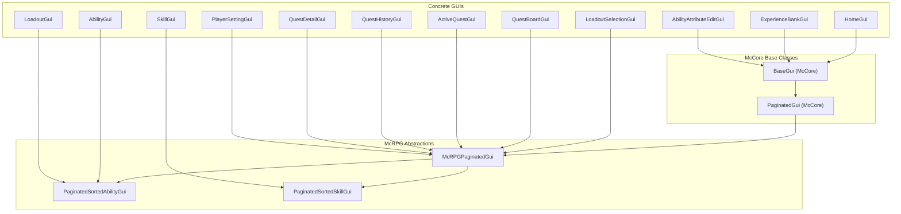
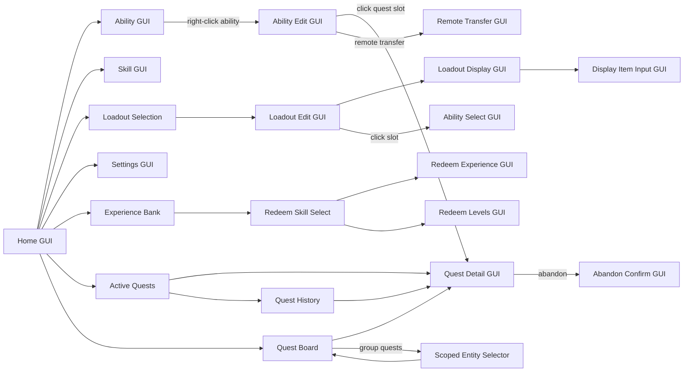

# GUI/UX System & Color Palette

> **Last Updated:** 2026-05-19
> **Status:** All phases complete
> **Scope:** Unified GUI color palette, navigation standardization, ability display improvements, upgrade quest slot separation, ability name unification

---

## Architecture Overview

McRPG's GUI system is built on McCore's `BaseGui<McRPGPlayer>` and `PaginatedGui<McRPGPlayer>` abstractions. All GUIs use the BoostedYAML-backed localization system for player-facing text, materials, and lore — server owners can customize every string via locale YAML files. Slot classes implement `McRPGSlot` and resolve their display items through `LocalizationKey` route constants.



### Navigation Flow



---

## Current Problems (Audit Findings)

### Color Inconsistencies

- **GUI titles**: 16 GUIs use `<gold>` (#FFAA00), 4 Experience Bank GUIs use `<black>`, 1 uses `<red>` — no unified scheme
- **Item names**: Home GUI slots use `<red>`, ability names use `<red>`, settings use `<gold>`, sort buttons use `<red>` — mixing red and gold arbitrarily
- **Value highlights**: All stat values in lore use `<gold>` — harsh saturated orange that clashes with the dark inventory background

### Navigation Inconsistencies

- **Back button labels**: 14 different label strings across GUIs ("Return to Home Menu", "Return to Previous GUI", "Return to Ability Selection", "Return to loadout selection", "Back to Active Quests", etc.)
- **Verb inconsistency**: Some say "Return to", others say "Back to"
- **All back buttons**: Use BARRIER material + `<red>` text — creates a hostile "error" feel for normal navigation

### Ability GUI Gaps

- **No type indicator**: No way to know if an ability is Active (combo), Passive (event-triggered), or Innate (always-on)
- **No toggle state**: Only enchantment glint distinguishes enabled/disabled — easily missed, especially with items that already have enchant glint
- **No click hints**: Players don't know left-click toggles and right-click opens the edit GUI
- **Upgrade quest crammed onto tier item**: In the Ability Edit GUI, quest progress bar is appended as lore on the tier attribute item rather than being a dedicated slot

### Bugs

- **Broken MiniMessage tag** in redeem GUI back button lore: `./gray>` instead of `</gray>`
- **Loadout GUI back button lore** is a YAML scalar string, not a list like every other back button
- **Title typo**: "Home Gui" with lowercase "Gui"
- **Naming mismatch**: Ability Edit back button says "Return to Ability Selection" but target GUI title is "Viewing Abilities"

---

## Semantic Color Palette

The palette is the **single source of truth** for all player-facing colors across McRPG GUIs and (in a future pass) chat messages. It is documented in three locations:

1. **[PALETTE.md](../../PALETTE.md)** — human-readable quick-reference card at repo root
2. **[.cursor/rules/core.mdc](../../.cursor/rules/core.mdc)** — AI agent enforcement rules
3. **`config.yml` palette section** — runtime-configurable color definitions that server owners can customize

### Runtime Palette Placeholders

Palette colors are **runtime-resolvable placeholders**, not hardcoded hex codes in locale files. Locale YAML files use semantic names like `<primary>`, and the localization pipeline replaces them with their configured MiniMessage values before MiniMessage parses the string.

**Locale YAML** (what developers and server owners write):
```yaml
title: "<primary>Viewing Abilities"
lore:
  - "<body>Mana Cost: <mana>30"
  - "<hint>Right-click <body>to configure"
```

**Config section** (server-owner customizable, in `config.yml`):
```yaml
palette:
  primary: "<color:#D4A76A>"
  hint: "<color:#E8C97A>"
  mana: "<color:#5EA8FF>"
  ability-active: "<color:#FF7B5E>"
  ability-passive: "<color:#7FB87F>"
  ability-innate: "<color:#9E9E9E>"
  body: "<gray>"
  positive: "<green>"
  negative: "<red>"
  warning: "<yellow>"
```

**Resolution pipeline**: `McRPGLocalizationManager` maintains a palette `Map<String, String>` loaded from config. Before every placeholder resolution call, the palette entries are merged into the placeholder map (palette entries have lowest priority — per-call placeholders override them if keys collide). The existing `String.replace("<" + key + ">", value)` mechanism handles substitution with no new infrastructure needed.

```
Locale YAML string:  "<primary>Skill: <primary><skill>"
After palette merge:  "<color:#D4A76A>Skill: <color:#D4A76A><skill>"
After per-call map:   "<color:#D4A76A>Skill: <color:#D4A76A>Herbalism"
MiniMessage parses:   Component with warm amber "Skill: Herbalism"
```

### Primary Colors (3 custom hex)

| Role | Placeholder | Default Value | Hex | When to Use |
|------|-------------|---------------|-----|-------------|
| **primary** | `<primary>` | `<color:#D4A76A>` | `#D4A76A` | GUI titles, navigation item names, stat value highlights, skill names in lore, section headers, item name accents |
| **hint** | `<hint>` | `<color:#E8C97A>` | `#E8C97A` | Click/keyboard hint verbs only — colors the action word; the rest of the sentence uses `<body>` |
| **mana** | `<mana>` | `<color:#5EA8FF>` | `#5EA8FF` | Mana cost values, mana-related lore |

### Ability Type Colors (3 custom hex)

| Role | Placeholder | Default Value | Hex | When to Use |
|------|-------------|---------------|-----|-------------|
| **ability-active** | `<ability-active>` | `<color:#FF7B5E>` | `#FF7B5E` | Active (ComboActivatable) ability names and type tags |
| **ability-passive** | `<ability-passive>` | `<color:#7FB87F>` | `#7FB87F` | Passive ability names and type tags |
| **ability-innate** | `<ability-innate>` | `<color:#9E9E9E>` | `#9E9E9E` | Innate (no unlock) ability names, disabled/inactive states, unavailable items |

### Standard Minecraft Colors (4 vanilla)

| Role | Placeholder | Default Value | When to Use |
|------|-------------|---------------|-------------|
| **body** | `<body>` | `<gray>` | All descriptive/body lore text, labels before values |
| **positive** | `<positive>` | `<green>` | Enabled toggles, success messages, quest accepted |
| **negative** | `<negative>` | `<red>` | Disabled toggles, error messages, cooldown active, quest abandon |
| **warning** | `<warning>` | `<yellow>` | Caution states, expiration warnings, approaching limits |

### Usage Rules

1. **Titles**: Always `<primary>` — never bare `<gold>`, `<black>`, or `<red>`
2. **Back button names**: Always `<primary>` — pattern is `"Back to [Parent]"`
3. **Stat values in lore**: Always `<primary>` — e.g., `<body>Skill: <primary>Herbalism`
4. **Click/keyboard hints**: Verb-only `<hint>` format — color only the action verb, leave the rest of the sentence in `<body>`: `<hint>Right-click <body>to configure`, `<hint>Left-click <body>to edit`, `<hint>Press <primary>1<body>/<primary>2<body>/<primary>3 <body>to move`. Compound click types are hyphenated (`Left-click`, `Right-click`, `Shift-click`). Destructive verbs use `<negative>` instead: `<negative>Right-click <body>to abandon`. Positive/acceptance verbs use `<positive>`: `<positive>Click <body>to accept`.
5. **Ability item names**: Color by type — `<ability-active>`, `<ability-passive>`, or `<ability-innate>`
6. **Mana costs in ability lore**: Always `<mana>` — e.g., `<body>Mana Cost: <mana>30`
7. **Body text / labels**: Always `<body>` — e.g., `<body>Activation Chance:`
8. **Toggle on/off status**: `<positive>` / `<negative>` — `<positive>Enabled` / `<negative>Disabled`
9. **Error messages**: Always `<negative>` — e.g., `<negative>Not enough mana`
10. **Warnings**: Always `<warning>` — e.g., `<warning>Quest expires soon`

### What NOT to Use

- `<gold>` — replaced by `<primary>` everywhere
- `<red>` for item names (back buttons, ability names, home GUI slots) — use `<primary>` or ability type placeholder
- `<black>` for titles — use `<primary>`
- Raw hex codes in locale files — always use palette placeholders so server owners can retheme in one place

---

## Core Concepts

### 1. Ability Type Classification

The GUI needs to communicate ability type to the player. Classification uses existing interfaces:

| Type | Detection | Placeholder | Player Description |
|------|-----------|-------------|--------------------|
| **Active** | `ability instanceof ComboActivatable` | `<ability-active>` | Triggered by click combos, consumes mana |
| **Passive** | `ability instanceof PassiveAbility` and has `ABILITY_UNLOCKED_ATTRIBUTE` | `<ability-passive>` | Activates automatically on events, can be toggled |
| **Innate** | No `ABILITY_UNLOCKED_ATTRIBUTE` in `AbilityData` | `<ability-innate>` | Always active, no unlock requirement |

There is no `InnateAbility` interface — "innate" is a data-level concept (no unlock attribute), not a type-level one. The existing `InnateAbilityFilter` uses this same detection.

### 2. Ability Item Lore Structure (Current State)

Ability items in the Viewing Abilities GUI display:

```
[Ability Name]                          ← colored by type
Description line 1                      ← from en_abilities.yml
Description line 2

Type: Active/Passive/Innate             ← colored by type
Status: Enabled/Disabled                ← if toggleable
Left-click to enable/disable            ← verb-only hint format: <hint>Left-click <body>to enable
Right-click to configure                ← <hint>Right-click <body>to configure

Skill: Herbalism                        ← existing stat lines from en_abilities.yml
Activation Chance: 0.5
Mana Cost: 30                           ← sky blue color

Upgrade Quest Progress: ████████░░      ← existing, from AbilityLoreAppender
```

### 3. Upgrade Quest Slot (Ability Edit GUI)

The dedicated `UpgradeQuestSlot` (implemented in Phase 3) replaces the quest progress lore that was previously crammed onto the tier attribute item. The tier slot was removed from the Edit GUI entirely — tier information remains visible on the ability item in the Viewing Abilities GUI.

Three display states:
- **Active quest** (`WRITABLE_BOOK`): Shows progress bar, objective summary, click hint to navigate to `QuestDetailGui`
- **Locked behind level** (`BOOK`): Shows next tier level requirement and skill name
- **Max tier reached** (`ENCHANTED_BOOK`): Shows "Fully upgraded!" — no click action

The slot uses `ability.getColoredName()` for the `<ability>` placeholder, so ability names are consistently colored by type across all three states. Orphaned quest UUIDs (from server crashes or edge cases) are self-healed on GUI open.

### 4. Navigation Standardization

All back buttons follow one pattern:
- **Material**: `BARRIER` (recognizable Minecraft convention)
- **Name color**: `<primary>` (warm amber) — not `<red>`
- **Label pattern**: `"Back to [Parent GUI Name]"`
- **Lore**: Single line `"<body>Click to go back."`

---

## Extension Points

### For Third-Party Plugins

- **Custom ability types**: Third-party abilities implementing `ComboActivatable` or `PassiveAbility` automatically get the correct type color in the Ability GUI. Innate detection works via attribute presence, no interface needed.
- **Custom palette**: Server owners redefine any palette color in `config.yml` — one change retemes the entire plugin.
- **Custom GUI slots**: Third-party slots implementing `McRPGSlot` follow the same palette by using `<primary>`, `<body>`, etc. in their locale entries — the palette map is merged automatically.

### For Content Expansions

- New abilities registered via `ContentExpansion` automatically appear in the Ability GUI with correct type coloring if they implement the standard type interfaces.
- The `UpgradeQuestSlot` works with any `TierableAbility` that has an `AbilityUpgradeQuestAttribute`, including third-party abilities.
- `Ability.getColoredName(McRPGPlayer)` returns a self-closing palette-colored string for any `ConfigurableAbility`. Third-party abilities inheriting `ConfigurableAbility` automatically get type-colored names from their locale `name:` field. Non-configurable abilities return `getName()` by default — override `getColoredName()` to customize.
- Ability locale `name:` fields should include closing palette tags (e.g., `<ability-active><ability></ability-active>`) to prevent color bleed into adjacent text. The `AbilityNameColorConsistencyTest` enforces this for bundled abilities.

---

## Implementation Phases

Each phase gets its own LLD when implementation begins.

### Phase 1: Palette Infrastructure + GUI Locale Sweep ✅ Complete

- Added `palette` config section to `config.yml` with all 10 default entries
- Dynamic palette system: `McRPGLocalizationManager.buildPaletteReplacements()` iterates all keys under the `palette:` section — server owners can add arbitrary custom color tags
- Updated all GUI titles to `<primary>`, standardized back button labels to `"Back to [Parent]"` pattern
- Replaced `<gold>` / `<red>` / `<black>` with palette placeholders across `en_gui.yml`
- Fixed bugs: broken MiniMessage tag, loadout lore scalar, title typo, naming mismatch

### Phase 2: Ability Display Overhaul ✅ Complete

- Changed ability name colors in `en_abilities.yml` to type placeholders (`<ability-active>`, `<ability-passive>`, `<ability-innate>`)
- Added type tag, toggle status, mana cost, and click hint lore lines to `AbilitySlot` (Java-injected)
- Geyser-aware click hints: Bedrock players see a single "Click to configure" hint
- Full `en_abilities.yml` color sweep: `<gray>` → `<body>`, `<gold>` → `<primary>`, `<red>` → palette roles
- Implemented dynamic palette tag support; removed 10 individual `PALETTE_*` route constants
- Click hints use the verb-only format: `<hint>Left-click <body>to enable` (see rule #4)

### Phase 3: Ability Edit GUI Quest Slot + Ability Name Unification ✅ Complete

- Created `UpgradeQuestSlot` with three display states (active quest, locked behind level, max tier) and click navigation to `QuestDetailGui`
- `AbilityUpgradeQuestAttribute` implements `GuiModifiableAttribute`; `AbilityTierAttribute` no longer does — tier slot removed from Edit GUI
- `GuiModifiableAttribute.getDisplayPriority()` default method (returns 50) with built-in overrides for deterministic slot ordering
- `QuestDetailGui.forUpgradeQuest()` factory method with back navigation to `AbilityAttributeEditGui`
- New locale keys in `en_gui.yml` for all three slot states and the ability-edit back button
- **Ability name unification (post-LLD refinement):** `Ability.getColoredName(McRPGPlayer)` method returns palette-resolved, self-closing MiniMessage strings from locale `name:` fields. Used across `UpgradeQuestSlot`, `RemoteTransferGui`, combo/cooldown listeners, reward type descriptions, and `LoadoutSelectionSlot` ability preview
- All 18 ability `name:` fields in `en_abilities.yml` include closing palette tags (e.g., `</ability-passive>`) to prevent color bleed
- `LoadoutSetCommand` success message shows custom loadout display name via `<loadout-name>` placeholder
- Locale templates in `en_abilities.yml`, `en_gui.yml`, `en_commands.yml`, `en_quest.yml` updated to remove redundant color wrappers around `<ability>` placeholder

### Phase 4: Remaining Locale Sweep + Skill Colors + McCore Infrastructure ✅ Complete

- Full palette sweep of `en.yml`, `en_skills.yml`, `en_quest.yml`, `en_commands.yml` — all `<gold>`, `<gray>`, `<red>`, `<green>`, `<yellow>`, `<white>`, `<dark_gray>` replaced with semantic palette placeholders
- 4 new per-skill palette entries in `config.yml`: `skill-swords` (#C75050), `skill-mining` (#7AAFC9), `skill-herbalism` (#6DB86D), `skill-woodcutting` (#B8874B)
- `Skill.getColoredName(McRPGPlayer)` API with `ConfigurableSkill` override — mirrors `Ability.getColoredName()` from Phase 3
- Propagated `getColoredName()` to 20+ callsites: ability item builders, lore appenders, experience displays, commands, redeem GUIs, upgrade quest slots
- Quest locale deduplication: ~70 stale quest entries removed from `en.yml`, example quests and `quest-notifications` moved to `en_quest.yml`
- `HIDE_ATTRIBUTES` item flag on all ~124 GUI icons across `en_gui.yml`, `en_abilities.yml`, `en_skills.yml`
- `en_quest.yml` reward `default-color` changed from `<gold>` to `<primary>`
- `SkillNameColorConsistencyTest` — enforces `<skill-*>` palette tags in skill locale names

**McCore infrastructure fixes** (discovered during implementation):
- **ItemBuilder "Double-Bake" Bug:** `getDisplayItemBuilder()` called `intermediate.asItemStack()` prematurely, baking YAML lore into Components before placeholder substitution. MiniMessage tags in placeholder values (from `getColoredName()`) then rendered as literal text. Fixed by adding copy constructors to `BaseItemBuilder`/`ItemBuilder` that transfer internal state without `asItemStack()`, and passing the builder directly to specialized constructors.
- **Lore Merge Bug:** `BaseItemBuilder.asItemStack()` had two separate `setData(LORE, ...)` calls — the component-based list overwrote the string-based list. After the copy constructor fix, YAML lore (strings) and dynamic lore (components) occupied separate lists, and the component call silently discarded all YAML lore. Fixed by merging both sources into a single `List<Component>` before writing — strings first (YAML description), components second (dynamic metadata).

**Previous Phase 3 incremental work now subsumed:**
- Click/keyboard hint standardization to verb-only `<hint>` format
- `ScopedEntitySelectSlot` locale-backing
- Loadout display name double-apply fix
- Combo-slot `Press 1/2/3` hint format

---

## Known Gaps / Post-Implementation Notes

Items identified during or after the Phase 4 pass that may warrant follow-up:

1. **Implicitly-fixed slots not individually verified in-game.** The McCore lore merge fix resolves the double-bake and lost-lore bugs for all slots that call `getDisplayItemBuilder()` and then add component lore. The following slots were **not** individually tested in-game after the fix — only `AbilitySlot` was verified:
   - `LoadoutAbilitySlot` (loadout GUI — ability with additional lore)
   - `ActiveAbilityComboSlot` (loadout GUI — combo pattern + upgrade quest progress)
   - `LoadoutSelectAbilitySlot` (ability selection GUI — ability with select lore)
   - `RedeemableSkillSelectionSlot` (experience bank — skill with redeem lore)

2. **Lore ordering is implicit.** The `asItemStack()` merge always places string-based lore (from YAML) before component-based lore (from `addDisplayLoreComponent()`). Every current callsite expects this order (YAML description first, dynamic metadata second), but it's not enforced by contract. A future builder that needs dynamic lore *before* YAML lore would require a configurable strategy.

3. **Third-party `ItemBuilder` subclasses.** Any third-party plugin that extends `ItemBuilder` and constructs from an `ItemStack` (the old path) will still hit the double-bake issue. They need to add a copy constructor delegating to `super(source)`. This should be documented in the McCore changelog / migration guide.

4. **Copy constructor shares `ItemStack` reference.** `BaseItemBuilder`'s copy constructor copies `itemStack` by reference, not clone. The source builder is discarded immediately in all current callsites (`getDisplayItemBuilder()`), but a future caller retaining both builders could see cross-contamination. Low risk, but worth noting.

5. **`en_stats.yml` not swept.** Confirmed clean — the file contains no color tags and no display items. No action needed, but flagged for completeness.

6. **No unit test coverage for the McCore lore merge.** The double-bake and lore merge fixes are infrastructure-level changes in McCore's `BaseItemBuilder`. There are no unit tests validating the merge behavior (string + component lore coexistence). MockBukkit's `ItemStack` may not fully simulate `DataComponentTypes.LORE`, making this difficult to test without integration tests, but a basic builder test verifying both lore sources appear would add confidence.

---

## Related Documents

- **[PALETTE.md](../../PALETTE.md)** — Quick-reference color card
- **[.cursor/rules/core.mdc](../../.cursor/rules/core.mdc)** — AI agent enforcement rules (Palette Governance section)
- **[.cursor/rules/persona-gui-ux.mdc](../../.cursor/rules/persona-gui-ux.mdc)** — GUI/UX review persona checklist
