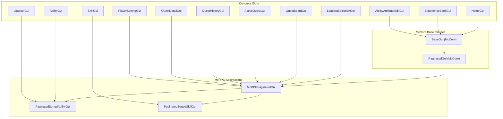
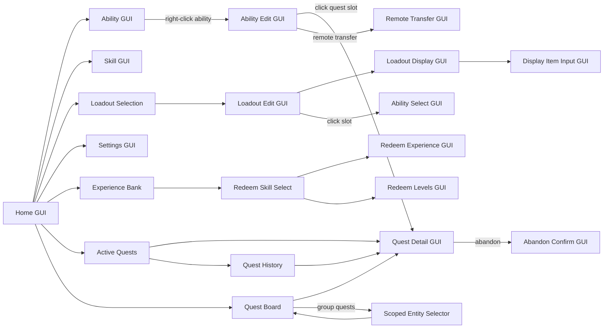

# GUI/UX System & Color Palette

> **Last Updated:** 2026-05-10
> **Status:** Phase 0 (documentation) complete; Phases 1–4 pending implementation
> **Scope:** Unified GUI color palette, navigation standardization, ability display improvements, upgrade quest slot separation

---

## Architecture Overview

McRPG's GUI system is built on McCore's `BaseGui<McRPGPlayer>` and `PaginatedGui<McRPGPlayer>` abstractions. All GUIs use the BoostedYAML-backed localization system for player-facing text, materials, and lore — server owners can customize every string via locale YAML files. Slot classes implement `McRPGSlot` and resolve their display items through `LocalizationKey` route constants.



### Navigation Flow



---

## Current Problems (Audit Findings)

### Color Inconsistencies

- **GUI titles**: 16 GUIs use `<gold>` (#FFAA00), 4 Experience Bank GUIs use `<black>`, 1 uses `<red>` — no unified scheme
- **Item names**: Home GUI slots use `<red>`, ability names use `<red>`, settings use `<gold>`, sort buttons use `<red>` — mixing red and gold arbitrarily
- **Value highlights**: All stat values in lore use `<gold>` — harsh saturated orange that clashes with the dark inventory background

### Navigation Inconsistencies

- **Back button labels**: 14 different label strings across GUIs ("Return to Home Menu", "Return to Previous GUI", "Return to Ability Selection", "Return to loadout selection", "Back to Active Quests", etc.)
- **Verb inconsistency**: Some say "Return to", others say "Back to"
- **All back buttons**: Use BARRIER material + `<red>` text — creates a hostile "error" feel for normal navigation

### Ability GUI Gaps

- **No type indicator**: No way to know if an ability is Active (combo), Passive (event-triggered), or Innate (always-on)
- **No toggle state**: Only enchantment glint distinguishes enabled/disabled — easily missed, especially with items that already have enchant glint
- **No click hints**: Players don't know left-click toggles and right-click opens the edit GUI
- **Upgrade quest crammed onto tier item**: In the Ability Edit GUI, quest progress bar is appended as lore on the tier attribute item rather than being a dedicated slot

### Bugs

- **Broken MiniMessage tag** in redeem GUI back button lore: `./gray>` instead of `</gray>`
- **Loadout GUI back button lore** is a YAML scalar string, not a list like every other back button
- **Title typo**: "Home Gui" with lowercase "Gui"
- **Naming mismatch**: Ability Edit back button says "Return to Ability Selection" but target GUI title is "Viewing Abilities"

---

## Semantic Color Palette

The palette is the **single source of truth** for all player-facing colors across McRPG GUIs and (in a future pass) chat messages. It is documented in three locations:

1. **[PALETTE.md](../../../PALETTE.md)** — human-readable quick-reference card at repo root
2. **[.cursor/rules/core.mdc](../../../.cursor/rules/core.mdc)** — AI agent enforcement rules
3. **Locale YAML comment headers** — inline reference for server owners customizing colors

### Primary Colors (3 custom hex)

| Role | Name | MiniMessage | Hex | When to Use |
|------|------|-------------|-----|-------------|
| **primary** | Warm Amber | `<color:#D4A76A>` | `#D4A76A` | GUI titles, navigation item names, stat value highlights, skill names in lore, section headers, item name accents |
| **hint** | Warm Yellow | `<color:#E8C97A>` | `#E8C97A` | Click hints, calls-to-action, interactive prompts |
| **mana** | Sky Blue | `<color:#5EA8FF>` | `#5EA8FF` | Mana cost values, mana-related lore |

### Ability Type Colors (3 custom hex)

| Role | Name | MiniMessage | Hex | When to Use |
|------|------|-------------|-----|-------------|
| **ability-active** | Coral | `<color:#FF7B5E>` | `#FF7B5E` | Active (ComboActivatable) ability names and type tags |
| **ability-passive** | Sage Green | `<color:#7FB87F>` | `#7FB87F` | Passive ability names and type tags |
| **ability-innate** | Silver | `<color:#9E9E9E>` | `#9E9E9E` | Innate (no unlock) ability names, disabled/inactive states, unavailable items |

### Standard Minecraft Colors (4 vanilla)

| Role | Name | MiniMessage | When to Use |
|------|------|-------------|-------------|
| **body** | Gray | `<gray>` | All descriptive/body lore text, labels before values |
| **positive** | Green | `<green>` | Enabled toggles, success messages, quest accepted |
| **negative** | Red | `<red>` | Disabled toggles, error messages, cooldown active, quest abandon |
| **warning** | Yellow | `<yellow>` | Caution states, expiration warnings, approaching limits |

### Usage Rules

1. **Titles**: Always `primary` — never bare `<gold>`, `<black>`, or `<red>`
2. **Back button names**: Always `primary` — pattern is `"Back to [Parent]"`
3. **Stat values in lore**: Always `primary` — e.g., `<gray>Skill: <color:#D4A76A>Herbalism`
4. **Click prompts**: Always `hint` — e.g., `<color:#E8C97A>Right-click to configure`
5. **Ability item names**: Color by type — `ability-active`, `ability-passive`, or `ability-innate`
6. **Mana costs in ability lore**: Always `mana` — e.g., `<gray>Mana Cost: <color:#5EA8FF>30`
7. **Body text / labels**: Always `body` — e.g., `<gray>Activation Chance:`
8. **Toggle on/off status**: `positive` / `negative` — `<green>Enabled` / `<red>Disabled`
9. **Error messages**: Always `negative` — e.g., `<red>Not enough mana`
10. **Warnings**: Always `warning` — e.g., `<yellow>Quest expires soon`

### What NOT to Use

- `<gold>` — replaced by `primary` everywhere
- `<red>` for item names (back buttons, ability names, home GUI slots) — use `primary` or ability type color
- `<black>` for titles — use `primary`
- Raw hex in locale files without a comment noting the palette role

---

## Core Concepts

### 1. Ability Type Classification

The GUI needs to communicate ability type to the player. Classification uses existing interfaces:

| Type | Detection | Color | Player Description |
|------|-----------|-------|--------------------|
| **Active** | `ability instanceof ComboActivatable` | Coral `#FF7B5E` | Triggered by click combos, consumes mana |
| **Passive** | `ability instanceof PassiveAbility` and has `ABILITY_UNLOCKED_ATTRIBUTE` | Sage Green `#7FB87F` | Activates automatically on events, can be toggled |
| **Innate** | No `ABILITY_UNLOCKED_ATTRIBUTE` in `AbilityData` | Silver `#9E9E9E` | Always active, no unlock requirement |

There is no `InnateAbility` interface — "innate" is a data-level concept (no unlock attribute), not a type-level one. The existing `InnateAbilityFilter` uses this same detection.

### 2. Ability Item Lore Structure (Target State)

After this system is implemented, ability items in the Viewing Abilities GUI will display:

```
[Ability Name]                          ← colored by type
Description line 1                      ← from en_abilities.yml
Description line 2

Type: Active/Passive/Innate             ← new, colored by type
Status: Enabled/Disabled                ← new, if toggleable
Left-click to enable/disable            ← new click hint, if toggleable
Right-click to configure                ← new click hint, if has editable attributes

Skill: Herbalism                        ← existing stat lines from en_abilities.yml
Activation Chance: 0.5
Mana Cost: 30                           ← sky blue color

Upgrade Quest Progress: ████████░░      ← existing, from AbilityLoreAppender
```

### 3. Upgrade Quest Slot (Ability Edit GUI)

Currently, upgrade quest progress is crammed onto the tier attribute item via `AbilityLoreAppender`. This system introduces a dedicated `UpgradeQuestSlot`:

- **Has active quest**: Shows progress bar, quest name, "Click to view quest details" — click navigates to `QuestDetailGui`
- **No active quest**: Shows disabled state item ("No Active Upgrade Quest")

The tier attribute item (`AbilityTierAttribute.getSlot()`) stops calling `AbilityLoreAppender.getAppendLore()` for quest progress — it only shows tier number and upgrade eligibility.

### 4. Navigation Standardization

All back buttons follow one pattern:
- **Material**: `BARRIER` (recognizable Minecraft convention)
- **Name color**: `primary` (warm amber) — not `<red>`
- **Label pattern**: `"Back to [Parent GUI Name]"`
- **Lore**: Single line `"<gray>Click to go back."`

---

## Extension Points

### For Third-Party Plugins

- **Custom ability types**: Third-party abilities implementing `ComboActivatable` or `PassiveAbility` automatically get the correct type color in the Ability GUI. Innate detection works via attribute presence, no interface needed.
- **Custom locale overrides**: Server owners override any color or string via locale YAML files. The palette is a default — not hardcoded in Java.
- **Custom GUI slots**: Third-party slots implementing `McRPGSlot` follow the same palette by resolving display items through `LocalizationKey` routes.

### For Content Expansions

- New abilities registered via `ContentExpansion` automatically appear in the Ability GUI with correct type coloring if they implement the standard type interfaces.
- The `UpgradeQuestSlot` works with any `TierableAbility` that has an `AbilityUpgradeQuestAttribute`, including third-party abilities.

---

## Proposed Implementation Phases

Each phase gets its own LLD when implementation begins.

### Phase 1: GUI Locale Sweep

- Update all GUI titles to `primary` color
- Standardize all back button labels to `"Back to [Parent]"` pattern with `primary` color
- Update home GUI slot names and sort button names from `<red>` to `primary`
- Replace `<gold>` with `primary` across en_gui.yml value highlights
- Fix bugs: broken MiniMessage tag, loadout lore scalar, title typo, naming mismatch
- Add palette comment header to en_gui.yml

### Phase 2: Ability Display Overhaul

- Change ability name colors in en_abilities.yml by type (active/passive/innate)
- Add type tag, toggle status, and click hint lore lines to AbilitySlot
- New locale keys in en_abilities.yml and LocalizationKey.java
- Replace `<gold>` with palette colors in en_abilities.yml stat values
- Add mana cost color (`mana`) to ability lore

### Phase 3: Ability Edit GUI Quest Slot

- Create `UpgradeQuestSlot` class with quest detail navigation
- Add to `AbilityAttributeEditGui` layout
- Remove quest progress lore from `AbilityTierAttribute` tier item
- New locale keys in en_gui.yml

### Phase 4: Remaining Locale Sweep

- Update loadout GUI colors in en_gui.yml
- Sweep remaining locale files (en.yml, en_skills.yml, en_commands.yml, en_quest.yml, en_stats.yml) for `<gold>` replacement
- Add palette comment headers to all locale files

---

## Related Documents

- **[PALETTE.md](../../../PALETTE.md)** — Quick-reference color card
- **[.cursor/rules/core.mdc](../../../.cursor/rules/core.mdc)** — AI agent enforcement rules (Palette Governance section)
- **[.cursor/rules/persona-gui-ux.mdc](../../../.cursor/rules/persona-gui-ux.mdc)** — GUI/UX review persona checklist
