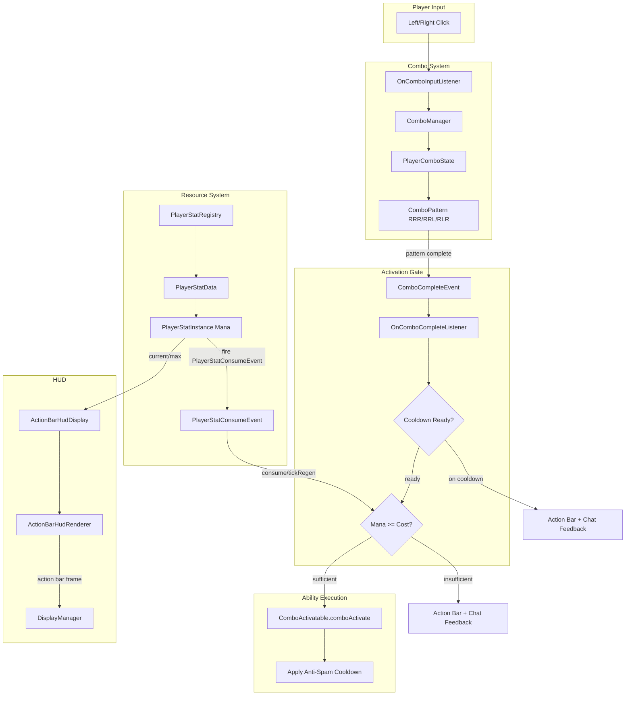

# Mana & Ability Activation System

> **Last Updated:** 2026-05-08
> **Status:** Phases 1–4 implemented
> **Scope:** Mana as universal activation resource, combo-only activation for all active abilities, ready-state removal, config consolidation, Parser-based formula scaling, balance framework

---

## Architecture Overview

The mana system replaces the legacy ready-state activation model with a unified combo-based activation path gated by mana. Every active ability is activated via click-combo sequences (RRR, RRL, RLR). Mana is consumed on activation (with a cancellable `PlayerStatConsumeEvent` fired before each consumption); a small anti-spam cooldown prevents accidental double-casts. Passive abilities retain their event-driven activation but gain optional mana cost support in the infrastructure. Player stats are registered through the `ContentExpansion` pack system and managed by `PlayerStatRegistry` (no separate `StatManager`).



**HP display:** The action bar HP zone mirrors vanilla health directly (20/20 by default). The renderer is future-proofed to show custom HP values when a custom HP pool is introduced, but no custom HP pool exists in this system.

---

## Core Concepts

### 1. Mana Pool

Mana is a per-player resource pool tracked via `PlayerStatInstance` keyed by `McRPGPlayerStat.MANA`. It has a base maximum, a flat passive regeneration rate, and support for modifiers (flat and percentage bonuses from gear or abilities in the future).

**Base values:**

| Property | Value | Notes |
|----------|-------|-------|
| Base max mana | 100 | Clean round number; percentages map 1:1 to costs |
| Regen rate | 2/sec | Slow enough that utility costs (70-80) linger across a full gameplay loop |
| Regen driver | HUD tick | `ActionBarHudDisplay.tick()` calls `PlayerStatData.tickRegen()` |
| Persistence | Logout/save only | Restored on login; see Resolved Design Decisions |

**Design target ("Slow Regen, High Stakes"):** Scarcity creates meaning. With 2/sec regen and 50s full recovery, every mana spend is a deliberate decision. Light combat abilities (cost 28-32 at T1) give ~3 casts from a full pool — scarce at T1, fluid at T5 (cost 12-16, ~6 casts). Heavy utility abilities (cost 70-80 at T1) cost more than a 35-second gameplay loop recovers (35s × 2/sec = 70 mana), so the spend is always felt. Mana is the primary gate; cooldowns are anti-spam only. See `.cursor/rules/mana-balance-philosophy.mdc` for the full framework.

**Modifier system:** `PlayerStatModifier` is an extensible class (not a record) keyed by `NamespacedKey` for third-party collision safety. The base class provides fixed flat/percent bonuses. Subclasses can override virtual methods for dynamic scaling (e.g., stacking modifiers) and time-based expiration:

- `getEffectiveFlatBonus()` / `getEffectivePercentBonus()` — base returns raw values; subclasses override for scaling (e.g., `perStack * currentStacks`)
- `tick(double secondsElapsed)` — no-op in base; subclasses use for duration countdown or stack falloff
- `isExpired()` — returns `false` in base; subclasses return `true` when duration elapses or stacks reach zero

Future subclasses (not yet implemented): `StackablePlayerStatModifier`, `TimedPlayerStatModifier`, `TimedStackablePlayerStatModifier`.

```
effectiveMax = (baseMana + sumEffectiveFlatBonuses) * (1 + sumEffectivePercentBonuses)
```

This is implemented in `PlayerStatInstance.getEffectiveMax()`, which calls the virtual methods on each modifier. `PlayerStatInstance.tickRegen()` also ticks all modifiers and auto-removes expired ones before applying regen.

**Configuration:**

```yaml
# config.yml
stats:
  mana:
    base-max: 100
    regen-per-second: 2
    minimum-ability-cost: 1
```

### 2. Combo Activation

All active abilities are activated exclusively via click-combo sequences. Three combo slots map to three input patterns:

| Slot | Pattern | Input Sequence |
|------|---------|----------------|
| 1 | RRR | Right, Right, Right |
| 2 | RRL | Right, Right, Left |
| 3 | RLR | Right, Left, Right |

All patterns start with Right so plain left-clicks (mining, combat) do not start a combo unintentionally.

**Slot assignment:** A player's `ComboActivatable` abilities are drawn from their loadout's ordered abilities. The Nth `ComboActivatable` in loadout order maps to slot N. This is deterministic and requires no per-player combo binding configuration.

**Timing window:** Configurable ticks between inputs before the sequence resets. Default 30 ticks (~1.5 seconds at 20 TPS).

**Allowed items:** Only configured held items (swords, axes, pickaxes, shovels, hoes, bows, crossbows, trident, mace, or empty hand) can register combo inputs. The list is reloadable.

**Configuration:**

```yaml
# config.yml
configuration:
  gameplay:
    combo:
      allowed-items:
        - WOODEN_SWORD
        - STONE_SWORD
        - IRON_SWORD
        - GOLDEN_SWORD
        - DIAMOND_SWORD
        - NETHERITE_SWORD
        # ... axes, pickaxes, shovels, hoes, bows, etc.
      timing:
        window-ticks: 30
      failure-feedback:
        sound: BLOCK_NOTE_BLOCK_BASS
        volume: 1.0
        pitch: 0.5
```

### 3. Activation Gates

When a combo pattern completes, `OnComboCompleteListener` enforces two gates in order:

1. **Cooldown check** -- if the ability implements `CooldownableAbility` and is on cooldown, deny with feedback (action bar countdown + chat message with ability name and remaining time).
2. **Mana check** -- call `PlayerStatInstance.consume(manaCost)`. If it returns false, deny with feedback (action bar "Not Enough Mana" + chat message with ability name, cost, and current mana).

If both gates pass, `comboActivate(abilityHolder)` fires and the anti-spam cooldown is applied.

**Anti-spam cooldown:** Light abilities have a ~1 second flat cooldown purely to prevent lag-induced accidental double-casts. Medium and Heavy abilities use longer cooldowns (9-20 seconds) as effect-overlap prevention. All cooldowns are configured per-ability per-tier via the `cooldown` key in `tier-configuration` and support Parser formulas (e.g., `"20-(1.5*tier)"`).

**Feedback layering:**

| Channel | Content | Duration |
|---------|---------|----------|
| Action bar (center zone) | `On Cooldown (Xs)` or `Not Enough Mana` | ~3 seconds (configurable), countdowns update live |
| Chat | `{Ability} is on cooldown! (Xs remaining)` or `Not enough mana for {Ability}! (need X, have Y)` | One-shot at failure |
| Sound | Configurable failure sound | Immediate |

### 4. Mana Cost Configuration

Mana costs are defined in each ability's `tier-configuration` block within its skill config file, following the same `all-tiers` / `tier-N` override pattern that `cooldown`, `unlock-level`, and `pulse-radius` already use.

**All config values that vary by tier -- including `mana-cost` -- are read as strings and evaluated via the McCore `Parser` framework with `tier` as a variable.** This is the same approach `ConfigurableActiveAbility.getCooldown()`, `ConfigurableTierableAbility.getUnlockLevelForTier()`, and `MassHarvest.getRadius()` already use. Abilities that currently read tier-config values as raw integers or doubles (e.g., `getInt()` / `getDouble()`) must be migrated to `getString()` + `Parser` as part of this effort.

This means server owners have two ways to configure per-tier values:

1. **Formula in `all-tiers`** -- a single expression evaluated for any tier, including tiers above `amount-of-tiers`:

```yaml
# herbalism_configuration.yml (modern approach -- preferred)
ability-configuration:
  mass-harvest:
    enabled: true
    amount-of-tiers: 5
    tier-configuration:
      all-tiers:
        upgrade-point-cost: 1
        unlock-level: 1*tier
        pulse-radius: 5+(1.6*tier)
        cooldown: "18-(1*tier)"
        mana-cost: "80-(5*tier)"
```

2. **Explicit per-tier overrides** -- override individual tiers for hand-tuned curves:

```yaml
# swords_configuration.yml (explicit approach -- also valid)
ability-configuration:
  rage-spike:
    enabled: true
    amount-of-tiers: 5
    tier-configuration:
      all-tiers:
        upgrade-point-cost: 1
        cooldown: 1
        mana-cost: "34-(3.5*tier)"
      tier-1:
        unlock-level: 1
        mana-cost: 30         # explicit override example
      tier-5:
        unlock-level: 850
        mana-cost: 16         # explicit override example
```

Resolution order: tier-specific value wins if present; otherwise the `all-tiers` formula is evaluated with the current tier. This is the existing `ConfigurableTierableAbility` pattern -- no new resolution logic is needed.

**Overtier future-proofing:** Because `all-tiers` formulas accept any tier value, abilities implicitly support tiers above `amount-of-tiers` if a future system (e.g., temporary tier boosts or "overtier" buffs) passes a tier higher than 5. Explicit per-tier overrides for tiers 6+ are optional and will work if present. The ability code must use the formula resolution path rather than capping at `maxTier` when computing mana costs, cooldowns, or other tier-scaled values.

**Minimum mana cost floor:** A configurable floor (default `1`) is enforced after formula evaluation to prevent overtier formulas from producing zero or negative costs. For example, `50-(7*tier)` at tier 8 evaluates to `-6`, which would be clamped to the floor. The floor is defined globally in `config.yml`:

```yaml
# config.yml
stats:
  mana:
    base-max: 100
    regen-per-second: 2
    minimum-ability-cost: 1
```

The floor is applied in the `getManaCost()` resolution path after Parser evaluation: `Math.max(floor, (int) parser.getValue())`. Server owners can set it to `0` to allow free casts at extreme tiers if they choose.

**Parser backport:** As part of Phase 1, all ability config reads that currently use `getInt()` or `getDouble()` for tier-varying values must be migrated to the `getString()` + `Parser.setVariable("tier", tier)` pattern. The `ConfigurableActiveAbility.getCooldown()` and `MassHarvest.getRadius()` implementations are the reference for this pattern. This is a mechanical change -- the YAML format is already compatible since BoostedYAML stores unquoted numbers as valid strings.

**Tier scaling philosophy:** Mana cost decreases with tier. Tier 1 costs ~1.5x a "base" value; Tier 5 costs ~0.6x. Higher tiers feel more fluid, not just stronger. Server owners choose their preferred approach -- formulas for automatic scaling or explicit values for hand-tuned curves.

**Cost ranges (reference for balance):**

| Bucket | T1 Cost Range | T5 Cost Range | Examples |
|--------|---------------|---------------|---------|
| Light | 28-32 | 12-16 | RageSpike (combat/mobility) |
| Medium | 42-50 | 25-33 | SerratedStrikes, VerdantSurge (buffs, sustain) |
| Heavy | 70-80 | 55-60 | OreScanner, MassHarvest (powerful utility, AoE resource generation) |

### 5. Passive Mana Cost (Infrastructure)

The activation pipeline supports optional mana costs on passive abilities. No current passives use this -- it is pure infrastructure for future design space.

**Contract:** `PassiveAbility` (or equivalent interface point in the activation chain) gains a `getManaCost(AbilityHolder)` default method returning `0`. `AbilityListener#activateAbilities` checks this value before firing a passive ability. When cost is `> 0`, it attempts `PlayerStatInstance.consume(cost)` and skips the ability silently on failure (no feedback -- passive procs should not spam the player).

**Configuration:** A future passive could opt in by adding `mana-cost` to its tier-configuration or ability-configuration block. The pipeline requires no further changes.

### 6. HP Display

The action bar HP zone shows vanilla health directly:

```
❤ 20/20   [center content]   ✦ 87/100
```

`ActionBarHudDisplay` reads `Player.getHealth()` and `Player.getAttribute(GENERIC_MAX_HEALTH).getValue()` and renders them as integers. The current spike scales vanilla HP against a custom max -- this will be replaced with direct vanilla values.

The renderer's `buildFull()` method accepts `hpCurrent`/`hpMax` as parameters, so swapping to custom HP later requires only changing the values passed in, not the rendering pipeline.

### 7. Ready-State Removal

**Completed in Phase 2.** The legacy ready-state activation model has been fully removed.

**Deleted:**
- `ReadyAbility`, `ReadyData`, `SwordReadyData`, `MiningReadyData`, `HerbalismReadyData`, `WoodcuttingReadyData` — all ReadyData subclasses deleted alongside the base class
- All `EventReadyableComponent` infrastructure: `EventReadyableComponent`, `EventReadyableComponentAttribute`, `RightClickReadyComponent`
- `AbilityHolderReadyEvent`, `AbilityHolderUnreadyEvent` and their listeners
- Ready-state exception classes
- `AbilityListener#readyAbilities()` and all call sites
- Ready-state fields and methods from `AbilityHolder` and `BaseAbility`
- `RequireEmptyOffhandSetting` deprecated (`forRemoval = true`); removed from settings GUI registration

**Config removed:**
- `configuration.gameplay.require-empty-off-hand-to-ready` from `config.yml`
- All ready/unready localization keys from `LocalizationKey.java` and `en_abilities.yml`

**Abilities migrated:**
- `SerratedStrikes` — `ReadyAbility` removed, `ComboActivatable` added, `comboActivate()` implemented
- `RageSpike` — ready path removed, combo path kept, `unreadyHolder()` call removed
- `OreScanner` — ready path removed, combo path retained from Phase 1
- `MassHarvest` — ready path removed, combo path retained from Phase 1
- `VerdantSurge` — ready path removed; `ComboActivatable` added in Phase 3 with per-tier mana costs

---

## Current State (Spike Inventory)

The following was shipped as PoC quality code and needs formalization:

### Active Abilities (post-Phase 4 state)

Shockwave and Cleave were spike-only PoC abilities deleted in Phase 1. The remaining active abilities after Phase 4 balance pass:

| Ability | Skill | Activation Path | Mana Formula | Cooldown Formula | Bucket |
|---------|-------|-----------------|--------------|------------------|--------|
| RageSpike | Swords | Combo-only | `"34-(3.5*tier)"` | `1` (flat anti-spam) | Light |
| SerratedStrikes | Swords | Combo-only | `"52-(4.5*tier)"` | `"20-(1.5*tier)"` | Medium |
| OreScanner | Mining | Combo-only | `"82-(5*tier)"` | `"22-(1.5*tier)"` | Heavy |
| MassHarvest | Herbalism | Combo-only | `"80-(5*tier)"` | `"18-(1*tier)"` | Heavy |
| VerdantSurge | Herbalism | Combo-only | `"47-(4*tier)"` | `"14-(1*tier)"` | Medium |

### Config Debt

- ~~`combo_configuration.yml` holds both system settings (timing, items) and per-ability params~~ — **resolved in Phase 1:** migrated to `config.yml` and skill config files; `ComboConfigFile.java` and `FileType.COMBO_CONFIG` deleted
- ~~Per-ability mana costs are flat values, not per-tier~~ — **resolved in Phase 1:** all costs read via `getString()` + Parser with `tier` variable
- ~~`ComboManager` timeout is hardcoded to 14 ticks despite `TIMING_WINDOW_TICKS` route existing in config~~ — **by design:** `DEFAULT_TIMEOUT_TICKS = 14L` is the intentional inter-input timeout (time allowed between individual clicks in a combo sequence); `MainConfigFile.COMBO_TIMING_WINDOW_TICKS` (30 ticks) is the overall combo window displayed to the player and used for UI timing — these are separate concerns
- ~~`McRPGCombatStat.HEALTH` defaults to 200 max~~ — **resolved in Phase 1:** Health base value is vanilla 20
- ~~Combo ability names (`getName()`, `getDisplayName()`) are hardcoded strings~~ — **resolved in Phase 1:** stat display routed through localization
- ~~Shockwave and Cleave are spike-only PoC classes~~ — **deleted in Phase 1**
- ~~`require-empty-off-hand-to-ready` config key~~ — **removed in Phase 2**
- ~~Ready/unready localization keys and YAML entries~~ — **removed in Phase 2**

### Infrastructure (production quality)

- `PlayerStat` (abstract base, `stat/`), `ResourcePoolPlayerStat` / `FlatPlayerStat` / `ConfigurableResourcePoolPlayerStat` (`stat/impl/`), `PlayerStatInstance` / `PlayerStatData` / `PlayerStatModifier` (`stat/instance/`) — renamed from `CombatStat*`, reorganized into subpackages, fully tested. `StatManager` merged into `PlayerStatRegistry`. Modifiers are `NamespacedKey`-keyed classes with virtual methods supporting future stacking/timed subclasses.
- `ComboManager`, `ComboPattern`, `PlayerComboState`, `ComboInput` -- clean, tested. `ComboManager` supports third-party combo item registration via `registerAllowedItemSet()` and `addAllowedItem()`.
- `ActionBarHudDisplay`, `ActionBarHudRenderer`, `DisplayManager`, `FontWidthTable` -- production quality, fully tested, documented in [Action Bar HUD LLD](../lld/combat-rework/action-bar-hud.md). HUD uses player-aware localized stat display symbols.
- `OnComboInputListener`, `OnComboCompleteListener` -- production quality; cooldown-on-cancel bug fixed in Phase 3

---

## Config Consolidation

### Migration Plan

`combo_configuration.yml` is deleted. Its contents migrate to two destinations:

**System settings -> `config.yml`:**

| Source (`combo_configuration.yml`) | Destination (`config.yml`) |
|---|---|
| `stats.mana.base-max` | `stats.mana.base-max` |
| `stats.mana.regen-per-second` | `stats.mana.regen-per-second` |
| `combo.allowed-items` | `configuration.gameplay.combo.allowed-items` |
| `combo.timing.window-ticks` | `configuration.gameplay.combo.timing.window-ticks` |
| `combo.failure-feedback.*` | `configuration.gameplay.combo.failure-feedback.*` |

**Per-ability params -> skill config files:**

| Source | Destination |
|---|---|
| `combo.abilities.rage-spike.mana-cost` | `swords_configuration.yml` `ability-configuration.rage-spike` (merge) |
| `combo.abilities.ore-scanner.mana-cost` | `mining_configuration.yml` `ability-configuration.ore-scanner` (merge) |
| `combo.abilities.mass-harvest.mana-cost` | `herbalism_configuration.yml` `ability-configuration.mass-harvest` (merge) |

**Spike ability params discarded:** `combo.abilities.shockwave.*` and `combo.abilities.cleave.*` are not migrated -- those abilities are deleted.

**`hud_configuration.yml` stays.** It owns HUD rendering concerns (update interval, persistent pool toggle) and is explicitly scoped by the [Action Bar HUD LLD](../lld/combat-rework/action-bar-hud.md) as a separate file. No migration needed.

### Files Affected

- **Delete:** `src/main/resources/combo_configuration.yml`, `ComboConfigFile.java`, `FileType.COMBO_CONFIG`
- **Delete:** `Shockwave.java`, `Cleave.java`, and all related references (ability registration, events, localization keys, `ComboConfigFile` routes)
- **Modify:** `config.yml` -- add `stats` and `combo` sections
- **Modify:** `MainConfigFile.java` -- add Route constants for combo and stats settings
- **Modify:** `swords_configuration.yml` -- merge RageSpike mana cost into tiers
- **Modify:** `mining_configuration.yml` -- merge OreScanner mana cost into tiers
- **Modify:** `herbalism_configuration.yml` -- merge MassHarvest mana cost into tiers
- **Modify:** `SwordsConfigFile.java`, `MiningConfigFile.java`, `HerbalismConfigFile.java` -- add Route constants for new/migrated keys; remove Shockwave/Cleave routes
- **Modify:** All 3 remaining combo ability classes -- update config reads from skill config routes instead of `ComboConfigFile` routes
- **Modify:** `PlayerStatRegistry` (formerly `StatManager` / `CombatStatRegistry`) -- `StatManager` merged; `PlayerStatData` resolves registry on demand
- **Modify:** `ComboManager` -- read allowed items and timing from `MainConfigFile` routes; use config value instead of hardcoded 14-tick timeout
- **Modify:** `OnComboCompleteListener` -- read failure feedback from `MainConfigFile` routes

### Health Stat Removal

`stats.health.base-max` is removed from config entirely. The action bar HP zone reads vanilla health directly -- there is no custom HP pool to configure. `McRPGPlayerStat.HEALTH` registration is retained in the registry (the `PlayerStatInstance` for health provides display metadata and future modifier support) but its base max reflects vanilla 20, not a configurable custom value.

---

## Extension Points

### For Third-Party Plugins

- **Custom `PlayerStat` registration:** Plugins register additional player stats via `PlayerStatRegistry` (accessible through `registryAccess()` as `McRPGRegistryKey.PLAYER_STAT`). The registry owns stat definitions; per-player `PlayerStatData` is constructed via a no-arg constructor that resolves the registry on demand -- there is no separate `StatManager`.
- **`PlayerStatConsumeEvent`:** A cancellable event fired before every `PlayerStatInstance.consume()` call. Carries the `AbilityHolder`, the stat key (`NamespacedKey`), the requested amount, and allows modification of the effective cost or outright cancellation. This enables third-party plugins to implement mana-drain, mana-shield, cost reduction, or stat consumption logging. Fired on the combo activation path (`OnComboCompleteListener`), the passive mana-check path (`AbilityListener#activateAbilities`), and any future consumption site.
- **`PlayerStatContentPack`:** Player stats are registered through the `ContentExpansion` system via a `PlayerStatContentPack`, following the same pattern as `AbilityContentPack`, `StatisticContentPack`, and other content packs. Third-party expansions add custom stats by including a `PlayerStatContentPack` in their `getExpansionContent()`.
- **Custom `ComboActivatable` abilities:** Third-party abilities implementing `ComboActivatable` work with the combo system automatically if added to a player's loadout.
- **Extensible combo allowed-item list:** `ComboManager` supports two extensibility paths for third-party plugins to add custom held items that can trigger combo inputs: (1) `registerAllowedItemSet(ReloadableSet<CustomItemWrapper>)` for config-backed item sets that update on reload, and (2) `addAllowedItem(CustomItemWrapper)` for individual programmatic entries. Both use concurrent collections (`CopyOnWriteArrayList`, `CopyOnWriteArraySet`) for thread safety.
- **`PlayerStatModifier` subclassing:** `PlayerStatModifier` is a non-final class with virtual methods (`getEffectiveFlatBonus()`, `getEffectivePercentBonus()`, `tick()`, `isExpired()`). Third-party plugins can subclass it to implement custom modifier behaviors (stacking, timed decay, conditional bonuses) and register them on any `PlayerStatInstance` via `addModifier()`.
- **Stat display localization:** `PlayerStat` display names and symbols are resolved through the localization system via convention-based routes (`stat.<key>.display-name`, `stat.<key>.display-symbol`). Third-party stats get localized automatically if locale entries exist; otherwise the constructor-provided fallback string is used.
- **`ComboCompleteEvent`:** Already cancellable -- plugins can intercept combo completions.
- **Action bar center content:** The priority-based slot system (`ActionBarSlotSetEvent`, `ActionBarSlotClearEvent`) allows plugins to write to the center zone without stomping McRPG's feedback.

### For Content Expansions

New abilities added via `ContentExpansion` that implement `ComboActivatable` are automatically combo-eligible. They read mana costs from their own skill config files following the same `tier-configuration.mana-cost` pattern.

New player stats are added via `PlayerStatContentPack` in a `ContentExpansion`. The stat definition, default base value, regen rate, and resource-pool flag are all declared in the `PlayerStat` object and registered into `PlayerStatRegistry` during expansion loading.

---

## Ability Inventory (Migration Reference)

### All Active Abilities (5 total)

| Ability | Skill | State (post-Phase 4) | Remaining Work |
|---------|-------|----------------------|----------------|
| **RageSpike** | Swords | Combo-only ✓, balanced ✓ | None — production ready |
| **SerratedStrikes** | Swords | Combo-only ✓, balanced ✓ | None — production ready |
| **OreScanner** | Mining | Combo-only ✓, balanced ✓ | None — production ready |
| **MassHarvest** | Herbalism | Combo-only ✓, balanced ✓ | None — production ready |
| **VerdantSurge** | Herbalism | Combo-only ✓, balanced ✓ | None — production ready |

**Deleted spike abilities:** Shockwave and Cleave were PoC-only combo abilities with no tiers, no localization, and hardcoded names. They were deleted as part of Phase 1 cleanup rather than promoted to production.

### All Passive Abilities (13 total -- no migration needed)

| Ability | Skill | Notes | Parser backport (Phase 4) |
|---------|-------|-------|---------------------------|
| Bleed | Swords | Core identity passive | N/A (no tier-varying config reads) |
| EnhancedBleed | Swords | Tiered bleed enhancement | ✓ `getActivationChance()` |
| DeeperWound | Swords | Tiered bleed duration | ✓ `getActivationChance()`, `getDamageModifier()` |
| Vampire | Swords | Tiered lifesteal on bleed | ✓ `getHealthRestoredPerHit()` |
| ExtraOre | Mining | Proc on ore break | N/A (already uses Parser) |
| ItsATriple | Mining | Tiered triple-drop chance | ✓ `getActivationChance()` |
| RemoteTransfer | Mining | Tiered remote chest transfer | ✓ `getTransferChance()` |
| InstantIrrigation | Herbalism | Passive with cooldown | N/A (no tier-varying reads) |
| TooManyPlants | Herbalism | Proc on harvest | N/A (no tier-varying reads) |
| ExtraLumber | Woodcutting | Proc on log break | N/A (already uses Parser) |
| HeavySwing | Woodcutting | Tiered AoE wood break | ✓ `getActivationChance()` |
| DryadsGift | Woodcutting | Tiered bonus drops | ✓ `getActivationChance()` |
| NymphsVitality | Woodcutting | Tiered biome bonus | ✓ `getBonusDropChance()` |

All passives retain their current event-driven activation. The mana infrastructure supports optional `mana-cost` on passives but none are configured. All tier-config reads now use the `getString()` + Parser pattern with `allTiersRoute` fallback, enabling server owners to use formulas for any tier-varying passive value.

---

## Mana Balance Framework

### Design Constraints

1. **Light abilities scarce at T1, fluid at T5:** ~3 casts from full at T1; ~6 casts at T5. Tier progression is the fluidity reward.
2. **Single utility casts are always felt:** Heavy utility costs 70-80 at T1. A 35s gameplay loop recovers only 70 mana (35 × 2/sec), so the spend lingers.
3. **Tier reward:** Higher tiers are meaningfully cheaper — combat becomes rhythmic, utility becomes accessible.
4. **Mana is the primary gate, not cooldowns:** Cooldowns are anti-spam (Light) or effect-overlap prevention (Medium/Heavy). Cooldown-heavy designs incentivize loadout swapping (only 3 active slots). See `.cursor/rules/mana-balance-philosophy.mdc` for the full framework.
5. **Tandem utility design:** Abilities explicitly designed for tandem use (VerdantSurge + MassHarvest) must have combined T1 cost > 100 (forces sequencing) and combined T5 cost ~85 (the tandem tier reward).

### Reference Balance Table

Finalized values (implemented in Phase 4):

| Ability | Bucket | T1 Cost | T3 Cost | T5 Cost | T1 CD | T5 CD |
|---------|--------|---------|---------|---------|-------|-------|
| RageSpike | Light | 30 | 23 | 16 | 1s | 1s |
| SerratedStrikes | Medium | 47 | 38 | 29 | 18s | 12s |
| OreScanner | Heavy | 77 | 67 | 57 | 20s | 14s |
| MassHarvest | Heavy | 75 | 65 | 55 | 17s | 13s |
| VerdantSurge | Medium | 43 | 35 | 27 | 13s | 9s |

For the full cookie-cutter framework used to derive these values, see `.cursor/rules/mana-balance-philosophy.mdc`.

### Regen Model

Flat 2/sec passive regen, always active regardless of combat state.

**Future consideration:** In-combat vs. out-of-combat regen rates (e.g., 1/sec in combat, 3/sec out) would make utility recovery faster (out-of-combat) while keeping combat scarce (in-combat). This requires a combat state tracker (not currently implemented) and is deferred. When built, the config would extend:

```yaml
stats:
  mana:
    base-max: 100
    regen-per-second: 2          # out-of-combat rate (could increase to 3)
    combat-regen-per-second: 1   # in-combat rate
    combat-timeout-seconds: 8    # seconds since last damage to leave combat
```

---

## Resolved Design Decisions

### Mana Pool Persistence

Mana is persisted on **player logout and full player saves only** -- not on every mana change. On login, the player's mana pool is restored to the last saved value. If no saved value exists (new player or pre-persistence data), the pool initializes to the configured base max.

This avoids per-tick write overhead while still preventing the "log out and return with full mana" exploit on PvP servers. Crash recovery is an accepted loss -- the pool refills fast enough (33 seconds from empty) that it is a minor inconvenience, not a gameplay issue.

**Implementation:** `PlayerStatDAO` stores per-player stat values generically (keyed by `NamespacedKey`). Written during `McRPGPlayer` save events (logout, periodic server save). Read during `McRPGPlayer` construction to seed `PlayerStatInstance.setCurrent()` after `new PlayerStatData()` resolves the registry and sets base values from config.

### Loadout Active Slot Count

The active loadout slot count is **hardcoded to 3**, matching the 3 combo patterns (RRR, RRL, RLR). The `max-active-loadout-size` config key is removed. If a future system adds more combo patterns (e.g., 4-input sequences), both the combo pattern set and the hardcoded slot count would be updated together as a coordinated change. This is explicitly not planned -- 3 slots is the design target.

---

## Open Design Questions

_None at this time. All prior questions have been resolved (see Resolved Design Decisions above)._

---

## Proposed Implementation Phases

Each phase gets its own LLD when implementation begins.

### Phase 1: Infrastructure & Config Cleanup

- Migrate combo system settings from `combo_configuration.yml` to `config.yml`
- Migrate per-ability params from `combo_configuration.yml` to respective skill config files
- Delete `combo_configuration.yml`, `ComboConfigFile.java`, `FileType.COMBO_CONFIG`
- Delete `Shockwave.java`, `Cleave.java`, and all related references (ability registration in `McRPGExpansion`, events, localization keys, `ComboConfigFile` routes)
- Add `mana-cost` as a recognized key in `tier-configuration` for all abilities, supporting both formula strings and explicit values
- Backport all tier-config reads (`getInt()` / `getDouble()`) to `getString()` + `Parser.setVariable("tier", tier)` pattern (reference: `ConfigurableActiveAbility.getCooldown()`, `MassHarvest.getRadius()`)
- Wire `ComboActivatable.getManaCost()` to read from tier-config instead of flat values, using the Parser formula path
- Wire optional mana cost into passive ability activation path (default 0, no current passives use it)
- Merge `StatManager` into `CombatStatRegistry` (see Extension Points); register combat stats via expansion pack system
- Fire `CombatStatConsumeEvent` before all `CombatStatInstance.consume()` calls (see Extension Points)
- Update base mana values: 100 max, 2/sec regen (finalized in Phase 4 balance pass)
- Update HP display: renderer shows vanilla health directly
- Fix `ComboManager` to read timeout from config instead of hardcoded 14 ticks
- ~~Update `CombatStatRegistry` (formerly `StatManager`)~~ — **done in Phase 1:** `StatManager` merged into `PlayerStatRegistry`; `PlayerStatData` resolves registry on demand
- Add mana persistence: `CombatStatDAO` (or column on existing player table) to store `current_mana`; write on logout/full save, restore on login
- Hardcode active loadout slot count to 3; remove `max-active-loadout-size` config key

### Phase 2: Ready-State Removal & Swords Migration ✓ (Implemented)

- ~~Delete `ReadyAbility`, `ReadyData`, `SwordReadyData`, all readying components~~ — done; all `ReadyData` subclasses deleted in this phase (not retained as dead code)
- ~~Remove `AbilityListener#readyAbilities()` and all calls to it~~ — done
- ~~Remove `require-empty-off-hand-to-ready` config~~ — done; localization keys and YAML entries also removed
- ~~Port SerratedStrikes to `ComboActivatable` with per-tier mana costs + moderate cooldown~~ — done; `LivingEntity` removed from `SerratedStrikesActivateEvent`
- ~~Clean up RageSpike: remove ready path, keep combo path, add per-tier mana costs~~ — done; `RageSpikeComponents.java` deleted
- ~~Verify passive Swords abilities work correctly~~ — verified; Bleed/EnhancedBleed/DeeperWound/Vampire do not implement `ManaAbility`
- **Note:** VerdantSurge was temporarily unactivatable after this phase (ready path removed; `ComboActivatable` added in Phase 3)

### Phase 3: Mining & Herbalism Migration ✓ (Implemented)

- ~~Port OreScanner: remove ready path, keep combo, add per-tier mana costs in mining config~~ — done (Phase 1/2); parser backport for `getRange()` and scan message localization done in Phase 3
- ~~Port MassHarvest: remove ready path, keep combo, add per-tier mana costs in herbalism config~~ — done (Phase 1/2); `MANA_COST` placeholder added in Phase 3
- ~~Port VerdantSurge: add `ComboActivatable`, `comboActivate()`, per-tier mana costs in herbalism config~~ — done; formula `"42-(5.5*tier)"`
- ~~InstantIrrigation (passive with cooldown) -- no changes needed~~ — verified unaffected
- ~~Add localization keys for all migrated abilities~~ — done; `ORE_SCANNER_BLOCK_DETECTED` key added
- ~~Add `MANA_COST` to `AbilityItemPlaceholderKeys` and wire into all 5 combo abilities~~ — done
- ~~Fix `OnComboCompleteListener` cooldown-on-cancel bug~~ — done; early return after mana refund when `!activated`

### Phase 4: Balance Pass & Documentation ✓ (Implemented)

- ~~Full balance pass on mana costs across all skills (update base-max, regen, and per-ability formulas to HLD reference targets)~~ — done; `config.yml`: base-max 100, regen 2/sec, minimum-cost 1
- ~~Validate 100 base mana + 2/sec regen supports intended cast frequency~~ — mathematical validation done; playtest validation deferred to running server
- ~~Tune anti-spam cooldowns (0.5-1s default; longer for strong abilities)~~ — done; RageSpike 1s flat, SerratedStrikes 12-18s, OreScanner 14-20s, MassHarvest 13-17s, VerdantSurge 9-13s
- ~~Parser backport for all remaining passive ability tier-config reads (`getInt()`/`getDouble()` → `getString()` + Parser)~~ — done; 8 abilities backported (DeeperWound, EnhancedBleed, Vampire, ItsATriple, RemoteTransfer, HeavySwing, DryadsGift, NymphsVitality), all with `allTiersRoute` fallback
- ~~Document final balance reference table~~ — done; see Reference Balance Table above
- ~~Update steering docs~~ — done; `CLAUDE.md`, `.cursor/rules/ability-system.mdc`, `.cursor/rules/core.mdc`, `.cursor/rules/entity-system.mdc` all updated to remove ready-state references, add mana/combo documentation
- **Note:** Parser backport unit tests and per-ability balance tests were intentionally omitted — they are brittle change-detector tests that cement implementation details and config-driven values rather than meaningful contracts

---

## Related Documents

- **[Stat System Design Spike](../lld/combat-rework/stat-system.md)** -- the original design spike this HLD formalizes (partially shipped)
- **[Ability System Design Spike](../lld/combat-rework/ability-system.md)** -- companion spike doc for ability design, CC system, cast times, base abilities
- **[Action Bar HUD LLD](../lld/combat-rework/action-bar-hud.md)** -- the implemented HUD system (production quality)
- **[Crafting System Design Spike](../lld/combat-rework/crafting-system.md)** -- references mana potions as a craftable product
