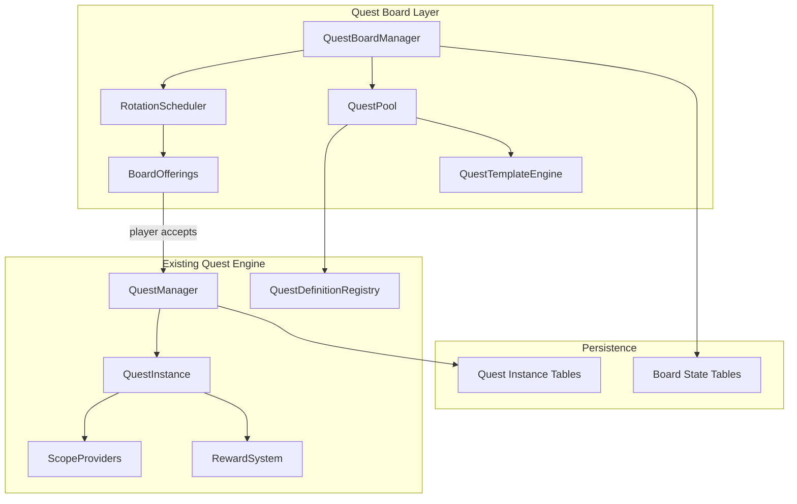
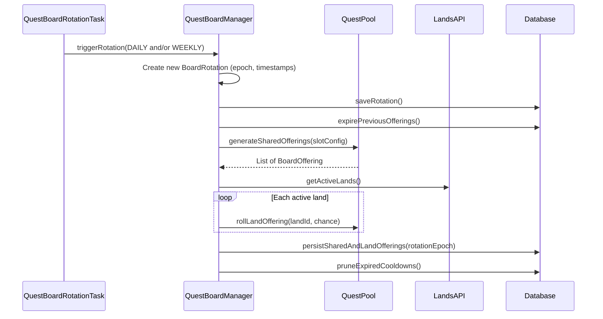
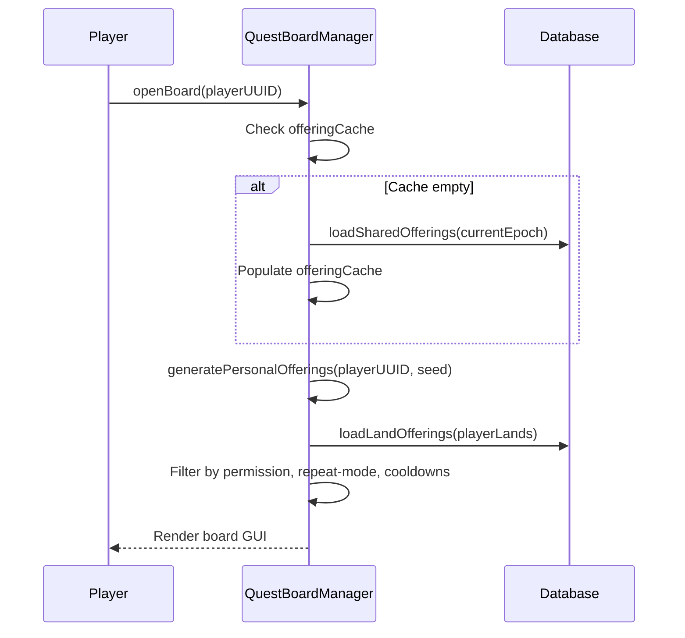
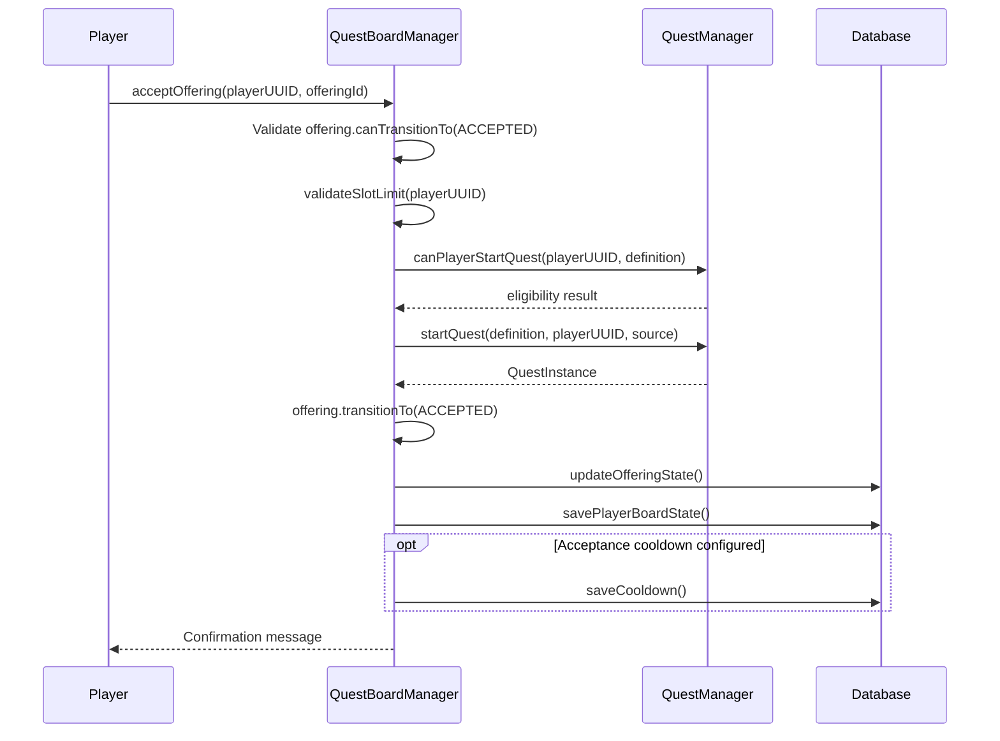

# Quest Board Feature Design

## Architecture Overview

The quest board is a **curation and presentation layer** on top of the existing quest engine. Once a player accepts a board quest, it becomes a standard `QuestInstance` with a source tag. The board manages what quests are *offered* and enforces board-specific constraints (slot limits, abandonment, rotation).




## Core Concepts

### 1. Quest Board Entity

A `QuestBoard` is identified by a `NamespacedKey` (e.g., `mcrpg:default_board`). For v1, there is one global board. The design uses a `QuestBoardManager` that manages boards by key, so adding NPC-specific boards later is a registry lookup away.

**Board Configuration** (YAML):

- `slot-layout`: defines custom slot categories with min/max counts, chance, visibility, and scope
- `max-accepted-quests`: base number of board quests a player can have active simultaneously
- `refresh-times`: configurable rotation time (default `00:00 UTC`) and weekly reset day
- `reputation-scaling`: (future) hooks for modifying slot counts based on player reputation

### 2. Board Slots and Offerings

A board has fully **custom, data-driven slot categories**. Categories are not hardcoded -- server admins can define any number of categories with arbitrary names. Each category specifies its behavioral properties: visibility mode, scope, refresh type, and generation parameters.

**Slot configuration example:**

Global board settings live in `board.yml`:

```yaml
# board.yml
slot-layout:
  minimum-total-offerings: 3
```

Categories are defined in YAML files under `quest-board/categories/`. The system recursively scans this directory for `.yml`/`.yaml` files, similar to how `QuestConfigLoader` scans the quests directory. Each file can contain one or more categories as top-level keys -- the one-file-per-category layout is a recommended practice for convenience, not a technical restriction. Server owners can group related categories in a single file if they prefer. The key benefit of separate files is that server owners can delete or rename a file (e.g., `land-daily.yml.disabled`) to cleanly remove categories tied to soft dependencies like Lands -- no warnings, no leftover config noise.

**quest-board/categories/shared-daily.yml:**

```yaml
shared-daily:
  visibility: SHARED
  refresh-type: DAILY
  refresh-interval: 1d
  completion-time: 24h
  scope: mcrpg:single_player
  min: 2
  max: 4
  chance-per-slot: 1.0
  priority: 1
```

**quest-board/categories/shared-weekly.yml:**

```yaml
shared-weekly:
  visibility: SHARED
  refresh-type: WEEKLY
  refresh-interval: 7d
  completion-time: 7d
  scope: mcrpg:single_player
  min: 1
  max: 2
  chance-per-slot: 0.8
  priority: 2
```

**quest-board/categories/personal-daily.yml:**

```yaml
personal-daily:
  visibility: PERSONAL
  refresh-type: DAILY
  refresh-interval: 1d
  completion-time: 24h
  scope: mcrpg:single_player
  min: 1
  max: 3
  chance-per-slot: 1.0
  priority: 3
```

**quest-board/categories/personal-weekly.yml:**

```yaml
personal-weekly:
  visibility: PERSONAL
  refresh-type: WEEKLY
  refresh-interval: 7d
  completion-time: 7d
  scope: mcrpg:single_player
  min: 0
  max: 2
  chance-per-slot: 0.5
  priority: 4
```

**quest-board/categories/land-daily.yml** (delete this file if Lands is not installed):

```yaml
land-daily:
  visibility: SCOPED
  refresh-type: DAILY
  refresh-interval: 1d
  completion-time: 3d
  scope: mcrpg:land_scope
  min: 0
  max: 1
  chance-per-slot: 0.15
  appearance-cooldown: 7d
  priority: 5
```

Server admins can add custom categories by creating new files:

**quest-board/categories/vip-daily.yml:**

```yaml
vip-daily:
  visibility: PERSONAL
  refresh-type: DAILY
  refresh-interval: 1d
  completion-time: 48h
  scope: mcrpg:single_player
  min: 0
  max: 2
  chance-per-slot: 1.0
  priority: 6
  required-permission: "mcrpg.board.vip"
```

**Category properties:**

- `visibility`: `SHARED` (same for all players), `PERSONAL` (per-player), or `SCOPED` (per-group, e.g., per-land)
- `refresh-type`: `DAILY` or `WEEKLY` (determines which rotation cycle triggers regeneration)
- `refresh-interval`: how often offerings in this category rotate (e.g., `1d`, `3d`, `7d`)
- `completion-time`: how long a player has to complete a quest after accepting it (e.g., `24h`, `7d`). Independent of `refresh-interval`.
- `scope`: the quest scope provider key (references `QuestScopeProviderRegistry`)
- `min`/`max`/`chance-per-slot`: generation parameters
- `priority`: determines fill order when enforcing `minimum-total-offerings`
- `appearance-cooldown` (optional): after an offering is generated in this category for a given entity (player for PERSONAL, land for SCOPED, server for SHARED), that entity can't receive another offering from this category for this duration -- even if `chance-per-slot` would succeed. Prevents categories from firing too frequently.
- `required-permission` (optional): category only visible to players with this permission

**Generation logic**: For each category, check `appearance-cooldown` first -- if the category is on cooldown for this entity, skip it entirely. Then the `min` slots are always filled. For each additional slot up to `max`, roll against `chance-per-slot`. When selecting a quest/template to fill a slot, exclude any definitions that are: (a) on an active `acceptance-cooldown` for the relevant scope, or (b) ineligible for the player due to `repeat-mode` (completed ONCE quests, maxed LIMITED quests, active COOLDOWN quests). If the total across all applicable categories falls below `minimum-total-offerings`, fill additional slots from non-cooldown categories in `priority` order until the minimum is met.

**Minimum offerings shortfall**: If there are not enough eligible quest definitions or templates to reach `minimum-total-offerings` (e.g., all definitions are on cooldown, filtered by repeat-mode, or there simply aren't enough defined), the system generates as many valid offerings as it can and logs a warning with details on the shortfall (e.g., `"Quest board generated 3/5 minimum offerings: 4 quests excluded by cooldown, 2 excluded by repeat-mode, 1 category disabled"`). The minimum is a target, not a hard guarantee. Cooldown and repeat-mode constraints are never relaxed to fill slots -- this preserves the integrity of those systems. Duplicate quest definitions are never generated to pad the count.

**Per-player minimum offering modifiers**: The `minimum-total-offerings` can be increased per player via the static permission node `mcrpg.extra-offerings.<n>` (e.g., `mcrpg.extra-offerings.2` adds +2 to the player's minimum). This permission prefix is hardcoded, not configurable. It stacks with the base minimum and is resolved at board open time for personal categories.

Land/scoped quest slots are rolled **once per day per land** during the same rotation cycle as shared quests (not lazily). This means land offerings are generated server-side at rotation time, not on board open.

Each `BoardOffering` contains:

- The resolved `QuestDefinition` (either from registry or generated from template)
- `QuestRarity`
- Slot category metadata
- Offering expiration timestamp (when this offering rotates off the board)
- Quest completion time (how long the player has to complete after accepting -- independent of rotation)

**Per-player offerings are lazily generated** on first board open per rotation period using a deterministic seed `hash(playerUUID, rotationEpoch, slotIndex)`. This avoids computing offerings for players who never open the board, while ensuring the same player sees the same offerings if they reopen.

### 3. Rarity System

`QuestRarity` is a **configurable registry** (not a hardcoded enum) so server admins can define their own tiers. Rarity display names and labels are stored in `en.yml` and resolved through `McRPGLocalizationManager`, using MiniMessage formatting throughout (no legacy `&` color codes).

**Rarity config** (in `board.yml`):

```yaml
rarities:
  COMMON:
    weight: 60
    difficulty-multiplier: 1.0
    reward-multiplier: 1.0
  UNCOMMON:
    weight: 25
    difficulty-multiplier: 1.25
    reward-multiplier: 1.5
  RARE:
    weight: 10
    difficulty-multiplier: 1.5
    reward-multiplier: 2.0
  LEGENDARY:
    weight: 5
    difficulty-multiplier: 2.0
    reward-multiplier: 3.0
```

**Localization** (in `en.yml`, resolved via `McRPGLocalizationManager`):

```yaml
quest-board:
  rarities:
    COMMON:
      display-name: "<white>Common"
    UNCOMMON:
      display-name: "<green>Uncommon"
    RARE:
      display-name: "<blue>Rare"
    LEGENDARY:
      display-name: "<gold>Legendary"
```

**Difficulty multiplier vs. reward multiplier**: These are intentionally separate knobs:

- `difficulty-multiplier`: scales the effort required (progress amounts). "Legendary quests demand 2x the work."
- `reward-multiplier`: scales the payout. "Legendary quests pay 3x the rewards."

This lets admins tune the value proposition per tier. A LEGENDARY quest with 2x difficulty but 3x reward feels disproportionately rewarding, making it exciting to see one on the board. The rarity difficulty multiplier stacks with the per-pool difficulty from templates: `actual_progress = base * pool_difficulty * rarity_difficulty`. Rewards follow: `actual_reward = base_reward * pool_difficulty * rarity_reward_multiplier`.

**Global weights are the single source of truth** for rarity selection. When the board generates an offering for a slot, it rolls against these global weights to determine the rarity. Templates and hand-crafted quests declare which rarities they support (via `supported-rarities`), and only those that support the rolled rarity are eligible to fill the slot. Templates can optionally override the difficulty/reward multipliers for specific rarities via `rarity-overrides` (see section 8), falling back to the global values when not overridden.

Rarity affects:

- Weighted selection probability when populating board slots (global weights, single source of truth)
- Difficulty scaling (effort/progress requirements) -- overridable per template
- Reward scaling (payout amounts) -- overridable per template
- Rarity-conditional rewards (via `min-rarity` / `required-rarity` on reward distribution tiers and base rewards)
- Display styling in GUI (driven by MiniMessage tags in localization)
- Potentially restricts which slots a rarity can appear in (e.g., LEGENDARY only in weekly slots)

### 4. Quest Source Tagging

`QuestSource` is an **abstract class** identified by a `NamespacedKey`, following the same registry pattern as `QuestObjectiveType` and `QuestRewardType`. Concrete implementations are registered via `QuestSourceRegistry` and distributed through `QuestSourceContentPack` (a `McRPGContentPack<QuestSource>`).

Each `QuestSource` subclass provides:

- `getKey()` -- the `NamespacedKey` identifier (e.g., `mcrpg:board_personal`)
- `isAbandonable()` -- whether quests from this source can be abandoned by the player

Built-in sources:

- `mcrpg:board_personal` -- taken from personal board slots (abandonable)
- `mcrpg:board_land` -- taken from land board (abandonable, with land leader/admin permission gate)
- `mcrpg:ability_upgrade` -- existing upgrade quests (not abandonable)
- `mcrpg:manual` -- admin/command assigned (not abandonable)

Third-party plugins register additional sources via `QuestSourceContentPack` in their `ContentExpansion` (e.g., `npc:quest_giver`).

The `questSource` field on `QuestInstance` is **non-nullable** -- every quest instance must have a source. Deserialization from the database uses `QuestSourceRegistry.get(NamespacedKey)` to resolve the stored key back to the concrete `QuestSource` instance.

This enables:

- **Abandonment scoping**: `questSource.isAbandonable()` gates cancellation
- **Slot accounting**: count active quests by source to enforce limits
- **Analytics**: track quest engagement by source

### 5. Board-Specific Quest Constraints

**Slot limits**: Configured per board. `max-accepted-quests: 3` means a player can have at most 3 active quests sourced from this board. Land quests do NOT count against this -- they have their own limit per land.

**Permission-based extra quest slots**: Players can receive additional quest slots via the static permission node `mcrpg.extra-quest-slots.<n>`. For example, `mcrpg.extra-quest-slots.5` grants 5 extra slots on top of the base `max-accepted-quests`. This permission prefix is hardcoded, not configurable. The system scans the player's permissions for the highest matching value.

```yaml
max-accepted-quests: 3
```

**Configurable completion time per category**: Both the **refresh interval** and the **completion time** are configured on the slot category, not on individual quests. All quests offered through a given category share the same timing. When a player accepts an offering, the `QuestInstance` is created with `expirationTime = now + completionTime` from the category config. The offering itself may rotate off the board on its own schedule, but the accepted quest lives on for its full completion window.

This is configured in the category definition (see section 2):

```yaml
categories:
  shared-daily:
    refresh-interval: 1d
    completion-time: 24h
    # ... other category properties
  shared-weekly:
    refresh-interval: 7d
    completion-time: 7d
    # ... other category properties
  land-weekly:
    refresh-interval: 3d
    completion-time: 7d
    # ... other category properties
```

This decoupling means a weekly category can refresh every 3 days but give players 7 days to complete, a daily category refreshes every 24 hours and gives 24 hours from acceptance, etc.

**Abandonment**: `QuestInstance` checks `questSource.isAbandonable()` before allowing cancellation. Board sources return true; others return false (or configurable).

**Quest acceptance cooldowns**: Individual quest definitions and templates can specify an acceptance cooldown that locks the quest out of the board pool after someone accepts it. This is configured on the quest/template, not the category:

```yaml
board-metadata:
  board-eligible: true
  acceptance-cooldown: 30d
  cooldown-scope: GLOBAL
```

The `board-eligible` field is an explicit toggle. When set to `false`, the quest retains its board metadata (cooldowns, scoping) but is temporarily excluded from board generation without requiring removal of the entire `board-metadata` section.

Cooldown scopes:

- `GLOBAL` -- after acceptance, this quest definition can't appear on the board for *anyone* for the cooldown duration. Creates true exclusivity ("I got the legendary quest and nobody else can for a month").
- `PLAYER` -- after acceptance, this quest definition won't appear on the board for *the accepting player* for the cooldown duration. Other players can still see it. Controls board-specific variety independent of repeat eligibility.
- `SCOPE_ENTITY` -- after acceptance, this quest definition won't appear for *that group entity* (e.g., that specific land) for the cooldown duration. Other lands can still get it.

**Board acceptance cooldown vs. repeat-mode cooldown**: These are distinct systems that answer different questions:

- **Repeat cooldown** (`repeat-mode` / `repeat-cooldown` on `QuestDefinition`): "Can this player accept this quest *from any source*?" Applies to board, NPCs, admin commands, programmatic assignment -- everything. This is a global eligibility gate.
- **Board acceptance cooldown** (`acceptance-cooldown` in `board-metadata`): "Can this quest *appear on the board* for this player/group/server?" Only affects board visibility. Has no effect on NPC quest givers or other sources.

**When both are useful** -- distinct use cases:


| Scenario                  | Repeat cooldown | Board cooldown | Effect                                                                                                                                                                 |
| ------------------------- | --------------- | -------------- | ---------------------------------------------------------------------------------------------------------------------------------------------------------------------- |
| NPC daily quest, no board | `COOLDOWN: 24h` | (none)         | Player gets quest from NPC, can redo every 24h. Board not involved.                                                                                                    |
| Board variety             | `REPEATABLE`    | `PLAYER: 7d`   | Quest is always repeatable, but won't appear on the board for this player for 7 days. Ensures the board shows fresh content. Player could still get it from an NPC.    |
| Legendary exclusivity     | `REPEATABLE`    | `GLOBAL: 30d`  | Once anyone takes it from the board, nobody else sees it for 30 days. But if an admin assigns it, repeat-mode allows it.                                               |
| Strict one-time quest     | `ONCE`          | (none)         | Player can never do it again from any source. Board filters it via repeat-mode check. No board cooldown needed.                                                        |
| Board + NPC hybrid        | `COOLDOWN: 24h` | `PLAYER: 7d`   | Player completes quest. After 24h, they can get it again from an NPC. But it won't reappear on their board for 7 days. Board shows variety while NPC stays responsive. |


**Repeat-mode integration**: The board respects the existing `repeat-mode` / `repeat-cooldown` on `QuestDefinition` during generation and display. A quest is filtered out of a player's board if:

- `repeat-mode: ONCE` and the player has completed it
- `repeat-mode: LIMITED` and the player has reached `repeat-limit` completions
- `repeat-mode: COOLDOWN` and the player's repeat cooldown has not expired

This check happens at board open time for personal offerings and uses the existing `QuestCompletionLogDAO` to look up completion history. Both repeat-mode AND board acceptance cooldown must be satisfied for a quest to appear on the board. They are independent checks.

**Cooldown trigger timing**: The two board-specific cooldown types trigger at different points, matching their intent:

- **Appearance cooldown** triggers at **generation time**. Its purpose is streak prevention -- controlling how often an *opportunity* shows up. If a land quest appears but nobody takes it, the cooldown is already active. The 15% `chance-per-slot` handles base rarity; the appearance cooldown prevents lucky streaks.
- **Acceptance cooldown** triggers at **acceptance time only**. Its purpose is exclusivity/variety after commitment. If a quest appears on the board but nobody takes it and it rotates off, **no acceptance cooldown is applied**. The quest is immediately eligible to appear again in the next rotation.

Category appearance cooldowns, quest acceptance cooldowns, and repeat-mode are all independent. All applicable checks must be satisfied for a quest to appear on the board for a given player.

### 6. Land Board Quests

Land quests are a distinct board section, not mixed into personal slots:

- **Generation**: Land offerings are rolled once per day per land at rotation time (same pass as shared quests). Each land slot rolls against its `chance-per-slot` (e.g., 0.15 = 15% chance a land quest appears on any given day). This is NOT lazy -- all land offerings are generated and persisted server-side during rotation.
- **Visibility**: Each land sees its own offerings. Since a player can be in multiple lands, the board GUI shows a land selector (or tabs) for each land the player has leader/admin role in.
- **Acceptance**: Only players with land admin/leader role can accept. Uses Lands API for permission checks.
- **Slot limit**: One active land board quest per land (configurable via `max-land-quests-per-land: 1`). This is a land-level limit, completely separate from personal slot accounting.
- **Contributions**: All land members can contribute. The existing `playerContributions` map on `QuestObjectiveInstance` tracks this naturally.
- **Abandonment**: Only players with land admin/leader role can abandon a land quest -- the same permission gate as acceptance. Regular land members cannot cancel the quest.
- **Does not consume personal slots**: Completely separate accounting.

**Land lifecycle edge cases:**

- **New land creation**: A newly created land will not have any board quest offerings until the next rotation. This is expected behavior -- land offerings are generated at rotation time, not on-demand. No special handling needed, but the board GUI should display a clear message (e.g., "No land quests available. New offerings are generated daily at [rotation time].") so players understand why the board is empty.
- **Land disbandment**: Register a listener for the Lands `LandDeleteEvent` (or equivalent). When a land is disbanded, any active land board quest for that land is automatically cancelled via the existing quest cancellation flow. The land's board state and any associated cooldowns are cleaned up. Rewards are not distributed for cancelled quests.
- **Player removed from land**: If a land admin/leader who accepted the quest is removed from the land, the quest continues -- it belongs to the land, not the individual. Other admins/leaders can still manage it. If the land has no remaining admins/leaders, the quest continues but no one can abandon it until leadership is resolved (this is a Lands plugin concern, not ours).
- **Player role change**: If a player who accepted the quest is demoted from admin/leader, they lose the ability to abandon the quest. The quest itself is unaffected.

**Soft dependency handling (Lands, Factions, etc.):**

The Lands integration (and future Factions, etc.) is a soft dependency. The system must handle any possible state gracefully:

- **Plugin uninstalled or fails to load**: If the Lands plugin is not present at startup, SCOPED categories that reference `mcrpg:land_scope` are skipped during registration. The `LandQuestScopeProvider` is not registered, and no land board categories are active. No new land offerings are generated.
- **Previously generated/accepted land quests still exist**: If Lands was previously installed and there are active land quest instances or board offerings in the database, these are **not deleted**. However, since the scope provider is unavailable, these quest instances are **not loaded into memory** at startup -- they remain dormant in the database. While dormant, no contributions can be tracked, no completion logic fires, and the quest is invisible on the board. Board offerings from the previous rotation are marked expired on next rotation as normal. The completion timer is **not frozen** -- it continues to tick based on the absolute expiry timestamp. If the deadline passes while dormant, the quest naturally expires when eventually loaded.
- **Plugin reinstalled**: If Lands is restored on a future reboot, the scope provider re-registers and dormant quest instances are loaded into memory normally. If their expiry timestamp has already passed, they expire immediately on load (natural expiry -- no special extension). If they're still within the completion window, they resume as if nothing happened. Land categories become active again on the next rotation.
- **Quest history with missing scope**: Completed land quests from when Lands was active still appear in a player's quest history. To support this, a `scope_display_name` field is persisted on the `QuestInstance` at acceptance time, populated using the English locale (e.g., "MyKingdom"). Normal rendering uses the live localization via the scope provider; the stored English name is only used as a fallback when the scope provider is unavailable. This keeps history fully self-contained without requiring the original plugin.
- **Detection**: At startup, the system checks for each scope provider's plugin dependency (e.g., `Bukkit.getPluginManager().getPlugin("Lands")`). Categories referencing unavailable scope providers log a warning and are disabled. This check is re-evaluated on plugin reload.

This pattern applies identically to any future group-scope plugin (Factions, Towny, parties, etc.) -- the scope provider registry is the single point where soft dependencies are resolved.

### 7. Contribution-Based Reward Distribution

New `RewardDistribution` config applicable at **quest, phase, stage, and objective** levels for non-solo quests. Uses named map keys and clear type names for non-technical server owners:

```yaml
reward-distribution:
  top-contributor:
    type: TOP_PLAYERS
    top-player-count: 1
    rewards:
      bonus-xp:
        type: mcrpg:experience
        skill: MINING
        amount: 1000
  legendary-top-contributor:
    type: TOP_PLAYERS
    top-player-count: 1
    min-rarity: LEGENDARY
    rewards:
      legendary-bonus:
        type: mcrpg:item
        item: DIAMOND_BLOCK
        amount: 5
  top-three:
    type: TOP_PLAYERS
    top-player-count: 3
    rewards:
      silver-reward:
        type: mcrpg:command
        command: "give %player% gold_ingot 5"
  major-contributor:
    type: CONTRIBUTION_THRESHOLD
    min-contribution-percent: 20
    rewards:
      threshold-reward:
        type: mcrpg:experience
        skill: MINING
        amount: 500
  contributor:
    type: CONTRIBUTION_THRESHOLD
    min-contribution-percent: 5
    rewards:
      participation-reward:
        type: mcrpg:experience
        skill: MINING
        amount: 100
  rare-participant:
    type: PARTICIPATED
    min-rarity: RARE
    rewards:
      rare-bonus:
        type: mcrpg:experience
        skill: MINING
        amount: 200
  active-participant:
    type: PARTICIPATED
    rewards:
      participation:
        type: mcrpg:money
        amount: 50
  land-member:
    type: MEMBERSHIP
    rewards:
      membership-bonus:
        type: mcrpg:money
        amount: 10
```

**Reward distribution types:**

- `TOP_PLAYERS` -- rewards the top `top-player-count` contributors by total contribution
- `CONTRIBUTION_THRESHOLD` -- rewards any player whose contribution is >= `min-contribution-percent` of the total
- `PARTICIPATED` -- rewards any player who made **at least one contribution** to the quest (even minimal)
- `MEMBERSHIP` -- rewards any player who was a **member of the group** (e.g., land member) when the quest completed, regardless of whether they contributed at all. This is the "you were along for the ride" tier.

**Rarity-conditional tiers**: Any distribution tier can include an optional `min-rarity` field. When present, the tier only applies if the quest instance was generated at that rarity or higher. This enables rewards like "the top contributor gets a bonus item, but only on LEGENDARY quests." The `min-rarity` approach is more flexible than exact match -- `min-rarity: RARE` automatically includes LEGENDARY too. For exact match, use `required-rarity` instead.

Rarity-conditional rewards also work on the base `rewards` section (not just distribution tiers), so even solo board quests can have rarity-gated bonus rewards.

The distinction between `PARTICIPATED` and `MEMBERSHIP` is important: it lets server admins give a small reward to all group members while giving a better reward to those who actually contributed.

Tier labels (displayed to players) are resolved from localization via `McRPGLocalizationManager` using the map key as the route suffix (e.g., `quest-board.reward-tiers.top-contributor.label`), keeping display concerns out of the config file.

**Multi-level reward distribution**: The `reward-distribution` block can appear at any level of the quest definition hierarchy:

- **Quest level**: contributions aggregated across all objectives in the entire quest
- **Phase level**: contributions aggregated across all objectives in that phase
- **Stage level**: contributions aggregated across all objectives in that stage
- **Objective level**: contributions from that specific objective only (directly from `playerContributions` map)

Each level resolves independently. A quest could have no distribution at the quest level but have per-objective distributions, or vice versa. They stack -- a player can earn rewards from an objective-level distribution AND a quest-level distribution.

**Resolution logic** at completion of each level:

1. Aggregate contributions for the relevant scope (objective = direct, stage/phase/quest = sum children)
2. Resolve group membership list (for `MEMBERSHIP` type -- via scope provider, e.g., `Land.getTrustedPlayers()`)
3. Rank contributing players by total contribution
4. Evaluate each distribution tier; a player can match multiple tiers (they stack)
5. Grant all matched rewards
6. Offline players get rewards queued via existing `PendingRewardDAO`

A `RewardDistributionResolver` class handles the math. The existing `QuestCompleteListener`, `QuestStageCompleteListener`, `QuestPhaseCompleteListener`, and `QuestObjectiveCompleteListener` would each check for and delegate to the resolver when a `reward-distribution` block is present.

### 8. Quest Templates (Procedural Generation)

Designed ambitiously, built in phases.

**Phase 1 -- Simple Parameterization with Difficulty-Scaled Pools:**

Template variables use a **pool selection** system with **difficulty scaling**. Each pool has a difficulty rating that feeds into reward and progress calculations. The engine selects one or more pools based on rarity weights, and the resulting difficulty scalar propagates through the template as a built-in `difficulty` variable.

Expression fields (like `required-progress` and reward `amount`) use the **existing `Parser` system** from mccore -- the same one that powers `"20*(tier^2)"` in upgrade quests. Template variables are injected into the Parser's variable context alongside any other variables. No new expression syntax is introduced. **Template variable names use underscores** (e.g., `block_count`, `target_blocks`) -- this is an intentional exception to the normal YAML hyphen convention because the Parser treats `-` as the subtraction operator. A key like `block-count` would be parsed as `block minus count`, breaking expressions. All other YAML keys (non-variable fields) continue to use hyphens as normal.

The rarity for each board slot is determined by the **global rarity weights** (section 3). Templates declare which rarities they support via `supported-rarities` -- only templates that support the rolled rarity are eligible to fill that slot. Templates can optionally override the global difficulty and reward multipliers for specific rarities via `rarity-overrides`.

```yaml
quest-templates:
  mcrpg:daily-mining:
    # Localization route for the quest display name (resolved via McRPGLocalizationManager)
    display-name-route: "quests.templates.daily-mining.display-name"

    # Whether this template can be selected by the quest board
    board-eligible: true

    # Quest scope provider -- determines who can contribute
    scope: mcrpg:single_player

    # Which rarity tiers this template supports (must match keys in board.yml rarities)
    supported-rarities: [COMMON, UNCOMMON, RARE]

    # Optional: override global rarity multipliers for this template
    rarity-overrides:
      RARE:
        difficulty-multiplier: 2.0   # overrides global RARE difficulty (default 1.5)
        reward-multiplier: 2.5      # overrides global RARE reward (default 2.0)

    # Template variables -- resolved at generation time, injected into Parser context
    # Variable names use underscores (not hyphens) because Parser treats - as subtraction
    variables:

      # POOL variable: randomly selects one or more groups of blocks
      # Each pool has a difficulty scalar that feeds into reward/progress scaling
      target_blocks:
        type: POOL
        min-selections: 1            # always pick at least 1 pool
        max-selections: 2            # may pick up to 2 pools (values merged)
        pools:
          common-stone:
            difficulty: 1.0          # easy targets = low difficulty scalar
            weight:                  # selection probability per rarity tier
              COMMON: 80
              UNCOMMON: 20
              RARE: 0
            values: [STONE, COBBLESTONE, ANDESITE]
          ores:
            difficulty: 1.5
            weight:
              COMMON: 15
              UNCOMMON: 60
              RARE: 20
            values: [IRON_ORE, COPPER_ORE, COAL_ORE]
          custom-ores:
            difficulty: 2.0
            weight:
              COMMON: 5
              UNCOMMON: 15
              RARE: 40
            # Supports CustomBlockWrapper identifiers for third-party block plugins
            values: ["oraxen:mythril_ore", "itemsadder:ruby_ore"]
          precious:
            difficulty: 3.0          # hard targets = high difficulty scalar
            weight:
              COMMON: 0              # never appears on COMMON quests
              UNCOMMON: 5
              RARE: 40
            values: [DIAMOND_ORE, EMERALD_ORE]

      # RANGE variable: random number within min/max, scaled by difficulty
      # Final value: random(min, max) * pool_difficulty * rarity_difficulty
      block_count:
        type: RANGE
        base: { min: 32, max: 64 }

      # POOL variable for mob targets
      target_mobs:
        type: POOL
        min-selections: 1
        max-selections: 1
        pools:
          undead:
            difficulty: 1.0
            weight:
              COMMON: 70
              UNCOMMON: 20
              RARE: 0
            values: [ZOMBIE, SKELETON]
          hostile:
            difficulty: 1.5
            weight:
              COMMON: 25
              UNCOMMON: 50
              RARE: 20
            values: [CREEPER, WITCH]
          custom-mobs:
            difficulty: 3.0
            weight:
              COMMON: 5
              UNCOMMON: 30
              RARE: 80
            # Supports CustomEntityWrapper identifiers for third-party mob plugins
            values: ["mythicmobs:fire_elemental", "mythicmobs:dragon_minion"]

      # RANGE variable for mob kill count, same scaling as block_count
      mob_count:
        type: RANGE
        base: { min: 10, max: 25 }

    # Quest structure -- phases, stages, and objectives
    # Variable references use underscores (matching the variable key names)
    phases:
      mine-phase:
        completion-mode: ALL         # all stages must complete
        stages:
          mine-stage:
            objectives:
              break-blocks:
                type: mcrpg:block_break
                required-progress: "block_count"
                config:
                  blocks: target_blocks
              kill-mobs:
                type: mcrpg:mob_kill
                required-progress: "mob_count"
                config:
                  entities: target_mobs

    # Quest rewards -- expressions can reference any template variable + difficulty
    # "difficulty" is a built-in variable = pool_difficulty * rarity_difficulty
    rewards:
      xp-reward:
        type: mcrpg:experience
        skill: MINING
        amount: "block_count * 5 * difficulty"
```

**Variable types:**

- `POOL`: selects `min-selections` to `max-selections` pools by weighted random (per rarity). Each pool has a `difficulty` scalar. The selected values are merged into a flat list for the objective config. The average difficulty of selected pools becomes the `difficulty` variable in the Parser context.
- `RANGE`: a numeric range (`min`/`max`). The full difficulty chain is applied: `actual = random(min, max) * pool_difficulty * rarity_difficulty_multiplier`. The resolved value is injected into the Parser variable context under the variable name (e.g., `block_count`).

**Custom type support**: Pool values can be vanilla `Material` / `EntityType` names OR `CustomBlockWrapper` / `CustomEntityWrapper` identifiers (e.g., `"oraxen:mythril_ore"`, `"mythicmobs:fire_elemental"`). The template engine resolves these into the same wrapper types used by the existing `BlockBreakObjectiveType` and `MobKillObjectiveType`.

**Difficulty flow**: The `difficulty` variable is the product of pool difficulty and rarity difficulty multiplier, injected into the `Parser` variable context alongside all other template variables. It's available in all expression fields (`required-progress`, reward `amount`, etc.) using the same syntax as existing quest expressions (e.g., `"block_count * 5 * difficulty"` works exactly like `"20*(tier^2)"`). This ties pool selection and rarity tier directly to reward/progress scaling without introducing any new expression syntax.

The `QuestTemplateEngine` resolves variables at generation time:

1. Receive the rarity rolled by the board (from global rarity weights)
2. Resolve the effective difficulty/reward multipliers (template `rarity-overrides` if present, otherwise global rarity config)
3. For each `POOL` variable: select pools by rarity-weighted random, merge values, compute pool difficulty
4. For each `RANGE` variable: resolve random value within range, apply difficulty multiplier
5. Substitute all variables (including `${difficulty}`) into the definition structure
6. Produce an ephemeral `QuestDefinition` serialized to JSON for persistence

**Quest source selection**: For each board slot, after rolling the rarity, the system selects the quest **source** (hand-crafted definition or template) using configurable weights in `board.yml`:

```yaml
quest-source-weights:
  hand-crafted: 50
  template: 50
```

Both sources are treated as equals. The weight determines the probability of drawing from each pool. If one pool is empty for the rolled rarity (e.g., no templates support LEGENDARY), 100% goes to the other pool. If both are empty, the system falls back to all-rarity hand-crafted backfill. Setting a weight to 0 disables that source entirely. This selection is encapsulated in `QuestPool.selectForSlot()` which returns a `SlotSelection` sealed interface (`HandCrafted` or `TemplateGenerated`).

**Expression validation at template load time**: Template expressions (e.g., `"block_count * 5 * difficulty"`) are validated at YAML load time by trial-parsing with the existing `McCore.Parser`. The `Parser.getParsedVariables()` method detects undeclared variable references, while the trial-parse itself catches syntax errors. This catches configuration issues at server startup rather than at quest generation time.

**Ephemeral definitions**: When a template-generated offering is accepted, the deserialized `QuestDefinition` is registered in `QuestDefinitionRegistry` under a `mcrpg:gen_` prefixed key. This allows the full quest lifecycle to work identically to hand-crafted quests. On quest completion or cancellation, the ephemeral definition is deregistered from the registry. On server restart, active template-generated quests recover their definitions from the persisted JSON snapshot.

**Phase 2 -- Conditional Objectives (delivered in board Phase 4):**

- `TemplateCondition` extensible interface evaluated at generation time; covers phase, stage, and objective levels (not just `if` blocks -- full registry + content pack pattern matching all other pluggable types)
- Built-in types: `RarityCondition`, `ChanceCondition`, `VariableCondition`, `CompoundCondition`, `PermissionCondition`, `CompletionPrerequisiteCondition`; third-party conditions registered via `TemplateConditionRegistry` and `TemplateConditionContentPack`
- `ConditionContext` record -- unified evaluation context reused across template generation, prerequisite checks, and reward grant-time evaluation (single interface, not separate `RewardCondition` / `PrerequisiteCondition` interfaces)
- Variable-dependent stage gating: `VariableCondition` checks resolved variable values after pool/range resolution (e.g., "did the selected pool contain DIAMOND_ORE?")
- Template-level and category-level `prerequisite:` sections gate personal offerings behind player progression milestones; shared offerings are never player-filtered at generation time
- Shorthand YAML syntax for built-in conditions; explicit `type:` key for third-party conditions in both standalone and compound blocks

**Phase 3 -- Full Template Language (weighted selection delivered in board Phase 4; cross-referencing deferred):**

- Weighted random objective selection from pools (`ObjectiveSelectionConfig` with `WEIGHTED_RANDOM` mode; per-objective `weight` field on `TemplateObjectiveDefinition`); selection is per-stage, not per-phase
- Expression engine integration was delivered in Phase 2 (existing `Parser` system for `required-progress` expressions -- no new syntax introduced)
- Cross-referencing between templates (compose smaller templates into larger quests) -- deferred to future; see Phase 4 LLD section 13.1

### 9. Rotation Lifecycle

#### 9a. Rotation Trigger

Fired by `QuestBoardRotationTask` when the configurable rotation time is reached. Generates and persists all shared and land offerings for the new period.



#### 9b. Board Open

Triggered when a player opens the board GUI. Loads cached or DB-backed offerings and renders the board.



#### 9c. Quest Acceptance

Triggered when a player clicks an offering in the board GUI.




**Rotation scheduling**: A custom `QuestBoardRotationTask` extending `CancelableCoreTask` (following the pattern of `QuestSaveTask`, `McRPGPlayerSaveTask`, etc.) runs on a configurable interval. It is registered via `McRPGBackgroundTaskRegistrar` using a `ReloadableTask` wrapper so the check frequency is reloadable from config.

The task checks whether the current time has crossed the **configurable rotation time** (default `00:00 UTC`, configurable in `board.yml`). Both daily and weekly rotations trigger at the same configured time -- weekly rotations additionally check the configured day-of-week.

On rotation trigger:

1. Increment rotation epoch for the relevant refresh type (daily and/or weekly)
2. Generate shared offerings for the new period
3. Generate land offerings for all active lands (rolled once per land per day, in the same rotation pass as shared quests)
4. Persist all generated offerings to database (so offerings survive restarts)
5. Per-player offerings remain lazily generated on next board open

```yaml
rotation:
  time: "00:00"
  timezone: "UTC"
  weekly-reset-day: MONDAY
  task-check-interval-seconds: 60
```

**Stale offering cleanup**: When the board rotates, offerings from the previous period are marked expired. Accepted quests from those offerings continue on their own completion timer (independent of rotation).

### 10. Database Schema Additions

```
mcrpg_quest_board_rotation
  - rotation_id (PK, auto-increment)
  - board_key (VARCHAR) -- e.g., "mcrpg:default_board"
  - refresh_type (ENUM: DAILY, WEEKLY)
  - rotation_epoch (BIGINT) -- epoch identifier for this rotation
  - started_at (TIMESTAMP)
  - expires_at (TIMESTAMP)

mcrpg_board_offering
  - offering_id (PK, UUID)
  - rotation_id (FK -> mcrpg_quest_board_rotation)
  - slot_type (VARCHAR) -- SHARED_DAILY, SHARED_WEEKLY, etc.
  - slot_index (INT)
  - quest_definition_key (VARCHAR, nullable) -- for hand-crafted quests
  - generated_definition (JSON, nullable) -- for template-generated quests
  - template_key (VARCHAR, nullable) -- which template generated it
  - rarity_key (VARCHAR)
  - scope_target_id (VARCHAR, nullable) -- land name for LAND slots

mcrpg_player_board_state
  - player_uuid (PK component)
  - board_key (PK component)
  - offering_id (PK component, FK -> mcrpg_board_offering)
  - state (ENUM: VISIBLE, ACCEPTED, COMPLETED, EXPIRED, ABANDONED)
  - accepted_at (TIMESTAMP, nullable)
  - quest_instance_uuid (UUID, nullable, FK -> mcrpg_quest_instances)

mcrpg_scoped_board_state
  - scope_entity_id (VARCHAR, PK component) -- generic entity identifier (land name, faction ID, etc.)
  - scope_provider_key (VARCHAR) -- e.g., "mcrpg:land_scope"
  - board_key (PK component)
  - offering_id (PK component, FK -> mcrpg_board_offering)
  - state (ENUM: VISIBLE, ACCEPTED, COMPLETED, EXPIRED)
  - accepted_at (TIMESTAMP, nullable)
  - accepted_by (UUID) -- who accepted it
  - quest_instance_uuid (UUID, nullable)

mcrpg_board_cooldown
  - cooldown_id (PK, auto-increment)
  - cooldown_type (ENUM: APPEARANCE, ACCEPTANCE)
  - scope_type (ENUM: GLOBAL, PLAYER, SCOPE_ENTITY, CATEGORY)
  - scope_identifier (VARCHAR) -- player UUID, land name, category key, or "GLOBAL"
  - quest_definition_key (VARCHAR, nullable) -- null for category-level cooldowns
  - category_key (VARCHAR, nullable) -- null for quest-level cooldowns
  - expires_at (TIMESTAMP, indexed)

mcrpg_personal_offering_tracking
  - player_uuid (VARCHAR(36), PK component)
  - board_key (VARCHAR(256), PK component)
  - rotation_epoch (BIGINT, PK component)
  - generated_at (BIGINT) -- timestamp when personal offerings were generated
```

The `mcrpg_quest_instances` table includes the following columns (part of the initial schema, not a migration):

- `quest_source VARCHAR NOT NULL` -- the `NamespacedKey` of the `QuestSource` (e.g., `mcrpg:board_personal`). Non-nullable; every quest instance has a source.
- `scope_display_name VARCHAR` (nullable) -- English locale display name of the scope entity (e.g., land name), persisted at acceptance time. Used as a fallback for quest history rendering when the scope provider plugin is unavailable.
- `board_rarity_key VARCHAR` (nullable) -- the `NamespacedKey` of the `QuestRarity` assigned at board acceptance time. Denormalized from the board offering for efficient rarity gating during reward distribution resolution at completion time.

Expired cooldown rows are pruned periodically by the `QuestBoardRotationTask` during rotation.

### 11. Key Modifications to Existing Code

- **QuestInstance**: Add non-nullable `questSource` field (`QuestSource` abstract class, resolved via `QuestSourceRegistry`). Affects constructor, DAO, save/load.
- **QuestDefinition**: Add optional `boardMetadata` with an explicit `board-eligible` toggle, `acceptance-cooldown`, and `cooldown-scope`. Loaded from YAML alongside existing fields. The `board-eligible` flag allows temporary disabling without removing the metadata section.
- **QuestManager**: Add `abandonQuest(questUUID)` that validates source is abandonable, then delegates to existing cancel logic.
- **QuestConfigLoader**: Extend to parse board metadata and `reward-distribution` blocks from quest YAML files at all levels (quest, phase, stage, objective).
- **Completion listeners**: `QuestCompleteListener`, `QuestStageCompleteListener`, `QuestPhaseCompleteListener`, and `QuestObjectiveCompleteListener` each check for `reward-distribution` and delegate to `RewardDistributionResolver` for non-solo quests.
- **Permission parsing**: New utility for scanning player permissions matching a prefix pattern (e.g., `mcrpg.extra-quest-slots.`*) and extracting the numeric suffix.
- **Land event listeners**: New listener for Lands `LandDeleteEvent` that auto-cancels any active land board quest for the disbanded land and cleans up board state/cooldowns. Registered conditionally when Lands plugin is present (same pattern as `LandQuestScopeProvider`).
- **GUI system**: New `QuestBoardGui` with tabs/pages for personal quests, land quests. Slot implementations for offerings, accept buttons, etc. Accessible via **both** a Home GUI slot (replacing the "Coming Soon" slot at index 24) **and** a `/board` command.
- **Offering cache**: The `QuestBoardManager` offering cache is **per-rotation** -- cleared when a rotation triggers, then lazily repopulated from the database on the next board open. Simple invalidation, no stale-data risk.
- **TimeProvider**: All time operations in the board system (and the broader quest system) route through `McCore`'s `TimeProvider` for consistent time access and testability. Direct calls to `System.currentTimeMillis()`, `Instant.now()`, `ZonedDateTime.now()`, etc. are avoided -- all code obtains the current time via `TimeProvider`, which can be substituted with a controllable implementation in tests.

### 12. Configuration Structure

```
plugins/McRPG/
  config.yml                    # existing -- add quest-board section reference, expired-quest-scan-task frequency
  quest-board/
    board.yml                   # global board settings (min offerings, rarities, rotation, limits, quest-source-weights)
    categories/                 # one YAML per category -- delete a file to remove the category
      shared-daily.yml
      shared-weekly.yml
      personal-daily.yml
      personal-weekly.yml
      land-daily.yml            # delete this file if Lands is not installed
    templates/                  # quest template files (recursively scanned)
      daily-mining.yml
      daily-herbalism.yml
      weekly-land-mining.yml
  quests/                       # existing quest definitions
    board/                      # convention: board-eligible quests here
      daily/
        mine-stone.yml
      weekly/
        land-megaproject.yml
  localization/
    en.yml                      # existing -- add quest-board.rarities, quest-board.reward-tiers,
                                # quest-board.gui, and template display names/descriptions
```

`board.yml` now includes a `quest-source-weights` section that controls the probability of selecting hand-crafted vs. template-generated quests for each board slot:

```yaml
quest-source-weights:
  hand-crafted: 50
  template: 50
```

All player-facing text lives in `en.yml` and is resolved through `McRPGLocalizationManager` using MiniMessage formatting. The `board.yml` contains only global mechanical configuration (min offerings, rarities, rotation timing, slot limits). Category definitions are split into individual files under `categories/` -- this is a recommended practice (not enforced) so server owners without Lands (or other soft dependencies) can simply delete the relevant category file rather than dealing with warnings or disabled config blocks.

### 13. Reputation System (Future-Proofing)

Not built in v1, but the design accommodates it:

- Reputation would be modeled as a **player attribute** (similar to how ability attributes like `AbilityCooldownAttribute` and `AbilityTierAttribute` work), stored on the player entity and persisted alongside other player data
- Board slot count can be an expression: `base_slots + floor(reputation / 100)`
- Rarity access can be gated: `LEGENDARY` requires reputation >= 500
- Reputation earned via: board quest completions, contribution rankings
- The `max-accepted-quests` and slot counts are already configurable, so making them expression-based later is straightforward

### 14. Programmatic API for Third-Party Plugins

The quest board system should be extensible by other plugins, following the same registry and expansion patterns used throughout McRPG (e.g., `ContentExpansion`, `QuestObjectiveTypeRegistry`, `QuestRewardTypeRegistry`).

**API surface:**

- **Rarity registration**: Third-party plugins can register custom rarities via the rarity registry. A new rarity is a key + config (weight, difficulty multiplier, reward multiplier). Localization entries are provided by the registering plugin's expansion.
- **Board category registration**: Plugins can register additional slot categories programmatically (e.g., an NPC plugin adding a `bounty-board-daily` category tied to a specific NPC). Categories registered via API follow the same schema as YAML-defined categories.
- **Quest source registration**: Plugins can register new `QuestSource` subclasses via `QuestSourceContentPack` (e.g., `npc:quest_giver`) so their quests integrate with the abandonment and slot accounting systems.
- **Scope provider registration**: Plugins can register custom `QuestScopeProvider` implementations via `QuestScopeProviderContentPack`. The `QUEST_SCOPE_PROVIDER` content handler registers both the provider itself (into `QuestScopeProviderRegistry`) and any associated scope-change listeners. This enables third-party group plugins (Factions, Towny, parties, etc.) to provide scoped quest support through the standard content expansion mechanism.
- **Scoped board adapter registration**: Plugins that register a `QuestScopeProvider` for a group system can also register a `ScopedBoardAdapter` via `ScopedBoardAdapterContentPack` (or directly via their plugin hook). The adapter provides board-specific operations (entity enumeration, permission checks, display names) that enable the `QuestBoardManager` to generate and manage scoped offerings for the group type without any plugin-specific code.
- **Reward distribution type registration**: Plugins can register custom reward distribution types beyond the built-in four (TOP_PLAYERS, CONTRIBUTION_THRESHOLD, PARTICIPATED, MEMBERSHIP). A custom type implements a `RewardDistributionType` interface with a `resolve(ContributionSnapshot, DistributionTierConfig)` method and is registered via `RewardDistributionTypeContentPack`.
- **Quest template registration**: Plugins can register templates via `QuestTemplateContentPack` (programmatic) or by calling `QuestTemplateRegistry.registerTemplateDirectory()` to register a directory of template YAML files. Programmatically registered templates survive config reloads; directory-registered templates are reloaded alongside built-in templates.
- **Board event hooks**: Custom Bukkit events for board lifecycle: `BoardRotationEvent`, `BoardOfferingGenerateEvent` (cancellable), `BoardOfferingAcceptEvent`, `BoardOfferingExpireEvent`, `PersonalOfferingGenerateEvent`, `TemplateQuestGenerateEvent` (cancellable). All board events extend `BoardEvent` and are **synchronous** (not async) -- they fire on the main server thread and handlers execute inline. Plugins can listen to these to add custom logic (e.g., announce legendary quests in chat, filter personal offerings, or cancel template generation for specific templates).

**Integration pattern** (follows existing `ContentExpansion` approach):

```java
public class BountyBoardExpansion implements ContentExpansion {
    @Override
    public Set<McRPGContentPack<?>> getContentPacks() {
        return Set.of(
            new BoardRarityContentPack(customRarities),
            new BoardCategoryContentPack(customCategories),
            new QuestSourceContentPack(customSources),
            new QuestScopeProviderContentPack(customScopeProviders),
            new ScopedBoardAdapterContentPack(customScopedAdapters),
            new QuestTemplateContentPack(customTemplates),
            new RewardDistributionTypeContentPack(customDistributionTypes)
        );
    }
}
```

This keeps the API consistent with how abilities, quest objective types, and reward types are already registered by third-party expansions.

### 15. Unit Testing Strategy

Each phase includes unit tests alongside implementation. Key areas to test:

**Core board logic (no Bukkit dependency):**

- `RewardDistributionResolver`:
  - Pure computation: given a contribution map and distribution config, assert correct reward assignments for TOP_PLAYERS, CONTRIBUTION_THRESHOLD, PARTICIPATED, and MEMBERSHIP types.
  - Rarity-conditional tiers: verify `min-rarity` and `required-rarity` correctly filter distribution tiers based on quest rarity.
  - Multi-level distribution: verify correct aggregation at objective, stage, phase, and quest levels. Verify a player can earn rewards from multiple levels independently.
  - Edge cases: single contributor, zero contributions, ties in ranking, offline players, MEMBERSHIP with no contributors.
- `SlotGenerationLogic`:
  - Given a slot layout config and random seed, assert correct slot counts: min enforcement, chance-per-slot rolls, minimum-total-offerings backfill by priority.
  - Appearance cooldowns: verify category generation is blocked while appearance cooldown is active. Verify cooldown triggers on generation, not acceptance.
  - Acceptance cooldowns: verify specific quest definitions are excluded when on GLOBAL, PLAYER, or SCOPE_ENTITY acceptance cooldown. Verify untaken offerings that expire do NOT create acceptance cooldowns.
  - Repeat-mode filtering: verify ONCE-completed quests are excluded, LIMITED-maxed quests are excluded, COOLDOWN quests on active repeat cooldown are excluded, REPEATABLE quests are always eligible.
  - Interaction between cooldowns and repeat-mode: verify both must pass independently. Verify a quest on board cooldown but off repeat cooldown is still hidden. Verify a quest off board cooldown but on repeat cooldown is still hidden.
  - Categories from missing scope providers (e.g., Lands not installed) are skipped without error.
- `CooldownManager`:
  - Verify cooldown creation and expiry for all scopes (GLOBAL, PLAYER, SCOPE_ENTITY).
  - Verify stacking behavior (category appearance + quest acceptance cooldowns both respected independently).
  - Verify appearance cooldown triggers on offering generation. Verify acceptance cooldown triggers on quest acceptance.
  - Verify pruning of expired cooldowns.
- `PermissionNumberParser` -- given a set of permission strings and a prefix, assert correct extraction of the highest numeric suffix. Test edge cases: no matching permissions, multiple matching permissions (picks highest), non-numeric suffixes ignored.
- `CategoryConfigLoader` -- verify loading categories from multiple files in a directory. Verify multiple categories in a single file. Verify deleted/renamed files result in no categories loaded (no errors). Verify categories referencing unavailable scope providers are skipped with a warning.
- Board offering state transitions (VISIBLE -> ACCEPTED -> COMPLETED/EXPIRED/ABANDONED).
- `RaritySystem` -- verify global weight selection. Verify difficulty and reward multiplier resolution (global defaults, template rarity-overrides). Verify `supported-rarities` filtering (templates only eligible for rarities they support).

**Integration tests (with mocked Bukkit/database):**

- Rotation lifecycle: trigger rotation, verify offerings persisted, trigger again, verify old offerings expired. Verify appearance cooldowns written to DB at generation time.
- Quest acceptance flow: accept offering, verify QuestInstance created with correct source/expiration, verify slot count decremented. Verify acceptance cooldown written to DB. Verify repeat-mode check prevents acceptance of completed ONCE quests.
- Abandonment: verify board quests can be abandoned, non-board quests cannot. Verify land quest abandonment requires admin/leader role. Verify regular land members cannot abandon.
- Land board: verify only leaders can accept, verify land slot accounting is independent, verify contribution aggregation across land members.
- Land disbandment: verify active land quest is auto-cancelled on `LandDeleteEvent`, verify board state and cooldowns cleaned up.
- New land: verify new land has no offerings until next rotation (empty board with informational message).
- Soft dependency removal: verify that with Lands absent, land categories are skipped. Verify existing land quest instances survive and expire naturally. Verify no new land offerings are generated.
- Board cooldown vs. repeat cooldown interaction: verify a quest that is repeatable from NPCs but on board cooldown does not appear on board. Verify a quest off board cooldown but on repeat cooldown does not appear on board.

**Template-specific tests:**

- Deterministic seeding: same seed produces same offerings.
- Difficulty scalar propagation: verify `difficulty` variable (product of pool difficulty and rarity difficulty multiplier) resolves correctly through the existing `Parser` system. Verify rarity-overrides on templates take precedence over global rarity multipliers.
- CustomBlockWrapper/CustomEntityWrapper identifiers parse correctly in pool values.
- Pool selection: verify rarity-weighted pool selection, verify `min-selections`/`max-selections` bounds, verify merged value lists from multiple selected pools.
- Range variables: verify random value within range, verify difficulty multiplier is applied.
- `supported-rarities` filtering: verify templates are only selected for rarities they declare support for.
- Invalid template configs produce clear validation errors (missing required fields, unsupported rarity references, invalid variable types).

## Proposed Implementation Phases

### Phase 1: Core Board Infrastructure

- `QuestBoard`, `QuestBoardManager`, `BoardOffering`, custom data-driven slot categories
- `QuestSource` tagging on `QuestInstance`
- Rarity system (configurable registry, localized via `McRPGLocalizationManager`)
- `QuestBoardRotationTask` (extends `CancelableCoreTask`, registered via `ReloadableTask`)
- Shared board slots with hand-crafted quest pool
- Board-specific slot limits, permission-based extra slots (`mcrpg.extra-quest-slots.<n>`), and abandonment
- Permission number parser utility
- Basic board GUI
- Database schema and DAOs for board state
- Board YAML configuration
- Unit tests: slot generation logic, permission parser, offering state transitions, rotation lifecycle

### Phase 2: Per-Player Slots and Templates

- Per-player offering generation with deterministic seeding
- Per-player minimum offering modifiers via permissions (`mcrpg.extra-offerings.<n>`)
- `QuestTemplate` with `POOL` variables (difficulty-scaled pool selection) and `RANGE` variables
- `CustomBlockWrapper` / `CustomEntityWrapper` support in pool values
- Template YAML parsing and validation
- `QuestTemplateEngine` (variable resolution, difficulty computation, substitution)
- Per-player board state persistence
- Unit tests: template engine, deterministic seeding, difficulty propagation, custom type parsing

**Implementation notes (completed):**

- `QuestTemplateRegistry` with dual-source registration (config-loaded and expansion-registered), supports `registerTemplateDirectory()` for expansion YAML and `QuestTemplateContentPack` for programmatic registration
- `QuestTemplateConfigLoader` recursively scans template directories, validates expressions via McCore `Parser` trial-parse at load time
- `GeneratedQuestDefinitionSerializer` handles JSON serialization/deserialization of generated `QuestDefinition` objects via Gson
- Unified source selection via configurable `quest-source-weights` (hand-crafted/template, default 50/50) in `board.yml` with `SlotSelection` sealed interface and `QuestPool.selectForSlot()`
- Ephemeral `QuestDefinition` lifecycle: registered under `mcrpg:gen_` prefix on acceptance, deregistered on completion/cancellation, recovered from JSON on restart
- Custom exceptions: `QuestGenerationException`, `QuestDeserializationException` for third-party developer diagnostics
- Custom events: `TemplateQuestGenerateEvent` (cancellable), `PersonalOfferingGenerateEvent`
- `PersonalOfferingGenerator` with deterministic seeding and template deduplication
- `ExpiredQuestScanTask` for two-phase expired quest cleanup (in-memory + bulk DB sweep)
- `ReloadableTemplateConfig` for hot-reloading template YAML changes
- `PersonalOfferingTrackingDAO` for tracking per-player generation state
- Database optimized: all `TEXT` columns replaced with sized `VARCHAR`, targeted indexes on all board tables
- 770 unit tests, all passing (up from 639 in Phase 1)

### Phase 3: Land Board Quests and Reward Distribution

- Land board offerings (per-land generation at rotation time)
- Land leader/admin permission checks via Lands API
- Land slot accounting (separate from personal)
- `RewardDistribution` system (TOP_PLAYERS, CONTRIBUTION_THRESHOLD, PARTICIPATED, MEMBERSHIP)
- `RewardDistributionResolver` integrated at quest, phase, stage, and objective completion
- Multi-level contribution aggregation
- Land board GUI tab/section
- Unit tests: reward distribution resolver (all types, edge cases, multi-level), land acceptance permissions

**Implementation notes (completed):**

- Generic `ScopedBoardAdapter` interface + `ScopedBoardAdapterRegistry` -- `QuestBoardManager` never references Lands or any specific group plugin directly; all scoped board operations go through the adapter interface, looked up by scope provider key
- `LandScopedBoardAdapter` registered by `LandsHook` with custom `MANAGE_BOARD_QUESTS` Lands role flag (owner always bypasses; delegation is a two-step opt-in via Lands config allowlisting)
- `LandDeleteListener` translates `LandDeleteEvent` into generic `QuestBoardManager.handleScopeEntityRemoval()` -- cancels active quests, expires visible offerings, prunes cooldowns
- `ScopedBoardStateDAO` is scope-agnostic (single table serves all scope types via `scope_provider_key` + `scope_entity_id` columns)
- Per-scope-type slot limits via `BoardSlotCategory.maxActivePerEntity` with global `max-scoped-quests-per-entity` fallback in `board.yml`
- `RewardDistributionType` interface with four built-in implementations: `TopPlayersDistributionType`, `ContributionThresholdDistributionType`, `ParticipatedDistributionType`, `MembershipDistributionType`
- `RewardDistributionTypeRegistry` for pluggable third-party distribution strategies
- `RewardSplitMode` enum (`INDIVIDUAL`, `SPLIT_EVEN`, `SPLIT_PROPORTIONAL`) composes with any distribution type at the resolver level
- `QuestRewardType.withAmountMultiplier(double)` default method enables pot distribution for numeric reward types; non-scalable types (e.g., `CommandRewardType`) return `this` unchanged with a logged warning
- `QuestRewardDistributionResolver` is pure stateless logic (no Bukkit dependency); `RewardDistributionGranter` is the Bukkit bridge handling online/offline detection and `PendingRewardDAO` queuing
- `QuestContributionAggregator` aggregates contributions at objective, stage, phase, and quest levels via `ContributionSnapshot` (immutable defensive-copy record)
- `reward-distribution` YAML parsing in both `QuestConfigLoader` and `QuestTemplateConfigLoader` at all four hierarchy levels; `parseNamespacedKey` refactored to return `Optional<NamespacedKey>`
- `QuestDefinition`, `QuestPhaseDefinition`, `QuestStageDefinition`, `QuestObjectiveDefinition` all carry optional `RewardDistributionConfig`
- All four completion listeners (`QuestCompleteListener`, `QuestPhaseCompleteListener`, `QuestStageCompleteListener`, `QuestObjectiveCompleteListener`) delegate to the resolver when distribution is present
- `QuestInstance.boardRarityKey` persisted at acceptance time for rarity gating without traversing back to offering
- `GeneratedQuestDefinitionSerializer` updated for `reward-distribution` round-trip serialization/deserialization at all levels
- Content packs: `RewardDistributionTypeContentPack` + `ScopedBoardAdapterContentPack` with handler types in `McRPGExpansion`
- Board GUI: `ScopedEntitySelectorGui` (paginated entity picker), `ScopedEntitySelectSlot`, `ScopedNoOfferingsSlot`, `ScopedTabSlot` (single-entity fast path), `ScopedBackSlot` (context-aware back navigation)
- Localization: `LocalizationKey` routes and `en_gui.yml` entries for all scoped board GUI elements
- Default `land-daily.yml` category file with `SCOPED` visibility, `mcrpg:land_scope`, and `max-active-per-entity: 1`
- 901 unit tests, all passing (up from 770 in Phase 2)
- Deferred to Phase 4: multi-level distribution integration test, completion listener distribution tests

### Phase 4: Advanced Templates and Polish

- `TemplateCondition` extensible interface with `TemplateConditionRegistry` and `TemplateConditionContentPack` for third-party condition registration
- Built-in condition types: `RarityCondition` (`mcrpg:rarity_gate`), `ChanceCondition` (`mcrpg:chance`), `VariableCondition` (`mcrpg:variable_check`), `CompoundCondition` (`mcrpg:compound`), `PermissionCondition` (`mcrpg:permission_check`), `CompletionPrerequisiteCondition` (`mcrpg:completion_prerequisite`)
- `ConditionContext` record -- unified evaluation context supporting template generation, prerequisite checks, and reward grant-time evaluation
- `QuestCompletionHistory` interface -- read-only DAO abstraction used by `CompletionPrerequisiteCondition`
- Conditional phases, stages, and objectives in template definitions (evaluated during `QuestTemplateEngine.generate()`)
- Variable-dependent stage gating via `VariableCondition` (checks resolved variable values after pool/range resolution)
- Template-level and category-level `prerequisite:` sections for personal offering eligibility gating
- `ObjectiveSelectionConfig` -- weighted random objective selection from pools within a stage; per-objective `weight` field on `TemplateObjectiveDefinition`
- `RewardFallback` record + `QuestRewardEntry` wrapper -- per-reward conditional fallback substitution (reuses `TemplateCondition`; any registered condition can trigger a fallback)
- `DistributionRewardEntry` -- per-reward wrapper within distribution tiers, carrying `PotBehavior`, `RemainderStrategy`, `minScaledAmount`, `topCount`, and optional `RewardFallback`
- `PotBehavior` enum (`SCALE`, `TOP_N`, `ALL`) -- per-reward control of how split-mode tiers handle rewards
- `topCount` field on `DistributionRewardEntry` -- configures how many top contributors receive the reward when `pot-behavior: TOP_N` (defaults to 1; `TOP_N` with `top-count: 1` replaces the former `TOP_ONLY` concept)
- `RemainderStrategy` enum (`DISCARD`, `TOP_CONTRIBUTOR`, `RANDOM`) -- integer truncation remainder distribution
- `ScalableCommandRewardType` (`mcrpg:scalable_command`) -- command reward with `{amount}` token for pot distribution (separate from existing `CommandRewardType` to preserve backward compatibility)
- `min-scaled-amount` per-reward config to prevent minimum-1 clamping from exceeding pot totals (`0` disables minimum and prevents pot overrun)
- `QuestRewardType.getNumericAmount()` default method for remainder calculation
- `QuestAcceptorDistributionType` (`mcrpg:quest_acceptor`) -- distribution type that resolves exclusively to the player who accepted a scoped quest; restricted to scoped quests at config load time
- Rarity visual effects: `glint` and `custom-model-data` fields on `QuestRarity` config in `board.yml` (configured per rarity tier, not derived from weight thresholds)
- Board GUI polish: `OfferingLoreBuilder` utility (objective summary, reward preview, timer countdown lines); centralized to ensure consistency between `BoardOfferingSlot` and `ScopedOfferingSlot`
- `DistributionPreviewResolver` utility + `DistributionPreviewEntry` record -- live contribution preview embedded as lore lines on the active scoped quest display
- Objective-level `reward-distribution` serialization in `GeneratedQuestDefinitionSerializer` (gap from Phase 3)
- Concurrent acceptance race hardening -- per-offering synchronized locks via `ConcurrentHashMap<UUID, Object>` in `QuestBoardManager`
- Server restart mid-rotation recovery -- `QuestBoardManager.initialize()` detects missed rotations and triggers a catch-up rotation
- Offering state consistency validation on board open -- orphaned `ACCEPTED` offerings (no corresponding `QuestInstance`) are repaired to `EXPIRED`
- Multi-level distribution integration tests (deferred from Phase 3)
- Completion listener distribution tests (deferred from Phase 3)
- Integration test suite for end-to-end board flows

**Out of scope (deferred to future / community-driven):**
- Factions/Towny scope adapter implementations -- the generic `ScopedBoardAdapter` framework from Phase 3 documents the integration pattern; actual third-party adapters are community-driven via `ScopedBoardAdapterContentPack`
- Composite pot bundles -- per-reward `PotBehavior` achieves the same result with simpler configuration; holistic cross-reward remainder sharing deferred as low-value edge case
- Cross-referencing between templates (compose smaller templates into larger quests) -- deferred due to dependency resolution complexity and variable namespace conflicts

### Phase 5: Reputation and Multi-Board (Future)

- Reputation as a player attribute
- Dynamic slot scaling based on reputation
- NPC-bound boards with per-board configuration
- Party scope board quests (when party system exists)
