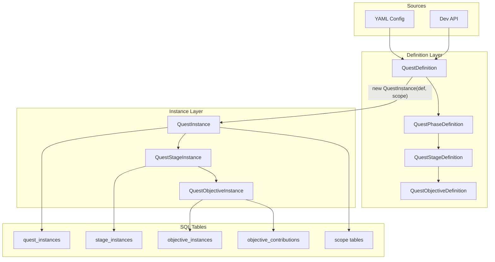
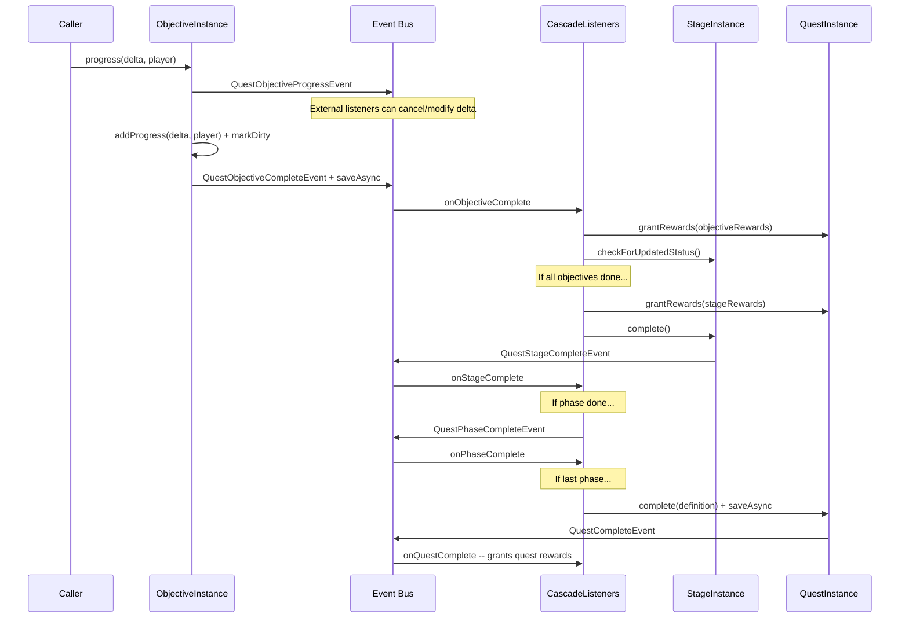
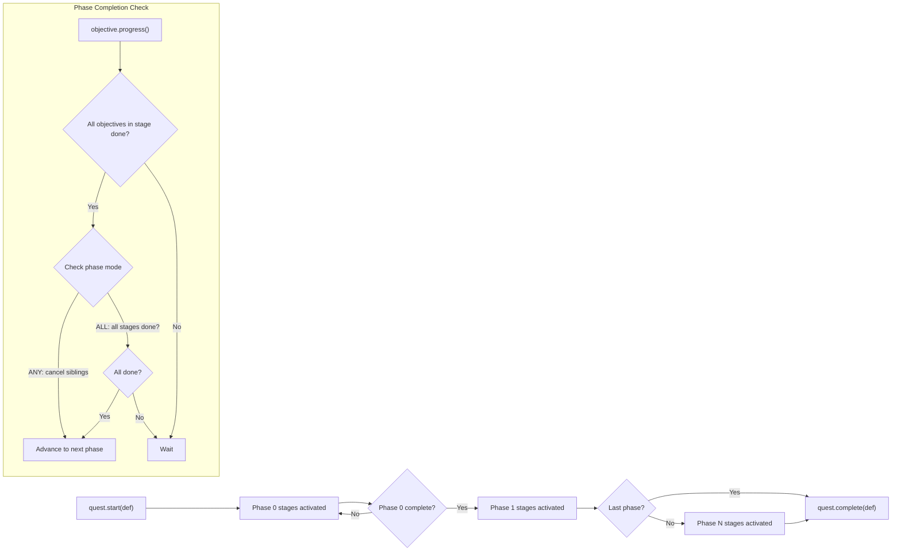
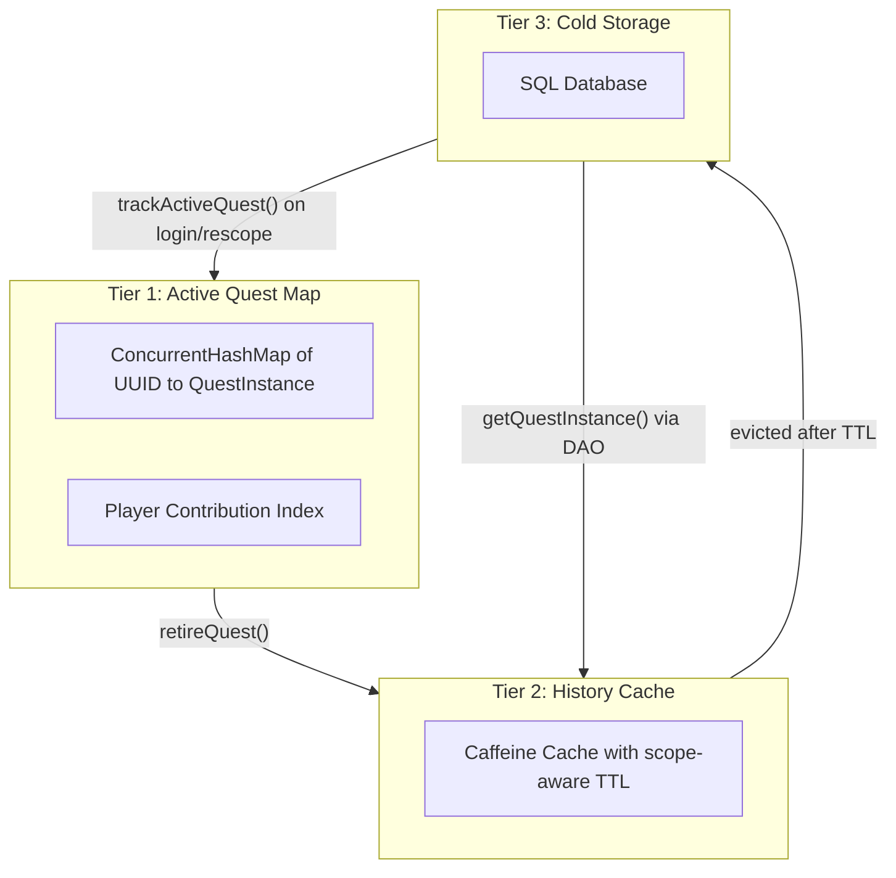
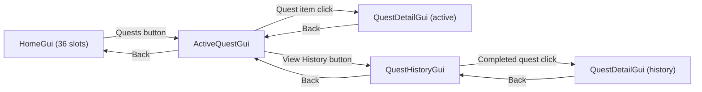

# Quest System Architecture

## Core Mental Model

The system has two layers: **Definitions** (reusable templates / "frames") and **Instances** (runtime state with progress). Definitions are loaded from YAML config or registered programmatically via API at startup. Instances are created from Definitions at runtime and persisted to SQL.



## Implementation Todos

1. ~~**Definition Layer** -- Build Definition (Frame) classes: QuestDefinition, QuestPhaseDefinition, QuestStageDefinition, QuestObjectiveDefinition~~
2. ~~**Instance Layer** -- Refactor Instance classes: add phaseIndex to QuestStageInstance, wire createInstance() via constructor~~
3. ~~**Objective Type Registry** -- Create QuestObjectiveType interface, global QuestObjectiveTypeRegistry, and built-in types (BLOCK_BREAK, MOB_KILL)~~
4. ~~**Reward System** -- Create QuestRewardType interface, global QuestRewardTypeRegistry, built-in reward types, serializeConfig() for pending rewards~~
5. ~~**Quest Lifecycle** -- Implement phase advancement logic with event cascade: objective -> stage -> phase -> quest completion~~
6. ~~**SQL Schema** -- Create DAO classes for quest_instances, stage_instances, objective_instances, contributions, scope tables, and pending_quest_rewards~~
7. ~~**Config Loading** -- Add quests/ directory scanning (recursive YAML loading), parser that builds QuestDefinitions from each file~~
8. ~~**Quest Definition Registry** -- Create QuestDefinitionRegistry, register in McRPGRegistryKey, support both config and API registration~~
9. ~~**Scope Expansion** -- Create global QuestScopeProviderRegistry, LandQuestScope (Lands integration), PermissionQuestScope (Vault for offline), SinglePlayerQuestScopeProvider~~
10. ~~**Save Strategy** -- Dirty flag + periodic QuestSaveTask + immediate saves on state transitions, player quit, shutdown~~
11. ~~**Offline Rewards** -- Pending reward queue in SQL, grant on login, configurable TTL, reward serialization~~
12. ~~**Global Registries** -- All quest registries (definitions, scopes, objective types, reward types) registered in McRPGRegistryKey~~
13. ~~**BoostedYaml Migration** -- Migrated all quest config code from Bukkit YAML (ConfigurationSection, YamlConfiguration, MemoryConfiguration) to BoostedYaml (Section, YamlDocument); added `fromSerializedConfig(Map)` to QuestRewardType~~
14. ~~**Memory Management** -- Refactor QuestManager with three-tier memory model: active quest map, player contribution index, and Caffeine history cache~~
15. ~~**Commands** -- Build Cloud commands: quest start/cancel/complete, admin set-state/set-progress, player list/info/history, reload~~
16. ~~**Unit Tests** -- Full unit test suite coverage for quest system~~
17. ~~**ExpansionPack Integration** -- Wire quest system into ExpansionPack system for native and third-party quest content~~
18. ~~**Cleanup** -- Fix quest.v1 references, incomplete QuestListener, reorganize packages, delete dead processor classes, relocate context classes, refactor QuestConfigLoader, centralize startQuest, wire progress listeners, migrate AbilityUpgradeQuestHelper, implement AbilityLoreAppender quest progress, quest/impl/ package reorg~~
19. ~~**Repeat Modes** -- Add `QuestRepeatMode` enum (ONCE/REPEATABLE/COOLDOWN/LIMITED), extend `QuestDefinition`, completion log table + DAO, validation in `QuestManager.canPlayerStartQuest()`~~
20. ~~**Ability Upgrade Integration** -- `AbilityUpgradeRewardType`, `TierableAbility.getUpgradeQuestKey()`, auto-start on level-up, sanity checks on login, `AbilityUpgradeQuestListener`, deprecate upgrade points~~
21. ~~**Quest UI** -- Built a paginated GUI system: `ActiveQuestGui` (active quests), `QuestHistoryGui` (completed quest history with sort toggle), `QuestDetailGui` (phase/stage/objective breakdown), plus `HomeGui` expansion with Quests and Coming Soon slots~~
22. ~~**Progress Listener Wiring** -- `BlockBreakQuestProgressListener` and `MobKillQuestProgressListener` created and registered in `McRPGListenerRegistrar`~~
23. ~~**Centralized Quest-Start** -- `QuestManager.startQuest(definition, playerUUID)` consolidates scope resolution, instance creation, start, and tracking; 4 call sites refactored~~
24. ~~**QuestConfigLoader Refactor** -- Moved to `configuration` package, no-arg constructor, lazy registry resolution~~
25. ~~**Dead Processor Cleanup** -- Deleted `QuestObjectiveProcessor` framework, relocated `QuestObjectiveProgressContext` and `BlockBreakQuestContext`~~
26. ~~**AbilityUpgradeQuestHelper Migration** -- Deleted static helper; `sanityCheckUpgradeQuests()` moved to `QuestManager` as instance method; level checks added~~

---

## 1. Hierarchy with Branching Support (Phases)

The base model is Quest -> Stage -> Objective. To support branching ("complete Stage A OR Stage B"), a lightweight **Phase** grouping exists in the Definition layer only:

```
QuestDefinition
 └── QuestPhaseDefinition[]        (ordered, sequential)
      ├── PhaseCompletionMode      (ANY = branching, ALL = parallel required)
      └── QuestStageDefinition[]   (stages within this phase)
           └── QuestObjectiveDefinition[]  (all required within a stage)
```

**Key insight: Phases are not persisted as instances.** Phase state is computed from the states of its child stages. Each `QuestStageInstance` stores a `phaseIndex` integer, and the quest logic computes whether a phase is done by checking its stages against the phase's completion mode from the definition. This avoids an extra SQL table and an extra instance class.

- `PhaseCompletionMode.ALL` -- all stages in the phase must complete (parallel required stages)
- `PhaseCompletionMode.ANY` -- any single stage completing advances the quest (branching)

When a phase has mode `ANY` and one stage completes, the remaining stages in that phase are `CANCELLED`.

## 2. Definition (Frame) Classes

These live in `quest/definition/` and are **immutable after construction**. Constructed via direct public constructors (no builders). They carry all the configurable, type-specific data.

- **`QuestDefinition`** -- key, scope type (`NamespacedKey`), optional `Duration expiration`, `List<QuestPhaseDefinition>` (ordered), optional `List<QuestRewardType>` completion rewards (configured instances), `QuestRepeatMode repeatMode` (default ONCE), optional `Duration repeatCooldown`, optional `int repeatLimit`. Display names are **locale-only**: `getDisplayNameRoute()` returns a `Route` derived from the quest's `NamespacedKey` (`quests.{namespace}.{key}.display-name`), and `getDisplayName(McRPGPlayer)` resolves through the localization chain. There is no `displayName` field on the definition.
- **`QuestPhaseDefinition`** -- `int phaseIndex`, `PhaseCompletionMode`, `List<QuestStageDefinition>`
- **`QuestStageDefinition`** -- key, `List<QuestObjectiveDefinition>`, optional `List<QuestRewardType>` stage rewards
- **`QuestObjectiveDefinition`** -- key, configured `QuestObjectiveType` instance (holds type-specific config internally), and **required progress** which can be configured as either:
  - a static `long` (`required-progress: 64`), or
  - a **Parser expression string** (`required-progress: "20*(tier^2)"`) resolved at quest instantiation time via `resolveRequiredProgress(Map<String, Object> variables)`.
  Expression-based objectives support runtime variables (e.g. `tier`) supplied at quest start.
  Objective descriptions are **locale-only**: `getDescriptionRoute(NamespacedKey questKey)` returns a `Route` (`quests.{namespace}.{quest_key}.objectives.{objective_key}.description`), and `getDescription(McRPGPlayer, NamespacedKey)` resolves through the localization chain.

**Type-specific config is held inside configured type instances, never in SQL.** `QuestObjectiveType.parseConfig()` returns a configured copy of the type that stores its config internally (e.g., `BlockBreakObjectiveType` holds a `Set<CustomBlockWrapper>`). Similarly, `QuestRewardType.parseConfig()` returns a configured copy with reward data baked in. Definitions store these configured instances directly -- no separate `QuestObjectiveTypeData`, `QuestRewardData`, or `QuestRewardDefinition` wrapper classes. This keeps the SQL schema clean and uniform -- instances only store mutable state (progress, timestamps, state enum).

**Rewards are supported at all three levels** -- quest, stage, and objective. Each level's rewards are granted when that entity completes, handled by the corresponding cascade listener.

## 3. Instance Classes

These live in `quest/impl/` and represent mutable runtime state. A future package rename to `quest/instance/` is tracked in the cleanup TODO.

- **`QuestInstance`** -- UUID, definition key, scope type (`NamespacedKey`), `QuestState`, `QuestScope`, start/end/expiration timestamps, `List<QuestStageInstance>`, dirty flag for save tracking. Constructed from a `QuestDefinition` (builds full stage/objective tree) or via a reconstruction constructor for database loading.
  - When constructed from a `QuestDefinition`, instance creation can be supplied a `Map<String, Object> variables` which is used to resolve expression-based objective config (e.g. `required-progress`).
  - Missing variables only fail instantiation when the expression actually references them (e.g. `tier` is required for `"20*(tier^2)"` but not for `"20*(2^2)"`).
  Has `isDirty()`/`markDirty()`/`clearDirty()` for the save strategy, `saveAsync()` to trigger async persistence, and `grantRewards(List<QuestRewardType>)` to distribute rewards to all in-scope online players.
- **`QuestStageInstance`** -- UUID, definition key, `int phaseIndex`, `QuestStageState`, start/end timestamps, `List<QuestObjectiveInstance>`
- **`QuestObjectiveInstance`** -- UUID, definition key, `QuestObjectiveState`, required/current progress, start/end timestamps, `Map<UUID, Long> playerContributions`. Has `getPlayerContribution(UUID)` for looking up a specific player's contribution amount.

**State transition guards**: `complete()` rejects calls when the quest is not `IN_PROGRESS`. `expire()` rejects calls when the quest is already in a terminal state (`COMPLETED`/`CANCELLED`). `cancel()` rejects calls from terminal states.

**Input sanitization**: `progress(delta, player)` requires a positive delta. `setRequiredProgression` requires a positive value. `setCurrentProgression` rejects negative values. `QuestObjectiveProgressEvent.setProgressDelta()` rejects negative values.

## 4. Quest Lifecycle and Stage Advancement

Instance classes own their state transitions and fire Bukkit events directly. There is no separate lifecycle utility class -- callers interact with the instances themselves. Individual cascade listeners (one per event type, following SOLID) handle cross-instance cascading (e.g., `QuestObjectiveCompleteListener` checks if the parent stage should complete).

### Instance-Owned Methods (Public API)

| Class | Method | Behavior |
|---|---|---|
| `QuestInstance` | `start(QuestDefinition)` | Activates self, activates phase-0 stages, fires `QuestStartEvent` |
| `QuestInstance` | `cancel()` | Guards on `IN_PROGRESS`/`NOT_STARTED`; cancels self and all child stages, fires `QuestCancelEvent`, triggers async save |
| `QuestInstance` | `expire()` | Guards on `IN_PROGRESS`/`NOT_STARTED`; fires `QuestExpireEvent`, then delegates to `cancel()` |
| `QuestInstance` | `complete(QuestDefinition)` | Guards on `IN_PROGRESS`; marks completed, fires `QuestCompleteEvent`, triggers async save |
| `QuestStageInstance` | `complete()` | Marks completed, force-completes in-progress objectives, fires `QuestStageCompleteEvent` |
| `QuestObjectiveInstance` | `progress(long, UUID)` | Requires positive delta; validates state, fires cancellable `QuestObjectiveProgressEvent`, applies progress, marks quest dirty, fires `QuestObjectiveCompleteEvent` + async save if done |

### Event Cascade



### Phase Advancement Flow



### Lifecycle Steps

1. `quest.start(definition)` -> Quest set to `IN_PROGRESS`, phase 0 stages activated, `QuestStartEvent` fired
2. `objective.progress(delta, player)` -> validates positive delta, `QuestObjectiveProgressEvent` fired (cancellable), progress applied, quest marked dirty
3. When `currentProgress >= requiredProgress` -> objective marked `COMPLETED`, `QuestObjectiveCompleteEvent` fired, async save triggered
4. `QuestObjectiveCompleteListener` grants **objective-level rewards**, checks stage -> if all objectives done, grants **stage-level rewards**, calls `stage.complete()` -> `QuestStageCompleteEvent` fired
5. `QuestStageCompleteListener` checks phase (ANY/ALL) -> if complete, fires `QuestPhaseCompleteEvent`; for ANY mode, cancels sibling stages
6. `QuestPhaseCompleteListener` activates next phase or calls `quest.complete(definition)` -> `QuestCompleteEvent` fired, `QuestCompleteListener` grants **quest-level rewards**, async save triggered
7. Expiration: checked on each `objective.progress()` call; expired quests go through `quest.expire()` (guarded: must be `IN_PROGRESS` or `NOT_STARTED`) -> `QuestExpireEvent` + `QuestCancelEvent`, async save triggered
8. Periodic save: `QuestSaveTask` runs every 120s, saves all dirty active quests in batch, clears dirty flags

### Events Summary

| Event | Fired By | Cancellable | Purpose |
|---|---|---|---|
| `QuestStartEvent` | `QuestInstance.start()` | No | Quest begins |
| `QuestObjectiveProgressEvent` | `QuestObjectiveInstance.progress()` | Yes | Progress about to be applied; delta is modifiable |
| `QuestObjectiveCompleteEvent` | `QuestObjectiveInstance.progress()` | No | Objective reached required progress |
| `QuestStageCompleteEvent` | `QuestStageInstance.complete()` | No | All objectives in stage are done |
| `QuestPhaseCompleteEvent` | `QuestStageCompleteListener` | No | Phase completion criteria met |
| `QuestCompleteEvent` | `QuestInstance.complete()` | No | All phases done |
| `QuestExpireEvent` | `QuestInstance.expire()` | No | Quest expiration time reached |
| `QuestCancelEvent` | `QuestInstance.cancel()` | No | Quest cancelled (manual or via expiration) |

## 5. Objective Type Registry

The `QuestObjectiveTypeRegistry` is a **global registry** registered in `McRPGRegistryKey.QUEST_OBJECTIVE_TYPE` and accessible via `RegistryAccess`. The old processor framework (`QuestObjectiveProcessor`, `QuestObjectiveProcessorKey`, `QuestObjectiveKeyProcessorImpl`, `BlockBreakQuestProcessor`) has been deleted. The remaining context classes live in `quest/objective/type/` (`QuestObjectiveProgressContext`) and `quest/objective/type/builtin/` (`BlockBreakQuestContext`, `MobKillQuestContext`).

```java
public interface QuestObjectiveType {
    NamespacedKey getKey();

    // Parse type-specific config from BoostedYaml Section, returning a configured copy
    QuestObjectiveType parseConfig(Section section);

    // Can this type process the given event/context?
    boolean canProcess(QuestObjectiveProgressContext context);

    // Process the event using internal config state, return the progress delta
    long processProgress(QuestObjectiveInstance instance,
                         QuestObjectiveProgressContext context);
}
```

All config parsing uses BoostedYaml's `Section` (from `dev.dejvokep.boostedyaml.block.implementation.Section`), consistent with the rest of the McRPG codebase.

- A base (unconfigured) instance is registered in the registry; `parseConfig` produces a configured copy stored on the definition
- McRPG ships built-in types: `BLOCK_BREAK`, `MOB_KILL`, `ITEM_CRAFT`, `SKILL_LEVEL_UP`, etc.
- External devs register their own via `questObjectiveTypeRegistry.register(myCustomType)`
- Each configured type holds parsed config internally (e.g., block set, entity set) -- this lives in the Definition, never in SQL
- The `QuestProgressListener` iterates active quests, finds matching objectives by type, calls `processProgress`

## 6. Reward System

Registry-based, same extensibility pattern as objective types. The `QuestRewardTypeRegistry` is a **global registry** registered in `McRPGRegistryKey.QUEST_REWARD_TYPE` and accessible via `RegistryAccess`.

```java
public interface QuestRewardType {
    NamespacedKey getKey();
    QuestRewardType parseConfig(Section section);       // BoostedYaml Section
    void grant(Player player);
    Map<String, Object> serializeConfig();               // for pending reward persistence
    QuestRewardType fromSerializedConfig(Map<String, Object> config);  // reconstruct from serialized map
}
```

An unconfigured base instance is registered in the `QuestRewardTypeRegistry`. When a quest config is parsed, `parseConfig` is called to produce a **configured copy** that holds its reward data internally (e.g., command strings, XP amount). This configured instance is stored directly in the definition (`List<QuestRewardType>`) and used at runtime -- no separate `QuestRewardData` or `QuestRewardDefinition` wrapper needed.

The `serializeConfig()` method enables reward persistence for the **pending reward queue** (see below). It returns a `Map<String, Object>` that can be stored as JSON. The `fromSerializedConfig()` method reconstructs a configured instance from that map without needing a BoostedYaml `Section` -- used by `PlayerJoinListener` when granting pending rewards on login.

- Built-in types: `EXPERIENCE` (McRPG skill XP via `ExperienceRewardType`), `COMMAND` (server commands via `CommandRewardType`), `ABILITY_UPGRADE` (tier progression via `AbilityUpgradeRewardType`), `ITEM`, `MONEY` (if Vault hooked)
- Rewards are attached at **quest, stage, and objective levels** in the Definition as `List<QuestRewardType>` (configured instances)
- Granted when the respective entity completes, handled by cascade listeners: `QuestObjectiveCompleteListener` grants objective rewards, `QuestObjectiveCompleteListener` also grants stage rewards on stage completion, `QuestCompleteListener` grants quest rewards
- Rewards are distributed to all in-scope online players via `QuestInstance.grantRewards()`
- The registry is append-only (no `unregister()` or `clear()` methods)
- **Offline player handling**: If a reward target is offline, the reward is serialized and queued in the `mcrpg_pending_quest_rewards` table via `PendingRewardDAO`. On next login, `PlayerJoinListener` loads pending rewards, reconstructs them, grants them on the main thread, and deletes the granted rows. Expired rows (configurable, default 30 days) are pruned during the same login transaction

## 7. Scope System

The scope system determines which players can contribute to and receive rewards from a quest. The `QuestScopeProviderRegistry` is a **global registry** registered in `McRPGRegistryKey.QUEST_SCOPE_PROVIDER` and accessible via `RegistryAccess`. Each `QuestScopeProvider` has a `getKey()` method and is registered during `QuestManager` initialization.

### Built-in Scope Types

- **`SinglePlayerQuestScope`** -- Tracks a single player. Provider: `SinglePlayerQuestScopeProvider`. Always registered.
- **`LandQuestScope`** -- Encompasses all trusted members (owner + trusted players) of a Lands plugin land. Provider: `LandQuestScopeProvider`. Conditionally registered when Lands is present. Membership is dynamic -- resolved live via `Land.getTrustedPlayers()` and `Land.isTrusted(UUID)`. Lands are identified by name in config and stored by name in SQL.
- **`PermissionQuestScope`** -- Encompasses all players with a specific permission node. Provider: `PermissionQuestScopeProvider`. Always registered. Online players checked via `Player.hasPermission()`. Offline players checked via Vault's `Permission.playerHas()` if Vault is present; otherwise, offline players return false (rewards are queued via the pending reward system).

### Party Quests (Future)

For **party quests**, add a `PartyQuestScope` (or `GroupQuestScope`) that:

- Tracks multiple player UUIDs
- Uses the existing `playerContributionTracker` on `QuestObjectiveInstance` to track who contributed what
- Defines whether all party members or just the leader must be present
- Each scope type gets its own SQL table via its `QuestScopeProvider`

## 8. SQL Schema (Normalized)

```sql
-- Core quest instance
CREATE TABLE mcrpg_quest_instances (
    quest_uuid       TEXT PRIMARY KEY,
    definition_key   TEXT NOT NULL,     -- NamespacedKey as string
    state            TEXT NOT NULL,     -- QuestState enum
    scope_type       TEXT NOT NULL,     -- scope provider key
    start_time       BIGINT,
    end_time         BIGINT,
    expiration_time  BIGINT            -- NULL if no expiration
);

-- Stage instances (phaseIndex for grouping)
CREATE TABLE mcrpg_quest_stage_instances (
    stage_uuid       TEXT PRIMARY KEY,
    quest_uuid       TEXT NOT NULL REFERENCES mcrpg_quest_instances(quest_uuid),
    definition_key   TEXT NOT NULL,
    phase_index      INTEGER NOT NULL,
    state            TEXT NOT NULL,
    start_time       BIGINT,
    end_time         BIGINT
);

-- Objective instances
CREATE TABLE mcrpg_quest_objective_instances (
    objective_uuid   TEXT PRIMARY KEY,
    stage_uuid       TEXT NOT NULL REFERENCES mcrpg_quest_stage_instances(stage_uuid),
    definition_key   TEXT NOT NULL,
    state            TEXT NOT NULL,
    required_progress BIGINT NOT NULL,
    current_progress  BIGINT NOT NULL DEFAULT 0,
    start_time       BIGINT,
    end_time         BIGINT
);

-- Player contributions per objective (for party quests)
CREATE TABLE mcrpg_quest_objective_contributions (
    objective_uuid   TEXT NOT NULL REFERENCES mcrpg_quest_objective_instances(objective_uuid),
    player_uuid      TEXT NOT NULL,
    amount           BIGINT NOT NULL DEFAULT 0,
    PRIMARY KEY (objective_uuid, player_uuid)
);

-- Scope tables (per-type)
-- mcrpg_single_player_quest_scope (exists)
CREATE TABLE mcrpg_land_quest_scope (
    quest_uuid  VARCHAR(36) PRIMARY KEY,
    land_name   VARCHAR(255) NOT NULL
);

CREATE TABLE mcrpg_permission_quest_scope (
    quest_uuid       VARCHAR(36) PRIMARY KEY,
    permission_node  VARCHAR(255) NOT NULL
);

-- mcrpg_party_quest_scope (future)

-- Quest completion log for repeat mode enforcement
CREATE TABLE mcrpg_quest_completion_log (
    id              VARCHAR(36) PRIMARY KEY,
    player_uuid     VARCHAR(36) NOT NULL,
    definition_key  VARCHAR(255) NOT NULL,
    quest_uuid      VARCHAR(36) NOT NULL,
    completed_at    BIGINT NOT NULL
);
CREATE INDEX idx_completion_player_def
    ON mcrpg_quest_completion_log(player_uuid, definition_key);

-- Pending rewards for offline players
CREATE TABLE mcrpg_pending_quest_rewards (
    id                VARCHAR(36) PRIMARY KEY,
    player_uuid       VARCHAR(36) NOT NULL,
    reward_type_key   VARCHAR(255) NOT NULL,
    serialized_config TEXT NOT NULL,            -- JSON blob from serializeConfig()
    quest_key         VARCHAR(255) NOT NULL,    -- audit trail
    created_at        BIGINT NOT NULL,
    expires_at        BIGINT NOT NULL
);
```

**Loading strategy**: When loading a player's quests, query `quest_instances` by scope, then JOIN stages and objectives. The full tree is reconstructed via `QuestInstanceDAO.loadFullQuestTree()` which loads stages, objectives, and contributions hierarchically. `QuestObjectiveInstanceDAO.loadObjectiveInstancesWithContributions()` loads contributions directly into objective constructors to avoid needing mutable map access.

**Saving strategy**: A two-pronged approach matching the existing player save pattern:

1. **Periodic dirty save** -- `QuestSaveTask` (extends `CancelableCoreTask`) runs every 120s (configurable at `configuration.quest-save-task.frequency`). It filters active quests for `isDirty()`, batch-saves their full trees via `QuestInstanceDAO.saveFullQuestTree()` inside a `BatchTransaction`, then clears dirty flags.
2. **Immediate async saves** -- State transitions (`QuestInstance.complete()`, `cancel()`, `expire()`, and `QuestObjectiveInstance.progress()` when an objective completes) trigger `quest.saveAsync()` which submits a `FailSafeTransaction` to the database executor.
3. **Player quit** -- `PlayerLeaveListener` saves all active quests for the leaving player via `questManager.saveQuestAsync(quest)`.
4. **Server shutdown** -- `McRPGBootstrap.stop()` synchronously saves all active quests in a `BatchTransaction` before database shutdown.

The `QuestInstance` tracks a `volatile boolean dirty` flag, set by `QuestObjectiveInstance.addProgress()` on any progress update, cleared after successful save. This avoids writing idle quests every cycle.

## 9. Definition Registry and Config Loading

New registry: `QuestDefinitionRegistry` registered alongside existing registries in `McRPGRegistryKey.java`.

### Directory-Based Config Loading

Instead of a single monolithic config file, quest definitions live in a **`quests/` directory** inside the plugin data folder. The loader recursively scans all `.yml` files within it, allowing server owners to organize quests however they like:

```
plugins/McRPG/quests/
├── mining/
│   ├── daily_mining.yml
│   └── weekly_mining.yml
├── combat/
│   ├── slayer_quests.yml
│   └── boss_hunts.yml
├── events/
│   └── summer_event.yml
└── my_custom_quest.yml        # flat files work too
```

Each YAML file can contain **one or more quest definitions** under a top-level `quests` key. The file name is purely organizational -- the quest's identity comes from its `key` field, not the file path:

```yaml
# plugins/McRPG/quests/mining/daily_mining.yml
quests:
  mcrpg:daily_mining:
    scope: SINGLE_PLAYER
    expiration: "24h"
    rewards:
      mining_xp:
        type: mcrpg:experience
        skill: MINING
        amount: 500
    phases:
      mine_blocks:
        completion-mode: ALL
        stages:
          mine_stone:
            key: mcrpg:mine_stone
            objectives:
              break_stone:
                key: mcrpg:break_stone_blocks
                type: mcrpg:block_break
                required-progress: 64
                config:
                  blocks: [STONE, COBBLESTONE, ANDESITE]
              break_deepslate:
                key: mcrpg:break_deepslate
                type: mcrpg:block_break
                required-progress: 32
                config:
                  blocks: [DEEPSLATE]
      choose_specialty:
        completion-mode: ANY   # BRANCHING: complete either stage
        stages:
          mine_diamonds:
            key: mcrpg:mine_diamonds
            objectives:
              break_diamonds:
                key: mcrpg:break_diamonds
                type: mcrpg:block_break
                required-progress: 8
                config:
                  blocks: [DIAMOND_ORE, DEEPSLATE_DIAMOND_ORE]
          mine_emeralds:
            key: mcrpg:mine_emeralds
            objectives:
              break_emeralds:
                key: mcrpg:break_emeralds
                type: mcrpg:block_break
                required-progress: 8
                config:
                  blocks: [EMERALD_ORE, DEEPSLATE_EMERALD_ORE]
```

**Loading behavior:**

- On startup (and reload), recursively walk `quests/` and parse every `.yml` file
- Ship default quest files via `saveResource()` if the directory is empty on first run
- Duplicate `NamespacedKey`s across files log a warning and the first-loaded wins
- This does NOT go through `FileType` / `FileManager` since it's directory-based, not a single managed file. Instead, a dedicated `QuestConfigLoader` (in `us.eunoians.mcrpg.configuration`) handles the directory walk and parsing, invoked by `QuestManager` on init and reload. `QuestConfigLoader` uses a no-arg constructor and resolves registries lazily via `RegistryAccess` and the plugin logger via `McRPG.getInstance().getLogger()`

### McCore Note

The quest system lives in McRPG for now to keep McCore lightweight. The registry patterns and DAO base classes in McCore are leveraged but quest-specific code stays in McRPG. If quests are later extracted to a shared lib, the Definition/Instance/Registry interfaces are already clean enough to move.

### Dev API for Programmatic Registration

```java
// Create a configured objective type by parsing config or constructing directly
QuestObjectiveType blockBreakType = new BlockBreakObjectiveType()
    .parseConfig(blockBreakConfigSection);

QuestObjectiveDefinition objective = new QuestObjectiveDefinition(
    new NamespacedKey(myPlugin, "my_obj"),
    blockBreakType,
    64,
    List.of()
);

QuestStageDefinition stage = new QuestStageDefinition(
    new NamespacedKey(myPlugin, "my_stage"),
    List.of(objective),
    List.of()
);

QuestPhaseDefinition phase = new QuestPhaseDefinition(
    0,
    PhaseCompletionMode.ALL,
    List.of(stage)
);

QuestDefinition quest = new QuestDefinition(
    new NamespacedKey(myPlugin, "custom_quest"),
    new NamespacedKey("mcrpg", "single_player"),
    Duration.ofHours(24),
    List.of(phase),
    List.of(),
    QuestRepeatMode.ONCE,
    null,
    -1,
    null
);

questDefinitionRegistry.register(quest);
// Display name is resolved from locale: quests.{namespace}.custom_quest.display-name
```

## 10. Memory Management and Caching

`QuestManager` implements a three-tier memory model with a reverse player contribution index for O(1) quest lookups from event handlers. All data structures use `ConcurrentHashMap` for thread safety.

### Three-Tier Memory Model



**Tier 1 -- Active Quest Map** (`ConcurrentHashMap<UUID, QuestInstance> activeQuests`)

All quests in `NOT_STARTED` or `IN_PROGRESS` state. These are the quests that can receive progress events. Populated at startup via `loadActiveQuestsFromDatabase()`, on player login via `rescopePlayer()`, and when new quests start via `trackActiveQuest()`. Removed when the quest completes/cancels/expires via `retireQuest()`.

**Tier 1b -- Player Contribution Index** (`ConcurrentHashMap<UUID, Set<UUID>> playerToQuestIndex`)

Reverse index mapping `playerUUID -> Set<questUUID>` for every player who can currently contribute to a quest. Uses `ConcurrentHashMap.newKeySet()` for thread-safe sets.

- `trackActiveQuest(quest)` -- indexes all current in-scope players
- `retireQuest(quest)` -- removes the quest from all player entries
- `indexQuestForPlayer(questUUID, playerUUID)` -- adds a single mapping
- `deindexQuestForPlayer(questUUID, playerUUID)` -- removes a single mapping
- `deindexPlayer(playerUUID)` -- removes a player entirely (called on logout)
- Lookup: `getActiveQuestsForPlayer(playerUUID)` resolves the set to actual instances

**Tier 2 -- History Cache** (`Caffeine Cache<UUID, QuestInstance> cachedFinishedQuests`)

Completed/cancelled/expired quests move here via `retireQuest()`. Uses Caffeine's `Expiry` interface with scope-aware TTL:
- `expireAfterCreate` / `expireAfterUpdate`: Checks if any scope players are online. If yes, TTL = 15 minutes (configurable). If no, TTL = 5 minutes (configurable).
- `expireAfterRead`: Returns `currentDuration` unchanged -- reads do NOT reset the timer. This prevents a command lookup from indefinitely extending the cache lifetime of a finished quest.

**Tier 3 -- Cold Storage** (SQL)

Quests not in Tier 1 or 2. Loaded on-demand via `getQuestInstance(UUID)` which uses the `GetItemRequest` pattern for deduplicating concurrent requests. When loaded, `placeInCorrectTier()` routes active quests to Tier 1 (with indexing) and finished quests to Tier 2.

### Lifecycle Wiring via Event Listeners

The tier transitions are wired through Bukkit event listeners, keeping `QuestManager` decoupled from the instance lifecycle:

| Event | Listener | Tier Action |
|---|---|---|
| `QuestStartEvent` | `QuestStartListener` | `trackActiveQuest()` -- add to Tier 1 + index |
| `QuestCompleteEvent` | `QuestCompleteListener` | Grants rewards, logs completion, then `retireQuest()` -- move to Tier 2 |
| `QuestCancelEvent` | `QuestCancelListener` | `retireQuest()` -- move to Tier 2 (also handles expire path) |
| `QuestCancelEvent` | `AbilityUpgradeQuestListener` | Clears `AbilityUpgradeQuestAttribute` for affected abilities |
| `QuestCompleteEvent` | `AbilityUpgradeQuestListener` | Clears `AbilityUpgradeQuestAttribute` for affected abilities |
| `PlayerJoinEvent` | `PlayerJoinListener` | `rescopePlayer()` + grant pending rewards + sanity check upgrade quests |
| `PlayerQuitEvent` | `PlayerLeaveListener` | Save dirty quests, then `deindexPlayer()` |
| `BlockBreakEvent` | `BlockBreakQuestProgressListener` | Constructs `BlockBreakQuestContext`, calls `progressQuests()` for matching objectives |
| `EntityDeathEvent` | `MobKillQuestProgressListener` | Constructs `MobKillQuestContext`, calls `progressQuests()` for player-killed mobs |

### Persistence Methods

- `saveQuestAsync(quest)` -- async save via `FailSafeTransaction` on DB executor; clears dirty flag
- `saveDirtyQuests()` -- iterates Tier 1, saves any quest with `isDirty() == true` (called periodically)
- `saveAllActiveQuests()` -- synchronous save of all Tier 1 quests (called during shutdown)
- `loadActiveQuestsFromDatabase()` -- startup: loads all `NOT_STARTED`/`IN_PROGRESS` quests via `QuestInstanceDAO.loadQuestInstancesByState()` and `loadFullQuestTree()`

### Scope Resolution: Login and Rescoping

Scope resolution runs both at login time and when scope membership changes at runtime (player joins/leaves a land, gains/loses a permission). The operation is the same: each `QuestScopeProvider` queries SQL for active quests where the player is in scope, and any missing quests are loaded into Tier 1.

**`QuestScopeProvider` rescoping methods:**

```java
public abstract class QuestScopeProvider<P extends QuestScope> {
    // Existing
    abstract P createNewScope(UUID questUUID);
    abstract CompletableFuture<P> loadScope(UUID questUUID, UUID scopeId);

    // Rescoping: find active quests where this player is in scope (called on DB thread)
    abstract List<UUID> resolveActiveQuestUUIDs(UUID playerUUID, Connection conn);

    // Register listeners for events that change scope membership (default no-op)
    void registerScopeChangeListeners(QuestManager questManager) {}
}
```

**`QuestManager.rescopePlayer()` flow:**

1. Called on player login (all providers) or on a scope-change event (single provider)
2. Runs on the database executor thread
3. For each quest UUID returned by `resolveActiveQuestUUIDs()`:
   - If already in Tier 1: just add the player to the index
   - If not in Tier 1: load via `QuestInstanceDAO.loadFullQuestTree()`, then `trackActiveQuest()` + index

**Provider-specific query strategies:**

- `SinglePlayerQuestScopeProvider` -- SQL JOIN: `single_player_quest_scope.player_uuid = ?` + active state filter
- `LandQuestScopeProvider` -- SQL loads all active land-scoped quests, then filters in Java by checking `Land.isTrusted(playerUUID)` via Lands API
- `PermissionQuestScopeProvider` -- SQL loads all active permission-scoped quests, then filters in Java by checking `Player.hasPermission()` (online) or Vault `playerHas()` (offline)

**Scope-change events by provider type:**

- `SinglePlayerQuestScopeProvider` -- no rescope needed (scope never changes)
- `LandQuestScopeProvider` -- can override `registerScopeChangeListeners()` to hook into Lands API member events
- `PermissionQuestScopeProvider` -- can override `registerScopeChangeListeners()` to hook into permission change events
- Future scope types register their own listeners via `registerScopeChangeListeners()`

**Descoping** (removing quests from a player's index) happens on scope-change events and player logout. `deindexPlayer(playerUUID)` removes the player entirely from the index. Individual quest deindexing uses `deindexQuestForPlayer(questUUID, playerUUID)`.

**Edge case -- quest eviction and re-loading:** When all in-scope players for an active quest go offline, the quest stays in Tier 1 (it's still active). When a new player enters scope via rescope, they're simply added to the index. Quests only leave Tier 1 when they reach a terminal state (complete/cancel/expire).

## 11. Commands

Commands use the existing Cloud command framework (via McCore's `CoreCommandManager`) with Paper's `CommandSourceStack`. Registered in `McRPGCommandRegistrar`.

### Command Tree

```
/quest start <quest_key> [player]       -- Start a quest (for self or target player)
/quest cancel [quest_uuid]              -- Cancel an active quest
/quest list [player]                    -- List active quests
/quest info <quest_uuid>                -- View detailed quest info (stages, objectives, progress)
/quest history [player] [page]          -- View completed/cancelled quest history

/quest admin complete <quest_uuid>      -- Force-complete a quest
/quest admin setstate <quest_uuid> <stage_key> <state>  -- Set a stage's state
/quest admin setprogress <quest_uuid> <objective_key> <progress>  -- Set objective progress
/quest admin reload                     -- Reload quest definitions from quests/ directory
```

### Implementation Notes

- **Permissions**: `mcrpg.quest.*` for player commands, `mcrpg.quest.admin.*` for admin commands, following the existing `ROOT_PERMISSION` / `ADMIN_BASE_PERMISSION` pattern
- **Custom parsers**: `QuestDefinitionParser` (tab-completes registered quest keys), `ActiveQuestParser` (tab-completes active quest UUIDs/keys for the sender)
- **`/quest start`**: Looks up `QuestDefinition` from registry, creates a new `QuestInstance`, assigns scope, adds to Tier 1
- **`/quest info`**: Uses `getQuestInstance()` which walks Tier 1 -> 2 -> 3, displays full tree with progress bars (MiniMessage + `Methods.getProgressBar`)
- **`/quest history`**: Queries SQL with pagination, loads results into Tier 2 cache
- **`/quest admin reload`**: Clears `QuestDefinitionRegistry`, re-runs `QuestConfigLoader` on the `quests/` directory. Active quest instances keep running (they reference definitions by key; if a definition is removed, warn in console but don't kill active instances)
- **`/quest admin setstate`** and **`/quest admin setprogress`**: Useful for debugging and server admin control. Triggers the normal lifecycle checks (stage advancement, phase completion) after the manual change

### Base Class

A new `QuestCommandBase extends McRPGCommandBase` with:

- `QUEST_BASE_PERMISSION = "mcrpg.quest.*"`
- `QUEST_ADMIN_PERMISSION = "mcrpg.quest.admin.*"`
- Helper methods for resolving quest instances from command arguments

## 12. Cleanup Notes

### Completed
- **`quest.v1` references removed** -- All Java files that imported from the non-existent `quest.v1` package have been cleaned:
  - `QuestContentPack` now uses `QuestDefinition` instead of v1 `Quest`
  - `QuestHolder` rewritten to delegate to the new `QuestManager` player contribution index
  - `AbilityHolder.hasActiveUpgradeQuest()` deprecated with TODO
  - `TierableAbility.getUpgradeQuestForTier()` removed (method signature referenced non-existent v1 type)
  - `ConfigurableTierableAbility.getUpgradeQuestForTier()` override removed
- **`TestQuestStartCommand.java` deleted** -- Replaced by the new command suite
- **`QuestListener.java` (old interface) deleted** -- Replaced by `QuestProgressListener`
- ~~Quest tables need to be registered in `McRPGDatabase.java`~~ **Done** -- all quest tables including `QuestCompletionLogDAO`
- **Dead processor classes deleted** -- `QuestObjectiveProcessor`, `QuestObjectiveProcessorKey`, `QuestObjectiveKeyProcessorImpl`, `BlockBreakQuestProcessor` removed. `QuestObjectiveProgressContext` relocated to `quest/objective/type/`, `BlockBreakQuestContext` relocated to `quest/objective/type/builtin/`
- **`QuestConfigLoader` refactored** -- Moved from `quest.config` to `us.eunoians.mcrpg.configuration`. No-arg constructor; resolves registries lazily via `RegistryAccess` and logger via `McRPG.getInstance().getLogger()`
- **`QuestManager.startQuest()` centralized** -- New method encapsulates scope resolution, instance creation, scope assignment, start, and tracking. Eliminated 4x duplication across `AbilityUpgradeRewardType`, `OnSkillLevelUpListener`, `QuestStartCommand`, and `QuestManager.sanityCheckUpgradeQuests`
- **`QuestManager.startQuest(..., variables)` added** -- Overload supports passing variables into `QuestInstance` creation for expression-based configuration (e.g. `tier`).
- **Scope key aliasing** -- `QuestManager.startQuest()` supports `scope` keys that may omit or include the `_scope` suffix by resolving `<key>` ↔ `<key>_scope` when looking up scope providers (compat bridge for existing configs).
- **`McRPGPlayer.startUpgradeQuest()` implemented** -- Now delegates to `QuestManager.startQuest()` (no longer throws `UnsupportedOperationException`)
- **`AbilityUpgradeQuestHelper` deleted** -- `sanityCheckUpgradeQuests()` migrated to `QuestManager` as an instance method. Fixed type mismatch bug where `hasActiveInstanceOfDefinition` was called with UUID instead of NamespacedKey; corrected to `isQuestActive(UUID)`
- **Level checks added** -- `cascadeNextTierCheck()`, `sanityCheckUpgradeQuests()`, and `checkAndStartUpgradeQuest()` all verify `SkillAbility` level requirements via `getUnlockLevelForTier(nextTier)` before starting upgrade quests
- **Progress listeners wired** -- `BlockBreakQuestProgressListener` and `MobKillQuestProgressListener` created, implementing `QuestProgressListener`. Registered in `McRPGListenerRegistrar`. Bridge `BlockBreakEvent` and `EntityDeathEvent` to `progressQuests()` via `BlockBreakQuestContext` and `MobKillQuestContext`
- ~~The ability upgrade quest flow needs to be reimplemented~~ **Done** -- `AbilityUpgradeRewardType`, `TierableAbility.getUpgradeQuestKey()`, auto-start, sanity checks, `AbilityUpgradeQuestListener`
- **`AbilityLoreAppender` quest progress implemented** -- Replaced hardcoded `(0, 20)` stub with actual quest progress calculation from active quest instances
- **`quest/impl/` package reorg** -- Reorganized into `quest/instance/` to match `quest/definition/` naming convention
- **`displayName` removed from `QuestDefinition`** -- Field and constructor parameter removed; `display-name` key removed from all quest YAML files and `QuestConfigLoader` parsing. Display names are now resolved exclusively through the localization system via `getDisplayNameRoute()` and `getDisplayName(McRPGPlayer)`.
- **`QuestObjectiveDefinition` locale methods added** -- `getDescriptionRoute(NamespacedKey)` and `getDescription(McRPGPlayer, NamespacedKey)` provide locale-only objective descriptions.
- **`HomeGui` expanded** -- Increased from 27 to 36 slots (4 rows). Added `HomeQuestsSlot` (index 20) and `HomeComingSoonSlot` (index 24). Items spread across rows 2 and 3.
- **Quest GUI system implemented** -- `ActiveQuestGui`, `QuestHistoryGui`, `QuestDetailGui` with 7 slot classes. `CompletionRecord` DTO and `QuestCompletionLogDAO.getCompletionHistory()` added. 21 new `LocalizationKey` constants for all GUI elements.

## 13. Quest Repeat Modes

Quests can be configured with different repeat modes to control how many times a player can complete them.

### `QuestRepeatMode` Enum

- **`ONCE`** -- (default) The quest can only be completed once per player, ever.
- **`REPEATABLE`** -- The quest can be completed any number of times with no restrictions.
- **`COOLDOWN`** -- The quest can be repeated after a configured cooldown period elapses since the player's last completion.
- **`LIMITED`** -- The quest can be repeated up to a configured maximum number of times per player.

### Definition Fields

`QuestDefinition` includes:
- `QuestRepeatMode repeatMode` (default `ONCE`)
- `Optional<Duration> repeatCooldown` (for `COOLDOWN` mode)
- `OptionalInt repeatLimit` (for `LIMITED` mode)

### Config Format

```yaml
quests:
  mcrpg:daily_mining:
    repeat-mode: COOLDOWN
    repeat-cooldown: "24h"
  mcrpg:weekly_challenge:
    repeat-mode: LIMITED
    repeat-limit: 3
```

### Completion Log

A new `mcrpg_quest_completion_log` SQL table records every player's quest completions:

```sql
CREATE TABLE mcrpg_quest_completion_log (
    id              VARCHAR(36) PRIMARY KEY,
    player_uuid     VARCHAR(36) NOT NULL,
    definition_key  VARCHAR(255) NOT NULL,
    quest_uuid      VARCHAR(36) NOT NULL,
    completed_at    BIGINT NOT NULL
);
CREATE INDEX idx_completion_player_def
    ON mcrpg_quest_completion_log(player_uuid, definition_key);
```

`QuestCompletionLogDAO` provides `logCompletion()`, `getCompletionCount()`, `getLastCompletionTime()`, `hasCompleted()`, and `getCompletionHistory()` methods. Completion is logged for **all in-scope players** when a quest completes (via `QuestCompleteListener`). The `getCompletionHistory(Connection, UUID, boolean)` method retrieves a player's full completion log as `List<CompletionRecord>` ordered by `completed_at` (ascending or descending), used by the Quest History GUI. `CompletionRecord` is a lightweight record DTO (`definitionKey`, `questUUID`, `completedAt`).

### Validation

`QuestManager.canPlayerStartQuest(Connection, UUID, QuestDefinition)` checks:
1. Player does not already have an active instance of this definition
2. Repeat mode allows starting (ONCE: never completed; LIMITED: under limit; COOLDOWN: cooldown elapsed; REPEATABLE: always)

This is enforced in `QuestStartCommand`, the auto-start upgrade quest flow, and any API start path.

## 14. Ability Upgrade Quest Integration

The quest system replaces the legacy upgrade point system for ability tier progression. When a player reaches the required level for the next tier of a `TierableAbility`, an upgrade quest is automatically started.

### Components

- **`AbilityUpgradeRewardType`** -- Built-in `QuestRewardType` (key: `mcrpg:ability_upgrade`) that upgrades a `TierableAbility` to a target tier when granted. After upgrading, it clears the `AbilityUpgradeQuestAttribute` and cascades to check if the next tier's quest should start.
- **`AbilityUpgradeNextTierRewardType`** -- Built-in `QuestRewardType` (key: `mcrpg:ability_upgrade_next_tier`) that upgrades a `TierableAbility` to its **next tier** (current + 1). Intended for the generic, scalable upgrade quests.
- **`TierableAbility.getUpgradeQuestKey(int tier)`** -- Returns the `NamespacedKey` of the quest definition for upgrading to the given tier.
  - `ConfigurableTierableAbility` resolves quest keys from YAML:
    1. `tier-N.upgrade-quest` (highest priority)
    2. `all-tiers.upgrade-quest`
    3. if missing, **infers** `mcrpg:<ability_id>_upgrade` and logs a warning (one-time per ability)
  - Config values may include `{tier}` which is substituted (e.g. `"mcrpg:enhanced_bleed_tier{tier}"`).
- **`AbilityUpgradeQuestAttribute`** -- Stores the UUID of the active upgrade quest instance. Un-deprecated and updated to reference the new quest system.
- **`AbilityUpgradeQuestListener`** -- Listens for `QuestCancelEvent` and `QuestCompleteEvent` to clear the attribute on affected abilities.
- **`QuestManager.sanityCheckUpgradeQuests(McRPGPlayer)`** -- Instance method on `QuestManager` that validates upgrade quest state for all `TierableAbility` instances. Called from login and level-up triggers.
- **Boot-time enforcement** -- after quest definitions load/reload, `QuestManager` validates tierable abilities can resolve an upgrade quest definition (at least tier 2). If missing, the ability is **unregistered** and an error is logged.

### Auto-Start Flow

1. Player levels up a skill (`OnSkillLevelUpListener.handlePostLevelEvent`)
2. For each `TierableAbility` belonging to the skill, check if the player is eligible for the next tier
3. **Level check**: If the ability is also a `SkillAbility`, verify the player's current skill level meets `getUnlockLevelForTier(nextTier)`. If not, skip.
4. If no active upgrade quest attribute is set, look up `getUpgradeQuestKey(nextTier)`
5. Validate via `canPlayerStartQuest()` (async), then call `QuestManager.startQuest(definition, playerUUID)` on the main thread
6. Store the quest UUID in `AbilityUpgradeQuestAttribute`
7. When starting upgrade quests, `QuestManager.startQuest(..., variables)` is used to supply `tier = nextTier` so expression-based `required-progress` can scale.

### Sanity Check Triggers

Rather than a periodic task, upgrade quest state is validated on specific triggers:
- **Player login** (`PlayerJoinListener`): Delayed 2 seconds after join to allow data loading
- **Skill level-up** (`OnSkillLevelUpListener`): Checked after ability unlock processing
- **Ability GUI open** (`AbilityTierAttribute` click handler): Re-check before display

The sanity check (`QuestManager.sanityCheckUpgradeQuests(McRPGPlayer)`):
1. For each `TierableAbility`, get current tier and compute next tier
2. If the player has an upgrade quest attribute pointing to a non-active quest, clear it
3. **Level check**: If the ability is also a `SkillAbility`, verify the player's skill level meets `getUnlockLevelForTier(nextTier)`. If not, skip.
4. If eligible for next tier and no quest is active, validate via `canPlayerStartQuest()` and call `QuestManager.startQuest()`

### Edge Cases

- **Admin cancels upgrade quest**: `AbilityUpgradeQuestListener` clears the attribute. Next sanity check re-starts the quest if still eligible.
- **Player at tier 1, active T2 quest, hits level for T3**: The attribute is set for T2, so T3 quest is NOT started. When T2 completes, `AbilityUpgradeRewardType.grant()` upgrades to T2, clears attribute, re-checks eligibility, starts T3 quest.
- **Offline player**: `AbilityUpgradeRewardType` supports serialization for the pending reward queue. On next login, the reward is granted and the sanity check picks up the next tier.

### Quest Config Format (Generic + Overrides)

There are two supported upgrade quest styles:

1. **Generic scalable quest per ability** (recommended default)
   - Quest key: `mcrpg:<ability_id>_upgrade`
   - `repeat-mode: REPEATABLE`
   - Objective `required-progress` may be an expression using `tier` (e.g. `"20*(tier^2)"`)
   - Uses reward `mcrpg:ability_upgrade_next_tier`

2. **Tier-specific override quests** (optional)
   - Quest key: `mcrpg:<ability_id>_tierN` (tiers 2-5)
   - `repeat-mode: ONCE`
   - Uses reward `mcrpg:ability_upgrade` with fixed `tier: N`

Ability configs may reference quest definition keys explicitly, or omit them and allow inference of the generic `<ability>_upgrade` key.

```yaml
all-tiers:
  # Generic quest (can also be omitted to allow inference of <ability>_upgrade)
  upgrade-quest: "mcrpg:enhanced_bleed_upgrade"
tier-2:
  # Optional per-tier override quest
  upgrade-quest: "mcrpg:enhanced_bleed_tier2"
tier-3:
  upgrade-quest: "mcrpg:enhanced_bleed_tier3"
```

Quest definitions live in `quests/upgrades/` alongside other quest configs. The `upgrade-point-cost` remains in config for backward compatibility but is ignored by the new system.

### Upgrade Points Deprecation

- `AbilityHolder.getUpgradePoints()`, `giveUpgradePoints()`, `removeUpgradePoints()`, `setUpgradePoints()` are all `@Deprecated`
- `TierableAbility.getUpgradeCostForTier()` is `@Deprecated`
- The upgrade point awarding in `OnSkillLevelUpListener` is `@Deprecated`
- Full removal is a separate follow-up task

## 15. Quest UI

A paginated GUI system for players to browse active quests, view completed quest history, and inspect quest details. Built on the existing `McRPGPaginatedGui` framework and fully localized through `McRPGLocalizationManager`.

### Navigation Flow



### HomeGui Changes

Expanded from 27 to **36 slots** (4 rows). Items are arranged across rows 2 and 3:

| Slot | Content |
|---|---|
| 10 | Settings |
| 12 | Skills |
| 14 | Abilities |
| 16 | Loadout |
| 20 | **Quests** (new -- opens `ActiveQuestGui`) |
| 22 | Experience Bank |
| 24 | **Coming Soon** (new -- placeholder for future quest board) |

New slot classes: `HomeQuestsSlot`, `HomeComingSoonSlot` (in `gui/home/slot/`).

### ActiveQuestGui

Paginated 54-slot GUI (6 rows) displaying all active quests for the player. Up to 45 quest items per page (rows 1-5), with a navigation bar in row 6.

- **Data source**: `QuestManager.getActiveQuestsForPlayer(playerUUID)` from the Tier 1 active quest map
- **Quest items**: `ActiveQuestSlot` -- displays localized quest name, current phase, objective progress summary, and time remaining. Clickable to open `QuestDetailGui`.
- **Navigation bar**: Previous GUI (back to Home), Previous/Next Page, View History (`ViewQuestHistorySlot`)

### QuestHistoryGui

Paginated 54-slot GUI displaying a player's completed quest history with sort toggling.

- **Data source**: `QuestCompletionLogDAO.getCompletionHistory()` loaded on construction and on sort toggle. Uses `CompletionRecord` DTOs.
- **Quest items**: `CompletedQuestSlot` -- displays localized quest name (falls back to definition key if definition is missing) and completion date. Clickable to open `QuestDetailGui`.
- **Sort toggle**: `QuestHistorySortSlot` (center of nav bar) toggles between date ascending and descending. Calls `toggleSort()` which reloads records from SQL and resets to page 1.
- **Navigation bar**: Previous GUI (back to Active Quests), Previous/Next Page, Sort toggle

### QuestDetailGui

Paginated 54-slot GUI showing the full phase/stage/objective breakdown of a quest. Supports both active instances and completed quests from history.

- **Factory methods**: `QuestDetailGui.forActiveQuest(player, questInstance)` and `QuestDetailGui.forCompletedQuest(player, completionRecord)`
- **Content slots** (built on construction from the `QuestDefinition` structure):
  - `QuestDetailOverviewSlot` -- quest name, state, start/end/expiration times, total phases
  - `QuestDetailPhaseSlot` -- phase number, completion mode (ALL/ANY)
  - `QuestDetailObjectiveSlot` -- localized objective description, current/required progress, objective state
- **Instance awareness**: For active quests, objective slots show live progress from the `QuestObjectiveInstance`. For completed quests from history, objective data is unavailable (instance may have been evicted) so slots display definition-only structure.
- **Navigation bar**: Previous GUI (routes back to Active Quests or History depending on entry point), Previous/Next Page

### Slot Classes

All slots live in `gui/quest/slot/`:

| Class | GUI | Purpose |
|---|---|---|
| `ActiveQuestSlot` | ActiveQuestGui | Displays an active quest; click opens QuestDetailGui |
| `ViewQuestHistorySlot` | ActiveQuestGui | Button to open QuestHistoryGui |
| `CompletedQuestSlot` | QuestHistoryGui | Displays a completed quest; click opens QuestDetailGui |
| `QuestHistorySortSlot` | QuestHistoryGui | Toggles sort order (date asc/desc) |
| `QuestDetailOverviewSlot` | QuestDetailGui | Overview header (name, state, timestamps) |
| `QuestDetailPhaseSlot` | QuestDetailGui | Phase header (index, completion mode) |
| `QuestDetailObjectiveSlot` | QuestDetailGui | Objective detail (description, progress, state) |

### Localization

All GUI text is fully localized through `McRPGLocalizationManager`. Quest names use `QuestDefinition.getDisplayNameRoute()` (`quests.{namespace}.{key}.display-name`). Objective descriptions use `QuestObjectiveDefinition.getDescriptionRoute(questKey)` (`quests.{namespace}.{quest_key}.objectives.{objective_key}.description`). GUI titles, button labels, and display items use `LocalizationKey` constants under `gui.home-gui.*`, `gui.active-quest-gui.*`, `gui.quest-history-gui.*`, and `gui.quest-detail-gui.*`.

### DAO Additions

- **`CompletionRecord`** -- lightweight record DTO (`definitionKey`, `questUUID`, `completedAt`) in `database/table/quest/`
- **`QuestCompletionLogDAO.getCompletionHistory(Connection, UUID, boolean)`** -- retrieves a player's full completion history ordered by `completed_at` (ascending or descending), returning `List<CompletionRecord>`

## 16. ExpansionPack Integration

The quest system is wired into the existing `ContentExpansion` framework so that both native McRPG content and third-party plugins can register quest definitions, objective types, and reward types through content packs.

### McRPGContent Implementations

- **`QuestDefinition`** implements `McRPGContent`. An optional `expansionKey` constructor parameter (nullable) drives `getExpansionKey()`. Config-loaded definitions can specify an `expansion` key in YAML (e.g., `expansion: "myplugin:seasonal"`) enabling server owners to group quests under custom expansion identifiers.
- **`QuestObjectiveType`** extends `McRPGContent`. All implementations **must** provide `getExpansionKey()` (no default). Built-in types (`BlockBreakObjectiveType`, `MobKillObjectiveType`) return `McRPGExpansion.EXPANSION_KEY`.
- **`QuestRewardType`** extends `McRPGContent`. All implementations **must** provide `getExpansionKey()` (no default). Built-in types (`ExperienceRewardType`, `CommandRewardType`, `AbilityUpgradeRewardType`) return `McRPGExpansion.EXPANSION_KEY`.
  - Built-in reward types also include `AbilityUpgradeNextTierRewardType` (key: `mcrpg:ability_upgrade_next_tier`).

### Content Packs

| Pack Class | Content Type | Location |
|---|---|---|
| `QuestContentPack` (pre-existing) | `QuestDefinition` | `expansion/content/` |
| `QuestObjectiveTypeContentPack` (new) | `QuestObjectiveType` | `expansion/content/` |
| `QuestRewardTypeContentPack` (new) | `QuestRewardType` | `expansion/content/` |

### Content Handler Types

Three new entries in `ContentHandlerType`:

- **`QUEST`** -- Processes `QuestContentPack`s by registering each definition into `QuestDefinitionRegistry`
- **`QUEST_OBJECTIVE_TYPE`** -- Processes `QuestObjectiveTypeContentPack`s by registering each type into `QuestObjectiveTypeRegistry`
- **`QUEST_REWARD_TYPE`** -- Processes `QuestRewardTypeContentPack`s by registering each type into `QuestRewardTypeRegistry`

### McRPGExpansion Updates

`McRPGExpansion.getExpansionContent()` now includes:

- `getQuestObjectiveTypeContent()` -- Provides `BlockBreakObjectiveType` and `MobKillObjectiveType`
- `getQuestRewardTypeContent()` -- Provides `ExperienceRewardType`, `CommandRewardType`, `AbilityUpgradeRewardType`, and `AbilityUpgradeNextTierRewardType`
- `getQuestContent()` -- Empty pack (native quest definitions come from YAML config via `QuestConfigLoader`)

### Registration Flow Change

Built-in objective types and reward types are no longer registered directly in `QuestManager`. Instead, they are registered through the expansion content pack handlers during bootstrap. The `BuiltinObjectiveTypes.registerAll()` and `BuiltinRewardTypes.registerAll()` calls have been removed from `QuestManager`'s constructor. Scope providers are still registered directly in `QuestManager` since they are not content-pack-based.

### Bootstrap Ordering

```
1. McRPGBootstrap creates global registries (QuestDefinitionRegistry, QuestObjectiveTypeRegistry, QuestRewardTypeRegistry)
2. ContentExpansionManager registers handlers (QUEST, QUEST_OBJECTIVE_TYPE, QUEST_REWARD_TYPE)
3. McRPGExpansion registers and processes content packs:
   - QuestObjectiveTypeContentPack -> registers BlockBreak, MobKill types
   - QuestRewardTypeContentPack -> registers Experience, Command, AbilityUpgrade types
   - QuestContentPack -> empty (signals support)
4. QuestManager is created -> QuestConfigLoader loads YAML definitions into QuestDefinitionRegistry
```

### Third-Party Dev Usage

External developers follow the same pattern to add custom quest content:

```java
public class MyExpansion extends ContentExpansion {
    @Override
    public Set<McRPGContentPack<?>> getExpansionContent() {
        QuestObjectiveTypeContentPack objectiveTypes = new QuestObjectiveTypeContentPack(this);
        objectiveTypes.addContent(new MyCustomObjectiveType());

        QuestRewardTypeContentPack rewardTypes = new QuestRewardTypeContentPack(this);
        rewardTypes.addContent(new MyCustomRewardType());

        QuestContentPack quests = new QuestContentPack(this);
        quests.addContent(myQuestDefinition);

        return Set.of(objectiveTypes, rewardTypes, quests);
    }
}
```

## 17. Unit Test Suite

The quest system has comprehensive unit test coverage using **JUnit 5**, **MockBukkit**, and **Mockito Inline**. Tests run via Gradle and are organized to mirror the source package structure.

### Test Infrastructure

- **`TestBootstrap`** -- Centrally registers all quest-related registries (`QuestDefinitionRegistry`, `QuestScopeProviderRegistry`, `QuestObjectiveTypeRegistry`, `QuestRewardTypeRegistry`) and a mock `QuestManager` during test startup. Individual tests that need custom stubs retrieve the mock from the registry and apply stubs without re-registering.
- **`QuestTestHelper`** (test fixture in `src/testFixtures`) -- Factory methods for building valid quest definition and instance object graphs in tests: `singlePhaseQuest()`, `multiPhaseQuest()`, `startedQuestInstance()`, `startedQuestWithPlayer()`, `mockObjectiveType()`, `mockRewardType()`, `objectiveDef()`, `stageDef()`, `phaseDef()`, etc.
- **`MockQuestObjectiveType`** / **`MockQuestRewardType`** (test fixtures) -- Configurable mock implementations that allow tests to control `canProcess()`, `processProgress()`, and `grant()` behavior.

### Test Coverage

| Area | Test Class | Key Scenarios |
|---|---|---|
| **Definitions** | `QuestDefinitionTest`, `QuestStageDefinitionTest`, `QuestPhaseDefinitionTest`, `QuestObjectiveDefinitionTest`, `QuestDefinitionRegistryTest` | Construction, immutability, Optional accessors, registry CRUD, `getDisplayNameRoute()` locale route generation, `getDescriptionRoute()` locale route generation |
| **Instances** | `QuestInstanceTest`, `QuestStageInstanceTest`, `QuestObjectiveInstanceTest` | Lifecycle (start/complete/cancel/expire), state guards, input sanitization, dirty flag, progress tracking, player contributions |
| **Phase Behavior** | `PhaseBehaviorTest` | ALL mode (all stages required), ANY mode (first completes, siblings cancel), multi-phase sequential advancement |
| **Cascade Listeners** | `QuestObjectiveCompleteListenerTest`, `QuestStageCompleteListenerTest`, `QuestPhaseCompleteListenerTest`, `QuestCompleteListenerTest`, `QuestCancelListenerTest`, `QuestStartListenerTest` | Event-driven lifecycle cascading, reward granting, tier management |
| **Progress Listeners** | `QuestProgressListenerTest`, `BlockBreakQuestProgressListenerTest`, `MobKillQuestProgressListenerTest` | Default `progressQuests()` method, matching/non-matching types, cancelled events, zero delta, multiple quests, `BlockBreakEvent` and `EntityDeathEvent` wiring |
| **Objective Types** | `QuestObjectiveTypeRegistryTest`, `BlockBreakObjectiveTypeTest`, `MobKillObjectiveTypeTest` | Registry operations, `canProcess()`, `processProgress()` with `CustomBlockWrapper`/`CustomEntityWrapper` |
| **Rewards** | `QuestRewardTypeRegistryTest`, `ExperienceRewardTypeTest`, `CommandRewardTypeTest`, `AbilityUpgradeRewardTypeTest`, `QuestInstanceRewardsTest` | Registry operations, `grant()` behavior, reward distribution to online/offline players, multiple rewards |
| **Events** | `QuestObjectiveProgressEventTest` | Constructor validation, `setProgressDelta` sanitization, cancellation |
| **Scopes** | `SinglePlayerQuestScopeTest`, `LandQuestScopeTest`, `PermissionQuestScopeTest`, `QuestScopeProviderRegistryTest` | Scope validity, player membership, registry operations |
| **QuestManager** | `QuestManagerStartQuestTest`, `QuestManagerRepeatModeTest`, `QuestManagerMemoryTest` | Tracking/retiring/indexing, repeat mode validation (ONCE/REPEATABLE/COOLDOWN/LIMITED), three-tier memory model |
| **Ability Upgrades** | `AbilityUpgradeQuestTest`, `AbilityUpgradeQuestListenerTest` | Upgrade quest attribute management, listener behavior on cancel/complete |
| **Config Loading** | `QuestConfigLoaderTest` | `parseDuration()` formats (seconds, hours, days, combined, null, empty, invalid), `loadQuestsFromDirectory()` with valid YAML (no `display-name` field), empty dirs, missing sections |
| **DAOs** | `QuestInstanceDAOTest`, `QuestStageInstanceDAOTest`, `QuestObjectiveInstanceDAOTest`, `QuestObjectiveContributionDAOTest`, `QuestCompletionLogDAOTest`, `PendingRewardDAOTest` | Save/load/delete operations with mocked JDBC connections, `getCompletionHistory()` record mapping and sort order verification |
| **Scope DAOs** | `SinglePlayerQuestScopeDAOTest`, `LandQuestScopeDAOTest`, `PermissionQuestScopeDAOTest` | Scope persistence, invalid state handling |
| **Save Task** | `QuestSaveTaskTest` | Periodic dirty save behavior |

### Test Patterns

- **Cross-test isolation**: Listeners that modify global event state (e.g., cancelling `QuestObjectiveProgressEvent`) use `try-finally` with `HandlerList.unregisterAll()` to prevent contamination. Progress listener tests call `HandlerList.unregisterAll(mcRPG)` in `@BeforeEach` to ensure clean handler registration.
- **QuestManager mocking**: Tests that interact with `QuestManager` retrieve the centrally-registered mock from `TestBootstrap` and apply custom stubs via `when().thenAnswer()`. Complex behavior (tracking, indexing, repeat mode validation) is simulated using local `ConcurrentHashMap` instances within the stub logic.
- **DAO testing**: DAO tests mock `Connection` and `PreparedStatement` via Mockito, verifying that correct SQL operations are prepared without requiring a live database.
- **Config loader testing**: Uses manual temp directory management (not `@TempDir`) to avoid BoostedYaml file lock issues on Windows.

## Key Design Decisions Summary

| Decision | Choice | Rationale |
|---|---|---|
| Branching | Phase grouping with ANY/ALL mode | Avoids complex DAG; phases are definition-only, no extra SQL table |
| Type-specific data storage | Self-configuring type instances, not SQL | No wrapper classes needed; types hold their own config internally |
| Objective extensibility | Registry-based QuestObjectiveType (global) | External devs register types; McRPG ships built-ins |
| Phase persistence | Not persisted; computed from stage states | Derived state shouldn't be stored; reduces schema complexity |
| Reward extensibility | Registry-based QuestRewardType (global) | Same pattern as objectives; consistent API |
| Reward granularity | Rewards at quest, stage, and objective level | Maximum flexibility for server owners and developers |
| Construction pattern | Direct constructors, no builders | Simpler API; definitions are immutable after construction |
| Save strategy | Dirty-flag periodic + immediate async | Balances write frequency with data integrity on state transitions |
| Return types | Optional instead of nullable / exceptions | Safer API; avoids null checks and IndexOutOfBoundsException |
| Registry mutability | Type registries append-only; definition registry supports config reload | Type registries populated at startup; definition registry has `replaceConfigDefinitions` for reload |
| Block/entity identification | McCore wrappers (CustomBlockWrapper, etc.) | Supports both vanilla and custom blocks/entities uniformly |
| Config structure | quests/ directory with recursive YAML scanning | Avoids monolithic config; server owners organize freely |
| Memory model | Three-tier: active map + Caffeine cache + SQL | Hot path is O(1) via player index; history uses temporal locality |
| Scope resolution | Rescope on login + scope-change events | Same cheap indexed query; handles quests parked in SQL |
| Global registries | All quest registries (definitions, scopes, objective types, reward types) are global via McRPGRegistryKey | Consistent access pattern; third-party devs can extend from anywhere |
| Scope system | Provider-based with Land, Permission, and SinglePlayer built-in | Extensible; each provider manages its own SQL table and membership resolution |
| Offline rewards | Pending reward queue in SQL with configurable TTL (default 30 days) | Prevents reward loss for offline players; pruned on login |
| Vault integration | Optional for offline permission checks; graceful degradation | Most servers run Vault; if absent, offline players just get queued rewards |
| YAML parsing | BoostedYaml (Section, YamlDocument) throughout | Consistent with rest of McRPG codebase; no Bukkit YAML classes in quest code |
| Reward reconstruction | `fromSerializedConfig(Map)` on QuestRewardType | Avoids needing a YAML Section to reconstruct pending rewards from SQL |
| Quest repeat modes | Enum-based (ONCE/REPEATABLE/COOLDOWN/LIMITED) with completion log | Flexible repeat control per definition; completion log enables history-based validation |
| Ability upgrades | Quest-based with `AbilityUpgradeRewardType` + auto-start | Replaces upgrade points; richer progression via configurable quests |
| Upgrade point deprecation | `@Deprecated` annotations, not removed | Backward compatibility; full removal is a separate task |
| Centralized quest-start | `QuestManager.startQuest(definition, playerUUID)` | Single entry point for scope resolution, instance creation, and tracking; eliminates duplication |
| Config loader dependencies | Lazy resolution via `RegistryAccess`, no constructor injection | Avoids passing global singletons through constructors; cleaner API |
| ExpansionPack integration | Three content packs: QuestContentPack, QuestObjectiveTypeContentPack, QuestRewardTypeContentPack | Consistent with existing Skill/Ability content pack pattern; third-party devs extend all three |
| Native quest definitions | Config-loaded via QuestConfigLoader, not through expansion system | Quest definitions come from YAML; expansion system is for programmatic registration |
| Test infrastructure | Centralized TestBootstrap + QuestTestHelper test fixtures | Eliminates per-test boilerplate; factory methods ensure consistent object graph construction |
| Display name localization | Locale-only via `getDisplayNameRoute()` -- no `displayName` field on `QuestDefinition` | All player-facing text lives in locale files; quest YAML has no `display-name` key |
| Objective description localization | Locale-only via `getDescriptionRoute(questKey)` -- no description field on `QuestObjectiveDefinition` | Same locale-first principle as quest names; descriptions derive route from quest + objective keys |
| Quest UI pattern | Extends `McRPGPaginatedGui` with 54-slot layout (45 content + 9 nav bar) | Consistent with existing paginated GUIs (e.g. `PaginatedSortedAbilityGui`); framework handles page state |
| Quest history approach | Hybrid: list view uses lightweight `CompletionRecord` DTOs; detail view uses `QuestDefinition` structure | Balances query performance (no instance joins for list) with data richness (definition tree for detail) |
