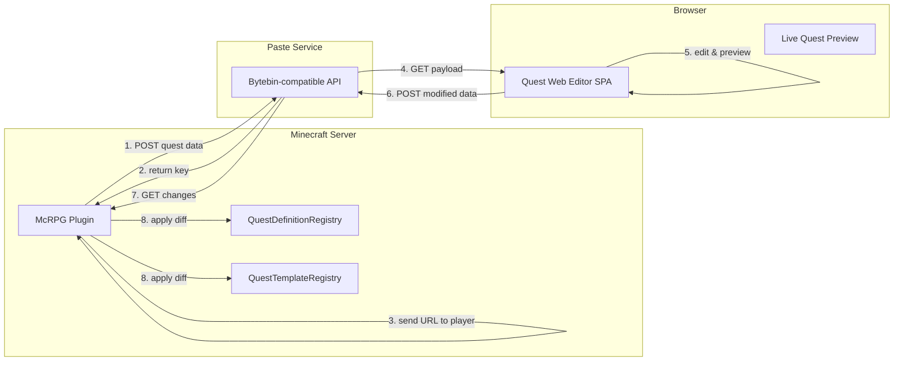
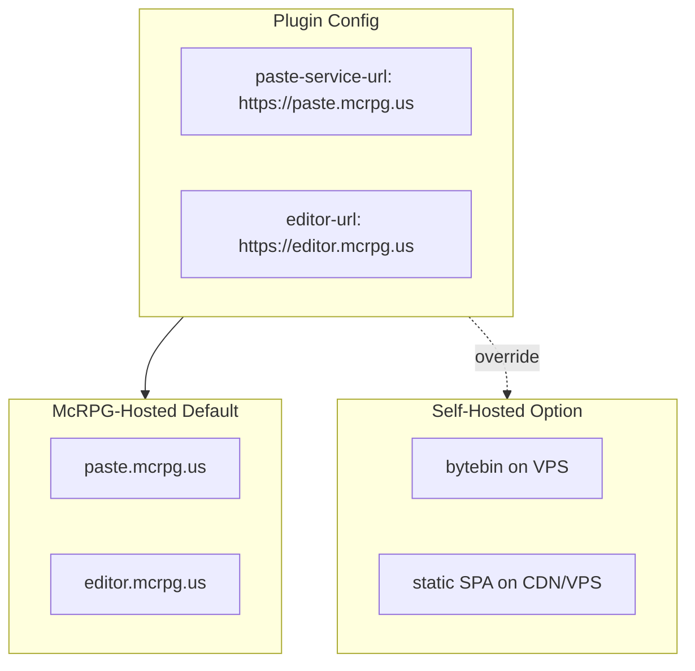
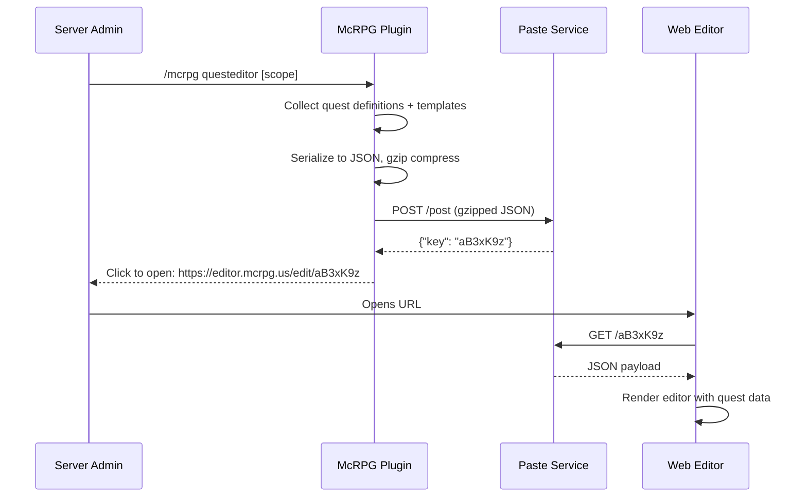
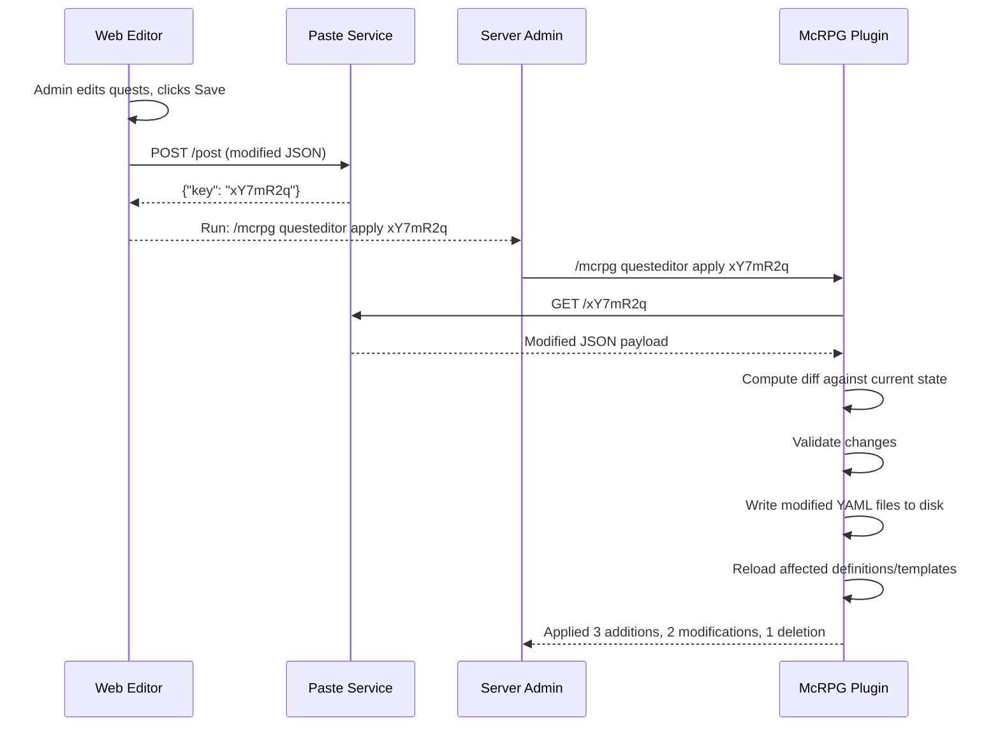
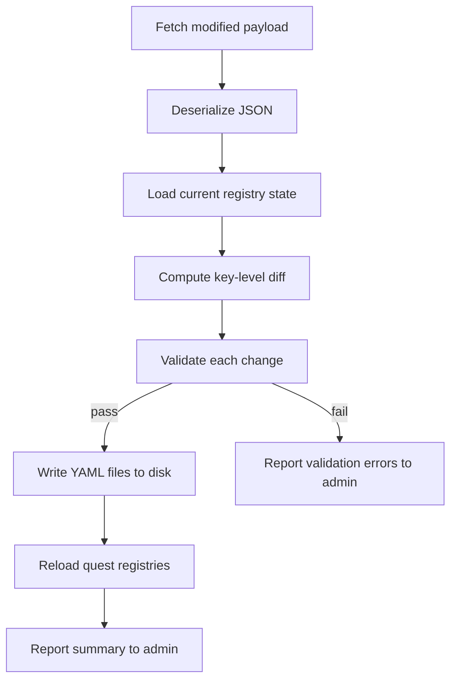
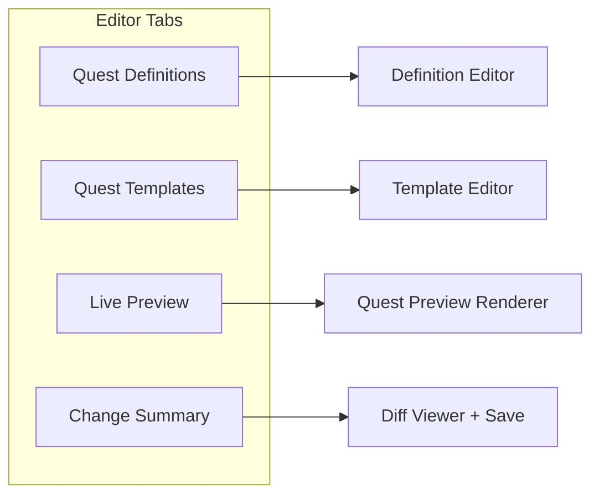
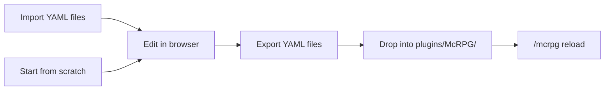

# Quest Web Editor & Preview System

## Overview

The quest web editor is a **browser-based authoring tool** that lets server owners create, edit, preview, and export McRPG quest definitions and quest templates without manually writing YAML. Inspired by the [LuckPerms web editor](https://luckperms.net/editor/), the system uses a **stateless data-shuttle architecture**: the Minecraft plugin uploads quest data to a paste service, the browser renders an interactive editor, and the plugin pulls changes back on command.



**Key properties:**
- No direct network connection between the Minecraft server and the browser
- No authentication beyond unguessable paste keys with short TTL
- Fully self-hostable (paste service, web app, and plugin config)
- Works behind NAT, firewalls, and shared hosting — the paste service is the only public endpoint

---

## 1. Architecture

### 1.1 Three-Component Model

The system consists of three independently deployable components:

| Component | Technology | Responsibility |
|-----------|------------|----------------|
| **McRPG Plugin** | Java 21 (existing) | Serialize quest data, upload/download via HTTP, apply diffs |
| **Paste Service** | Bytebin (Java) or compatible | Store and serve JSON payloads with TTL-based expiration |
| **Web Editor SPA** | TypeScript + React/Vue | Render interactive quest editor, validate, preview, export |

### 1.2 Why Stateless

A WebSocket or long-lived connection between the plugin and browser would require:
- Port forwarding or reverse proxy configuration
- Firewall exceptions on the Minecraft host
- Session affinity for multi-server setups

The paste-service shuttle avoids all of these. The plugin and browser never communicate directly — they read and write to a shared, ephemeral data store.

### 1.3 Deployment Topology



**Plugin configuration** (`config.yml`):
```yaml
web-editor:
  enabled: true
  paste-service-url: "https://paste.mcrpg.us"
  editor-url: "https://editor.mcrpg.us"
  payload-ttl: "24h"
  max-payload-size-kb: 512
```

---

## 2. Data Flow

### 2.1 Upload Flow (Plugin → Paste → Browser)



### 2.2 Download Flow (Browser → Paste → Plugin)



### 2.3 Standalone Mode (No Server)

The web editor also supports a **standalone mode** for offline quest authoring:

1. User visits `editor.mcrpg.us` with no key in the URL
2. Editor opens with a blank workspace or file import dialog
3. User authors quests from scratch or imports existing YAML files
4. On export, the editor produces downloadable YAML files matching McRPG's directory conventions
5. User places files in `plugins/McRPG/quests/` or `plugins/McRPG/quest-board/templates/` and runs `/mcrpg reload`

This mode requires no paste service and works fully offline once the SPA is loaded.

---

## 3. JSON Payload Schema

The payload is the contract between the plugin and the web editor. It must be versioned and backwards-compatible.

### 3.1 Top-Level Structure

```json
{
  "version": 1,
  "metadata": {
    "serverBrand": "Paper",
    "serverVersion": "1.21.1",
    "pluginVersion": "1.0.0-SNAPSHOT",
    "sessionId": "uuid-v4",
    "timestamp": 1712500000,
    "commandSender": {
      "name": "DiamondDagger590",
      "uuid": "player-uuid"
    },
    "scope": "ALL"
  },
  "questDefinitions": [ ... ],
  "questTemplates": [ ... ],
  "registryData": {
    "objectiveTypes": ["mcrpg:block_break", "mcrpg:mob_kill"],
    "rewardTypes": ["mcrpg:experience", "mcrpg:command", "mcrpg:ability_upgrade"],
    "scopeProviders": ["mcrpg:single_player", "mcrpg:permission", "mcrpg:land"],
    "rarities": ["mcrpg:common", "mcrpg:uncommon", "mcrpg:rare", "mcrpg:epic", "mcrpg:legendary"],
    "skills": ["mcrpg:swords", "mcrpg:mining", "mcrpg:herbalism", "mcrpg:woodcutting"],
    "questSources": ["mcrpg:board", "mcrpg:ability_upgrade", "mcrpg:manual"]
  }
}
```

**Key design decisions:**

| Field | Purpose |
|-------|---------|
| `version` | Schema version for forward/backward compatibility |
| `metadata.sessionId` | Prevents cross-server apply accidents |
| `metadata.scope` | Controls what was uploaded: `ALL`, `DEFINITIONS_ONLY`, `TEMPLATES_ONLY`, or a specific key |
| `registryData` | Populated from live registries so the editor can offer autocomplete and validation without hardcoding values |

### 3.2 Quest Definition Serialization

Each quest definition is serialized as a JSON object mirroring the YAML structure:

```json
{
  "key": "mcrpg:daily_mining",
  "scope": "mcrpg:single_player",
  "expiration": "24h",
  "repeatMode": "COOLDOWN",
  "repeatCooldown": "12h",
  "repeatLimit": null,
  "expansion": "mcrpg:mcrpg",
  "display": {
    "name": "Daily Mining",
    "description": "Mine ores to earn rewards",
    "objectives": {
      "mcrpg:mine_stone": "Mine {progress}/{required} stone blocks"
    }
  },
  "boardMetadata": {
    "boardEligible": true,
    "supportedRarities": ["mcrpg:common", "mcrpg:uncommon", "mcrpg:rare"],
    "supportedRefreshTypes": ["DAILY"],
    "acceptanceCooldown": null,
    "cooldownScope": null
  },
  "rewards": [
    {
      "label": "xp_reward",
      "type": "mcrpg:experience",
      "config": { "skill": "MINING", "amount": 500 }
    }
  ],
  "rewardDistribution": [],
  "phases": [
    {
      "label": "phase_1",
      "completionMode": "ALL",
      "rewards": [],
      "rewardDistribution": [],
      "stages": [
        {
          "label": "mine_ores",
          "key": "mcrpg:mine_ores_stage",
          "rewards": [],
          "rewardDistribution": [],
          "objectives": [
            {
              "label": "mine_stone",
              "key": "mcrpg:mine_stone",
              "type": "mcrpg:block_break",
              "requiredProgress": "50",
              "config": { "blocks": ["STONE", "COBBLESTONE", "ANDESITE"] },
              "rewards": [],
              "rewardDistribution": []
            }
          ]
        }
      ]
    }
  ]
}
```

### 3.3 Quest Template Serialization

Templates include variable definitions and expression references:

```json
{
  "key": "mcrpg:ore_mining_template",
  "display": { "name": "Ore Mining", "description": "Mine ores for the guild" },
  "displayNameRoute": "quests.templates.ore-mining.name",
  "boardEligible": true,
  "scope": "mcrpg:single_player",
  "supportedRarities": ["mcrpg:common", "mcrpg:uncommon", "mcrpg:rare"],
  "rarityOverrides": {
    "mcrpg:rare": { "difficultyMultiplier": 2.0, "rewardMultiplier": 1.5 }
  },
  "prerequisite": null,
  "variables": [
    {
      "name": "target_blocks",
      "type": "POOL",
      "minSelections": 2,
      "maxSelections": 4,
      "pools": [
        {
          "label": "common_ores",
          "difficulty": 1.0,
          "weight": { "mcrpg:common": 80, "mcrpg:uncommon": 60, "mcrpg:rare": 20 },
          "values": ["COAL_ORE", "IRON_ORE", "COPPER_ORE"]
        },
        {
          "label": "rare_ores",
          "difficulty": 2.5,
          "weight": { "mcrpg:common": 5, "mcrpg:uncommon": 20, "mcrpg:rare": 60 },
          "values": ["DIAMOND_ORE", "EMERALD_ORE"]
        }
      ]
    },
    {
      "name": "block_count",
      "type": "RANGE",
      "base": { "min": 32, "max": 96 }
    }
  ],
  "phases": [
    {
      "label": "mining_phase",
      "completionMode": "ALL",
      "condition": null,
      "stages": [
        {
          "label": "mine_blocks",
          "objectives": [
            {
              "label": "break_ores",
              "type": "mcrpg:block_break",
              "requiredProgress": "block_count",
              "config": { "blocks": "{target_blocks}" }
            }
          ]
        }
      ]
    }
  ],
  "rewards": [
    {
      "label": "mining_xp",
      "type": "mcrpg:experience",
      "config": { "skill": "MINING", "amount": "block_count * 15" }
    }
  ],
  "rewardDistribution": []
}
```

---

## 4. Plugin-Side Implementation

### 4.1 New Classes

| Class | Package | Responsibility |
|-------|---------|----------------|
| `WebEditorManager` | `us.eunoians.mcrpg.web` | Coordinates upload, download, diff, and apply operations |
| `WebEditorPayload` | `us.eunoians.mcrpg.web` | Immutable container for the JSON payload structure |
| `WebEditorSerializer` | `us.eunoians.mcrpg.web` | Serializes definitions/templates to JSON and deserializes back |
| `WebEditorDiff` | `us.eunoians.mcrpg.web` | Computes and represents changes between two payloads |
| `PasteServiceClient` | `us.eunoians.mcrpg.web` | HTTP client for bytebin-compatible POST/GET operations |
| `WebEditorCommand` | `us.eunoians.mcrpg.command` | Cloud command: `/mcrpg questeditor [scope]` and `/mcrpg questeditor apply <key>` |

### 4.2 Serialization Strategy

The plugin already has `QuestConfigLoader` for reading YAML and `GeneratedQuestDefinitionSerializer` for JSON round-tripping of generated quests. The web editor serializer builds on these patterns:

```java
public final class WebEditorSerializer {

    /**
     * Serialize all quest definitions and templates into a WebEditorPayload.
     *
     * @param mcRPG plugin instance for registry access
     * @param scope what to include (ALL, DEFINITIONS_ONLY, TEMPLATES_ONLY, or a specific key)
     * @return the payload ready for JSON encoding
     */
    @NotNull
    public static WebEditorPayload serialize(@NotNull McRPG mcRPG, @NotNull EditorScope scope) { ... }

    /**
     * Deserialize a JSON payload back into definition and template objects.
     *
     * @param json the raw JSON string from the paste service
     * @return parsed payload
     * @throws WebEditorParseException if the payload is malformed or version-incompatible
     */
    @NotNull
    public static WebEditorPayload deserialize(@NotNull String json) { ... }
}
```

**Design:** Gson is used for JSON serialization (already a dependency via Paper). Custom `TypeAdapter` implementations handle `NamespacedKey`, `Duration`, `Route`, and expression strings.

### 4.3 Diff and Apply

When applying edits, the plugin does not blindly overwrite all quest files. Instead:

1. **Deserialize** the modified payload from the paste service
2. **Load** the current state from the live registries
3. **Compute diff** by comparing keys:
   - **Added:** keys in modified payload not present in current state
   - **Removed:** keys in current state not present in modified payload
   - **Modified:** keys present in both but with different serialized content
   - **Unchanged:** keys present in both with identical content (skipped)
4. **Validate** each change:
   - Objective types, reward types, scope providers must exist in the live registry
   - Expression syntax must parse successfully
   - Required fields must be present
   - NamespacedKey format must be valid
5. **Write YAML** files to disk for added/modified definitions (one file per quest, matching existing directory conventions)
6. **Delete YAML** files for removed definitions (with confirmation prompt)
7. **Reload** affected registries via `QuestConfigLoader` and template loaders



### 4.4 HTTP Client

The `PasteServiceClient` uses Java's built-in `HttpClient` (Java 11+) for non-blocking HTTP:

```java
public final class PasteServiceClient {

    /**
     * Upload a gzip-compressed payload to the paste service.
     * Runs asynchronously off the main thread.
     *
     * @return CompletableFuture resolving to the paste key
     */
    @NotNull
    public CompletableFuture<String> upload(@NotNull byte[] compressedPayload) { ... }

    /**
     * Download a payload by key from the paste service.
     * Runs asynchronously off the main thread.
     *
     * @return CompletableFuture resolving to the raw (decompressed) JSON string
     */
    @NotNull
    public CompletableFuture<String> download(@NotNull String key) { ... }
}
```

All HTTP operations run on `CompletableFuture` to avoid blocking the main thread. The apply command schedules YAML writes and registry reloads back on the main thread via `Bukkit.getScheduler().runTask()`.

### 4.5 Commands

```
/mcrpg questeditor                    — Upload all quests and templates, get editor URL
/mcrpg questeditor definitions        — Upload only quest definitions
/mcrpg questeditor templates          — Upload only quest templates
/mcrpg questeditor <key>              — Upload a single quest/template by NamespacedKey
/mcrpg questeditor apply <paste-key>  — Download and apply changes from the editor
/mcrpg questeditor export             — Export current quests as downloadable YAML (no paste service needed)
```

**Permission:** `mcrpg.admin.questeditor` (default: op)

---

## 5. Web Editor Frontend

### 5.1 Technology Stack

| Layer | Technology | Rationale |
|-------|------------|-----------|
| Framework | React + TypeScript | Large ecosystem, strong typing for complex form state |
| State management | Zustand or Redux Toolkit | Quest trees are deeply nested; need predictable state updates |
| UI components | Radix UI + Tailwind CSS | Accessible primitives, rapid styling, no heavy component library |
| YAML export | `js-yaml` | Client-side YAML generation for standalone export |
| Validation | Zod | Schema-based validation matching the JSON payload contract |
| Build | Vite | Fast dev server, optimized production builds |
| Hosting | Static SPA (CDN) | No server-side rendering needed; cacheable at edge |

### 5.2 Editor Views

The editor is organized into tabbed workspaces:



#### Quest Definition Editor

A structured form editor for quest definitions:

- **Header panel:** Key, scope, expiration, repeat mode, display name/description
- **Phase tree:** Collapsible tree view of phases → stages → objectives
  - Drag-and-drop reordering of phases and stages
  - Add/remove buttons at each level
  - Phase completion mode toggle (ALL / ANY)
- **Objective editor:** Type selector (dropdown from `registryData.objectiveTypes`), required progress field, type-specific config panel (e.g., block list for `block_break`, mob list for `mob_kill`)
- **Reward editor:** Reusable reward panel at quest, phase, stage, and objective levels
  - Type selector, config fields, distribution config for scoped quests
- **Board metadata panel:** Board eligibility toggle, rarity checkboxes, refresh type selector

#### Quest Template Editor

Extends the definition editor with template-specific features:

- **Variable panel:** Define POOL and RANGE variables with pools, weights, and scaling
  - Pool variable: Add/remove pools, set per-rarity weights, manage value lists
  - Range variable: Min/max sliders with rarity difficulty preview
- **Expression fields:** Objective `requiredProgress` and reward `amount` fields accept expressions with variable autocomplete (e.g., typing `{` shows available variable names)
- **Condition editor:** Visual condition builder for phase/template prerequisites
- **Rarity override panel:** Per-rarity difficulty and reward multiplier sliders

#### Live Preview

The preview panel shows what a quest looks like at runtime:

- **Rarity selector:** Toggle between rarities to see how template variables resolve
- **Simulated generation:** Runs the template variable resolution algorithm client-side to show a concrete quest definition
- **GUI mockup:** Renders an approximate Minecraft inventory GUI showing:
  - Quest board slot with lore (using `OfferingLoreBuilder` logic)
  - Quest detail view with phase/stage/objective breakdown
  - Reward display
- **Variable resolution table:** Shows each variable's resolved value for the selected rarity

#### Change Summary (Diff View)

Before saving, the editor shows a diff of all changes:

- Added quests/templates (green)
- Modified quests/templates (yellow) with field-level diffs
- Removed quests/templates (red)
- Validation errors and warnings
- "Save to paste service" button that uploads and displays the apply command

### 5.3 Validation

Client-side validation runs continuously as the user edits:

| Rule | Severity | Description |
|------|----------|-------------|
| Unique keys | Error | No duplicate `NamespacedKey` values across definitions/templates |
| Valid objective types | Error | Objective type must exist in `registryData.objectiveTypes` |
| Valid reward types | Error | Reward type must exist in `registryData.rewardTypes` |
| Valid scope providers | Error | Scope must exist in `registryData.scopeProviders` |
| Expression syntax | Error | Expression fields must parse (balanced braces, valid operators) |
| Variable references | Error | Template expressions can only reference declared variables |
| Required fields | Error | Key, at least one phase, at least one objective per stage |
| Duration format | Error | Expiration/cooldown must match `<N>d<N>h<N>m<N>s` pattern |
| NamespacedKey format | Warning | Keys should follow `namespace:path` convention |
| Empty rewards | Warning | Quests with no rewards at any level |
| Unreferenced variables | Warning | Template variables declared but never used |

---

## 6. Paste Service

### 6.1 Bytebin Compatibility

The system is designed to work with [bytebin](https://github.com/lucko/bytebin) or any HTTP service implementing this minimal API:

| Endpoint | Method | Request | Response |
|----------|--------|---------|----------|
| `/post` | `POST` | Body: raw bytes, `Content-Type: application/json`, optional `Content-Encoding: gzip` | `{"key": "<random-id>"}` |
| `/<key>` | `GET` | — | Raw payload with original `Content-Type` |
| `/<key>` | `PUT` | Body: updated bytes, `Modification-Token` header | `200 OK` |

### 6.2 McRPG-Hosted Instance

For convenience, the McRPG project will host a default paste service at `paste.mcrpg.us`:

- **TTL:** 24 hours (configurable server-side)
- **Max payload size:** 512 KB (sufficient for hundreds of quest definitions)
- **Rate limiting:** Per-IP, 10 uploads/hour
- **No authentication:** Security relies on key unguessability (16+ character random alphanumeric) and short TTL
- **CORS:** `Access-Control-Allow-Origin` set to the editor domain

### 6.3 Self-Hosting

Server owners who prefer not to send quest data to an external service can:

1. Run their own bytebin instance (single Java JAR, minimal config)
2. Point the plugin at it via `web-editor.paste-service-url`
3. Optionally host the SPA statically and set `web-editor.editor-url`

---

## 7. Security Considerations

### 7.1 Threat Model

| Threat | Mitigation |
|--------|------------|
| Unauthorized access to quest data via paste key | 16+ char random keys, 24h TTL, no enumeration endpoint |
| Malicious payload injection via apply command | Server-side validation before writing YAML; reject unknown types, invalid expressions |
| YAML deserialization attacks | Plugin writes YAML from validated in-memory objects, never from raw user strings |
| XSS in web editor | React's default escaping, CSP headers on the hosted SPA |
| Paste service abuse (spam) | Rate limiting, max payload size, TTL-based auto-cleanup |
| Cross-server apply (accidental) | `sessionId` in metadata; plugin warns if session doesn't match |
| Man-in-the-middle | HTTPS required for both paste service and editor URLs |

### 7.2 Permission Model

- Only players with `mcrpg.admin.questeditor` can upload or apply
- The paste key acts as a capability token — anyone with it can view (but viewing quest config is not sensitive for most servers)
- The apply command performs a final validation pass server-side regardless of what the editor validated client-side

---

## 8. Offline / Standalone Workflow

Not all server owners want to use the paste service. The editor supports a fully offline workflow:



**Implementation:**
- The SPA includes a "File" menu with Import/Export options
- Import: accepts `.yml`/`.yaml` files, parses them client-side using `js-yaml`, and populates the editor
- Export: generates YAML files matching McRPG's directory conventions and offers them as a ZIP download:
  ```
  export.zip
  ├── quests/
  │   ├── mining/
  │   │   └── daily_mining.yml
  │   └── combat/
  │       └── mob_slayer.yml
  └── quest-board/
      └── templates/
          ├── mining/
          │   └── ore_mining.yml
          └── combat/
              └── mob_slayer.yml
  ```
- No network requests are made in standalone mode after the initial SPA load

---

## 9. Extensibility

### 9.1 Third-Party Objective and Reward Types

When a third-party plugin registers custom objective types or reward types via `ContentExpansion`, those types appear in `registryData` in the upload payload. The web editor renders them with:

- A generic key-value config editor (since the editor doesn't know the custom type's schema)
- The type key displayed for identification

To enable rich editing for custom types, third-party plugins can optionally provide a **type schema descriptor** in their content pack:

```java
public interface WebEditorTypeDescriptor {

    /**
     * JSON Schema describing the config fields for this objective/reward type.
     * Used by the web editor to render appropriate form controls.
     */
    @NotNull
    JsonObject getConfigSchema();
}
```

If a `QuestObjectiveType` or `QuestRewardType` implements `WebEditorTypeDescriptor`, the plugin includes the schema in `registryData`, and the editor renders typed form controls instead of a generic key-value editor.

### 9.2 Payload Versioning

The `version` field in the payload enables forward compatibility:

- **Version 1:** Initial schema (quest definitions + templates + registry data)
- Future versions add fields with defaults; the editor degrades gracefully for unknown fields
- The plugin rejects payloads with a `version` higher than it supports and prompts the user to update

---

## 10. Key Design Decisions

| Decision | Choice | Rationale |
|----------|--------|-----------|
| Stateless paste-based shuttle | Over WebSocket/direct connection | Works behind NAT, no firewall config, no port forwarding, battle-tested by LuckPerms |
| Diff-based apply | Over full replacement | Safe for concurrent changes; only modified quests are rewritten |
| YAML file output | Over direct registry manipulation | Preserves human-readable config files; compatible with version control |
| Client-side template preview | Over server-side rendering | No round-trip latency; works in standalone mode; variable resolution is deterministic |
| React + TypeScript | Over Vue or vanilla JS | Strong typing for complex nested quest structures; large ecosystem for form builders |
| Bytebin compatibility | Over custom paste API | Proven at scale by LuckPerms; self-hostable; simple API |
| Generic fallback for custom types | Over requiring all types to have editor support | Pragmatic: custom types work immediately with key-value editing; rich editing is opt-in |
| Separate SPA (not embedded in plugin) | Over Minecraft-hosted web server | No additional ports; no TLS cert management; CDN-cacheable; updates independently of plugin |

---

## 11. Proposed Implementation Phases

### Phase 1: Plugin-Side Foundation
- `PasteServiceClient` with upload/download via `HttpClient`
- `WebEditorSerializer` for quest definitions (JSON round-trip)
- `WebEditorPayload` data class with metadata and registry data population
- `/mcrpg questeditor` command (upload only, returns URL)
- Plugin config entries for paste service URL, editor URL, TTL
- Unit tests for serializer round-trip fidelity

### Phase 2: Apply Flow
- `WebEditorDiff` computation (added/modified/removed by key)
- Server-side validation of incoming payloads
- YAML file writer (definition → YAML, matching `QuestConfigLoader` format)
- `/mcrpg questeditor apply <key>` command
- Registry reload after apply
- Confirmation prompt for deletions
- Unit tests for diff computation and validation

### Phase 3: Web Editor MVP (Definitions Only)
- SPA scaffold (React + TypeScript + Vite)
- Payload fetch and parse from paste service
- Quest definition list view
- Definition editor form (phases → stages → objectives)
- Reward editor component
- Client-side validation
- Save to paste service and display apply command
- Standalone YAML import/export

### Phase 4: Template Editor
- Template editor extending definition editor
- Variable panel (POOL and RANGE variable editors)
- Expression field with variable autocomplete
- Condition builder UI
- Rarity override controls
- Template serializer in plugin (JSON round-trip for templates)

### Phase 5: Live Preview
- Client-side template variable resolution engine
- Rarity selector with simulated generation
- Minecraft GUI mockup renderer (quest board slot, detail view)
- Variable resolution table
- Side-by-side preview across rarities

### Phase 6: Polish & Extensibility
- `WebEditorTypeDescriptor` interface for custom type schemas
- Drag-and-drop reordering in phase/stage tree
- Undo/redo support
- URL sharing (paste key in URL for collaboration)
- Dark/light theme
- Mobile-responsive layout
- Hosted paste service deployment (`paste.mcrpg.us`)
- Hosted SPA deployment (`editor.mcrpg.us`)

---

## 12. Open Questions

1. **Board configuration editing:** Should the editor also support editing `board.yml` and slot category config, or is that out of scope for v1?
2. **Multi-board support:** If multiple boards are added in the future, should the editor present a board selector?
3. **Localization key editing:** Should the editor allow inline editing of locale YAML files for quest display strings, or should those remain separate?
4. **Collaborative editing:** Should two admins be able to edit the same paste simultaneously (would require WebSocket upgrade to the paste service), or is sequential editing sufficient?
5. **Template testing:** Should the preview simulate an actual `QuestInstance` lifecycle (start → progress → complete), or just show the generated definition?
6. **Version control integration:** Should the editor support exporting to a Git-friendly format (one file per quest, stable key ordering) for servers that version-control their config?

