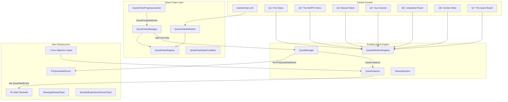

# Tutorial Quest System

> **Last Updated:** 2026-05-22
> **Status:** Design complete, pending implementation
> **Scope:** First-class quest chain system, tutorial quest line, new objective/reward types, player onboarding flow

---

## Design Philosophy

Three guiding principles:

- **Natural progression**: Quests trigger based on what the player is already doing, never forcing them to stop their gameplay. Every tutorial step is something the player was going to do anyway.
- **Non-restrictive**: No features are gated behind tutorial completion. Veterans can opt out via a player setting. Servers can disable the system entirely.
- **Gamemode agnostic**: Objectives use McRPG-internal events (level ups, GUI opens, ability unlocks), not gamemode-specific actions. Works on survival, factions, towny, skyblock, etc.

---

## Architecture Overview

The tutorial system is built on a new **Quest Chain** orchestration layer that sits on top of the existing quest engine. The chain manages ordering and auto-advancement; individual quests remain independent definitions.



---

## Infrastructure Changes

### 1. Quest Chain System (first-class concept)

Quest chains are an orchestration layer on top of existing quest definitions. A chain defines an ordered sequence of quest definitions that auto-advance on completion. Chains have their own source, conditions between steps, and persisted per-player state.

**QuestChainDefinition** (loaded from `chain.yml` co-located with quest files):

```yaml
# quests/tutorial/chain.yml
key: mcrpg:tutorial_chain
source: mcrpg:tutorial
auto-start:
  trigger: mcrpg:first_join
steps:
  first_steps:
    quest: mcrpg:tutorial_first_steps
  explore_menu:
    quest: mcrpg:tutorial_explore_menu
  passive_unlock:
    quest: mcrpg:tutorial_passive_unlock
  open_loadout:
    quest: mcrpg:tutorial_open_loadout
  active_unlock:
    quest: mcrpg:tutorial_active_unlock
  combo_cast:
    quest: mcrpg:tutorial_combo_cast
  quest_board:
    quest: mcrpg:tutorial_quest_board
```

**Key components:**

- `QuestChainDefinition` -- immutable definition loaded from YAML (key, source key, auto-start trigger, ordered step list)
- `QuestChainStep` -- quest key + optional start conditions
- `QuestChainRegistry` -- registered in `McRPGRegistryKey`, stores loaded chain definitions
- `QuestChainManager` -- runtime chain state management (accessed via `McRPGManagerKey.QUEST_CHAIN`)
- `QuestChainProgressListener` -- on `QuestCompleteEvent`, checks if the completed quest belongs to a chain and advances to the next step
- `QuestChainStartCondition` -- extensible interface for gating chain steps (permission, etc.). Built-in conditions deferred to backlog (see `chain-system-backlog.md`).

**Chain state persistence** -- new SQL table:

```sql
CREATE TABLE mcrpg_quest_chain_state (
    player_uuid       TEXT NOT NULL,
    chain_key         TEXT NOT NULL,
    current_quest     TEXT,
    state             TEXT NOT NULL,
    completion_count  INTEGER NOT NULL DEFAULT 0,
    last_completed_at BIGINT,
    PRIMARY KEY (player_uuid, chain_key)
);
```

State values: `ACTIVE`, `COMPLETED`, `ABANDONED`, `FAILED`, `EXPIRED`

`current_quest` is nullable -- `NULL` when state is `COMPLETED` or `ABANDONED` (no meaningful current quest in terminal states). Stores `NamespacedKey` (not index) to handle chain reconfiguration:
- On load, resolve the quest's position in the current chain definition
- If the stored quest no longer exists in the chain, advance to the first uncompleted step (checked against completion log)
- If steps were reordered, the player picks up from wherever their current quest now sits

**Chain completion log** -- separate historical table:

```sql
CREATE TABLE mcrpg_quest_chain_completion_log (
    player_uuid       TEXT NOT NULL,
    chain_key         TEXT NOT NULL,
    completed_at      BIGINT NOT NULL,
    completion_number INTEGER NOT NULL,
    PRIMARY KEY (player_uuid, chain_key, completion_number)
);
```

Written on every chain completion by `QuestChainManager`. The state table is operational (where is the player now?); the completion log is historical (when did they finish each time?). This mirrors the existing `QuestCompletionLogDAO` pattern for individual quests. For the tutorial (ONCE), only one row is ever written. For future repeatable chains, this provides full completion history.

**Quest History GUI -- chain grouping:**

Completed chains appear as a single grouped entry in `QuestHistoryGui` rather than showing each quest independently:
- Chain entry uses the chain's source material (e.g., `KNOWLEDGE_BOOK` for tutorial) and displays the chain name
- Clicking the chain entry opens a sub-view (`QuestChainHistoryDetailGui`) showing the individual quest completions within that chain run
- For repeatable chains (future), multiple chain entries appear (one per completion), each expandable
- Individual quests that are NOT part of any chain continue showing as independent entries in the history
- Ordering: chain entries sort by `completed_at`; within a chain, quests sort by step order

**Auto-start triggers:**

Auto-start triggers are extensible via `ChainAutoStartTriggerRegistry`. Each trigger defines *when* the chain system evaluates whether to start a chain for a player. Triggers are independent of conditions (which define *if* the chain should start).

- `ChainAutoStartTrigger` -- interface: `getKey()`, responsible for registering its own Bukkit listener or hook that calls `QuestChainManager.tryStartChain()`
- `ChainAutoStartTriggerRegistry` -- registered in `McRPGRegistryKey`
- `ChainAutoStartTriggerContentPack` -- third-party registration

Built-in triggers:

| Key | Behavior | Listener |
|---|---|---|
| `mcrpg:first_join` | Evaluate on first join (chain state doesn't exist for player) | `QuestChainFirstJoinListener` |
| `mcrpg:login` | Re-evaluate every login (for time-gated/repeatable chains) | `QuestChainLoginListener` |
| `mcrpg:manual` | Never auto-evaluate; started only via API or command | No listener (inert) |

Third-party plugins can register custom triggers (e.g., `myplugin:region_enter`, `myplugin:npc_interact`) via content pack. Each custom trigger provides its own listener that calls `QuestChainManager.tryStartChain(player, chainKey)`.

YAML references triggers by key:

```yaml
auto-start:
  trigger: mcrpg:first_join
```

Trigger detection lives in dedicated listeners (`QuestChainFirstJoinListener`, `QuestChainLoginListener`) that delegate to `QuestChainManager` -- the manager itself does not listen for Bukkit events.

**Extension infrastructure:**
- `QuestChainContentPack` -- third-party plugins register chains via content expansion
- `QuestChainStartConditionContentPack` -- register custom chain step conditions (deferred to backlog; interface ships but no built-in conditions or content pack initially)
- Lifecycle events: `QuestChainStartEvent`, `QuestChainStepAdvanceEvent`, `QuestChainCompleteEvent`
- `ContentHandlerType.QUEST_CHAIN`

**Relationship to quest definitions:** Quest definitions stay independent and reusable. They do not know they are part of a chain. The chain is purely an orchestration/ordering concern.

### 2. PreQuestStartEvent (general-purpose, cancellable)

A new cancellable Bukkit event fired before any quest starts, regardless of source. Gives third-party plugins a general-purpose hook to gate quest starts.

```java
public class PreQuestStartEvent extends Event implements Cancellable {
    private final QuestDefinition definition;
    private final Player player;
    private final McRPGPlayer mcRPGPlayer;
    private final QuestSource source;
    // ...
}
```

**Event ownership:** Both `PreQuestStartEvent` and `QuestStartEvent` fire from `QuestManager.startQuest()`. `QuestInstance.start()` becomes a pure state mutation (sets state to `IN_PROGRESS`, activates phase-0 stages) without firing events directly. This avoids the dual-ownership problem where bypassing the manager would skip the pre-event.

**Tutorial opt-out:** A `TutorialPreQuestStartListener` checks the player's `DisableTutorialSetting` and cancels `PreQuestStartEvent` when the source is `TutorialQuestSource`. This pattern is reusable by any plugin that wants to gate quest starts.

### 3. On-Start Rewards on QuestDefinition

Add an optional `on-start-rewards` section to `QuestDefinition` that mirrors the completion reward pipeline. These fire on `QuestStartEvent` via a new `QuestStartRewardListener`.

Schema addition to `QuestDefinition`:
- `List<QuestRewardEntry> onStartRewardEntries` (optional, empty by default) -- uses `QuestRewardEntry` (not raw `QuestRewardType`) for consistency with completion rewards and future fallback support

All existing `QuestDefinition` constructors are preserved with the new field defaulting to empty. New constructors/factory methods are added for callers that need on-start rewards.

YAML format (map-based, consistent with quest reward format):

```yaml
on-start-rewards:
  welcome_message:
    type: mcrpg:message
    key: tutorial.first-steps.welcome
    messages:
      - "<primary>Welcome to McRPG!</primary>"
      - "<body>As you play, your skills will level up automatically."
```

### 4. MessageRewardType

New reward type (`mcrpg:message`) designed for sending player-facing messages. Supports both locale route lookup and inline MiniMessage strings with palette resolution.

```yaml
# Route-based (preferred for translatable text)
welcome:
  type: mcrpg:message
  key: tutorial.welcome-message

# Inline fallback (for quick prototyping or non-translatable text)
hint:
  type: mcrpg:message
  messages:
    - "<primary>Tip:</primary> <body>Run /mcrpg to open your menu!"

# Both (route lookup with inline fallback)
greeting:
  type: mcrpg:message
  key: tutorial.greeting
  messages:
    - "<primary>Welcome!</primary> <body>Your adventure begins."
```

Resolution order:
1. Locale route lookup via `McRPGLocalizationManager` (if `key` is set)
2. Inline `messages` as fallback (if route lookup fails or `key` is absent)

All strings pass through palette resolution (`buildPaletteReplacements()`) and MiniMessage parsing. Standard placeholders (`<player>`, etc.) are supported.

`MessageRewardType` is chat-only. When rendered in GUI contexts (e.g., `QuestDetailRewardSlot`), `describeForDisplay()` returns a short summary, not the full message list.

### 5. TutorialQuestSource

New `QuestSource` subclass: non-abandonable, with `NamespacedKey` `mcrpg:tutorial`. Serves two purposes:
- **UI treatment**: Tutorial quests visually distinguished in the Active Quests GUI via a distinct material (e.g., `KNOWLEDGE_BOOK` instead of `WRITABLE_BOOK`) and a `<tutorial>` palette placeholder for the quest name color
- **PreQuestStartEvent gating**: `TutorialPreQuestStartListener` checks the player setting and cancels starts for this source when tutorials are disabled

New palette entry in `config.yml`:

| Role | Placeholder | Default Value | When to Use |
|---|---|---|---|
| **tutorial** | `<tutorial>` | `<color:#E8C97A>` | Tutorial quest names and chain-related UI elements |

Non-abandonable quests show a `<body>Tutorial quests cannot be abandoned.` lore line and play a deny sound + action bar message on right-click attempt.

### 6. Eight New Objective Types

All new types follow the existing `QuestObjectiveType` pattern (base registered in registry, `parseConfig` produces configured copy with filter state). State-based objectives support auto-complete: on quest start, if the player's state already satisfies the objective, it completes after a short delay. Event-based objectives do not auto-complete (they require the event to fire while the objective is active).

**Auto-complete delay:** When a quest starts and an objective's auto-complete check passes, completion is deferred by a 2-second delay (scheduled via `CoreTask`). This prevents the "instant spam" feeling for veterans and gives each quest a moment to visually exist before resolving. The chain manager's cascade batching (see Tutorial Quest Chain section) handles cases where multiple quests auto-complete in sequence.

| Type Key | Kind | Trigger | Config Filters | Auto-Complete Check |
|---|---|---|---|---|
| `mcrpg:skill_level_up` | Event | `SkillGainLevelEvent` | `skill` (specific key or omit for any), `levels` (min per event, default 1) | N/A (event-based) |
| `mcrpg:skill_target_level` | State | On quest start check | `skill` (specific key or omit for any), `target-level` (required) | Check if player already has a skill at or above `target-level` |
| `mcrpg:gui_open` | Event | `CoreGuiOpenEvent` | `gui-type` (`NamespacedKey` matching the GUI's `getGuiKey()` -- e.g. `mcrpg:home`, `mcrpg:loadout_selection`, `mcrpg:board`) | N/A (event-based) |
| `mcrpg:ability_unlock` | State | `AbilityUnlockEvent` | `ability-type` (`PASSIVE`, `ACTIVE`, `INNATE`), optional specific `ability` key | Check if player already has an unlocked ability matching the filter |
| `mcrpg:ability_activate` | Event | Ability activation path | `ability-type` (`PASSIVE`, `ACTIVE`, `INNATE`), optional specific `ability` key | N/A (event-based) |
| `mcrpg:combo_activate` | Event | Successful combo completion | Optional `ability` key, optional `combo-pattern` | N/A (event-based) |
| `mcrpg:loadout_equip` | State | `LoadoutAbilityEquipEvent` | `ability-type` (`PASSIVE`, `ACTIVE`), optional specific `ability` key | Check if player's loadout already contains a matching ability |
| `mcrpg:quest_board_accept` | Event | `BoardOfferingAcceptEvent` | Optional `board` key | N/A (event-based) |

State-based objectives (`ability_unlock`, `loadout_equip`, `skill_target_level`) auto-complete because they check player state — if the condition is already met, there's no event to wait for. Event-based objectives require the triggering event to fire while the objective is active.

**GUI Key System:**

McCore defines `KeyedGui` — a generic interface for identifying GUI types by `NamespacedKey`. McRPG GUI classes implement it:

```java
// In McCore:
public interface KeyedGui {
    @NotNull Optional<NamespacedKey> getGuiKey();
}

// Example on HomeGui (McRPG):
public class HomeGui extends BaseGui<McRPGPlayer> implements FillerItemGui, KeyedGui {
    public static final NamespacedKey GUI_KEY = new NamespacedKey(McRPGMethods.getMcRPGNamespace(), "home");

    @Override
    @NotNull
    public Optional<NamespacedKey> getGuiKey() { return Optional.of(GUI_KEY); }
}
```

This allows any plugin using McCore's GUI system to implement `KeyedGui` on their GUIs and have them identifiable by key. GUIs that do not implement `KeyedGui` still fire the open event but with `Optional.empty()` for the key.

**McCore `CoreGuiOpenEvent`:**

McCore fires `CoreGuiOpenEvent` directly from `GuiManager.trackPlayerGui()` after tracking completes. No template method or downstream override needed:

```java
// In McCore GuiManager:
public void trackPlayerGui(@NotNull UUID uuid, @NotNull Gui<P> gui) {
    // ... existing tracking logic ...
    Optional<NamespacedKey> guiKey = (gui instanceof KeyedGui keyed) ? keyed.getGuiKey() : Optional.empty();
    Bukkit.getPluginManager().callEvent(new CoreGuiOpenEvent(uuid, gui, guiKey));
}
```

`CoreGuiOpenEvent` carries the player UUID, the `Gui` instance, and `Optional<NamespacedKey>`. It is a McCore-level event — any plugin using the McCore GUI system gets it for free. McRPG's `GuiOpenQuestProgressListener` simply listens for `CoreGuiOpenEvent`.

**New Bukkit events:**
- `CoreGuiOpenEvent` (McCore) -- fired from `GuiManager.trackPlayerGui()`. "Open" means any GUI creation that goes through the manager -- back-button navigation counts (this is intentional for tutorial purposes; quest definitions can use `required-progress: 1` to only trigger once).
- `LoadoutAbilityEquipEvent` -- fired from a new centralized `LoadoutManager.equipAbility()` method that wraps the `Loadout` mutation + event firing. Existing callsites (GUI slots, commands) are retrofitted to use this method.

**Existing events leveraged (no creation needed):**
- `AbilityUnlockEvent` -- already exists at `event/ability/AbilityUnlockEvent.java` and is already fired from `OnSkillLevelUpListener` when an ability is first unlocked. Only a new progress listener is needed.

### 7. BoostedExperienceRewardType

New reward type (`mcrpg:boosted_experience`) that adds to a player's boosted experience bank directly. State ownership: `grant()` resolves the `McRPGPlayer` and mutates `PlayerExperienceExtras.modifyBoostedExperience(amount)`.

```yaml
boosted_xp:
  type: mcrpg:boosted_experience
  amount: 500
```

### 8. RedeemableExperienceRewardType and RedeemableLevelsRewardType

New reward types for adding to a player's redeemable XP and redeemable levels banks. State ownership: both mutate `PlayerExperienceExtras` (`modifyRedeemableExperience(amount)`, `modifyRedeemableLevels(amount)`).

```yaml
redeemable_xp:
  type: mcrpg:redeemable_experience
  amount: 500

redeemable_levels:
  type: mcrpg:redeemable_levels
  amount: 1
```

### 9. Configuration Toggles

**Server-wide** (`config.yml`):

```yaml
# Whether the tutorial quest chain auto-starts for new players.
# When disabled, no new tutorial chains will start. Existing active
# tutorial quests are NOT cancelled -- only new starts are suppressed.
# Requires restart to take effect.
tutorial:
  enabled: true
```

No `config-version` bump needed — no migration logic required for this addition.

**Player setting** (new `PlayerSetting` impl):
- `DISABLE_TUTORIAL` boolean setting, default `false`
- When toggled to `true`: shows a confirmation prompt (reuses the existing `ConfirmationManager` pattern). On confirm: cancel any active tutorial quest via chain manager, set chain state to `ABANDONED`
- Toggling back to `false` after abandonment does NOT restart the chain or grant missed rewards -- the chain remains `ABANDONED`
- Exposed in the Player Settings GUI with distinct materials for enabled/disabled + deny sound on destructive toggle
- `TutorialPreQuestStartListener` checks this setting and cancels `PreQuestStartEvent` for tutorial sources

**Permission nodes:**

| Permission | Default | Purpose |
|---|---|---|
| `mcrpg.*` | `op` | Root wildcard — grants everything below |
| `mcrpg.admin.*` | `op` | All admin commands |
| `mcrpg.quest.admin.*` | `op` | All quest admin commands |
| `mcrpg.quest.admin.chain.*` | `op` | All chain admin subcommands |
| `mcrpg.quest.admin.chain.restart` | `op` | Restart a player's chain from step 1 (preserves history) |
| `mcrpg.quest.admin.chain.reset` | `op` | Hard reset a player's chain state (wipes history) |
| `mcrpg.quest.admin.chain.advance` | `op` | Force-advance a player's chain to the next step |
| `mcrpg.tutorial.bypass` | `op` | Exempt from tutorial auto-start (staff/alt accounts) |

Standard Bukkit permission inheritance applies — granting `mcrpg.*` implicitly grants every child node. The `plugin.yml` `children` block declares the full hierarchy so permission plugins resolve wildcards correctly.

---

## Tutorial Quest Chain

Seven quests progressing from passive discovery through active mastery. The chain auto-starts on first join. All quests are `QuestRepeatMode.ONCE`, `SinglePlayerQuestScope`, sourced from the `mcrpg:tutorial_chain` chain.

```mermaid
flowchart LR
    Q1["Q1: First Steps\n(Level up any skill)"]
    Q2["Q2: The McRPG Menu\n(Open Home GUI)"]
    Q3["Q3: Natural Talent\n(Unlock a passive ability)"]
    Q4["Q4: Your Arsenal\n(Open loadout)"]
    Q5["Q5: Unleashed Power\n(Unlock an active ability)"]
    Q6["Q6: Combo Strike\n(Cast an active ability)"]
    Q7["Q7: The Quest Board\n(Accept a board quest)"]

    Q1 -->|"chain advances"| Q2
    Q2 -->|"chain advances"| Q3
    Q3 -->|"chain advances"| Q4
    Q4 -->|"chain advances"| Q5
    Q5 -->|"chain advances"| Q6
    Q6 -->|"chain advances"| Q7
```



**Auto-complete pacing:** When multiple quests auto-complete in rapid succession (e.g., a returning player who already has unlocked abilities), on-start messages for auto-completed steps are suppressed. Only the final non-auto-completed step's on-start message is delivered. Completion notifications for auto-completed steps are batched into a single summary message.

### Quest 1: "First Steps"

- **Auto-starts**: On first join via chain `auto-start: trigger: mcrpg:first_join`
- **On-start rewards**: `MessageRewardType` welcoming player, explaining skills level up as they play
- **Objective**: Have any skill at level 1 or above (`mcrpg:skill_target_level`, `target-level: 1`)
- **Completion rewards**: 1,000 boosted XP
- **Auto-complete**: If player already has a skill level >= 1, completes after delay

### Quest 2: "The McRPG Menu"

- **On-start rewards**: Message telling player to run `/mcrpg`
- **Objective**: Open the Home GUI (`mcrpg:gui_open`, `gui-type: mcrpg:home`)
- **Completion rewards**: 1,000 boosted XP

### Quest 3: "Natural Talent"

- **On-start rewards**: Message explaining passive abilities trigger automatically
- **Objective**: Unlock a passive ability (`mcrpg:ability_unlock`, `ability-type: PASSIVE`)
- **Completion rewards**: 1,500 boosted XP + 1 redeemable level
- **Auto-complete**: If player already has any unlocked passive, completes after delay

### Quest 4: "Your Arsenal"

- **On-start rewards**: Message about loadouts and how the unlocked ability was auto-equipped
- **Objective**: Open the Loadout GUI (`mcrpg:gui_open`, `gui-type: mcrpg:loadout_selection`)
- **Completion rewards**: 1,000 boosted XP + 1,500 redeemable XP

### Quest 5: "Unleashed Power"

- **On-start rewards**: Message about active abilities and how they use combo clicks
- **Objective**: Unlock an active ability (`mcrpg:ability_unlock`, `ability-type: ACTIVE`)
- **Completion rewards**: 2,000 boosted XP + 1 redeemable level
- **Auto-complete**: If player already has an unlocked active ability, completes after delay

### Quest 6: "Combo Strike"

- **On-start rewards**: Message explaining combo patterns (RRR, RRL, RLR), mana costs, and which tools work
- **Objective**: Successfully cast any active ability via combo (`mcrpg:combo_activate`)
- **Completion rewards**: 2,000 boosted XP + 1 redeemable level

### Quest 7: "The Quest Board"

- **On-start rewards**: Message about the quest board offering rotating challenges with rewards
- **Objective**: Accept a quest from the quest board (`mcrpg:quest_board_accept`)
- **Completion rewards**: 2,500 boosted XP + 2,500 redeemable XP + 1 redeemable level (graduation bonus)

### Reward Summary

| Quest | Boosted XP | Redeemable XP | Redeemable Levels | Cumulative Boosted |
|---|---|---|---|---|
| Q1: First Steps | 1,000 | -- | -- | 1,000 |
| Q2: The McRPG Menu | 1,000 | -- | -- | 2,000 |
| Q3: Natural Talent | 1,500 | -- | 1 | 3,500 |
| Q4: Your Arsenal | 1,000 | 1,500 | -- | 4,500 |
| Q5: Unleashed Power | 2,000 | -- | 1 | 6,500 |
| Q6: Combo Strike | 2,000 | -- | 1 | 8,500 |
| Q7: The Quest Board | 2,500 | 2,500 | 1 | 11,000 |
| **Total** | **11,000** | **4,000** | **4** | |

**Value analysis (level-up equation: `200+(0.8*(skill_level^1.5))`):**

Early levels cost ~200 XP each; cumulative to reach level 10 ≈ 2,100 XP, level 20 ≈ 4,300 XP, level 50 ≈ 15,300 XP.

- **11,000 boosted XP** (at 2x consumption rate): doubles the player's next 11,000 earned XP across all skills. A player actively playing 2 skills gets roughly 5,500 bonus XP per skill — catapulting each to ~level 20-25 much faster than baseline.
- **4,000 redeemable XP**: enough to instantly push one skill from level 0 to ~level 18, or spread across skills.
- **4 redeemable levels**: immediate gratification applied to any skill(s).

**Net effect:** A new player who finishes the tutorial and plays for an hour has a realistic path to level 20-30 in their primary skill — putting them well past the "something is happening" threshold and into meaningful ability scaling. This is intentionally front-loaded: early progression should feel fast and rewarding to hook players, while the curve naturally slows them into long-term goals (first active ability at ~25, first passive at ~40, tier upgrades via quests).

### Veteran Skip Behavior

When a player toggles `DISABLE_TUTORIAL`, the active tutorial quest is cancelled and the chain state is set to `ABANDONED`. No rewards are granted for uncompleted steps (abandon approach). The chain cannot be restarted after abandonment. Revisit if playtesting shows the reward gap is too impactful.

### Future Tutorial Extensions (revisit later)

These are not part of the initial chain but are candidates for future tutorial steps appended after Q7:
- Open the Ability Edit GUI (teaches configuration/toggling)
- Open the Experience Bank GUI (teaches boosted/rested/redeemable systems)
- Complete a quest board quest (teaches the full board lifecycle)

---

## Chain Reload Behavior

When `/mcrpg admin reload` is executed and chain definitions are reloaded:

1. `QuestChainRegistry` replaces its definitions (same clear-and-replace pattern as `QuestDefinitionRegistry`).
2. For each online player with an `ACTIVE` chain state, re-resolve their `current_quest` against the new chain definition:
   - **Quest still in chain:** No action. Player continues on their current step.
   - **Quest removed from chain:** Cancel the player's active quest instance. Re-resolve to the first uncompleted step (checked against the quest completion log). Start it.
   - **Chain definition entirely removed:** Do nothing — leave the active quest instance running, chain state stays `ACTIVE` but becomes inert (no advancement will fire since the listener can't find the definition). Log a `WARNING`: `"Player {name} has active chain state for '{chain_key}' but no chain definition is loaded. Chain is suspended until the definition is restored."`
3. If the chain definition is re-added on a future reload, re-resolution kicks in normally on the next advancement trigger.

### Login-time re-resolution

When a player logs in with an `ACTIVE` chain state, `QuestChainLoginListener` performs the same re-resolution logic as step 2 above. This covers players who were offline during a reload:

- **Chain definition exists, `current_quest` still valid:** Resume normally — the chain listener picks up advancement from here.
- **Chain definition exists, `current_quest` no longer in chain:** Cancel the stale quest instance (if still persisted as active), re-resolve to the first uncompleted step, start it.
- **Chain definition missing entirely:** Leave chain state as `ACTIVE` (inert). Log a `WARNING` with the player's name and chain key. No quest is started — if the definition is restored on a future reload or restart, the next advancement trigger (or next login) re-resolves normally.

This ensures that regardless of whether a player was online or offline during a reload, they always converge to a consistent state on their next interaction with the system.

---

## Chain Repeat Mode and State Model

The chain state enum accommodates both the tutorial (ONCE) and future event chains:

| State | Meaning |
|---|---|
| `ACTIVE` | Chain is in progress, player has a current quest |
| `COMPLETED` | All steps finished naturally |
| `ABANDONED` | Player opted out (tutorial disable toggle, or future "abandon chain" action) |
| `FAILED` | A step's `on-quest-expire` triggered `fail-chain` |
| `EXPIRED` | Availability window closed with `expire-active` policy |

For repeatable chains, `COMPLETED`/`FAILED`/`EXPIRED` are all re-startable states (subject to repeat mode + cooldown + availability window). `ABANDONED` is terminal.

Chain definitions carry a `repeat-mode` field:

| Mode | Behavior |
|---|---|
| `ONCE` | Chain can only be completed once per player. (Tutorial default) |
| `UNLIMITED` | Re-startable immediately after completion. |
| `COOLDOWN` | Re-startable after a configurable cooldown. |
| `LIMITED` | Completable N times total. |
| `COOLDOWN_LIMITED` | Combination of cooldown + max completions. |

The chain state table includes forward-compatible columns:

```sql
CREATE TABLE mcrpg_quest_chain_state (
    player_uuid       TEXT NOT NULL,
    chain_key         TEXT NOT NULL,
    current_quest     TEXT,
    state             TEXT NOT NULL,
    completion_count  INTEGER NOT NULL DEFAULT 0,
    last_completed_at BIGINT,
    PRIMARY KEY (player_uuid, chain_key)
);
```

`repeat-mode` defaults to `ONCE` when omitted from YAML. For the initial implementation only `ONCE` is functional; other modes are parsed and stored but treated as `ONCE` until the availability/repeatability backlog work lands.

Chain steps carry an optional `on-quest-expire` field:

```yaml
steps:
  timed_challenge:
    quest: mcrpg:christmas_gift_rush
    on-quest-expire: retry       # retry | fail-chain | restart-chain
    max-retries: 3
```

Default when omitted: `fail-chain`. For the initial implementation, only `fail-chain` is functional.

---

## Admin Commands

Generic chain management commands (not tutorial-specific):

| Command | Permission | Purpose |
|---|---|---|
| `/mcrpg quest admin chain restart <player> <chain>` | `mcrpg.quest.admin.chain.restart` | Restart a player's chain from step 1 — cancels the active quest, sets state back to `ACTIVE` with `current_quest` at the first step. Completion log is preserved; quests already in the log are skipped (player won't redo completed steps or re-earn their rewards). |
| `/mcrpg quest admin chain reset <player> <chain>` | `mcrpg.quest.admin.chain.reset` | Hard reset — clears chain state, completion log entries, and completion count. Player experiences the chain as if for the first time (rewards re-granted on re-completion). |
| `/mcrpg quest admin chain advance <player> <chain>` | `mcrpg.quest.admin.chain.advance` | Force-advance to the next step — completes the current quest (granting rewards) and starts the next step. If the player is on the last step, this completes the chain. |

**Distinction:** `restart` is for support ("player is stuck, let them retry from the top without double-dipping rewards"). `reset` is for QA/dev ("pretend this player never touched this chain"). Both cancel any currently active quest instance first.

All commands use tab-completion for online players and registered chain keys.

### Fail Cases

| Condition | Applies to | Behavior |
|---|---|---|
| Chain key not in registry | all | Error message: "No chain definition found for '{chain}'." No state change. |
| Player offline | all | Error message: "Player must be online." (Quest start/cancel requires Bukkit main thread interaction with the player entity.) |
| Player has no chain state for this chain | `advance`, `restart` | Error message: "Player has no active or prior state for chain '{chain}'." |
| Player's chain state is terminal | `advance`, `restart` | Error message: "Player's chain '{chain}' is in state {state} and cannot be advanced/restarted via this command. Use `reset` to clear it." |
| Player is on the last step | `advance` | Complete the chain — grants the final quest's rewards, sets chain state to `COMPLETED`, fires `QuestChainCompleteEvent`. Success message notes the chain is now finished. |
| All steps already in completion log | `restart` | Chain state set to `COMPLETED` immediately (all steps skipped). Message: "All steps already completed; chain marked complete." |
| Player has no chain state for this chain | `reset` | No-op with success message: "Player has no state for chain '{chain}' — nothing to reset." (Idempotent — not an error.) |

---

## Implementation Phases

### Phase 1 — Quest Engine Extensions + McCore Hook

McCore:
- Add `KeyedGui` interface and `CoreGuiOpenEvent` fired from `GuiManager.trackPlayerGui()`
- Release McCore, bump dependency in McRPG

McRPG new infrastructure:
- `PreQuestStartEvent` (cancellable, from `QuestManager.startQuest()`)
- `on-start-rewards` field on `QuestDefinition` + `QuestStartRewardListener`
- Retrofit existing GUI classes to implement `KeyedGui` with `GUI_KEY` constants
- `LoadoutManager` + `LoadoutAbilityEquipEvent` + retrofit callsites
- 4 new reward types (Message, Boosted XP, Redeemable XP, Redeemable Levels)
- 8 new objective types + progress listeners
- Tests for all new types

**Shippable value:** The quest system gains new objective/reward types usable by any quest definition immediately. Server owners can write custom quests using `mcrpg:gui_open`, `mcrpg:ability_unlock`, etc. without needing chain support.

### Phase 2 — Quest Chain System

- `QuestChainDefinition`, `QuestChainStep`, `QuestChainRegistry`, `QuestChainManager`
- `QuestChainState` enum (ACTIVE, COMPLETED, ABANDONED, FAILED, EXPIRED)
- `QuestChainStateDAO` + `QuestChainCompletionLogDAO` + table creation
- `QuestChainConfigLoader` + YAML validation
- `QuestChainStartCondition` interface (extensible, no built-in conditions in initial release)
- `QuestChainProgressListener`, `QuestChainFirstJoinListener`, `QuestChainLoginListener`
- Chain lifecycle events (Start, StepAdvance, Complete)
- `ContentHandlerType.QUEST_CHAIN` + content packs
- Eager reload behavior + Option C logging for removed definitions
- Repeat mode field (parsed, only `ONCE` functional initially)
- `on-quest-expire` field on step (parsed, only `fail-chain` functional initially)
- Generic admin commands (`/mcrpg quest admin chain reset/advance`)
- Quest history GUI chain grouping (`QuestChainHistoryDetailGui`, `QuestChainHistorySlot`)
- Tests

**Shippable value:** The chain orchestration layer is fully functional. Third-party plugins can define chains.

### Phase 3 — Tutorial Content

- `TutorialQuestSource`
- `DisableTutorialSetting` + confirmation GUI
- `TutorialPreQuestStartListener`
- `config.yml` tutorial toggle + permission nodes
- 7 tutorial quest YAML definitions + `chain.yml`
- Locale entries in `en_quest.yml`
- Auto-complete cascade batching in chain manager
- Tests

**Shippable value:** The tutorial goes live. Players get onboarded.

---

## File Changes Summary

### New Files -- Quest Chain System
- `quest/chain/QuestChainDefinition.java`
- `quest/chain/QuestChainStep.java`
- `quest/chain/QuestChainRegistry.java`
- `quest/chain/QuestChainManager.java`
- `quest/chain/QuestChainState.java` (enum: ACTIVE, COMPLETED, ABANDONED, FAILED, EXPIRED)
- `quest/chain/QuestChainRepeatMode.java` (enum: ONCE, UNLIMITED, COOLDOWN, LIMITED, COOLDOWN_LIMITED)
- `quest/chain/QuestChainStartCondition.java` (extensible condition interface)
- `quest/chain/QuestChainConfigLoader.java`
- `quest/chain/trigger/ChainAutoStartTrigger.java` (extensible trigger interface)
- `quest/chain/trigger/ChainAutoStartTriggerRegistry.java`
- `quest/chain/trigger/builtin/FirstJoinAutoStartTrigger.java`
- `quest/chain/trigger/builtin/LoginAutoStartTrigger.java`
- `quest/chain/trigger/builtin/ManualAutoStartTrigger.java`
- `expansion/content/QuestChainContentPack.java`
- `expansion/content/ChainAutoStartTriggerContentPack.java`
- `listener/quest/QuestChainProgressListener.java`
- `listener/quest/QuestChainFirstJoinListener.java`
- `listener/quest/QuestChainLoginListener.java`
- `database/table/quest/QuestChainStateDAO.java`
- `database/table/quest/QuestChainCompletionLogDAO.java`
- `command/quest/admin/QuestAdminChainResetCommand.java`
- `command/quest/admin/QuestAdminChainAdvanceCommand.java`
- `gui/quest/QuestChainHistoryDetailGui.java`
- `gui/quest/slot/QuestChainHistorySlot.java`

### New Files -- Events
- `event/quest/PreQuestStartEvent.java` (cancellable, general-purpose)
- `event/quest/QuestChainStartEvent.java`
- `event/quest/QuestChainStepAdvanceEvent.java`
- `event/quest/QuestChainCompleteEvent.java`
- `event/loadout/LoadoutAbilityEquipEvent.java`

### New Files -- Reward Types
- `quest/reward/builtin/MessageRewardType.java`
- `quest/reward/builtin/BoostedExperienceRewardType.java`
- `quest/reward/builtin/RedeemableExperienceRewardType.java`
- `quest/reward/builtin/RedeemableLevelsRewardType.java`

### New Files -- Objective Types
- `quest/objective/type/builtin/SkillLevelUpObjectiveType.java` + context
- `quest/objective/type/builtin/SkillTargetLevelObjectiveType.java` + context
- `quest/objective/type/builtin/GuiOpenObjectiveType.java` + context
- `quest/objective/type/builtin/AbilityUnlockObjectiveType.java` + context
- `quest/objective/type/builtin/AbilityActivateObjectiveType.java` + context
- `quest/objective/type/builtin/ComboActivateObjectiveType.java` + context
- `quest/objective/type/builtin/LoadoutEquipObjectiveType.java` + context
- `quest/objective/type/builtin/QuestBoardAcceptObjectiveType.java` + context

### New Files -- Quest Source + Settings
- `quest/source/builtin/TutorialQuestSource.java`
- `setting/impl/DisableTutorialSetting.java`
- `listener/quest/TutorialPreQuestStartListener.java`
- `listener/quest/QuestStartRewardListener.java`

### New Files -- Progress Listeners
- `listener/quest/SkillLevelUpQuestProgressListener.java`
- `listener/quest/SkillTargetLevelQuestProgressListener.java`
- `listener/quest/GuiOpenQuestProgressListener.java`
- `listener/quest/AbilityUnlockQuestProgressListener.java`
- `listener/quest/AbilityActivateQuestProgressListener.java`
- `listener/quest/ComboActivateQuestProgressListener.java`
- `listener/quest/LoadoutEquipQuestProgressListener.java`
- `listener/quest/QuestBoardAcceptQuestProgressListener.java`

### New Files -- Tutorial Content
- `src/main/resources/quests/tutorial/chain.yml`
- `src/main/resources/quests/tutorial/first_steps.yml`
- `src/main/resources/quests/tutorial/mcrpg_menu.yml`
- `src/main/resources/quests/tutorial/natural_talent.yml`
- `src/main/resources/quests/tutorial/your_arsenal.yml`
- `src/main/resources/quests/tutorial/unleashed_power.yml`
- `src/main/resources/quests/tutorial/combo_strike.yml`
- `src/main/resources/quests/tutorial/quest_board.yml`
- Locale entries in `en_quest.yml` for all tutorial text

### Modified Files
- `QuestDefinition.java` -- add `onStartRewardEntries` field (existing constructors preserved, new ones added)
- `QuestConfigLoader.java` -- parse `on-start-rewards` section
- `QuestManager.java` -- fire `PreQuestStartEvent` before `QuestStartEvent`; `QuestInstance.start()` becomes pure state mutation
- `McRPGExpansion.java` -- register new reward types, objective types, source, chain
- `ContentHandlerType.java` -- add `QUEST_CHAIN`, `CHAIN_AUTO_START_TRIGGER`
- `McRPGRegistryKey.java` -- add `QUEST_CHAIN`, `CHAIN_AUTO_START_TRIGGER` registry keys
- `McRPGManagerKey.java` -- add `QUEST_CHAIN` manager key
- `bootstrap/McRPGListenerRegistrar.java` -- register new listeners
- `config.yml` -- add `tutorial.enabled` toggle
- All GUI classes (`HomeGui`, `LoadoutGui`, etc.) -- implement `KeyedGui` interface, declare `GUI_KEY` constant
- Loadout equip path -- introduce `LoadoutManager.equipAbility()` centralized method, fire `LoadoutAbilityEquipEvent`
- `DatabaseManager` or equivalent -- create chain state + completion log tables via `UpdateTableFunction`
- `QuestHistoryGui.java` -- integrate chain grouping (chain completions render as single grouped slots instead of individual quest entries)
- `plugin.yml` -- add `mcrpg.tutorial.bypass`, `mcrpg.quest.admin.chain.*`, `.reset`, `.advance` permissions

### Modified Files -- McCore (separate release)
- `GuiManager.java` -- fire `CoreGuiOpenEvent` from `trackPlayerGui(UUID, Gui)` after tracking completes
- New `KeyedGui.java` interface (McCore `gui/` package)
- New `CoreGuiOpenEvent.java` (McCore event package)

---

## Related Documents

- [Quest System Architecture](../quest/quest-system-architecture.md)
- [Quest Board Feature Design](../quest/quest-board.md)
- [Mana & Ability Activation System](../mana/mana-ability-system.md)
- [GUI/UX System & Color Palette](../gui-ux-system.md)
- [Chain System Backlog](chain-system-backlog.md) -- deferred features (availability windows, repeatability, retry)
