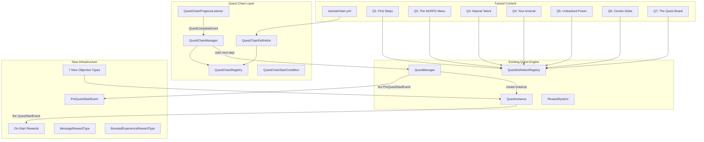

```mermaid
flowchart LR
    Q1["Q1: First Steps\n(Level up any skill)"]
    Q2["Q2: The McRPG Menu\n(Open Home GUI)"]
    Q3["Q3: Natural Talent\n(Unlock a passive ability)"]
    Q4["Q4: Your Arsenal\n(Open loadout)"]
    Q5["Q5: Unleashed Power\n(Unlock an active ability)"]
    Q6["Q6: Combo Strike\n(Cast an active ability)"]
    Q7["Q7: The Quest Board\n(Accept a board quest)"]

    Q1 -->|"chain advances"| Q2
    Q2 -->|"chain advances"| Q3
    Q3 -->|"chain advances"| Q4
    Q4 -->|"chain advances"| Q5
    Q5 -->|"chain advances"| Q6
    Q6 -->|"chain advances"| Q7
```

# Tutorial Quest System

> **Last Updated:** 2026-05-22
> **Status:** Design complete, pending implementation
> **Scope:** First-class quest chain system, tutorial quest line, new objective/reward types, player onboarding flow

---

## Design Philosophy

Three guiding principles:

- **Natural progression**: Quests trigger based on what the player is already doing, never forcing them to stop their gameplay. Every tutorial step is something the player was going to do anyway.
- **Non-restrictive**: No features are gated behind tutorial completion. Veterans can opt out via a player setting. Servers can disable the system entirely.
- **Gamemode agnostic**: Objectives use McRPG-internal events (level ups, GUI opens, ability unlocks), not gamemode-specific actions. Works on survival, factions, towny, skyblock, etc.

---

## Architecture Overview

The tutorial system is built on a new **Quest Chain** orchestration layer that sits on top of the existing quest engine. The chain manages ordering and auto-advancement; individual quests remain independent definitions.



---

## Infrastructure Changes

### 1. Quest Chain System (first-class concept)

Quest chains are an orchestration layer on top of existing quest definitions. A chain defines an ordered sequence of quest definitions that auto-advance on completion. Chains have their own source, conditions between steps, and persisted per-player state.

**QuestChainDefinition** (loaded from `chain.yml` co-located with quest files):

```yaml
# quests/tutorial/chain.yml
key: mcrpg:tutorial
source: mcrpg:tutorial
auto-start:
  trigger: first-join
steps:
  first_steps:
    quest: mcrpg:tutorial_first_steps
  explore_menu:
    quest: mcrpg:tutorial_explore_menu
  passive_unlock:
    quest: mcrpg:tutorial_passive_unlock
  open_loadout:
    quest: mcrpg:tutorial_open_loadout
  active_unlock:
    quest: mcrpg:tutorial_active_unlock
  combo_cast:
    quest: mcrpg:tutorial_combo_cast
  quest_board:
    quest: mcrpg:tutorial_quest_board
```

Extensible example -- time-locked chain step:

```yaml
# quests/monthly_event/chain.yml
key: mcrpg:monthly_event
source: mcrpg:manual
steps:
  part_one:
    quest: mcrpg:event_part_1
  part_two:
    quest: mcrpg:event_part_2
    conditions:
      time-gate:
        type: mcrpg:time_gate
        after: "2026-06-15T00:00:00Z"
```

**Key components:**

- `QuestChainDefinition` -- immutable definition loaded from YAML (key, source key, auto-start trigger, ordered step list)
- `QuestChainStep` -- quest key + optional start conditions
- `QuestChainRegistry` -- registered in `McRPGRegistryKey`, stores loaded chain definitions
- `QuestChainManager` -- runtime chain state management (accessed via `McRPGManagerKey.QUEST_CHAIN`)
- `QuestChainProgressListener` -- on `QuestCompleteEvent`, checks if the completed quest belongs to a chain and advances to the next step
- `QuestChainStartCondition` -- extensible interface for gating chain steps (time gate, permission, etc.)

**Chain state persistence** -- new SQL table:

```sql
CREATE TABLE mcrpg_quest_chain_state (
    player_uuid    TEXT NOT NULL,
    chain_key      TEXT NOT NULL,
    current_quest  TEXT,
    state          TEXT NOT NULL,
    PRIMARY KEY (player_uuid, chain_key)
);
```

State values: `ACTIVE`, `COMPLETED`, `ABANDONED`

`current_quest` is nullable -- `NULL` when state is `COMPLETED` or `ABANDONED` (no meaningful current quest in terminal states). Stores `NamespacedKey` (not index) to handle chain reconfiguration:
- On load, resolve the quest's position in the current chain definition
- If the stored quest no longer exists in the chain, advance to the first uncompleted step (checked against completion log)
- If steps were reordered, the player picks up from wherever their current quest now sits

**Auto-start triggers:**
- `first-join` -- on player join, if chain state doesn't exist, start the first step (tutorial)
- `manual` -- only started via API or command (events, NPC givers, etc.)
- `login` -- re-evaluate conditions every login (for time-gated chains)

Trigger detection lives in dedicated listeners (`QuestChainFirstJoinListener`, `QuestChainLoginListener`) that delegate to `QuestChainManager` -- the manager itself does not listen for Bukkit events.

**Extension infrastructure:**
- `QuestChainContentPack` -- third-party plugins register chains via content expansion
- `QuestChainStartConditionContentPack` -- register custom chain step conditions
- Lifecycle events: `QuestChainStartEvent`, `QuestChainStepAdvanceEvent`, `QuestChainCompleteEvent`
- `ContentHandlerType.QUEST_CHAIN` and `ContentHandlerType.QUEST_CHAIN_START_CONDITION`

**Relationship to quest definitions:** Quest definitions stay independent and reusable. They do not know they are part of a chain. The chain is purely an orchestration/ordering concern.

### 2. PreQuestStartEvent (general-purpose, cancellable)

A new cancellable Bukkit event fired before any quest starts, regardless of source. Gives third-party plugins a general-purpose hook to gate quest starts.

```java
public class PreQuestStartEvent extends Event implements Cancellable {
    private final QuestDefinition definition;
    private final Player player;
    private final McRPGPlayer mcRPGPlayer;
    private final QuestSource source;
    // ...
}
```

**Event ownership:** Both `PreQuestStartEvent` and `QuestStartEvent` fire from `QuestManager.startQuest()`. `QuestInstance.start()` becomes a pure state mutation (sets state to `IN_PROGRESS`, activates phase-0 stages) without firing events directly. This avoids the dual-ownership problem where bypassing the manager would skip the pre-event.

**Tutorial opt-out:** A `TutorialPreQuestStartListener` checks the player's `DisableTutorialSetting` and cancels `PreQuestStartEvent` when the source is `TutorialQuestSource`. This pattern is reusable by any plugin that wants to gate quest starts.

### 3. On-Start Rewards on QuestDefinition

Add an optional `on-start-rewards` section to `QuestDefinition` that mirrors the completion reward pipeline. These fire on `QuestStartEvent` via a new `QuestStartRewardListener`.

Schema addition to `QuestDefinition`:
- `List<QuestRewardEntry> onStartRewardEntries` (optional, empty by default) -- uses `QuestRewardEntry` (not raw `QuestRewardType`) for consistency with completion rewards and future fallback support

All existing `QuestDefinition` constructors are preserved with the new field defaulting to empty. New constructors/factory methods are added for callers that need on-start rewards.

YAML format (map-based, consistent with quest reward format):

```yaml
on-start-rewards:
  welcome_message:
    type: mcrpg:message
    key: tutorial.first-steps.welcome
    messages:
      - "<primary>Welcome to McRPG!</primary>"
      - "<body>As you play, your skills will level up automatically."
```

### 4. MessageRewardType

New reward type (`mcrpg:message`) designed for sending player-facing messages. Supports both locale route lookup and inline MiniMessage strings with palette resolution.

```yaml
# Route-based (preferred for translatable text)
welcome:
  type: mcrpg:message
  key: tutorial.welcome-message

# Inline fallback (for quick prototyping or non-translatable text)
hint:
  type: mcrpg:message
  messages:
    - "<primary>Tip:</primary> <body>Run /mcrpg to open your menu!"

# Both (route lookup with inline fallback)
greeting:
  type: mcrpg:message
  key: tutorial.greeting
  messages:
    - "<primary>Welcome!</primary> <body>Your adventure begins."
```

Resolution order:
1. Locale route lookup via `McRPGLocalizationManager` (if `key` is set)
2. Inline `messages` as fallback (if route lookup fails or `key` is absent)

All strings pass through palette resolution (`buildPaletteReplacements()`) and MiniMessage parsing. Standard placeholders (`<player>`, etc.) are supported.

`MessageRewardType` is chat-only. When rendered in GUI contexts (e.g., `QuestDetailRewardSlot`), `describeForDisplay()` returns a short summary, not the full message list.

### 5. TutorialQuestSource

New `QuestSource` subclass: non-abandonable, with `NamespacedKey` `mcrpg:tutorial`. Serves two purposes:
- **UI treatment**: Tutorial quests visually distinguished in the Active Quests GUI via a distinct material (e.g., `KNOWLEDGE_BOOK` instead of `WRITABLE_BOOK`) and a `<hint>Tutorial</hint>` prefix in the lore
- **PreQuestStartEvent gating**: `TutorialPreQuestStartListener` checks the player setting and cancels starts for this source when tutorials are disabled

Non-abandonable quests show a `<body>Tutorial quests cannot be abandoned.` lore line and play a deny sound + action bar message on right-click attempt.

### 6. Seven New Objective Types

All new types follow the existing `QuestObjectiveType` pattern (base registered in registry, `parseConfig` produces configured copy with filter state). All support auto-complete: on quest start, if the player's statistics/state already satisfy the objective, it completes immediately.

| Type Key | Trigger | Config Filters | Auto-Complete Check |
|---|---|---|---|
| `mcrpg:skill_level_up` | `SkillLevelUpEvent` | `skill` (specific key or omit for any), `levels` (min per event, default 1) | Check if player has any skill at level >= 1 |
| `mcrpg:gui_open` | `McRPGGuiOpenEvent` | `gui-type` (enum: `HOME`, `SKILL`, `ABILITY`, `LOADOUT_SELECTION`, `LOADOUT`, `ABILITY_EDIT`, `BOARD`, `QUEST_LIST`, `EXPERIENCE_BANK`, etc.) | N/A (no meaningful retroactive check) |
| `mcrpg:ability_unlock` | `AbilityUnlockEvent` | `ability-type` (`PASSIVE`, `ACTIVE`, `INNATE`), optional specific `ability` key | Check if player already has an unlocked ability matching the filter |
| `mcrpg:ability_activate` | Ability activation path | `ability-type` (`PASSIVE`, `ACTIVE`, `INNATE`), optional specific `ability` key | Check activation statistics |
| `mcrpg:combo_activate` | Successful combo completion | Optional `ability` key, optional `combo-pattern` | Check combo activation statistics |
| `mcrpg:loadout_equip` | `LoadoutAbilityEquipEvent` | `ability-type` (`PASSIVE`, `ACTIVE`), optional specific `ability` key | Check if player's loadout already contains a matching ability |
| `mcrpg:quest_board_accept` | `BoardOfferingAcceptEvent` | Optional `board` key | Check board acceptance statistics |

**New Bukkit events:**
- `McRPGGuiOpenEvent` -- fired from `GuiManager.trackPlayerGui()` (single centralized point, not scattered across GUI classes). Fires after tracking, before `openInventory()`. "Open" means any GUI creation that goes through the manager -- back-button navigation counts (this is intentional for tutorial purposes; quest definitions can use `required-progress: 1` to only trigger once).
- `AbilityUnlockEvent` -- fired from `OnSkillLevelUpListener` when an ability is first unlocked for a player
- `LoadoutAbilityEquipEvent` -- fired from a new centralized `LoadoutManager.equipAbility()` method that wraps the `Loadout` mutation + event firing. Existing callsites (GUI slots, commands) are retrofitted to use this method.

### 7. BoostedExperienceRewardType

New reward type (`mcrpg:boosted_experience`) that adds to a player's boosted experience bank directly. State ownership: `grant()` resolves the `McRPGPlayer` and mutates `PlayerExperienceExtras.addBoostedExperience()`.

```yaml
boosted_xp:
  type: mcrpg:boosted_experience
  amount: 500
```

### 8. RedeemableExperienceRewardType and RedeemableLevelsRewardType

New reward types for adding to a player's redeemable XP and redeemable levels banks. State ownership: both mutate `PlayerExperienceExtras` (`addRedeemableExperience()`, `addRedeemableLevels()`).

```yaml
redeemable_xp:
  type: mcrpg:redeemable_experience
  amount: 500

redeemable_levels:
  type: mcrpg:redeemable_levels
  amount: 1
```

### 9. Configuration Toggles

**Server-wide** (`config.yml`):

```yaml
# Whether the tutorial quest chain auto-starts for new players.
# When disabled, no new tutorial chains will start. Existing active
# tutorial quests are NOT cancelled -- only new starts are suppressed.
# Requires restart to take effect.
tutorial:
  enabled: true
```

Requires `config-version` bump (current `2` -> `3`).

**Player setting** (new `PlayerSetting` impl):
- `DISABLE_TUTORIAL` boolean setting, default `false`
- When toggled to `true`: shows a confirmation prompt (reuses the existing `ConfirmationManager` pattern). On confirm: cancel any active tutorial quest via chain manager, set chain state to `ABANDONED`
- Toggling back to `false` after abandonment does NOT restart the chain or grant missed rewards -- the chain remains `ABANDONED`
- Exposed in the Player Settings GUI with distinct materials for enabled/disabled + deny sound on destructive toggle
- `TutorialPreQuestStartListener` checks this setting and cancels `PreQuestStartEvent` for tutorial sources

**Permission nodes:**

| Permission | Default | Purpose |
|---|---|---|
| `mcrpg.tutorial.bypass` | `op` | Exempt from tutorial auto-start (staff/alt accounts) |
| `mcrpg.admin.tutorial.reset` | `op` | Admin command to reset a player's tutorial chain state |

---

## Tutorial Quest Chain

Seven quests progressing from passive discovery through active mastery. The chain auto-starts on first join. All quests are `QuestRepeatMode.ONCE`, `SinglePlayerQuestScope`, sourced from the `mcrpg:tutorial` chain.



**Auto-complete pacing:** When multiple quests auto-complete in rapid succession (e.g., a returning player who already has unlocked abilities), on-start messages for auto-completed steps are suppressed. Only the final non-auto-completed step's on-start message is delivered. Completion notifications for auto-completed steps are batched into a single summary message.

### Quest 1: "First Steps"

- **Auto-starts**: On first join via chain `auto-start: first-join`
- **On-start rewards**: `MessageRewardType` welcoming player, explaining skills level up as they play
- **Objective**: Gain 1 level in any skill (`mcrpg:skill_level_up`)
- **Completion rewards**: 500 boosted XP
- **Auto-complete**: If player already has a skill level >= 1, completes immediately on start

### Quest 2: "The McRPG Menu"

- **On-start rewards**: Message telling player to run `/mcrpg`
- **Objective**: Open the Home GUI (`mcrpg:gui_open`, `gui-type: HOME`)
- **Completion rewards**: 500 boosted XP

### Quest 3: "Natural Talent"

- **On-start rewards**: Message explaining passive abilities trigger automatically
- **Objective**: Unlock a passive ability (`mcrpg:ability_unlock`, `ability-type: PASSIVE`)
- **Completion rewards**: 500 boosted XP + 1 redeemable level
- **Auto-complete**: If player already has any unlocked passive, completes immediately

### Quest 4: "Your Arsenal"

- **On-start rewards**: Message about loadouts and how the unlocked ability was auto-equipped
- **Objective**: Open the Loadout GUI (`mcrpg:gui_open`, `gui-type: LOADOUT_SELECTION`)
- **Completion rewards**: 300 boosted XP + 500 redeemable XP

### Quest 5: "Unleashed Power"

- **On-start rewards**: Message about active abilities and how they use combo clicks
- **Objective**: Unlock an active ability (`mcrpg:ability_unlock`, `ability-type: ACTIVE`)
- **Completion rewards**: 750 boosted XP
- **Auto-complete**: If player already has an unlocked active ability

### Quest 6: "Combo Strike"

- **On-start rewards**: Message explaining combo patterns (RRR, RRL, RLR), mana costs, and which tools work
- **Objective**: Successfully cast any active ability via combo (`mcrpg:combo_activate`)
- **Completion rewards**: 750 boosted XP + 1 redeemable level

### Quest 7: "The Quest Board"

- **On-start rewards**: Message about the quest board offering rotating challenges with rewards
- **Objective**: Accept a quest from the quest board (`mcrpg:quest_board_accept`)
- **Completion rewards**: 1000 boosted XP + 1000 redeemable XP (graduation bonus)

### Reward Summary

| Quest | Boosted XP | Redeemable XP | Redeemable Levels | Cumulative Boosted |
|---|---|---|---|---|
| Q1: First Steps | 500 | -- | -- | 500 |
| Q2: The McRPG Menu | 500 | -- | -- | 1,000 |
| Q3: Natural Talent | 500 | -- | 1 | 1,500 |
| Q4: Your Arsenal | 300 | 500 | -- | 1,800 |
| Q5: Unleashed Power | 750 | -- | -- | 2,550 |
| Q6: Combo Strike | 750 | -- | 1 | 3,300 |
| Q7: The Quest Board | 1,000 | 1,000 | -- | 4,300 |
| **Total** | **4,300** | **1,500** | **2** | |

Total value: 4,300 boosted XP + 1,500 redeemable XP + 2 redeemable levels. At the default 2.25x boosted consumption rate, the boosted XP translates to roughly 2-3 bonus levels across skills at early game XP requirements. Meaningful but not build-defining.

### Veteran Skip Behavior

When a player toggles `DISABLE_TUTORIAL`, the active tutorial quest is cancelled and the chain state is set to `ABANDONED`. No rewards are granted for uncompleted steps (abandon approach). The chain cannot be restarted after abandonment. Revisit if playtesting shows the reward gap is too impactful.

### Future Tutorial Extensions (revisit later)

These are not part of the initial chain but are candidates for future tutorial steps appended after Q7:
- Open the Ability Edit GUI (teaches configuration/toggling)
- Open the Experience Bank GUI (teaches boosted/rested/redeemable systems)
- Complete a quest board quest (teaches the full board lifecycle)

---

## File Changes Summary

### New Files -- Quest Chain System
- `quest/chain/QuestChainDefinition.java`
- `quest/chain/QuestChainStep.java`
- `quest/chain/QuestChainRegistry.java`
- `quest/chain/QuestChainManager.java`
- `quest/chain/QuestChainState.java` (enum: ACTIVE, COMPLETED, ABANDONED)
- `quest/chain/QuestChainStartCondition.java` (extensible condition interface)
- `quest/chain/QuestChainConfigLoader.java`
- `quest/chain/builtin/TimeGateChainCondition.java`
- `expansion/content/QuestChainContentPack.java`
- `expansion/content/QuestChainStartConditionContentPack.java`
- `listener/quest/QuestChainProgressListener.java`
- `listener/quest/QuestChainFirstJoinListener.java`
- `listener/quest/QuestChainLoginListener.java`
- `database/table/quest/QuestChainStateDAO.java`

### New Files -- Events
- `event/quest/PreQuestStartEvent.java` (cancellable, general-purpose)
- `event/quest/QuestChainStartEvent.java`
- `event/quest/QuestChainStepAdvanceEvent.java`
- `event/quest/QuestChainCompleteEvent.java`
- `event/gui/McRPGGuiOpenEvent.java`
- `event/ability/AbilityUnlockEvent.java`
- `event/loadout/LoadoutAbilityEquipEvent.java`

### New Files -- Reward Types
- `quest/reward/builtin/MessageRewardType.java`
- `quest/reward/builtin/BoostedExperienceRewardType.java`
- `quest/reward/builtin/RedeemableExperienceRewardType.java`
- `quest/reward/builtin/RedeemableLevelsRewardType.java`

### New Files -- Objective Types
- `quest/objective/type/builtin/SkillLevelUpObjectiveType.java` + context
- `quest/objective/type/builtin/GuiOpenObjectiveType.java` + context
- `quest/objective/type/builtin/AbilityUnlockObjectiveType.java` + context
- `quest/objective/type/builtin/AbilityActivateObjectiveType.java` + context
- `quest/objective/type/builtin/ComboActivateObjectiveType.java` + context
- `quest/objective/type/builtin/LoadoutEquipObjectiveType.java` + context
- `quest/objective/type/builtin/QuestBoardAcceptObjectiveType.java` + context

### New Files -- Quest Source + Settings
- `quest/source/builtin/TutorialQuestSource.java`
- `setting/impl/DisableTutorialSetting.java`
- `listener/quest/TutorialPreQuestStartListener.java`
- `listener/quest/QuestStartRewardListener.java`

### New Files -- Progress Listeners
- `listener/quest/SkillLevelUpQuestProgressListener.java`
- `listener/quest/GuiOpenQuestProgressListener.java`
- `listener/quest/AbilityUnlockQuestProgressListener.java`
- `listener/quest/AbilityActivateQuestProgressListener.java`
- `listener/quest/ComboActivateQuestProgressListener.java`
- `listener/quest/LoadoutEquipQuestProgressListener.java`
- `listener/quest/QuestBoardAcceptQuestProgressListener.java`

### New Files -- Tutorial Content
- `src/main/resources/quests/tutorial/chain.yml`
- `src/main/resources/quests/tutorial/first_steps.yml`
- `src/main/resources/quests/tutorial/mcrpg_menu.yml`
- `src/main/resources/quests/tutorial/natural_talent.yml`
- `src/main/resources/quests/tutorial/your_arsenal.yml`
- `src/main/resources/quests/tutorial/unleashed_power.yml`
- `src/main/resources/quests/tutorial/combo_strike.yml`
- `src/main/resources/quests/tutorial/quest_board.yml`
- Locale entries in `en_quest.yml` for all tutorial text

### Modified Files
- `QuestDefinition.java` -- add `onStartRewardEntries` field (existing constructors preserved, new ones added)
- `QuestConfigLoader.java` -- parse `on-start-rewards` section
- `QuestManager.java` -- fire `PreQuestStartEvent` before `QuestStartEvent`; `QuestInstance.start()` becomes pure state mutation
- `McRPGExpansion.java` -- register new reward types, objective types, source, chain
- `ContentHandlerType.java` -- add `QUEST_CHAIN`, `QUEST_CHAIN_START_CONDITION`
- `McRPGRegistryKey.java` -- add `QUEST_CHAIN` registry key
- `McRPGManagerKey.java` -- add `QUEST_CHAIN` manager key
- `bootstrap/McRPGListenerRegistrar.java` -- register new listeners
- `config.yml` -- add `tutorial.enabled` toggle, bump `config-version` to 3
- `GuiManager` -- fire `McRPGGuiOpenEvent` from `trackPlayerGui()`
- `OnSkillLevelUpListener.java` -- fire `AbilityUnlockEvent` when abilities unlock
- Loadout equip path -- introduce `LoadoutManager.equipAbility()` centralized method, fire `LoadoutAbilityEquipEvent`
- `DatabaseManager` or equivalent -- create chain state table via `UpdateTableFunction`
- `plugin.yml` -- add `mcrpg.tutorial.bypass` and `mcrpg.admin.tutorial.reset` permissions

---

## Related Documents

- [Quest System Architecture](../quest/quest-system-architecture.md)
- [Quest Board Feature Design](../quest/quest-board.md)
- [Mana & Ability Activation System](../mana/mana-ability-system.md)
- [GUI/UX System & Color Palette](../gui-ux-system.md)
- [Review Findings](tutorial-review-findings.md) -- consolidated persona review feedback
