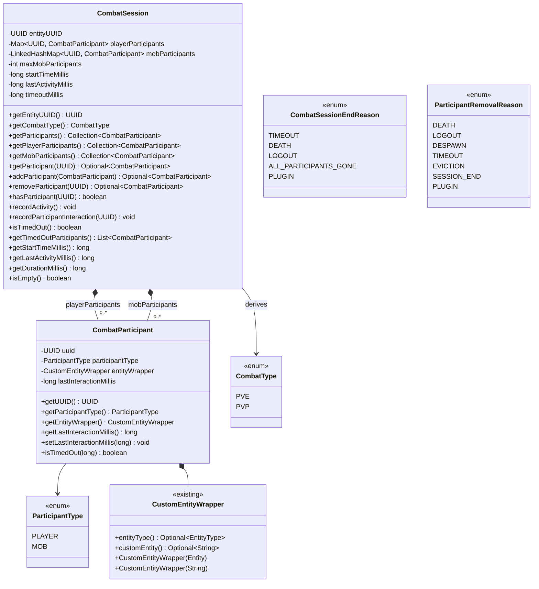
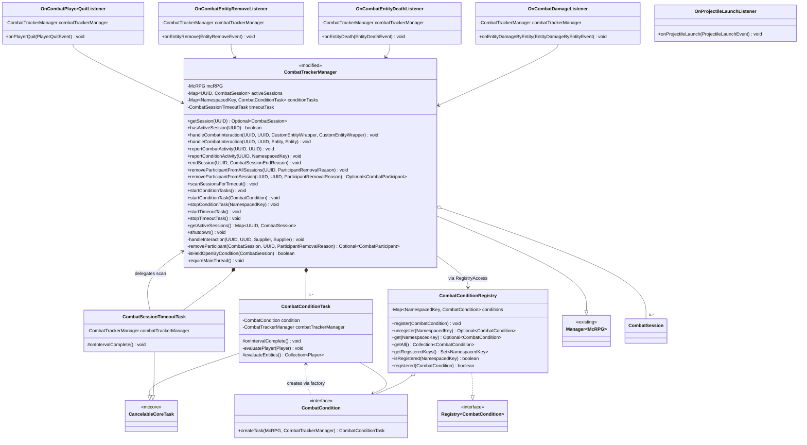

# Phase 1 LLD: Core Combat Session Engine

> **HLD Reference:** [Combat Tracker & Ramping Frenzy](../../hld/combat/combat-tracker-and-ramping-frenzy.md)
> **Status:** Implemented
> **Last Updated:** 2026-07-12

---

## Scope

This phase delivers the foundational combat session engine — the per-player session model, participant tracking, session lifecycle, timeout mechanics, core Bukkit events, custom combat condition infrastructure, and configuration. After this phase, the system answers "is this player in combat, and with whom?" and fires observable events that downstream consumers (combat log, Ramping Frenzy, quest objectives, third-party plugins) can hook into.

**In scope:**

- `CombatSession` — per-player session with participant roster (unlimited players, bounded FIFO mob map keyed by UUID)
- `CombatParticipant` — mutable participant data (UUID, classification, `CustomEntityWrapper` (existing McCore), last-interaction timestamp)
- `CombatType` / `ParticipantType` — enums for session classification
- `CombatSessionEndReason` / `ParticipantRemovalReason` — enums for lifecycle events
- `CombatTrackerManager` — session map, timeout task lifecycle, public API
- `CombatConditionRegistry` — dedicated registry for `CombatCondition`s, keyed by `NamespacedKey`
- Focused listeners — `OnCombatDamageListener` (HIGHEST), `OnCombatEntityDeathListener`, `OnCombatEntityRemoveListener`, `OnCombatPlayerQuitListener`, `OnProjectileLaunchListener` (all MONITOR)
- `CombatSessionTimeoutTask` — global periodic scan extending `CancelableCoreTask`
- `CombatCondition` interface + `CombatConditionContentPack` + per-condition periodic task with factory method
- `CombatConditionTask` — base task class extending `CancelableCoreTask`, overridable via `CombatCondition.createTask(McRPG, CombatTrackerManager)` (injected dependencies)
- Core Bukkit events — `CombatSessionStartEvent`, `CombatParticipantAddEvent`, `CombatParticipantRemoveEvent`, `CombatSessionEndEvent`
- `CombatConfigFile` + `FileType.COMBAT_CONFIG` — `combat_configuration.yml`
- Projectile resolution — `Projectile.getShooter()` + PDC launch timestamp
- `reportCombatActivity(UUID, UUID)` public API for indirect/DOT damage attribution
- Per-session statistics and combat state snapshots on `CombatSessionEndEvent` are **deferred to Phase 2** (no placeholder accessors in Phase 1)

**Out of scope (later phases):**

- Phase 2: `CombatStateType<T>`, `CombatStateResolver<T>`, persistent state DAO, per-session statistics, `CombatStateChangeEvent`, `CombatStateTypeContentPack`
- Phase 3: Combat log detection/punishment, `CombatLogDAO`, admin command, PAPI placeholders, combat exit messaging
- Phase 4: Ramping Frenzy ability, resolved frenzy stack state, shed task, Haste application

---

## Class Diagrams

### Legend

```
Stereotypes:
  <<interface>>     interface type
  <<abstract>>      abstract class
  <<enum>>          enum type
  <<record>>        record type
  <<content pack>>  McRPGContentPack subclass
  <<config>>        ConfigFile subclass
  <<existing>>      class already exists, not modified
  <<modified>>      class already exists, modified in this phase

Relationships:
  *--    composition (owns lifecycle)
  o--    association (references)
  -->    dependency (uses)
  ..|>   implements
  --|>   extends

Nullability:
  ?      nullable field
```

### Diagram 1: Core Session Model



### Diagram 2: Manager, Registry, Listeners & Tasks



### Diagram 3: Events, Conditions & ContentPack

```mermaid
classDiagram
    class CombatSessionStartEvent {
        -UUID entityUUID
        -UUID triggerParticipantUUID
        -ParticipantType triggerParticipantType
        -CustomEntityWrapper triggerEntityWrapper
        -NamespacedKey triggeringConditionKey ?
        -boolean cancelled
        +getEntityUUID() UUID
        +getTriggerParticipantUUID() UUID
        +getTriggerParticipantType() ParticipantType
        +getTriggerEntityWrapper() CustomEntityWrapper
        +getTriggeringConditionKey() Optional~NamespacedKey~
    }

    class CombatParticipantAddEvent {
        -CombatSession session
        -CombatParticipant newParticipant
        -CombatType previousCombatType
        -CombatType newCombatType
        -boolean cancelled
        +getSession() CombatSession
        +getNewParticipant() CombatParticipant
        +getPreviousCombatType() CombatType
        +getNewCombatType() CombatType
    }

    class CombatParticipantRemoveEvent {
        -CombatSession session
        -CombatParticipant removedParticipant
        -ParticipantRemovalReason reason
        -CombatType previousCombatType
        -CombatType newCombatType
        +getSession() CombatSession
        +getRemovedParticipant() CombatParticipant
        +getReason() ParticipantRemovalReason
        +getPreviousCombatType() CombatType
        +getNewCombatType() CombatType
    }

    class CombatSessionEndEvent {
        -UUID entityUUID
        -CombatSessionEndReason reason
        -Collection~CombatParticipant~ finalParticipants
        -CombatType finalCombatType
        -long durationMillis
        +getEntityUUID() UUID
        +getReason() CombatSessionEndReason
        +getFinalParticipants() Collection~CombatParticipant~
        +getFinalCombatType() CombatType
        +getDurationMillis() long
    }

    class CombatCondition {
        <<interface>>
        +getKey() NamespacedKey
        +getCheckIntervalSeconds() double
        +isInCombat(LivingEntity) boolean
        +getImpliedParticipants(LivingEntity) Set~UUID~
        +createTask(McRPG, CombatTrackerManager) CombatConditionTask
        +getExpansionKey() Optional~NamespacedKey~
    }

    class CombatConditionContentPack {
        <<content pack>>
    }

    class McRPGContentPack~CombatCondition~ {
        <<existing>>
    }

    class McRPGContent {
        <<interface>>
        <<existing>>
    }

    class Cancellable {
        <<interface>>
        <<existing>>
    }

    class Event {
        <<existing>>
    }

    CombatSessionStartEvent --|> Event
    CombatSessionStartEvent ..|> Cancellable
    CombatParticipantAddEvent --|> Event
    CombatParticipantAddEvent ..|> Cancellable
    CombatParticipantRemoveEvent --|> Event
    CombatSessionEndEvent --|> Event
    CombatCondition ..|> McRPGContent
    CombatConditionContentPack --|> McRPGContentPack~CombatCondition~
```



---

## 1. New Classes

### 1.1 CombatType

**Package:** `us.eunoians.mcrpg.combat`
**File:** `src/main/java/us/eunoians/mcrpg/combat/CombatType.java`

Enum representing the derived combat classification of a session, recomputed whenever the participant roster changes.

```java
public enum CombatType {

    /**
     * The session contains only mob participants.
     */
    PVE,

    /**
     * The session contains at least one player participant.
     */
    PVP
}
```

### 1.2 ParticipantType

**Package:** `us.eunoians.mcrpg.combat`
**File:** `src/main/java/us/eunoians/mcrpg/combat/ParticipantType.java`

Enum classifying a combat participant as a player or a mob.

```java
public enum ParticipantType {

    PLAYER,
    MOB
}
```

### 1.3 CombatSessionEndReason

**Package:** `us.eunoians.mcrpg.combat`
**File:** `src/main/java/us/eunoians/mcrpg/combat/CombatSessionEndReason.java`

Enum representing the reason a combat session ended.

```java
public enum CombatSessionEndReason {

    /**
     * The session's inactivity timer expired with no new combat events.
     */
    TIMEOUT,

    /**
     * The session owner died.
     */
    DEATH,

    /**
     * The session owner logged out.
     */
    LOGOUT,

    /**
     * All participants in the session are dead, despawned, or otherwise invalid.
     */
    ALL_PARTICIPANTS_GONE,

    /**
     * The session was ended programmatically via the API.
     */
    PLUGIN
}
```

### 1.4 ParticipantRemovalReason

**Package:** `us.eunoians.mcrpg.combat`
**File:** `src/main/java/us/eunoians/mcrpg/combat/ParticipantRemovalReason.java`

Enum representing the reason a participant was removed from a session's roster.

```java
public enum ParticipantRemovalReason {

    /**
     * The participant entity died.
     */
    DEATH,

    /**
     * The participant player logged out.
     */
    LOGOUT,

    /**
     * The participant entity was removed from the world (despawn, unload, plugin removal).
     */
    DESPAWN,

    /**
     * The participant's per-participant inactivity timer expired.
     */
    TIMEOUT,

    /**
     * The participant was evicted from the mob FIFO queue to make room for a newer participant.
     */
    EVICTION,

    /**
     * The participant was removed because the session itself is ending.
     */
    SESSION_END,

    /**
     * The participant was removed programmatically by McRPG or a third-party plugin (for example an
     * arena, duel, or AFK plugin removing a specific participant from a session).
     */
    PLUGIN
}
```

### 1.5 CombatParticipant

**Package:** `us.eunoians.mcrpg.combat`
**File:** `src/main/java/us/eunoians/mcrpg/combat/CombatParticipant.java`

Mutable data class representing a single participant in a combat session. The `lastInteractionMillis` field is updated on every damage interaction between the session owner and this participant.

```java
public class CombatParticipant {

    private final UUID uuid;
    private final ParticipantType participantType;
    private final CustomEntityWrapper entityWrapper;
    private long lastInteractionMillis;

    /**
     * Constructs a new {@link CombatParticipant}.
     *
     * @param uuid                 The UUID of the participant entity.
     * @param participantType      Whether this participant is a {@link ParticipantType#PLAYER} or {@link ParticipantType#MOB}.
     * @param entityWrapper        The {@link CustomEntityWrapper} identifying the participant's entity type.
     * @param lastInteractionMillis The timestamp (epoch millis) of the most recent interaction.
     */
    public CombatParticipant(@NotNull UUID uuid, @NotNull ParticipantType participantType,
                             @NotNull CustomEntityWrapper entityWrapper, long lastInteractionMillis) {
        this.uuid = uuid;
        this.participantType = participantType;
        this.entityWrapper = entityWrapper;
        this.lastInteractionMillis = lastInteractionMillis;
    }

    /**
     * Gets the UUID of the participant entity.
     *
     * @return The UUID of the participant entity.
     */
    @NotNull
    public UUID getUUID() {
        return uuid;
    }

    /**
     * Gets the {@link ParticipantType} of this participant.
     *
     * @return The {@link ParticipantType} of this participant.
     */
    @NotNull
    public ParticipantType getParticipantType() {
        return participantType;
    }

    /**
     * Gets the {@link CustomEntityWrapper} identifying this participant's entity type.
     * Supports both vanilla entity types and custom entities from plugins like MythicMobs.
     *
     * @return The {@link CustomEntityWrapper} for this participant.
     */
    @NotNull
    public CustomEntityWrapper getEntityWrapper() {
        return entityWrapper;
    }

    /**
     * Gets the timestamp of the most recent interaction between this participant
     * and the session owner.
     *
     * @return Epoch milliseconds of the last interaction.
     */
    public long getLastInteractionMillis() {
        return lastInteractionMillis;
    }

    /**
     * Updates the timestamp of the most recent interaction.
     *
     * @param lastInteractionMillis Epoch milliseconds of the new interaction.
     */
    public void setLastInteractionMillis(long lastInteractionMillis) {
        this.lastInteractionMillis = lastInteractionMillis;
    }

    /**
     * Checks whether this participant has exceeded the given inactivity timeout.
     *
     * @param timeoutMillis The inactivity timeout threshold in milliseconds.
     * @return {@code true} if this participant has been inactive longer than the timeout.
     */
    public boolean isTimedOut(long timeoutMillis) {
        long currentTimeMillis = McRPG.getInstance().getTimeProvider().now().toEpochMilli();
        return (currentTimeMillis - lastInteractionMillis) >= timeoutMillis;
    }
}
```

### 1.6 CombatSession

**Package:** `us.eunoians.mcrpg.combat`
**File:** `src/main/java/us/eunoians/mcrpg/combat/CombatSession.java`

Per-player combat session. Manages the participant roster with unlimited player slots (a `HashMap` keyed by UUID) and a configurable, bounded FIFO map for mob participants (a `LinkedHashMap` keyed by UUID whose insertion order provides FIFO eviction). Keying mobs by UUID makes lookup, containment, and removal O(1) on the combat hot path and prevents duplicate entries for the same mob. The derived `CombatType` is recomputed on every roster mutation.

```java
public class CombatSession {

    private final UUID entityUUID;
    private final Map<UUID, CombatParticipant> playerParticipants;
    private final LinkedHashMap<UUID, CombatParticipant> mobParticipants;
    private final int maxMobParticipants;
    private final long startTimeMillis;
    private final long timeoutMillis;
    private long lastActivityMillis;

    /**
     * Constructs a new {@link CombatSession}.
     *
     * @param entityUUID         The UUID of the entity that owns this session.
     * @param maxMobParticipants The maximum number of mob participants before FIFO eviction.
     * @param timeoutMillis      The inactivity timeout in milliseconds.
     */
    public CombatSession(@NotNull UUID entityUUID, int maxMobParticipants, long timeoutMillis) {
        this.entityUUID = entityUUID;
        this.playerParticipants = new HashMap<>();
        this.mobParticipants = new LinkedHashMap<>();
        this.maxMobParticipants = maxMobParticipants;
        long nowMillis = McRPG.getInstance().getTimeProvider().now().toEpochMilli();
        this.startTimeMillis = nowMillis;
        this.lastActivityMillis = nowMillis;
        this.timeoutMillis = timeoutMillis;
    }

    /**
     * Gets the UUID of the entity that owns this session.
     *
     * @return The UUID of the session owner.
     */
    @NotNull
    public UUID getEntityUUID() {
        return entityUUID;
    }

    /**
     * Derives the current {@link CombatType} from the participant roster.
     * Returns {@link CombatType#PVP} if the roster contains at least one player,
     * {@link CombatType#PVE} otherwise.
     *
     * @return The derived {@link CombatType}.
     */
    @NotNull
    public CombatType getCombatType() {
        return playerParticipants.isEmpty() ? CombatType.PVE : CombatType.PVP;
    }

    /**
     * Gets an unmodifiable view of all participants (both players and mobs).
     *
     * @return An unmodifiable {@link Collection} of all {@link CombatParticipant}s.
     */
    @NotNull
    public Collection<CombatParticipant> getParticipants() {
        List<CombatParticipant> allParticipants = new ArrayList<>(playerParticipants.size() + mobParticipants.size());
        allParticipants.addAll(playerParticipants.values());
        allParticipants.addAll(mobParticipants.values());
        return Collections.unmodifiableList(allParticipants);
    }

    /**
     * Gets an unmodifiable view of player participants.
     *
     * @return An unmodifiable {@link Collection} of player {@link CombatParticipant}s.
     */
    @NotNull
    public Collection<CombatParticipant> getPlayerParticipants() {
        return Collections.unmodifiableCollection(playerParticipants.values());
    }

    /**
     * Gets an unmodifiable view of mob participants.
     *
     * @return An unmodifiable {@link Collection} of mob {@link CombatParticipant}s.
     */
    @NotNull
    public Collection<CombatParticipant> getMobParticipants() {
        return Collections.unmodifiableCollection(mobParticipants.values());
    }

    /**
     * Gets a specific participant by UUID.
     *
     * @param participantUUID The UUID of the participant to find.
     * @return An {@link Optional} containing the participant, or empty if not found.
     */
    @NotNull
    public Optional<CombatParticipant> getParticipant(@NotNull UUID participantUUID) {
        CombatParticipant playerParticipant = playerParticipants.get(participantUUID);
        if (playerParticipant != null) {
            return Optional.of(playerParticipant);
        }
        return Optional.ofNullable(mobParticipants.get(participantUUID));
    }

    /**
     * Adds a participant to the roster. Player participants go into the unlimited player map. Mob
     * participants go into the bounded FIFO map — re-adding an existing mob updates it in place
     * without evicting or changing its FIFO position, and adding a new mob when the map is full
     * evicts and returns the oldest. The eviction branch is guarded so it never evicts from an empty
     * map (protecting against a misconfigured {@code maxMobParticipants < 1}).
     *
     * @param participant The participant to add.
     * @return An {@link Optional} containing the evicted {@link CombatParticipant} if a mob was
     *         evicted from the FIFO map, or empty if no eviction occurred.
     */
    @NotNull
    public Optional<CombatParticipant> addParticipant(@NotNull CombatParticipant participant) {
        if (participant.getParticipantType() == ParticipantType.PLAYER) {
            playerParticipants.put(participant.getUUID(), participant);
            return Optional.empty();
        }

        UUID mobUUID = participant.getUUID();
        // Re-adding an existing mob updates it in place — no eviction, FIFO position preserved.
        if (mobParticipants.containsKey(mobUUID)) {
            mobParticipants.put(mobUUID, participant);
            return Optional.empty();
        }

        Optional<CombatParticipant> evictedParticipant = Optional.empty();
        if (!mobParticipants.isEmpty() && mobParticipants.size() >= maxMobParticipants) {
            Iterator<CombatParticipant> mobIterator = mobParticipants.values().iterator();
            evictedParticipant = Optional.of(mobIterator.next());
            mobIterator.remove();
        }
        mobParticipants.put(mobUUID, participant);
        return evictedParticipant;
    }

    /**
     * Removes a participant from the roster by UUID. Both the player map and the mob map provide
     * O(1) removal.
     *
     * @param participantUUID The UUID of the participant to remove.
     * @return An {@link Optional} containing the removed participant, or empty if not found.
     */
    @NotNull
    public Optional<CombatParticipant> removeParticipant(@NotNull UUID participantUUID) {
        CombatParticipant removedPlayer = playerParticipants.remove(participantUUID);
        if (removedPlayer != null) {
            return Optional.of(removedPlayer);
        }
        return Optional.ofNullable(mobParticipants.remove(participantUUID));
    }

    /**
     * Checks if the roster contains a participant with the given UUID. Both the player map and the
     * mob map provide O(1) containment.
     *
     * @param participantUUID The UUID to check.
     * @return {@code true} if the participant is in the roster.
     */
    public boolean hasParticipant(@NotNull UUID participantUUID) {
        return playerParticipants.containsKey(participantUUID) || mobParticipants.containsKey(participantUUID);
    }

    /**
     * Records combat activity on this session, resetting the inactivity timeout.
     */
    public void recordActivity() {
        this.lastActivityMillis = McRPG.getInstance().getTimeProvider().now().toEpochMilli();
    }

    /**
     * Records an interaction with a specific participant, updating both the session's
     * last activity timestamp and the participant's last interaction timestamp.
     *
     * @param participantUUID The UUID of the participant involved in the interaction.
     */
    public void recordParticipantInteraction(@NotNull UUID participantUUID) {
        long nowMillis = McRPG.getInstance().getTimeProvider().now().toEpochMilli();
        this.lastActivityMillis = nowMillis;
        getParticipant(participantUUID).ifPresent(participant -> participant.setLastInteractionMillis(nowMillis));
    }

    /**
     * Checks whether this session has exceeded its inactivity timeout.
     *
     * @return {@code true} if the session has been inactive longer than its timeout.
     */
    public boolean isTimedOut() {
        long currentTimeMillis = McRPG.getInstance().getTimeProvider().now().toEpochMilli();
        return (currentTimeMillis - lastActivityMillis) >= timeoutMillis;
    }

    /**
     * Finds all participants whose per-participant inactivity timer has expired. Used by
     * {@link us.eunoians.mcrpg.combat.task.CombatSessionTimeoutTask} to identify participants
     * that should be removed from the roster.
     *
     * @return A {@link List} of participants that have timed out.
     */
    @NotNull
    public List<CombatParticipant> getTimedOutParticipants() {
        List<CombatParticipant> timedOutParticipants = new ArrayList<>();
        for (CombatParticipant participant : getParticipants()) {
            if (participant.isTimedOut(timeoutMillis)) {
                timedOutParticipants.add(participant);
            }
        }
        return timedOutParticipants;
    }

    /**
     * Gets the epoch milliseconds when this session started.
     *
     * @return The session start timestamp.
     */
    public long getStartTimeMillis() {
        return startTimeMillis;
    }

    /**
     * Gets the epoch milliseconds of the most recent combat activity.
     *
     * @return The last activity timestamp.
     */
    public long getLastActivityMillis() {
        return lastActivityMillis;
    }

    /**
     * Computes the session duration in milliseconds, based on the current time.
     *
     * @return The duration in milliseconds.
     */
    public long getDurationMillis() {
        return McRPG.getInstance().getTimeProvider().now().toEpochMilli() - startTimeMillis;
    }

    /**
     * Gets the configured timeout for this session in milliseconds.
     *
     * @return The timeout in milliseconds.
     */
    public long getTimeoutMillis() {
        return timeoutMillis;
    }

    /**
     * Checks whether the participant roster is empty.
     *
     * @return {@code true} if no participants remain in the roster.
     */
    public boolean isEmpty() {
        return playerParticipants.isEmpty() && mobParticipants.isEmpty();
    }
}
```

### 1.7 CombatCondition

**Package:** `us.eunoians.mcrpg.combat.condition`
**File:** `src/main/java/us/eunoians/mcrpg/combat/condition/CombatCondition.java`

Interface for state-based combat conditions. Conditions are polled periodically at their declared cadence by a managed `CombatConditionTask`. The built-in `EntityDamageByEntityEvent` handling is *not* a condition — it is the core mechanism. Conditions extend the system for proximity-based, region-based, or other continuous state checks.

Event-based combat triggers (e.g., healing-as-combat) do not need to implement this interface — they listen to Bukkit events directly and call `CombatTrackerManager.reportCombatActivity()`.

```java
public interface CombatCondition extends McRPGContent {

    /**
     * Gets the unique key identifying this condition.
     *
     * @return The {@link NamespacedKey} for this condition.
     */
    @NotNull
    NamespacedKey getKey();

    /**
     * Gets the interval in seconds between periodic evaluations of this condition.
     * Passed directly to {@link CancelableCoreTask}'s frequency parameter, which uses
     * real-time seconds rather than server ticks for lag resistance.
     *
     * @return The check interval in seconds.
     */
    double getCheckIntervalSeconds();

    /**
     * Evaluates whether the given entity should be considered in combat due to this condition.
     * Called both by the condition's periodic task (for session creation) and by the timeout
     * scan (as a hold-open gate before ending sessions).
     *
     * @param entity The entity to evaluate.
     * @return {@code true} if this condition puts the entity in combat.
     */
    boolean isInCombat(@NotNull LivingEntity entity);

    /**
     * Gets the participants implied by this condition for the given entity, if any.
     * Returns an empty set if the condition is proximity-based rather than entity-vs-entity.
     *
     * @param entity The entity to evaluate.
     * @return A {@link Set} of participant UUIDs implied by this condition.
     */
    @NotNull
    Set<UUID> getImpliedParticipants(@NotNull LivingEntity entity);

    /**
     * Creates the periodic task responsible for evaluating this condition. The default
     * implementation returns a {@link CombatConditionTask} that iterates all online players.
     * Third-party conditions may override this to provide a custom task subclass with
     * scoped entity evaluation or specialized logic.
     * <p>
     * Both the {@link McRPG} plugin instance and the {@link CombatTrackerManager} are injected as
     * parameters rather than resolved via {@code RegistryAccess}, so the task holds its collaborators
     * directly instead of performing a per-tick registry lookup.
     *
     * @param mcRPG                The {@link McRPG} plugin instance the task is scheduled under.
     * @param combatTrackerManager The {@link CombatTrackerManager} the task reports activity to.
     * @return A new {@link CombatConditionTask} for this condition.
     */
    @NotNull
    default CombatConditionTask createTask(@NotNull McRPG mcRPG, @NotNull CombatTrackerManager combatTrackerManager) {
        return new CombatConditionTask(mcRPG, combatTrackerManager, this);
    }
}
```

### 1.8 CombatConditionContentPack

**Package:** `us.eunoians.mcrpg.expansion.content`
**File:** `src/main/java/us/eunoians/mcrpg/expansion/content/CombatConditionContentPack.java`

Content pack for registering `CombatCondition` implementations via the `ContentExpansion` system. Follows the same pattern as `QuestObjectiveTypeContentPack`, `TemplateConditionContentPack`, etc.

```java
public class CombatConditionContentPack extends McRPGContentPack<CombatCondition> {

    /**
     * Constructs a new {@link CombatConditionContentPack}.
     *
     * @param contentExpansion The {@link ContentExpansion} providing this content.
     */
    public CombatConditionContentPack(@NotNull ContentExpansion contentExpansion) {
        super(contentExpansion);
    }
}
```

### 1.9 CombatConditionTask

**Package:** `us.eunoians.mcrpg.combat.condition`
**File:** `src/main/java/us/eunoians/mcrpg/combat/condition/CombatConditionTask.java`

Repeating task that evaluates a single `CombatCondition` at its declared cadence. The default implementation iterates all online players and calls `isInCombat()`. For entities that match, it reports combat activity to the manager — creating sessions for entities not yet in combat and refreshing existing sessions.

The `McRPG` plugin and the `CombatTrackerManager` are injected via the constructor rather than resolved via `RegistryAccess` on each tick. The check interval is floored at a `MINIMUM_CHECK_INTERVAL_SECONDS` of `0.25` (a warning is logged when a condition declares a lower value) so a misbehaving third-party condition can't drive the task down to a per-tick, all-players scan. Each player is evaluated inside a try/catch: a condition that throws for one player is logged at `WARNING` and skipped, so one bad condition can't abort the whole pass — and, because the interval only advances on a normal return, can't re-throw every tick.

Subclasses may override `evaluateEntities()` to scope the entity set (e.g., only players in an arena region).

```java
public class CombatConditionTask extends CancelableCoreTask {

    private final CombatTrackerManager combatTrackerManager;
    private final CombatCondition condition;

    /**
     * The minimum allowed check interval, in seconds. A third-party condition returning a value below
     * this would make the task run every tick and scan all online players, so it is floored here.
     */
    private static final double MINIMUM_CHECK_INTERVAL_SECONDS = 0.25;

    /**
     * Constructs a new {@link CombatConditionTask}.
     * <p>
     * The task frequency is derived from the condition's {@link CombatCondition#getCheckIntervalSeconds()},
     * floored at {@value #MINIMUM_CHECK_INTERVAL_SECONDS} seconds.
     *
     * @param plugin               The {@link McRPG} plugin instance.
     * @param combatTrackerManager The {@link CombatTrackerManager} to report combat activity to.
     * @param condition            The {@link CombatCondition} to evaluate.
     */
    public CombatConditionTask(@NotNull McRPG plugin,
                               @NotNull CombatTrackerManager combatTrackerManager,
                               @NotNull CombatCondition condition) {
        super(plugin, 0, Math.max(MINIMUM_CHECK_INTERVAL_SECONDS, condition.getCheckIntervalSeconds()));
        this.combatTrackerManager = combatTrackerManager;
        this.condition = condition;
        if (condition.getCheckIntervalSeconds() < MINIMUM_CHECK_INTERVAL_SECONDS) {
            plugin.getLogger().log(Level.WARNING, "Combat condition {0} check interval {1}s is below the minimum; using {2}s.",
                    new Object[]{condition.getKey().toString(), condition.getCheckIntervalSeconds(), MINIMUM_CHECK_INTERVAL_SECONDS});
        }
    }

    @Override
    protected void onIntervalComplete() {
        for (Player player : evaluateEntities()) {
            // Evaluate each player defensively: a third-party condition that throws for one player
            // must not abort the whole pass (which, because the interval only advances on a normal
            // return, would otherwise re-run and re-throw every tick).
            try {
                evaluatePlayer(player);
            } catch (Exception e) {
                getPlugin().getLogger().log(Level.WARNING, "Combat condition " + condition.getKey()
                        + " threw while evaluating player " + player.getUniqueId() + "; skipping", e);
            }
        }
    }

    /**
     * Evaluates the condition for a single player and reports activity to the manager. Reports
     * condition-only activity when the condition implies no specific participants, otherwise reports
     * a combat interaction against each implied participant.
     *
     * @param player The player to evaluate.
     */
    private void evaluatePlayer(@NotNull Player player) {
        if (!condition.isInCombat(player)) {
            return;
        }
        Set<UUID> impliedParticipants = condition.getImpliedParticipants(player);
        if (impliedParticipants.isEmpty()) {
            combatTrackerManager.reportConditionActivity(player.getUniqueId(), condition.getKey());
        } else {
            for (UUID participantUUID : impliedParticipants) {
                combatTrackerManager.reportCombatActivity(player.getUniqueId(), participantUUID);
            }
        }
    }

    @Override
    protected void onCancel() { }

    @Override
    protected void onDelayComplete() { }

    @Override
    protected void onIntervalStart() { }

    @Override
    protected void onIntervalPause() { }

    @Override
    protected void onIntervalResume() { }

    /**
     * Gets the collection of players to evaluate this tick. The default implementation
     * returns all online players. Subclasses may override to scope the evaluation
     * (e.g., only players in an arena region).
     *
     * @return A {@link Collection} of players to evaluate.
     */
    @NotNull
    protected Collection<? extends Player> evaluateEntities() {
        return Bukkit.getOnlinePlayers();
    }

    /**
     * Gets the condition this task evaluates.
     *
     * @return The {@link CombatCondition}.
     */
    @NotNull
    public CombatCondition getCondition() {
        return condition;
    }
}
```

### 1.10 CombatSessionTimeoutTask

**Package:** `us.eunoians.mcrpg.combat.task`
**File:** `src/main/java/us/eunoians/mcrpg/combat/task/CombatSessionTimeoutTask.java`

This is a **thin scheduler shim**. The scan/timeout logic itself lives in
`CombatTrackerManager.scanSessionsForTimeout()` (see §1.11) — participant removal, session ending,
and the condition hold-open gate all stay owned by the manager. The task's only job is to invoke that
method at the configured cadence. The `McRPG` plugin and the `CombatTrackerManager` are injected via
the constructor, and the task no longer references the `CombatConditionRegistry` at all.

```java
public class CombatSessionTimeoutTask extends CancelableCoreTask {

    private final CombatTrackerManager combatTrackerManager;

    /**
     * Constructs a new {@link CombatSessionTimeoutTask}.
     *
     * @param plugin               The {@link McRPG} plugin instance.
     * @param combatTrackerManager The {@link CombatTrackerManager} whose sessions to scan.
     * @param scanIntervalSeconds  The interval in seconds between timeout scans.
     */
    public CombatSessionTimeoutTask(@NotNull McRPG plugin,
                                    @NotNull CombatTrackerManager combatTrackerManager,
                                    double scanIntervalSeconds) {
        super(plugin, 0, scanIntervalSeconds);
        this.combatTrackerManager = combatTrackerManager;
    }

    /**
     * Delegates the timeout scan to {@link CombatTrackerManager#scanSessionsForTimeout()}.
     */
    @Override
    protected void onIntervalComplete() {
        combatTrackerManager.scanSessionsForTimeout();
    }

    @Override
    protected void onCancel() { }

    @Override
    protected void onDelayComplete() { }

    @Override
    protected void onIntervalStart() { }

    @Override
    protected void onIntervalPause() { }

    @Override
    protected void onIntervalResume() { }
}
```

### 1.11 CombatTrackerManager

**Package:** `us.eunoians.mcrpg.combat`
**File:** `src/main/java/us/eunoians/mcrpg/combat/CombatTrackerManager.java`

Central manager for the combat tracker system. Owns the session map, condition task lifecycle, and the public API for combat interactions. Registered via `McRPGManagerKey.COMBAT_TRACKER`.

The `CombatConditionRegistry` is an independent registry accessed via `McRPGRegistryKey.COMBAT_CONDITION`. The manager reads from it and coordinates task lifecycle, but does not own it.

**Threading:** this manager is **main-thread-only**. Its session map, per-session collections, and timestamp fields are plain (non-concurrent) structures, and it dispatches Bukkit events. Every public mutating entry point (`handleCombatInteraction` overloads, `reportCombatActivity`, `reportConditionActivity`, `endSession`, `removeParticipantFromAllSessions`, `removeParticipantFromSession`) calls a private `requireMainThread()` fail-fast guard that throws `IllegalStateException` if invoked off the main server thread. The class Javadoc documents this contract.

**Participant-removal lifecycle:** all participant removals route through a single private core, `removeParticipant(CombatSession, UUID, ParticipantRemovalReason)`, which fires `CombatParticipantRemoveEvent` with the combat-type transition and ends the session with `ALL_PARTICIPANTS_GONE` if the roster empties and no condition holds it open. The death/quit/despawn sweep (`removeParticipantFromAllSessions`), the per-participant timeout scan (`scanSessionsForTimeout`), and third-party single-participant removal (`removeParticipantFromSession`) all delegate to it, so event firing and empty-session handling live in one place.

The class referenced by the existing `McRPGManagerKey.COMBAT_TRACKER` entry — the import `us.eunoians.mcrpg.combat.CombatTrackerManager` is already declared in `McRPGManagerKey.java`.

```java
public class CombatTrackerManager extends Manager<McRPG> {

    private final Map<UUID, CombatSession> activeSessions;
    private final Map<NamespacedKey, CombatConditionTask> conditionTasks;
    @Nullable
    private CombatSessionTimeoutTask timeoutTask;

    /**
     * Constructs a new {@link CombatTrackerManager}.
     *
     * @param mcRPG The {@link McRPG} plugin instance.
     */
    public CombatTrackerManager(@NotNull McRPG mcRPG) {
        super(mcRPG);
        this.activeSessions = new HashMap<>();
        this.conditionTasks = new HashMap<>();
    }

    /**
     * Gets the active combat session for the given entity, if one exists.
     *
     * @param entityUUID The UUID of the entity.
     * @return An {@link Optional} containing the session, or empty if the entity is not in combat.
     */
    @NotNull
    public Optional<CombatSession> getSession(@NotNull UUID entityUUID) {
        return Optional.ofNullable(activeSessions.get(entityUUID));
    }

    /**
     * Checks whether the given entity has an active combat session.
     *
     * @param entityUUID The UUID of the entity.
     * @return {@code true} if the entity has an active session.
     */
    public boolean hasActiveSession(@NotNull UUID entityUUID) {
        return activeSessions.containsKey(entityUUID);
    }

    /**
     * Handles a combat interaction between two entities. Creates or updates sessions for the
     * source and target entities (if they are players) and manages participant rosters. Only
     * creates sessions for players; mobs are tracked as participants but do not get their own.
     * <p>
     * This wrapper overload exists for callers that already hold {@link CustomEntityWrapper}s. The
     * damage listener uses the {@link #handleCombatInteraction(UUID, UUID, Entity, Entity) Entity
     * overload} instead. Both delegate to the private {@code handleInteraction(...)} which takes
     * lazily-resolved wrapper {@link Supplier}s.
     *
     * @param sourceUUID          The UUID of the entity dealing damage.
     * @param targetUUID          The UUID of the entity taking damage.
     * @param sourceEntityWrapper The {@link CustomEntityWrapper} of the source entity.
     * @param targetEntityWrapper The {@link CustomEntityWrapper} of the target entity.
     */
    public void handleCombatInteraction(@NotNull UUID sourceUUID, @NotNull UUID targetUUID,
                                        @NotNull CustomEntityWrapper sourceEntityWrapper,
                                        @NotNull CustomEntityWrapper targetEntityWrapper) {
        requireMainThread();
        handleInteraction(sourceUUID, targetUUID, () -> sourceEntityWrapper, () -> targetEntityWrapper);
    }

    /**
     * Entity-based variant for hot callers such as the damage listener. The {@link CustomEntityWrapper}s
     * are built lazily and only when a session or participant is actually created, so the dominant
     * steady-state case (both entities already tracked) constructs no wrappers at all. Prefer this
     * overload on the damage path.
     *
     * @param sourceUUID   The UUID of the entity dealing damage.
     * @param targetUUID   The UUID of the entity taking damage.
     * @param sourceEntity The source entity.
     * @param targetEntity The target entity.
     */
    public void handleCombatInteraction(@NotNull UUID sourceUUID, @NotNull UUID targetUUID,
                                        @NotNull Entity sourceEntity, @NotNull Entity targetEntity) {
        requireMainThread();
        handleInteraction(sourceUUID, targetUUID,
                () -> new CustomEntityWrapper(sourceEntity), () -> new CustomEntityWrapper(targetEntity));
    }

    /**
     * Shared implementation. Resolves each side's {@link ParticipantType}, then dispatches to the
     * private {@code handleSideInteraction(owner, other, otherType, wrapperSupplier)} once per player
     * side (a PvP hit calls it twice, a PvE hit once). The side handler resolves the wrapper supplier
     * only in its session-create and participant-add branches — the extracted private helpers
     * {@code createSessionForInteraction(...)} (fires cancellable {@link CombatSessionStartEvent})
     * and {@code addNewParticipant(...)} (fires cancellable {@link CombatParticipantAddEvent} and, on
     * mob FIFO eviction, {@link CombatParticipantRemoveEvent} with
     * {@link ParticipantRemovalReason#EVICTION}) — so the steady-state re-hit path allocates no wrapper.
     */
    private void handleInteraction(@NotNull UUID sourceUUID, @NotNull UUID targetUUID,
                                   @NotNull Supplier<CustomEntityWrapper> sourceWrapperSupplier,
                                   @NotNull Supplier<CustomEntityWrapper> targetWrapperSupplier) {
        // 1. Resolve source/target ParticipantType via resolveParticipantType()
        // 2. If source is a player: handleSideInteraction(source, target, targetType, targetWrapperSupplier)
        // 3. If target is a player: handleSideInteraction(target, source, sourceType, sourceWrapperSupplier)
    }

    /**
     * Reports combat activity between two entities without a corresponding Bukkit damage event.
     * Used by DOT effects, AoE splash, and third-party event-based triggers that operate
     * outside of {@link org.bukkit.event.entity.EntityDamageByEntityEvent}.
     * <p>
     * Follows the same session creation and participant management logic as
     * {@link #handleCombatInteraction(UUID, UUID, CustomEntityWrapper, CustomEntityWrapper)},
     * but resolves {@link CustomEntityWrapper}s from the live entity objects. If either entity
     * is not currently loaded, only the loaded entity's session is updated.
     *
     * @param sourceUUID The UUID of the source entity.
     * @param targetUUID The UUID of the target entity.
     */
    public void reportCombatActivity(@NotNull UUID sourceUUID, @NotNull UUID targetUUID) {
        requireMainThread();
        // 1. Resolve both entities via Bukkit.getEntity()
        // 2. If both are resolvable, delegate to the Entity overload of handleCombatInteraction()
        // 3. If only one is resolvable and it is a player with a session, record the interaction on
        //    that session only (no session is created for an unresolved counterpart)
    }

    /**
     * Reports that a combat condition is actively holding an entity in combat, without
     * specifying a specific participant. Creates a session if one does not exist, or
     * refreshes the session's activity timestamp if one does.
     * <p>
     * Used by {@link CombatConditionTask} when a condition returns {@code true} for an entity
     * but provides no implied participants (proximity-based conditions).
     * <p>
     * When creating a new session, {@link CombatSessionStartEvent} is fired with the entity's own
     * UUID as both the entity and trigger participant, and with {@code conditionKey} passed through as
     * the triggering condition, so listeners can distinguish condition-driven starts from damage-driven
     * ones via {@link CombatSessionStartEvent#getTriggeringConditionKey()}.
     *
     * @param entityUUID   The UUID of the entity held in combat.
     * @param conditionKey The {@link NamespacedKey} of the condition holding the entity.
     */
    public void reportConditionActivity(@NotNull UUID entityUUID, @NotNull NamespacedKey conditionKey) {
        requireMainThread();
        // 1. If a session exists: record activity to prevent timeout, then return
        // 2. If no session exists and the entity is an online player: fire CombatSessionStartEvent
        //    with the entity's own UUID and conditionKey; if not cancelled, create an empty session
    }

    /**
     * Ends the combat session for the given entity, if one exists. Fires
     * {@link us.eunoians.mcrpg.event.combat.CombatSessionEndEvent} with the given reason.
     *
     * @param entityUUID The UUID of the entity whose session to end.
     * @param reason     The {@link CombatSessionEndReason} for ending the session.
     */
    public void endSession(@NotNull UUID entityUUID, @NotNull CombatSessionEndReason reason) {
        requireMainThread();
        // 1. Remove session from activeSessions (no-op if absent)
        // 2. Fire CombatSessionEndEvent (not cancellable) with the session's final state
    }

    /**
     * Removes a participant from all active sessions that reference it. Used when an entity
     * dies, despawns, or logs out. Snapshots the session entries first (the removal core may end
     * sessions, mutating the session map), then delegates each removal to the private removal core.
     *
     * @param participantUUID The UUID of the participant to remove.
     * @param reason          The {@link ParticipantRemovalReason} for removal.
     */
    public void removeParticipantFromAllSessions(@NotNull UUID participantUUID,
                                                  @NotNull ParticipantRemovalReason reason) {
        requireMainThread();
        // 1. Snapshot activeSessions entries to avoid ConcurrentModificationException
        // 2. For each session that contains the participant: removeParticipant(session, uuid, reason)
    }

    /**
     * Removes a specific participant from a specific entity's session — the supported entry point for
     * third-party plugins (arena, duel, AFK, etc.) that need to drop a single participant. Resolves
     * the owner's session and delegates to the private removal core.
     *
     * @param ownerUUID       The UUID of the session owner to remove the participant from.
     * @param participantUUID The UUID of the participant to remove.
     * @param reason          The {@link ParticipantRemovalReason} for the removal.
     * @return An {@link Optional} containing the removed {@link CombatParticipant}, or empty if the
     *         owner has no session or the session did not contain the participant.
     */
    @NotNull
    public Optional<CombatParticipant> removeParticipantFromSession(@NotNull UUID ownerUUID,
                                                                    @NotNull UUID participantUUID,
                                                                    @NotNull ParticipantRemovalReason reason) {
        requireMainThread();
        // 1. Look up the owner's session; return empty if absent or it lacks the participant
        // 2. Delegate to removeParticipant(session, participantUUID, reason)
    }

    /**
     * The single owner of participant-removal lifecycle. Fires {@link CombatParticipantRemoveEvent}
     * with the session's combat-type transition, then — if the roster empties as a result AND no
     * registered condition holds the owner in combat — ends the session with
     * {@link CombatSessionEndReason#ALL_PARTICIPANTS_GONE}. Checking the condition hold-open before
     * the empty-session end lets a condition-held session with an emptied roster survive instead of
     * flickering. Every removal path routes through here.
     *
     * @param session         The session to remove the participant from.
     * @param participantUUID The UUID of the participant to remove.
     * @param reason          The {@link ParticipantRemovalReason} for the removal.
     * @return An {@link Optional} containing the removed {@link CombatParticipant}, or empty if absent.
     */
    @NotNull
    private Optional<CombatParticipant> removeParticipant(@NotNull CombatSession session,
                                                          @NotNull UUID participantUUID,
                                                          @NotNull ParticipantRemovalReason reason) {
        // 1. Capture previousType, remove the participant (return empty if not present), capture newType
        // 2. Fire CombatParticipantRemoveEvent(session, removed, reason, previousType, newType)
        // 3. If session.isEmpty() && !isHeldOpenByCondition(session): endSession(ALL_PARTICIPANTS_GONE)
    }

    /**
     * Scans all active sessions for per-participant and session-level timeouts on the main thread.
     * The timeout scan logic lives here (the {@link CombatSessionTimeoutTask} is only a scheduler
     * shim that calls this). Session keys are snapshotted first because removal and session-ending
     * mutate the session map.
     * <p>
     * For each session: remove every participant whose per-participant timer has expired via the
     * shared removal core (reason {@link ParticipantRemovalReason#TIMEOUT}, which also ends the
     * session if its roster empties); if the session still exists and its own inactivity timer has
     * expired and no registered {@link CombatCondition} holds it open, end it with
     * {@link CombatSessionEndReason#TIMEOUT}.
     */
    public void scanSessionsForTimeout() {
        // 1. Snapshot activeSessions keys
        // 2. For each session: removeParticipant(...) for each getTimedOutParticipants() with TIMEOUT
        // 3. Skip if the session was already ended (roster emptied) during step 2
        // 4. If session.isTimedOut() && !isHeldOpenByCondition(session): endSession(TIMEOUT)
    }

    /**
     * Checks whether any registered {@link CombatCondition} currently holds the given session's owner
     * in combat. When a condition matches, the session's activity timer is refreshed via
     * {@link CombatSession#recordActivity()} so it is not ended on this scan pass. Used by both
     * {@link #scanSessionsForTimeout()} and the removal core's empty-session check.
     * <p>
     * Each condition is evaluated inside a try/catch: a third-party condition that throws is logged at
     * {@code WARNING} and skipped so one faulty condition cannot abort the check.
     *
     * @param session The session whose owner to evaluate.
     * @return {@code true} if a condition holds the session open (and its timer was refreshed).
     */
    private boolean isHeldOpenByCondition(@NotNull CombatSession session) {
        // 1. Resolve the owner as an online player; return false if offline
        // 2. For each registered condition (guarded by try/catch): if isInCombat(player), recordActivity() and return true
        // 3. Return false if no condition matched
    }

    /**
     * Starts periodic tasks for all conditions currently in the {@link CombatConditionRegistry}.
     * Called once during bootstrap after content expansion processing has populated the registry.
     */
    public void startConditionTasks() {
        CombatConditionRegistry conditionRegistry = plugin().registryAccess()
                .registry(McRPGRegistryKey.COMBAT_CONDITION);
        for (CombatCondition condition : conditionRegistry.getAll()) {
            startConditionTask(condition);
        }
    }

    /**
     * Starts the periodic evaluation task for a single {@link CombatCondition}. The condition
     * must already be registered in the {@link CombatConditionRegistry}.
     * <p>
     * For standalone plugins registering conditions at runtime, call
     * {@code conditionRegistry.register(condition)} first, then this method.
     * <p>
     * If a task is already running for this condition's key, it is cancelled first (stop-first), so
     * calling this twice for the same key cannot leak an orphaned task. This makes the bootstrap bulk
     * start and the per-content-pack start (see {@code ContentHandlerType.COMBAT_CONDITION}) idempotent.
     * The task's collaborators are injected via {@code createTask(plugin(), this)}.
     *
     * @param condition The condition whose task to start.
     */
    public void startConditionTask(@NotNull CombatCondition condition) {
        stopConditionTask(condition.getKey());
        CombatConditionTask conditionTask = condition.createTask(plugin(), this);
        conditionTask.runTask();
        conditionTasks.put(condition.getKey(), conditionTask);
    }

    /**
     * Stops and removes the periodic evaluation task for a {@link CombatCondition}. Does not
     * unregister the condition from the {@link CombatConditionRegistry} — the caller is
     * responsible for calling {@code conditionRegistry.unregister(key)} separately.
     *
     * @param conditionKey The key of the condition whose task to stop.
     */
    public void stopConditionTask(@NotNull NamespacedKey conditionKey) {
        CombatConditionTask removedTask = conditionTasks.remove(conditionKey);
        if (removedTask != null) {
            removedTask.cancel();
        }
    }

    /**
     * Gets an immutable snapshot of all active sessions, keyed by session-owner UUID. The returned
     * map is a copy taken at call time (via {@link Map#copyOf(Map)}), so it is safe to iterate while
     * mutating combat state (for example calling {@link #endSession(UUID, CombatSessionEndReason)}
     * during the iteration). It does not reflect sessions started or ended after the call.
     *
     * @return An immutable snapshot {@link Map} of entity UUID to {@link CombatSession}.
     */
    @NotNull
    public Map<UUID, CombatSession> getActiveSessions() {
        return Map.copyOf(activeSessions);
    }

    /**
     * Starts the global session timeout scan task. Called during plugin enable.
     * If a timeout task is already running, it is cancelled before starting the new one.
     */
    public void startTimeoutTask() {
        stopTimeoutTask();
        double scanIntervalSeconds = getScanIntervalSeconds();
        this.timeoutTask = new CombatSessionTimeoutTask(this, scanIntervalSeconds);
        this.timeoutTask.runTask();
    }

    /**
     * Stops the global session timeout scan task. Called during plugin disable.
     */
    public void stopTimeoutTask() {
        if (timeoutTask != null) {
            timeoutTask.cancel();
            timeoutTask = null;
        }
    }

    /**
     * Shuts down the combat tracker. Ends all active sessions, cancels all condition tasks,
     * and stops the timeout task.
     */
    public void shutdown() {
        // 1. End all active sessions with reason PLUGIN
        // 2. Cancel all condition tasks
        // 3. Stop timeout task
    }

    /**
     * Gets the configured session timeout in milliseconds. The value is floored at 1 second: a zero
     * or negative timeout would make every session expire on the next scan pass. A warning is logged
     * when the configured value is clamped.
     *
     * @return The session timeout in milliseconds (always at least 1000).
     */
    public long getSessionTimeoutMillis() {
        // Read CombatConfigFile.SESSION_TIMEOUT_SECONDS; floor at 1.0s (warn on clamp); convert to millis
    }

    /**
     * Gets the configured maximum mob participant count. The value is floored at 1: a value below 1
     * would make FIFO eviction attempt to evict from an empty roster. A warning is logged when the
     * configured value is clamped.
     *
     * @return The max mob participant count (always at least 1).
     */
    public int getMaxMobParticipants() {
        // Read CombatConfigFile.MAX_MOB_PARTICIPANTS; clamp values < 1 up to 1 (warn on clamp)
    }

    /**
     * Gets the configured scan interval for the timeout task in seconds. The value is floored at
     * 0.25 seconds: a zero or negative interval would degrade the scan to running every tick. A
     * warning is logged when the configured value is clamped.
     *
     * @return The scan interval in seconds (always at least 0.25).
     */
    private double getScanIntervalSeconds() {
        // Read CombatConfigFile.TIMEOUT_SCAN_INTERVAL_SECONDS; floor at 0.25s (warn on clamp)
    }

    /**
     * Guards a public entry point against being called off the main server thread. The session map,
     * per-session collections, and timestamp fields are not thread-safe and this manager fires Bukkit
     * events, so all mutating calls must run on the main thread.
     *
     * @throws IllegalStateException if called from any thread other than the main server thread.
     */
    private void requireMainThread() {
        if (!Bukkit.isPrimaryThread()) {
            throw new IllegalStateException("CombatTrackerManager must be called from the main server thread, "
                    + "but was called from thread: " + Thread.currentThread().getName());
        }
    }
}
```

### 1.12 OnCombatDamageListener

**Package:** `us.eunoians.mcrpg.listener.combat`
**File:** `src/main/java/us/eunoians/mcrpg/listener/combat/OnCombatDamageListener.java`

Handles `EntityDamageByEntityEvent` at `HIGHEST` priority — after most damage modification plugins but before McRPG's `MONITOR`-priority ability listeners. Resolves projectile shooters and delegates to the manager.

```java
public class OnCombatDamageListener implements Listener {

    private final CombatTrackerManager combatTrackerManager;

    /**
     * Constructs a new {@link OnCombatDamageListener}.
     *
     * @param combatTrackerManager The {@link CombatTrackerManager} to report events to.
     */
    public OnCombatDamageListener(@NotNull CombatTrackerManager combatTrackerManager) {
        this.combatTrackerManager = combatTrackerManager;
    }

    /**
     * Handles entity-on-entity damage events. Resolves the true source entity for projectiles
     * via {@link Projectile#getShooter()}, then passes the resolved {@link org.bukkit.entity.Entity}
     * objects to the {@link CombatTrackerManager}'s Entity overload — the manager builds
     * {@link CustomEntityWrapper}s lazily and only when a session or participant is actually created,
     * so no wrapper is allocated on the steady-state re-hit path.
     *
     * @param event The damage event.
     */
    @EventHandler(priority = EventPriority.HIGHEST, ignoreCancelled = true)
    public void onEntityDamageByEntity(@NotNull EntityDamageByEntityEvent event) {
        // 1. Resolve damager: if Projectile, resolve via getShooter() (bail if the shooter is not an Entity)
        // 2. Guard: both source and target must be LivingEntity
        // 3. Guard: source and target must not be the same entity (compared by UUID)
        // 4. Delegate to combatTrackerManager.handleCombatInteraction(sourceUUID, targetUUID, sourceEntity, targetEntity)
    }
}
```

### 1.13 OnCombatEntityDeathListener

**Package:** `us.eunoians.mcrpg.listener.combat`
**File:** `src/main/java/us/eunoians/mcrpg/listener/combat/OnCombatEntityDeathListener.java`

Handles entity death — ends the dead entity's session and removes it from all participant rosters.

```java
public class OnCombatEntityDeathListener implements Listener {

    private final CombatTrackerManager combatTrackerManager;

    /**
     * Constructs a new {@link OnCombatEntityDeathListener}.
     *
     * @param combatTrackerManager The {@link CombatTrackerManager} to report events to.
     */
    public OnCombatEntityDeathListener(@NotNull CombatTrackerManager combatTrackerManager) {
        this.combatTrackerManager = combatTrackerManager;
    }

    /**
     * Handles entity death. Ends the dead entity's session (if any) and removes it from
     * all other sessions' participant rosters.
     *
     * @param event The death event.
     */
    @EventHandler(priority = EventPriority.MONITOR, ignoreCancelled = true)
    public void onEntityDeath(@NotNull EntityDeathEvent event) {
        UUID deadEntityUUID = event.getEntity().getUniqueId();
        combatTrackerManager.endSession(deadEntityUUID, CombatSessionEndReason.DEATH);
        combatTrackerManager.removeParticipantFromAllSessions(deadEntityUUID, ParticipantRemovalReason.DEATH);
    }
}
```

### 1.14 OnCombatEntityRemoveListener

**Package:** `us.eunoians.mcrpg.listener.combat`
**File:** `src/main/java/us/eunoians/mcrpg/listener/combat/OnCombatEntityRemoveListener.java`

Handles entity removal from the world (despawn, chunk unload, plugin removal). Removes the entity from all participant rosters. Fast-skips the common cases that can never be combat participants: `EntityRemoveEvent.Cause.DEATH` removals (owned by `OnCombatEntityDeathListener`), players (owned by `OnCombatPlayerQuitListener`), and non-`LivingEntity` removals (items, projectiles, XP orbs) — so the frequent chunk-unload and item-despawn removals return before touching the session map.

```java
public class OnCombatEntityRemoveListener implements Listener {

    private final CombatTrackerManager combatTrackerManager;

    /**
     * Constructs a new {@link OnCombatEntityRemoveListener}.
     *
     * @param combatTrackerManager The {@link CombatTrackerManager} to report events to.
     */
    public OnCombatEntityRemoveListener(@NotNull CombatTrackerManager combatTrackerManager) {
        this.combatTrackerManager = combatTrackerManager;
    }

    /**
     * Handles entity removal from the world. Removes the entity from all sessions' participant
     * rosters. Fast-skips DEATH-cause removals (handled by {@link OnCombatEntityDeathListener}),
     * players (handled by {@link OnCombatPlayerQuitListener}), and non-living entities (items,
     * projectiles, experience orbs).
     *
     * @param event The entity remove event.
     */
    @EventHandler(priority = EventPriority.MONITOR, ignoreCancelled = true)
    public void onEntityRemove(@NotNull EntityRemoveEvent event) {
        if (event.getCause() == EntityRemoveEvent.Cause.DEATH) {
            return;
        }
        Entity entity = event.getEntity();
        if (!(entity instanceof LivingEntity) || entity instanceof Player) {
            return;
        }
        combatTrackerManager.removeParticipantFromAllSessions(entity.getUniqueId(), ParticipantRemovalReason.DESPAWN);
    }
}
```

### 1.15 OnCombatPlayerQuitListener

**Package:** `us.eunoians.mcrpg.listener.combat`
**File:** `src/main/java/us/eunoians/mcrpg/listener/combat/OnCombatPlayerQuitListener.java`

Handles player logout — ends the player's session and removes them from all other sessions' rosters.

```java
public class OnCombatPlayerQuitListener implements Listener {

    private final CombatTrackerManager combatTrackerManager;

    /**
     * Constructs a new {@link OnCombatPlayerQuitListener}.
     *
     * @param combatTrackerManager The {@link CombatTrackerManager} to report events to.
     */
    public OnCombatPlayerQuitListener(@NotNull CombatTrackerManager combatTrackerManager) {
        this.combatTrackerManager = combatTrackerManager;
    }

    /**
     * Handles player logout. Ends the player's session with reason {@code LOGOUT} and removes
     * the player from all other sessions' participant rosters.
     *
     * @param event The quit event.
     */
    @EventHandler(priority = EventPriority.MONITOR)
    public void onPlayerQuit(@NotNull PlayerQuitEvent event) {
        UUID playerUUID = event.getPlayer().getUniqueId();
        combatTrackerManager.endSession(playerUUID, CombatSessionEndReason.LOGOUT);
        combatTrackerManager.removeParticipantFromAllSessions(playerUUID, ParticipantRemovalReason.LOGOUT);
    }
}
```

### 1.16 OnProjectileLaunchListener

**Package:** `us.eunoians.mcrpg.listener.combat`
**File:** `src/main/java/us/eunoians/mcrpg/listener/combat/OnProjectileLaunchListener.java`

Tags projectiles with a PDC launch timestamp at fire time. Stateless — does not depend on the combat tracker manager.

```java
public class OnProjectileLaunchListener implements Listener {

    /**
     * PDC key for the epoch millisecond timestamp when a projectile was launched.
     */
    public static final NamespacedKey PROJECTILE_LAUNCH_TIME_KEY =
            new NamespacedKey(McRPGMethods.getMcRPGNamespace(), "projectile_launch_time");

    /**
     * Tags projectiles with a PDC launch timestamp at fire time. Downstream consumers
     * (combo abilities, timing-based scaling) can read this to compute flight time.
     *
     * @param event The projectile launch event.
     */
    @EventHandler(priority = EventPriority.MONITOR, ignoreCancelled = true)
    public void onProjectileLaunch(@NotNull ProjectileLaunchEvent event) {
        event.getEntity().getPersistentDataContainer().set(
                PROJECTILE_LAUNCH_TIME_KEY,
                PersistentDataType.LONG,
                McRPG.getInstance().getTimeProvider().now().toEpochMilli()
        );
    }
}
```

### 1.17 CombatSessionStartEvent

**Package:** `us.eunoians.mcrpg.event.combat`
**File:** `src/main/java/us/eunoians/mcrpg/event/combat/CombatSessionStartEvent.java`

Fired before a new combat session is created for an entity. Cancellable — cancelling prevents the session from being created; the next qualifying trigger will fire another `CombatSessionStartEvent`. A session can be started two ways, distinguished by `getTriggeringConditionKey()`:

- **Damage-triggered** — the trigger participant is the other combatant, and the triggering condition key is absent.
- **Condition-triggered** — a periodic `CombatCondition` (proximity/region) put the entity in combat with no specific opponent. The trigger participant is the entity's own UUID and the triggering condition key is present.

```java
public class CombatSessionStartEvent extends Event implements Cancellable {

    private static final HandlerList HANDLERS = new HandlerList();

    private final UUID entityUUID;
    private final UUID triggerParticipantUUID;
    private final ParticipantType triggerParticipantType;
    private final CustomEntityWrapper triggerEntityWrapper;
    @Nullable
    private final NamespacedKey triggeringConditionKey;
    private boolean cancelled;

    /**
     * Constructs a damage-triggered {@link CombatSessionStartEvent} with no triggering condition.
     *
     * @param entityUUID              The UUID of the entity entering combat.
     * @param triggerParticipantUUID   The UUID of the entity that triggered combat entry.
     * @param triggerParticipantType   The {@link ParticipantType} of the triggering entity.
     * @param triggerEntityWrapper      The {@link CustomEntityWrapper} of the triggering entity.
     */
    public CombatSessionStartEvent(@NotNull UUID entityUUID, @NotNull UUID triggerParticipantUUID,
                                    @NotNull ParticipantType triggerParticipantType,
                                    @NotNull CustomEntityWrapper triggerEntityWrapper) {
        this(entityUUID, triggerParticipantUUID, triggerParticipantType, triggerEntityWrapper, null);
    }

    /**
     * Constructs a new {@link CombatSessionStartEvent}.
     *
     * @param entityUUID               The UUID of the entity entering combat.
     * @param triggerParticipantUUID   The UUID of the entity that triggered combat entry. For a
     *                                 condition-triggered start this is the entity's own UUID.
     * @param triggerParticipantType   The {@link ParticipantType} of the triggering entity.
     * @param triggerEntityWrapper     The {@link CustomEntityWrapper} of the triggering entity.
     * @param triggeringConditionKey   The {@link NamespacedKey} of the condition that triggered this
     *                                 start, or {@code null} for a damage-triggered start.
     */
    public CombatSessionStartEvent(@NotNull UUID entityUUID, @NotNull UUID triggerParticipantUUID,
                                    @NotNull ParticipantType triggerParticipantType,
                                    @NotNull CustomEntityWrapper triggerEntityWrapper,
                                    @Nullable NamespacedKey triggeringConditionKey) {
        this.entityUUID = entityUUID;
        this.triggerParticipantUUID = triggerParticipantUUID;
        this.triggerParticipantType = triggerParticipantType;
        this.triggerEntityWrapper = triggerEntityWrapper;
        this.triggeringConditionKey = triggeringConditionKey;
    }

    /**
     * Gets the UUID of the entity entering combat.
     *
     * @return The entity UUID.
     */
    @NotNull
    public UUID getEntityUUID() {
        return entityUUID;
    }

    /**
     * Gets the UUID of the entity that triggered combat entry (the other combatant).
     *
     * @return The trigger participant UUID.
     */
    @NotNull
    public UUID getTriggerParticipantUUID() {
        return triggerParticipantUUID;
    }

    /**
     * Gets the {@link ParticipantType} of the triggering entity.
     *
     * @return The trigger participant type.
     */
    @NotNull
    public ParticipantType getTriggerParticipantType() {
        return triggerParticipantType;
    }

    /**
     * Gets the {@link CustomEntityWrapper} of the triggering entity.
     *
     * @return The trigger entity wrapper.
     */
    @NotNull
    public CustomEntityWrapper getTriggerEntityWrapper() {
        return triggerEntityWrapper;
    }

    /**
     * Gets the key of the {@link us.eunoians.mcrpg.combat.condition.CombatCondition} that triggered
     * this combat start, if any. Present for condition-triggered starts and empty for damage-triggered
     * starts.
     *
     * @return An {@link Optional} containing the triggering condition's {@link NamespacedKey}, or
     *         empty for a damage-triggered start.
     */
    @NotNull
    public Optional<NamespacedKey> getTriggeringConditionKey() {
        return Optional.ofNullable(triggeringConditionKey);
    }

    @Override
    public boolean isCancelled() {
        return cancelled;
    }

    @Override
    public void setCancelled(boolean cancel) {
        this.cancelled = cancel;
    }

    @NotNull
    @Override
    public HandlerList getHandlers() {
        return HANDLERS;
    }

    @NotNull
    public static HandlerList getHandlerList() {
        return HANDLERS;
    }
}
```

### 1.18 CombatParticipantAddEvent

**Package:** `us.eunoians.mcrpg.event.combat`
**File:** `src/main/java/us/eunoians/mcrpg/event/combat/CombatParticipantAddEvent.java`

Fired when a new participant is about to join an existing combat session. Cancellable — cancelling prevents the participant from being added.

```java
public class CombatParticipantAddEvent extends Event implements Cancellable {

    private static final HandlerList HANDLERS = new HandlerList();

    private final CombatSession session;
    private final CombatParticipant newParticipant;
    private final CombatType previousCombatType;
    private final CombatType newCombatType;
    private boolean cancelled;

    /**
     * Constructs a new {@link CombatParticipantAddEvent}.
     *
     * @param session            The session the participant is joining.
     * @param newParticipant     The participant being added.
     * @param previousCombatType The session's combat type before the addition.
     * @param newCombatType      The session's combat type after the addition.
     */
    public CombatParticipantAddEvent(@NotNull CombatSession session,
                                     @NotNull CombatParticipant newParticipant,
                                     @NotNull CombatType previousCombatType,
                                     @NotNull CombatType newCombatType) {
        this.session = session;
        this.newParticipant = newParticipant;
        this.previousCombatType = previousCombatType;
        this.newCombatType = newCombatType;
    }

    /**
     * Gets the session the participant is joining.
     *
     * @return The {@link CombatSession}.
     */
    @NotNull
    public CombatSession getSession() {
        return session;
    }

    /**
     * Gets the participant being added.
     *
     * @return The new {@link CombatParticipant}.
     */
    @NotNull
    public CombatParticipant getNewParticipant() {
        return newParticipant;
    }

    /**
     * Gets the session's {@link CombatType} before this participant was added.
     *
     * @return The previous combat type.
     */
    @NotNull
    public CombatType getPreviousCombatType() {
        return previousCombatType;
    }

    /**
     * Gets the session's {@link CombatType} after this participant is added.
     *
     * @return The new combat type.
     */
    @NotNull
    public CombatType getNewCombatType() {
        return newCombatType;
    }

    @Override
    public boolean isCancelled() {
        return cancelled;
    }

    @Override
    public void setCancelled(boolean cancel) {
        this.cancelled = cancel;
    }

    @NotNull
    @Override
    public HandlerList getHandlers() {
        return HANDLERS;
    }

    @NotNull
    public static HandlerList getHandlerList() {
        return HANDLERS;
    }
}
```

### 1.19 CombatParticipantRemoveEvent

**Package:** `us.eunoians.mcrpg.event.combat`
**File:** `src/main/java/us/eunoians/mcrpg/event/combat/CombatParticipantRemoveEvent.java`

Fired when a participant is removed from a combat session. Not cancellable — informational only.

```java
public class CombatParticipantRemoveEvent extends Event {

    private static final HandlerList HANDLERS = new HandlerList();

    private final CombatSession session;
    private final CombatParticipant removedParticipant;
    private final ParticipantRemovalReason reason;
    private final CombatType previousCombatType;
    private final CombatType newCombatType;

    /**
     * Constructs a new {@link CombatParticipantRemoveEvent}.
     *
     * @param session             The session the participant was removed from.
     * @param removedParticipant  The removed participant.
     * @param reason              The reason for removal.
     * @param previousCombatType  The session's combat type before the removal.
     * @param newCombatType       The session's combat type after the removal.
     */
    public CombatParticipantRemoveEvent(@NotNull CombatSession session,
                                        @NotNull CombatParticipant removedParticipant,
                                        @NotNull ParticipantRemovalReason reason,
                                        @NotNull CombatType previousCombatType,
                                        @NotNull CombatType newCombatType) {
        this.session = session;
        this.removedParticipant = removedParticipant;
        this.reason = reason;
        this.previousCombatType = previousCombatType;
        this.newCombatType = newCombatType;
    }

    /**
     * Gets the session the participant was removed from.
     *
     * @return The {@link CombatSession}.
     */
    @NotNull
    public CombatSession getSession() {
        return session;
    }

    /**
     * Gets the participant that was removed.
     *
     * @return The removed {@link CombatParticipant}.
     */
    @NotNull
    public CombatParticipant getRemovedParticipant() {
        return removedParticipant;
    }

    /**
     * Gets the reason for removal.
     *
     * @return The {@link ParticipantRemovalReason}.
     */
    @NotNull
    public ParticipantRemovalReason getReason() {
        return reason;
    }

    /**
     * Gets the session's {@link CombatType} before this participant was removed.
     *
     * @return The previous combat type.
     */
    @NotNull
    public CombatType getPreviousCombatType() {
        return previousCombatType;
    }

    /**
     * Gets the session's {@link CombatType} after this participant was removed.
     *
     * @return The new combat type.
     */
    @NotNull
    public CombatType getNewCombatType() {
        return newCombatType;
    }

    @NotNull
    @Override
    public HandlerList getHandlers() {
        return HANDLERS;
    }

    @NotNull
    public static HandlerList getHandlerList() {
        return HANDLERS;
    }
}
```

### 1.20 CombatSessionEndEvent

**Package:** `us.eunoians.mcrpg.event.combat`
**File:** `src/main/java/us/eunoians/mcrpg/event/combat/CombatSessionEndEvent.java`

Fired when a combat session ends. Not cancellable — informational only. Carries the final participant roster, the derived combat type, the end reason, and the total session duration. Per-session statistics and a combat state snapshot are **deferred to the Phase 2 LLD** ([Combat State & Statistics Platform](phase-2-combat-state-and-statistics-platform.md)); Phase 1 exposes no placeholder accessors for them.

```java
public class CombatSessionEndEvent extends Event {

    private static final HandlerList HANDLERS = new HandlerList();

    private final UUID entityUUID;
    private final CombatSessionEndReason reason;
    private final Collection<CombatParticipant> finalParticipants;
    private final CombatType finalCombatType;
    private final long durationMillis;

    /**
     * Constructs a new {@link CombatSessionEndEvent}.
     *
     * @param entityUUID        The UUID of the entity whose session ended.
     * @param reason            The reason the session ended.
     * @param finalParticipants The participant roster at the time of session end.
     * @param finalCombatType   The derived combat type at the time of session end.
     * @param durationMillis    The total session duration in milliseconds.
     */
    public CombatSessionEndEvent(@NotNull UUID entityUUID,
                                  @NotNull CombatSessionEndReason reason,
                                  @NotNull Collection<CombatParticipant> finalParticipants,
                                  @NotNull CombatType finalCombatType,
                                  long durationMillis) {
        this.entityUUID = entityUUID;
        this.reason = reason;
        this.finalParticipants = finalParticipants;
        this.finalCombatType = finalCombatType;
        this.durationMillis = durationMillis;
    }

    /**
     * Gets the UUID of the entity whose session ended.
     *
     * @return The entity UUID.
     */
    @NotNull
    public UUID getEntityUUID() {
        return entityUUID;
    }

    /**
     * Gets the reason the session ended.
     *
     * @return The {@link CombatSessionEndReason}.
     */
    @NotNull
    public CombatSessionEndReason getReason() {
        return reason;
    }

    /**
     * Gets the participant roster at the time the session ended.
     *
     * @return An unmodifiable {@link Collection} of final {@link CombatParticipant}s.
     */
    @NotNull
    public Collection<CombatParticipant> getFinalParticipants() {
        return Collections.unmodifiableCollection(finalParticipants);
    }

    /**
     * Gets the derived combat type at the time the session ended.
     *
     * @return The final {@link CombatType}.
     */
    @NotNull
    public CombatType getFinalCombatType() {
        return finalCombatType;
    }

    /**
     * Gets the total session duration in milliseconds.
     *
     * @return The duration in milliseconds.
     */
    public long getDurationMillis() {
        return durationMillis;
    }

    @NotNull
    @Override
    public HandlerList getHandlers() {
        return HANDLERS;
    }

    @NotNull
    public static HandlerList getHandlerList() {
        return HANDLERS;
    }
}
```

### 1.21 CombatConfigFile

**Package:** `us.eunoians.mcrpg.configuration.file`
**File:** `src/main/java/us/eunoians/mcrpg/configuration/file/CombatConfigFile.java`

Route constants for `combat_configuration.yml`.

```java
public final class CombatConfigFile extends ConfigFile {

    private static final int CURRENT_VERSION = 1;

    // Session
    private static final String SESSION_HEADER = "session";
    public static final Route SESSION_TIMEOUT_SECONDS =
            Route.fromString(toRoutePath(SESSION_HEADER, "timeout-seconds"));
    public static final Route MAX_MOB_PARTICIPANTS =
            Route.fromString(toRoutePath(SESSION_HEADER, "max-mob-participants"));
    public static final Route TIMEOUT_SCAN_INTERVAL_SECONDS =
            Route.fromString(toRoutePath(SESSION_HEADER, "timeout-scan-interval-seconds"));

    /**
     * Constructs a new {@link CombatConfigFile}.
     */
    public CombatConfigFile() {
        super(CURRENT_VERSION);
    }
}
```

---

## 2. Modifications to Existing Classes

### 2.1 FileType — Add COMBAT_CONFIG

**File:** `src/main/java/us/eunoians/mcrpg/configuration/FileType.java`

Add a new enum value for the combat configuration file.

```java
// Add to FileType enum
COMBAT_CONFIG("combat_configuration.yml", new CombatConfigFile()),
```

### 2.2 McRPGListenerRegistrar — Register Combat Listeners

**File:** `src/main/java/us/eunoians/mcrpg/bootstrap/McRPGListenerRegistrar.java`

Add registration of the five combat listeners in the `register()` method, grouped together. The manager is retrieved from the registry and injected into the four listeners that need it.

```java
// Combat tracker listeners
CombatTrackerManager combatTrackerManager = plugin.registryAccess()
        .registry(RegistryKey.MANAGER).manager(McRPGManagerKey.COMBAT_TRACKER);
Bukkit.getPluginManager().registerEvents(new OnCombatDamageListener(combatTrackerManager), plugin);
Bukkit.getPluginManager().registerEvents(new OnCombatEntityDeathListener(combatTrackerManager), plugin);
Bukkit.getPluginManager().registerEvents(new OnCombatEntityRemoveListener(combatTrackerManager), plugin);
Bukkit.getPluginManager().registerEvents(new OnCombatPlayerQuitListener(combatTrackerManager), plugin);
Bukkit.getPluginManager().registerEvents(new OnProjectileLaunchListener(), plugin);
```

### 2.3 McRPGExpansion — Add CombatConditionContentPack

**File:** `src/main/java/us/eunoians/mcrpg/expansion/McRPGExpansion.java`

Add an empty `CombatConditionContentPack` to `getExpansionContent()`. No built-in conditions are registered in Phase 1 — this signals that the extension point exists.

```java
// Add to getExpansionContent() return set
getCombatConditionContent()

// Add private method
/**
 * Gets the native {@link CombatConditionContentPack} for McRPG. This pack is empty because
 * no built-in combat conditions exist — the extension point is available for third-party
 * plugins and future McRPG features.
 *
 * @return The native {@link CombatConditionContentPack} for McRPG (empty).
 */
@NotNull
private CombatConditionContentPack getCombatConditionContent() {
    return new CombatConditionContentPack(this);
}
```

### 2.4 ContentHandlerType — Register Combat Conditions

**File:** `src/main/java/us/eunoians/mcrpg/expansion/handler/ContentHandlerType.java`

Add a `COMBAT_CONDITION` processor to the `ContentHandlerType` enum. For each `CombatCondition` in a `CombatConditionContentPack`, the processor both **registers** it in the `CombatConditionRegistry` and **starts its periodic evaluation task** via `CombatTrackerManager.startConditionTask(condition)`. Starting the task here — rather than relying solely on the bootstrap-time bulk start (`startConditionTasks()`) — is what lets a third-party `ContentExpansion` register combat conditions *after* McRPG's own startup and have them actually polled. Because `startConditionTask` is stop-first, the bootstrap bulk start plus this per-pack start are idempotent (no orphaned/duplicate tasks).

```java
COMBAT_CONDITION((mcRPG, mcRPGContent) -> {
    if (mcRPGContent instanceof CombatConditionContentPack combatConditionPack) {
        CombatConditionRegistry conditionRegistry = mcRPG.registryAccess()
                .registry(McRPGRegistryKey.COMBAT_CONDITION);
        CombatTrackerManager combatTrackerManager = mcRPG.registryAccess()
                .registry(RegistryKey.MANAGER).manager(McRPGManagerKey.COMBAT_TRACKER);
        for (CombatCondition condition : combatConditionPack.getContent()) {
            conditionRegistry.register(condition);
            combatTrackerManager.startConditionTask(condition);
        }
        return true;
    }
    return false;
});
```

### 2.5 McRPGBootstrap — Manager Initialization and Lifecycle

**File:** `src/main/java/us/eunoians/mcrpg/bootstrap/McRPGBootstrap.java`

The `CombatTrackerManager` and `CombatConditionRegistry` are registered during `start()`, and the manager is shut down during `stop()`.

**In `start()` — register the registry and manager (before `McRPGExpansionRegistrar`, alongside other registries/managers):**
```java
registryAccess.register(new CombatConditionRegistry());
registryAccess.registry(RegistryKey.MANAGER).register(new CombatTrackerManager(mcRPG));
```

**In `start()` — after `McRPGExpansionRegistrar` and `McRPGListenerRegistrar` have both run (content expansion populates the registry, then tasks can start):**
```java
CombatTrackerManager combatTrackerManager = registryAccess.registry(RegistryKey.MANAGER)
        .manager(McRPGManagerKey.COMBAT_TRACKER);
combatTrackerManager.startConditionTasks();
combatTrackerManager.startTimeoutTask();
```

**In `stop()` — shut down the manager (cancel all tasks, end all sessions):**
```java
if (registryAccess.registry(RegistryKey.MANAGER).registered(McRPGManagerKey.COMBAT_TRACKER)) {
    registryAccess.registry(RegistryKey.MANAGER).manager(McRPGManagerKey.COMBAT_TRACKER).shutdown();
}
```

### 2.6 ReloadPluginCommand — Restart the Timeout Task on Reload

**File:** `src/main/java/us/eunoians/mcrpg/command/admin/ReloadPluginCommand.java`

After `/mcrpg admin reload` reloads the config files, restart the combat timeout scan task so a changed `timeout-scan-interval-seconds` takes effect on reload. Active sessions live in the manager and are untouched — only the scan cadence is refreshed. (The other two combat config values, `timeout-seconds` and `max-mob-participants`, are read per session at creation, so they apply to newly started sessions after a reload without any task restart.)

```java
// After fileManager.reloadFiles():
plugin.registryAccess().registry(RegistryKey.MANAGER)
        .manager(McRPGManagerKey.COMBAT_TRACKER).startTimeoutTask();
```

---

## 3. YAML Configuration

### 3.1 combat_configuration.yml

```yaml
config-version: 1

# Combat Tracker Configuration
# Controls per-player combat session tracking, timeout behavior, and participant management.

session:
  # Seconds of inactivity before a combat session ends.
  # Also used as the per-participant inactivity threshold — participants that haven't
  # interacted with the session owner for this duration are individually removed.
  # Minimum: 1 (values below 1 are clamped to 1 and a warning is logged).
  # Reload: applies to newly started combat sessions after /mcrpg admin reload; sessions
  # already in progress keep the value they started with.
  timeout-seconds: 8

  # Maximum number of mob participants tracked in a session's FIFO queue.
  # When the queue is full, the oldest mob is evicted. Player participants are unlimited.
  # Minimum: 1 (values below 1 are clamped to 1 and a warning is logged).
  # Reload: applies to newly started combat sessions after /mcrpg admin reload; sessions
  # already in progress keep the value they started with.
  max-mob-participants: 16

  # Seconds between global timeout scan passes.
  # Lower values = more responsive timeouts, slightly higher tick cost.
  # 0.5 seconds is sufficient — timing precision for an 8-second timeout doesn't need sub-second granularity.
  # Minimum: 0.25 (values below 0.25 are clamped to 0.25 and a warning is logged).
  # Reload: applied immediately by /mcrpg admin reload (the scan task is restarted).
  timeout-scan-interval-seconds: 0.5
```

The `config-version: 1` line at the top is the file's schema version (managed by boostedyaml, matching `CombatConfigFile.CURRENT_VERSION`); the descriptive header comment follows it.

---

## 4. Key Flows

### 4.1 Damage Event → Session Creation

```
Player A hits Mob 1 with a sword:
  L-> EntityDamageByEntityEvent fires
      |-> OnCombatDamageListener.onEntityDamageByEntity() [HIGHEST]
          |-> Resolve damager: Player A (not a projectile)
          |-> combatTrackerManager.handleCombatInteraction(A.uuid, Mob1.uuid, playerAEntity, mob1Entity)  [Entity overload]
              |-> requireMainThread()
              |-> handleInteraction(...) with lazy CustomEntityWrapper suppliers
              |-> A resolves to PLAYER, Mob1 resolves to MOB
              |-> handleSideInteraction(A, Mob1, MOB, mob1WrapperSupplier)
              |   |-> No session exists → createSessionForInteraction(...)
              |   |   |-> Resolve mob1 wrapper lazily (ZOMBIE) — first wrapper allocation
              |   |   |-> Fire CombatSessionStartEvent(A.uuid, Mob1.uuid, MOB, ZOMBIE)  [no condition key]
              |   |   |   |-> Not cancelled
              |   |   |-> Create CombatSession for A (timeout=8s, maxMob=16)
              |   |   |-> Create CombatParticipant(Mob1.uuid, MOB, ZOMBIE, now)
              |   |   |-> session.addParticipant(participant) — no eviction (map empty)
              |   |   |-> session.recordParticipantInteraction(Mob1.uuid)
              |-> Mob1 is not a Player — skip session management for Mob1 (its wrapper is never resolved)
      |-> OnAttackAbilityListener.onDamage() [MONITOR]
          |-> Abilities can now query combatTrackerManager.getSession(A.uuid) — it exists
Note: on a subsequent hit against Mob 1, the participant already exists, so handleSideInteraction
just calls session.recordParticipantInteraction — the wrapper suppliers are never invoked (no allocation).
```

### 4.2 Participant Addition to Existing Session

```
Player A (already fighting Mob 1) hits Player B:
  L-> EntityDamageByEntityEvent fires
      |-> OnCombatDamageListener.onEntityDamageByEntity() [HIGHEST]
          |-> combatTrackerManager.handleCombatInteraction(A.uuid, B.uuid, PLAYER, PLAYER)
              |-> A is a Player — session exists
              |   |-> B is not in A's roster
              |   |-> Capture previousType = A.session.getCombatType() → PVE
              |   |-> Create CombatParticipant(B.uuid, PLAYER, PLAYER, now)
              |   |-> Compute newType with B added → PVP
              |   |-> Fire CombatParticipantAddEvent(A.session, participant, PVE, PVP)
              |   |   |-> Not cancelled
              |   |-> A.session.addParticipant(participant) — player slot, no eviction
              |   |-> A.session.recordParticipantInteraction(B.uuid)
              |-> B is a Player — check for existing session
              |   |-> No session exists for B
              |   |-> Fire CombatSessionStartEvent(B.uuid, A.uuid, PLAYER, PLAYER)
              |   |   |-> Not cancelled
              |   |-> Create CombatSession for B
              |   |-> Add A as participant in B's session
              |   |-> B.session.recordParticipantInteraction(A.uuid)
```

### 4.3 Mob FIFO Eviction

```
Player A (already fighting mobs 1-16, map full) hits Mob 17:
  L-> EntityDamageByEntityEvent fires
      |-> OnCombatDamageListener.onEntityDamageByEntity() [HIGHEST]
          |-> combatTrackerManager.handleCombatInteraction(A.uuid, Mob17.uuid, playerAEntity, mob17Entity)
              |-> A is a Player — session exists
              |   |-> Mob 17 is not in A's roster → addNewParticipant(...)
              |   |   |-> Capture previousCombatType = A.session.getCombatType() → PVE (true pre-add type)
              |   |   |-> Resolve mob17 wrapper lazily (SKELETON)
              |   |   |-> Create CombatParticipant(Mob17.uuid, MOB, SKELETON, now)
              |   |   |-> Compute newCombatType (MOB add → previousCombatType) → PVE (unchanged)
              |   |   |-> Fire CombatParticipantAddEvent(A.session, participant, PVE, PVE)
              |   |   |   |-> Not cancelled
              |   |   |-> A.session.addParticipant(participant)
              |   |   |   |-> Mob map full (16/16) — evict oldest: Mob 1 → Optional.of(evicted)
              |   |   |-> Eviction: typeAfterEviction = A.session.getCombatType() → PVE
              |   |   |-> Fire CombatParticipantRemoveEvent(A.session, evicted, EVICTION, previousCombatType=PVE, typeAfterEviction=PVE)
              |   |   |-> A.session.recordParticipantInteraction(Mob17.uuid)
              |-> Mob 17 is not a Player — skip session management
(If the add event is cancelled, the participant is not added and the session activity timer is left
untouched — a rejected participant must not keep the session alive.)
```

### 4.4 Timeout Scan — Per-Participant and Session Timeout

```
CombatSessionTimeoutTask.onIntervalComplete() fires (every configured interval, default 0.5s):
  L-> combatTrackerManager.scanSessionsForTimeout()   [scan logic lives in the manager]
      |-> Snapshot activeSessions keys
      |-> For each session:
          |-> For each participant in session.getTimedOutParticipants():
          |   |-> removeParticipant(session, participant.uuid, TIMEOUT)   [shared removal core]
          |   |   |-> previousType = session.getCombatType()
          |   |   |-> session.removeParticipant(participant.uuid); newType = session.getCombatType()
          |   |   |-> Fire CombatParticipantRemoveEvent(session, participant, TIMEOUT, previousType, newType)
          |   |   |-> If session.isEmpty() AND NOT isHeldOpenByCondition(session):
          |   |   |   |-> endSession(uuid, ALL_PARTICIPANTS_GONE)
          |   |   |-> (a condition-held session with an emptied roster survives — hold-open is checked
          |   |   |    BEFORE the empty-session end, so it does not flicker)
          |-> If the session was already ended during removal (no longer in activeSessions): continue
          |-> If session.isTimedOut() AND NOT isHeldOpenByCondition(session):
          |   |-> endSession(uuid, TIMEOUT)
          |-> (isHeldOpenByCondition refreshes session activity via recordActivity() when a condition
          |    holds it open, and evaluates each condition in a try/catch so one throwing condition
          |    can't abort the scan)
```

### 4.5 Entity Death — Session End and Cross-Session Cleanup

```
Mob 1 dies while Player A and Player B are fighting it:
  L-> EntityDeathEvent fires
      |-> OnCombatEntityDeathListener.onEntityDeath() [MONITOR]
          |-> combatTrackerManager.endSession(Mob1.uuid, DEATH)
          |   |-> Mob1 has no session (mobs don't get sessions) — no-op
          |-> combatTrackerManager.removeParticipantFromAllSessions(Mob1.uuid, DEATH)
              |-> Snapshot activeSessions entries (removal may end sessions, mutating the map)
              |-> A's session contains Mob1 → removeParticipant(A.session, Mob1.uuid, DEATH)  [shared core]
              |   |-> previousType = A.session.getCombatType() → PVE (assuming B timed out)
              |   |-> A.session.removeParticipant(Mob1.uuid); newType = A.session.getCombatType()
              |   |-> Fire CombatParticipantRemoveEvent(A.session, mob1Participant, DEATH, previousType, newType)
              |   |-> A's session is now empty AND NOT isHeldOpenByCondition(A.session):
              |   |   |-> endSession(A.uuid, ALL_PARTICIPANTS_GONE)
              |   |       |-> Fire CombatSessionEndEvent(A.uuid, ALL_PARTICIPANTS_GONE, [...], PVE, duration)
              |-> B's session contains Mob1 → removeParticipant(B.session, Mob1.uuid, DEATH)
              |   |-> (Same flow as A's)
```

### 4.6 Projectile Hit — Shooter Resolution

```
Player A shoots an arrow that hits Player B:
  L-> ProjectileLaunchEvent fires
      |-> OnProjectileLaunchListener.onProjectileLaunch() [MONITOR]
          |-> arrow.getPersistentDataContainer().set(PROJECTILE_LAUNCH_TIME_KEY, LONG, now)
  ...arrow flies...
  L-> EntityDamageByEntityEvent fires (damager = Arrow)
      |-> OnCombatDamageListener.onEntityDamageByEntity() [HIGHEST]
          |-> damager instanceof Projectile → resolve source via getShooter() → Player A
          |-> combatTrackerManager.handleCombatInteraction(A.uuid, B.uuid, playerAEntity, playerBEntity)  [Entity overload]
          |-> (session creation / participant addition as in 4.1 / 4.2)
```

---

## 5. Implementation Order

1. **CombatType enum** — no dependencies
2. **ParticipantType enum** — no dependencies
3. **CombatSessionEndReason enum** — no dependencies
4. **ParticipantRemovalReason enum** — no dependencies
5. **CombatParticipant class** — depends on ParticipantType
6. **CombatSession class** — depends on CombatParticipant, CombatType
7. **CombatSessionStartEvent** — depends on ParticipantType
8. **CombatParticipantAddEvent** — depends on CombatSession, CombatParticipant, CombatType
9. **CombatParticipantRemoveEvent** — depends on CombatSession, CombatParticipant, ParticipantRemovalReason, CombatType
10. **CombatSessionEndEvent** — depends on CombatParticipant, CombatType, CombatSessionEndReason
11. **CombatCondition interface** — depends on McRPGContent
12. **CombatConditionContentPack** — depends on CombatCondition
13. **CombatConfigFile** — no dependencies
14. **combat_configuration.yml resource** — matches CombatConfigFile routes
15. **FileType.COMBAT_CONFIG** — depends on CombatConfigFile
16. **CombatTrackerManager** — depends on CombatSession, all events, CombatCondition, CombatConfigFile
17. **CombatConditionTask** — depends on CombatCondition, CombatTrackerManager
18. **CombatSessionTimeoutTask** — depends on CombatTrackerManager, CombatCondition
19. **Combat listeners** (OnCombatDamageListener, OnCombatEntityDeathListener, OnCombatEntityRemoveListener, OnCombatPlayerQuitListener, OnProjectileLaunchListener) — depend on CombatTrackerManager, all events
20. **McRPGListenerRegistrar modification** — register combat listeners
21. **McRPGExpansion modification** — add CombatConditionContentPack
22. **ContentExpansionManager modification** — process CombatConditionContentPack
23. **Bootstrap / McRPG modification** — instantiate manager, start timeout task, wire shutdown
24. **Unit tests for CombatParticipant**
25. **Unit tests for CombatSession**
26. **Unit tests for CombatType derivation**
27. **Unit tests for events**
28. **Unit tests for CombatTrackerManager**
29. **Unit tests for CombatSessionTimeoutTask**

---

## 6. Unit Tests

### 6.1 CombatParticipantTest

- Constructor stores UUID, participantType, entityType, and initial lastInteractionMillis
- `setLastInteractionMillis` updates the stored timestamp
- `isTimedOut` returns `false` when within timeout window
- `isTimedOut` returns `true` when past timeout window
- `isTimedOut` returns `true` at exactly the timeout boundary

### 6.2 CombatSessionTest

- New session starts with empty participant rosters
- `getCombatType` returns `PVE` when roster has only mob participants
- `getCombatType` returns `PVP` when roster has at least one player participant
- `getCombatType` returns `PVE` when roster is empty
- `getCombatType` transitions from `PVE` to `PVP` when a player participant is added
- `getCombatType` transitions from `PVP` to `PVE` when the last player participant is removed
- `addParticipant` with `PLAYER` type adds to player map — returns empty (no eviction)
- `addParticipant` with `MOB` type adds to mob map — returns empty when map is not full
- `addParticipant` with `MOB` type evicts oldest mob when map is at capacity
- Evicted mob is the first mob added (FIFO order)
- `addParticipant` with `MOB` type does not throw when max mob participants is zero (empty-roster guard)
- Re-adding the same mob does not create a duplicate or evict (in-place update, FIFO position preserved)
- `removeParticipant` removes a player participant by UUID
- `removeParticipant` removes a mob participant by UUID
- `removeParticipant` returns empty when UUID is not in the roster
- `hasParticipant` returns `true` for a player in the roster
- `hasParticipant` returns `true` for a mob in the roster
- `hasParticipant` returns `false` for an unknown UUID
- `getParticipant` returns the participant for a known UUID
- `getParticipant` returns empty for an unknown UUID
- `getParticipants` returns all player and mob participants
- `getPlayerParticipants` returns only player participants
- `getMobParticipants` returns only mob participants
- `recordActivity` updates lastActivityMillis
- `recordParticipantInteraction` updates both session lastActivity and participant lastInteraction
- `isTimedOut` returns `false` when within timeout window
- `isTimedOut` returns `true` when past timeout window
- `getTimedOutParticipants` returns only participants past the timeout threshold
- `getTimedOutParticipants` returns empty list when all participants are fresh
- `isEmpty` returns `true` when no participants exist
- `isEmpty` returns `false` when player participants exist
- `isEmpty` returns `false` when mob participants exist
- `getDurationMillis` returns elapsed time since construction

### 6.3 CombatTypeTest

Simplified to a pure-enum `values()`/`valueOf` round-trip; no longer extends the MockBukkit base class.

- Declares the expected values (`PVE`, `PVP`) that round-trip through `valueOf`

### 6.4 CombatSessionEndReasonTest

Simplified to a pure-enum `values()`/`valueOf` round-trip; no longer extends the MockBukkit base class.

- Declares the expected values (`TIMEOUT`, `DEATH`, `LOGOUT`, `ALL_PARTICIPANTS_GONE`, `PLUGIN`) that round-trip through `valueOf`

### 6.5 ParticipantRemovalReasonTest

Simplified to a pure-enum `values()`/`valueOf` round-trip; no longer extends the MockBukkit base class.

- Declares the expected values (`DEATH`, `LOGOUT`, `DESPAWN`, `TIMEOUT`, `EVICTION`, `SESSION_END`, `PLUGIN`) that round-trip through `valueOf`

### 6.6 CombatSessionStartEventTest

- Constructor stores entityUUID, triggerParticipantUUID, triggerParticipantType, triggerEntityWrapper
- Damage-triggered start has no triggering condition key (empty `Optional`)
- Condition-triggered start carries the triggering condition key
- Default cancelled state is `false`
- `setCancelled(true)` makes `isCancelled()` return `true`
- `getHandlerList()` returns a non-null static HandlerList

### 6.7 CombatParticipantAddEventTest

- Constructor stores session, newParticipant, previousCombatType, newCombatType
- Default cancelled state is `false`
- `setCancelled(true)` makes `isCancelled()` return `true`
- `getHandlerList()` returns a non-null static HandlerList

### 6.8 CombatParticipantRemoveEventTest

- Constructor stores session, removedParticipant, reason, previousCombatType, newCombatType
- Event is not cancellable (no `Cancellable` interface)
- `getHandlerList()` returns a non-null static HandlerList

### 6.9 CombatSessionEndEventTest

- Constructor stores entityUUID, reason, finalParticipants, finalCombatType, durationMillis
- `getFinalParticipants()` returns an unmodifiable collection
- Event is not cancellable (no `Cancellable` interface)
- `getHandlerList()` returns a non-null static HandlerList

### 6.10 CombatTrackerManagerTest

Organized into `@Nested` groups by method/concern.

- **getSession / hasActiveSession** — return empty / `false` when no session exists
- **handleCombatInteraction** — creates a session for a player source; for a player target; for both players in PvP; does not create a session for a mob source or a mob-only interaction; adds a participant to an existing session on repeat damage; refreshes `lastInteraction` on an existing participant; fires `CombatSessionStartEvent` on a new session; does not create a session when the start event is cancelled; fires `CombatParticipantAddEvent` for a new participant on an existing session; does not add the participant or refresh activity when the add event is cancelled; fires `CombatParticipantRemoveEvent` with `EVICTION` when the mob FIFO is full
- **endSession** — removes the session from the active map; fires `CombatSessionEndEvent` with the correct reason; is a no-op when no session exists
- **removeParticipantFromAllSessions** — removes the participant from surviving sessions while keeping their other participants; ends sessions the removed participant empties (with `ALL_PARTICIPANTS_GONE`); fires `CombatParticipantRemoveEvent` for each removal
- **removeParticipantFromSession** — removes a single participant and fires a remove event with the given reason; returns empty when the owner has no session
- **reportCombatActivity / reportConditionActivity** — `reportCombatActivity` creates a session when both entities are loaded; `reportConditionActivity` creates an empty session carrying the condition key, refreshes an existing session's activity timer, is a no-op when the player is offline, and does not create a session when the start event is cancelled
- **Condition tasks** — `startConditionTasks` bulk-starts tasks for all conditions in the registry; `stopConditionTask` cancels the condition's task; `startConditionTask` cancels the previous task when called twice for the same key (stop-first)
- **Configuration validation** — `getMaxMobParticipants` clamps a configured value below 1 up to 1
- **Main-thread enforcement** — a mutating call from a non-main thread throws `IllegalStateException`
- **shutdown** — ends all active sessions and cancels all condition tasks

### 6.11 CombatSessionTimeoutTaskTest

Drives the scan by calling `manager.scanSessionsForTimeout()` directly (the task is a thin shim).

- Timed-out participants are removed from sessions (fires `CombatParticipantRemoveEvent` with `TIMEOUT`)
- Sessions with empty rosters after participant timeout end with `ALL_PARTICIPANTS_GONE`
- An empty condition-created session past its timeout ends with `TIMEOUT`
- Sessions past timeout are held open when a registered condition returns `true`
- Emptied sessions still end when a registered condition returns `false`
- A condition that throws does not abort the timeout scan
- Sessions within the timeout window are not ended
- Fresh participants are not removed even when the session is near timeout

### 6.12 CombatConditionRegistryTest

- `register` then `get` returns the same condition; `get` returns empty for an unregistered key
- `register` throws `IllegalStateException` on a duplicate key
- `unregister` removes and returns the condition; returns empty when the key was not registered
- `isRegistered` and `registered` reflect registration state
- `getAll` and `getRegisteredKeys` return all registered conditions

### 6.13 CombatConditionTaskTest

- Reports condition activity when in combat with no implied participants
- Reports combat activity for each implied participant when in combat
- Reports nothing when the player is not in combat
- A throwing condition is caught and does not report or propagate

### 6.14 OnCombatDamageListenerTest

- Reports the interaction for a direct living-entity hit
- Resolves the projectile shooter as the source
- Ignores a projectile with no entity shooter
- Ignores a non-living damager
- Ignores self-damage where source and target are the same entity

### 6.15 OnCombatEntityRemoveListenerTest

- Removes a despawning non-player living entity from all sessions
- Ignores `DEATH`-cause removals (handled by the death listener)
- Ignores player removals (handled by the quit listener)
- Ignores non-living entities (items, projectiles, orbs)

### 6.16 CombatConditionContentHandlerTest

- The `ContentHandlerType.COMBAT_CONDITION` processor registers each condition and starts its evaluation task

> **Shared fixture:** `CombatTestSupport` (in `src/testFixtures/java/us/eunoians/mcrpg/combat/`) centralizes the combat-config stubbing (`mockCombatConfig(...)`) so combat test classes don't duplicate it and a new config key only needs to be added in one place.

---

## 7. Resolved Design Decisions

1. **HIGHEST priority for the damage listener.** The combat tracker listens to `EntityDamageByEntityEvent` at `EventPriority.HIGHEST` with `ignoreCancelled = true`. This establishes session state *before* McRPG's ability activation listeners (which run at `MONITOR`), allowing abilities to query `getSession()` during activation. Statistics and other observational listeners remain at `MONITOR`. `MONITOR` is semantically wrong for the combat tracker because it mutates state (creates sessions, fires events).

2. **Player-only sessions.** Only `Player` entities receive automatic combat sessions. Mobs are tracked as *participants* in player sessions but do not get their own. This avoids degenerate session counts in mob grinders (100+ zombies each with a session). The session map, participant model, and event signatures are entity-type-agnostic — the player-only restriction is enforced solely in `handleCombatInteraction()` and `reportCombatActivity()`, so future phases can unlock mob sessions for flagged entities (e.g., boss mobs) by relaxing the guard without structural changes.

3. **Global timeout scan task.** A single `BukkitRunnable` scans all active sessions every N ticks (default: 10 ticks / 0.5s) rather than per-session scheduled tasks. This avoids task churn — 50 players in combat would otherwise create/cancel 50 tasks on every damage event. The timing imprecision (up to 0.5s late on an 8-second timeout) is irrelevant for the use cases.

4. **Hybrid despawn detection.** `EntityRemoveEvent` (Paper API) provides immediate participant removal for despawns, keeping rosters and derived combat types accurate in real-time. The per-participant timeout in the global scan serves as a fallback for any edge case where `EntityRemoveEvent` doesn't fire. Belt-and-suspenders.

5. **Mutable CombatParticipant.** `CombatParticipant` is a mutable class rather than a record. The `lastInteractionMillis` field updates on every hit — creating new record instances on every damage event generates unnecessary garbage for short-lived objects.

6. **Separate config file.** Combat configuration lives in `combat_configuration.yml` rather than inside `config.yml`. The combat tracker is a substantial subsystem that grows across phases (session settings, combat log mode/punishment, display options, per-session statistics). A dedicated file keeps `config.yml` from growing unbounded, following the precedent of `board.yml` for the quest board.

7. **Per-participant and session-level timeout share the same threshold.** A single `timeout-seconds` config value governs both the per-participant inactivity timeout (how long until a stale participant is removed from the roster) and the session-level inactivity timeout (how long until the entire session ends). Separate thresholds would create confusing interactions — a per-participant timeout longer than the session timeout would be meaningless.

8. **Conditions are state-based with per-condition cadence; event-based triggers use the public API.** `CombatCondition` is the extensibility interface for continuous state checks (proximity, region). Each condition declares `getCheckIntervalSeconds()` (floored at `0.25s` by the task) and gets a managed `CombatConditionTask` that iterates online players at that cadence. Event-based combat triggers (healing-as-combat, custom damage) do not implement `CombatCondition` — they listen to Bukkit events directly and call `reportCombatActivity()`. This avoids forcing event-driven plugins into a polling model.

9. **Conditions can both create and hold sessions.** When a condition's periodic task finds a player in combat without an existing session, it creates one. The timeout scan also checks all conditions as a hold-open gate before ending sessions — if any condition returns `true`, the session timeout is reset. This dual role means a boss proximity condition can both pull players into combat (push via task) and keep them there while they remain nearby (pull via timeout gate).

10. **CombatConditionTask.evaluateEntities() is overridable.** The default implementation iterates all online players, which is sufficient for most conditions (100-200 players per check is trivial). Conditions with their own entity scope (arena regions, boss encounter lists) can override this to avoid unnecessary iteration.

11. **No placeholder accessors on CombatSessionEndEvent — stats/state deferred to Phase 2.** An earlier design added stub `getSessionStatistics()` / `getCombatStateData()` methods returning empty maps. These were removed: empty-map stubs are a misleading contract (callers can't tell "not implemented" from "genuinely empty"), and the accessor shapes should be designed alongside the real data. Per-session statistics and combat state snapshots are deferred to the [Phase 2 LLD (Combat State & Statistics Platform)](phase-2-combat-state-and-statistics-platform.md), which will introduce the accessors together with their backing state.

12. **No CombatSessionStartEvent for condition-created sessions without participants.** When `reportConditionActivity()` creates a session with no implied participants (proximity-based), `CombatSessionStartEvent` still fires — but with the condition's key as context rather than a participant UUID. The `triggerParticipantUUID` field will carry the entity's own UUID in this case, and `triggerParticipantType` will be `PLAYER`. This is a degenerate case (session with no roster) that condition implementors should handle by providing implied participants where possible.

13. **PlayerQuitEvent listener does not set ignoreCancelled.** `PlayerQuitEvent` is not cancellable in the Bukkit API — setting `ignoreCancelled = true` on it would have no effect but could mislead readers into thinking logout can be cancelled.

14. **Main-thread-only contract enforced by a fail-fast guard.** The manager's state is non-concurrent and it fires Bukkit events, so it is main-thread-only. Rather than document this only in prose, every public mutating entry point calls a `requireMainThread()` guard that throws `IllegalStateException` off-thread. A misbehaving third-party integration fails loudly and immediately at the call site instead of corrupting the session map under a race.

15. **Lazy `CustomEntityWrapper` construction via an `Entity` overload.** The damage listener passes live `Entity` objects to an `Entity` overload of `handleCombatInteraction`; wrappers are built through `Supplier`s resolved only in the session-create and participant-add branches. The steady-state case — repeatedly hitting an already-tracked opponent — allocates no wrapper at all, keeping the hottest combat path garbage-free. The original `CustomEntityWrapper` overload remains for callers that already hold wrappers.

16. **`LinkedHashMap` mob roster.** Mob participants are stored in a `LinkedHashMap` keyed by UUID rather than a `LinkedList`. Insertion order still provides FIFO eviction, but lookup, containment, and removal become O(1) on the combat hot path, and duplicate entries for the same mob UUID are impossible (a re-add updates in place without changing FIFO position).

17. **`getActiveSessions` returns an immutable snapshot.** It returns `Map.copyOf(activeSessions)` rather than an unmodifiable *view*. A live view would throw `ConcurrentModificationException` if a caller ended a session while iterating; a snapshot lets callers iterate and mutate combat state safely, at the cost of not reflecting sessions started/ended after the call.

18. **Config validation floors applied at read time.** The config getters clamp out-of-range values every read (timeout ≥ 1s, max-mob ≥ 1, scan interval ≥ 0.25s) and log a warning, rather than trusting the YAML. A misconfigured `0` timeout would otherwise silently disable combat tracking, a `max-mob < 1` would evict from an empty roster, and a `0` scan interval would degrade the task to per-tick. The `CombatConditionTask` applies the same 0.25s floor to a condition's declared interval.

19. **A condition-held session with an emptied roster survives.** The empty-session end (`ALL_PARTICIPANTS_GONE`) checks `isHeldOpenByCondition` *before* ending. A proximity/region condition that keeps a player in combat with no explicit participant would otherwise flicker: the roster empties, the session ends, the condition task immediately re-creates it. Checking hold-open first keeps such a session stable.

20. **A single centralized participant-removal lifecycle.** All removal paths — the death/quit/despawn sweep, the per-participant timeout scan, and third-party single-participant removal — route through one private `removeParticipant(session, uuid, reason)` core. Event firing (with the combat-type transition) and empty-session handling live in exactly one place, so the three call sites can't drift in how they fire events or end emptied sessions.

---

## 8. Open Items / Future Considerations

1. **Mob session support via CombatCondition.** A future GitHub issue should track allowing `CombatCondition` implementations to create sessions for non-player entities (e.g., boss mobs that need their own combat state). The infrastructure supports this — the player-only guard is a single check in `handleCombatInteraction()` — but the UX, event semantics, and performance implications of mob sessions need their own design pass.

2. **Bleed removal timing.** Bleed is being replaced by Ramping Frenzy (Phase 4). The combat tracker does not integrate with Bleed. If Bleed is removed before Phase 4, `BleedManager` and `McRPGManagerKey.BLEED` should be deleted in the same PR.

3. **Phase 3 combat log hook point.** The `onPlayerQuit` handler in `OnCombatPlayerQuitListener` currently ends the session immediately. Phase 3 will insert combat log detection between the quit event and session termination. The current design supports this — the handler calls `endSession()` which fires `CombatSessionEndEvent`, and Phase 3 can intercept before that call.

4. **DOT attribution for future abilities.** `reportCombatActivity(UUID, UUID)` exists for future DOT effects to report ongoing combat. When new DOT abilities are implemented, they should call this method on each tick to maintain session timeout and participant relationships.

5. **Thread safety.** The combat tracker is strictly main-thread-only, and this is now enforced: every public mutating entry point calls a `requireMainThread()` guard that throws `IllegalStateException` off the main thread (see Design Decision 14). All Bukkit event handlers, the timeout task, and condition tasks run on the main thread. If async damage plugins exist on the server, the combat tracker will not see their damage events — this is by design, as the Bukkit API contract requires entity interaction on the main thread.

6. **Condition registration lifecycle.** Conditions registered via `CombatConditionContentPack` are added to `CombatConditionRegistry` by the `ContentHandlerType.COMBAT_CONDITION` processor during content-expansion processing, which *also* starts each condition's task (`startConditionTask`) — so a condition registered by an expansion that loads after McRPG's own startup is still polled. `CombatTrackerManager.startConditionTasks()` remains as the bootstrap bulk-start covering any conditions already in the registry. Standalone plugins registering conditions at runtime call `conditionRegistry.register(condition)` followed by `combatTrackerManager.startConditionTask(condition)`; the stop-first guard in `startConditionTask` makes the two starts idempotent. The registry owns data, the manager owns task lifecycle.

7. **PAPI placeholder preparation.** Phase 3 will add `%mcrpg_in_combat%` and `%mcrpg_combat_seconds_remaining%` placeholders. The data for both is available from `CombatTrackerManager.getSession()` and `CombatSession.getLastActivityMillis()` / `getTimeoutMillis()` — no structural changes to Phase 1 classes will be needed.
