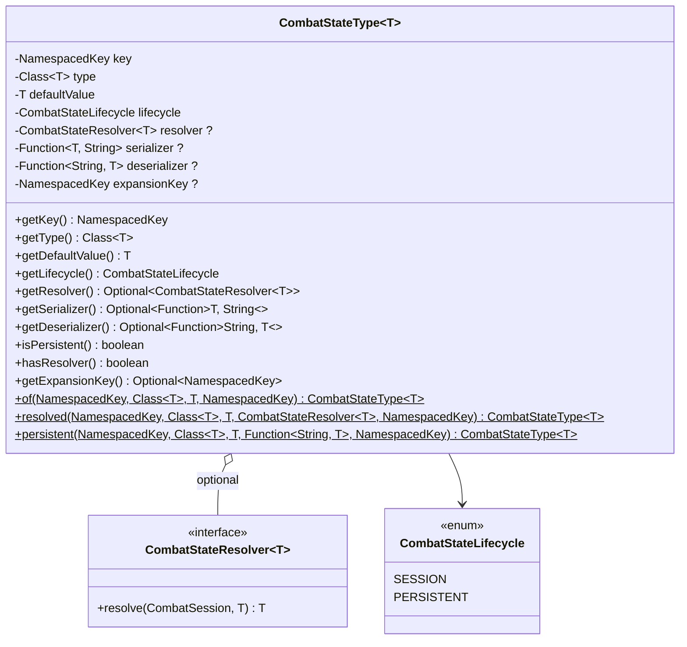
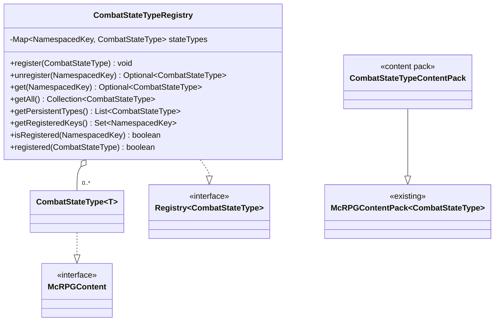
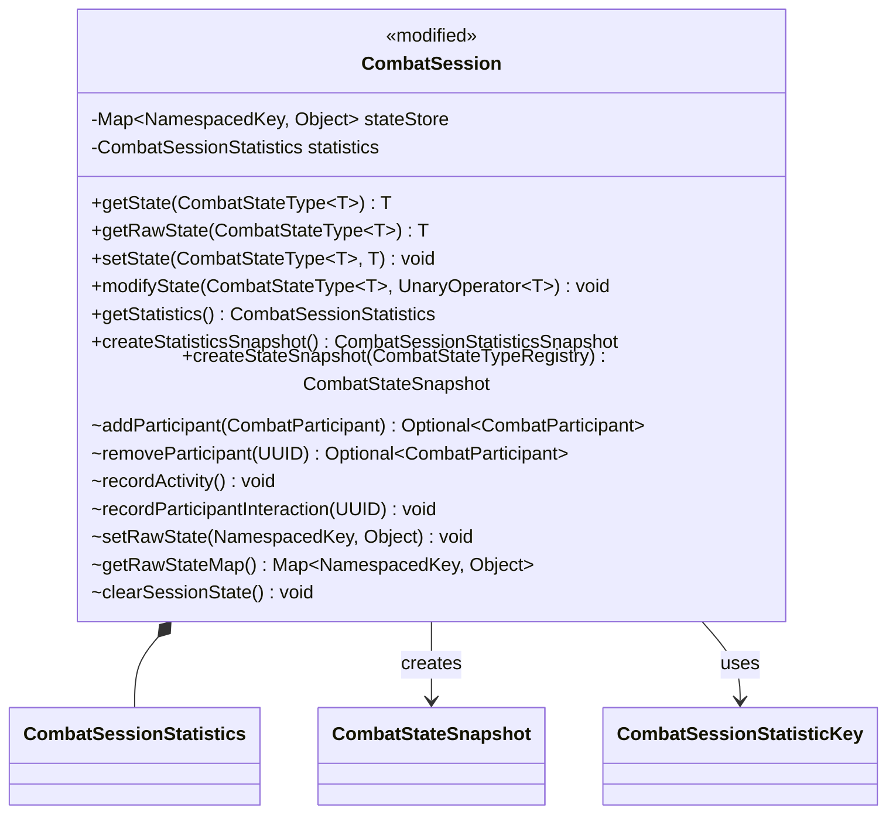
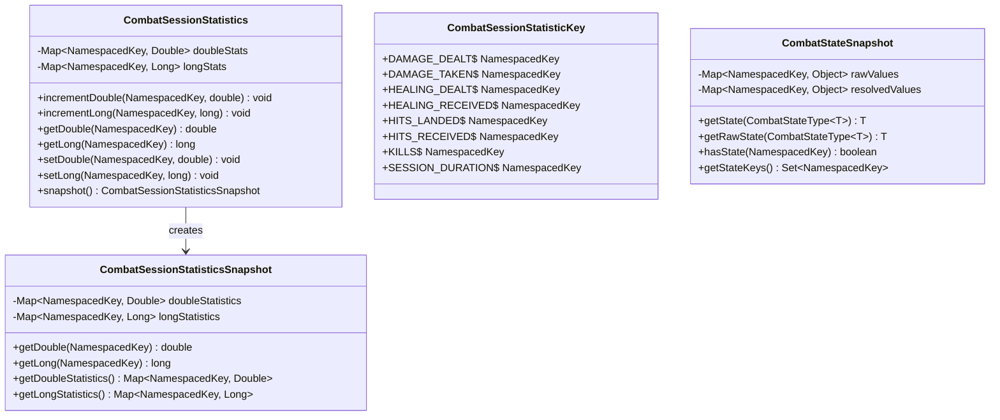
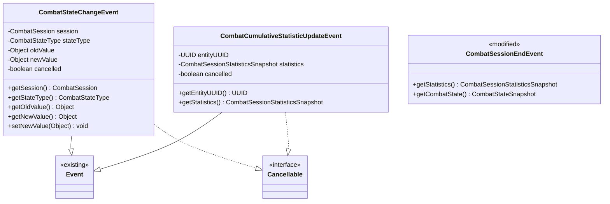
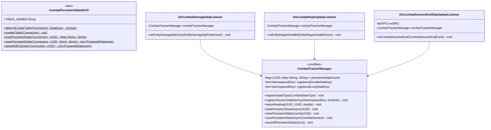

# Phase 2 LLD: Combat State & Statistics Platform

> **HLD Reference:** [Combat Tracker & Ramping Frenzy](../../hld/combat/combat-tracker-and-ramping-frenzy.md)
> **Phase 1 Reference:** [Core Combat Session Engine](phase-1-core-combat-session-engine.md)
> **Status:** Design — awaiting review
> **Last Updated:** 2026-07-19

---

## Scope

This phase delivers the extensibility layer on top of the Phase 1 combat session engine — typed, keyed combat state that abilities and third-party plugins attach to sessions, per-session statistics that track combat metrics, and the automatic pipeline from session stats to cumulative McCore statistics. After this phase, consumers can register state types with resolvers, track damage/healing/kills per session, observe state changes via events, and persist state across session boundaries.

**In scope:**

- `CombatStateType<T>` — typed state definition with `of()`, `resolved()`, `persistent()` factories
- `CombatStateResolver<T>` — functional interface for computing effective values from raw + external context
- `CombatStateLifecycle` — enum: `SESSION` (auto-cleared), `PERSISTENT` (survives session boundaries)
- `CombatStateTypeRegistry` — dedicated registry for state types, keyed by `NamespacedKey`
- `CombatStateTypeContentPack` — `ContentExpansion` registration for state types
- `ContentHandlerType.COMBAT_STATE_TYPE` — processor for the content pack
- `CombatStateChangeEvent` — cancellable event fired on `setState` / `modifyState`
- `CombatSessionStatistics` — mutable per-session statistics container on `CombatSession`
- `CombatSessionStatisticKey` — built-in per-session stat key constants
- `CombatSessionStatisticsSnapshot` — immutable stats snapshot for `CombatSessionEndEvent`
- `CombatStateSnapshot` — immutable state snapshot for `CombatSessionEndEvent`
- `CombatCumulativeStatisticUpdateEvent` — cancellable event fired before cumulative stat update
- `CombatPersistentStateDAO` — generic key-value DAO for persistent state
- `OnCombatDamageStatListener` — damage/hit stat tracking at `MONITOR`
- `OnCombatHealingStatListener` — healing stat tracking at `MONITOR`
- `OnCombatSessionEndStatUpdateListener` — cumulative stat update at `MONITOR`
- Explicit healer-attribution API: `CombatTrackerManager.reportHealing()`
- Persistent state lifecycle hooks: pre-load on player login, save on session end, save on shutdown
- New cumulative McCore statistics: `HEALING_DEALT`, `HEALING_RECEIVED`, `HITS_LANDED`, `HITS_RECEIVED`, `COMBAT_KILLS`
- Modifications to `CombatSession` (state store, statistics container, mutator visibility), `CombatTrackerManager` (state type management, persistent state lifecycle, healing API, session statistic key registration), `CombatSessionEndEvent` (stat + state snapshots), `CombatConfigFile`, `McRPGStatistic`
- Configuration: `per-session-statistics.feed-to-cumulative`

**Out of scope (later phases):**

- Phase 3: Combat log detection/punishment, `CombatLogDAO`, admin command, PAPI placeholders, combat exit messaging
- Phase 4: Ramping Frenzy ability, resolved frenzy stack state, shed task, Haste application — Phase 2 delivers the `CombatStateType<T>` + resolver infrastructure that Phase 4 consumes

---

## Class Diagrams

### Legend

```
Stereotypes:
  <<interface>>     interface type
  <<abstract>>      abstract class
  <<enum>>          enum type
  <<record>>        record type
  <<content pack>>  McRPGContentPack subclass
  <<config>>        ConfigFile subclass
  <<existing>>      class already exists, not modified
  <<modified>>      class already exists, modified in this phase
  <<dao>>           static-method Data Access Object

Relationships:
  *--    composition (owns lifecycle)
  o--    association (references)
  -->    dependency (uses)
  ..|>   implements
  --|>   extends

Nullability:
  ?      nullable field
```

### Diagram 1a: State Type Definition



### Diagram 1b: State Type Registration



### Diagram 2: CombatSession Modifications



### Diagram 3a: Per-Session Statistics & Snapshots



### Diagram 3b: Events



### Diagram 3c: Persistence, Listeners & Manager Modifications



---

## 1. New Classes

### 1.1 CombatStateLifecycle

**Package:** `us.eunoians.mcrpg.combat.state`
**File:** `src/main/java/us/eunoians/mcrpg/combat/state/CombatStateLifecycle.java`

Enum representing the lifecycle scope of a combat state type. Determines what happens to the state value when a session ends.

```java
public enum CombatStateLifecycle {

    /**
     * State is cleared when the session ends. Default. Used for transient combat mechanics
     * like ability stacks that only exist during active combat.
     */
    SESSION,

    /**
     * State survives session boundaries. The combat tracker preserves the value and re-attaches
     * it to the entity's next session. Backed by the persistent state DAO. Used for cross-combat
     * tracking like "times entered combat today."
     */
    PERSISTENT
}
```

### 1.2 CombatStateResolver\<T\>

**Package:** `us.eunoians.mcrpg.combat.state`
**File:** `src/main/java/us/eunoians/mcrpg/combat/state/CombatStateResolver.java`

Functional interface for computing the effective value of a combat state from its raw stored value plus external context. Resolvers must be pure and side-effect-free — reads should never mutate state. The resolver runs on every `getState()` call, so it should be lightweight.

```java
@FunctionalInterface
public interface CombatStateResolver<T> {

    /**
     * Computes the effective value of a combat state from the raw stored value and the
     * current session context.
     * <p>
     * This method must be <b>pure</b> — it must not mutate the session, the entity, or
     * any external state. It runs on every {@code getState()} call and must be lightweight
     * (O(1) operations only — checking active potion effects is O(1) in Paper).
     *
     * @param session  The combat session the state belongs to.
     * @param rawValue The raw stored value (last written via {@code setState}).
     * @return The effective value after resolution.
     */
    @NotNull
    T resolve(@NotNull CombatSession session, @NotNull T rawValue);
}
```

### 1.3 CombatStateType\<T\>

**Package:** `us.eunoians.mcrpg.combat.state`
**File:** `src/main/java/us/eunoians/mcrpg/combat/state/CombatStateType.java`

Typed, keyed definition of a combat state that can be attached to sessions. Immutable once constructed. Three factory methods correspond to the three use cases:

- `of()` — simple session-scoped state, raw value returned directly
- `resolved()` — session-scoped state with a resolver that computes the effective value on read
- `persistent()` — state that survives session boundaries, backed by a DAO with registrant-provided serialization

Implements `McRPGContent` for `ContentPack` registration — required by the `McRPGContentPack<T extends McRPGContent>` bound that `CombatStateTypeContentPack` (§1.11) is built on. Since `CombatStateType` is instantiated through static factories rather than subclassed per state type, each factory takes a `@Nullable NamespacedKey expansionKey` parameter (mirroring the `StatisticContent` wrapper's constructor pattern) so callers can identify which `ContentExpansion` — if any — owns the state type; `getExpansionKey()` wraps it in an `Optional`. Third-party callers pass their expansion's key; a `null` expansion key is valid for state types not tied to a specific expansion.

```java
public final class CombatStateType<T> implements McRPGContent {

    private final NamespacedKey key;
    private final Class<T> type;
    private final T defaultValue;
    private final CombatStateLifecycle lifecycle;
    @Nullable
    private final CombatStateResolver<T> resolver;
    @Nullable
    private final Function<T, String> serializer;
    @Nullable
    private final Function<String, T> deserializer;
    @Nullable
    private final NamespacedKey expansionKey;

    /**
     * Private constructor — use the static factory methods.
     */
    private CombatStateType(@NotNull NamespacedKey key, @NotNull Class<T> type,
                            @NotNull T defaultValue, @NotNull CombatStateLifecycle lifecycle,
                            @Nullable CombatStateResolver<T> resolver,
                            @Nullable Function<T, String> serializer,
                            @Nullable Function<String, T> deserializer,
                            @Nullable NamespacedKey expansionKey) {
        this.key = key;
        this.type = type;
        this.defaultValue = defaultValue;
        this.lifecycle = lifecycle;
        this.resolver = resolver;
        this.serializer = serializer;
        this.deserializer = deserializer;
        this.expansionKey = expansionKey;
    }

    /**
     * Creates a simple session-scoped state type with no resolver. {@code getState()} returns the
     * raw value directly. State is cleared when the session ends.
     *
     * @param key          The unique key identifying this state type.
     * @param type         The class of the state value.
     * @param defaultValue The initial value for new sessions.
     * @param expansionKey The {@link NamespacedKey} of the owning {@link us.eunoians.mcrpg.expansion.ContentExpansion},
     *                     or {@code null} if this state type is not tied to a specific expansion.
     * @param <T>          The state value type.
     * @return A new session-scoped {@link CombatStateType}.
     */
    @NotNull
    public static <T> CombatStateType<T> of(@NotNull NamespacedKey key,
                                             @NotNull Class<T> type,
                                             @NotNull T defaultValue,
                                             @Nullable NamespacedKey expansionKey) {
        return new CombatStateType<>(key, type, defaultValue, CombatStateLifecycle.SESSION,
                null, null, null, expansionKey);
    }

    /**
     * Creates a session-scoped state type with a resolver. {@code getState()} returns the
     * resolver's output; {@code getRawState()} returns the stored value. State is cleared
     * when the session ends.
     *
     * @param key          The unique key identifying this state type.
     * @param type         The class of the state value.
     * @param defaultValue The initial value for new sessions.
     * @param resolver     The resolver that computes the effective value on every read.
     * @param expansionKey The {@link NamespacedKey} of the owning {@link us.eunoians.mcrpg.expansion.ContentExpansion},
     *                     or {@code null} if this state type is not tied to a specific expansion.
     * @param <T>          The state value type.
     * @return A new resolved session-scoped {@link CombatStateType}.
     */
    @NotNull
    public static <T> CombatStateType<T> resolved(@NotNull NamespacedKey key,
                                                    @NotNull Class<T> type,
                                                    @NotNull T defaultValue,
                                                    @NotNull CombatStateResolver<T> resolver,
                                                    @Nullable NamespacedKey expansionKey) {
        return new CombatStateType<>(key, type, defaultValue, CombatStateLifecycle.SESSION,
                resolver, null, null, expansionKey);
    }

    /**
     * Creates a persistent state type. The value survives session boundaries — saved to the DB
     * on session end and re-loaded on the next session start. The registrant provides a
     * serializer/deserializer pair for DB round-tripping. The registrant is responsible for
     * cleanup policy (TTL, daily reset); the tracker only stores and loads.
     *
     * @param key          The unique key identifying this state type.
     * @param type         The class of the state value.
     * @param defaultValue The initial value when no persisted value exists.
     * @param serializer   Converts the value to a string for DB storage.
     * @param deserializer Converts a DB string back to the value.
     * @param expansionKey The {@link NamespacedKey} of the owning {@link us.eunoians.mcrpg.expansion.ContentExpansion},
     *                     or {@code null} if this state type is not tied to a specific expansion.
     * @param <T>          The state value type.
     * @return A new persistent {@link CombatStateType}.
     */
    @NotNull
    public static <T> CombatStateType<T> persistent(@NotNull NamespacedKey key,
                                                      @NotNull Class<T> type,
                                                      @NotNull T defaultValue,
                                                      @NotNull Function<T, String> serializer,
                                                      @NotNull Function<String, T> deserializer,
                                                      @Nullable NamespacedKey expansionKey) {
        return new CombatStateType<>(key, type, defaultValue, CombatStateLifecycle.PERSISTENT,
                null, serializer, deserializer, expansionKey);
    }

    /**
     * Gets the unique key identifying this state type.
     *
     * @return The {@link NamespacedKey}.
     */
    @NotNull
    public NamespacedKey getKey() {
        return key;
    }

    /**
     * Gets the class of the state value.
     *
     * @return The value {@link Class}.
     */
    @NotNull
    public Class<T> getType() {
        return type;
    }

    /**
     * Gets the default value used for new sessions when no stored value exists.
     *
     * @return The default value.
     */
    @NotNull
    public T getDefaultValue() {
        return defaultValue;
    }

    /**
     * Gets the lifecycle scope of this state type.
     *
     * @return The {@link CombatStateLifecycle}.
     */
    @NotNull
    public CombatStateLifecycle getLifecycle() {
        return lifecycle;
    }

    /**
     * Gets the resolver for this state type, if one is declared.
     *
     * @return An {@link Optional} containing the resolver, or empty for simple types.
     */
    @NotNull
    public Optional<CombatStateResolver<T>> getResolver() {
        return Optional.ofNullable(resolver);
    }

    /**
     * Gets the serializer for this state type, if one is declared.
     *
     * @return An {@link Optional} containing the serializer, or empty for non-persistent types.
     */
    @NotNull
    public Optional<Function<T, String>> getSerializer() {
        return Optional.ofNullable(serializer);
    }

    /**
     * Gets the deserializer for this state type, if one is declared.
     *
     * @return An {@link Optional} containing the deserializer, or empty for non-persistent types.
     */
    @NotNull
    public Optional<Function<String, T>> getDeserializer() {
        return Optional.ofNullable(deserializer);
    }

    /**
     * Checks whether this state type has persistent lifecycle.
     *
     * @return {@code true} if the lifecycle is {@link CombatStateLifecycle#PERSISTENT}.
     */
    public boolean isPersistent() {
        return lifecycle == CombatStateLifecycle.PERSISTENT;
    }

    /**
     * Checks whether this state type declares a resolver.
     *
     * @return {@code true} if a resolver is present.
     */
    public boolean hasResolver() {
        return resolver != null;
    }

    /**
     * Gets the {@link us.eunoians.mcrpg.expansion.ContentExpansion} key that owns this state type, if any.
     *
     * @return An {@link Optional} containing the {@link NamespacedKey} of the owning
     * {@link us.eunoians.mcrpg.expansion.ContentExpansion}, or empty if this state type
     * is not tied to a specific expansion.
     */
    @NotNull
    @Override
    public Optional<NamespacedKey> getExpansionKey() {
        return Optional.ofNullable(expansionKey);
    }
}
```

### 1.4 CombatStateTypeRegistry

**Package:** `us.eunoians.mcrpg.combat.state`
**File:** `src/main/java/us/eunoians/mcrpg/combat/state/CombatStateTypeRegistry.java`

Registry for `CombatStateType` definitions. Accessed via `McRPGRegistryKey.COMBAT_STATE_TYPE`.

```java
public class CombatStateTypeRegistry implements Registry<CombatStateType<?>> {

    private final Map<NamespacedKey, CombatStateType<?>> stateTypes = new HashMap<>();

    /**
     * Registers a state type. Throws if a type with the same key is already registered.
     *
     * @param stateType The state type to register.
     * @throws IllegalStateException if a type with the same key is already registered.
     */
    public void register(@NotNull CombatStateType<?> stateType) {
        if (stateTypes.containsKey(stateType.getKey())) {
            throw new IllegalStateException("CombatStateType already registered: " + stateType.getKey());
        }
        stateTypes.put(stateType.getKey(), stateType);
    }

    /**
     * Unregisters a state type by key.
     *
     * @param key The key of the state type to unregister.
     * @return An {@link Optional} containing the removed type, or empty if not found.
     */
    @NotNull
    public Optional<CombatStateType<?>> unregister(@NotNull NamespacedKey key) {
        return Optional.ofNullable(stateTypes.remove(key));
    }

    /**
     * Gets a state type by key.
     *
     * @param key The key to look up.
     * @return An {@link Optional} containing the type, or empty if not found.
     */
    @NotNull
    public Optional<CombatStateType<?>> get(@NotNull NamespacedKey key) {
        return Optional.ofNullable(stateTypes.get(key));
    }

    /**
     * Gets all registered state types.
     *
     * @return An unmodifiable {@link Collection} of all registered types.
     */
    @NotNull
    public Collection<CombatStateType<?>> getAll() {
        return Collections.unmodifiableCollection(stateTypes.values());
    }

    /**
     * Gets all registered state types with {@link CombatStateLifecycle#PERSISTENT} scope.
     * Used by the manager during session start/end for load/save lifecycle hooks.
     *
     * @return A {@link List} of persistent state types.
     */
    @NotNull
    public List<CombatStateType<?>> getPersistentTypes() {
        List<CombatStateType<?>> persistent = new ArrayList<>();
        for (CombatStateType<?> type : stateTypes.values()) {
            if (type.isPersistent()) {
                persistent.add(type);
            }
        }
        return persistent;
    }

    /**
     * Gets all registered state type keys.
     *
     * @return An unmodifiable {@link Set} of registered keys.
     */
    @NotNull
    public Set<NamespacedKey> getRegisteredKeys() {
        return Collections.unmodifiableSet(stateTypes.keySet());
    }

    /**
     * Checks whether a state type is registered with the given key.
     *
     * @param key The key to check.
     * @return {@code true} if a type is registered with that key.
     */
    public boolean isRegistered(@NotNull NamespacedKey key) {
        return stateTypes.containsKey(key);
    }

    /**
     * Checks whether the given state type is registered, comparing by key.
     *
     * @param stateType The state type to check.
     * @return {@code true} if a type with the same key is registered, {@code false} otherwise.
     */
    @Override
    public boolean registered(@NotNull CombatStateType<?> stateType) {
        return stateTypes.containsKey(stateType.getKey());
    }
}
```

### 1.5 CombatSessionStatisticKey

**Package:** `us.eunoians.mcrpg.combat.stat`
**File:** `src/main/java/us/eunoians/mcrpg/combat/stat/CombatSessionStatisticKey.java`

Constants for the built-in per-session statistic keys. These keys are used within `CombatSessionStatistics` and are distinct from the cumulative `McRPGStatistic` keys (though they share the same namespace for natural mapping — see Design Decision 7).

```java
public final class CombatSessionStatisticKey {

    private CombatSessionStatisticKey() { }

    /** Total damage dealt during this session. Type: DOUBLE. */
    public static final NamespacedKey DAMAGE_DEALT = McRPGMethods.parseNamespacedKey("damage_dealt");

    /** Total damage taken during this session. Type: DOUBLE. */
    public static final NamespacedKey DAMAGE_TAKEN = McRPGMethods.parseNamespacedKey("damage_taken");

    /** Total healing applied to other entities during this session. Type: DOUBLE. */
    public static final NamespacedKey HEALING_DEALT = McRPGMethods.parseNamespacedKey("healing_dealt");

    /** Total healing received during this session, from any source (explicit heal attribution,
     *  vanilla regen, saturation, beacons, etc.). Type: DOUBLE. */
    public static final NamespacedKey HEALING_RECEIVED = McRPGMethods.parseNamespacedKey("healing_received");

    /** Attack count during this session. Type: LONG. */
    public static final NamespacedKey HITS_LANDED = McRPGMethods.parseNamespacedKey("hits_landed");

    /** Times hit during this session. Type: LONG. */
    public static final NamespacedKey HITS_RECEIVED = McRPGMethods.parseNamespacedKey("hits_received");

    /** Entities killed during this session. Type: LONG. */
    public static final NamespacedKey KILLS = McRPGMethods.parseNamespacedKey("kills");

    /** Session duration in seconds. Type: DOUBLE. Computed and written at snapshot time. */
    public static final NamespacedKey SESSION_DURATION = McRPGMethods.parseNamespacedKey("session_duration");
}
```

### 1.6 CombatSessionStatistics

**Package:** `us.eunoians.mcrpg.combat.stat`
**File:** `src/main/java/us/eunoians/mcrpg/combat/stat/CombatSessionStatistics.java`

Mutable per-session statistics container. Stores double-valued and long-valued statistics in separate maps. Instantiated once per `CombatSession` and populated by stat-tracking listeners. Thread-safety is not required — all access is on the main server thread (inherited from the session's threading contract).

`SESSION_DURATION` is stored in the double stats map like any other double stat. It is computed and written once at snapshot time by `CombatSession.createStatisticsSnapshot()` — not maintained live during the session. During combat, callers should use `CombatSession.getDurationMillis()` for the live value.

```java
public class CombatSessionStatistics {

    private final Map<NamespacedKey, Double> doubleStats;
    private final Map<NamespacedKey, Long> longStats;

    /**
     * Constructs a new empty {@link CombatSessionStatistics}.
     */
    public CombatSessionStatistics() {
        this.doubleStats = new HashMap<>();
        this.longStats = new HashMap<>();
    }

    /**
     * Increments a double-valued statistic.
     *
     * @param key    The statistic key.
     * @param amount The amount to add (may be negative for decrements).
     */
    public void incrementDouble(@NotNull NamespacedKey key, double amount) {
        doubleStats.merge(key, amount, Double::sum);
    }

    /**
     * Increments a long-valued statistic.
     *
     * @param key    The statistic key.
     * @param amount The amount to add (may be negative for decrements).
     */
    public void incrementLong(@NotNull NamespacedKey key, long amount) {
        longStats.merge(key, amount, Long::sum);
    }

    /**
     * Gets the current value of a double-valued statistic.
     *
     * @param key The statistic key.
     * @return The current value, or {@code 0.0} if the key has not been set.
     */
    public double getDouble(@NotNull NamespacedKey key) {
        return doubleStats.getOrDefault(key, 0.0);
    }

    /**
     * Gets the current value of a long-valued statistic.
     *
     * @param key The statistic key.
     * @return The current value, or {@code 0} if the key has not been set.
     */
    public long getLong(@NotNull NamespacedKey key) {
        return longStats.getOrDefault(key, 0L);
    }

    /**
     * Sets a double-valued statistic to an absolute value.
     *
     * @param key   The statistic key.
     * @param value The value to set.
     */
    public void setDouble(@NotNull NamespacedKey key, double value) {
        doubleStats.put(key, value);
    }

    /**
     * Sets a long-valued statistic to an absolute value.
     *
     * @param key   The statistic key.
     * @param value The value to set.
     */
    public void setLong(@NotNull NamespacedKey key, long value) {
        longStats.put(key, value);
    }

    /**
     * Creates an immutable snapshot of the current state of all statistics in this container.
     *
     * @return A new {@link CombatSessionStatisticsSnapshot}.
     */
    @NotNull
    public CombatSessionStatisticsSnapshot snapshot() {
        return new CombatSessionStatisticsSnapshot(
                Map.copyOf(doubleStats),
                Map.copyOf(longStats));
    }
}
```

### 1.7 CombatSessionStatisticsSnapshot

**Package:** `us.eunoians.mcrpg.combat.stat`
**File:** `src/main/java/us/eunoians/mcrpg/combat/stat/CombatSessionStatisticsSnapshot.java`

Immutable snapshot of a session's per-session statistics, created at session end for inclusion in `CombatSessionEndEvent` and `CombatCumulativeStatisticUpdateEvent`. Session duration is included as a regular double stat under `CombatSessionStatisticKey.SESSION_DURATION`.

```java
public final class CombatSessionStatisticsSnapshot {

    private final Map<NamespacedKey, Double> doubleStatistics;
    private final Map<NamespacedKey, Long> longStatistics;

    /**
     * Constructs a new {@link CombatSessionStatisticsSnapshot}.
     *
     * @param doubleStatistics Immutable map of double-valued statistics.
     * @param longStatistics   Immutable map of long-valued statistics.
     */
    CombatSessionStatisticsSnapshot(@NotNull Map<NamespacedKey, Double> doubleStatistics,
                                    @NotNull Map<NamespacedKey, Long> longStatistics) {
        this.doubleStatistics = doubleStatistics;
        this.longStatistics = longStatistics;
    }

    /**
     * Gets the value of a double-valued statistic.
     *
     * @param key The statistic key.
     * @return The value, or {@code 0.0} if absent.
     */
    public double getDouble(@NotNull NamespacedKey key) {
        return doubleStatistics.getOrDefault(key, 0.0);
    }

    /**
     * Gets the value of a long-valued statistic.
     *
     * @param key The statistic key.
     * @return The value, or {@code 0} if absent.
     */
    public long getLong(@NotNull NamespacedKey key) {
        return longStatistics.getOrDefault(key, 0L);
    }

    /**
     * Gets all double-valued statistics.
     *
     * @return An unmodifiable {@link Map} of double-valued statistics.
     */
    @NotNull
    public Map<NamespacedKey, Double> getDoubleStatistics() {
        return doubleStatistics;
    }

    /**
     * Gets all long-valued statistics.
     *
     * @return An unmodifiable {@link Map} of long-valued statistics.
     */
    @NotNull
    public Map<NamespacedKey, Long> getLongStatistics() {
        return longStatistics;
    }
}
```

### 1.8 CombatStateSnapshot

**Package:** `us.eunoians.mcrpg.combat.state`
**File:** `src/main/java/us/eunoians/mcrpg/combat/state/CombatStateSnapshot.java`

Immutable snapshot of all combat state data on a session, created at session end for inclusion in `CombatSessionEndEvent`. Captures both raw and resolved values at the moment of snapshot creation (while the session still exists and resolvers can run).

```java
public final class CombatStateSnapshot {

    private final Map<NamespacedKey, Object> rawValues;
    private final Map<NamespacedKey, Object> resolvedValues;

    /**
     * Constructs a new {@link CombatStateSnapshot}. Public because the sole caller,
     * {@code CombatSession.createStateSnapshot(CombatStateTypeRegistry)}, lives in
     * {@code us.eunoians.mcrpg.combat} — a different package than this class. This mirrors
     * the constructor visibility of other cross-package-constructed immutable holders such as
     * {@link CombatStateChangeEvent} (also built by {@code CombatSession}), {@code SkillDataSnapshot},
     * and {@code AbilityData}. {@code CombatSessionStatisticsSnapshot} is the exception, not the
     * rule: its constructor stays package-private only because its sole caller,
     * {@code CombatSessionStatistics.snapshot()}, shares its package.
     *
     * @param rawValues      Immutable map of raw stored values keyed by state type key.
     * @param resolvedValues Immutable map of resolved values at snapshot time.
     */
    public CombatStateSnapshot(@NotNull Map<NamespacedKey, Object> rawValues,
                               @NotNull Map<NamespacedKey, Object> resolvedValues) {
        this.rawValues = rawValues;
        this.resolvedValues = resolvedValues;
    }

    /**
     * Gets the resolved value for a state type at the time the snapshot was taken. Returns
     * the type's default value if the state was not present. Uses an unchecked cast — callers
     * must ensure the type parameter matches the type used during {@code setState}.
     *
     * @param type The state type to query.
     * @param <T>  The state value type.
     * @return The resolved value, or the type's default value if absent.
     */
    @SuppressWarnings("unchecked")
    @NotNull
    public <T> T getState(@NotNull CombatStateType<T> type) {
        Object value = resolvedValues.get(type.getKey());
        return value != null ? (T) value : type.getDefaultValue();
    }

    /**
     * Gets the raw stored value for a state type at the time the snapshot was taken. Returns
     * the type's default value if the state was not present.
     *
     * @param type The state type to query.
     * @param <T>  The state value type.
     * @return The raw value, or the type's default value if absent.
     */
    @SuppressWarnings("unchecked")
    @NotNull
    public <T> T getRawState(@NotNull CombatStateType<T> type) {
        Object value = rawValues.get(type.getKey());
        return value != null ? (T) value : type.getDefaultValue();
    }

    /**
     * Checks whether the snapshot contains a value for the given key.
     *
     * @param key The key to check.
     * @return {@code true} if a value exists.
     */
    public boolean hasState(@NotNull NamespacedKey key) {
        return rawValues.containsKey(key);
    }

    /**
     * Gets the set of all state type keys present in the snapshot.
     *
     * @return An unmodifiable {@link Set} of keys.
     */
    @NotNull
    public Set<NamespacedKey> getStateKeys() {
        return Collections.unmodifiableSet(rawValues.keySet());
    }
}
```

### 1.9 CombatStateChangeEvent

**Package:** `us.eunoians.mcrpg.event.combat`
**File:** `src/main/java/us/eunoians/mcrpg/event/combat/CombatStateChangeEvent.java`

Fired when combat state is modified via `setState` or `modifyState`. Cancellable — cancelling prevents the state change from being applied. The new value is modifiable by listeners (e.g., a buff ability that doubles stack gains).

Bukkit's event system does not support generic events, so the old/new values are typed as `Object`. Listeners check the state type and cast:

```java
if (event.getStateType().equals(MY_TYPE)) {
    Integer oldVal = (Integer) event.getOldValue();
    Integer newVal = (Integer) event.getNewValue();
}
```

```java
public class CombatStateChangeEvent extends Event implements Cancellable {

    private static final HandlerList HANDLERS = new HandlerList();

    private final CombatSession session;
    private final CombatStateType<?> stateType;
    private final Object oldValue;
    private Object newValue;
    private boolean cancelled;

    /**
     * Constructs a new {@link CombatStateChangeEvent}.
     *
     * @param session   The session whose state is changing.
     * @param stateType The state type being modified.
     * @param oldValue  The value before the change.
     * @param newValue  The proposed new value.
     */
    public CombatStateChangeEvent(@NotNull CombatSession session,
                                   @NotNull CombatStateType<?> stateType,
                                   @NotNull Object oldValue,
                                   @NotNull Object newValue) {
        this.session = session;
        this.stateType = stateType;
        this.oldValue = oldValue;
        this.newValue = newValue;
    }

    /**
     * Gets the session whose state is changing.
     *
     * @return The {@link CombatSession}.
     */
    @NotNull
    public CombatSession getSession() {
        return session;
    }

    /**
     * Gets the state type being modified.
     *
     * @return The {@link CombatStateType}.
     */
    @NotNull
    public CombatStateType<?> getStateType() {
        return stateType;
    }

    /**
     * Gets the value before the change.
     *
     * @return The old value.
     */
    @NotNull
    public Object getOldValue() {
        return oldValue;
    }

    /**
     * Gets the proposed new value. May be modified by listeners via {@link #setNewValue(Object)}.
     *
     * @return The new value.
     */
    @NotNull
    public Object getNewValue() {
        return newValue;
    }

    /**
     * Sets the new value. Listeners can modify the incoming value without cancelling the event
     * (e.g., a buff ability that doubles stack gains).
     *
     * @param newValue The modified new value.
     */
    public void setNewValue(@NotNull Object newValue) {
        this.newValue = newValue;
    }

    @Override
    public boolean isCancelled() {
        return cancelled;
    }

    @Override
    public void setCancelled(boolean cancel) {
        this.cancelled = cancel;
    }

    @NotNull
    @Override
    public HandlerList getHandlers() {
        return HANDLERS;
    }

    @NotNull
    public static HandlerList getHandlerList() {
        return HANDLERS;
    }
}
```

### 1.10 CombatCumulativeStatisticUpdateEvent

**Package:** `us.eunoians.mcrpg.event.combat`
**File:** `src/main/java/us/eunoians/mcrpg/event/combat/CombatCumulativeStatisticUpdateEvent.java`

Fired before per-session statistics are applied to cumulative McCore statistics at session end. Cancellable — cancelling prevents the entire update. This gives third-party plugins the cancellation surface the HLD requires ("observable and cancellable by third parties") that `CombatSessionEndEvent` (not cancellable) cannot provide.

```java
public class CombatCumulativeStatisticUpdateEvent extends Event implements Cancellable {

    private static final HandlerList HANDLERS = new HandlerList();

    private final UUID entityUUID;
    private final CombatSessionStatisticsSnapshot statistics;
    private boolean cancelled;

    /**
     * Constructs a new {@link CombatCumulativeStatisticUpdateEvent}.
     *
     * @param entityUUID The UUID of the entity whose session ended.
     * @param statistics The per-session statistics snapshot to be applied.
     */
    public CombatCumulativeStatisticUpdateEvent(@NotNull UUID entityUUID,
                                                @NotNull CombatSessionStatisticsSnapshot statistics) {
        this.entityUUID = entityUUID;
        this.statistics = statistics;
    }

    /**
     * Gets the UUID of the entity whose session-end statistics are about to be applied
     * to cumulative totals.
     *
     * @return The entity UUID.
     */
    @NotNull
    public UUID getEntityUUID() {
        return entityUUID;
    }

    /**
     * Gets the per-session statistics snapshot that will be applied to cumulative statistics.
     *
     * @return The {@link CombatSessionStatisticsSnapshot}.
     */
    @NotNull
    public CombatSessionStatisticsSnapshot getStatistics() {
        return statistics;
    }

    @Override
    public boolean isCancelled() {
        return cancelled;
    }

    @Override
    public void setCancelled(boolean cancel) {
        this.cancelled = cancel;
    }

    @NotNull
    @Override
    public HandlerList getHandlers() {
        return HANDLERS;
    }

    @NotNull
    public static HandlerList getHandlerList() {
        return HANDLERS;
    }
}
```

### 1.11 CombatStateTypeContentPack

**Package:** `us.eunoians.mcrpg.expansion.content`
**File:** `src/main/java/us/eunoians/mcrpg/expansion/content/CombatStateTypeContentPack.java`

Content pack for registering `CombatStateType` implementations via the `ContentExpansion` system. Follows the same pattern as `CombatConditionContentPack`.

```java
public class CombatStateTypeContentPack extends McRPGContentPack<CombatStateType<?>> {

    /**
     * Constructs a new {@link CombatStateTypeContentPack}.
     *
     * @param contentExpansion The {@link ContentExpansion} providing this content.
     */
    public CombatStateTypeContentPack(@NotNull ContentExpansion contentExpansion) {
        super(contentExpansion);
    }
}
```

### 1.12 CombatPersistentStateDAO

**Package:** `us.eunoians.mcrpg.database.table`
**File:** `src/main/java/us/eunoians/mcrpg/database/table/CombatPersistentStateDAO.java`

Static DAO for the generic key-value table that persists `PERSISTENT`-scoped combat state across session boundaries. Follows the repo DAO pattern: static methods, `Connection` as first argument, `attemptCreateTable` for initialization, `updateTable` for version-gated migrations via `TableVersionHistoryDAO`, `List<PreparedStatement>` returns for batch support. Both `attemptCreateTable` and `updateTable` are wired into `McRPGDatabase`'s create/update function pipelines (see §2.11), not `McRPGBootstrap` — `McRPGBootstrap` never holds a `Connection` directly.

**Table schema:** `combat_persistent_state`

| Column | Type | Constraint | Description |
|--------|------|------------|-------------|
| `entity_uuid` | VARCHAR(36) | PK (composite) | The entity's UUID |
| `state_key` | VARCHAR(256) | PK (composite) | The `NamespacedKey` string of the state type |
| `serialized_value` | TEXT | NOT NULL | The serialized value (registrant-provided format) |

```java
public final class CombatPersistentStateDAO {

    public static final String TABLE_NAME = "combat_persistent_state";
    private static final int CURRENT_TABLE_VERSION = 1;

    private CombatPersistentStateDAO() { }

    /**
     * Creates the table if it does not already exist.
     *
     * @param connection The database connection.
     * @param database   The database instance for existence checks.
     * @return {@code true} if the table was newly created, {@code false} if it already existed.
     */
    public static boolean attemptCreateTable(@NotNull Connection connection,
                                              @NotNull Database database) {
        // CREATE TABLE IF NOT EXISTS combat_persistent_state (
        //   entity_uuid VARCHAR(36) NOT NULL,
        //   state_key VARCHAR(256) NOT NULL,
        //   serialized_value TEXT NOT NULL,
        //   PRIMARY KEY (entity_uuid, state_key)
        // )
    }

    /**
     * Checks the live table version against {@link #CURRENT_TABLE_VERSION} and applies any
     * outstanding migrations, recording progress in
     * {@link com.diamonddagger590.mccore.database.table.TableVersionHistoryDAO}. Called from
     * {@code McRPGDatabase}'s update-table pipeline, after {@link #attemptCreateTable} has run
     * for every DAO.
     *
     * @param connection The database connection.
     */
    public static void updateTable(@NotNull Connection connection) {
        // int lastStoredVersion = TableVersionHistoryDAO.getLatestVersion(connection, TABLE_NAME);
        // if (lastStoredVersion < CURRENT_TABLE_VERSION) {
        //   if (lastStoredVersion == 0) {
        //     TableVersionHistoryDAO.setTableVersion(connection, TABLE_NAME, 1);
        //   }
        // }
    }

    /**
     * Loads all persisted state for an entity.
     *
     * @param connection The database connection.
     * @param entityUUID The entity's UUID.
     * @return A map of state key (namespaced key string) to serialized value.
     */
    @NotNull
    public static Map<String, String> loadPersistentState(@NotNull Connection connection,
                                                           @NotNull UUID entityUUID) {
        // SELECT state_key, serialized_value FROM combat_persistent_state
        //   WHERE entity_uuid = ?
    }

    /**
     * Saves a single persistent state entry. Uses upsert semantics (INSERT ... ON CONFLICT
     * DO UPDATE) so it handles both creation and updates.
     *
     * @param connection      The database connection.
     * @param entityUUID      The entity's UUID.
     * @param stateKey        The namespaced key string.
     * @param serializedValue The serialized value.
     * @return A list containing the prepared statement for batch execution.
     */
    @NotNull
    public static List<PreparedStatement> savePersistentState(@NotNull Connection connection,
                                                               @NotNull UUID entityUUID,
                                                               @NotNull String stateKey,
                                                               @NotNull String serializedValue) {
        // INSERT INTO combat_persistent_state (entity_uuid, state_key, serialized_value)
        //   VALUES (?, ?, ?)
        //   ON CONFLICT(entity_uuid, state_key) DO UPDATE SET serialized_value = excluded.serialized_value
    }

    /**
     * Deletes all persistent state for an entity. Used during cleanup.
     *
     * @param connection The database connection.
     * @param entityUUID The entity's UUID.
     * @return A list containing the prepared statement for batch execution.
     */
    @NotNull
    public static List<PreparedStatement> deleteAllForEntity(@NotNull Connection connection,
                                                              @NotNull UUID entityUUID) {
        // DELETE FROM combat_persistent_state WHERE entity_uuid = ?
    }
}
```

### 1.13 OnCombatDamageStatListener

**Package:** `us.eunoians.mcrpg.listener.combat`
**File:** `src/main/java/us/eunoians/mcrpg/listener/combat/OnCombatDamageStatListener.java`

Observes `EntityDamageByEntityEvent` at `MONITOR` priority (after `OnCombatDamageListener` at `HIGHEST` has created/updated sessions). Resolves the source entity (handling projectile shooters) and increments per-session damage and hit statistics on the source's and target's active sessions.

```java
public class OnCombatDamageStatListener implements Listener {

    private final CombatTrackerManager combatTrackerManager;

    /**
     * Constructs a new {@link OnCombatDamageStatListener}.
     *
     * @param combatTrackerManager The {@link CombatTrackerManager} for session lookups.
     */
    public OnCombatDamageStatListener(@NotNull CombatTrackerManager combatTrackerManager) {
        this.combatTrackerManager = combatTrackerManager;
    }

    /**
     * Tracks per-session damage and hit statistics. Resolves the true source for projectiles.
     * Increments {@code damage_dealt} and {@code hits_landed} on the source's session,
     * and {@code damage_taken} and {@code hits_received} on the target's session.
     *
     * @param event The damage event.
     */
    @EventHandler(priority = EventPriority.MONITOR, ignoreCancelled = true)
    public void onEntityDamageByEntity(@NotNull EntityDamageByEntityEvent event) {
        // 1. Resolve damager: if Projectile, resolve via getShooter() (bail if not Entity)
        // 2. Guard: both source and target must be LivingEntity
        // 3. Guard: source and target must not be the same entity
        // 4. double damage = event.getFinalDamage()
        // 5. If source has active session: incrementDouble(DAMAGE_DEALT, damage), incrementLong(HITS_LANDED, 1)
        // 6. If target has active session: incrementDouble(DAMAGE_TAKEN, damage), incrementLong(HITS_RECEIVED, 1)
    }
}
```

### 1.14 OnCombatHealingStatListener

**Package:** `us.eunoians.mcrpg.listener.combat`
**File:** `src/main/java/us/eunoians/mcrpg/listener/combat/OnCombatHealingStatListener.java`

Observes `EntityRegainHealthEvent` at `MONITOR` priority for passive `healing_received` tracking. If the healed entity has an active combat session, increments `healing_received`. Does NOT create sessions or add participants (per the "Healing Does Not Trigger Combat" design decision).

`healing_dealt` attribution is NOT tracked by this listener — Bukkit's `EntityRegainHealthEvent` carries no healer source. See Design Decision 5 for the attribution approach.

```java
public class OnCombatHealingStatListener implements Listener {

    private final CombatTrackerManager combatTrackerManager;

    /**
     * Constructs a new {@link OnCombatHealingStatListener}.
     *
     * @param combatTrackerManager The {@link CombatTrackerManager} for session lookups.
     */
    public OnCombatHealingStatListener(@NotNull CombatTrackerManager combatTrackerManager) {
        this.combatTrackerManager = combatTrackerManager;
    }

    /**
     * Tracks {@code healing_received} on the healed entity's active session. Does not create
     * sessions or add participants — healing is a combat-adjacent interaction.
     *
     * @param event The health regain event.
     */
    @EventHandler(priority = EventPriority.MONITOR, ignoreCancelled = true)
    public void onEntityRegainHealth(@NotNull EntityRegainHealthEvent event) {
        // 1. Guard: entity must be a LivingEntity
        // 2. If entity has active session:
        //    session.getStatistics().incrementDouble(HEALING_RECEIVED, event.getAmount())
    }
}
```

### 1.15 OnCombatSessionEndStatUpdateListener

**Package:** `us.eunoians.mcrpg.listener.combat`
**File:** `src/main/java/us/eunoians/mcrpg/listener/combat/OnCombatSessionEndStatUpdateListener.java`

Listens to `CombatSessionEndEvent` at `MONITOR` priority and applies per-session statistics to cumulative McCore statistics. Gated by the `feed-to-cumulative` config flag. Fires `CombatCumulativeStatisticUpdateEvent` (cancellable) before performing the update.

The mapping from per-session keys to cumulative statistics is defined in Design Decision 7.

```java
public class OnCombatSessionEndStatUpdateListener implements Listener {

    private final McRPG mcRPG;
    private final CombatTrackerManager combatTrackerManager;

    /**
     * Constructs a new {@link OnCombatSessionEndStatUpdateListener}.
     *
     * @param mcRPG                The McRPG plugin instance.
     * @param combatTrackerManager The {@link CombatTrackerManager} for config access.
     */
    public OnCombatSessionEndStatUpdateListener(@NotNull McRPG mcRPG,
                                               @NotNull CombatTrackerManager combatTrackerManager) {
        this.mcRPG = mcRPG;
        this.combatTrackerManager = combatTrackerManager;
    }

    /**
     * Applies per-session statistics to cumulative McCore statistics. Gated by the
     * {@code feed-to-cumulative} config flag. Fires {@link CombatCumulativeStatisticUpdateEvent}
     * before the update — if cancelled, no cumulative updates are applied.
     *
     * @param event The session end event.
     */
    @EventHandler(priority = EventPriority.MONITOR)
    public void onCombatSessionEnd(@NotNull CombatSessionEndEvent event) {
        // 1. Guard: check feed-to-cumulative config (return if false)
        // 2. Guard: entity must be a player with loaded statistic data
        // 3. Get the statistics snapshot from the event
        // 4. Fire CombatCumulativeStatisticUpdateEvent (cancellable) — return if cancelled
        // 5. For each built-in per-session stat key with a cumulative mapping:
        //    look up the entity's cumulative Statistic and increment by the session value
        //    (see Design Decision 7 for the mapping table)
    }
}
```

---

## 2. Modifications to Existing Classes

### 2.1 CombatSession — State Store, Statistics, Visibility

**File:** `src/main/java/us/eunoians/mcrpg/combat/CombatSession.java`

#### New fields

```java
private final Map<NamespacedKey, Object> stateStore;
private final CombatSessionStatistics statistics;
```

Both are initialized in the constructor:

```java
this.stateStore = new HashMap<>();
this.statistics = new CombatSessionStatistics();
```

#### New public methods — state accessors

```java
/**
 * Gets the resolved value of a combat state. If the state type declares a
 * {@link CombatStateResolver}, the resolver is invoked with the raw stored value
 * and the current session to produce the effective value. If no resolver is declared,
 * returns the raw stored value. Returns the type's default value if no value has been
 * stored.
 *
 * @param type The state type to query.
 * @param <T>  The state value type.
 * @return The effective (resolved) value.
 */
@SuppressWarnings("unchecked")
@NotNull
public <T> T getState(@NotNull CombatStateType<T> type) {
    T rawValue = getRawState(type);
    return type.getResolver()
            .map(resolver -> resolver.resolve(this, rawValue))
            .orElse(rawValue);
}

/**
 * Gets the raw stored value of a combat state, bypassing any resolver. Returns the
 * type's default value if no value has been stored.
 *
 * @param type The state type to query.
 * @param <T>  The state value type.
 * @return The raw stored value, or the default value if absent.
 */
@SuppressWarnings("unchecked")
@NotNull
public <T> T getRawState(@NotNull CombatStateType<T> type) {
    Object value = stateStore.get(type.getKey());
    return value != null ? (T) value : type.getDefaultValue();
}

/**
 * Sets the raw value of a combat state. Fires {@link CombatStateChangeEvent} — if the
 * event is cancelled, the value is not changed. If the event's new value is modified by
 * a listener, the modified value is stored instead.
 * <p>
 * Resolvers are not involved in writes — the raw value is stored directly. Reads via
 * {@link #getState(CombatStateType)} apply the resolver afterward.
 *
 * @param type  The state type to write.
 * @param value The new raw value.
 * @param <T>   The state value type.
 */
@SuppressWarnings("unchecked")
public <T> void setState(@NotNull CombatStateType<T> type, @NotNull T value) {
    T oldValue = getRawState(type);

    CombatStateChangeEvent event = new CombatStateChangeEvent(this, type, oldValue, value);
    Bukkit.getPluginManager().callEvent(event);

    if (!event.isCancelled()) {
        stateStore.put(type.getKey(), event.getNewValue());
    }
}

/**
 * Atomically reads the current raw value, applies a modifier function, and writes the result.
 * Fires {@link CombatStateChangeEvent} with the old and new values — cancellation or value
 * modification by listeners is handled identically to {@link #setState(CombatStateType, Object)}.
 *
 * @param type     The state type to modify.
 * @param modifier The function to apply to the current raw value.
 * @param <T>      The state value type.
 */
public <T> void modifyState(@NotNull CombatStateType<T> type, @NotNull UnaryOperator<T> modifier) {
    T oldValue = getRawState(type);
    T newValue = modifier.apply(oldValue);
    setState(type, newValue);
}
```

#### New public methods — statistics and snapshots

```java
/**
 * Gets the per-session statistics container. Stat-tracking listeners use this to
 * increment damage, healing, hit, and kill counts during combat.
 *
 * @return The mutable {@link CombatSessionStatistics} for this session.
 */
@NotNull
public CombatSessionStatistics getStatistics() {
    return statistics;
}

/**
 * Creates an immutable snapshot of the per-session statistics. Computes and writes
 * {@code SESSION_DURATION} into the statistics container before snapshotting, so the
 * snapshot includes duration alongside all other stats uniformly.
 *
 * @return A new {@link CombatSessionStatisticsSnapshot}.
 */
@NotNull
public CombatSessionStatisticsSnapshot createStatisticsSnapshot() {
    double durationSeconds = getDurationMillis() / 1000.0;
    statistics.setDouble(CombatSessionStatisticKey.SESSION_DURATION, durationSeconds);
    return statistics.snapshot();
}

/**
 * Creates an immutable snapshot of all combat state data. Captures both raw and resolved
 * values for every key in the state store. Resolved values are computed at snapshot time
 * while the session still exists and resolvers can run.
 *
 * @param stateTypeRegistry The registry used to look up state types for resolver resolution.
 * @return A new {@link CombatStateSnapshot}.
 */
@NotNull
public CombatStateSnapshot createStateSnapshot(@NotNull CombatStateTypeRegistry stateTypeRegistry) {
    Map<NamespacedKey, Object> rawValues = Map.copyOf(stateStore);
    Map<NamespacedKey, Object> resolvedValues = new HashMap<>();
    for (Map.Entry<NamespacedKey, Object> entry : stateStore.entrySet()) {
        Optional<CombatStateType<?>> typeOpt = stateTypeRegistry.get(entry.getKey());
        if (typeOpt.isPresent()) {
            resolvedValues.put(entry.getKey(), resolveForSnapshot(typeOpt.get(), entry.getValue()));
        } else {
            resolvedValues.put(entry.getKey(), entry.getValue());
        }
    }
    return new CombatStateSnapshot(rawValues, Map.copyOf(resolvedValues));
}
```

#### New package-private methods — manager access

```java
/**
 * Sets a raw value in the state store without firing events. Used by the manager during
 * persistent state re-attachment on session start.
 *
 * @param key   The state type key.
 * @param value The value to store.
 */
void setRawState(@NotNull NamespacedKey key, @NotNull Object value) {
    stateStore.put(key, value);
}

/**
 * Gets the raw state store map. Used by the manager for persistent state save on session end.
 *
 * @return The mutable state store map.
 */
@NotNull
Map<NamespacedKey, Object> getRawStateMap() {
    return stateStore;
}

/**
 * Clears all session-scoped state. Called by the manager during session end cleanup.
 * Persistent state is saved before this call.
 */
void clearSessionState() {
    stateStore.clear();
}
```

#### Visibility changes — existing methods reduced to package-private

The following methods are reduced from `public` to package-private. All legitimate external mutation routes through `CombatTrackerManager` which fires proper lifecycle events. Direct mutation bypasses events (see Design Decision 1).

| Method | Old visibility | New visibility |
|--------|---------------|----------------|
| `addParticipant(CombatParticipant)` | `public` | package-private |
| `removeParticipant(UUID)` | `public` | package-private |
| `recordActivity()` | `public` | package-private |
| `recordParticipantInteraction(UUID)` | `public` | package-private |

The Javadoc and parameter lists remain unchanged; only the `public` keyword is removed.

### 2.2 CombatTrackerManager — State Type Management, Persistent State, Healing API

**File:** `src/main/java/us/eunoians/mcrpg/combat/CombatTrackerManager.java`

#### New fields

```java
private final Map<UUID, Map<String, String>> persistentStateCache;
private final Set<NamespacedKey> registeredDoubleStatKeys;
private final Set<NamespacedKey> registeredLongStatKeys;
private boolean shuttingDown;
```

Initialized in the constructor:

```java
this.persistentStateCache = new HashMap<>();
this.registeredDoubleStatKeys = new HashSet<>();
this.registeredLongStatKeys = new HashSet<>();
this.shuttingDown = false;
```

`shuttingDown` is set by `shutdown()` (see below) and exists solely to let `endSession` distinguish an
in-progress shutdown from every other end-session path, so it can skip a redundant persistent-state
save. All access is on the main thread (enforced by `requireMainThread()`), so no synchronization is
needed. A new `CombatTrackerManager` instance is created on every plugin enable, so the field always
starts `false` for a fresh run.

#### New public methods

```java
/**
 * Registers a {@link CombatStateType} in the {@link CombatStateTypeRegistry} AND
 * performs any setup needed for the type's lifecycle. This is the convenience entry
 * point for standalone plugins that don't use the {@link ContentExpansion} system.
 * <p>
 * For plugins using the expansion system, registration happens via
 * {@link CombatStateTypeContentPack} and the {@code ContentHandlerType.COMBAT_STATE_TYPE}
 * processor — calling this method directly is not needed.
 *
 * @param stateType The state type to register.
 */
public void registerStateType(@NotNull CombatStateType<?> stateType) {
    requireMainThread();
    CombatStateTypeRegistry registry = plugin().registryAccess()
            .registry(McRPGRegistryKey.COMBAT_STATE_TYPE);
    registry.register(stateType);
}

/**
 * Registers a custom per-session statistic key so it appears with its default value
 * in every new session's statistics container.
 *
 * @param key      The custom statistic key.
 * @param isDouble {@code true} for double-valued stats, {@code false} for long-valued.
 */
public void registerSessionStatisticKey(@NotNull NamespacedKey key, boolean isDouble) {
    requireMainThread();
    if (isDouble) {
        registeredDoubleStatKeys.add(key);
    } else {
        registeredLongStatKeys.add(key);
    }
}

/**
 * Reports an attributed healing interaction. Increments {@code healing_dealt} on the
 * healer's active session and {@code healing_received} on the target's active session.
 * Does not create sessions or add participants.
 * <p>
 * McRPG heal abilities and third-party plugins call this to attribute healing — Bukkit's
 * {@link org.bukkit.event.entity.EntityRegainHealthEvent} carries no healer source, so
 * attribution requires explicit reporting.
 *
 * @param healerUUID The UUID of the entity that performed the healing.
 * @param targetUUID The UUID of the entity that was healed.
 * @param amount     The amount of healing applied.
 */
public void reportHealing(@NotNull UUID healerUUID, @NotNull UUID targetUUID, double amount) {
    requireMainThread();
    getSession(healerUUID).ifPresent(session ->
            session.getStatistics().incrementDouble(CombatSessionStatisticKey.HEALING_DEALT, amount));
    getSession(targetUUID).ifPresent(session ->
            session.getStatistics().incrementDouble(CombatSessionStatisticKey.HEALING_RECEIVED, amount));
}

/**
 * Loads all persistent combat state for an entity from the database asynchronously.
 * The loaded data is cached in-memory and applied to the entity's session on start.
 * Called on player login.
 *
 * @param entityUUID The UUID of the entity to load persistent state for.
 */
public void loadPersistentStateAsync(@NotNull UUID entityUUID) {
    // 1. Submit async task to McRPGDatabaseManager's executor
    // 2. CombatPersistentStateDAO.loadPersistentState(connection, entityUUID) — returns
    //    Map<String, String>, keyed by the NamespacedKey's string representation
    // 3. On main thread: store the returned map directly in persistentStateCache (no
    //    NamespacedKey parsing here — the cache is String-keyed to match the DAO's return
    //    type; keys are resolved to NamespacedKey only when applied to a session, see
    //    Key Flow 4.2)
}

/**
 * Clears the persistent state cache for an entity. Called on player logout after
 * persistent state has been saved.
 *
 * @param entityUUID The UUID of the entity whose cache to clear.
 */
public void clearPersistentStateCache(@NotNull UUID entityUUID) {
    persistentStateCache.remove(entityUUID);
}

/**
 * Saves dirty persistent state from a session to the database asynchronously. Called
 * during session end for sessions that contain persistent state.
 *
 * @param session The session whose persistent state to save.
 */
public void savePersistentStateAsync(@NotNull CombatSession session) {
    // 1. Collect persistent state entries from session.getRawStateMap() where the key
    //    matches a registered PERSISTENT type in the CombatStateTypeRegistry
    // 2. Serialize each value using the type's serializer
    // 3. Update the in-memory cache, keyed by stateType.getKey().toString() (persistentStateCache
    //    is String-keyed, matching CombatPersistentStateDAO's return/parameter types)
    // 4. Submit async task: CombatPersistentStateDAO.savePersistentState for each entry
}

/**
 * Saves all dirty persistent state synchronously. Called during plugin shutdown to ensure
 * no persistent state is lost.
 */
public void saveAllPersistentStateSync() {
    // 1. For each active session with persistent state: serialize and save synchronously
    //    via BatchTransaction
}
```

#### Modifications to existing methods

**`endSession(UUID, CombatSessionEndReason)`** — Before removing the session from `activeSessions` and firing `CombatSessionEndEvent`, the method now:

1. Creates a `CombatSessionStatisticsSnapshot` via `session.createStatisticsSnapshot()`
2. Creates a `CombatStateSnapshot` via `session.createStateSnapshot(stateTypeRegistry)`
3. Saves persistent state via `savePersistentStateAsync(session)` (if any persistent types exist) — **skipped when `shuttingDown` is `true`** (see `shutdown()` below); `saveAllPersistentStateSync()` already covered this session synchronously before any session was ended, so re-saving here would double-write and race the DB executor as it shuts down
4. Passes both snapshots to the modified `CombatSessionEndEvent` constructor
5. Clears session-scoped state via `session.clearSessionState()`

The session is removed from `activeSessions` AFTER the snapshots are taken but BEFORE the event is fired (unchanged ordering from Phase 1; snapshots are captured from the live session before removal).

**Session creation paths (`createSessionForInteraction`, `reportConditionActivity`)** — After creating a new `CombatSession`, the method now:

1. Applies cached persistent state from `persistentStateCache` to the session: for each `String` key in the entity's cached map, resolves it to a `NamespacedKey` via `NamespacedKey.fromString(key)`, looks up the corresponding `CombatStateType` in `CombatStateTypeRegistry`, deserializes the value, and sets it as raw session state (see Key Flow 4.2)
2. Initializes registered custom stat keys in the session's `CombatSessionStatistics`

**`shutdown()`** — Ordering matters here: `saveAllPersistentStateSync()` must run first, while all sessions are still in `activeSessions`, and `endSession` must not perform its own async save on top of it. Concretely:

1. Sets `shuttingDown = true`. This is the only place the field is ever set.
2. Calls `saveAllPersistentStateSync()` — synchronously flushes every active session's dirty persistent state to the DB while all sessions are still live in `activeSessions`.
3. Ends every active session with `CombatSessionEndReason.PLUGIN` (unchanged loop from Phase 1). Because `shuttingDown` is now `true`, step 3 of the modified `endSession` (above) skips its `savePersistentStateAsync(session)` call for each of these — the data was already written synchronously in step 2, and no async DB task is submitted that could race the database executor's own shutdown.
4. Cancels all condition tasks and stops the timeout task (unchanged from Phase 1).

Without the `shuttingDown` guard, every session ended in step 3 would re-trigger `savePersistentStateAsync`, producing a duplicate async write for state already flushed synchronously in step 2 — and that async write can be submitted after (or concurrently with) the database executor's own shutdown, since `saveAllPersistentStateSync` and plugin `shutdown()`/executor teardown are not coordinated with each other. The flag closes that gap by making `saveAllPersistentStateSync()` the sole persistent-state write during shutdown; `endSession` reverts to its normal async-save behavior for every other end-session path (timeout, logout, death, etc.), where `shuttingDown` remains `false`.

### 2.3 CombatSessionEndEvent — Add Statistics and State Snapshots

**File:** `src/main/java/us/eunoians/mcrpg/event/combat/CombatSessionEndEvent.java`

#### New fields

```java
private final CombatSessionStatisticsSnapshot statistics;
private final CombatStateSnapshot combatState;
```

#### Modified constructor

```java
public CombatSessionEndEvent(@NotNull UUID entityUUID,
                              @NotNull CombatSessionEndReason reason,
                              @NotNull Collection<CombatParticipant> finalParticipants,
                              @NotNull CombatType finalCombatType,
                              long durationMillis,
                              @NotNull CombatSessionStatisticsSnapshot statistics,
                              @NotNull CombatStateSnapshot combatState) {
    this.entityUUID = entityUUID;
    this.reason = reason;
    this.finalParticipants = finalParticipants;
    this.finalCombatType = finalCombatType;
    this.durationMillis = durationMillis;
    this.statistics = statistics;
    this.combatState = combatState;
}
```

#### New accessors

```java
/**
 * Gets the per-session statistics snapshot at the time the session ended. Includes
 * damage dealt/taken, healing, hits, kills, and session duration.
 *
 * @return The {@link CombatSessionStatisticsSnapshot}.
 */
@NotNull
public CombatSessionStatisticsSnapshot getStatistics() {
    return statistics;
}

/**
 * Gets the combat state snapshot at the time the session ended. Contains both raw and
 * resolved values for all state types that were attached to the session.
 *
 * @return The {@link CombatStateSnapshot}.
 */
@NotNull
public CombatStateSnapshot getCombatState() {
    return combatState;
}
```

#### Callsites requiring update

The constructor is changing from 5 arguments to 7 (adding `statistics` and `combatState`).
Both existing callsites must be updated to compile against the new signature:

- `src/main/java/us/eunoians/mcrpg/combat/CombatTrackerManager.java` — `endSession(UUID, CombatSessionEndReason)` constructs the event (see §2.2 modification to `endSession`); update the constructor call to pass the `CombatSessionStatisticsSnapshot` from `session.createStatisticsSnapshot()` and the `CombatStateSnapshot` from `session.createStateSnapshot(stateTypeRegistry)`.
- `src/test/java/us/eunoians/mcrpg/event/combat/CombatSessionEndEventTest.java` — both `constructor_storesAllFields` and `getFinalParticipants_returnsUnmodifiable` construct the event directly and must be updated to pass a snapshot for each new parameter (see §6.11).

### 2.4 CombatConfigFile — Add Per-Session Statistics Routes

**File:** `src/main/java/us/eunoians/mcrpg/configuration/file/CombatConfigFile.java`

```java
// Per-Session Statistics
private static final String PER_SESSION_STATISTICS_HEADER = "per-session-statistics";
public static final Route FEED_TO_CUMULATIVE =
        Route.fromString(toRoutePath(PER_SESSION_STATISTICS_HEADER, "feed-to-cumulative"));
```

The `CURRENT_VERSION` is bumped to `2`.

### 2.5 McRPGStatistic — Add New Cumulative Statistics

**File:** `src/main/java/us/eunoians/mcrpg/statistic/McRPGStatistic.java`

Add new cumulative statistics that the combat session update writes to. These are added to the `ALL_STATIC_STATISTICS` set alongside the existing constants.

```java
/** Total healing applied to other entities across all combat sessions. */
public static final Statistic HEALING_DEALT = doubleStat("healing_dealt",
        "Healing Dealt", "Total healing applied to other entities");

/** Total healing received across all combat sessions, from any source. */
public static final Statistic HEALING_RECEIVED = doubleStat("healing_received",
        "Healing Received", "Total healing received");

/** Total attacks landed across all combat sessions. */
public static final Statistic HITS_LANDED = longStat("hits_landed",
        "Hits Landed", "Total attacks landed");

/** Total times hit across all combat sessions. */
public static final Statistic HITS_RECEIVED = longStat("hits_received",
        "Hits Received", "Total times hit");

/** Total entities killed across all combat sessions. */
public static final Statistic COMBAT_KILLS = longStat("combat_kills",
        "Combat Kills", "Total entities killed in combat");
```

A `doubleStat(String, String, String)` helper is added alongside the existing `longStat` helper:
```java
private static Statistic doubleStat(String name, String displayName, String description) {
    return new SimpleStatistic(key(name), StatisticType.DOUBLE, 0.0, displayName, description);
}
```

### 2.6 OnCombatEntityDeathListener — Add Kill Stat Tracking

**File:** `src/main/java/us/eunoians/mcrpg/listener/combat/OnCombatEntityDeathListener.java`

Before calling `endSession` for the dead entity, the listener now increments `kills` on the killer's session (if the killer is a player with an active session):

```java
@EventHandler(priority = EventPriority.MONITOR, ignoreCancelled = true)
public void onEntityDeath(@NotNull EntityDeathEvent event) {
    UUID deadEntityUUID = event.getEntity().getUniqueId();

    // Track kills — must happen BEFORE endSession removes the dead entity's session
    Player killer = event.getEntity().getKiller();
    if (killer != null) {
        combatTrackerManager.getSession(killer.getUniqueId())
                .ifPresent(session -> session.getStatistics()
                        .incrementLong(CombatSessionStatisticKey.KILLS, 1));
    }

    combatTrackerManager.endSession(deadEntityUUID, CombatSessionEndReason.DEATH);
    combatTrackerManager.removeParticipantFromAllSessions(deadEntityUUID, ParticipantRemovalReason.DEATH);
}
```

### 2.7 McRPGExpansion — Add CombatStateTypeContentPack

**File:** `src/main/java/us/eunoians/mcrpg/expansion/McRPGExpansion.java`

Add `getCombatStateTypeContent()` to the `getExpansionContent()` return set. The pack is empty — no built-in state types exist in Phase 2 (Ramping Frenzy's state type is Phase 4).

```java
// Add to getExpansionContent() Set.of(...)
getCombatStateTypeContent()

// Add private method
@NotNull
private CombatStateTypeContentPack getCombatStateTypeContent() {
    return new CombatStateTypeContentPack(this);
}
```

### 2.8 ContentHandlerType — COMBAT_STATE_TYPE

**File:** `src/main/java/us/eunoians/mcrpg/expansion/handler/ContentHandlerType.java`

Add a `COMBAT_STATE_TYPE` processor. Registers each `CombatStateType` in the `CombatStateTypeRegistry`.

```java
COMBAT_STATE_TYPE((mcRPG, mcRPGContent) -> {
    if (mcRPGContent instanceof CombatStateTypeContentPack combatStateTypePack) {
        CombatStateTypeRegistry stateTypeRegistry = mcRPG.registryAccess()
                .registry(McRPGRegistryKey.COMBAT_STATE_TYPE);
        for (CombatStateType<?> stateType : combatStateTypePack.getContent()) {
            stateTypeRegistry.register(stateType);
        }
        return true;
    }
    return false;
});
```

### 2.9 McRPGRegistryKey — Add COMBAT_STATE_TYPE

**File:** `src/main/java/us/eunoians/mcrpg/registry/McRPGRegistryKey.java`

```java
RegistryKey<CombatStateTypeRegistry> COMBAT_STATE_TYPE = create(CombatStateTypeRegistry.class);
```

### 2.10 McRPGBootstrap — Registry and Listener Wiring

**File:** `src/main/java/us/eunoians/mcrpg/bootstrap/McRPGBootstrap.java`

**In `start()` — register the state type registry (alongside the condition registry and combat tracker manager):**
```java
registryAccess.register(new CombatStateTypeRegistry());
```

**In `stop()` — save persistent state before shutting down the manager:**
The existing `shutdown()` call already handles this via the modified `shutdown()` method which calls `saveAllPersistentStateSync()`.

`McRPGBootstrap` never holds a `Connection` and does not call any DAO's `attemptCreateTable`/`updateTable` — that wiring lives entirely in `McRPGDatabase`. See §2.11 for the `CombatPersistentStateDAO` table creation and update wiring.

### 2.11 McRPGDatabase — DAO Table Creation and Update Wiring

**File:** `src/main/java/us/eunoians/mcrpg/database/McRPGDatabase.java`

Every DAO's `attemptCreateTable`/`updateTable` pair is invoked from `McRPGDatabase`'s constructor via `populateCreateFunctions()` and `populateUpdateFunctions()`, not from `McRPGBootstrap`. Both functions run once, asynchronously, on `Database`'s executor service, and iterate every registered DAO in sequence on a single `Connection`. `CombatPersistentStateDAO` joins that sequence.

**In `populateCreateFunctions()` — add alongside the other `attemptCreateTable` calls:**
```java
logger.log(Level.INFO, "Database Creation - Combat Persistent State DAO "
        + (CombatPersistentStateDAO.attemptCreateTable(connection, database) ? "created a new table." : "already existed so skipping creation."));
```

**In `populateUpdateFunctions()` — add alongside the other `updateTable` calls:**
```java
CombatPersistentStateDAO.updateTable(connection);
```

### 2.12 McRPGListenerRegistrar — Register New Listeners

**File:** `src/main/java/us/eunoians/mcrpg/bootstrap/McRPGListenerRegistrar.java`

Add registration of the three new stat listeners alongside the existing combat listeners:

```java
// Combat stat listeners
Bukkit.getPluginManager().registerEvents(new OnCombatDamageStatListener(combatTrackerManager), plugin);
Bukkit.getPluginManager().registerEvents(new OnCombatHealingStatListener(combatTrackerManager), plugin);
Bukkit.getPluginManager().registerEvents(new OnCombatSessionEndStatUpdateListener(plugin, combatTrackerManager), plugin);
```

### 2.13 OnCombatPlayerQuitListener — Persistent State Cache Cleanup

**File:** `src/main/java/us/eunoians/mcrpg/listener/combat/OnCombatPlayerQuitListener.java`

After the existing `endSession` and `removeParticipantFromAllSessions` calls, clear the persistent state cache:

```java
combatTrackerManager.clearPersistentStateCache(playerUUID);
```

### 2.14 PlayerJoinListener — Persistent Combat State Pre-Load

**File:** `src/main/java/us/eunoians/mcrpg/listener/entity/player/PlayerJoinListener.java`

Key Flow 4.2 requires `combatTrackerManager.loadPersistentStateAsync(UUID)` to run on player login, but `PlayerJoinListener` currently has no `CombatTrackerManager` dependency at all — it is constructed with a no-arg constructor. This subsection wires the call in so the pre-load documented in 4.2 and OQ1 actually happens.

#### New field and constructor

`PlayerJoinListener` currently has no declared fields and relies on the implicit default constructor. Add a `CombatTrackerManager` field, injected via constructor:

```java
private final CombatTrackerManager combatTrackerManager;

/**
 * Constructs a new {@link PlayerJoinListener}.
 *
 * @param combatTrackerManager The {@link CombatTrackerManager} used to pre-load a joining
 *                              player's persistent combat state.
 */
public PlayerJoinListener(@NotNull CombatTrackerManager combatTrackerManager) {
    this.combatTrackerManager = combatTrackerManager;
}
```

#### Modified method — `handleJoin(PlayerJoinEvent)`

Add the pre-load call as the first statement after `player` is resolved — before `McRPGPlayerLoadTask` is started — so the async DB read begins as early as possible in the login sequence, minimizing the race window described in OQ1:

```java
@EventHandler(ignoreCancelled = true)
public void handleJoin(@NotNull PlayerJoinEvent playerJoinEvent) {

    McRPG mcRPG = McRPG.getInstance();
    Player player = playerJoinEvent.getPlayer();
    combatTrackerManager.loadPersistentStateAsync(player.getUniqueId());

    McRPGPlayer mcRPGPlayer = new McRPGPlayer(player, mcRPG);
    new McRPGPlayerLoadTask(mcRPG, mcRPGPlayer).runTask();
    // ... rest of method unchanged
}
```

#### McRPGListenerRegistrar wiring

**File:** `src/main/java/us/eunoians/mcrpg/bootstrap/McRPGListenerRegistrar.java`

`PlayerJoinListener` is currently registered with a no-arg constructor, in the `PROD`-only block near the top of `register()`, well before the `combatTrackerManager` local variable is resolved further down (alongside the other combat tracker listener registrations in §2.12):

```java
// Existing, line 108
Bukkit.getPluginManager().registerEvents(new PlayerJoinListener(), plugin);
```

The `combatTrackerManager` lookup must move earlier — above the `PROD`-only block — so it is in scope for the `PlayerJoinListener` registration. The later lookup (currently declared right before the combat tracker listener registrations) is removed and replaced by a reference to the same, now-earlier local variable:

```java
CombatTrackerManager combatTrackerManager = plugin.registryAccess()
        .registry(RegistryKey.MANAGER).manager(McRPGManagerKey.COMBAT_TRACKER);

// Player load/save
if (context.startupProfile() == StartupProfile.PROD) {
    Bukkit.getPluginManager().registerEvents(new PlayerJoinListener(combatTrackerManager), plugin);
    Bukkit.getPluginManager().registerEvents(new PlayerLeaveListener(), plugin);
    Bukkit.getPluginManager().registerEvents(new CorePlayerLoadListener(), plugin);
    Bukkit.getPluginManager().registerEvents(new CorePlayerUnloadListener(), plugin);
}
```

---

## 3. YAML Configuration

### 3.1 combat_configuration.yml (additions)

```yaml
# Per-Session Statistics Configuration
# Controls how per-session combat statistics are tracked and fed into cumulative stats.

per-session-statistics:
  # Whether to fold per-session stats into cumulative McCore statistics on session end.
  # When true, stats like healing_dealt, hits_landed, combat_kills are added to the
  # entity's lifetime totals. When false, per-session stats are available only on
  # CombatSessionEndEvent but are not persisted cumulatively.
  # Reload: applies immediately — the next session end respects the new value.
  feed-to-cumulative: true
```

The `config-version` is bumped from `1` to `2`.

---

## 4. Key Flows

### 4.1 State Read/Write with Resolver

```
Ability listener reads resolved state during combat:
  L-> session.getState(FRENZY_STACKS)
      |-> getRawState(FRENZY_STACKS) → retrieve from stateStore, or defaultValue if absent → rawValue
      |-> type.getResolver() → Optional containing the resolver
      |-> resolver.resolve(session, rawValue) → effectiveValue
      |-> return effectiveValue

Ability listener writes new state:
  L-> session.setState(FRENZY_STACKS, 5)
      |-> getRawState(FRENZY_STACKS) → oldValue (current raw)
      |-> new CombatStateChangeEvent(session, FRENZY_STACKS, oldValue, 5)
      |-> Bukkit.getPluginManager().callEvent(event)
      |-> Third-party listener modifies newValue to 10 (e.g., a doubling buff)
      |-> event.isCancelled() → false
      |-> stateStore.put(FRENZY_STACKS.getKey(), event.getNewValue()) → 10 stored

Read-modify-write via modifyState:
  L-> session.modifyState(HIT_STREAK, s -> s + 1)
      |-> getRawState(HIT_STREAK) → 3
      |-> modifier.apply(3) → 4
      |-> setState(HIT_STREAK, 4) → fires CombatStateChangeEvent(3 → 4), stores 4 if not cancelled
```

### 4.2 Persistent State Lifecycle

```
Player A logs in:
  L-> PlayerJoinEvent fires
      |-> combatTrackerManager.loadPersistentStateAsync(A.uuid)
          |-> Async task submitted to DB executor
          |-> CombatPersistentStateDAO.loadPersistentState(conn, A.uuid)
          |   → Map{ "myplugin:combats_today" → "3" }
          |-> On main thread: persistentStateCache.put(A.uuid, loadedMap)

Player A enters combat (session created):
  L-> handleCombatInteraction → createSessionForInteraction → new CombatSession(...)
      |-> Apply cached persistent state:
          |-> persistentStateCache.get(A.uuid) → Map{ "myplugin:combats_today" → "3" }
          |-> For each String key, NamespacedKey.fromString(key) → myplugin:combats_today
          |-> Look up the resulting NamespacedKey in CombatStateTypeRegistry
          |   |-> stateType.getDeserializer().apply("3") → Integer 3
          |   |-> session.setRawState(stateType.getKey(), 3) — no event fired (raw set)

Player A's session ends:
  L-> endSession(A.uuid, TIMEOUT)
      |-> Create snapshots (stats + state) from the live session
      |-> savePersistentStateAsync(session):
          |   |-> For each state in session.getRawStateMap() where the type is PERSISTENT:
          |   |   |-> stateType.getSerializer().apply(value) → "4"
          |   |   |-> Update persistentStateCache using stateType.getKey().toString() as the
          |   |   |   key → Map{ "myplugin:combats_today" → "4" }
          |   |-> Async: CombatPersistentStateDAO.savePersistentState(conn, A.uuid, key, "4")
      |-> session.clearSessionState() — clears all state (SESSION state gone, PERSISTENT saved)
      |-> Remove session from activeSessions
      |-> Fire CombatSessionEndEvent with snapshots

Player A logs out:
  L-> OnCombatPlayerQuitListener
      |-> endSession(A.uuid, LOGOUT) — if session exists, triggers save flow above
      |-> removeParticipantFromAllSessions(...)
      |-> combatTrackerManager.clearPersistentStateCache(A.uuid) — cache evicted

Server shutdown:
  L-> CombatTrackerManager.shutdown()
      |-> shuttingDown = true
      |-> saveAllPersistentStateSync() — synchronous flush of all dirty persistent state
      |   (sessions are still in activeSessions at this point)
      |-> End all sessions with PLUGIN reason
      |   |-> endSession(...) for each — shuttingDown is true, so the
      |   |   savePersistentStateAsync(session) step is skipped (already
      |   |   flushed synchronously above; no async DB task is queued
      |   |   against the executor as it shuts down)
      |-> Cancel all tasks
```

### 4.3 Damage and Hit Stat Tracking

```
Player A hits Mob 1 with a sword, dealing 8.5 final damage:
  L-> EntityDamageByEntityEvent fires
      |-> OnCombatDamageListener.onEntityDamageByEntity() [HIGHEST]
      |   |-> Creates/updates sessions (Phase 1 logic)
      |
      |-> OnCombatDamageStatListener.onEntityDamageByEntity() [MONITOR]
          |-> Resolve damager: Player A (not a projectile)
          |-> Guard: both are LivingEntity, not self-damage
          |-> damage = event.getFinalDamage() → 8.5
          |-> A has active session:
          |   |-> session.getStatistics().incrementDouble(DAMAGE_DEALT, 8.5)
          |   |-> session.getStatistics().incrementLong(HITS_LANDED, 1)
          |-> Mob 1 has no session (mobs don't get sessions) — skip target stats
```

### 4.4 Healing Stat Tracking

```
McRPG heal ability heals Player B for 5.0 HP while Player A (healer) is in combat:
  L-> Heal ability calls combatTrackerManager.reportHealing(A.uuid, B.uuid, 5.0)
      |-> A has active session:
      |   |-> A.session.getStatistics().incrementDouble(HEALING_DEALT, 5.0)
      |-> B has active session:
      |   |-> B.session.getStatistics().incrementDouble(HEALING_RECEIVED, 5.0)

Vanilla regen heals Player B for 1.0 HP while B is in combat:
  L-> EntityRegainHealthEvent fires (reason: REGEN)
      |-> OnCombatHealingStatListener.onEntityRegainHealth() [MONITOR]
          |-> B has active session:
          |   |-> B.session.getStatistics().incrementDouble(HEALING_RECEIVED, 1.0)
          |-> Note: no healing_dealt tracking — Bukkit provides no healer attribution
```

### 4.5 Kill Stat Tracking and Cumulative Update

```
Mob 1 dies, killed by Player A:
  L-> EntityDeathEvent fires
      |-> OnCombatEntityDeathListener.onEntityDeath() [MONITOR]
          |-> event.getEntity().getKiller() → Player A
          |-> A has active session:
          |   |-> A.session.getStatistics().incrementLong(KILLS, 1)
          |-> combatTrackerManager.endSession(Mob1.uuid, DEATH) — no-op (mobs have no session)
          |-> combatTrackerManager.removeParticipantFromAllSessions(Mob1.uuid, DEATH)
          |   |-> Mob1 is removed from A's session via removeParticipant(...)
          |   |-> A's session is now empty → endSession(A.uuid, ALL_PARTICIPANTS_GONE)
          |       |-> Create statistics snapshot: {damage_dealt: 8.5, hits_landed: 1, kills: 1, ...}
          |       |-> Create state snapshot: (empty in Phase 2 — no state types registered yet)
          |       |-> Save persistent state (if any)
          |       |-> Fire CombatSessionEndEvent(A.uuid, ALL_PARTICIPANTS_GONE, ..., statsSnapshot, stateSnapshot)
          |           |-> OnCombatSessionEndStatUpdateListener.onCombatSessionEnd() [MONITOR]
          |               |-> Config feed-to-cumulative → true
          |               |-> Entity A is a player with loaded stat data → proceed
          |               |-> Fire CombatCumulativeStatisticUpdateEvent(A.uuid, statsSnapshot) → not cancelled
          |               |-> Cumulative mapping (see Design Decision 7):
          |               |   |-> HEALING_DEALT (0.0) → McRPGStatistic.HEALING_DEALT → increment 0.0
          |               |   |-> HEALING_RECEIVED (0.0) → McRPGStatistic.HEALING_RECEIVED → increment 0.0
          |               |   |-> HITS_LANDED (1) → McRPGStatistic.HITS_LANDED → increment 1
          |               |   |-> HITS_RECEIVED (0) → McRPGStatistic.HITS_RECEIVED → increment 0
          |               |   |-> COMBAT_KILLS (1) → McRPGStatistic.COMBAT_KILLS → increment 1
```

### 4.6 State Snapshot on Session End

```
Session ends with state attached (Phase 4 example — Ramping Frenzy with 5 raw stacks):
  L-> endSession(A.uuid, TIMEOUT)
      |-> session.createStatisticsSnapshot() → statsSnapshot
      |-> session.createStateSnapshot(stateTypeRegistry) → stateSnapshot
      |   |-> For FRENZY_STACKS in stateStore:
      |   |   |-> rawValue = 5
      |   |   |-> Look up CombatStateType in registry → has resolver
      |   |   |-> resolver.resolve(session, 5) → max(5, hasteFloor) → 7 (Haste II active)
      |   |   |-> rawValues.put(FRENZY_STACKS_KEY, 5)
      |   |   |-> resolvedValues.put(FRENZY_STACKS_KEY, 7)
      |-> Fire CombatSessionEndEvent(... statsSnapshot, stateSnapshot)
      |   |-> Listener queries: event.getCombatState().getState(FRENZY_STACKS) → 7
      |   |-> Listener queries: event.getCombatState().getRawState(FRENZY_STACKS) → 5
```

---

## 5. Implementation Order

1. **CombatStateLifecycle enum** — no dependencies
2. **CombatStateResolver\<T\> interface** — no dependencies
3. **CombatStateType\<T\> class** — depends on CombatStateLifecycle, CombatStateResolver
4. **CombatStateTypeRegistry** — depends on CombatStateType
5. **CombatStateSnapshot** — depends on CombatStateType
6. **CombatSessionStatisticKey** — no dependencies
7. **CombatSessionStatistics** — no dependencies
8. **CombatSessionStatisticsSnapshot** — no dependencies
9. **CombatStateChangeEvent** — depends on CombatSession, CombatStateType
10. **CombatSession modifications** — state store, statistics, new methods, visibility changes. Depends on CombatStateType, CombatSessionStatistics, CombatStateSnapshot, CombatStateChangeEvent
11. **CombatCumulativeStatisticUpdateEvent** — depends on CombatSessionStatisticsSnapshot
12. **CombatStateTypeContentPack** — depends on CombatStateType
13. **McRPGRegistryKey.COMBAT_STATE_TYPE** — depends on CombatStateTypeRegistry
14. **ContentHandlerType.COMBAT_STATE_TYPE** — depends on CombatStateTypeContentPack, CombatStateTypeRegistry
15. **CombatConfigFile additions** — FEED_TO_CUMULATIVE route
16. **combat_configuration.yml update** — match new routes
17. **CombatPersistentStateDAO** — no McRPG dependencies (pure JDBC)
18. **McRPGStatistic additions** — new cumulative statistics
19. **CombatSessionEndEvent modifications** — add statistics and state snapshot fields
20. **CombatTrackerManager modifications** — state type management, persistent state lifecycle, reportHealing, session statistic key registration. Depends on everything above
21. **OnCombatEntityDeathListener modification** — add kill stat tracking
22. **OnCombatDamageStatListener** — depends on CombatTrackerManager, CombatSessionStatisticKey
23. **OnCombatHealingStatListener** — depends on CombatTrackerManager, CombatSessionStatisticKey
24. **OnCombatSessionEndStatUpdateListener** — depends on CombatSessionEndEvent, CombatCumulativeStatisticUpdateEvent, McRPGStatistic
25. **McRPGExpansion modification** — add CombatStateTypeContentPack
26. **McRPGBootstrap modifications** — registry creation
27. **McRPGDatabase modifications** — DAO table creation and update wiring for CombatPersistentStateDAO. Depends on CombatPersistentStateDAO
28. **McRPGListenerRegistrar modifications** — register new listeners
29. **OnCombatPlayerQuitListener modification** — persistent state cache cleanup
30. **PlayerJoinListener modification** — inject `CombatTrackerManager` via constructor and call `loadPersistentStateAsync(UUID)` at the start of `handleJoin`, per Key Flow 4.2 and OQ1; update the `McRPGListenerRegistrar` wiring to hoist the `combatTrackerManager` lookup above the `PROD`-only listener block. Depends on CombatTrackerManager
31. **Unit tests** — see §6

---

## 6. Unit Tests

### 6.1 CombatStateLifecycleTest

- Declares the expected values (`SESSION`, `PERSISTENT`) that round-trip through `valueOf`

### 6.2 CombatStateResolverTest

- A resolver returns the transformed value given session and raw input
- The resolver receives the exact raw value and session passed in

### 6.3 CombatStateTypeTest

- `of()` creates a SESSION-scoped type with no resolver, no serializer
- `resolved()` creates a SESSION-scoped type with a resolver, no serializer
- `persistent()` creates a PERSISTENT-scoped type with serializer/deserializer, no resolver
- `getKey()` returns the construction key
- `getType()` returns the construction class
- `getDefaultValue()` returns the construction default
- `isPersistent()` returns `true` only for persistent types
- `hasResolver()` returns `true` only for resolved types
- `getSerializer()` / `getDeserializer()` are present only for persistent types
- `getExpansionKey()` returns the construction expansion key wrapped in an `Optional`, or empty when constructed with a `null` expansion key
- Duplicate key on same registry throws `IllegalStateException`

### 6.4 CombatStateTypeRegistryTest

- `register` then `get` returns the same type; `get` returns empty for an unregistered key
- `register` throws `IllegalStateException` on a duplicate key
- `unregister` removes and returns the type; returns empty when the key was not registered
- `isRegistered` reflects registration state
- `getAll` returns all registered types
- `getPersistentTypes` returns only types with PERSISTENT lifecycle
- `getPersistentTypes` returns an empty list when no persistent types are registered

### 6.5 CombatSessionStatisticKeyTest

- All built-in keys use the `mcrpg` namespace
- All built-in keys have distinct string values

### 6.6 CombatSessionStatisticsTest

- New container has zero values for all keys
- `incrementDouble` accumulates correctly across multiple calls
- `incrementLong` accumulates correctly across multiple calls
- `getDouble` returns `0.0` for an unset key
- `getLong` returns `0` for an unset key
- `setDouble` / `setLong` overwrite previous values
- `snapshot` returns an immutable snapshot with the current values

### 6.7 CombatSessionStatisticsSnapshotTest

- Constructor stores all values correctly
- `getDouble` returns `0.0` for absent keys
- `getLong` returns `0` for absent keys
- `getDouble(SESSION_DURATION)` returns the duration written before snapshot
- `getDoubleStatistics` / `getLongStatistics` return unmodifiable maps

### 6.8 CombatStateSnapshotTest

- `getState` returns the resolved value for a known key
- `getRawState` returns the raw value for a known key
- `getState` returns the type's default value for an absent key
- `getRawState` returns the type's default value for an absent key
- `hasState` returns `true` for a stored key and `false` for an absent key
- `getStateKeys` returns all keys in the snapshot

### 6.9 CombatStateChangeEventTest

- Constructor stores session, stateType, oldValue, newValue
- Default cancelled state is `false`
- `setCancelled(true)` makes `isCancelled()` return `true`
- `setNewValue` replaces the proposed new value
- `getHandlerList()` returns a non-null static HandlerList

### 6.10 CombatCumulativeStatisticUpdateEventTest

- Constructor stores entityUUID and statistics
- Default cancelled state is `false`
- `setCancelled(true)` makes `isCancelled()` return `true`
- `getHandlerList()` returns a non-null static HandlerList

### 6.11 CombatSessionEndEvent Tests (additions to CombatSessionEndEventTest)

The existing constructor call sites in `constructor_storesAllFields` and
`getFinalParticipants_returnsUnmodifiable` must be updated to pass a
`CombatSessionStatisticsSnapshot` and a `CombatStateSnapshot` as the two new trailing
constructor arguments (see §2.3 "Callsites requiring update").

- Existing constructor tests updated to build and pass a `CombatSessionStatisticsSnapshot` and a `CombatStateSnapshot` alongside the original five arguments
- `getStatistics()` returns the exact `CombatSessionStatisticsSnapshot` instance passed to the constructor
- `getCombatState()` returns the exact `CombatStateSnapshot` instance passed to the constructor

### 6.12 CombatSession State Tests (additions to CombatSessionTest)

Organized into a `@Nested @DisplayName("State management")` group.

- `getState` returns default value when no value is stored
- `setState` stores a value retrievable via `getRawState`
- `getState` returns resolved value when a resolver is present
- `getRawState` bypasses the resolver and returns the stored value
- `modifyState` reads, modifies, and writes atomically
- `setState` fires `CombatStateChangeEvent`
- `setState` does not update value when event is cancelled
- `setState` stores the event's modified newValue when a listener changes it
- `modifyState` fires `CombatStateChangeEvent` with old and computed new values
- `getStatistics` returns the session's statistics container
- `createStatisticsSnapshot` includes all accumulated stats and the duration
- `createStateSnapshot` captures raw values for all stored state
- `createStateSnapshot` captures resolved values at snapshot time
- `clearSessionState` removes all state from the store

### 6.13 CombatSession Visibility Tests (additions to CombatSessionTest)

- `addParticipant`, `removeParticipant`, `recordActivity`, `recordParticipantInteraction` are not accessible via reflection with `Modifier.isPublic` (verifying package-private visibility)

### 6.14 CombatTrackerManager State Tests (additions to CombatTrackerManagerTest)

Organized into `@Nested` groups.

- **registerStateType** — registers the type in the CombatStateTypeRegistry; throws for duplicate registration
- **registerSessionStatisticKey** — registered double key appears in new sessions' statistics; registered long key appears in new sessions' statistics
- **reportHealing** — increments `healing_dealt` on healer's session; increments `healing_received` on target's session; is a no-op when neither entity has an active session; does not create sessions or add participants
- **endSession with snapshots** — the fired `CombatSessionEndEvent` carries a non-null statistics snapshot; the fired event carries a non-null combat state snapshot; the statistics snapshot reflects accumulated stats; the state snapshot reflects stored state values
- **Persistent state lifecycle** — `loadPersistentStateAsync` populates the cache (verify via subsequent session start); cached persistent state is applied to new sessions; `savePersistentStateAsync` is called on session end for sessions with persistent state; `clearPersistentStateCache` removes the cached data

### 6.15 OnCombatDamageStatListenerTest

- Increments `damage_dealt` and `hits_landed` on the source's session
- Increments `damage_taken` and `hits_received` on the target's session
- Resolves projectile shooters as the source
- Does not increment stats when the source has no session
- Does not increment stats when the target has no session
- Ignores cancelled events
- Ignores self-damage

### 6.16 OnCombatHealingStatListenerTest

- Increments `healing_received` on the target's active session
- Does not increment when the target has no active session
- Does not create sessions or add participants
- Ignores cancelled events

### 6.17 OnCombatSessionEndStatUpdateListenerTest

- Applies session stats to cumulative McCore statistics when config is enabled
- Does not apply when `feed-to-cumulative` config is `false`
- Fires `CombatCumulativeStatisticUpdateEvent` before update — no update if cancelled
- Does not apply for non-player entities
- Maps built-in per-session stat keys to the correct cumulative statistics

### 6.18 OnCombatEntityDeathListener Kill Tracking Tests (additions)

- Increments `kills` on the killer's session when a player kills a mob
- Increments `kills` on the killer's session when a player kills another player
- Does not increment when there is no killer (`getKiller()` returns null)
- Does not increment when the killer has no active session

### 6.19 CombatPersistentStateDAOTest

- `attemptCreateTable` creates the table when it does not exist
- `savePersistentState` stores a value retrievable by `loadPersistentState`
- `savePersistentState` upserts on duplicate key
- `loadPersistentState` returns an empty map for an entity with no persisted state
- `deleteAllForEntity` removes all entries for the given UUID

### 6.20 CombatStateTypeContentHandlerTest

- The `ContentHandlerType.COMBAT_STATE_TYPE` processor registers each state type in the registry

---

## 7. Resolved Design Decisions

### D1. CombatSession Participant Mutator Visibility Reduced to Package-Private

**Decision:** `addParticipant`, `removeParticipant`, `recordActivity`, and `recordParticipantInteraction` are reduced from `public` to package-private.

**Why:** The manager owns the participant lifecycle and fires the corresponding events (`CombatParticipantAddEvent`, `CombatParticipantRemoveEvent`). A third-party plugin calling `session.removeParticipant()` directly bypasses those events — listeners that rely on `CombatParticipantRemoveEvent` for cleanup, stat tracking, or combat type transitions would silently miss the removal. Now that the manager exposes `removeParticipantFromSession(UUID, UUID, ParticipantRemovalReason)` as the supported external API, there is no legitimate use case for direct session mutation. Both classes are in the same package (`us.eunoians.mcrpg.combat`), so the manager retains full access.

**`recordActivity()` and `recordParticipantInteraction()`** are similarly internal — they are called by the manager's `isHeldOpenByCondition()`, `reportConditionActivity()`, `handleSideInteraction()`, and `createSessionForInteraction()`, all in the same package. External callers that need to report combat activity use `CombatTrackerManager.reportCombatActivity()` or `reportConditionActivity()`.

### D2. State Read/Write API on CombatSession, Not on the Manager

**Decision:** `getState()`, `getRawState()`, `setState()`, and `modifyState()` are public methods on `CombatSession`. `setState` and `modifyState` fire `CombatStateChangeEvent` directly from the session.

**Why:** The HLD shows `session.getState(type)` and `session.setState(type, value)` — the consumer API is session-centric. Routing writes through the manager (`manager.setState(uuid, type, value)`) would force consumers to hold both the session and the manager, making the API awkward at the call site (especially in ability listeners that already have the session from `getSession()`). `CombatSession` already depends on `McRPG.getInstance()` for the time provider, so adding `Bukkit.getPluginManager().callEvent()` does not introduce a new category of coupling. The Phase 1 description of CombatSession as a "plain data container" was appropriate for Phase 1's scope; Phase 2 explicitly expands the session's responsibilities by design.

**Considered alternative:** Reads on the session, writes on the manager. Rejected because it fragments the API across two objects for no architectural benefit — the manager's only added value would be calling `Bukkit.getPluginManager().callEvent()`, which is a single line.

### D3. Lightweight Local Container for Per-Session Statistics

**Decision:** Per-session statistics use a simple `CombatSessionStatistics` class with `Map<NamespacedKey, Double>` and `Map<NamespacedKey, Long>` — not McCore `Statistic` instances.

**Why:** McCore's `Statistic` / `StatisticRegistry` / `PlayerStatisticData` system is designed for cumulative lifetime tracking with registration, dirty-tracking, persistence, and event firing. Per-session stats are transient (reset every session), write-hot (incremented on every hit), and read-cold (queried at session end). A lightweight map wrapper avoids registry overhead, serialization infrastructure, and lifecycle coupling. The cumulative update step bridges the two: the `OnCombatSessionEndStatUpdateListener` reads the local container and writes to McCore statistics.

### D4. `CombatStateChangeEvent` Value Is Modifiable

**Decision:** `CombatStateChangeEvent` exposes `setNewValue(Object)`, allowing listeners to modify the incoming value without cancelling the event.

**Why:** This enables buff/debuff abilities that scale state changes (e.g., a passive that doubles stack gains) without each ability needing to coordinate directly. This follows the Bukkit convention (`EntityDamageEvent.setDamage()`, `EntityRegainHealthEvent.setAmount()`). Cancellation prevents the change entirely; value modification adjusts it.

### D5. Healing Attribution via Explicit API, Not Bukkit Event Inference

**Decision:** `healing_dealt` is tracked only via explicit `CombatTrackerManager.reportHealing(healerUUID, targetUUID, amount)` calls. `healing_received` is tracked passively via `EntityRegainHealthEvent` for any entity with an active session.

**Why:** Bukkit's `EntityRegainHealthEvent` carries no healer/source field — there is no way to infer who performed the healing. This is a Bukkit API limitation, not an McRPG design choice. The explicit API follows the same pattern as DOT/indirect damage attribution (`reportCombatActivity(sourceUUID, targetUUID)`) — the caller that knows the source reports it. McRPG heal abilities call `reportHealing()` before or after applying the heal. Third-party heal plugins can use the same API. Vanilla regen, saturation, and beacon healing are tracked as `healing_received` only — no `healing_dealt` attribution.

### D6. `SESSION_DURATION` Written at Snapshot Time

**Decision:** `SESSION_DURATION` is a regular `CombatSessionStatisticKey` stored in the double stats map. It is computed and written by `CombatSession.createStatisticsSnapshot()` immediately before the snapshot is taken — not maintained live during the session.

**Why:** Duration is a derived value from clock time. Storing it live would go stale immediately and require updating on every read. Writing it once at snapshot time ensures it's correct in the snapshot (the only moment the final duration matters) while keeping it in the same map as all other stats — so consumers iterating `getDoubleStatistics()` see it uniformly without special-case accessors. During live combat, `CombatSession.getDurationMillis()` remains the canonical source.

### D7. Cumulative Stat Update Mapping — New Stats Only

**Decision:** The cumulative stat update maps only the NEW per-session stat keys to new McCore cumulative statistics. `DAMAGE_DEALT` and `DAMAGE_TAKEN` per-session stats are NOT applied to their existing McCore counterparts.

**Mapping table:**

| Per-Session Key | Cumulative McRPGStatistic | Type |
|----------------|--------------------------|------|
| `HEALING_DEALT` | `McRPGStatistic.HEALING_DEALT` | DOUBLE |
| `HEALING_RECEIVED` | `McRPGStatistic.HEALING_RECEIVED` | DOUBLE |
| `HITS_LANDED` | `McRPGStatistic.HITS_LANDED` | LONG |
| `HITS_RECEIVED` | `McRPGStatistic.HITS_RECEIVED` | LONG |
| `KILLS` | `McRPGStatistic.COMBAT_KILLS` | LONG |
| `DAMAGE_DEALT` | — (not applied) | — |
| `DAMAGE_TAKEN` | — (not applied) | — |

**Why:** `McRPGStatistic.DAMAGE_DEALT` and `McRPGStatistic.DAMAGE_TAKEN` are already tracked incrementally by `CombatStatisticListener` (`src/main/java/us/eunoians/mcrpg/listener/statistic/CombatStatisticListener.java`) on every `EntityDamageByEntityEvent`. Applying the per-session total at session end would double-count. The new stats (`HEALING_DEALT`, `HEALING_RECEIVED`, `HITS_LANDED`, `HITS_RECEIVED`, `COMBAT_KILLS`) have no existing tracking and are safe to apply unconditionally.

**Verified:** `CombatStatisticListener.onDamage()` increments `McRPGStatistic.DAMAGE_DEALT` for the damager and `McRPGStatistic.DAMAGE_TAKEN` for the damagee on every hit, at `EventPriority.MONITOR`. This confirms the exclusion above is correct — no double-counting risk exists today. If a later change migrates all damage/hit tracking to the combat session update (removing this per-event listener), `DAMAGE_DEALT` and `DAMAGE_TAKEN` can be added to the mapping table. This is a configuration/wiring change, not a structural one.

**`COMBAT_KILLS` vs. `MOBS_KILLED` — not a double-count:** `CombatStatisticListener.onEntityDeath()` already increments `McRPGStatistic.MOBS_KILLED` on every `EntityDeathEvent`, but this overlap is intentional, not an oversight:

- `MOBS_KILLED` is scoped to non-player kills only — `onEntityDeath()` returns early when `event.getEntity() instanceof Player`, so player kills are never counted toward it. It is a global, lifetime counter incremented per-event, independent of whether a combat session exists.
- `COMBAT_KILLS` is scoped to combat sessions and counts every kill credited to the session's `KILLS` key, mobs and players alike — it is the session-scoped counterpart that also captures PvP kills, which `MOBS_KILLED` structurally cannot.

Because the two stats measure different things (lifetime mob kills vs. combat-session kills of any target), a mob kill that occurs during an active combat session correctly increments both `MOBS_KILLED` and `COMBAT_KILLS`. This is not double-counting the same fact — it is two distinct facts (a mob died; a combat session recorded a kill) that happen to share a triggering event.

### D8. No Registration Required for Ad-Hoc Per-Session Stat Keys

**Decision:** Third-party plugins can increment any `NamespacedKey` on `CombatSessionStatistics` without prior registration. The `registerSessionStatisticKey()` API pre-initializes keys in new sessions but is not a gating requirement.

**Why:** The statistics container is a simple map — any key works. Registration adds convenience (keys appear in snapshots even if never incremented) but not enforcement. This keeps the barrier to entry low for third-party stat tracking: `session.getStatistics().incrementLong(myKey, 1)` works without any setup. The "register custom per-session statistic keys via the combat tracker API" from the HLD is fulfilled by `registerSessionStatisticKey()` as an optional enhancement, not a mandatory gate.

### D9. State Snapshots Capture Both Raw and Resolved Values

**Decision:** `CombatStateSnapshot` stores both `rawValues` and `resolvedValues` maps, populated while the session is still alive. Both are accessible via `getState(type)` (resolved) and `getRawState(type)` (raw) on the snapshot.

**Why:** After the session ends, the resolver cannot run — it needs the live session and the entity's current state (potion effects, etc.). Capturing the resolved value at snapshot time preserves the effective value at the moment of session end. Consumers of `CombatSessionEndEvent` get the same read API they had on the live session (`getState` for resolved, `getRawState` for raw), with the values frozen at the point in time that matters.

**Constructor visibility:** `CombatStateSnapshot`'s constructor is `public`, not package-private. It lives in `us.eunoians.mcrpg.combat.state` alongside `CombatStateType`, but its sole caller, `CombatSession.createStateSnapshot(CombatStateTypeRegistry)`, lives in `us.eunoians.mcrpg.combat` — a different package. This matches the constructor visibility of `CombatStateChangeEvent` (also built by `CombatSession` across the same package boundary) and the codebase's existing convention for cross-package-constructed immutable holders (`SkillDataSnapshot`, `AbilityData`). It differs from `CombatSessionStatisticsSnapshot`, whose package-private constructor is safe only because its sole caller, `CombatSessionStatistics.snapshot()`, shares its package.

### D10. `CombatCumulativeStatisticUpdateEvent` Provides the Cancellation Surface

**Decision:** A separate `CombatCumulativeStatisticUpdateEvent` is fired before cumulative stats are updated, providing the cancellation surface that `CombatSessionEndEvent` (not cancellable) cannot.

**Why:** The HLD says the cumulative update should be "observable and cancellable by third parties." `CombatSessionEndEvent` is deliberately not cancellable (a session that ended cannot un-end). The cumulative update is a downstream consequence of the session ending, not the session end itself — separating them lets third parties cancel the stat update without interfering with session cleanup.

---

## 8. Open Questions / Design Decisions for Review

### OQ1. Persistent State Pre-Load Timing

**Question:** When should persistent combat state be loaded from the database?

**Recommended:** Pre-load asynchronously on player login via `loadPersistentStateAsync(UUID)`. The loaded data is cached in-memory on the manager and applied to any session that starts for that player.

**Trade-off:** There is a race window between login and cache population. If a player enters combat before the async load completes, their session starts with default values for persistent state. On the next session start (after the cache is populated), the correct values are applied.

**Alternatives considered:**

| Approach | Pros | Cons |
|----------|------|------|
| Pre-load on login (recommended) | No main-thread blocking; data ready before most combat | Race window on fast combat entry |
| Synchronous load on session start | Always correct; no race | Blocks main thread on DB read for every combat entry |
| Lazy load on first `getState()` for persistent type | Only loads when needed | Blocks main thread; complex lazy-init logic |

**For review:** Is the race window acceptable? Persistent state is expected to be rare (the HLD example is "combats_today" — a counter). If the first combat starts before the load completes, the counter starts at its default (0) for that session, then is corrected on the next session. For a daily counter, missing one increment on a fast login is a minor accuracy issue. If this is unacceptable, a synchronous fallback (check cache, sync-load on miss) can be added at the cost of a DB read on the first session start for a player.

### OQ2. Per-Stat Update Granularity

**Question:** Should the cumulative stat update be configurable per-stat-key (e.g., `feed-to-cumulative.healing-dealt: true`, `feed-to-cumulative.combat-kills: false`), or is the current all-or-nothing `feed-to-cumulative: true/false` flag sufficient?

**Recommended:** Start with the all-or-nothing flag. Per-stat toggles add configuration complexity for a marginal use case (a server that wants some combat stats but not others in the cumulative totals). If demand emerges, per-stat config can be added in a follow-up without structural changes — it's a config read in the update listener, not an architectural decision.

**Impact of not resolving:** None — the all-or-nothing flag is safe and covers the primary use case ("track cumulative combat stats" vs "don't"). Per-stat control can be added backward-compatibly.

### OQ3. Logout Priority Ordering Silently Drops Cumulative Stats for Combat-Ended Sessions

**Question:** `PlayerLeaveListener` unloads `McRPGPlayer` data at the default (`NORMAL`) `PlayerQuitEvent` priority — it constructs an `McRPGPlayerUnloadTask` directly in `handleQuit()`. `OnCombatPlayerQuitListener` ends the player's combat session (`combatTrackerManager.endSession(...)`) at `MONITOR` priority, which runs strictly after `NORMAL`. `endSession()` fires `CombatSessionEndEvent` synchronously, and `OnCombatSessionEndStatUpdateListener` (§1.15) reacts to it, but its guard requires "a player with loaded statistic data" (§1.15 step 2). By the time this chain runs, the `NORMAL`-priority unload has already completed, so the guard fails and the cumulative stat update is skipped — for every session that ends by logout, not just an edge case.

**Recommended:** Move `OnCombatPlayerQuitListener`'s `@EventHandler` priority from `MONITOR` to a priority that runs before `PlayerLeaveListener`'s default `NORMAL` (e.g. `LOW`). Ending the combat session — and the cumulative stat update it triggers — is teardown work that must observe the player as still loaded, the same assumption `PlayerLeaveListener` itself relies on for quest saving and Lunar Client cleanup. Nothing in `OnCombatPlayerQuitListener`'s responsibilities (`endSession`, `removeParticipantFromAllSessions`, and, per §2.12, `clearPersistentStateCache`) depends on running after any other `PlayerQuitEvent` listener, so reordering it carries no known regression risk. `OnCombatSessionEndStatUpdateListener` can remain at `MONITOR` for `CombatSessionEndEvent` — that event's dispatch is independent of `PlayerQuitEvent`'s priority queue, so once `endSession()` is invoked early enough in the quit sequence, the whole downstream chain completes before the player is unloaded.

**Alternatives considered:**

| Approach | Pros | Cons |
|----------|------|------|
| Reorder `OnCombatPlayerQuitListener` to run before `NORMAL` (recommended) | One-line fix; no new code path; preserves the "stats require loaded player data" guard as a meaningful invariant rather than working around it | Future listeners added between the new priority and `NORMAL` must not assume combat session state still exists at unload time |
| `OnCombatSessionEndStatUpdateListener` falls back to a direct DB write when player data isn't loaded | Fixes the loss without touching listener ordering | Introduces a second write path for cumulative statistics that bypasses McCore's `Statistic`/`PlayerStatisticData` dirty-tracking; risks racing the unload task's own save; duplicates stat-key-to-column mapping outside the registered `Statistic` system |
| Accept the loss | No code change required | Combat-logout is a routine path (deliberate combat-logging and ordinary disconnects alike), not an edge case — silently losing kill/healing/damage-taken cumulative contributions on every mid-fight logout is a systemic accuracy bug, not a minor one |

**Impact of not resolving:** High — any player whose combat session ends by logout (as opposed to timeout or explicit end) loses that session's entire cumulative stat contribution. For servers that lean on cumulative combat statistics (leaderboards, quest objectives, progression), this silently undercounts a large and predictable share of sessions.
