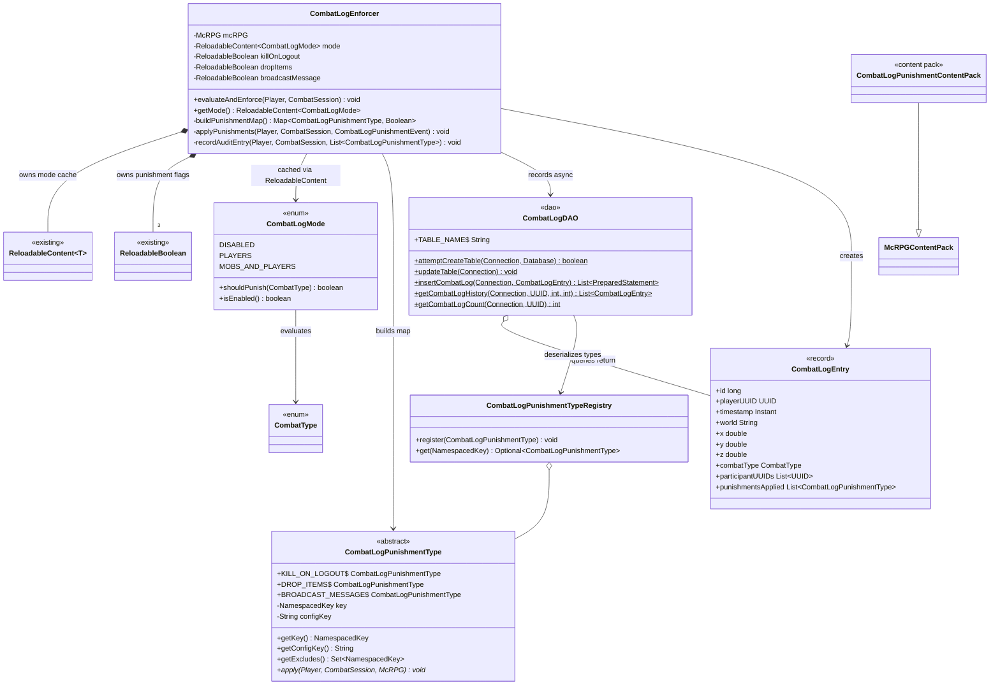
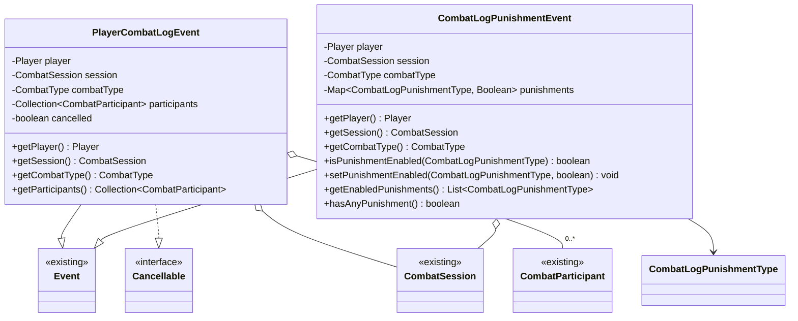
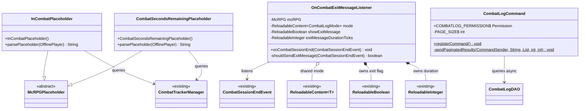
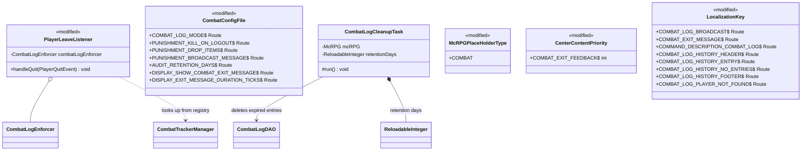

# Phase 3 LLD: Combat Log & Display

> **HLD Reference:** [Combat Tracker & Ramping Frenzy](../../hld/combat/combat-tracker-and-ramping-frenzy.md)
> **Phase 1 Reference:** [Core Combat Session Engine](phase-1-core-combat-session-engine.md)
> **Status:** Implemented
> **Last Updated:** 2026-07-27

---

## Scope

This phase delivers the first built-in policy consumer of the combat session engine — combat log detection and punishment when a player logs out during combat, an audit trail DAO, an admin command for reviewing combat log history, PAPI placeholders for combat state display, and a conditional exit message when combat ends safely. Independent of Phase 2 — uses session lifecycle events and session queries only.

**In scope:**

- `CombatLogMode` — enum: `DISABLED`, `PLAYERS`, `MOBS_AND_PLAYERS`, with `shouldPunish(CombatType)` matching logic
- `CombatLogPunishmentType` — `NamespacedKey`-keyed type representing a category of punishment; built-in constants: `KILL_ON_LOGOUT`, `DROP_ITEMS`, `BROADCAST_MESSAGE`
- `CombatLogPunishmentTypeRegistry` — registry of all registered `CombatLogPunishmentType` instances; extensible via `CombatLogPunishmentContentPack`
- `CombatLogPunishmentContentPack` — content pack for registering third-party punishment types via the `ContentExpansion` system
- `PlayerCombatLogEvent` — cancellable detection event, exempts the player entirely when cancelled
- `CombatLogPunishmentEvent` — policy event with individually togglable punishments
- `CombatLogEntry` — immutable record for audit trail results
- `CombatLogDAO` — static DAO for audit trail persistence (insert, paginated query, count)
- `CombatLogEnforcer` — collaborator that evaluates combat log conditions, fires events, applies punishments, and records audit entries
- `CombatLogCommand` — `/mcrpg combatlog <player> [page]` admin command with paginated history and clickable teleport locations; supports offline players via Paper's async `PlayerProfile` API
- `InCombatPlaceholder` — PAPI placeholder for `%mcrpg_in_combat%` (boolean)
- `CombatSecondsRemainingPlaceholder` — PAPI placeholder for `%mcrpg_combat_seconds_remaining%` (live countdown)
- `OnCombatExitMessageListener` — sends a conditional "no longer in combat" action bar message when combat ends naturally and the server's combat log mode would punish
- `CombatLogCleanupTask` — periodic task that deletes audit trail entries older than a configurable retention period
- `CenterContentPriority.COMBAT_EXIT_FEEDBACK` — new priority constant for combat exit HUD messages
- Modifications to `PlayerLeaveListener` (inject `CombatLogEnforcer`, insert combat log evaluation before `endSession`), `CombatConfigFile` (combat-log, display, and audit retention routes), `combat_configuration.yml` (new sections), `McRPGPlaceHolderType` (COMBAT entry), `LocalizationKey` (combat section), bundled locale YAML (combat messages), `McRPGDatabase` (CombatLogDAO table creation), `McRPGRegistryKey` (COMBAT_LOG_PUNISHMENT_TYPE), `McRPGListenerRegistrar` (register exit message listener, construct enforcer), `McRPGBootstrap` (register CombatLogCommand, start CombatLogCleanupTask)
- Configuration: `combat-log.mode`, `combat-log.punishment.*`, `display.show-combat-exit-message`, `display.exit-message-duration-ticks`

**Out of scope (later phases):**

- Phase 4: Ramping Frenzy ability, resolved frenzy stack state, shed task, Haste application — Phase 3 is independent of Phase 2's state platform

---

## Class Diagrams

### Legend

```
Stereotypes:
  <<interface>>     interface type
  <<abstract>>      abstract class
  <<enum>>          enum type
  <<record>>        record type
  <<content pack>>  McRPGContentPack subclass
  <<config>>        ConfigFile subclass
  <<dao>>           static-method Data Access Object
  <<existing>>      class already exists, not modified
  <<modified>>      class already exists, modified in this phase

Relationships:
  *--    composition (owns lifecycle)
  o--    association (references)
  -->    dependency (uses)
  ..|>   implements
  --|>   extends

Nullability:
  ?      nullable field
```

### Diagram 1: Combat Log Model



### Diagram 2: Events



### Diagram 3: PAPI Placeholders, Exit Message Listener & Command



### Diagram 4: Modified Classes



---

## 1. New Classes

### 1.1 CombatLogMode

**Package:** `us.eunoians.mcrpg.combat.log`
**File:** `src/main/java/us/eunoians/mcrpg/combat/log/CombatLogMode.java`

Enum representing the combat log detection mode. Encapsulates the mode-to-combat-type matching logic so callers never manually check combat type against mode.

```java
package us.eunoians.mcrpg.combat.log;

import org.jetbrains.annotations.NotNull;
import us.eunoians.mcrpg.combat.CombatType;

/**
 * Determines which combat session types trigger combat log detection and punishment
 * when a player disconnects with an active session.
 */
public enum CombatLogMode {

    /**
     * Combat log detection is disabled. No punishment is applied regardless of session state.
     */
    DISABLED,

    /**
     * Only punish if the session's derived type is {@link CombatType#PVP} — at least one
     * player participant in the roster at the time of logout.
     */
    PLAYERS,

    /**
     * Punish for any active combat session regardless of participant types.
     */
    MOBS_AND_PLAYERS;

    /**
     * Evaluates whether this mode would punish a combat log for the given combat type.
     *
     * @param combatType The derived combat type of the session at logout time.
     * @return {@code true} if this mode triggers punishment for the given type.
     */
    public boolean shouldPunish(@NotNull CombatType combatType) {
        return switch (this) {
            case DISABLED -> false;
            case PLAYERS -> combatType == CombatType.PVP;
            case MOBS_AND_PLAYERS -> true;
        };
    }

    /**
     * Checks whether this mode has any detection enabled.
     *
     * @return {@code true} if this mode is not {@link #DISABLED}.
     */
    public boolean isEnabled() {
        return this != DISABLED;
    }
}
```

### 1.2 CombatLogPunishmentType

**Package:** `us.eunoians.mcrpg.combat.log`
**File:** `src/main/java/us/eunoians/mcrpg/combat/log/CombatLogPunishmentType.java`

Abstract base for combat log punishment types. Each type is self-contained: it carries its own `NamespacedKey`, declares which other types it mutually excludes via `getExcludes()`, and implements its punishment behavior in `apply()`. Built-in constants are defined as anonymous subclasses with their logic inlined. Third-party plugins subclass and register additional types via `CombatLogPunishmentContentPack` so their punishments appear in the audit trail alongside built-in ones.

The enforcer resolves mutual exclusions before applying: for each enabled type, any types in its `getExcludes()` set are disabled. Iteration order is insertion order (built-in types first), so `KILL_ON_LOGOUT` excludes `DROP_ITEMS` before `DROP_ITEMS` is evaluated.

```java
package us.eunoians.mcrpg.combat.log;

import net.kyori.adventure.audience.Audience;
import net.kyori.adventure.text.Component;
import org.bukkit.Bukkit;
import org.bukkit.Location;
import org.bukkit.NamespacedKey;
import org.bukkit.entity.Player;
import org.bukkit.inventory.ItemStack;
import org.jetbrains.annotations.NotNull;
import us.eunoians.mcrpg.McRPG;
import us.eunoians.mcrpg.combat.CombatSession;
import us.eunoians.mcrpg.configuration.file.localization.LocalizationKey;
import us.eunoians.mcrpg.registry.manager.McRPGManagerKey;
import us.eunoians.mcrpg.util.McRPGMethods;

import com.diamonddagger590.mccore.registry.RegistryKey;

import java.util.Map;
import java.util.Set;

/**
 * Abstract base for a punishment applied when a player combat logs. Each type
 * carries a {@link NamespacedKey} for serialization/registry lookup, declares
 * mutually exclusive types via {@link #getExcludes()}, and implements its
 * punishment behavior in {@link #apply(Player, CombatSession, McRPG)}.
 * <p>
 * Built-in types are defined as static constants with inlined behavior.
 * Third-party plugins subclass this and register via
 * {@link us.eunoians.mcrpg.expansion.content.CombatLogPunishmentContentPack}.
 */
public abstract class CombatLogPunishmentType {

    /**
     * Kill the player on logout. Sets health to zero, triggering normal death
     * mechanics (item drops, XP loss, death message). Excludes {@link #DROP_ITEMS}
     * because death already handles item drops.
     */
    public static final CombatLogPunishmentType KILL_ON_LOGOUT = new CombatLogPunishmentType(
            new NamespacedKey(McRPGMethods.getMcRPGNamespace(), "kill_on_logout"),
            "kill-on-logout") {

        @Override
        @NotNull
        public Set<NamespacedKey> getExcludes() {
            return Set.of(DROP_ITEMS.getKey());
        }

        @Override
        public void apply(@NotNull Player player, @NotNull CombatSession session,
                          @NotNull McRPG mcRPG) {
            player.setHealth(0);
        }
    };

    /**
     * Drop the player's inventory at their logout location. Mutually excluded
     * by {@link #KILL_ON_LOGOUT} — death already drops items.
     */
    public static final CombatLogPunishmentType DROP_ITEMS = new CombatLogPunishmentType(
            new NamespacedKey(McRPGMethods.getMcRPGNamespace(), "drop_items"),
            "drop-items") {

        @Override
        public void apply(@NotNull Player player, @NotNull CombatSession session,
                          @NotNull McRPG mcRPG) {
            Location location = player.getLocation();
            for (ItemStack item : player.getInventory().getContents()) {
                if (item != null && !item.getType().isAir()) {
                    location.getWorld().dropItemNaturally(location, item);
                }
            }
            player.getInventory().clear();
        }
    };

    /**
     * Announce the combat log to every online player and the console. Delegates to
     * {@link McRPGLocalizationManager#broadcastMessage(Route, Map)} so each recipient's
     * message is resolved against their own locale chain.
     */
    public static final CombatLogPunishmentType BROADCAST_MESSAGE = new CombatLogPunishmentType(
            new NamespacedKey(McRPGMethods.getMcRPGNamespace(), "broadcast_message"),
            "broadcast-message") {

        @Override
        public void apply(@NotNull Player player, @NotNull CombatSession session,
                          @NotNull McRPG mcRPG) {
            var localizationManager = mcRPG.registryAccess().registry(RegistryKey.MANAGER)
                    .manager(McRPGManagerKey.LOCALIZATION);
            Location loc = player.getLocation();
            localizationManager.broadcastMessage(LocalizationKey.COMBAT_LOG_BROADCAST, Map.of(
                    "player", player.getName(),
                    "world", loc.getWorld().getName(),
                    "x", String.valueOf((int) loc.getX()),
                    "y", String.valueOf((int) loc.getY()),
                    "z", String.valueOf((int) loc.getZ())
            ));
        }
    };

    private final NamespacedKey key;
    private final String configKey;

    /**
     * Constructs a new {@link CombatLogPunishmentType}.
     *
     * @param key       The unique key identifying this punishment type.
     * @param configKey The YAML config key for this type's enabled/disabled state.
     */
    protected CombatLogPunishmentType(@NotNull NamespacedKey key, @NotNull String configKey) {
        this.key = key;
        this.configKey = configKey;
    }

    /**
     * Gets the unique key identifying this punishment type.
     *
     * @return The {@link NamespacedKey}.
     */
    @NotNull
    public NamespacedKey getKey() {
        return key;
    }

    /**
     * Gets the YAML config key for this punishment type.
     *
     * @return The config key string.
     */
    @NotNull
    public String getConfigKey() {
        return configKey;
    }

    /**
     * Gets the set of punishment type keys that are mutually exclusive with this
     * type. When this type is enabled, any types whose keys appear in this set
     * are automatically disabled by the enforcer before application.
     * <p>
     * Default implementation returns an empty set (no exclusions).
     *
     * @return An unmodifiable set of excluded {@link NamespacedKey}s.
     */
    @NotNull
    public Set<NamespacedKey> getExcludes() {
        return Set.of();
    }

    /**
     * Applies this punishment to the player. Called by the enforcer after
     * mutual exclusion resolution — only types that survived exclusion are applied.
     *
     * @param player  The player being punished.
     * @param session The player's active combat session.
     * @param mcRPG   The plugin instance for registry access.
     */
    public abstract void apply(@NotNull Player player, @NotNull CombatSession session,
                               @NotNull McRPG mcRPG);

    @Override
    public boolean equals(Object o) {
        if (this == o) return true;
        if (!(o instanceof CombatLogPunishmentType other)) return false;
        return key.equals(other.key);
    }

    @Override
    public int hashCode() {
        return key.hashCode();
    }

    @Override
    public String toString() {
        return key.toString();
    }
}
```

### 1.2a CombatLogPunishmentTypeRegistry

**Package:** `us.eunoians.mcrpg.combat.log`
**File:** `src/main/java/us/eunoians/mcrpg/combat/log/CombatLogPunishmentTypeRegistry.java`

Registry for all registered `CombatLogPunishmentType` instances. Keyed by `NamespacedKey`. Built-in types are registered during `McRPGExpansion` processing; third-party types are added via `CombatLogPunishmentContentPack`.

```java
package us.eunoians.mcrpg.combat.log;

import com.diamonddagger590.mccore.registry.Registry;
import org.bukkit.NamespacedKey;
import org.jetbrains.annotations.NotNull;

import java.util.Optional;

/**
 * Registry of all registered {@link CombatLogPunishmentType} instances.
 * Supports lookup by {@link NamespacedKey} for deserialization of audit trail entries.
 */
public class CombatLogPunishmentTypeRegistry extends Registry<NamespacedKey, CombatLogPunishmentType> {

    /**
     * Registers a {@link CombatLogPunishmentType}.
     *
     * @param punishmentType The punishment type to register.
     */
    public void register(@NotNull CombatLogPunishmentType punishmentType) {
        register(punishmentType.getKey(), punishmentType);
    }

    /**
     * Looks up a {@link CombatLogPunishmentType} by its {@link NamespacedKey}.
     *
     * @param key The key to look up.
     * @return An {@link Optional} containing the type if registered.
     */
    @NotNull
    public Optional<CombatLogPunishmentType> get(@NotNull NamespacedKey key) {
        return Optional.ofNullable(getRegisteredObject(key));
    }
}
```

### 1.2b CombatLogPunishmentContentPack

**Package:** `us.eunoians.mcrpg.expansion.content`
**File:** `src/main/java/us/eunoians/mcrpg/expansion/content/CombatLogPunishmentContentPack.java`

Content pack for registering `CombatLogPunishmentType` implementations via the `ContentExpansion` system.

```java
package us.eunoians.mcrpg.expansion.content;

import org.jetbrains.annotations.NotNull;
import us.eunoians.mcrpg.combat.log.CombatLogPunishmentType;
import us.eunoians.mcrpg.expansion.ContentExpansion;

/**
 * Content pack for registering {@link CombatLogPunishmentType} implementations via the
 * {@link ContentExpansion} system.
 */
public class CombatLogPunishmentContentPack extends McRPGContentPack<CombatLogPunishmentType> {

    /**
     * Constructs a new {@link CombatLogPunishmentContentPack}.
     *
     * @param contentExpansion The {@link ContentExpansion} providing this content.
     */
    public CombatLogPunishmentContentPack(@NotNull ContentExpansion contentExpansion) {
        super(contentExpansion);
    }
}
```

### 1.3 CombatLogEntry

**Package:** `us.eunoians.mcrpg.combat.log`
**File:** `src/main/java/us/eunoians/mcrpg/combat/log/CombatLogEntry.java`

Immutable record representing a single combat log audit trail entry. Used as the return type from `CombatLogDAO` queries and as the insert parameter.

```java
package us.eunoians.mcrpg.combat.log;

import org.jetbrains.annotations.NotNull;
import us.eunoians.mcrpg.combat.CombatType;

import java.time.Instant;
import java.util.List;
import java.util.UUID;

/**
 * Immutable audit trail entry for a combat log incident. The {@code id} field is
 * populated by the database on insert (auto-increment); callers creating entries
 * for insertion pass {@code 0} as the id.
 *
 * @param id                  The auto-increment primary key (0 for new entries).
 * @param playerUUID          The UUID of the player who combat logged.
 * @param timestamp           When the logout occurred.
 * @param world               The world name at time of logout.
 * @param x                   X coordinate at time of logout.
 * @param y                   Y coordinate at time of logout.
 * @param z                   Z coordinate at time of logout.
 * @param combatType          The derived session type at time of logout.
 * @param participantUUIDs    UUIDs of participants in the session at time of logout.
 * @param punishmentsApplied  Punishment types that were applied.
 */
public record CombatLogEntry(
        long id,
        @NotNull UUID playerUUID,
        @NotNull Instant timestamp,
        @NotNull String world,
        double x,
        double y,
        double z,
        @NotNull CombatType combatType,
        @NotNull List<UUID> participantUUIDs,
        @NotNull List<CombatLogPunishmentType> punishmentsApplied
) {

    /**
     * Compact constructor — defensively copies the mutable lists.
     */
    public CombatLogEntry {
        participantUUIDs = List.copyOf(participantUUIDs);
        punishmentsApplied = List.copyOf(punishmentsApplied);
    }
}
```

### 1.4 PlayerCombatLogEvent

**Package:** `us.eunoians.mcrpg.event.combat`
**File:** `src/main/java/us/eunoians/mcrpg/event/combat/PlayerCombatLogEvent.java`

Cancellable Bukkit event fired when a player is detected as combat logging. Cancelling this event exempts the player from all punishment — used by vanish plugins, staff exemptions, and similar integrations.

```java
package us.eunoians.mcrpg.event.combat;

import org.bukkit.entity.Player;
import org.bukkit.event.Cancellable;
import org.bukkit.event.Event;
import org.bukkit.event.HandlerList;
import org.jetbrains.annotations.NotNull;
import us.eunoians.mcrpg.combat.CombatParticipant;
import us.eunoians.mcrpg.combat.CombatSession;
import us.eunoians.mcrpg.combat.CombatType;

import java.util.Collection;
import java.util.Collections;

/**
 * Fired when a player disconnects with an active combat session and the server's
 * combat log mode matches the session's combat type. Cancelling this event
 * exempts the player entirely — no punishments are evaluated or applied.
 */
public class PlayerCombatLogEvent extends Event implements Cancellable {

    private static final HandlerList HANDLER_LIST = new HandlerList();

    private final Player player;
    private final CombatSession session;
    private final CombatType combatType;
    private final Collection<CombatParticipant> participants;
    private boolean cancelled;

    /**
     * Constructs a new {@link PlayerCombatLogEvent}.
     *
     * @param player       The player who is combat logging.
     * @param session      The player's active combat session.
     * @param combatType   The derived combat type of the session at logout time.
     * @param participants The participant roster at logout time.
     */
    public PlayerCombatLogEvent(@NotNull Player player, @NotNull CombatSession session,
                                @NotNull CombatType combatType,
                                @NotNull Collection<CombatParticipant> participants) {
        this.player = player;
        this.session = session;
        this.combatType = combatType;
        this.participants = Collections.unmodifiableCollection(participants);
        this.cancelled = false;
    }

    /**
     * Gets the player who is combat logging.
     *
     * @return The {@link Player}.
     */
    @NotNull
    public Player getPlayer() {
        return player;
    }

    /**
     * Gets the player's active combat session.
     *
     * @return The {@link CombatSession}.
     */
    @NotNull
    public CombatSession getSession() {
        return session;
    }

    /**
     * Gets the derived combat type of the session at logout time.
     *
     * @return The {@link CombatType}.
     */
    @NotNull
    public CombatType getCombatType() {
        return combatType;
    }

    /**
     * Gets the participant roster at logout time.
     *
     * @return An unmodifiable collection of {@link CombatParticipant}s.
     */
    @NotNull
    public Collection<CombatParticipant> getParticipants() {
        return participants;
    }

    @Override
    public boolean isCancelled() {
        return cancelled;
    }

    @Override
    public void setCancelled(boolean cancelled) {
        this.cancelled = cancelled;
    }

    @NotNull
    @Override
    public HandlerList getHandlers() {
        return HANDLER_LIST;
    }

    /**
     * Gets the static handler list for this event type.
     *
     * @return The {@link HandlerList}.
     */
    @NotNull
    public static HandlerList getHandlerList() {
        return HANDLER_LIST;
    }
}
```

### 1.5 CombatLogPunishmentEvent

**Package:** `us.eunoians.mcrpg.event.combat`
**File:** `src/main/java/us/eunoians/mcrpg/event/combat/CombatLogPunishmentEvent.java`

Bukkit event fired after combat log detection passes (not cancelled). Individual punishments can be enabled or disabled by listeners. If all punishments are disabled, no punishment is applied. The event is not globally cancellable — use `PlayerCombatLogEvent` to exempt a player entirely.

```java
package us.eunoians.mcrpg.event.combat;

import org.bukkit.entity.Player;
import org.bukkit.event.Event;
import org.bukkit.event.HandlerList;
import org.jetbrains.annotations.NotNull;
import us.eunoians.mcrpg.combat.CombatSession;
import us.eunoians.mcrpg.combat.CombatType;
import us.eunoians.mcrpg.combat.log.CombatLogPunishmentType;

import java.util.ArrayList;
import java.util.LinkedHashMap;
import java.util.List;
import java.util.Map;

/**
 * Fired after {@link PlayerCombatLogEvent} passes (not cancelled). Carries the
 * punishment map — each registered punishment type is individually togglable by
 * listeners. Third-party plugins can register custom punishment types via
 * {@link us.eunoians.mcrpg.expansion.content.CombatLogPunishmentContentPack} and
 * add entries to this map in a listener at {@code EventPriority.NORMAL} — the
 * enforcer reads the final map at {@code MONITOR}.
 * <p>
 * This event is not globally cancellable. To exempt a player entirely, cancel
 * {@link PlayerCombatLogEvent} instead.
 */
public class CombatLogPunishmentEvent extends Event {

    private static final HandlerList HANDLER_LIST = new HandlerList();

    private final Player player;
    private final CombatSession session;
    private final CombatType combatType;
    private final Map<CombatLogPunishmentType, Boolean> punishments;

    /**
     * Constructs a new {@link CombatLogPunishmentEvent}.
     *
     * @param player      The player who combat logged.
     * @param session     The player's active combat session.
     * @param combatType  The derived combat type at logout time.
     * @param punishments The initial punishment map, populated from configuration.
     */
    public CombatLogPunishmentEvent(@NotNull Player player, @NotNull CombatSession session,
                                    @NotNull CombatType combatType,
                                    @NotNull Map<CombatLogPunishmentType, Boolean> punishments) {
        this.player = player;
        this.session = session;
        this.combatType = combatType;
        this.punishments = new LinkedHashMap<>(punishments);
    }

    /**
     * Gets the player who combat logged.
     *
     * @return The {@link Player}.
     */
    @NotNull
    public Player getPlayer() {
        return player;
    }

    /**
     * Gets the player's active combat session.
     *
     * @return The {@link CombatSession}.
     */
    @NotNull
    public CombatSession getSession() {
        return session;
    }

    /**
     * Gets the derived combat type at logout time.
     *
     * @return The {@link CombatType}.
     */
    @NotNull
    public CombatType getCombatType() {
        return combatType;
    }

    /**
     * Checks whether a specific punishment type is enabled.
     *
     * @param type The punishment type to check.
     * @return {@code true} if the punishment is enabled.
     */
    public boolean isPunishmentEnabled(@NotNull CombatLogPunishmentType type) {
        return punishments.getOrDefault(type, false);
    }

    /**
     * Enables or disables a specific punishment type.
     *
     * @param type    The punishment type to modify.
     * @param enabled {@code true} to enable, {@code false} to disable.
     */
    public void setPunishmentEnabled(@NotNull CombatLogPunishmentType type, boolean enabled) {
        punishments.put(type, enabled);
    }

    /**
     * Gets all punishment types that are currently enabled.
     *
     * @return A list of enabled {@link CombatLogPunishmentType}s.
     */
    @NotNull
    public List<CombatLogPunishmentType> getEnabledPunishments() {
        List<CombatLogPunishmentType> enabled = new ArrayList<>();
        for (Map.Entry<CombatLogPunishmentType, Boolean> entry : punishments.entrySet()) {
            if (entry.getValue()) {
                enabled.add(entry.getKey());
            }
        }
        return enabled;
    }

    /**
     * Checks whether any punishment is still enabled. If all punishments have been
     * disabled by listeners, no punishment is applied.
     *
     * @return {@code true} if at least one punishment is enabled.
     */
    public boolean hasAnyPunishment() {
        return punishments.containsValue(true);
    }

    @NotNull
    @Override
    public HandlerList getHandlers() {
        return HANDLER_LIST;
    }

    /**
     * Gets the static handler list for this event type.
     *
     * @return The {@link HandlerList}.
     */
    @NotNull
    public static HandlerList getHandlerList() {
        return HANDLER_LIST;
    }
}
```

### 1.6 CombatLogDAO

**Package:** `us.eunoians.mcrpg.database.table`
**File:** `src/main/java/us/eunoians/mcrpg/database/table/CombatLogDAO.java`

Static DAO for combat log audit trail persistence. Follows the same pattern as `CombatPersistentStateDAO` — `final` class, private constructor, static methods, `Connection` as first argument.

```java
package us.eunoians.mcrpg.database.table;

import com.diamonddagger590.mccore.database.Database;
import org.bukkit.NamespacedKey;
import org.jetbrains.annotations.NotNull;
import us.eunoians.mcrpg.McRPG;
import us.eunoians.mcrpg.combat.CombatType;
import us.eunoians.mcrpg.combat.log.CombatLogEntry;
import us.eunoians.mcrpg.combat.log.CombatLogPunishmentType;
import us.eunoians.mcrpg.combat.log.CombatLogPunishmentTypeRegistry;
import us.eunoians.mcrpg.registry.plugin.McRPGRegistryKey;

import java.sql.Connection;
import java.sql.PreparedStatement;
import java.sql.ResultSet;
import java.sql.SQLException;
import java.sql.Timestamp;
import java.time.Instant;
import java.util.ArrayList;
import java.util.Arrays;
import java.util.Collections;
import java.util.List;
import java.util.Optional;
import java.util.UUID;
import java.util.logging.Level;
import java.util.stream.Collectors;

/**
 * Data Access Object for combat log audit trail persistence. Each record stores
 * who combat logged, when, where, the session's combat type, participants, and
 * which punishments were applied.
 */
public final class CombatLogDAO {

    public static final String TABLE_NAME = "combat_log";
    private static final int CURRENT_TABLE_VERSION = 1;

    private CombatLogDAO() {
    }

    /**
     * Creates the combat log table if it does not exist.
     *
     * @param connection The database connection.
     * @param database   The database instance for driver-specific SQL.
     * @return {@code true} if the table was created or already existed.
     */
    public static boolean attemptCreateTable(@NotNull Connection connection, @NotNull Database database) {
        String sql = "CREATE TABLE IF NOT EXISTS " + TABLE_NAME + " ("
                + "id BIGINT AUTO_INCREMENT PRIMARY KEY, "
                + "player_uuid VARCHAR(36) NOT NULL, "
                + "timestamp TIMESTAMP DEFAULT CURRENT_TIMESTAMP, "
                + "world VARCHAR(64) NOT NULL, "
                + "x DOUBLE NOT NULL, "
                + "y DOUBLE NOT NULL, "
                + "z DOUBLE NOT NULL, "
                + "combat_type VARCHAR(16) NOT NULL, "
                + "participant_uuids TEXT NOT NULL, "
                + "punishments_applied VARCHAR(255) NOT NULL"
                + ")";
        try (PreparedStatement statement = connection.prepareStatement(sql)) {
            statement.executeUpdate();
            return true;
        }
        catch (SQLException e) {
            McRPG.getInstance().getLogger().log(Level.SEVERE,
                    "Failed to create " + TABLE_NAME + " table", e);
            return false;
        }
    }

    /**
     * Updates the combat log table schema if needed. No-op for version 1.
     *
     * @param connection The database connection.
     */
    public static void updateTable(@NotNull Connection connection) {
        // No updates needed for version 1
    }

    /**
     * Creates a prepared statement for inserting a combat log entry.
     *
     * @param connection The database connection.
     * @param entry      The combat log entry to insert.
     * @return A list containing the prepared insert statement.
     * @throws SQLException If statement creation fails.
     */
    @NotNull
    public static List<PreparedStatement> insertCombatLog(@NotNull Connection connection,
                                                          @NotNull CombatLogEntry entry) throws SQLException {
        String sql = "INSERT INTO " + TABLE_NAME
                + " (player_uuid, timestamp, world, x, y, z, combat_type, participant_uuids, punishments_applied)"
                + " VALUES (?, ?, ?, ?, ?, ?, ?, ?, ?)";
        PreparedStatement statement = connection.prepareStatement(sql);
        statement.setString(1, entry.playerUUID().toString());
        statement.setTimestamp(2, Timestamp.from(entry.timestamp()));
        statement.setString(3, entry.world());
        statement.setDouble(4, entry.x());
        statement.setDouble(5, entry.y());
        statement.setDouble(6, entry.z());
        statement.setString(7, entry.combatType().name());
        statement.setString(8, entry.participantUUIDs().stream()
                .map(UUID::toString)
                .collect(Collectors.joining(",")));
        statement.setString(9, entry.punishmentsApplied().stream()
                .map(type -> type.getKey().toString())
                .collect(Collectors.joining(",")));
        return List.of(statement);
    }

    /**
     * Queries paginated combat log history for a player.
     *
     * @param connection The database connection.
     * @param playerUUID The UUID of the player to query.
     * @param page       The page number (1-indexed).
     * @param pageSize   The number of entries per page.
     * @return A list of combat log entries, newest first.
     */
    @NotNull
    public static List<CombatLogEntry> getCombatLogHistory(@NotNull Connection connection,
                                                           @NotNull UUID playerUUID,
                                                           int page, int pageSize) {
        String sql = "SELECT id, player_uuid, timestamp, world, x, y, z, combat_type, "
                + "participant_uuids, punishments_applied FROM " + TABLE_NAME
                + " WHERE player_uuid = ? ORDER BY timestamp DESC LIMIT ? OFFSET ?";
        List<CombatLogEntry> entries = new ArrayList<>();
        try (PreparedStatement statement = connection.prepareStatement(sql)) {
            statement.setString(1, playerUUID.toString());
            statement.setInt(2, pageSize);
            statement.setInt(3, (page - 1) * pageSize);
            try (ResultSet rs = statement.executeQuery()) {
                while (rs.next()) {
                    entries.add(parseEntry(rs));
                }
            }
        }
        catch (SQLException e) {
            McRPG.getInstance().getLogger().log(Level.WARNING,
                    "Failed to query combat log history for " + playerUUID, e);
        }
        return entries;
    }

    /**
     * Counts the total number of combat log entries for a player.
     *
     * @param connection The database connection.
     * @param playerUUID The UUID of the player to count.
     * @return The total entry count.
     */
    public static int getCombatLogCount(@NotNull Connection connection, @NotNull UUID playerUUID) {
        String sql = "SELECT COUNT(*) FROM " + TABLE_NAME + " WHERE player_uuid = ?";
        try (PreparedStatement statement = connection.prepareStatement(sql)) {
            statement.setString(1, playerUUID.toString());
            try (ResultSet rs = statement.executeQuery()) {
                if (rs.next()) {
                    return rs.getInt(1);
                }
            }
        }
        catch (SQLException e) {
            McRPG.getInstance().getLogger().log(Level.WARNING,
                    "Failed to count combat log entries for " + playerUUID, e);
        }
        return 0;
    }

    /**
     * Parses a {@link CombatLogEntry} from a result set row.
     *
     * @param rs The result set positioned at the current row.
     * @return The parsed entry.
     * @throws SQLException If column reading fails.
     */
    @NotNull
    private static CombatLogEntry parseEntry(@NotNull ResultSet rs) throws SQLException {
        String participantString = rs.getString("participant_uuids");
        List<UUID> participantUUIDs = participantString.isEmpty()
                ? Collections.emptyList()
                : Arrays.stream(participantString.split(","))
                        .map(UUID::fromString)
                        .toList();

        String punishmentString = rs.getString("punishments_applied");
        CombatLogPunishmentTypeRegistry punishmentRegistry = McRPG.getInstance().registryAccess()
                .registry(McRPGRegistryKey.COMBAT_LOG_PUNISHMENT_TYPE);
        List<CombatLogPunishmentType> punishments = punishmentString.isEmpty()
                ? Collections.emptyList()
                : Arrays.stream(punishmentString.split(","))
                        .map(NamespacedKey::fromString)
                        .map(punishmentRegistry::get)
                        .filter(Optional::isPresent)
                        .map(Optional::get)
                        .toList();

        return new CombatLogEntry(
                rs.getLong("id"),
                UUID.fromString(rs.getString("player_uuid")),
                rs.getTimestamp("timestamp").toInstant(),
                rs.getString("world"),
                rs.getDouble("x"),
                rs.getDouble("y"),
                rs.getDouble("z"),
                CombatType.valueOf(rs.getString("combat_type")),
                participantUUIDs,
                punishments
        );
    }

    /**
     * Deletes combat log entries older than the given cutoff timestamp.
     *
     * @param connection The database connection.
     * @param cutoff     Entries with a timestamp before this instant are deleted.
     * @return The number of rows deleted.
     */
    public static int deleteOlderThan(@NotNull Connection connection, @NotNull Instant cutoff) {
        String sql = "DELETE FROM " + TABLE_NAME + " WHERE timestamp < ?";
        try (PreparedStatement statement = connection.prepareStatement(sql)) {
            statement.setTimestamp(1, Timestamp.from(cutoff));
            return statement.executeUpdate();
        }
        catch (SQLException e) {
            McRPG.getInstance().getLogger().log(Level.WARNING,
                    "Failed to delete expired combat log entries", e);
            return 0;
        }
    }
}
```

### 1.6a CombatLogCleanupTask

**Package:** `us.eunoians.mcrpg.task.combat`
**File:** `src/main/java/us/eunoians/mcrpg/task/combat/CombatLogCleanupTask.java`

Periodic task that deletes audit trail entries older than a configurable retention period. Runs on the database executor to avoid blocking the main thread. The retention duration is cached via a `ReloadableInteger` (in days). A value of `0` or negative disables cleanup entirely.

Cleanup runs **once immediately at startup** (so servers that restart frequently still clean up) and then repeats every 24 hours for long-running servers.

```java
package us.eunoians.mcrpg.task.combat;

import com.diamonddagger590.mccore.configuration.common.ReloadableInteger;
import com.diamonddagger590.mccore.registry.RegistryKey;
import com.diamonddagger590.mccore.registry.manager.ManagerKey;
import com.diamonddagger590.mccore.task.DelayableCoreTask;
import org.jetbrains.annotations.NotNull;
import us.eunoians.mcrpg.McRPG;
import us.eunoians.mcrpg.configuration.file.CombatConfigFile;
import us.eunoians.mcrpg.configuration.file.FileType;
import us.eunoians.mcrpg.database.table.CombatLogDAO;
import us.eunoians.mcrpg.registry.manager.McRPGManagerKey;

import java.sql.Connection;
import java.time.Instant;
import java.time.temporal.ChronoUnit;
import java.util.Set;
import java.util.logging.Level;

/**
 * Periodic task that deletes combat log audit trail entries older than the
 * configured retention period. Performs an initial cleanup on startup (so
 * servers that restart frequently still clean up), then repeats every 24 hours.
 * A retention value of {@code 0} or negative disables cleanup.
 */
public class CombatLogCleanupTask extends DelayableCoreTask {

    private static final long RUN_INTERVAL_SECONDS = 86400;

    private final McRPG mcRPG;
    private final ReloadableInteger retentionDays;

    /**
     * Constructs a new {@link CombatLogCleanupTask}.
     *
     * @param mcRPG The plugin instance.
     */
    public CombatLogCleanupTask(@NotNull McRPG mcRPG) {
        super(mcRPG, RUN_INTERVAL_SECONDS);
        this.mcRPG = mcRPG;
        var config = mcRPG.registryAccess().registry(RegistryKey.MANAGER)
                .manager(McRPGManagerKey.FILE)
                .getFile(FileType.COMBAT_CONFIG);
        this.retentionDays = new ReloadableInteger(config,
                CombatConfigFile.AUDIT_RETENTION_DAYS);
        mcRPG.registryAccess().registry(RegistryKey.MANAGER)
                .manager(ManagerKey.RELOADABLE_CONTENT)
                .trackReloadableContent(Set.of(retentionDays));
    }

    /**
     * Performs the initial cleanup at startup. Called once after database
     * initialization, before the periodic schedule begins.
     */
    public void runInitialCleanup() {
        performCleanup();
    }

    @Override
    protected void run() {
        performCleanup();
    }

    /**
     * Submits the retention-based delete to the database executor.
     */
    private void performCleanup() {
        int days = retentionDays.getContent();
        if (days <= 0) {
            return;
        }

        Instant cutoff = Instant.now().minus(days, ChronoUnit.DAYS);
        var database = mcRPG.registryAccess().registry(RegistryKey.MANAGER)
                .manager(McRPGManagerKey.DATABASE);
        database.getDatabaseExecutorService().submit(() -> {
            try (Connection conn = database.getConnection()) {
                int deleted = CombatLogDAO.deleteOlderThan(conn, cutoff);
                if (deleted > 0) {
                    mcRPG.getLogger().info("Cleaned up " + deleted
                            + " combat log entries older than " + days + " days");
                }
            }
            catch (Exception e) {
                mcRPG.getLogger().log(Level.WARNING,
                        "Failed to clean up expired combat log entries", e);
            }
        });
    }
}
```

### 1.7 CombatLogEnforcer

**Package:** `us.eunoians.mcrpg.combat.log`
**File:** `src/main/java/us/eunoians/mcrpg/combat/log/CombatLogEnforcer.java`

Collaborator that encapsulates combat log policy evaluation and punishment application. Injected into `PlayerLeaveListener` and called before `endSession()` while the session is still alive. Configuration values are cached via McCore's `ReloadableContent` / `ReloadableBoolean` abstractions and refreshed automatically on `/mcrpg admin reload`. The enforcer owns the canonical `ReloadableContent<CombatLogMode>` instance — the exit message listener shares it via `getMode()` so both sites use a single cached parse (see D12).

```java
package us.eunoians.mcrpg.combat.log;

import com.diamonddagger590.mccore.configuration.ReloadableContent;
import com.diamonddagger590.mccore.configuration.common.ReloadableBoolean;
import com.diamonddagger590.mccore.database.transaction.BatchTransaction;
import com.diamonddagger590.mccore.registry.RegistryKey;
import com.diamonddagger590.mccore.registry.manager.ManagerKey;
import org.bukkit.Bukkit;
import org.bukkit.Location;
import org.bukkit.NamespacedKey;
import org.bukkit.entity.Player;
import org.jetbrains.annotations.NotNull;
import us.eunoians.mcrpg.McRPG;
import us.eunoians.mcrpg.combat.CombatParticipant;
import us.eunoians.mcrpg.combat.CombatSession;
import us.eunoians.mcrpg.combat.CombatType;
import us.eunoians.mcrpg.configuration.file.CombatConfigFile;
import us.eunoians.mcrpg.configuration.file.FileType;
import us.eunoians.mcrpg.database.table.CombatLogDAO;
import us.eunoians.mcrpg.event.combat.CombatLogPunishmentEvent;
import us.eunoians.mcrpg.event.combat.PlayerCombatLogEvent;
import us.eunoians.mcrpg.registry.manager.McRPGManagerKey;

import java.sql.Connection;
import java.time.Instant;
import java.util.Collection;
import java.util.HashSet;
import java.util.LinkedHashMap;
import java.util.List;
import java.util.Map;
import java.util.Set;
import java.util.UUID;
import java.util.logging.Level;
import java.util.stream.Collectors;

/**
 * Evaluates whether a player's logout qualifies as a combat log and applies the
 * configured punishments. Called from {@link us.eunoians.mcrpg.listener.entity.player.PlayerLeaveListener}
 * before the session is ended, so the session is still alive and queryable.
 * <p>
 * All configuration reads are cached via {@link ReloadableContent} / {@link ReloadableBoolean}
 * and refreshed automatically when {@code /mcrpg admin reload} calls
 * {@link com.diamonddagger590.mccore.configuration.ReloadableContentManager#reloadAllContent()}.
 */
public class CombatLogEnforcer {

    private final McRPG mcRPG;
    private final ReloadableContent<CombatLogMode> mode;
    private final ReloadableBoolean killOnLogout;
    private final ReloadableBoolean dropItems;
    private final ReloadableBoolean broadcastMessage;

    /**
     * Constructs a new {@link CombatLogEnforcer}. Initializes reloadable config
     * fields and registers them with the {@link com.diamonddagger590.mccore.configuration.ReloadableContentManager}.
     *
     * @param mcRPG The plugin instance for config access, localization, and database access.
     */
    public CombatLogEnforcer(@NotNull McRPG mcRPG) {
        this.mcRPG = mcRPG;

        var config = mcRPG.registryAccess().registry(RegistryKey.MANAGER)
                .manager(McRPGManagerKey.FILE)
                .getFile(FileType.COMBAT_CONFIG);

        this.mode = new ReloadableContent<>(config, CombatConfigFile.COMBAT_LOG_MODE,
                (yaml, route) -> {
                    String modeString = yaml.getString(route, "DISABLED");
                    try {
                        return CombatLogMode.valueOf(modeString.toUpperCase());
                    }
                    catch (IllegalArgumentException e) {
                        mcRPG.getLogger().warning("Unknown combat-log mode '" + modeString
                                + "' in combat_configuration.yml, defaulting to DISABLED");
                        return CombatLogMode.DISABLED;
                    }
                });
        this.killOnLogout = new ReloadableBoolean(config, CombatConfigFile.PUNISHMENT_KILL_ON_LOGOUT);
        this.dropItems = new ReloadableBoolean(config, CombatConfigFile.PUNISHMENT_DROP_ITEMS);
        this.broadcastMessage = new ReloadableBoolean(config, CombatConfigFile.PUNISHMENT_BROADCAST_MESSAGE);

        mcRPG.registryAccess().registry(RegistryKey.MANAGER)
                .manager(ManagerKey.RELOADABLE_CONTENT)
                .trackReloadableContent(Set.of(mode, killOnLogout, dropItems, broadcastMessage));
    }

    /**
     * Gets the shared {@link ReloadableContent} for the combat log mode. Exposed so
     * that {@link us.eunoians.mcrpg.listener.combat.OnCombatExitMessageListener}
     * can read the same cached mode without duplicating the parse logic.
     *
     * @return The reloadable combat log mode.
     */
    @NotNull
    public ReloadableContent<CombatLogMode> getMode() {
        return mode;
    }

    /**
     * Evaluates whether the player's logout with the given active session constitutes
     * a combat log, and if so, fires the detection and punishment events, applies
     * surviving punishments, and records an audit trail entry.
     * <p>
     * Must be called on the main thread while the session is still active (before
     * {@code endSession}).
     *
     * @param player  The player who is logging out.
     * @param session The player's active combat session.
     */
    public void evaluateAndEnforce(@NotNull Player player, @NotNull CombatSession session) {
        CombatLogMode currentMode = mode.getContent();
        CombatType combatType = session.getCombatType();

        if (!currentMode.shouldPunish(combatType)) {
            return;
        }

        Collection<CombatParticipant> participants = session.getParticipants();

        // Detection event — cancellable
        PlayerCombatLogEvent logEvent = new PlayerCombatLogEvent(player, session, combatType, participants);
        Bukkit.getPluginManager().callEvent(logEvent);
        if (logEvent.isCancelled()) {
            return;
        }

        // Punishment event — individually togglable
        Map<CombatLogPunishmentType, Boolean> punishmentMap = buildPunishmentMap();
        CombatLogPunishmentEvent punishmentEvent =
                new CombatLogPunishmentEvent(player, session, combatType, punishmentMap);
        Bukkit.getPluginManager().callEvent(punishmentEvent);

        if (!punishmentEvent.hasAnyPunishment()) {
            return;
        }

        List<CombatLogPunishmentType> appliedPunishments = punishmentEvent.getEnabledPunishments();
        applyPunishments(player, session, punishmentEvent);
        recordAuditEntry(player, session, combatType, participants, appliedPunishments);
    }

    /**
     * Builds the initial punishment map from cached reloadable config fields.
     *
     * @return A map of punishment types to their configured enabled state.
     */
    @NotNull
    private Map<CombatLogPunishmentType, Boolean> buildPunishmentMap() {
        Map<CombatLogPunishmentType, Boolean> map = new LinkedHashMap<>();
        map.put(CombatLogPunishmentType.KILL_ON_LOGOUT, killOnLogout.getContent());
        map.put(CombatLogPunishmentType.DROP_ITEMS, dropItems.getContent());
        map.put(CombatLogPunishmentType.BROADCAST_MESSAGE, broadcastMessage.getContent());
        return map;
    }

    /**
     * Resolves mutual exclusions and applies surviving punishments. For each
     * enabled type (in insertion order), any types in its {@code getExcludes()}
     * set are disabled. Then each remaining enabled type's {@code apply()} is called.
     *
     * @param player          The player being punished.
     * @param session         The player's active combat session.
     * @param punishmentEvent The punishment event with the final punishment map.
     */
    private void applyPunishments(@NotNull Player player, @NotNull CombatSession session,
                                  @NotNull CombatLogPunishmentEvent punishmentEvent) {
        List<CombatLogPunishmentType> enabled = punishmentEvent.getEnabledPunishments();

        Set<NamespacedKey> excluded = new HashSet<>();
        for (CombatLogPunishmentType type : enabled) {
            excluded.addAll(type.getExcludes());
        }

        for (CombatLogPunishmentType type : enabled) {
            if (!excluded.contains(type.getKey())) {
                type.apply(player, session, mcRPG);
            }
        }
    }

    /**
     * Records the combat log incident to the audit trail asynchronously.
     *
     * @param player               The player who combat logged.
     * @param session               The player's active combat session.
     * @param combatType            The derived combat type at logout.
     * @param participants          The participant roster at logout.
     * @param appliedPunishments    The punishments that were applied.
     */
    private void recordAuditEntry(@NotNull Player player, @NotNull CombatSession session,
                                  @NotNull CombatType combatType,
                                  @NotNull Collection<CombatParticipant> participants,
                                  @NotNull List<CombatLogPunishmentType> appliedPunishments) {
        Location loc = player.getLocation();
        List<UUID> participantUUIDs = participants.stream()
                .map(CombatParticipant::getUUID)
                .collect(Collectors.toList());

        CombatLogEntry entry = new CombatLogEntry(
                0,
                player.getUniqueId(),
                Instant.now(),
                loc.getWorld().getName(),
                loc.getX(), loc.getY(), loc.getZ(),
                combatType,
                participantUUIDs,
                appliedPunishments
        );

        var database = mcRPG.registryAccess().registry(RegistryKey.MANAGER)
                .manager(McRPGManagerKey.DATABASE);
        database.getDatabaseExecutorService().submit(() -> {
            try (Connection conn = database.getConnection()) {
                BatchTransaction transaction = new BatchTransaction(conn,
                        CombatLogDAO.insertCombatLog(conn, entry));
                transaction.executeTransaction();
            }
            catch (Exception e) {
                mcRPG.getLogger().log(Level.WARNING,
                        "Failed to record combat log entry for " + player.getName(), e);
            }
        });
    }
}
```

### 1.8 InCombatPlaceholder

**Package:** `us.eunoians.mcrpg.external.papi.placeholder.combat`
**File:** `src/main/java/us/eunoians/mcrpg/external/papi/placeholder/combat/InCombatPlaceholder.java`

PAPI placeholder for `%mcrpg_in_combat%`. Returns `"true"` or `"false"` based on whether the player has an active combat session.

```java
package us.eunoians.mcrpg.external.papi.placeholder.combat;

import com.diamonddagger590.mccore.registry.RegistryKey;
import org.bukkit.OfflinePlayer;
import org.jetbrains.annotations.NotNull;
import org.jetbrains.annotations.Nullable;
import us.eunoians.mcrpg.McRPG;
import us.eunoians.mcrpg.combat.CombatTrackerManager;
import us.eunoians.mcrpg.external.papi.placeholder.McRPGPlaceholder;
import us.eunoians.mcrpg.registry.manager.McRPGManagerKey;

/**
 * PAPI placeholder that returns {@code "true"} if the player has an active combat
 * session, {@code "false"} otherwise. Identifier: {@code in_combat}.
 */
public class InCombatPlaceholder extends McRPGPlaceholder {

    private static final String PLACEHOLDER = "in_combat";

    /**
     * Constructs a new {@link InCombatPlaceholder}.
     */
    public InCombatPlaceholder() {
        super(PLACEHOLDER);
    }

    @Nullable
    @Override
    public String parsePlaceholder(@NotNull OfflinePlayer offlinePlayer) {
        CombatTrackerManager combatTrackerManager = McRPG.getInstance().registryAccess()
                .registry(RegistryKey.MANAGER).manager(McRPGManagerKey.COMBAT_TRACKER);
        return String.valueOf(combatTrackerManager.hasActiveSession(offlinePlayer.getUniqueId()));
    }
}
```

### 1.9 CombatSecondsRemainingPlaceholder

**Package:** `us.eunoians.mcrpg.external.papi.placeholder.combat`
**File:** `src/main/java/us/eunoians/mcrpg/external/papi/placeholder/combat/CombatSecondsRemainingPlaceholder.java`

PAPI placeholder for `%mcrpg_combat_seconds_remaining%`. Returns the seconds until the session would time out at current inactivity, computed live. Returns `"0.0"` if not in combat.

```java
package us.eunoians.mcrpg.external.papi.placeholder.combat;

import com.diamonddagger590.mccore.registry.RegistryKey;
import org.bukkit.OfflinePlayer;
import org.jetbrains.annotations.NotNull;
import org.jetbrains.annotations.Nullable;
import us.eunoians.mcrpg.McRPG;
import us.eunoians.mcrpg.combat.CombatSession;
import us.eunoians.mcrpg.combat.CombatTrackerManager;
import us.eunoians.mcrpg.external.papi.placeholder.McRPGPlaceholder;
import us.eunoians.mcrpg.registry.manager.McRPGManagerKey;

import java.util.Locale;
import java.util.Optional;

/**
 * PAPI placeholder that returns the seconds remaining until the player's combat
 * session times out at current inactivity. Computed live from the session's
 * last-activity timestamp and configured timeout. Returns {@code "0.0"} if the
 * player has no active session. Identifier: {@code combat_seconds_remaining}.
 */
public class CombatSecondsRemainingPlaceholder extends McRPGPlaceholder {

    private static final String PLACEHOLDER = "combat_seconds_remaining";

    /**
     * Constructs a new {@link CombatSecondsRemainingPlaceholder}.
     */
    public CombatSecondsRemainingPlaceholder() {
        super(PLACEHOLDER);
    }

    @Nullable
    @Override
    public String parsePlaceholder(@NotNull OfflinePlayer offlinePlayer) {
        CombatTrackerManager combatTrackerManager = McRPG.getInstance().registryAccess()
                .registry(RegistryKey.MANAGER).manager(McRPGManagerKey.COMBAT_TRACKER);
        Optional<CombatSession> sessionOpt = combatTrackerManager.getSession(offlinePlayer.getUniqueId());
        if (sessionOpt.isEmpty()) {
            return "0.0";
        }

        CombatSession session = sessionOpt.get();
        long now = McRPG.getInstance().getTimeProvider().now().toEpochMilli();
        long elapsed = now - session.getLastActivityMillis();
        double remaining = (session.getTimeoutMillis() - elapsed) / 1000.0;
        return String.format(Locale.ROOT, "%.1f", Math.max(0.0, remaining));
    }
}
```

### 1.10 OnCombatExitMessageListener

**Package:** `us.eunoians.mcrpg.listener.combat`
**File:** `src/main/java/us/eunoians/mcrpg/listener/combat/OnCombatExitMessageListener.java`

Listener that sends a conditional "no longer in combat" action bar message when a combat session ends naturally (timeout or all participants gone) and the server's combat log mode would have punished a logout. Does not send on death (the player knows they're dead), logout (the player is offline), or plugin-triggered ends.

The listener shares the `ReloadableContent<CombatLogMode>` owned by `CombatLogEnforcer` (passed via constructor) so both sites use a single cached parse. The display boolean flag is a `ReloadableBoolean` owned by this listener and registered with the `ReloadableContentManager`.

```java
package us.eunoians.mcrpg.listener.combat;

import com.diamonddagger590.mccore.configuration.ReloadableContent;
import com.diamonddagger590.mccore.configuration.common.ReloadableBoolean;
import com.diamonddagger590.mccore.configuration.common.ReloadableInteger;
import com.diamonddagger590.mccore.registry.RegistryKey;
import com.diamonddagger590.mccore.registry.manager.ManagerKey;
import net.kyori.adventure.text.Component;
import org.bukkit.Bukkit;
import org.bukkit.entity.Player;
import org.bukkit.event.EventHandler;
import org.bukkit.event.EventPriority;
import org.bukkit.event.Listener;
import org.jetbrains.annotations.NotNull;
import us.eunoians.mcrpg.McRPG;
import us.eunoians.mcrpg.combat.CombatSessionEndReason;
import us.eunoians.mcrpg.combat.log.CombatLogMode;
import us.eunoians.mcrpg.configuration.file.CombatConfigFile;
import us.eunoians.mcrpg.configuration.file.FileType;
import us.eunoians.mcrpg.configuration.file.localization.LocalizationKey;
import us.eunoians.mcrpg.display.DisplayManager;
import us.eunoians.mcrpg.display.hud.ActionBarHudDisplay;
import us.eunoians.mcrpg.display.hud.CenterContentPriority;
import us.eunoians.mcrpg.display.hud.content.TimedCenterContent;
import us.eunoians.mcrpg.entity.player.McRPGPlayer;
import us.eunoians.mcrpg.event.combat.CombatSessionEndEvent;
import us.eunoians.mcrpg.registry.manager.McRPGManagerKey;

import java.util.Set;

/**
 * Sends a brief "no longer in combat" action bar message when a player's combat
 * session ends via timeout or all-participants-gone — but only when the server's
 * combat log configuration would have punished a logout during that session. This
 * tells the player "it is now safe to log out" without adding noise on servers where
 * combat logging has no consequences.
 * <p>
 * The combat log mode is read from the shared {@link ReloadableContent} owned by
 * {@link us.eunoians.mcrpg.combat.log.CombatLogEnforcer} — both sites use a single
 * cached parse. The display flag and duration are {@link ReloadableBoolean} /
 * {@link ReloadableInteger} fields owned by this listener.
 */
public class OnCombatExitMessageListener implements Listener {

    private final McRPG mcRPG;
    private final ReloadableContent<CombatLogMode> mode;
    private final ReloadableBoolean showExitMessage;
    private final ReloadableInteger exitMessageDurationTicks;

    /**
     * Constructs a new {@link OnCombatExitMessageListener}. Creates and registers
     * the reloadable config fields with the
     * {@link com.diamonddagger590.mccore.configuration.ReloadableContentManager}.
     *
     * @param mcRPG The plugin instance for localization and display access.
     * @param mode  The shared reloadable combat log mode, owned by {@link us.eunoians.mcrpg.combat.log.CombatLogEnforcer}.
     */
    public OnCombatExitMessageListener(@NotNull McRPG mcRPG,
                                       @NotNull ReloadableContent<CombatLogMode> mode) {
        this.mcRPG = mcRPG;
        this.mode = mode;

        var config = mcRPG.registryAccess().registry(RegistryKey.MANAGER)
                .manager(McRPGManagerKey.FILE)
                .getFile(FileType.COMBAT_CONFIG);
        this.showExitMessage = new ReloadableBoolean(config, CombatConfigFile.DISPLAY_SHOW_COMBAT_EXIT_MESSAGE);
        this.exitMessageDurationTicks = new ReloadableInteger(config, CombatConfigFile.DISPLAY_EXIT_MESSAGE_DURATION_TICKS);

        mcRPG.registryAccess().registry(RegistryKey.MANAGER)
                .manager(ManagerKey.RELOADABLE_CONTENT)
                .trackReloadableContent(Set.of(showExitMessage, exitMessageDurationTicks));
    }

    /**
     * Handles a combat session end event by sending a conditional exit message.
     *
     * @param event The combat session end event.
     */
    @EventHandler(priority = EventPriority.MONITOR, ignoreCancelled = true)
    public void onCombatSessionEnd(@NotNull CombatSessionEndEvent event) {
        if (!shouldSendExitMessage(event)) {
            return;
        }

        Player player = Bukkit.getPlayer(event.getEntityUUID());
        if (player == null) {
            return;
        }

        var playerManager = mcRPG.registryAccess().registry(RegistryKey.MANAGER)
                .manager(McRPGManagerKey.PLAYER);
        var mcRPGPlayerOpt = playerManager.getPlayer(player.getUniqueId());
        if (mcRPGPlayerOpt.isEmpty()) {
            return;
        }

        McRPGPlayer mcRPGPlayer = mcRPGPlayerOpt.get();
        DisplayManager displayManager = mcRPG.registryAccess().registry(RegistryKey.MANAGER)
                .manager(McRPGManagerKey.DISPLAY);
        ActionBarHudDisplay hud = displayManager.getOrCreateActionBarHud(mcRPGPlayer);

        var localizationManager = mcRPG.registryAccess().registry(RegistryKey.MANAGER)
                .manager(McRPGManagerKey.LOCALIZATION);
        Component exitMessage = localizationManager.getLocalizedMessageAsComponent(
                mcRPGPlayer, LocalizationKey.COMBAT_EXIT_MESSAGE);

        long currentTick = mcRPG.getServer().getCurrentTick();
        hud.setSlot(CenterContentPriority.COMBAT_EXIT_FEEDBACK,
                new TimedCenterContent(exitMessage, currentTick + exitMessageDurationTicks.getContent()));
    }

    /**
     * Determines whether the exit message should be sent for this session end event.
     * Reads from cached reloadable fields — no per-call config parsing.
     *
     * @param event The combat session end event.
     * @return {@code true} if the exit message should be sent.
     */
    private boolean shouldSendExitMessage(@NotNull CombatSessionEndEvent event) {
        CombatSessionEndReason reason = event.getReason();
        if (reason == CombatSessionEndReason.LOGOUT
                || reason == CombatSessionEndReason.DEATH
                || reason == CombatSessionEndReason.PLUGIN) {
            return false;
        }

        if (!showExitMessage.getContent()) {
            return false;
        }

        return mode.getContent().shouldPunish(event.getFinalCombatType());
    }
}
```

### 1.11 CombatLogCommand

**Package:** `us.eunoians.mcrpg.command.admin`
**File:** `src/main/java/us/eunoians/mcrpg/command/admin/CombatLogCommand.java`

Admin command `/mcrpg combatlog <player> [page]` that displays a paginated history of a player's combat log incidents. Each entry shows the timestamp, combat type, and a clickable location that teleports staff to the spot. Accepts any player name (online or offline) — the name-to-UUID resolution uses Paper's async `PlayerProfile` API so no Mojang lookup blocks the main thread. The DB query also runs asynchronously with results sent back on the main thread.

```java
package us.eunoians.mcrpg.command.admin;

import com.destroystokyo.paper.profile.PlayerProfile;
import com.diamonddagger590.mccore.registry.RegistryKey;
import net.kyori.adventure.text.Component;
import org.bukkit.Bukkit;
import org.bukkit.command.CommandSender;
import org.incendo.cloud.description.Description;
import org.incendo.cloud.key.CloudKey;
import org.incendo.cloud.parser.standard.IntegerParser;
import org.incendo.cloud.parser.standard.StringParser;
import org.incendo.cloud.permission.Permission;
import org.jetbrains.annotations.NotNull;
import us.eunoians.mcrpg.McRPG;
import us.eunoians.mcrpg.combat.log.CombatLogEntry;
import us.eunoians.mcrpg.command.McRPGCommandBase;
import us.eunoians.mcrpg.configuration.file.localization.LocalizationKey;
import us.eunoians.mcrpg.database.table.CombatLogDAO;
import us.eunoians.mcrpg.registry.manager.McRPGManagerKey;

import java.sql.Connection;
import java.time.ZoneId;
import java.time.format.DateTimeFormatter;
import java.util.List;
import java.util.Map;
import java.util.UUID;
import java.util.logging.Level;

/**
 * Admin command that displays a paginated history of combat log incidents for a player.
 * Each entry shows the timestamp, combat type, and a clickable location that teleports
 * staff to the incident location. Supports online and offline players via Paper's async
 * {@link PlayerProfile} API for name-to-UUID resolution.
 * <p>
 * Usage: {@code /mcrpg combatlog <player> [page]}
 */
public class CombatLogCommand extends McRPGCommandBase {

    public static final Permission COMBATLOG_PERMISSION = Permission.of("mcrpg.admin.combatlog");
    private static final int PAGE_SIZE = 10;
    private static final DateTimeFormatter TIMESTAMP_FORMATTER =
            DateTimeFormatter.ofPattern("yyyy-MM-dd HH:mm:ss").withZone(ZoneId.systemDefault());

    private static final CloudKey<String> PLAYER_KEY = CloudKey.of("player", String.class);
    private static final CloudKey<Integer> PAGE_KEY = CloudKey.of("page", Integer.class);

    /**
     * Registers the combat log command with the Cloud command manager.
     */
    public static void registerCommand() {
        McRPG plugin = McRPG.getInstance();
        var commandManager = plugin.registryAccess().registry(RegistryKey.MANAGER)
                .manager(McRPGManagerKey.COMMAND).getCommandManager();

        commandManager.command(commandManager.commandBuilder("mcrpg")
                .literal("combatlog")
                .required("player", StringParser.stringParser(),
                        Description.of(plugin.registryAccess().registry(RegistryKey.MANAGER)
                                .manager(McRPGManagerKey.LOCALIZATION)
                                .getLocalizedMessage(LocalizationKey.COMMAND_DESCRIPTION_COMBAT_LOG_PLAYER)))
                .optional("page", IntegerParser.integerParser(1),
                        Description.of(plugin.registryAccess().registry(RegistryKey.MANAGER)
                                .manager(McRPGManagerKey.LOCALIZATION)
                                .getLocalizedMessage(LocalizationKey.COMMAND_DESCRIPTION_COMBAT_LOG_PAGE)))
                .permission(Permission.anyOf(
                        ROOT_PERMISSION,
                        AdminBaseCommand.ADMIN_BASE_PERMISSION,
                        COMBATLOG_PERMISSION))
                .handler(commandContext -> {
                    var sender = commandContext.sender().getSender();
                    String playerName = commandContext.get(PLAYER_KEY);
                    int page = commandContext.getOrDefault(PAGE_KEY, 1);

                    PlayerProfile profile = Bukkit.getServer().createProfile(playerName);
                    profile.update().thenAcceptAsync(resolvedProfile -> {
                        UUID targetUUID = resolvedProfile.getId();
                        if (targetUUID == null) {
                            Bukkit.getScheduler().runTask(plugin, () -> {
                                var localizationManager = plugin.registryAccess()
                                        .registry(RegistryKey.MANAGER)
                                        .manager(McRPGManagerKey.LOCALIZATION);
                                Component notFound = localizationManager
                                        .getLocalizedMessageAsComponent(sender,
                                                LocalizationKey.COMBAT_LOG_PLAYER_NOT_FOUND,
                                                Map.of("player", playerName));
                                sender.sendMessage(notFound);
                            });
                            return;
                        }

                        String resolvedName = resolvedProfile.getName() != null
                                ? resolvedProfile.getName() : playerName;

                        var database = plugin.registryAccess().registry(RegistryKey.MANAGER)
                                .manager(McRPGManagerKey.DATABASE);
                        database.getDatabaseExecutorService().submit(() -> {
                            try (Connection conn = database.getConnection()) {
                                int totalEntries = CombatLogDAO.getCombatLogCount(conn,
                                        targetUUID);
                                List<CombatLogEntry> entries =
                                        CombatLogDAO.getCombatLogHistory(conn, targetUUID,
                                                page, PAGE_SIZE);

                                Bukkit.getScheduler().runTask(plugin, () ->
                                        sendPaginatedResults(sender, resolvedName, entries,
                                                page, totalEntries));
                            }
                            catch (Exception e) {
                                plugin.getLogger().log(Level.WARNING,
                                        "Failed to query combat log for " + resolvedName, e);
                            }
                        });
                    }, Bukkit.getScheduler().getMainThreadExecutor(plugin));
                }));
    }

    /**
     * Formats and sends paginated combat log results to the command sender.
     *
     * @param sender       The command sender.
     * @param targetName   The target player's name.
     * @param entries      The combat log entries for this page.
     * @param page         The current page number.
     * @param totalEntries The total number of entries across all pages.
     */
    private static void sendPaginatedResults(@NotNull CommandSender sender,
                                             @NotNull String targetName,
                                             @NotNull List<CombatLogEntry> entries,
                                             int page, int totalEntries) {
        McRPG plugin = McRPG.getInstance();
        var localizationManager = plugin.registryAccess().registry(RegistryKey.MANAGER)
                .manager(McRPGManagerKey.LOCALIZATION);

        if (entries.isEmpty()) {
            Component noEntries = localizationManager.getLocalizedMessageAsComponent(sender,
                    LocalizationKey.COMBAT_LOG_HISTORY_NO_ENTRIES,
                    Map.of("player", targetName));
            sender.sendMessage(noEntries);
            return;
        }

        int totalPages = Math.max(1, (int) Math.ceil((double) totalEntries / PAGE_SIZE));

        Component header = localizationManager.getLocalizedMessageAsComponent(sender,
                LocalizationKey.COMBAT_LOG_HISTORY_HEADER,
                Map.of("player", targetName,
                        "page", String.valueOf(page),
                        "total_pages", String.valueOf(totalPages)));
        sender.sendMessage(header);

        for (int i = 0; i < entries.size(); i++) {
            CombatLogEntry entry = entries.get(i);
            Component entryComponent = localizationManager.getLocalizedMessageAsComponent(sender,
                    LocalizationKey.COMBAT_LOG_HISTORY_ENTRY,
                    Map.of(
                            "index", String.valueOf((page - 1) * PAGE_SIZE + i + 1),
                            "timestamp", TIMESTAMP_FORMATTER.format(entry.timestamp()),
                            "combat_type", entry.combatType().name(),
                            "world", entry.world(),
                            "x", String.valueOf((int) entry.x()),
                            "y", String.valueOf((int) entry.y()),
                            "z", String.valueOf((int) entry.z()),
                            "punishments", entry.punishmentsApplied().stream()
                                    .map(type -> type.getKey().getKey())
                                    .reduce((a, b) -> a + ", " + b)
                                    .orElse("none")
                    ));
            sender.sendMessage(entryComponent);
        }

        Component footer = localizationManager.getLocalizedMessageAsComponent(sender,
                LocalizationKey.COMBAT_LOG_HISTORY_FOOTER,
                Map.of("page", String.valueOf(page),
                        "total_pages", String.valueOf(totalPages)));
        sender.sendMessage(footer);
    }
}
```

> **Note:** Punishment names in command output use `getKey().getKey()` (the namespace-stripped key, e.g., `kill_on_logout`). The localization template can handle display formatting via placeholders if a more polished format is needed.

---

## 2. Modifications to Existing Classes

### 2.1 PlayerLeaveListener — Inject CombatLogEnforcer

**File:** `src/main/java/us/eunoians/mcrpg/listener/entity/player/PlayerLeaveListener.java`

Replace the constructor-injected `CombatTrackerManager` with a dynamic registry lookup (consistent with how `McRPGPlayerManager` and `QuestManager` are already accessed in this class). Add `CombatLogEnforcer` as the sole constructor dependency — it is not a registered manager, so injection is required.

**Constructor change:**
```java
private final CombatLogEnforcer combatLogEnforcer;

public PlayerLeaveListener(@NotNull CombatLogEnforcer combatLogEnforcer) {
    this.combatLogEnforcer = combatLogEnforcer;
}
```

**`handleQuit()` modification — insert before `endSession()`:**
```java
@EventHandler
public void handleQuit(PlayerQuitEvent playerQuitEvent) {
    Player player = playerQuitEvent.getPlayer();
    UUID playerUUID = player.getUniqueId();

    CombatTrackerManager combatTrackerManager = McRPG.getInstance().registryAccess()
            .registry(RegistryKey.MANAGER).manager(McRPGManagerKey.COMBAT_TRACKER);

    // Combat log detection — must run while the session is still alive so
    // the enforcer can evaluate combat type and participant roster.
    combatTrackerManager.getSession(playerUUID)
            .ifPresent(session -> combatLogEnforcer.evaluateAndEnforce(player, session));

    // Combat teardown — if KILL_ON_LOGOUT killed the player, the death
    // listener already ended the session; this call is a safe no-op.
    combatTrackerManager.endSession(playerUUID, CombatSessionEndReason.LOGOUT);
    combatTrackerManager.removeParticipantFromAllSessions(playerUUID, ParticipantRemovalReason.LOGOUT);
    combatTrackerManager.clearPersistentStateCacheWhenWritesSettle(playerUUID);

    // ... rest of method unchanged (McRPGPlayerUnloadTask, quest save, Lunar cleanup)
}
```

### 2.2 CombatConfigFile — Add Combat Log and Display Routes

**File:** `src/main/java/us/eunoians/mcrpg/configuration/file/CombatConfigFile.java`

Set `CURRENT_VERSION` to `1` if it isn't already. Add route constants for combat-log mode, punishment flags, display settings, and audit retention.

```java
private static final int CURRENT_VERSION = 1;

// Combat Log
private static final String COMBAT_LOG_HEADER = "combat-log";
public static final Route COMBAT_LOG_MODE =
        Route.fromString(toRoutePath(COMBAT_LOG_HEADER, "mode"));

private static final String PUNISHMENT_HEADER = toRoutePath(COMBAT_LOG_HEADER, "punishment");
public static final Route PUNISHMENT_KILL_ON_LOGOUT =
        Route.fromString(toRoutePath(PUNISHMENT_HEADER, "kill-on-logout"));
public static final Route PUNISHMENT_DROP_ITEMS =
        Route.fromString(toRoutePath(PUNISHMENT_HEADER, "drop-items"));
public static final Route PUNISHMENT_BROADCAST_MESSAGE =
        Route.fromString(toRoutePath(PUNISHMENT_HEADER, "broadcast-message"));

// Audit Retention
public static final Route AUDIT_RETENTION_DAYS =
        Route.fromString(toRoutePath(COMBAT_LOG_HEADER, "audit-retention-days"));

// Display
private static final String DISPLAY_HEADER = "display";
public static final Route DISPLAY_SHOW_COMBAT_EXIT_MESSAGE =
        Route.fromString(toRoutePath(DISPLAY_HEADER, "show-combat-exit-message"));
public static final Route DISPLAY_EXIT_MESSAGE_DURATION_TICKS =
        Route.fromString(toRoutePath(DISPLAY_HEADER, "exit-message-duration-ticks"));
```

### 2.3 McRPGPlaceHolderType — Add COMBAT Entry

**File:** `src/main/java/us/eunoians/mcrpg/external/papi/placeholder/McRPGPlaceHolderType.java`

Add a `COMBAT` enum value that registers both combat placeholders.

```java
COMBAT((mcRPG, mcRPGPapiExpansion) -> {
    mcRPGPapiExpansion.registerPlaceholder(new InCombatPlaceholder());
    mcRPGPapiExpansion.registerPlaceholder(new CombatSecondsRemainingPlaceholder());
}),
```

Add the imports:
```java
import us.eunoians.mcrpg.external.papi.placeholder.combat.InCombatPlaceholder;
import us.eunoians.mcrpg.external.papi.placeholder.combat.CombatSecondsRemainingPlaceholder;
```

### 2.4 CenterContentPriority — Add COMBAT_EXIT_FEEDBACK

**File:** `src/main/java/us/eunoians/mcrpg/display/hud/CenterContentPriority.java`

Add a new priority constant below `AMBIENT_FEEDBACK` for combat exit messages.

```java
/**
 * Combat exit notification — the lowest-priority center content. Shown when combat
 * ends naturally and the server's combat log mode would have punished a logout.
 * Overridden by any other center content.
 */
public static final int COMBAT_EXIT_FEEDBACK = 5;
```

### 2.5 LocalizationKey — Add Combat Section

**File:** `src/main/java/us/eunoians/mcrpg/configuration/file/localization/LocalizationKey.java`

Add route constants for combat log messages and command output.

```java
// Combat
private static final String COMBAT_HEADER = "combat";

private static final String COMBAT_LOG_LOCALE_HEADER = toRoutePath(COMBAT_HEADER, "combat-log");
public static final Route COMBAT_LOG_BROADCAST =
        Route.fromString(toRoutePath(COMBAT_LOG_LOCALE_HEADER, "broadcast"));

public static final Route COMBAT_EXIT_MESSAGE =
        Route.fromString(toRoutePath(COMBAT_HEADER, "exit-message"));

// Command descriptions — combat log
public static final Route COMMAND_DESCRIPTION_COMBAT_LOG =
        Route.fromString(toRoutePath(COMMAND_DESCRIPTIONS_HEADER, "combat-log"));
public static final Route COMMAND_DESCRIPTION_COMBAT_LOG_PLAYER =
        Route.fromString(toRoutePath(COMMAND_DESCRIPTIONS_HEADER, "combat-log-player"));
public static final Route COMMAND_DESCRIPTION_COMBAT_LOG_PAGE =
        Route.fromString(toRoutePath(COMMAND_DESCRIPTIONS_HEADER, "combat-log-page"));

// Combat log command output
private static final String COMBAT_LOG_COMMAND_OUTPUT_HEADER = toRoutePath(COMMAND_HEADER, "combat-log");
public static final Route COMBAT_LOG_HISTORY_HEADER =
        Route.fromString(toRoutePath(COMBAT_LOG_COMMAND_OUTPUT_HEADER, "history-header"));
public static final Route COMBAT_LOG_HISTORY_ENTRY =
        Route.fromString(toRoutePath(COMBAT_LOG_COMMAND_OUTPUT_HEADER, "history-entry"));
public static final Route COMBAT_LOG_HISTORY_NO_ENTRIES =
        Route.fromString(toRoutePath(COMBAT_LOG_COMMAND_OUTPUT_HEADER, "no-entries"));
public static final Route COMBAT_LOG_HISTORY_FOOTER =
        Route.fromString(toRoutePath(COMBAT_LOG_COMMAND_OUTPUT_HEADER, "footer"));
public static final Route COMBAT_LOG_PLAYER_NOT_FOUND =
        Route.fromString(toRoutePath(COMBAT_LOG_COMMAND_OUTPUT_HEADER, "player-not-found"));
```

### 2.6 McRPGDatabase — Add CombatLogDAO Table Creation

**File:** `src/main/java/us/eunoians/mcrpg/database/McRPGDatabase.java`

Add `CombatLogDAO.attemptCreateTable(connection, database)` to the `populateCreateFunctions` method, after the existing `CombatPersistentStateDAO` entry. Add `CombatLogDAO.updateTable(connection)` to `populateUpdateFunctions`.

```java
// In populateCreateFunctions, after CombatPersistentStateDAO:
CombatLogDAO.attemptCreateTable(connection, database);

// In populateUpdateFunctions, after CombatPersistentStateDAO:
CombatLogDAO.updateTable(connection);
```

### 2.7 McRPGRegistryKey — Add COMBAT_LOG_PUNISHMENT_TYPE

**File:** `src/main/java/us/eunoians/mcrpg/registry/plugin/McRPGRegistryKey.java`

Add a registry key for the `CombatLogPunishmentTypeRegistry`. The registry is populated during `McRPGExpansion` content pack processing (built-in types) and by third-party `CombatLogPunishmentContentPack` registrations.

```java
public static final RegistryKey<CombatLogPunishmentTypeRegistry> COMBAT_LOG_PUNISHMENT_TYPE =
        RegistryKey.of("combat_log_punishment_type");
```

### 2.8 McRPGListenerRegistrar — Register Exit Message Listener, Construct Enforcer

**File:** `src/main/java/us/eunoians/mcrpg/bootstrap/McRPGListenerRegistrar.java`

Construct the `CombatLogEnforcer` and pass it to `PlayerLeaveListener`. Register the `OnCombatExitMessageListener` with the enforcer's shared `ReloadableContent<CombatLogMode>`.

```java
// Construct enforcer (near the combat tracker listener section):
CombatLogEnforcer combatLogEnforcer = new CombatLogEnforcer(plugin);

// Update PlayerLeaveListener construction (in the PROD-only block):
Bukkit.getPluginManager().registerEvents(
        new PlayerLeaveListener(combatLogEnforcer), plugin);

// Register exit message listener — shares the enforcer's reloadable mode:
Bukkit.getPluginManager().registerEvents(
        new OnCombatExitMessageListener(plugin, combatLogEnforcer.getMode()), plugin);
```

### 2.9 McRPGBootstrap — Register CombatLogCommand and Start Cleanup Task

**File:** `src/main/java/us/eunoians/mcrpg/bootstrap/McRPGBootstrap.java`

Add `CombatLogCommand.registerCommand()` in the PROD-only block, alongside or after the existing command registrations in `McRPGCommandRegistrar`. Start the `CombatLogCleanupTask` after database initialization.

```java
// In the PROD-only block, after McRPGCommandRegistrar:
CombatLogCommand.registerCommand();

// After database initialization (alongside other periodic tasks):
CombatLogCleanupTask cleanupTask = new CombatLogCleanupTask(plugin);
cleanupTask.runInitialCleanup();
cleanupTask.runTask();
```

---

## 3. YAML Configuration

### 3.1 combat_configuration.yml

Set `config-version` to `1` if it isn't already.

```yaml
config-version: 1

# Combat Tracker Configuration
# Controls per-player combat session tracking, timeout behavior, participant management, how
# per-session combat statistics feed into cumulative totals, combat log detection and punishment,
# and combat display settings.

session:
  # Seconds of inactivity before a combat session ends.
  # Also used as the per-participant inactivity threshold — participants that haven't
  # interacted with the session owner for this duration are individually removed.
  # Minimum: 1 (values below 1 are clamped to 1 and a warning is logged).
  # Reload: applies to newly started combat sessions after /mcrpg admin reload; sessions
  # already in progress keep the value they started with.
  timeout-seconds: 8

  # Maximum number of mob participants tracked in a session's FIFO queue.
  # When the queue is full, the oldest mob is evicted. Player participants are unlimited.
  # Minimum: 1 (values below 1 are clamped to 1 and a warning is logged).
  # Reload: applies to newly started combat sessions after /mcrpg admin reload; sessions
  # already in progress keep the value they started with.
  max-mob-participants: 16

  # Seconds between global timeout scan passes.
  # Lower values = more responsive timeouts, slightly higher tick cost.
  # 0.5 seconds is sufficient — timing precision for an 8-second timeout doesn't need sub-second granularity.
  # Minimum: 0.25 (values below 0.25 are clamped to 0.25 and a warning is logged).
  # Reload: applied immediately by /mcrpg admin reload (the scan task is restarted).
  timeout-scan-interval-seconds: 0.5

# Per-Session Statistics Configuration
# Controls how per-session combat statistics are tracked and fed into cumulative stats.

per-session-statistics:
  # Whether to fold per-session stats into cumulative McCore statistics on session end.
  # When true, stats like healing_dealt, hits_landed, combat_kills are added to the
  # entity's lifetime totals. When false, per-session stats are available only on
  # CombatSessionEndEvent but are not persisted cumulatively.
  # Reload: applies immediately — the next session end respects the new value.
  feed-to-cumulative: true

# Combat Log Configuration
# Controls what happens when a player logs out during an active combat session.

combat-log:
  # Detection mode — determines which combat types trigger punishment on logout.
  #   DISABLED          — no combat log detection or punishment
  #   PLAYERS           — only punish if the session includes at least one player participant (PvP)
  #   MOBS_AND_PLAYERS  — punish for any active combat session regardless of participant types
  # Reload: cached via ReloadableContent — refreshed automatically on /mcrpg admin reload.
  mode: PLAYERS

  # Built-in punishments applied when combat logging is detected.
  # Each punishment can be independently enabled or disabled.
  # Third-party plugins can modify these at runtime via CombatLogPunishmentEvent.
  punishment:
    # Kill the player on logout. Triggers normal death mechanics (item drops, XP loss).
    # Mutually excludes drop-items — death already handles item drops.
    kill-on-logout: true

    # Drop the player's inventory at their logout location.
    # Automatically excluded when kill-on-logout is enabled (death handles drops).
    drop-items: true

    # Broadcast a server-wide message announcing the combat log.
    broadcast-message: true

  # Number of days to retain combat log audit trail entries.
  # A cleanup task runs every 24 hours and deletes entries older than this.
  # Set to 0 to disable automatic cleanup (entries are kept forever).
  # Reload: cached via ReloadableInteger — refreshed on /mcrpg admin reload.
  audit-retention-days: 30

# Display Configuration
# Controls combat-related display elements shown to players.

display:
  # Whether to send a brief "no longer in combat" action bar message when a player's
  # combat session ends naturally. Only sent when the combat-log mode would have
  # punished a logout during that session — no noise on servers where combat logging
  # has no consequences.
  # Reload: cached via ReloadableBoolean — refreshed on /mcrpg admin reload.
  show-combat-exit-message: true

  # How long (in ticks) the "no longer in combat" action bar message is displayed.
  # 20 ticks = 1 second. Default 60 = 3 seconds.
  # Reload: cached via ReloadableInteger — refreshed on /mcrpg admin reload.
  exit-message-duration-ticks: 60
```

### 3.2 Localization YAML Additions (en.yml)

```yaml
combat:
  combat-log:
    broadcast: "<warning><player> <body>combat logged at <primary><world> <x>, <y>, <z>"
  exit-message: "<positive>You are no longer in combat."

commands:
  descriptions:
    combat-log: "View a player's combat log history"
    combat-log-player: "The player to look up"
    combat-log-page: "Page number to view"
  combat-log:
    history-header: "<primary>Combat log history for <player> <body>(Page <page>/<total_pages>):"
    history-entry: "<body><index>. <primary><timestamp> <body>— <combat_type> at <click:run_command:'/tp <world> <x> <y> <z>'><hint><world> <x>, <y>, <z></click> <body>— Punishments: <primary><punishments>"
    no-entries: "<body>No combat log entries found for <primary><player><body>."
    footer: "<hint>Click a location to teleport. <body>Page <primary><page>/<total_pages>"
    player-not-found: "<negative>Player <primary><player> <negative>not found."
```

---

## 4. Key Flows

### 4.1 Player Logout with Active PvP Session — Full Combat Log Flow

```
Player A logs out while fighting Player B (mode=PLAYERS):
  L-> PlayerQuitEvent fires
      |-> PlayerLeaveListener.handleQuit() [default NORMAL priority]
          |-> combatTrackerManager.getSession(A.uuid) → present (session with B as participant)
          |-> combatLogEnforcer.evaluateAndEnforce(playerA, session)
              |-> mode.getContent() → PLAYERS (cached, refreshed on reload)
              |-> session.getCombatType() → PVP
              |-> PLAYERS.shouldPunish(PVP) → true
              |-> session.getParticipants() → [CombatParticipant(B.uuid, PLAYER, ...)]
              |-> Fire PlayerCombatLogEvent(playerA, session, PVP, [B])
              |   |-> VanishPlugin listener: A is not vanished → not cancelled
              |-> logEvent.isCancelled() → false
              |-> buildPunishmentMap() → {KILL_ON_LOGOUT: true, DROP_ITEMS: true, BROADCAST_MESSAGE: true} (cached ReloadableBooleans)
              |-> Fire CombatLogPunishmentEvent(playerA, session, PVP, map)
              |   |-> EconomyPlugin listener: setPunishmentEnabled(DROP_ITEMS, false) — keeps inventory
              |-> punishmentEvent.hasAnyPunishment() → true
              |-> applyPunishments(playerA, session, punishmentEvent):
              |   |-> KILL_ON_LOGOUT enabled → playerA.setHealth(0)
              |   |   L-> EntityDeathEvent fires (synchronous)
              |   |       |-> OnCombatEntityDeathListener.onEntityDeath() [MONITOR]
              |   |           |-> combatTrackerManager.endSession(A.uuid, DEATH)
              |   |           |   |-> Fires CombatSessionEndEvent(A.uuid, DEATH, ...)
              |   |           |-> combatTrackerManager.removeParticipantFromAllSessions(A.uuid, DEATH)
              |   |               |-> Removes A from B's session roster
              |   |-> DROP_ITEMS enabled but killed=true → skipped (death handles drops)
              |   |-> BROADCAST_MESSAGE enabled → localizationManager.broadcastMessage(COMBAT_LOG_BROADCAST, {player, world, x, y, z}) (each recipient resolved to their own locale)
              |-> recordAuditEntry(playerA, session, PVP, [B], [KILL_ON_LOGOUT, BROADCAST_MESSAGE])
              |   |-> async: CombatLogDAO.insertCombatLog(conn, entry) → committed
          |-> combatTrackerManager.endSession(A.uuid, LOGOUT) → no-op (session already ended by DEATH)
          |-> combatTrackerManager.removeParticipantFromAllSessions(A.uuid, LOGOUT) → no-op (already removed)
          |-> combatTrackerManager.clearPersistentStateCacheWhenWritesSettle(A.uuid)
          |-> McRPGPlayerUnloadTask, quest save, Lunar cleanup...
```

### 4.2 Player Logout with Active PvE Session — Mode Does Not Match

```
Player A logs out while fighting Mob 1 (mode=PLAYERS):
  L-> PlayerQuitEvent fires
      |-> PlayerLeaveListener.handleQuit()
          |-> combatTrackerManager.getSession(A.uuid) → present (session with Mob 1)
          |-> combatLogEnforcer.evaluateAndEnforce(playerA, session)
              |-> mode.getContent() → PLAYERS (cached)
              |-> session.getCombatType() → PVE
              |-> PLAYERS.shouldPunish(PVE) → false
              |-> return — no combat log processing
          |-> combatTrackerManager.endSession(A.uuid, LOGOUT)
          |   |-> Fires CombatSessionEndEvent(A.uuid, LOGOUT, ...)
          |-> ... rest of quit flow
```

### 4.3 Player Logout — Detection Event Cancelled (Staff Exemption)

```
Admin player A logs out while fighting Player B (mode=PLAYERS):
  L-> PlayerQuitEvent fires
      |-> PlayerLeaveListener.handleQuit()
          |-> combatTrackerManager.getSession(A.uuid) → present
          |-> combatLogEnforcer.evaluateAndEnforce(playerA, session)
              |-> PLAYERS.shouldPunish(PVP) → true
              |-> Fire PlayerCombatLogEvent(playerA, session, PVP, [B])
              |   |-> StaffExemptionPlugin listener: A has staff permission → setCancelled(true)
              |-> logEvent.isCancelled() → true
              |-> return — no punishment, no audit entry
          |-> combatTrackerManager.endSession(A.uuid, LOGOUT)
          |-> ... rest of quit flow
```

### 4.4 Combat Session Ends Naturally — Exit Message Sent

```
Player A's combat session times out (no activity for 8s, mode=PLAYERS, session was PVP):
  L-> CombatSessionTimeoutTask.onIntervalComplete()
      |-> combatTrackerManager.scanSessionsForTimeout()
          |-> session.isTimedOut() → true
          |-> endSession(A.uuid, TIMEOUT)
              |-> Fire CombatSessionEndEvent(A.uuid, TIMEOUT, ..., finalCombatType=PVP)
                  |-> OnCombatExitMessageListener.onCombatSessionEnd() [MONITOR]
                      |-> reason=TIMEOUT → not LOGOUT/DEATH/PLUGIN → pass
                      |-> showExitMessage.getContent() → true (cached ReloadableBoolean)
                      |-> mode.getContent() → PLAYERS (shared cached ReloadableContent)
                      |-> PLAYERS.shouldPunish(PVP) → true → would have punished
                      |-> Bukkit.getPlayer(A.uuid) → Player A (online)
                      |-> McRPGPlayerManager.getPlayer(A.uuid) → McRPGPlayer
                      |-> DisplayManager.getOrCreateActionBarHud(mcRPGPlayer) → hud
                      |-> localizationManager.getLocalizedMessageAsComponent(mcRPGPlayer, COMBAT_EXIT_MESSAGE) → "You are no longer in combat."
                      |-> exitMessageDurationTicks.getContent() → 60 (cached, configurable)
                      |-> hud.setSlot(COMBAT_EXIT_FEEDBACK=5, TimedCenterContent(msg, currentTick + 60))
                      |-> Player sees "You are no longer in combat." on action bar for 3 seconds
```

### 4.5 PAPI Placeholder Query — In Combat

```
Scoreboard plugin requests %mcrpg_in_combat% for Player A:
  L-> McRPGPapiExpansion.onRequest("in_combat", playerA)
      |-> InCombatPlaceholder.parsePlaceholder(playerA)
          |-> combatTrackerManager.hasActiveSession(A.uuid) → true
          |-> return "true"

Scoreboard plugin requests %mcrpg_combat_seconds_remaining% for Player A:
  L-> McRPGPapiExpansion.onRequest("combat_seconds_remaining", playerA)
      |-> CombatSecondsRemainingPlaceholder.parsePlaceholder(playerA)
          |-> combatTrackerManager.getSession(A.uuid) → present
          |-> now = 1000, lastActivity = 996 (4 seconds ago), timeout = 8000ms
          |-> remaining = (8000 - 4000) / 1000.0 = 4.0
          |-> return "4.0"
```

### 4.6 Admin Command — Paginated Combat Log History

```
Admin runs /mcrpg combatlog PlayerA 2:
  L-> Cloud command handler fires
      |-> playerName = "PlayerA", page = 2
      |-> Bukkit.getServer().createProfile("PlayerA").update() → CompletableFuture
          |-> (async) Mojang resolves PlayerA → UUID
          |-> (main thread callback) targetUUID resolved, resolvedName = "PlayerA"
          |-> Submit to database executor:
              |-> CombatLogDAO.getCombatLogCount(conn, A.uuid) → 15
              |-> CombatLogDAO.getCombatLogHistory(conn, A.uuid, 2, 10) → [entry11, ..., entry15]
              |-> Bukkit.getScheduler().runTask(plugin, () -> sendPaginatedResults(...))
                  |-> Send header: "Combat log history for PlayerA (Page 2/2):"
                  |-> For each entry:
                  |   |-> "11. 2026-07-20 14:35:02 — PVP at <click:run_command:'/tp world 100, 64, -200'>world 100, 64, -200</click> — Punishments: kill_on_logout, broadcast_message"
                  |   |-> (clickable location teleports admin to the spot)
                  |-> Send footer: "Click a location to teleport. Page 2/2"
```

### 4.7 Audit Trail Cleanup — Startup + Periodic Retention

```
Server starts (after DB initialization):
  L-> CombatLogCleanupTask constructed
      |-> retentionDays = ReloadableInteger(AUDIT_RETENTION_DAYS)
  L-> cleanupTask.runInitialCleanup() → performCleanup()
      |-> retentionDays.getContent() → 30
      |-> 30 > 0 → cleanup enabled
      |-> cutoff = Instant.now().minus(30, DAYS)
      |-> Submit to database executor:
          |-> CombatLogDAO.deleteOlderThan(conn, cutoff) → 42
          |-> Log: "Cleaned up 42 combat log entries older than 30 days"
  L-> cleanupTask.runTask() → schedules periodic run every 86400 seconds

24 hours later (periodic run):
  L-> performCleanup() → same flow as above
```

---

## 5. Implementation Order

1. **CombatLogMode enum** — no dependencies
2. **CombatLogPunishmentType class** — no dependencies
3. **CombatLogPunishmentTypeRegistry** — depends on CombatLogPunishmentType
4. **CombatLogPunishmentContentPack** — depends on CombatLogPunishmentType
5. **CombatLogEntry record** — depends on CombatType, CombatLogPunishmentType
6. **PlayerCombatLogEvent** — depends on CombatSession, CombatParticipant, CombatType
7. **CombatLogPunishmentEvent** — depends on CombatSession, CombatType, CombatLogPunishmentType
8. **CombatLogDAO** — depends on CombatLogEntry, CombatType, CombatLogPunishmentType, CombatLogPunishmentTypeRegistry
9. **CombatConfigFile modifications** — set version to 1 if needed, add combat-log, display, and audit retention routes
10. **combat_configuration.yml update** — add combat-log, display, and audit retention YAML sections
11. **LocalizationKey modifications** — add combat section route constants
12. **Localization YAML additions** — add combat messages to bundled English locale
13. **CombatLogEnforcer** — depends on CombatLogMode, CombatLogPunishmentType, CombatLogEntry, CombatLogDAO, PlayerCombatLogEvent, CombatLogPunishmentEvent, CombatConfigFile, LocalizationKey; registers `ReloadableContent<CombatLogMode>` + 3x `ReloadableBoolean` with `ReloadableContentManager`
14. **PlayerLeaveListener modification** — inject CombatLogEnforcer, insert combat log evaluation before endSession
15. **InCombatPlaceholder** — depends on CombatTrackerManager
16. **CombatSecondsRemainingPlaceholder** — depends on CombatTrackerManager, CombatSession
17. **McRPGPlaceHolderType modification** — add COMBAT entry
18. **CenterContentPriority modification** — add COMBAT_EXIT_FEEDBACK constant
19. **OnCombatExitMessageListener** — depends on CombatLogEnforcer (shared `ReloadableContent<CombatLogMode>`), CombatConfigFile, LocalizationKey, DisplayManager, CenterContentPriority; registers `ReloadableBoolean` for display flag with `ReloadableContentManager`
20. **CombatLogCommand** — depends on CombatLogDAO, CombatLogEntry, LocalizationKey
21. **CombatLogCleanupTask** — depends on CombatLogDAO, CombatConfigFile; periodic task that deletes expired audit trail entries
22. **McRPGDatabase modification** — add CombatLogDAO table creation
23. **McRPGListenerRegistrar modification** — construct CombatLogEnforcer, update PlayerLeaveListener construction (remove CombatTrackerManager param, add CombatLogEnforcer), register exit message listener with shared `combatLogEnforcer.getMode()`
24. **McRPGBootstrap modification** — register CombatLogCommand, start CombatLogCleanupTask
25. **Unit tests** — see §6

---

## 6. Unit Tests

### 6.1 CombatLogModeTest

- Declares the expected values (`DISABLED`, `PLAYERS`, `MOBS_AND_PLAYERS`) that round-trip through `valueOf`
- `DISABLED.shouldPunish(PVE)` returns `false`
- `DISABLED.shouldPunish(PVP)` returns `false`
- `PLAYERS.shouldPunish(PVE)` returns `false`
- `PLAYERS.shouldPunish(PVP)` returns `true`
- `MOBS_AND_PLAYERS.shouldPunish(PVE)` returns `true`
- `MOBS_AND_PLAYERS.shouldPunish(PVP)` returns `true`
- `DISABLED.isEnabled()` returns `false`
- `PLAYERS.isEnabled()` returns `true`
- `MOBS_AND_PLAYERS.isEnabled()` returns `true`

### 6.2 CombatLogPunishmentTypeTest

- Built-in constants (`KILL_ON_LOGOUT`, `DROP_ITEMS`, `BROADCAST_MESSAGE`) have distinct `NamespacedKey`s under the `mcrpg` namespace
- Each constant returns its corresponding config key string via `getConfigKey()`
- `KILL_ON_LOGOUT.getExcludes()` contains `DROP_ITEMS`'s key
- `DROP_ITEMS.getExcludes()` is empty
- `BROADCAST_MESSAGE.getExcludes()` is empty
- `KILL_ON_LOGOUT.apply()` sets the player's health to zero
- `DROP_ITEMS.apply()` drops inventory items at the player's location and clears inventory
- `BROADCAST_MESSAGE.apply()` delegates to `localizationManager.broadcastMessage(Route, Map)` which resolves each recipient's message to their own locale
- Equality is based on `NamespacedKey` — two instances with the same key are equal
- `toString()` returns the `NamespacedKey` string representation

### 6.2a CombatLogPunishmentTypeRegistryTest

- `register()` stores a type retrievable by `get(key)`
- `get()` returns empty for an unregistered key
- Multiple types with distinct keys coexist

### 6.2b CombatLogCleanupTaskTest

- `runInitialCleanup()` deletes entries older than the configured retention period
- `runInitialCleanup()` does not delete entries within the retention window
- Does not delete when `retentionDays` is `0`
- Does not delete when `retentionDays` is negative
- Periodic `run()` uses the same cleanup logic as `runInitialCleanup()`
- Reload behavior: changing `audit-retention-days` in YAML and calling `reloadAllContent()` causes the next run to use the new value

### 6.3 CombatLogEntryTest

- Constructor stores all fields correctly
- `participantUUIDs()` returns an immutable list (throws on modification)
- `punishmentsApplied()` returns an immutable list (throws on modification)
- Record equality is based on all fields

### 6.4 PlayerCombatLogEventTest

- Constructor stores player, session, combatType, participants
- `getParticipants()` returns an unmodifiable collection
- Default cancelled state is `false`
- `setCancelled(true)` makes `isCancelled()` return `true`
- `getHandlerList()` returns a non-null static HandlerList

### 6.5 CombatLogPunishmentEventTest

- Constructor stores player, session, combatType, and initial punishment map
- `isPunishmentEnabled` returns the configured value for each built-in type
- `setPunishmentEnabled` modifies the enabled state for a specific type
- `getEnabledPunishments` returns only enabled types
- `hasAnyPunishment` returns `true` when at least one punishment is enabled
- `hasAnyPunishment` returns `false` when all punishments are disabled
- Modifying the original map after construction does not affect the event (defensive copy)
- `getHandlerList()` returns a non-null static HandlerList

### 6.6 CombatLogDAOTest

- `attemptCreateTable` creates the table when it does not exist
- `insertCombatLog` stores an entry retrievable by `getCombatLogHistory`
- `getCombatLogHistory` returns entries newest-first
- `getCombatLogHistory` paginates correctly (page 1 returns first N, page 2 returns next N)
- `getCombatLogHistory` returns an empty list for a player with no entries
- `getCombatLogHistory` returns an empty list when page exceeds total pages
- `getCombatLogCount` returns the correct total for a player with entries
- `getCombatLogCount` returns `0` for a player with no entries
- Multiple entries for the same player are all retrievable
- Entries for different players do not cross-contaminate
- `deleteOlderThan` removes entries before the cutoff and keeps entries after
- `deleteOlderThan` returns the count of deleted rows
- `deleteOlderThan` returns `0` when no entries are older than the cutoff

### 6.7 CombatLogEnforcerTest

Organized into `@Nested` groups by concern. Requires MockBukkit for event firing and player operations.

- **Reloadable initialization** — constructor registers 4 reloadable fields with `ReloadableContentManager`; `getMode()` returns the same `ReloadableContent` instance passed to dependents
- **Mode evaluation** — does not fire events when mode is DISABLED; does not fire events when mode is PLAYERS and session type is PVE; fires events when mode is PLAYERS and session type is PVP; fires events when mode is MOBS_AND_PLAYERS and session type is PVE; falls back to DISABLED on an unrecognized mode string
- **Reload behavior** — changing the mode value in YAML and calling `reloadAllContent()` causes the next `evaluateAndEnforce` call to use the new mode
- **Detection event** — fires `PlayerCombatLogEvent` with correct player, session, combat type, and participants; does not proceed to punishment when the detection event is cancelled
- **Punishment event** — fires `CombatLogPunishmentEvent` with punishment map populated from cached `ReloadableBoolean` values; does not apply punishments when all punishments are disabled by listeners
- **Punishment application** — calls `apply()` on each enabled type; KILL_ON_LOGOUT sets player health to zero; DROP_ITEMS drops inventory and clears it; BROADCAST_MESSAGE delegates to `localizationManager.broadcastMessage()` for per-recipient locale resolution
- **Mutual exclusion** — when both KILL_ON_LOGOUT and DROP_ITEMS are enabled, DROP_ITEMS is excluded and its `apply()` is not called; BROADCAST_MESSAGE is not excluded by either
- **Third-party type integration** — a custom type added to the event map via `setPunishmentEnabled()` has its `apply()` called and appears in the audit trail
- **Audit recording** — submits an async DAO insert with correct entry data

### 6.8 InCombatPlaceholderTest

- Returns `"true"` when the player has an active combat session
- Returns `"false"` when the player has no active combat session

### 6.9 CombatSecondsRemainingPlaceholderTest

- Returns `"0.0"` when the player has no active combat session
- Returns remaining seconds (formatted to one decimal) when the player has an active session
- Returns `"0.0"` when the session has already exceeded its timeout (clamped to zero)
- Returns the full timeout when the session was just started (last activity = now)

### 6.10 OnCombatExitMessageListenerTest

- Sends an exit message via the action bar HUD when reason is TIMEOUT, mode would punish, and config is enabled
- Sends an exit message when reason is ALL_PARTICIPANTS_GONE
- Does not send when reason is LOGOUT
- Does not send when reason is DEATH
- Does not send when reason is PLUGIN
- Does not send when `showExitMessage` `ReloadableBoolean` is `false`
- Does not send when mode is DISABLED
- Does not send when mode is PLAYERS and the session's final combat type is PVE
- Does not send when the player is not online (`Bukkit.getPlayer` returns null)
- Does not send when McRPGPlayer is not loaded
- Reload behavior: changing `show-combat-exit-message` in YAML and calling `reloadAllContent()` causes the next event to respect the new value

### 6.11 CombatLogCommandTest

- **Registration** — the command is registered in the Cloud command manager without errors

> **Note:** Full integration testing of the command's async DB query and formatted output is deferred to manual server testing. Unit tests verify registration and that the handler does not throw on construction.

---

## 7. Resolved Design Decisions

### D1. Combat Log Detection Before `endSession`, Not After

**Decision:** `CombatLogEnforcer.evaluateAndEnforce()` is called in `PlayerLeaveListener.handleQuit()` *before* `combatTrackerManager.endSession(uuid, LOGOUT)`, while the session is still alive.

**Why:** The enforcer needs to evaluate the session's derived combat type and participant roster to determine whether the mode matches and which participants were involved. Once `endSession` is called, the session is removed from the active map and its data is only available as a snapshot on `CombatSessionEndEvent`. Inserting detection before teardown gives the enforcer a live, mutable session — consistent with how the HLD describes the flow (`Logout → ModeCheck → CLEvent → PunishEvent → Apply → EndEvent`).

**KILL_ON_LOGOUT interaction:** When `player.setHealth(0)` is called, `EntityDeathEvent` fires synchronously. The death listener calls `endSession(uuid, DEATH)`, ending the session with `DEATH` reason. The subsequent `endSession(uuid, LOGOUT)` in `handleQuit()` is a safe no-op (session already removed from the map). This means the `CombatSessionEndEvent` reason will be `DEATH` rather than `LOGOUT` when `KILL_ON_LOGOUT` is enabled — an accurate reflection of what happened.

### D2. CombatLogEnforcer as a Collaborator, Not Inline Logic

**Decision:** Combat log policy is encapsulated in `CombatLogEnforcer`, a collaborator injected into `PlayerLeaveListener`, rather than inlined in `handleQuit()`.

**Why:** The combat log flow involves ~40 lines of logic: mode check, two event firings, three punishment branches, localized broadcast, and an async DAO write. Inlining this in `handleQuit()` (which already orchestrates combat teardown, player unload, quest save, and Lunar cleanup) would make the method difficult to test and read. The enforcer encapsulates one concern (combat log policy) and is testable in isolation via MockBukkit. `PlayerLeaveListener` delegates to it with a single method call.

### D3. `CombatLogMode.shouldPunish()` Encapsulates Mode-to-Type Matching

**Decision:** The mode-to-combat-type matching logic lives on the `CombatLogMode` enum as `shouldPunish(CombatType)`, not as an `if`/`switch` in the enforcer.

**Why:** The matching logic is used in two places: `CombatLogEnforcer` (deciding whether to punish) and `OnCombatExitMessageListener` (deciding whether to show the exit message). Putting it on the enum makes both call sites one-liners and keeps the matching centralized. If a new mode is added, the logic is in one place.

### D4. CombatLogPunishmentEvent Is Not Globally Cancellable

**Decision:** `CombatLogPunishmentEvent` does not implement `Cancellable`. Individual punishments are togglable via `setPunishmentEnabled()`. If all punishments are disabled, no punishment is applied — functionally equivalent to cancellation but more granular.

**Why:** The HLD describes two distinct concerns: detection (`PlayerCombatLogEvent`, cancellable — exempts the player entirely) and policy (`CombatLogPunishmentEvent`, individually modifiable). Making the punishment event globally cancellable blurs this distinction — a plugin that wants to disable `KILL_ON_LOGOUT` while keeping `BROADCAST_MESSAGE` would need to cancel and re-fire, which is fragile. The two-event model with distinct cancellation semantics matches the HLD design intent.

### D5. DROP_ITEMS Excluded by KILL_ON_LOGOUT via Mutual Exclusion

**Decision:** `KILL_ON_LOGOUT.getExcludes()` returns `Set.of(DROP_ITEMS.getKey())`. When both are enabled, the enforcer's exclusion resolution disables `DROP_ITEMS` before applying punishments.

**Why:** `player.setHealth(0)` triggers `EntityDeathEvent`, which drops the player's inventory and awards killer XP via Minecraft's built-in death handling. Manually dropping items *and* killing the player would result in duplicated item drops. The mutual exclusion mechanism is declarative — `KILL_ON_LOGOUT` declares that `DROP_ITEMS` is redundant when it's active, and the enforcer resolves this automatically. Third-party types can use the same mechanism for their own exclusion relationships.

### D6. Async Audit Trail Recording (Fire-and-Forget)

**Decision:** `CombatLogDAO.insertCombatLog()` is submitted to the database executor asynchronously. If the insert fails, a `WARNING` is logged but no retry or fallback occurs.

**Why:** The audit trail is for server owner review — it's a convenience feature, not a correctness requirement. Blocking the main thread on logout for a DB write would add latency to every combat-logging quit. The fire-and-forget pattern is acceptable because: (a) the punishment has already been applied synchronously before the DAO write, (b) a failed write loses only the audit record, not the punishment, and (c) the `WARNING` log gives the server owner visibility into DB issues.

### D7. PAPI Placeholders Read Session State Without Main-Thread Guard

**Decision:** `InCombatPlaceholder` and `CombatSecondsRemainingPlaceholder` call `CombatTrackerManager.getSession()` and `hasActiveSession()` without asserting they are on the main thread.

**Why:** PAPI may invoke placeholders from any thread (scoreboard update threads, async chat formatting). The `getSession()` and `hasActiveSession()` methods are read-only `HashMap` lookups — they do not call `requireMainThread()` (that guard is only on mutating methods). The worst case is a stale read (seeing a session that was just ended, or missing one that was just started), which is acceptable for a display-only value that refreshes on the next scoreboard tick. No structural changes to `CombatTrackerManager` are needed.

### D8. Combat Exit Message Uses Action Bar HUD with Low Priority

**Decision:** The exit message is delivered via `ActionBarHudDisplay.setSlot()` at `CenterContentPriority.COMBAT_EXIT_FEEDBACK = 5`, lower than all existing priorities. The duration is configurable via `display.exit-message-duration-ticks` (default 60 = 3 seconds), cached as a `ReloadableInteger`.

**Why:** The action bar HUD system already handles priority-based content display and clean transitions. Using it for the exit message integrates naturally — the message is overridden by any higher-priority content (XP gain, combo dots, ability feedback) and fades automatically. A chat message would be persistent and visible, but the exit message is transient feedback ("safe to log out now"), not information worth scrolling back to. The HUD approach matches the plugin's existing display patterns.

**Priority value rationale:** `5` is lower than `AMBIENT_FEEDBACK (10)` because the exit message is less important than any gameplay feedback. If XP gain text or safe-zone transition text is active, those should display instead.

### D9. Exit Message Excluded on DEATH and PLUGIN Reasons

**Decision:** `OnCombatExitMessageListener` only sends the exit message when the session end reason is `TIMEOUT` or `ALL_PARTICIPANTS_GONE`. It is suppressed for `DEATH`, `LOGOUT`, and `PLUGIN`.

**Why:** On `DEATH`, the player knows they're out of combat — they see the death screen. On `LOGOUT`, the player is offline and can't receive messages. On `PLUGIN`, the session was ended programmatically (server shutdown, admin command), which is not a natural combat exit the player needs to be informed about. `TIMEOUT` (inactivity timer expired) and `ALL_PARTICIPANTS_GONE` (all opponents died or left) are the two natural exit scenarios where the player is alive, online, and might want to know they can safely disconnect.

**KILL_ON_LOGOUT interaction:** When a player combat logs and `KILL_ON_LOGOUT` is applied, the death listener ends the session with `DEATH` reason. The exit message listener sees `DEATH` and does not send — correct behavior, since the player was punished and is now on the death screen, not "safely out of combat."

### D10. Command Uses Async DB Query with Main-Thread Response

**Decision:** The `/mcrpg combatlog` command handler submits the DB query to the database executor and schedules the formatted response back on the main thread via `Bukkit.getScheduler().runTask()`.

**Why:** DB queries should not block the main thread. The async-query-with-sync-response pattern avoids tick lag while ensuring message delivery on the main thread (required for `CommandSender.sendMessage(Component)`). This follows the standard Bukkit async pattern and is consistent with how other DB-backed features in McRPG handle asynchronous reads.

### D11. Offline Player Support via Paper's Async PlayerProfile API

**Decision:** The `/mcrpg combatlog <player>` argument uses Cloud's `StringParser` for the player name. Name-to-UUID resolution uses Paper's `Server.createProfile(name).update()`, which returns a `CompletableFuture<PlayerProfile>` and resolves asynchronously via Mojang's API without blocking the main thread.

**Why:** Combat log history is most useful for investigating players who are offline — they combat logged and disconnected. `Bukkit.getOfflinePlayer(String)` is deprecated and performs a blocking Mojang lookup on the main thread. Paper's `PlayerProfile.update()` is the idiomatic async alternative: it creates an incomplete profile with just the name, then resolves the UUID on a worker thread. If the name doesn't resolve (no Mojang account), the handler sends a localized "player not found" message. The DB query is chained after profile resolution, keeping the entire flow non-blocking.

### D12. Config Values Cached via McCore's Reloadable Abstractions

**Decision:** `CombatLogEnforcer` caches its mode as a `ReloadableContent<CombatLogMode>` and its three punishment flags as `ReloadableBoolean` fields. `OnCombatExitMessageListener` shares the enforcer's mode instance (via `getMode()`) and owns a `ReloadableBoolean` for the display flag. All five reloadable fields are registered with `ReloadableContentManager` and refreshed automatically on `/mcrpg admin reload`.

**Why — DRY, not performance:** The original design had two separate sites (`CombatLogEnforcer.readMode()` and `OnCombatExitMessageListener.shouldSendExitMessage()`) independently reading, uppercasing, and parsing the same `combat-log.mode` string with independent error handling and fallback logic. This duplication creates a drift risk — if one site's parsing changes but the other doesn't, they would disagree on the effective mode. A shared `ReloadableContent<CombatLogMode>` centralizes the parse-with-fallback logic in one callback.

**Why — reload contract:** McRPG's reload contract promises server owners that `/mcrpg admin reload` applies YAML changes without a restart. Reading config fresh on every call technically satisfies this, but it scatters config access across the codebase with no way to audit which values are reloadable. The `ReloadableContent` pattern makes the reload surface explicit: every config dependency is a declared field registered at construction time. This matches the existing pattern used by abilities (`ReloadableSet` in `ReloadableContentAbility`), tasks (`ReloadableTask`), and managers (`ReloadableContentManager.trackReloadableContent`).

**Why not a `ReloadableMap<CombatLogPunishmentType, Boolean>`?** The punishment map is only 3 entries on an extremely cold path (fires only when someone actually combat logs). Three `ReloadableBoolean` fields are simpler, self-documenting (each field names the config it depends on), and use an existing McCore class. A `ReloadableMap` would be warranted for a dynamic-length config collection, but a fixed 3-element map doesn't justify a new McCore abstraction.

### D13. Self-Contained Punishment Types with Mutual Exclusion

**Decision:** `CombatLogPunishmentType` is an abstract class keyed by `NamespacedKey`. Each type implements `apply(Player, CombatSession, McRPG)` for its punishment behavior, `getExcludes()` for declaring mutually exclusive types, and is registered in `CombatLogPunishmentTypeRegistry` via `CombatLogPunishmentContentPack`. Built-in types are anonymous subclasses on static constants.

**Why — self-contained types:** With punishment logic on the type itself, the enforcer doesn't need to know what each type does — it resolves exclusions and calls `apply()` on each survivor. Adding a new punishment (built-in or third-party) is just a subclass and a content pack entry. The enforcer never needs modification.

**Why — mutual exclusion over cross-type inspection:** The original design had `DROP_ITEMS` checking whether `KILL_ON_LOGOUT` was also enabled at apply-time. This couples one type to another's identity and doesn't scale to third-party types that might have their own conflicts. Declarative exclusion via `getExcludes()` is inspectable, symmetric (either side can declare the exclusion), and the enforcer resolves all conflicts in one pass before any `apply()` call.

**Why — NamespacedKey, not enum:** The audit trail serializes punishment types by `NamespacedKey`. With an enum, third-party punishments applied via `CombatLogPunishmentEvent` listeners could not appear in the audit trail — the DAO had no way to represent non-enum values. Third-party plugins register their own types (e.g., `myplugin:temp_ban`) via `CombatLogPunishmentContentPack`, add them to the event's punishment map in a listener, and the enforcer applies and records them alongside built-in types.

### D14. Configurable Audit Trail Retention via Cleanup Task

**Decision:** `CombatLogCleanupTask` (a `DelayableCoreTask`) performs an initial cleanup at startup via `runInitialCleanup()`, then repeats every 24 hours. It deletes `combat_log` entries older than `combat-log.audit-retention-days` (default 30 days). A value of `0` or negative disables cleanup entirely.

**Why:** The `combat_log` table grows without bound on active servers. Without a cleanup mechanism, server owners must manage table size via manual SQL or external tooling — an unnecessary operational burden. A built-in configurable TTL with a periodic task is the simplest approach: it uses the existing `DelayableCoreTask` infrastructure, runs on the database executor (no main thread blocking), and the retention value is a `ReloadableInteger` refreshed on `/mcrpg admin reload`. The 24-hour interval is deliberately coarse — audit cleanup is not latency-sensitive, and a daily pass minimizes DB write contention.

**Why startup + periodic:** A `DelayableCoreTask` resets its interval counter on every server restart. A server that restarts every 12 hours would never reach the 24-hour mark, so the periodic run alone would never fire. Running once at startup guarantees cleanup happens regardless of restart frequency — the periodic schedule is a fallback for long-running servers.

---

## 8. Open Items / Future Considerations

1. ~~**Offline player lookup.**~~ Resolved — the command uses Paper's async `PlayerProfile` API (`Server.createProfile(name).update()`) for name-to-UUID resolution, supporting both online and offline players without blocking the main thread (see D11).

2. ~~**Punishment extensibility via content pack.**~~ Resolved — `CombatLogPunishmentType` is a `NamespacedKey`-keyed class with a `CombatLogPunishmentTypeRegistry` and `CombatLogPunishmentContentPack`. Third-party plugins register custom types so their punishments appear in the audit trail alongside built-in ones. The `CombatLogPunishmentEvent` carries a `Map<CombatLogPunishmentType, Boolean>` that third-party listeners can extend with their registered types.

3. ~~**Audit trail retention.**~~ Resolved — `CombatLogCleanupTask` runs every 24 hours and deletes entries older than `combat-log.audit-retention-days` (default 30). Set to `0` to disable cleanup. The retention value is cached via `ReloadableInteger` and refreshed on `/mcrpg admin reload`.

4. **Combat log cooldown.** There is currently no limit on how frequently a player can combat log. A repeated offender detection system (e.g., escalating punishments based on frequency) is outside the scope of this phase but could be built on top of the `CombatLogDAO` data.

5. **Bedrock/Geyser compatibility.** The exit message uses the action bar HUD, which may render differently for Bedrock players connecting via Geyser. Testing with Geyser is deferred to manual server testing during implementation.
