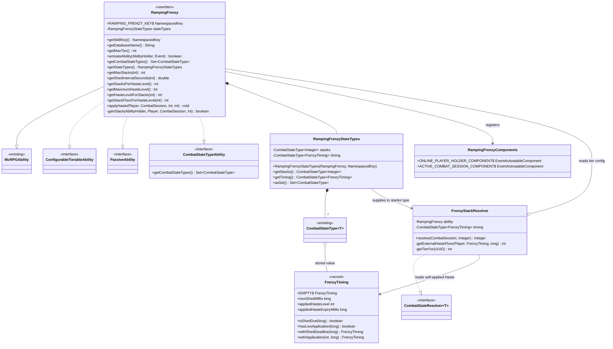
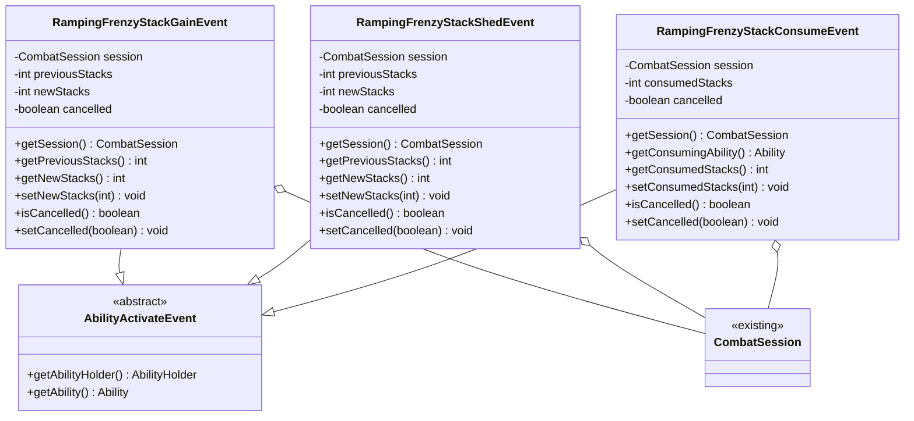
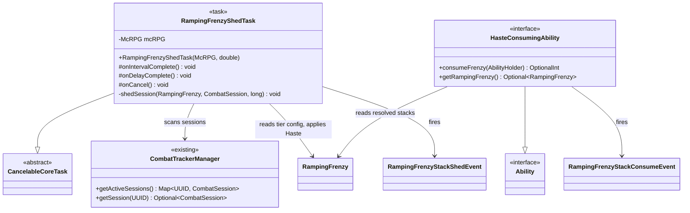
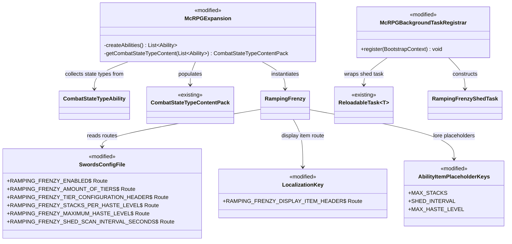

# Phase 4 LLD: Ramping Frenzy Ability

> **HLD Reference:** [Combat Tracker & Ramping Frenzy](../../hld/combat/combat-tracker-and-ramping-frenzy.md)
> **Phase 1 Reference:** [Core Combat Session Engine](phase-1-core-combat-session-engine.md)
> **Phase 2 Reference:** [Combat State & Statistics Platform](phase-2-combat-state-and-statistics-platform.md)
> **Status:** Design — not yet implemented
> **Last Updated:** 2026-07-29

---

## Scope

This phase delivers the first *ability* consumer of the combat state platform: Ramping Frenzy, a Swords passive that grants escalating Haste as the player lands consecutive sword hits, then sheds those stacks one at a time when the player stops attacking. It also delivers the architectural contract that future "cash in your momentum" Swords actives will implement to consume that Haste for a scaled burst effect.

Everything Ramping Frenzy needs for state storage, lifecycle cleanup, and third-party observability already exists — `CombatStateType`, `CombatStateResolver`, `CombatSession.getState`/`getRawState`/`setState`, and automatic `SESSION`-scoped teardown all shipped in Phase 2. This phase adds no combat-platform primitives; it consumes them. The one platform-adjacent addition is `CombatStateTypeAbility`, a marker interface that lets any ability declare the state types it owns so `McRPGExpansion` can register them without hard-coding ability identities.

**In scope:**

- `RampingFrenzy` — full rewrite of the existing scaffold at `ability/impl/swords/RampingFrenzy.java`; a `ConfigurableTierableAbility` + `PassiveAbility` + `ConfigurableSkillAbility` + `CombatStateTypeAbility` that gains a stack per sword hit and applies the mapped Haste level
- `CombatStateTypeAbility` — interface letting an ability declare the `CombatStateType`s it owns, so `McRPGExpansion` collects them generically instead of naming abilities
- `FrenzyTiming` — immutable record packing the shed deadline and the Haste level/expiry that Ramping Frenzy itself last applied, stored as a single combat state value
- `RampingFrenzyStateTypes` — instance collaborator owning the two `CombatStateType` definitions (`ramping_frenzy_stacks`, `ramping_frenzy_timing`) and their registration surface
- `FrenzyStackResolver` — the `CombatStateResolver<Integer>` computing `min(tierMax, max(storedStacks, externalHasteFloor))`, where the floor deliberately ignores Haste that Ramping Frenzy itself applied
- `RampingFrenzyComponents` — activation components gating the ability on an online player holder and an active combat session
- `RampingFrenzyShedTask` — a single global `CancelableCoreTask` that scans active combat sessions and sheds one stack per session whose shed deadline has passed
- `RampingFrenzyStackGainEvent` — cancellable, fired before a stack is added
- `RampingFrenzyStackShedEvent` — cancellable, fired before a stack decays
- `RampingFrenzyStackConsumeEvent` — cancellable, fired before a consume ability wipes Haste and resets stacks
- `HasteConsumingAbility` — the consume-pattern contract: a default `consumeFrenzy(AbilityHolder)` that reads the resolved stack count, fires the consume event, clears all Haste, and resets stored stacks to zero
- Ability tier progression — `max-stacks` and `shed-interval` per tier (T1–T5) resolved via the standard tier-then-`all-tiers` Parser lookup
- Haste tier mapping — configurable `stacks-per-haste-level` and `maximum-haste-level` translating a stack count into a potion amplifier
- Modifications to `SwordsConfigFile` (ramping-frenzy routes), `swords_configuration.yml` (ability config block), `LocalizationKey` (display item header), `en_abilities.yml` (locale entry), `AbilityItemPlaceholderKeys` (three new placeholders), `McRPGExpansion` (register the ability; collect combat state types from abilities), `McRPGBackgroundTaskRegistrar` (start the shed task), `ParserConfigCoverageTest` (registry entry), `swords_upgrades.yml` (tier 2–5 upgrade quests)

**Out of scope:**

- **Concrete consume abilities.** `HasteConsumingAbility` is the contract only. "Frenzy Strike" and any other Swords active that spends Haste gets its own HLD and LLD; this phase ships the interface, the event, and the reset semantics they will build on.
- **A dedicated HUD element for stack count.** The player reads their current Haste level from the vanilla potion indicator — that is the explicit design intent (see HLD §7, *Continuous Haste via Paper Potion Stacking*). No action bar slot, boss bar, or scoreboard integration is added.
- **A `ramping_frenzy_peak_stacks` cumulative statistic.** Passive abilities have no default statistics today, and the HLD does not call for one. Noted in §8.
- **Non-player ability holders.** Ramping Frenzy applies a potion effect and reads the entity's active Haste; both are meaningful only for a `Player`. Mob `AbilityHolder`s are filtered out by a component rather than partially supported.

---

## Class Diagrams

### Legend

```
Stereotypes:
  <<interface>>     interface type
  <<enum>>          enum type
  <<record>>        record type
  <<content pack>>  McRPGContentPack subclass
  <<config>>        ConfigFile subclass
  <<task>>          CoreTask subclass
  <<existing>>      class already exists, not modified
  <<modified>>      class already exists, modified in this phase
  <<rewritten>>     class already exists as a scaffold, fully replaced in this phase

Relationships:
  *--    composition (owns lifecycle)
  o--    association (references)
  -->    dependency (uses)
  ..|>   implements
  --|>   extends

Nullability:
  ?      nullable field
```

### Diagram 1: Ability and State Types



### Diagram 2: Events



### Diagram 3: Shed Task and Consume Contract



### Diagram 4: Modified Classes



---
## 1. New Classes

### 1.1 CombatStateTypeAbility

**Package:** `us.eunoians.mcrpg.ability.impl.type`
**File:** `src/main/java/us/eunoians/mcrpg/ability/impl/type/CombatStateTypeAbility.java`

Capability interface for abilities that own combat state. `McRPGExpansion` collects state types by iterating its ability list and asking each ability that implements this interface — no ability is named in the collection code, so a third-party expansion registering its own abilities gets the same behavior for free.

```java
package us.eunoians.mcrpg.ability.impl.type;

import org.jetbrains.annotations.NotNull;
import us.eunoians.mcrpg.ability.Ability;
import us.eunoians.mcrpg.combat.state.CombatStateType;

import java.util.Set;

/**
 * An {@link Ability} that attaches typed state to combat sessions. Implementations declare the
 * {@link CombatStateType}s they own so the owning
 * {@link us.eunoians.mcrpg.expansion.ContentExpansion} can add them to its
 * {@link us.eunoians.mcrpg.expansion.content.CombatStateTypeContentPack} without knowing which
 * concrete ability supplied them.
 * <p>
 * Registration matters even for session-scoped types: reads and writes work on an unregistered
 * type, but the resolver is only applied at session boundaries — in the
 * {@link us.eunoians.mcrpg.combat.state.CombatStateSnapshot} carried by
 * {@link us.eunoians.mcrpg.event.combat.CombatSessionEndEvent} — for registered types, and the
 * combat tracker logs a warning for any state key it finds with no registered type.
 */
public interface CombatStateTypeAbility extends Ability {

    /**
     * Gets the combat state types owned by this ability.
     *
     * @return An immutable set of the {@link CombatStateType}s this ability reads and writes.
     */
    @NotNull
    Set<CombatStateType<?>> getCombatStateTypes();
}
```

### 1.2 FrenzyTiming

**Package:** `us.eunoians.mcrpg.ability.impl.swords.frenzy`
**File:** `src/main/java/us/eunoians/mcrpg/ability/impl/swords/frenzy/FrenzyTiming.java`

Immutable record holding everything Ramping Frenzy needs to know about *when* things happen, stored as a single combat state value rather than three. It carries the shed deadline plus the level and expiry of the Haste effect Ramping Frenzy itself last applied — the resolver needs the latter to tell its own buff apart from an external one (see D3).

Packing three values into one state type means one `setState` call and therefore one `CombatStateChangeEvent` per sword hit rather than three, on a path that runs on every swing.

```java
package us.eunoians.mcrpg.ability.impl.swords.frenzy;

import org.jetbrains.annotations.NotNull;

/**
 * Immutable timing state for one entity's Ramping Frenzy engagement. Stored as a single combat
 * state value so that the shed deadline and the self-applied Haste bookkeeping update together in
 * one write.
 *
 * @param nextShedMillis           Epoch millisecond at which the next stack decays. A stack sheds
 *                                 once the current time reaches this value.
 * @param appliedHasteLevel        The Haste level (1-based, matching the display numeral) that
 *                                 Ramping Frenzy last applied, or {@code 0} if it has applied none.
 * @param appliedHasteExpiryMillis Epoch millisecond at which the last Ramping Frenzy Haste
 *                                 application expires. After this instant any Haste on the entity
 *                                 came from somewhere else.
 */
public record FrenzyTiming(long nextShedMillis, int appliedHasteLevel, long appliedHasteExpiryMillis) {

    /**
     * The default value for a session that has never gained a Frenzy stack. All timestamps are
     * zero, so {@link #isShedDue(long)} is trivially true and {@link #hasLiveApplication(long)} is
     * false — neither matters until the first stack is gained, because the shed task exits on a
     * zero stack count before it ever reads the timing state.
     */
    public static final FrenzyTiming EMPTY = new FrenzyTiming(0L, 0, 0L);

    /**
     * Checks whether a stack should shed at the given instant.
     *
     * @param nowMillis The current epoch millisecond.
     * @return {@code true} if the shed deadline has been reached or passed.
     */
    public boolean isShedDue(long nowMillis) {
        return nowMillis >= nextShedMillis;
    }

    /**
     * Checks whether the Haste effect Ramping Frenzy last applied is still running at the given
     * instant. Used by the resolver to decide whether the entity's current Haste could be its own.
     *
     * @param nowMillis The current epoch millisecond.
     * @return {@code true} if a Ramping Frenzy Haste application is still live.
     */
    public boolean hasLiveApplication(long nowMillis) {
        return appliedHasteLevel > 0 && nowMillis < appliedHasteExpiryMillis;
    }

    /**
     * Returns a copy with a new shed deadline, leaving the Haste application bookkeeping alone.
     *
     * @param newNextShedMillis The epoch millisecond of the next shed.
     * @return A new {@link FrenzyTiming}.
     */
    @NotNull
    public FrenzyTiming withShedDeadline(long newNextShedMillis) {
        return new FrenzyTiming(newNextShedMillis, appliedHasteLevel, appliedHasteExpiryMillis);
    }

    /**
     * Returns a copy recording a fresh Ramping Frenzy Haste application, leaving the shed deadline
     * alone.
     *
     * @param level        The Haste level applied (1-based).
     * @param expiryMillis The epoch millisecond at which that application expires.
     * @return A new {@link FrenzyTiming}.
     */
    @NotNull
    public FrenzyTiming withApplication(int level, long expiryMillis) {
        return new FrenzyTiming(nextShedMillis, level, expiryMillis);
    }
}
```

### 1.3 FrenzyStackResolver

**Package:** `us.eunoians.mcrpg.ability.impl.swords.frenzy`
**File:** `src/main/java/us/eunoians/mcrpg/ability/impl/swords/frenzy/FrenzyStackResolver.java`

The `CombatStateResolver<Integer>` behind the stack state type. Every `session.getState(stacks)` call runs this: it computes `min(tierMax, max(storedStacks, externalHasteFloor))` so that any *external* Haste source — vanilla potions, beacons, conduits, Super Breaker, a third-party plugin — automatically seeds Frenzy stacks with no listener and no per-source integration.

The word *external* is doing real work here. A naive resolver that derives the floor from whatever `player.getPotionEffect(HASTE)` returns deadlocks the shed: Ramping Frenzy's own Haste III maps back to a floor of 9 stacks, which is the top of the 7–9 band, so the effective count can never fall below 9 while that effect is live — and the ability re-applies the same effect on every shed, keeping it live forever. The resolver therefore ignores any Haste at or below the level Ramping Frenzy itself last applied while that application is still running, and only treats a *strictly higher* level as an external floor. See D3 for the full argument.

```java
package us.eunoians.mcrpg.ability.impl.swords.frenzy;

import org.bukkit.Bukkit;
import org.bukkit.entity.Player;
import org.bukkit.potion.PotionEffect;
import org.bukkit.potion.PotionEffectType;
import org.jetbrains.annotations.NotNull;
import org.jetbrains.annotations.Nullable;
import us.eunoians.mcrpg.ability.impl.swords.RampingFrenzy;
import us.eunoians.mcrpg.combat.CombatSession;
import us.eunoians.mcrpg.combat.state.CombatStateResolver;
import us.eunoians.mcrpg.combat.state.CombatStateType;

/**
 * Computes the effective Ramping Frenzy stack count from the raw stored value plus any external
 * Haste on the entity, clamped to the holder's tier maximum.
 * <p>
 * External means "not applied by Ramping Frenzy". While a Ramping Frenzy Haste application is still
 * live, a current Haste level at or below the applied level is assumed to be that application and
 * contributes no floor; only a strictly higher level is treated as an outside source. Without that
 * distinction the ability's own buff would pin the effective count at the top of its own Haste band
 * and the stack shed could never make progress.
 * <p>
 * This runs on every {@code getState} call and is pure — it reads the session, the entity's potion
 * effects, and configuration, and mutates nothing.
 */
public final class FrenzyStackResolver implements CombatStateResolver<Integer> {

    private final RampingFrenzy ability;
    private final CombatStateType<FrenzyTiming> timing;

    /**
     * Constructs a new {@link FrenzyStackResolver}.
     *
     * @param ability The owning ability, used for tier and Haste-mapping configuration.
     * @param timing  The timing state type, used to identify self-applied Haste.
     */
    public FrenzyStackResolver(@NotNull RampingFrenzy ability, @NotNull CombatStateType<FrenzyTiming> timing) {
        this.ability = ability;
        this.timing = timing;
    }

    @NotNull
    @Override
    public Integer resolve(@NotNull CombatSession session, @NotNull Integer rawValue) {
        int tierMax = ability.getMaxStacks(getTierFor(session));
        Player player = Bukkit.getPlayer(session.getEntityUUID());
        if (player == null) {
            return Math.min(tierMax, rawValue);
        }
        int floor = getExternalHasteFloor(player, session.getRawState(timing), System.currentTimeMillis());
        return Math.min(tierMax, Math.max(rawValue, floor));
    }

    /**
     * Derives a stack floor from Haste that Ramping Frenzy did not apply.
     *
     * @param player          The entity that owns the session.
     * @param frenzyTiming    The session's timing state, identifying the last self-applied Haste.
     * @param nowMillis       The current epoch millisecond.
     * @return The stack floor implied by external Haste, or {@code 0} if there is none.
     */
    private int getExternalHasteFloor(@NotNull Player player, @NotNull FrenzyTiming frenzyTiming, long nowMillis) {
        PotionEffect haste = player.getPotionEffect(PotionEffectType.HASTE);
        if (haste == null) {
            return 0;
        }
        int currentLevel = haste.getAmplifier() + 1;
        if (frenzyTiming.hasLiveApplication(nowMillis) && currentLevel <= frenzyTiming.appliedHasteLevel()) {
            return 0;
        }
        return ability.getStackFloorForHasteLevel(currentLevel);
    }

    /**
     * Resolves the session owner's current Ramping Frenzy tier, falling back to tier 1 when the
     * holder is not loaded (an entity can outlive its {@code AbilityHolder} during unload).
     *
     * @param session The session whose owner's tier is needed.
     * @return The holder's current tier, or {@code 1}.
     */
    private int getTierFor(@NotNull CombatSession session) {
        @Nullable var holder = ability.getPlugin().registryAccess()
                .registry(com.diamonddagger590.mccore.registry.RegistryKey.MANAGER)
                .manager(us.eunoians.mcrpg.registry.manager.McRPGManagerKey.ENTITY)
                .getAbilityHolder(session.getEntityUUID())
                .orElse(null);
        return holder == null ? 1 : ability.getCurrentAbilityTier(holder);
    }
}
```

> **Implementation note:** the fully-qualified references in `getTierFor` above are an artifact of the excerpt, not the intended source. The real file declares top-level imports for `RegistryKey`, `McRPGManagerKey`, and `AbilityHolder` — inline fully-qualified types are forbidden by the project's coding standards.

### 1.4 RampingFrenzyStateTypes

**Package:** `us.eunoians.mcrpg.ability.impl.swords.frenzy`
**File:** `src/main/java/us/eunoians/mcrpg/ability/impl/swords/frenzy/RampingFrenzyStateTypes.java`

Instance collaborator owning the two `CombatStateType` definitions. Constructed once by `RampingFrenzy` and reachable from the ability, so the shed task and any consume ability read the same instances rather than re-deriving keys. Both types are `SESSION`-scoped: when the session ends — timeout, death, logout, all participants gone — the platform clears them with no ability-side cleanup, which is exactly the ad-hoc-manager elimination the combat tracker exists for.

```java
package us.eunoians.mcrpg.ability.impl.swords.frenzy;

import org.bukkit.NamespacedKey;
import org.jetbrains.annotations.NotNull;
import org.jetbrains.annotations.Nullable;
import us.eunoians.mcrpg.ability.impl.swords.RampingFrenzy;
import us.eunoians.mcrpg.combat.state.CombatStateType;
import us.eunoians.mcrpg.util.McRPGMethods;

import java.util.Set;

/**
 * Owns the combat state types Ramping Frenzy reads and writes. Both are session-scoped, so the
 * combat tracker clears them when the session ends and the ability needs no teardown of its own.
 */
public final class RampingFrenzyStateTypes {

    /**
     * The key of the resolved stack-count state. Public so third-party plugins can look the value
     * up by key without holding a reference to the ability.
     */
    public static final NamespacedKey STACKS_KEY =
            new NamespacedKey(McRPGMethods.getMcRPGNamespace(), "ramping_frenzy_stacks");

    /**
     * The key of the timing state carrying the shed deadline and self-applied Haste bookkeeping.
     */
    public static final NamespacedKey TIMING_KEY =
            new NamespacedKey(McRPGMethods.getMcRPGNamespace(), "ramping_frenzy_timing");

    private final CombatStateType<Integer> stacks;
    private final CombatStateType<FrenzyTiming> timing;

    /**
     * Constructs the state types for the given ability.
     *
     * @param ability      The owning ability, passed to the stack resolver for config lookups.
     * @param expansionKey The key of the expansion that owns these types, or {@code null} when the
     *                     ability is constructed outside an expansion (test fixtures).
     */
    public RampingFrenzyStateTypes(@NotNull RampingFrenzy ability, @Nullable NamespacedKey expansionKey) {
        this.timing = CombatStateType.of(TIMING_KEY, FrenzyTiming.class, FrenzyTiming.EMPTY, expansionKey);
        this.stacks = CombatStateType.resolved(STACKS_KEY, Integer.class, 0,
                new FrenzyStackResolver(ability, timing), expansionKey);
    }

    /**
     * Gets the resolved stack-count state type. Reads through
     * {@link us.eunoians.mcrpg.combat.CombatSession#getState} return the effective count including
     * any external Haste floor; reads through {@code getRawState} return only what was stored.
     *
     * @return The stack {@link CombatStateType}.
     */
    @NotNull
    public CombatStateType<Integer> getStacks() {
        return stacks;
    }

    /**
     * Gets the timing state type.
     *
     * @return The timing {@link CombatStateType}.
     */
    @NotNull
    public CombatStateType<FrenzyTiming> getTiming() {
        return timing;
    }

    /**
     * Gets both state types for content-pack registration.
     *
     * @return An immutable set containing the stack and timing types.
     */
    @NotNull
    public Set<CombatStateType<?>> asSet() {
        return Set.of(stacks, timing);
    }
}
```

### 1.5 RampingFrenzyComponents

**Package:** `us.eunoians.mcrpg.ability.impl.swords.frenzy`
**File:** `src/main/java/us/eunoians/mcrpg/ability/impl/swords/frenzy/RampingFrenzyComponents.java`

Activation components specific to Ramping Frenzy. `SwordsComponents.HOLDING_SWORD_ACTIVATE_COMPONENT` already covers "damager is a living entity holding a sword"; these two add the constraints the Haste mechanic imposes.

`ACTIVE_COMBAT_SESSION_COMPONENT` looks safe to omit at first glance — `OnCombatDamageListener` creates the session from the same `EntityDamageByEntityEvent`. It runs at `EventPriority.HIGHEST` while `OnAttackAbilityListener` runs at `MONITOR`, so the session does exist by the time the ability activates. The component is a guard against that ordering silently changing, and it also covers the case where a `CombatSessionStartEvent` listener cancelled session creation outright — in which case Ramping Frenzy genuinely should not fire.

```java
package us.eunoians.mcrpg.ability.impl.swords.frenzy;

import com.diamonddagger590.mccore.registry.RegistryKey;
import org.bukkit.Bukkit;
import org.bukkit.entity.Player;
import org.bukkit.event.Event;
import org.jetbrains.annotations.NotNull;
import us.eunoians.mcrpg.McRPG;
import us.eunoians.mcrpg.ability.component.activatable.EventActivatableComponent;
import us.eunoians.mcrpg.entity.holder.AbilityHolder;
import us.eunoians.mcrpg.registry.manager.McRPGManagerKey;

/**
 * Activation components used by {@link us.eunoians.mcrpg.ability.impl.swords.RampingFrenzy}.
 */
public final class RampingFrenzyComponents {

    /**
     * Requires that the ability holder is an online {@link Player}. Ramping Frenzy applies a Haste
     * potion effect and reads the holder's active Haste, neither of which is meaningful for a mob
     * holder, so mobs are filtered out rather than partially supported.
     */
    public static final EventActivatableComponent ONLINE_PLAYER_HOLDER_COMPONENT =
            new OnlinePlayerHolderComponent();

    /**
     * Requires that the holder has an active combat session. Frenzy stacks live on the session, so
     * without one there is nowhere to store them.
     */
    public static final EventActivatableComponent ACTIVE_COMBAT_SESSION_COMPONENT =
            new ActiveCombatSessionComponent();

    private RampingFrenzyComponents() {
    }

    private static final class OnlinePlayerHolderComponent implements EventActivatableComponent {

        @Override
        public boolean shouldActivate(@NotNull AbilityHolder abilityHolder, @NotNull Event event) {
            return Bukkit.getPlayer(abilityHolder.getUUID()) != null;
        }
    }

    private static final class ActiveCombatSessionComponent implements EventActivatableComponent {

        @Override
        public boolean shouldActivate(@NotNull AbilityHolder abilityHolder, @NotNull Event event) {
            return McRPG.getInstance().registryAccess().registry(RegistryKey.MANAGER)
                    .manager(McRPGManagerKey.COMBAT_TRACKER)
                    .hasActiveSession(abilityHolder.getUUID());
        }
    }
}
```

### 1.6 RampingFrenzy

**Package:** `us.eunoians.mcrpg.ability.impl.swords`
**File:** `src/main/java/us/eunoians/mcrpg/ability/impl/swords/RampingFrenzy.java`

Full replacement of the existing scaffold. The scaffold's `activateAbility` body is a block of design questions in comment form and its `getDisplayItemRoute`/`getAbilityEnabledRoute` return `null` in violation of their `@NotNull` contracts — none of it survives.

The class is a tierable passive: `ConfigurableTierableAbility` brings `UnlockableAbility` with it, so tier 1 is configured with `unlock-level: 1` to keep the HLD's "always available" intent while still exposing the T1–T5 progression the HLD specifies (see D1). The ability owns three responsibilities and nothing else: resolve tier configuration, gain a stack on a sword hit, and apply the mapped Haste. Shedding lives in the task; consuming lives in the consume contract; storage and cleanup live in the combat platform.

`applyHaste` is public because the shed task calls it with a decremented count — the map-stacks-to-amplifier-and-duration logic must not exist in two places.

```java
package us.eunoians.mcrpg.ability.impl.swords;

import com.diamonddagger590.mccore.parser.Parser;
import com.diamonddagger590.mccore.registry.RegistryKey;
import dev.dejvokep.boostedyaml.YamlDocument;
import dev.dejvokep.boostedyaml.route.Route;
import org.bukkit.Bukkit;
import org.bukkit.NamespacedKey;
import org.bukkit.entity.Player;
import org.bukkit.event.Event;
import org.bukkit.event.entity.EntityDamageByEntityEvent;
import org.bukkit.potion.PotionEffect;
import org.bukkit.potion.PotionEffectType;
import org.jetbrains.annotations.NotNull;
import org.jetbrains.annotations.Nullable;
import us.eunoians.mcrpg.McRPG;
import us.eunoians.mcrpg.ability.impl.McRPGAbility;
import us.eunoians.mcrpg.ability.impl.swords.frenzy.FrenzyTiming;
import us.eunoians.mcrpg.ability.impl.swords.frenzy.RampingFrenzyComponents;
import us.eunoians.mcrpg.ability.impl.swords.frenzy.RampingFrenzyStateTypes;
import us.eunoians.mcrpg.ability.impl.type.CombatStateTypeAbility;
import us.eunoians.mcrpg.ability.impl.type.PassiveAbility;
import us.eunoians.mcrpg.ability.impl.type.configurable.ConfigurableSkillAbility;
import us.eunoians.mcrpg.ability.impl.type.configurable.ConfigurableTierableAbility;
import us.eunoians.mcrpg.ability.impl.type.configurable.ParserConfigKeys;
import us.eunoians.mcrpg.builder.item.ability.AbilityItemPlaceholderKeys;
import us.eunoians.mcrpg.combat.CombatSession;
import us.eunoians.mcrpg.combat.state.CombatStateType;
import us.eunoians.mcrpg.configuration.FileType;
import us.eunoians.mcrpg.configuration.file.localization.LocalizationKey;
import us.eunoians.mcrpg.configuration.file.skill.SwordsConfigFile;
import us.eunoians.mcrpg.entity.holder.AbilityHolder;
import us.eunoians.mcrpg.entity.player.McRPGPlayer;
import us.eunoians.mcrpg.event.ability.swords.RampingFrenzyStackGainEvent;
import us.eunoians.mcrpg.registry.manager.McRPGManagerKey;
import us.eunoians.mcrpg.skill.impl.swords.Swords;
import us.eunoians.mcrpg.util.McRPGMethods;

import java.util.HashMap;
import java.util.Map;
import java.util.Set;

/**
 * Ramping Frenzy rewards sustained aggression. Every sword hit adds a stack, and the stack count
 * maps to a Haste level that is re-applied on each hit with an overlapping duration, so the effect
 * never flickers while the player keeps swinging. When the player stops, stacks decay one at a time
 * and the Haste level walks back down through its tiers rather than vanishing at once.
 * <p>
 * Stacks live on the entity's {@link CombatSession} as session-scoped combat state, so they are
 * cleared automatically when combat ends — by timeout, death, logout, or every participant leaving.
 * The stack state is resolved: any Haste the entity has from an outside source raises the effective
 * count to that level's floor, so potions, beacons, and other abilities all feed the same pool that
 * a {@link us.eunoians.mcrpg.ability.impl.type.HasteConsumingAbility} later spends.
 */
@ParserConfigKeys({"max-stacks", "shed-interval"})
public final class RampingFrenzy extends McRPGAbility implements ConfigurableTierableAbility,
        PassiveAbility, ConfigurableSkillAbility, CombatStateTypeAbility {

    public static final NamespacedKey RAMPING_FRENZY_KEY =
            new NamespacedKey(McRPGMethods.getMcRPGNamespace(), "ramping_frenzy");

    private static final String MAX_STACKS_KEY = "max-stacks";
    private static final String SHED_INTERVAL_KEY = "shed-interval";

    private final RampingFrenzyStateTypes stateTypes;

    /**
     * Constructs Ramping Frenzy and registers its activation components.
     *
     * @param mcRPG The plugin instance.
     */
    public RampingFrenzy(@NotNull McRPG mcRPG) {
        super(mcRPG, RAMPING_FRENZY_KEY);
        addActivatableComponent(SwordsComponents.HOLDING_SWORD_ACTIVATE_COMPONENT,
                EntityDamageByEntityEvent.class, 0);
        addActivatableComponent(RampingFrenzyComponents.ONLINE_PLAYER_HOLDER_COMPONENT,
                EntityDamageByEntityEvent.class, 1);
        addActivatableComponent(RampingFrenzyComponents.ACTIVE_COMBAT_SESSION_COMPONENT,
                EntityDamageByEntityEvent.class, 2);
        this.stateTypes = new RampingFrenzyStateTypes(this, McRPGMethods.getMcRPGExpansionKey());
    }

    @NotNull
    @Override
    public NamespacedKey getSkillKey() {
        return Swords.SWORDS_KEY;
    }

    @NotNull
    @Override
    public String getDatabaseName() {
        return "ramping_frenzy";
    }

    @NotNull
    @Override
    public YamlDocument getYamlDocument() {
        return getPlugin().registryAccess().registry(RegistryKey.MANAGER)
                .manager(McRPGManagerKey.FILE).getFile(FileType.SWORDS_CONFIG);
    }

    @NotNull
    @Override
    public Route getDisplayItemRoute() {
        return LocalizationKey.RAMPING_FRENZY_DISPLAY_ITEM_HEADER;
    }

    @NotNull
    @Override
    public Route getAbilityEnabledRoute() {
        return SwordsConfigFile.RAMPING_FRENZY_ENABLED;
    }

    @NotNull
    @Override
    public Route getAbilityTierConfigurationRoute() {
        return SwordsConfigFile.RAMPING_FRENZY_TIER_CONFIGURATION_HEADER;
    }

    @Override
    public int getMaxTier() {
        return getYamlDocument().getInt(SwordsConfigFile.RAMPING_FRENZY_AMOUNT_OF_TIERS);
    }

    @NotNull
    @Override
    public Set<CombatStateType<?>> getCombatStateTypes() {
        return stateTypes.asSet();
    }

    /**
     * Gets the combat state types this ability reads and writes. The shed task and any
     * {@link us.eunoians.mcrpg.ability.impl.type.HasteConsumingAbility} go through this rather than
     * re-deriving the types from their keys.
     *
     * @return The owned {@link RampingFrenzyStateTypes}.
     */
    @NotNull
    public RampingFrenzyStateTypes getStateTypes() {
        return stateTypes;
    }

    @Override
    public boolean activateAbility(@NotNull AbilityHolder abilityHolder, @NotNull Event event) {
        Player player = Bukkit.getPlayer(abilityHolder.getUUID());
        CombatSession session = getPlugin().registryAccess().registry(RegistryKey.MANAGER)
                .manager(McRPGManagerKey.COMBAT_TRACKER)
                .getSession(abilityHolder.getUUID())
                .orElse(null);
        // Both are guaranteed by the activation components; re-checked so a direct caller that
        // bypasses the component chain cannot dereference null.
        if (player == null || session == null) {
            return false;
        }
        return gainStack(abilityHolder, player, session, getCurrentAbilityTier(abilityHolder));
    }

    /**
     * Adds a stack if the holder is below their tier cap, then re-applies Haste at the resulting
     * level. At the cap the stack count is left alone and only the Haste duration is refreshed, so
     * a capped player keeps their effect without the gain event firing on every swing.
     *
     * @param abilityHolder The holder gaining the stack.
     * @param player        The holder as an online player.
     * @param session       The holder's active combat session.
     * @param tier          The holder's current ability tier.
     * @return {@code true} if Haste was applied, {@code false} if a listener cancelled the gain.
     */
    private boolean gainStack(@NotNull AbilityHolder abilityHolder, @NotNull Player player,
                              @NotNull CombatSession session, int tier) {
        int maxStacks = getMaxStacks(tier);
        int effectiveStacks = session.getState(stateTypes.getStacks());

        if (effectiveStacks < maxStacks) {
            RampingFrenzyStackGainEvent gainEvent = new RampingFrenzyStackGainEvent(
                    abilityHolder, session, effectiveStacks, effectiveStacks + 1);
            Bukkit.getPluginManager().callEvent(gainEvent);
            if (gainEvent.isCancelled()) {
                return false;
            }
            int newStacks = Math.min(maxStacks, Math.max(0, gainEvent.getNewStacks()));
            session.setState(stateTypes.getStacks(), newStacks);
            effectiveStacks = newStacks;
        }

        applyHaste(player, session, effectiveStacks, tier);
        return true;
    }

    /**
     * Applies Haste at the level mapped from the given stack count and records the application on
     * the session's timing state, resetting the shed deadline in the same write.
     * <p>
     * The duration is twice the tier's shed interval, so a fresh application always overlaps the
     * previous one. Paper displays the highest active Haste and the longest remaining duration, so
     * a downgrade from a higher level shows the old level until it expires and then falls through
     * to the new one — the smooth wind-down the design calls for, with no explicit removal.
     * <p>
     * A stack count of zero applies nothing; the last live application expires on its own within
     * one overlap window.
     *
     * @param player  The player to apply Haste to.
     * @param session The player's combat session, whose timing state is updated.
     * @param stacks  The effective stack count to map to a Haste level.
     * @param tier    The holder's current ability tier, for the shed interval.
     */
    public void applyHaste(@NotNull Player player, @NotNull CombatSession session, int stacks, int tier) {
        double shedIntervalSeconds = getShedIntervalSeconds(tier);
        long nowMillis = System.currentTimeMillis();
        long nextShedMillis = nowMillis + (long) (shedIntervalSeconds * 1000L);
        FrenzyTiming currentTiming = session.getRawState(stateTypes.getTiming());

        if (stacks <= 0) {
            session.setState(stateTypes.getTiming(), currentTiming.withShedDeadline(nextShedMillis));
            return;
        }

        int hasteLevel = getHasteLevelForStacks(stacks);
        int durationTicks = (int) Math.max(1, Math.round(shedIntervalSeconds * 2 * 20));
        player.addPotionEffect(new PotionEffect(PotionEffectType.HASTE, durationTicks,
                hasteLevel - 1, true, false, true));

        long expiryMillis = nowMillis + (durationTicks * 50L);
        session.setState(stateTypes.getTiming(), currentTiming
                .withShedDeadline(nextShedMillis)
                .withApplication(hasteLevel, expiryMillis));
    }

    /**
     * Gets the maximum stack count for the given tier.
     *
     * @param tier The tier to resolve.
     * @return The tier's maximum stack count, never below {@code 1}.
     */
    public int getMaxStacks(int tier) {
        return Math.max(1, (int) resolveTierValue(MAX_STACKS_KEY, tier));
    }

    /**
     * Gets the number of seconds of inactivity between individual stack decays for the given tier.
     *
     * @param tier The tier to resolve.
     * @return The tier's shed interval in seconds, never below {@code 0.05} (one tick).
     */
    public double getShedIntervalSeconds(int tier) {
        return Math.max(0.05, resolveTierValue(SHED_INTERVAL_KEY, tier));
    }

    /**
     * Resolves a tier-configuration value through the standard tier-then-all-tiers Parser lookup.
     *
     * @param key  The tier-configuration sub-key.
     * @param tier The tier to resolve for.
     * @return The evaluated value.
     */
    private double resolveTierValue(@NotNull String key, int tier) {
        YamlDocument swordsConfig = getYamlDocument();
        Route tierRoute = Route.addTo(getRouteForTier(tier), key);
        Route allTiersRoute = Route.addTo(getRouteForAllTiers(), key);
        Parser parser = new Parser(swordsConfig.contains(tierRoute)
                ? swordsConfig.getString(tierRoute)
                : swordsConfig.getString(allTiersRoute));
        parser.setVariable("tier", tier);
        return parser.getValue();
    }

    /**
     * Gets how many stacks make up one Haste level.
     *
     * @return The configured stacks per Haste level, never below {@code 1}.
     */
    public int getStacksPerHasteLevel() {
        return Math.max(1, getYamlDocument().getInt(SwordsConfigFile.RAMPING_FRENZY_STACKS_PER_HASTE_LEVEL));
    }

    /**
     * Gets the highest Haste level Ramping Frenzy will ever apply, regardless of stack count.
     *
     * @return The configured maximum Haste level, never below {@code 1}.
     */
    public int getMaximumHasteLevel() {
        return Math.max(1, getYamlDocument().getInt(SwordsConfigFile.RAMPING_FRENZY_MAXIMUM_HASTE_LEVEL));
    }

    /**
     * Maps a stack count to a Haste level. Stacks are grouped in bands of
     * {@link #getStacksPerHasteLevel()} — with the default of three, stacks 1–3 are Haste I, 4–6
     * are Haste II, and so on — capped at {@link #getMaximumHasteLevel()}.
     *
     * @param stacks The stack count to map.
     * @return The Haste level (1-based), or {@code 0} for a stack count of zero or less.
     */
    public int getHasteLevelForStacks(int stacks) {
        if (stacks <= 0) {
            return 0;
        }
        int perLevel = getStacksPerHasteLevel();
        return Math.min(getMaximumHasteLevel(), ((stacks - 1) / perLevel) + 1);
    }

    /**
     * Maps a Haste level back to the lowest stack count that produces it — the inverse of
     * {@link #getHasteLevelForStacks(int)} at the bottom of each band. The resolver uses this so an
     * external Haste source seeds the least stacks consistent with the level it grants, rather than
     * the most.
     *
     * @param hasteLevel The Haste level (1-based).
     * @return The stack floor implied by that level, or {@code 0} for a level of zero or less.
     */
    public int getStackFloorForHasteLevel(int hasteLevel) {
        if (hasteLevel <= 0) {
            return 0;
        }
        return ((Math.min(getMaximumHasteLevel(), hasteLevel) - 1) * getStacksPerHasteLevel()) + 1;
    }

    @NotNull
    @Override
    public Map<String, String> getItemBuilderPlaceholders(@NotNull McRPGPlayer player) {
        var localizationManager = getPlugin().registryAccess().registry(RegistryKey.MANAGER)
                .manager(McRPGManagerKey.LOCALIZATION);
        int tier = getCurrentAbilityTier(player.asSkillHolder());
        int maxStacks = getMaxStacks(tier);

        Map<String, String> placeholders = new HashMap<>();
        placeholders.put(AbilityItemPlaceholderKeys.MAX_STACKS.getKey(), Integer.toString(maxStacks));
        placeholders.put(AbilityItemPlaceholderKeys.SHED_INTERVAL.getKey(),
                localizationManager.getDisplayDecimalFormatter()
                        .formatDisplayDecimal(player, getShedIntervalSeconds(tier), 0, 2));
        placeholders.put(AbilityItemPlaceholderKeys.MAX_HASTE_LEVEL.getKey(),
                Integer.toString(getHasteLevelForStacks(maxStacks)));
        return placeholders;
    }

    @NotNull
    @Override
    public Set<NamespacedKey> getApplicableAttributes() {
        return ConfigurableTierableAbility.super.getApplicableAttributes();
    }
}
```

> **`McRPGMethods.getMcRPGExpansionKey()`** does not exist today; `McRPGExpansion` holds its key in a private `EXPANSION_KEY` constant. Either promote that constant to a public accessor on `McRPGExpansion` or add the helper to `McRPGMethods` — §2 assumes the former, since the key belongs to the expansion.

### 1.7 RampingFrenzyStackGainEvent

**Package:** `us.eunoians.mcrpg.event.ability.swords`
**File:** `src/main/java/us/eunoians/mcrpg/event/ability/swords/RampingFrenzyStackGainEvent.java`

Fired before a stack is added, with the resulting count modifiable. A synergy ability that grants double stacks sets `newStacks` to `previous + 2`; a suppression effect cancels. The ability clamps whatever a listener writes to `[0, tierMax]` after the event returns, so a listener cannot push a player past their tier cap.

```java
package us.eunoians.mcrpg.event.ability.swords;

import org.bukkit.event.Cancellable;
import org.jetbrains.annotations.NotNull;
import us.eunoians.mcrpg.McRPG;
import us.eunoians.mcrpg.ability.Ability;
import us.eunoians.mcrpg.ability.impl.swords.RampingFrenzy;
import us.eunoians.mcrpg.combat.CombatSession;
import us.eunoians.mcrpg.entity.holder.AbilityHolder;
import us.eunoians.mcrpg.event.ability.AbilityActivateEvent;
import us.eunoians.mcrpg.registry.McRPGRegistryKey;

/**
 * Called before {@link RampingFrenzy} adds a stack for a sword hit. Cancelling leaves the stack
 * count untouched and skips the Haste application for that hit. The resulting count is modifiable;
 * the ability clamps it to the holder's tier maximum after this event returns.
 */
public class RampingFrenzyStackGainEvent extends AbilityActivateEvent implements Cancellable {

    private static final Ability RAMPING_FRENZY = McRPG.getInstance().registryAccess()
            .registry(McRPGRegistryKey.ABILITY).getRegisteredAbility(RampingFrenzy.RAMPING_FRENZY_KEY);

    private final CombatSession session;
    private final int previousStacks;
    private int newStacks;
    private boolean cancelled = false;

    /**
     * Constructs a new {@link RampingFrenzyStackGainEvent}.
     *
     * @param abilityHolder  The holder gaining the stack.
     * @param session        The holder's active combat session.
     * @param previousStacks The effective stack count before the gain.
     * @param newStacks      The effective stack count the ability intends to write.
     */
    public RampingFrenzyStackGainEvent(@NotNull AbilityHolder abilityHolder, @NotNull CombatSession session,
                                       int previousStacks, int newStacks) {
        super(abilityHolder, RAMPING_FRENZY);
        this.session = session;
        this.previousStacks = previousStacks;
        this.newStacks = newStacks;
    }

    @NotNull
    @Override
    public RampingFrenzy getAbility() {
        return (RampingFrenzy) super.getAbility();
    }

    /**
     * Gets the combat session the stacks are stored on.
     *
     * @return The {@link CombatSession}.
     */
    @NotNull
    public CombatSession getSession() {
        return session;
    }

    /**
     * Gets the effective stack count before this gain.
     *
     * @return The previous stack count.
     */
    public int getPreviousStacks() {
        return previousStacks;
    }

    /**
     * Gets the stack count that will be written if this event is not cancelled.
     *
     * @return The new stack count.
     */
    public int getNewStacks() {
        return newStacks;
    }

    /**
     * Sets the stack count to write. The ability clamps the value to the holder's tier maximum and
     * to a floor of zero, so a listener cannot exceed the cap or drive the count negative.
     *
     * @param newStacks The desired stack count.
     */
    public void setNewStacks(int newStacks) {
        this.newStacks = newStacks;
    }

    @Override
    public boolean isCancelled() {
        return cancelled;
    }

    @Override
    public void setCancelled(boolean cancel) {
        this.cancelled = cancel;
    }
}
```

### 1.8 RampingFrenzyStackShedEvent

**Package:** `us.eunoians.mcrpg.event.ability.swords`
**File:** `src/main/java/us/eunoians/mcrpg/event/ability/swords/RampingFrenzyStackShedEvent.java`

The mirror of the gain event, fired by the shed task before a stack decays. Cancelling holds the stack for one more interval — the shed deadline still advances, so a listener that always cancels freezes the count rather than spinning the task (see D8).

The HLD's extension-point table lists only `RampingFrenzyStackGainEvent`. This event is an addition: a plugin that reacts to the ramp — a HUD, a synergy that triggers on falling below a threshold, an analytics hook — needs the down-edge as much as the up-edge, and shipping only half of a symmetric pair is the kind of gap that gets reported as a bug later.

```java
package us.eunoians.mcrpg.event.ability.swords;

import org.bukkit.event.Cancellable;
import org.jetbrains.annotations.NotNull;
import us.eunoians.mcrpg.McRPG;
import us.eunoians.mcrpg.ability.Ability;
import us.eunoians.mcrpg.ability.impl.swords.RampingFrenzy;
import us.eunoians.mcrpg.combat.CombatSession;
import us.eunoians.mcrpg.entity.holder.AbilityHolder;
import us.eunoians.mcrpg.event.ability.AbilityActivateEvent;
import us.eunoians.mcrpg.registry.McRPGRegistryKey;

/**
 * Called before {@link RampingFrenzy} decays a stack after the holder stops attacking. Cancelling
 * keeps the current stack count for one more shed interval; the deadline advances either way, so a
 * listener that always cancels holds the count steady rather than causing the shed task to re-fire
 * on every scan.
 */
public class RampingFrenzyStackShedEvent extends AbilityActivateEvent implements Cancellable {

    private static final Ability RAMPING_FRENZY = McRPG.getInstance().registryAccess()
            .registry(McRPGRegistryKey.ABILITY).getRegisteredAbility(RampingFrenzy.RAMPING_FRENZY_KEY);

    private final CombatSession session;
    private final int previousStacks;
    private int newStacks;
    private boolean cancelled = false;

    /**
     * Constructs a new {@link RampingFrenzyStackShedEvent}.
     *
     * @param abilityHolder  The holder losing the stack.
     * @param session        The holder's active combat session.
     * @param previousStacks The raw stored stack count before the shed.
     * @param newStacks      The raw stored stack count the task intends to write.
     */
    public RampingFrenzyStackShedEvent(@NotNull AbilityHolder abilityHolder, @NotNull CombatSession session,
                                       int previousStacks, int newStacks) {
        super(abilityHolder, RAMPING_FRENZY);
        this.session = session;
        this.previousStacks = previousStacks;
        this.newStacks = newStacks;
    }

    @NotNull
    @Override
    public RampingFrenzy getAbility() {
        return (RampingFrenzy) super.getAbility();
    }

    /**
     * Gets the combat session the stacks are stored on.
     *
     * @return The {@link CombatSession}.
     */
    @NotNull
    public CombatSession getSession() {
        return session;
    }

    /**
     * Gets the raw stored stack count before this shed.
     *
     * @return The previous stack count.
     */
    public int getPreviousStacks() {
        return previousStacks;
    }

    /**
     * Gets the stack count that will be written if this event is not cancelled.
     *
     * @return The new stack count.
     */
    public int getNewStacks() {
        return newStacks;
    }

    /**
     * Sets the stack count to write. The task clamps the value to a floor of zero and to a ceiling
     * of the previous count — a shed can hold or deepen, but never grant stacks.
     *
     * @param newStacks The desired stack count.
     */
    public void setNewStacks(int newStacks) {
        this.newStacks = newStacks;
    }

    @Override
    public boolean isCancelled() {
        return cancelled;
    }

    @Override
    public void setCancelled(boolean cancel) {
        this.cancelled = cancel;
    }
}
```

### 1.9 RampingFrenzyStackConsumeEvent

**Package:** `us.eunoians.mcrpg.event.ability.swords`
**File:** `src/main/java/us/eunoians/mcrpg/event/ability/swords/RampingFrenzyStackConsumeEvent.java`

Fired by `HasteConsumingAbility.consumeFrenzy` before any Haste is wiped. Carries the consuming ability so a listener can tell one spender from another, and the consumed stack count so a listener can scale or cap what the burst is worth. Cancelling aborts the whole consume — no Haste is removed and no stacks are reset, which lets the calling ability abort its own activation cleanly.

```java
package us.eunoians.mcrpg.event.ability.swords;

import org.bukkit.event.Cancellable;
import org.jetbrains.annotations.NotNull;
import us.eunoians.mcrpg.ability.Ability;
import us.eunoians.mcrpg.combat.CombatSession;
import us.eunoians.mcrpg.entity.holder.AbilityHolder;
import us.eunoians.mcrpg.event.ability.AbilityActivateEvent;

/**
 * Called before an ability consumes the holder's Ramping Frenzy stacks and clears their Haste.
 * Cancelling aborts the consume entirely — Haste stays, stacks stay, and the calling ability is
 * told nothing was consumed so it can cancel its own activation.
 * <p>
 * The consumed count is modifiable so a listener can cap or scale what a burst is worth without
 * changing how much Haste is removed: the removal is unconditional, the number reported back to
 * the consuming ability is not.
 */
public class RampingFrenzyStackConsumeEvent extends AbilityActivateEvent implements Cancellable {

    private final CombatSession session;
    private int consumedStacks;
    private boolean cancelled = false;

    /**
     * Constructs a new {@link RampingFrenzyStackConsumeEvent}.
     *
     * @param abilityHolder    The holder whose stacks are being spent.
     * @param consumingAbility The ability doing the spending.
     * @param session          The holder's active combat session.
     * @param consumedStacks   The effective stack count being consumed.
     */
    public RampingFrenzyStackConsumeEvent(@NotNull AbilityHolder abilityHolder,
                                          @NotNull Ability consumingAbility,
                                          @NotNull CombatSession session, int consumedStacks) {
        super(abilityHolder, consumingAbility);
        this.session = session;
        this.consumedStacks = consumedStacks;
    }

    /**
     * Gets the ability spending the stacks. Distinct from Ramping Frenzy itself, which only
     * produces them.
     *
     * @return The consuming {@link Ability}.
     */
    @NotNull
    public Ability getConsumingAbility() {
        return getAbility();
    }

    /**
     * Gets the combat session the stacks are stored on.
     *
     * @return The {@link CombatSession}.
     */
    @NotNull
    public CombatSession getSession() {
        return session;
    }

    /**
     * Gets the stack count being consumed — the value the consuming ability scales its effect by.
     *
     * @return The consumed stack count.
     */
    public int getConsumedStacks() {
        return consumedStacks;
    }

    /**
     * Sets the stack count reported to the consuming ability. Does not change how much Haste is
     * removed; the wipe is unconditional once this event passes.
     *
     * @param consumedStacks The stack count to report.
     */
    public void setConsumedStacks(int consumedStacks) {
        this.consumedStacks = consumedStacks;
    }

    @Override
    public boolean isCancelled() {
        return cancelled;
    }

    @Override
    public void setCancelled(boolean cancel) {
        this.cancelled = cancel;
    }
}
```

### 1.10 HasteConsumingAbility

**Package:** `us.eunoians.mcrpg.ability.impl.type`
**File:** `src/main/java/us/eunoians/mcrpg/ability/impl/type/HasteConsumingAbility.java`

The build-and-spend contract. An ability that implements this gets `consumeFrenzy(AbilityHolder)` for free: it reads the *resolved* stack count (so a player who drank a Haste potion and never swung still has something to spend), fires the consume event, removes every Haste effect on the player, resets stored stacks to zero, and returns what was consumed.

Returning `OptionalInt` rather than `int` is the point of the signature. Empty means "nothing was consumed" — no session, no stacks, or a listener cancelled — and the caller returns `false` from its own `comboActivate`, which the combo listener turns into a mana refund and no cooldown. A bare `0` would force every consume ability to re-derive that distinction.

The HLD's design constraint that consume abilities must gate on stacks greater than zero is enforced here rather than left to each implementation: `consumeFrenzy` refuses to fire the event or clear anything at zero stacks.

```java
package us.eunoians.mcrpg.ability.impl.type;

import com.diamonddagger590.mccore.registry.RegistryKey;
import org.bukkit.Bukkit;
import org.bukkit.entity.Player;
import org.bukkit.potion.PotionEffectType;
import org.jetbrains.annotations.NotNull;
import us.eunoians.mcrpg.McRPG;
import us.eunoians.mcrpg.ability.Ability;
import us.eunoians.mcrpg.ability.impl.swords.RampingFrenzy;
import us.eunoians.mcrpg.combat.CombatSession;
import us.eunoians.mcrpg.entity.holder.AbilityHolder;
import us.eunoians.mcrpg.event.ability.swords.RampingFrenzyStackConsumeEvent;
import us.eunoians.mcrpg.registry.McRPGRegistryKey;
import us.eunoians.mcrpg.registry.manager.McRPGManagerKey;

import java.util.Optional;
import java.util.OptionalInt;

/**
 * An {@link Ability} that spends the holder's Ramping Frenzy stacks — and with them every Haste
 * effect on the holder — to produce an effect scaled by what was spent.
 * <p>
 * The trade this creates is deliberate. Because all Haste seeds Frenzy stacks, a potion drunk
 * before a fight is not free sustained speed on top of the ramp: it is fuel a consume ability will
 * burn. Players choose between riding the Haste and cashing it in.
 * <p>
 * Implementations call {@link #consumeFrenzy(AbilityHolder)} at activation time and scale their
 * effect by the returned count. An empty result means nothing was consumed — no combat session, no
 * stacks, or a listener cancelled — and the implementation should return {@code false} from its
 * activation method so the combo listener refunds mana and applies no cooldown.
 */
public interface HasteConsumingAbility extends Ability {

    /**
     * Consumes the holder's Ramping Frenzy stacks and clears all Haste on them.
     * <p>
     * Reads the resolved stack count, so a holder whose stacks come entirely from an external Haste
     * source has something to spend. Fires {@link RampingFrenzyStackConsumeEvent} before anything
     * is removed; if a listener cancels, nothing is touched and the result is empty. Otherwise
     * every Haste effect is removed — including ones this plugin did not apply — and the stored
     * stack count is reset to zero, so the next read resolves back to zero.
     *
     * @param abilityHolder The holder spending their stacks.
     * @return An {@link OptionalInt} containing the consumed stack count, or empty when there was
     * nothing to consume.
     */
    @NotNull
    default OptionalInt consumeFrenzy(@NotNull AbilityHolder abilityHolder) {
        Optional<RampingFrenzy> frenzyOptional = getRampingFrenzy();
        if (frenzyOptional.isEmpty()) {
            return OptionalInt.empty();
        }
        RampingFrenzy frenzy = frenzyOptional.get();

        Player player = Bukkit.getPlayer(abilityHolder.getUUID());
        CombatSession session = McRPG.getInstance().registryAccess().registry(RegistryKey.MANAGER)
                .manager(McRPGManagerKey.COMBAT_TRACKER)
                .getSession(abilityHolder.getUUID())
                .orElse(null);
        if (player == null || session == null) {
            return OptionalInt.empty();
        }

        int consumedStacks = session.getState(frenzy.getStateTypes().getStacks());
        if (consumedStacks <= 0) {
            return OptionalInt.empty();
        }

        RampingFrenzyStackConsumeEvent consumeEvent =
                new RampingFrenzyStackConsumeEvent(abilityHolder, this, session, consumedStacks);
        Bukkit.getPluginManager().callEvent(consumeEvent);
        if (consumeEvent.isCancelled()) {
            return OptionalInt.empty();
        }

        player.removePotionEffect(PotionEffectType.HASTE);
        session.setState(frenzy.getStateTypes().getStacks(), 0);
        session.setState(frenzy.getStateTypes().getTiming(),
                session.getRawState(frenzy.getStateTypes().getTiming()).withApplication(0, 0L));

        return OptionalInt.of(Math.max(0, consumeEvent.getConsumedStacks()));
    }

    /**
     * Looks up the registered Ramping Frenzy instance.
     *
     * @return An {@link Optional} containing the ability, or empty if a server owner disabled it or
     * an expansion never registered it.
     */
    @NotNull
    default Optional<RampingFrenzy> getRampingFrenzy() {
        Ability ability = McRPG.getInstance().registryAccess().registry(McRPGRegistryKey.ABILITY)
                .getRegisteredAbility(RampingFrenzy.RAMPING_FRENZY_KEY);
        return ability instanceof RampingFrenzy frenzy ? Optional.of(frenzy) : Optional.empty();
    }
}
```

### 1.11 RampingFrenzyShedTask

**Package:** `us.eunoians.mcrpg.task.ability`
**File:** `src/main/java/us/eunoians/mcrpg/task/ability/RampingFrenzyShedTask.java`

One global synchronous task, not one task per player. It scans active combat sessions on a fixed interval and sheds a stack from each session whose deadline has passed. Sessions that have never gained a Frenzy stack cost a single map lookup and an integer comparison, which is why the scan can afford to run over every session rather than maintaining a separate registry of "players currently frenzied" (see D5).

The task is synchronous because it applies potion effects and reads player state — Bukkit API that must not be touched off the main thread.

```java
package us.eunoians.mcrpg.task.ability;

import com.diamonddagger590.mccore.registry.RegistryKey;
import com.diamonddagger590.mccore.task.core.CancelableCoreTask;
import org.bukkit.Bukkit;
import org.bukkit.entity.Player;
import org.jetbrains.annotations.NotNull;
import us.eunoians.mcrpg.McRPG;
import us.eunoians.mcrpg.ability.Ability;
import us.eunoians.mcrpg.ability.impl.swords.RampingFrenzy;
import us.eunoians.mcrpg.ability.impl.swords.frenzy.FrenzyTiming;
import us.eunoians.mcrpg.combat.CombatSession;
import us.eunoians.mcrpg.entity.holder.AbilityHolder;
import us.eunoians.mcrpg.event.ability.swords.RampingFrenzyStackShedEvent;
import us.eunoians.mcrpg.registry.McRPGRegistryKey;
import us.eunoians.mcrpg.registry.manager.McRPGManagerKey;

/**
 * Decays Ramping Frenzy stacks for every entity that has stopped attacking. Runs on the main
 * thread — it applies potion effects — and scans all active combat sessions on a fixed interval,
 * shedding one stack from each session whose shed deadline has passed.
 * <p>
 * Scanning every session rather than tracking frenzied players separately keeps the shed state in
 * exactly one place: the session. A session with no stacks costs one map lookup and an integer
 * comparison, so the scan stays proportional to the number of entities in combat, which is already
 * bounded by the combat tracker.
 */
public class RampingFrenzyShedTask extends CancelableCoreTask {

    private final McRPG mcRPG;

    /**
     * Constructs a new {@link RampingFrenzyShedTask}. The initial delay is always zero; scheduling
     * is the caller's responsibility via {@code runTask}.
     *
     * @param mcRPG           The plugin instance.
     * @param scanFrequency   Seconds between scan passes.
     */
    public RampingFrenzyShedTask(@NotNull McRPG mcRPG, double scanFrequency) {
        super(mcRPG, 0, scanFrequency);
        this.mcRPG = mcRPG;
    }

    @Override
    protected void onDelayComplete() {
        // Intentionally empty. The initial delay is zero, so this fires immediately after
        // scheduling; there is nothing to do before the first interval pass.
    }

    @Override
    protected void onIntervalComplete() {
        Ability registered = mcRPG.registryAccess().registry(McRPGRegistryKey.ABILITY)
                .getRegisteredAbility(RampingFrenzy.RAMPING_FRENZY_KEY);
        if (!(registered instanceof RampingFrenzy frenzy)) {
            return;
        }
        long nowMillis = System.currentTimeMillis();
        for (CombatSession session : mcRPG.registryAccess().registry(RegistryKey.MANAGER)
                .manager(McRPGManagerKey.COMBAT_TRACKER).getActiveSessions().values()) {
            shedSession(frenzy, session, nowMillis);
        }
    }

    @Override
    protected void onCancel() {
        // Intentionally empty. All state lives on combat sessions and is cleared by the combat
        // tracker when they end; there is nothing task-local to release.
    }

    /**
     * Sheds one stack from a single session if it has stacks and its deadline has passed.
     *
     * @param frenzy    The registered Ramping Frenzy instance.
     * @param session   The session to evaluate.
     * @param nowMillis The current epoch millisecond, shared across the whole scan pass.
     */
    private void shedSession(@NotNull RampingFrenzy frenzy, @NotNull CombatSession session, long nowMillis) {
        int rawStacks = session.getRawState(frenzy.getStateTypes().getStacks());
        if (rawStacks <= 0) {
            return;
        }
        FrenzyTiming timing = session.getRawState(frenzy.getStateTypes().getTiming());
        if (!timing.isShedDue(nowMillis)) {
            return;
        }

        Player player = Bukkit.getPlayer(session.getEntityUUID());
        AbilityHolder holder = mcRPG.registryAccess().registry(RegistryKey.MANAGER)
                .manager(McRPGManagerKey.ENTITY).getAbilityHolder(session.getEntityUUID())
                .orElse(null);
        if (player == null || holder == null) {
            return;
        }

        int tier = frenzy.getCurrentAbilityTier(holder);
        RampingFrenzyStackShedEvent shedEvent =
                new RampingFrenzyStackShedEvent(holder, session, rawStacks, rawStacks - 1);
        Bukkit.getPluginManager().callEvent(shedEvent);
        if (shedEvent.isCancelled()) {
            // Advance the deadline anyway so a listener that always cancels holds the count steady
            // instead of making every scan pass re-fire the event.
            session.setState(frenzy.getStateTypes().getTiming(), timing.withShedDeadline(
                    nowMillis + (long) (frenzy.getShedIntervalSeconds(tier) * 1000L)));
            return;
        }

        int newStacks = Math.max(0, Math.min(rawStacks, shedEvent.getNewStacks()));
        session.setState(frenzy.getStateTypes().getStacks(), newStacks);

        // Read back through the resolver: an external Haste floor may hold the effective count
        // above the stored one, in which case the higher Haste level is the correct one to re-apply.
        int effectiveStacks = session.getState(frenzy.getStateTypes().getStacks());
        frenzy.applyHaste(player, session, effectiveStacks, tier);
    }
}
```

---
## 2. Modifications to Existing Classes

### 2.1 SwordsConfigFile — Add Ramping Frenzy Routes

**File:** `src/main/java/us/eunoians/mcrpg/configuration/file/skill/SwordsConfigFile.java`

Add a route block following the existing per-ability pattern. `RAMPING_FRENZY_TIER_CONFIGURATION_HEADER` must also be added to the ignored-route set alongside `ENHANCED_BLEED_TIER_CONFIGURATION_HEADER` and the other tier headers, so config updates do not try to reconcile tier sub-trees the server owner may have customised.

```java
private static final String RAMPING_FRENZY_HEADER = toRoutePath(ABILITY_CONFIGURATION_HEADER, "ramping-frenzy");
public static final Route RAMPING_FRENZY_ENABLED = Route.fromString(toRoutePath(RAMPING_FRENZY_HEADER, "enabled"));
public static final Route RAMPING_FRENZY_AMOUNT_OF_TIERS = Route.fromString(toRoutePath(RAMPING_FRENZY_HEADER, "amount-of-tiers"));
public static final Route RAMPING_FRENZY_TIER_CONFIGURATION_HEADER = Route.fromString(toRoutePath(RAMPING_FRENZY_HEADER, "tier-configuration"));
public static final Route RAMPING_FRENZY_STACKS_PER_HASTE_LEVEL = Route.fromString(toRoutePath(RAMPING_FRENZY_HEADER, "stacks-per-haste-level"));
public static final Route RAMPING_FRENZY_MAXIMUM_HASTE_LEVEL = Route.fromString(toRoutePath(RAMPING_FRENZY_HEADER, "maximum-haste-level"));
public static final Route RAMPING_FRENZY_SHED_SCAN_INTERVAL_SECONDS = Route.fromString(toRoutePath(RAMPING_FRENZY_HEADER, "shed-scan-interval-seconds"));
```

### 2.2 LocalizationKey — Add Ramping Frenzy Display Item Header

**File:** `src/main/java/us/eunoians/mcrpg/configuration/file/localization/LocalizationKey.java`

```java
private static final String RAMPING_FRENZY_HEADER = toRoutePath(ABILITY_SPECIFIC_LOCALIZATION_HEADER, "ramping-frenzy");
public static final Route RAMPING_FRENZY_DISPLAY_ITEM_HEADER = Route.fromString(toRoutePath(RAMPING_FRENZY_HEADER, "display-item"));
```

### 2.3 AbilityItemPlaceholderKeys — Add Three Placeholders

**File:** `src/main/java/us/eunoians/mcrpg/builder/item/ability/AbilityItemPlaceholderKeys.java`

```java
MAX_STACKS("max-stacks"),
SHED_INTERVAL("shed-interval"),
MAX_HASTE_LEVEL("max-haste-level"),
```

`MAX_HASTE_LEVEL` is the Haste numeral reachable at the holder's current tier, derived from `max-stacks` rather than configured separately — the lore should say "up to Haste III" without a server owner having to keep a second value in sync with the stack cap.

### 2.4 McRPGExpansion — Register the Ability and Collect Its State Types

**File:** `src/main/java/us/eunoians/mcrpg/expansion/McRPGExpansion.java`

Three changes.

**Instantiate the ability** in `createAbilities()`:

```java
// Swords
new Bleed(mcRPG), new DeeperWound(mcRPG), new Vampire(mcRPG),
new EnhancedBleed(mcRPG), new RageSpike(mcRPG), new SerratedStrikes(mcRPG),
new RampingFrenzy(mcRPG),
```

**Populate the combat state type pack** from the shared ability list rather than returning an empty pack. `getExpansionContent()` already builds `List<Ability> abilities` and threads it into `getAbilityContent` and `getStatisticContent`; `getCombatStateTypeContent` gains the same parameter:

```java
/**
 * Gets the native {@link CombatStateTypeContentPack} for McRPG, populated from every native
 * ability that declares combat state via {@link CombatStateTypeAbility}.
 * <p>
 * No ability is named here on purpose. An ability owns its own state types and declares them
 * through the interface; this method only collects. A third-party
 * {@link ContentExpansion} that registers abilities implementing the same interface gets
 * identical behaviour from its own pack with no McRPG-side change.
 *
 * @param abilities The shared list of native ability instances.
 * @return The native {@link CombatStateTypeContentPack} for McRPG.
 */
@NotNull
private CombatStateTypeContentPack getCombatStateTypeContent(@NotNull List<Ability> abilities) {
    CombatStateTypeContentPack pack = new CombatStateTypeContentPack(this);
    for (Ability ability : abilities) {
        if (ability instanceof CombatStateTypeAbility stateTypeAbility) {
            stateTypeAbility.getCombatStateTypes().forEach(pack::addContent);
        }
    }
    return pack;
}
```

**Expose the expansion key.** `RampingFrenzyStateTypes` needs the owning expansion's `NamespacedKey` so `CombatStateType.getExpansionKey()` reports it. `EXPANSION_KEY` is currently a private constant; promote it to a public static accessor:

```java
/**
 * Gets the {@link NamespacedKey} identifying McRPG's native content expansion. Native content
 * that is constructed outside {@link McRPGExpansion} — combat state types owned by an ability,
 * for instance — uses this to declare its provenance.
 *
 * @return The native expansion key.
 */
@NotNull
public static NamespacedKey getExpansionKey() {
    return EXPANSION_KEY;
}
```

`RampingFrenzy`'s constructor then reads `McRPGExpansion.getExpansionKey()` instead of the placeholder `McRPGMethods.getMcRPGExpansionKey()` used in the §1.6 excerpt.

### 2.5 McRPGBackgroundTaskRegistrar — Start the Shed Task

**File:** `src/main/java/us/eunoians/mcrpg/bootstrap/McRPGBackgroundTaskRegistrar.java`

The shed task joins the existing `ReloadableTask` block. Its scan interval comes from the Swords config, so changing `shed-scan-interval-seconds` and running `/mcrpg admin reload` cancels the running task and reschedules at the new rate. Unlike `CombatLogCleanupTask` there is no `runInitialCleanup` equivalent — there is nothing to catch up on at startup, since no combat sessions survive a restart.

```java
ReloadableTask<RampingFrenzyShedTask> rampingFrenzyShedTask = new ReloadableTask<>(
        fileManager.getFile(FileType.SWORDS_CONFIG),
        SwordsConfigFile.RAMPING_FRENZY_SHED_SCAN_INTERVAL_SECONDS,
        (yamlDocument, route) -> {
            double frequency = yamlDocument.getDouble(route);
            return new RampingFrenzyShedTask(plugin, frequency);
        }, false);
```

The `false` is the async flag: the task applies potion effects, so it must run on the main thread. It is added to the `trackReloadableContent` set alongside the other tasks.

### 2.6 ParserConfigCoverageTest — Add Registry Entry

**File:** `src/test/java/us/eunoians/mcrpg/ability/config/ParserConfigCoverageTest.java`

```java
entry(RampingFrenzy.class, "swords_configuration.yml",
        SwordsConfigFile.RAMPING_FRENZY_TIER_CONFIGURATION_HEADER,
        SwordsConfigFile.RAMPING_FRENZY_AMOUNT_OF_TIERS),
```

`ParserConfigKeysPresenceTest` needs no change — it discovers `ConfigurableTierableAbility` implementations by scanning, and `RampingFrenzy` carries `@ParserConfigKeys({"max-stacks", "shed-interval"})`.

---

## 3. YAML Configuration

### 3.1 swords_configuration.yml

Added under `ability-configuration`, after `serrated-strikes`.

```yaml
  ramping-frenzy:
    # If this ability should be enabled
    enabled: true
    # How many tiers does this ability have
    amount-of-tiers: 5
    # How many stacks make up one Haste level. With the default of 3, stacks 1-3 grant Haste I,
    # 4-6 grant Haste II, and so on.
    # This also determines how much an external Haste source is worth: a player under Haste III
    # from any source is treated as having at least (3-1)*3+1 = 7 stacks.
    stacks-per-haste-level: 3
    # The highest Haste level this ability will ever apply, regardless of stack count.
    # Raising this without also raising max-stacks has no effect.
    maximum-haste-level: 5
    # Seconds between shed scan passes. Every entity in combat is checked this often to see
    # whether its shed interval has elapsed. Lower values make decay timing more precise at a
    # slightly higher tick cost; there is no benefit to setting this below one tick (0.05).
    # Reload: applied immediately by /mcrpg admin reload (the scan task is restarted).
    shed-scan-interval-seconds: 0.25
    # Configure the values for each tier
    tier-configuration:
      # Any value provided here will be default for each tier unless overridden by a tier
      # Accepted keys are as follows:
      # - unlock-level: integer
      # - upgrade-quest: quest
      # - max-stacks: integer
      # - shed-interval: decimal (seconds)
      all-tiers:
        # Fallback only — every tier below overrides this. Kept so a server owner who adds a
        # tier-6 block gets a sensible value without having to fill in every key.
        max-stacks: "3+(2.4*tier)"
        # Seconds of inactivity before a single stack decays. Higher tiers forgive longer pauses.
        shed-interval: "0.9+(0.12*tier)"
        # Ignored for tier 1
        # References a generic, repeatable upgrade quest definition in quests/upgrades/swords_upgrades.yml
        upgrade-quest: "mcrpg:ramping_frenzy_upgrade"
      tier-1:
        # Ramping Frenzy is available from the moment a player has the Swords skill — the tier
        # ladder gates how high the ramp climbs, not whether the ability works at all.
        unlock-level: 1
        # Caps at Haste II — a taste of the mechanic
        max-stacks: 6
        shed-interval: 1.0
      tier-2:
        unlock-level: 100
        upgrade-quest: "mcrpg:ramping_frenzy_tier2"
        # Caps at Haste III
        max-stacks: 9
        shed-interval: 1.1
      tier-3:
        unlock-level: 250
        upgrade-quest: "mcrpg:ramping_frenzy_tier3"
        # Caps at Haste IV
        max-stacks: 11
        shed-interval: 1.2
      tier-4:
        unlock-level: 400
        upgrade-quest: "mcrpg:ramping_frenzy_tier4"
        # Caps at Haste IV
        max-stacks: 13
        shed-interval: 1.35
      tier-5:
        unlock-level: 550
        upgrade-quest: "mcrpg:ramping_frenzy_tier5"
        # Caps at Haste V — the full frenzy
        max-stacks: 15
        shed-interval: 1.5
```

The max-stacks and shed-interval values are lifted directly from the HLD's tier progression table. Unlock levels are a proposal: tier 1 at level 1 keeps the "always available" intent, and 100/250/400/550 places the ladder below Enhanced Bleed's 50/125/250/375/500 in early pacing but stretches further, on the reasoning that Ramping Frenzy's payoff is continuous rather than proc-based. They are the one number in this file with no HLD provenance and should be reviewed against live pacing.

Note the HLD's `max-stacks: "3+(2.4*tier)"` formula evaluates to 5 at tier 1 and 10 at tier 3, which does not match the same document's table (6 and 11). The explicit per-tier values are authoritative — the formula only ever applies to a tier with no override — but the discrepancy is worth correcting in the HLD so the two stop disagreeing.

### 3.2 Localization YAML Additions (en_abilities.yml)

Added under `ability.ability-specific-localization`, after `serrated-strikes`.

```yaml
    # Configure localization for the Ramping Frenzy ability
    ramping-frenzy:
      display-item:
        name: "<ability-passive><ability></ability-passive>"
        ability-name: "Ramping Frenzy"
        material: SUGAR
        # Supports the following placeholders: <skill>, <tier>, <max-stacks>, <shed-interval>, <max-haste-level>
        item-flags:
          - 'HIDE_ATTRIBUTES'
        lore:
          - '<body>Landing sword strikes builds momentum,'
          - '<body>granting Haste that climbs as you keep'
          - '<body>swinging and fades when you stop.'
          - ''
          - '<body>Skill: <skill>'
          - '<body>Tier: <primary><tier>'
          - '<body>Max Stacks: <primary><max-stacks>'
          - '<body>Max Haste: <primary><max-haste-level>'
          - '<body>Stack Decay: <primary><shed-interval>s'
```

`<ability-passive>` rather than `<ability-innate>`: the ability carries `ABILITY_UNLOCKED_ATTRIBUTE` because it is tierable, which is the condition `AbilityNameColorConsistencyTest` checks. See D1 for why it is tierable at all.

### 3.3 swords_upgrades.yml

Tier 2–5 upgrade quests following the established structure and the themes documented in `docs/design-principles/upgrade-quest-design-principles.md`: single objective for T2/T3, two independent objectives in one stage for T4/T5.

Ramping Frenzy's theme is **sustained aggression** — the quests reward killing many things quickly rather than killing hard things, which mirrors what the ability rewards in play.

```yaml
  # ────────────────────────────────────────────
  #  Ramping Frenzy  (momentum / attack tempo)
  #  Theme: fast, swarming mobs — volume over difficulty
  # ────────────────────────────────────────────
  mcrpg:ramping_frenzy_tier2:
    display:
      name: "Finding Rhythm"
      description: "Cut down swarming mobs without losing your tempo"
      objectives:
        ramping_frenzy_tier2_obj: "Slay zombies and husks"
      rewards:
        upgrade: "Upgrade: <ability> (Tier <tier>)"
    scope: mcrpg:single_player
    repeat-mode: ONCE
    rewards:
      upgrade:
        type: mcrpg:ability_upgrade
        ability: mcrpg:ramping_frenzy
        tier: 2
    phases:
      phase:
        completion-mode: ALL
        stages:
          stage:
            key: mcrpg:ramping_frenzy_tier2_stage
            objectives:
              objective:
                key: mcrpg:ramping_frenzy_tier2_obj
                type: mcrpg:mob_kill
                required-progress: 80
                entity-types:
                  - ZOMBIE
                  - HUSK
```

Tiers 3–5 follow the same shape with escalating targets and mob groups:

| Tier | Name | Primary objective | Secondary objective |
|---|---|---|---|
| 3 | In the Zone | 120 × `SKELETON`, `STRAY`, `BOGGED` | — |
| 4 | Berserking | 160 × `PILLAGER`, `VINDICATOR` | 40 × `RAVAGER`, `EVOKER` |
| 5 | Full Frenzy | 220 × `PIGLIN`, `ZOMBIFIED_PIGLIN` | 60 × `PIGLIN_BRUTE`, `HOGLIN` |

A generic `mcrpg:ramping_frenzy_upgrade` entry is also added to the repeatable upgrade definitions, matching the `all-tiers.upgrade-quest` fallback in the config — without it, `ConfigurableTierableAbility.getUpgradeQuestKey` logs an inference warning on first lookup.

---

## 4. Key Flows

### 4.1 First Sword Hit — Session Creation and Stack One

```
Player A (Ramping Frenzy T3, max 11 stacks, shed 1.2s) hits a zombie with an iron sword:
  L-> EntityDamageByEntityEvent fires
      |-> OnCombatDamageListener.onEntityDamageByEntity() [HIGHEST]
      |   |-> combatTrackerManager.handleCombatInteraction(A.uuid, zombie.uuid, ...)
      |       |-> No session for A → create → fire CombatSessionStartEvent → not cancelled
      |       |-> Session created: participants={zombie}, type=PVE
      |-> OnAttackAbilityListener.handleOnAttackAbilities() [MONITOR]
          |-> activateAbilities(A.uuid, event)
              |-> RampingFrenzy component chain:
              |   |-> priority 0: HOLDING_SWORD_ACTIVATE_COMPONENT → holding IRON_SWORD → pass
              |   |-> priority 1: ONLINE_PLAYER_HOLDER_COMPONENT → Bukkit.getPlayer(A) != null → pass
              |   |-> priority 2: ACTIVE_COMBAT_SESSION_COMPONENT → hasActiveSession(A) → pass
              |-> RampingFrenzy is not a ManaAbility → activate directly
              |-> RampingFrenzy.activateAbility(holderA, event)
                  |-> getCurrentAbilityTier(holderA) → 3
                  |-> gainStack(holderA, playerA, session, 3):
                      |-> getMaxStacks(3) → 11
                      |-> session.getState(STACKS) → resolver:
                      |   |-> raw = 0
                      |   |-> player.getPotionEffect(HASTE) → null → floor = 0
                      |   |-> min(11, max(0, 0)) → 0
                      |-> 0 < 11 → fire RampingFrenzyStackGainEvent(prev=0, new=1) → not cancelled
                      |-> session.setState(STACKS, 1) → fires CombatStateChangeEvent
                      |-> applyHaste(playerA, session, 1, 3):
                          |-> shedIntervalSeconds = 1.2 → nextShed = now + 1200ms
                          |-> getHasteLevelForStacks(1) → ((1-1)/3)+1 → 1  (Haste I)
                          |-> durationTicks = round(1.2 * 2 * 20) = 48
                          |-> player.addPotionEffect(HASTE, 48 ticks, amplifier 0, ambient=true)
                          |-> session.setState(TIMING, FrenzyTiming(now+1200, 1, now+2400))
```

### 4.2 Sustained Attacking — Ramp to the Tier Cap

```
Player A keeps swinging, roughly one hit every 600ms (T3, max 11, shed 1.2s):

  hit 2  → getState → resolver: raw=1, own Haste I live and current==applied → floor 0 → 1
           setState(STACKS, 2) → Haste I re-applied (stacks 1-3 band), deadline pushed
  hit 3  → 3 stacks → Haste I
  hit 4  → 4 stacks → getHasteLevelForStacks(4) → ((4-1)/3)+1 → 2 → Haste II applied
           Paper: Haste I still has ~1s left but Haste II is higher → II is what shows
  ...
  hit 11 → 11 stacks → Haste IV, at the tier cap

  hit 12 → getState → 11, not < 11 → no gain event, no state write for stacks
           applyHaste(playerA, session, 11, 3) → Haste IV duration refreshed to 48 ticks,
           shed deadline pushed to now + 1200ms
           |-> Capped players still write TIMING every hit (the deadline must move), but the
               gain event does not fire — a listener counting stack gains sees the ramp, not
               the plateau.
```

### 4.3 Wind-Down Cascade

```
Player A stops attacking at 11 stacks (T3, shed 1.2s, scan every 0.25s):

  t=0.00s  11 stacks, Haste IV live until t=2.4s, deadline t=1.2s
  t=0.25s  scan: rawStacks=11, timing.isShedDue(now) → false → skip (2 lookups, no work)
  t=0.50s  scan: skip
  ...
  t=1.25s  scan: deadline passed
           |-> fire RampingFrenzyStackShedEvent(prev=11, new=10) → not cancelled
           |-> setState(STACKS, 10)
           |-> getState(STACKS) → resolver: raw=10, own Haste IV live, current(4) <= applied(4)
           |                     → external floor 0 → effective 10
           |-> applyHaste(player, session, 10, 3) → level for 10 → ((10-1)/3)+1 → 4 → Haste IV
           |   duration refreshed, deadline → t=2.45s
  t=2.45s  → 9 stacks → level ((9-1)/3)+1 → 3 → Haste III applied
           Paper still shows IV until t=3.65s, then falls through to III — no flicker
  t=3.70s  → 8 stacks → Haste III
  t=4.95s  → 7 stacks → Haste III
  t=6.20s  → 6 stacks → Haste II
  ...
  t=13.7s  → 0 stacks
           |-> setState(STACKS, 0)
           |-> getState → 0 → applyHaste(player, session, 0, 3):
           |   |-> stacks <= 0 → no potion applied, only the deadline advances
           |-> The last Haste I expires on its own within 2.4s
  t=14.0s+ scan: rawStacks=0 → early exit on every pass, no further work

Meanwhile: the combat session itself times out 8s after the last damage event, clearing
both state values. The shed had already reached zero by then in this example; had the
player disengaged at high stacks with the session ending first, the state would be cleared
outright and the last Haste application would expire naturally.
```

### 4.4 External Haste Seeding

```
Player A (Ramping Frenzy T3, max 11) activates Super Breaker → Haste III for 10s.
A has 0 stored stacks and has not swung a sword.

  Query: session.getState(STACKS)
    |-> resolver: raw = 0
    |-> timing.hasLiveApplication(now) → appliedHasteLevel == 0 → false
    |-> current Haste level = 3 → treated as external
    |-> getStackFloorForHasteLevel(3) → ((3-1)*3)+1 → 7
    |-> min(11, max(0, 7)) → 7

  A hits with a sword:
    |-> gainStack: effective = 7, 7 < 11 → setState(STACKS, 8)
    |-> applyHaste(player, session, 8, 3) → level ((8-1)/3)+1 → 3 → Haste III applied
        (same level Super Breaker already granted; the write records it as self-applied)

  A hits twice more → stored 10, then 11 (tier cap)

  A stops. Shed walks stored 11 → 10 → 9 → 8 → 7 → 6 → 5
    At stored 5, Super Breaker's Haste III is still running and is now *higher* than what
    Ramping Frenzy last applied (Haste II for 5 stacks), so it counts as external again:
    |-> resolver: floor = 7 → effective = max(5, 7) → 7 → Haste III re-applied

  Super Breaker expires:
    |-> resolver: no Haste on the player at the moment of the next read → floor 0
    |-> effective = raw = 5 → normal shed resumes from 5
```

### 4.5 Consume — Cash In Your Momentum

```
Player A has 12 stored Frenzy stacks (Haste IV) plus a Haste II potion running.
A activates a hypothetical "Frenzy Strike" (implements HasteConsumingAbility, ComboActivatable):

  L-> OnComboCompleteListener resolves the ability from the loadout slot
      |-> Cooldown gate → passes
      |-> Mana gate → consume cost
      |-> FrenzyStrike.comboActivate(holderA)
          |-> consumeFrenzy(holderA):
              |-> getRampingFrenzy() → present
              |-> getSession(A.uuid) → present
              |-> session.getState(STACKS) → resolver: raw 12, own Haste IV live and
              |   current(4) <= applied(4) → floor 0 → 12
              |-> 12 > 0 → fire RampingFrenzyStackConsumeEvent(consumed=12) → not cancelled
              |-> player.removePotionEffect(HASTE)
              |   L-> removes ALL Haste — Frenzy's IV and the potion's II alike
              |-> session.setState(STACKS, 0)
              |-> session.setState(TIMING, timing.withApplication(0, 0))
              |-> return OptionalInt.of(12)
          |-> Scale the burst by 12 → apply effect → return true
      |-> Cooldown applied, mana stays consumed

  Immediately after: session.getState(STACKS) → resolver: raw 0, no Haste → 0. Clean reset.

Cancelled path:
  |-> A listener cancels RampingFrenzyStackConsumeEvent
  |-> consumeFrenzy returns OptionalInt.empty(); no Haste removed, stacks untouched
  |-> FrenzyStrike returns false from comboActivate
  |-> OnComboCompleteListener refunds the mana and applies no cooldown
```

### 4.6 Session End — Automatic Teardown

```
Player A disengages at 9 stacks and takes no combat action for 8 seconds:
  L-> CombatSessionTimeoutTask.onIntervalComplete()
      |-> combatTrackerManager.scanSessionsForTimeout()
          |-> session.isTimedOut() → true
          |-> endSession(A.uuid, TIMEOUT)
              |-> createStateSnapshot(stateTypeRegistry)
              |   |-> STACKS is registered and resolved → snapshot carries raw 9 and the
              |   |   resolved value at end-of-session time
              |   |-> TIMING is registered and unresolved → snapshot carries the record
              |-> Fire CombatSessionEndEvent(A.uuid, TIMEOUT, ..., stateSnapshot)
              |   |-> A third-party analytics listener reads the final stack count
              |-> clearSessionState() → both SESSION-scoped values dropped
              |-> Session removed from the active map
  L-> Next shed scan: A has no session → not in getActiveSessions() → never visited
  L-> A's last Haste application expires on its own within one overlap window (≤2.4s at T3)

No RampingFrenzyManager, no Map<UUID, Integer>, no quit/death/world-change cleanup listener.
The equivalent of all four is one line in the platform's session teardown.
```

### 4.7 Tier Downgrade and Cap Clamping

```
Player A is at 15 stacks (T5, Haste V). An admin runs /mcrpg admin setabilitytier A ramping_frenzy 1
mid-combat, dropping the tier cap to 6:

  Next read: session.getState(STACKS)
    |-> resolver: raw = 15, tierMax = getMaxStacks(1) = 6
    |-> external floor: own Haste V is live and current(5) <= applied(5) → 0
    |-> min(6, max(15, 0)) → 6
  Effective count is clamped to 6 immediately; no write is needed because the clamp lives in
  the resolver, not in stored state.

  Next hit: gainStack reads effective 6, 6 is not < 6 → no gain, Haste refreshed at
  getHasteLevelForStacks(6) → 2 → Haste II. The player's displayed Haste drops from V to II
  once the old V expires.

  Next shed: raw 15 → 14 → ... the stored value walks down from 15 while the effective value
  stays pinned at 6 until raw falls below the cap, then they converge. The player sees a
  correct Haste II throughout.
```

---
## 5. Implementation Order

1. **`CombatStateTypeAbility` interface** — no dependencies
2. **`FrenzyTiming` record** — no dependencies
3. **`SwordsConfigFile` routes** — bump `config-version`, add the six ramping-frenzy routes, add the tier header to the ignored-route set
4. **`swords_configuration.yml`** — add the `ramping-frenzy` block
5. **`LocalizationKey` route** — add `RAMPING_FRENZY_DISPLAY_ITEM_HEADER`
6. **`AbilityItemPlaceholderKeys`** — add `MAX_STACKS`, `SHED_INTERVAL`, `MAX_HASTE_LEVEL`
7. **`en_abilities.yml`** — add the `ramping-frenzy` display item block
8. **`RampingFrenzyStackGainEvent`** — depends on `CombatSession`, `AbilityActivateEvent`
9. **`RampingFrenzyStackShedEvent`** — same dependencies
10. **`RampingFrenzyStackConsumeEvent`** — same dependencies
11. **`RampingFrenzyComponents`** — depends on `EventActivatableComponent`, `CombatTrackerManager`
12. **`FrenzyStackResolver`** — depends on `RampingFrenzy` (compile-time cycle with step 14; write the resolver against the ability's public surface and compile both together)
13. **`RampingFrenzyStateTypes`** — depends on `FrenzyTiming`, `FrenzyStackResolver`, `CombatStateType`
14. **`RampingFrenzy`** — full rewrite; depends on everything above. Deletes the scaffold's placeholder methods and comment-block `activateAbility`
15. **`McRPGExpansion`** — promote `EXPANSION_KEY` to a public accessor, instantiate `RampingFrenzy`, populate `getCombatStateTypeContent(abilities)`
16. **`RampingFrenzyShedTask`** — depends on `RampingFrenzy`, `RampingFrenzyStackShedEvent`, `CombatTrackerManager`
17. **`McRPGBackgroundTaskRegistrar`** — wrap the shed task in a `ReloadableTask` and track it
18. **`HasteConsumingAbility`** — depends on `RampingFrenzy`, `RampingFrenzyStackConsumeEvent`. Last of the production classes because nothing in this phase implements it
19. **`swords_upgrades.yml`** — add tier 2–5 quests plus the generic repeatable upgrade definition
20. **`ParserConfigCoverageTest` entry** — add the `RampingFrenzy` registry row
21. **Unit tests** — see §6

Steps 12–14 are a mutual-dependency cluster: the resolver reads tier configuration off the ability, and the ability owns the state types that carry the resolver. Nothing here is circular at runtime — the ability is fully constructed before any resolver call, because a resolver only runs on a `getState` against a live session — but the three files must be written and compiled as a unit.

---

## 6. Unit Tests

### 6.1 FrenzyTimingTest

Plain JUnit, no Bukkit.

- Constructor stores all three components
- `EMPTY` has zero shed deadline, zero applied level, zero expiry
- `isShedDue` returns `true` when now equals the deadline
- `isShedDue` returns `true` when now is past the deadline
- `isShedDue` returns `false` when now is before the deadline
- `hasLiveApplication` returns `false` when the applied level is zero, regardless of expiry
- `hasLiveApplication` returns `false` when now is at or past the expiry
- `hasLiveApplication` returns `true` when the applied level is positive and now is before the expiry
- `withShedDeadline` replaces only the deadline, preserving level and expiry
- `withApplication` replaces only the level and expiry, preserving the deadline
- Record equality is based on all three components

### 6.2 RampingFrenzyHasteMappingTest

Focused on the pure stack-to-level mapping, using a Ramping Frenzy instance backed by a test config. Requires `McRPGBaseTest` for config access.

- `getHasteLevelForStacks(0)` returns `0`
- `getHasteLevelForStacks` of a negative count returns `0`
- With `stacks-per-haste-level: 3`, stacks 1, 2, 3 all map to level 1
- Stacks 4, 5, 6 all map to level 2
- Stacks 13, 14, 15 all map to level 5
- Stacks above the band for `maximum-haste-level` are clamped to that level (e.g. 30 stacks still maps to 5)
- `getStackFloorForHasteLevel(0)` returns `0`
- `getStackFloorForHasteLevel(1)` returns `1`
- `getStackFloorForHasteLevel(3)` returns `7` — the *bottom* of the 7–9 band, not the top
- `getStackFloorForHasteLevel` of a level above `maximum-haste-level` clamps to the maximum's floor
- Round trip: for every stack count 1–15, `getHasteLevelForStacks(getStackFloorForHasteLevel(getHasteLevelForStacks(n)))` equals `getHasteLevelForStacks(n)`
- Changing `stacks-per-haste-level` to 2 in the test config shifts the bands accordingly (1–2 → I, 3–4 → II)

### 6.3 RampingFrenzyTierConfigTest

- `getMaxStacks` returns the tier-specific value when present (T1 → 6, T5 → 15)
- `getMaxStacks` falls back to the `all-tiers` Parser formula for a tier with no override
- `getMaxStacks` floors at `1` when the config resolves to zero or a negative
- `getShedIntervalSeconds` returns the tier-specific value (T1 → 1.0, T5 → 1.5)
- `getShedIntervalSeconds` falls back to the `all-tiers` formula
- `getShedIntervalSeconds` floors at `0.05` when the config resolves below one tick
- `getMaxTier` reads `amount-of-tiers`
- `getStacksPerHasteLevel` and `getMaximumHasteLevel` floor at `1`
- `getAbilityEnabledRoute`, `getDisplayItemRoute`, and `getAbilityTierConfigurationRoute` return non-null routes — a direct regression guard against the scaffold's `null`-returning overrides

### 6.4 FrenzyStackResolverTest

Requires MockBukkit for potion effects and player lookup.

- Returns the raw value when the player is offline
- Clamps the raw value to the tier maximum when the player is offline
- Returns the raw value when the player has no Haste
- Returns the external floor when it exceeds the raw value and no Frenzy application is live
- Returns the raw value when it exceeds the external floor
- Clamps the result to the tier maximum when the external floor exceeds it
- **Self-applied Haste is ignored:** with a live application at level 3 and the player's current Haste at level 3, the floor is zero and the raw value is returned unchanged
- **Self-applied Haste is ignored at a lower current level:** live application at level 4, current Haste level 2 (the higher one has expired in the world but the record has not) → floor is still zero
- **A strictly higher external level overrides a live self-application:** live application at level 2, current Haste level 4 → floor derived from level 4
- **An expired self-application stops suppressing:** live application recorded at level 3 but `appliedHasteExpiryMillis` in the past → the current Haste level 3 counts as external and produces a floor of 7
- Never returns a value below zero for a negative raw value
- Falls back to tier 1 when the session owner has no loaded `AbilityHolder`
- A shed sequence with a live self-application strictly decreases the effective value — the regression test for the deadlock described in D3: seed 9 raw stacks with a self-applied Haste III, decrement raw to 8, assert the resolved value is 8 and not 9

### 6.5 RampingFrenzyActivationTest

Requires MockBukkit.

- `activateAbility` returns `false` when the holder is offline
- `activateAbility` returns `false` when the holder has no combat session
- First activation writes a stack count of `1` and applies Haste I
- Activation below the cap increments the stored count by one
- Activation at the cap does not change the stored count
- Activation at the cap still refreshes the Haste duration and advances the shed deadline
- Activation at the cap does not fire `RampingFrenzyStackGainEvent`
- A cancelled `RampingFrenzyStackGainEvent` leaves the stack count unchanged and applies no Haste
- A cancelled gain event makes `activateAbility` return `false`
- A listener raising `newStacks` above the tier maximum is clamped to the maximum
- A listener setting `newStacks` negative is clamped to zero
- The applied potion amplifier is `hasteLevel - 1` — Haste I is amplifier 0
- The applied duration in ticks is `shedInterval × 2 × 20`, rounded, floored at one tick
- The timing state records the applied level and an expiry equal to now plus the duration in milliseconds
- `applyHaste` with a stack count of zero applies no potion effect but still advances the shed deadline

### 6.6 RampingFrenzyComponentsTest

- `ONLINE_PLAYER_HOLDER_COMPONENT` passes for an online player holder
- `ONLINE_PLAYER_HOLDER_COMPONENT` fails for a mob holder
- `ONLINE_PLAYER_HOLDER_COMPONENT` fails for a player who has gone offline
- `ACTIVE_COMBAT_SESSION_COMPONENT` passes when the holder has an active session
- `ACTIVE_COMBAT_SESSION_COMPONENT` fails when the holder has no session

### 6.7 RampingFrenzyStateTypesTest

- `getStacks()` returns a type keyed `mcrpg:ramping_frenzy_stacks`
- `getTiming()` returns a type keyed `mcrpg:ramping_frenzy_timing`
- The stacks type declares a resolver (`hasResolver()` is `true`)
- The timing type declares no resolver
- Both types are `SESSION`-scoped (`isPersistent()` is `false`)
- The stacks type's default value is `0`
- The timing type's default value is `FrenzyTiming.EMPTY`
- `asSet()` contains exactly the two types
- Both types report the expansion key passed to the constructor
- Both types report an empty expansion key when constructed with `null`

### 6.8 RampingFrenzyShedTaskTest

Requires MockBukkit.

- A session with zero stored stacks is skipped without reading the timing state
- A session whose shed deadline has not passed is skipped
- A session past its deadline loses exactly one stored stack
- The shed advances the deadline by the holder's tier shed interval
- The shed re-applies Haste at the level mapped from the *effective* count, not the stored count
- Shedding to zero applies no potion effect
- A cancelled `RampingFrenzyStackShedEvent` leaves the stored count unchanged
- A cancelled shed event still advances the deadline — the regression test against a cancelling listener causing the event to re-fire on every scan pass
- A listener setting `newStacks` above the previous count is clamped to the previous count
- A listener setting `newStacks` negative is clamped to zero
- A session whose owner is offline is skipped without state changes
- A session whose owner has no loaded `AbilityHolder` is skipped
- The task exits without error when Ramping Frenzy is not registered
- Multiple sessions in one pass each shed independently
- Reload behavior: changing `shed-scan-interval-seconds` and calling `reloadAllContent()` reschedules the task at the new rate

### 6.9 HasteConsumingAbilityTest

Requires MockBukkit. Uses a test double implementing the interface.

- Returns empty when Ramping Frenzy is not registered
- Returns empty when the holder is offline
- Returns empty when the holder has no combat session
- Returns empty when the effective stack count is zero
- Returns the effective stack count when stacks are present
- Consumes stacks seeded entirely by external Haste (raw zero, resolved seven → returns seven)
- Removes every Haste effect on the player, including one this plugin did not apply
- Resets the stored stack count to zero
- Clears the self-applied Haste record on the timing state
- A subsequent `getState` returns zero after a successful consume
- A cancelled `RampingFrenzyStackConsumeEvent` returns empty
- A cancelled consume leaves Haste and stacks untouched
- A listener lowering `consumedStacks` changes the returned count but not the removal
- A listener setting `consumedStacks` negative is clamped to zero

### 6.10 CombatStateTypeAbilityCollectionTest

- `McRPGExpansion`'s combat state type pack contains both Ramping Frenzy state types
- The pack contains no duplicate keys
- An ability that does not implement `CombatStateTypeAbility` contributes nothing
- A test ability implementing the interface has its types collected — the extensibility guarantee, verified rather than asserted in prose

### 6.11 Existing Test Suites Affected

- **`ParserConfigKeysPresenceTest`** — passes unchanged once `RampingFrenzy` carries `@ParserConfigKeys`; fails loudly if the annotation is forgotten
- **`ParserConfigCoverageTest`** — the new registry row validates that `max-stacks`, `shed-interval`, `unlock-level`, and `upgrade-quest` exist in the bundled YAML for every tier through `amount-of-tiers`
- **`AbilityNameColorConsistencyTest`** — validates the new locale entry uses `<ability-passive>`; would fail on `<ability-innate>` because the ability carries `ABILITY_UNLOCKED_ATTRIBUTE`
- **`AbilityRegistry` count assertions**, if any exist, need their expected total incremented by one

---

## 7. Resolved Design Decisions

### D1. Tierable, Unlocked at Swords Level 1 — Not a Gate-Free Innate Passive

**Decision:** `RampingFrenzy` implements `ConfigurableTierableAbility`, and tier 1 is configured with `unlock-level: 1`.

**Why:** The HLD describes Ramping Frenzy as "an innate passive — always active, no unlock gate" and, four paragraphs later, gives it a five-tier progression table with per-tier `max-stacks` and `shed-interval`. In this codebase those two statements cannot both be literally true: `TierableAbility extends UnlockableAbility`, so anything with tiers carries `ABILITY_UNLOCKED_ATTRIBUTE` by construction. Bleed and ExtraOre — the existing genuinely innate passives — implement `PassiveAbility, ConfigurableSkillAbility` and nothing else, and correspondingly have no tiers at all.

Tier 1 at unlock level 1 satisfies the intent behind both statements. The player has the ability from the moment they have the Swords skill, which is what "no unlock gate" is protecting: Ramping Frenzy is the tempo layer under all sword combat, not a reward you earn. The tier ladder then does what the HLD's table says it does — gate how high the ramp climbs and how forgiving the decay is — rather than gating whether the ability exists.

**Consequences:** The locale entry uses `<ability-passive>` rather than `<ability-innate>`, because `AbilityNameColorConsistencyTest` keys off the unlock attribute. The ability appears in the upgrade GUI and needs tier 2–5 upgrade quests. Both follow from the tier table the HLD already specified; neither is a new cost introduced here.

**Alternative considered:** drop tiers entirely and scale `max-stacks`/`shed-interval` off `swords_level` via Parser equations, matching Bleed's `activation-equation` pattern. That is a cleaner fit for the word "innate", but it discards the HLD's explicit progression table and removes Ramping Frenzy from the upgrade-quest economy that every other scaling ability participates in. If that trade is preferred, the HLD's tier section is what needs rewriting, not this LLD.

### D2. State Lives on the Session, Not on a Manager

**Decision:** Frenzy stacks and timing are `SESSION`-scoped combat state on `CombatSession`. There is no `RampingFrenzyManager`.

**Why:** This is the entire reason the combat state platform exists. The alternative — a manager with a `Map<UUID, Integer>` plus cleanup listeners for quit, death, world change, and a stale-entry sweep — is precisely the `BleedManager` shape the HLD calls out as the thing to eliminate. Session-scoped state gets all four cleanup paths from one line in the platform's teardown, and third parties can read the stack count through the same `getState` API they use for anything else without Ramping Frenzy exposing a bespoke accessor.

It also makes the semantics right rather than merely convenient: Frenzy stacks *are* a property of an engagement. A player who disengages, waits out the timeout, and re-engages should start from zero, and that falls out of the scoping instead of needing a rule.

### D3. Self-Applied Haste Must Not Feed the Resolver Floor

**Decision:** `FrenzyStackResolver` derives an external Haste floor only from a Haste level *strictly greater* than the level Ramping Frenzy itself last applied, while that application is still live. The timing state carries the applied level and expiry for exactly this purpose.

**Why:** The HLD's illustrative resolver reads

```java
int hasteLevel = haste.getAmplifier() + 1;
int floor = hasteLevel * stacksPerHasteLevel;   // Haste III → 9
```

and that formula deadlocks the shed. `floor = level × perLevel` is the *top* of the band that level represents: with three stacks per level, Haste III covers stacks 7–9 and this yields 9. Ramping Frenzy applies Haste III whenever the effective count is 7, 8, or 9 — so once a player reaches 7 stacks, its own buff produces a floor of 9, the resolved count never drops below 9, and every shed pass re-applies Haste III with a fresh duration. The stacks never decay. Worse, the effective count *rises* to 9 the instant the player touches 7.

Two things fix this together. First, `getStackFloorForHasteLevel` returns the *bottom* of the band (`((level - 1) × perLevel) + 1` → 7 for Haste III), which is the honest reading of "this Haste is worth at least this many stacks" and makes an external source seed the least count consistent with what it grants rather than the most. Second — and this is the part the floor formula alone cannot solve — the resolver has to know which Haste is its own. Paper merges concurrent effects and `getPotionEffect(HASTE)` returns only the winning one, with no source attribution, so the ability must record what it applied. Even with the bottom-of-band floor, a self-applied Haste III at 7 stacks yields a floor of 7 and pins the count there forever.

The suppression rule is deliberately conservative: an external source granting *exactly* the level Ramping Frenzy is currently applying contributes nothing. That under-counts in one narrow case — a Haste III potion drunk while the player is already at Haste III from the ramp — and the alternative is over-counting in the far more common case of the ability reading its own buff. Under-counting costs a player a few stacks they would have reached in two more swings; over-counting breaks the core mechanic.

### D4. Three Values in One State Type, Not Three State Types

**Decision:** The shed deadline, the self-applied Haste level, and that application's expiry are packed into a single `FrenzyTiming` record stored under one `CombatStateType`.

**Why:** `CombatSession.setState` fires a `CombatStateChangeEvent` on every write. That event is a feature — it is the platform's extension surface, and suppressing it for internal writes would be a worse trade than paying for it. But it means the cost of a write is a full Bukkit event dispatch, and the write path here is *every sword swing on the server*. Three separate state types would mean three events per hit; one record means one.

The values also change together in practice. Every `applyHaste` call sets a new deadline and records a new application in the same breath; splitting them would produce writes that are always paired anyway.

**Why the stack count stays separate:** it is the value third parties read. Keeping `mcrpg:ramping_frenzy_stacks` as a plain `Integer` under a stable, publicly documented key means a plugin that wants the stack count does not have to know about `FrenzyTiming` or unpack a record to get one field. The internal bookkeeping being a private-ish record is fine; the public value should be as simple as it can be.

### D5. One Global Shed Task, Not One Task per Player

**Decision:** `RampingFrenzyShedTask` is a single repeating task that scans `CombatTrackerManager.getActiveSessions()` and sheds from every session whose deadline has passed.

**Why:** A per-player task means scheduling a task on the first hit, cancelling it when stacks hit zero, cancelling it again when the session ends, handling the case where the player logs out mid-decay, and holding a `Map<UUID, Task>` to cancel through — a second lifecycle to keep in sync with the session's, which is the coupling this whole system is trying to delete. The one-task design has no per-player lifecycle at all: state lives on the session, the session's lifecycle is already managed, and the task is stateless.

The cost objection does not survive arithmetic. The scan iterates only entities *currently in combat*, a set the combat tracker already bounds, and each non-frenzied session costs one `HashMap.get` and an integer comparison before the early exit. At the default 0.25-second interval that is four cheap passes per second over a set that is typically single-digit and rarely exceeds a few dozen. A per-player task would schedule more Bukkit work than the scan does.

**Why 0.25 seconds:** shed intervals run 1.0–1.5 seconds, so a quarter-second scan gives at most 250ms of jitter on a decay the player perceives as gradual. The value is configurable for owners who want tighter or looser timing, and floors at one tick.

**Why synchronous:** the task applies potion effects and reads player state. Bukkit API from an async thread is a hard error in this codebase.

### D6. Continuous Overlapping Haste, No Explicit Removal

**Decision:** Every stack change re-applies Haste with a duration of `shed_interval × 2` and never removes the previous effect. Reaching zero stacks applies nothing and lets the last effect lapse.

**Why:** This is the HLD's design and it holds up. Paper displays the highest active Haste and the longest remaining duration among concurrent effects, so overlapping applications produce a smooth walk down through the tiers with no gap and no flicker. Explicitly removing the old effect before applying the new one would produce a one-tick window at no Haste on every single change — visible as a stutter in mining speed and attack speed, on a mechanic whose entire appeal is feeling continuous.

Doubling the shed interval is the minimum overlap that guarantees a fresh application always outlives the gap to the next one, even when the scan lands a full interval late.

**Consequence to accept:** for up to one overlap window after stacks reach zero, the player still has residual Haste from the last application. At tier 5 that is three seconds. This is the correct trade — the alternative is a hard removal that reads as the buff being snatched away.

**Why `ambient = true`, `particles = false`:** the effect is re-applied several times per second during active combat. Non-ambient particles at that rate produce a constant spray around the player, and the vanilla potion HUD indicator — which the design deliberately relies on as the stack readout — remains visible regardless.

### D7. `applyHaste` Is Public on the Ability

**Decision:** The map-stacks-to-level, compute-duration, apply-effect, record-application sequence lives in one public method on `RampingFrenzy`, called by both the hit path and the shed task.

**Why:** Both callers need the identical sequence, and the sequence has four steps that must stay consistent — get the level, derive the duration from the tier's shed interval, apply the potion, record the level and expiry so the resolver can recognise it later. Duplicating that in the task is how the resolver's self-application record ends up out of sync with what was actually applied, which reintroduces D3's deadlock through the back door.

**Why not a separate `FrenzyHasteApplier` collaborator:** the method is stateless and reads only configuration the ability already owns. A collaborator would exist solely to hold a reference back to the ability. Every existing McRPG ability puts config-derived behaviour on the ability itself (`Bleed.getActivationChance`, `Vampire.getAmountToHeal`), and the project's rule against state on ability objects is about *per-holder* state — which this has none of.

### D8. A Cancelled Shed Still Advances the Deadline

**Decision:** When a listener cancels `RampingFrenzyStackShedEvent`, the stack count is left alone but the shed deadline is pushed forward by one interval anyway.

**Why:** Without it, a listener that unconditionally cancels leaves the deadline in the past, so the event re-fires on *every* scan pass — four times a second per affected player, forever, for as long as that player holds stacks. That is a denial-of-service a third-party plugin could trigger by accident while implementing something entirely reasonable ("stacks don't decay while the player is standing in my arena").

Advancing the deadline gives cancellation the semantics a listener would expect anyway: "hold this stack for another interval." A listener that wants to freeze stacks indefinitely just keeps cancelling, and pays one event per interval rather than one per scan.

### D9. Gain Does Not Fire at the Cap

**Decision:** At the tier's stack cap, `activateAbility` refreshes the Haste duration and the shed deadline but fires no `RampingFrenzyStackGainEvent` and writes no stack state.

**Why:** The event means "a stack was gained." Firing it when the count did not change would make it useless for the things listeners want it for — counting ramp progress, triggering on reaching a threshold, driving a HUD animation — because every swing during a sustained fight would fire it with identical before and after values. A listener that genuinely wants "player swung a sword" already has `EntityDamageByEntityEvent`.

Skipping the stack write at the cap also removes one `CombatStateChangeEvent` per swing from the plateau, which is where a player in a long fight spends most of their time.

### D10. Consume Removes All Haste, Including Effects McRPG Did Not Apply

**Decision:** `consumeFrenzy` calls `player.removePotionEffect(PotionEffectType.HASTE)`, wiping every Haste effect on the player regardless of source.

**Why:** This is the anti-synergy the HLD designs for, and it only works if it is total. Because *all* Haste seeds Frenzy stacks, a Haste potion is not a buff that sits alongside the ramp — it is stacks, and stacks are what a consume ability spends. If consuming spared external effects, a player could drink a potion to seed seven stacks, cash them in, and still have the potion running to seed seven more, which turns a resource decision into an exploit.

The player-facing framing is clean: your Haste, from wherever it came, is your momentum. You can ride it or spend it. Spending it spends all of it.

**Why `removePotionEffect` rather than a level-targeted removal:** Paper offers no way to remove one contributing effect from a merged stack, and there is no coherent partial semantics here anyway.

### D11. `consumeFrenzy` Returns `OptionalInt`

**Decision:** The consume contract returns `OptionalInt` — empty when nothing was consumed, present with the count otherwise.

**Why:** A consume ability's `comboActivate` has to return `false` when it could not actually consume, so the combo listener refunds the mana and skips the cooldown. With a bare `int` return, `0` would have to mean both "consumed zero" and "could not consume", and every implementation would re-derive the distinction by re-checking the session and stack count the contract just checked. `OptionalInt.isEmpty()` maps directly onto `return false`.

The zero-stack gate lives in the contract rather than in each implementation for the same reason. The HLD states consume abilities must gate on stacks greater than zero; enforcing it once in the default method means a third-party consume ability cannot forget.

### D12. Abilities Declare Their Own Combat State Types

**Decision:** `CombatStateTypeAbility` lets an ability declare its state types; `McRPGExpansion` collects from the ability list without naming any ability.

**Why:** The obvious implementation — `pack.addContent(RampingFrenzyStateTypes.STACKS)` in `getCombatStateTypeContent()` — puts the ability's identity in the expansion and splits ownership of the state types across two files. Every future ability with combat state adds another line to a growing list, and a third-party expansion gets no help at all.

Collecting through an interface means the ability owns its state types end to end, the expansion owns only the registration loop, and a third-party expansion that implements the same interface gets identical behaviour with zero McRPG-side change. This mirrors how per-skill and per-ability statistics are already collected via `getDefaultStatistics()`.

**Why registration matters at all for session-scoped types:** reads and writes work fine on an unregistered type, so it is easy to assume registration is optional. It is not: the resolver is applied at session-end snapshot time only for registered types, so an unregistered Ramping Frenzy would report raw stacks rather than effective ones on `CombatSessionEndEvent`, and the tracker would log an unregistered-key warning on every session end.

### D13. `FrenzyStackResolver` Is a Named Class, Not a Lambda

**Decision:** The resolver is a top-level class implementing `CombatStateResolver<Integer>` rather than a lambda inside `RampingFrenzyStateTypes`.

**Why:** It is the single most subtle piece of logic in this phase — the self-application suppression in D3 is not obvious from reading a call site, and getting it wrong produces a mechanic that silently never decays rather than a crash. A named class gets a class-level Javadoc explaining the rule, private helpers with their own documentation, and direct unit tests that construct it with a stub ability instead of reaching it through a session.

The platform also warns once per state type and falls back to the raw value if a resolver throws, so a bug here fails quietly. That is another reason to make it directly testable rather than reachable only through the state API.

### D14. Tier Clamping Lives in the Resolver

**Decision:** The tier's `max-stacks` cap is applied inside `FrenzyStackResolver`, not only at write time in `gainStack`.

**Why:** The write-time clamp alone is correct while the tier is stable but wrong the instant it changes. A player at 15 stacks whose tier is lowered — by an admin command, a config reload that reduces `max-stacks`, or a future mechanic that suppresses tiers — would keep reading 15 until enough sheds walked the stored value down, and would keep getting Haste V from a tier that caps at Haste II.

Clamping on read makes the effective value correct immediately with no write and no migration pass, and the stored value converges on its own as the shed proceeds. It also means every reader — the ability, the task, a consume ability, a third-party plugin — gets the clamped value without knowing the cap exists.

### D15. No Statistic for Frenzy Stacks

**Decision:** Ramping Frenzy contributes no `Statistic` and does not override `getDefaultStatistics()`.

**Why:** Per-ability statistics today are activation counts, and they come from `ActiveAbility.getDefaultStatistics()` — passive abilities have none. An activation count for Ramping Frenzy would increment on every sword swing, which is not a statistic anyone wants; it is a duplicate of the existing damage-dealt counters with extra steps.

The interesting numbers — peak stacks reached, time spent at maximum Haste — are session-scoped rather than lifetime, and the combat platform already has the right home for them in `CombatSessionStatistics` with ad-hoc key registration. Adding them is a small, independent change once there is a consumer that wants them. Noted in §8.

### D16. Session Requirement Enforced by a Component

**Decision:** `ACTIVE_COMBAT_SESSION_COMPONENT` gates activation on the holder having a session, even though the session is guaranteed to exist by listener priority.

**Why:** The guarantee is real but indirect: `OnCombatDamageListener` runs at `HIGHEST` and `OnAttackAbilityListener` at `MONITOR`, so the session is created before the ability activates. That is two priorities in two unrelated files with nothing tying them together — the kind of invariant that survives until someone has a reason to move a listener and no reason to suspect anything depends on the order.

The component also covers a case priority does not: a `CombatSessionStartEvent` listener can cancel session creation outright. When that happens there is genuinely no session, and Ramping Frenzy should not fire — a plugin that suppressed combat entry for a region or a game mode has expressed an intent the ability should respect. `activateAbility` re-checks for null as a second guard, because a direct caller can bypass the component chain entirely.

---

## 8. Open Items / Future Considerations

1. **Unlock levels are unvalidated.** The 1/100/250/400/550 ladder in §3.1 is the only set of numbers in this phase without HLD provenance. It is placed below Enhanced Bleed's pacing early and stretched further late, on the reasoning that a continuous tempo buff should arrive before proc-based damage upgrades but take longer to master. Worth reviewing against live level distributions before release.

2. **HLD formula/table disagreement.** `max-stacks: "3+(2.4*tier)"` in the HLD evaluates to 5/7/10/12/15 across tiers 1–5, while the same document's progression table says 6/9/11/13/15. The explicit per-tier overrides shipped here follow the table; the HLD's `all-tiers` formula should be corrected so the two stop contradicting each other.

3. **Per-session Frenzy statistics.** `peak_frenzy_stacks` and `seconds_at_max_haste` would be genuinely interesting for balance analytics and cost almost nothing — `CombatTrackerManager.registerLongSessionStatisticKey` plus two increments. Deferred because no consumer wants them yet, and a statistic with no reader is a maintenance cost with no payoff.

4. **Bedrock/Geyser potion display.** The design leans entirely on the vanilla potion HUD as the stack readout. Bedrock clients connecting through Geyser render potion indicators differently, and rapid re-application at up to four times a second may behave differently there than on Java. Needs manual verification on a Geyser-enabled server; if the indicator flickers or fails to update, that is an argument for an optional action bar readout, not for changing the underlying mechanic.

5. **Interaction with mining-speed abilities.** Haste affects block-breaking speed as well as attack speed, so a player at high Frenzy stacks mines faster. This is not a bug — it is what Haste does, and the HLD's Super Breaker seeding example depends on the two systems sharing the effect — but it does mean sword combat grants a mining bonus. If that turns out to matter for progression pacing, the lever is `maximum-haste-level`, not a special case in the ability.

6. **Consume ability balance.** `HasteConsumingAbility` ships with no implementation, so the "cash in your momentum" loop is half-built until a concrete Swords active lands. The mana cost and cooldown for that ability need to be set against the mana balance framework, and the stack-to-effect scaling curve needs its own design pass — a T5 player cashing in 15 stacks should feel decisive without being a one-shot.

7. **No cross-session stack carryover.** Stacks are strictly session-scoped, so a player who kills their target and immediately engages another within the 8-second timeout window keeps their stacks (same session, participant swapped), but one who lets the session lapse starts from zero. That is the intended behaviour. If a future design wants a short grace period across sessions, `PERSISTENT` scope plus a TTL is the mechanism, and the platform already supports it.

