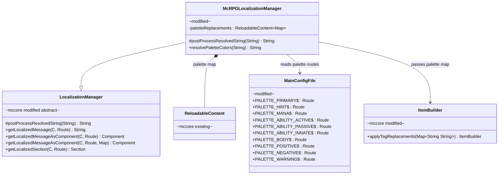
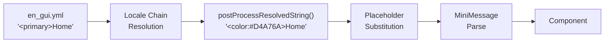
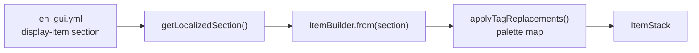

# Phase 1 LLD: Palette Infrastructure & GUI Locale Sweep

> **HLD Reference:** [docs/hld/gui/gui-ux-system.md](../../hld/gui/gui-ux-system.md)
> **Status:** Implemented

## Scope

Phase 1 delivers the runtime palette replacement infrastructure and a comprehensive color sweep of `en_gui.yml`. The palette system adds a `palette` section to `config.yml`, loads palette-to-MiniMessage mappings via `ReloadableContent`, and hooks into McCore's `LocalizationManager` so that semantic placeholders (`<primary>`, `<hint>`, `<body>`, etc.) are resolved before MiniMessage parsing across all localization paths — including direct message sends, GUI titles, and `ItemBuilder`-based slot items. The `en_gui.yml` sweep replaces every deprecated color usage (`<gold>`, `<red>` on navigation, `<black>` on titles) with palette placeholders, standardizes all back button labels to the `"Back to [Parent]"` pattern with contextual lore, and fixes all identified bugs.

**In scope:**
- McCore: `LocalizationManager` post-processing hook (`postProcessResolvedString`) for subclass-provided string transformations
- McCore: `ItemBuilder` tag replacement support for display names and lore strings
- McRPG: `McRPGLocalizationManager` palette replacement override using config-driven `ReloadableContent<Map<String, String>>`
- McRPG: `MainConfigFile` palette route constants
- McRPG: `config.yml` palette section with all 10 palette role defaults
- McRPG: Full color sweep of `en_gui.yml` — titles, back buttons, sort buttons, home slots, pagination buttons, value highlights, body text, click hints, status indicators
- McRPG: Back button label standardization to `"Back to [Parent]"` pattern with `<primary>` color and contextual `<body>` lore
- McRPG: Bug fixes — broken MiniMessage tag (`./gray>`), loadout lore YAML scalar, title typo, naming mismatch, "action abr" typo, "rested levels" copy-paste error
- McRPG: Palette comment header added to top of `en_gui.yml`
- Unit tests for palette replacement logic and locale parse verification

**Out of scope (later phases):**
- Ability display overhaul: type tags, toggle status, click hints on ability items (Phase 2)
- Ability name color-by-type in `en_abilities.yml` (Phase 2)
- Upgrade quest slot separation in `AbilityAttributeEditGui` (Phase 3)
- Color sweep of remaining locale files: `en_abilities.yml`, `en_skills.yml`, `en_commands.yml`, `en_quest.yml`, `en.yml`, `en_stats.yml` (Phase 4)

---

## Class Diagrams

**Legend:** Abstract classes annotated `abstract` · Interfaces annotated `interface` · McCore classes annotated `mccore` · Classes with Phase 1 additions annotated `modified` · New classes/methods annotated `new` · `*--` composition · `o--` association · `-->` dependency · `..|>` implements · `--|>` extends

### Diagram 1: Palette Replacement Infrastructure

The palette system hooks into McCore's `LocalizationManager` via an overridable post-processing method. `McRPGLocalizationManager` overrides it to apply palette string replacements loaded from `config.yml`.



### Diagram 2: Locale Resolution Pipeline (Updated)

How a locale string flows from YAML to rendered Component, with the new palette replacement step.



For `ItemBuilder`-based items (slot display items):



---

## 1. McCore Changes

### 1.1 `LocalizationManager` — Post-Processing Hook

**Package:** `com.diamonddagger590.mccore.localization`

Add an overridable post-processing method that subclasses can use to transform resolved locale strings. The default implementation is identity (no-op). McRPG overrides it for palette replacement.

```java
/**
 * Post-processes a resolved locale string before it is returned or parsed by MiniMessage.
 * Subclasses override this to apply plugin-specific transformations such as
 * palette placeholder replacement.
 *
 * @param raw The resolved locale string.
 * @return The post-processed string.
 */
@NotNull
protected String postProcessResolvedString(@NotNull String raw) {
    return raw;
}
```

**Integration points** — `postProcessResolvedString` is called in:
1. All `getLocalizedMessage(...)` overloads — after locale chain resolution, before returning the `String`
2. All `getLocalizedMessageAsComponent(...)` overloads — after locale chain resolution and placeholder substitution, before MiniMessage `deserialize()`
3. `getLocalizedSection(...)` — on each string value in the returned section (display item name, each lore line). If section wrapping is impractical, this is deferred to the `ItemBuilder` path (see 1.2)

**Rationale:** This is a generic extensibility hook, not McRPG-specific logic. Any downstream plugin using McCore's localization can override it for custom string transformations. The alternative (MiniMessage `TagResolver`) was considered but rejected because `getLocalizedSection`/`ItemBuilder` paths bypass custom resolvers, and string replacement before MiniMessage parsing is more robust for the `<tag>` → `<color:hex>` expansion pattern.

### 1.2 `ItemBuilder` — Tag Replacement Support

**Package:** `com.diamonddagger590.mccore.gui`

Add a method to apply string replacements to the display name and all lore lines of an `ItemBuilder`. This enables palette replacement for items built from `getLocalizedSection()`.

```java
/**
 * Applies the provided tag replacements to this builder's display name and all lore lines.
 * Each key in the map is replaced with its corresponding value in the display name and every
 * lore entry. Replacements are applied in iteration order.
 *
 * @param replacements Map of tag strings to their replacement values.
 * @return This builder for chaining.
 */
@NotNull
public ItemBuilder applyTagReplacements(@NotNull Map<String, String> replacements) {
    // Apply to display name
    // Apply to each lore line
    return this;
}
```

This method is called by McRPG slot classes after `ItemBuilder.from(section)` to apply palette colors before the item is finalized.

---

## 2. McRPG Changes

### 2.1 `McRPGLocalizationManager` — Palette Replacement

**File:** `src/main/java/us/eunoians/mcrpg/localization/McRPGLocalizationManager.java`

Add palette replacement infrastructure:

```java
public final class McRPGLocalizationManager extends LocalizationManager<McRPG, McRPGPlayer> {

    private final McRPGDisplayDecimalFormatter displayDecimalFormatter;
    private final ReloadableContent<Map<String, String>> paletteReplacements;

    public McRPGLocalizationManager(McRPG mcRPG) {
        super(mcRPG);
        this.displayDecimalFormatter = new McRPGDisplayDecimalFormatter(this);
        this.paletteReplacements = buildPaletteReplacements(mcRPG);
    }

    /**
     * Builds the palette replacement map from config.yml. Each palette role
     * (e.g., "primary") maps to its configured MiniMessage value
     * (e.g., {@code <color:#D4A76A>}). The map keys are the full placeholder
     * strings including angle brackets (e.g., {@code <primary>}).
     *
     * @param mcRPG The plugin instance.
     * @return A reloadable content wrapping the palette map.
     */
    @NotNull
    private ReloadableContent<Map<String, String>> buildPaletteReplacements(@NotNull McRPG mcRPG) {
        YamlDocument config = mcRPG.registryAccess()
                .registry(RegistryKey.MANAGER)
                .manager(McRPGManagerKey.FILE)
                .getFile(FileType.MAIN_CONFIG);

        return new ReloadableContent<>(config, MainConfigFile.PALETTE_PRIMARY, (doc, ignored) -> {
            Map<String, String> map = new LinkedHashMap<>();
            map.put("<primary>", doc.getString(MainConfigFile.PALETTE_PRIMARY, "<color:#D4A76A>"));
            map.put("<hint>", doc.getString(MainConfigFile.PALETTE_HINT, "<color:#E8C97A>"));
            map.put("<mana>", doc.getString(MainConfigFile.PALETTE_MANA, "<color:#5EA8FF>"));
            map.put("<ability-active>", doc.getString(MainConfigFile.PALETTE_ABILITY_ACTIVE, "<color:#FF7B5E>"));
            map.put("<ability-passive>", doc.getString(MainConfigFile.PALETTE_ABILITY_PASSIVE, "<color:#7FB87F>"));
            map.put("<ability-innate>", doc.getString(MainConfigFile.PALETTE_ABILITY_INNATE, "<color:#9E9E9E>"));
            map.put("<body>", doc.getString(MainConfigFile.PALETTE_BODY, "<gray>"));
            map.put("<positive>", doc.getString(MainConfigFile.PALETTE_POSITIVE, "<green>"));
            map.put("<negative>", doc.getString(MainConfigFile.PALETTE_NEGATIVE, "<red>"));
            map.put("<warning>", doc.getString(MainConfigFile.PALETTE_WARNING, "<yellow>"));
            return map;
        });
    }

    /**
     * Returns the current palette replacement map. Used by slot classes when applying
     * tag replacements to ItemBuilders built from localized sections.
     *
     * @return The palette replacement map (keys are {@code <placeholder>}, values are MiniMessage strings).
     */
    @NotNull
    public Map<String, String> getPaletteReplacements() {
        return paletteReplacements.getContent();
    }

    /**
     * Applies palette color replacement to the given string. Replaces semantic
     * placeholders ({@code <primary>}, {@code <hint>}, etc.) with their configured
     * MiniMessage values ({@code <color:#D4A76A>}, etc.).
     *
     * @param raw The raw string potentially containing palette placeholders.
     * @return The string with palette placeholders resolved to MiniMessage color tags.
     */
    @NotNull
    public String resolvePaletteColors(@NotNull String raw) {
        return postProcessResolvedString(raw);
    }

    @NotNull
    @Override
    protected String postProcessResolvedString(@NotNull String raw) {
        String result = raw;
        for (Map.Entry<String, String> entry : paletteReplacements.getContent().entrySet()) {
            result = result.replace(entry.getKey(), entry.getValue());
        }
        return result;
    }

    // ... existing methods unchanged (getLocaleChain, getLocalizedMessage template overload,
    //     generateLocaleChain, getDisplayDecimalFormatter, getRegisteredLocales,
    //     getServerDefaultLocale) ...
}
```

**`ReloadableContent` tracking:** The `paletteReplacements` `ReloadableContent` must be tracked via `ReloadableContentManager` so that `/mcrpg admin reload` updates the palette map. Registration happens in `McRPGBootstrap` or in the localization manager's initialization path — the implementing agent should follow the same pattern used for mana stat `ReloadableContent` tracking.

### 2.2 `McRPGPreviousGuiSlot` — Apply Palette to ItemBuilder

**File:** `src/main/java/us/eunoians/mcrpg/gui/common/slot/McRPGPreviousGuiSlot.java`

Update `getItem()` to apply palette replacements after building from the localized section:

```java
@Override
public ItemBuilder getItem(@NotNull McRPGPlayer mcRPGPlayer) {
    McRPGLocalizationManager localizationManager = RegistryAccess.registryAccess()
            .registry(RegistryKey.MANAGER).manager(McRPGManagerKey.LOCALIZATION);
    Route route = localizationManager.doesAnyLocaleContainRoute(mcRPGPlayer, getSpecificDisplayItemRoute())
            ? getSpecificDisplayItemRoute()
            : LocalizationKey.GUI_COMMON_PREVIOUS_GUI_BUTTON_DISPLAY_ITEM;
    ItemBuilder itemBuilder = ItemBuilder.from(localizationManager.getLocalizedSection(mcRPGPlayer, route));
    itemBuilder.addPlaceholders(getPlaceholders(mcRPGPlayer));
    itemBuilder.applyTagReplacements(localizationManager.getPaletteReplacements());
    return itemBuilder;
}
```

**All slot classes that call `ItemBuilder.from(getLocalizedSection(...))` must add the `applyTagReplacements` call.** This is a mechanical change. The full list of affected slot classes is enumerated in the Implementation Order (section 8).

### 2.3 `MainConfigFile` — Palette Routes

**File:** `src/main/java/us/eunoians/mcrpg/configuration/file/MainConfigFile.java`

```java
// Palette (color theming)
private static final String PALETTE_HEADER = "palette";
/** Primary color: GUI titles, navigation names, stat value highlights. Default: <color:#D4A76A> */
public static final Route PALETTE_PRIMARY = Route.fromString(toRoutePath(PALETTE_HEADER, "primary"));
/** Hint color: click prompts, calls-to-action. Default: <color:#E8C97A> */
public static final Route PALETTE_HINT = Route.fromString(toRoutePath(PALETTE_HEADER, "hint"));
/** Mana color: mana cost values, mana-related lore. Default: <color:#5EA8FF> */
public static final Route PALETTE_MANA = Route.fromString(toRoutePath(PALETTE_HEADER, "mana"));
/** Active ability color: combo-activated ability names and type tags. Default: <color:#FF7B5E> */
public static final Route PALETTE_ABILITY_ACTIVE = Route.fromString(toRoutePath(PALETTE_HEADER, "ability-active"));
/** Passive ability color: event-driven ability names and type tags. Default: <color:#7FB87F> */
public static final Route PALETTE_ABILITY_PASSIVE = Route.fromString(toRoutePath(PALETTE_HEADER, "ability-passive"));
/** Innate ability color: always-on ability names, disabled/inactive states. Default: <color:#9E9E9E> */
public static final Route PALETTE_ABILITY_INNATE = Route.fromString(toRoutePath(PALETTE_HEADER, "ability-innate"));
/** Body text color: descriptive lore, labels before values. Default: <gray> */
public static final Route PALETTE_BODY = Route.fromString(toRoutePath(PALETTE_HEADER, "body"));
/** Positive color: enabled, success, accepted. Default: <green> */
public static final Route PALETTE_POSITIVE = Route.fromString(toRoutePath(PALETTE_HEADER, "positive"));
/** Negative color: disabled, error, deny. Default: <red> */
public static final Route PALETTE_NEGATIVE = Route.fromString(toRoutePath(PALETTE_HEADER, "negative"));
/** Warning color: caution, expiration, approaching limits. Default: <yellow> */
public static final Route PALETTE_WARNING = Route.fromString(toRoutePath(PALETTE_HEADER, "warning"));
```

### 2.4 `config.yml` — Palette Section

**File:** `src/main/resources/config.yml`

Add at the top level (after `stats:`, before `configuration:`):

```yaml
# ─── Color Palette ───
# Semantic color placeholders used in all locale YAML files. Locale files reference
# these as <primary>, <hint>, <mana>, etc. — the localization system replaces them
# with the MiniMessage values configured here before parsing.
# Change any value to retheme the entire plugin. Use any valid MiniMessage color tag
# (e.g., <color:#hexcode>, <gold>, <aqua>, etc.).
palette:
  # GUI titles, navigation item names, stat value highlights, skill names in lore
  primary: "<color:#D4A76A>"
  # Click hints, calls-to-action, interactive prompts
  hint: "<color:#E8C97A>"
  # Mana cost values, mana-related lore
  mana: "<color:#5EA8FF>"
  # Active (ComboActivatable) ability names and type tags
  ability-active: "<color:#FF7B5E>"
  # Passive ability names and type tags
  ability-passive: "<color:#7FB87F>"
  # Innate ability names, disabled/inactive states
  ability-innate: "<color:#9E9E9E>"
  # All descriptive/body lore text, labels before values
  body: "<gray>"
  # Enabled, success, accepted
  positive: "<green>"
  # Disabled, error, deny, abandon
  negative: "<red>"
  # Caution, expiration, approaching limits
  warning: "<yellow>"
```

---

## 3. `en_gui.yml` Sweep — Replacement Rules

The sweep applies the following replacement rules to every entry in `en_gui.yml`. Rules are ordered by priority — if multiple rules could apply to the same string, higher-priority rules win.

### 3.1 Color Replacement Table

| Current Pattern | Replacement | Applies To | Examples |
|---|---|---|---|
| `<gold>` in `title:` values | `<primary>` | All GUI titles | `<gold>Home GUI` → `<primary>Home GUI` |
| `<black>` in `title:` values | `<primary>` | Experience bank + redeem GUI titles | `<black>Experience Bank` → `<primary>Experience Bank` |
| `<red>` in back button `name:` | `<primary>` | All `previous-gui-button` names | `<red>Return to Home Menu</red>` → `<primary>Back to Home` |
| `<red>` in home slot `name:` | `<primary>` | All `home-gui.*-slot` names | `<red>Abilities` → `<primary>Abilities` |
| `<red>` in sort button `name:` | `<primary>` | All `ability-sort-types.*` and `skill-sort-types.*` names | `<red>Alphabetical Sort` → `<primary>Alphabetical Sort` |
| `<red>` in remote transfer category `name:` | `<primary>` | All `remote-transfer-gui.categories.*` sort names | `<red>Click to change sort category.` → `<primary>Click to change sort category.` |
| `<gold>` in pagination `name:` | `<primary>` | `gui.common.next-page-button`, `previous-page-button` | `<gold>Next Page</gold>` → `<primary>Next Page` |
| `<gold>` as value highlight in lore | `<primary>` | All `<gold><placeholder>` patterns in lore | `<gold><tier>` → `<primary><tier>` |
| `<gold>` in non-title item names | `<primary>` | Loadout slots, settings, quest board entries, etc. | `<gold>Ability Tier Upgrade</gold>` → `<primary>Ability Tier Upgrade` |
| `<gray>` in body/label text | `<body>` | Descriptive lore lines, labels before values | `<gray>Click to view your abilities.` → `<body>Click to view your abilities.` |
| `<gray>` wrapping entire lore line | `<body>` | Lines like `'<gray>.....</gray>'` | `<gray>Skill: <primary><skill>` |
| `<gold>Click` / `<yellow>Click` prompts | `<hint>Click` | Interactive click-to-do prompts | `<gold>Click <body>to edit...` → `<hint>Click <body>to edit...` |
| `<yellow>Click to accept` | `<hint>Click to accept` | Quest board acceptance prompts | |
| `<yellow>Click to view details` | `<hint>Click to view details` | Quest slot view prompts | |
| `<yellow>Right-click to preview` | `<hint>Right-click to preview` | Board offering preview prompt | |
| `<green>` for enabled/success | `<positive>` | Toggle states, acceptance messages | `<green>Enabled` → `<positive>Enabled` |
| `<green>Quest accepted!` | `<positive>Quest accepted!` | Board acceptance feedback | |
| `<red>` for disabled/error | `<negative>` | Error messages, disabled states, deny | `<red>Disabled` → `<negative>Disabled` |
| `<red>` in error chat messages | `<negative>` | `slots-full`, `on-cooldown`, `group-no-permission`, etc. | `<red>You have no available quest slots.` → `<negative>You have no available quest slots.` |
| `<yellow>` for expiration/caution | `<warning>` | Expiration lines (NOT click hints) | `<yellow><time>` in `expires-in` → `<warning><time>` |

### 3.2 Exceptions — Do NOT Replace

| Pattern | Reason |
|---|---|
| `<red>Confirm Abandon` (quest-abandon-confirm title) | Destructive confirmation — `<negative>` is semantically correct |
| `<red>Abandon Quest` (abandon button name) | Destructive action button |
| `<red>This cannot be undone!` (abandon confirmation lore) | Destructive warning |
| `<yellow>R`, `<aqua>L`, `<dark_gray>→` in combo display | Combo pattern coloring is functional, not thematic |
| `<white>` in objective/reward lines | Content color, not a palette role |
| `<dark_gray>` in combo display | Functional separator color |
| `<green>Go Back` (abandon cancel button) | Positive action — keep as `<positive>Go Back` |
| `<red><quest_name>` in `unknown-quest-slot` | Error state — use `<negative>` |
| `<gray>Coming Soon` (coming-soon-slot name) | Disabled/unavailable — use `<ability-innate>` |
| `<gray>Empty Combo Slot` (empty combo slot name) | Disabled/unavailable — use `<ability-innate>` |
| `<gray>No Group Quests Available` (group-no-offerings name) | Disabled/unavailable — use `<ability-innate>` |

### 3.3 Back Button Standardization

All back buttons follow this pattern:

- **Name color:** `<primary>`
- **Verb:** `"Back to"` (never "Return to")
- **Target:** The parent GUI's display name as shown in its title
- **Material:** `BARRIER` (unchanged)
- **Lore:** Single contextual line using `<body>`, describing where the button goes

| Current Name | New Name | New Lore |
|---|---|---|
| `<red>Return to Previous GUI</red>` | `<primary>Back to Previous GUI` | `<body>Click to return to the previous menu.` |
| `<red>Return to Home Menu</red>` | `<primary>Back to Home` | `<body>Click to return to the home menu.` |
| `<red>Back to Active Quests</red>` | `<primary>Back to Active Quests` | `<body>Click to return to your active quests.` |
| `<red>Return to Quest Board</red>` | `<primary>Back to Quest Board` | `<body>Click to return to the quest board.` |
| `<red>Back to Quest History</red>` | `<primary>Back to Quest History` | `<body>Click to return to quest history.` |
| `<red>Return to Ability Selection</red>` | `<primary>Back to Viewing Abilities` | `<body>Click to return to the ability list.` |
| `<red>Return to loadout selection</red>` | `<primary>Back to Viewing Loadouts` | `<body>Click to return to the loadout list.` |
| `<red>Return to editing Loadout</red>` | `<primary>Back to Editing Loadout` | `<body>Click to return to your loadout.` |
| `<red>Return to Home Menu</red>` (settings) | `<primary>Back to Home` | `<body>Click to return to the home menu.` |
| `<red>Return to Editing <ability></red>` | `<primary>Back to Editing <ability>` | `<body>Click to return to editing <primary><ability><body>.` |
| `<red>Return to Home Menu</red>` (experience bank) | `<primary>Back to Home` | `<body>Click to return to the home menu.` |
| `<red>Return to the Experience Bank</red>` | `<primary>Back to Experience Bank` | `<body>Click to return to the experience bank.` |
| `<red>Return to selecting a Skill</red>` | `<primary>Back to Select Skill` | `<body>Click to return to skill selection.` |

---

## 4. Bug Fixes

### 4.1 Broken MiniMessage Close Tag

**File:** `en_gui.yml`, lines ~1212 and ~1245

```yaml
# Before (broken):
lore:
  - '<gray>Click to return to selecting a Skill./gray>'

# After (fixed):
lore:
  - '<body>Click to return to skill selection.'
```

This bug appears in both `redeemable-experience-gui.previous-gui-button` and `redeemable-levels-gui.previous-gui-button`. Both are fixed as part of the back button standardization.

### 4.2 Loadout GUI Back Button Lore — YAML Scalar

**File:** `en_gui.yml`, line ~703

```yaml
# Before (broken — scalar instead of list):
lore: '<gray>Click to return to the loadout selection screen.</gray>'

# After (fixed — proper list):
lore:
  - '<body>Click to return to the loadout list.'
```

### 4.3 Home GUI Title Typo

**File:** `en_gui.yml`, line ~39

```yaml
# Before:
title: "<gold>Home Gui"

# After:
title: "<primary>Home GUI"
```

### 4.4 Ability Edit Back Button Naming Mismatch

**File:** `en_gui.yml`, line ~525

The back button says "Return to Ability Selection" but the target GUI's title is "Viewing Abilities". Fixed by the back button standardization to "Back to Viewing Abilities".

### 4.5 Settings Experience Display Typo

**File:** `en_gui.yml`, line ~863

```yaml
# Before:
- '<body>Displays gained experience through an action abr.'

# After:
- '<body>Displays gained experience through an action bar.'
```

### 4.6 Redeemable Levels Prompt Copy-Paste Error

**File:** `en_gui.yml`, line ~1267

```yaml
# Before:
prompt: '<body>Please type in chat how many rested levels you would like to redeem. You have <primary><redeemable-experience> ...'

# After:
prompt: '<body>Please type in chat how many redeemable levels you would like to redeem. You have <primary><redeemable-levels> ...'
```

Note the placeholder also changes from `<redeemable-experience>` to `<redeemable-levels>`.

---

## 5. Palette Comment Header

Add the following comment block to the top of `en_gui.yml`, after the existing file header comment:

```yaml
#######################################
#
# English localization for McRPG GUI elements.
# This file is part of the English (en) locale.
#
# ─── Color Palette ───
# This file uses semantic color placeholders that resolve to MiniMessage values
# configured in config.yml's palette section. Available placeholders:
#
#   <primary>        Warm Amber (#D4A76A)  — titles, nav items, stat values
#   <hint>           Warm Yellow (#E8C97A) — click hints, calls-to-action
#   <mana>           Sky Blue (#5EA8FF)    — mana costs
#   <ability-active> Coral (#FF7B5E)       — active ability names/tags
#   <ability-passive>Sage Green (#7FB87F)  — passive ability names/tags
#   <ability-innate> Silver (#9E9E9E)      — innate abilities, disabled states
#   <body>           Gray                  — body text, labels
#   <positive>       Green                 — enabled, success
#   <negative>       Red                   — disabled, error, deny
#   <warning>        Yellow                — caution, expiration
#
# Server owners can customize all colors in config.yml under the 'palette' section.
#
#######################################
```

---

## 6. Slot Classes Requiring `applyTagReplacements` Call

Every slot class that builds an `ItemBuilder` from a localized section must add `itemBuilder.applyTagReplacements(localizationManager.getPaletteReplacements())` before returning the item. The following is the exhaustive list.

### 6.1 Slots Using `McRPGPreviousGuiSlot` (Handled by 2.2)

All GUIs that create `McRPGPreviousGuiSlot` instances inherit the fix from section 2.2. No per-GUI changes needed for these.

### 6.2 Other Slot Classes Requiring Manual Update

| Slot Class | Pattern |
|---|---|
| `HomeSettingsSlot` | `ItemBuilder.from(getLocalizedSection(...))` |
| `HomeAbilitiesSlot` | Same pattern |
| `HomeSkillsSlot` | Same pattern |
| `HomeLoadoutSlot` | Same pattern |
| `HomeQuestsSlot` | Same pattern |
| `HomeExperienceBankSlot` | Same pattern |
| `HomeBoardSlot` | Same pattern |
| `HomeComingSoonSlot` | Same pattern |
| `AbilitySlot` | `ability.getDisplayItemBuilder(...)` + dynamic lore — use `resolvePaletteColors` on dynamic lore lines |
| `AbilitySortType` (anonymous slot) | `ItemBuilder.from(getLocalizedSection(...))` |
| `SkillSortType` (anonymous slot) | Same pattern |
| `QuestHistorySortSlot` | Same pattern |
| `BoardOfferingSlot` | Same pattern + dynamic lore |
| `ScopedOfferingSlot` | Same pattern + dynamic lore |
| `BoardBackSlot` | Same pattern |
| `ScopedBackSlot` | Same pattern |
| `NoOfferingsSlot` | Same pattern |
| `ScopedNoOfferingsSlot` | Same pattern |
| `ScopedTabSlot` | Same pattern |
| `ActiveQuestSlot` | Same pattern + dynamic lore |
| `CompletedQuestSlot` | Same pattern |
| `UnknownQuestSlot` | Same pattern |
| `QuestDetailOverviewSlot` | Same pattern |
| `QuestDetailPhaseHeaderSlot` | Same pattern |
| `QuestDetailStageSlot` | Same pattern + dynamic lore |
| `QuestDetailObjectiveSlot` | Same pattern + dynamic lore |
| `QuestDetailRewardSlot` | Same pattern + dynamic lore |
| `QuestDetailDurationSlot` | Same pattern |
| `QuestDetailAbandonSlot` | Same pattern |
| `QuestAbandonConfirmSlot` | Same pattern |
| `QuestAbandonCancelSlot` | Same pattern |
| `QuestAbandonInfoSlot` | Same pattern |
| All `AbilityAttributeEditGui` attribute slots | Via `GuiModifiableAttribute.getSlot()` |
| All loadout slots | `LoadoutAbilitySlot`, `FreeAbilitySlot`, `LoadoutDisplayOpenSlot`, `ComboInfoSlot`, `ComboZoneFillerSlot`, `ActiveComboSlot` |
| All loadout selection slots | `LoadoutSelectionSlot`, `LoadoutSelectionSlotGeyser` |
| All loadout display slots | `EditNameSlot`, `EditDisplayItemSlot`, `ToggleLoadoutActiveSlot` |
| All loadout display item input slots | `ItemInputHighlightSlot`, `CancelItemEditSlot`, `ConfirmItemEditSlot` |
| All loadout ability select slots | `AbilitySelectSlot` |
| All player setting slots | `ExperienceDisplaySettingSlot`, `KeepHandEmptySettingSlot`, `KeepHotbarSlotEmptySettingSlot`, `LocaleSettingSlot`, `RequireEmptyOffhandSettingSlot`, `DisableBonusExperienceConsumptionSettingSlot`, `QuestProgressNotificationSettingSlot` |
| Experience bank slots | `RedeemableExperienceSlot`, `RedeemableLevelsSlot`, `BoostedExperienceSlot`, `RestedExperienceSlot` |
| Redeem GUI slots | `RedeemAmountSlot`, `RedeemAllSlot`, `RedeemCustomSlot` |
| Remote transfer slots | `RemoteTransferSortOption` (sort slot), `RemoteTransferBlockSlot`, `ToggleEntireCategorySlot` |
| Common slots | `McRPGFillerSlot`, `McRPGNextPageSlot`, `McRPGPreviousPageSlot` |

**The mechanical pattern for each slot class** is identical:

```java
// After ItemBuilder is constructed from a localized section:
McRPGLocalizationManager localizationManager = RegistryAccess.registryAccess()
        .registry(RegistryKey.MANAGER).manager(McRPGManagerKey.LOCALIZATION);
itemBuilder.applyTagReplacements(localizationManager.getPaletteReplacements());
```

For slots that add dynamic lore lines (resolved from separate locale keys or built programmatically), each dynamic string must also pass through `localizationManager.resolvePaletteColors(line)` before being added to the builder.

---

## 7. Key Flows

### 7.1 GUI Title Resolution (Updated)

```
Player opens a GUI (e.g., HomeGui)
  └─> GUI constructor calls Bukkit.createInventory(player, size, component)
      └─> component = localizationManager.getLocalizedMessageAsComponent(
              mcRPGPlayer, LocalizationKey.HOME_GUI_TITLE)
          ├─> Locale chain resolution: finds "gui.home-gui.title" in en_gui.yml
          │   └─> Returns raw string: "<primary>Home GUI"
          ├─> postProcessResolvedString("<primary>Home GUI")
          │   └─> Palette replacement: "<color:#D4A76A>Home GUI"
          ├─> MiniMessage.deserialize("<color:#D4A76A>Home GUI")
          └─> Returns Component with warm amber colored "Home GUI"
```

### 7.2 Slot Item Resolution (Updated)

```
GUI paints a slot (e.g., HomeAbilitiesSlot)
  └─> slot.getItem(mcRPGPlayer)
      ├─> localizationManager.getLocalizedSection(mcRPGPlayer, HOME_GUI_ABILITIES_SLOT_DISPLAY_ITEM)
      │   └─> Returns YAML section: {name: "<primary>Abilities", material: DIAMOND_ORE, lore: [...]}
      ├─> ItemBuilder.from(section)
      │   └─> Builds ItemStack with raw palette strings in name/lore
      ├─> itemBuilder.applyTagReplacements(localizationManager.getPaletteReplacements())
      │   └─> Replaces <primary> → <color:#D4A76A>, <body> → <gray>, etc.
      │   └─> MiniMessage parses the resolved strings into Components
      └─> Returns ItemStack with correctly colored display
```

### 7.3 Config Reload Flow

```
Admin runs /mcrpg admin reload
  └─> ReloadableContentManager processes all tracked ReloadableContent
      ├─> paletteReplacements ReloadableContent updates
      │   └─> Re-reads config.yml palette section
      │   └─> Rebuilds Map<String, String> with new values
      └─> Next GUI open / slot render uses updated palette
```

---

## 8. Implementation Order

Steps are grouped by dependency. Within a group, items can be done in any order.

**Group A: McCore Infrastructure (no McRPG dependencies)**

1. **`LocalizationManager.postProcessResolvedString()`** — add protected hook method; wire into all `getLocalizedMessage*` overloads
2. **`ItemBuilder.applyTagReplacements()`** — add tag replacement method for display name and lore

**Group B: McRPG Palette Infrastructure (depends on Group A)**

3. **`MainConfigFile` palette routes** — add all 10 `PALETTE_*` route constants
4. **`config.yml` palette section** — add the `palette:` block with defaults
5. **`McRPGLocalizationManager` palette replacement** — add `paletteReplacements` field, `buildPaletteReplacements()`, override `postProcessResolvedString()`, add `resolvePaletteColors()`, add `getPaletteReplacements()`
6. **`ReloadableContent` tracking** — register `paletteReplacements` with `ReloadableContentManager` (follow existing pattern from mana stat registration)

**Group C: Slot Class Updates (depends on Group B)**

7. **`McRPGPreviousGuiSlot`** — add `applyTagReplacements` call (covers all back buttons)
8. **`McRPGNextPageSlot` / `McRPGPreviousPageSlot`** — add `applyTagReplacements` call (covers pagination)
9. **`McRPGFillerSlot`** — add `applyTagReplacements` call (filler items have empty names but should still route through)
10. **Home GUI slots** — add `applyTagReplacements` call to all 7 home slots
11. **Ability/Skill sort type slots** — add `applyTagReplacements` in `AbilitySortType.getSlot()` and `SkillSortType.getSlot()`
12. **All remaining slot classes** — mechanical sweep per the list in section 6.2

**Group D: `en_gui.yml` Sweep (depends on Group B being available for testing)**

13. **Palette comment header** — add to top of file
14. **Title sweep** — replace all `<gold>`/`<black>` in `title:` values with `<primary>` (exception: `<red>Confirm Abandon` stays as `<negative>Confirm Abandon`)
15. **Back button standardization** — update all `previous-gui-button` entries per section 3.3
16. **Home GUI slot names** — `<red>` → `<primary>`
17. **Sort button names** — `<red>` → `<primary>`
18. **Value highlights** — `<gold><placeholder>` → `<primary><placeholder>` throughout
19. **Body text** — `<gray>` → `<body>` on descriptive lore lines
20. **Click hints** — `<gold>Click`/`<yellow>Click` → `<hint>Click`
21. **Status indicators** — `<green>Enabled` → `<positive>Enabled`, `<red>Disabled` → `<negative>Disabled`, etc.
22. **Error/feedback messages** — `<red>` error strings → `<negative>`, `<green>` success → `<positive>`
23. **Warning/expiration** — `<yellow>` expiration lines → `<warning>` (NOT click hints)
24. **Disabled state items** — `<gray>Coming Soon` → `<ability-innate>Coming Soon`, `<gray>Empty Combo Slot` → `<ability-innate>Empty Combo Slot`
25. **Pagination buttons** — `<gold>Next Page` → `<primary>Next Page`

**Group E: Bug Fixes (part of Group D sweep, listed explicitly for tracking)**

26. **Fix broken `./gray>` tag** — both redeem GUI back button lore entries
27. **Fix loadout GUI lore scalar** — convert to list
28. **Fix "Home Gui" typo** — capitalize "GUI"
29. **Fix ability edit back button name** — "Back to Viewing Abilities"
30. **Fix "action abr" typo** — "action bar"
31. **Fix "rested levels" copy-paste** — "redeemable levels" + correct placeholder

**Group F: Unit Tests (depends on Groups A–E)**

32. **`PaletteReplacementTest`** — palette replacement logic
33. **`LocaleParseVerificationTest`** — all en_gui.yml entries parse cleanly

---

## 9. Unit Tests

### 9.1 `PaletteReplacementTest`

Tests for the palette replacement logic in `McRPGLocalizationManager`:

- `<primary>` is replaced with the configured value from config (default `<color:#D4A76A>`)
- `<hint>` is replaced with `<color:#E8C97A>`
- `<body>` is replaced with `<gray>`
- `<positive>` is replaced with `<green>`
- `<negative>` is replaced with `<red>`
- `<warning>` is replaced with `<yellow>`
- All 10 palette roles are replaced in a single string containing multiple placeholders
- Unknown placeholders (e.g., `<unknown>`) pass through unmodified
- Strings with no palette placeholders are returned unchanged
- Nested palette tags work: `<body>Mana Cost: <mana>30` → `<gray>Mana Cost: <color:#5EA8FF>30`
- Config reload updates the palette map — changed value is reflected on next call
- Empty string input returns empty string
- String with only a palette placeholder returns just the replacement value

### 9.2 `PaletteConfigLoadTest`

Tests for palette config loading:

- Default config values match `PALETTE.md` documented defaults
- Missing palette key falls back to hardcoded default (e.g., if `primary` is absent, uses `<color:#D4A76A>`)
- Custom palette values in config override defaults
- `ReloadableContent` updates on config change

### 9.3 `LocaleParseVerificationTest`

Verifies all entries in the updated `en_gui.yml` parse without MiniMessage errors. This test:

- Loads `en_gui.yml` via the localization system
- Applies palette replacement to every string value
- Attempts `MiniMessage.deserialize()` on each resolved string
- Asserts no exceptions are thrown (catches bugs like `./gray>`)
- Covers: all `title:` entries, all `name:` entries in `display-item:` sections, all `lore:` entries

### 9.4 `ItemBuilderTagReplacementTest`

Tests for the new `ItemBuilder.applyTagReplacements()` method:

- Display name replacements are applied
- All lore line replacements are applied
- Empty replacement map is a no-op
- Replacement map with no matching tags is a no-op
- Multiple replacements in a single string all apply

### 9.5 `BackButtonConsistencyTest`

Validates all back button locale entries follow the standardized pattern:

- Every `previous-gui-button` entry under `gui.*` has `name:` starting with `<primary>Back to`
- Every `previous-gui-button` entry has `material: BARRIER`
- Every `previous-gui-button` lore is a YAML list (not scalar)
- The common fallback `gui.common.previous-gui-button` follows the same pattern

---

## 10. Resolved Design Decisions

1. **String replacement over MiniMessage `TagResolver`**: Palette placeholders are resolved via string replacement (`String.replace`) before MiniMessage parsing, rather than registering custom MiniMessage `TagResolver`s. String replacement was chosen because: (a) it works uniformly across all paths including `getLocalizedSection`/`ItemBuilder` which bypass MiniMessage's resolver chain, (b) it correctly handles the `<tag>` → `<color:hex>` expansion pattern where the replacement is itself a MiniMessage tag, and (c) it's simpler for implementing agents to understand and debug. The downside — replacement order matters if a replacement value itself contains another placeholder — is mitigated by the palette being a flat map with no self-references.

2. **McCore hook over McRPG-only approach**: The `postProcessResolvedString` hook lives in McCore's `LocalizationManager` because it is a generic extensibility point that any downstream plugin could use for string transformations. The alternative — overriding every `getLocalizedMessage*` method in `McRPGLocalizationManager` — would be fragile (new McCore methods wouldn't be covered) and would not handle `getLocalizedSection` paths. The McCore hook ensures all resolution paths are covered.

3. **`ItemBuilder.applyTagReplacements()` over section wrapping**: Rather than wrapping BoostedYAML `Section` objects to intercept string reads, the LLD adds an explicit `applyTagReplacements()` method on `ItemBuilder`. This is more explicit (call sites clearly show that palette processing happens), doesn't fight BoostedYAML's immutable section model, and gives call sites control over when replacement occurs (important for slots that add dynamic lore lines after the initial section build).

4. **`ReloadableContent` for palette over static load**: The palette map is loaded via `ReloadableContent` so that `/mcrpg admin reload` updates palette colors without a server restart. This follows the established pattern for mana stat config values. The `ReloadableContent` trigger key is `PALETTE_PRIMARY` (any palette key could serve as the trigger since the entire map is rebuilt on any change).

5. **Contextual back button lore over generic**: Back button lore retains context-specific text (e.g., "Click to return to the home menu.") rather than a generic "Click to go back." This preserves useful context for players without requiring them to read the item name. The standardization is in the verb ("Back to"), color (`<primary>` name, `<body>` lore), and format (single lore line as a list), not in collapsing all lore to a single generic string.

6. **`<negative>` exception for destructive confirmation titles**: The quest-abandon-confirm GUI title uses `<negative>Confirm Abandon` instead of `<primary>`. This is the only title exception. The red color communicates danger for an irreversible action, which is more important than visual consistency with other GUI titles. The rule is: destructive confirmation dialogs may use `<negative>` for their title.

7. **Full `en_gui.yml` sweep including quest GUI entries**: Phase 1 sweeps ALL of `en_gui.yml`, including quest board, quest detail, quest history, and quest abandon entries. The HLD's "Phase 4: Remaining Locale Sweep" is updated to cover the OTHER locale files (`en_abilities.yml`, `en_skills.yml`, `en_commands.yml`, `en_quest.yml`, `en.yml`, `en_stats.yml`), not `en_gui.yml` entries.

8. **`<body>` vs literal `<gray>`**: All body/label text uses `<body>` instead of literal `<gray>`, even though the default value of `<body>` is `<gray>`. This enables server owners to change body text color (e.g., to `<white>` for a lighter theme) and establishes the semantic placeholder pattern consistently.

9. **`<ability-innate>` for disabled/unavailable item names**: Items representing unavailable or disabled states (e.g., "Coming Soon", "Empty Combo Slot", "No Group Quests Available") use `<ability-innate>` (silver/gray) for their names rather than `<body>`. This distinguishes "this is descriptive text" (`<body>`) from "this is an unavailable/inactive item" (`<ability-innate>`).

10. **Palette section placement in `config.yml`**: The `palette:` section is placed at the top level (after `stats:`, before `configuration:`) because it is a cross-cutting concern that affects all player-facing output, not a subsection of any particular configuration domain. It is not nested under `configuration:` to avoid implying it's an advanced admin setting.

11. **Close tag support in palette replacement**: The palette replacement system maps both opening tags (`<primary>` → `<color:#D4A76A>`) and their corresponding closing tags (`</primary>` → `</color:#D4A76A>`). This was not in the original design but was added during implementation because server owners reasonably expect MiniMessage close-tag notation to work with palette placeholders (e.g., `<primary>text</primary>`). Implemented via a private `addPaletteEntry()` helper in `McRPGLocalizationManager` that adds both forms to the replacement map for each role.

12. **`GuiModifiableAttribute` classes require `applyTagReplacements()`**: The original slot enumeration in section 6.2 did not include `GuiModifiableAttribute` implementations (`AbilityToggledOffAttribute`, `AbilityTierAttribute`, `AbilityLocationAttribute`, `MassHarvestPullItemsAttribute`, `RemoteTransferItemSetAttribute`). These classes build `ItemBuilder` instances from localized sections directly, bypassing the normal slot wiring, and therefore require explicit `applyTagReplacements()` calls in their `getItem()` methods. All five were updated during implementation.

13. **Default loadout display name used hardcoded colors**: `Loadout.getDefaultDisplayItem()` hardcoded `"<gray>Loadout <gold>" + getLoadoutSlot()` rather than using palette placeholders. Changed to `"<primary>Loadout " + getLoadoutSlot()` to be consistent with the palette system.

---

## 11. Open Items / Future Considerations

1. **Remaining locale file sweeps**: Phase 4 sweeps `en_abilities.yml` (ability names, stat values, descriptions), `en_skills.yml` (skill display), `en_commands.yml` (command feedback), `en_quest.yml` (reward labels, objective descriptions), `en.yml` (general messages), and `en_stats.yml` (stat display). The palette infrastructure built in Phase 1 supports these with zero Java changes — only YAML updates are needed.

2. **`getLocalizedSection` post-processing**: The current design requires every slot class to manually call `applyTagReplacements()`. A future McCore enhancement could have `getLocalizedSection` return a section wrapper that applies post-processing automatically, eliminating the per-slot boilerplate. This was deferred from Phase 1 to keep the McCore change minimal.

3. **Third-party locale files**: Third-party plugins adding locale files via `registerLanguageFile()` can use palette placeholders in their YAML. The `postProcessResolvedString` hook applies to all locale resolution paths, so third-party strings automatically benefit from palette replacement.

4. **Palette placeholder in chat messages**: Phase 1 focuses on GUI elements (`en_gui.yml`). Chat messages (ability feedback, quest notifications, command responses) in other locale files still use raw MiniMessage colors until Phase 4. The palette infrastructure supports them — only the YAML files need updating.

5. **`ScopedBackSlot` using common back button**: The `ScopedBackSlot` currently uses `GUI_COMMON_PREVIOUS_GUI_BUTTON_DISPLAY_ITEM` instead of a board-specific key. Phase 1 updates the common button to use `<primary>` color and standardized text, which improves this slot's display. A future enhancement could give it a dedicated locale key for more specific text ("Back to Quest Board" vs generic "Back to Previous GUI").

6. **Dynamic lore palette resolution**: Slots that add dynamic lore lines (e.g., `AbilityLoreAppender`, `BoardOfferingSlot` objective/reward lines) must call `resolvePaletteColors()` on each dynamic string. This is a manual step that could be missed for new code. The `CLAUDE.md` and `core.mdc` rules should be updated to mention this requirement. A future McCore enhancement could make `ItemBuilder.addDisplayLoreComponent()` auto-resolve palette tags.
