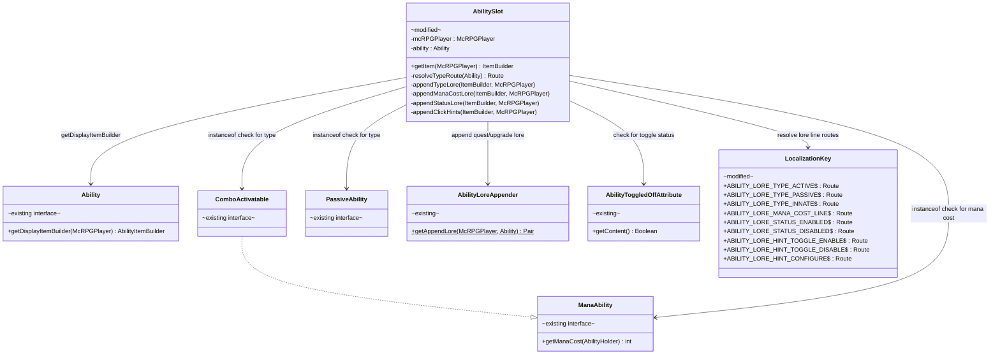
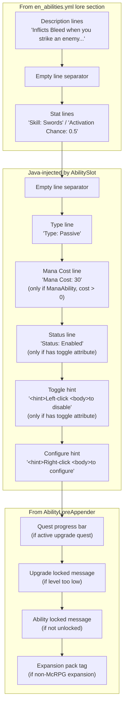

# Phase 2 LLD: Ability Display Overhaul

> **HLD Reference:** [docs/hld/gui-ux-system.md](../../hld/gui-ux-system.md)
> **Phase 1 LLD:** [phase-1-palette-infrastructure-and-locale-sweep.md](phase-1-palette-infrastructure-and-locale-sweep.md)
> **Status:** Complete

## Scope

Phase 2 delivers the ability display overhaul for the Viewing Abilities GUI. Ability item names are recolored from the legacy `<red>` to per-ability type palette placeholders (`<ability-active>`, `<ability-passive>`, `<ability-innate>`). `AbilitySlot` gains Java-injected lore lines for ability type tag, mana cost (for `ManaAbility` with cost > 0), toggle status (if `AbilityToggledOffAttribute` is present), and click hints. The full `en_abilities.yml` is swept to replace all deprecated color tags (`<red>`, `<gold>`, `<gray>`) with palette placeholders. Enchantment glint is retained alongside the new text-based status indicator.

**In scope:**
- Per-ability name color changes in `en_abilities.yml` using type placeholders
- Java-injected lore lines in `AbilitySlot`: type tag, mana cost, toggle status, click hints
- New shared locale keys in `en_abilities.yml` for all injected lore lines
- New `Route` constants in `LocalizationKey.java` for all new locale keys
- Full `en_abilities.yml` color sweep: `<gray>` to `<body>`, `<gold>` to `<primary>`, `<red>` to palette roles
- Palette comment header added to `en_abilities.yml` (matching Phase 1's `en_gui.yml` header)
- Dynamic palette system: server owners can define arbitrary custom color tags under `palette:` in `config.yml`
- Geyser-aware click hints: Bedrock players see a single "Click to configure" hint instead of separate left/right hints
- Mana cost display uses `McRPGDisplayDecimalFormatter` (0 min / 2 max fraction digits) for future-proofing
- Document third-party ability locale color requirements in `CLAUDE.md` and the HLD extension points section
- Unit tests for ability type resolution, lore injection ordering, locale parse verification, and dynamic palette tags

**Out of scope (later phases):**
- Upgrade quest slot separation in `AbilityAttributeEditGui` (Phase 3)
- Color sweep of remaining locale files: `en_skills.yml`, `en_commands.yml`, `en_quest.yml`, `en.yml`, `en_stats.yml` (Phase 4)

---

## Class Diagrams

**Legend:** Interfaces annotated `interface` . Modified classes annotated `modified` . Existing unmodified classes annotated `existing` . `-->` dependency . `..|>` implements . `--|>` extends

### Diagram 1: AbilitySlot Lore Injection Pipeline

How `AbilitySlot` builds the complete ability item with injected lore lines.



### Diagram 2: Ability Item Lore Order

The complete lore structure for an ability item after Phase 2.



---

## 1. Modifications to Existing Classes

### 1.1 `AbilitySlot` -- Lore Injection and Type Resolution

**File:** `src/main/java/us/eunoians/mcrpg/gui/ability/slot/AbilitySlot.java`

The `getItem()` method is restructured to inject new lore lines between the base ability lore and the `AbilityLoreAppender` content. Four private helper methods are extracted for the four categories of injected content.

```java
@NotNull
@Override
public ItemBuilder getItem(@NotNull McRPGPlayer mcRPGPlayer) {
    McRPGLocalizationManager localizationManager = mcRPGPlayer.getPlugin().registryAccess()
            .registry(RegistryKey.MANAGER).manager(McRPGManagerKey.LOCALIZATION);
    MiniMessage miniMessage = McRPG.getInstance().getMiniMessage();

    ItemBuilder itemBuilder = ability.getDisplayItemBuilder(mcRPGPlayer);

    itemBuilder.addDisplayLoreComponent(Component.empty());

    appendTypeLore(itemBuilder, mcRPGPlayer, localizationManager, miniMessage);
    appendManaCostLore(itemBuilder, mcRPGPlayer, localizationManager, miniMessage);
    appendStatusLore(itemBuilder, mcRPGPlayer, localizationManager, miniMessage);
    appendClickHints(itemBuilder, mcRPGPlayer, localizationManager, miniMessage);

    Pair<List<String>, Map<String, String>> loreAppender = AbilityLoreAppender.getAppendLore(mcRPGPlayer, ability);
    Map<String, String> placeholders = loreAppender.getRight();
    itemBuilder.addPlaceholders(placeholders);
    for (String line : loreAppender.getLeft()) {
        String resolved = line;
        for (Map.Entry<String, String> entry : placeholders.entrySet()) {
            resolved = resolved.replace("<" + entry.getKey() + ">", entry.getValue());
        }
        resolved = localizationManager.resolvePaletteColors(resolved);
        itemBuilder.addDisplayLoreComponent(miniMessage.deserialize(resolved)
                .decoration(TextDecoration.ITALIC, false));
    }

    mcRPGPlayer.asSkillHolder().getAbilityData(ability)
            .flatMap(data -> data.getAbilityAttribute(AbilityAttributeRegistry.ABILITY_TOGGLED_OFF_ATTRIBUTE_KEY))
            .ifPresent(attr -> itemBuilder.setEnchantGlint(
                    !((AbilityToggledOffAttribute) attr).getContent()));

    return itemBuilder;
}
```

#### 1.1.1 `resolveTypeRoute()` -- Ability Type Classification

Determines the correct locale route for the type tag based on the ability's interfaces. Classification follows the HLD rules:

```java
/**
 * Resolves the locale route for the ability's type tag lore line.
 * Classification per HLD: ComboActivatable = Active, PassiveAbility with
 * ABILITY_UNLOCKED_ATTRIBUTE in applicable attributes = Passive,
 * otherwise (no unlock -- always present in loadouts) = Innate.
 *
 * @param ability The ability to classify.
 * @return The locale route for the type tag line.
 */
@NotNull
private Route resolveTypeRoute(@NotNull Ability ability) {
    if (ability instanceof ComboActivatable) {
        return LocalizationKey.ABILITY_LORE_TYPE_ACTIVE;
    }
    if (ability instanceof PassiveAbility
            && ability.getApplicableAttributes().contains(AbilityAttributeRegistry.ABILITY_UNLOCKED_ATTRIBUTE)) {
        return LocalizationKey.ABILITY_LORE_TYPE_PASSIVE;
    }
    return LocalizationKey.ABILITY_LORE_TYPE_INNATE;
}
```

Note: The HLD defines innate as "no `ABILITY_UNLOCKED_ATTRIBUTE` in applicable attributes". This is a meaningful progression distinction: innate abilities are always present in loadouts and don't require unlocking, while passive abilities must be earned through skill progression. The type resolution checks `ability.getApplicableAttributes().contains(ABILITY_UNLOCKED_ATTRIBUTE)` to distinguish passive from innate among `PassiveAbility` implementations. See Resolved Design Decision 7.

#### 1.1.2 `appendTypeLore()` -- Type Tag Line

```java
/**
 * Appends the ability type tag lore line (e.g., "Type: Active").
 *
 * @param itemBuilder          The builder to append to.
 * @param mcRPGPlayer          The player context.
 * @param localizationManager  The localization manager.
 * @param miniMessage          The MiniMessage instance.
 */
private void appendTypeLore(@NotNull ItemBuilder itemBuilder, @NotNull McRPGPlayer mcRPGPlayer,
                             @NotNull McRPGLocalizationManager localizationManager,
                             @NotNull MiniMessage miniMessage) {
    Route typeRoute = resolveTypeRoute(ability);
    String typeLine = localizationManager.getLocalizedMessage(mcRPGPlayer, typeRoute);
    itemBuilder.addDisplayLoreComponent(miniMessage.deserialize(typeLine)
            .decoration(TextDecoration.ITALIC, false));
}
```

#### 1.1.3 `appendManaCostLore()` -- Mana Cost Line

Only appended for abilities implementing `ManaAbility` where `getManaCost()` returns > 0.

```java
/**
 * Appends the mana cost lore line if the ability is a {@link ManaAbility} with a positive cost.
 * Uses the player's ability holder to resolve the tier-dependent mana cost.
 * Formats via {@link McRPGDisplayDecimalFormatter} with 0 min / 2 max fraction digits
 * so integers display cleanly (e.g., "30") while fractional costs show up to 2 decimals.
 *
 * @param itemBuilder          The builder to append to.
 * @param mcRPGPlayer          The player context.
 * @param localizationManager  The localization manager.
 * @param miniMessage          The MiniMessage instance.
 */
private void appendManaCostLore(@NotNull ItemBuilder itemBuilder, @NotNull McRPGPlayer mcRPGPlayer,
                                 @NotNull McRPGLocalizationManager localizationManager,
                                 @NotNull MiniMessage miniMessage) {
    if (!(ability instanceof ManaAbility manaAbility)) {
        return;
    }
    SkillHolder skillHolder = mcRPGPlayer.asSkillHolder();
    int manaCost = manaAbility.getManaCost(skillHolder);
    if (manaCost <= 0) {
        return;
    }
    String formattedCost = localizationManager.getDisplayDecimalFormatter()
            .formatDisplayDecimal(mcRPGPlayer, manaCost, 0, 2);
    String manaLine = localizationManager.getLocalizedMessage(mcRPGPlayer,
            LocalizationKey.ABILITY_LORE_MANA_COST_LINE);
    manaLine = manaLine.replace("<mana-cost>", formattedCost);
    itemBuilder.addDisplayLoreComponent(miniMessage.deserialize(manaLine)
            .decoration(TextDecoration.ITALIC, false));
}
```

#### 1.1.4 `appendStatusLore()` -- Toggle Status Line

Only appended if the ability has an `AbilityToggledOffAttribute` in its `AbilityData`.

```java
/**
 * Appends the toggle status lore line ("Status: Enabled" or "Status: Disabled") if the
 * ability has an {@link AbilityToggledOffAttribute}.
 *
 * @param itemBuilder          The builder to append to.
 * @param mcRPGPlayer          The player context.
 * @param localizationManager  The localization manager.
 * @param miniMessage          The MiniMessage instance.
 */
private void appendStatusLore(@NotNull ItemBuilder itemBuilder, @NotNull McRPGPlayer mcRPGPlayer,
                               @NotNull McRPGLocalizationManager localizationManager,
                               @NotNull MiniMessage miniMessage) {
    SkillHolder skillHolder = mcRPGPlayer.asSkillHolder();
    Optional<AbilityData> abilityDataOptional = skillHolder.getAbilityData(ability);
    if (abilityDataOptional.isEmpty()) {
        return;
    }
    Optional<AbilityAttribute<?>> toggleAttr = abilityDataOptional.get()
            .getAbilityAttribute(AbilityAttributeRegistry.ABILITY_TOGGLED_OFF_ATTRIBUTE_KEY);
    if (toggleAttr.isEmpty() || !(toggleAttr.get() instanceof AbilityToggledOffAttribute toggled)) {
        return;
    }
    boolean isToggledOff = toggled.getContent();
    Route statusRoute = isToggledOff
            ? LocalizationKey.ABILITY_LORE_STATUS_DISABLED
            : LocalizationKey.ABILITY_LORE_STATUS_ENABLED;
    String statusLine = localizationManager.getLocalizedMessage(mcRPGPlayer, statusRoute);
    itemBuilder.addDisplayLoreComponent(miniMessage.deserialize(statusLine)
            .decoration(TextDecoration.ITALIC, false));
}
```

#### 1.1.5 `appendClickHints()` -- Click Hint Lines

Toggle hint is context-sensitive: shows "Left-click to enable" when disabled, "Left-click to disable" when enabled. Configure hint always shows. Bedrock players (detected via Geyser hook) see a single combined hint instead of separate left/right click hints, since they cannot distinguish click types.

```java
/**
 * Appends click hint lore lines. Toggle hint is shown only if the ability has an
 * {@link AbilityToggledOffAttribute}; configure hint is always shown.
 * Bedrock players (Geyser) receive a single "Click to configure" hint since they
 * cannot distinguish left-click from right-click.
 *
 * @param itemBuilder          The builder to append to.
 * @param mcRPGPlayer          The player context.
 * @param localizationManager  The localization manager.
 * @param miniMessage          The MiniMessage instance.
 */
private void appendClickHints(@NotNull ItemBuilder itemBuilder, @NotNull McRPGPlayer mcRPGPlayer,
                               @NotNull McRPGLocalizationManager localizationManager,
                               @NotNull MiniMessage miniMessage) {
    Optional<GeyserHook> geyserOptional = mcRPGPlayer.getPlugin().registryAccess()
            .registry(RegistryKey.PLUGIN_HOOK).pluginHook(McRPGPluginHookKey.GEYSER);
    boolean isBedrock = geyserOptional.isPresent()
            && geyserOptional.get().isBedrockPlayer(mcRPGPlayer.getUUID());

    if (isBedrock) {
        String bedrockHint = localizationManager.getLocalizedMessage(mcRPGPlayer,
                LocalizationKey.ABILITY_LORE_HINT_CONFIGURE_BEDROCK);
        itemBuilder.addDisplayLoreComponent(miniMessage.deserialize(bedrockHint)
                .decoration(TextDecoration.ITALIC, false));
        return;
    }

    SkillHolder skillHolder = mcRPGPlayer.asSkillHolder();
    Optional<AbilityData> abilityDataOptional = skillHolder.getAbilityData(ability);

    if (abilityDataOptional.isPresent()) {
        Optional<AbilityAttribute<?>> toggleAttr = abilityDataOptional.get()
                .getAbilityAttribute(AbilityAttributeRegistry.ABILITY_TOGGLED_OFF_ATTRIBUTE_KEY);
        if (toggleAttr.isPresent() && toggleAttr.get() instanceof AbilityToggledOffAttribute toggled) {
            Route toggleRoute = toggled.getContent()
                    ? LocalizationKey.ABILITY_LORE_HINT_TOGGLE_ENABLE
                    : LocalizationKey.ABILITY_LORE_HINT_TOGGLE_DISABLE;
            String toggleLine = localizationManager.getLocalizedMessage(mcRPGPlayer, toggleRoute);
            itemBuilder.addDisplayLoreComponent(miniMessage.deserialize(toggleLine)
                    .decoration(TextDecoration.ITALIC, false));
        }
    }

    String configLine = localizationManager.getLocalizedMessage(mcRPGPlayer,
            LocalizationKey.ABILITY_LORE_HINT_CONFIGURE);
    itemBuilder.addDisplayLoreComponent(miniMessage.deserialize(configLine)
            .decoration(TextDecoration.ITALIC, false));
}
```

### 1.2 `LocalizationKey` -- New Route Constants

**File:** `src/main/java/us/eunoians/mcrpg/configuration/file/localization/LocalizationKey.java`

Add new route constants under the existing `ABILITY_LORE_HEADER`:

```java
private static final String ABILITY_LORE_TYPE_HEADER = toRoutePath(ABILITY_LORE_HEADER, "type");
/** Type tag for active (ComboActivatable) abilities. */
public static final Route ABILITY_LORE_TYPE_ACTIVE =
        Route.fromString(toRoutePath(ABILITY_LORE_TYPE_HEADER, "active"));
/** Type tag for passive abilities. */
public static final Route ABILITY_LORE_TYPE_PASSIVE =
        Route.fromString(toRoutePath(ABILITY_LORE_TYPE_HEADER, "passive"));
/** Type tag for innate abilities (no unlock attribute). */
public static final Route ABILITY_LORE_TYPE_INNATE =
        Route.fromString(toRoutePath(ABILITY_LORE_TYPE_HEADER, "innate"));

/** Mana cost line for ManaAbility abilities. Placeholder: <mana-cost> */
public static final Route ABILITY_LORE_MANA_COST_LINE =
        Route.fromString(toRoutePath(ABILITY_LORE_HEADER, "mana-cost-line"));

private static final String ABILITY_LORE_STATUS_HEADER = toRoutePath(ABILITY_LORE_HEADER, "status");
/** Status line when ability is enabled. */
public static final Route ABILITY_LORE_STATUS_ENABLED =
        Route.fromString(toRoutePath(ABILITY_LORE_STATUS_HEADER, "enabled"));
/** Status line when ability is disabled. */
public static final Route ABILITY_LORE_STATUS_DISABLED =
        Route.fromString(toRoutePath(ABILITY_LORE_STATUS_HEADER, "disabled"));

private static final String ABILITY_LORE_HINT_HEADER = toRoutePath(ABILITY_LORE_HEADER, "hint");
/** Hint shown when ability is disabled (left-click to enable). */
public static final Route ABILITY_LORE_HINT_TOGGLE_ENABLE =
        Route.fromString(toRoutePath(ABILITY_LORE_HINT_HEADER, "toggle-enable"));
/** Hint shown when ability is enabled (left-click to disable). */
public static final Route ABILITY_LORE_HINT_TOGGLE_DISABLE =
        Route.fromString(toRoutePath(ABILITY_LORE_HINT_HEADER, "toggle-disable"));
/** Hint for opening the ability configure/edit GUI. */
public static final Route ABILITY_LORE_HINT_CONFIGURE =
        Route.fromString(toRoutePath(ABILITY_LORE_HINT_HEADER, "configure"));
/** Hint for Bedrock (Geyser) players who cannot distinguish click types. */
public static final Route ABILITY_LORE_HINT_CONFIGURE_BEDROCK =
        Route.fromString(toRoutePath(ABILITY_LORE_HINT_HEADER, "configure-bedrock"));
```

### 1.3 `AbilityLoreAppender` -- Palette Resolution on Dynamic Lines

**File:** `src/main/java/us/eunoians/mcrpg/builder/item/ability/AbilityLoreAppender.java`

No structural changes. The `AbilityLoreAppender` returns raw locale strings that may contain palette placeholders (after the `en_abilities.yml` sweep). The `AbilitySlot.getItem()` method already applies `localizationManager.resolvePaletteColors(resolved)` to each appended line before MiniMessage parsing (see section 1.1 code).

If `resolvePaletteColors()` is not already being called on `AbilityLoreAppender` output in the current code, the Phase 2 `AbilitySlot` changes add it.

### 1.4 `McRPGLocalizationManager` -- Dynamic Palette Tags

**File:** `src/main/java/us/eunoians/mcrpg/localization/McRPGLocalizationManager.java`

The `buildPaletteReplacements()` method is refactored from hardcoded per-role `addPaletteEntry()` calls to a dynamic iteration over all keys in the `palette` section. This allows server owners to define arbitrary custom color tags by simply adding new entries to `config.yml`'s `palette:` section.

**Before (hardcoded):**

```java
private ReloadableContent<Map<String, String>> buildPaletteReplacements(@NotNull McRPG mcRPG) {
    YamlDocument config = mcRPG.registryAccess()
            .registry(RegistryKey.MANAGER)
            .manager(McRPGManagerKey.FILE)
            .getFile(FileType.MAIN_CONFIG);
    return new ReloadableContent<>(config, MainConfigFile.PALETTE_PRIMARY, (doc, ignored) -> {
        Map<String, String> map = new LinkedHashMap<>();
        addPaletteEntry(map, "primary", doc.getString(MainConfigFile.PALETTE_PRIMARY, "<color:#D4A76A>"));
        addPaletteEntry(map, "hint", doc.getString(MainConfigFile.PALETTE_HINT, "<color:#E8C97A>"));
        // ... 8 more hardcoded entries ...
        return map;
    });
}
```

**After (dynamic):**

```java
/**
 * Builds the palette replacement map by iterating all keys under the {@code palette}
 * section in {@code config.yml}. Each key becomes a usable placeholder in locale YAML
 * files (e.g., a key {@code "my-color"} with value {@code "<color:#ABC123>"} enables
 * {@code <my-color>} and {@code </my-color>} in any locale string).
 * <p>
 * The 10 built-in palette roles (primary, hint, mana, etc.) are always present via
 * {@code config.yml} defaults. Server owners can add arbitrary additional entries
 * without any Java changes.
 *
 * @param mcRPG The plugin instance.
 * @return A {@link ReloadableContent} wrapping the palette replacement map.
 */
@NotNull
private ReloadableContent<Map<String, String>> buildPaletteReplacements(@NotNull McRPG mcRPG) {
    YamlDocument config = mcRPG.registryAccess()
            .registry(RegistryKey.MANAGER)
            .manager(McRPGManagerKey.FILE)
            .getFile(FileType.MAIN_CONFIG);
    return new ReloadableContent<>(config, MainConfigFile.PALETTE_SECTION, (doc, ignored) -> {
        Map<String, String> map = new LinkedHashMap<>();
        Section paletteSection = doc.getSection(MainConfigFile.PALETTE_SECTION);
        if (paletteSection == null) {
            return map;
        }
        for (Object key : paletteSection.getKeys()) {
            String roleName = key.toString();
            String value = paletteSection.getString(roleName);
            if (value != null && !value.isBlank()) {
                addPaletteEntry(map, roleName, value);
            }
        }
        return map;
    });
}
```

**Key changes:**
- The `ReloadableContent` trigger route changes from `MainConfigFile.PALETTE_PRIMARY` to `MainConfigFile.PALETTE_SECTION` (a section-level `Route` constant) so that any modification to the palette section (including adding new keys) triggers a rebuild.
- All 10 individual `PALETTE_*` route constants are removed from `MainConfigFile` (see section 1.5). The dynamic iteration replaces their purpose entirely.

### 1.5 `MainConfigFile` -- Palette Route Cleanup

**File:** `src/main/java/us/eunoians/mcrpg/configuration/file/MainConfigFile.java`

Remove all 10 individual `PALETTE_*` route constants (`PALETTE_PRIMARY`, `PALETTE_HINT`, `PALETTE_MANA`, `PALETTE_ABILITY_ACTIVE`, `PALETTE_ABILITY_PASSIVE`, `PALETTE_ABILITY_INNATE`, `PALETTE_BODY`, `PALETTE_POSITIVE`, `PALETTE_NEGATIVE`, `PALETTE_WARNING`). Replace with a single section-level route:

```java
// Palette (color theming)
private static final String PALETTE_HEADER = "palette";
/** Section-level route for the entire palette block. Used as the ReloadableContent trigger. */
public static final Route PALETTE_SECTION = Route.fromString(PALETTE_HEADER);
```

**Rationale:** Individual `Route` constants in `MainConfigFile` carry an implicit contract that those keys always exist in `config.yml`. Since the palette is now fully dynamic (server owners can add or remove keys), having per-key routes is misleading -- it implies the code depends on those specific keys being present. The `buildPaletteReplacements()` method iterates the section generically and never references these constants. Any code that previously read a specific palette value via these routes (none currently does) should instead use `getPaletteReplacements().get("<primary>")` from the localization manager.

### 1.6 `config.yml` -- Palette Comment Update

Update the palette section comment to inform server owners they can add custom entries:

```yaml
# Semantic color placeholders used in all locale YAML files. Locale files reference
# these as <primary>, <hint>, <mana>, etc. — the localization system replaces them
# with the MiniMessage values configured here before parsing.
# Change any value to retheme the entire plugin. Use any valid MiniMessage color tag
# (e.g., <color:#hexcode>, <gold>, <aqua>, etc.).
#
# You can also add your own custom color tags here. Any key you add becomes a usable
# placeholder in locale files. For example, adding:
#   my-guild-color: "<color:#FF00FF>"
# lets you use <my-guild-color> in any locale YAML string.
palette:
  # GUI titles, navigation item names, stat value highlights, skill names in lore
  primary: "<color:#D4A76A>"
  # ... existing entries ...
```

---

## 2. `en_abilities.yml` Changes

### 2.1 Palette Comment Header

Add the same style of palette reference header used in `en_gui.yml` (Phase 1):

```yaml
#######################################
#
# English localization for McRPG abilities.
# This file is part of the English (en) locale.
#
# Color Palette
# This file uses semantic color placeholders that resolve to MiniMessage values
# configured in config.yml's palette section. Available placeholders:
#
#   <primary>         Warm Amber (#D4A76A)  -- titles, nav items, stat values
#   <hint>            Warm Yellow (#E8C97A) -- click hints, calls-to-action
#   <mana>            Sky Blue (#5EA8FF)    -- mana costs
#   <ability-active>  Coral (#FF7B5E)       -- active ability names/tags
#   <ability-passive> Sage Green (#7FB87F)  -- passive ability names/tags
#   <ability-innate>  Silver (#9E9E9E)      -- innate abilities, disabled states
#   <body>            Gray                  -- body text, labels
#   <positive>        Green                 -- enabled, success
#   <negative>        Red                   -- disabled, error, deny
#   <warning>         Yellow                -- caution, expiration
#
# Server owners can customize all colors in config.yml under the 'palette' section.
# You can also define your own custom color tags there — any key you add becomes
# a usable <placeholder> in this file.
#
#######################################
```

### 2.2 New Shared Lore Keys

Add under the existing `ability.lore` section:

```yaml
ability:
  lore:
    type:
      # Shown for ComboActivatable abilities
      active: '<body>Type: <ability-active>Active'
      # Shown for PassiveAbility abilities
      passive: '<body>Type: <ability-passive>Passive'
      # Shown for abilities with no unlock attribute
      innate: '<body>Type: <ability-innate>Innate'
    # Placeholder: <mana-cost> (resolved to the tier-dependent mana cost integer)
    mana-cost-line: '<body>Mana Cost: <mana><mana-cost>'
    status:
      enabled: '<body>Status: <positive>Enabled'
      disabled: '<body>Status: <negative>Disabled'
    hint:
      # Shown when ability is currently disabled
      toggle-enable: '<hint>Left-click <body>to enable'
      # Shown when ability is currently enabled
      toggle-disable: '<hint>Left-click <body>to disable'
      # Always shown (all abilities have an edit GUI)
      configure: '<hint>Right-click <body>to configure'
      # Shown for Bedrock (Geyser) players instead of separate left/right hints
      configure-bedrock: '<hint>Click <body>to configure'
    # ... existing quest, upgrade-locked-behind-levelup, ability-locked, expansion-pack keys ...
```

### 2.3 Ability Name Color Changes

Each ability's `name:` value is changed from `<red><ability></red>` to the correct type placeholder. The classification for every current ability:

**Active (ComboActivatable) -- use `<ability-active>`:**

| Ability | Current | New |
|---|---|---|
| RageSpike | `<red><ability></red>` | `<ability-active><ability>` |
| SerratedStrikes | `<red><ability></red>` | `<ability-active><ability>` |
| OreScanner | `<red><ability></red>` | `<ability-active><ability>` |
| VerdantSurge | `<red><ability></red>` | `<ability-active><ability>` |
| MassHarvest | `<red><ability></red>` | `<ability-active><ability>` |

**Passive (PassiveAbility + has ABILITY_UNLOCKED_ATTRIBUTE) -- use `<ability-passive>`:**

| Ability | Current | New |
|---|---|---|
| DeeperWound | `<red><ability></red>` | `<ability-passive><ability>` |
| EnhancedBleed | `<red><ability></red>` | `<ability-passive><ability>` |
| Vampire | `<red><ability></red>` | `<ability-passive><ability>` |
| ItsATriple | `<red><ability></red>` | `<ability-passive><ability>` |
| RemoteTransfer | `<red><ability></red>` | `<ability-passive><ability>` |
| DryadsGift | `<red><ability></red>` | `<ability-passive><ability>` |
| NymphsVitality | `<red><ability></red>` | `<ability-passive><ability>` |
| HeavySwing | `<red><ability></red>` | `<ability-passive><ability>` |

**Innate (PassiveAbility, no ABILITY_UNLOCKED_ATTRIBUTE -- always present, no unlock) -- use `<ability-innate>`:**

| Ability | Current | New |
|---|---|---|
| Bleed | `<red><ability></red>` | `<ability-innate><ability>` |
| ExtraOre | `<red><ability></red>` | `<ability-innate><ability>` |
| ExtraLumber | `<red><ability></red>` | `<ability-innate><ability>` |
| TooManyPlants | `<red><ability></red>` | `<ability-innate><ability>` |
| InstantIrrigation | `<red><ability></red>` | `<ability-innate><ability>` |

**Note:** The implementing agent must verify each ability's interfaces AND applicable attributes at implementation time. If an ability implements `ComboActivatable`, it is Active. If it implements `PassiveAbility` AND its `getApplicableAttributes()` contains `AbilityAttributeRegistry.ABILITY_UNLOCKED_ATTRIBUTE`, it is Passive. Otherwise it is Innate (always present in loadouts, no unlock requirement). Classification is about progression status, not activation mechanics.

### 2.4 Full Color Sweep

Every occurrence in `en_abilities.yml` is replaced per these rules:

| Current Pattern | Replacement | Applies To |
|---|---|---|
| `<gray>` in body text / labels | `<body>` | All lore lines like `'<gray>Inflicts Bleed...'` |
| `<gold>` as value highlight | `<primary>` | All `<gold><placeholder>` patterns |
| `<gold>` wrapping inline text | `<primary>` | `<gold>Lv <next-tier-level></gold>` etc. |
| `<red>` in feedback messages | `<negative>` | `cooldown.ability-still-on-cooldown` |
| `<green>` in success messages | `<positive>` | `unlock.ability-unlocked`, `unlock.ability-added-to-loadout` |
| `<red>` in error messages | `<negative>` | `unlock.ability-not-added-duplicate-skill` |
| `<red>Bleed</red>` in description | `<ability-innate>Bleed` | Inline ability name references in descriptions |

**Complete replacement examples:**

```yaml
# Before:
lore:
  - '<gray>Inflicts <red>Bleed</red> when you strike an enemy'
  - '<gray>with a sword, dealing damage over time.'
  - ''
  - '<gray>Skill: <gold><skill>'
  - '<gray>Activation Chance: <gold><activation-chance>'

# After:
lore:
  - '<body>Inflicts <ability-innate>Bleed</ability-innate> <body>when you strike an enemy'
  - '<body>with a sword, dealing damage over time.'
  - ''
  - '<body>Skill: <primary><skill>'
  - '<body>Activation Chance: <primary><activation-chance>'
```

```yaml
# Before (cooldown section):
ability-still-on-cooldown: "<red><ability> is still on cooldown."
ability-no-longer-on-cooldown: "<gold><ability> <gray>is now off cooldown!"

# After:
ability-still-on-cooldown: "<negative><ability> is still on cooldown."
ability-no-longer-on-cooldown: "<primary><ability> <body>is now off cooldown!"
```

```yaml
# Before (unlock section):
ability-unlocked: "<green>You have unlocked a new ability! <ability> <green>is now available for use."
ability-added-to-loadout: "<green>The new ability has automatically been added to your current loadout."
ability-not-added-duplicate-skill: "<red>You already have an active ability for the skill <skill> <red>in your loadout, so <ability> <red>was not automatically added."

# After:
ability-unlocked: "<positive>You have unlocked a new ability! <ability> <positive>is now available for use."
ability-added-to-loadout: "<positive>The new ability has automatically been added to your current loadout."
ability-not-added-duplicate-skill: "<negative>You already have an active ability for the skill <skill> <negative>in your loadout, so <ability> <negative>was not automatically added."
```

```yaml
# Before (appended lore):
quest-progress:
  - '<gray>Upgrade Quest Progress: <upgrade-quest-progress>'
upgrade-locked-behind-levelup:
  - '<gray>Upgrade this ability once you reach <gold>Lv <next-tier-level></gold>'
  - '<gray>in <gold><skill></gold><gray>.'
ability-locked:
  - '<gray>Unlock this ability when your <gold><skill></gold> skill'
  - '<gray>reaches level <gold><ability-unlock-level></gold>.'
expansion-pack:
  - '<gray>Expansion Pack: <gold><expansion-pack>'

# After:
quest-progress:
  - '<body>Upgrade Quest Progress: <upgrade-quest-progress>'
upgrade-locked-behind-levelup:
  - '<body>Upgrade this ability once you reach <primary>Lv <next-tier-level>'
  - '<body>in <primary><skill><body>.'
ability-locked:
  - '<body>Unlock this ability when your <primary><skill> <body>skill'
  - '<body>reaches level <primary><ability-unlock-level><body>.'
expansion-pack:
  - '<body>Expansion Pack: <primary><expansion-pack>'
```

```yaml
# Before (ore-scanner specific):
block-detected: "<gray>You've detected <gold><count> <block_type></gold> near you."

# After:
block-detected: "<body>You've detected <primary><count> <block_type> <body>near you."
```

```yaml
# Before (instant-irrigation specific):
activation-message: "<gray>You found a water source! You'll be able to do this again in <gold><cooldown> seconds</gold>."

# After:
activation-message: "<body>You found a water source! You'll be able to do this again in <primary><cooldown> <body>seconds."
```

### 2.5 Exceptions -- Do NOT Replace

| Pattern | Reason |
|---|---|
| `<negative>` already in mana-feedback section | Phase 1/mana system already updated these |
| `<body>` already in mana-feedback section | Same -- already palette-compliant |
| Progress bar characters in `<upgrade-quest-progress>` | Functional display, not thematic text |

---

## 3. Key Flows

### 3.1 Ability Item Display Flow (Updated -- Bleed is Innate)

```
AbilityGui paints a slot (e.g., Bleed)
  |-> AbilitySlot.getItem(mcRPGPlayer)
      |-> ability.getDisplayItemBuilder(mcRPGPlayer)
      |   |-> ConfigurableAbility.getDisplayItemBuilder() default
      |   |-> Resolves en_abilities.yml locale section for bleed
      |   |-> AbilityItemBuilder.from(section, player, ability)
      |   |   |-> Builds ItemStack with name "<ability-innate><ability>"
      |   |   |-> Builds lore with "<body>Skill: <primary>Swords" etc.
      |   |   |-> Resolves placeholders: <ability>, <skill>, <activation-chance>, etc.
      |   |-> applyTagReplacements(paletteReplacements)
      |       |-> "<ability-innate>" -> "<color:#9E9E9E>"
      |       |-> "<body>" -> "<gray>", "<primary>" -> "<color:#D4A76A>"
      |
      |-> itemBuilder.addDisplayLoreComponent(empty)  // blank separator
      |
      |-> appendTypeLore()
      |   |-> resolveTypeRoute(ability) -> ABILITY_LORE_TYPE_INNATE
      |   |   (Bleed is PassiveAbility but has NO ABILITY_UNLOCKED_ATTRIBUTE)
      |   |-> getLocalizedMessage() -> "<body>Type: <ability-innate>Innate"
      |   |-> postProcessResolvedString applies palette
      |   |-> MiniMessage deserialize -> gray "Type: " + silver "Innate"
      |
      |-> appendManaCostLore()
      |   |-> ability instanceof ManaAbility? (Bleed is PassiveAbility, not ManaAbility)
      |   |-> No mana cost line appended
      |
      |-> appendStatusLore()
      |   |-> Check AbilityToggledOffAttribute
      |   |-> toggled.getContent() == false (enabled)
      |   |-> getLocalizedMessage(STATUS_ENABLED) -> "<body>Status: <positive>Enabled"
      |   |-> palette resolved -> gray "Status: " + green "Enabled"
      |
      |-> appendClickHints()
      |   |-> Toggle hint: "<hint>Left-click <body>to disable" (currently enabled)
      |   |-> Configure hint: "<hint>Right-click <body>to configure" (always)
      |
      |-> AbilityLoreAppender.getAppendLore()
      |   |-> If has active upgrade quest: add quest progress bar
      |   |-> If level too low for next tier: add upgrade locked message
      |   |-> Each line palette-resolved via resolvePaletteColors()
      |
      |-> setEnchantGlint(true)  // enabled = glint on
      |-> Return completed ItemBuilder
```

### 3.2 Active Ability Display Flow (e.g., RageSpike)

```
AbilitySlot.getItem(mcRPGPlayer) for RageSpike
  |-> Base item: name "<ability-active>Rage Spike", lore with stats
  |
  |-> appendTypeLore()
  |   |-> resolveTypeRoute -> ABILITY_LORE_TYPE_ACTIVE
  |   |-> gray "Type: " + coral "Active"
  |
  |-> appendManaCostLore()
  |   |-> RageSpike instanceof ManaAbility (via ComboActivatable)
  |   |-> getManaCost(skillHolder) -> evaluates "34-(3.5*tier)" with player's tier
  |   |-> e.g., tier 1 -> 30
  |   |-> formatDisplayDecimal(mcRPGPlayer, 30, 0, 2) -> "30"
  |   |-> getLocalizedMessage(MANA_COST_LINE) -> "<body>Mana Cost: <mana><mana-cost>"
  |   |-> Replace <mana-cost> with "30"
  |   |-> palette resolved -> gray "Mana Cost: " + sky blue "30"
  |
  |-> appendStatusLore() -> "<body>Status: <positive>Enabled"
  |-> appendClickHints() -> "<hint>Left-click <body>to disable" + "<hint>Right-click <body>to configure"
```

---

## 4. Implementation Order

Steps are grouped by dependency.

**Group A: Locale Keys and YAML (no Java dependencies)**

1. **`LocalizationKey.java` route constants** -- add all 10 new routes (type, mana-cost-line, status, hints including bedrock)
2. **`en_abilities.yml` palette comment header** -- add palette reference block
3. **`en_abilities.yml` new shared lore keys** -- add `type`, `mana-cost-line`, `status`, `hint` sections
4. **`en_abilities.yml` ability name color sweep** -- change each ability's `name:` to appropriate type placeholder
5. **`en_abilities.yml` body/value color sweep** -- replace `<gray>` with `<body>`, `<gold>` with `<primary>`
6. **`en_abilities.yml` feedback message sweep** -- replace `<red>`/`<green>` with `<negative>`/`<positive>` in cooldown, unlock, chat messages

**Group B: Dynamic Palette Infrastructure (no locale dependencies)**

7. **`MainConfigFile.PALETTE_SECTION`** -- add section-level route constant, remove all 10 individual `PALETTE_*` routes
8. **`McRPGLocalizationManager.buildPaletteReplacements()`** -- refactor to dynamic section iteration
9. **`config.yml` palette comment** -- update to document custom tag support

**Group C: AbilitySlot Modification (depends on Groups A-B)**

10. **`AbilitySlot.getItem()` restructure** -- add blank separator, extract helper methods
11. **`AbilitySlot.appendTypeLore()`** -- type tag injection with `resolveTypeRoute()`
12. **`AbilitySlot.appendManaCostLore()`** -- mana cost injection for `ManaAbility`
13. **`AbilitySlot.appendStatusLore()`** -- toggle status injection
14. **`AbilitySlot.appendClickHints()`** -- click hint injection
15. **`AbilitySlot.getItem()` palette resolution on `AbilityLoreAppender` lines** -- add `resolvePaletteColors()` call

**Group D: Unit Tests (depends on Groups A-C)**

16. **`AbilitySlotTypeResolutionTest`** -- type route resolution tests
17. **`AbilitySlotLoreInjectionTest`** -- lore ordering and conditional injection tests
18. **`AbilityItemPlaceholderKeysTest` updates** -- if the existing test needs updating for the `MANA_COST` placeholder
19. **`AbilitiesLocaleParseVerificationTest`** -- all `en_abilities.yml` entries parse cleanly after sweep
20. **`DynamicPaletteTagTest`** -- custom palette tags are resolved in locale strings

**Group E: Documentation (depends on Group C)**

21. **`CLAUDE.md` update** -- document third-party ability locale color requirement (must use correct type placeholder in `name:`)
22. **HLD extension points section** -- add note about third-party ability name color requirement

---

## 5. Unit Tests

### 5.1 `AbilitySlotTypeResolutionTest`

Tests for the `resolveTypeRoute()` private method (tested indirectly through `getItem()`):

- `ComboActivatable` ability returns type tag with "Active" text
- `PassiveAbility` with `ABILITY_UNLOCKED_ATTRIBUTE` in applicable attributes returns type tag with "Passive" text
- `PassiveAbility` without `ABILITY_UNLOCKED_ATTRIBUTE` in applicable attributes returns type tag with "Innate" text (e.g., Bleed, ExtraOre)
- Ability that is neither `ComboActivatable` nor `PassiveAbility` returns "Innate" text
- An ability that implements both `ComboActivatable` and `PassiveAbility` resolves as Active (ComboActivatable check takes precedence)

### 5.2 `AbilitySlotLoreInjectionTest`

Tests for lore injection ordering and conditional display:

- Type tag line is always present in the item lore
- Mana cost line is present for `ManaAbility` with cost > 0
- Mana cost line is absent for `ManaAbility` with cost == 0
- Mana cost line is absent for abilities not implementing `ManaAbility`
- Mana cost value reflects the tier-dependent `getManaCost()` result
- Status "Enabled" line is present when `AbilityToggledOffAttribute.getContent()` is `false`
- Status "Disabled" line is present when `AbilityToggledOffAttribute.getContent()` is `true`
- Status line is absent when `AbilityToggledOffAttribute` is not in `AbilityData`
- Toggle hint contains `<hint>Left-click <body>to enable` when ability is disabled
- Toggle hint contains `<hint>Left-click <body>to disable` when ability is enabled
- Toggle hint is absent when `AbilityToggledOffAttribute` is not present
- Configure hint "Right-click to configure" is always present
- Lore order: base lore, blank separator, type tag, mana cost (if applicable), status (if applicable), toggle hint (if applicable), configure hint, then `AbilityLoreAppender` content
- Enchantment glint is set to `true` when ability is enabled (toggle = `false`)
- Enchantment glint is set to `false` when ability is disabled (toggle = `true`)
- `AbilityLoreAppender` lines have palette colors resolved (no raw `<body>` or `<primary>` in final components)

### 5.3 `AbilitiesLocaleParseVerificationTest`

Verifies all entries in the updated `en_abilities.yml` parse without MiniMessage errors (same pattern as Phase 1's `LocaleParseVerificationTest`):

- Loads `en_abilities.yml` via the localization system
- Applies palette replacement to every string value
- Attempts `MiniMessage.deserialize()` on each resolved string
- Asserts no exceptions are thrown
- Covers: all `name:` entries, all `lore:` entries, all message entries, all new shared lore keys

### 5.4 `AbilityNameColorConsistencyTest`

Validates every ability's `name:` in `en_abilities.yml` uses the correct palette type color matching the HLD classification:

- Every `ability-specific-localization.*.display-item.name` starts with either `<ability-active>`, `<ability-passive>`, or `<ability-innate>`
- No ability `name:` contains `<red>` or `<gold>`
- The color used matches the ability's classification: `ComboActivatable` must use `<ability-active>`, `PassiveAbility` with `ABILITY_UNLOCKED_ATTRIBUTE` must use `<ability-passive>`, others must use `<ability-innate>`
- Specifically tests the 5 innate abilities (Bleed, ExtraOre, ExtraLumber, TooManyPlants, InstantIrrigation) use `<ability-innate>`

### 5.5 `DynamicPaletteTagTest`

Tests that the palette system dynamically picks up arbitrary keys from the `palette:` config section:

- Adding a custom key (e.g., `my-custom: "<color:#123456>"`) to the palette section makes `<my-custom>` resolvable via `resolvePaletteColors()`
- The corresponding close tag `</my-custom>` is also resolvable (maps to `</color:#123456>`)
- Built-in palette roles (primary, hint, mana, etc.) still resolve correctly after the refactor
- Empty or blank values in the palette section are skipped (no empty replacement injected)
- Palette rebuild is triggered on config reload (ReloadableContent mechanism)
- Custom tags work in `getPaletteReplacements()` (used by `ItemBuilder.applyTagReplacements()`)
- Custom tags work in `postProcessResolvedString()` (used by locale chain resolution)
- A key with a named MiniMessage tag value (e.g., `my-tag: "<aqua>"`) produces close tag `</aqua>`
- A key with a hex color value (e.g., `my-tag: "<color:#AABBCC>"`) produces close tag `</color:#AABBCC>`

---

## 6. Resolved Design Decisions

1. **Per-ability YAML color over dynamic placeholder**: Each ability's `name:` in `en_abilities.yml` explicitly specifies its type color (`<ability-active>`, `<ability-passive>`, `<ability-innate>`) rather than using a generic `<ability-type-color>` resolved at runtime. This is more tedious for new abilities but gives server owners explicit per-ability color control in locale files. The tradeoff is that new abilities (including third-party) must specify the correct color in their locale YAML. The HLD's extension point documentation should note this requirement.

2. **Java-injected lore over split YAML**: New lore lines (type tag, mana cost, status, hints) are injected by `AbilitySlot` from shared locale keys rather than being part of each ability's `lore:` section. This avoids restructuring every ability's YAML into description/stat sections, keeps conditional display logic in Java (toggle status only shows for toggleable abilities), and ensures future abilities automatically get the lines without YAML changes.

3. **Mana cost auto-injected from shared locale key**: The mana cost line is injected by Java for any `ManaAbility` with `getManaCost() > 0`, using a single shared locale key. This means abilities that gained mana costs in the mana ability system phases (SerratedStrikes, VerdantSurge, etc.) automatically display their mana cost without per-ability YAML changes. The cost is tier-dependent, resolved at display time via `getManaCost(AbilityHolder)`.

4. **Enchantment glint retained alongside text indicator**: The enchantment glint toggle state indicator is kept in addition to the new "Status: Enabled/Disabled" text line. The glint provides at-a-glance visual differentiation in a full inventory of abilities, while the text provides explicit confirmation. The HLD's concern about glint being "easily missed" is addressed by the text indicator without removing the glint's fast-scan benefit.

5. **Toggle hint is context-sensitive**: When an ability is currently disabled, the hint reads "Left-click to enable". When enabled, "Left-click to disable". This is clearer than a generic "Left-click to enable/disable" because the player knows the result of clicking without having to read the status line first.

6. **Toggle presence is data-conditional with universal expectation**: The toggle status and toggle hint lines are only shown if `AbilityToggledOffAttribute` exists in the ability's `AbilityData`. Currently all abilities have this attribute, so the conditional is academic -- but it future-proofs for hypothetical abilities (or third-party abilities) that cannot be toggled. The implementing agent should not expect to encounter an ability without the attribute.

7. **Type classification follows HLD's data-level innate rule**: `resolveTypeRoute()` checks `ComboActivatable` first (Active), then `PassiveAbility` with `ABILITY_UNLOCKED_ATTRIBUTE` in applicable attributes (Passive), then falls through to Innate. Innate is a meaningful progression distinction -- these abilities are always present in loadouts and don't require unlocking, even though they still trigger on events. The 5 current innate abilities (Bleed, ExtraOre, ExtraLumber, TooManyPlants, InstantIrrigation) are correctly classified as Innate because they come free with the skill and cannot be lost. The distinction tells the player: "this ability is always yours" vs "this ability must be earned."

8. **Full `en_abilities.yml` sweep in Phase 2**: The entire `en_abilities.yml` file is swept for palette compliance in this phase, not deferred to Phase 4. This ensures ability display is fully palette-compliant when the structural changes (type tags, mana cost, etc.) ship, avoiding a half-migrated state where new lines use palette colors but existing lines don't.

9. **Lore ordering: new lines after stats, before appender**: Java-injected lines appear after the ability's base YAML lore (which contains both description and stat lines) and before `AbilityLoreAppender` content (quest progress, upgrade locked, etc.). This ordering places ability metadata (type, cost, status) in a logical group below the ability's stats, with progression information (quest progress) at the bottom where it changes most frequently.

10. **Configure hint always shown**: The "Right-click to configure" hint is shown for all abilities, not conditionally. All abilities have an `AbilityAttributeEditGui` accessible via right-click. Even abilities with no editable attributes still open the edit GUI (which shows non-editable attributes). Omitting the hint for some abilities would be confusing since the right-click action always works.

11. **Dynamic palette over hardcoded entries**: The palette system is refactored from 10 hardcoded `addPaletteEntry()` calls to a dynamic iteration over all keys in the `palette:` config section. This allows server owners to define arbitrary custom color tags without Java changes. The built-in 10 roles remain as shipped defaults in `config.yml`, but a server owner can add `my-guild-color: "<color:#FF00FF>"` and immediately use `<my-guild-color>` in any locale file. The 10 individual `PALETTE_*` route constants in `MainConfigFile` are removed entirely -- they implied a contract that those keys always exist, which contradicts the dynamic nature of the section. Only `PALETTE_SECTION` remains as the `ReloadableContent` trigger. The `ReloadableContent` trigger is a section-level route so new keys also trigger rebuilds.

12. **Third-party ability locale color requirements documented in-phase**: The requirement for third-party abilities to specify the correct type color in their locale YAML's `name:` field is documented in `CLAUDE.md` and the HLD extension points section as part of this phase, not deferred. This prevents third-party developers from shipping abilities with wrong/missing colors before the documentation catches up.

13. **Geyser-aware click hints**: Bedrock players (detected via the existing `GeyserHook.isBedrockPlayer()`) see a single `<hint>Click <body>to configure` hint instead of separate left-click/right-click hints. Since Geyser routes all click types to the edit GUI, showing `<hint>Left-click <body>to disable` / `<hint>Right-click <body>to configure` would be misleading. The Bedrock hint short-circuits in `appendClickHints()` before the toggle/configure logic, returning a single line.

14. **Mana cost uses `McRPGDisplayDecimalFormatter` with 0 min / 2 max fraction digits**: Even though `getManaCost()` currently returns `int`, the display uses `formatDisplayDecimal(mcRPGPlayer, manaCost, 0, 2)` so that integer costs render cleanly (e.g., "30" not "30.00") while fractional costs, if ever introduced, automatically show up to 2 decimal places without code changes. This also respects locale-specific decimal separators for international players.

---

## 7. Open Items / Future Considerations

1. **Innate ability type tag description**: The type tag for innate abilities currently says "Innate" (from `ABILITY_LORE_TYPE_INNATE`). The player-facing description in the HLD is "Always active, no unlock requirement." If this wording changes, only the locale key value in `en_abilities.yml` needs updating -- no Java changes required.

2. **Phase 3 interaction**: Phase 3 (Upgrade Quest Slot) will remove quest progress from `AbilityLoreAppender` and move it to a dedicated slot in `AbilityAttributeEditGui`. This will not require reverting any Phase 2 changes -- `AbilityLoreAppender` will simply stop returning quest progress lines, and the `AbilitySlot` lore will naturally not include them.

3. **Ability description inline colors**: Some ability descriptions reference other abilities by name with inline colors (e.g., Bleed's description says `<red>Bleed</red>`). The Phase 2 sweep changes these to the appropriate type color (e.g., `<ability-innate>Bleed</ability-innate>`). This creates a dependency on MiniMessage close-tag support for palette placeholders, which Phase 1 already implemented (see Phase 1 LLD resolved decision 11).
