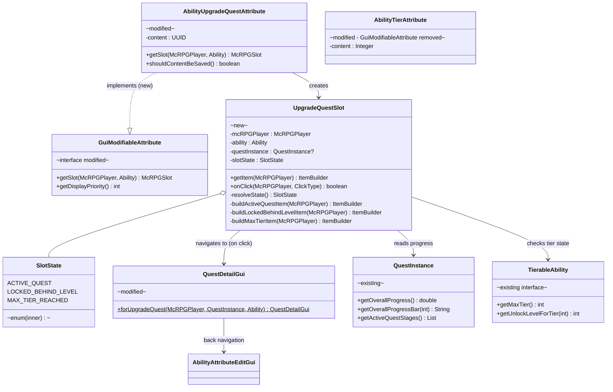
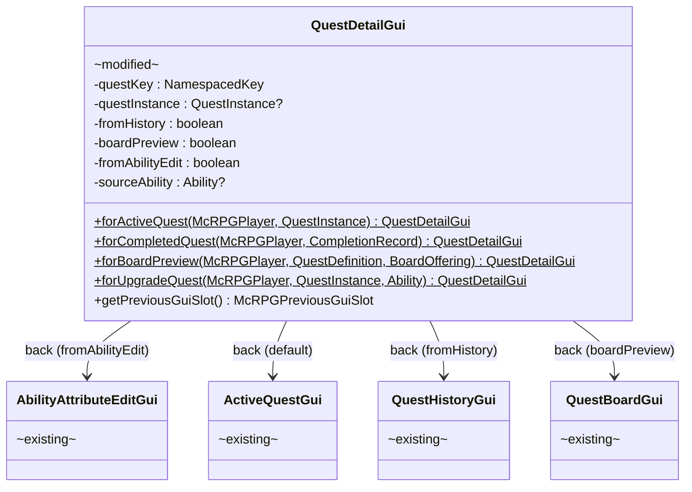

# Phase 3 LLD: Ability Edit GUI Quest Slot

> **HLD Reference:** [docs/hld/gui-ux-system.md](../../hld/gui-ux-system.md)
> **Phase 2 LLD:** [phase-2-ability-display-overhaul.md](phase-2-ability-display-overhaul.md)
> **Status:** Pending

## Scope

Phase 3 introduces a dedicated `UpgradeQuestSlot` to the Ability Edit GUI, replacing the quest progress lore that was previously crammed onto the tier attribute item. The tier attribute slot (`AbilityTierAttribute.getSlot()`) is removed from the GUI entirely — tier information remains visible on the ability item in the Viewing Abilities GUI. `AbilityUpgradeQuestAttribute` gains `GuiModifiableAttribute` implementation, surfacing the new slot through the standard attribute-slot mechanism. The slot displays one of three states (active quest with progress, locked behind level, max tier reached) and navigates to `QuestDetailGui` when an active quest exists. `QuestDetailGui` gains a new factory method and back-button path for the ability-edit origin.

**In scope:**
- `AbilityUpgradeQuestAttribute` implements `GuiModifiableAttribute`, providing `UpgradeQuestSlot`
- `UpgradeQuestSlot` with three display states: active quest progress, locked behind level, max tier reached
- Active quest state shows overall progress bar plus current objective summary
- Click navigates to `QuestDetailGui` when an active quest exists; no-op otherwise
- `QuestDetailGui` gains `forUpgradeQuest(McRPGPlayer, QuestInstance, Ability)` factory method
- `QuestDetailGui.getPreviousGuiSlot()` handles the ability-edit origin (back to `AbilityAttributeEditGui`)
- Remove `GuiModifiableAttribute` from `AbilityTierAttribute` (removes the tier slot from the Edit GUI)
- Remove the click handler on the tier slot (legacy quest-start behavior)
- Deterministic slot ordering via `GuiModifiableAttribute.getDisplayPriority()` — stable positions let players build muscle memory
- New `LocalizationKey` route constants for all slot states
- New locale entries in `en_gui.yml` under `ability-edit-gui.upgrade-quest-slot`
- New `en_gui.yml` entry for quest detail back button from ability edit
- Unit tests

**Out of scope (later phases):**
- Color sweep of remaining locale files: `en.yml`, `en_skills.yml`, `en_quest.yml`, `en_stats.yml` (Phase 4)
- Any changes to `AbilityLoreAppender` behavior in the Viewing Abilities GUI (quest progress bar stays on `AbilitySlot`)

---

## Class Diagrams

**Legend:** Interfaces annotated `interface` · Modified classes annotated `modified` · New classes annotated `new` · Deleted capability annotated `removed` · `-->` dependency · `..|>` implements · `--|>` extends

### Diagram 1: UpgradeQuestSlot Integration

How `AbilityUpgradeQuestAttribute` provides the `UpgradeQuestSlot` through the `GuiModifiableAttribute` interface and how the slot resolves its display state.



### Diagram 2: QuestDetailGui Navigation Origins

Updated navigation routing showing the new ability-edit origin alongside existing paths.



---

## 1. New Classes

### 1.1 `UpgradeQuestSlot` — Dedicated Quest Status Slot

**Package:** `us.eunoians.mcrpg.gui.ability.slot`
**File:** `src/main/java/us/eunoians/mcrpg/gui/ability/slot/UpgradeQuestSlot.java`

A slot that displays the current upgrade quest status for a tierable ability in the Ability Edit GUI. Handles three display states and navigates to `QuestDetailGui` when an active quest is present.

```java
public class UpgradeQuestSlot implements McRPGSlot {

    private final McRPGPlayer mcRPGPlayer;
    private final Ability ability;
    private final SlotState slotState;
    @Nullable
    private final QuestInstance questInstance;

    /**
     * @param mcRPGPlayer   The player viewing the GUI.
     * @param ability       The ability whose upgrade quest state is displayed.
     * @param questInstance The active upgrade quest instance, or null if none.
     * @param slotState     The resolved display state for this slot.
     */
    public UpgradeQuestSlot(@NotNull McRPGPlayer mcRPGPlayer,
                            @NotNull Ability ability,
                            @Nullable QuestInstance questInstance,
                            @NotNull SlotState slotState) {
        this.mcRPGPlayer = mcRPGPlayer;
        this.ability = ability;
        this.questInstance = questInstance;
        this.slotState = slotState;
    }

    @NotNull
    @Override
    public ItemBuilder getItem(@NotNull McRPGPlayer mcRPGPlayer) {
        return switch (slotState) {
            case ACTIVE_QUEST -> buildActiveQuestItem(mcRPGPlayer);
            case LOCKED_BEHIND_LEVEL -> buildLockedBehindLevelItem(mcRPGPlayer);
            case MAX_TIER_REACHED -> buildMaxTierItem(mcRPGPlayer);
        };
    }

    @Override
    public boolean onClick(@NotNull McRPGPlayer mcRPGPlayer, @NotNull ClickType clickType) {
        if (slotState != SlotState.ACTIVE_QUEST || questInstance == null) {
            return true;
        }
        mcRPGPlayer.getAsBukkitPlayer().ifPresent(player -> {
            QuestDetailGui detailGui = QuestDetailGui.forUpgradeQuest(mcRPGPlayer, questInstance, ability);
            McRPG.getInstance().registryAccess().registry(RegistryKey.MANAGER)
                    .manager(McRPGManagerKey.GUI).trackPlayerGui(player, detailGui);
            player.openInventory(detailGui.getInventory());
        });
        return true;
    }

    /**
     * Builds the item for the ACTIVE_QUEST state.
     * Shows: quest name, overall progress bar, current objective summary, click hint.
     */
    @NotNull
    private ItemBuilder buildActiveQuestItem(@NotNull McRPGPlayer mcRPGPlayer) {
        McRPGLocalizationManager localizationManager = mcRPGPlayer.getPlugin().registryAccess()
                .registry(RegistryKey.MANAGER).manager(McRPGManagerKey.LOCALIZATION);
        ItemBuilder itemBuilder = ItemBuilder.from(
                localizationManager.getLocalizedSection(mcRPGPlayer,
                        LocalizationKey.UPGRADE_QUEST_SLOT_ACTIVE_DISPLAY_ITEM));
        itemBuilder.applyTagReplacements(localizationManager.getPaletteReplacements());

        Map<String, String> placeholders = new HashMap<>();
        placeholders.put("ability", ability.getName(mcRPGPlayer));
        placeholders.put("upgrade-quest-progress", questInstance.getOverallProgressBar(20));
        placeholders.put("quest-percent", formatProgressPercent(mcRPGPlayer));

        appendObjectiveSummary(placeholders);

        itemBuilder.setPlaceholders(placeholders);
        return itemBuilder;
    }

    /**
     * Builds the item for the LOCKED_BEHIND_LEVEL state.
     * Shows: next tier level requirement, skill name.
     */
    @NotNull
    private ItemBuilder buildLockedBehindLevelItem(@NotNull McRPGPlayer mcRPGPlayer) {
        McRPGLocalizationManager localizationManager = mcRPGPlayer.getPlugin().registryAccess()
                .registry(RegistryKey.MANAGER).manager(McRPGManagerKey.LOCALIZATION);
        ItemBuilder itemBuilder = ItemBuilder.from(
                localizationManager.getLocalizedSection(mcRPGPlayer,
                        LocalizationKey.UPGRADE_QUEST_SLOT_LOCKED_DISPLAY_ITEM));
        itemBuilder.applyTagReplacements(localizationManager.getPaletteReplacements());

        Map<String, String> placeholders = new HashMap<>();
        placeholders.put("ability", ability.getName(mcRPGPlayer));
        populateTierLevelPlaceholders(placeholders, mcRPGPlayer);

        itemBuilder.setPlaceholders(placeholders);
        return itemBuilder;
    }

    /**
     * Builds the item for the MAX_TIER_REACHED state.
     * Shows: ability is fully upgraded.
     */
    @NotNull
    private ItemBuilder buildMaxTierItem(@NotNull McRPGPlayer mcRPGPlayer) {
        McRPGLocalizationManager localizationManager = mcRPGPlayer.getPlugin().registryAccess()
                .registry(RegistryKey.MANAGER).manager(McRPGManagerKey.LOCALIZATION);
        ItemBuilder itemBuilder = ItemBuilder.from(
                localizationManager.getLocalizedSection(mcRPGPlayer,
                        LocalizationKey.UPGRADE_QUEST_SLOT_MAX_TIER_DISPLAY_ITEM));
        itemBuilder.applyTagReplacements(localizationManager.getPaletteReplacements());

        Map<String, String> placeholders = new HashMap<>();
        placeholders.put("ability", ability.getName(mcRPGPlayer));
        itemBuilder.setPlaceholders(placeholders);
        return itemBuilder;
    }

    /**
     * Populates placeholders for the current objective summary lines.
     * Iterates ALL active stages (handles parallel objectives in multi-phase quests)
     * and adds a line per objective with description and progress.
     */
    private void appendObjectiveSummary(@NotNull Map<String, String> placeholders) {
        // Iterates questInstance.getActiveQuestStages(), then each stage's objectives.
        // Builds a multi-line string with one "• description: current/required" per objective.
        // If no active stages exist (edge case), the placeholder is set to an empty string.
    }

    /**
     * Populates next-tier-level and skill placeholders for the locked state.
     */
    private void populateTierLevelPlaceholders(@NotNull Map<String, String> placeholders,
                                               @NotNull McRPGPlayer player) {
        // Reads current tier + 1, resolves unlock level, skill name
    }

    /**
     * Formats the overall progress as a locale-formatted percentage string.
     */
    @NotNull
    private String formatProgressPercent(@NotNull McRPGPlayer player) {
        // Uses McRPGDisplayDecimalFormatter with 0 min / 1 max fraction digits
    }

    public enum SlotState {
        ACTIVE_QUEST,
        LOCKED_BEHIND_LEVEL,
        MAX_TIER_REACHED
    }
}
```

**State resolution logic** (implemented in `AbilityUpgradeQuestAttribute.getSlot()`):

```
1. If ability is NOT TierableAbility → should never be called (attribute only exists on tierable abilities)
2. Resolve AbilityData for this ability on the player
3. Get current tier from AbilityTierAttribute
4. If currentTier >= tierableAbility.getMaxTier() → MAX_TIER_REACHED
5. Check AbilityUpgradeQuestAttribute content:
   a. If content != defaultUUID → resolve QuestInstance from QuestManager
      - If found and state == IN_PROGRESS → ACTIVE_QUEST
      - If not found (orphaned UUID) → clear attribute to default, fall through
   b. Otherwise (no active quest):
      - Resolve next tier unlock level
      - Compare against player's current skill level
      - → LOCKED_BEHIND_LEVEL (covers "not high enough level" and "eligible but hasn't auto-started yet")
```

**Orphaned UUID cleanup:** When step 5a finds no matching active quest for a stored UUID, the attribute is reset to `defaultUUID()` via `AbilityData.setAbilityAttribute()`. This is a passive self-healing mechanism — the slot detects stale references left behind by server crashes or edge-case timing issues and clears them on next GUI open. No separate cleanup task is needed.

---

## 2. Modifications to Existing Classes

### 2.1 `AbilityUpgradeQuestAttribute` — Implement `GuiModifiableAttribute`

**Current:** `OptionalSavingAbilityAttribute<UUID>` only.
**After:** Also implements `GuiModifiableAttribute`.

```java
public class AbilityUpgradeQuestAttribute extends OptionalSavingAbilityAttribute<UUID>
        implements GuiModifiableAttribute {

    // ... existing fields and methods unchanged ...

    @NotNull
    @Override
    public McRPGSlot getSlot(@NotNull McRPGPlayer mcRPGPlayer, @NotNull Ability ability) {
        if (!(ability instanceof TierableAbility tierableAbility)) {
            throw new IllegalArgumentException(
                    "UpgradeQuestSlot requires a TierableAbility but received: " + ability.getName());
        }

        SkillHolder skillHolder = mcRPGPlayer.asSkillHolder();
        Optional<AbilityData> abilityDataOpt = skillHolder.getAbilityData(ability);

        if (abilityDataOpt.isEmpty()) {
            return buildSlotForState(mcRPGPlayer, ability, null, UpgradeQuestSlot.SlotState.LOCKED_BEHIND_LEVEL);
        }

        AbilityData abilityData = abilityDataOpt.get();
        int currentTier = abilityData.getAbilityAttribute(AbilityAttributeRegistry.ABILITY_TIER_ATTRIBUTE_KEY)
                .filter(attr -> attr instanceof AbilityTierAttribute)
                .map(attr -> ((AbilityTierAttribute) attr).getContent())
                .orElse(1);

        if (currentTier >= tierableAbility.getMaxTier()) {
            return buildSlotForState(mcRPGPlayer, ability, null, UpgradeQuestSlot.SlotState.MAX_TIER_REACHED);
        }

        QuestInstance activeQuest = resolveActiveUpgradeQuest(mcRPGPlayer, abilityData);
        if (activeQuest != null) {
            return buildSlotForState(mcRPGPlayer, ability, activeQuest, UpgradeQuestSlot.SlotState.ACTIVE_QUEST);
        }

        return buildSlotForState(mcRPGPlayer, ability, null, UpgradeQuestSlot.SlotState.LOCKED_BEHIND_LEVEL);
    }

    /**
     * Resolves the active quest instance referenced by this attribute's content UUID.
     * If the UUID references a quest that no longer exists (orphaned), clears the
     * attribute as a self-healing mechanism.
     *
     * @param mcRPGPlayer  The player whose quests to search.
     * @param abilityData  The ability data to clear the attribute on if orphaned.
     * @return The active quest instance, or null if no matching active quest exists.
     */
    @Nullable
    private QuestInstance resolveActiveUpgradeQuest(@NotNull McRPGPlayer mcRPGPlayer,
                                                    @NotNull AbilityData abilityData) {
        if (!shouldContentBeSaved()) {
            return null;
        }
        QuestManager questManager = mcRPGPlayer.getPlugin().registryAccess()
                .registry(RegistryKey.MANAGER).manager(McRPGManagerKey.QUEST);
        QuestInstance quest = questManager.getActiveQuestsForPlayer(mcRPGPlayer.getUUID()).stream()
                .filter(q -> q.getQuestUUID().equals(getContent()))
                .findFirst()
                .orElse(null);
        if (quest == null) {
            // Orphaned UUID — quest completed/cancelled externally. Clear for self-healing.
            abilityData.setAbilityAttribute(new AbilityUpgradeQuestAttribute());
        }
        return quest;
    }

    @NotNull
    private McRPGSlot buildSlotForState(@NotNull McRPGPlayer mcRPGPlayer,
                                        @NotNull Ability ability,
                                        @Nullable QuestInstance questInstance,
                                        @NotNull UpgradeQuestSlot.SlotState state) {
        return new UpgradeQuestSlot(mcRPGPlayer, ability, questInstance, state);
    }
}
```

### 2.2 `AbilityTierAttribute` — Remove `GuiModifiableAttribute`

**Current:** Implements `DisplayableAttribute` and `GuiModifiableAttribute`.
**After:** Implements only `DisplayableAttribute`. The `getSlot()` method and associated `onClick()` logic are deleted.

```java
// Before:
public class AbilityTierAttribute extends OptionalSavingAbilityAttribute<Integer>
        implements DisplayableAttribute, GuiModifiableAttribute {
    // ... getSlot() method with click handler and AbilityLoreAppender call ...
}

// After:
public class AbilityTierAttribute extends OptionalSavingAbilityAttribute<Integer>
        implements DisplayableAttribute {
    // getSlot() method is DELETED entirely
    // All other methods remain unchanged (create, convertContent, getDefaultContent, etc.)
}
```

This removal means the tier slot no longer appears in the `AbilityAttributeEditGui`. Tier information is still visible to the player through the ability item in the Viewing Abilities GUI (where `AbilitySlot` shows tier via `AbilityLoreAppender`).

### 2.3 `QuestDetailGui` — Add `forUpgradeQuest()` Factory and Back Navigation

A new factory method creates a `QuestDetailGui` that knows it was opened from an ability edit context:

```java
// New field
@Nullable
private final Ability sourceAbility;
private final boolean fromAbilityEdit;

// Updated private constructor (add sourceAbility parameter)
private QuestDetailGui(@NotNull McRPGPlayer mcRPGPlayer,
                       @NotNull NamespacedKey questKey,
                       @Nullable QuestInstance questInstance,
                       @Nullable CompletionRecord completionRecord,
                       boolean fromHistory,
                       @Nullable QuestDefinition previewDefinition,
                       @Nullable BoardOffering previewOffering,
                       @Nullable Ability sourceAbility) {
    // ... existing initialization ...
    this.sourceAbility = sourceAbility;
    this.fromAbilityEdit = sourceAbility != null;
}

// New factory method
/**
 * Creates a detail GUI for an active upgrade quest, with back navigation
 * to the {@link AbilityAttributeEditGui} for the given ability.
 *
 * @param player        The player viewing the GUI.
 * @param questInstance The active upgrade quest instance.
 * @param ability       The ability whose edit GUI to return to.
 * @return A configured QuestDetailGui.
 */
@NotNull
public static QuestDetailGui forUpgradeQuest(@NotNull McRPGPlayer player,
                                              @NotNull QuestInstance questInstance,
                                              @NotNull Ability ability) {
    return new QuestDetailGui(player, questInstance.getQuestKey(), questInstance,
            null, false, null, null, ability);
}
```

Existing factory methods pass `null` for the new `sourceAbility` parameter — no behavior change for existing call sites.

**Abandon slot suppression:** The existing `paintInventory()` logic checks `questInstance.getQuestSource().isAbandonable()` before placing the `QuestDetailAbandonSlot`. Upgrade quests use a `QuestSource` that returns `false` for `isAbandonable()`, so the abandon slot is automatically suppressed when viewing from this path — no additional code needed.

**Back navigation update** in `getPreviousGuiSlot()`:

```java
@NotNull
public McRPGPreviousGuiSlot getPreviousGuiSlot() {
    return new McRPGPreviousGuiSlot() {
        @Override
        public boolean onClick(@NotNull McRPGPlayer mcRPGPlayer, @NotNull ClickType clickType) {
            mcRPGPlayer.getAsBukkitPlayer().ifPresent(player -> {
                if (fromAbilityEdit && sourceAbility != null) {
                    AbilityAttributeEditGui editGui = new AbilityAttributeEditGui(mcRPGPlayer, sourceAbility);
                    McRPG.getInstance().registryAccess().registry(RegistryKey.MANAGER)
                            .manager(McRPGManagerKey.GUI).trackPlayerGui(mcRPGPlayer, editGui);
                    player.openInventory(editGui.getInventory());
                } else if (boardPreview) {
                    // ... existing board back logic ...
                } else if (fromHistory) {
                    // ... existing history back logic ...
                } else {
                    // ... existing active quests back logic ...
                }
            });
            return true;
        }

        @NotNull
        @Override
        public Route getSpecificDisplayItemRoute() {
            if (fromAbilityEdit) {
                return LocalizationKey.QUEST_DETAIL_GUI_PREVIOUS_FROM_ABILITY_EDIT_BUTTON_DISPLAY_ITEM;
            }
            if (boardPreview) {
                return LocalizationKey.QUEST_DETAIL_GUI_PREVIOUS_FROM_BOARD_BUTTON_DISPLAY_ITEM;
            }
            if (fromHistory) {
                return LocalizationKey.QUEST_DETAIL_GUI_PREVIOUS_FROM_HISTORY_BUTTON_DISPLAY_ITEM;
            }
            return LocalizationKey.QUEST_DETAIL_GUI_PREVIOUS_FROM_ACTIVE_BUTTON_DISPLAY_ITEM;
        }
    };
}
```

### 2.4 `AbilityAttributeEditGui` — Sort Attributes by Display Priority

The GUI already iterates `GuiModifiableAttribute` instances and displays them. Since `AbilityUpgradeQuestAttribute` now implements this interface and `AbilityTierAttribute` no longer does, the slot layout automatically adjusts:
- The tier slot disappears (no longer `GuiModifiableAttribute`)
- The upgrade quest slot appears (new `GuiModifiableAttribute` implementation)
- Other attribute slots (toggle, location, remote transfer, etc.) remain unchanged

The dynamic sizing logic (`getModifiableAttributes().size()`) handles the count change transparently.

**New:** `getModifiableAttributes()` sorts the result list by `getDisplayPriority()` before returning. This ensures slots always appear in the same position regardless of `HashMap` iteration order, letting players build muscle memory.

```java
@NotNull
private List<GuiModifiableAttribute> getModifiableAttributes() {
    List<GuiModifiableAttribute> modifiableAttributes = new ArrayList<>();
    var abilityDataOptional = getCreatingPlayer().asSkillHolder().getAbilityData(ability);
    if (abilityDataOptional.isPresent()) {
        AbilityData abilityData = abilityDataOptional.get();
        for (AbilityAttribute<?> abilityAttribute : abilityData.getAllAttributes()) {
            if (abilityAttribute instanceof GuiModifiableAttribute guiModifiableAttribute) {
                modifiableAttributes.add(guiModifiableAttribute);
            }
        }
    }
    modifiableAttributes.sort(Comparator.comparingInt(GuiModifiableAttribute::getDisplayPriority));
    return modifiableAttributes;
}
```

### 2.5 `GuiModifiableAttribute` — Add `getDisplayPriority()` Default Method

The interface gains a default method that defines a slot's position in the Ability Edit GUI. Lower values appear first (top-left). The default returns `50` so existing third-party implementations maintain a middle position without needing code changes.

```java
public interface GuiModifiableAttribute {

    @NotNull
    McRPGSlot getSlot(@NotNull McRPGPlayer player, @NotNull Ability ability);

    /**
     * Determines the display order of this attribute's slot in the
     * {@link AbilityAttributeEditGui}. Lower values appear earlier
     * (top-left of the inventory). Slots with equal priority maintain
     * arbitrary order relative to each other.
     *
     * @return The display priority for this attribute's GUI slot.
     */
    default int getDisplayPriority() {
        return 50;
    }
}
```

**Priority assignments across all implementations:**

| Attribute | Priority | Rationale |
|-----------|----------|-----------|
| `AbilityToggledOffAttribute` | `10` | Most-used interaction — toggle on/off is the primary reason to open the Edit GUI |
| `AbilityUpgradeQuestAttribute` | `20` | Progress/status info players check regularly |
| `AbilityLocationAttribute` | `30` | Less frequent — only for location-bound abilities |
| `MassHarvestPullItemsAttribute` | `40` | Ability-specific setting, rarely changed once configured |
| `RemoteTransferItemSetAttribute` | `40` | Ability-specific setting, rarely changed once configured |

**Result for a typical active ability (e.g., MassHarvest):**

```
Slot 0: Toggle (priority 10)
Slot 1: Upgrade Quest (priority 20)
Slot 2: Pull Items toggle (priority 40)
--- bottom row ---
Slot N-9: Back button
Slot N-8 to N-1: Filler
```

Third-party attributes that don't override `getDisplayPriority()` get `50` and sort after all built-in attributes — a sensible default that keeps the familiar McRPG slots in the same positions regardless of what expansions add.

### 2.6 `AbilityLoreAppender` — No Functional Changes

The `getAppendLore()` method currently builds quest progress lore that was consumed by both `AbilitySlot` (Viewing Abilities) and `AbilityTierAttribute.getSlot()` (Edit GUI). Since `AbilityTierAttribute.getSlot()` is deleted, the lore appender no longer serves the Edit GUI — its sole consumer is `AbilitySlot`.

**No functional changes needed** — the method continues to work exactly as before. The only change is removing the import of `AbilityLoreAppender` from `AbilityTierAttribute.java` (which is deleted as part of the `getSlot()` removal).

### 2.7 `LocalizationKey` — Add New Route Constants

```java
// Upgrade Quest Slot (under ability-edit-gui)
private static final String UPGRADE_QUEST_SLOT_HEADER = toRoutePath(ABILITY_EDIT_GUI_HEADER, "upgrade-quest-slot");
public static final Route UPGRADE_QUEST_SLOT_ACTIVE_DISPLAY_ITEM =
        Route.fromString(toRoutePath(UPGRADE_QUEST_SLOT_HEADER, "active.display-item"));
public static final Route UPGRADE_QUEST_SLOT_LOCKED_DISPLAY_ITEM =
        Route.fromString(toRoutePath(UPGRADE_QUEST_SLOT_HEADER, "locked.display-item"));
public static final Route UPGRADE_QUEST_SLOT_MAX_TIER_DISPLAY_ITEM =
        Route.fromString(toRoutePath(UPGRADE_QUEST_SLOT_HEADER, "max-tier.display-item"));

// Quest Detail GUI - new back button from ability edit
public static final Route QUEST_DETAIL_GUI_PREVIOUS_FROM_ABILITY_EDIT_BUTTON_DISPLAY_ITEM =
        Route.fromString(toRoutePath(QUEST_DETAIL_GUI_HEADER, "previous-gui-button.from-ability-edit.display-item"));
```

---

## 3. Deletions

### 3.1 Methods Removed

| Class | Method | Reason |
|-------|--------|--------|
| `AbilityTierAttribute` | `getSlot(McRPGPlayer, Ability)` | Tier slot removed from Edit GUI |
| `AbilityTierAttribute` | inner `McRPGSlot` anonymous class (inside `getSlot()`) | Part of deleted method |

### 3.2 Interface Implementations Removed

| Class | Interface Removed | Reason |
|-------|-------------------|--------|
| `AbilityTierAttribute` | `GuiModifiableAttribute` | Tier slot no longer appears in Edit GUI |

### 3.3 Dead Code (Routes/Locale Entries No Longer Referenced)

| Item | Location | Reason |
|------|----------|--------|
| `TIER_ATTRIBUTE_DISPLAY_ITEM` | `LocalizationKey.java` | Only consumer was `AbilityTierAttribute.getSlot()` which is deleted |
| `tier-attribute` section | `en_gui.yml` | Locale entry for the deleted tier slot display item |

These are not deleted in this phase to avoid unnecessary locale file churn — BoostedYAML's updater does not remove keys from user configs. They become harmless orphans. A future cleanup pass may remove them.

### 3.4 Imports Removed from `AbilityTierAttribute`

| Import | Reason |
|--------|--------|
| `us.eunoians.mcrpg.builder.item.ability.AbilityLoreAppender` | No longer called |
| `us.eunoians.mcrpg.builder.item.ability.AbilityItemPlaceholderKeys` | No longer used |
| `us.eunoians.mcrpg.ability.impl.type.TierableAbility` | No longer checked |
| `us.eunoians.mcrpg.gui.slot.McRPGSlot` | No longer returned |
| `us.eunoians.mcrpg.gui.ability.AbilityAttributeEditGui` (if imported) | No longer relevant |
| `org.bukkit.event.inventory.ClickType` | No longer used |
| `com.diamonddagger590.mccore.builder.item.impl.ItemBuilder` | No longer used |
| `com.diamonddagger590.mccore.registry.RegistryKey` | No longer used |
| `us.eunoians.mcrpg.registry.manager.McRPGManagerKey` | No longer used |
| `us.eunoians.mcrpg.configuration.file.localization.LocalizationKey` | No longer used |
| `us.eunoians.mcrpg.entity.player.McRPGPlayer` | Still used if `DisplayableAttribute` needs it; check at implementation time |

---

## 4. Key Flows

### 4.1 UpgradeQuestSlot Display Resolution

```
AbilityAttributeEditGui.paintInventory()
  └─> getModifiableAttributes()
      └─> iterates AbilityData.getAllAttributes()
          └─> AbilityUpgradeQuestAttribute instanceof GuiModifiableAttribute → included
          └─> AbilityTierAttribute NOT instanceof GuiModifiableAttribute → excluded
  └─> For upgrade quest attribute:
      └─> attribute.getSlot(mcRPGPlayer, ability)
          ├─> Check ability instanceof TierableAbility (guaranteed by attribute presence)
          ├─> Get currentTier from AbilityTierAttribute in AbilityData
          ├─> If currentTier >= maxTier → SlotState.MAX_TIER_REACHED
          ├─> Check if shouldContentBeSaved() (UUID != default)
          │   └─> Yes: resolve QuestInstance from QuestManager
          │       ├─> Found + IN_PROGRESS → SlotState.ACTIVE_QUEST
          │       └─> Not found (orphaned) → fall through to LOCKED_BEHIND_LEVEL
          └─> Default → SlotState.LOCKED_BEHIND_LEVEL
```

### 4.2 Active Quest — Item Building with Objective Summary

```
UpgradeQuestSlot.buildActiveQuestItem(mcRPGPlayer)
  ├─> Resolve localized section from UPGRADE_QUEST_SLOT_ACTIVE_DISPLAY_ITEM
  ├─> Apply palette replacements
  ├─> Build placeholders:
  │   ├─> "ability" → ability.getName(mcRPGPlayer)
  │   ├─> "upgrade-quest-progress" → questInstance.getOverallProgressBar(20)
  │   ├─> "quest-percent" → formatted percentage (0-1 max decimal digits)
  │   └─> appendObjectiveSummary():
  │       └─> questInstance.getActiveQuestStages()
  │           └─> For ALL active stages → iterate objectives in each:
  │               ├─> "objective-summary" → "description: current/required"
  │               │   (concatenated from all active stages' objectives)
  │               └─> Multiple objectives joined with newlines in a single placeholder
  └─> Apply placeholders to item builder
```

The objective summary iterates all active stages (not just the first). For quests with multiple phases using the "ANY" completion mode, multiple stages can be active simultaneously — the summary shows all of them. This gives players full visibility into parallel objectives.

### 4.3 Click Navigation — Active Quest to QuestDetailGui

```
Player clicks UpgradeQuestSlot (ACTIVE_QUEST state)
  └─> UpgradeQuestSlot.onClick(mcRPGPlayer, clickType)
      ├─> Verify slotState == ACTIVE_QUEST && questInstance != null
      ├─> Get Bukkit Player from mcRPGPlayer
      ├─> QuestDetailGui.forUpgradeQuest(mcRPGPlayer, questInstance, ability)
      │   └─> Creates QuestDetailGui with fromAbilityEdit=true, sourceAbility=ability
      ├─> Track GUI via GuiManager
      └─> player.openInventory(detailGui.getInventory())
```

### 4.4 Back Navigation — QuestDetailGui to AbilityAttributeEditGui

```
Player clicks back button in QuestDetailGui (fromAbilityEdit=true)
  └─> McRPGPreviousGuiSlot.onClick(mcRPGPlayer, clickType)
      ├─> fromAbilityEdit && sourceAbility != null → true
      ├─> new AbilityAttributeEditGui(mcRPGPlayer, sourceAbility)
      ├─> Track GUI via GuiManager
      └─> player.openInventory(editGui.getInventory())
```

---

## 5. Localization

### 5.1 New Locale Keys — `en_gui.yml`

```yaml
  ability-edit-gui:
    # ... existing title, previous-gui-button, location-attribute, toggled-off-attribute ...
    # NEW: Dedicated upgrade quest slot
    upgrade-quest-slot:
      # Shown when the player has an active upgrade quest for this ability.
      # Supported placeholders: <ability>, <upgrade-quest-progress>, <quest-percent>, <objective-summary>
      active:
        display-item:
          name: "<primary>Upgrade Quest"
          material: WRITABLE_BOOK
          lore:
            - "<body>Quest progress for <primary><ability><body>:"
            - "<upgrade-quest-progress> <body>(<primary><quest-percent>%<body>)"
            - ""
            - "<body>Current objectives:"
            - "<objective-summary>"
            - ""
            - "<hint>Click <body>to view quest details."
      # Shown when no upgrade quest is active and the player hasn't reached the level for the next tier.
      # Supported placeholders: <ability>, <next-tier-level>, <skill>
      locked:
        display-item:
          name: "<primary>Upgrade Quest"
          material: BOOK
          lore:
            - "<body>No active upgrade quest for"
            - "<primary><ability><body>."
            - ""
            - "<body>Next upgrade available at"
            - "<primary><skill> <body>level <primary><next-tier-level><body>."
      # Shown when the ability has reached its maximum tier.
      # Supported placeholders: <ability>
      max-tier:
        display-item:
          name: "<primary>Upgrade Quest"
          material: ENCHANTED_BOOK
          lore:
            - "<primary><ability> <body>has reached its"
            - "<body>maximum tier."
            - ""
            - "<positive>Fully upgraded!"
```

### 5.2 New Locale Key — QuestDetailGui Back Button from Ability Edit

```yaml
  quest-detail-gui:
    previous-gui-button:
      # ... existing from-board, from-history, from-active ...
      from-ability-edit:
        display-item:
          name: "<primary>Back to Ability Settings"
          material: BARRIER
          lore:
            - '<hint>Click <body>to return to ability settings.'
```

### 5.3 Objective Summary Format

The `<objective-summary>` placeholder is built in Java by iterating all active stages' objectives. Each line follows the format:

```
<body>• description: <primary>current<body>/<primary>required
```

For example, with two objectives across active stages:
```
• Mine stone blocks: 32/50
• Mine iron ore: 5/10
```

The implementation iterates `questInstance.getActiveQuestStages()`, then each stage's objectives, using `QuestObjectiveDefinition.getDescription(player, questKey)` for the description and formatting progress via string concatenation. For quests with parallel phases, objectives from all active stages appear together. Since this is a dynamic multi-line placeholder, the number of lines varies per quest. If no active stages exist (edge case — quest just completed), the placeholder resolves to an empty string.

---

## 6. Implementation Order

1. **`GuiModifiableAttribute` interface update** — add `getDisplayPriority()` default method (returns `50`)
2. **Priority overrides on existing attributes** — add `getDisplayPriority()` overrides to `AbilityToggledOffAttribute` (10), `AbilityLocationAttribute` (30), `MassHarvestPullItemsAttribute` (40), `RemoteTransferItemSetAttribute` (40)
3. **`AbilityAttributeEditGui` sorting** — add `Comparator.comparingInt` sort in `getModifiableAttributes()`
4. **`LocalizationKey` additions** — add all new route constants (`UPGRADE_QUEST_SLOT_*`, `QUEST_DETAIL_GUI_PREVIOUS_FROM_ABILITY_EDIT_*`)
5. **`en_gui.yml` locale entries** — add the `upgrade-quest-slot` section and `from-ability-edit` back button
6. **`UpgradeQuestSlot` class** — new slot with three display states and click navigation
7. **`AbilityUpgradeQuestAttribute` modification** — implement `GuiModifiableAttribute`, add `getSlot()` with state resolution logic, override `getDisplayPriority()` (20)
8. **`AbilityTierAttribute` modification** — remove `GuiModifiableAttribute` interface implementation and delete `getSlot()` method
9. **`QuestDetailGui` modification** — add `sourceAbility` field, `fromAbilityEdit` flag, `forUpgradeQuest()` factory, update `getPreviousGuiSlot()` with ability-edit origin routing, update existing factory methods to pass `null` for `sourceAbility`
10. **Unit tests**

---

## 7. Unit Tests

### 7.1 `UpgradeQuestSlotStateResolutionTest`

- Ability at max tier → `SlotState.MAX_TIER_REACHED`
- Active quest UUID present and quest found in QuestManager → `SlotState.ACTIVE_QUEST`
- Active quest UUID present but quest not found (orphaned) → `SlotState.LOCKED_BEHIND_LEVEL` and attribute cleared to default
- No active quest UUID (default sentinel) → `SlotState.LOCKED_BEHIND_LEVEL`
- Non-TierableAbility throws `IllegalArgumentException`
- Orphaned UUID cleanup: after resolution, `shouldContentBeSaved()` returns `false`

### 7.2 `UpgradeQuestSlotClickBehaviorTest`

- Click in `ACTIVE_QUEST` state opens `QuestDetailGui`
- Click in `LOCKED_BEHIND_LEVEL` state is a no-op (returns `true`, no GUI opened)
- Click in `MAX_TIER_REACHED` state is a no-op (returns `true`, no GUI opened)

### 7.3 `UpgradeQuestSlotItemBuildTest`

- `ACTIVE_QUEST` state produces `WRITABLE_BOOK` item with progress bar placeholder resolved
- `LOCKED_BEHIND_LEVEL` state produces `BOOK` item with next-tier-level placeholder resolved
- `MAX_TIER_REACHED` state produces `ENCHANTED_BOOK` item with ability name placeholder resolved
- All states apply palette replacements correctly

### 7.4 `QuestDetailGuiAbilityEditNavigationTest`

- `forUpgradeQuest()` sets `fromAbilityEdit=true` and stores source ability
- `getPreviousGuiSlot()` returns route `QUEST_DETAIL_GUI_PREVIOUS_FROM_ABILITY_EDIT_BUTTON_DISPLAY_ITEM` when `fromAbilityEdit=true`
- Back button click opens `AbilityAttributeEditGui` with the correct ability
- Existing factory methods (`forActiveQuest`, `forCompletedQuest`, `forBoardPreview`) are unaffected — `fromAbilityEdit=false`

### 7.5 `AbilityAttributeEditGuiSlotPresenceTest`

- `AbilityTierAttribute` does NOT produce a slot (no longer `GuiModifiableAttribute`)
- `AbilityUpgradeQuestAttribute` DOES produce a slot (now `GuiModifiableAttribute`)
- GUI slot count reflects the removal of tier slot and addition of quest slot
- Other `GuiModifiableAttribute` implementations (toggle, location, etc.) still produce slots

### 7.6 `AbilityAttributeEditGuiSlotOrderTest`

- Slots appear sorted by `getDisplayPriority()` — toggle (10) before quest (20) before location (30)
- Two attributes with equal priority maintain stable ordering (no exception, no flicker)
- Third-party attributes with default priority (50) sort after all built-in attributes
- Adding/removing attributes does not change the relative order of remaining slots

### 7.7 `UpgradeQuestSlotObjectiveSummaryTest`

- Single objective in active stage → summary shows one line with description and progress
- Multiple objectives in active stage → summary shows one line per objective
- Multiple active stages (parallel phases) → summary shows objectives from all active stages
- Quest with no active stages (edge case) → summary placeholder is empty string

---

## 8. Resolved Design Decisions

1. **`GuiModifiableAttribute` on `AbilityUpgradeQuestAttribute` over fixed-position slot**: The slot participates in the standard attribute-slot mechanism rather than being hardcoded at a specific inventory position. This keeps the GUI layout dynamic and consistent with how all other attribute slots work. The attribute always exists on tierable abilities (it's part of the default attribute set), so visibility is naturally correct.

2. **Remove tier slot entirely over making it display-only**: The tier number is already visible on the ability item in the Viewing Abilities GUI. Keeping a display-only slot in the Edit GUI with no click action would occupy space without adding value. Players who want to see their tier glance at the ability list; the Edit GUI focuses on actionable items (toggle, location, quest, remote transfer).

3. **Three display states rather than two**: The HLD mentioned "active quest" and "no active quest," but distinguishing "locked behind level" from "max tier reached" provides meaningfully different information. A max-tier player shouldn't see "next upgrade at level X" since there is no next upgrade. The `ENCHANTED_BOOK` visually communicates completion.

4. **Legacy quest-start click removed rather than moved**: The HLD confirmed quests now auto-start, so the `canPlayerStartUpgradeQuest()` + `startUpgradeQuest()` click handler on the tier slot is dead code. Rather than moving it to the new quest slot, it's simply deleted.

5. **`QuestDetailGui` factory method over constructor parameter overload**: Adding `forUpgradeQuest(McRPGPlayer, QuestInstance, Ability)` follows the established pattern (`forActiveQuest`, `forCompletedQuest`, `forBoardPreview`). The private constructor gains one more parameter (`sourceAbility`), and existing factories pass `null`. This is additive and non-breaking.

6. **Objective summary as a single multi-line placeholder**: Rather than having per-objective locale keys (which would require dynamic route construction and variable-length locale sections), the implementation builds a single `<objective-summary>` string in Java from the active stage's objectives. This keeps the locale YAML simple — server owners position the summary in lore with a single placeholder — while allowing the content to vary per quest.

7. **Material choices (WRITABLE_BOOK / BOOK / ENCHANTED_BOOK)**: These follow a "book progression" theme that semantically maps to quest state: a writeable book for an in-progress quest (being written), a plain book for an inactive/locked state (nothing to read yet), and an enchanted book for mastery (fully enhanced). The materials are defined in locale YAML, so server owners can override them.

8. **Progress bar retained in Viewing Abilities GUI (`AbilitySlot`)**: The quest progress bar on the main ability list gives players a quick-glance status without opening the Edit GUI. Removing it would degrade the at-a-glance experience. Only the Edit GUI's tier slot loses the quest lore (because it's being replaced by a dedicated, richer slot).

9. **Back navigation stores `Ability` reference, not `NamespacedKey`**: The `QuestDetailGui` stores the `Ability` object directly for the `sourceAbility` field because `AbilityAttributeEditGui` requires an `Ability` in its constructor. Storing a `NamespacedKey` would require re-resolving from the registry on back-click, which is an unnecessary indirection for a short-lived GUI object.

10. **`getDisplayPriority()` as a default method returning 50**: The priority is a default method (not abstract) so existing third-party `GuiModifiableAttribute` implementations continue to work without modification. The default value of `50` places unknown attributes after all built-in McRPG attributes (which use 10–40), ensuring expansion content doesn't displace the familiar built-in layout. The 10-unit spacing between built-in priorities leaves room for future attributes without renumbering (e.g., a hypothetical cooldown-config slot at priority `15` would slot between toggle and quest).

11. **Sort stability for equal priorities**: `Comparator.comparingInt` produces a stable sort on `ArrayList`, so attributes sharing a priority (e.g., `MassHarvestPullItemsAttribute` and `RemoteTransferItemSetAttribute` both at 40) maintain their insertion order from `getAllAttributes()`. Since no ability has both of these attributes simultaneously, ties are academic — but the stable sort guarantee means no visual flicker if a future ability does.

12. **Orphaned UUID self-healing on GUI open**: When the slot detects a stored quest UUID that no longer maps to an active quest, it resets the attribute to its default value. This passive cleanup avoids the need for a scheduled task or global listener sweep. The cost is one `QuestManager.getActiveQuestsForPlayer()` call per GUI open (already fast — it filters an in-memory list). Cleanup only triggers on orphans, which are rare (server crash mid-quest-completion, or a bug in the cancellation pipeline).

13. **Objective summary covers all active stages**: Upgrade quests could theoretically have multi-phase structures with parallel stages. Rather than showing only the first active stage's objectives (which could confuse a player who sees "100% complete" on the first stage but the quest isn't done), the summary iterates all active stages. For typical single-stage upgrade quests this changes nothing; for complex ones it provides full visibility.

14. **Upgrade quests are non-abandonable — no new code needed**: The `QuestDetailGui.paintInventory()` already checks `questInstance.getQuestSource().isAbandonable()` before showing the abandon slot. Upgrade quests use a source type that returns `false`, so the abandon button is naturally suppressed. This phase does not add any abandon-prevention logic — it relies on the existing source-based gate.

---

## 9. Open Items / Future Considerations

1. **Real-time progress updates**: The slot displays a snapshot of quest progress at the time the GUI was opened. If the player completes objectives while the GUI is open (e.g., via an auto-triggering passive quest), the slot won't refresh until the GUI is re-opened. This matches all other GUI slots in the codebase and is an accepted limitation of the static inventory model.
