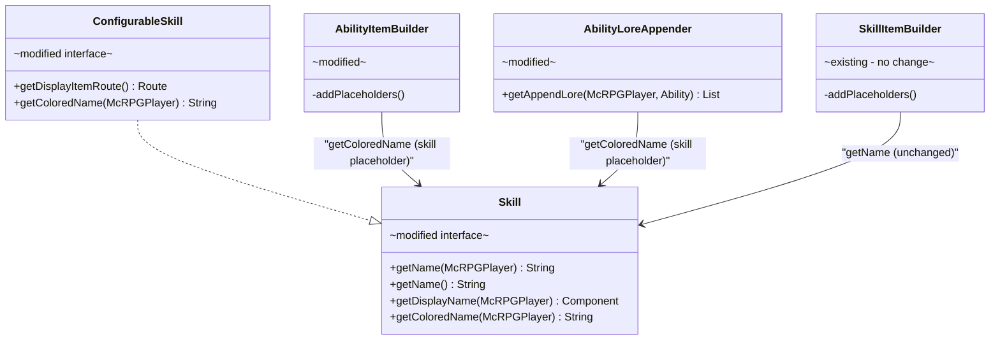
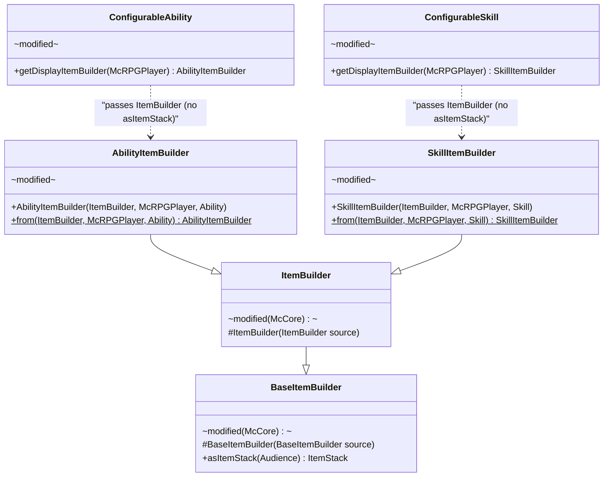

# Phase 4 LLD: Remaining Locale Sweep + Skill Colors

> **HLD Reference:** [docs/hld/gui-ux-system.md](../../hld/gui-ux-system.md)
> **Phase 3 LLD:** [phase-3-ability-edit-gui-quest-slot.md](phase-3-ability-edit-gui-quest-slot.md)
> **Status:** Complete

## Scope

Phase 4 completes the GUI/UX palette migration across all remaining locale files (`en.yml`, `en_skills.yml`, `en_quest.yml`, `en_commands.yml`), introduces per-skill palette colors with a `Skill.getColoredName()` API mirroring the Phase 3 ability pattern, deduplicates quest locale entries between `en.yml` and `en_quest.yml`, adds `HIDE_ATTRIBUTES` item flags to **every** GUI icon across all locale files, and updates the quest reward default color. This is the final phase of the GUI/UX system HLD.

**In scope:**
- Full palette sweep of `en.yml`, `en_skills.yml`, `en_quest.yml`, `en_commands.yml`
- Quest locale deduplication: delete ~70 overlapping quest entries from `en.yml`, move `example_mining`/`example_branching` and `quest-notifications` to `en_quest.yml` with palette tags
- 4 new per-skill palette entries in `config.yml`: `skill-swords`, `skill-mining`, `skill-herbalism`, `skill-woodcutting`
- `Skill.getColoredName(McRPGPlayer)` default method on `Skill` interface; `ConfigurableSkill` override resolving from locale `name:` field
- Propagation of `getColoredName()` to callsites where skill names appear in player-facing text
- `HIDE_ATTRIBUTES` item flag on **all** GUI icons: every `display-item:`, `active-display-item:`, `inactive-display-item:`, and loadout selection slot section across `en_gui.yml` (~100 display-items + 2 active/inactive + 4 loadout selection slots), `en_abilities.yml` (18 abilities), and `en_skills.yml` (4 skills)
- `en_quest.yml` reward `default-color` change from `<gold>` to `<primary>`
- Documentation updates: `PALETTE.md`, `.cursor/rules/core.mdc`, `CLAUDE.md`, HLD status

**Out of scope:**
- `en_stats.yml` (already clean — no color tags)
- Java infrastructure changes to palette resolution (full audit confirmed `postProcessResolvedString` runs on every `getLocalizedMessage` / `getLocalizedMessages` / `getLocalizedMessageAsComponent` / `getLocalizedMessageAsComponents` overload — no gaps exist)
- `en_gui.yml` and `en_abilities.yml` hint/palette sweep (completed in Phases 1–3)
- New palette roles beyond the 4 skill colors

---

## Class Diagram

**Legend:** Interfaces annotated `interface` · Modified classes annotated `modified` · `-->` dependency · `..|>` implements



---

## 1. New Palette Entries

### 1.1 `config.yml` — Skill Color Palette Section

Four new entries are added to the `palette:` section alongside the existing 10 roles. The dynamic palette system (`McRPGLocalizationManager.buildPaletteReplacements()`) discovers them automatically — no Java changes needed to register them.

```yaml
palette:
  # ... existing 10 entries unchanged ...
  skill-swords: "<color:#C75050>"
  skill-mining: "<color:#7AAFC9>"
  skill-herbalism: "<color:#6DB86D>"
  skill-woodcutting: "<color:#B8874B>"
```

| Role | Placeholder | Default Value | Hex | When to Use |
|------|-------------|---------------|-----|-------------|
| **skill-swords** | `<skill-swords>` | `<color:#C75050>` | `#C75050` | Swords skill name in any player-facing surface |
| **skill-mining** | `<skill-mining>` | `<color:#7AAFC9>` | `#7AAFC9` | Mining skill name |
| **skill-herbalism** | `<skill-herbalism>` | `<color:#6DB86D>` | `#6DB86D` | Herbalism skill name |
| **skill-woodcutting** | `<skill-woodcutting>` | `<color:#B8874B>` | `#B8874B` | Woodcutting skill name |

Third-party skills added via `ContentExpansion` follow the same convention: add a `skill-<key>` palette entry in `config.yml` and use it in the skill's locale `name:` field.

---

## 2. Modifications to Existing Classes

### 2.1 `Skill` — Add `getColoredName(McRPGPlayer)` Default Method

**File:** `src/main/java/us/eunoians/mcrpg/skill/Skill.java`

Mirrors `Ability.getColoredName(McRPGPlayer)` from Phase 3. The default returns the plain name so non-configurable and third-party implementations work without changes.

```java
/**
 * Returns the localized skill name with palette color tags applied.
 * The default returns the plain name. {@link ConfigurableSkill} overrides
 * this to resolve the palette-colored name from the locale {@code name:} field.
 *
 * @param player The player whose locale chain is used for resolution.
 * @return The colored skill name as a raw MiniMessage string.
 */
@NotNull
default String getColoredName(@NotNull McRPGPlayer player) {
    return getName(player);
}
```

### 2.2 `ConfigurableSkill` — Override `getColoredName()`

**File:** `src/main/java/us/eunoians/mcrpg/skill/impl/type/ConfigurableSkill.java`

Resolves the `name:` field from the skill's locale display-item section. The `name:` field contains self-closing palette tags (e.g., `<skill-swords><skill></skill-swords>`), which are resolved by `postProcessResolvedString` during `getLocalizedMessage`. The `<skill>` placeholder is filled with the plain `getName()` value.

```java
@NotNull
@Override
default String getColoredName(@NotNull McRPGPlayer player) {
    McRPGLocalizationManager localizationManager = player.getPlugin().registryAccess()
            .registry(RegistryKey.MANAGER).manager(McRPGManagerKey.LOCALIZATION);
    return localizationManager.getLocalizedMessage(
            player,
            Route.addTo(getDisplayItemRoute(), ItemBuilderConfigurationKeys.NAME),
            Map.of(SkillItemPlaceholderKeys.SKILL.getKey(), getName(player)));
}
```

The returned string (e.g., `<color:#C75050>Swords</color:#C75050>`) is self-contained and safe to embed in any MiniMessage template.

### 2.3 `AbilityItemBuilder` — Skill Placeholder Uses `getColoredName()`

**File:** `src/main/java/us/eunoians/mcrpg/builder/item/ability/AbilityItemBuilder.java`

The `<skill>` placeholder in ability items only appears in lore lines (e.g., `<body>Skill: <skill>`), never in the item name. There is no double-coloring conflict — unlike the `ability` placeholder which would conflict with the item `name:` template.

```java
// Before:
addPlaceholder(AbilityItemPlaceholderKeys.SKILL.getKey(), skill.getName(player));

// After:
addPlaceholder(AbilityItemPlaceholderKeys.SKILL.getKey(), skill.getColoredName(player));
```

The corresponding locale templates in `en_abilities.yml` remove the `<primary>` wrapper around `<skill>` since the value carries its own color (see section 4.2).

### 2.4 `AbilityLoreAppender` — Skill Placeholder Uses `getColoredName()`

**File:** `src/main/java/us/eunoians/mcrpg/builder/item/ability/AbilityLoreAppender.java`

The `<skill>` placeholder in the upgrade-locked and ability-locked lore templates is updated to use the colored name. The `<primary>` wrapper around `<skill>` in the locale templates is removed.

```java
// Before (at the callsite where skill placeholder is set):
skill.getName(mcRPGPlayer)

// After:
skill.getColoredName(mcRPGPlayer)
```

### 2.5 Experience Display — Skill Placeholder Uses `getColoredName()`

**File:** `src/main/java/us/eunoians/mcrpg/display/impl/ActionBarExperienceDisplay.java`

```java
// Before:
SkillItemPlaceholderKeys.SKILL.getKey(), skill.getName(mcRPGPlayer),

// After:
SkillItemPlaceholderKeys.SKILL.getKey(), skill.getColoredName(mcRPGPlayer),
```

**File:** `src/main/java/us/eunoians/mcrpg/display/impl/BossBarExperienceDisplay.java`

Same change — `skill.getName(mcRPGPlayer)` → `skill.getColoredName(mcRPGPlayer)` in the placeholder map.

### 2.6 Command Placeholders — Skill Uses `getColoredName()`

The following command classes have `getPlaceholders()` or inline placeholder maps that include a `skill` key with `skill.getName(...)`. Each is updated to `skill.getColoredName(...)`:

| File | Method | Notes |
|------|--------|-------|
| `GiveLevelsCommand.java` | `getPlaceholders()` | Sender + recipient messages |
| `GiveExperienceCommand.java` | `getPlaceholders()` | Sender + recipient messages |
| `ResetSkillCommand.java` | `getPlaceholders()` | Sender + recipient messages |
| `RedeemLevelsCommand.java` | `redeemLevels()` | Maxed + success messages |
| `RedeemExperienceCommand.java` | `redeemExperience()` | Maxed + success messages |

### 2.7 Redeem GUI — Skill Placeholder Uses `getColoredName()`

The following GUI classes use `skill.getName()` for player-facing item placeholders or GUI titles. Each placeholder value is updated to `skill.getColoredName()`:

| File | Context |
|------|---------|
| `RedeemableLevelsGui.java` | GUI title |
| `RedeemableExperienceGui.java` | GUI title |
| `RedeemLevelsCustomSlot.java` | Slot placeholders |
| `RedeemLevelsAmountSlot.java` | Slot placeholders |
| `RedeemLevelsAllSlot.java` | Slot placeholders |
| `RedeemExperienceCustomSlot.java` | Slot placeholders |
| `RedeemExperienceAmountSlot.java` | Slot placeholders |
| `RedeemExperienceAllSlot.java` | Slot placeholders |

**Not changed** (command dispatch — needs plain text):
- `RedeemableLevelsChatResponse.onResponse()` — builds `/mcrpg redeem levels <name> <amount>`
- `RedeemableExperienceChatResponse.onResponse()` — same for experience

### 2.8 `UpgradeQuestSlot` — Skill Placeholder Uses `getColoredName()`

**File:** `src/main/java/us/eunoians/mcrpg/gui/ability/slot/UpgradeQuestSlot.java`

The `populateTierLevelPlaceholders()` method sets a `skill` placeholder. Updated to use `skill.getColoredName(player)`.

### 2.9 Callsites That Keep `getName()` — No Change

| Callsite | Reason |
|----------|--------|
| `SkillItemBuilder.addPlaceholders()` | The locale `name:` template handles coloring; using `getColoredName()` would double-color |
| `SkillSortType` comparators | Alphabetical sorting — color irrelevant |
| `AbilitySortType` comparators | Sorting by skill name — color irrelevant |
| `SkillParser.parse()` | Command input matching — plain text |
| `SkillParser.stringSuggestions()` | Tab-complete suggestions — plain text |
| `RedeemableLevelsChatResponse.onResponse()` | Command dispatch — needs plain text |
| `RedeemableExperienceChatResponse.onResponse()` | Command dispatch — needs plain text |
| Redeem slot `onClick` paths that call `performCommand` | Command dispatch — needs plain text |

### 2.10 Already Handled — No Change Needed

| Callsite | Reason |
|----------|--------|
| `OnSkillLevelUpListener.handleLevelUp()` | Already uses `skill.getDisplayName()` → `miniMessage.serialize()`. `getDisplayName()` resolves the `name:` template which now has skill color tags, so the level-up message automatically gets per-skill coloring. |
| `OnAbilityUnlockListener.onAbilityUnlock()` | Same pattern — `getDisplayName()` serialized for the duplicate-skill message. |

---

## 3. Deletions

### 3.1 Locale Entries Deleted from `en.yml`

The following ~70 quest entries under `quests.mcrpg.*` are deleted from `en.yml`. They were created in the Phase 1 quest implementation (2026-02-24) and superseded by `en_quest.yml` (created 2026-04-02). Because `en.yml` loads first in `BundledLocale`, these stale entries were actively shadowing the cleaner `en_quest.yml` versions. Several contain stale objective keys (e.g., `enhanced_bleed_upgrade_objective` vs the correct `enhanced_bleed_upgrade_obj`).

**Deleted keys** (all under `quests.mcrpg`): `enhanced_bleed_upgrade`, `enhanced_bleed_tier2` through `enhanced_bleed_tier5`, `deeper_wound_upgrade`, `deeper_wound_tier2` through `deeper_wound_tier5`, `vampire_upgrade`, `vampire_tier2` through `vampire_tier5`, `serrated_strikes_upgrade`, `serrated_strikes_tier2` through `serrated_strikes_tier5`, `rage_spike_upgrade`, `rage_spike_tier2` through `rage_spike_tier5`, `its_a_triple_upgrade`, `its_a_triple_tier2` through `its_a_triple_tier5`, `remote_transfer_upgrade`, `remote_transfer_tier2` through `remote_transfer_tier5`, `ore_scanner_upgrade`, `ore_scanner_tier2` through `ore_scanner_tier5`, `heavy_swing_upgrade`, `heavy_swing_tier2` through `heavy_swing_tier5`, `dryads_gift_upgrade`, `dryads_gift_tier2` through `dryads_gift_tier5`, `nymphs_vitality_upgrade`, `nymphs_vitality_tier2` through `nymphs_vitality_tier5`, `verdant_surge_upgrade`, `verdant_surge_tier2` through `verdant_surge_tier5`, `mass_harvest_upgrade`, `mass_harvest_tier2` through `mass_harvest_tier5`.

### 3.2 Sections Moved from `en.yml` to `en_quest.yml`

| Section | Reason |
|---------|--------|
| `quests.mcrpg.example_mining` | Quest locale belongs in `en_quest.yml`; swept to palette tags |
| `quests.mcrpg.example_branching` | Same — no `en_quest.yml` equivalent existed |
| `quest-notifications` (entire section) | Quest-related notifications belong with quest locale |

### 3.3 Locale Template Wrappers Removed

All `<primary><skill>` patterns in `en_abilities.yml` lore templates are changed to `<skill>` (removing the `<primary>` wrapper) since the skill placeholder value now carries its own per-skill color via `getColoredName()`. See section 4.2 for the full list.

---

## 4. Localization

### 4.1 `en_skills.yml` — Full Sweep

Same pattern as abilities: each skill's `display-item.name` wraps the generic `<skill>` placeholder in a self-closing per-skill palette tag, `item-flags` suppress tool attribute tooltips, and lore/level-up messages use `<body>`/`<primary>`/`<positive>` palette roles.

**Swords:**

```yaml
# Before:
swords:
  display-item:
    name: '<red><skill></red>'
    skill-name: 'Swords'
    material: DIAMOND_SWORD
    lore:
      - '<gray>Your strength in Swords grows each time you use a'
      - '<gray>sword in combat. How much you gain will depend'
      - '<gray>on the weapon you wield.'
      - ''
      - '<gray>Current Level: <gold><level>'
      - '<gray>Current Experience: <gold><current-experience>'
      - '<gray>Experience Till Next Level: <gold><remaining-experience-to-level-up>'

# After:
swords:
  display-item:
    name: '<skill-swords><skill></skill-swords>'
    skill-name: 'Swords'
    material: DIAMOND_SWORD
    item-flags:
      - 'HIDE_ATTRIBUTES'
    lore:
      - '<body>Your strength in Swords grows each time you use a'
      - '<body>sword in combat. How much you gain will depend'
      - '<body>on the weapon you wield.'
      - ''
      - '<body>Current Level: <primary><level>'
      - '<body>Current Experience: <primary><current-experience>'
      - '<body>Experience Till Next Level: <primary><remaining-experience-to-level-up>'
```

**Mining:**

```yaml
# Before:
mining:
  display-item:
    name: '<red><skill></red>'
    skill-name: 'Mining'
    material: DIAMOND_PICKAXE
    lore:
      - '<gray>Your expertise in Mining grows each time you'
      - '<gray>break blocks with a pickaxe.'
      - ''
      - '<gray>Current Level: <gold><level>'
      - '<gray>Current Experience: <gold><current-experience>'
      - '<gray>Experience Till Next Level: <gold><remaining-experience-to-level-up>'

# After:
mining:
  display-item:
    name: '<skill-mining><skill></skill-mining>'
    skill-name: 'Mining'
    material: DIAMOND_PICKAXE
    item-flags:
      - 'HIDE_ATTRIBUTES'
    lore:
      - '<body>Your expertise in Mining grows each time you'
      - '<body>break blocks with a pickaxe.'
      - ''
      - '<body>Current Level: <primary><level>'
      - '<body>Current Experience: <primary><current-experience>'
      - '<body>Experience Till Next Level: <primary><remaining-experience-to-level-up>'
```

**Herbalism:**

```yaml
# Before:
herbalism:
  display-item:
    name: '<red><skill></red>'
    skill-name: 'Herbalism'
    material: DIAMOND_HOE
    lore:
      - '<gray>Your expertise in Herbalism grows each time you'
      - '<gray>harvest crops.'
      - ''
      - '<gray>Current Level: <gold><level>'
      - '<gray>Current Experience: <gold><current-experience>'
      - '<gray>Experience Till Next Level: <gold><remaining-experience-to-level-up>'

# After:
herbalism:
  display-item:
    name: '<skill-herbalism><skill></skill-herbalism>'
    skill-name: 'Herbalism'
    material: DIAMOND_HOE
    item-flags:
      - 'HIDE_ATTRIBUTES'
    lore:
      - '<body>Your expertise in Herbalism grows each time you'
      - '<body>harvest crops.'
      - ''
      - '<body>Current Level: <primary><level>'
      - '<body>Current Experience: <primary><current-experience>'
      - '<body>Experience Till Next Level: <primary><remaining-experience-to-level-up>'
```

**Woodcutting:**

```yaml
# Before:
woodcutting:
  display-item:
    name: '<red><skill></red>'
    skill-name: 'Woodcutting'
    material: DIAMOND_AXE
    lore:
      - '<gray>Your expertise in Woodcutting grows each time you'
      - '<gray>break wood with an axe.'
      - ''
      - '<gray>Current Level: <gold><level>'
      - '<gray>Current Experience: <gold><current-experience>'
      - '<gray>Experience Till Next Level: <gold><remaining-experience-to-level-up>'

# After:
woodcutting:
  display-item:
    name: '<skill-woodcutting><skill></skill-woodcutting>'
    skill-name: 'Woodcutting'
    material: DIAMOND_AXE
    item-flags:
      - 'HIDE_ATTRIBUTES'
    lore:
      - '<body>Your expertise in Woodcutting grows each time you'
      - '<body>break wood with an axe.'
      - ''
      - '<body>Current Level: <primary><level>'
      - '<body>Current Experience: <primary><current-experience>'
      - '<body>Experience Till Next Level: <primary><remaining-experience-to-level-up>'
```

**Level-up message:**

```yaml
# Before:
level-up-message: "<green>You have gone up <gold><levels> levels<green> in <skill><green>."

# After:
level-up-message: "<positive>You have gone up <primary><levels> levels <positive>in <skill><positive>."
```

The `<skill>` placeholder receives `getColoredName()` from `OnSkillLevelUpListener` (which uses `getDisplayName()` → `miniMessage.serialize()`, automatically resolving the new skill color tags).

### 4.2 `en_abilities.yml` — Skill Placeholder and Item Flags

**Skill placeholder wrapper removal** — all 18 ability lore lines containing `<primary><skill>` change to `<skill>`:

```yaml
# Before (appears 18 times across all ability display-items):
- '<body>Skill: <primary><skill>'

# After:
- '<body>Skill: <skill>'
```

**Lore appender templates** — the shared lore lines in the `ability.lore` section:

```yaml
# Before:
upgrade-locked-behind-levelup:
  - '<body>Upgrade this ability once you reach <primary>Lv <next-tier-level>'
  - '<body>in <primary><skill><body>.'
ability-locked:
  - '<body>Unlock this ability when your <primary><skill> <body>skill'
  - '<body>reaches level <primary><ability-unlock-level><body>.'

# After:
upgrade-locked-behind-levelup:
  - '<body>Upgrade this ability once you reach <primary>Lv <next-tier-level>'
  - '<body>in <skill><body>.'
ability-locked:
  - '<body>Unlock this ability when your <skill> <body>skill'
  - '<body>reaches level <primary><ability-unlock-level><body>.'
```

**Duplicate-skill loadout message:**

```yaml
# Before:
ability-not-added-duplicate-skill: "<negative>You already have an active ability for the skill <skill> <negative>in your loadout, so <ability> <negative>was not automatically added."

# After (no change needed — <skill> placeholder already gets its color from getDisplayName serialization,
# and <ability> from getColoredName; the <negative> resets correctly after each):
ability-not-added-duplicate-skill: "<negative>You already have an active ability for the skill <skill> <negative>in your loadout, so <ability> <negative>was not automatically added."
```

**Item flags** — `HIDE_ATTRIBUTES` added to all 18 ability display items (see section 4.6 for the blanket rule applied across all locale files):

```yaml
# Added to each ability's display-item section:
item-flags:
  - 'HIDE_ATTRIBUTES'
```

### 4.3 `en.yml` — Sweep and Deduplication

After removing the overlapping `quests.mcrpg.*` entries and moving `example_mining`, `example_branching`, and `quest-notifications` to `en_quest.yml`, the remaining `en.yml` sections are swept:

**Login section:**

```yaml
# Before:
unable-to-load-data: "<red>There was an issue loading your McRPG data, logging back into the server may fix this issue. If that does not fix the issue, please contact a server admin!"

# After:
unable-to-load-data: "<negative>There was an issue loading your McRPG data, logging back into the server may fix this issue. If that does not fix the issue, please contact a server admin!"
```

**Rested experience section** — 6 messages:

```yaml
# Before pattern:
'<gray>You currently have reached your limit...'
'<gray>You have entered a rest zone...'
'<gray>You have gained <gold><rested-experience-gained> levels</gold> worth of...'

# After pattern:
'<body>You currently have reached your limit...'
'<body>You have entered a rest zone...'
'<body>You have gained <primary><rested-experience-gained> levels</primary> worth of...'
```

**Experience display messages** — action bar and boss bar:

```yaml
# Before:
action-bar-display-message: "<gray><skill> Lv. <gold><level></gold> - Remaining Exp <gold><remaining-experience-to-level-up></gold>"
boss-bar-display-message: "<gray><skill> Lv. <gold><level></gold> - Remaining Exp <gold><remaining-experience-to-level-up></gold>"

# After:
action-bar-display-message: "<skill> <body>Lv. <primary><level> <body>- Remaining Exp <primary><remaining-experience-to-level-up>"
boss-bar-display-message: "<skill> <body>Lv. <primary><level> <body>- Remaining Exp <primary><remaining-experience-to-level-up>"
```

The `<skill>` placeholder receives `getColoredName()`, so the skill name shows in its per-skill color followed by `<body>` gray for the label text.

**Expansion section** — no color tags, no changes needed.

### 4.4 `en_quest.yml` — Receive Moved Sections and Sweep

**Default reward color:**

```yaml
# Before:
default-color: "<gold>"

# After:
default-color: "<primary>"
```

**Received from `en.yml` — example quests** (swept to palette tags):

```yaml
quests:
  mcrpg:
    example_mining:
      display-name: "<primary>Daily Mining Challenge"
      objectives:
        break_stone_blocks:
          description: "<body>Mine Stone Blocks"
        break_deepslate:
          description: "<body>Mine Deepslate"
    example_branching:
      display-name: "<primary>Ore Specialist"
      objectives:
        break_iron_ore:
          description: "<body>Mine Iron Ore"
        break_diamond_ore:
          description: "<body>Mine Diamond Ore"
        break_emerald_ore:
          description: "<body>Mine Emerald Ore"
```

**Received from `en.yml` — quest notifications** (full palette sweep):

```yaml
quest-notifications:
  quest-started: '<primary>Quest Started: <skill><quest_name>'
  quest-completed: '<positive>Quest Completed: <primary><quest_name><positive>! Rewards have been granted.'
  quest-cancelled: '<warning>Quest Abandoned: <primary><quest_name><warning>.'
  quest-expired: '<negative>Quest Expired: <primary><quest_name><negative>.'
  phase-completed: '<primary>Phase <phase_number> of <quest_name> <primary>is complete!'
  objective-threshold: '<body>You have completed <primary><percentage>%<body> of <primary><objective_name><body> for <primary><quest_name><body>.'
  board-rotated: '<primary>The quest board has rotated! <body>New quests are now available.'
  near-expiry-single: '<warning>Quest <primary><quest_name><warning> is expiring in <primary><time_remaining><warning>!'
  near-expiry-batch-header: '<warning>You have <primary><count><warning> quests expiring soon:'
  near-expiry-batch-entry: '<warning>  • <primary><quest_name> <body>(<time_remaining>)'
```

Mapping applied: `<gold>` → `<primary>`, `<yellow>` → `<warning>`, `<green>` → `<positive>`, `<red>` → `<negative>`, `<gray>` → `<body>`, `<white>` → `<primary>`.

### 4.5 `en_commands.yml` — Full Sweep

The full mapping applied across the entire file:

| Old Tag | New Tag | Context |
|---------|---------|---------|
| `<gray>` | `<body>` | Body text, labels, descriptions |
| `<gold>` | `<primary>` | Highlighted values (amounts, names, targets) |
| `<red>` | `<negative>` | Error messages, permission denials |
| `<green>` | `<positive>` | Success messages |
| `<yellow>` | `<warning>` | Caution messages, partial success |
| `<white>` | `<primary>` | Highlighted values in admin output |
| `<dark_gray>` | `<body>` | Secondary info (UUIDs, phase indices) |

**Representative examples:**

```yaml
# Before:
recipient-message: "<gray>You have been given <gold><experience></gold> in <gold><skill></gold>."
sender-success-message: "<gray>You gave <gold><experience></gold> in <gold><skill></gold> to <gold><target></gold>."
sender-error-message: "<red>Unable to give <gray><player></gray> experience at the moment."

# After:
recipient-message: "<body>You have been given <primary><experience></primary> in <skill><body>."
sender-success-message: "<body>You gave <primary><experience></primary> in <skill> <body>to <primary><target></primary>."
sender-error-message: "<negative>Unable to give <body><player></body> experience at the moment."
```

For command messages containing `<skill>`, the placeholder value from the command handler carries per-skill coloring via `getColoredName()`. The template removes explicit `<gold>` wrapping around `<skill>` and lets the value carry its own color.

**Admin command sections** (debug, quest-registry, board-admin, quest admin) follow the same mapping. `<white>` used for value highlights (offering IDs, quest keys, registry entries) becomes `<primary>`.

**Already-swept entries** — the following were updated in Phase 3 and are left unchanged:
- `confirmation.confirmation-required` — already uses `<body>`, `<hint>`, `<primary>`
- `loadout.set.loadout-set-success-message` — already uses `<body>`, `<primary>`

**Statistic command section:**

```yaml
# Before:
view-message: "<gray><gold><target></gold>'s <gold><statistic-name></gold>: <gold><statistic-value></gold>"
list-header: "<gray>--- Statistics for <gold><target></gold> ---"
list-entry: "<gray>  <gold><statistic-name></gold>: <gold><statistic-value></gold>"

# After:
view-message: "<body><primary><target></primary>'s <primary><statistic-name></primary>: <primary><statistic-value></primary>"
list-header: "<body>--- Statistics for <primary><target></primary> ---"
list-entry: "<body>  <primary><statistic-name></primary>: <primary><statistic-value></primary>"
```

### 4.6 `en_gui.yml` — `HIDE_ATTRIBUTES` on All GUI Icons

`HIDE_ATTRIBUTES` is added to **every** item section across `en_gui.yml` that is processed by McCore's `ItemBuilder`. This includes all `display-item:` sections, `active-display-item:`/`inactive-display-item:` sections, and direct-key loadout selection slot sections. The flag is a no-op on items without attribute modifiers (glass panes, paper, books, etc.), but is applied uniformly so that server owners who change a material to a weapon/tool via locale config never see attribute tooltip leakage.

**Blanket rule — 100 `display-item:` sections + 2 `active-display-item`/`inactive-display-item` + 4 loadout selection slot sections:**

```yaml
# Added to every display-item section that does NOT already have item-flags:
item-flags:
  - 'HIDE_ATTRIBUTES'
```

**Special case — 2 active loadout selection slots that already have `HIDE_ENCHANTS`:**

The loadout-selection-slot (both Geyser and non-Geyser) `active-loadout` sections already have `item-flags: ['HIDE_ENCHANTS']` for the enchantment glint effect. `HIDE_ATTRIBUTES` is appended to the existing list:

```yaml
# Before (loadout-selection-slot.active-loadout and loadout-selection-slot-geyser.active-loadout):
enchantments:
  POWER: 1
item-flags:
  - 'HIDE_ENCHANTS'

# After:
enchantments:
  POWER: 1
item-flags:
  - 'HIDE_ENCHANTS'
  - 'HIDE_ATTRIBUTES'
```

**Sections covered** (exhaustive by GUI area):

| GUI | Section Count | Notable Materials |
|-----|--------------|-------------------|
| `common` (next/prev page, back, filler) | 4 | ARROW, BARRIER, GRAY_STAINED_GLASS_PANE |
| `home-gui` (settings, abilities, skills, loadouts, bank, quests, board, coming-soon) | 8 | DIAMOND_SWORD, EXPERIENCE_BOTTLE |
| `quest-board` (back, offering, scoped-offering, no-offerings, group-tab, group-entity, group-no-offerings, group-entity-select) | 8 | PAPER, SHIELD, COMPASS |
| `active-quest-gui` (back, quest-slot, view-history) | 3 | WRITABLE_BOOK, BOOKSHELF |
| `quest-history-gui` (back, sort-desc, sort-asc, completed-quest, unknown-quest) | 5 | HOPPER, WRITTEN_BOOK |
| `quest-detail-gui` (4 back variants, overview, phase-header, stage, objective, reward, duration, abandon, confirm, cancel, quest-info) | 14 | ENCHANTED_BOOK, MAP, GOLD_INGOT, CLOCK, RED_WOOL, TNT, LIME_WOOL |
| `ability-gui` (back) | 1 | BARRIER |
| `ability-sort-types` (8 sort options) | 8 | DIAMOND_SWORD, STONE_SWORD, BAMBOO_HANGING_SIGN |
| `skill-gui` (back) | 1 | BARRIER |
| `skill-sort-types` (3 sort options) | 3 | DIAMOND_ORE, EXPERIENCE_BOTTLE |
| `ability-edit-gui` (back, 2 location variants, tier, 2 toggle variants, remote-transfer, 3 upgrade-quest variants, 2 mass-harvest variants) | 13 | IRON_INGOT, CHERRY_SIGN, IRON_HOE, STONE_HOE |
| `loadout-gui` (invalid, free, display-open, combo-info, combo-filler, empty-combo, back) | 7 | KNOWLEDGE_BOOK, ARMOR_STAND |
| `loadout-selection-gui` (back, 2 geyser loadout, 2 loadout) | 5 | (material from loadout display item) |
| `loadout-display-home-gui` (edit-name, toggle active/inactive) | 3 | OAK_HANGING_SIGN, GREEN/RED_STAINED_GLASS_PANE |
| `loadout-display-item-input-gui` (highlight, cancel, confirm) | 3 | PURPLE_STAINED_GLASS_PANE, BARRIER |
| `loadout-ability-select-gui` (back) | 1 | BARRIER |
| `player-setting-gui` (back, 2 exp-display, 2 keep-hand, 2 keep-hotbar, 3 locale, 2 require-offhand, 2 bonus-exp, 2 quest-progress) | 16 | DRAGON_HEAD, BLAZE_ROD, DIRT, COMPASS |
| `remote-transfer-gui` (back, 8 categories, 2 option states, 2 toggle-category) | 13 | ENDER_CHEST, MAGMA_BLOCK, DIAMOND_ORE |
| `experience-bank-gui` (back, redeemable-exp, redeemable-levels, boosted, rested) | 5 | EXPERIENCE_BOTTLE, ENCHANTED_BOOK, BEACON, LIME_BED |
| `redeemable-skill-select-gui` (back) | 1 | BARRIER |
| `redeemable-experience-gui` (back, amount, all, custom) | 4 | GREEN/PURPLE/LIGHT_BLUE_STAINED_GLASS_PANE |
| `redeemable-levels-gui` (back, amount, all, custom) | 4 | GREEN/PURPLE/LIGHT_BLUE_STAINED_GLASS_PANE |

**No palette changes** — `en_gui.yml` was fully palette-swept in Phases 1–3. This section only adds `item-flags`.

---

## 5. Key Flows

### 5.1 Per-Skill Color Resolution

```
en_skills.yml defines: name: '<skill-swords><skill></skill-swords>'
  └─> ConfigurableSkill.getColoredName(player) called
      └─> localizationManager.getLocalizedMessage(player, nameRoute, Map.of("skill", getName(player)))
          ├─> Resolves locale string: "<skill-swords><skill></skill-swords>"
          ├─> postProcessResolvedString() runs palette replacement:
          │   "<color:#C75050><skill></color:#C75050>"
          └─> Placeholder substitution: "<color:#C75050>Swords</color:#C75050>"
              └─> Returned as raw MiniMessage string

Caller embeds in template (e.g., action bar):
  Template: "<skill> <body>Lv. <primary><level> ..."
  After placeholder: "<color:#C75050>Swords</color:#C75050> <body>Lv. <primary>5 ..."
  MiniMessage parses: Component with crimson "Swords", gray "Lv.", amber "5"
```

### 5.2 Level-Up Message (Already Handled)

```
OnSkillLevelUpListener.handleLevelUp()
  └─> skill.getDisplayName(mcRPGPlayer)
      └─> ConfigurableSkill.getDisplayName() resolves name template:
          "<skill-swords><skill></skill-swords>" with palette + placeholder
          → Component with crimson "Swords"
  └─> miniMessage.serialize(skillDisplayName) → "<color:#C75050>Swords</color:#C75050>"
  └─> Embedded in level-up template as <skill> placeholder
      → MiniMessage parses final string with per-skill coloring
```

### 5.3 Quest Locale Deduplication

```
Before (en.yml loads first, shadows en_quest.yml):
  en.yml: quests.mcrpg.enhanced_bleed_upgrade.display-name = "<red>Enhanced Bleed Mastery"
  en_quest.yml: quests.mcrpg.enhanced_bleed_upgrade.display-name = "Enhanced Bleed Mastery"
  → Player sees: "<red>Enhanced Bleed Mastery" (en.yml wins)

After (en.yml entry deleted):
  en.yml: (no entry)
  en_quest.yml: quests.mcrpg.enhanced_bleed_upgrade.display-name = "Enhanced Bleed Mastery"
  → Player sees: "Enhanced Bleed Mastery" (en_quest.yml is now active)
```

---

## 6. Implementation Order

1. **`config.yml` palette entries** — add 4 skill color entries to the `palette:` section defaults
2. **`Skill.getColoredName()` + `ConfigurableSkill` override** — new default method and locale-resolving override
3. **`AbilityItemBuilder` skill placeholder** — change `getName()` to `getColoredName()`
4. **`AbilityLoreAppender` skill placeholder** — change `getName()` to `getColoredName()`
5. **Experience display callsites** — `ActionBarExperienceDisplay`, `BossBarExperienceDisplay`
6. **Command callsites** — `GiveLevelsCommand`, `GiveExperienceCommand`, `ResetSkillCommand`, `RedeemLevelsCommand`, `RedeemExperienceCommand`
7. **Redeem GUI callsites** — all 8 redeem slot classes + 2 redeem GUI title classes
8. **`UpgradeQuestSlot`** — skill placeholder
9. **`en_skills.yml` sweep** — skill name colors, lore palette tags, item-flags, level-up message
10. **`en_abilities.yml` changes** — remove `<primary>` around `<skill>` in 18 lore lines + 2 lore appender templates, add `item-flags` to all 18 display items
11. **`en_gui.yml` item flags** — add `item-flags: ['HIDE_ATTRIBUTES']` to all ~106 item sections; append to existing `item-flags` list on the 2 active loadout slots
12. **`en.yml` deduplication** — delete overlapping quest entries, move example quests and quest-notifications to `en_quest.yml`
13. **`en.yml` remaining sweep** — login, experience, rested experience sections
14. **`en_quest.yml` changes** — receive moved sections with palette tags, update `default-color`
15. **`en_commands.yml` full sweep** — all `<gray>`/`<gold>`/`<red>`/`<green>`/`<yellow>`/`<white>`/`<dark_gray>` → palette tags
16. **Documentation updates** — `PALETTE.md` (4 new rows), `.cursor/rules/core.mdc` (palette table + skill name color rule), `CLAUDE.md` (palette section), HLD (mark Phase 4 complete)
17. **Run `./gradlew verifiedShadowJar`** — fix any test regressions

---

## 7. Unit Tests

### 7.1 Existing Tests — Expected Impact

| Test | Expected Impact |
|------|----------------|
| `AbilityNameColorConsistencyTest` | No change — validates ability name colors in `en_abilities.yml`, which are unchanged |
| `AbilitySlotLoreInjectionTest` | May need update if it asserts `<primary><skill>` in lore — change to `<skill>` |
| `AbilityItemPlaceholderKeysTest` | No change — tests placeholder key presence, not values |
| `UpgradeQuestSlotStateResolutionTest` | No change — tests slot state logic, not locale content |
| Command tests (`RedeemExperienceCommandTest`, etc.) | May need update if they assert exact message strings with `<gold>` or `<gray>` |
| `BoardOfferingSlotTest` / quest GUI tests | May need update if they assert locale strings with old color tags |

### 7.2 New Test — `SkillNameColorConsistencyTest`

Parallel to `AbilityNameColorConsistencyTest`. Validates that every skill's locale `name:` field in `en_skills.yml` uses the correct `<skill-*>` palette placeholder:

- Swords `name:` field contains `<skill-swords>` open tag and `</skill-swords>` close tag
- Mining `name:` field contains `<skill-mining>` and `</skill-mining>`
- Herbalism `name:` field contains `<skill-herbalism>` and `</skill-herbalism>`
- Woodcutting `name:` field contains `<skill-woodcutting>` and `</skill-woodcutting>`
- No skill uses `<red>`, `<gold>`, `<primary>`, or raw hex codes in its `name:` field

---

## 8. Resolved Design Decisions

1. **Per-skill palette entries over a single `<skill>` role**: Each skill gets its own palette placeholder (`<skill-swords>`, `<skill-mining>`, etc.) rather than a shared `<skill>` color. This matches the user's requirement for visually distinct skill identities and parallels the ability type system (`<ability-active>`, `<ability-passive>`, `<ability-innate>`). Four entries is manageable; third-party expansions add one entry per skill.

2. **`Skill.getColoredName()` mirrors `Ability.getColoredName()`**: The same default-on-interface, override-on-configurable pattern from Phase 3. The default returns `getName()` so non-configurable and third-party skills work without changes. The `ConfigurableSkill` override resolves from the locale `name:` field, which includes self-closing palette tags. This produces a raw MiniMessage string safe to embed in any template.

3. **`SkillItemBuilder` keeps `getName()` — same rationale as `AbilityLoreAppender`**: The skill item's `name:` template already wraps `<skill>` in color tags (e.g., `<skill-swords><skill></skill-swords>`). Using `getColoredName()` would produce double-coloring. `SkillItemBuilder` fills the `<skill>` placeholder with the plain name; the template handles the styling.

4. **`AbilityItemBuilder` switches `skill` to `getColoredName()`**: Unlike the `ability` placeholder (which conflicts with the item `name:` template), `<skill>` only appears in ability lore lines, never in the ability item name. The `<primary>` wrapper around `<skill>` in lore templates is removed since the value carries its own per-skill color.

5. **No infrastructure changes for palette resolution**: Full audit of McCore's `LocalizationManager` confirms that **every** `getLocalizedMessage`, `getLocalizedMessages`, `getLocalizedMessageAsComponent`, and `getLocalizedMessageAsComponents` overload calls `postProcessResolvedString`. There are no gaps — all Route-based resolution paths run palette replacement before returning. The only non-string method is `getLocalizedSection()`, which returns a raw `Section` object for `ItemBuilder.from()` and cannot apply string transformations. For dynamically-built strings outside the locale chain (e.g., GUI slot classes constructing lore lines programmatically), the existing `resolvePaletteColors()` public alias on `McRPGLocalizationManager` is used (`AbilitySlot` and `UpgradeQuestSlot` already call it).

6. **Quest dedup: delete from `en.yml`, move stragglers to `en_quest.yml`**: The `en.yml` quest entries were Phase 1 drafts (2026-02-24) superseded by `en_quest.yml` (created 2026-04-02). Because `en.yml` loads first in `BundledLocale`, the stale entries were actively shadowing the newer versions. Deleting overlapping entries lets `en_quest.yml` become the active source. `example_mining`/`example_branching` and `quest-notifications` are moved to `en_quest.yml` (their natural home) with palette tags applied.

7. **`HIDE_ATTRIBUTES` applied to every GUI icon across all locale files**: The flag is added to all ~124 item sections: 100 `display-item:` + 2 `active-display-item`/`inactive-display-item` + 4 loadout selection slots in `en_gui.yml`, plus 18 ability display items in `en_abilities.yml` and 4 skill display items in `en_skills.yml`. Only a minority of materials actually show attribute tooltips (swords, axes, pickaxes, hoes), but the flag is applied uniformly for consistency and future-proofing — if a server owner changes any material to a weapon/tool via locale config, the flag prevents attribute tooltip leakage. `HIDE_ATTRIBUTES` is a no-op on items without attributes. For the 2 active loadout selection slots that already have `item-flags: ['HIDE_ENCHANTS']`, `HIDE_ATTRIBUTES` is appended to the existing list.

8. **`<white>` maps to `<primary>` in admin commands**: Admin output uses `<white>` for highlighted values (offering IDs, quest keys, registry entries) against `<gray>` body text. `<primary>` serves the same purpose — making values visually distinct against `<body>`. Server owners preferring white can set `primary: "<white>"` in their palette config.

9. **`<dark_gray>` maps to `<body>`**: Admin commands use `<dark_gray>` for secondary information (UUIDs, phase indices). The palette has no "dim" role, and the visual distinction is minor enough that `<body>` (gray) is an acceptable substitute. Adding a dedicated "dim" palette role was considered overkill for a handful of admin-only messages.

10. **Thematic skill color defaults**: Swords `#C75050` (warm crimson — combat aggression), Mining `#7AAFC9` (mineral blue — underground/ore), Herbalism `#6DB86D` (verdant green — plant life), Woodcutting `#B8874B` (earthy brown — timber/wood). These are distinct from each other, from the ability type colors, and from `<primary>`. All are server-owner configurable.

11. **Self-closing palette tags in skill locale names**: Following the Phase 3 precedent for abilities, skill `name:` fields include explicit closing tags (e.g., `</skill-swords>`) to prevent color bleed into adjacent text when the colored name is embedded in other templates. The `SkillNameColorConsistencyTest` enforces this.

---

## 9. Implementation Notes — McCore Infrastructure Bugs

During implementation, two McCore `BaseItemBuilder` bugs were discovered and fixed. Both stem from the interaction between string-based lore (populated by `ItemBuilder.from(Section)`) and component-based lore (added dynamically by GUI slots via `addDisplayLoreComponent()`).

### 9.1 ItemBuilder "Double-Bake" Bug

**Symptom:** MiniMessage tags (e.g., `<color:#C75050>`) appeared as literal text in ability/skill item lore after `Skill.getColoredName()` was introduced. The same bug had occurred in earlier phases with `Ability.getColoredName()` and was worked around per-callsite.

**Root cause:** `ConfigurableAbility.getDisplayItemBuilder()` and `ConfigurableSkill.getDisplayItemBuilder()` called `intermediate.asItemStack()` to create the specialized builder (`AbilityItemBuilder` / `SkillItemBuilder`). This prematurely baked the YAML lore strings into Adventure `Component` objects on the `ItemStack`. When the specialized builder later applied placeholders containing MiniMessage tags (e.g., `<color:#C75050>Swords</color:#C75050>` from `getColoredName()`), those tags were inserted via `TextReplacementConfig.replacement(value)` — which treats the replacement value as **plain text**, not MiniMessage. The tags rendered as literal `<color:#C75050>` in-game.

**Fix (McCore):** Added a `protected` copy constructor to `BaseItemBuilder` and `ItemBuilder` that transfers all internal mutable state (string-based `displayName`, `lore`, `placeholders`, `itemFlags`, etc.) without calling `asItemStack()`. The YAML lore stays as raw strings, so placeholder substitution and MiniMessage parsing happen together in the final `asItemStack()` call.

```java
// BaseItemBuilder — new protected copy constructor
protected BaseItemBuilder(@NotNull BaseItemBuilder<?> source) {
    this.itemStack = source.itemStack;
    this.displayName = source.displayName;
    this.displayNameComponent = source.displayNameComponent;
    this.lore = new ArrayList<>(source.lore);
    this.loreAsComponent = new ArrayList<>(source.loreAsComponent);
    this.placeholders = new HashMap<>(source.placeholders);
    this.itemFlags.addAll(source.itemFlags);
    this.customItem = source.customItem;
    this.staticItemName = source.staticItemName;
    this.applyAudienceSkullTexture = source.applyAudienceSkullTexture;
}

// ItemBuilder — delegates to super
protected ItemBuilder(@NotNull ItemBuilder source) {
    super(source);
}
```

**Fix (McRPG):** `AbilityItemBuilder` and `SkillItemBuilder` each gained a new constructor accepting `ItemBuilder` (delegating to the copy constructor). `ConfigurableAbility.getDisplayItemBuilder()` and `ConfigurableSkill.getDisplayItemBuilder()` now pass the `intermediate` builder directly instead of calling `intermediate.asItemStack()`. The `from(ItemBuilder, ...)` and `from(Section, ...)` static factory methods were updated to use the new constructors.

### 9.2 Lore Merge Bug ("Lost Lore")

**Symptom:** After the double-bake fix, YAML-sourced lore (description, stat lines from `en_abilities.yml` / `en_skills.yml`) disappeared entirely from item tooltips. Only the dynamically-injected lore (Type, Mana Cost, Status, click hints) remained.

**Root cause:** `BaseItemBuilder.asItemStack()` had two independent `setData(DataComponentTypes.LORE, ...)` calls — one for the string-based `lore` list and one for the component-based `loreAsComponent` list. When both lists were non-empty, the component call ran second and **overwrote** the string-based lore entirely.

Before the double-bake fix, this was invisible: the `BaseItemBuilder(ItemStack)` constructor extracted all lore into `loreAsComponent` (the component list), leaving the string list empty. After the copy constructor fix, YAML lore stayed in the string list while GUI slots added to the component list — both were populated, and the component path won.

**Fix (McCore):** Merged both lore sources into a single `List<Component>` before writing. String-based lore is parsed first (preserving YAML-defined description and stat lines), then component-based lore is appended (preserving dynamically-injected Type/Mana/Status/hint lines).

```java
// BaseItemBuilder.asItemStack() — merged lore resolution
List<Component> finalLore = new ArrayList<>();
if (!this.lore.isEmpty()) {
    finalLore.addAll(lore.stream().map(loreLine -> parseString(loreLine, audience)).toList());
}
if (!this.loreAsComponent.isEmpty()) {
    finalLore.addAll(loreAsComponent.stream().map(this::parseComponent).toList());
}
if (!finalLore.isEmpty()) {
    this.itemStack.setData(DataComponentTypes.LORE, ItemLore.lore(finalLore));
}
```

### 9.3 Updated Class Diagram (McCore Changes)



---

## 10. Affected Callsites (Implicitly Fixed)

The following GUI slots call `getDisplayItemBuilder()` and then add component-based lore via `addDisplayLoreComponent()`. All of them were silently affected by the same double-bake bug (MiniMessage tags in placeholder values rendered as literal text) and the same lore merge bug (YAML lore overwritten by component lore). The McCore fixes in sections 9.1 and 9.2 resolve all of them generically:

| Slot Class | Builder Source | Dynamic Lore Added |
|---|---|---|
| `AbilitySlot` | `ability.getDisplayItemBuilder()` | Type, mana cost, status, click hints, upgrade quest progress |
| `LoadoutAbilitySlot` | `ability.getDisplayItemBuilder()` | Additional loadout lore lines |
| `LoadoutSelectAbilitySlot` | `ability.getDisplayItemBuilder()` | Ability select lore lines |
| `ActiveAbilityComboSlot` | `ability.getDisplayItemBuilder()` | Combo pattern display, upgrade quest progress |
| `RedeemableSkillSelectionSlot` | `skill.getDisplayItemBuilder()` | Redeem skill selection lore |
| `SkillSlot` | `skill.getDisplayItemBuilder()` | (none — but benefits from correct lore parsing) |

These slots were not individually modified — the fix is entirely in McCore's `BaseItemBuilder`.

---

## 11. Open Items / Future Considerations

1. **`HIDE_ADDITIONAL_TOOLTIP` deprecation**: On Paper 1.21, `ItemFlag.HIDE_ADDITIONAL_TOOLTIP` is deprecated in favor of `TooltipDisplay` / data components. `HIDE_ATTRIBUTES` is not deprecated and handles the weapon/tool stat lines correctly. If future Paper versions deprecate `HIDE_ATTRIBUTES`, the fix is a McCore `ItemBuilder` update to support the new `TooltipDisplay` API — no McRPG changes needed since the YAML config would remain the same.

2. **Third-party skill color convention**: Third-party expansions adding skills should follow the `skill-<key>` palette entry convention and document it in their expansion README. No enforcement test exists for third-party skills — each expansion should ship its own `SkillNameColorConsistencyTest` equivalent.

3. **Dynamic string palette resolution**: GUI slots that build lore strings programmatically (outside the locale chain) must call `resolvePaletteColors()` explicitly. This is already done by `AbilitySlot` and `UpgradeQuestSlot`. New GUI slots that construct MiniMessage strings from non-Route sources should follow the same pattern. All Route-based `getLocalizedMessage` paths are guaranteed to run palette resolution — no gaps exist.

4. **Palette-tagged `<skill>` in command feedback**: After this phase, command messages like "You gave 500 XP in Swords to Player" will show "Swords" in its per-skill color. If the MiniMessage tags in chat output cause visual issues in specific server configurations (e.g., logging plugins that strip MiniMessage), server owners can set `skill-swords: ""` to disable the coloring.

5. **Lore merge ordering assumption**: The `asItemStack()` merge always places string-based lore (from YAML `Section`) before component-based lore (from `addDisplayLoreComponent()`). This matches all current callsites where YAML defines the base description and slots append dynamic metadata. If a future builder needs the reverse order (dynamic first, YAML second), the merge logic would need a configurable ordering strategy.

6. **Copy constructor shares `ItemStack` reference**: The `BaseItemBuilder` copy constructor copies `this.itemStack = source.itemStack` by reference rather than cloning. In practice this is safe because the source builder is discarded immediately after the copy (in `getDisplayItemBuilder()`), but a future caller that retains and mutates the source builder's `ItemStack` after copying would see cross-contamination. If this becomes a concern, the copy constructor should call `source.itemStack.clone()`.

7. **Third-party `ItemBuilder` subclasses**: Any third-party plugin that extends `ItemBuilder` and uses the `ItemStack`-based constructor path would still hit the double-bake issue. They need to add their own copy constructor delegating to `super(source)` and update their factory methods. This is documented as a migration note for the McCore changelog.

8. **In-game verification of implicitly-fixed slots**: The slots listed in section 10 (`LoadoutAbilitySlot`, `ActiveAbilityComboSlot`, `LoadoutSelectAbilitySlot`, `RedeemableSkillSelectionSlot`) were not individually tested in-game after the fix. They should be spot-checked to confirm YAML lore and dynamic lore both appear correctly.
