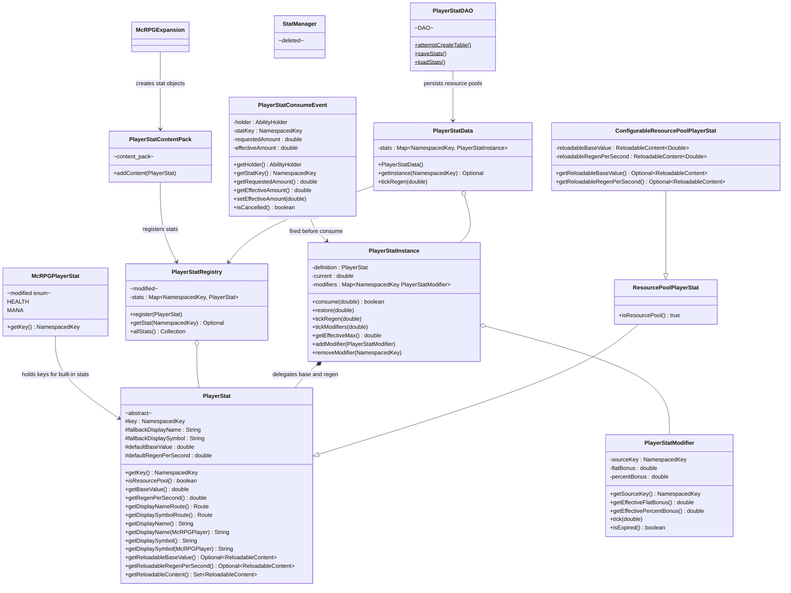
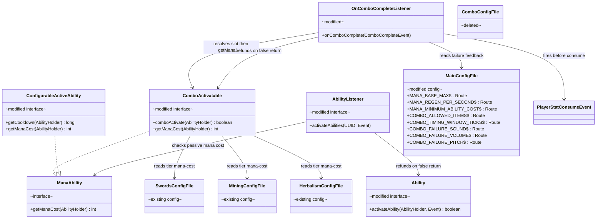
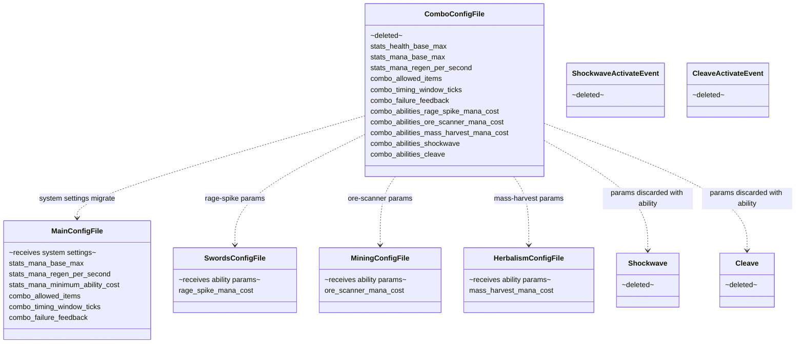

# Phase 1 LLD: Infrastructure & Config Cleanup

> **HLD Reference:** [docs/hld/mana-ability-system.md](../../hld/mana-ability-system.md)
> **Status:** Implemented

## Scope

Phase 1 delivers the foundational infrastructure for the mana-gated combo activation system: config consolidation from the spike's `combo_configuration.yml` into `config.yml` and per-skill config files, deletion of spike-only abilities and config artifacts, Parser-based formula scaling for all tier-config values (including the new `mana-cost` key), `PlayerStatConsumeEvent` for third-party extensibility, `StatManager` → `PlayerStatRegistry` merge with expansion-pack registration, config-agnostic `ReloadableContent` delegation for stat base/regen values, HP display correction to vanilla health, stat persistence, loadout slot hardcoding, and mana-atomicity guarantees (boolean return on `comboActivate()`/`activateAbility()` with refund on cancellation). As part of this phase, the entire `CombatStat` hierarchy is renamed to `PlayerStat` to avoid restricting the infrastructure to combat-only use cases, and `McRPGPlayerStat` becomes an enum of keys with stat objects created at expansion-registration time.

**Post-initial-implementation additions:**
- `PlayerStatModifier` converted from `record` to extensible `class` with `NamespacedKey` source keys and virtual methods (`getEffectiveFlatBonus()`, `getEffectivePercentBonus()`, `tick()`, `isExpired()`) to support future stacking/timed modifier subclasses. `PlayerStatInstance` calls virtual methods and gains `tickModifiers(double)` for auto-expiration.
- `PlayerStat` display name and symbol routed through the localization system via convention-based `Route` methods (`stat.<key>.display-name` / `stat.<key>.display-symbol`), with fallback to constructor strings for tests and early startup. New `en_stats.yml` locale file added to `BundledLocale.ENGLISH`.
- Stat package reorganized: `stat/impl/` (stat type subclasses), `stat/instance/` (per-player mutable state). Base interfaces and registry remain in `stat/`.
- `ComboManager` gained extensible allowed-item API: `registerAllowedItemSet(ReloadableSet)` for third-party config-backed sets and `addAllowedItem(CustomItemWrapper)` for individual entries, both using concurrent collections.

**In scope:**
- Config consolidation: migrate system settings to `config.yml`, per-ability params to skill config files
- Delete `combo_configuration.yml`, `ComboConfigFile.java`, `FileType.COMBO_CONFIG`
- Delete spike abilities: `Shockwave.java`, `Cleave.java`, and all related artifacts (events, config routes, expansion registration)
- Rename `CombatStat` hierarchy → `PlayerStat` hierarchy (see Resolved Design Decisions)
- Refactor `McRPGPlayerStat` to an enum of keys; create stat objects in `McRPGExpansion.getPlayerStatContent()`
- Add `ConfigurableResourcePoolPlayerStat` subclass for config-backed stats with `ReloadableContent`
- Add overridable `ReloadableContent` methods to `PlayerStat`; `PlayerStatInstance` delegates to definition (removes `setBaseValue()`/`setRegenPerSecond()`)
- `PlayerStatData` resolves `PlayerStatRegistry` on demand (no-arg constructor, no `initFromRegistry()`)
- Add `mana-cost` as a recognized key in `tier-configuration` for all abilities
- Backport all tier-config reads to `getString()` + `Parser.setVariable("tier", tier)` pattern
- Wire `ComboActivatable.getManaCost()` to read from tier-config via Parser
- Wire optional mana cost into passive ability activation path (default 0) with per-ability refund on cancellation
- Change `comboActivate()` and `activateAbility()` return types from `void` to `boolean`; refund consumed mana on `false`
- Restructure `AbilityListener.activateAbilities()` from stream to imperative loop for per-ability mana tracking
- Merge `StatManager` into `PlayerStatRegistry`; register player stats via `PlayerStatContentPack` with `ReloadableContentManager` tracking
- Fire `PlayerStatConsumeEvent` before all `PlayerStatInstance.consume()` calls
- Update base mana values: 100 max, 3/sec regen (from spike's 220/5)
- Update HP display: vanilla health directly (from spike's scaled percentage against custom 200 max)
- Fix `ComboManager` to read timeout from config instead of hardcoded 14 ticks
- Add stat persistence: `PlayerStatDAO` to store stat values generically; write on logout/save, restore on login
- Hardcode active loadout slot count to 3; remove `max-active-loadout-size` config key
- Minimum mana cost floor from global config
- Unit tests

**Out of scope (later phases):**
- Ready-state removal and `ReadyAbility` deletion (Phase 2)
- Swords ability migration: SerratedStrikes, RageSpike ready-path removal (Phase 2)
- Mining & Herbalism ability migration (Phase 3)
- Balance pass and final tuning (Phase 4)
- Steering doc updates (Phase 4)

---

## Class Diagrams

Split into three focused diagrams for readability.

**Legend** (applies to all diagrams):
Abstract classes are annotated `abstract` · Interfaces annotated `interface` · Records annotated `record` · Utility classes annotated `utility` · DAOs annotated `DAO` · Config classes annotated `config` · Content packs annotated `content_pack` · McCore classes annotated `mccore` · Classes with Phase 1 additions annotated `modified` · Existing unmodified classes annotated `existing` · Deleted classes annotated `deleted` · `*--` composition · `o--` association · `-->` dependency · `..|>` implements · `--|>` extends · `?` = nullable

### Diagram 1: Player Stat Infrastructure & Registration

The reorganized player stat system after `StatManager` is merged into `PlayerStatRegistry`, stats are registered via the expansion pack system, `PlayerStatInstance` delegates base/regen to its definition, and `McRPGPlayerStat` is an enum of keys. Config-backed stats use `ConfigurableResourcePoolPlayerStat` with `ReloadableContent` for live config reload.



### Diagram 2: Mana Cost Pipeline & Config

How mana costs flow from YAML config through the Parser to the activation gate.



### Diagram 3: Config Consolidation & Deletions

What moves where and what gets deleted.



---

## 1. New Classes

### 1.1 `PlayerStatConsumeEvent` -- Cancellable Consumption Event

**Package:** `us.eunoians.mcrpg.event.stat`
**File:** `src/main/java/us/eunoians/mcrpg/event/stat/PlayerStatConsumeEvent.java`

A cancellable Bukkit event fired before every `PlayerStatInstance.consume()` call. Enables third-party plugins to implement mana-drain, mana-shield, cost reduction, or consumption logging.

```java
public class PlayerStatConsumeEvent extends Event implements Cancellable {

    private static final HandlerList HANDLER_LIST = new HandlerList();

    private final AbilityHolder holder;
    private final NamespacedKey statKey;
    private final double requestedAmount;
    private double effectiveAmount;
    private boolean cancelled;

    /**
     * @param holder          The entity attempting to consume the stat.
     * @param statKey         The key of the player stat being consumed (e.g., mana).
     * @param requestedAmount The original amount requested for consumption.
     */
    public PlayerStatConsumeEvent(@NotNull AbilityHolder holder,
                                   @NotNull NamespacedKey statKey,
                                   double requestedAmount) {
        this.holder = holder;
        this.statKey = statKey;
        this.requestedAmount = requestedAmount;
        this.effectiveAmount = requestedAmount;
    }

    @NotNull public AbilityHolder getHolder() { return holder; }
    @NotNull public NamespacedKey getStatKey() { return statKey; }
    public double getRequestedAmount() { return requestedAmount; }
    public double getEffectiveAmount() { return effectiveAmount; }

    /**
     * Allows listeners to modify the actual amount consumed.
     * Set to 0 for a free cast; set higher for mana-drain effects.
     *
     * @param effectiveAmount The adjusted consumption amount.
     */
    public void setEffectiveAmount(double effectiveAmount) { this.effectiveAmount = effectiveAmount; }

    @Override public boolean isCancelled() { return cancelled; }
    @Override public void setCancelled(boolean cancel) { this.cancelled = cancel; }

    @NotNull @Override public HandlerList getHandlers() { return HANDLER_LIST; }
    @NotNull public static HandlerList getHandlerList() { return HANDLER_LIST; }
}
```

**Firing sites:**
1. `OnComboCompleteListener.onComboComplete()` -- before `manaInstance.consume(manaCost)`
2. `AbilityListener#activateAbilities()` -- before passive mana consumption (when cost > 0)

### 1.2 `PlayerStatContentPack` -- Expansion Content Pack

**Package:** `us.eunoians.mcrpg.expansion.content`
**File:** `src/main/java/us/eunoians/mcrpg/expansion/content/PlayerStatContentPack.java`

Follows the existing `McRPGContentPack` pattern used by `AbilityContentPack`, `SkillContentPack`, `StatisticContentPack`, etc.

```java
public class PlayerStatContentPack extends McRPGContentPack<PlayerStat> {

    public PlayerStatContentPack(@NotNull NamespacedKey expansionKey) {
        super(expansionKey);
    }
}
```

**Handler type:** Add `PLAYER_STAT` to `ContentHandlerType`. The handler iterates the pack's contents, calls `PlayerStatRegistry.register()` for each `PlayerStat`, and tracks any `ReloadableContent` instances returned by `PlayerStat.getReloadableContent()` via `ReloadableContentManager`.

### 1.3 `PlayerStatDAO` -- Generic Stat Persistence

**Package:** `us.eunoians.mcrpg.database.table`
**File:** `src/main/java/us/eunoians/mcrpg/database/table/PlayerStatDAO.java`

Persists per-player resource pool stats on logout/save and restores on login. The DAO is stat-agnostic -- it operates on any `NamespacedKey` stat key. Callers decide which stats to persist; the DAO does not hardcode mana or any other specific stat.

```
mcrpg_player_stat
  player_uuid   TEXT NOT NULL
  stat_key      TEXT NOT NULL    -- NamespacedKey as string (e.g., "mcrpg:mana")
  current_value REAL NOT NULL
  PRIMARY KEY (player_uuid, stat_key)
```

**Methods:**

```java
public final class PlayerStatDAO {

    private PlayerStatDAO() {}

    /**
     * Creates the player stat table if it does not exist.
     *
     * @param connection The database connection.
     * @param database   The database reference for dialect selection.
     * @return {@code true} if the table was created or already existed.
     */
    public static boolean attemptCreateTable(@NotNull Connection connection,
                                              @NotNull Database database) { ... }

    /**
     * No-op for v1. Future schema migrations go here.
     *
     * @param connection The database connection.
     * @param database   The database reference.
     */
    public static void updateTable(@NotNull Connection connection,
                                    @NotNull Database database) { }

    /**
     * Saves the current value for a single player stat.
     * Uses UPSERT semantics (INSERT ON CONFLICT UPDATE).
     *
     * @param connection   The database connection.
     * @param playerUUID   The player's UUID.
     * @param statKey      The stat key (e.g., {@code McRPGPlayerStat.MANA.getKey()}).
     * @param currentValue The current stat value to persist.
     * @return The prepared statement for batch execution.
     */
    @NotNull
    public static PreparedStatement saveStat(@NotNull Connection connection,
                                              @NotNull UUID playerUUID,
                                              @NotNull NamespacedKey statKey,
                                              double currentValue) { ... }

    /**
     * Batch-saves multiple stats for a player in a single transaction.
     *
     * @param connection The database connection.
     * @param playerUUID The player's UUID.
     * @param stats      Map of stat key to current value.
     * @return The list of prepared statements for batch execution.
     */
    @NotNull
    public static List<PreparedStatement> saveStats(@NotNull Connection connection,
                                                     @NotNull UUID playerUUID,
                                                     @NotNull Map<NamespacedKey, Double> stats) { ... }

    /**
     * Loads the persisted current value for a single player stat.
     *
     * @param connection The database connection.
     * @param playerUUID The player's UUID.
     * @param statKey    The stat key to load.
     * @return The persisted value, or empty if no row exists.
     */
    @NotNull
    public static Optional<Double> loadStat(@NotNull Connection connection,
                                             @NotNull UUID playerUUID,
                                             @NotNull NamespacedKey statKey) { ... }

    /**
     * Loads all persisted stat values for a player.
     *
     * @param connection The database connection.
     * @param playerUUID The player's UUID.
     * @return Map of stat key to persisted current value. Empty map if no rows exist.
     */
    @NotNull
    public static Map<NamespacedKey, Double> loadAllStats(@NotNull Connection connection,
                                                           @NotNull UUID playerUUID) { ... }
}
```

**Lifecycle integration:**
- **Save:** `McRPGPlayer` save path (logout + periodic server save) iterates all resource-pool stats in `PlayerStatData` and calls `PlayerStatDAO.saveStats()`. Phase 1 only persists mana (the only resource pool with regen), but the pipeline handles any stat registered as a resource pool. The save path reads `definition.getBaseValue()` (live from config) rather than an instance field.
- **Load:** After `new PlayerStatData()` seeds default values from stat definitions, `McRPGPlayer` construction calls `PlayerStatDAO.loadAllStats()` and overwrites each `PlayerStatInstance.setCurrent(persistedValue)` if a row exists.
- **New players:** No rows exist, so pools initialize to the definition's `getBaseValue()` (which reads from `ReloadableContent` for config-backed stats like mana).

### 1.4 `ManaAbility` -- Mana-Costing Ability Interface

**Package:** `us.eunoians.mcrpg.ability.impl.type`
**File:** `src/main/java/us/eunoians/mcrpg/ability/impl/type/ManaAbility.java`

Marks an ability as having a mana cost. Both the combo activation path and the passive activation path check for this interface to gate activation on sufficient mana.

```java
public interface ManaAbility {

    /**
     * Returns the mana cost for this ability for the given holder.
     * Returns 0 if the ability has no mana cost.
     *
     * @param abilityHolder The holder attempting activation.
     * @return The mana cost in mana points.
     */
    int getManaCost(@NotNull AbilityHolder abilityHolder);
}
```

`ComboActivatable` extends `ManaAbility`. `ConfigurableActiveAbility` gains a default `getManaCost()` implementation using the Parser pattern. Passive abilities opt in by implementing `ManaAbility` directly -- but no current passive does.

---

## 2. Modifications to Existing Classes

### 2.1 Rename: `CombatStat` Hierarchy → `PlayerStat` Hierarchy

The entire combat stat hierarchy is renamed to remove the "Combat" qualifier, future-proofing the infrastructure for non-combat stats (stamina, luck, crafting proficiency, etc.):

| Before | After |
|--------|-------|
| `CombatStat` | `PlayerStat` |
| `CombatStatInstance` | `PlayerStatInstance` |
| `CombatStatModifier` | `PlayerStatModifier` |
| `CombatStatRegistry` | `PlayerStatRegistry` |
| `PlayerCombatData` | `PlayerStatData` |
| `McRPGCombatStat` | `McRPGPlayerStat` (becomes enum of keys; static `PlayerStat` fields removed) |
| `ResourcePoolCombatStat` | `ResourcePoolPlayerStat` |
| *(new)* | `ConfigurableResourcePoolPlayerStat` (config-backed subclass) |
| `CombatStatConsumeEvent` | `PlayerStatConsumeEvent` |
| `CombatStatContentPack` | `PlayerStatContentPack` |
| `CombatStatDAO` | `PlayerStatDAO` |
| `McRPGRegistryKey.COMBAT_STAT` | `McRPGRegistryKey.PLAYER_STAT` |
| `McRPGManagerKey.STAT` | removed (registry promoted to top-level) |
| `ContentHandlerType.COMBAT_STAT` | `ContentHandlerType.PLAYER_STAT` |

All references throughout the codebase (imports, field types, method signatures, Javadoc, test classes) are updated as part of this rename.

### 2.2 `PlayerStatRegistry` -- Absorb `StatManager` Responsibilities

`StatManager` is deleted. Its registry population responsibility moves into `PlayerStatRegistry`, which is now a top-level registry registered directly in `McRPGRegistryKey` and stored in `RegistryAccess`.

`PlayerStatRegistry` no longer has a `createPlayerStatData()` method. That factory method is removed entirely -- `PlayerStatData` resolves the registry on demand (see 2.3).

```java
public class PlayerStatRegistry {

    // ... existing register(), getStat(), allStats() ...

    // createPlayerStatData() is REMOVED.
    // PlayerStatData resolves this registry on demand via RegistryAccess.
}
```

### 2.3 `PlayerStat` -- Overridable Reloadable Content; `McRPGPlayerStat` as Enum; `PlayerStatData` Resolves Registry On Demand

Three interrelated changes replace the old snapshot-and-override pattern with config-agnostic `ReloadableContent` delegation:

#### 2.3.1 `PlayerStat` -- Overridable Reloadable Content Methods

`PlayerStat` gains overridable methods returning `Optional<ReloadableContent<Double>>`. Default implementations return empty (compile-time default is used). Subclasses that want config-backed values override. `getBaseValue()` and `getRegenPerSecond()` delegate to the reloadable content if present:

```java
public abstract class PlayerStat {
    private final NamespacedKey key;
    private final String fallbackDisplayName;
    private final String fallbackDisplaySymbol;
    private final double defaultBaseValue;
    private final double defaultRegenPerSecond;

    // --- Localization ---

    /** Convention-derived route: stat.<key>.display-name. Override for custom paths. */
    @NotNull
    public Route getDisplayNameRoute() {
        return Route.fromString("stat." + key.getKey() + ".display-name");
    }

    /** Convention-derived route: stat.<key>.display-symbol. Override for custom paths. */
    @NotNull
    public Route getDisplaySymbolRoute() {
        return Route.fromString("stat." + key.getKey() + ".display-symbol");
    }

    /** Resolves display name from server default locale; falls back to constructor string. */
    @NotNull
    public String getDisplayName() { return resolveLocalized(getDisplayNameRoute(), fallbackDisplayName); }

    /** Resolves display name from player's locale; falls back to constructor string. */
    @NotNull
    public String getDisplayName(@NotNull McRPGPlayer player) { ... }

    /** Resolves display symbol from server default locale; falls back to constructor string. */
    @NotNull
    public String getDisplaySymbol() { return resolveLocalized(getDisplaySymbolRoute(), fallbackDisplaySymbol); }

    /** Resolves display symbol from player's locale; falls back to constructor string. */
    @NotNull
    public String getDisplaySymbol(@NotNull McRPGPlayer player) { ... }

    // --- Reloadable config delegation ---

    @NotNull
    public Optional<ReloadableContent<Double>> getReloadableBaseValue() { return Optional.empty(); }

    @NotNull
    public Optional<ReloadableContent<Double>> getReloadableRegenPerSecond() { return Optional.empty(); }

    public double getBaseValue() {
        return getReloadableBaseValue()
            .map(ReloadableContent::getContent)
            .orElse(defaultBaseValue);
    }

    public double getRegenPerSecond() {
        return getReloadableRegenPerSecond()
            .map(ReloadableContent::getContent)
            .orElse(defaultRegenPerSecond);
    }

    @NotNull
    public Set<ReloadableContent<?>> getReloadableContent() {
        Set<ReloadableContent<?>> set = new HashSet<>();
        getReloadableBaseValue().ifPresent(set::add);
        getReloadableRegenPerSecond().ifPresent(set::add);
        return set;
    }

    // resolveLocalized() tries RegistryAccess → localization manager → route;
    // returns fallback on null result or exception (tests, early startup).
}
```

No mutation. The stat's configurability and display localization are properties of its type, determined at construction by the subclass. Display resolution gracefully falls back to the constructor-provided strings when localization is unavailable.

#### 2.3.2 `ConfigurableResourcePoolPlayerStat` -- Config-Backed Subclass

A new subclass of `ResourcePoolPlayerStat` that overrides the reloadable content methods. Used for stats with config-driven base/regen values (e.g., mana).

**Package:** `us.eunoians.mcrpg.stat`
**File:** `src/main/java/us/eunoians/mcrpg/stat/ConfigurableResourcePoolPlayerStat.java`

```java
public class ConfigurableResourcePoolPlayerStat extends ResourcePoolPlayerStat {

    private final ReloadableContent<Double> reloadableBaseValue;
    private final ReloadableContent<Double> reloadableRegenPerSecond;

    /**
     * @param key                    Unique identifier for this stat.
     * @param fallbackDisplayName    Fallback name when localization unavailable.
     * @param fallbackDisplaySymbol  Fallback symbol when localization unavailable.
     * @param defaultBaseValue       Compile-time fallback for base value.
     * @param defaultRegenPerSecond  Compile-time fallback for regen rate.
     * @param reloadableBaseValue    Config-backed base value source.
     * @param reloadableRegenPerSecond Config-backed regen rate source.
     */
    public ConfigurableResourcePoolPlayerStat(
            @NotNull NamespacedKey key, @NotNull String fallbackDisplayName,
            @NotNull String fallbackDisplaySymbol, double defaultBaseValue,
            double defaultRegenPerSecond,
            @NotNull ReloadableContent<Double> reloadableBaseValue,
            @NotNull ReloadableContent<Double> reloadableRegenPerSecond) {
        super(key, displayName, displaySymbol, defaultBaseValue, defaultRegenPerSecond);
        this.reloadableBaseValue = reloadableBaseValue;
        this.reloadableRegenPerSecond = reloadableRegenPerSecond;
    }

    @Override
    @NotNull
    public Optional<ReloadableContent<Double>> getReloadableBaseValue() {
        return Optional.of(reloadableBaseValue);
    }

    @Override
    @NotNull
    public Optional<ReloadableContent<Double>> getReloadableRegenPerSecond() {
        return Optional.of(reloadableRegenPerSecond);
    }
}
```

Third-party plugins use this subclass (or their own subclass of `ResourcePoolPlayerStat`) to register config-backed stats from any `YamlDocument` and `Route`. Hardcoded stats use plain `ResourcePoolPlayerStat` and inherit the default empty optionals.

#### 2.3.3 `PlayerStatInstance` -- Delegate to Definition

`PlayerStatInstance` no longer stores its own `baseValue` or `regenPerSecond`. It delegates to the definition, so config reloads propagate automatically:

```java
public class PlayerStatInstance {
    private final PlayerStat definition;
    private double current;
    private final Map<NamespacedKey, PlayerStatModifier> modifiers;

    public PlayerStatInstance(@NotNull PlayerStat definition) {
        this.definition = definition;
        this.current = definition.isResourcePool() ? definition.getBaseValue() : 0;
    }

    /**
     * Effective max: {@code (definitionBase + flatSum) * (1 + percentSum)}.
     * Uses virtual getEffectiveFlatBonus() / getEffectivePercentBonus() so
     * subclass modifiers (stackable, timed) contribute their scaled values.
     */
    public double getEffectiveMax() {
        double flatSum = modifiers.values().stream()
            .mapToDouble(PlayerStatModifier::getEffectiveFlatBonus).sum();
        double percentSum = modifiers.values().stream()
            .mapToDouble(PlayerStatModifier::getEffectivePercentBonus).sum();
        return Math.max(0, (definition.getBaseValue() + flatSum) * (1 + percentSum));
    }

    /**
     * Ticks modifiers first (removing expired ones), then applies regen.
     */
    public void tickRegen(double secondsElapsed) {
        tickModifiers(secondsElapsed);
        if (definition.getRegenPerSecond() <= 0 || !definition.isResourcePool()) {
            return;
        }
        restore(definition.getRegenPerSecond() * secondsElapsed);
    }

    /**
     * Ticks all modifiers and removes expired ones.
     */
    private void tickModifiers(double secondsElapsed) {
        Iterator<PlayerStatModifier> it = modifiers.values().iterator();
        boolean anyRemoved = false;
        while (it.hasNext()) {
            PlayerStatModifier mod = it.next();
            mod.tick(secondsElapsed);
            if (mod.isExpired()) { it.remove(); anyRemoved = true; }
        }
        if (anyRemoved) { clampCurrent(); }
    }

    public void addModifier(@NotNull PlayerStatModifier modifier) {
        modifiers.put(modifier.getSourceKey(), modifier);
        clampCurrent();
    }

    public void removeModifier(@NotNull NamespacedKey sourceKey) {
        modifiers.remove(sourceKey);
        clampCurrent();
    }

    // current, consume(), restore(), setCurrent(), clampCurrent() unchanged
    // setBaseValue() and setRegenPerSecond() are REMOVED
}
```

**Key insight:** The HUD reads `getEffectiveMax()` every tick, which calls `definition.getBaseValue()`, which reads from `ReloadableContent`. When a server admin runs `/mcrpg admin reload`, the `ReloadableContentManager` updates the `ReloadableContent<Double>` values, and every player's stat instances automatically reflect the new base/regen on the next access. Per-player variation is handled entirely by the modifier system (flat/percent bonuses).

#### 2.3.4 `PlayerStatData` -- Resolves Registry On Demand

`PlayerStatData` resolves the `PlayerStatRegistry` internally. The no-arg `initFromRegistry()` and the old empty constructor are removed:

```java
public class PlayerStatData {
    private final Map<NamespacedKey, PlayerStatInstance> stats;

    /**
     * Creates a fully initialized stat data container by resolving the
     * {@link PlayerStatRegistry} from {@link RegistryAccess} and seeding
     * an instance for each registered stat definition.
     */
    public PlayerStatData() {
        this.stats = new LinkedHashMap<>();
        PlayerStatRegistry registry = RegistryAccess.registryAccess()
            .registry(McRPGRegistryKey.PLAYER_STAT);
        for (PlayerStat stat : registry.allStats()) {
            stats.put(stat.getKey(), new PlayerStatInstance(stat));
        }
    }
}
```

No registry parameter, no `initFromRegistry()`, no `createPlayerStatData()` on the registry. Call sites construct directly: `new PlayerStatData()`. The registry is a top-level singleton accessible via `registryAccess()`.

#### 2.3.5 `McRPGPlayerStat` -- Enum of Keys

`McRPGPlayerStat` becomes an enum carrying the `NamespacedKey` for each built-in stat. The static `HEALTH` and `MANA` `PlayerStat` object fields and the `registerAll()` method are removed. The actual `PlayerStat` objects are created inside `McRPGExpansion.getPlayerStatContent()`:

```java
public enum McRPGPlayerStat {
    HEALTH("health"),
    MANA("mana");

    private final NamespacedKey key;

    McRPGPlayerStat(@NotNull String key) {
        this.key = new NamespacedKey(McRPGMethods.getMcRPGNamespace(), key);
    }

    /**
     * @return The namespaced key for this built-in player stat.
     */
    @NotNull
    public NamespacedKey getKey() {
        return key;
    }
}
```

#### 2.3.6 `McRPGExpansion` -- Stat Creation in Expansion Content Pack

The `PlayerStat` objects for health and mana are created inside `getPlayerStatContent()` where the plugin context is available. The constructor-provided display strings (`"Health"`, `"❤"`, etc.) serve as fallbacks; the actual display values are resolved at runtime from `en_stats.yml` via localization routes (`stat.health.display-name`, etc.):

```java
@NotNull
private PlayerStatContentPack getPlayerStatContent() {
    PlayerStatContentPack pack = new PlayerStatContentPack(EXPANSION_KEY);

    YamlDocument mainConfig = mcRPG.registryAccess()
        .registry(RegistryKey.MANAGER).manager(McRPGManagerKey.FILE)
        .getFile(FileType.MAIN_CONFIG);

    PlayerStat health = new ResourcePoolPlayerStat(
        McRPGPlayerStat.HEALTH.getKey(), "Health", "❤", 20, 0);

    PlayerStat mana = new ConfigurableResourcePoolPlayerStat(
        McRPGPlayerStat.MANA.getKey(), "Mana", "✦", 100, 3,
        new ReloadableContent<>(mainConfig, MainConfigFile.MANA_BASE_MAX,
            (doc, route) -> doc.getDouble(route, 100.0)),
        new ReloadableContent<>(mainConfig, MainConfigFile.MANA_REGEN_PER_SECOND,
            (doc, route) -> doc.getDouble(route, 3.0))
    );

    pack.addContent(health);
    pack.addContent(mana);
    return pack;
}
```

### 2.4 `McRPGRegistryKey` -- Add `PLAYER_STAT`

```java
RegistryKey<PlayerStatRegistry> PLAYER_STAT = create(PlayerStatRegistry.class);
```

### 2.5 `McRPGManagerKey` -- Remove `STAT`

`ManagerKey<StatManager> STAT` is removed. All call sites that previously accessed `McRPGManagerKey.STAT` to get the `PlayerStatRegistry` now access `McRPGRegistryKey.PLAYER_STAT` directly:

```java
// Before:
mcRPG.registryAccess().registry(RegistryKey.MANAGER).manager(McRPGManagerKey.STAT).getRegistry()

// After:
mcRPG.registryAccess().registry(McRPGRegistryKey.PLAYER_STAT)
```

### 2.6 `ActionBarHudDisplay` -- Vanilla Health Display

Replace the `computeScaledHealth()` method with direct vanilla health reads:

```java
// Before:
int healthMax = getStatMax(combatData, McRPGPlayerStat.HEALTH.getKey());
int healthCurrent = computeScaledHealth(player, healthMax);

// After:
var maxAttribute = player.getAttribute(Attribute.MAX_HEALTH);
int healthMax = (maxAttribute != null) ? (int) Math.round(maxAttribute.getValue()) : 20;
int healthCurrent = (int) Math.round(player.getHealth());
```

The `computeScaledHealth()` private method is deleted. The health `PlayerStatInstance` is still registered in the registry (the HUD still reads mana from `PlayerStatData`), but its effective max is no longer used for HP display.

### 2.7 `ComboActivatable` -- Extend `ManaAbility`, Boolean Return

```java
public interface ComboActivatable extends ManaAbility {

    /**
     * Activates this ability via the combo system.
     *
     * @param abilityHolder The holder activating this ability.
     * @return {@code true} if the ability actually executed,
     *         {@code false} if internally cancelled (e.g., custom event was cancelled).
     */
    boolean comboActivate(@NotNull AbilityHolder abilityHolder);

    // getManaCost() is now inherited from ManaAbility
}
```

The `boolean` return enables the combo listener to refund consumed mana when the ability is internally cancelled (see 2.9).

### 2.8 `ConfigurableActiveAbility` -- Add Default `getManaCost()`

A default `getManaCost()` method is added following the same Parser pattern as `getCooldown()`:

```java
default int getManaCost(@NotNull AbilityHolder abilityHolder) {
    YamlDocument yamlDocument = getYamlDocument();
    int tier = getCurrentAbilityTier(abilityHolder);
    Route allTiersRoute = Route.addTo(getRouteForAllTiers(), "mana-cost");
    Route tierRoute = Route.addTo(getRouteForTier(tier), "mana-cost");

    if (!yamlDocument.contains(allTiersRoute) && !yamlDocument.contains(tierRoute)) {
        return 0;
    }

    Parser parser;
    if (yamlDocument.contains(tierRoute)) {
        parser = new Parser(yamlDocument.getString(tierRoute));
    } else {
        parser = new Parser(yamlDocument.getString(allTiersRoute));
    }
    parser.setVariable("tier", tier);

    int minimumCost = McRPG.getInstance().registryAccess()
        .registry(RegistryKey.MANAGER).manager(McRPGManagerKey.FILE)
        .getFile(FileType.MAIN_CONFIG)
        .getInt(MainConfigFile.MANA_MINIMUM_ABILITY_COST, 1);

    return Math.max(minimumCost, (int) parser.getValue());
}
```

Abilities implementing both `ConfigurableActiveAbility` and `ComboActivatable` inherit this default for `getManaCost()` automatically. Abilities that previously read from `ComboConfigFile` routes (RageSpike, OreScanner, MassHarvest) delete their manual `getManaCost()` overrides and let the default resolve from their skill config's `tier-configuration.all-tiers.mana-cost` or `tier-N.mana-cost`.

### 2.9 `OnComboCompleteListener` -- Fire `PlayerStatConsumeEvent`, Refund on Cancelled Activation

The mana consumption block is updated to fire the event before consuming. After consumption, the `boolean` return from `comboActivate()` determines whether to refund or apply cooldown:

```java
int manaCost = comboAbility.getManaCost(abilityHolder);

PlayerStatConsumeEvent consumeEvent = new PlayerStatConsumeEvent(
    abilityHolder, McRPGPlayerStat.MANA.getKey(), manaCost);
Bukkit.getPluginManager().callEvent(consumeEvent);

if (consumeEvent.isCancelled()) {
    return;
}

double effectiveCost = consumeEvent.getEffectiveAmount();
if (!manaInstance.consume(effectiveCost)) {
    // ... existing "Not Enough Mana" feedback ...
    return;
}

boolean activated = comboAbility.comboActivate(abilityHolder);

if (!activated) {
    // Ability was internally cancelled (e.g., RageSpikeActivateEvent was cancelled).
    // Refund the exact amount that was consumed.
    manaInstance.restore(effectiveCost);
    return;
}

// Only apply cooldown if ability actually fired
if (comboAbility instanceof CooldownableAbility cooldownableAbility) {
    cooldownableAbility.putHolderOnCooldown(abilityHolder);
}
```

The `effectiveCost` refund is correct because the `PlayerStatConsumeEvent` already fired and third-party listeners had the opportunity to modify it. We consumed `effectiveCost`, so we refund exactly `effectiveCost`. The player's mana pool returns to the pre-consume state.

Feedback messages and sounds are migrated from hardcoded strings to `MainConfigFile` routes and `LocalizationKey` constants (see section 6).

### 2.10 `AbilityListener#activateAbilities()` -- Mana Check with Refund on Cancelled Activation

The stream pipeline is restructured to an imperative loop so mana consumption and refund can be tracked per ability. `activateAbility()` is also changed to return `boolean` (see 2.10.1 below).

When an ability implements `ManaAbility` and returns a cost > 0, the loop attempts consumption before activation. If `activateAbility()` returns `false` (ability was internally cancelled), the consumed mana is refunded. Passives with cost 0 (all current passives) skip the mana check entirely.

```java
default void activateAbilities(@NotNull UUID uuid, @NotNull Event event) {
    // ... existing holder/registry resolution ...

    Set<NamespacedKey> allAbilities = /* existing loadout resolution */;
    List<BaseAbility> eligible = allAbilities.stream()
        .map(key -> (BaseAbility) abilityRegistry.getRegisteredAbility(key))
        .filter(ability -> ability.canEventActivateAbility(event))
        .filter(ability -> ability.checkIfComponentFailsActivation(abilityHolder, event).isEmpty())
        .filter(ability -> !(ability instanceof CooldownableAbility ca)
            || !ca.isAbilityOnCooldown(abilityHolder))
        .toList();

    for (BaseAbility ability : eligible) {
        double effectiveCost = 0;
        PlayerStatInstance mana = null;

        if (ability instanceof ManaAbility manaAbility) {
            int cost = manaAbility.getManaCost(abilityHolder);
            if (cost > 0) {
                var playerOpt = mcRPG.registryAccess().registry(RegistryKey.MANAGER)
                    .manager(McRPGManagerKey.PLAYER).getPlayer(uuid);
                if (playerOpt.isEmpty()) {
                    continue;
                }
                PlayerStatData statData = playerOpt.get().getPlayerStatData();
                mana = statData.getInstance(McRPGPlayerStat.MANA.getKey()).orElse(null);
                if (mana == null) {
                    continue;
                }

                PlayerStatConsumeEvent consumeEvent = new PlayerStatConsumeEvent(
                    abilityHolder, McRPGPlayerStat.MANA.getKey(), cost);
                Bukkit.getPluginManager().callEvent(consumeEvent);
                if (consumeEvent.isCancelled()) {
                    continue;
                }

                effectiveCost = consumeEvent.getEffectiveAmount();
                if (!mana.consume(effectiveCost)) {
                    continue; // insufficient, skip silently
                }
            }
        }

        boolean activated = ability.activateAbility(abilityHolder, event);

        if (!activated && effectiveCost > 0) {
            mana.restore(effectiveCost);
        }
    }
}
```

No feedback is shown on passive mana failures -- passive procs should not spam the player.

#### 2.10.1 `Ability` / `BaseAbility` -- `activateAbility()` Returns `boolean`

`activateAbility()` is changed from `void` to `boolean` across the `Ability` interface and all implementations:

```java
public interface Ability {

    /**
     * Activates this ability for the given holder.
     *
     * @param abilityHolder The holder activating this ability.
     * @param event         The triggering Bukkit event.
     * @return {@code true} if the ability actually executed,
     *         {@code false} if internally cancelled (e.g., custom event was cancelled).
     */
    boolean activateAbility(@NotNull AbilityHolder abilityHolder, @NotNull Event event);
}
```

Per-ability return values:

| Ability | `activateAbility()` return | `comboActivate()` return |
|---------|---------------------------|-------------------------|
| RageSpike | `false` if `RageSpikeActivateEvent` cancelled | `false` if event cancelled |
| OreScanner | `true` always | `true` always |
| MassHarvest | `true` always | `true` always |
| SerratedStrikes | `false` if `SerratedStrikesActivateEvent` cancelled | N/A (no combo) |
| VerdantSurge | same pattern as applicable | N/A (no combo) |
| All passive abilities (Bleed, etc.) | `true` always (no cancellable event) | N/A |

### 2.11 `ComboManager` -- Read Timeout from Config

Replace the hardcoded `DEFAULT_TIMEOUT_TICKS = 14L` with a config-driven value:

```java
// Before:
private static final long DEFAULT_TIMEOUT_TICKS = 14L;

// After: read from MainConfigFile.COMBO_TIMING_WINDOW_TICKS
// The timeout is read once during construction and updated on reload via ReloadableContent.
```

The `ComboManager` constructor changes to accept the `YamlDocument` for `config.yml` and reads `MainConfigFile.COMBO_TIMING_WINDOW_TICKS`. The allowed-items list also migrates from `ComboConfigFile.COMBO_ALLOWED_ITEMS` to `MainConfigFile.COMBO_ALLOWED_ITEMS`.

### 2.12 `MainConfigFile` -- Add Stat and Combo Routes

```java
// --- Stats ---
private static final String STATS_HEADER = "stats";
private static final String MANA_HEADER = toRoutePath(STATS_HEADER, "mana");
public static final Route MANA_BASE_MAX = Route.fromString(toRoutePath(MANA_HEADER, "base-max"));
public static final Route MANA_REGEN_PER_SECOND = Route.fromString(toRoutePath(MANA_HEADER, "regen-per-second"));
public static final Route MANA_MINIMUM_ABILITY_COST = Route.fromString(toRoutePath(MANA_HEADER, "minimum-ability-cost"));

// --- Combo ---
private static final String COMBO_HEADER = toRoutePath(GAMEPLAY_CONFIGURATION_HEADER, "combo");

public static final Route COMBO_ALLOWED_ITEMS = Route.fromString(toRoutePath(COMBO_HEADER, "allowed-items"));

private static final String COMBO_TIMING_HEADER = toRoutePath(COMBO_HEADER, "timing");
public static final Route COMBO_TIMING_WINDOW_TICKS = Route.fromString(toRoutePath(COMBO_TIMING_HEADER, "window-ticks"));

private static final String COMBO_FAILURE_HEADER = toRoutePath(COMBO_HEADER, "failure-feedback");
public static final Route COMBO_FAILURE_SOUND = Route.fromString(toRoutePath(COMBO_FAILURE_HEADER, "sound"));
public static final Route COMBO_FAILURE_VOLUME = Route.fromString(toRoutePath(COMBO_FAILURE_HEADER, "volume"));
public static final Route COMBO_FAILURE_PITCH = Route.fromString(toRoutePath(COMBO_FAILURE_HEADER, "pitch"));
```

The `MAX_ACTIVE_LOADOUT_SIZE` route is removed.

### 2.13 `Loadout` -- Hardcode Active Slot Count

Replace the config-read `getMaxActiveLoadoutSize()` with a constant:

```java
// Before:
private int getMaxActiveLoadoutSize() {
    return McRPG.getInstance().registryAccess()...getFile(FileType.MAIN_CONFIG)
        .getInt(MainConfigFile.MAX_ACTIVE_LOADOUT_SIZE, 3);
}

// After:
private static final int MAX_ACTIVE_LOADOUT_SIZE = 3;

private int getMaxActiveLoadoutSize() {
    return MAX_ACTIVE_LOADOUT_SIZE;
}
```

### 2.14 `McRPGPlayer` -- Stat Persistence Integration

The `initCombatData()` method is renamed to `initStatData()` and changes:

```java
// Before: resolves StatManager + FileType.COMBO_CONFIG
// After: PlayerStatData resolves registry on demand

private void initStatData() {
    this.playerStatData = new PlayerStatData();

    // Restore persisted stats
    mcRPG.registryAccess().registry(RegistryKey.MANAGER)
        .manager(McRPGManagerKey.DATABASE).getDatabaseConnection().ifPresent(connection -> {
            Map<NamespacedKey, Double> saved = PlayerStatDAO.loadAllStats(connection, getUUID());
            saved.forEach((key, value) ->
                playerStatData.getInstance(key)
                    .ifPresent(instance -> instance.setCurrent(value)));
        });
}
```

The save path (in `McRPGPlayer`'s save method or `McRPGPlayerManager`'s save flow) adds:

```java
Map<NamespacedKey, Double> statsToSave = new LinkedHashMap<>();
for (PlayerStat stat : registry.allStats()) {
    if (stat.isResourcePool()) {
        playerStatData.getInstance(stat.getKey())
            .ifPresent(instance -> statsToSave.put(stat.getKey(), instance.getCurrent()));
    }
}
PlayerStatDAO.saveStats(connection, getUUID(), statsToSave);
```

### 2.15 `McRPGExpansion` -- Remove Shockwave/Cleave, Add `PlayerStatContentPack`

**`createAbilities()`**: Remove `new Shockwave(mcRPG)` and `new Cleave(mcRPG)` from the ability list.

**`getExpansionContent()`**: Add a `PlayerStatContentPack` that creates and registers the built-in stats. Mana uses `ConfigurableResourcePoolPlayerStat` for config-backed base/regen; health uses plain `ResourcePoolPlayerStat` (hardcoded):

```java
@NotNull
private PlayerStatContentPack getPlayerStatContent() {
    PlayerStatContentPack pack = new PlayerStatContentPack(EXPANSION_KEY);

    YamlDocument mainConfig = mcRPG.registryAccess()
        .registry(RegistryKey.MANAGER).manager(McRPGManagerKey.FILE)
        .getFile(FileType.MAIN_CONFIG);

    PlayerStat health = new ResourcePoolPlayerStat(
        McRPGPlayerStat.HEALTH.getKey(), "Health", "❤", 20, 0);

    PlayerStat mana = new ConfigurableResourcePoolPlayerStat(
        McRPGPlayerStat.MANA.getKey(), "Mana", "✦", 100, 3,
        new ReloadableContent<>(mainConfig, MainConfigFile.MANA_BASE_MAX,
            (doc, route) -> doc.getDouble(route, 100.0)),
        new ReloadableContent<>(mainConfig, MainConfigFile.MANA_REGEN_PER_SECOND,
            (doc, route) -> doc.getDouble(route, 3.0))
    );

    pack.addContent(health);
    pack.addContent(mana);
    return pack;
}
```

### 2.16 `McRPGBootstrap` -- Registry Wiring Changes

**Remove:** `StatManager` registration from the manager registry.

**Add:** `PlayerStatRegistry` registration as a top-level registry:
```java
registryAccess.register(McRPGRegistryKey.PLAYER_STAT, new PlayerStatRegistry());
```

This must happen **before** expansion processing so the `PlayerStatContentPack` handler can resolve the registry.

### 2.17 `McRPGDatabase` -- Register `PlayerStatDAO`

Add to `populateCreateFunctions()`:
- `PlayerStatDAO::attemptCreateTable`

Add to `populateUpdateFunctions()`:
- `PlayerStatDAO::updateTable` (no-op for v1)

### 2.18 `FileType` -- Remove `COMBO_CONFIG`

```java
// Delete:
COMBO_CONFIG("combo_configuration.yml", new ComboConfigFile())
```

### 2.19 `ContentHandlerType` -- Add `PLAYER_STAT`

```java
PLAYER_STAT(PlayerStatContentPack.class, (registry, pack) -> {
    PlayerStatRegistry statRegistry = registry.registry(McRPGRegistryKey.PLAYER_STAT);
    ReloadableContentManager rcm = registry.registry(RegistryKey.MANAGER)
        .manager(ManagerKey.RELOADABLE_CONTENT);
    for (PlayerStat stat : pack) {
        statRegistry.register(stat);
        Set<ReloadableContent<?>> reloadables = stat.getReloadableContent();
        if (!reloadables.isEmpty()) {
            rcm.trackReloadableContent(reloadables);
        }
    }
})
```

### 2.20 Ability-Specific Config Reads -- Parser Backport

All tier-config reads currently using `getInt()` or `getDouble()` are migrated to `getString()` + `Parser.setVariable("tier", tier)`. The reference pattern is `ConfigurableActiveAbility.getCooldown()`.

**Methods to migrate:**

| Ability | Method | Current Read | Migration |
|---------|--------|-------------|-----------|
| `RageSpike` | `getDamage(int tier)` | `getDouble(tierRoute)` | `getString()` + Parser |
| `RageSpike` | `getVelocity(int tier)` | `getInt(tierRoute)` | `getString()` + Parser |
| `OreScanner` | `getRange(int tier)` | `getInt(tierRoute)` | `getString()` + Parser |
| `SerratedStrikes` | any tier-config reads | `getDouble()` / `getInt()` | `getString()` + Parser |
| `VerdantSurge` | any tier-config reads | `getDouble()` / `getInt()` | `getString()` + Parser |

Each migration follows this mechanical pattern:

```java
// Before:
if (config.contains(tierRoute)) {
    return config.getInt(tierRoute);
} else {
    return config.getInt(allTiersRoute, defaultValue);
}

// After:
Parser parser;
if (config.contains(tierRoute)) {
    parser = new Parser(config.getString(tierRoute));
} else {
    parser = new Parser(config.getString(allTiersRoute));
}
parser.setVariable("tier", tier);
return (int) parser.getValue();
```

### 2.21 `RageSpike` -- Remove Flat Mana Cost Override

Delete the `getManaCost()` override that reads from `ComboConfigFile.RAGE_SPIKE_MANA_COST`. The inherited `ConfigurableActiveAbility.getManaCost()` default will resolve from `SwordsConfigFile` tier-configuration instead.

```java
// Delete this method entirely:
@Override
public int getManaCost(@NotNull AbilityHolder abilityHolder) {
    return getPlugin().registryAccess()...getFile(FileType.COMBO_CONFIG)
        .getInt(ComboConfigFile.RAGE_SPIKE_MANA_COST, 25);
}
```

Similarly for `OreScanner` and `MassHarvest` -- delete their `getManaCost()` overrides.

### 2.22 `LocalizationKey` -- Add Mana Feedback Keys

```java
private static final String MANA_FEEDBACK_HEADER = toRoutePath(ABILITY_HEADER, "mana-feedback");
public static final Route MANA_INSUFFICIENT =
    Route.fromString(toRoutePath(MANA_FEEDBACK_HEADER, "insufficient"));
public static final Route COOLDOWN_ACTIVE =
    Route.fromString(toRoutePath(MANA_FEEDBACK_HEADER, "cooldown-active"));
```

### 2.23 `config.yml` -- Add Stats and Combo Sections

```yaml
# ─── Stats ───
stats:
  mana:
    base-max: 100
    regen-per-second: 3
    minimum-ability-cost: 1

# ─── Combo ─── (under configuration.gameplay)
configuration:
  gameplay:
    combo:
      allowed-items:
        - WOODEN_SWORD
        - STONE_SWORD
        # ... (full list from current combo_configuration.yml)
        - TRIDENT
        - MACE
      timing:
        window-ticks: 30
      failure-feedback:
        sound: BLOCK_NOTE_BLOCK_BASS
        volume: 1.0
        pitch: 0.5
```

The `configuration.gameplay.loadout.max-active-loadout-size` key is removed from the default config.

### 2.24 Skill Config Files -- Add `mana-cost` to Tier Configuration

**`swords_configuration.yml`** -- RageSpike:
```yaml
ability-configuration:
  rage-spike:
    tier-configuration:
      all-tiers:
        mana-cost: 50-(7*tier)
```

**`mining_configuration.yml`** -- OreScanner:
```yaml
ability-configuration:
  ore-scanner:
    tier-configuration:
      all-tiers:
        mana-cost: 60-(8*tier)
```

**`herbalism_configuration.yml`** -- MassHarvest:
```yaml
ability-configuration:
  mass-harvest:
    tier-configuration:
      all-tiers:
        mana-cost: 60-(8*tier)
```

These are reference formulas. Final values are tuned during the Phase 4 balance pass. The key requirement is that `mana-cost` exists in the default YAML and the Parser resolution path works.

---

## 3. Deletions

### 3.1 Files Deleted

| File | Reason |
|------|--------|
| `src/main/java/us/eunoians/mcrpg/configuration/file/combo/ComboConfigFile.java` | Replaced by `MainConfigFile` routes + skill config routes |
| `src/main/resources/combo_configuration.yml` | Contents migrated to `config.yml` + skill configs |
| `src/main/java/us/eunoians/mcrpg/stat/StatManager.java` | Merged into `PlayerStatRegistry` |
| `src/main/java/us/eunoians/mcrpg/ability/impl/swords/Shockwave.java` | Spike-only PoC ability |
| `src/main/java/us/eunoians/mcrpg/ability/impl/swords/Cleave.java` | Spike-only PoC ability |
| `src/main/java/us/eunoians/mcrpg/event/ability/swords/ShockwaveActivateEvent.java` | Event for deleted ability |
| `src/main/java/us/eunoians/mcrpg/event/ability/swords/CleaveActivateEvent.java` | Event for deleted ability |

### 3.2 Config Routes Deleted

| Route | Source File |
|-------|------------|
| All `ComboConfigFile.*` routes | `ComboConfigFile.java` |
| `MainConfigFile.MAX_ACTIVE_LOADOUT_SIZE` | `MainConfigFile.java` |
| `FileType.COMBO_CONFIG` | `FileType.java` |

### 3.3 Registration References to Clean Up

| Location | What to Remove |
|----------|---------------|
| `McRPGExpansion.createAbilities()` | `new Shockwave(mcRPG)`, `new Cleave(mcRPG)` |
| `McRPGBootstrap` | `StatManager` registration |
| `McRPGManagerKey` | `STAT` key |
| `McRPGListenerRegistrar` | Any Shockwave/Cleave-specific listener registration (if any) |
| Skill config files | Any Shockwave/Cleave tier-config sections (if any in `SwordsConfigFile`) |

### 3.4 YAML Sections Removed

| File | Section |
|------|---------|
| `combo_configuration.yml` | Entire file deleted |
| `config.yml` | `configuration.gameplay.loadout.max-active-loadout-size` |

---

## 4. Key Flows

### 4.1 Combo Activation Flow (Updated)

```
Player clicks Right, Right, Right (or other pattern)
  └─> OnComboInputListener.onPlayerInteract()
      └─> ComboManager.processInput(player, ComboInput.RIGHT)
          ├─> PlayerComboState tracks sequence
          ├─> Timeout task: MainConfigFile.COMBO_TIMING_WINDOW_TICKS ticks
          └─> Pattern complete → fire ComboCompleteEvent

ComboCompleteEvent received by OnComboCompleteListener
  └─> onComboComplete(event)
      ├─> Resolve LoadoutHolder from EntityManager
      ├─> Build ordered ComboActivatable list from loadout
      ├─> Map event.getSlotIndex() to comboAbilities[slot-1]
      ├─> Gate 1: Cooldown check
      │   └─> If on cooldown → feedback (localized, configurable sound) → return
      ├─> Gate 2: Mana check
      │   ├─> int manaCost = comboAbility.getManaCost(abilityHolder)
      │   │   └─> ConfigurableActiveAbility default reads tier-config via Parser
      │   ├─> Fire PlayerStatConsumeEvent(holder, MANA.getKey(), manaCost)
      │   │   └─> Third-party listeners can modify effectiveAmount or cancel
      │   ├─> If cancelled → return
      │   ├─> manaInstance.consume(effectiveAmount)
      │   └─> If insufficient → feedback (localized, configurable sound) → return
      ├─> boolean activated = comboAbility.comboActivate(abilityHolder)
      ├─> If !activated → manaInstance.restore(effectiveCost) → return
      └─> If CooldownableAbility → putHolderOnCooldown()
```

### 4.2 Passive Ability Activation Flow (Updated)

The stream pipeline is restructured to an imperative loop over eligible abilities for per-ability mana tracking and refund:

```
Bukkit event fires (e.g., EntityDamageByEntityEvent)
  └─> Skill listener calls AbilityListener#activateAbilities(uuid, event)
      ├─> Stream filters: canEventActivateAbility, components, cooldown → toList()
      └─> Imperative loop over eligible abilities:
          ├─> [NEW] ManaAbility mana check
          │   ├─> getManaCost(holder) → if 0, skip mana gate
          │   ├─> if > 0: fire PlayerStatConsumeEvent(holder, MANA.getKey(), cost)
          │   ├─> If cancelled → continue (skip ability)
          │   ├─> manaInstance.consume(effectiveAmount)
          │   └─> if insufficient → continue (silently skip, no feedback)
          ├─> boolean activated = activateAbility(holder, event)
          └─> If !activated && effectiveCost > 0 → mana.restore(effectiveCost)
```

### 4.3 Stat Persistence Flow

```
Player joins server
  └─> McRPGPlayer construction
      ├─> new PlayerStatData()
      │   └─> Resolves PlayerStatRegistry on demand via RegistryAccess
      │   └─> Seeds each stat instance from definition.getBaseValue()
      │       └─> Mana: reads ReloadableContent → config base-max (100)
      │       └─> Health: returns compile-time default (20)
      ├─> PlayerStatDAO.loadAllStats(connection, uuid)
      │   └─> For each row: instance.setCurrent(savedValue)
      │   └─> If no rows: pools stay at base-max (new player)
      └─> PlayerStatData is ready

Player logs out / server save
  └─> McRPGPlayer save path
      └─> Iterate all resource pool stats
          └─> PlayerStatDAO.saveStats(connection, uuid, statsMap)
```

### 4.4 HUD Tick Flow (Updated)

```
ActionBarHudDisplay.tick(currentTick, secondsElapsed)
  ├─> statData.tickRegen(secondsElapsed)
  │   └─> ManaInstance: tickModifiers first, then current += regenPerSecond * elapsed
  ├─> Resolve center content (combo dots, cooldown countdown, etc.)
  ├─> If persistent pool display enabled:
  │   ├─> healthMax = player.getAttribute(MAX_HEALTH).getValue()  ← vanilla
  │   ├─> healthCurrent = player.getHealth()                      ← vanilla
  │   ├─> healthSymbol = definition.getDisplaySymbol(mcRPGPlayer) ← localized
  │   ├─> manaCurrent = manaInstance.getCurrent()
  │   ├─> manaMax = manaInstance.getEffectiveMax()
  │   ├─> manaSymbol = definition.getDisplaySymbol(mcRPGPlayer)   ← localized
  │   └─> renderer.buildFull(healthCurrent, healthMax, ..., manaCurrent, manaMax, ...)
  └─> Send action bar component
```

---

## 5. Config Migration Detail

### 5.1 `combo_configuration.yml` → `config.yml` (System Settings)

| Source Route | Destination Route | Notes |
|---|---|---|
| `stats.health.base-max` | **Removed** | HP is vanilla; no custom pool |
| `stats.mana.base-max` | `stats.mana.base-max` | Value changes: 220 → 100 |
| `stats.mana.regen-per-second` | `stats.mana.regen-per-second` | Value changes: 5 → 3 |
| `combo.allowed-items` | `configuration.gameplay.combo.allowed-items` | Identical content |
| `combo.timing.window-ticks` | `configuration.gameplay.combo.timing.window-ticks` | Same value (30) |
| `combo.failure-feedback.sound` | `configuration.gameplay.combo.failure-feedback.sound` | Same value |
| `combo.failure-feedback.volume` | `configuration.gameplay.combo.failure-feedback.volume` | Same value |
| `combo.failure-feedback.pitch` | `configuration.gameplay.combo.failure-feedback.pitch` | Same value |

### 5.2 `combo_configuration.yml` → Skill Config Files (Per-Ability Params)

| Source Route | Destination Route (Skill Config) | Notes |
|---|---|---|
| `combo.abilities.rage-spike.mana-cost` (25) | `swords_configuration.yml` → `ability-configuration.rage-spike.tier-configuration.all-tiers.mana-cost` | Flat value → Parser formula |
| `combo.abilities.ore-scanner.mana-cost` (40) | `mining_configuration.yml` → `ability-configuration.ore-scanner.tier-configuration.all-tiers.mana-cost` | Flat value → Parser formula |
| `combo.abilities.mass-harvest.mana-cost` (40) | `herbalism_configuration.yml` → `ability-configuration.mass-harvest.tier-configuration.all-tiers.mana-cost` | Flat value → Parser formula |

### 5.3 Discarded (Deleted with Spike Abilities)

| Source Route | Disposition |
|---|---|
| `combo.abilities.shockwave.*` | Deleted with `Shockwave.java` |
| `combo.abilities.cleave.*` | Deleted with `Cleave.java` |

---

## 6. Localization

### 6.1 New Locale Keys

```yaml
# en_abilities.yml (bundled English locale — mana/cooldown feedback)
ability:
  mana-feedback:
    insufficient: "<red>Not enough mana to use <ability>! <gray>(need <cost>, have <current>)</gray></red>"
    cooldown-active: "<red><ability> is on cooldown! <gray>(<remaining>s remaining)</gray></red>"
```

### 6.2 Stat Display Locale Keys

```yaml
# en_stats.yml (new bundled English locale file — added to BundledLocale.ENGLISH)
locale: en
stat:
  health:
    display-name: "Health"
    display-symbol: "❤"
  mana:
    display-name: "Mana"
    display-symbol: "✦"
```

`LocalizationKey.java` gains `STAT_HEADER`, `STAT_HEALTH_DISPLAY_NAME`, `STAT_HEALTH_DISPLAY_SYMBOL`, `STAT_MANA_DISPLAY_NAME`, `STAT_MANA_DISPLAY_SYMBOL` route constants. Third-party stats derive routes automatically from their `NamespacedKey` via `PlayerStat.getDisplayNameRoute()` / `getDisplaySymbolRoute()`.

Placeholders:
- `<ability>` -- the ability's display name
- `<cost>` -- the mana cost
- `<current>` -- the player's current mana
- `<remaining>` -- seconds remaining on cooldown

### 6.3 Migration from Hardcoded Strings

`OnComboCompleteListener` currently uses hardcoded `Component.text(...)` calls for mana and cooldown feedback. These are replaced with localized messages:

```java
// Before:
player.sendMessage(
    Component.text("Not enough mana to use " + ability.getName() + "! ", NamedTextColor.RED)
        .append(Component.text("(need " + manaCost + ", have " + currentMana + ")", NamedTextColor.GRAY))
);

// After:
Component message = localizationManager.getLocalizedMessageAsComponent(
    mcRPGPlayer, LocalizationKey.MANA_INSUFFICIENT,
    Map.of("ability", ability.getName(),
           "cost", String.valueOf(manaCost),
           "current", String.valueOf(currentMana)));
player.sendMessage(message);
```

---

## 7. Implementation Order

1. **Rename `CombatStat` hierarchy → `PlayerStat` hierarchy** -- mechanical rename across all classes, tests, and references
2. **`MainConfigFile` route additions** -- add stat and combo Routes; remove `MAX_ACTIVE_LOADOUT_SIZE`
3. **`config.yml` YAML changes** -- add `stats.mana.*` and `configuration.gameplay.combo.*` sections; remove loadout size key
4. **`ManaAbility` interface** -- new interface in `ability/impl/type/`
5. **`ComboActivatable` update** -- extend `ManaAbility`
6. **`ConfigurableActiveAbility.getManaCost()` default** -- Parser-based tier-config resolution with minimum floor
7. **Parser backport** -- migrate all `getInt()`/`getDouble()` tier-config reads to Parser pattern across RageSpike, OreScanner, SerratedStrikes, VerdantSurge, and any other abilities
8. **Skill config YAML changes** -- add `mana-cost` to tier-configuration for RageSpike, OreScanner, MassHarvest
9. **Delete Shockwave + Cleave** -- classes, events, expansion registration, config routes
10. **Delete `ComboConfigFile` + `combo_configuration.yml` + `FileType.COMBO_CONFIG`**
11. **`McRPGPlayerStat` refactor to enum** -- enum of keys (`HEALTH`, `MANA`); remove `static final PlayerStat` fields and `registerAll()`
12. **`ConfigurableResourcePoolPlayerStat`** -- new subclass of `ResourcePoolPlayerStat` with overridable `ReloadableContent` methods
13. **`PlayerStat` reloadable methods** -- add `getReloadableBaseValue()`, `getReloadableRegenPerSecond()`, `getReloadableContent()`, and update `getBaseValue()`/`getRegenPerSecond()` to delegate
14. **`PlayerStatInstance` delegation** -- remove `baseValue`, `regenPerSecond`, `setBaseValue()`, `setRegenPerSecond()`; delegate to definition
15. **`PlayerStatData` no-arg constructor** -- resolve `PlayerStatRegistry` on demand; remove `initFromRegistry()`
16. **Delete `StatManager`** -- remove class, `McRPGManagerKey.STAT`, all references
17. **`McRPGRegistryKey.PLAYER_STAT`** -- add registry key
18. **`PlayerStatContentPack` + `ContentHandlerType.PLAYER_STAT`** -- new content pack type with `ReloadableContentManager` tracking
19. **`McRPGExpansion` updates** -- remove Shockwave/Cleave, add `getPlayerStatContent()` creating stat objects with `ConfigurableResourcePoolPlayerStat` for mana
20. **`PlayerStatConsumeEvent`** -- new event class
21. **`Ability.activateAbility()` boolean return** -- change return type from `void` to `boolean` across interface and all implementations
22. **`ComboActivatable.comboActivate()` boolean return** -- change return type from `void` to `boolean`
23. **`OnComboCompleteListener` updates** -- fire `PlayerStatConsumeEvent`, refund on `!activated`, conditional cooldown, localized feedback
24. **`AbilityListener#activateAbilities()` restructure** -- imperative loop with per-ability mana tracking and refund on `!activated`
25. **`ComboManager` updates** -- read timeout and allowed items from `MainConfigFile` routes
26. **`ActionBarHudDisplay` HP fix** -- vanilla health display, delete `computeScaledHealth()`
27. **RageSpike / OreScanner / MassHarvest** -- delete `getManaCost()` overrides, update `comboActivate()` and `activateAbility()` to return `boolean`
28. **`PlayerStatDAO`** -- new generic DAO class + table
29. **`McRPGDatabase`** -- register DAO create/update functions
30. **`McRPGPlayer` stat persistence** -- load on construction (`new PlayerStatData()`), save on logout/save (generic over all resource pools)
31. **`Loadout` hardcode** -- replace config read with constant
32. **`McRPGBootstrap` wiring** -- register `PlayerStatRegistry`, remove `StatManager`
33. **`LocalizationKey` additions** -- mana feedback keys
34. **Locale YAML additions** -- `en.yml` entries for mana feedback
35. **Unit tests**

---

## 8. Unit Tests

### 8.1 `PlayerStatConsumeEventTest`
- Event carries correct holder, stat key, and requested amount
- `setEffectiveAmount()` modifies the effective cost
- Cancellation prevents consumption
- Uncancelled event with modified amount uses the modified value

### 8.2 `PlayerStatRegistryTest` (updated)
- Registration via content pack handler works
- Duplicate registration throws `IllegalArgumentException`
- `allStats()` returns all registered stats
- Third-party stat registration via content pack works alongside built-in stats

### 8.3 `PlayerStatDataTest`
- Constructor resolves registry and seeds instances for all registered stats
- Mana instance base value reads from `ReloadableContent` (config-backed)
- Health instance base value returns compile-time default (20)
- Config reload updates mana base value for existing `PlayerStatData` instances
- `getInstance()` returns empty for unregistered stat keys

### 8.3.1 `PlayerStatInstanceTest`
- `getEffectiveMax()` delegates to definition's `getBaseValue()` (live read)
- `tickRegen()` delegates to definition's `getRegenPerSecond()` (live read)
- Config change to definition's `ReloadableContent` propagates to `getEffectiveMax()` without re-creation
- Modifiers (flat/percent) apply on top of live definition base value
- `consume()` and `restore()` work correctly
- `setBaseValue()` and `setRegenPerSecond()` no longer exist (compile check)

### 8.3.2 `ConfigurableResourcePoolPlayerStatTest`
- `getReloadableBaseValue()` returns `Optional.of(...)` with correct content
- `getReloadableRegenPerSecond()` returns `Optional.of(...)` with correct content
- `getBaseValue()` reads from reloadable content, not compile-time default
- `getRegenPerSecond()` reads from reloadable content, not compile-time default
- `getReloadableContent()` returns both reloadable instances

### 8.3.3 `PlayerStatContentPackTest`
- Content pack handler registers stats and tracks `ReloadableContent` via `ReloadableContentManager`
- `ConfigurableResourcePoolPlayerStat` reloadable entries are tracked
- Plain `ResourcePoolPlayerStat` has no reloadable entries (empty set)

### 8.4 `PlayerStatDAOTest` (mocked JDBC)
- `attemptCreateTable()` creates the expected schema
- `saveStat()` persists a single stat value
- `saveStats()` persists multiple stat values in batch
- `loadStat()` returns persisted value for existing player and stat key
- `loadStat()` returns empty for unknown player
- `loadAllStats()` returns all persisted stats for a player
- `loadAllStats()` returns empty map for unknown player
- UPSERT semantics: saving twice updates rather than duplicates
- Multiple stats for the same player are stored independently

### 8.5 `ManaCostResolutionTest`
- `ConfigurableActiveAbility.getManaCost()` resolves formula from `all-tiers.mana-cost` with tier variable
- Per-tier override in `tier-N.mana-cost` takes precedence over `all-tiers`
- Missing `mana-cost` key returns 0
- Minimum floor clamps negative results (e.g., `50-(7*8)` = -6 → clamped to 1)
- Minimum floor of 0 allows free casts when configured

### 8.6 `ParserBackportTest`
- `RageSpike.getDamage(tier)` uses Parser with `tier` variable
- `RageSpike.getVelocity(tier)` uses Parser with `tier` variable
- `OreScanner.getRange(tier)` uses Parser with `tier` variable
- Formula strings (e.g., `"5+(1.5*tier)"`) evaluate correctly for tiers 1-5
- Integer values in YAML (e.g., `5`) still work when read as strings through Parser

### 8.7 `OnComboCompleteListenerTest`
- Successful combo activation: fires `PlayerStatConsumeEvent`, consumes mana, calls `comboActivate()`
- Insufficient mana: `consume()` returns false, ability not activated, feedback sent
- `PlayerStatConsumeEvent` cancelled: ability not activated, no mana consumed
- `PlayerStatConsumeEvent` with modified effective amount: modified value consumed
- Cooldown active: ability not activated, cooldown feedback sent
- `comboActivate()` returns `false`: consumed mana is refunded via `restore(effectiveCost)`
- `comboActivate()` returns `false`: cooldown is NOT applied
- `comboActivate()` returns `true`: mana stays consumed, cooldown applied

### 8.8 `AbilityListenerPassiveManaTest`
- Passive ability with `getManaCost()` returning 0: no mana check, ability activates
- Passive ability with `getManaCost()` returning > 0 and sufficient mana: mana consumed, ability activates
- Passive ability with `getManaCost()` returning > 0 and insufficient mana: ability skipped silently
- Passive `PlayerStatConsumeEvent` cancellation prevents activation
- `activateAbility()` returns `false`: consumed mana is refunded via `restore(effectiveCost)`
- `activateAbility()` returns `true`: mana stays consumed

### 8.9 `ComboManagerConfigTest`
- Timeout reads from `MainConfigFile.COMBO_TIMING_WINDOW_TICKS` (not hardcoded 14)
- Allowed items read from `MainConfigFile.COMBO_ALLOWED_ITEMS`
- Combo sequence resets after configured timeout ticks

### 8.10 `ActionBarHudDisplayHealthTest`
- HP displays vanilla `player.getHealth()` directly (not scaled)
- HP max displays vanilla `MAX_HEALTH` attribute (not custom 200)
- Mana current/max still sourced from `PlayerStatData`

### 8.11 `LoadoutSlotCountTest`
- Max active loadout size is always 3 regardless of config
- Adding a 4th `ActiveAbility` to loadout is rejected

### 8.12 `McRPGPlayerStatDefaultsTest`
- `McRPGPlayerStat.HEALTH.getKey()` resolves to `mcrpg:health`
- `McRPGPlayerStat.MANA.getKey()` resolves to `mcrpg:mana`
- Health stat created in expansion has base value 20, regen 0
- Mana stat created in expansion has config-backed base value (default 100), config-backed regen (default 3)
- Mana stat's `ReloadableContent` updates propagate to `getBaseValue()` and `getRegenPerSecond()`

### 8.13 `ManaDesignConstraintTest`
- With 100 max mana, a 35-cost and 25-cost ability can both fire (60 total < 100)
- A third 35-cost ability is denied (95 total > remaining 40)
- At 3/sec regen, 60 mana refills in 20 seconds (60 / 3 = 20)

### 8.14 Deletion Validation
- `Shockwave` and `Cleave` no longer exist in ability registry after expansion processing
- `FileType.COMBO_CONFIG` does not exist
- `McRPGManagerKey` has no `STAT` key

---

## 9. Resolved Design Decisions

1. **`StatManager` merge target**: `PlayerStatRegistry` absorbs `StatManager`'s responsibilities. The `createPlayerStatData()` factory method is removed entirely -- `PlayerStatData` resolves the registry on demand via `RegistryAccess`. This avoids an indirection layer and keeps the manager count flat.

2. **`PlayerStatRegistry` as top-level registry**: `PlayerStatRegistry` is registered via `McRPGRegistryKey.PLAYER_STAT` and accessed through `registryAccess()`, not nested inside a manager. This follows the pattern established by `AbilityRegistry`, `SkillRegistry`, and the quest registries. The registry is populated during expansion processing via `PlayerStatContentPack`, ensuring third-party stats register through the same pipeline.

3. **`CombatStat` → `PlayerStat` rename**: The "Combat" qualifier unnecessarily restricts the stat system to combat use cases. Future stats like stamina, luck, or crafting proficiency would fit the same infrastructure but are not "combat" stats. `PlayerStat` communicates that these are per-player tracked values without implying a combat-only domain. The rename is applied to the entire hierarchy in a single pass during Phase 1 before any new code depends on the old names.

4. **`ManaAbility` as the shared interface**: `ManaAbility` marks an ability as having a mana cost. The name communicates intent ("this ability costs mana") rather than mechanism (`ManaCostResolver` sounds like a utility class). `ComboActivatable` extends `ManaAbility`; `ConfigurableActiveAbility` provides the default `getManaCost()` implementation. Passive abilities opt in by implementing `ManaAbility` directly.

5. **`PlayerStatConsumeEvent` scope**: The event fires at both consumption sites (combo and passive paths). It does NOT fire during regen ticking or direct `setCurrent()` calls -- only before `consume()`. This keeps the event targeted at activation decisions where third-party modification is meaningful.

6. **Minimum mana cost floor**: The global floor (default 1) is applied after Parser evaluation in `ConfigurableActiveAbility.getManaCost()`. Server owners can set it to 0 to allow free casts at extreme tiers. The floor does NOT apply when the config key is absent (returns 0 for abilities without mana costs).

7. **Generic stat persistence**: `PlayerStatDAO` operates on any `NamespacedKey` stat key -- it does not hardcode mana or any other specific stat. The table schema uses a composite `(player_uuid, stat_key)` primary key, and the DAO exposes both single-stat and batch methods. The save path iterates all registered resource pool stats; the load path restores all persisted rows. This means future stats (stamina, etc.) are automatically persisted with zero DAO changes.

8. **Health stat retention in registry**: The `HEALTH` `PlayerStatInstance` is still registered in `PlayerStatData` and the registry. The HUD no longer reads HP from it (vanilla health is used directly), but the instance is retained for two reasons: (a) the modifier system may be used for max-HP bonuses in the future, and (b) third-party plugins may read it. Its base value is set to 20 (vanilla default) to avoid confusion.

9. **Config key removal strategy**: `max-active-loadout-size` is removed from `config.yml` defaults and from `MainConfigFile.java`. If a server owner's existing `config.yml` still has the key, it becomes an ignored orphan -- BoostedYAML's updater does not delete keys, only adds new ones. The `Loadout` code ignores it entirely.

10. **Parser backport scope**: All tier-config reads across all abilities (not just combo abilities) are migrated in Phase 1. This is a mechanical, low-risk change that establishes the pattern universally before Phase 2-3 migration work begins. It avoids having some abilities use Parser and others use raw reads, which would be confusing during the ready-state removal phases.

11. **Feedback localization**: `OnComboCompleteListener` feedback strings move to `LocalizationKey` constants with MiniMessage formatting. The configurable sound/volume/pitch for failure feedback reads from `MainConfigFile` routes. This replaces the hardcoded `Component.text(...)` calls and `Sound.BLOCK_NOTE_BLOCK_BASS` constants.

12. **Refund over reservation for mana atomicity**: When mana is consumed before `comboActivate()` or `activateAbility()` and the ability is internally cancelled (e.g., a `Cancellable` custom event is cancelled by a third-party listener), the consumed `effectiveCost` is refunded via `mana.restore(effectiveCost)`. A reservation model (adding `StatReservation`, distinguishing "reserved" vs "consumed" states) was considered and rejected: since everything runs synchronously on the main thread within a single event handler, consume + restore is atomic from the server's perspective. Same outcome, less complexity.

13. **Boolean return on `comboActivate()` and `activateAbility()`**: Both methods return `boolean` (`true` = ability executed, `false` = internally cancelled). This replaces the previous `void` return which gave callers no feedback about whether the ability actually fired. The boolean is the minimal API change needed to support mana refund and conditional cooldown application. Abilities with no cancellable internal event always return `true`.

14. **Overridable `Optional<ReloadableContent>` over mutable `bindConfig()`**: `PlayerStat` exposes `getReloadableBaseValue()` and `getReloadableRegenPerSecond()` returning `Optional.empty()` by default. Config-backed stats override these methods via the `ConfigurableResourcePoolPlayerStat` subclass. This was chosen over a mutable `bindConfig()` method because it makes config-backing an immutable property of the stat's type, avoids temporal coupling (no "configure after construction" step), and is naturally compatible with the `ReloadableContentManager` tracking during registration.

15. **Instance delegation over snapshot-and-propagate**: `PlayerStatInstance` delegates `getBaseValue()` and `getRegenPerSecond()` calls to its `PlayerStat` definition rather than storing its own copies. This eliminates `setBaseValue()` and `setRegenPerSecond()` from `PlayerStatInstance`, removes the need for any player-iteration logic on config reload, and ensures all online players automatically see updated values on the next access. Per-player variation is handled entirely by the modifier system (flat/percent bonuses).

16. **`PlayerStatData` resolves registry on demand**: `PlayerStatData` uses a no-arg constructor that resolves `PlayerStatRegistry` from `RegistryAccess.registryAccess()` internally. This replaces the previous pattern of passing the registry as a parameter or calling `initFromRegistry()` separately. The registry is a top-level singleton, so there is no reason to thread it through constructor parameters.

17. **`McRPGPlayerStat` as enum**: `McRPGPlayerStat` is an enum of keys (`HEALTH`, `MANA`) rather than a utility class with `static final PlayerStat` fields. The actual `PlayerStat` objects (which require a `YamlDocument` for `ConfigurableResourcePoolPlayerStat`) are created at expansion-registration time inside `McRPGExpansion.getPlayerStatContent()`, where plugin context is available. This separates key identity (compile-time, safe for use in annotations and switch statements) from stat definition (runtime, needs config).

18. **`PlayerStatModifier` as extensible class with `NamespacedKey`**: `PlayerStatModifier` was converted from a `record` (final, no subclasses) to a class with virtual methods. `String sourceKey` was changed to `NamespacedKey` to prevent third-party key collisions. The base class provides fixed flat/percent bonuses and never expires; virtual methods (`getEffectiveFlatBonus()`, `getEffectivePercentBonus()`, `tick()`, `isExpired()`) enable future subclasses for stacking and timed modifiers without changing the base system. `PlayerStatInstance.getEffectiveMax()` calls the virtual methods instead of record accessors, and `tickModifiers(double)` handles expiration automatically. This approach was chosen over compound string keys or per-modifier-type branching because it follows standard OOP extensibility and keeps the instance code simple — the instance doesn't need to know what kind of modifier it's ticking.

19. **Stat display localization**: `PlayerStat.getDisplayName()` and `getDisplaySymbol()` now resolve through the localization system via `McRPGLocalizationManager`, with player-aware overloads for per-locale resolution. Routes are convention-derived (`stat.<key>.display-name` / `stat.<key>.display-symbol`) and overridable. The constructor-provided fallback strings are returned when localization is unavailable (null result or exception), which handles tests, early startup, and third-party stats that haven't added locale entries. A separate `en_stats.yml` file was added to `BundledLocale.ENGLISH` following the domain-per-file pattern established by `en_abilities.yml`, `en_skills.yml`, etc.

20. **Extensible combo allowed-item list**: `ComboManager` uses a two-tier system: `contributedItemSets` (`CopyOnWriteArrayList<ReloadableSet<CustomItemWrapper>>`) for third-party config-backed sets that update on reload, and `staticAllowedItems` (`CopyOnWriteArraySet<CustomItemWrapper>`) for individual programmatic entries. `isAllowedHeldItem()` checks the built-in config set, then static items, then contributed sets. Concurrent collections were chosen over synchronized access to avoid contention on the hot input path.

21. **Stat package reorganization**: The `stat/` package was reorganized into `stat/impl/` (stat type subclasses: `ResourcePoolPlayerStat`, `FlatPlayerStat`, `ConfigurableResourcePoolPlayerStat`) and `stat/instance/` (per-player mutable state: `PlayerStatInstance`, `PlayerStatData`, `PlayerStatModifier`). Base interfaces and the registry remain in `stat/`. This follows the organizational patterns established by `ability/impl/` and `skill/impl/`.

---

## 10. Open Items / Future Considerations

1. **Ready-state removal**: Phase 2 deletes `ReadyAbility`, `ReadyData`, `SwordReadyData`, `MiningReadyData`, `HerbalismReadyData`, all readying components, and `AbilityListener#readyAbilities()`. Phase 1 leaves these intact -- the ready-state path still works alongside the combo path for dual-path abilities.

2. **In-combat vs out-of-combat regen**: The HLD mentions a future combat state tracker for differentiated regen rates. Phase 1 implements flat regen only. A future combat-tracker system can adjust regen dynamically via the `PlayerStatModifier` system (adding a negative regen modifier while in-combat, for example) since `PlayerStatInstance` delegates regen to its definition and `setRegenPerSecond()` has been removed.

3. **VerdantSurge and SerratedStrikes combo migration**: These abilities currently lack `ComboActivatable`. They gain it in Phase 2 (Swords) and Phase 3 (Herbalism). Phase 1 only establishes the infrastructure they will use (mana-cost resolution, `PlayerStatConsumeEvent`, Parser backport, boolean return on `activateAbility()`).

4. **`PlayerStatRegistry` McCore extraction**: `PlayerStatRegistry` is a strong McCore candidate since the stat/modifier/instance pattern is generic. Deferred until the API stabilizes after Phase 4.

5. **Stat persistence write frequency**: Phase 1 writes only on logout and periodic server saves. If the save interval is very long (e.g., 30 minutes) and the server crashes, players could lose up to 30 minutes of mana state. This is an accepted trade-off per the HLD -- the pool refills in ~33 seconds from empty. If PvP server owners report this as a problem, a configurable stat-save-interval could be added.

6. **Overtier formula behavior**: The minimum floor prevents negative costs from extreme tiers. However, other tier-config values (cooldown, damage, radius) do not have similar floors. If a cooldown formula produces 0 or negative values at overtiers, the ability would have no cooldown. This is deferred to the Phase 4 balance pass for case-by-case evaluation.

7. **`PlayerStatModifier` subclasses**: The virtual methods (`tick()`, `isExpired()`, `getEffectiveFlatBonus()`, `getEffectivePercentBonus()`) are infrastructure for future `StackablePlayerStatModifier`, `TimedPlayerStatModifier`, and `TimedStackablePlayerStatModifier`. These would support abilities like "bonus attack damage per stack, falling off after a duration" — the design was discussed and the base infrastructure is in place, but the subclasses are not part of this phase.
