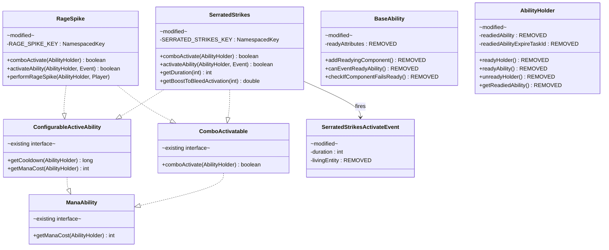

# Phase 2 LLD: Ready-State Removal & Swords Migration

> **HLD Reference:** [docs/hld/mana/mana-ability-system.md](../../hld/mana/mana-ability-system.md)
> **Phase 1 Reference:** [phase-1-infrastructure-and-config-cleanup.md](phase-1-infrastructure-and-config-cleanup.md)
> **Status:** Implemented

## Scope

Phase 2 removes the entire ready-state activation pipeline and migrates Swords active abilities to combo-only activation. After this phase, no ability uses the ready-state model — all active abilities activate exclusively via click-combo sequences gated by mana.

**In scope:**
- Delete `ReadyAbility` interface, `ReadyData` base class, `SwordReadyData`
- Delete all `EventReadyableComponent` infrastructure: `EventReadyableComponent`, `EventReadyableComponentAttribute`, `RightClickReadyComponent`
- Delete `AbilityListener#readyAbilities()` and all call sites (`OnAttackAbilityListener`, `OnInteractAbilityListener`, `OnSneakAbilityListener`, `OnBlockBreakListener`)
- Delete ready-state fields and methods from `AbilityHolder`: `readiedAbility`, `readiedAbilityExpireTaskId`, `readyHolder()`, `readyAbility()`, `unreadyHolder()`, `getReadiedAbility()`
- Delete `BaseAbility` readying infrastructure: `readyAttributes` field, `addReadyingComponent()`, `canEventReadyAbility()`, `checkIfComponentFailsReady()`, `getReadyComponents()`, `sortReadyComponents()`
- Delete `AbilityHolderReadyEvent`, `AbilityHolderUnreadyEvent`, `OnAbilityHolderReadyListener`, `OnAbilityHolderUnreadyListener`
- Delete ready-related exception classes: `EventNotRegisteredForReadyingException`, `AbilityNotValidToReadyException`, `HolderAlreadyReadyException`
- Delete all `*ReadyComponent` and `*ActivateOnReadyComponent` inner classes from `SwordsComponents`, `MiningComponents`, `HerbalismComponents`, `WoodcuttingComponents`
- Remove readying and ready-dependent activation component registrations from all ability constructors (RageSpike, SerratedStrikes, OreScanner, MassHarvest, VerdantSurge)
- Deprecate `RequireEmptyOffhandSetting` and `RequireEmptyOffhandSettingSlot`; remove from settings GUI expansion registration
- Remove `REQUIRE_EMPTY_OFF_HAND_TO_READY` config route and YAML key
- Remove ready/unready localization keys and YAML entries
- Port `SerratedStrikes` to `ComboActivatable` with `comboActivate()`, per-tier mana costs
- Clean up `RageSpike`: remove `ReadyAbility`, readying components, `unreadyHolder()` call in `activateAbility()`
- Backport remaining `getInt()`/`getDouble()` tier-config reads on `SerratedStrikes` and `RageSpike` to `getString()` + Parser (completing the Phase 1 parser backport for Swords)
- Remove `LivingEntity` field, constructor parameter, and getter from `SerratedStrikesActivateEvent` entirely (combo activation has no target entity; no third-party integrations to preserve)
- Verify passive Swords abilities (Bleed, EnhancedBleed, DeeperWound, Vampire) work correctly — these do not implement `ManaAbility` and bypass the mana pipeline entirely
- Unit tests

**Out of scope (later phases):**
- Mining ability migration: OreScanner ready-path removal (Phase 3) — combo path already works
- Herbalism ability migration: MassHarvest, VerdantSurge combo migration (Phase 3) — VerdantSurge is temporarily unactivatable after this phase
- `MiningReadyData`, `HerbalismReadyData`, `WoodcuttingReadyData` deletion (Phase 3/4) — retained as dead code
- Woodcutting active ability design and balance pass (Phase 4)
- `ComboManager` timeout config fix (Phase 1 leftover — `DEFAULT_TIMEOUT_TICKS` is still hardcoded to `14L` despite `MainConfigFile.COMBO_TIMING_WINDOW_TICKS` existing)

---

## Class Diagrams

Split into two focused diagrams for readability.

**Legend** (applies to all diagrams):
Abstract classes are annotated `abstract` · Interfaces annotated `interface` · Records annotated `record` · Deleted classes annotated `deleted` · Modified classes annotated `modified` · Deprecated classes annotated `deprecated` · Existing unmodified classes annotated `existing` · `*--` composition · `o--` association · `-->` dependency · `..|>` implements · `--|>` extends

### Diagram 1: Ready-State Infrastructure Removal

Everything in red/deleted is removed in Phase 2. The `ReadyData` subclasses for Mining, Herbalism, and Woodcutting are retained as dead code (Phase 3/4 cleanup).

```mermaid
classDiagram
    direction TB

    class ReadyAbility {
        ~deleted interface~
        +getReadyData() ReadyData
    }

    class ReadyData {
        ~deleted abstract~
        +getReadyMessage(McRPGPlayer) Component
        +getUnreadyMessage(McRPGPlayer) Component
    }

    class SwordReadyData {
        ~deleted~
    }

    class MiningReadyData {
        ~dead_code until Phase 3~
    }

    class HerbalismReadyData {
        ~dead_code until Phase 3~
    }

    class WoodcuttingReadyData {
        ~dead_code until Phase 4~
    }

    class EventReadyableComponent {
        ~deleted interface~
        +shouldReady(AbilityHolder, Event) boolean
    }

    class RightClickReadyComponent {
        ~deleted interface~
        +getValidMaterialsForActivation() Set
    }

    class EventReadyableComponentAttribute {
        ~deleted record~
    }

    class AbilityHolderReadyEvent {
        ~deleted~
    }

    class AbilityHolderUnreadyEvent {
        ~deleted~
    }

    class OnAbilityHolderReadyListener {
        ~deleted~
    }

    class OnAbilityHolderUnreadyListener {
        ~deleted~
    }

    class EventNotRegisteredForReadyingException {
        ~deleted~
    }

    class AbilityNotValidToReadyException {
        ~deleted~
    }

    class HolderAlreadyReadyException {
        ~deleted~
    }

    class RequireEmptyOffhandSetting {
        ~deprecated~
    }

    class RequireEmptyOffhandSettingSlot {
        ~deprecated~
    }

    SwordReadyData --|> ReadyData
    MiningReadyData --|> ReadyData
    HerbalismReadyData --|> ReadyData
    WoodcuttingReadyData --|> ReadyData
    RightClickReadyComponent --|> EventReadyableComponent
    EventReadyableComponentAttribute o-- EventReadyableComponent
    OnAbilityHolderReadyListener --> AbilityHolderReadyEvent
    OnAbilityHolderUnreadyListener --> AbilityHolderUnreadyEvent
```



### Diagram 2: Swords Ability Migration

Shows the Swords abilities before and after Phase 2. SerratedStrikes gains `ComboActivatable`; RageSpike drops `ReadyAbility`. Both become combo-only.



---

## 1. Modifications to Existing Classes

### 1.1 `SerratedStrikes` — Add `ComboActivatable`, Remove `ReadyAbility`

**File:** `src/main/java/us/eunoians/mcrpg/ability/impl/swords/SerratedStrikes.java`

**Interface changes:**

```java
// Before:
public final class SerratedStrikes extends McRPGAbility implements ConfigurableActiveAbility, ConfigurableSkillAbility, ReadyAbility {

// After:
public final class SerratedStrikes extends McRPGAbility implements ConfigurableActiveAbility, ConfigurableSkillAbility, ComboActivatable {
```

**Constructor — remove all readying and ready-dependent activation components:**

The current constructor registers readying components and two activation components on `EntityDamageByEntityEvent`. The `SWORDS_ACTIVATE_ON_READY_COMPONENT` checks `getReadiedAbility().isPresent()` which no longer exists. The `HOLDING_SWORD_ACTIVATE_COMPONENT` would allow activation on every sword hit without the ready gate. Both must be removed — SerratedStrikes is now combo-only.

```java
// Before:
public SerratedStrikes(@NotNull McRPG plugin) {
    super(plugin, SERRATED_STRIKES_KEY);
    addReadyingComponent(SwordsComponents.SWORDS_READY_COMPONENT, PlayerInteractEvent.class, 0);
    addReadyingComponent(SwordsComponents.SWORDS_READY_COMPONENT, PlayerInteractEntityEvent.class, 0);

    addActivatableComponent(SwordsComponents.HOLDING_SWORD_ACTIVATE_COMPONENT, EntityDamageByEntityEvent.class, 0);
    addActivatableComponent(SwordsComponents.SWORDS_ACTIVATE_ON_READY_COMPONENT, EntityDamageByEntityEvent.class, 1);
}

// After:
public SerratedStrikes(@NotNull McRPG plugin) {
    super(plugin, SERRATED_STRIKES_KEY);
}
```

**Why remove `HOLDING_SWORD_ACTIVATE_COMPONENT`:** Without the ready-gate component at priority 1, the sword-check at priority 0 would pass on every melee hit, making `activateAbility()` fire on every attack. Since SerratedStrikes is now combo-only, it must have no activation components. `activateAbility()` remains implemented (required by `Ability` interface) but is never called via the listener path because `canEventActivateAbility()` returns `false` when no activation components are registered.

**New `comboActivate()` method:**

Delegates to the same activation logic as the current `activateAbility()` — fires `SerratedStrikesActivateEvent`, adds active ability with duration. Does NOT call `putHolderOnCooldown()` (the combo listener handles cooldown after `comboActivate()` returns).

```java
/**
 * Activates Serrated Strikes via the combo system. Fires
 * {@link SerratedStrikesActivateEvent} and, if not cancelled,
 * marks the ability as active for its tier-dependent duration.
 *
 * @param abilityHolder The holder activating this ability.
 * @return {@code true} if the ability executed, {@code false} if the
 *         event was cancelled by a third-party listener.
 */
@Override
public boolean comboActivate(@NotNull AbilityHolder abilityHolder) {
    int duration = getDuration(getCurrentAbilityTier(abilityHolder));
    SerratedStrikesActivateEvent serratedStrikesActivateEvent =
            new SerratedStrikesActivateEvent(abilityHolder, duration);
    Bukkit.getPluginManager().callEvent(serratedStrikesActivateEvent);

    if (serratedStrikesActivateEvent.isCancelled()) {
        return false;
    }
    abilityHolder.addActiveAbility(this, serratedStrikesActivateEvent.getDuration());
    return true;
}
```

**`activateAbility()` — delegate to shared activation logic:**

No backward compatibility needed (no third-party integrations). Rewrite to use the same event constructor as `comboActivate()` (no `LivingEntity` parameter). The method is never event-triggered (no activation components registered) but remains implemented for the `Ability` interface contract.

```java
// Before:
@Override
public boolean activateAbility(@NotNull AbilityHolder abilityHolder, @NotNull Event event) {
    EntityDamageByEntityEvent damageEvent = (EntityDamageByEntityEvent) event;
    LivingEntity entity = (LivingEntity) damageEvent.getEntity();
    SerratedStrikesActivateEvent serratedStrikesActivateEvent = new SerratedStrikesActivateEvent(abilityHolder, entity, getDuration(getCurrentAbilityTier(abilityHolder)));
    Bukkit.getPluginManager().callEvent(serratedStrikesActivateEvent);

    if (serratedStrikesActivateEvent.isCancelled()) {
        return false;
    }
    abilityHolder.addActiveAbility(this, serratedStrikesActivateEvent.getDuration());
    putHolderOnCooldown(abilityHolder);
    return true;
}

// After:
@Override
public boolean activateAbility(@NotNull AbilityHolder abilityHolder, @NotNull Event event) {
    return comboActivate(abilityHolder);
}
```

**Delete `getReadyData()`:**

```java
// Delete entirely:
@NotNull
@Override
public SwordReadyData getReadyData() {
    return new SwordReadyData();
}
```

**Parser backport — `getDuration()` and `getBoostToBleedActivation()`:**

These methods currently use `getInt()` and `getDouble()` instead of the Parser pattern. Migrate to `getString()` + `Parser.setVariable("tier", tier)` to complete the Phase 1 parser backport for Swords.

```java
// Before:
public int getDuration(int tier) {
    YamlDocument swordsConfig = getYamlDocument();
    Route allTiersRoute = Route.addTo(getRouteForAllTiers(), "duration");
    Route tierRoute = Route.addTo(getRouteForTier(tier), "duration");
    if (swordsConfig.contains(tierRoute)) {
        return swordsConfig.getInt(tierRoute);
    } else {
        return swordsConfig.getInt(allTiersRoute);
    }
}

// After:
public int getDuration(int tier) {
    YamlDocument swordsConfig = getYamlDocument();
    Route allTiersRoute = Route.addTo(getRouteForAllTiers(), "duration");
    Route tierRoute = Route.addTo(getRouteForTier(tier), "duration");
    Parser parser;
    if (swordsConfig.contains(tierRoute)) {
        parser = new Parser(swordsConfig.getString(tierRoute));
    } else {
        parser = new Parser(swordsConfig.getString(allTiersRoute));
    }
    parser.setVariable("tier", tier);
    return (int) parser.getValue();
}
```

Apply the same pattern to `getBoostToBleedActivation()` (replace `getDouble()` with `getString()` + Parser, return `parser.getValue()` as double).

**Remove imports:** `ReadyAbility`, `SwordReadyData`, `PlayerInteractEvent`, `PlayerInteractEntityEvent`, `EntityDamageByEntityEvent`, `LivingEntity` (no longer used after constructor cleanup and `activateAbility()` delegation). Add import for `ComboActivatable`, `Parser`.

### 1.2 `SerratedStrikesActivateEvent` — Remove `LivingEntity`

**File:** `src/main/java/us/eunoians/mcrpg/event/ability/swords/SerratedStrikesActivateEvent.java`

The `LivingEntity` field existed because the old ready-state path activated on a melee hit. Combo activation has no target entity. Since there are no third-party integrations to worry about, remove the field and parameter entirely rather than making it nullable.

```java
// Before:
private final LivingEntity livingEntity;

public SerratedStrikesActivateEvent(@NotNull AbilityHolder abilityHolder,
                                     @NotNull LivingEntity livingEntity,
                                     int duration) {
    super(abilityHolder, SERRATED_STRIKES);
    this.livingEntity = livingEntity;
    this.duration = Math.max(0, duration);
}

@NotNull
public LivingEntity getLivingEntity() {
    return livingEntity;
}

// After (field and getter removed, constructor simplified):
public SerratedStrikesActivateEvent(@NotNull AbilityHolder abilityHolder,
                                     int duration) {
    super(abilityHolder, SERRATED_STRIKES);
    this.duration = Math.max(0, duration);
}
```

Remove the `LivingEntity` import from the file.

### 1.3 `RageSpike` — Remove `ReadyAbility`, Clean Up Ready Path

**File:** `src/main/java/us/eunoians/mcrpg/ability/impl/swords/RageSpike.java`

**Interface changes:**

```java
// Before:
public final class RageSpike extends McRPGAbility implements ConfigurableActiveAbility, ConfigurableSkillAbility, ReadyAbility, ComboActivatable {

// After:
public final class RageSpike extends McRPGAbility implements ConfigurableActiveAbility, ConfigurableSkillAbility, ComboActivatable {
```

**Constructor — remove all readying and ready-dependent activation components:**

RageSpike currently registers readying components on `PlayerInteractEvent`/`PlayerInteractEntityEvent` and activation components on `PlayerToggleSneakEvent`. The `SWORDS_ACTIVATE_ON_READY_COMPONENT` at priority 0 gates on ready state; the `RAGE_SPIKE_ACTIVATE_COMPONENT` at priority 1 checks sneaking. Without the ready gate, the sneak component would activate on every sneak. Both must be removed — RageSpike is now combo-only.

```java
// Before:
public RageSpike(@NotNull McRPG mcRPG) {
    super(mcRPG, RAGE_SPIKE_KEY);
    addReadyingComponent(SwordsComponents.SWORDS_READY_COMPONENT, PlayerInteractEvent.class, 0);
    addReadyingComponent(SwordsComponents.SWORDS_READY_COMPONENT, PlayerInteractEntityEvent.class, 0);

    addActivatableComponent(SwordsComponents.SWORDS_ACTIVATE_ON_READY_COMPONENT, PlayerToggleSneakEvent.class, 0);
    addActivatableComponent(RageSpikeComponents.RAGE_SPIKE_ACTIVATE_COMPONENT, PlayerToggleSneakEvent.class, 1);
}

// After:
public RageSpike(@NotNull McRPG mcRPG) {
    super(mcRPG, RAGE_SPIKE_KEY);
}
```

**`activateAbility()` — remove `unreadyHolder()` call:**

```java
// Before:
@Override
public boolean activateAbility(@NotNull AbilityHolder abilityHolder, @NotNull Event event) {
    RageSpikeActivateEvent rageSpikeActivateEvent = new RageSpikeActivateEvent(abilityHolder);
    Bukkit.getPluginManager().callEvent(rageSpikeActivateEvent);

    if (rageSpikeActivateEvent.isCancelled()) {
        return false;
    }
    if (Bukkit.getPlayer(abilityHolder.getUUID()) instanceof Player player) {
        abilityHolder.unreadyHolder();
        performRageSpike(abilityHolder, player);
        putHolderOnCooldown(abilityHolder);
    }
    return true;
}

// After:
@Override
public boolean activateAbility(@NotNull AbilityHolder abilityHolder, @NotNull Event event) {
    RageSpikeActivateEvent rageSpikeActivateEvent = new RageSpikeActivateEvent(abilityHolder);
    Bukkit.getPluginManager().callEvent(rageSpikeActivateEvent);

    if (rageSpikeActivateEvent.isCancelled()) {
        return false;
    }
    if (Bukkit.getPlayer(abilityHolder.getUUID()) instanceof Player player) {
        performRageSpike(abilityHolder, player);
    }
    return true;
}
```

**`comboActivate()` — no changes needed.** The existing implementation already does not call `unreadyHolder()` or `putHolderOnCooldown()`.

**Delete `getReadyData()`:**

```java
// Delete entirely:
@NotNull
@Override
public SwordReadyData getReadyData() {
    return new SwordReadyData();
}
```

**Parser backport — `getDamage()` and `getVelocity()`:**

Migrate from `getDouble()`/`getInt()` to `getString()` + `Parser.setVariable("tier", tier)`.

```java
// Before (getDamage):
public double getDamage(int tier) {
    YamlDocument swordsConfig = getYamlDocument();
    Route allTiersRoute = Route.addTo(getRouteForAllTiers(), "damage");
    Route tierRoute = Route.addTo(getRouteForTier(tier), "damage");
    if (swordsConfig.contains(tierRoute)) {
        return swordsConfig.getDouble(tierRoute);
    } else {
        return swordsConfig.getDouble(allTiersRoute);
    }
}

// After:
public double getDamage(int tier) {
    YamlDocument swordsConfig = getYamlDocument();
    Route allTiersRoute = Route.addTo(getRouteForAllTiers(), "damage");
    Route tierRoute = Route.addTo(getRouteForTier(tier), "damage");
    Parser parser;
    if (swordsConfig.contains(tierRoute)) {
        parser = new Parser(swordsConfig.getString(tierRoute));
    } else {
        parser = new Parser(swordsConfig.getString(allTiersRoute));
    }
    parser.setVariable("tier", tier);
    return parser.getValue();
}
```

Apply the same pattern to `getVelocity()` (replace `getInt()` with Parser, return `(int) parser.getValue()`).

**Remove imports:** `ReadyAbility`, `SwordReadyData`, `PlayerInteractEvent`, `PlayerInteractEntityEvent`, `PlayerToggleSneakEvent` (if no longer used). Add import for `Parser`.

### 1.4 `RageSpikeComponents` — Delete Entirely

**File:** `src/main/java/us/eunoians/mcrpg/ability/impl/swords/RageSpikeComponents.java`

Delete the entire file. The `RAGE_SPIKE_ACTIVATE_COMPONENT` is only used in RageSpike's constructor for the sneak-after-ready activation path, which is being removed.

### 1.5 `SwordsComponents` — Remove Ready-Related Components

**File:** `src/main/java/us/eunoians/mcrpg/ability/impl/swords/SwordsComponents.java`

Remove the `SwordsReadyComponent` inner class, `SwordsActivateOnReadyComponent` inner class, and their static field declarations. Keep `HoldingSwordActivateComponent` (still used by passive abilities like Bleed).

```java
// Before:
public class SwordsComponents {

    public static final SwordsReadyComponent SWORDS_READY_COMPONENT = new SwordsReadyComponent();
    public static final SwordsActivateOnReadyComponent SWORDS_ACTIVATE_ON_READY_COMPONENT = new SwordsActivateOnReadyComponent();
    public static final HoldingSwordActivateComponent HOLDING_SWORD_ACTIVATE_COMPONENT = new HoldingSwordActivateComponent();;

    // ... SWORDS set ...

    private static class SwordsReadyComponent implements RightClickReadyComponent { ... }
    private static class HoldingSwordActivateComponent implements OnAttackComponent { ... }
    private static class SwordsActivateOnReadyComponent implements EventActivatableComponent { ... }
}

// After:
public class SwordsComponents {

    public static final HoldingSwordActivateComponent HOLDING_SWORD_ACTIVATE_COMPONENT = new HoldingSwordActivateComponent();

    private static final Set<Material> SWORDS = Set.of(Material.WOODEN_SWORD, Material.STONE_SWORD, Material.IRON_SWORD, Material.COPPER_SWORD,
            Material.DIAMOND_SWORD, Material.GOLDEN_SWORD, Material.NETHERITE_SWORD);

    private static class HoldingSwordActivateComponent implements OnAttackComponent { /* unchanged */ }
}
```

Remove imports: `RightClickReadyComponent`, `SwordReadyData`.

### 1.6 `MiningComponents` — Remove Ready-Related Components

**File:** `src/main/java/us/eunoians/mcrpg/ability/impl/mining/MiningComponents.java`

Remove `MINING_READY_COMPONENT`, `MiningReadyComponent`, `MINING_ACTIVATE_ON_READY_COMPONENT`, `MiningActivateOnReadyComponent`. Keep `HOLDING_PICKAXE_BREAK_BLOCK_ACTIVATE_COMPONENT` and `HOLDING_PICKAXE_INTERACT_ACTIVATE_COMPONENT` (used by passive mining abilities).

Remove imports: `RightClickReadyComponent`, `MiningReadyData`.

### 1.7 `HerbalismComponents` — Remove Ready-Related Components

**File:** `src/main/java/us/eunoians/mcrpg/ability/impl/herbalism/HerbalismComponents.java`

Remove `HERBALISM_READY_COMPONENT`, `HerbalismReadyComponent`, `HERBALISM_ACTIVATE_ON_READY_COMPONENT`, `HerbalismActivateOnReadyComponent`. Keep `HOLDING_HOE_BREAK_BLOCK_ACTIVATE_COMPONENT` and `HOLDING_HOE_INTERACT_ACTIVATE_COMPONENT`.

Remove imports: `RightClickReadyComponent`, `HerbalismReadyData`.

### 1.8 `WoodcuttingComponents` — Remove Ready-Related Components

**File:** `src/main/java/us/eunoians/mcrpg/ability/impl/woodcutting/WoodcuttingComponents.java`

Remove `WOODCUTTING_READY_COMPONENT`, `WoodcuttingReadyComponent`, `WOODCUTTING_ACTIVATE_ON_READY_COMPONENT`, `WoodcuttingActivateOnReadyComponent`. Keep `HOLDING_AXE_BREAK_BLOCK_ACTIVATE_COMPONENT` and `HOLDING_AXE_INTERACT_ACTIVATE_COMPONENT`.

Remove imports: `RightClickReadyComponent`, `WoodcuttingReadyData`.

### 1.9 `OreScanner` — Remove `ReadyAbility` and Ready-Dependent Components

**File:** `src/main/java/us/eunoians/mcrpg/ability/impl/mining/OreScanner.java`

OreScanner already implements `ComboActivatable` from Phase 1. Remove `ReadyAbility`, readying component registrations, ready-dependent activation component registrations, `getReadyData()`, and any `unreadyHolder()` call in `activateAbility()`.

```java
// Before interface list:
... implements ConfigurableActiveAbility, ConfigurableSkillAbility, ReadyAbility, ComboActivatable {

// After:
... implements ConfigurableActiveAbility, ConfigurableSkillAbility, ComboActivatable {
```

**Constructor changes:** Remove all `addReadyingComponent(...)` calls. Remove `addActivatableComponent(MiningComponents.MINING_ACTIVATE_ON_READY_COMPONENT, ...)` call. Keep any activation components that do NOT depend on ready state.

**Delete `getReadyData()`.**

**`activateAbility()`:** Remove any `abilityHolder.unreadyHolder()` call if present.

### 1.10 `MassHarvest` — Remove `ReadyAbility` and Ready-Dependent Components

**File:** `src/main/java/us/eunoians/mcrpg/ability/impl/herbalism/MassHarvest.java`

Same pattern as OreScanner. Already has `ComboActivatable`. Remove `ReadyAbility`, readying components, ready-dependent activation components, `getReadyData()`, and `unreadyHolder()` call in `activateAbility()`.

### 1.11 `VerdantSurge` — Remove `ReadyAbility` (Temporarily Unactivatable)

**File:** `src/main/java/us/eunoians/mcrpg/ability/impl/herbalism/VerdantSurge.java`

VerdantSurge is currently ready-state-only (no `ComboActivatable`). Removing `ReadyAbility` and all readying/ready-dependent activation components makes it unactivatable until Phase 3 adds `ComboActivatable`.

```java
// Before:
public final class VerdantSurge extends McRPGAbility implements ConfigurableActiveAbility,
        ConfigurableSkillAbility, ReadyAbility {

// After:
public final class VerdantSurge extends McRPGAbility implements ConfigurableActiveAbility,
        ConfigurableSkillAbility {
```

**Constructor:** Remove all `addReadyingComponent(...)` and `addActivatableComponent(...)` calls that reference ready-dependent components (`HERBALISM_READY_COMPONENT`, `HERBALISM_ACTIVATE_ON_READY_COMPONENT`). Keep the `HOLDING_HOE_INTERACT_ACTIVATE_COMPONENT` if it does not depend on ready state.

**Delete `getReadyData()`.** Remove `unreadyHolder()` call in `activateAbility()`.

**Accepted trade-off:** VerdantSurge is unreachable from any activation path after this change. Phase 3 will add `ComboActivatable` with `comboActivate()` and per-tier mana costs. The ability remains registered in the ability registry and can be unlocked/displayed — it just cannot fire.

### 1.12 `BaseAbility` — Remove Readying Infrastructure

**File:** `src/main/java/us/eunoians/mcrpg/ability/BaseAbility.java`

Remove the following field, methods, and imports:

**Field to remove:**
```java
private final Map<Class<? extends Event>, List<EventReadyableComponentAttribute>> readyAttributes;
```

Also remove `readyAttributes = new HashMap<>()` from constructor.

**Methods to remove:**
- `canEventReadyAbility(Event)` (lines 111-113)
- `checkIfComponentFailsReady(AbilityHolder, Event)` (lines 159-174)
- `addReadyingComponent(EventReadyableComponent, Class, int)` (lines 214-218)
- `getReadyComponents(Class)` (lines 239-241)
- `sortReadyComponents()` (lines 263-267)

**Imports to remove:**
- `us.eunoians.mcrpg.ability.component.readyable.EventReadyableComponent`
- `us.eunoians.mcrpg.ability.component.readyable.EventReadyableComponentAttribute`
- `us.eunoians.mcrpg.ability.impl.type.ReadyAbility`
- `us.eunoians.mcrpg.exception.ability.EventNotRegisteredForReadyingException`
- `us.eunoians.mcrpg.exception.ready.AbilityNotValidToReadyException`

### 1.13 `AbilityHolder` — Remove Ready-State Fields and Methods

**File:** `src/main/java/us/eunoians/mcrpg/entity/holder/AbilityHolder.java`

**Fields to remove:**
```java
private Optional<ReadyData> readiedAbility;
private int readiedAbilityExpireTaskId;
```

Also remove `this.readiedAbility = Optional.empty()` from constructor.

**Methods to remove:**
- `getReadiedAbility()` (lines 463-465)
- `unreadyHolder()` (public, lines 471-473)
- `unreadyHolder(boolean autoExpired)` (private, lines 481-488)
- `readyHolder(@NotNull ReadyData readyData)` (lines 503-517)
- `readyAbility(@NotNull ReadyAbility ability)` (lines 532-547)

**`cleanupHolder()` — remove ready task cancellation:**

```java
// Before:
public void cleanupHolder() {
    for (int taskId : abilityCooldownExpireTasks.values()) {
        Bukkit.getScheduler().cancelTask(taskId);
    }
    Bukkit.getScheduler().cancelTask(readiedAbilityExpireTaskId);
    activeAbilities.clear();
}

// After:
public void cleanupHolder() {
    for (int taskId : abilityCooldownExpireTasks.values()) {
        Bukkit.getScheduler().cancelTask(taskId);
    }
    activeAbilities.clear();
}
```

**Imports to remove:**
- `us.eunoians.mcrpg.ability.ready.ReadyData`
- `us.eunoians.mcrpg.ability.impl.type.ReadyAbility`
- `us.eunoians.mcrpg.event.entity.AbilityHolderReadyEvent`
- `us.eunoians.mcrpg.event.entity.AbilityHolderUnreadyEvent`
- `com.diamonddagger590.mccore.task.CoreTask`
- `com.diamonddagger590.mccore.task.DelayableCoreTask` (verify no other usage)

### 1.14 `AbilityListener` — Delete `readyAbilities()`

**File:** `src/main/java/us/eunoians/mcrpg/listener/ability/AbilityListener.java`

Delete the entire `readyAbilities()` default method (lines 131-181). Also delete the `getManaInstance()` helper if it becomes unused (verify it is still used by `activateAbilities()`; it is — keep it).

**Imports to remove:**
- `us.eunoians.mcrpg.ability.impl.type.ReadyAbility`
- `us.eunoians.mcrpg.setting.impl.RequireEmptyOffhandSetting`
- `org.bukkit.Material`
- `org.bukkit.entity.Player`
- `us.eunoians.mcrpg.entity.player.McRPGPlayer` (verify — may still be used by `getManaInstance`)

### 1.15 Ability Listeners — Remove `readyAbilities()` Calls

Each of these listeners calls `readyAbilities(uuid, event)` after `activateAbilities(uuid, event)`. Remove the `readyAbilities` call from each.

**`OnAttackAbilityListener.java`:**
```java
// Before:
public void handleOnAttackAbilities(EntityDamageByEntityEvent entityDamageByEntityEvent) {
    UUID uuid = entityDamageByEntityEvent.getDamager().getUniqueId();
    activateAbilities(uuid, entityDamageByEntityEvent);
    readyAbilities(uuid, entityDamageByEntityEvent);
}

// After:
public void handleOnAttackAbilities(EntityDamageByEntityEvent entityDamageByEntityEvent) {
    UUID uuid = entityDamageByEntityEvent.getDamager().getUniqueId();
    activateAbilities(uuid, entityDamageByEntityEvent);
}
```

Apply the same pattern to:
- **`OnInteractAbilityListener.java`** — both `handleOnInteract()` and `handleOnInteractEntity()`
- **`OnSneakAbilityListener.java`** — `onSneak()`
- **`OnBlockBreakListener.java`** — `onBlockBreak()`

### 1.16 `McRPGListenerRegistrar` — Remove Ready Listener Registration

**File:** `src/main/java/us/eunoians/mcrpg/bootstrap/McRPGListenerRegistrar.java`

Remove the registration of `OnAbilityHolderReadyListener` and `OnAbilityHolderUnreadyListener`:

```java
// Delete these two lines:
Bukkit.getPluginManager().registerEvents(new OnAbilityHolderReadyListener(), plugin);
Bukkit.getPluginManager().registerEvents(new OnAbilityHolderUnreadyListener(), plugin);
```

Remove corresponding imports.

### 1.17 `RequireEmptyOffhandSetting` — Deprecate

**File:** `src/main/java/us/eunoians/mcrpg/setting/impl/RequireEmptyOffhandSetting.java`

Add `@Deprecated` with `forRemoval = true` and Javadoc explanation:

```java
/**
 * ...existing Javadoc...
 *
 * @deprecated The ready-state activation model was removed in the mana ability
 *             system Phase 2. This setting no longer affects gameplay because
 *             abilities are activated exclusively via click-combo sequences.
 *             Scheduled for removal in a future release.
 */
@Deprecated(forRemoval = true)
public enum RequireEmptyOffhandSetting implements McRPGSetting {
```

### 1.18 `RequireEmptyOffhandSettingSlot` — Deprecate

**File:** `src/main/java/us/eunoians/mcrpg/gui/setting/slot/RequireEmptyOffhandSettingSlot.java`

Add same `@Deprecated(forRemoval = true)` annotation with matching Javadoc.

### 1.19 `McRPGExpansion` — Remove `RequireEmptyOffhandSetting` from Settings Pack

**File:** `src/main/java/us/eunoians/mcrpg/expansion/McRPGExpansion.java`

Find the method that registers player settings (likely in a settings content pack method) and remove the line that adds `RequireEmptyOffhandSetting`. This prevents the deprecated setting from appearing in the player settings GUI.

### 1.20 `MainConfigFile` — Remove `REQUIRE_EMPTY_OFF_HAND_TO_READY`

**File:** `src/main/java/us/eunoians/mcrpg/configuration/file/MainConfigFile.java`

Delete the route constant:

```java
// Delete:
public static final Route REQUIRE_EMPTY_OFF_HAND_TO_READY = Route.fromString(toRoutePath(GAMEPLAY_CONFIGURATION_HEADER, "require-empty-off-hand-to-ready"));
```

### 1.21 `config.yml` — Remove Ready Config Key

**File:** `src/main/resources/config.yml`

Remove the `require-empty-off-hand-to-ready` key and its comment:

```yaml
# Delete these lines:
    # If enabled, players will be required to have an empty off hand in order to ready their abilities
    require-empty-off-hand-to-ready: false
```

### 1.22 `LocalizationKey` — Remove Ready/Unready Keys

**File:** `src/main/java/us/eunoians/mcrpg/configuration/file/localization/LocalizationKey.java`

Remove the entire `ABILITY_READY_HEADER` section and all ready/unready message routes:

```java
// Delete all of the following:
private static final String ABILITY_READY_HEADER = toRoutePath(ABILITY_HEADER, "ready");
private static final String HERBALISM_READY_HEADER = toRoutePath(ABILITY_READY_HEADER, "herbalism");
public static final Route HERBALISM_READY_MESSAGE = Route.fromString(toRoutePath(HERBALISM_READY_HEADER, "ready-message"));
public static final Route HERBALISM_UNREADY_MESSAGE = Route.fromString(toRoutePath(HERBALISM_READY_HEADER, "unready-message"));
private static final String MINING_READY_HEADER = toRoutePath(ABILITY_READY_HEADER, "mining");
public static final Route MINING_READY_MESSAGE = Route.fromString(toRoutePath(MINING_READY_HEADER, "ready-message"));
public static final Route MINING_UNREADY_MESSAGE = Route.fromString(toRoutePath(MINING_READY_HEADER, "unready-message"));
private static final String SWORDS_READY_HEADER = toRoutePath(ABILITY_READY_HEADER, "swords");
public static final Route SWORDS_READY_MESSAGE = Route.fromString(toRoutePath(SWORDS_READY_HEADER, "ready-message"));
public static final Route SWORDS_UNREADY_MESSAGE = Route.fromString(toRoutePath(SWORDS_READY_HEADER, "unready-message"));
private static final String WOODCUTTING_READY_HEADER = toRoutePath(ABILITY_READY_HEADER, "woodcutting");
public static final Route WOODCUTTING_READY_MESSAGE = Route.fromString(toRoutePath(WOODCUTTING_READY_HEADER, "ready-message"));
public static final Route WOODCUTTING_UNREADY_MESSAGE = Route.fromString(toRoutePath(WOODCUTTING_READY_HEADER, "unready-message"));
```

### 1.23 `en_abilities.yml` — Remove Ready Section

**File:** `src/main/resources/localization/english/en_abilities.yml`

Remove the entire `ready:` block under `ability:`:

```yaml
# Delete this entire section:
  ready:
    herbalism:
      ready-message: "<gray>You raise your hoe."
      unready-message: "<gray>You lower your hoe."
    mining:
      ready-message: "<gray>You ready your pickaxe."
      unready-message: "<gray>You lower your pickaxe."
    swords:
      ready-message: "<gray>You raise your sword."
      unready-message: "<gray>You lower your sword."
    woodcutting:
      ready-message: "<gray>You raise your axe."
      unready-message: "<gray>You lower your axe."
```

Also delete the comment `# Configure messages for when abilities are readied or unreadied.` that precedes it.

### 1.24 `swords_configuration.yml` — Add Mana Cost to SerratedStrikes

**File:** `src/main/resources/skill_configuration/swords_configuration.yml`

Add `mana-cost` to the `serrated-strikes.tier-configuration.all-tiers` section. Reference values from the HLD balance table: T1=50, T3=35, T5=22. Formula: `55-(6.5*tier)` approximates these values.

```yaml
  serrated-strikes:
    enabled: true
    amount-of-tiers: 5
    tier-configuration:
      all-tiers:
        upgrade-point-cost: 1
        upgrade-quest: "mcrpg:serrated_strikes_upgrade"
        mana-cost: "55-(6.5*tier)"
      tier-1:
        unlock-level: 1
        cooldown: 240
        duration: 2
        bleed-activation-boost: 5.0
```

The `mana-cost` is placed in `all-tiers` using a formula. Server owners can override individual tiers with explicit values if they prefer hand-tuned curves.

---

## 2. Deletions

### 2.1 Files Deleted

| File | Reason |
|------|--------|
| `src/main/java/us/eunoians/mcrpg/ability/impl/type/ReadyAbility.java` | Ready-state activation model removed |
| `src/main/java/us/eunoians/mcrpg/ability/ready/ReadyData.java` | Base class for deleted ready data hierarchy |
| `src/main/java/us/eunoians/mcrpg/ability/ready/SwordReadyData.java` | Swords ready data; Phase 2 Swords migration |
| `src/main/java/us/eunoians/mcrpg/ability/component/readyable/EventReadyableComponent.java` | Readying component interface |
| `src/main/java/us/eunoians/mcrpg/ability/component/readyable/EventReadyableComponentAttribute.java` | Readying component attribute record |
| `src/main/java/us/eunoians/mcrpg/ability/component/readyable/RightClickReadyComponent.java` | Right-click ready component interface |
| `src/main/java/us/eunoians/mcrpg/event/entity/AbilityHolderReadyEvent.java` | Ready event — no abilities use readying |
| `src/main/java/us/eunoians/mcrpg/event/entity/AbilityHolderUnreadyEvent.java` | Unready event — no abilities use readying |
| `src/main/java/us/eunoians/mcrpg/listener/entity/holder/OnAbilityHolderReadyListener.java` | Ready event listener |
| `src/main/java/us/eunoians/mcrpg/listener/entity/holder/OnAbilityHolderUnreadyListener.java` | Unready event listener |
| `src/main/java/us/eunoians/mcrpg/exception/ability/EventNotRegisteredForReadyingException.java` | Ready-path exception |
| `src/main/java/us/eunoians/mcrpg/exception/ready/AbilityNotValidToReadyException.java` | Ready-path exception |
| `src/main/java/us/eunoians/mcrpg/exception/ready/HolderAlreadyReadyException.java` | Ready-path exception |
| `src/main/java/us/eunoians/mcrpg/ability/impl/swords/RageSpikeComponents.java` | Only contained ready-path sneak activation component |

### 2.2 Files Deleted (Previously Proposed as Dead Code)

All `ReadyData` subclasses were deleted in this phase alongside the `ReadyData` base class. Retaining them as dead code was not viable because the base class deletion would leave them uncompilable. The localized ready/unready message strings (preserved in git history via `en_abilities.yml`) can be recovered if a future phase needs them.

| File | Reason |
|------|--------|
| `src/main/java/us/eunoians/mcrpg/ability/ready/MiningReadyData.java` | ReadyData base class deleted; orphaned subclass |
| `src/main/java/us/eunoians/mcrpg/ability/ready/HerbalismReadyData.java` | ReadyData base class deleted; orphaned subclass |
| `src/main/java/us/eunoians/mcrpg/ability/ready/WoodcuttingReadyData.java` | ReadyData base class deleted; orphaned subclass |

### 2.3 Localization Keys Deleted

| Route | Source File |
|-------|------------|
| `ABILITY_READY_HEADER` (private) | `LocalizationKey.java` |
| `HERBALISM_READY_MESSAGE` | `LocalizationKey.java` |
| `HERBALISM_UNREADY_MESSAGE` | `LocalizationKey.java` |
| `MINING_READY_MESSAGE` | `LocalizationKey.java` |
| `MINING_UNREADY_MESSAGE` | `LocalizationKey.java` |
| `SWORDS_READY_MESSAGE` | `LocalizationKey.java` |
| `SWORDS_UNREADY_MESSAGE` | `LocalizationKey.java` |
| `WOODCUTTING_READY_MESSAGE` | `LocalizationKey.java` |
| `WOODCUTTING_UNREADY_MESSAGE` | `LocalizationKey.java` |

### 2.4 Config Keys Deleted

| Key | File |
|-----|------|
| `configuration.gameplay.require-empty-off-hand-to-ready` | `config.yml` |
| `MainConfigFile.REQUIRE_EMPTY_OFF_HAND_TO_READY` | `MainConfigFile.java` |

### 2.5 Registration References to Clean Up

| Location | What to Remove |
|----------|---------------|
| `McRPGListenerRegistrar` | `OnAbilityHolderReadyListener`, `OnAbilityHolderUnreadyListener` registration |
| `McRPGExpansion` | `RequireEmptyOffhandSetting` from settings content pack |

### 2.6 YAML Sections Removed

| File | Section |
|------|---------|
| `config.yml` | `require-empty-off-hand-to-ready` key |
| `en_abilities.yml` | Entire `ability.ready` section |

---

## 3. Key Flows

### 3.1 Combo Activation Flow (Post-Phase 2)

No changes from Phase 1 — the combo activation path is unchanged. The only difference is that more abilities now exclusively use this path.

```
Player clicks Right, Right, Right (or RRL, RLR)
  └─> OnComboInputListener.onInteract() / onAttack()
      └─> ComboManager.processInput(player, ComboInput)
          ├─> PlayerComboState tracks sequence
          ├─> Timeout task (DEFAULT_TIMEOUT_TICKS)
          └─> Pattern complete → fire ComboCompleteEvent

ComboCompleteEvent received by OnComboCompleteListener
  └─> onComboComplete(event)
      ├─> Resolve LoadoutHolder, build ordered ComboActivatable list
      ├─> Map event.getSlotIndex() to comboAbilities[slot-1]
      ├─> Gate 1: Cooldown check
      ├─> Gate 2: Mana check (PlayerStatConsumeEvent → consume)
      ├─> boolean activated = comboAbility.comboActivate(abilityHolder)
      │   ├─> SerratedStrikes: fires SerratedStrikesActivateEvent(duration), addActiveAbility(duration)
      │   └─> RageSpike: fires RageSpikeActivateEvent, performRageSpike(holder, player)
      ├─> If !activated → manaInstance.restore(effectiveCost)
      └─> If CooldownableAbility → putHolderOnCooldown()
```

### 3.2 Passive Ability Activation Flow (Unchanged)

Passive Swords abilities (Bleed, EnhancedBleed, DeeperWound, Vampire) do NOT implement `ManaAbility`. They are activated via `AbilityListener#activateAbilities()` through the non-mana branch:

```
EntityDamageByEntityEvent fires
  └─> OnAttackAbilityListener.handleOnAttackAbilities(event)
      └─> activateAbilities(uuid, event)
          ├─> Stream filters: canEventActivateAbility, components, cooldown
          └─> For each eligible ability:
              └─> ability is NOT ManaAbility → ability.activateAbility(holder, event)
                  └─> Bleed: fires BleedActivateEvent → BleedManager.startBleeding()
```

Note: `readyAbilities(uuid, event)` is no longer called after `activateAbilities()`.

### 3.3 Bleed Chain Activation (Unaffected)

```
BleedActivateEvent fires (from Bleed.activateAbility)
  └─> OnBleedActivateListener calls activateAbilities(uuid, bleedEvent)
      └─> EnhancedBleed, DeeperWound, Vampire activate via their components
          └─> None implement ManaAbility → no mana checks
```

---

## 4. Config Changes

### 4.1 `swords_configuration.yml` — Add SerratedStrikes Mana Cost

```yaml
  serrated-strikes:
    enabled: true
    amount-of-tiers: 5
    tier-configuration:
      all-tiers:
        upgrade-point-cost: 1
        upgrade-quest: "mcrpg:serrated_strikes_upgrade"
        mana-cost: "55-(6.5*tier)"
      # tier-1 through tier-5 unchanged
```

Formula `55-(6.5*tier)` produces: T1=48.5≈49, T2=42, T3=35.5≈36, T4=29, T5=22.5≈23. These approximate the HLD reference (T1=50, T3=35, T5=22). Final tuning is Phase 4.

### 4.2 `config.yml` — Remove Ready Config Key

Delete:
```yaml
    require-empty-off-hand-to-ready: false
```

---

## 5. Localization Changes

### 5.1 Keys Removed from `en_abilities.yml`

The entire `ability.ready` section is removed. No new keys are added in Phase 2.

---

## 6. Implementation Order

Ordered to minimize compilation errors at each step. The implementor (Sonnet) should follow this order strictly — each step should leave the project in a compilable state.

1. **Delete `RageSpikeComponents.java`** — only used by RageSpike's constructor; removing the file before cleaning the constructor will cause a compile error in RageSpike, so clean the constructor first OR do steps 1-3 together as one atomic change.

2. **Clean `RageSpike` constructor and methods** — remove `ReadyAbility` from implements, remove all `addReadyingComponent()`/`addActivatableComponent()` calls from constructor, delete `getReadyData()`, remove `unreadyHolder()` call from `activateAbility()`, backport `getDamage()`/`getVelocity()` to Parser. Now `RageSpikeComponents` has no references — delete it.

3. **Modify `SerratedStrikesActivateEvent`** — remove `LivingEntity` field, getter, constructor parameter, and import.

4. **Migrate `SerratedStrikes`** — remove `ReadyAbility` from implements, add `ComboActivatable`, remove constructor component registrations, add `comboActivate()`, make `activateAbility()` delegate to `comboActivate()`, delete `getReadyData()`, backport `getDuration()`/`getBoostToBleedActivation()` to Parser.

5. **Clean `SwordsComponents`** — remove `SWORDS_READY_COMPONENT`, `SwordsReadyComponent`, `SWORDS_ACTIVATE_ON_READY_COMPONENT`, `SwordsActivateOnReadyComponent` fields and inner classes. Keep `HOLDING_SWORD_ACTIVATE_COMPONENT`.

6. **Clean `OreScanner`** — remove `ReadyAbility`, readying components, ready-dependent activation components, `getReadyData()`, `unreadyHolder()` call.

7. **Clean `MassHarvest`** — same as OreScanner.

8. **Clean `VerdantSurge`** — remove `ReadyAbility`, readying components, ready-dependent activation components, `getReadyData()`, `unreadyHolder()` call.

9. **Clean `MiningComponents`** — remove ready-related fields and inner classes.

10. **Clean `HerbalismComponents`** — remove ready-related fields and inner classes.

11. **Clean `WoodcuttingComponents`** — remove ready-related fields and inner classes.

12. **Delete `AbilityListener#readyAbilities()`** — remove the entire method from the interface. Remove `RequireEmptyOffhandSetting` import.

13. **Remove `readyAbilities()` calls** from `OnAttackAbilityListener`, `OnInteractAbilityListener`, `OnSneakAbilityListener`, `OnBlockBreakListener`.

14. **Clean `BaseAbility`** — remove `readyAttributes` field and initialization, `addReadyingComponent()`, `canEventReadyAbility()`, `checkIfComponentFailsReady()`, `getReadyComponents()`, `sortReadyComponents()`.

15. **Clean `AbilityHolder`** — remove `readiedAbility`, `readiedAbilityExpireTaskId`, `getReadiedAbility()`, `unreadyHolder()`, `readyHolder()`, `readyAbility()`, cleanup reference in `cleanupHolder()`.

16. **Delete ready event classes** — `AbilityHolderReadyEvent.java`, `AbilityHolderUnreadyEvent.java`.

17. **Delete ready listener classes** — `OnAbilityHolderReadyListener.java`, `OnAbilityHolderUnreadyListener.java`.

18. **Clean `McRPGListenerRegistrar`** — remove ready listener registration lines and imports.

19. **Delete ready data classes** — `ReadyAbility.java`, `ReadyData.java`, `SwordReadyData.java`, `MiningReadyData.java`, `HerbalismReadyData.java`, `WoodcuttingReadyData.java`.

20. **Delete readyable component classes** — entire `ability/component/readyable/` directory (`EventReadyableComponent.java`, `EventReadyableComponentAttribute.java`, `RightClickReadyComponent.java`).

21. **Delete ready exception classes** — `EventNotRegisteredForReadyingException.java`, `AbilityNotValidToReadyException.java`, `HolderAlreadyReadyException.java`.

22. **Deprecate `RequireEmptyOffhandSetting`** — add `@Deprecated(forRemoval = true)` with Javadoc.

23. **Deprecate `RequireEmptyOffhandSettingSlot`** — add `@Deprecated(forRemoval = true)` with Javadoc.

24. **Clean `McRPGExpansion`** — remove `RequireEmptyOffhandSetting` from settings content pack registration.

25. **Clean `MainConfigFile`** — delete `REQUIRE_EMPTY_OFF_HAND_TO_READY` route.

26. **Clean `config.yml`** — remove `require-empty-off-hand-to-ready` key.

27. **Clean `LocalizationKey`** — remove all ready/unready message routes.

28. **Clean `en_abilities.yml`** — remove entire `ready:` section.

29. **Update `swords_configuration.yml`** — add `mana-cost` to `serrated-strikes.tier-configuration.all-tiers`.

30. **Run `./gradlew verifiedShadowJar`** — verify zero test failures. Fix any compilation or test regressions.

31. **Write unit tests** (see section 7).

32. **Apply test naming convention** — ensure all test methods follow `action_outcome_whenCondition`, `@Test` before `@DisplayName`, and Given/When/Then display strings. Remove any tests that validate the absence of deleted code rather than behavioral correctness.

33. **Final `./gradlew verifiedShadowJar`** — verify all tests pass including new ones.

---

## 7. Unit Tests

Test method naming convention: `action_outcome_whenCondition`. `@Test` is listed before `@DisplayName`. `@DisplayName` uses a Given/When/Then sentence. The `_whenCondition` suffix is optional when context is obvious from action and outcome alone.

Tests that verify the *absence* of deleted code (reflection checks for non-existent classes or methods, classpath membership assertions) were written as part of the initial spec but removed before merge. Such tests encode implementation history rather than behavior, add maintenance burden with no safety value, and fail the "what can go wrong in production?" test. Only tests with lasting behavioral value were retained.

### 7.1 `SerratedStrikesComboActivateTest`

- `comboActivate_returnsTrue_whenEventIsNotCancelled` — `comboActivate()` returns `true` when no listener cancels `SerratedStrikesActivateEvent`
- `comboActivate_returnsFalse_whenEventIsCancelled` — `comboActivate()` returns `false` when a listener cancels `SerratedStrikesActivateEvent`
- `comboActivate_firesSerratedStrikesActivateEvent` — `SerratedStrikesActivateEvent` is fired on activation
- `comboActivate_addsActiveAbility_withTierDerivedDuration` — holder has the ability registered as active after `comboActivate()`
- `comboActivate_doesNotApplyCooldown` — no cooldown is on the holder after `comboActivate()` (the combo listener is responsible)

### 7.2 `SerratedStrikesActivateEventTest`

- `getDuration_returnsZero_whenConstructedWithNegativeDuration` — duration is clamped to 0 on negative constructor argument
- `setDuration_clampsToZero_whenGivenNegativeValue` — `setDuration(-n)` clamps to 0
- `getDuration_returnsPositiveValue_whenConstructedWithPositiveDuration` — positive duration is preserved
- `isCancelled_returnsFalse_byDefault` — event is not cancelled when first created
- `setCancelled_makesEventCancelled_whenSetToTrue` — event respects the `Cancellable` contract

### 7.3 `SerratedStrikesTest`

Parser backport coverage for `SerratedStrikes` tier-config reads.

- `getDuration_evaluatesFormulaWithTier` — formula strings (e.g., `"tier+2"`) are evaluated correctly
- `getDuration_returnsLiteralValue_whenGivenPlainInteger` — plain integer strings (e.g., `"240"`) still parse correctly
- `getDuration_usesTierSpecificRoute_whenPresent` — tier-specific route overrides the `all-tiers` route
- `getBoostToBleedActivation_evaluatesFormulaWithTier` — formula strings are evaluated correctly

### 7.4 `SerratedStrikesManaCostTest`

- `getManaCost_evaluatesFormulaWithTier` — `mana-cost` formula is evaluated with `tier` variable at tier 1
- `getManaCost_returnsGlobalMinimum_whenManaCostKeyMissing` — absent key evaluates to 0, then clamps to global minimum
- `getManaCost_returnsGlobalMinimum_whenComputedValueIsBelow` — formula producing a negative value is clamped to global minimum

### 7.5 `RageSpikeTest`

Parser backport coverage for `RageSpike` tier-config reads.

- `getDamage_evaluatesFormulaWithTier` — formula strings are evaluated correctly
- `getDamage_returnsLiteralValue_whenGivenPlainInteger` — plain integer strings still parse correctly
- `getVelocity_evaluatesFormulaWithTier` — formula strings are evaluated correctly

---

## 8. Resolved Design Decisions

1. **Entire readying pipeline removed in Phase 2, not incrementally per skill:** Removing `readyAbilities()`, `addReadyingComponent()`, and all readying infrastructure in one phase is cleaner than maintaining a partially-dismantled system across Phases 2-4. The cost is that VerdantSurge (the only ability without `ComboActivatable`) is temporarily unactivatable. This is an accepted trade-off — VerdantSurge is a Herbalism ability targeted for Phase 3 migration, and the few weeks between phases is a tolerable gap.

2. **`SwordReadyData` deleted; other ReadyData subclasses also deleted:** Although the user initially requested keeping Mining/Herbalism/Woodcutting ReadyData as dead code, deleting `ReadyData` base class (necessary since it's part of `AbilityHolder`'s API) would make subclasses fail to compile. Rather than introducing a temporary standalone base class, all ReadyData subclasses are deleted in Phase 2. The localized message strings are preserved in git history and can be recovered if Phase 3/4 needs them (they won't — the messages are for a UX pattern that no longer exists).

3. **`comboActivate()` delegates to existing activation logic:** SerratedStrikes' `comboActivate()` fires `SerratedStrikesActivateEvent` and adds the active ability with a tier-dependent duration — the same core logic as the old `activateAbility()`. `activateAbility()` itself now delegates to `comboActivate()` since there are no third-party integrations to maintain backward compatibility with.

4. **`LivingEntity` removed from `SerratedStrikesActivateEvent`:** The `livingEntity` field, constructor parameter, and getter are deleted entirely. The field only existed because the old ready-path activated on a melee hit; combo activation has no target entity. Since there are no third-party integrations, making it nullable would add unnecessary API surface.

5. **Activation components removed from combo-only abilities:** SerratedStrikes and RageSpike have all activation component registrations removed from their constructors. This means their `activateAbility()` method is never event-triggered (because `canEventActivateAbility()` returns false when no components are registered). The method remains implemented for the `Ability` interface contract but the event-driven path is closed. This is the correct design — combo abilities should only activate via combo.

6. **`RequireEmptyOffhandSetting` deprecated rather than deleted:** The setting class and GUI slot are deprecated with `forRemoval = true` rather than deleted outright. This gives third-party plugins that may reference the setting enum a deprecation cycle before removal. The setting is removed from the expansion's settings content pack immediately so it no longer appears in the player settings GUI.

7. **Parser backport completed for Swords:** `SerratedStrikes.getDuration()`, `SerratedStrikes.getBoostToBleedActivation()`, `RageSpike.getDamage()`, and `RageSpike.getVelocity()` are migrated from `getInt()`/`getDouble()` to the `getString()` + Parser pattern. This completes the Phase 1 parser backport for all Swords tier-config reads.

8. **`RageSpikeComponents` deleted entirely:** The file only contained `RAGE_SPIKE_ACTIVATE_COMPONENT` which gated activation on sneaking after ready state. Since RageSpike is now combo-only, the sneak-activation path is removed and the component class has no remaining purpose.

---

## 9. Open Items / Future Considerations

1. **VerdantSurge temporarily unactivatable:** VerdantSurge has no activation path after Phase 2 until Phase 3 adds `ComboActivatable`. The ability remains in the registry, can be unlocked and displayed in GUIs, but cannot fire. Phase 3 should be prioritized to minimize this gap.

2. **Mining and Herbalism ability migration (Phase 3):** OreScanner and MassHarvest already have `ComboActivatable` — Phase 3 just needs to add per-tier mana costs and verify the combo path works correctly after ready-path removal. VerdantSurge needs `ComboActivatable` + `comboActivate()` + per-tier mana costs.

3. **`ComboManager.DEFAULT_TIMEOUT_TICKS` still hardcoded:** The Phase 1 LLD specified fixing this to read from `MainConfigFile.COMBO_TIMING_WINDOW_TICKS`, but the current code still uses `14L`. This is a Phase 1 leftover — not blocking for Phase 2 but should be addressed.

4. **Woodcutting ReadyData deleted:** `WoodcuttingReadyData` was deleted despite no Woodcutting abilities currently using readying (no active Woodcutting abilities exist in code). If Phase 4 adds Woodcutting active abilities, they will use `ComboActivatable` directly — no ready data needed.

5. **`SwordsConfigFile` comment typo:** Lines 58-59 label `SERRATED_STRIKES_HEADER` with the comment `// Rage Spike`. This is a pre-existing issue — fix opportunistically when touching the file.

6. **Passive mana cost verification:** Bleed, EnhancedBleed, DeeperWound, and Vampire do not implement `ManaAbility`. The `activateAbilities()` mana branch is only entered for `ManaAbility` instances. These passives are completely unaffected by the mana system. No verification changes are needed — the existing architecture guarantees correct behavior. Unit tests confirm this.

7. **`activateAbility()` on combo-only abilities:** After Phase 2, SerratedStrikes' `activateAbility()` delegates to `comboActivate()`. RageSpike's `activateAbility()` is never event-triggered (no activation components registered) but retains its implementation for the `Ability` interface contract. A future refactoring could introduce a `ComboOnlyAbility` marker or make `activateAbility()` throw `UnsupportedOperationException`, but this is unnecessary complexity for now.
