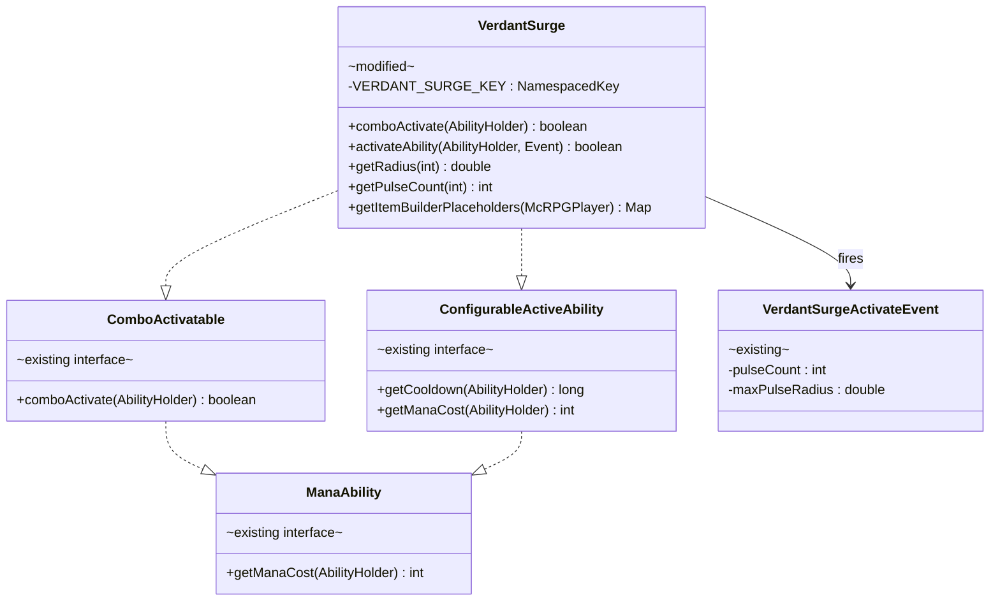
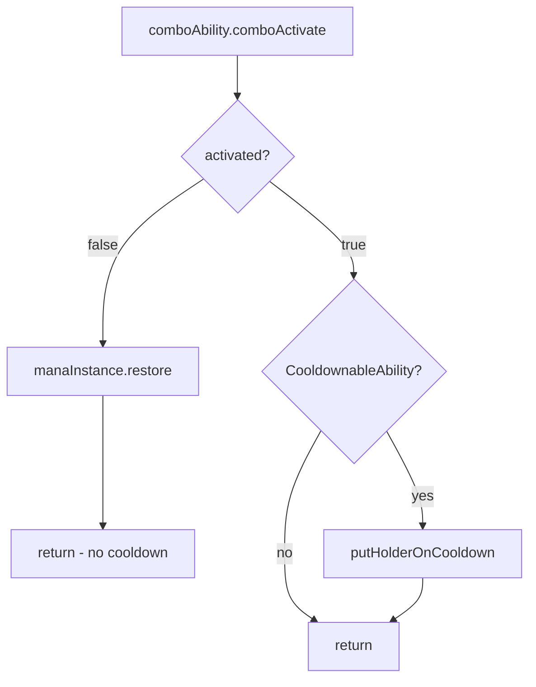
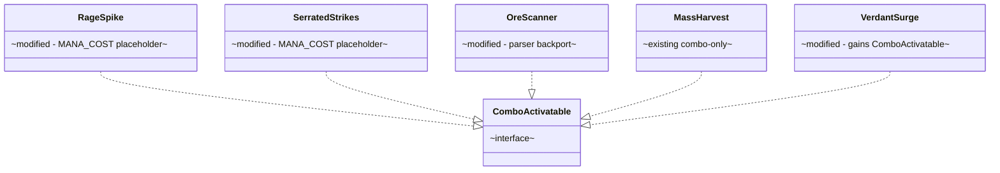

# Phase 3 LLD: Mining & Herbalism Migration

> **HLD Reference:** [docs/hld/mana/mana-ability-system.md](../../hld/mana/mana-ability-system.md)
> **Phase 1 Reference:** [phase-1-infrastructure-and-config-cleanup.md](phase-1-infrastructure-and-config-cleanup.md)
> **Phase 2 Reference:** [phase-2-ready-state-removal-and-swords-migration.md](phase-2-ready-state-removal-and-swords-migration.md)
> **Status:** Proposed

## Scope

Phase 3 completes the Mining and Herbalism ability migration to the combo-only activation model. After Phase 2, all ready-state infrastructure was removed — OreScanner and MassHarvest already implement `ComboActivatable` and have per-tier mana costs configured. The primary work in this phase is adding `ComboActivatable` to VerdantSurge (currently unactivatable after Phase 2), completing the OreScanner parser backport, fixing a cooldown-on-cancel bug in `OnComboCompleteListener`, adding a `MANA_COST` GUI placeholder for all combo abilities, and migrating hardcoded player-facing strings to the localization system.

**In scope:**
- Add `ComboActivatable` to `VerdantSurge` with `comboActivate()` and per-tier mana costs
- Remove `putHolderOnCooldown()` from `VerdantSurge.activateAbility()` (combo listener handles cooldown)
- Add `mana-cost` formula to `herbalism_configuration.yml` for VerdantSurge
- Backport `OreScanner.getRange()` from `getInt()` to `getString()` + Parser (Phase 1 leftover)
- Fix `OnComboCompleteListener` cooldown-on-cancel bug: only apply cooldown when `comboActivate()` returns `true`
- Add `MANA_COST` to `AbilityItemPlaceholderKeys` enum
- Wire `MANA_COST` placeholder into `getItemBuilderPlaceholders()` for OreScanner, MassHarvest, VerdantSurge, RageSpike, and SerratedStrikes
- Migrate `OreScanner.performScan()` hardcoded MiniMessage strings to the localization system
- Add localization keys for OreScanner scan feedback messages
- Verify InstantIrrigation (passive with cooldown) is unaffected — no changes needed
- Unit tests

**Out of scope (later phases):**
- Woodcutting active ability design and migration (Phase 4)
- Full balance pass on mana costs across all skills (Phase 4)
- Steering doc updates (`CLAUDE.md`, `.cursor/rules/*.mdc`) — deferred to Phase 4

---

## Class Diagrams

**Legend** (applies to all diagrams):
Abstract classes are annotated `abstract` · Interfaces annotated `interface` · Records annotated `record` · Modified classes annotated `modified` · Existing unmodified classes annotated `existing` · `*--` composition · `o--` association · `-->` dependency · `..|>` implements · `--|>` extends

### Diagram 1: VerdantSurge Migration

Shows VerdantSurge before and after Phase 3. VerdantSurge gains `ComboActivatable` (and therefore `ManaAbility` transitively), becoming activatable via the combo system.



### Diagram 2: OnComboCompleteListener Bug Fix

Shows the corrected control flow — cooldown is only applied when `comboActivate()` returns `true`.



### Diagram 3: Ability State Summary (Post-Phase 3)

All active abilities are combo-only with per-tier mana costs. All passive abilities are unchanged.



---

## 1. Modifications to Existing Classes

### 1.1 `VerdantSurge` — Add `ComboActivatable`

**File:** `src/main/java/us/eunoians/mcrpg/ability/impl/herbalism/VerdantSurge.java`

**Interface changes:**

```java
// Before:
public final class VerdantSurge extends McRPGAbility implements ConfigurableActiveAbility,
        ConfigurableSkillAbility {

// After:
public final class VerdantSurge extends McRPGAbility implements ConfigurableActiveAbility,
        ConfigurableSkillAbility, ComboActivatable {
```

**New import:**

```java
import us.eunoians.mcrpg.ability.combo.ComboActivatable;
```

**New `comboActivate()` method:**

Add this method to `VerdantSurge`. It follows the same pattern as `RageSpike.comboActivate()` and `MassHarvest.comboActivate()` — resolve the player, fire the cancellable event, execute the ability logic. It does NOT call `putHolderOnCooldown()` (the combo listener handles cooldown after `comboActivate()` returns `true`).

```java
/**
 * Activates Verdant Surge via the combo system. Resolves the
 * {@link McRPGPlayer}, fires {@link VerdantSurgeActivateEvent},
 * and schedules pulse tasks if the event is not cancelled.
 *
 * @param abilityHolder The holder activating this ability.
 * @return {@code true} if the ability executed, {@code false} if the
 *         player could not be resolved or the event was cancelled.
 */
@Override
public boolean comboActivate(@NotNull AbilityHolder abilityHolder) {
    var playerOpt = RegistryAccess.registryAccess().registry(McRPGRegistryKey.MANAGER)
            .manager(McRPGManagerKey.PLAYER).getPlayer(abilityHolder.getUUID());
    if (playerOpt.isEmpty()) {
        return false;
    }
    return performVerdantSurge(abilityHolder, playerOpt.get());
}
```

**Extract `performVerdantSurge()` private method:**

Refactor the core logic from `activateAbility()` into a new private method called by both `comboActivate()` and `activateAbility()`. This method does NOT call `putHolderOnCooldown()` — the combo listener manages cooldown externally.

```java
/**
 * Executes the core Verdant Surge effect — firing the activate event
 * and scheduling pulse tasks.
 *
 * @param abilityHolder The {@link AbilityHolder} activating the ability.
 * @param mcRPGPlayer   The {@link McRPGPlayer} associated with the holder.
 * @return {@code true} if the surge was started successfully (event not cancelled).
 */
private boolean performVerdantSurge(@NotNull AbilityHolder abilityHolder, @NotNull McRPGPlayer mcRPGPlayer) {
    int pulseCount = getPulseCount(getCurrentAbilityTier(abilityHolder));
    double pulseRadius = getRadius(getCurrentAbilityTier(abilityHolder));

    VerdantSurgeActivateEvent verdantSurgeActivateEvent = new VerdantSurgeActivateEvent(abilityHolder, pulseCount, pulseRadius);
    Bukkit.getPluginManager().callEvent(verdantSurgeActivateEvent);
    if (verdantSurgeActivateEvent.isCancelled()) {
        return false;
    }
    abilityHolder.addActiveAbility(this);
    double delay = 0;
    for (int i = 0; i < verdantSurgeActivateEvent.getPulseCount(); i++) {
        VerdantSurgePulseTask verdantSurgePulseTask = new VerdantSurgePulseTask(this.getPlugin(), mcRPGPlayer, delay, verdantSurgeActivateEvent.getMaxPulseRadius());
        verdantSurgePulseTask.runTask();
        delay += 1.5;
    }
    abilityHolder.removeActiveAbility(this);
    return true;
}
```

**Modify `activateAbility()` — delegate to `comboActivate()`:**

Remove the inline logic and `putHolderOnCooldown()` call. Delegate to `comboActivate()` following the pattern established by `OreScanner.activateAbility()` and `MassHarvest.activateAbility()`.

```java
// Before:
@Override
public boolean activateAbility(@NotNull AbilityHolder abilityHolder, @NotNull Event event) {
    McRPGPlayer mcRPGPlayer = RegistryAccess.registryAccess().registry(McRPGRegistryKey.MANAGER)
            .manager(McRPGManagerKey.PLAYER).getPlayer(abilityHolder.getUUID())
            .orElseThrow(IllegalStateException::new);
    int pulseCount = getPulseCount(getCurrentAbilityTier(abilityHolder));
    double pulseRadius = getRadius(getCurrentAbilityTier(abilityHolder));
    double delay = 0;

    VerdantSurgeActivateEvent verdantSurgeActivateEvent = new VerdantSurgeActivateEvent(abilityHolder, pulseCount, pulseRadius);
    Bukkit.getPluginManager().callEvent(verdantSurgeActivateEvent);
    if (verdantSurgeActivateEvent.isCancelled()) {
        return false;
    }
    abilityHolder.addActiveAbility(this);
    putHolderOnCooldown(abilityHolder);
    for (int i = 0; i < verdantSurgeActivateEvent.getPulseCount(); i++) {
        VerdantSurgePulseTask verdantSurgePulseTask = new VerdantSurgePulseTask(this.getPlugin(), mcRPGPlayer, delay, verdantSurgeActivateEvent.getMaxPulseRadius());
        verdantSurgePulseTask.runTask();
        delay += 1.5;
    }
    abilityHolder.removeActiveAbility(this);
    return true;
}

// After:
@Override
public boolean activateAbility(@NotNull AbilityHolder abilityHolder, @NotNull Event event) {
    return comboActivate(abilityHolder);
}
```

**Modify `getItemBuilderPlaceholders()` — add `MANA_COST`:**

```java
// Before:
@NotNull
@Override
public Map<String, String> getItemBuilderPlaceholders(@NotNull McRPGPlayer player) {
    Map<String, String> placeholders = new HashMap<>();
    placeholders.put(RADIUS.getKey(), Double.toString(getRadius(getCurrentAbilityTier(player.asSkillHolder()))));
    placeholders.put(COOLDOWN.getKey(), Long.toString(getCooldown(player.asSkillHolder())));
    placeholders.put(PULSE_COUNT.getKey(), Long.toString(getPulseCount(getCurrentAbilityTier(player.asSkillHolder()))));
    return placeholders;
}

// After:
@NotNull
@Override
public Map<String, String> getItemBuilderPlaceholders(@NotNull McRPGPlayer player) {
    Map<String, String> placeholders = new HashMap<>();
    placeholders.put(RADIUS.getKey(), Double.toString(getRadius(getCurrentAbilityTier(player.asSkillHolder()))));
    placeholders.put(COOLDOWN.getKey(), Long.toString(getCooldown(player.asSkillHolder())));
    placeholders.put(PULSE_COUNT.getKey(), Long.toString(getPulseCount(getCurrentAbilityTier(player.asSkillHolder()))));
    placeholders.put(MANA_COST.getKey(), Integer.toString(getManaCost(player.asSkillHolder())));
    return placeholders;
}
```

**New import for placeholder:**

```java
import static us.eunoians.mcrpg.builder.item.ability.AbilityItemPlaceholderKeys.MANA_COST;
```

**Remove unused import:**

After the refactor, `Event` import from `org.bukkit.event.Event` is still needed (used in `activateAbility` signature). Verify `McRPGPlayer` import is still present (used in `getItemBuilderPlaceholders`). Remove the `McRPGPlayer` import used for `RegistryAccess.registryAccess()` in the old `activateAbility()` body — but it's also used in `getItemBuilderPlaceholders`, so keep it.

### 1.2 `OreScanner` — Parser Backport for `getRange()` and Localization Migration

**File:** `src/main/java/us/eunoians/mcrpg/ability/impl/mining/OreScanner.java`

#### 1.2.1 Parser Backport — `getRange()`

The `getRange()` method (lines 178-187) currently uses `getInt()` which does not support formula strings. Migrate to the `getString()` + `Parser.setVariable("tier", tier)` pattern used by all other tier-config reads.

```java
// Before:
public int getRange(int tier) {
    YamlDocument miningConfig = getYamlDocument();
    Route allTiersRoute = Route.addTo(getRouteForAllTiers(), "range");
    Route tierRoute = Route.addTo(getRouteForTier(tier), "range");
    if (miningConfig.contains(tierRoute)) {
        return miningConfig.getInt(tierRoute);
    } else {
        return miningConfig.getInt(allTiersRoute);
    }
}

// After:
public int getRange(int tier) {
    YamlDocument miningConfig = getYamlDocument();
    Route allTiersRoute = Route.addTo(getRouteForAllTiers(), "range");
    Route tierRoute = Route.addTo(getRouteForTier(tier), "range");
    Parser parser;
    if (miningConfig.contains(tierRoute)) {
        parser = new Parser(miningConfig.getString(tierRoute));
    } else {
        parser = new Parser(miningConfig.getString(allTiersRoute));
    }
    parser.setVariable("tier", tier);
    return (int) parser.getValue();
}
```

**New import:**

```java
import com.diamonddagger590.mccore.parser.Parser;
```

#### 1.2.2 Localization Migration — Scan Result Messages

`performScan()` (line 161) currently has a hardcoded MiniMessage string for each detected ore type:

```java
// Before (line 161):
player.sendMessage(getPlugin().getMiniMessage().deserialize("<gray>You've detected <gold>" + locations.size() + " " + oreScannerBlockType.typeName() + "</gold> near you."));
```

Replace this with a localized message resolved through `McRPGLocalizationManager`. The `McRPGPlayer` lookup, localization manager resolution, and `McRPGLocalizationManager` reference should all be hoisted outside the `forEach` loop — there is no reason to repeat those lookups per ore type. Restructure the full loop at lines 155-163:

```java
// Before (lines 155-163):
instancesOfBlocks.keySet().forEach(oreScannerBlockType -> {
    Set<Location> locations = instancesOfBlocks.get(oreScannerBlockType);
    BlockStartGlowTask blockStartGlowTask = new BlockStartGlowTask(player, oreScannerBlockType, locations);
    blockStartGlowTask.runTask();
    BlockRemoveGlowTask blockRemoveGlowTask = new BlockRemoveGlowTask(player, locations);
    blockRemoveGlowTask.runTask();
    player.sendMessage(getPlugin().getMiniMessage().deserialize("<gray>You've detected <gold>" + locations.size() + " " + oreScannerBlockType.typeName() + "</gold> near you."));
});

// After:
McRPGPlayerManager mcRPGPlayerManager = getPlugin().registryAccess()
        .registry(RegistryKey.MANAGER).manager(McRPGManagerKey.PLAYER);
Optional<McRPGPlayer> mcRPGPlayerOpt = mcRPGPlayerManager.getPlayer(player.getUniqueId());
McRPGLocalizationManager localizationManager = getPlugin().registryAccess()
        .registry(RegistryKey.MANAGER).manager(McRPGManagerKey.LOCALIZATION);

instancesOfBlocks.keySet().forEach(oreScannerBlockType -> {
    Set<Location> locations = instancesOfBlocks.get(oreScannerBlockType);
    BlockStartGlowTask blockStartGlowTask = new BlockStartGlowTask(player, oreScannerBlockType, locations);
    blockStartGlowTask.runTask();
    BlockRemoveGlowTask blockRemoveGlowTask = new BlockRemoveGlowTask(player, locations);
    blockRemoveGlowTask.runTask();
    mcRPGPlayerOpt.ifPresent(mcRPGPlayer ->
        player.sendMessage(localizationManager.getLocalizedMessageAsComponent(
                mcRPGPlayer, LocalizationKey.ORE_SCANNER_BLOCK_DETECTED,
                Map.of("count", String.valueOf(locations.size()),
                       "block_type", oreScannerBlockType.typeName())))
    );
});
```

**New imports to add:**

```java
import us.eunoians.mcrpg.entity.McRPGPlayerManager;
import us.eunoians.mcrpg.localization.McRPGLocalizationManager;
```

`McRPGPlayer` is already imported (line 27). `McRPGMethods` is used in the `ORE_SCANNER_KEY` field declaration, so keep it.

**Note on `block_type` placeholder:** The `<block_type>` placeholder currently uses `OreScannerBlockType.typeName()` which is a config-defined display name (e.g., `"Copper Ore"`). This is already server-configurable via `mining_configuration.yml` block-types entries. No `CustomBlockWrapper` is needed here because the scan result groups multiple materials under a single named type — the display name is a property of the `OreScannerBlockType` grouping, not of individual blocks.

#### 1.2.3 `getItemBuilderPlaceholders()` — Add `MANA_COST`

```java
// Before:
@NotNull
@Override
public Map<String, String> getItemBuilderPlaceholders(@NotNull McRPGPlayer player) {
    Map<String, String> placeholders = new HashMap<>();
    placeholders.put(RANGE.getKey(), Integer.toString(getRange(getCurrentAbilityTier(player.asSkillHolder()))));
    placeholders.put(COOLDOWN.getKey(), Long.toString(getCooldown(player.asSkillHolder())));
    return placeholders;
}

// After:
@NotNull
@Override
public Map<String, String> getItemBuilderPlaceholders(@NotNull McRPGPlayer player) {
    Map<String, String> placeholders = new HashMap<>();
    placeholders.put(RANGE.getKey(), Integer.toString(getRange(getCurrentAbilityTier(player.asSkillHolder()))));
    placeholders.put(COOLDOWN.getKey(), Long.toString(getCooldown(player.asSkillHolder())));
    placeholders.put(MANA_COST.getKey(), Integer.toString(getManaCost(player.asSkillHolder())));
    return placeholders;
}
```

**New import:**

```java
import static us.eunoians.mcrpg.builder.item.ability.AbilityItemPlaceholderKeys.MANA_COST;
```

### 1.3 `MassHarvest` — Add `MANA_COST` Placeholder

**File:** `src/main/java/us/eunoians/mcrpg/ability/impl/herbalism/MassHarvest.java`

MassHarvest already implements `ComboActivatable`, has `comboActivate()`, and has `mana-cost` configured in YAML. The only change is adding the `MANA_COST` placeholder to `getItemBuilderPlaceholders()`.

```java
// Before:
@NotNull
@Override
public Map<String, String> getItemBuilderPlaceholders(@NotNull McRPGPlayer player) {
    Map<String, String> placeholders = new HashMap<>();
    placeholders.put(RADIUS.getKey(), Integer.toString(getRadius(getCurrentAbilityTier(player.asSkillHolder()))));
    placeholders.put(COOLDOWN.getKey(), Long.toString(getCooldown(player.asSkillHolder())));
    return placeholders;
}

// After:
@NotNull
@Override
public Map<String, String> getItemBuilderPlaceholders(@NotNull McRPGPlayer player) {
    Map<String, String> placeholders = new HashMap<>();
    placeholders.put(RADIUS.getKey(), Integer.toString(getRadius(getCurrentAbilityTier(player.asSkillHolder()))));
    placeholders.put(COOLDOWN.getKey(), Long.toString(getCooldown(player.asSkillHolder())));
    placeholders.put(MANA_COST.getKey(), Integer.toString(getManaCost(player.asSkillHolder())));
    return placeholders;
}
```

**New import:**

```java
import static us.eunoians.mcrpg.builder.item.ability.AbilityItemPlaceholderKeys.MANA_COST;
```

### 1.4 `RageSpike` — Add `MANA_COST` Placeholder

**File:** `src/main/java/us/eunoians/mcrpg/ability/impl/swords/RageSpike.java`

RageSpike already implements `ComboActivatable` and has `mana-cost` configured in `swords_configuration.yml`. The only change is adding the `MANA_COST` placeholder to `getItemBuilderPlaceholders()`.

```java
// Before:
@NotNull
@Override
public Map<String, String> getItemBuilderPlaceholders(@NotNull McRPGPlayer player) {
    Map<String, String> placeholders = new HashMap<>();
    placeholders.put(AbilityItemPlaceholderKeys.DAMAGE.getKey(),
            Double.toString(getDamage(getCurrentAbilityTier(player.asSkillHolder()))));
    placeholders.put(AbilityItemPlaceholderKeys.COOLDOWN.getKey(),
            Long.toString(getCooldown(player.asSkillHolder())));
    return placeholders;
}

// After:
@NotNull
@Override
public Map<String, String> getItemBuilderPlaceholders(@NotNull McRPGPlayer player) {
    Map<String, String> placeholders = new HashMap<>();
    placeholders.put(AbilityItemPlaceholderKeys.DAMAGE.getKey(),
            Double.toString(getDamage(getCurrentAbilityTier(player.asSkillHolder()))));
    placeholders.put(AbilityItemPlaceholderKeys.COOLDOWN.getKey(),
            Long.toString(getCooldown(player.asSkillHolder())));
    placeholders.put(AbilityItemPlaceholderKeys.MANA_COST.getKey(),
            Integer.toString(getManaCost(player.asSkillHolder())));
    return placeholders;
}
```

No new imports needed — `AbilityItemPlaceholderKeys` is already imported (used for `DAMAGE` and `COOLDOWN`).

### 1.5 `SerratedStrikes` — Add `MANA_COST` Placeholder

**File:** `src/main/java/us/eunoians/mcrpg/ability/impl/swords/SerratedStrikes.java`

SerratedStrikes already implements `ComboActivatable` and has `mana-cost` configured in `swords_configuration.yml`. The only change is adding the `MANA_COST` placeholder to `getItemBuilderPlaceholders()`.

```java
// Before:
@NotNull
@Override
public Map<String, String> getItemBuilderPlaceholders(@NotNull McRPGPlayer player) {
    Map<String, String> placeholders = new HashMap<>();
    int tier = getCurrentAbilityTier(player.asSkillHolder());
    placeholders.put(ABILITY_DURATION.getKey(), Integer.toString(getDuration(tier)));
    placeholders.put(COOLDOWN.getKey(), Long.toString(getCooldown(player.asSkillHolder())));
    placeholders.put(ACTIVATION_CHANCE_INCREASE.getKey(), McRPGMethods.getChanceNumberFormat().format(getBoostToBleedActivation(tier)));
    return placeholders;
}

// After:
@NotNull
@Override
public Map<String, String> getItemBuilderPlaceholders(@NotNull McRPGPlayer player) {
    Map<String, String> placeholders = new HashMap<>();
    int tier = getCurrentAbilityTier(player.asSkillHolder());
    placeholders.put(ABILITY_DURATION.getKey(), Integer.toString(getDuration(tier)));
    placeholders.put(COOLDOWN.getKey(), Long.toString(getCooldown(player.asSkillHolder())));
    placeholders.put(ACTIVATION_CHANCE_INCREASE.getKey(), McRPGMethods.getChanceNumberFormat().format(getBoostToBleedActivation(tier)));
    placeholders.put(MANA_COST.getKey(), Integer.toString(getManaCost(player.asSkillHolder())));
    return placeholders;
}
```

**New import:**

```java
import static us.eunoians.mcrpg.builder.item.ability.AbilityItemPlaceholderKeys.MANA_COST;
```

### 1.6 `OnComboCompleteListener` — Fix Cooldown-on-Cancel Bug

**File:** `src/main/java/us/eunoians/mcrpg/listener/ability/OnComboCompleteListener.java`

**Bug:** When `comboActivate()` returns `false`, mana is correctly refunded (line 155), but cooldown is unconditionally applied (lines 158-160). Per the Phase 1 LLD design (section 2.9), cooldown should only be applied when the ability actually executed.

```java
// Before (lines 153-160):
boolean activated = comboAbility.comboActivate(abilityHolder);
if (!activated) {
    manaInstance.restore(effectiveCost);
}

if (comboAbility instanceof CooldownableAbility cooldownableAbility) {
    cooldownableAbility.putHolderOnCooldown(abilityHolder);
}

// After:
boolean activated = comboAbility.comboActivate(abilityHolder);
if (!activated) {
    manaInstance.restore(effectiveCost);
    return;
}

if (comboAbility instanceof CooldownableAbility cooldownableAbility) {
    cooldownableAbility.putHolderOnCooldown(abilityHolder);
}
```

The fix is adding `return;` after the mana refund. When `activated` is `false`, the method returns immediately — no cooldown is applied and no further processing occurs. When `activated` is `true`, the existing cooldown logic runs normally.

### 1.7 `AbilityItemPlaceholderKeys` — Add `MANA_COST`

**File:** `src/main/java/us/eunoians/mcrpg/builder/item/ability/AbilityItemPlaceholderKeys.java`

Add a new enum constant for mana cost. Place it after `PULSE_COUNT` (the last current entry before the terminating semicolon).

```java
// Before:
    PULSE_COUNT("pulse-count"),

    ;

// After:
    PULSE_COUNT("pulse-count"),
    MANA_COST("mana-cost"),

    ;
```

### 1.8 `LocalizationKey` — Add OreScanner Scan Feedback Key

**File:** `src/main/java/us/eunoians/mcrpg/configuration/file/localization/LocalizationKey.java`

Add a new localization key for OreScanner's scan result message. Place it in the OreScanner section (after line 614, the `ORE_SCANNER_DISPLAY_ITEM_HEADER` definition):

```java
// After the existing ORE_SCANNER_DISPLAY_ITEM_HEADER line:
public static final Route ORE_SCANNER_BLOCK_DETECTED = Route.fromString(toRoutePath(ORE_SCANNER_HEADER, "block-detected"));
```

### 1.9 `en_abilities.yml` — Add OreScanner Scan Feedback Entry

**File:** `src/main/resources/localization/english/en_abilities.yml`

Add the scan result message entry under the `ore-scanner` section. This key should be placed after the existing `display-item` block for ore-scanner:

```yaml
    ore-scanner:
      display-item:
        # ... existing display-item config ...
      block-detected: "<gray>You've detected <gold><count> <block_type></gold> near you."
```

**Placeholders:**
- `<count>` — the number of detected blocks of that type
- `<block_type>` — the display name of the ore type (from `OreScannerBlockType.typeName()`)

### 1.10 `herbalism_configuration.yml` — Add VerdantSurge `mana-cost`

**File:** `src/main/resources/skill_configuration/herbalism_configuration.yml`

Add `mana-cost` to VerdantSurge's `all-tiers` section. Using the HLD reference values (T1=35, T3=25, T5=15), the formula `42-(5.5*tier)` produces: T1=36.5≈37, T2=31, T3=25.5≈26, T4=20, T5=14.5≈15. This approximates the HLD target; final tuning is Phase 4.

```yaml
# Before:
  verdant-surge:
    enabled: true
    amount-of-tiers: 5
    tier-configuration:
      all-tiers:
        upgrade-point-cost: 1
        unlock-level: 1*tier
        pulses: 1+(.5*tier)
        pulse-radius: 5+(1.6*tier)
        cooldown: 30-(3.5*tier)
        upgrade-quest: "mcrpg:verdant_surge_upgrade"

# After:
  verdant-surge:
    enabled: true
    amount-of-tiers: 5
    tier-configuration:
      all-tiers:
        upgrade-point-cost: 1
        unlock-level: 1*tier
        pulses: 1+(.5*tier)
        pulse-radius: 5+(1.6*tier)
        cooldown: 30-(3.5*tier)
        # Mana cost formula. Variable: tier (1-based). Reference value — tuned during Phase 4 balance pass.
        mana-cost: "42-(5.5*tier)"
        upgrade-quest: "mcrpg:verdant_surge_upgrade"
```

---

## 2. Verification: Unchanged Classes

### 2.1 `InstantIrrigation` — No Changes Needed

**File:** `src/main/java/us/eunoians/mcrpg/ability/impl/herbalism/InstantIrrigation.java`

InstantIrrigation implements `PassiveAbility`, `ConfigurableSkillAbility`, and `CooldownableAbility`. It does NOT implement `ManaAbility` or `ComboActivatable`. The `AbilityListener#activateAbilities()` mana gate only checks for `ManaAbility` instances — InstantIrrigation bypasses this check entirely and activates via the event-driven passive path through its `HOLDING_HOE_BREAK_BLOCK_ACTIVATE_COMPONENT` component.

No changes are needed. Verified that:
- `InstantIrrigation` does not implement `ManaAbility` → no mana checks on activation
- `InstantIrrigation` manages its own cooldown via `putHolderOnCooldown()` inside `activateAbility()` → this is correct for passives
- `InstantIrrigation` uses the localization system for its activation message → no hardcoded strings to migrate

### 2.2 `MassHarvest` — Existing Combo Path Verification

MassHarvest already implements `ComboActivatable` with a working `comboActivate()` method. Its `activateAbility()` already delegates to `comboActivate()`. The `mana-cost` formula (`"60-(8*tier)"`) is already present in `herbalism_configuration.yml`. `getManaCost()` is inherited from `ConfigurableActiveAbility` which reads from the `tier-configuration` YAML via Parser. The only modification is adding the `MANA_COST` placeholder (section 1.3).

### 2.3 `OreScanner` — Existing Combo Path Verification

OreScanner already implements `ComboActivatable` with a working `comboActivate()` method. Its `activateAbility()` already delegates to `comboActivate()`. The `mana-cost` formula (`"60-(8*tier)"`) is already present in `mining_configuration.yml`. Modifications are: parser backport for `getRange()`, scan message localization, and `MANA_COST` placeholder (sections 1.2.1–1.2.3).

---

## 3. Key Flows

### 3.1 VerdantSurge Combo Activation Flow (New)

```
Player clicks Right, Right, Right (or RRL, RLR)
  └─> OnComboInputListener → ComboManager → ComboCompleteEvent

ComboCompleteEvent received by OnComboCompleteListener
  └─> onComboComplete(event)
      ├─> Resolve LoadoutHolder, build ordered ComboActivatable list
      │   └─> VerdantSurge is now in this list (implements ComboActivatable)
      ├─> Map event.getSlotIndex() to comboAbilities[slot-1]
      ├─> Gate 1: Cooldown check
      │   └─> If on cooldown → feedback → return
      ├─> Gate 2: Mana check
      │   ├─> int manaCost = verdantSurge.getManaCost(abilityHolder)
      │   │   └─> ConfigurableActiveAbility default reads from
      │   │       herbalism_configuration.yml tier-configuration via Parser
      │   │       with formula "42-(5.5*tier)"
      │   ├─> Fire PlayerStatConsumeEvent
      │   ├─> manaInstance.consume(effectiveCost)
      │   └─> If insufficient → feedback → return
      ├─> boolean activated = verdantSurge.comboActivate(abilityHolder)
      │   └─> performVerdantSurge(abilityHolder, mcRPGPlayer)
      │       ├─> Fire VerdantSurgeActivateEvent(holder, pulseCount, radius)
      │       ├─> If cancelled → return false
      │       ├─> addActiveAbility(this)
      │       ├─> Schedule VerdantSurgePulseTask(s) with 1.5s delay
      │       ├─> removeActiveAbility(this)
      │       └─> return true
      ├─> If !activated → manaInstance.restore(effectiveCost) → return
      └─> If CooldownableAbility → putHolderOnCooldown()
```

### 3.2 OreScanner Flow (Unchanged — Verification Only)

```
ComboCompleteEvent → OnComboCompleteListener
  └─> ... mana check ...
      ├─> oreScanner.comboActivate(abilityHolder)
      │   └─> performScan(abilityHolder, player)
      │       ├─> Scan blocks in radius (getRange() now uses Parser)
      │       ├─> Fire OreScannerActivateEvent
      │       ├─> Teleport player toward highest-weighted ore
      │       ├─> Schedule glow tasks
      │       └─> Send localized scan results (NEW: via LocalizationKey.ORE_SCANNER_BLOCK_DETECTED)
      └─> ... cooldown ...
```

### 3.3 Passive Ability Flow (InstantIrrigation — Unchanged)

```
BlockBreakEvent fires
  └─> OnBlockBreakListener → activateAbilities(uuid, event)
      └─> Stream filters: canEventActivateAbility (HOLDING_HOE component), cooldown
          └─> InstantIrrigation is NOT ManaAbility → no mana check
              └─> ability.activateAbility(holder, event)
                  └─> Fire InstantIrrigationActivateEvent
                  └─> Replace block with water
                  └─> putHolderOnCooldown() (managed internally by the ability)
                  └─> Send localized activation message
```

---

## 4. Config Changes

### 4.1 `herbalism_configuration.yml` — Add VerdantSurge Mana Cost

See section 1.10. The `mana-cost` formula `"42-(5.5*tier)"` is added to the `all-tiers` block.

**Formula validation:**

| Tier | Formula `42-(5.5*tier)` | Result | Clamped (min=1) | HLD Reference |
|------|------------------------|--------|-----------------|---------------|
| 1 | 42 - 5.5 | 36.5 → 37 | 37 | 35 |
| 2 | 42 - 11 | 31 | 31 | ~30 |
| 3 | 42 - 16.5 | 25.5 → 26 | 26 | 25 |
| 4 | 42 - 22 | 20 | 20 | ~20 |
| 5 | 42 - 27.5 | 14.5 → 15 | 15 | 15 |
| 8 (overtier) | 42 - 44 | -2 → -2 | 1 (clamped) | N/A |

The formula produces values close to the HLD reference. Negative values at extreme overtiers are clamped to the global minimum (default 1, configurable). Final tuning is Phase 4.

### 4.2 No Changes to `mining_configuration.yml`

OreScanner already has `mana-cost: "60-(8*tier)"` configured in `all-tiers`. No YAML changes needed.

### 4.3 No Changes to `herbalism_configuration.yml` for MassHarvest

MassHarvest already has `mana-cost: "60-(8*tier)"` configured in `all-tiers`. No YAML changes needed.

---

## 5. Localization Changes

### 5.1 New Keys in `en_abilities.yml`

```yaml
# Under the ore-scanner section, after display-item:
      block-detected: "<gray>You've detected <gold><count> <block_type></gold> near you."
```

### 5.2 New Route Constants in `LocalizationKey.java`

```java
public static final Route ORE_SCANNER_BLOCK_DETECTED = Route.fromString(toRoutePath(ORE_SCANNER_HEADER, "block-detected"));
```

### 5.3 No New Localization Keys for VerdantSurge or MassHarvest

VerdantSurge and MassHarvest do not have hardcoded player-facing strings in their activation logic. VerdantSurge uses no player messaging during activation. MassHarvest's activation logic (`performHarvest()`) fires the event and schedules a task but does not send any messages. No new localization keys are needed for these abilities.

---

## 6. Implementation Order

Ordered to minimize compilation errors at each step. Each step should leave the project in a compilable state. The implementor (Sonnet) should follow this order strictly.

1. **Add `MANA_COST` to `AbilityItemPlaceholderKeys`** — add the new enum constant. No other code references it yet, so this is safe to add first. (Section 1.7)

2. **Add `ORE_SCANNER_BLOCK_DETECTED` to `LocalizationKey.java`** — add the new route constant. No code references it yet. (Section 1.8)

3. **Add scan feedback entry to `en_abilities.yml`** — add the `block-detected` key under `ore-scanner`. (Section 1.9)

4. **Modify `OreScanner.getRange()` — parser backport** — change `getInt()` to `getString()` + Parser pattern. Add `Parser` import. Functionally equivalent for integer config values. (Section 1.2.1)

5. **Modify `OreScanner.performScan()` — localization migration** — replace the hardcoded `getPlugin().getMiniMessage().deserialize(...)` call with localized message via `McRPGLocalizationManager`. Add new imports for `McRPGPlayerManager`, `McRPGLocalizationManager`, and `McRPGPlayer`. Hoist the `McRPGPlayer` lookup and localization manager outside the forEach loop. (Section 1.2.2)

6. **Modify `OreScanner.getItemBuilderPlaceholders()` — add `MANA_COST`** — add the `MANA_COST` placeholder. Add `MANA_COST` static import. (Section 1.2.3)

7. **Modify `MassHarvest.getItemBuilderPlaceholders()` — add `MANA_COST`** — add the `MANA_COST` placeholder. Add `MANA_COST` static import. (Section 1.3)

8. **Modify `RageSpike.getItemBuilderPlaceholders()` — add `MANA_COST`** — add the `MANA_COST` placeholder. No new imports needed (`AbilityItemPlaceholderKeys` already imported). (Section 1.4)

9. **Modify `SerratedStrikes.getItemBuilderPlaceholders()` — add `MANA_COST`** — add the `MANA_COST` placeholder. Add `MANA_COST` static import. (Section 1.5)

10. **Add `mana-cost` to `herbalism_configuration.yml` for VerdantSurge** — add the formula to the `all-tiers` block. (Section 1.10)

11. **Migrate `VerdantSurge` to `ComboActivatable`** — this is the largest change. Apply all modifications from section 1.1 in a single step:
    - Add `ComboActivatable` to the `implements` list
    - Add the `ComboActivatable` import
    - Add the `MANA_COST` static import
    - Extract `performVerdantSurge()` private method (contains the core logic from `activateAbility()` minus `putHolderOnCooldown()`)
    - Add `comboActivate()` method (delegates to `performVerdantSurge()`)
    - Rewrite `activateAbility()` to delegate to `comboActivate()`
    - Add `MANA_COST` placeholder to `getItemBuilderPlaceholders()`

12. **Fix `OnComboCompleteListener` cooldown-on-cancel bug** — add `return;` after mana refund when `!activated`. (Section 1.6)

13. **Run `./gradlew verifiedShadowJar`** — verify zero test failures. Fix any compilation or test regressions before proceeding to new tests.

14. **Write unit tests** (see section 7).

15. **Apply test naming convention** — ensure all test methods follow `action_outcome_whenCondition`, `@Test` before `@DisplayName`, and Given/When/Then display strings.

16. **Final `./gradlew verifiedShadowJar`** — verify all tests pass including new ones.

---

## 7. Unit Tests

Test method naming convention: `action_outcome_whenCondition`. `@Test` is listed before `@DisplayName`. `@DisplayName` uses a Given/When/Then sentence. The `_whenCondition` suffix is optional when context is obvious from action and outcome alone.

### 7.1 `VerdantSurgeComboActivateTest`

Tests that VerdantSurge correctly implements the combo activation contract.

- `comboActivate_returnsTrue_whenEventIsNotCancelled` — `comboActivate()` fires `VerdantSurgeActivateEvent`, event is not cancelled, returns `true`
- `comboActivate_returnsFalse_whenEventIsCancelled` — a test listener cancels `VerdantSurgeActivateEvent`, `comboActivate()` returns `false`
- `comboActivate_firesVerdantSurgeActivateEvent` — verify `VerdantSurgeActivateEvent` is fired with correct `pulseCount` and `maxPulseRadius` from config
- `comboActivate_doesNotApplyCooldown` — no cooldown is on the holder after `comboActivate()` (the combo listener handles cooldown)
- `comboActivate_returnsFalse_whenPlayerNotFound` — if the player UUID has no `McRPGPlayer` in the player manager, returns `false`

### 7.2 `VerdantSurgeManaCostTest`

Tests that VerdantSurge's mana cost resolves correctly from the herbalism configuration via the `ConfigurableActiveAbility.getManaCost()` default.

- `getManaCost_evaluatesFormulaWithTier` — with config formula `"42-(5.5*tier)"` and tier=1, returns 37 (truncated from 36.5)
- `getManaCost_evaluatesFormulaForHigherTier` — with tier=5, returns 15 (truncated from 14.5)
- `getManaCost_clampsToGlobalMinimum_whenFormulaProducesNegative` — with tier=8, formula gives -2, clamped to global minimum (default 1)
- `getManaCost_usesTierSpecificOverride_whenPresent` — if a `tier-3.mana-cost: 20` exists in config, that value is used instead of the `all-tiers` formula

### 7.3 `OreScanner ParserBackportTest`

Tests that `OreScanner.getRange()` correctly uses the Parser with the `tier` variable.

- `getRange_evaluatesFormulaWithTier` — formula string (e.g., `"5+(tier*2)"`) evaluates correctly for tiers 1-5
- `getRange_returnsLiteralValue_whenGivenPlainInteger` — plain integer `"10"` in config still parses correctly to 10
- `getRange_usesTierSpecificRoute_whenPresent` — a `tier-3.range: 15` override is used instead of `all-tiers.range`

### 7.4 `OnComboCompleteListenerCooldownTest`

Tests the cooldown-on-cancel bug fix.

- `onComboComplete_appliesCooldown_whenComboActivateReturnsTrue` — ability fires successfully, cooldown is applied
- `onComboComplete_doesNotApplyCooldown_whenComboActivateReturnsFalse` — ability is internally cancelled, mana is refunded, cooldown is NOT applied
- `onComboComplete_refundsMana_whenComboActivateReturnsFalse` — after a cancelled activation, mana is restored to the pre-consume value

### 7.5 `VerdantSurgeActivateEventTest`

Tests for the VerdantSurge activate event (verify existing behavior still works with combo activation path).

- `getPulseCount_returnsZero_whenConstructedWithNegativePulseCount` — pulse count is clamped to 0 on negative constructor argument
- `getMaxPulseRadius_returnsZero_whenConstructedWithNegativeRadius` — radius is clamped to 0 on negative constructor argument
- `isCancelled_returnsFalse_byDefault` — event is not cancelled when first created
- `setCancelled_makesEventCancelled_whenSetToTrue` — event respects the `Cancellable` contract

### 7.6 `AbilityItemPlaceholderKeysTest`

- `manaCost_hasExpectedKey` — `MANA_COST.getKey()` returns `"mana-cost"`

### 7.7 `MassHarvestManaCostPlaceholderTest`

- `getItemBuilderPlaceholders_includesManaCost` — verify `getItemBuilderPlaceholders()` returns a map containing the key `"mana-cost"` with a non-null value

### 7.8 `OreScanner ManaCostPlaceholderTest`

- `getItemBuilderPlaceholders_includesManaCost` — verify `getItemBuilderPlaceholders()` returns a map containing the key `"mana-cost"` with a non-null value

### 7.9 `RageSpikeManaCostPlaceholderTest`

- `getItemBuilderPlaceholders_includesManaCost` — verify `getItemBuilderPlaceholders()` returns a map containing the key `"mana-cost"` with a non-null value
- `getItemBuilderPlaceholders_includesDamage` — existing placeholder still present
- `getItemBuilderPlaceholders_includesCooldown` — existing placeholder still present

### 7.10 `SerratedStrikesManaCostPlaceholderTest`

- `getItemBuilderPlaceholders_includesManaCost` — verify `getItemBuilderPlaceholders()` returns a map containing the key `"mana-cost"` with a non-null value
- `getItemBuilderPlaceholders_includesDuration` — existing placeholder still present
- `getItemBuilderPlaceholders_includesCooldown` — existing placeholder still present
- `getItemBuilderPlaceholders_includesActivationChanceIncrease` — existing placeholder still present

### 7.11 `VerdantSurge ManaCostPlaceholderTest`

- `getItemBuilderPlaceholders_includesManaCost` — verify `getItemBuilderPlaceholders()` returns a map containing the key `"mana-cost"` with a non-null value
- `getItemBuilderPlaceholders_includesPulseCount` — existing placeholder still present
- `getItemBuilderPlaceholders_includesRadius` — existing placeholder still present
- `getItemBuilderPlaceholders_includesCooldown` — existing placeholder still present

### 7.12 `InstantIrrigationUnaffectedTest`

Verify that InstantIrrigation is not broken by Phase 3 changes.

- `activateAbility_doesNotCheckMana` — InstantIrrigation does not implement `ManaAbility`, so activation through `activateAbilities()` skips the mana gate
- `activateAbility_appliesCooldownInternally` — `putHolderOnCooldown()` is called inside `activateAbility()`, confirming it manages its own cooldown (not via `OnComboCompleteListener`)

---

## 8. Resolved Design Decisions

1. **VerdantSurge `performVerdantSurge()` extraction:** The core activation logic is extracted from `activateAbility()` into a private `performVerdantSurge()` method, with `comboActivate()` and `activateAbility()` both delegating to it. This follows the pattern established by `OreScanner.performScan()` and `MassHarvest.performHarvest()` in Phase 1. The extracted method does NOT call `putHolderOnCooldown()` — cooldown management is the combo listener's responsibility for combo-activated abilities.

2. **`activateAbility()` delegates to `comboActivate()`:** Since VerdantSurge is now combo-only (no activation components registered in the constructor), `activateAbility()` is never event-triggered. It delegates to `comboActivate()` for consistency and to satisfy the `Ability` interface contract. This matches the pattern used by `OreScanner.activateAbility()` and `MassHarvest.activateAbility()`.

3. **Cooldown-on-cancel fix in `OnComboCompleteListener`:** The fix adds a `return` after mana refund when `!activated`. This is the minimal change — an alternative was wrapping cooldown application in `if (activated)`, but the early return is cleaner and avoids accidental additions of post-activation logic that should not run on cancellation.

4. **OreScanner parser backport is Phase 3, not Phase 1 leftover:** Although the Phase 1 LLD specified migrating all tier-config reads, `OreScanner.getRange()` was missed. Including it in Phase 3 (the Mining migration phase) is the natural fit since we're already touching the file for localization migration.

5. **`MANA_COST` placeholder added to all combo abilities in Phase 3:** Adding the placeholder ensures GUI consistency — all combo abilities expose their mana cost for display item templates. The `AbilityItemPlaceholderKeys.MANA_COST` enum constant is added once and used by all five combo abilities: OreScanner, MassHarvest, VerdantSurge, RageSpike, and SerratedStrikes. RageSpike and SerratedStrikes were migrated in Phase 2 but did not receive the placeholder at that time — including them here avoids a follow-up PR and ensures all active abilities are consistent.

6. **OreScanner scan message localization:** The hardcoded `<gray>You've detected <gold>N BlockType</gold> near you.` string is migrated to `LocalizationKey.ORE_SCANNER_BLOCK_DETECTED` with `<count>` and `<block_type>` placeholders. The `McRPGPlayer` lookup is hoisted outside the `forEach` loop to avoid redundant lookups per ore type. This follows the pattern used by `InstantIrrigation.activateAbility()` which already uses the localization manager.

7. **VerdantSurge mana cost formula `"42-(5.5*tier)"`:** This formula was chosen to approximate the HLD reference values (T1≈35, T3≈25, T5≈15) while producing a smooth curve. The truncation to `int` in the Parser path means T1=36 and T5=14 (slightly off from reference). This is acceptable — Phase 4 will do a full balance pass with playtesting. Server owners can override individual tiers with explicit values if they want exact targets.

8. **No config version bump for `herbalism_configuration.yml`:** The `config-version` remains at 1. BoostedYAML's updater adds missing keys from the bundled default automatically — the new `mana-cost` key will be merged into existing server configs on next startup. No migration path or version gate is needed for a key addition.

---

## 9. Open Items / Future Considerations

1. **OreScanner hardcoded messages in `performScan()`:** The phase migrates the per-block-type detection message. However, the `Methods.lookAt()` teleportation and glow task scheduling have no player-facing text, so no further localization is needed in `performScan()`.

2. **VerdantSurge pulse scheduling model:** The current implementation schedules all pulse tasks upfront with increasing delays (`delay += 1.5`). The `addActiveAbility(this)` / `removeActiveAbility(this)` pair happens synchronously before the tasks run, so the ability appears "active" for zero ticks. This is pre-existing behavior from before Phase 3 and is not addressed here. A future refactoring could use the timed `addActiveAbility(this, durationSeconds)` overload to keep the ability active for the full pulse duration.

3. **Phase 4 scope confirmation:** After Phase 3, all 5 active abilities (RageSpike, SerratedStrikes, OreScanner, MassHarvest, VerdantSurge) are combo-only with per-tier mana costs and `MANA_COST` placeholders. Phase 4 is focused on Woodcutting active abilities (if any), the full balance pass, and steering doc updates. No infrastructure work remains.

4. **`SwordsConfigFile` comment typo:** Lines 58-59 label `SERRATED_STRIKES_HEADER` with the comment `// Rage Spike`. This is a pre-existing issue noted in the Phase 2 LLD — fix opportunistically.
