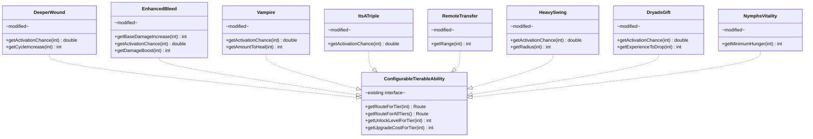
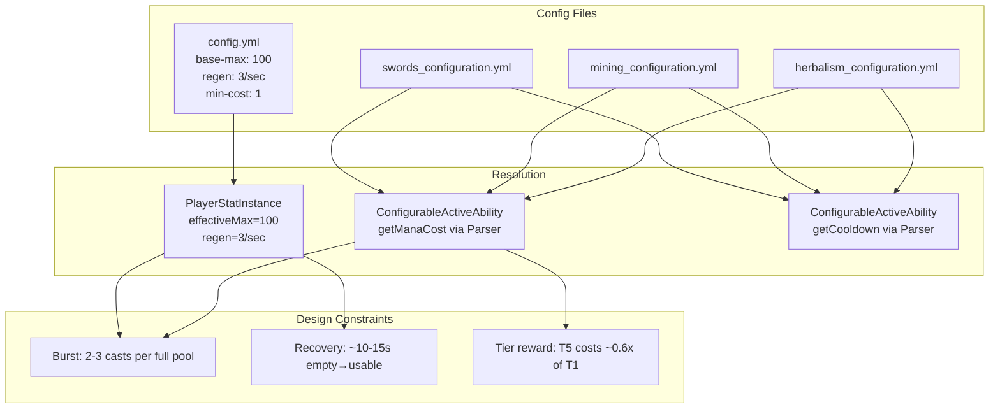

# Phase 4 LLD: Balance Pass & Documentation

> **HLD Reference:** [docs/hld/mana/mana-ability-system.md](../../hld/mana/mana-ability-system.md)
> **Phase 1 Reference:** [phase-1-infrastructure-and-config-cleanup.md](phase-1-infrastructure-and-config-cleanup.md)
> **Phase 2 Reference:** [phase-2-ready-state-removal-and-swords-migration.md](phase-2-ready-state-removal-and-swords-migration.md)
> **Phase 3 Reference:** [phase-3-mining-and-herbalism-migration.md](phase-3-mining-and-herbalism-migration.md)
> **Status:** Proposed

## Scope

Phase 4 completes the mana ability system by performing a full balance pass (updating base mana values, regen rate, per-ability mana cost formulas, and cooldowns to match the finalized "Slow Regen, High Stakes" balance philosophy), backporting all remaining passive ability tier-config reads to the `getString()` + Parser pattern, and updating all steering documentation to reflect the finalized mana-gated combo activation model.

**Balance philosophy:** "Slow Regen, High Stakes" — 2/sec passive regen, 100 max pool, 50s full recovery. Three cost buckets (Light/Medium/Heavy) gate abilities by mana, not cooldowns. See `.cursor/rules/mana-balance-philosophy.mdc` for the full framework.

**In scope:**
- Balance pass: update `config.yml` mana pool settings (base-max 220→100, regen 5→2, minimum-cost 5→1)
- Balance pass: update all per-ability mana cost formulas to produce values aligned with HLD reference table
- Balance pass: update cooldowns to HLD-reference ranges (anti-spam for cheap abilities, moderate CDs for powerful abilities)
- Parser backport: migrate all remaining passive ability tier-config reads from `getInt()`/`getDouble()` to `getString()` + `Parser.setVariable("tier", tier)` pattern
- Documentation: full update of `CLAUDE.md` — remove ready-state references, add mana/combo system documentation
- Documentation: full update of `.cursor/rules/ability-system.mdc` — remove ready-state section, add combo activation and mana patterns
- Unit tests for all parser-backported methods
- Final `./gradlew verifiedShadowJar` with zero failures

**Out of scope:**
- New Woodcutting active abilities (no current implementation; future design work)
- In-combat vs. out-of-combat regen differentiation (deferred — requires combat state tracker)
- `PlayerStatModifier` subclasses (StackablePlayerStatModifier, TimedPlayerStatModifier — future work)
- `PlayerStatRegistry` is McRPG-specific and will not be extracted to McCore

---

## Class Diagrams

**Legend** (applies to all diagrams):
Abstract classes are annotated `abstract` · Interfaces annotated `interface` · Modified classes annotated `modified` · Existing unmodified classes annotated `existing` · `*--` composition · `o--` association · `-->` dependency · `..|>` implements · `--|>` extends

### Diagram 1: Parser Backport — Passive Abilities

Shows all passive abilities that gain Parser-based tier-config reads. The pattern is identical to `ConfigurableActiveAbility.getCooldown()` — resolve the tier-specific or all-tiers route, parse as string, set `tier` variable, return parsed value.



### Diagram 2: Balance Configuration Flow

Shows how the updated balance values flow from config files through the system.



---

## 1. Balance Pass: Config Changes

> **Balance Philosophy:** All values in this section are derived from the "Slow Regen, High Stakes" framework documented in `.cursor/rules/mana-balance-philosophy.mdc`. The governing constraints are: 100 max pool, 2/sec passive regen (50s full recovery), three cost buckets (Light/Medium/Heavy). Mana is the primary gate — cooldowns are anti-spam (Light) or effect-overlap prevention (Medium/Heavy), never the main scarcity lever.

### 1.1 `config.yml` — Update Mana Pool Settings

**File:** `src/main/resources/config.yml`

```yaml
# Before:
stats:
  mana:
    # Maximum mana pool. Combo abilities consume mana on activation.
    base-max: 220
    # Passive mana regeneration rate (mana points restored per second).
    regen-per-second: 5
    # Minimum mana cost enforced for any ability whose formula evaluates below this floor.
    # Prevents abilities from becoming effectively free at high tiers.
    minimum-ability-cost: 5

# After:
stats:
  mana:
    # Maximum mana pool. Combo abilities consume mana on activation.
    # Design target: Light abilities ~3 casts/full pool at T1, ~6 at T5. Heavy utility ~1 cast — always felt.
    base-max: 100
    # Passive mana regeneration rate (mana points restored per second).
    # Design target: 50s from empty to full. Utility costs (70-80) linger across a full gameplay loop.
    regen-per-second: 2
    # Minimum mana cost enforced for any ability whose formula evaluates below this floor.
    # Set to 0 to allow free casts at extreme overtiers.
    minimum-ability-cost: 1
```

**Rationale:** The spike shipped with 220/5/5 as PoC values. The balance philosophy targets 100/2/1 for a "Slow Regen, High Stakes" feel — every cast is a deliberate decision. At 100 max / 2/sec regen:
- Light ability (cost 30) burst: 3 casts from full, then ~14s between casts. Scarce at T1 by design.
- Heavy utility (cost 77) cast: 1 cast, 38.5s recovery — felt across the entire next gameplay loop.
- Full refill from empty: 100/2 = 50 seconds.
- T5 Light ability (cost 16): 6 casts from full — the fluidity payoff for tiering up.

### 1.2 `swords_configuration.yml` — Update SerratedStrikes

**File:** `src/main/resources/skill_configuration/swords_configuration.yml`

**Balance bucket:** Medium (combat buff — sustained effect, high impact per cast)

**Mana cost formula change:** `"55-(6.5*tier)"` → `"52-(4.5*tier)"`

Formula validation:

| Tier | Formula `52-(4.5*tier)` | Result | Pool % | Burst from Full |
|------|------------------------|--------|--------|-----------------|
| 1 | 52 - 4.5 | 47 | 47% | 2 casts |
| 3 | 52 - 13.5 | 38 | 38% | 2 casts |
| 5 | 52 - 22.5 | 29 | 29% | 3 casts |

**Cooldown change:** Per-tier explicit cooldowns (240/220/200/160/120) → `all-tiers` formula `"20-(1.5*tier)"`

Cooldown validation:

| Tier | Formula `20-(1.5*tier)` | Result | Notes |
|------|------------------------|--------|-------|
| 1 | 20 - 1.5 | 18s | Buff duration — prevents stacking |
| 3 | 20 - 4.5 | 15s | Natural cooldown progression |
| 5 | 20 - 7.5 | 12s | Rewarding at max tier |

```yaml
# Before:
  serrated-strikes:
    enabled: true
    amount-of-tiers: 5
    tier-configuration:
      all-tiers:
        upgrade-point-cost: 1
        upgrade-quest: "mcrpg:serrated_strikes_upgrade"
        # Mana cost formula. Variable: tier (1-based). Reference values: T1=48.5, T3=35.5, T5=22.5. Reference value — tuned during Phase 4 balance pass.
        mana-cost: "55-(6.5*tier)"
      tier-1:
        unlock-level: 1
        cooldown: 240
        duration: 2
        bleed-activation-boost: 5.0
      tier-2:
        unlock-level: 2
        upgrade-quest: "mcrpg:serrated_strikes_tier2"
        cooldown: 220
        duration: 3
        bleed-activation-boost: 7.5
      tier-3:
        unlock-level: 3
        upgrade-quest: "mcrpg:serrated_strikes_tier3"
        cooldown: 200
        duration: 5
        bleed-activation-boost: 10.0
      tier-4:
        upgrade-point-cost: 2
        unlock-level: 700
        upgrade-quest: "mcrpg:serrated_strikes_tier4"
        cooldown: 160
        duration: 7
      tier-5:
        upgrade-point-cost: 2
        unlock-level: 850
        upgrade-quest: "mcrpg:serrated_strikes_tier5"
        cooldown: 120
        duration: 10

# After:
  serrated-strikes:
    enabled: true
    amount-of-tiers: 5
    tier-configuration:
      all-tiers:
        upgrade-point-cost: 1
        upgrade-quest: "mcrpg:serrated_strikes_upgrade"
        # Balance: Medium bucket (combat buff). T1=47 (2 casts from full), T5=29 (3 casts from full).
        mana-cost: "52-(4.5*tier)"
        cooldown: "20-(1.5*tier)"
        duration: "1+(1.8*tier)"
        bleed-activation-boost: "2.5+(2.5*tier)"
      tier-1:
        unlock-level: 1
      tier-2:
        unlock-level: 2
        upgrade-quest: "mcrpg:serrated_strikes_tier2"
      tier-3:
        unlock-level: 3
        upgrade-quest: "mcrpg:serrated_strikes_tier3"
      tier-4:
        upgrade-point-cost: 2
        unlock-level: 700
        upgrade-quest: "mcrpg:serrated_strikes_tier4"
      tier-5:
        upgrade-point-cost: 2
        unlock-level: 850
        upgrade-quest: "mcrpg:serrated_strikes_tier5"
```

**Note:** `duration` and `bleed-activation-boost` are moved to `all-tiers` formulas. The formula `"1+(1.8*tier)"` produces T1=2.8≈2, T3=6.4≈6, T5=10 (truncated to int in the Parser read path). `"2.5+(2.5*tier)"` produces T1=5.0, T3=10.0, T5=15.0. These approximate the original per-tier values while enabling formula-based progression. The tier-4/5 `bleed-activation-boost` values (which were absent before, defaulting to the tier-3 value via resolution order) now scale naturally via the formula.

### 1.3 `swords_configuration.yml` — Update RageSpike

**Balance bucket:** Light (combat/mobility — spammable, quick single-use effect)

**Mana cost formula change:** `"50-(7*tier)"` → `"34-(3.5*tier)"`

Formula validation:

| Tier | Formula `34-(3.5*tier)` | Result | Pool % | Burst from Full |
|------|------------------------|--------|--------|-----------------|
| 1 | 34 - 3.5 | 30 | 30% | 3 casts |
| 3 | 34 - 10.5 | 23 | 23% | 4 casts |
| 5 | 34 - 17.5 | 16 | 16% | 6 casts |

**Cooldown change:** Flat `10` → `1` (anti-spam only — mana is the gate for Light abilities)

```yaml
# Before:
  rage-spike:
    enabled: true
    amount-of-tiers: 5
    max-vertical-velocity: 0.3
    tier-configuration:
      all-tiers:
        upgrade-point-cost: 1
        upgrade-quest: "mcrpg:rage_spike_upgrade"
        # Mana cost formula. Variable: tier (1-based). Reference value — tuned during Phase 4 balance pass.
        mana-cost: "50-(7*tier)"
      tier-1:
        unlock-level: 1
        cooldown: 10
      tier-2:
        unlock-level: 2
        upgrade-quest: "mcrpg:rage_spike_tier2"
        cooldown: 10
      tier-3:
        unlock-level: 3
        upgrade-quest: "mcrpg:rage_spike_tier3"
        cooldown: 10
      tier-4:
        upgrade-point-cost: 2
        unlock-level: 700
        upgrade-quest: "mcrpg:rage_spike_tier4"
        cooldown: 10
      tier-5:
        upgrade-point-cost: 2
        unlock-level: 850
        upgrade-quest: "mcrpg:rage_spike_tier5"
        cooldown: 10

# After:
  rage-spike:
    enabled: true
    amount-of-tiers: 5
    max-vertical-velocity: 0.3
    tier-configuration:
      all-tiers:
        upgrade-point-cost: 1
        upgrade-quest: "mcrpg:rage_spike_upgrade"
        # Balance: Light bucket (combat/mobility). T1=30 (3 casts from full), T5=16 (6 casts from full).
        mana-cost: "34-(3.5*tier)"
        cooldown: 1
      tier-1:
        unlock-level: 1
      tier-2:
        unlock-level: 2
        upgrade-quest: "mcrpg:rage_spike_tier2"
      tier-3:
        unlock-level: 3
        upgrade-quest: "mcrpg:rage_spike_tier3"
      tier-4:
        upgrade-point-cost: 2
        unlock-level: 700
        upgrade-quest: "mcrpg:rage_spike_tier4"
      tier-5:
        upgrade-point-cost: 2
        unlock-level: 850
        upgrade-quest: "mcrpg:rage_spike_tier5"
```

### 1.4 `mining_configuration.yml` — Update OreScanner

**Balance bucket:** Heavy (powerful utility — resource generation, significant non-combat power)

**Mana cost formula change:** `"60-(8*tier)"` → `"82-(5*tier)"`

Formula validation:

| Tier | Formula `82-(5*tier)` | Result | Pool % | Recovery to Full | Mine Loop (35s) Recovery |
|------|----------------------|--------|--------|-----------------|--------------------------|
| 1 | 82 - 5 | 77 | 77% | 38.5s | 23 + 70 = 93 (short of 77 for next cast) |
| 3 | 82 - 15 | 67 | 67% | 33.5s | 33 + 70 = 100 (just recovered) |
| 5 | 82 - 25 | 57 | 57% | 28.5s | 43 + 70 = 100 (recovered, but spent half loop below full) |

**Cooldown change:** Flat `180` → `"22-(1.5*tier)"`

Cooldown validation:

| Tier | Formula `22-(1.5*tier)` | Result | Notes |
|------|------------------------|--------|-------|
| 1 | 22 - 1.5 | 20s | Powerful utility — prevents chain-scanning trivially |
| 3 | 22 - 4.5 | 17s | Mana is the real gate; CD is backup |
| 5 | 22 - 7.5 | 14s | T5 tier reward |

```yaml
# Before (ore-scanner tier-configuration):
      all-tiers:
        upgrade-point-cost: 1
        upgrade-quest: "mcrpg:ore_scanner_upgrade"
        cooldown: 180
        range: "4+(2*tier)"
        mana-cost: "60-(8*tier)"

# After:
      all-tiers:
        upgrade-point-cost: 1
        upgrade-quest: "mcrpg:ore_scanner_upgrade"
        # Balance: Heavy bucket (powerful utility). T1=77 (1 cast from full, 38.5s recovery), T5=57 (still 57% of pool).
        cooldown: "22-(1.5*tier)"
        range: "4+(2*tier)"
        mana-cost: "82-(5*tier)"
```

### 1.5 `herbalism_configuration.yml` — Update MassHarvest

**Balance bucket:** Heavy (powerful utility — large AoE resource generation)

**Note on tandem design:** MassHarvest and VerdantSurge are explicitly designed for tandem use. Their combined costs must exceed 100 at T1 (forces sequencing) and be ~85 at T5 (the tandem tier reward — mastery lets you chain both without going completely empty). Formula targets: MassHarvest T1=75, T5=55; VerdantSurge T1=43, T5=27. Combined: T1=118 (exceeds pool by 18), T5=82 (fits with 18 remaining).

**Mana cost formula change:** `"60-(8*tier)"` → `"80-(5*tier)"`

Formula validation:

| Tier | Formula `80-(5*tier)` | Result | Pool % | Recovery to Full |
|------|----------------------|--------|--------|-----------------|
| 1 | 80 - 5 | 75 | 75% | 37.5s |
| 3 | 80 - 15 | 65 | 65% | 32.5s |
| 5 | 80 - 25 | 55 | 55% | 27.5s |

**Cooldown formula:** Current `30-(3.5*tier)` → `"18-(1*tier)"`:

| Tier | Formula `18-(1*tier)` | Result | Notes |
|------|----------------------|--------|-------|
| 1 | 18 - 1 | 17s | Heavy utility CD — mana is the real gate |
| 3 | 18 - 3 | 15s | Natural progression |
| 5 | 18 - 5 | 13s | T5 reward |

```yaml
# Before (mass-harvest tier-configuration):
      all-tiers:
        upgrade-point-cost: 1
        unlock-level: 1*tier
        pulse-radius: 5+(1.6*tier)
        cooldown: 30-(3.5*tier)
        mana-cost: "60-(8*tier)"
        upgrade-quest: "mcrpg:mass_harvest_upgrade"

# After:
      all-tiers:
        upgrade-point-cost: 1
        unlock-level: 1*tier
        pulse-radius: 5+(1.6*tier)
        # Balance: Heavy bucket (powerful utility). T1=75 (1 cast from full), T5=55 (still 55% of pool).
        # Tandem partner: VerdantSurge. Combined T1=118 (exceeds pool), combined T5=82 (fits with 18 remaining).
        cooldown: "18-(1*tier)"
        mana-cost: "80-(5*tier)"
        upgrade-quest: "mcrpg:mass_harvest_upgrade"
```

### 1.6 `herbalism_configuration.yml` — Update VerdantSurge

**Balance bucket:** Medium (utility sustain — enhances gathering actions, moderate power level)

**Mana cost formula change:** `"42-(5.5*tier)"` → `"47-(4*tier)"`

Formula validation:

| Tier | Formula `47-(4*tier)` | Result | Pool % | Recovery to Full |
|------|----------------------|--------|--------|-----------------|
| 1 | 47 - 4 | 43 | 43% | 21.5s |
| 3 | 47 - 12 | 35 | 35% | 17.5s |
| 5 | 47 - 20 | 27 | 27% | 13.5s |

**Cooldown formula:** Current `30-(3.5*tier)` → `"14-(1*tier)"`:

| Tier | Formula `14-(1*tier)` | Result | Notes |
|------|----------------------|--------|-------|
| 1 | 14 - 1 | 13s | Prevents regen buff stacking |
| 3 | 14 - 3 | 11s | Natural progression |
| 5 | 14 - 5 | 9s | Comfortable with tandem design |

```yaml
# Before (verdant-surge tier-configuration):
      all-tiers:
        upgrade-point-cost: 1
        unlock-level: 1*tier
        pulses: 1+(.5*tier)
        pulse-radius: 5+(1.6*tier)
        cooldown: 30-(3.5*tier)
        mana-cost: "42-(5.5*tier)"
        upgrade-quest: "mcrpg:verdant_surge_upgrade"

# After:
      all-tiers:
        upgrade-point-cost: 1
        unlock-level: 1*tier
        pulses: 1+(.5*tier)
        pulse-radius: 5+(1.6*tier)
        # Balance: Medium bucket (utility sustain). T1=43 (2 casts from full), T5=27 (3 casts from full).
        # Tandem partner: MassHarvest. Combined T1=118 (exceeds pool), combined T5=82 (fits with 18 remaining).
        cooldown: "14-(1*tier)"
        mana-cost: "47-(4*tier)"
        upgrade-quest: "mcrpg:verdant_surge_upgrade"
```

### 1.7 Balance Summary Table

Final tuned values (formulas evaluated for each tier):

| Ability | Bucket | T1 Cost | T3 Cost | T5 Cost | T1 CD | T3 CD | T5 CD |
|---------|--------|---------|---------|---------|-------|-------|-------|
| RageSpike | Light | 30 | 23 | 16 | 1s | 1s | 1s |
| SerratedStrikes | Medium | 47 | 38 | 29 | 18s | 15s | 12s |
| OreScanner | Heavy | 77 | 67 | 57 | 20s | 17s | 14s |
| MassHarvest | Heavy | 75 | 65 | 55 | 17s | 15s | 13s |
| VerdantSurge | Medium | 43 | 35 | 27 | 13s | 11s | 9s |

**Design constraint validation (100 base mana, 2/sec regen):**

- **T1 combat burst:** RageSpike costs 30. Player has 3 casts from full (90 spent, 10 remaining). Deliberately scarce at T1 — mana supplements weapon attacks, not replaces them. ✓
- **T5 combat fluidity:** RageSpike costs 16. Player has 6 casts from full. Clear mastery reward. ✓
- **Single utility cost felt:** OreScanner T1 costs 77. Recovery to next cast: 38.5s. During a 35s mine loop, player recovers only 70 mana (93 total) — short of the 77 needed. The spend persists across the loop. ✓
- **T5 utility still a commitment:** OreScanner T5 costs 57 (57% of pool). Recovery: 28.5s. Still noticed. ✓
- **Cross-category tension:** After OreScanner (T1, 77 mana), player has 23 remaining — cannot afford RageSpike (30). Must fight with weapon only for ~3.5s. ✓
- **Tandem forces sequencing at T1:** VerdantSurge (43) + MassHarvest (75) = 118. Exceeds pool by 18. Player must cast one, wait ~9s, then cast the other. Empties pool. ✓
- **Tandem fits at T5:** VerdantSurge (27) + MassHarvest (55) = 82. Fits from full pool with 18 mana remaining (~1 emergency RageSpike). The tandem tier reward. ✓

**Note:** These values are derived from the balance philosophy framework and validated against its constraints. Final subjective tuning happens during playtesting. Server owners can override any value via per-tier explicit entries in their config.

---

## 2. Parser Backport: Passive Ability Tier-Config Reads

All passive abilities with tier-varying config reads currently use `getInt()`/`getDouble()` which does not support formula strings. These must be migrated to `getString()` + `Parser.setVariable("tier", tier)` to be consistent with the active ability pattern established in Phase 1.

**Pattern (reference: `ConfigurableActiveAbility.getCooldown()`):**

```java
// Before:
public double getActivationChance(int tier) {
    YamlDocument config = getYamlDocument();
    Route allTiersRoute = Route.addTo(getRouteForAllTiers(), "activation-chance");
    Route tierRoute = Route.addTo(getRouteForTier(tier), "activation-chance");
    if (config.contains(tierRoute)) {
        return config.getDouble(tierRoute);
    } else {
        return config.getDouble(allTiersRoute);
    }
}

// After:
public double getActivationChance(int tier) {
    YamlDocument config = getYamlDocument();
    Route allTiersRoute = Route.addTo(getRouteForAllTiers(), "activation-chance");
    Route tierRoute = Route.addTo(getRouteForTier(tier), "activation-chance");
    Parser parser;
    if (config.contains(tierRoute)) {
        parser = new Parser(config.getString(tierRoute));
    } else {
        parser = new Parser(config.getString(allTiersRoute));
    }
    parser.setVariable("tier", tier);
    return parser.getValue();
}
```

**Import to add (where not already present):**

```java
import com.diamonddagger590.mccore.parser.Parser;
```

### 2.1 `DeeperWound` — 2 Methods

**File:** `src/main/java/us/eunoians/mcrpg/ability/impl/swords/DeeperWound.java`

Methods to migrate:
- `getActivationChance(int tier)` — `getDouble()` → Parser, returns `double`
- `getCycleIncrease(int tier)` — `getInt()` → Parser, cast to `(int)`, returns `int`

Both methods use the `tierRoute`/`allTiersRoute` conditional pattern. Apply the pattern from above. `Parser` import is NOT currently present — add it.

### 2.2 `EnhancedBleed` — 3 Methods

**File:** `src/main/java/us/eunoians/mcrpg/ability/impl/swords/EnhancedBleed.java`

Methods to migrate:
- `getBaseDamageIncrease(int tier)` — `getInt()` → Parser, cast to `(int)`, returns `int`
- `getActivationChance(int tier)` — `getDouble()` → Parser, returns `double`
- `getDamageBoost(int tier)` — `getInt()` → Parser, cast to `(int)`, returns `int`

`Parser` import is NOT currently present — add it.

### 2.3 `Vampire` — 2 Methods

**File:** `src/main/java/us/eunoians/mcrpg/ability/impl/swords/Vampire.java`

Methods to migrate:
- `getActivationChance(int tier)` — `getDouble()` → Parser, returns `double`
- `getAmountToHeal(int tier)` — `getInt()` → Parser, cast to `(int)`, returns `int`

`Parser` import is NOT currently present — add it.

### 2.4 `ItsATriple` — 1 Method

**File:** `src/main/java/us/eunoians/mcrpg/ability/impl/mining/ItsATriple.java`

Methods to migrate:
- `getActivationChance(int tier)` — `getDouble()` → Parser, returns `double`

**Note:** `ItsATriple.getActivationChance()` currently reads ONLY from the tier-specific route (no `allTiersRoute` fallback). Migrate to include the fallback for consistency with the standard pattern:

```java
// Before:
public double getActivationChance(int tier) {
    return getYamlDocument().getDouble(Route.addTo(getRouteForTier(tier), "activation-chance"));
}

// After:
public double getActivationChance(int tier) {
    YamlDocument config = getYamlDocument();
    Route tierRoute = Route.addTo(getRouteForTier(tier), "activation-chance");
    Route allTiersRoute = Route.addTo(getRouteForAllTiers(), "activation-chance");
    Parser parser;
    if (config.contains(tierRoute)) {
        parser = new Parser(config.getString(tierRoute));
    } else {
        parser = new Parser(config.getString(allTiersRoute));
    }
    parser.setVariable("tier", tier);
    return parser.getValue();
}
```

`Parser` import is NOT currently present — add it.

### 2.5 `RemoteTransfer` — 1 Method

**File:** `src/main/java/us/eunoians/mcrpg/ability/impl/mining/RemoteTransfer.java`

Methods to migrate:
- `getRange(int tier)` — `getInt()` → Parser, cast to `(int)`, returns `int`

**Note:** Like `ItsATriple`, this currently reads only from the tier-specific route. Add the `allTiersRoute` fallback:

```java
// Before:
public int getRange(int tier) {
    return getYamlDocument().getInt(Route.addTo(getRouteForTier(tier), "range"));
}

// After:
public int getRange(int tier) {
    YamlDocument config = getYamlDocument();
    Route tierRoute = Route.addTo(getRouteForTier(tier), "range");
    Route allTiersRoute = Route.addTo(getRouteForAllTiers(), "range");
    Parser parser;
    if (config.contains(tierRoute)) {
        parser = new Parser(config.getString(tierRoute));
    } else {
        parser = new Parser(config.getString(allTiersRoute));
    }
    parser.setVariable("tier", tier);
    return (int) parser.getValue();
}
```

`Parser` import is NOT currently present — add it.

### 2.6 `HeavySwing` — 2 Methods

**File:** `src/main/java/us/eunoians/mcrpg/ability/impl/woodcutting/HeavySwing.java`

Methods to migrate:
- `getActivationChance(int tier)` — `getDouble()` → Parser, returns `double`
- `getRadius(int tier)` — `getInt()` → Parser, cast to `(int)`, returns `int`

Both currently read only from the tier-specific route. Add `allTiersRoute` fallback for both.

`Parser` import is NOT currently present — add it.

### 2.7 `DryadsGift` — 2 Methods

**File:** `src/main/java/us/eunoians/mcrpg/ability/impl/woodcutting/DryadsGift.java`

Methods to migrate:
- `getActivationChance(int tier)` — `getDouble()` → Parser, returns `double`
- `getExperienceToDrop(int tier)` — `getInt()` → Parser, cast to `(int)`, returns `int`

Both currently read only from the tier-specific route. Add `allTiersRoute` fallback for both.

`Parser` import is NOT currently present — add it (note: `DryadsGift` does not currently import Parser).

### 2.8 `NymphsVitality` — 1 Method

**File:** `src/main/java/us/eunoians/mcrpg/ability/impl/woodcutting/NymphsVitality.java`

Methods to migrate:
- `getMinimumHunger(int tier)` — `getInt()` → Parser, cast to `(int)`, returns `int`

Currently reads only from the tier-specific route. Add `allTiersRoute` fallback.

`Parser` import is NOT currently present — add it.

### 2.9 Methods NOT Being Migrated

The following `getInt()`/`getDouble()` calls are intentionally left unchanged:

| Method | File | Reason |
|--------|------|--------|
| `getMaxTier()` | All passive abilities | Reads `amount-of-tiers` — a structural count, not a tier-varying formula |
| `BleedManager.*` | `BleedManager.java` | Flat config reads (base_cycles, base_damage, frequency, immunity_duration) — not tier-varying |
| `Bleed.activateAbility()` | `Bleed.java` | Reads base_cycles and base_damage — flat values |
| `RageSpike.getMaxVerticalVelocity()` | `RageSpike.java` | Flat config value (not tier-varying) |
| `ReloadableOreScannerBlocks` weight | `ReloadableOreScannerBlocks.java` | Reads weight from block-type config — not tier-varying |
| `ConfigurableActiveAbility.getManaCost()` | `ConfigurableActiveAbility.java` | The `getInt` call reads `minimum-ability-cost` floor — not a tier formula |
| Active ability `getMaxTier()` | `OreScanner`, `SerratedStrikes`, `RageSpike`, etc. | Structural count |

---

## 3. Documentation Updates

### 3.1 `CLAUDE.md` — Full Update

The following sections must be updated to remove ready-state references and add mana/combo system documentation.

#### 3.1.1 Remove from Project Structure

In the `src/main/java/us/eunoians/mcrpg/` tree listing under `ability/`:

```
# Remove these lines:
│ ├── component/              # Reusable activation/cancel/ready logic registered on an ability (priority-ordered)
│ │ └── readyable/            # EventReadyableComponent implementations

# Replace with:
│ ├── component/              # Reusable activation/cancel logic registered on an ability (priority-ordered)
```

Under `listener/ability/`:

```
# Change:
│ │ ├── AbilityListener.java        # Interface with activateAbilities() / readyAbilities() defaults

# To:
│ │ ├── AbilityListener.java        # Interface with activateAbilities() default and passive mana checks
```

Add the following entries to the project structure tree after `ability/`:

```
├── ability/
│ ├── combo/                  # Combo input system (ComboManager, ComboPattern, PlayerComboState)
```

Add a `stat/` entry:

```
├── stat/
│ ├── PlayerStat.java         # Abstract base for player stats (mana, health, future stats)
│ ├── PlayerStatRegistry.java # Registry of all player stat definitions
│ ├── impl/                   # Stat type subclasses (ResourcePoolPlayerStat, FlatPlayerStat, ConfigurableResourcePoolPlayerStat)
│ └── instance/               # Per-player mutable state (PlayerStatInstance, PlayerStatData, PlayerStatModifier)
```

#### 3.1.2 Replace Domain Terminology — Ability & Skill System Table

Remove the `Ready State` row entirely. Add these rows:

```markdown
| **Mana** | Per-player resource pool consumed on active ability activation. Tracked via `PlayerStatInstance` keyed by `McRPGPlayerStat.MANA`. Regenerates passively at a flat rate. |
| **Combo Activation** | Click-combo sequences (RRR, RRL, RLR) that trigger active abilities. All active abilities activate exclusively via combos gated by mana. Managed by `ComboManager`. |
| **ComboActivatable** | Interface marking an active ability as combo-eligible. Extends `ManaAbility`. Provides `comboActivate(AbilityHolder)` returning boolean (true=executed, false=cancelled internally). |
| **ManaAbility** | Interface declaring `getManaCost(AbilityHolder)`. Implemented by `ComboActivatable` and `ConfigurableActiveAbility`. Passive abilities can opt in but none currently do. |
| **PlayerStat** | Abstract base for per-player tracked stats (mana, health). Registered in `PlayerStatRegistry`. Instance state in `PlayerStatData`/`PlayerStatInstance`. |
| **PlayerStatModifier** | Extensible class keyed by `NamespacedKey` for flat/percent bonuses to a stat's effective max. Supports virtual methods for stacking and timed expiration. |
| **PlayerStatConsumeEvent** | Cancellable event fired before every `PlayerStatInstance.consume()` call. Allows third-party cost modification or cancellation. |
```

#### 3.1.3 Replace Architecture Overview — Ability Lifecycle

Replace the existing "Ability Lifecycle" section with:

```markdown
### Ability Lifecycle

#### Active Abilities (Combo-Based)

1. Ability registered in `AbilityRegistry` via `McRPGExpansion.getAbilityContent()`
2. Added to holder's available abilities and loadout
3. Player performs a click-combo (RRR, RRL, or RLR) while holding an allowed item
4. `OnComboInputListener` feeds inputs to `ComboManager` → `PlayerComboState` → pattern completion → `ComboCompleteEvent`
5. `OnComboCompleteListener` resolves the ability from loadout slot index
6. Gate 1: Cooldown check — if on cooldown, deny with feedback (action bar + chat + sound)
7. Gate 2: Mana check — fire `PlayerStatConsumeEvent`, then `PlayerStatInstance.consume(cost)`. If insufficient, deny with feedback
8. `ability.comboActivate(abilityHolder)` is called
9. Inside `comboActivate()`: fire the ability's custom event, check `isCancelled()`, perform effect
10. If `comboActivate()` returns `false`: mana is refunded via `restore(effectiveCost)`, no cooldown applied
11. If `comboActivate()` returns `true`: cooldown applied (if `CooldownableAbility`)

#### Passive Abilities (Event-Driven)

1. Ability registered in `AbilityRegistry` via `McRPGExpansion.getAbilityContent()`
2. A Bukkit event fires (e.g., `EntityDamageByEntityEvent`, `BlockBreakEvent`)
3. A skill listener implementing `AbilityListener` calls `activateAbilities(uuid, event)`
4. Components are checked in priority order — first failing component stops activation
5. Cooldown is validated (ability is skipped if on cooldown)
6. Optional mana check: if ability implements `ManaAbility` and cost > 0, mana is consumed (skipped silently on insufficient mana)
7. `ability.activateAbility(abilityHolder, event)` is called
8. If returns `false`: mana refunded (if consumed). If returns `true`: mana stays consumed
```

#### 3.1.4 Remove Ready State Pattern Section

Delete the entire "### Ready State Pattern" section (lines 304-315 in current `CLAUDE.md`). Replace with:

```markdown
### Combo Activation Pattern

Active abilities implement `ComboActivatable` (which extends `ManaAbility`):

\```java
public final class MyActiveAbility extends McRPGAbility implements ConfigurableActiveAbility,
        ConfigurableSkillAbility, ComboActivatable {

    @Override
    public boolean comboActivate(@NotNull AbilityHolder abilityHolder) {
        var playerOpt = RegistryAccess.registryAccess().registry(McRPGRegistryKey.MANAGER)
                .manager(McRPGManagerKey.PLAYER).getPlayer(abilityHolder.getUUID());
        if (playerOpt.isEmpty()) {
            return false;
        }
        MyActivateEvent event = new MyActivateEvent(abilityHolder, ...);
        Bukkit.getPluginManager().callEvent(event);
        if (event.isCancelled()) {
            return false;
        }
        // Apply effect
        return true;
    }
}
\```

Mana costs are configured per-ability in the skill config's `tier-configuration.all-tiers.mana-cost` as a Parser formula string with `tier` variable. `ConfigurableActiveAbility` provides the default `getManaCost()` implementation that resolves this. Cooldowns follow the same pattern via `tier-configuration.all-tiers.cooldown`.

The combo listener (`OnComboCompleteListener`) handles mana consumption, refund on cancellation, cooldown application, and failure feedback. Abilities never call `putHolderOnCooldown()` in their own `comboActivate()` method.
```

#### 3.1.5 Update Configuration Section

Add after the existing Configuration section:

```markdown
### Mana Cost Configuration

Mana costs follow the `getString()` + Parser pattern with `tier` as a variable:

\```yaml
# In skill_configuration/<skill>_configuration.yml
ability-configuration:
  my-ability:
    tier-configuration:
      all-tiers:
        mana-cost: "50-(5.5*tier)"   # Formula evaluated at runtime
        cooldown: "20-(1.5*tier)"     # Same pattern for cooldowns
      tier-3:
        mana-cost: 25                 # Explicit override (optional)
\```

Resolution order: tier-specific value wins if present; otherwise `all-tiers` formula is evaluated. A global minimum floor (`config.yml` → `stats.mana.minimum-ability-cost`) is applied after evaluation.
```

#### 3.1.6 Update Anti-Patterns

Add:

```markdown
- **No `putHolderOnCooldown()` inside `comboActivate()`** — the combo listener (`OnComboCompleteListener`) manages cooldown application for combo-activated abilities. Calling it inside the ability causes double-cooldown
- **No void-return `comboActivate()` or `activateAbility()`** — both return `boolean` (`true` = executed, `false` = internally cancelled). The boolean enables mana refund and conditional cooldown in callers
```

#### 3.1.7 Update Key Utilities

Add:

```markdown
- `PlayerStatRegistry` — accessed via `registryAccess().registry(McRPGRegistryKey.PLAYER_STAT)` — stat definitions
- `PlayerStatData` — per-player stat instances, accessed via `McRPGPlayer`
- `ComboManager` — accessed via `registryAccess().registry(RegistryKey.MANAGER).manager(McRPGManagerKey.COMBO)` — combo input handling
```

### 3.2 `.cursor/rules/ability-system.mdc` — Full Update

#### 3.2.1 Remove "Ability with Ready State" Section

Delete the entire section from `## Ability with Ready State` through the line `Ready state auto-expires after ~3 seconds. \`ReadyData\` is shared across abilities using the same tool.` (lines 57-79).

Replace with a new section:

```markdown
## Active Ability (Combo-Based)

All active abilities activate via click-combo sequences (RRR/RRL/RLR) gated by mana. Implement `ComboActivatable` (extends `ManaAbility`):

\```java
public final class MyActiveAbility extends McRPGAbility implements ConfigurableActiveAbility,
        ConfigurableSkillAbility, ComboActivatable {

    public static final NamespacedKey MY_ABILITY_KEY =
        new NamespacedKey(McRPGMethods.getMcRPGNamespace(), "my_ability");

    public MyActiveAbility(@NotNull McRPG mcRPG) {
        super(mcRPG, MY_ABILITY_KEY);
        // No activation components needed — combo system handles input
    }

    @Override
    public boolean comboActivate(@NotNull AbilityHolder abilityHolder) {
        var playerOpt = RegistryAccess.registryAccess().registry(McRPGRegistryKey.MANAGER)
                .manager(McRPGManagerKey.PLAYER).getPlayer(abilityHolder.getUUID());
        if (playerOpt.isEmpty()) {
            return false;
        }
        McRPGPlayer player = playerOpt.get();

        MyActivateEvent event = new MyActivateEvent(abilityHolder);
        Bukkit.getPluginManager().callEvent(event);
        if (event.isCancelled()) {
            return false;   // Mana is refunded by the combo listener
        }
        // Apply effect
        return true;        // Mana stays consumed, cooldown applied by combo listener
    }

    @Override
    public boolean activateAbility(@NotNull AbilityHolder abilityHolder, @NotNull Event event) {
        return comboActivate(abilityHolder);  // Delegate — activateAbility is never event-triggered
    }

    // ... standard overrides (getSkillKey, getDatabaseName, getYamlDocument, etc.)
}
\```

**Key rules for combo-activated abilities:**
- Never call `putHolderOnCooldown()` inside `comboActivate()` — the combo listener handles it
- Always return `boolean` — `false` means internally cancelled (mana refunded, no cooldown)
- `activateAbility()` should delegate to `comboActivate()` (the ability is never event-triggered)
- Mana costs are configured in YAML via `tier-configuration.all-tiers.mana-cost` as a Parser formula

## Mana Cost & Cooldown Configuration

Both mana costs and cooldowns use the `getString()` + `Parser.setVariable("tier", tier)` pattern:

\```yaml
tier-configuration:
  all-tiers:
    mana-cost: "50-(5.5*tier)"
    cooldown: "20-(1.5*tier)"
  tier-3:
    mana-cost: 25          # Explicit override for specific tier
\```

`ConfigurableActiveAbility` provides default implementations of `getManaCost()` and `getCooldown()` that resolve these. A global minimum floor is applied to mana costs after evaluation.
```

#### 3.2.2 Update `activateAbilities()` reference

Change line 156:

```markdown
# Before:
`activateAbilities()` and `readyAbilities()` handle: holder lookup, world restriction checks, loadout filtering, component validation, cooldown checks, and dispatching to `activateAbility()`.

# After:
`activateAbilities()` handles: holder lookup, world restriction checks, loadout filtering, component validation, cooldown checks, optional mana checks (for passives implementing `ManaAbility`), and dispatching to `activateAbility()`.
```

#### 3.2.3 Update Minimal Ability Template

The existing template shows `void activateAbility(...)`. Update to `boolean`:

```java
// Before:
    @Override
    public void activateAbility(@NotNull AbilityHolder abilityHolder, @NotNull Event event) {

// After:
    @Override
    public boolean activateAbility(@NotNull AbilityHolder abilityHolder, @NotNull Event event) {
        // ... fire event, check cancel ...
        if (activateEvent.isCancelled()) return false;
        // Apply effect
        return true;
    }
```

#### 3.2.4 Update Cooldown Pattern

```markdown
# Before:
// Inside activateAbility(), after firing the event and checking cancellation:
putHolderOnCooldown(abilityHolder); // reads cooldown from config automatically

# After:
// For PASSIVE abilities with cooldowns, inside activateAbility():
putHolderOnCooldown(abilityHolder); // reads cooldown from config automatically

// For ACTIVE (combo) abilities: do NOT call putHolderOnCooldown() — the combo listener handles it
```

---

## 4. Implementation Order

Ordered to minimize compilation errors at each step. Each step should leave the project in a compilable state. The implementor (Sonnet) should follow this order strictly.

**Phase A: Balance Pass (Config-Only Changes)**

1. **Update `config.yml`** — change base-max to 100, regen-per-second to 3, minimum-ability-cost to 1. (Section 1.1)

2. **Update `swords_configuration.yml` — SerratedStrikes** — replace per-tier cooldowns with `all-tiers` formula, update mana-cost formula, move duration and bleed-activation-boost to formulas. (Section 1.2)

3. **Update `swords_configuration.yml` — RageSpike** — update mana-cost formula, replace per-tier cooldowns with `all-tiers: cooldown: 1`. (Section 1.3)

4. **Update `mining_configuration.yml` — OreScanner** — update mana-cost formula, replace flat cooldown with formula. (Section 1.4)

5. **Update `herbalism_configuration.yml` — MassHarvest** — update mana-cost formula, replace cooldown formula. (Section 1.5)

6. **Update `herbalism_configuration.yml` — VerdantSurge** — update cooldown formula only (mana-cost unchanged). (Section 1.6)

7. **Run `./gradlew test`** — verify existing tests still pass with new config values. Some tests may need config fixture updates if they hardcode the old mana values (220, 5, etc.). Fix any such failures before proceeding.

**Phase B: Parser Backport**

8. **Migrate `DeeperWound`** — update `getActivationChance()` and `getCycleIncrease()`. Add `Parser` import. (Section 2.1)

9. **Migrate `EnhancedBleed`** — update `getBaseDamageIncrease()`, `getActivationChance()`, and `getDamageBoost()`. Add `Parser` import. (Section 2.2)

10. **Migrate `Vampire`** — update `getActivationChance()` and `getAmountToHeal()`. Add `Parser` import. (Section 2.3)

11. **Migrate `ItsATriple`** — update `getActivationChance()` with `allTiersRoute` fallback. Add `Parser` import. (Section 2.4)

12. **Migrate `RemoteTransfer`** — update `getRange()` with `allTiersRoute` fallback. Add `Parser` import. (Section 2.5)

13. **Migrate `HeavySwing`** — update `getActivationChance()` and `getRadius()` with `allTiersRoute` fallback. Add `Parser` import. (Section 2.6)

14. **Migrate `DryadsGift`** — update `getActivationChance()` and `getExperienceToDrop()` with `allTiersRoute` fallback. Add `Parser` import. (Section 2.7)

15. **Migrate `NymphsVitality`** — update `getMinimumHunger()` with `allTiersRoute` fallback. Add `Parser` import. (Section 2.8)

16. **Run `./gradlew test`** — verify all existing tests pass with parser backport. Fix any compilation or test regressions.

**Phase C: Unit Tests**

17. **Write parser backport tests** — one test class per ability (see Section 5).

18. **Write balance constraint tests** — verify design constraints hold with new config values.

19. **Run `./gradlew verifiedShadowJar`** — verify zero test failures across entire suite.

**Phase D: Documentation**

20. **Update `CLAUDE.md`** — apply all changes from Section 3.1 (subsections 3.1.1 through 3.1.7).

21. **Update `.cursor/rules/ability-system.mdc`** — apply all changes from Section 3.2 (subsections 3.2.1 through 3.2.4).

22. **Final `./gradlew verifiedShadowJar`** — confirm everything still compiles and passes.

---

## 5. Unit Tests

Test method naming convention: `action_outcome_whenCondition`. `@Test` is listed before `@DisplayName`. `@DisplayName` uses a Given/When/Then sentence. The `_whenCondition` suffix is optional when context is obvious from action and outcome alone.

### 5.1 `DeeperWoundParserBackportTest`

- `getActivationChance_evaluatesFormulaWithTier` — formula `"2.0+(1.5*tier)"` produces correct values for tiers 1-5
- `getActivationChance_returnsLiteralValue_whenGivenPlainNumber` — plain `"5.0"` parses to 5.0
- `getActivationChance_usesTierSpecificRoute_whenPresent` — tier-3 explicit override takes precedence over all-tiers formula
- `getCycleIncrease_evaluatesFormulaWithTier` — formula `"1+(0.5*tier)"` truncates correctly (e.g., tier 1 → 1)
- `getCycleIncrease_usesTierSpecificRoute_whenPresent` — tier-specific override is respected

### 5.2 `EnhancedBleedParserBackportTest`

- `getBaseDamageIncrease_evaluatesFormulaWithTier` — formula produces correct `int` values
- `getBaseDamageIncrease_usesTierSpecificRoute_whenPresent`
- `getActivationChance_evaluatesFormulaWithTier` — formula produces correct `double` values
- `getActivationChance_usesTierSpecificRoute_whenPresent`
- `getDamageBoost_evaluatesFormulaWithTier` — formula produces correct `int` values
- `getDamageBoost_usesTierSpecificRoute_whenPresent`

### 5.3 `VampireParserBackportTest`

- `getActivationChance_evaluatesFormulaWithTier` — formula produces correct `double` values
- `getActivationChance_usesTierSpecificRoute_whenPresent`
- `getAmountToHeal_evaluatesFormulaWithTier` — formula produces correct `int` values
- `getAmountToHeal_usesTierSpecificRoute_whenPresent`

### 5.4 `ItsATripleParserBackportTest`

- `getActivationChance_evaluatesFormulaWithTier` — formula produces correct values
- `getActivationChance_usesAllTiersFallback_whenTierRouteAbsent` — verifies the new `allTiersRoute` fallback works
- `getActivationChance_usesTierSpecificRoute_whenPresent` — tier-specific override takes precedence

### 5.5 `RemoteTransferParserBackportTest`

- `getRange_evaluatesFormulaWithTier` — formula `"3+(tier)"` evaluates correctly
- `getRange_usesAllTiersFallback_whenTierRouteAbsent` — verifies the new `allTiersRoute` fallback works
- `getRange_usesTierSpecificRoute_whenPresent`
- `getRange_returnsLiteralValue_whenGivenPlainInteger` — plain `"5"` parses to 5

### 5.6 `HeavySwingParserBackportTest`

- `getActivationChance_evaluatesFormulaWithTier` — formula produces correct `double` values
- `getActivationChance_usesAllTiersFallback_whenTierRouteAbsent`
- `getActivationChance_usesTierSpecificRoute_whenPresent`
- `getRadius_evaluatesFormulaWithTier` — formula produces correct `int` values
- `getRadius_usesAllTiersFallback_whenTierRouteAbsent`
- `getRadius_usesTierSpecificRoute_whenPresent`

### 5.7 `DryadsGiftParserBackportTest`

- `getActivationChance_evaluatesFormulaWithTier` — formula produces correct `double` values
- `getActivationChance_usesAllTiersFallback_whenTierRouteAbsent`
- `getActivationChance_usesTierSpecificRoute_whenPresent`
- `getExperienceToDrop_evaluatesFormulaWithTier` — formula produces correct `int` values
- `getExperienceToDrop_usesAllTiersFallback_whenTierRouteAbsent`
- `getExperienceToDrop_usesTierSpecificRoute_whenPresent`

### 5.8 `NymphsVitalityParserBackportTest`

- `getMinimumHunger_evaluatesFormulaWithTier` — formula `"5+(2*tier)"` produces correct values
- `getMinimumHunger_usesAllTiersFallback_whenTierRouteAbsent`
- `getMinimumHunger_usesTierSpecificRoute_whenPresent`
- `getMinimumHunger_returnsLiteralValue_whenGivenPlainInteger` — plain `"7"` parses to 7

### 5.9 `ManaBalanceConstraintTest`

Tests that verify the "Slow Regen, High Stakes" design constraints hold with the updated config values (100 max mana, 2/sec regen).

- `lightBucket_t1_allowsThreeCasts_fromFullPool` — with cost 30 (RageSpike T1), three consecutive consumptions succeed (90 mana spent) and leave 10 remaining
- `lightBucket_t1_deniesTournamentCast_afterThree` — after spending 90 mana (10 remaining), a 30-cost cast is denied (10 < 30)
- `lightBucket_t5_allowsSixCasts_fromFullPool` — with cost 16 (RageSpike T5), six consecutive consumptions succeed (96 spent), leaving 4 remaining
- `heavyBucket_t1_deniesSecondCast_immediately` — after spending 77 mana (OreScanner T1), a second 77-cost cast is denied (23 < 77)
- `heavyBucket_t1_recoveryTime_exceedsGameplayLoop` — at 2/sec regen, starting from 23 remaining, reaching 77 mana takes 27s; starting from full then immediately re-casting requires 38.5s total — both exceed a 30s loop
- `tandem_t1_combinedCost_exceedsPool` — VerdantSurge T1 (43) + MassHarvest T1 (75) = 118; cast VS succeeds (57 remaining), immediate MH denied (57 < 75)
- `tandem_t5_combinedCost_fitsFromFullPool` — VerdantSurge T5 (27) + MassHarvest T5 (55) = 82; both succeed from 100 mana, leaving 18 remaining
- `fullRecovery_takesApproximately50Seconds` — 100/2 = 50 seconds
- `minimumFloor_clampsNegativeFormula` — formula producing -5 at overtier is clamped to minimum-ability-cost (1)

### 5.10 `SerratedStrikesBalanceTest`

- `getManaCost_producesExpectedValues_forAllTiers` — verify formula `"52-(4.5*tier)"` produces T1=47, T2=43, T3=38, T4=34, T5=29
- `getCooldown_producesExpectedValues_forAllTiers` — verify formula `"20-(1.5*tier)"` produces T1=18, T2=17, T3=15, T4=14, T5=12

### 5.11 `RageSpikeBalanceTest`

- `getManaCost_producesExpectedValues_forAllTiers` — verify formula `"34-(3.5*tier)"` produces T1=30, T2=27, T3=23, T4=20, T5=16
- `getCooldown_isAntiSpamValue_forAllTiers` — verify flat `1` for all tiers

### 5.12 `OreScannerBalanceTest`

- `getManaCost_producesExpectedValues_forAllTiers` — verify formula `"82-(5*tier)"` produces T1=77, T2=72, T3=67, T4=62, T5=57
- `getCooldown_producesExpectedValues_forAllTiers` — verify formula `"22-(1.5*tier)"` produces T1=20, T2=19, T3=17, T4=16, T5=14

### 5.13 `MassHarvestBalanceTest`

- `getManaCost_producesExpectedValues_forAllTiers` — verify formula `"80-(5*tier)"` produces T1=75, T2=70, T3=65, T4=60, T5=55
- `getCooldown_producesExpectedValues_forAllTiers` — verify formula `"18-(1*tier)"` produces T1=17, T2=16, T3=15, T4=14, T5=13

### 5.14 `VerdantSurgeBalanceTest`

- `getManaCost_producesExpectedValues_forAllTiers` — verify formula `"47-(4*tier)"` produces T1=43, T2=39, T3=35, T4=31, T5=27
- `getCooldown_producesExpectedValues_forAllTiers` — verify formula `"14-(1*tier)"` produces T1=13, T2=12, T3=11, T4=10, T5=9

---

## 6. Resolved Design Decisions

1. **No Woodcutting active abilities in Phase 4:** "Timber Rush" and "Log Javelin" referenced in the original HLD were speculative design-spike concepts with no implementation. The HLD has been updated to remove them. Future Woodcutting active abilities will be designed and implemented as a separate effort.

2. **Balance philosophy: "Slow Regen, High Stakes":** The formulas in this LLD are derived from the balance philosophy documented in `.cursor/rules/mana-balance-philosophy.mdc`. Key parameters: 100 max pool, 2/sec passive regen (50s full recovery), three cost buckets (Light/Medium/Heavy). The core constraint is that utility costs must exceed what is passively recovered during a typical gameplay loop (~35s × 2/sec = 70 mana), which is why Heavy abilities cost 70-80 at T1. Mana is the primary gate — cooldowns are anti-spam (Light) or effect-overlap prevention (Medium/Heavy) only. These values are production-ready defaults that satisfy the documented design constraints; subjective "game feel" is validated during playtesting.

3. **Parser backport includes `allTiersRoute` fallback:** Several passive abilities (`ItsATriple`, `RemoteTransfer`, `HeavySwing`, `DryadsGift`, `NymphsVitality`) previously read ONLY from the tier-specific route with no `all-tiers` fallback. The backport adds the standard `tierRoute`/`allTiersRoute` conditional pattern for consistency with the rest of the system. This means server owners can now use `all-tiers` formulas for these abilities' values — a net improvement in configurability.

4. **Flat config reads excluded from backport:** `getMaxTier()`, `BleedManager` base values, `RageSpike.getMaxVerticalVelocity()`, and other non-tier-varying reads are intentionally left as `getInt()`/`getDouble()`. These are structural or base-level config values that will never be formula-driven. Parser adds overhead for values that are always plain integers.

5. **SerratedStrikes duration and bleed-activation-boost moved to formulas:** The existing per-tier explicit values (duration: 2/3/5/7/10, boost: 5.0/7.5/10.0/unset/unset) are replaced with `all-tiers` formulas. The formulas approximate the original curve — exact matches aren't needed because the values were arbitrary placeholders anyway. Tier-4 and Tier-5 gain values they previously lacked (inheriting from the formula), which is correct behavior.

6. **ComboManager timeout is by-design, not a bug:** The `DEFAULT_TIMEOUT_TICKS = 14L` is the intentional inter-input timeout between individual clicks in a combo. It is distinct from `MainConfigFile.COMBO_TIMING_WINDOW_TICKS` (30 ticks) which controls the overall combo window for UI display. These are separate concerns and the hardcoded value is not a Phase 1 leftover.

7. **Documentation updates are full diffs:** The steering doc sections (3.1 and 3.2) provide exact before/after content for every modification. This eliminates ambiguity for the implementing model and ensures the docs accurately reflect the finalized system state.

---

## 7. Open Items / Future Considerations

1. **Playtest validation:** The balance values in this LLD satisfy the mathematical design constraints (burst window, recovery cadence, tier scaling, tandem costs). However, subjective "game feel" can only be validated through actual gameplay on a running Paper server. If playtesting reveals that 100 max mana feels too restrictive or 2/sec regen too slow, the config values can be adjusted without code changes (they're all formula-based in YAML). A future innate mana-on-hit ability is the planned lever for addressing T1 combat sluggishness without changing the base system parameters.

2. **Cooldown floor for overtier formulas:** SerratedStrikes cooldown `"20-(1.5*tier)"` at tier 14 would produce -1. Unlike mana costs, cooldowns have no global minimum floor enforced by the framework. A future enhancement could add a `minimum-cooldown` config similar to `minimum-ability-cost`. For now, overtier cooldown behavior is not a concern since `amount-of-tiers` is capped at 5 and no mechanism currently grants tiers above the max.

3. **Woodcutting passive activation-chance formulas in config:** After the Parser backport, abilities like `HeavySwing.getActivationChance()` can accept formula strings in YAML. However, the current `woodcutting_configuration.yml` still uses explicit per-tier values (3.0/4.0/5.0/7.5/10.0). Migrating these to `all-tiers` formulas is a config-only change that server owners can do themselves. The default shipped config does not need to change — the code now supports both patterns.

4. **`PlayerStatRegistry` stays in McRPG:** The stat system is McRPG-specific and will not be extracted to McCore. The abstractions are tailored to McRPG's player stat model (resource pools, mana regen, modifier system) and do not generalize to other downstream plugins.

5. **`SwordsConfigFile` comment typo (pre-existing):** Lines 58-59 label `SERRATED_STRIKES_HEADER` with the comment `// Rage Spike`. This was noted in the Phase 2 LLD. Fix opportunistically during implementation if touching the file.
