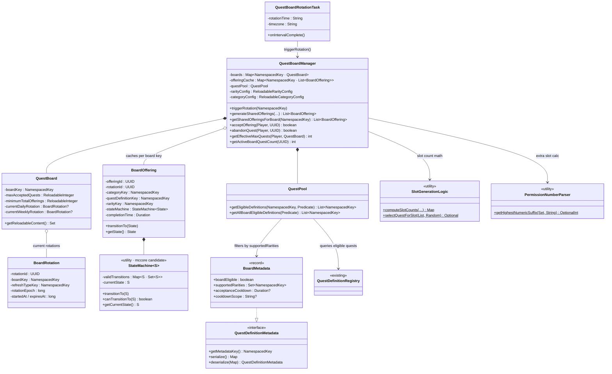

# Phase 1 LLD: Core Board Infrastructure

> **HLD Reference:** [docs/hld/quest-board.md](../../hld/quest-board.md)
> **Status:** IMPLEMENTED

## Scope

Phase 1 delivers the minimal working quest board: a single global board with shared offerings from hand-crafted quests, configurable rarity, rotation scheduling, slot limits, abandonment, a basic GUI, persistence, and unit tests. Per-player slots, templates, land quests, and reward distribution are deferred to later phases.

**In scope:**
- `QuestBoard`, `QuestBoardManager`, `BoardOffering`, `QuestPool`
- `QuestSource` abstract class + `QuestSourceRegistry` + content pack (with serialization)
- `QuestRarity` registry (configurable, localized, `NamespacedKey`-based) + content pack
- `RefreshType` abstract class + `RefreshTypeRegistry` (extensible, built-in `DAILY`/`WEEKLY` only)
- Custom data-driven slot categories (YAML, `NamespacedKey`-based)
- `QuestBoardRotationTask` (rotation scheduling)
- Board-specific slot limits and permission-based extra slots
- Quest abandonment (board quests only)
- `PermissionNumberParser` utility
- `StateMachine<S>` reusable utility (McCore candidate)
- `QuestDefinitionMetadata` extensible metadata system on `QuestDefinition`
- Basic board GUI (shared offerings only -- no land tab, no per-player)
- Database schema and DAOs for board state
- Board YAML configuration (`board.yml`, `categories/*.yml`)
- Reload strategy via `ReloadableContent` wrappers
- Unit tests

**Out of scope (later phases):**
- Per-player offerings / deterministic seeding (Phase 2)
- Quest templates / procedural generation (Phase 2)
- Land board quests (Phase 3)
- Reward distribution (Phase 3)
- Conditional objectives / expression engine (Phase 4)
- Event-driven refresh types (future -- extension point designed in Phase 1)

---

## Class Diagrams

Split into three focused diagrams for readability.

**Legend** (applies to all diagrams):
`<<abstract>>` abstract class · `<<interface>>` interface · `<<record>>` Java record · `<<utility>>` stateless static methods · `<<DAO>>` database access object · `<<config>>` config route constants · `<<content pack>>` expansion content pack · `<<mccore>>` McCore class · `<<modified>>` existing class with Phase 1 additions · `<<existing>>` referenced but not modified · `*--` composition · `o--` association · `-->` dependency · `..|>` implements · `--|>` extends · `?` = nullable

### Diagram 1: Registries & Type Hierarchies

All new registries, their content types, and type hierarchies.

```mermaid
classDiagram
    direction TB

    class Registry~T~ {
        <<interface · mccore>>
        +register(T)
        +get(NamespacedKey) Optional~T~
    }

    %% ── QuestSource ──

    class QuestSource {
        <<abstract>>
        #key : NamespacedKey
        +getKey() NamespacedKey
        +isAbandonable()* boolean
        +getExpansionKey()* NamespacedKey
    }
    class BoardPersonalQuestSource { +isAbandonable() true }
    class BoardLandQuestSource { +isAbandonable() true }
    class AbilityUpgradeQuestSource { +isAbandonable() false }
    class ManualQuestSource { +isAbandonable() false }
    class QuestSourceRegistry { +register(QuestSource)  +get(NamespacedKey) Optional }

    BoardPersonalQuestSource --|> QuestSource
    BoardLandQuestSource --|> QuestSource
    AbilityUpgradeQuestSource --|> QuestSource
    ManualQuestSource --|> QuestSource
    QuestSourceRegistry ..|> Registry~T~
    QuestSourceRegistry o-- QuestSource

    %% ── QuestRarity ──

    class QuestRarity {
        -key : NamespacedKey
        -weight : int
        -difficultyMultiplier : double
        -rewardMultiplier : double
    }
    class QuestRarityRegistry {
        +register(QuestRarity)
        +get(NamespacedKey) Optional
        +rollRarity(Random) QuestRarity
        +replaceConfigRarities(Map)
    }

    QuestRarityRegistry ..|> Registry~T~
    QuestRarityRegistry o-- QuestRarity

    %% ── RefreshType ──

    class RefreshType {
        <<abstract>>
        #key : NamespacedKey
        +isTimeBased()* boolean
        +shouldRefresh(long, ZonedDateTime)* boolean
    }
    class DailyRefreshType { +shouldRefresh(…) boolean }
    class WeeklyRefreshType { -resetDay : DayOfWeek  +shouldRefresh(…) boolean }
    class RefreshTypeRegistry { +register(RefreshType)  +get(NamespacedKey) Optional  +getTimeBasedTypes() List }

    DailyRefreshType --|> RefreshType
    WeeklyRefreshType --|> RefreshType
    RefreshTypeRegistry ..|> Registry~T~
    RefreshTypeRegistry o-- RefreshType

    %% ── BoardSlotCategory ──

    class BoardSlotCategory {
        -key : NamespacedKey
        -visibility : Visibility
        -refreshTypeKey : NamespacedKey
        -min / max / chancePerSlot / priority
        -completionTime : Duration
        -appearanceCooldown : Duration?
        -requiredPermission : String?
    }
    class BoardSlotCategoryRegistry {
        +register(BoardSlotCategory)
        +getAllByPriority() List
        +getByVisibility(Visibility) List
        +replaceConfigCategories(Map)
    }

    BoardSlotCategoryRegistry ..|> Registry~T~
    BoardSlotCategoryRegistry o-- BoardSlotCategory

    %% ── Content Packs ──

    class QuestSourceContentPack { <<content pack>> }
    class QuestRarityContentPack { <<content pack>> }
    class QuestScopeProviderContentPack { <<content pack>> }
```



### Diagram 2: Board Core & Generation

The board entity, manager, offering lifecycle, generation pipeline, and reload integration.



### Diagram 3: Infrastructure, DAOs & Modified Classes

Persistence layer, GUI, commands, config, and changes to existing classes.

```mermaid
classDiagram
    direction TB

    %% ── DAOs ──

    class BoardRotationDAO { <<DAO>>  +attemptCreateTable()$  +saveRotation()$  +loadCurrentRotation()$ }
    class BoardOfferingDAO { <<DAO>>  +attemptCreateTable()$  +saveOfferings()$  +loadOfferingsForRotation()$  +updateOfferingState()$  +expireOfferingsForRotation()$ }
    class PlayerBoardStateDAO { <<DAO>>  +attemptCreateTable()$  +saveState()$  +countActiveQuestsFromBoard()$ }
    class BoardCooldownDAO { <<DAO>>  +attemptCreateTable()$  +saveCooldown()$  +isOnCooldown()$  +pruneExpiredCooldowns()$ }

    %% ── GUI & Command ──

    class QuestBoardGui { -offerings : List~BoardOffering~ }
    class BoardCommand { +registerCommand()$ }
    class HomeBoardSlot { +onClick() boolean }
    class BoardConfigFile { <<config>> }
    class BoardCategoryConfigLoader { +loadCategoriesFromDirectory(File) Map }

    %% ── Modified Existing Classes ──

    class QuestDefinition {
        <<modified>>
        +metadata : Map~NamespacedKey · QuestDefinitionMetadata~
        +getMetadata(NamespacedKey, Class) Optional
        +getBoardMetadata() Optional~BoardMetadata~
    }

    class QuestInstance {
        <<modified>>
        +questSource : QuestSource
        +scopeDisplayName : String?
    }

    class QuestManager {
        <<modified>>
        +abandonQuest(UUID) boolean
    }

    class QuestInstanceDAO {
        <<modified>>
        quest_source VARCHAR
        scope_display_name VARCHAR
    }

    class QuestConfigLoader {
        <<modified>>
        parses board-metadata → BoardMetadata
    }

    %% ── Relationships ──

    QuestBoardGui --> BoardCommand : opened by
    QuestBoardGui --> HomeBoardSlot : opened by
    QuestInstanceDAO --> QuestInstance : persists
    QuestConfigLoader --> QuestDefinition : builds
```



---

## 1. New Classes

### 1.1 `QuestSource` -- Abstract Quest Source

**Package:** `us.eunoians.mcrpg.quest.source`
**File:** `src/main/java/us/eunoians/mcrpg/quest/source/QuestSource.java`

Abstract class representing how a quest was obtained. Registered via `QuestSourceRegistry` and content packs, following the same pattern as `QuestObjectiveType` and `QuestRewardType`. Each source type can carry behavior beyond the base contract (e.g., a future `NpcQuestSource` might reference an NPC ID).

```java
public abstract class QuestSource implements McRPGContent {

    private final NamespacedKey key;

    protected QuestSource(@NotNull NamespacedKey key) {
        this.key = key;
    }

    @NotNull public final NamespacedKey getKey() { return key; }

    /** Whether quests from this source can be abandoned by the player. */
    public abstract boolean isAbandonable();

    /** The expansion that registered this source. */
    @NotNull public abstract NamespacedKey getExpansionKey();
}
```

**Built-in implementations** (in `us.eunoians.mcrpg.quest.source.builtin`):

| Class | Key | Abandonable |
|-------|-----|-------------|
| `BoardPersonalQuestSource` | `mcrpg:board_personal` | `true` |
| `BoardLandQuestSource` | `mcrpg:board_land` | `true` |
| `AbilityUpgradeQuestSource` | `mcrpg:ability_upgrade` | `false` |
| `ManualQuestSource` | `mcrpg:manual` | `false` |

Each is a minimal final class extending `QuestSource` with the key and `isAbandonable()` value. All return `McRPGExpansion.EXPANSION_KEY` from `getExpansionKey()`.

**Deserialization from DB**: When loading a `QuestInstance`, the `quest_source` column value (a `NamespacedKey` string) is resolved via `QuestSourceRegistry.get()`. If the key is unrecognized (e.g., a third-party plugin was removed), it returns `Optional.empty()` and the quest instance's source is set to `null` -- functionally equivalent to a legacy quest with no source tag.

### 1.2 `QuestSourceRegistry`

**Package:** `us.eunoians.mcrpg.quest.source`
**File:** `src/main/java/us/eunoians/mcrpg/quest/source/QuestSourceRegistry.java`

Follows `Registry<QuestSource>` pattern. Sources are registered programmatically via content packs (no config-file source). Not cleared on reload.

```java
public class QuestSourceRegistry implements Registry<QuestSource> {

    private final Map<NamespacedKey, QuestSource> sources = new LinkedHashMap<>();

    public void register(@NotNull QuestSource source) { ... }
    public Optional<QuestSource> get(@NotNull NamespacedKey key) { ... }
    public Collection<QuestSource> getAll() { ... }
}
```

**Registry key:** Add `QUEST_SOURCE` to `McRPGRegistryKey`.

### 1.3 `QuestRarity` -- Rarity Data Object

**Package:** `us.eunoians.mcrpg.quest.board.rarity`
**File:** `src/main/java/us/eunoians/mcrpg/quest/board/rarity/QuestRarity.java`

Immutable data class representing a single rarity tier. Not an enum -- loaded from config. Uses `NamespacedKey` for extensibility. Implements `McRPGContent` so it can be registered via content packs.

In `board.yml`, rarity keys like `COMMON` are auto-namespaced to `mcrpg:common` during config loading. Third-party plugins registering programmatically use their own namespace.

```java
public final class QuestRarity implements McRPGContent {

    private final NamespacedKey key;     // e.g., mcrpg:common
    private final int weight;
    private final double difficultyMultiplier;
    private final double rewardMultiplier;
    private final NamespacedKey expansionKey;

    public QuestRarity(@NotNull NamespacedKey key, int weight,
                       double difficultyMultiplier, double rewardMultiplier,
                       @NotNull NamespacedKey expansionKey) { ... }

    @NotNull public NamespacedKey getKey() { ... }
    public int getWeight() { ... }
    public double getDifficultyMultiplier() { ... }
    public double getRewardMultiplier() { ... }
    @NotNull public NamespacedKey getExpansionKey() { ... }
}
```

### 1.4 `QuestRarityRegistry`

**Package:** `us.eunoians.mcrpg.quest.board.rarity`
**File:** `src/main/java/us/eunoians/mcrpg/quest/board/rarity/QuestRarityRegistry.java`

Follows `Registry<T>` pattern with `NamespacedKey` lookups. Supports dual-source registration: config-loaded rarities (reloadable) and expansion-registered rarities (persistent across reloads).

```java
public class QuestRarityRegistry implements Registry<QuestRarity> {

    private final Map<NamespacedKey, QuestRarity> rarities = new LinkedHashMap<>();
    private final Set<NamespacedKey> configLoadedKeys = new HashSet<>();

    public void register(@NotNull QuestRarity rarity) { ... }
    public Optional<QuestRarity> get(@NotNull NamespacedKey key) { ... }
    public Collection<QuestRarity> getAll() { ... }

    @NotNull
    public QuestRarity rollRarity(@NotNull Random random) { ... }

    /**
     * Replaces config-loaded rarities with a fresh set from board.yml.
     * Expansion-registered rarities are untouched.
     * Called during reload.
     */
    public void replaceConfigRarities(@NotNull Map<NamespacedKey, QuestRarity> freshConfig) {
        configLoadedKeys.forEach(rarities::remove);
        configLoadedKeys.clear();
        freshConfig.forEach((key, rarity) -> {
            rarities.put(key, rarity);
            configLoadedKeys.add(key);
        });
    }

    public void clear() { ... }
}
```

**Registry key:** Add `QUEST_RARITY` to `McRPGRegistryKey`.

### 1.5 `RefreshType` -- Abstract Refresh Trigger

**Package:** `us.eunoians.mcrpg.quest.board.refresh`
**File:** `src/main/java/us/eunoians/mcrpg/quest/board/refresh/RefreshType.java`

Abstract class representing a category refresh trigger. Phase 1 ships two time-based built-in types. The extension point is designed so future event-driven types (e.g., world boss respawn, seasonal event start) can be registered by third-party plugins without modifying the rotation task.

```java
public abstract class RefreshType {

    private final NamespacedKey key;

    protected RefreshType(@NotNull NamespacedKey key) {
        this.key = key;
    }

    @NotNull public final NamespacedKey getKey() { return key; }

    /**
     * Whether this refresh type is time-based (checked by the rotation task's
     * periodic interval) or event-driven (triggered externally).
     * Time-based types are polled; event-driven types register their own
     * Bukkit event listeners.
     */
    public abstract boolean isTimeBased();

    /**
     * For time-based types: checks whether a refresh should trigger,
     * given the last refresh epoch and the current time in the configured timezone.
     * Event-driven types return false (they trigger externally).
     */
    public abstract boolean shouldRefresh(long lastRefreshEpoch, @NotNull ZonedDateTime now);
}
```

**Built-in implementations** (in `us.eunoians.mcrpg.quest.board.refresh.builtin`):

```java
public final class DailyRefreshType extends RefreshType {

    public DailyRefreshType() { super(new NamespacedKey("mcrpg", "daily")); }

    @Override public boolean isTimeBased() { return true; }

    @Override
    public boolean shouldRefresh(long lastRefreshEpoch, @NotNull ZonedDateTime now) {
        return now.toLocalDate().toEpochDay() > lastRefreshEpoch;
    }
}

public final class WeeklyRefreshType extends RefreshType {

    private final DayOfWeek resetDay;

    public WeeklyRefreshType(@NotNull DayOfWeek resetDay) {
        super(new NamespacedKey("mcrpg", "weekly"));
        this.resetDay = resetDay;
    }

    @Override public boolean isTimeBased() { return true; }

    @Override
    public boolean shouldRefresh(long lastRefreshEpoch, @NotNull ZonedDateTime now) {
        // Check if a week boundary (relative to resetDay) has been crossed
        // since lastRefreshEpoch
    }
}
```

### 1.6 `RefreshTypeRegistry`

**Package:** `us.eunoians.mcrpg.quest.board.refresh`
**File:** `src/main/java/us/eunoians/mcrpg/quest/board/refresh/RefreshTypeRegistry.java`

```java
public class RefreshTypeRegistry implements Registry<RefreshType> {

    private final Map<NamespacedKey, RefreshType> types = new LinkedHashMap<>();

    public void register(@NotNull RefreshType type) { ... }
    public Optional<RefreshType> get(@NotNull NamespacedKey key) { ... }
    public Collection<RefreshType> getAll() { ... }

    /** Returns only time-based refresh types (polled by the rotation task). */
    @NotNull
    public List<RefreshType> getTimeBasedTypes() {
        return types.values().stream().filter(RefreshType::isTimeBased).toList();
    }
}
```

**Registry key:** Add `REFRESH_TYPE` to `McRPGRegistryKey`.

### 1.7 `BoardSlotCategory` -- Slot Category Definition

**Package:** `us.eunoians.mcrpg.quest.board.category`
**File:** `src/main/java/us/eunoians/mcrpg/quest/board/category/BoardSlotCategory.java`

Immutable data class parsed from category YAML files. Uses `NamespacedKey` for all identifiers. `refreshTypeKey` references a registered `RefreshType` rather than a fixed enum, enabling future event-driven refresh triggers.

```java
public final class BoardSlotCategory {

    public enum Visibility { SHARED, PERSONAL, SCOPED }

    private final NamespacedKey key;                 // e.g., mcrpg:shared_daily
    private final Visibility visibility;
    private final NamespacedKey refreshTypeKey;       // e.g., mcrpg:daily -- references RefreshTypeRegistry
    private final Duration refreshInterval;
    private final Duration completionTime;
    private final NamespacedKey scopeProviderKey;
    private final int min;
    private final int max;
    private final double chancePerSlot;
    private final int priority;
    private final Duration appearanceCooldown;       // nullable
    private final String requiredPermission;         // nullable

    // Constructor with all fields
    // Getters for all fields
    // hasAppearanceCooldown(), hasRequiredPermission()
}
```

`Visibility` remains a fixed enum -- the three modes (SHARED, PERSONAL, SCOPED) represent fundamentally different generation strategies, not configurable triggers.

### 1.8 `BoardSlotCategoryRegistry`

**Package:** `us.eunoians.mcrpg.quest.board.category`
**File:** `src/main/java/us/eunoians/mcrpg/quest/board/category/BoardSlotCategoryRegistry.java`

Loaded from `quest-board/categories/` directory. Follows `Registry<T>` pattern. Supports dual-source registration (config-loaded + expansion-registered) with `replaceConfigCategories()` for reload.

```java
public class BoardSlotCategoryRegistry implements Registry<BoardSlotCategory> {

    private final Map<NamespacedKey, BoardSlotCategory> categories = new LinkedHashMap<>();
    private final Set<NamespacedKey> configLoadedKeys = new HashSet<>();

    public void register(@NotNull BoardSlotCategory category) { ... }
    public Optional<BoardSlotCategory> get(@NotNull NamespacedKey key) { ... }
    public Collection<BoardSlotCategory> getAll() { ... }

    public List<BoardSlotCategory> getAllByPriority() { ... }
    public List<BoardSlotCategory> getByVisibility(@NotNull BoardSlotCategory.Visibility v) { ... }

    /**
     * Replaces config-loaded categories. Expansion-registered categories are untouched.
     */
    public void replaceConfigCategories(@NotNull Map<NamespacedKey, BoardSlotCategory> freshConfig) { ... }

    public void clear() { ... }
}
```

**Registry key:** Add `BOARD_SLOT_CATEGORY` to `McRPGRegistryKey`.

### 1.9 `StateMachine<S>` -- Reusable State Machine

**Package:** `us.eunoians.mcrpg.util` (McCore extraction candidate)
**File:** `src/main/java/us/eunoians/mcrpg/util/StateMachine.java`

Generic, reusable state machine with transition validation. Lives in McRPG for now; designed for extraction into McCore since the pattern applies to `QuestState`, `QuestStageState`, `QuestObjectiveState`, etc.

```java
public class StateMachine<S extends Enum<S>> {

    private final Map<S, Set<S>> validTransitions;
    private S currentState;

    /**
     * @param initialState the starting state
     * @param validTransitions map of state -> set of states it can transition to
     */
    public StateMachine(@NotNull S initialState,
                        @NotNull Map<S, Set<S>> validTransitions) {
        this.currentState = initialState;
        this.validTransitions = Map.copyOf(validTransitions);
    }

    /**
     * Transitions to a new state.
     * @throws IllegalStateException if the transition is not valid
     */
    public void transitionTo(@NotNull S newState) {
        if (!canTransitionTo(newState)) {
            throw new IllegalStateException(
                "Cannot transition from " + currentState + " to " + newState);
        }
        this.currentState = newState;
    }

    public boolean canTransitionTo(@NotNull S newState) {
        return validTransitions.getOrDefault(currentState, Set.of()).contains(newState);
    }

    @NotNull public S getCurrentState() { return currentState; }
}
```

### 1.10 `BoardOffering` -- Single Board Offering

**Package:** `us.eunoians.mcrpg.quest.board`
**File:** `src/main/java/us/eunoians/mcrpg/quest/board/BoardOffering.java`

Represents one offering slot on the board. State transitions are managed by an internal `StateMachine<State>`.

Valid transitions: `VISIBLE -> ACCEPTED`, `VISIBLE -> EXPIRED`, `ACCEPTED -> COMPLETED`, `ACCEPTED -> ABANDONED`, `ACCEPTED -> EXPIRED`.

```java
public class BoardOffering {

    public enum State { VISIBLE, ACCEPTED, COMPLETED, EXPIRED, ABANDONED }

    private static final Map<State, Set<State>> TRANSITIONS = Map.of(
        State.VISIBLE, Set.of(State.ACCEPTED, State.EXPIRED),
        State.ACCEPTED, Set.of(State.COMPLETED, State.ABANDONED, State.EXPIRED),
        State.COMPLETED, Set.of(),
        State.EXPIRED, Set.of(),
        State.ABANDONED, Set.of()
    );

    private final UUID offeringId;
    private final UUID rotationId;
    private final NamespacedKey categoryKey;
    private final int slotIndex;
    private final NamespacedKey questDefinitionKey;
    private final NamespacedKey rarityKey;
    private final String scopeTargetId;           // nullable
    private final StateMachine<State> stateMachine;
    private Long acceptedAt;                      // nullable
    private UUID questInstanceUUID;               // nullable
    private final Duration completionTime;

    // New offering constructor: stateMachine initialized with State.VISIBLE
    // Reconstruction constructor: stateMachine initialized with stored state

    public void transitionTo(@NotNull State newState) { stateMachine.transitionTo(newState); }
    public boolean canTransitionTo(@NotNull State newState) { return stateMachine.canTransitionTo(newState); }
    @NotNull public State getState() { return stateMachine.getCurrentState(); }

    // Other getters, setAcceptedAt(), setQuestInstanceUUID()
}
```

### 1.11 `BoardRotation` -- Rotation Epoch Tracking

**Package:** `us.eunoians.mcrpg.quest.board`
**File:** `src/main/java/us/eunoians/mcrpg/quest/board/BoardRotation.java`

Tracks a single rotation epoch. References a `RefreshType` by key rather than a fixed enum.

```java
public class BoardRotation {

    private final UUID rotationId;
    private final NamespacedKey boardKey;
    private final NamespacedKey refreshTypeKey;    // e.g., mcrpg:daily
    private final long rotationEpoch;
    private final long startedAt;
    private final long expiresAt;

    // Constructor, getters
}
```

### 1.12 `QuestBoard` -- Board Entity

**Package:** `us.eunoians.mcrpg.quest.board`
**File:** `src/main/java/us/eunoians/mcrpg/quest/board/QuestBoard.java`

Represents a single quest board. v1 has one global board. Config-derived values use `ReloadableContent` wrappers so they stay in sync with `board.yml` on plugin reload.

```java
public class QuestBoard {

    private final NamespacedKey boardKey;
    private final ReloadableInteger maxAcceptedQuests;
    private final ReloadableInteger minimumTotalOfferings;
    private BoardRotation currentDailyRotation;
    private BoardRotation currentWeeklyRotation;

    public QuestBoard(@NotNull NamespacedKey boardKey,
                      @NotNull YamlDocument boardConfig) {
        this.boardKey = boardKey;
        this.maxAcceptedQuests = new ReloadableInteger(
            boardConfig, BoardConfigFile.MAX_ACCEPTED_QUESTS);
        this.minimumTotalOfferings = new ReloadableInteger(
            boardConfig, BoardConfigFile.MINIMUM_TOTAL_OFFERINGS);
    }

    @NotNull public NamespacedKey getBoardKey() { return boardKey; }
    public int getMaxAcceptedQuests() { return maxAcceptedQuests.getContent(); }
    public int getMinimumTotalOfferings() { return minimumTotalOfferings.getContent(); }

    @Nullable public BoardRotation getCurrentDailyRotation() { ... }
    @Nullable public BoardRotation getCurrentWeeklyRotation() { ... }
    public void setCurrentDailyRotation(@Nullable BoardRotation rotation) { ... }
    public void setCurrentWeeklyRotation(@Nullable BoardRotation rotation) { ... }

    /** Returns all ReloadableContent fields for tracking with ReloadableContentManager. */
    @NotNull
    public Set<ReloadableContent<?>> getReloadableContent() {
        return Set.of(maxAcceptedQuests, minimumTotalOfferings);
    }
}
```

### 1.13 `QuestBoardManager` -- Board Manager

**Package:** `us.eunoians.mcrpg.quest.board`
**File:** `src/main/java/us/eunoians/mcrpg/quest/board/QuestBoardManager.java`

Central manager. Registered in `McRPGManagerKey`. Owns `ReloadableContent` wrappers for config-loaded registries. The `offeringCache` is keyed by board `NamespacedKey` and is **cleared on rotation**, **lazily repopulated from DB**.

**Initialization flow** (`initialize()` method):
1. Load `board.yml` via `FileManager.getFile(FileType.BOARD_CONFIG)`
2. Create `ReloadableRarityConfig` and `ReloadableCategoryConfig` wrappers
3. Populate `QuestRarityRegistry` and `BoardSlotCategoryRegistry` from initial config
4. Register built-in `RefreshType` instances (`DailyRefreshType`, `WeeklyRefreshType`)
5. Create default `QuestBoard` (`mcrpg:default_board`) passing the `YamlDocument`
6. Create `QuestPool` instance
7. Load current rotations from database (if server restarted mid-rotation)
8. Track all `ReloadableContent` instances with `ReloadableContentManager`

**Reload hooks**: The `ReloadableRarityConfig` and `ReloadableCategoryConfig` instances implement `ReloadableContent`. When `reloadAllContent()` fires:
- `ReloadableRarityConfig` re-parses `board.yml` rarities, calls `QuestRarityRegistry.replaceConfigRarities()`
- `ReloadableCategoryConfig` re-scans `categories/` directory, calls `BoardSlotCategoryRegistry.replaceConfigCategories()`
- `QuestBoard`'s `ReloadableInteger` fields re-read their values automatically
- The offering cache is NOT cleared (current offerings persist until next rotation)

```java
public class QuestBoardManager extends Manager<McRPG> {

    private final Map<NamespacedKey, QuestBoard> boards = new HashMap<>();
    private final Map<NamespacedKey, List<BoardOffering>> offeringCache = new ConcurrentHashMap<>();
    private QuestPool questPool;
    private ReloadableRarityConfig rarityConfig;
    private ReloadableCategoryConfig categoryConfig;

    public void initialize() {
        // See initialization flow above
        // Uses plugin() (not getPlugin()) to access the McRPG instance
    }

    // Board access
    public void registerBoard(@NotNull QuestBoard board) { ... }
    @NotNull public Optional<QuestBoard> getBoard(@NotNull NamespacedKey key) { ... }
    @NotNull public QuestBoard getDefaultBoard() { ... }

    // Rotation -- now takes a RefreshType key
    public void triggerRotation(@NotNull NamespacedKey refreshTypeKey) { ... }

    // Offering generation (Phase 1: shared only)
    @NotNull
    public List<BoardOffering> generateSharedOfferings(
        @NotNull QuestBoard board,
        @NotNull BoardRotation rotation,
        @NotNull Random random) { ... }

    // Offering access
    @NotNull
    public List<BoardOffering> getSharedOfferingsForBoard(@NotNull NamespacedKey boardKey) {
        // Check offeringCache; if empty, load from DB and populate cache
    }

    // Acceptance
    public boolean acceptOffering(@NotNull Player player,
                                  @NotNull UUID offeringId) { ... }

    // Abandonment
    public boolean abandonQuest(@NotNull Player player,
                                @NotNull UUID questInstanceUUID) { ... }

    // Slot limit checks
    public int getEffectiveMaxQuests(@NotNull Player player,
                                     @NotNull QuestBoard board) { ... }
    public int getActiveBoardQuestCount(@NotNull UUID playerUUID) { ... }
}
```

**Manager key:** Add `QUEST_BOARD` to `McRPGManagerKey`.

### 1.14 `ReloadableRarityConfig` and `ReloadableCategoryConfig`

**Package:** `us.eunoians.mcrpg.quest.board.configuration`

Custom `ReloadableContent` subclasses following the `ReloadableRemoteTransferMap` pattern. Each wraps the loading logic for its config source and calls the registry's replace method on reload.

```java
public class ReloadableRarityConfig extends ReloadableContent<Map<NamespacedKey, QuestRarity>> {

    public ReloadableRarityConfig(@NotNull YamlDocument boardConfig,
                                  @NotNull QuestRarityRegistry registry) {
        super(boardConfig, BoardConfigFile.RARITIES, (doc, route) -> {
            Map<NamespacedKey, QuestRarity> map = new LinkedHashMap<>();
            Section section = doc.getSection(route);
            for (String rawKey : section.getRoutesAsStrings(false)) {
                NamespacedKey key = new NamespacedKey("mcrpg", rawKey.toLowerCase());
                Section raritySection = section.getSection(rawKey);
                map.put(key, new QuestRarity(
                    key,
                    raritySection.getInt("weight"),
                    raritySection.getDouble("difficulty-multiplier"),
                    raritySection.getDouble("reward-multiplier"),
                    McRPGExpansion.EXPANSION_KEY
                ));
            }
            registry.replaceConfigRarities(map);
            return map;
        });
    }
}

public class ReloadableCategoryConfig extends ReloadableContent<Map<NamespacedKey, BoardSlotCategory>> {

    public ReloadableCategoryConfig(@NotNull YamlDocument boardConfig,
                                    @NotNull BoardSlotCategoryRegistry registry,
                                    @NotNull File categoriesDirectory) {
        super(boardConfig, BoardConfigFile.MINIMUM_TOTAL_OFFERINGS, (doc, route) -> {
            BoardCategoryConfigLoader loader = new BoardCategoryConfigLoader();
            Map<NamespacedKey, BoardSlotCategory> map = loader.loadCategoriesFromDirectory(categoriesDirectory);
            registry.replaceConfigCategories(map);
            return map;
        });
    }
}
```

### 1.15 `QuestPool` -- Eligible Quest Pool

**Package:** `us.eunoians.mcrpg.quest.board.generation`
**File:** `src/main/java/us/eunoians/mcrpg/quest/board/generation/QuestPool.java`

Encapsulates the logic of assembling the pool of eligible quests for board generation. Corresponds to the `QuestPool` component in the HLD architecture diagram. In Phase 1, draws exclusively from `QuestDefinitionRegistry` (hand-crafted quests with `board-metadata`). In Phase 2, will additionally draw from `QuestTemplateEngine`.

```java
public class QuestPool {

    @NotNull
    public List<NamespacedKey> getEligibleDefinitions(
        @NotNull NamespacedKey rolledRarity,
        @NotNull Predicate<NamespacedKey> isOnAcceptanceCooldown) {
        // 1. Iterate QuestDefinitionRegistry
        // 2. Filter: boardMetadata present && boardMetadata.boardEligible()
        // 3. Filter: boardMetadata.supportedRarities().contains(rolledRarity)
        // 4. Filter: !isOnAcceptanceCooldown
        // 5. Return eligible keys
    }

    @NotNull
    public List<NamespacedKey> getAllBoardEligibleDefinitions(
        @NotNull Predicate<NamespacedKey> isOnAcceptanceCooldown) { ... }
}
```

### 1.16 `SlotGenerationLogic` -- Pure Generation Logic

**Package:** `us.eunoians.mcrpg.quest.board.generation`
**File:** `src/main/java/us/eunoians/mcrpg/quest/board/generation/SlotGenerationLogic.java`

Stateless utility with pure functions for testability. No Bukkit dependency.

```java
public final class SlotGenerationLogic {

    private SlotGenerationLogic() {}

    @NotNull
    public static Map<NamespacedKey, Integer> computeSlotCounts(
        @NotNull List<BoardSlotCategory> categories,
        int minimumTotalOfferings,
        @NotNull Random random,
        @NotNull Predicate<NamespacedKey> isCategoryOnCooldown) { ... }

    @NotNull
    public static Optional<NamespacedKey> selectQuestForSlot(
        @NotNull List<NamespacedKey> eligibleDefinitions,
        @NotNull Random random) { ... }
}
```

### 1.17 `PermissionNumberParser` -- Permission Utility

**Package:** `us.eunoians.mcrpg.util`
**File:** `src/main/java/us/eunoians/mcrpg/util/PermissionNumberParser.java`

```java
public final class PermissionNumberParser {

    private PermissionNumberParser() {}

    @NotNull
    public static OptionalInt getHighestNumericSuffix(
        @NotNull Set<String> permissions,
        @NotNull String prefix) { ... }
}
```

### 1.18 `QuestBoardRotationTask` -- Rotation Scheduler

**Package:** `us.eunoians.mcrpg.task.board`
**File:** `src/main/java/us/eunoians/mcrpg/task/board/QuestBoardRotationTask.java`

Follows `QuestSaveTask` pattern. Iterates registered time-based `RefreshType` instances from `RefreshTypeRegistry` and checks each for a trigger. No longer hardcodes DAILY/WEEKLY logic -- the refresh types own that.

```java
public final class QuestBoardRotationTask extends CancelableCoreTask {

    private final String rotationTime;     // "HH:mm" from config
    private final String timezone;         // from config
    private final Map<NamespacedKey, Long> lastRefreshEpochs = new HashMap<>();

    public QuestBoardRotationTask(@NotNull McRPG plugin,
                                  double taskDelay,
                                  double taskFrequency,
                                  @NotNull String rotationTime,
                                  @NotNull String timezone) {
        super(plugin, taskDelay, taskFrequency);
        // Load last refresh epochs from DB on construction
    }

    @Override
    protected void onIntervalComplete() {
        ZoneId zone = ZoneId.of(timezone);
        ZonedDateTime now = plugin().getTimeProvider().now().atZone(zone);
        LocalTime configuredTime = LocalTime.parse(rotationTime);

        if (now.toLocalTime().isBefore(configuredTime)) return;

        RefreshTypeRegistry registry = ...; // resolve from RegistryAccess
        for (RefreshType type : registry.getTimeBasedTypes()) {
            long lastEpoch = lastRefreshEpochs.getOrDefault(type.getKey(), 0L);
            if (type.shouldRefresh(lastEpoch, now)) {
                questBoardManager.triggerRotation(type.getKey());
                lastRefreshEpochs.put(type.getKey(), computeCurrentEpoch(type, now));
            }
        }

        // Prune expired cooldowns
    }

    @Override protected void onCancel() {}
    @Override protected void onDelayComplete() {}
    @Override protected void onIntervalStart() {}
    @Override protected void onIntervalPause() {}
    @Override protected void onIntervalResume() {}
}
```

### 1.19 `QuestBoardGui` -- Basic Board GUI

**Package:** `us.eunoians.mcrpg.gui.board`
**File:** `src/main/java/us/eunoians/mcrpg/gui/board/QuestBoardGui.java`

Phase 1 shows shared offerings only. Extends `McRPGPaginatedGui`.

```java
public class QuestBoardGui extends McRPGPaginatedGui {

    private final List<BoardOffering> offerings;

    public QuestBoardGui(@NotNull McRPGPlayer player) {
        super(player);
        // Load shared offerings from QuestBoardManager
    }

    @Override
    protected Inventory getInventoryForPage(int page) {
        return Bukkit.createInventory(player, 54,
            localizationManager.getLocalizedMessageAsComponent(
                getCreatingPlayer(), LocalizationKey.QUEST_BOARD_GUI_TITLE));
    }

    @Override
    protected void paintInventoryForPage(@NotNull Inventory inventory, int page) {
        // Paint offerings as BoardOfferingSlots (rows 1-5)
        // Paint navigation bar (row 6)
    }
}
```

**Slot classes (in `gui/board/slot/`):**
- `BoardOfferingSlot` -- displays offering (quest name, rarity, completion time). Click triggers acceptance.
- `BoardBackSlot` -- back to home GUI.
- `BoardPreviousPageSlot`, `BoardNextPageSlot` -- pagination.

---

## 2. Modifications to Existing Classes

### 2.1 `QuestInstance` -- Add `questSource` and `scopeDisplayName`

Add two fields:

```java
private final QuestSource questSource;     // non-nullable, set at construction time
private String scopeDisplayName;           // nullable -- English locale fallback

@NotNull public QuestSource getQuestSource() { return questSource; }
@Nullable public String getScopeDisplayName() { ... }
public void setScopeDisplayName(@Nullable String name) { ... }
```

`questSource` is `final` and immutable after construction -- there is no setter. All `QuestInstance` constructors require a `@NotNull QuestSource` parameter. No legacy quest handling is assumed; all quests have a source.

### 2.2 `QuestDefinition` -- Extensible Metadata System

Replace the idea of a specific `BoardMetadata` field with a generic, extensible metadata attachment system. This avoids constructor parameter explosion as new metadata types are added (board metadata now, template metadata in Phase 2, NPC metadata in the future, etc.).

**New interface** -- `QuestDefinitionMetadata`:

**Package:** `us.eunoians.mcrpg.quest.definition`
**File:** `src/main/java/us/eunoians/mcrpg/quest/definition/QuestDefinitionMetadata.java`

```java
public interface QuestDefinitionMetadata {

    @NotNull NamespacedKey getMetadataKey();

    @NotNull Map<String, Object> serialize();

    @NotNull QuestDefinitionMetadata deserialize(@NotNull Map<String, Object> data);
}
```

**New record** -- `BoardMetadata`:

**Package:** `us.eunoians.mcrpg.quest.board`
**File:** `src/main/java/us/eunoians/mcrpg/quest/board/BoardMetadata.java`

```java
public record BoardMetadata(
    boolean boardEligible,
    @NotNull Set<NamespacedKey> supportedRarities,
    @Nullable Duration acceptanceCooldown,
    @Nullable String cooldownScope      // "GLOBAL", "PLAYER", "SCOPE_ENTITY"
) implements QuestDefinitionMetadata {

    public static final NamespacedKey METADATA_KEY =
        new NamespacedKey("mcrpg", "board");

    @Override
    @NotNull public NamespacedKey getMetadataKey() { return METADATA_KEY; }

    @Override
    @NotNull public Map<String, Object> serialize() { ... }

    @Override
    @NotNull public BoardMetadata deserialize(@NotNull Map<String, Object> data) { ... }
}
```

**`supportedRarities`**: The set of rarity keys this quest is eligible for. For hand-crafted quests in Phase 1, rarity affects **appearance frequency only** -- which slots the quest can appear in. Difficulty/reward multipliers have no mechanical effect on hand-crafted quests; those scalings only apply to template-generated quests (Phase 2+).

**Changes to `QuestDefinition`**:

```java
private final Map<NamespacedKey, QuestDefinitionMetadata> metadata; // unmodifiable

// Updated constructor -- metadata is the last parameter, nullable (treated as empty map)
public QuestDefinition(@NotNull NamespacedKey questKey,
                       @NotNull NamespacedKey scopeType,
                       @Nullable Duration expiration,
                       @NotNull List<QuestPhaseDefinition> phases,
                       @NotNull List<QuestRewardType> rewards,
                       @NotNull QuestRepeatMode repeatMode,
                       @Nullable Duration repeatCooldown,
                       int repeatLimit,
                       @Nullable NamespacedKey expansionKey,
                       @Nullable Map<NamespacedKey, QuestDefinitionMetadata> metadata) { ... }

@NotNull
public <T extends QuestDefinitionMetadata> Optional<T> getMetadata(
    @NotNull NamespacedKey key, @NotNull Class<T> type) { ... }

@NotNull
public Optional<BoardMetadata> getBoardMetadata() {
    return getMetadata(BoardMetadata.METADATA_KEY, BoardMetadata.class);
}

@NotNull
public Map<NamespacedKey, QuestDefinitionMetadata> getAllMetadata() {
    return metadata;
}
```

### 2.3 `QuestManager` -- Add `abandonQuest()`

```java
public boolean abandonQuest(@NotNull UUID questUUID) {
    // 1. Look up QuestInstance in active quests
    // 2. Check questSource != null && questSource.isAbandonable()
    // 3. Call quest.cancel()
    // 4. Return success
}
```

### 2.4 `QuestInstanceDAO` -- Add columns

The `quest_source` and `scope_display_name` columns are included in the initial `CREATE TABLE` schema (v1). No migration or v2 schema is needed. `quest_source` is `NOT NULL` since we assume no pre-existing tables -- all quests have a source.

- `saveQuestInstance()`: stores `questSource.getKey().toString()`
- `loadQuestInstance()`: resolves via `QuestSourceRegistry.get(NamespacedKey.fromString(value))`

### 2.5 `QuestConfigLoader` -- Parse `board-metadata`

Extend `parseQuestDefinition()` to read the optional `board-metadata` section:

```yaml
board-metadata:
  board-eligible: true
  supported-rarities: [COMMON, UNCOMMON, RARE]
  acceptance-cooldown: 30d
  cooldown-scope: GLOBAL
```

If `supported-rarities` is omitted, default to **all currently registered rarities**.

Parse into `BoardMetadata` record, add to the metadata map under `BoardMetadata.METADATA_KEY`, pass map to `QuestDefinition` constructor.

### 2.6 `McRPGRegistryKey` -- Add new registry keys

```java
RegistryKey<QuestSourceRegistry> QUEST_SOURCE = create(QuestSourceRegistry.class);
RegistryKey<QuestRarityRegistry> QUEST_RARITY = create(QuestRarityRegistry.class);
RegistryKey<BoardSlotCategoryRegistry> BOARD_SLOT_CATEGORY = create(BoardSlotCategoryRegistry.class);
RegistryKey<RefreshTypeRegistry> REFRESH_TYPE = create(RefreshTypeRegistry.class);
```

### 2.7 `McRPGManagerKey` -- Add board manager key

```java
ManagerKey<QuestBoardManager> QUEST_BOARD = create(QuestBoardManager.class);
```

### 2.8 `McRPGBootstrap` -- Register new components

**With existing registries (step 2):**
```java
registryAccess.register(new QuestSourceRegistry());
registryAccess.register(new QuestRarityRegistry());
registryAccess.register(new BoardSlotCategoryRegistry());
registryAccess.register(new RefreshTypeRegistry());
```

**With existing managers -- `QuestManager` BEFORE expansions:**
```java
// QuestManager is registered BEFORE McRPGExpansionRegistrar runs.
// This is required because the QUEST_SCOPE_PROVIDER content handler
// registers scope-change listeners with QuestManager during expansion processing.
registryAccess.registry(RegistryKey.MANAGER).register(new QuestManager(mcRPG));
```

**After expansion processing:**
```java
// loadQuestDefinitions() is called explicitly after expansions have been processed,
// so that all scope providers and content packs are registered first.
questManager.loadQuestDefinitions();
```

**After expansions -- `QuestBoardManager`:**
```java
registryAccess.registry(RegistryKey.MANAGER).register(new QuestBoardManager(mcRPG));
```

### 2.9 `McRPGBackgroundTaskRegistrar` -- Register rotation task

```java
ReloadableTask<QuestBoardRotationTask> rotationTask = new ReloadableTask<>(
    fileManager.getFile(FileType.BOARD_CONFIG),
    BoardConfigFile.ROTATION_CHECK_INTERVAL,
    (yamlDocument, route) -> {
        double frequency = yamlDocument.getDouble(route);
        String time = yamlDocument.getString(BoardConfigFile.ROTATION_TIME);
        String tz = yamlDocument.getString(BoardConfigFile.ROTATION_TIMEZONE);
        return new QuestBoardRotationTask(plugin, frequency, frequency, time, tz);
    },
    true
);
```

### 2.10 `McRPGDatabase` -- Register new DAOs

Add to `populateCreateFunctions()`:
- `BoardRotationDAO::attemptCreateTable`
- `BoardOfferingDAO::attemptCreateTable`
- `PlayerBoardStateDAO::attemptCreateTable`
- `BoardCooldownDAO::attemptCreateTable`

Add to `populateUpdateFunctions()`:
- `BoardRotationDAO::updateTable`
- `BoardOfferingDAO::updateTable`
- `PlayerBoardStateDAO::updateTable`
- `BoardCooldownDAO::updateTable`

All `updateTable` methods are no-ops for v1 (no prior schema to migrate).

### 2.11 `FileType` -- Add board config

```java
BOARD_CONFIG("quest-board/board.yml", new BoardConfigFile())
```

### 2.12 `LocalizationKey` -- Add board GUI keys

```java
public static final Route QUEST_BOARD_GUI_TITLE = Route.fromString("gui.quest-board.title");
public static final Route QUEST_BOARD_OFFERING_LORE = Route.fromString("gui.quest-board.offering-lore");
public static final Route QUEST_BOARD_ACCEPT_BUTTON = Route.fromString("gui.quest-board.accept");
public static final Route QUEST_BOARD_SLOT_FULL = Route.fromString("gui.quest-board.slots-full");
public static final Route QUEST_BOARD_ABANDONED = Route.fromString("gui.quest-board.abandoned");
public static final Route QUEST_BOARD_COOLDOWN = Route.fromString("gui.quest-board.on-cooldown");
```

### 2.13 `HomeComingSoonSlot` -- Replace with board slot

Replace the "Coming Soon" placeholder (slot index 24 in `HomeGui`) with a `HomeBoardSlot` that opens `QuestBoardGui`.

### 2.14 Board Command -- `/mcrpg board`

Register as a subcommand of `/mcrpg` with `/board` as a top-level alias.

```java
public class BoardCommand extends McRPGCommandBase {

    public static void registerCommand() {
        CommandManager<CommandSourceStack> commandManager = McRPG.getInstance()
            .registryAccess()
            .registry(RegistryKey.MANAGER)
            .manager(ManagerKey.COMMAND)
            .getCommandManager();

        // Primary: /mcrpg board
        commandManager.command(commandManager.commandBuilder("mcrpg")
            .literal("board")
            .permission("mcrpg.command.board")
            .handler(commandContext -> { /* Open QuestBoardGui */ }));

        // Alias: /board
        commandManager.command(commandManager.commandBuilder("board")
            .permission("mcrpg.command.board")
            .handler(commandContext -> { /* Same handler */ }));
    }
}
```

### 2.15 Content Pack Additions

New content packs and handler types for the expansion system:

**`QuestSourceContentPack`** -- registers `QuestSource` implementations into `QuestSourceRegistry`. Handler type: `ContentHandlerType.QUEST_SOURCE`.

**`QuestRarityContentPack`** -- registers `QuestRarity` instances into `QuestRarityRegistry`. Handler type: `ContentHandlerType.QUEST_RARITY`.

**`QuestScopeProviderContentPack`** -- registers `QuestScopeProvider` implementations into `QuestScopeProviderRegistry` AND registers scope-change listeners with `QuestManager` if available. Handler type: `ContentHandlerType.QUEST_SCOPE_PROVIDER`.

**`McRPGExpansion` updates:**
- `getQuestSourceContent()` -- provides `BoardPersonalQuestSource`, `BoardLandQuestSource`, `AbilityUpgradeQuestSource`, `ManualQuestSource`
- `getQuestRarityContent()` -- empty pack (native rarities come from `board.yml` config via `ReloadableRarityConfig`)
- `getQuestScopeProviderContent()` -- provides `SinglePlayerQuestScopeProvider` and `PermissionQuestScopeProvider`

---

## 3. New DAO Classes

All follow the existing static-method pattern with `attemptCreateTable`, `updateTable` (no-op for v1), save/load returning `List<PreparedStatement>` or `Optional<T>`.

### 3.1 `BoardRotationDAO`

**Package:** `us.eunoians.mcrpg.database.table.board`

```
mcrpg_quest_board_rotation
  rotation_id      TEXT PRIMARY KEY  -- UUID as string
  board_key        TEXT NOT NULL
  refresh_type_key TEXT NOT NULL     -- NamespacedKey as string (e.g., "mcrpg:daily")
  rotation_epoch   BIGINT NOT NULL
  started_at       BIGINT NOT NULL
  expires_at       BIGINT NOT NULL
```

**Methods:**
- `attemptCreateTable(Connection, Database): boolean`
- `updateTable(Connection, Database): void` -- no-op v1
- `saveRotation(Connection, BoardRotation): List<PreparedStatement>`
- `loadCurrentRotation(Connection, NamespacedKey boardKey, NamespacedKey refreshTypeKey): Optional<BoardRotation>`
- `loadRotationById(Connection, UUID): Optional<BoardRotation>`

### 3.2 `BoardOfferingDAO`

**Package:** `us.eunoians.mcrpg.database.table.board`

```
mcrpg_board_offering
  offering_id          TEXT PRIMARY KEY
  rotation_id          TEXT NOT NULL
  category_key         TEXT NOT NULL     -- NamespacedKey as string
  slot_index           INTEGER NOT NULL
  quest_definition_key TEXT              -- NamespacedKey as string
  rarity_key           TEXT NOT NULL     -- NamespacedKey as string
  scope_target_id      TEXT
  state                TEXT NOT NULL
  accepted_at          BIGINT
  quest_instance_uuid  TEXT
  completion_time_ms   BIGINT NOT NULL
```

**Methods:**
- `attemptCreateTable(Connection, Database): boolean`
- `updateTable(Connection, Database): void` -- no-op v1
- `saveOffering(Connection, BoardOffering): List<PreparedStatement>`
- `saveOfferings(Connection, List<BoardOffering>): List<PreparedStatement>`
- `loadOfferingsForRotation(Connection, UUID rotationId): List<BoardOffering>`
- `loadOfferingById(Connection, UUID offeringId): Optional<BoardOffering>`
- `updateOfferingState(Connection, UUID offeringId, State, Long acceptedAt, UUID questInstanceUUID): PreparedStatement`
- `expireOfferingsForRotation(Connection, UUID rotationId): PreparedStatement`

### 3.3 `PlayerBoardStateDAO`

**Package:** `us.eunoians.mcrpg.database.table.board`

```
mcrpg_player_board_state
  player_uuid         TEXT NOT NULL
  board_key           TEXT NOT NULL
  offering_id         TEXT NOT NULL
  state               TEXT NOT NULL
  accepted_at         BIGINT
  quest_instance_uuid TEXT
  PRIMARY KEY (player_uuid, board_key, offering_id)
```

**Methods:**
- `attemptCreateTable(Connection, Database): boolean`
- `updateTable(Connection, Database): void` -- no-op v1
- `saveState(Connection, UUID playerUUID, NamespacedKey boardKey, UUID offeringId, String state, Long acceptedAt, UUID questInstanceUUID): List<PreparedStatement>`
- `loadStatesForPlayer(Connection, UUID playerUUID, NamespacedKey boardKey): List<PlayerBoardStateRecord>`
- `countActiveQuestsFromBoard(Connection, UUID playerUUID, NamespacedKey boardKey): int`

### 3.4 `BoardCooldownDAO`

**Package:** `us.eunoians.mcrpg.database.table.board`

```
mcrpg_board_cooldown
  cooldown_id          TEXT PRIMARY KEY
  cooldown_type        TEXT NOT NULL
  scope_type           TEXT NOT NULL
  scope_identifier     TEXT NOT NULL
  quest_definition_key TEXT
  category_key         TEXT
  expires_at           BIGINT NOT NULL
```

**Methods:**
- `attemptCreateTable(Connection, Database): boolean`
- `updateTable(Connection, Database): void` -- no-op v1
- `saveCooldown(Connection, ...fields): List<PreparedStatement>`
- `isOnCooldown(Connection, String cooldownType, String scopeType, String scopeId, NamespacedKey questDefKey, NamespacedKey categoryKey): boolean`
- `pruneExpiredCooldowns(Connection): PreparedStatement`

---

## 4. YAML Configuration

### 4.1 `board.yml`

Rarity keys in YAML are plain strings (e.g., `COMMON`). During config loading, they are auto-namespaced to `mcrpg:common` (lowercased).

```yaml
slot-layout:
  minimum-total-offerings: 3

max-accepted-quests: 3

rarities:
  COMMON:
    weight: 60
    difficulty-multiplier: 1.0
    reward-multiplier: 1.0
  UNCOMMON:
    weight: 25
    difficulty-multiplier: 1.25
    reward-multiplier: 1.5
  RARE:
    weight: 10
    difficulty-multiplier: 1.5
    reward-multiplier: 2.0
  LEGENDARY:
    weight: 5
    difficulty-multiplier: 2.0
    reward-multiplier: 3.0

rotation:
  time: "00:00"
  timezone: "UTC"
  weekly-reset-day: MONDAY
  task-check-interval-seconds: 60
```

### 4.2 `BoardConfigFile.java`

**Package:** `us.eunoians.mcrpg.configuration.file`

```java
public final class BoardConfigFile extends ConfigFile {

    public static final Route MINIMUM_TOTAL_OFFERINGS =
        Route.fromString("slot-layout.minimum-total-offerings");
    public static final Route MAX_ACCEPTED_QUESTS =
        Route.fromString("max-accepted-quests");
    public static final Route RARITIES =
        Route.fromString("rarities");
    public static final Route ROTATION_TIME =
        Route.fromString("rotation.time");
    public static final Route ROTATION_TIMEZONE =
        Route.fromString("rotation.timezone");
    public static final Route ROTATION_WEEKLY_RESET_DAY =
        Route.fromString("rotation.weekly-reset-day");
    public static final Route ROTATION_CHECK_INTERVAL =
        Route.fromString("rotation.task-check-interval-seconds");

    @Override
    @NotNull
    public UpdaterSettings getUpdaterSettings() {
        return UpdaterSettings.builder()
            .addIgnoredRoute(RARITIES.toString(), RARITIES, '.')
            .build();
    }
}
```

### 4.3 `BoardCategoryConfigLoader`

**Package:** `us.eunoians.mcrpg.configuration`

```java
public final class BoardCategoryConfigLoader {

    @NotNull
    public Map<NamespacedKey, BoardSlotCategory> loadCategoriesFromDirectory(
        @NotNull File categoriesDirectory) {
        // Walk directory, parse .yml/.yaml files
        // Each top-level key = one category
        // Auto-namespace: "shared-daily" -> mcrpg:shared_daily
        // "refresh-type: DAILY" -> mcrpg:daily (auto-namespace)
        // Validate scope provider and refresh type exist in registries
        // Log warning and skip if not
    }

    @NotNull
    private BoardSlotCategory parseCategory(
        @NotNull NamespacedKey key, @NotNull Section section) { ... }
}
```

### 4.4 `board-metadata` in Quest YAML

```yaml
quests:
  mcrpg:mine_stone_daily:
    scope: mcrpg:single_player
    expiration: "24h"
    board-metadata:
      board-eligible: true
      supported-rarities: [COMMON, UNCOMMON]
      acceptance-cooldown: 7d
      cooldown-scope: PLAYER
    phases:
      # ...
```

If `supported-rarities` is omitted, the quest supports **all registered rarities**.

### 4.5 Category file example

Already defined in HLD. Shipped as default resources via `saveResource()` on first run. Category YAML now uses `refresh-type: DAILY` (auto-namespaced to `mcrpg:daily`).

---

## 5. Key Flows

### 5.1 Rotation Flow

```
QuestBoardRotationTask.onIntervalComplete()
  └─> For each time-based RefreshType from RefreshTypeRegistry:
      └─> If type.shouldRefresh(lastEpoch, now) AND now >= configuredRotationTime:
          └─> QuestBoardManager.triggerRotation(type.getKey())
              ├─> Create new BoardRotation (UUID, epoch, timestamps, refreshTypeKey)
              ├─> BoardRotationDAO.saveRotation()
              ├─> Expire previous rotation's offerings for this refresh type
              ├─> Clear offeringCache for affected boards
              ├─> Generate new shared offerings:
              │   ├─> Get categories matching this refreshTypeKey
              │   ├─> SlotGenerationLogic.computeSlotCounts(categories, minTotal, random, cooldownCheck)
              │   ├─> For each category with slots > 0:
              │   │   ├─> Roll rarity via QuestRarityRegistry.rollRarity()
              │   │   ├─> QuestPool.getEligibleDefinitions(rolledRarity, cooldownCheck)
              │   │   ├─> SlotGenerationLogic.selectQuestForSlot(eligiblePool, random)
              │   │   └─> Create BoardOffering
              │   └─> If total < minimumTotalOfferings: backfill using
              │       QuestPool.getAllBoardEligibleDefinitions()
              ├─> BoardOfferingDAO.saveOfferings()
              ├─> BoardCooldownDAO.saveCooldown() for appearance cooldowns
              └─> BoardCooldownDAO.pruneExpiredCooldowns()
```

### 5.2 Board Open Flow

```
Player opens board GUI
  └─> QuestBoardGui constructor
      ├─> QuestBoardManager.getSharedOfferingsForBoard(defaultBoardKey)
      │   └─> Check offeringCache; if empty, load from DB and populate
      ├─> Filter out offerings the player can't see (required-permission, repeat-mode)
      └─> Paint offerings as BoardOfferingSlots
```

### 5.3 Accept Offering Flow

```
Player clicks BoardOfferingSlot
  └─> QuestBoardManager.acceptOffering(player, offeringId)
      ├─> Validate offering.canTransitionTo(ACCEPTED)
      ├─> Validate player slot limit: getActiveBoardQuestCount() < getEffectiveMaxQuests()
      ├─> Look up QuestDefinition from registry
      ├─> Check repeat-mode eligibility via QuestManager.canPlayerStartQuest()
      ├─> Create QuestInstance, set questSource to BoardPersonalQuestSource
      ├─> Set expirationTime = now + category.completionTime
      ├─> Call QuestManager.startQuest() (existing centralized flow)
      ├─> offering.transitionTo(ACCEPTED)
      ├─> BoardOfferingDAO.updateOfferingState()
      ├─> PlayerBoardStateDAO.saveState()
      ├─> If acceptance-cooldown configured: BoardCooldownDAO.saveCooldown()
      └─> Send player confirmation message
```

### 5.4 Abandon Flow

```
Player triggers abandon (via GUI or command)
  └─> QuestBoardManager.abandonQuest(player, questInstanceUUID)
      ├─> Look up QuestInstance
      ├─> Validate questSource.isAbandonable()
      ├─> Call quest.cancel() (existing flow)
      ├─> Update PlayerBoardState to ABANDONED
      └─> Send player confirmation message
```

---

## 6. Reload Strategy

The board system integrates with the existing `ReloadableContent` / `ReloadableContentManager` pattern for configuration reloading. When an admin runs the reload command, `FileManager.reloadFiles()` fires `ReloadableContentManager.reloadAllContent()`, which triggers all tracked `ReloadableContent` instances.

### 6.1 Tracked `ReloadableContent` Instances

| Instance | Type | What it reloads |
|----------|------|-----------------|
| `QuestBoard.maxAcceptedQuests` | `ReloadableInteger` | `board.yml` → `max-accepted-quests` |
| `QuestBoard.minimumTotalOfferings` | `ReloadableInteger` | `board.yml` → `slot-layout.minimum-total-offerings` |
| `ReloadableRarityConfig` | `ReloadableContent<Map>` | `board.yml` → `rarities` section → calls `QuestRarityRegistry.replaceConfigRarities()` |
| `ReloadableCategoryConfig` | `ReloadableContent<Map>` | `categories/` directory → calls `BoardSlotCategoryRegistry.replaceConfigCategories()` |

### 6.2 What Happens on Reload

| Component | Behavior |
|-----------|----------|
| **Board config values** (`maxAcceptedQuests`, etc.) | `ReloadableInteger` re-reads from `YamlDocument`. New value takes effect on next access. |
| **Rarity registry** | `replaceConfigRarities()` clears config-loaded rarities, repopulates from fresh parse. Expansion-registered rarities are untouched. |
| **Category registry** | `replaceConfigCategories()` clears config-loaded categories, repopulates from directory scan. Expansion-registered categories are untouched. |
| **Offering cache** | NOT cleared. Current offerings were generated under the old config and persist until the next rotation. |
| **In-flight accepted quests** | Unaffected. They are already `QuestInstance`s managed by `QuestManager`. |
| **Rotation task** | Re-created by `ReloadableTask` wrapper (already handles this via `McRPGBackgroundTaskRegistrar`). |
| **RefreshType registry** | Not reloaded -- built-in types are registered at startup and don't change. |
| **QuestSource registry** | Not reloaded -- sources are registered via content packs at startup and don't change. |
| **QuestPool** | Re-queries registries on each generation. No cached state to invalidate. |
| **Quest definitions** | `QuestConfigLoader` is already called by `QuestManager`'s reload path. Updated `board-metadata` takes effect on next quest load. |

### 6.3 Registration in `QuestBoardManager.initialize()`

```java
ReloadableContentManager rcm = plugin.registryAccess()
    .registry(RegistryKey.MANAGER)
    .manager(ManagerKey.RELOADABLE_CONTENT);

// Board config values
rcm.trackReloadableContent(defaultBoard.getReloadableContent());

// Registry reloaders
rcm.trackReloadableContent(Set.of(rarityConfig, categoryConfig));
```

---

## 7. Implementation Order

1. **`QuestDefinitionMetadata`** interface + **`BoardMetadata`** record
2. **`QuestSource`** abstract class + built-in implementations + **`QuestSourceRegistry`**
3. **`QuestRarity`** + **`QuestRarityRegistry`** (with `replaceConfigRarities()`)
4. **`RefreshType`** abstract class + built-in types + **`RefreshTypeRegistry`**
5. **`BoardSlotCategory`** + **`BoardSlotCategoryRegistry`** (with `replaceConfigCategories()`)
6. **`StateMachine<S>`** -- reusable utility
7. **`BoardConfigFile`** + `FileType.BOARD_CONFIG`
8. **`BoardCategoryConfigLoader`**
9. **`PermissionNumberParser`**
10. **`QuestPool`**
11. **`SlotGenerationLogic`**
12. **`BoardOffering`** (with `StateMachine`) + **`BoardRotation`**
13. **DAO classes** + `McRPGDatabase` registration
14. **`QuestBoard`** (with `ReloadableContent` fields)
15. **`ReloadableRarityConfig`** + **`ReloadableCategoryConfig`**
16. **`QuestBoardManager`** (with reload tracking)
17. **`QuestBoardRotationTask`** + `McRPGBackgroundTaskRegistrar` registration
18. **`QuestDefinition` metadata parameter** + `QuestConfigLoader` board-metadata parsing
19. **`QuestInstance` modifications** + `QuestInstanceDAO` column additions
20. **`QuestManager.abandonQuest()`**
21. **Content packs** (`QuestSourceContentPack`, `QuestRarityContentPack`) + handler types + `McRPGExpansion` updates
22. **GUI** (`QuestBoardGui`, slot classes, `HomeBoardSlot`) + `LocalizationKey` additions
23. **`/mcrpg board` command** (+ `/board` alias)
24. **Bootstrap wiring** (`McRPGBootstrap`, registries, manager)
25. **Unit tests**

---

## 8. Unit Tests

### 8.1 `QuestSourceTest`
- `BoardPersonalQuestSource.isAbandonable()` returns `true`
- `AbilityUpgradeQuestSource.isAbandonable()` returns `false`
- `getKey()` returns expected `NamespacedKey`

### 8.2 `QuestSourceRegistryTest`
- Register and retrieve by key
- Unregistered key returns empty
- Duplicate registration handled (warn or reject)

### 8.3 `QuestRarityRegistryTest`
- Register multiple rarities with `NamespacedKey`, verify retrieval
- `rollRarity()` with controlled random: verify weight distribution
- `rollRarity()` with single rarity: always returns it
- `replaceConfigRarities()`: config rarities replaced, expansion rarities untouched
- `clear()` empties the registry

### 8.4 `RefreshTypeTest`
- `DailyRefreshType.shouldRefresh()` with same-day epoch returns `false`
- `DailyRefreshType.shouldRefresh()` with previous-day epoch returns `true`
- `WeeklyRefreshType.shouldRefresh()` with same-week epoch returns `false`
- `WeeklyRefreshType.shouldRefresh()` on reset day with previous-week epoch returns `true`
- `isTimeBased()` returns `true` for both built-in types

### 8.5 `BoardSlotCategoryTest`
- Construction with all fields including `NamespacedKey` refreshTypeKey
- `hasAppearanceCooldown()` true/false
- `hasRequiredPermission()` true/false

### 8.6 `StateMachineTest`
- Valid transition succeeds, state changes
- Invalid transition throws `IllegalStateException`
- `canTransitionTo()` returns correct boolean
- Terminal state rejects all transitions

### 8.7 `QuestPoolTest`
- Returns only definitions with matching rarity in `supportedRarities`
- Definitions without board metadata are excluded
- `boardEligible=false` excluded
- Acceptance cooldown excluded
- Empty registry returns empty list

### 8.8 `SlotGenerationLogicTest`
- `computeSlotCounts()`: min enforcement, chance rolls, priority backfill, cooldown skip
- `selectQuestForSlot()`: single eligible selected, empty list returns empty

### 8.9 `PermissionNumberParserTest`
- Multiple matches returns highest
- No matches returns empty
- Non-numeric suffix ignored

### 8.10 `BoardOfferingTest`
- `VISIBLE -> ACCEPTED` succeeds
- `VISIBLE -> EXPIRED` succeeds
- `EXPIRED -> ACCEPTED` throws `IllegalStateException`
- All terminal states reject transitions

### 8.11 `BoardCategoryConfigLoaderTest`
- Multiple files loaded with correct `NamespacedKey`
- Multiple categories in one file
- Empty directory, no error
- Invalid scope provider skipped with warning
- Invalid refresh type key skipped with warning

### 8.12 `QuestBoardManagerTest` (integration, mocked DB)
- `acceptOffering()`: verify QuestInstance created with correct source and expiration
- `acceptOffering()` when slots full: rejection
- `abandonQuest()` on board quest: success
- `abandonQuest()` on non-board quest: rejection
- `getEffectiveMaxQuests()` with permission bonus
- Offering cache populated from DB on first access
- Offering cache cleared on rotation

### 8.13 `QuestBoardRotationTaskTest`
- Rotation triggers when RefreshType.shouldRefresh() returns true
- Rotation does NOT trigger when already refreshed for current epoch
- Iterates all time-based refresh types

### 8.14 `RaritySystemTest`
- Weight selection with seeded random
- Multiplier resolution from registry
- Nonexistent key returns empty

### 8.15 DAO Tests (mocked JDBC)
- `BoardRotationDAO`: save/load with `NamespacedKey` refresh type key
- `BoardOfferingDAO`: save/load, update state
- `PlayerBoardStateDAO`: save state, count active
- `BoardCooldownDAO`: save, check, prune

### 8.16 `QuestDefinitionMetadataTest`
- Construction with metadata map
- `getMetadata()` typed accessor
- `getBoardMetadata()` convenience accessor
- Null/empty metadata
- `BoardMetadata.serialize()` / `deserialize()` round-trip

### 8.17 Content Pack Tests
- `QuestSourceContentPack` registers all built-in sources
- `QuestRarityContentPack` handler processes correctly
- `QuestScopeProviderContentPack` registers providers and scope-change listeners

---

## 9. Resolved Design Decisions

1. **QuestSource as abstract class + registry**: `QuestSource` is an abstract class with concrete implementations registered via `QuestSourceRegistry` and `QuestSourceContentPack`, following the same pattern as `QuestObjectiveType` and `QuestRewardType`. Deserialization from DB uses `QuestSourceRegistry.get()`. Third-party plugins register custom sources via content packs.

2. **QuestRarity content pack support**: Rarities support dual-source registration: config-loaded (from `board.yml`, reloadable via `replaceConfigRarities()`) and expansion-registered (persistent). `QuestRarityContentPack` + `ContentHandlerType.QUEST_RARITY` enable third-party rarity registration.

3. **RefreshType extensibility**: `RefreshType` is an abstract class with `NamespacedKey` identifier, registered in `RefreshTypeRegistry`. Phase 1 ships `DailyRefreshType` and `WeeklyRefreshType` (time-based). The extension point supports future event-driven types (world boss, seasonal event) that register Bukkit event listeners instead of being polled. The rotation task iterates `getTimeBasedTypes()` only.

4. **StateMachine extraction**: `StateMachine<S extends Enum<S>>` is a generic reusable utility with transition validation. Lives in McRPG for now; designed for McCore extraction. Used by `BoardOffering` and potentially applicable to existing `QuestState` / `QuestStageState` / `QuestObjectiveState` guards.

5. **Reload via ReloadableContent**: Board config values wrap in `ReloadableInteger`; registries use custom `ReloadableContent` subclasses (`ReloadableRarityConfig`, `ReloadableCategoryConfig`) that re-parse config and call `replaceConfig*()` on reload. All tracked via `ReloadableContentManager`. Current offerings and in-flight quests are unaffected by reload.

6. **Offering cache scope**: Per board `NamespacedKey`, cleared on rotation, lazily repopulated from DB.

7. **GUI access**: Home GUI slot (replacing "Coming Soon" at index 24) + `/mcrpg board` command with `/board` alias.

8. **Registry key type**: All registries use `NamespacedKey` throughout, matching the McCore `Registry<T>` interface. YAML keys auto-namespaced under `mcrpg:`.

9. **Rarity for hand-crafted quests**: Rarity affects **appearance frequency only** for hand-crafted quests (`supportedRarities` filters slot eligibility). Difficulty/reward multipliers are cosmetic in Phase 1; mechanical scaling only applies to template-generated quests (Phase 2+).

10. **Extensible quest metadata**: `QuestDefinition` uses `Map<NamespacedKey, QuestDefinitionMetadata>` with `serialize()`/`deserialize()` for persistence delegation. Phase 1 implements `BoardMetadata`. Future phases add metadata types without constructor changes.

11. **BoardOffering state guards**: Managed by an internal `StateMachine<State>` with explicit valid-transition map. Invalid transitions throw `IllegalStateException`.

12. **Board config loading**: `QuestBoardManager.initialize()` loads `board.yml`, populates registries, creates the board and pool, and tracks reloadable content.

13. **Non-nullable QuestSource**: `QuestInstance.questSource` is non-nullable and immutable (`final`, set at construction time). No legacy quest handling is assumed -- all quests have a source.

14. **Synchronous board events**: All `BoardEvent` subclasses are synchronous. The `BoardEvent` base class does not support async construction.

15. **TimeProvider usage**: All time operations throughout the quest and board systems route through `McCore`'s `TimeProvider` for consistent time access and testability.

16. **Bootstrap order**: `QuestManager` is registered before expansion processing. `loadQuestDefinitions()` is called explicitly after expansions. This allows the `QUEST_SCOPE_PROVIDER` content handler to register scope-change listeners with an already-available `QuestManager`.

17. **Scope provider registration via content expansion**: Built-in scope providers (`SinglePlayerQuestScopeProvider`, `PermissionQuestScopeProvider`) are registered via `McRPGExpansion`'s `QuestScopeProviderContentPack`. Third-party providers (e.g., `LandQuestScopeProvider`) are registered by their respective `PluginHook` during hook initialization. The `QUEST_SCOPE_PROVIDER` content handler also registers scope-change listeners.

18. **Extract-once default resources**: Default quest resource files use a marker file (`.extracted-defaults`) in the quests directory to track which resources have been extracted. New defaults are extracted exactly once; intentional deletions are respected.

---

## 10. Open Items / Future Considerations

1. **Event-driven refresh types**: Phase 1 designs the extension point but only implements time-based types. A future phase (or third-party plugin) would implement `RefreshType.isTimeBased() = false` and register a Bukkit event listener that calls `QuestBoardManager.triggerRotation()` when the event fires.

2. **StateMachine McCore extraction**: After Phase 1 ships, evaluate extracting `StateMachine<S>` to McCore. Also consider retrofitting `QuestState`/`QuestStageState`/`QuestObjectiveState` to use it.

3. **Rarity mechanical effects for hand-crafted quests**: Phase 1 treats rarity as cosmetic for hand-crafted quests. A future enhancement could apply the reward multiplier at grant time, but this requires changes to the reward granting pipeline.

4. **Metadata parser registry formalization**: The prototype-based deserialization dispatch works for Phase 1 but may need a formal `MetadataParserRegistry` if many metadata types are added. Evaluate after Phase 2.
