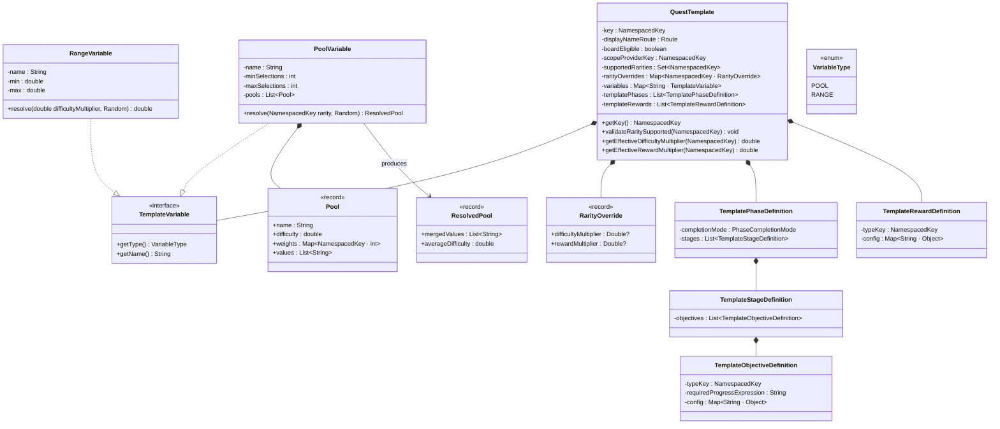
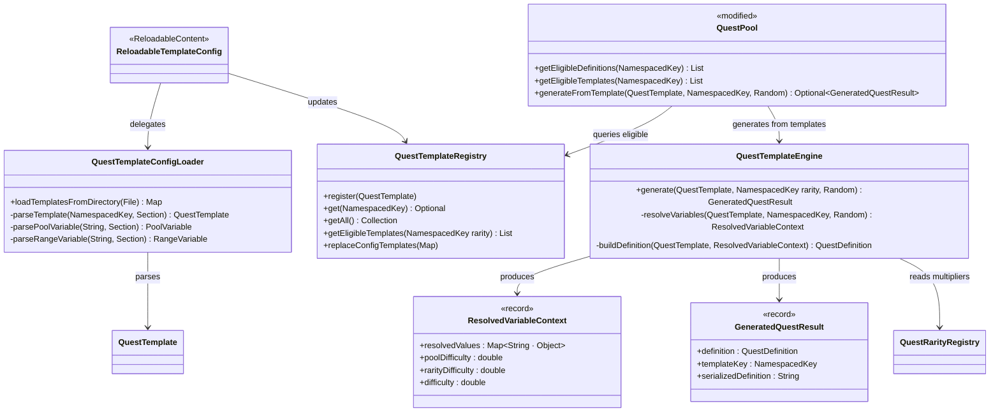
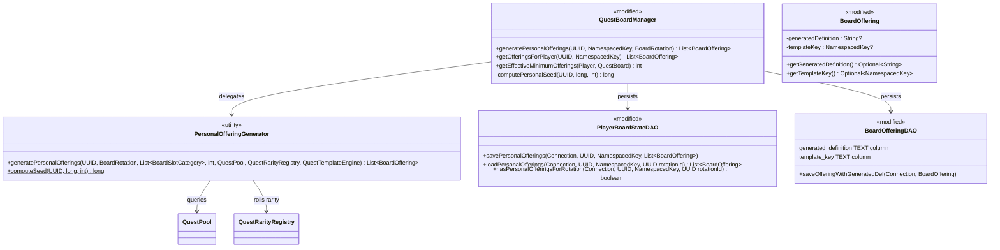

# Phase 2 LLD: Per-Player Slots and Quest Templates

> **HLD Reference:** [docs/hld/quest-board.md](../../hld/quest-board.md)
> **Phase 1 LLD:** [phase-1-core-board-infrastructure.md](phase-1-core-board-infrastructure.md)
> **Status:** DRAFT

## Scope

Phase 2 adds two major capabilities on top of the Phase 1 board infrastructure: **per-player board offerings** with deterministic seeding and **quest templates** with procedural generation via pool-based variable resolution and difficulty scaling.

**In scope:**
- Per-player offering generation with deterministic seeding (`hash(playerUUID, rotationEpoch, slotIndex)`)
- Per-player minimum offering modifiers via permissions (`mcrpg.extra-offerings.<n>`)
- `QuestTemplate` data model with `POOL` and `RANGE` variable types
- `QuestTemplateEngine` (variable resolution, pool selection, difficulty computation, definition substitution)
- `QuestTemplateRegistry` for registering and looking up templates
- Template YAML parsing and validation (`QuestTemplateConfigLoader`), including expression syntax validation at load time
- Rarity-weighted pool selection with difficulty scalars
- `CustomBlockWrapper` / `CustomEntityWrapper` support in pool values
- Template `rarity-overrides` for per-template multiplier customization
- `BoardOffering` extension for template-generated definitions (generated definition JSON persistence)
- `QuestPool` integration with templates as an additional offering source
- Per-player board state persistence for personal offerings
- `BoardOfferingDAO` table creation with template columns (no migration -- fresh tables assumed)
- Database index strategy for all board and quest DAOs
- Programmatic template registration via `QuestTemplateContentPack` (expansion content pack)
- Template deduplication in personal offerings (no duplicate template + pool combinations within a player's personal slots per rotation)
- Ephemeral definition cleanup on quest completion/cancellation
- Personal offering expiry on rotation expiry
- Expression syntax validation at template load time
- Unit tests: template engine, deterministic seeding, difficulty propagation, pool selection, range scaling, custom type parsing, template YAML loading, deduplication, cleanup, expiry

**Out of scope (later phases):**
- Land board quests (Phase 3)
- Reward distribution (Phase 3)
- Conditional objectives in templates (Phase 4)
- Cross-referencing between templates (Phase 4)
- Weighted random objective selection from pools (Phase 4)

---

## Class Diagrams

### Diagram 1: Template Data Model



### Diagram 2: Template Engine & Generation Pipeline



### Diagram 3: Per-Player Offering Generation



---

## 1. New Classes

### 1.1 `QuestTemplate` -- Template Data Model

**Package:** `us.eunoians.mcrpg.quest.board.template`
**File:** `src/main/java/us/eunoians/mcrpg/quest/board/template/QuestTemplate.java`

The central data class representing a quest template definition. Immutable after construction. Templates are loaded from YAML files under `quest-board/templates/` and registered in `QuestTemplateRegistry`.

```java
public final class QuestTemplate {

    private final NamespacedKey key;
    private final Route displayNameRoute;
    private final boolean boardEligible;
    private final NamespacedKey scopeProviderKey;
    private final Set<NamespacedKey> supportedRarities;
    private final Map<NamespacedKey, RarityOverride> rarityOverrides;
    private final Map<String, TemplateVariable> variables;
    private final List<TemplatePhaseDefinition> phases;
    private final List<TemplateRewardDefinition> rewards;

    public QuestTemplate(@NotNull NamespacedKey key,
                         @NotNull Route displayNameRoute,
                         boolean boardEligible,
                         @NotNull NamespacedKey scopeProviderKey,
                         @NotNull Set<NamespacedKey> supportedRarities,
                         @NotNull Map<NamespacedKey, RarityOverride> rarityOverrides,
                         @NotNull Map<String, TemplateVariable> variables,
                         @NotNull List<TemplatePhaseDefinition> phases,
                         @NotNull List<TemplateRewardDefinition> rewards) { ... }

    @NotNull public NamespacedKey getKey() { return key; }
    @NotNull public Route getDisplayNameRoute() { return displayNameRoute; }
    public boolean isBoardEligible() { return boardEligible; }
    @NotNull public NamespacedKey getScopeProviderKey() { return scopeProviderKey; }
    @NotNull public Set<NamespacedKey> getSupportedRarities() { return supportedRarities; }
    @NotNull public Map<NamespacedKey, RarityOverride> getRarityOverrides() { return rarityOverrides; }
    @NotNull public Map<String, TemplateVariable> getVariables() { return variables; }
    @NotNull public List<TemplatePhaseDefinition> getPhases() { return phases; }
    @NotNull public List<TemplateRewardDefinition> getRewards() { return rewards; }

    /**
     * Validates that this template supports the given rarity key.
     *
     * @throws IllegalArgumentException if the rarity is not in {@code supportedRarities}
     */
    public void validateRaritySupported(@NotNull NamespacedKey rarityKey) {
        if (!supportedRarities.contains(rarityKey)) {
            throw new IllegalArgumentException("Template " + key + " does not support rarity "
                    + rarityKey + ". Supported: " + supportedRarities);
        }
    }

    /**
     * Returns the effective difficulty multiplier for a rarity, checking template-level
     * overrides first and falling back to the global rarity registry value.
     * Does NOT validate that the rarity is in {@code supportedRarities} --
     * call {@link #validateRaritySupported(NamespacedKey)} first if validation is needed.
     */
    public double getEffectiveDifficultyMultiplier(@NotNull NamespacedKey rarityKey,
                                                    @NotNull QuestRarityRegistry registry) {
        RarityOverride override = rarityOverrides.get(rarityKey);
        if (override != null && override.difficultyMultiplier() != null) {
            return override.difficultyMultiplier();
        }
        return registry.get(rarityKey)
                .map(QuestRarity::getDifficultyMultiplier)
                .orElse(1.0);
    }

    /**
     * Returns the effective reward multiplier for a rarity, checking template-level
     * overrides first and falling back to the global rarity registry value.
     * Does NOT validate that the rarity is in {@code supportedRarities} --
     * call {@link #validateRaritySupported(NamespacedKey)} first if validation is needed.
     */
    public double getEffectiveRewardMultiplier(@NotNull NamespacedKey rarityKey,
                                                @NotNull QuestRarityRegistry registry) {
        RarityOverride override = rarityOverrides.get(rarityKey);
        if (override != null && override.rewardMultiplier() != null) {
            return override.rewardMultiplier();
        }
        return registry.get(rarityKey)
                .map(QuestRarity::getRewardMultiplier)
                .orElse(1.0);
    }
}
```

### 1.2 `RarityOverride` -- Per-Template Rarity Customization

**Package:** `us.eunoians.mcrpg.quest.board.template`
**File:** `src/main/java/us/eunoians/mcrpg/quest/board/template/RarityOverride.java`

```java
public record RarityOverride(
    @Nullable Double difficultyMultiplier,
    @Nullable Double rewardMultiplier
) {}
```

### 1.3 `TemplateVariable` -- Variable Interface

**Package:** `us.eunoians.mcrpg.quest.board.template.variable`
**File:** `src/main/java/us/eunoians/mcrpg/quest/board/template/variable/TemplateVariable.java`

```java
public interface TemplateVariable {

    enum VariableType { POOL, RANGE }

    @NotNull VariableType getType();
    @NotNull String getName();
}
```

### 1.4 `PoolVariable` -- Pool-Based Variable

**Package:** `us.eunoians.mcrpg.quest.board.template.variable`
**File:** `src/main/java/us/eunoians/mcrpg/quest/board/template/variable/PoolVariable.java`

Selects one or more pools by weighted random (per rarity), merges values, and computes an average difficulty scalar.

```java
public final class PoolVariable implements TemplateVariable {

    private final String name;
    private final int minSelections;
    private final int maxSelections;
    private final List<Pool> pools;

    public PoolVariable(@NotNull String name,
                        int minSelections,
                        int maxSelections,
                        @NotNull List<Pool> pools) {
        if (minSelections < 1) throw new IllegalArgumentException("minSelections must be >= 1");
        if (maxSelections < minSelections) throw new IllegalArgumentException("maxSelections must be >= minSelections");
        this.name = name;
        this.minSelections = minSelections;
        this.maxSelections = maxSelections;
        this.pools = List.copyOf(pools);
    }

    @Override @NotNull public VariableType getType() { return VariableType.POOL; }
    @Override @NotNull public String getName() { return name; }

    public int getMinSelections() { return minSelections; }
    public int getMaxSelections() { return maxSelections; }
    @NotNull public List<Pool> getPools() { return pools; }

    /**
     * Resolves this pool variable for a given rarity by performing weighted random
     * selection of pools and merging their values.
     *
     * @param rarityKey the rarity to use for weight lookup
     * @param random    the random source
     * @return the resolved pool result (merged values + average difficulty)
     */
    @NotNull
    public ResolvedPool resolve(@NotNull NamespacedKey rarityKey, @NotNull Random random) {
        // 1. Filter pools that have non-zero weight for this rarity
        // 2. Determine actual selection count: random(minSelections, maxSelections)
        // 3. Select pools by weighted random without replacement
        // 4. Merge all selected pool values into a flat list
        // 5. Compute average difficulty across selected pools
        // 6. Return ResolvedPool
    }
}
```

### 1.5 `Pool` -- Single Pool Within a Pool Variable

**Package:** `us.eunoians.mcrpg.quest.board.template.variable`
**File:** `src/main/java/us/eunoians/mcrpg/quest/board/template/variable/Pool.java`

```java
public record Pool(
    @NotNull String name,
    double difficulty,
    @NotNull Map<NamespacedKey, Integer> weights,
    @NotNull List<String> values
) {
    /**
     * Returns the weight for a specific rarity, defaulting to 0 if not present.
     */
    public int getWeightForRarity(@NotNull NamespacedKey rarityKey) {
        return weights.getOrDefault(rarityKey, 0);
    }
}
```

### 1.6 `ResolvedPool` -- Pool Resolution Result

**Package:** `us.eunoians.mcrpg.quest.board.template.variable`
**File:** `src/main/java/us/eunoians/mcrpg/quest/board/template/variable/ResolvedPool.java`

The result of resolving a `PoolVariable`. When a `PoolVariable` selects one or more pools during resolution, each selected pool contributes its `values` list. The `mergedValues` field is the **flat concatenation** of all selected pools' value lists. For example, if the engine selects pool `"ores"` (values: `[IRON_ORE, COPPER_ORE, COAL_ORE]`) and pool `"precious"` (values: `[DIAMOND_ORE, EMERALD_ORE]`), then `mergedValues` = `[IRON_ORE, COPPER_ORE, COAL_ORE, DIAMOND_ORE, EMERALD_ORE]`. This merged list is the value that gets substituted into objective config maps (e.g., the `blocks` key for a `block_break` objective). The `averageDifficulty` is the arithmetic mean of the `difficulty` scalars from all selected pools.

```java
public record ResolvedPool(
    /**
     * The flat concatenation of all values from every pool selected during resolution.
     * This list is substituted directly into objective/reward config maps wherever
     * the pool variable name is referenced.
     */
    @NotNull List<String> mergedValues,
    /**
     * The arithmetic mean of the difficulty scalars of all selected pools.
     * Feeds into the combined difficulty calculation for RANGE variable scaling.
     */
    double averageDifficulty
) {}
```

### 1.7 `RangeVariable` -- Numeric Range Variable

**Package:** `us.eunoians.mcrpg.quest.board.template.variable`
**File:** `src/main/java/us/eunoians/mcrpg/quest/board/template/variable/RangeVariable.java`

Resolves to a random number within `[min, max]`, then scaled by difficulty.

```java
public final class RangeVariable implements TemplateVariable {

    private final String name;
    private final double min;
    private final double max;

    public RangeVariable(@NotNull String name, double min, double max) {
        if (min <= 0) throw new IllegalArgumentException("min must be > 0, got " + min);
        if (max <= 0) throw new IllegalArgumentException("max must be > 0, got " + max);
        if (min > max) throw new IllegalArgumentException("min must be <= max");
        this.name = name;
        this.min = min;
        this.max = max;
    }

    @Override @NotNull public VariableType getType() { return VariableType.RANGE; }
    @Override @NotNull public String getName() { return name; }

    public double getMin() { return min; }
    public double getMax() { return max; }

    /**
     * Resolves this range variable.
     * Final value: random(min, max) * poolDifficulty * rarityDifficultyMultiplier.
     * The two multipliers are combined into {@code difficultyMultiplier} by the caller.
     *
     * @param difficultyMultiplier the combined pool * rarity difficulty multiplier
     * @param random               the random source
     * @return the resolved numeric value (rounded to long for progress, kept as double for reward expressions)
     */
    public double resolve(double difficultyMultiplier, @NotNull Random random) {
        double base = min + (max - min) * random.nextDouble();
        return base * difficultyMultiplier;
    }
}
```

### 1.8 `TemplatePhaseDefinition` / `TemplateStageDefinition` / `TemplateObjectiveDefinition`

**Package:** `us.eunoians.mcrpg.quest.board.template`

These are lightweight intermediate structures that hold the template's quest structure before variable substitution. They differ from `QuestPhaseDefinition`, `QuestStageDefinition`, and `QuestObjectiveDefinition` because they contain unresolved variable references (strings like `"block_count"` and `target_blocks`) rather than concrete values.

```java
public record TemplatePhaseDefinition(
    @NotNull PhaseCompletionMode completionMode,
    @NotNull List<TemplateStageDefinition> stages
) {}

public record TemplateStageDefinition(
    @NotNull List<TemplateObjectiveDefinition> objectives
) {}

public record TemplateObjectiveDefinition(
    @NotNull NamespacedKey typeKey,
    @NotNull String requiredProgressExpression,
    @NotNull Map<String, Object> config
) {}
```

The `config` map holds raw configuration that may contain variable references. For example, `blocks: target_blocks` means "substitute the resolved value of the `target_blocks` pool variable here". The `QuestTemplateEngine` performs this substitution when building the concrete `QuestDefinition`.

### 1.9 `TemplateRewardDefinition`

**Package:** `us.eunoians.mcrpg.quest.board.template`

```java
public record TemplateRewardDefinition(
    @NotNull NamespacedKey typeKey,
    @NotNull Map<String, Object> config
) {}
```

Reward config values may contain expression strings referencing template variables (e.g., `"block_count * 5 * difficulty"`). These are resolved via the existing `Parser` system at generation time.

### 1.10 `QuestTemplateEngine` -- Variable Resolution and Definition Generation

**Package:** `us.eunoians.mcrpg.quest.board.template`
**File:** `src/main/java/us/eunoians/mcrpg/quest/board/template/QuestTemplateEngine.java`

The core engine that transforms a `QuestTemplate` + rolled rarity into a concrete `QuestDefinition`. Stateless -- all state is passed as arguments.

**Why JSON serialization happens here**: Template-generated definitions are procedural -- they exist only as a result of running the engine with a specific seed. Once generated, the definition must survive server restarts and template reloads. The engine serializes the fully resolved `QuestDefinition` to a JSON string (via `GeneratedDefinitionSerializer`) and bundles it into the `GeneratedQuestResult`. This JSON is stored in the `generated_definition` TEXT column of `mcrpg_board_offering` and serves as the canonical snapshot of the generated quest. When the offering is later loaded from the database (e.g., after restart), the JSON is deserialized back into a `QuestDefinition` without re-running the engine. This avoids seed drift if templates or pool data have changed since the offering was originally generated.

```java
public final class QuestTemplateEngine {

    private final QuestRarityRegistry rarityRegistry;
    private final QuestObjectiveTypeRegistry objectiveTypeRegistry;
    private final QuestRewardTypeRegistry rewardTypeRegistry;

    public QuestTemplateEngine(@NotNull QuestRarityRegistry rarityRegistry,
                               @NotNull QuestObjectiveTypeRegistry objectiveTypeRegistry,
                               @NotNull QuestRewardTypeRegistry rewardTypeRegistry) { ... }

    /**
     * Generates a concrete quest definition from a template and a rolled rarity.
     *
     * The result includes the materialized {@link QuestDefinition}, the originating
     * template key, and a JSON-serialized snapshot of the definition. The JSON
     * snapshot is what gets persisted to the database so the definition can be
     * reconstructed on load without re-running the template engine.
     *
     * @param template  the template to generate from
     * @param rarityKey the rolled rarity (from global weights)
     * @param random    the random source (seeded for deterministic generation)
     * @return the generated result containing the definition, template key, and serialized JSON
     * @throws IllegalArgumentException if the template does not support the rolled rarity
     */
    @NotNull
    public GeneratedQuestResult generate(@NotNull QuestTemplate template,
                                          @NotNull NamespacedKey rarityKey,
                                          @NotNull Random random) {
        // 1. Validate rarity via template.validateRaritySupported(rarityKey)
        // 2. Resolve effective difficulty/reward multipliers (template overrides or global)
        // 3. Resolve all variables -> ResolvedVariableContext
        // 4. Build QuestDefinition from template structure + resolved variables
        // 5. Serialize the generated definition to JSON via GeneratedDefinitionSerializer
        // 6. Return GeneratedQuestResult
    }

    /**
     * Resolves all template variables into concrete values.
     */
    @NotNull
    ResolvedVariableContext resolveVariables(@NotNull QuestTemplate template,
                                             @NotNull NamespacedKey rarityKey,
                                             @NotNull Random random) {
        Map<String, Object> resolvedValues = new LinkedHashMap<>();
        double totalPoolDifficulty = 0.0;
        int poolCount = 0;

        // First pass: resolve POOL variables to get pool difficulty
        for (TemplateVariable variable : template.getVariables().values()) {
            if (variable instanceof PoolVariable pool) {
                ResolvedPool resolved = pool.resolve(rarityKey, random);
                resolvedValues.put(pool.getName(), resolved.mergedValues());
                totalPoolDifficulty += resolved.averageDifficulty();
                poolCount++;
            }
        }

        double poolDifficulty = poolCount > 0 ? totalPoolDifficulty / poolCount : 1.0;
        double rarityDifficulty = template.getEffectiveDifficultyMultiplier(rarityKey, rarityRegistry);
        double difficulty = poolDifficulty * rarityDifficulty;

        // Second pass: resolve RANGE variables using the computed difficulty
        for (TemplateVariable variable : template.getVariables().values()) {
            if (variable instanceof RangeVariable range) {
                double resolved = range.resolve(difficulty, random);
                resolvedValues.put(range.getName(), (long) Math.round(resolved));
            }
        }

        // Inject the built-in "difficulty" variable
        resolvedValues.put("difficulty", difficulty);

        return new ResolvedVariableContext(
            Map.copyOf(resolvedValues), poolDifficulty, rarityDifficulty, difficulty);
    }

    /**
     * Builds a concrete QuestDefinition from the template structure and resolved variable context.
     */
    @NotNull
    QuestDefinition buildDefinition(@NotNull QuestTemplate template,
                                     @NotNull NamespacedKey rarityKey,
                                     @NotNull ResolvedVariableContext context) {
        // Generate a unique quest key: template key + random suffix
        // Build phases -> stages -> objectives, substituting variable references
        // Build rewards with expression evaluation using Parser
        // Return a fully materialized QuestDefinition
    }
}
```

**Variable substitution in config maps**: When the engine encounters a config value that is a `String` matching a variable name (e.g., `"target_blocks"`), it replaces it with the resolved value (a `List<String>` for pool variables). When the config value is an expression string containing variable names (e.g., `"block_count * 5 * difficulty"`), the engine evaluates it through `Parser` with all resolved variables in scope.

**Quest key generation**: The generated definition receives a synthetic `NamespacedKey` of the form `mcrpg:gen_<template_key_suffix>_<8_char_hex>` (e.g., `mcrpg:gen_daily_mining_a1b2c3d4`). The hex suffix comes from the deterministic seed so the same player sees the same quest key for the same offering slot across board opens within one rotation.

### 1.11 `ResolvedVariableContext` -- Variable Resolution Snapshot

**Package:** `us.eunoians.mcrpg.quest.board.template`

```java
public record ResolvedVariableContext(
    @NotNull Map<String, Object> resolvedValues,
    double poolDifficulty,
    double rarityDifficulty,
    double difficulty
) {}
```

### 1.12 `GeneratedQuestResult` -- Template Generation Output

**Package:** `us.eunoians.mcrpg.quest.board.template`

```java
public record GeneratedQuestResult(
    /** The fully materialized definition, ready for QuestManager.startQuest(). */
    @NotNull QuestDefinition definition,
    /** Which template produced this definition (for traceability and display). */
    @NotNull NamespacedKey templateKey,
    /**
     * JSON snapshot of the definition. Persisted in the {@code generated_definition}
     * column of {@code mcrpg_board_offering} so the definition can be deserialized
     * on future board loads without re-running the template engine.
     * Produced by {@link GeneratedDefinitionSerializer#serialize}.
     */
    @NotNull String serializedDefinition
) {}
```

**Why JSON?** Template-generated definitions are procedural artifacts -- they don't exist in YAML files and cannot be looked up in `QuestDefinitionRegistry` by key the way hand-crafted quests can. When a template-generated offering is persisted to the database, the engine has already been run and the `Random` seed consumed. If the server restarts or the board config is reloaded, the template or its pool data may have changed, so re-running the engine with the same seed could produce a different definition. The JSON snapshot captures the definition at the moment of generation, making the offering fully self-contained.

The JSON includes:
- The generated quest key (e.g., `mcrpg:gen_daily_mining_a1b2c3d4`)
- The originating template key and rolled rarity key
- All resolved variable values (pool selections, computed range values, combined difficulty)
- The full phase/stage/objective tree with concrete required-progress values
- Reward configs with evaluated expression amounts

When a player accepts the offering, `GeneratedDefinitionSerializer.deserialize()` reconstructs the `QuestDefinition` from this JSON and registers it as an ephemeral definition in `QuestDefinitionRegistry`. See **Section 8** for the full JSON structure.

### 1.13 `QuestTemplateRegistry`

**Package:** `us.eunoians.mcrpg.quest.board.template`
**File:** `src/main/java/us/eunoians/mcrpg/quest/board/template/QuestTemplateRegistry.java`

Follows the same dual-source pattern as `QuestRarityRegistry` and `BoardSlotCategoryRegistry`, extended with support for **expansion template directories**. Third-party expansions can register additional directories that are scanned during reload alongside the primary `quest-board/templates/` directory.

```java
public class QuestTemplateRegistry implements Registry<QuestTemplate> {

    private final Map<NamespacedKey, QuestTemplate> templates = new LinkedHashMap<>();
    private final Set<NamespacedKey> configLoadedKeys = new HashSet<>();
    private final List<File> expansionDirectories = new ArrayList<>();

    public void register(@NotNull QuestTemplate template) { ... }
    public Optional<QuestTemplate> get(@NotNull NamespacedKey key) { ... }
    public Collection<QuestTemplate> getAll() { ... }

    /**
     * Returns templates that are board-eligible and support the given rarity.
     */
    @NotNull
    public List<QuestTemplate> getEligibleTemplates(@NotNull NamespacedKey rarityKey) {
        return templates.values().stream()
            .filter(QuestTemplate::isBoardEligible)
            .filter(t -> t.getSupportedRarities().contains(rarityKey))
            .toList();
    }

    /**
     * Registers an additional directory to scan for template YAML files.
     * Intended for use by expansion packs that ship their own templates.
     * Directories are scanned on initial load and on every reload.
     *
     * <p>Example usage from an expansion:
     * <pre>
     * QuestTemplateRegistry registry = mcRPG.registryAccess()
     *         .registry(McRPGRegistryKey.QUEST_TEMPLATE);
     * File myTemplatesDir = new File(myPlugin.getDataFolder(), "quest-templates");
     * registry.registerTemplateDirectory(myTemplatesDir);
     * </pre>
     *
     * @param directory the directory containing template YAML files
     */
    public void registerTemplateDirectory(@NotNull File directory) {
        if (!expansionDirectories.contains(directory)) {
            expansionDirectories.add(directory);
        }
    }

    /**
     * Returns all registered expansion template directories.
     */
    @NotNull
    public List<File> getExpansionDirectories() {
        return List.copyOf(expansionDirectories);
    }

    /**
     * Replaces config-loaded templates (from primary + expansion directories).
     * Programmatically registered templates (via {@link #register}) are untouched.
     */
    public void replaceConfigTemplates(@NotNull Map<NamespacedKey, QuestTemplate> freshConfig) {
        configLoadedKeys.forEach(templates::remove);
        configLoadedKeys.clear();
        freshConfig.forEach((key, template) -> {
            templates.put(key, template);
            configLoadedKeys.add(key);
        });
    }

    public void clear() { templates.clear(); configLoadedKeys.clear(); }
}
```

**Registry key:** Add `QUEST_TEMPLATE` to `McRPGRegistryKey`.

### 1.14 `QuestTemplateConfigLoader` -- Template YAML Parsing

**Package:** `us.eunoians.mcrpg.configuration`
**File:** `src/main/java/us/eunoians/mcrpg/configuration/QuestTemplateConfigLoader.java`

Recursively scans one or more directories for `.yml`/`.yaml` files. Each file can contain one or more templates under a top-level `quest-templates` key. Follows the same directory-scanning pattern as `QuestConfigLoader` and `BoardCategoryConfigLoader`.

The loader supports multiple directories so that expansions can ship their own template YAML files. The primary directory (`quest-board/templates/`) is always scanned; additional directories are registered via `QuestTemplateRegistry.registerTemplateDirectory()`.

```java
public final class QuestTemplateConfigLoader {

    /**
     * Loads templates from a single directory (recursively scanning for .yml/.yaml).
     */
    @NotNull
    public Map<NamespacedKey, QuestTemplate> loadTemplatesFromDirectory(@NotNull File templatesDirectory) {
        // Walk directory, parse .yml/.yaml files
        // Each top-level key under quest-templates = one template
        // Auto-namespace: "daily-mining" -> mcrpg:daily_mining (hyphens to underscores)
    }

    /**
     * Loads templates from all provided directories, merging the results.
     * Duplicate keys across directories cause a warning log; the last-loaded wins.
     */
    @NotNull
    public Map<NamespacedKey, QuestTemplate> loadTemplatesFromDirectories(@NotNull List<File> directories) {
        Map<NamespacedKey, QuestTemplate> merged = new LinkedHashMap<>();
        for (File dir : directories) {
            if (!dir.isDirectory()) continue;
            merged.putAll(loadTemplatesFromDirectory(dir));
        }
        return merged;
    }

    @NotNull
    private QuestTemplate parseTemplate(@NotNull NamespacedKey key,
                                         @NotNull Section section) {
        // Parse display-name-route (as Route), board-eligible, scope, supported-rarities
        // Parse rarity-overrides
        // Parse variables (POOL and RANGE types)
        // Parse phases -> stages -> objectives (with variable references)
        //   completionMode parsed as PhaseCompletionMode enum
        // Parse rewards (with expression strings)
        // Validate: all variable references in objectives/rewards exist in the variables map
    }

    @NotNull
    private PoolVariable parsePoolVariable(@NotNull String name, @NotNull Section section) {
        // Parse min-selections, max-selections
        // Parse pools: name, difficulty, per-rarity weights, values
    }

    @NotNull
    private RangeVariable parseRangeVariable(@NotNull String name, @NotNull Section section) {
        // Parse base.min, base.max
        // Validate both min > 0 and max > 0
    }
}
```

**Variable name validation**: The loader validates that all variable references used in `required-progress` expressions, objective `config` maps, and reward `config` maps correspond to declared variables. Undeclared references produce a clear validation error with the template key, the field path, and the unresolved variable name.

**Expression syntax validation**: In addition to variable reference checking, the loader performs a syntax check on all expression strings (`required-progress` and reward `amount` expressions) at load time. It creates a trial `Parser` instance with dummy variable values (all declared variables mapped to `1.0`) and attempts to parse the expression. If the `Parser` throws a syntax error, the template is rejected with a clear error message including the template key, field path, and the original parse error. This catches typos like `"block_count * 5 * "` (trailing operator) or `"block_count * 5 * difculty"` (undeclared variable that could be a typo of `difficulty`) before the template is ever used at generation time.

**YAML key naming convention**: Variable names in YAML use underscores (`target_blocks`, `block_count`) because the `Parser` treats `-` as subtraction. All other YAML keys use hyphens (`min-selections`, `required-progress`) per normal convention.

### 1.15 `PersonalOfferingGenerator` -- Per-Player Generation Logic

**Package:** `us.eunoians.mcrpg.quest.board.generation`
**File:** `src/main/java/us/eunoians/mcrpg/quest/board/generation/PersonalOfferingGenerator.java`

Stateless utility for generating per-player offerings. Deterministic seeding ensures the same player sees the same offerings within a rotation period.

```java
public final class PersonalOfferingGenerator {

    private PersonalOfferingGenerator() {}

    /**
     * Generates personal offerings for a player for a given rotation.
     *
     * @param playerUUID     the player's UUID
     * @param rotation       the current rotation
     * @param categories     PERSONAL categories filtered by refresh type and permission
     * @param minOfferings   the effective minimum total personal offerings for this player
     * @param questPool      the quest pool (hand-crafted + templates)
     * @param rarityRegistry the rarity registry
     * @param templateEngine the template engine for generating from templates
     * @return the list of generated personal offerings
     */
    @NotNull
    public static List<BoardOffering> generatePersonalOfferings(
            @NotNull UUID playerUUID,
            @NotNull BoardRotation rotation,
            @NotNull List<BoardSlotCategory> categories,
            int minOfferings,
            @NotNull QuestPool questPool,
            @NotNull QuestRarityRegistry rarityRegistry,
            @NotNull QuestTemplateEngine templateEngine) {

        List<BoardOffering> offerings = new ArrayList<>();
        int slotIndex = 0;

        for (BoardSlotCategory category : categories) {
            int count = SlotGenerationLogic.computeSlotCountForCategory(
                    category, new Random(computeSeed(playerUUID, rotation.getRotationEpoch(), slotIndex)));

            for (int i = 0; i < count; i++) {
                long seed = computeSeed(playerUUID, rotation.getRotationEpoch(), slotIndex);
                Random slotRandom = new Random(seed);

                QuestRarity rarity = rarityRegistry.rollRarity(slotRandom);

                // Try hand-crafted definitions first, then templates
                Optional<BoardOffering> offering = tryHandcraftedOffering(
                        slotRandom, rotation, category, slotIndex, rarity, questPool);

                if (offering.isEmpty()) {
                    offering = tryTemplateOffering(
                            slotRandom, rotation, category, slotIndex, rarity, questPool, templateEngine);
                }

                // Deduplication: skip if this template + resolved pool combination
                // already appears in the offerings list for this player/rotation
                if (offering.isPresent() && isDuplicateTemplateOffering(offering.get(), offerings)) {
                    offering = Optional.empty();
                }

                offering.ifPresent(offerings::add);
                slotIndex++;
            }
        }

        return offerings;
    }

    /**
     * Checks whether a candidate offering duplicates an existing template offering
     * in the list. Two template offerings are considered duplicates if they share
     * the same template key AND the same quest definition key (which encodes the
     * resolved pool selection via the deterministic seed hex suffix).
     * Hand-crafted offerings are never considered duplicates of each other.
     */
    private static boolean isDuplicateTemplateOffering(@NotNull BoardOffering candidate,
                                                        @NotNull List<BoardOffering> existing) {
        if (!candidate.isTemplateGenerated()) return false;
        NamespacedKey candidateTemplate = candidate.getTemplateKey().orElse(null);
        NamespacedKey candidateDefKey = candidate.getQuestDefinitionKey();
        return existing.stream()
                .filter(BoardOffering::isTemplateGenerated)
                .anyMatch(o -> Objects.equals(o.getTemplateKey().orElse(null), candidateTemplate)
                        && Objects.equals(o.getQuestDefinitionKey(), candidateDefKey));
    }

    /**
     * Computes a deterministic seed for per-player offering generation.
     * Same inputs always produce the same seed, ensuring a player sees the
     * same offerings if they reopen the board within the same rotation.
     */
    public static long computeSeed(@NotNull UUID playerUUID, long rotationEpoch, int slotIndex) {
        long uuidHash = playerUUID.getMostSignificantBits() ^ playerUUID.getLeastSignificantBits();
        return uuidHash * 31 + rotationEpoch * 17 + slotIndex;
    }
}
```

### 1.16 `ReloadableTemplateConfig`

**Package:** `us.eunoians.mcrpg.quest.board.configuration`
**File:** `src/main/java/us/eunoians/mcrpg/quest/board/configuration/ReloadableTemplateConfig.java`

Follows the same pattern as `ReloadableRarityConfig` and `ReloadableCategoryConfig`. On reload, it scans the primary templates directory **plus** all expansion-registered directories via `QuestTemplateConfigLoader.loadTemplatesFromDirectories()`.

```java
public class ReloadableTemplateConfig extends ReloadableContent<Map<NamespacedKey, QuestTemplate>> {

    public ReloadableTemplateConfig(@NotNull YamlDocument boardConfig,
                                    @NotNull QuestTemplateRegistry registry,
                                    @NotNull File primaryTemplatesDirectory) {
        super(boardConfig, BoardConfigFile.MINIMUM_TOTAL_OFFERINGS, (doc, route) -> {
            QuestTemplateConfigLoader loader = new QuestTemplateConfigLoader();

            List<File> allDirectories = new ArrayList<>();
            allDirectories.add(primaryTemplatesDirectory);
            allDirectories.addAll(registry.getExpansionDirectories());

            Map<NamespacedKey, QuestTemplate> map = loader.loadTemplatesFromDirectories(allDirectories);
            registry.replaceConfigTemplates(map);
            return map;
        });
    }
}
```

### 1.17 `QuestTemplateContentPack` -- Programmatic Template Registration

**Package:** `us.eunoians.mcrpg.expansion.content`
**File:** `src/main/java/us/eunoians/mcrpg/expansion/content/QuestTemplateContentPack.java`

Allows expansion packs to register `QuestTemplate` objects programmatically via the content expansion system, for templates that are easier to define in code (e.g., templates whose structure depends on runtime state or data from another plugin API).

```java
public class QuestTemplateContentPack extends McRPGContentPack<QuestTemplate> {

    public QuestTemplateContentPack(@NotNull ContentExpansion expansion) {
        super(expansion);
    }
}
```

**`ContentHandlerType.QUEST_TEMPLATE`:**

```java
QUEST_TEMPLATE((mcRPG, mcRPGContent) -> {
    if (mcRPGContent instanceof QuestTemplateContentPack templateContent) {
        templateContent.getContent().forEach(template ->
                mcRPG.registryAccess().registry(McRPGRegistryKey.QUEST_TEMPLATE).register(template));
        return true;
    }
    return false;
}),
```

Templates registered via this content pack use the `register()` path on `QuestTemplateRegistry`, which marks them as expansion-registered (not config-loaded). They survive reloads -- only config-loaded templates are replaced during `replaceConfigTemplates()`.

**Usage from an expansion:**

```java
public class MyExpansion extends ContentExpansion {
    @Override
    public Set<McRPGContentPack<? extends McRPGContent>> getExpansionContent() {
        QuestTemplateContentPack templates = new QuestTemplateContentPack(this);
        templates.addContent(buildMyCustomTemplate());

        // Also register a YAML directory for file-based templates
        QuestTemplateRegistry registry = McRPG.getInstance().registryAccess()
                .registry(McRPGRegistryKey.QUEST_TEMPLATE);
        registry.registerTemplateDirectory(new File(myPlugin.getDataFolder(), "quest-templates"));

        return Set.of(templates);
    }
}
```

Both approaches (programmatic via content pack + YAML via directory registration) can be used together. Programmatic templates and YAML templates share the same registry; duplicate keys follow the "last registered wins" behavior with a warning log.

---

## 2. Modifications to Existing Classes

### 2.1 `BoardOffering` -- Template Support

Add nullable fields for template-generated offerings:

```java
private final NamespacedKey templateKey;        // nullable -- which template generated this offering
private final String generatedDefinition;       // nullable -- serialized JSON of the generated definition

// New constructor for template-generated offerings
public BoardOffering(@NotNull UUID offeringId,
                     @NotNull UUID rotationId,
                     @NotNull NamespacedKey categoryKey,
                     int slotIndex,
                     @NotNull NamespacedKey questDefinitionKey,
                     @NotNull NamespacedKey rarityKey,
                     @Nullable String scopeTargetId,
                     @NotNull Duration completionTime,
                     @Nullable NamespacedKey templateKey,
                     @Nullable String generatedDefinition) { ... }

// Full reconstruction constructor adds templateKey and generatedDefinition parameters

@NotNull public Optional<NamespacedKey> getTemplateKey() { return Optional.ofNullable(templateKey); }
@NotNull public Optional<String> getGeneratedDefinition() { return Optional.ofNullable(generatedDefinition); }

/** Returns true if this offering was generated from a template rather than a hand-crafted definition. */
public boolean isTemplateGenerated() { return templateKey != null; }
```

Hand-crafted offerings pass `null` for both `templateKey` and `generatedDefinition`.

### 2.2 `QuestPool` -- Template Integration

Extend to query both the `QuestDefinitionRegistry` and the `QuestTemplateRegistry`:

```java
public class QuestPool {

    private final QuestDefinitionRegistry definitionRegistry;
    private final QuestTemplateRegistry templateRegistry;     // NEW
    private final QuestTemplateEngine templateEngine;          // NEW

    public QuestPool(@NotNull QuestDefinitionRegistry definitionRegistry,
                     @NotNull QuestTemplateRegistry templateRegistry,
                     @NotNull QuestTemplateEngine templateEngine) { ... }

    // Existing methods unchanged

    /**
     * Gets templates eligible for a specific rolled rarity.
     */
    @NotNull
    public List<QuestTemplate> getEligibleTemplates(@NotNull NamespacedKey rolledRarity) {
        return templateRegistry.getEligibleTemplates(rolledRarity);
    }

    /**
     * Attempts to generate a quest from a randomly selected eligible template.
     *
     * @param rolledRarity the rolled rarity
     * @param random       the random source
     * @return the generated result, or empty if no eligible templates or generation failed
     */
    @NotNull
    public Optional<GeneratedQuestResult> generateFromTemplate(
            @NotNull NamespacedKey rolledRarity,
            @NotNull Random random) {
        List<QuestTemplate> eligible = getEligibleTemplates(rolledRarity);
        if (eligible.isEmpty()) return Optional.empty();

        QuestTemplate selected = eligible.get(random.nextInt(eligible.size()));
        try {
            return Optional.of(templateEngine.generate(selected, rolledRarity, random));
        } catch (Exception e) {
            // Log and return empty -- a single template failure shouldn't break the board
            return Optional.empty();
        }
    }
}
```

### 2.3 `QuestBoardManager` -- Per-Player Offerings and Template Engine

**New fields:**
```java
private static final String EXTRA_OFFERINGS_PERMISSION_PREFIX = "mcrpg.extra-offerings.";
private QuestTemplateEngine templateEngine;
private ReloadableTemplateConfig templateConfig;
```

**Modified `initialize()` -- add template registry setup:**
```java
// After category config setup:

// Set up template registry via reloadable config
QuestTemplateRegistry templateRegistry = plugin.registryAccess()
        .registry(McRPGRegistryKey.QUEST_TEMPLATE);
File primaryTemplatesDir = new File(plugin.getDataFolder(), "quest-board/templates");
this.templateEngine = new QuestTemplateEngine(rarityRegistry, objectiveTypeRegistry, rewardTypeRegistry);
this.templateConfig = new ReloadableTemplateConfig(boardConfig, templateRegistry, primaryTemplatesDir);
this.templateConfig.getContent(); // initial load scans primary + any expansion directories

// Update QuestPool constructor to pass template registry and engine
this.questPool = new QuestPool(definitionRegistry, templateRegistry, templateEngine);
```

**New methods:**

```java
/**
 * Generates personal offerings for a player, using deterministic seeding.
 * Offerings are lazily generated on first board open per rotation period and
 * persisted to the database.
 *
 * @param playerUUID the player's UUID
 * @param boardKey   the board key
 * @param rotation   the current rotation
 * @return the list of personal offerings
 */
@NotNull
public List<BoardOffering> generatePersonalOfferings(
        @NotNull UUID playerUUID,
        @NotNull NamespacedKey boardKey,
        @NotNull BoardRotation rotation) {
    BoardSlotCategoryRegistry categoryRegistry = plugin().registryAccess()
            .registry(McRPGRegistryKey.BOARD_SLOT_CATEGORY);
    QuestRarityRegistry rarityRegistry = plugin().registryAccess()
            .registry(McRPGRegistryKey.QUEST_RARITY);

    List<BoardSlotCategory> personalCategories = categoryRegistry
            .getByVisibility(BoardSlotCategory.Visibility.PERSONAL)
            .stream()
            .filter(c -> c.getRefreshTypeKey().equals(rotation.getRefreshTypeKey()))
            .sorted((a, b) -> Integer.compare(b.getPriority(), a.getPriority()))
            .toList();

    int minOfferings = 0; // personal minimum is additive from permissions
    return PersonalOfferingGenerator.generatePersonalOfferings(
            playerUUID, rotation, personalCategories, minOfferings,
            questPool, rarityRegistry, templateEngine);
}

/**
 * Gets all offerings for a player: shared (cached) + personal (lazily generated and persisted).
 *
 * @param playerUUID the player's UUID
 * @param boardKey   the board key
 * @return combined list of shared and personal offerings
 */
@NotNull
public List<BoardOffering> getOfferingsForPlayer(@NotNull UUID playerUUID,
                                                   @NotNull NamespacedKey boardKey) {
    List<BoardOffering> all = new ArrayList<>(getSharedOfferingsForBoard(boardKey));

    QuestBoard board = boards.get(boardKey);
    if (board == null) return all;

    // Load or generate personal offerings for each active rotation
    board.getCurrentDailyRotation().ifPresent(rotation ->
            all.addAll(getOrGeneratePersonalOfferings(playerUUID, boardKey, rotation)));
    board.getCurrentWeeklyRotation().ifPresent(rotation ->
            all.addAll(getOrGeneratePersonalOfferings(playerUUID, boardKey, rotation)));

    return all;
}

/**
 * Returns the effective minimum personal offerings for a player, combining the base
 * with permission-based bonuses.
 */
public int getEffectiveMinimumOfferings(@NotNull Player player, @NotNull QuestBoard board) {
    int base = 0; // personal categories have their own min; this is for extra bonus
    Set<String> permissions = player.getEffectivePermissions().stream()
            .map(info -> info.getPermission())
            .collect(Collectors.toSet());
    return base + PermissionNumberParser.getHighestNumericSuffix(
            permissions, EXTRA_OFFERINGS_PERMISSION_PREFIX).orElse(0);
}
```

**Modified `generateSharedOfferings()`** -- now also considers templates as a source:

The generation loop in `generateSharedOfferings()` is updated so that when `QuestPool.getEligibleDefinitions()` returns no hand-crafted quests for a slot, it falls back to `QuestPool.generateFromTemplate()`. If a template-generated result is returned, the `BoardOffering` is created with the template key and serialized definition set.

### 2.4 `McRPGRegistryKey` -- Add template registry key

```java
RegistryKey<QuestTemplateRegistry> QUEST_TEMPLATE = create(QuestTemplateRegistry.class);
```

### 2.5 `McRPGBootstrap` -- Register template registry

```java
registryAccess.register(new QuestTemplateRegistry());
```

### 2.6 `QuestBoardGui` -- Show Personal Offerings

The GUI's data source changes from `getSharedOfferingsForBoard()` to `getOfferingsForPlayer()` to include personal offerings. Personal and shared offerings are displayed in the same grid -- the GUI does not visually separate them (the category metadata on each offering provides grouping info if future GUI enhancements want to add tabs).

### 2.7 `BoardConfigFile` -- No changes needed

Template configuration lives in separate files under `quest-board/templates/`, not in `board.yml`. The existing config routes are sufficient.

### 2.8 Expansion Template Directory Registration

Third-party plugins that want to ship out-of-box quest templates register their template directory during expansion initialization. The directory is scanned alongside the primary `quest-board/templates/` directory on initial load and every reload.

**Usage from an expansion:**

```java
public class MyExpansion extends ContentExpansion {

    private final JavaPlugin myPlugin;

    @Override
    public Set<McRPGContentPack<? extends McRPGContent>> getExpansionContent() {
        // Register the expansion's template directory so its YAMLs are discovered
        QuestTemplateRegistry templateRegistry = McRPG.getInstance().registryAccess()
                .registry(McRPGRegistryKey.QUEST_TEMPLATE);
        File myTemplatesDir = new File(myPlugin.getDataFolder(), "quest-templates");
        templateRegistry.registerTemplateDirectory(myTemplatesDir);

        return Set.of(/* other content packs */);
    }
}
```

**Timing constraint:** Expansion template directories must be registered **before** the first `ReloadableTemplateConfig` load. Since `ContentExpansionManager.registerContentExpansion()` is called during bootstrap (before `QuestBoardManager.initialize()`), this ordering is naturally satisfied. Directories registered after the initial load take effect on the next reload.

**Namespace isolation:** Template keys in expansion YAML files use the expansion's namespace (e.g., `myexpansion:daily_fishing`). If an expansion accidentally uses the `mcrpg:` namespace, a warning is logged but the template is still loaded.

**File structure for an expansion:**

```
my-expansion-plugin/
  quest-templates/
    daily-fishing.yml      # contains myexpansion:daily_fishing
    weekly-gathering.yml   # contains myexpansion:weekly_gathering
```

---

## 3. Database Changes

> **Assumption:** No quests or board data exist from a prior phase. All tables are created fresh -- there is no need for `ALTER TABLE` migration logic. Template columns are included directly in the `CREATE TABLE` statements.

### 3.1 `BoardOfferingDAO` -- Updated Table Definition

The `mcrpg_board_offering` table now includes `generated_definition` and `template_key` columns from creation:

```sql
CREATE TABLE mcrpg_board_offering (
    offering_id          TEXT    NOT NULL,
    rotation_id          TEXT    NOT NULL,
    category_key         TEXT    NOT NULL,
    slot_index           INTEGER NOT NULL,
    quest_definition_key TEXT,
    rarity_key           TEXT    NOT NULL,
    scope_target_id      TEXT,
    state                TEXT    NOT NULL,
    accepted_at          BIGINT,
    quest_instance_uuid  TEXT,
    completion_time_ms   BIGINT  NOT NULL,
    generated_definition TEXT,
    template_key         TEXT,
    PRIMARY KEY (offering_id)
);
```

`setOfferingParams()` and `buildOffering()` include the `generated_definition` and `template_key` columns.

### 3.2 `PlayerBoardStateDAO` -- Personal Offering Persistence

Add methods for personal offering lifecycle:

```java
/**
 * Saves personal offerings for a player/rotation combination. Uses upsert to handle
 * cases where offerings are regenerated on board reopen.
 */
@NotNull
public static List<PreparedStatement> savePersonalOfferings(
        @NotNull Connection connection,
        @NotNull UUID playerUUID,
        @NotNull NamespacedKey boardKey,
        @NotNull List<BoardOffering> offerings) { ... }

/**
 * Loads personal offerings for a player from a specific rotation.
 */
@NotNull
public static List<BoardOffering> loadPersonalOfferings(
        @NotNull Connection connection,
        @NotNull UUID playerUUID,
        @NotNull NamespacedKey boardKey,
        @NotNull UUID rotationId) { ... }

/**
 * Checks whether personal offerings have already been generated for a player/rotation.
 */
public static boolean hasPersonalOfferingsForRotation(
        @NotNull Connection connection,
        @NotNull UUID playerUUID,
        @NotNull NamespacedKey boardKey,
        @NotNull UUID rotationId) { ... }
```

Personal offerings are stored in `mcrpg_board_offering` (same table as shared offerings) and linked to the player via `mcrpg_player_board_state`. The `scope_target_id` column on `mcrpg_board_offering` stores the player UUID for personal offerings (it was nullable and unused for shared offerings).

### 3.3 New Table: `mcrpg_personal_offering_tracking`

Tracks whether personal offerings have been generated for a player/rotation to avoid regeneration on subsequent board opens:

```sql
CREATE TABLE mcrpg_personal_offering_tracking (
    player_uuid  TEXT   NOT NULL,
    board_key    TEXT   NOT NULL,
    rotation_id  TEXT   NOT NULL,
    generated_at BIGINT NOT NULL,
    PRIMARY KEY (player_uuid, board_key, rotation_id)
);
```

**DAO:** `PersonalOfferingTrackingDAO` with `attemptCreateTable`, `markGenerated`, `hasGenerated`, and `pruneForExpiredRotations` methods.

### 3.4 Index Strategy

Indexes are designed around the primary query patterns: loading offerings by rotation, looking up personal offerings by player, checking generation tracking, expiring offerings, and querying quest completion history.

#### 3.4.1 `mcrpg_board_offering` Indexes

| Index | Column(s) | Rationale |
|-------|-----------|-----------|
| `idx_offering_rotation` | `rotation_id` | `loadOfferingsForRotation()` and `expireOfferingsForRotation()` both filter by `rotation_id`. This is the highest-frequency query on this table. |
| `idx_offering_scope_target` | `scope_target_id, rotation_id` | `loadPersonalOfferings()` filters by `scope_target_id` (player UUID) and `rotation_id`. Composite index covers the full WHERE clause. |
| `idx_offering_state` | `state` | `expireOfferingsForRotation()` filters by `state = 'VISIBLE'`. Low cardinality but avoids a full table scan on bulk-update operations. |
| `idx_offering_template_key` | `template_key` | Enables efficient lookups if we need to find all offerings generated from a specific template (e.g., for debugging or analytics). |

```sql
CREATE INDEX idx_offering_rotation     ON mcrpg_board_offering (rotation_id);
CREATE INDEX idx_offering_scope_target ON mcrpg_board_offering (scope_target_id, rotation_id);
CREATE INDEX idx_offering_state        ON mcrpg_board_offering (state);
CREATE INDEX idx_offering_template_key ON mcrpg_board_offering (template_key);
```

#### 3.4.2 `mcrpg_personal_offering_tracking` Indexes

The primary key `(player_uuid, board_key, rotation_id)` already covers the `hasGenerated` query. An additional index supports `pruneForExpiredRotations`:

| Index | Column(s) | Rationale |
|-------|-----------|-----------|
| `idx_tracking_rotation` | `rotation_id` | `pruneForExpiredRotations()` deletes rows for expired rotation IDs. Without this index, pruning requires a full table scan. |

```sql
CREATE INDEX idx_tracking_rotation ON mcrpg_personal_offering_tracking (rotation_id);
```

#### 3.4.3 `mcrpg_board_rotation` Indexes

| Index | Column(s) | Rationale |
|-------|-----------|-----------|
| `idx_rotation_board_key` | `board_key` | `loadActiveRotation()` filters by `board_key`. Multiple rotations (daily, weekly) exist per board. |
| `idx_rotation_expires` | `expires_at` | Rotation expiry checks and cleanup queries filter or order by `expires_at`. |

```sql
CREATE INDEX idx_rotation_board_key ON mcrpg_board_rotation (board_key);
CREATE INDEX idx_rotation_expires   ON mcrpg_board_rotation (expires_at);
```

#### 3.4.4 `mcrpg_player_board_state` Indexes

| Index | Column(s) | Rationale |
|-------|-----------|-----------|
| `idx_pbs_player_board_state` | `player_uuid, board_key, state` | `getAcceptedOfferingCount()` filters by all three. Composite index covers the full WHERE clause. |
| `idx_pbs_offering` | `offering_id` | Join lookups from offerings to player state. |

```sql
CREATE INDEX idx_pbs_player_board_state ON mcrpg_player_board_state (player_uuid, board_key, state);
CREATE INDEX idx_pbs_offering           ON mcrpg_player_board_state (offering_id);
```

#### 3.4.5 `mcrpg_board_cooldown` Indexes

| Index | Column(s) | Rationale |
|-------|-----------|-----------|
| `idx_cooldown_scope` | `scope_type, scope_identifier` | Cooldown lookups filter by scope type and identifier (e.g., player UUID or land name). |
| `idx_cooldown_expires` | `expires_at` | Cleanup of expired cooldowns. |

```sql
CREATE INDEX idx_cooldown_scope   ON mcrpg_board_cooldown (scope_type, scope_identifier);
CREATE INDEX idx_cooldown_expires ON mcrpg_board_cooldown (expires_at);
```

#### 3.4.6 Existing Quest DAOs (recommended additions)

These indexes are for tables defined in Phase 1 / the quest system. They should be added to the respective `attemptCreateTable` methods.

| Table | Index | Column(s) | Rationale |
|-------|-------|-----------|-----------|
| `mcrpg_quest_instances` | `idx_qi_definition_key` | `definition_key` | Looking up active quests by definition key (used in deduplication, board repeat checks). |
| `mcrpg_quest_instances` | `idx_qi_state` | `state` | Filtering active vs completed quests. |
| `mcrpg_quest_stage_instances` | `idx_qsi_quest_uuid` | `quest_uuid` | `loadStagesForQuest()` filters by `quest_uuid`. FK exists but explicit index ensures it. |
| `mcrpg_quest_objective_instances` | `idx_qoi_stage_uuid` | `stage_uuid` | `loadObjectivesForStage()` filters by `stage_uuid`. FK exists but explicit index ensures it. |
| `mcrpg_quest_completion_log` | `idx_qcl_player_def` | `player_uuid, definition_key` | `getCompletionCount()` and `getLatestCompletion()` filter by both. High-frequency query for repeat-mode checks. |
| `mcrpg_quest_completion_log` | `idx_qcl_player_time` | `player_uuid, completed_at` | `getCompletionHistory()` orders by `completed_at` for a player. |
| `mcrpg_pending_rewards` | `idx_pr_player` | `player_uuid` | `loadPendingRewards()` filters by `player_uuid`. |
| `mcrpg_pending_rewards` | `idx_pr_expires` | `expires_at` | Cleanup of expired pending rewards. |

> **Note:** SQLite automatically creates indexes for foreign key columns in some configurations, but this is not guaranteed. Explicit indexes ensure consistent performance across SQLite and MySQL/MariaDB backends.

---

## 4. YAML Configuration

### 4.1 Template YAML Format

Templates live in `quest-board/templates/`. Each file can contain one or more templates.

**`quest-board/templates/daily-mining.yml`:**

```yaml
quest-templates:
  mcrpg:daily_mining:
    display-name-route: "quests.templates.daily-mining.display-name"
    board-eligible: true
    scope: mcrpg:single_player
    supported-rarities: [COMMON, UNCOMMON, RARE]

    rarity-overrides:
      RARE:
        difficulty-multiplier: 2.0
        reward-multiplier: 2.5

    variables:
      target_blocks:
        type: POOL
        min-selections: 1
        max-selections: 2
        pools:
          common-stone:
            difficulty: 1.0
            weight:
              COMMON: 80
              UNCOMMON: 20
              RARE: 0
            values: [STONE, COBBLESTONE, ANDESITE]
          ores:
            difficulty: 1.5
            weight:
              COMMON: 15
              UNCOMMON: 60
              RARE: 20
            values: [IRON_ORE, COPPER_ORE, COAL_ORE]
          precious:
            difficulty: 3.0
            weight:
              COMMON: 0
              UNCOMMON: 5
              RARE: 40
            values: [DIAMOND_ORE, EMERALD_ORE]

      block_count:
        type: RANGE
        base:
          min: 32
          max: 64

    phases:
      mine-phase:
        completion-mode: ALL
        stages:
          mine-stage:
            objectives:
              break-blocks:
                type: mcrpg:block_break
                required-progress: "block_count"
                config:
                  blocks: target_blocks

    rewards:
      xp-reward:
        type: mcrpg:experience
        skill: MINING
        amount: "block_count * 5 * difficulty"
```

### 4.2 Template YAML with Custom Block/Entity Support

**`quest-board/templates/daily-combat.yml`:**

```yaml
quest-templates:
  mcrpg:daily_combat:
    display-name-route: "quests.templates.daily-combat.display-name"
    board-eligible: true
    scope: mcrpg:single_player
    supported-rarities: [COMMON, UNCOMMON, RARE, LEGENDARY]

    variables:
      target_mobs:
        type: POOL
        min-selections: 1
        max-selections: 1
        pools:
          undead:
            difficulty: 1.0
            weight:
              COMMON: 70
              UNCOMMON: 20
              RARE: 0
              LEGENDARY: 0
            values: [ZOMBIE, SKELETON]
          hostile:
            difficulty: 1.5
            weight:
              COMMON: 25
              UNCOMMON: 50
              RARE: 20
              LEGENDARY: 0
            values: [CREEPER, WITCH]
          custom-mobs:
            difficulty: 3.0
            weight:
              COMMON: 5
              UNCOMMON: 30
              RARE: 80
              LEGENDARY: 100
            # CustomEntityWrapper identifiers for third-party mob plugins
            values: ["mythicmobs:fire_elemental", "mythicmobs:dragon_minion"]

      mob_count:
        type: RANGE
        base:
          min: 10
          max: 25

    phases:
      combat-phase:
        completion-mode: ALL
        stages:
          kill-stage:
            objectives:
              kill-mobs:
                type: mcrpg:mob_kill
                required-progress: "mob_count"
                config:
                  entities: target_mobs

    rewards:
      combat-xp:
        type: mcrpg:experience
        skill: SWORDS
        amount: "mob_count * 10 * difficulty"
```

Pool values support vanilla `Material`/`EntityType` names **and** `CustomBlockWrapper`/`CustomEntityWrapper` identifiers (colon-separated strings like `"oraxen:mythril_ore"` or `"mythicmobs:fire_elemental"`). The template engine passes these strings directly into the objective's config map. The existing `BlockBreakObjectiveType.parseConfig()` and `MobKillObjectiveType.parseConfig()` already handle `CustomBlockWrapper` / `CustomEntityWrapper` construction from string values, so no changes are needed to the objective types themselves.

---

## 5. Key Flows

### 5.1 Template Engine Generation Flow

```
QuestTemplateEngine.generate(template, rarityKey, random)
  ├─> template.validateRaritySupported(rarityKey)
  ├─> Get effective difficulty multiplier:
  │   template.rarityOverrides[rarityKey]?.difficulty ?? rarityRegistry.get(rarityKey).difficulty
  ├─> Get effective reward multiplier:
  │   template.rarityOverrides[rarityKey]?.reward ?? rarityRegistry.get(rarityKey).reward
  ├─> resolveVariables(template, rarityKey, random):
  │   ├─> For each POOL variable:
  │   │   ├─> Filter pools with non-zero weight for rarityKey
  │   │   ├─> Select min..max pools by weighted random (without replacement)
  │   │   ├─> Merge all selected pool values into flat list
  │   │   ├─> Record average pool difficulty
  │   │   └─> Store resolved list under variable name
  │   ├─> Compute poolDifficulty = average of all pool difficulties
  │   ├─> Compute difficulty = poolDifficulty * rarityDifficultyMultiplier
  │   ├─> For each RANGE variable:
  │   │   ├─> Generate random value in [min, max]
  │   │   ├─> Multiply by difficulty
  │   │   └─> Store as long under variable name
  │   └─> Inject "difficulty" into resolved values
  ├─> buildDefinition(template, rarityKey, context):
  │   ├─> Generate quest key: mcrpg:gen_<template_suffix>_<seed_hex>
  │   ├─> For each template phase:
  │   │   └─> For each template stage:
  │   │       └─> For each template objective:
  │   │           ├─> Substitute variable refs in config map:
  │   │           │   ├─> String matching a variable name → resolved value
  │   │           │   └─> Expressions → evaluate via Parser with resolved vars
  │   │           ├─> Look up objective type from registry
  │   │           ├─> Call objectiveType.parseConfig(substitutedSection)
  │   │           └─> Create QuestObjectiveDefinition with resolved required-progress
  │   ├─> For each template reward:
  │   │   ├─> Evaluate expression fields in reward config via Parser
  │   │   ├─> Apply reward multiplier to amount fields
  │   │   ├─> Look up reward type from registry
  │   │   └─> Call rewardType.parseConfig(evaluatedSection)
  │   └─> Construct QuestDefinition (with BoardMetadata from template)
  ├─> Serialize the definition to JSON via DefinitionSerializer
  └─> Return GeneratedQuestResult(definition, templateKey, serializedJSON)
```

### 5.2 Per-Player Board Open Flow

```
Player opens board GUI
  └─> QuestBoardGui constructor
      ├─> QuestBoardManager.getOfferingsForPlayer(playerUUID, boardKey)
      │   ├─> Get shared offerings (from cache, same as Phase 1)
      │   ├─> For each active rotation (daily, weekly):
      │   │   ├─> Check PersonalOfferingTrackingDAO.hasGenerated(player, rotation)
      │   │   ├─> If already generated:
      │   │   │   └─> Load from PlayerBoardStateDAO.loadPersonalOfferings()
      │   │   ├─> If not yet generated:
      │   │   │   ├─> QuestBoardManager.generatePersonalOfferings(player, board, rotation)
      │   │   │   │   ├─> Get PERSONAL categories for this refresh type
      │   │   │   │   ├─> Filter by player permissions (requiredPermission)
      │   │   │   │   ├─> For each category:
      │   │   │   │   │   ├─> Compute slot counts with deterministic seed
      │   │   │   │   │   ├─> For each slot:
      │   │   │   │   │   │   ├─> Create seeded Random(hash(playerUUID, epoch, slotIndex))
      │   │   │   │   │   │   ├─> Roll rarity
      │   │   │   │   │   │   ├─> Try hand-crafted quest from pool
      │   │   │   │   │   │   ├─> If none: try template from pool
      │   │   │   │   │   │   └─> Create BoardOffering
      │   │   │   │   │   └─> Apply personal extra offerings backfill
      │   │   │   │   └─> Return offerings list
      │   │   │   ├─> Persist offerings to BoardOfferingDAO
      │   │   │   ├─> Link to player via PlayerBoardStateDAO
      │   │   │   └─> Mark as generated in PersonalOfferingTrackingDAO
      │   │   └─> Return personal offerings
      │   └─> Combine shared + personal offerings
      ├─> Filter by permission, repeat-mode, cooldowns (same as Phase 1)
      └─> Paint offerings as BoardOfferingSlots
```

### 5.3 Accepting a Template-Generated Offering

```
Player clicks BoardOfferingSlot for a template-generated offering
  └─> QuestBoardManager.acceptOffering(player, offeringId)
      ├─> Same validation as Phase 1 (slot limits, state machine, etc.)
      ├─> If offering.isTemplateGenerated():
      │   ├─> Deserialize the generated definition from offering.getGeneratedDefinition()
      │   ├─> Register the ephemeral QuestDefinition in QuestDefinitionRegistry
      │   │   (keyed by the generated key, e.g., mcrpg:gen_daily_mining_a1b2c3d4)
      │   └─> Use the deserialized definition for QuestManager.startQuest()
      ├─> Else: look up from QuestDefinitionRegistry (same as Phase 1)
      ├─> Create QuestInstance with resolved variables from generated definition
      ├─> QuestManager.startQuest() (existing centralized flow)
      ├─> Transition offering state, persist to DB
      └─> Send confirmation
```

**Ephemeral definition registration**: When a player accepts a template-generated offering, the generated `QuestDefinition` is registered in `QuestDefinitionRegistry` under its generated key. This allows the quest instance lifecycle (progress tracking, completion, etc.) to function identically to hand-crafted quests. The definition persists in the registry for the lifetime of the quest instance. When the quest completes or is cancelled, the ephemeral definition is deregistered (see 5.5).

### 5.4 Rotation Flow (Updated for Templates)

The shared offering generation in `triggerRotation()` now considers templates:

```
QuestBoardManager.triggerRotation(refreshTypeKey)
  └─> (same rotation setup as Phase 1)
      └─> generateSharedOfferings(board, rotation, random):
          └─> For each category/slot:
              ├─> Roll rarity
              ├─> eligible = questPool.getEligibleDefinitions(rarity)
              ├─> If eligible is non-empty:
              │   └─> selectQuestForSlot(eligible, random)
              │       → Create BoardOffering (hand-crafted, templateKey=null)
              ├─> If eligible is empty:
              │   └─> questPool.generateFromTemplate(rarity, random)
              │       → Create BoardOffering (templateKey set, generatedDefinition set)
              └─> If both empty:
                  └─> Backfill with getAllBoardEligibleDefinitions() (same as Phase 1)
```

### 5.5 Ephemeral Definition Cleanup Flow

When a template-generated quest reaches a terminal state (completed, cancelled, or failed), the ephemeral `QuestDefinition` that was registered in `QuestDefinitionRegistry` during acceptance must be cleaned up. Without cleanup, the registry would grow unboundedly as players accept and complete template quests.

**Implementation:** Add a check in the existing `QuestCompleteListener` and `QuestCancelListener` (or a shared utility method) that fires after quest termination:

```
Quest reaches terminal state (COMPLETED / CANCELLED / FAILED)
  └─> QuestManager.onQuestTerminated(questInstance)
      ├─> (existing lifecycle: persist state, fire events, distribute rewards, etc.)
      └─> If questInstance.getDefinitionKey() starts with "mcrpg:gen_":
          ├─> QuestDefinitionRegistry.deregister(questInstance.getDefinitionKey())
          └─> Log debug: "Deregistered ephemeral definition {key}"
```

**Key detection**: Generated quest keys follow the pattern `mcrpg:gen_<template>_<hex>`. The `"gen_"` prefix on the key path is sufficient to identify ephemeral definitions. Alternatively, `QuestDefinitionRegistry` can track a `Set<NamespacedKey> ephemeralKeys` to make identification explicit.

**Edge case -- server restart before cleanup**: If the server stops while a template quest is active, the ephemeral definition won't be in the registry on restart. When `QuestManager` loads active quest instances from the database, it should check if the definition key resolves in `QuestDefinitionRegistry`. If not, and the key matches the `gen_` pattern, it should re-deserialize the definition from `BoardOfferingDAO` (via the `generated_definition` column of the offering that spawned the quest) and re-register it as ephemeral. The `quest_instance_uuid` column on `mcrpg_board_offering` links the offering to the quest instance, enabling this lookup.

### 5.6 Personal Offering Expiry Flow

When a rotation expires, both shared and personal offerings from that rotation must be marked as expired. Personal offerings are stored in the same `mcrpg_board_offering` table as shared offerings and reference the same `rotation_id`, so the existing `BoardOfferingDAO.expireOfferingsForRotation()` call handles both:

```
QuestBoardManager.triggerRotation(refreshTypeKey)
  └─> Expire previous rotation:
      ├─> BoardOfferingDAO.expireOfferingsForRotation(oldRotationId)
      │   (marks all offerings with matching rotation_id as EXPIRED,
      │    regardless of whether scope_target_id is null or a player UUID)
      ├─> PersonalOfferingTrackingDAO.pruneForExpiredRotations(oldRotationId)
      │   (removes tracking rows for the expired rotation so they don't accumulate)
      └─> Fire BoardOfferingExpireEvent for each expired offering
```

No separate personal expiry logic is needed because the `rotation_id` foreign key naturally ties personal offerings to their rotation's lifecycle.

---

## 6. Deterministic Seeding Design

Per-player offerings use deterministic seeding to ensure:
1. **Same player, same rotation** → same offerings (reopening the board shows the same quests)
2. **Different players** → different offerings (each player gets a unique board)
3. **Different rotations** → different offerings (the board refreshes on rotation)

**Seed computation:**

```java
long seed = hash(playerUUID, rotationEpoch, slotIndex)
```

The seed is computed as: `playerUUID.mostSignificantBits ^ playerUUID.leastSignificantBits * 31 + rotationEpoch * 17 + slotIndex`. This produces a unique seed per player/rotation/slot combination.

The seeded `Random` instance is passed to:
- `QuestRarityRegistry.rollRarity(random)` -- deterministic rarity selection
- `PoolVariable.resolve(rarityKey, random)` -- deterministic pool selection
- `RangeVariable.resolve(difficulty, random)` -- deterministic range value
- `SlotGenerationLogic.selectQuestForSlot(eligible, random)` -- deterministic quest selection

**Persistence on first open**: Personal offerings are generated lazily on first board open. Once generated, they are persisted to `mcrpg_board_offering` (with `scope_target_id = playerUUID`) and tracked in `mcrpg_personal_offering_tracking`. Subsequent opens load from the database. This avoids recomputation and handles edge cases where the pool state changes mid-rotation (e.g., a quest definition is removed via reload).

---

## 7. Difficulty Flow Detail

The `difficulty` variable is the product of two factors:

1. **Pool difficulty** -- the average difficulty scalar of all selected pools across all POOL variables in the template. If a template has two POOL variables and one selects a pool with difficulty 1.5 and the other selects difficulty 2.0, the pool difficulty is `(1.5 + 2.0) / 2 = 1.75`.

2. **Rarity difficulty multiplier** -- from the template's `rarity-overrides` (if present) or the global rarity config in `board.yml`. E.g., RARE = 1.5.

**Combined difficulty**: `difficulty = poolDifficulty * rarityDifficultyMultiplier` = e.g., `1.75 * 1.5 = 2.625`.

**Where difficulty is applied:**

- **RANGE variables**: `actual = random(min, max) * difficulty`
  - Example: `block_count` with base `{min: 32, max: 64}`, difficulty 2.625 → random(32, 64) * 2.625 → e.g., `48 * 2.625 = 126`

- **Reward expressions**: Available as the `difficulty` variable in Parser context
  - Example: `"block_count * 5 * difficulty"` → `126 * 5 * 2.625 = 1654`

- **Required progress expressions**: Available as the `difficulty` variable in Parser context
  - Example: `"block_count"` → `126` (already scaled by difficulty during RANGE resolution)

The reward multiplier from rarity is **separate** from the difficulty multiplier. It is applied to reward `amount` fields during the reward building step: `actual_reward_amount = evaluated_expression * rewardMultiplier`. This means `difficulty` in expressions scales effort, while `rewardMultiplier` is an independent scaling of payout.

---

## 8. Serialization Format for Generated Definitions

Template-generated definitions are serialized to JSON and stored in the `generated_definition` column. This enables reconstruction of the `QuestDefinition` when the offering is loaded from the database (e.g., after a server restart), without needing to re-run the template engine with the same seed.

**JSON structure:**

```json
{
  "quest_key": "mcrpg:gen_daily_mining_a1b2c3d4",
  "template_key": "mcrpg:daily_mining",
  "rarity_key": "mcrpg:rare",
  "scope": "mcrpg:single_player",
  "variables": {
    "target_blocks": ["IRON_ORE", "COPPER_ORE", "COAL_ORE", "DIAMOND_ORE"],
    "block_count": 126,
    "difficulty": 2.625
  },
  "phases": [
    {
      "completion_mode": "ALL",
      "stages": [
        {
          "key": "mcrpg:gen_daily_mining_a1b2c3d4_mine_stage",
          "objectives": [
            {
              "key": "mcrpg:gen_daily_mining_a1b2c3d4_break_blocks",
              "type": "mcrpg:block_break",
              "required_progress": 126,
              "config": {
                "blocks": ["IRON_ORE", "COPPER_ORE", "COAL_ORE", "DIAMOND_ORE"]
              }
            }
          ]
        }
      ]
    }
  ],
  "rewards": [
    {
      "type": "mcrpg:experience",
      "config": {
        "skill": "MINING",
        "amount": 1654
      }
    }
  ]
}
```

**Serialization utility class:** `GeneratedDefinitionSerializer` in `us.eunoians.mcrpg.quest.board.template`:

```java
public final class GeneratedDefinitionSerializer {

    private GeneratedDefinitionSerializer() {}

    /**
     * Serializes a generated quest result to JSON.
     */
    @NotNull
    public static String serialize(@NotNull GeneratedQuestResult result) { ... }

    /**
     * Deserializes a JSON string back into a QuestDefinition.
     * Resolves objective types and reward types from their registries.
     */
    @NotNull
    public static QuestDefinition deserialize(@NotNull String json) { ... }
}
```

Uses Gson (already a Bukkit dependency) for JSON serialization/deserialization.

---

## 9. Reload Strategy

### 9.1 New Tracked `ReloadableContent` Instance

| Instance | Type | What it reloads |
|----------|------|-----------------|
| `ReloadableTemplateConfig` | `ReloadableContent<Map>` | `templates/` directory → calls `QuestTemplateRegistry.replaceConfigTemplates()` |

### 9.2 What Happens on Reload

| Component | Behavior |
|-----------|----------|
| **Template registry** | `replaceConfigTemplates()` clears config-loaded templates, repopulates from the primary directory **and** all expansion-registered directories. Programmatically registered templates (via `register()`) are untouched. |
| **Expansion directories** | All directories registered via `registerTemplateDirectory()` are rescanned on reload. Expansions register their directory once during startup; the reload system handles the rest. |
| **Template engine** | Stateless -- uses registries on each call. No cached state to invalidate. |
| **Existing personal offerings** | NOT regenerated. Offerings already generated and persisted continue to reference their stored generated definitions. New offerings on next rotation use updated templates. |
| **In-flight template quests** | Unaffected. The ephemeral `QuestDefinition` registered in `QuestDefinitionRegistry` persists for the quest's lifetime. |

### 9.3 Registration in `QuestBoardManager.initialize()`

```java
// Add to existing ReloadableContentManager tracking
rcm.trackReloadableContent(Set.of(templateConfig));
```

---

## 10. Implementation Order

Implementation is divided into work chunks that can be reviewed independently. Each chunk produces a compilable, testable unit. Tests for each chunk are written alongside the implementation (not deferred to the end).

### Work Chunk A: Rebase

Rebase onto the `recode` branch before starting any Phase 2 work.

1. Rebase the quest-board feature branch onto latest `recode`
2. Resolve conflicts in localization files and route references (monolithic → per-feature localization restructure)
3. Update any board/quest localization keys to match the new per-feature file structure
4. Verify the build compiles and existing Phase 1 tests pass after the rebase

### Work Chunk B: Template Data Model + Variable System

Pure data classes with no external dependencies beyond mccore's `Parser`. Fully unit-testable in isolation.

1. `TemplateVariable` interface + `VariableType` enum
2. `PoolVariable`, `Pool`, `ResolvedPool`
3. `RangeVariable`
4. `TemplatePhaseDefinition`, `TemplateStageDefinition`, `TemplateObjectiveDefinition`, `TemplateRewardDefinition`
5. `RarityOverride` record
6. `QuestTemplate` data class (including `validateRaritySupported()`)
7. **Tests:** `PoolVariableTest`, `RangeVariableTest`, `QuestTemplateTest`

### Work Chunk C: Template Registry + Config Loader + Content Pack

Registry, YAML parsing, expression validation, and the expansion content pack. Depends on Chunk B.

1. `QuestTemplateRegistry` + `McRPGRegistryKey.QUEST_TEMPLATE` (with expansion directory + programmatic registration support)
2. `QuestTemplateContentPack` + `ContentHandlerType.QUEST_TEMPLATE`
3. `QuestTemplateConfigLoader` -- YAML parsing with expression syntax validation
4. **Tests:** `QuestTemplateRegistryTest`, `QuestTemplateConfigLoaderTest`, `QuestTemplateContentPackTest`

### Work Chunk D: Template Engine + Serialization

The generation pipeline that turns templates into concrete definitions. Depends on Chunks B and C.

1. `ResolvedVariableContext` + `GeneratedQuestResult`
2. `QuestTemplateEngine` -- variable resolution, definition building, JSON serialization
3. `GeneratedDefinitionSerializer` -- JSON serialize/deserialize
4. **Tests:** `QuestTemplateEngineTest`, `GeneratedDefinitionSerializerTest`

### Work Chunk E: Database Layer

Table creation with template columns and indexes for all board/quest DAOs. No migration logic -- fresh tables.

1. `BoardOffering` modifications -- `templateKey`, `generatedDefinition` fields
2. `BoardOfferingDAO` -- updated `CREATE TABLE` with template columns + indexes
3. `PersonalOfferingTrackingDAO` -- new table + DAO + indexes
4. Database indexes -- add indexes to existing board and quest DAO `attemptCreateTable` methods (see Section 3.4)
5. **Tests:** `BoardOfferingTest` (extended), `BoardOfferingDAOTest` (extended), `PersonalOfferingTrackingDAOTest`

### Work Chunk F: Generation Pipeline + Board Integration

Wires the template engine into the offering generation flow, adds personal offerings, deduplication, and expiry. Depends on Chunks D and E.

1. `PersonalOfferingGenerator` -- deterministic seeding + generation logic + template deduplication
2. `QuestPool` modifications -- template integration
3. `QuestBoardManager` modifications -- personal offerings, template engine init, personal offering expiry in rotation flow
4. Ephemeral definition cleanup -- deregistration logic in quest termination listeners + restart recovery
5. `ReloadableTemplateConfig` + reload tracking
6. `McRPGBootstrap` updates -- template registry registration + content handler registration
7. **Tests:** `PersonalOfferingGeneratorTest`, `QuestPoolTest` (extended), `QuestBoardManagerTest` (extended), `EphemeralDefinitionCleanupTest`

### Work Chunk G: GUI, Resources, and Localization

Final integration: show personal offerings in the GUI, ship default templates, and add localization entries.

1. `QuestBoardGui` modifications -- show personal offerings
2. Default template YAML resources -- ship with `saveResource()`
3. Localization additions -- template display names in per-feature localization files (post-rebase structure)

### Dependency Graph

```
A (Rebase)
└─> B (Data Model)
    ├─> C (Registry + Loader + Content Pack)
    │   └─> D (Engine + Serialization)
    │       └─> F (Generation Pipeline + Board Integration)
    │           └─> G (GUI + Resources + Localization)
    └─> E (Database Layer)
        └─> F
```

---

## 11. Unit Tests

### 11.1 `PoolVariableTest`
- Single pool selection with min=1, max=1 → always selects one pool
- Multiple pool selection with min=1, max=3 → selects between 1 and 3
- Pool selection respects rarity weights → zero-weight pools never selected
- `averageDifficulty` computed correctly from selected pools
- `mergedValues` combines values from all selected pools
- Empty pools (all zero weight for a rarity) → empty resolved result
- Seeded random produces deterministic results

### 11.2 `RangeVariableTest`
- Resolved value is within `[min * difficulty, max * difficulty]`
- Difficulty multiplier of 1.0 → value within original range
- Difficulty multiplier of 2.0 → value approximately doubled
- Seeded random produces deterministic results
- min == max → always returns min * difficulty
- Constructor rejects min > max
- Constructor rejects min <= 0
- Constructor rejects max <= 0

### 11.3 `QuestTemplateTest`
- Construction with all fields
- `getEffectiveDifficultyMultiplier()` with override → returns override value
- `getEffectiveDifficultyMultiplier()` without override → returns global rarity value
- `getEffectiveRewardMultiplier()` same pattern
- `isBoardEligible()` returns correct value
- `getSupportedRarities()` filtering
- `validateRaritySupported()` with supported rarity → no exception
- `validateRaritySupported()` with unsupported rarity → `IllegalArgumentException`

### 11.4 `QuestTemplateEngineTest`
- Generate with COMMON rarity → lower difficulty, basic pools selected
- Generate with RARE rarity → higher difficulty, harder pools selected
- `difficulty` variable equals `poolDifficulty * rarityDifficulty`
- RANGE variables scaled correctly by combined difficulty
- POOL values substituted correctly in objective config
- Reward expressions evaluate correctly with all variables in scope
- Generated QuestDefinition has correct structure (phases, stages, objectives)
- Generated quest key follows `mcrpg:gen_<template>_<hex>` pattern
- Template with `rarity-overrides` → overrides take precedence
- Invalid rarity (not in `supportedRarities`) throws `IllegalArgumentException`
- Seeded random produces deterministic definitions
- Same seed → same quest definition (keys, progress values, pool selections)

### 11.5 `QuestTemplateRegistryTest`
- Register and retrieve by key
- `getEligibleTemplates()` filters by `boardEligible` and `supportedRarities`
- `replaceConfigTemplates()` replaces config-loaded, preserves programmatically registered
- `registerTemplateDirectory()` adds to expansion directories list
- `registerTemplateDirectory()` with duplicate directory → no duplicate added
- `getExpansionDirectories()` returns defensive copy
- `clear()` empties registry

### 11.6 `QuestTemplateConfigLoaderTest`
- Load single template from file
- Load multiple templates from one file
- Multiple files in directory
- Pool variable parsing: min/max selections, per-rarity weights, values
- Range variable parsing: min/max, rejects min <= 0 or max <= 0
- Rarity overrides parsing
- Variable name validation: undeclared reference in objective config → error
- Variable name validation: undeclared reference in reward config → error
- Invalid variable type → error
- Empty directory → no templates, no error
- `CustomBlockWrapper`/`CustomEntityWrapper` identifiers accepted in pool values
- `loadTemplatesFromDirectories()` merges templates from multiple directories
- Duplicate key across directories → last-loaded wins with warning
- Expression syntax validation: valid expression → accepted
- Expression syntax validation: trailing operator → rejected with clear error
- Expression syntax validation: undeclared variable in expression → rejected

### 11.7 `PersonalOfferingGeneratorTest`
- Deterministic seed: same playerUUID + epoch + slotIndex → same seed
- Different playerUUIDs → different seeds
- Different epochs → different seeds
- Different slotIndexes → different seeds
- Generated offerings list matches expected count from category config
- Same inputs produce same offerings (rarity, quest selection)
- Template deduplication: duplicate template + same pool selection → skipped
- Template deduplication: same template + different pool selection → both kept
- Hand-crafted offerings are never deduplicated against each other

### 11.8 `GeneratedDefinitionSerializerTest`
- Serialize → deserialize round-trip produces equivalent definition
- Serialized JSON contains all required fields
- Deserialized definition has correct phases, stages, objectives
- Deserialized definition has correct rewards
- Handles objective types and reward types from registries

### 11.9 `QuestPoolTest` (extended)
- `getEligibleTemplates()` returns only board-eligible templates matching rarity
- `generateFromTemplate()` returns a `GeneratedQuestResult`
- `generateFromTemplate()` with no eligible templates → empty
- Template generation failure → logged, returns empty (doesn't throw)

### 11.10 `BoardOfferingTest` (extended)
- Template-generated offering has `templateKey` and `generatedDefinition` set
- Hand-crafted offering has both as null
- `isTemplateGenerated()` returns correct boolean

### 11.11 `BoardOfferingDAOTest` (extended)
- Save and load offering with `generated_definition` and `template_key` columns
- Null `generated_definition`/`template_key` handled correctly (hand-crafted)
- Table creation includes all columns and indexes

### 11.12 `PersonalOfferingTrackingDAOTest`
- `markGenerated` inserts row
- `hasGenerated` returns true after marking
- `hasGenerated` returns false for ungenerated rotation
- `pruneForExpiredRotations` removes old entries
- Table creation includes index on `rotation_id`

### 11.13 `QuestBoardManagerTest` (extended)
- `generatePersonalOfferings()` returns deterministic offerings
- `getOfferingsForPlayer()` combines shared + personal
- `getEffectiveMinimumOfferings()` with permission bonus
- Personal offerings persisted on first open, loaded on subsequent opens
- Template-generated shared offerings have correct structure
- Personal offerings expired when rotation expires (same `expireOfferingsForRotation` call)
- `PersonalOfferingTrackingDAO` rows pruned on rotation expiry

### 11.14 `EphemeralDefinitionCleanupTest`
- Quest completion triggers deregistration of `gen_` definition from `QuestDefinitionRegistry`
- Quest cancellation triggers deregistration
- Non-generated quest completion does not attempt deregistration
- Server restart with active template quest: definition re-registered from `generated_definition` column
- Server restart with no matching offering (edge case): quest fails gracefully

### 11.15 `QuestTemplateContentPackTest`
- Content pack registers templates via `QuestTemplateRegistry.register()`
- Registered templates survive `replaceConfigTemplates()` reload
- Duplicate key between content pack and YAML → last-registered wins with warning

---

## 12. Resolved Design Decisions

1. **Template as a separate data model from QuestDefinition**: Templates are NOT `QuestDefinition` instances. They are a separate `QuestTemplate` class with unresolved variable references and template-specific structure (pools, ranges, rarity overrides). The `QuestTemplateEngine` transforms a template into a concrete `QuestDefinition` at generation time. This separation keeps the template domain clean and avoids polluting `QuestDefinition` with template-specific concerns.

2. **Generated definitions serialized to JSON**: Rather than re-running the template engine with the same seed on every board open (which could produce different results if templates are reloaded), generated definitions are serialized to JSON and stored in the database. This makes offerings fully self-contained and survivable across restarts and reloads.

3. **Ephemeral definition registration**: When a template-generated offering is accepted, the deserialized `QuestDefinition` is registered in `QuestDefinitionRegistry`. This allows the quest lifecycle (progress, completion, rewards) to work identically to hand-crafted quests without any special-casing in `QuestManager`, `QuestInstance`, or the cascade listeners.

4. **Personal offerings stored in the same table as shared**: `mcrpg_board_offering` stores both shared and personal offerings. Personal offerings use `scope_target_id` to store the player UUID. A separate tracking table (`mcrpg_personal_offering_tracking`) records whether generation has occurred, avoiding the need to query the offering table just to check generation status.

5. **Lazy generation with persistence**: Per-player offerings are generated on first board open (lazy), then persisted. This avoids computing offerings for players who never open the board. Once persisted, subsequent opens load from DB. The deterministic seed is only used during initial generation -- persistence is the source of truth afterward.

6. **Templates and hand-crafted quests in the same pool**: The generation pipeline tries hand-crafted quests first, then templates. This gives server admins predictable behavior: hand-crafted quests always take priority, and templates fill in the gaps. Both sources are eligible for the same slot categories.

7. **Pool selection without replacement**: When a `PoolVariable` selects multiple pools (`maxSelections > 1`), it uses weighted random **without replacement**. This prevents the same pool from being selected twice, ensuring variety in the merged values.

8. **Variable name underscore convention**: Template variable names use underscores (not hyphens) because the `Parser` treats `-` as the subtraction operator. This is an intentional exception to the normal YAML hyphen convention, documented in the HLD. All non-variable YAML keys continue to use hyphens.

9. **Reward multiplier applied separately from difficulty**: The `difficulty` variable in expressions scales effort (progress requirements). The `rewardMultiplier` is a separate post-evaluation scaling of reward amounts. This keeps the two knobs independent: a server admin can have high difficulty with moderate rewards, or vice versa.

10. **Generated quest key determinism**: The generated quest key includes a hex suffix derived from the deterministic seed. This means the same offering slot for the same player in the same rotation always produces the same quest key. Combined with JSON persistence, this provides full determinism without re-running the engine.

11. **Dual expansion registration paths**: Expansions can register templates via YAML directory (`registerTemplateDirectory()`) and/or programmatically (`QuestTemplateContentPack`). Directory-registered templates are treated as config-loaded (replaced on reload); content-pack-registered templates are expansion-registered (survive reloads). This gives expansion authors flexibility: simple templates go in YAML, complex runtime-dependent templates go in code.

12. **Template deduplication by key + definition key**: Personal offering deduplication compares `templateKey` + `questDefinitionKey` (which encodes the resolved pool selection). Two offerings from the same template with different pool selections are considered distinct. This prevents exact duplicates while allowing variety from the same template.

13. **Ephemeral cleanup via key pattern**: Generated definitions are identified by the `mcrpg:gen_` key prefix. This avoids maintaining a separate tracking structure and is sufficient because no hand-crafted quest would use that prefix. Cleanup happens synchronously during quest termination and asynchronously during restart recovery.

14. **Fresh tables, no migration**: All database tables are created fresh with all columns present. No `ALTER TABLE` or version-based migration logic is needed because no prior data exists. This simplifies the DAO layer and avoids migration edge cases.

15. **Expression validation at load time**: Template expressions are validated by trial-parsing with dummy values during YAML loading. This catches syntax errors early (at server startup or reload) rather than at quest generation time when a player opens the board.

---

## 13. Open Items / Future Considerations

1. **Conditional objectives (Phase 4)**: The template structure includes `TemplateObjectiveDefinition` records in flat lists. Phase 4 will add `if` blocks that conditionally include/exclude objectives based on rarity or random rolls. This may require extending `TemplateObjectiveDefinition` with a `condition` field or introducing a `ConditionalObjectiveWrapper`.

2. **Cross-referencing between templates (Phase 4)**: Templates that depend on or exclude other templates (e.g., "if daily_mining was offered, don't also offer daily_stone"). This requires a dependency graph at generation time.

3. **Weighted random objective selection from pools (Phase 4)**: Instead of all objectives in a stage being required, a template could define a pool of objectives and select N at generation time. This adds variety to a single template's output.

4. **Template analytics / telemetry**: Tracking which templates are most/least accepted, average completion rates per template, and difficulty distribution. Useful for content balancing but not required for core functionality.
