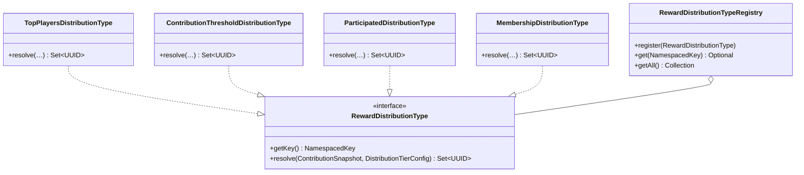
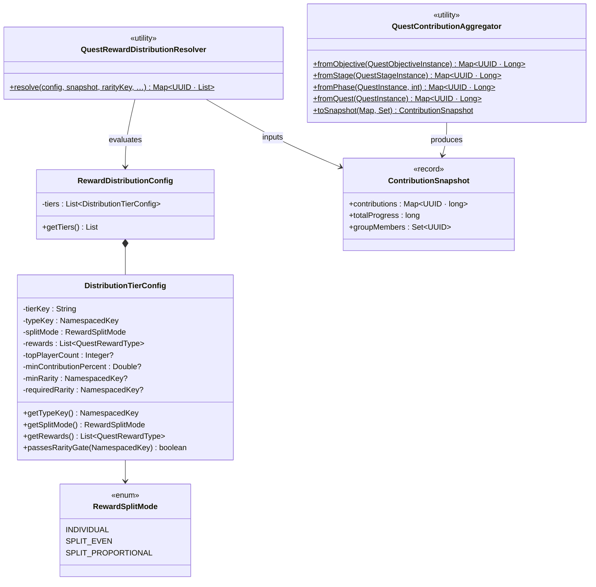
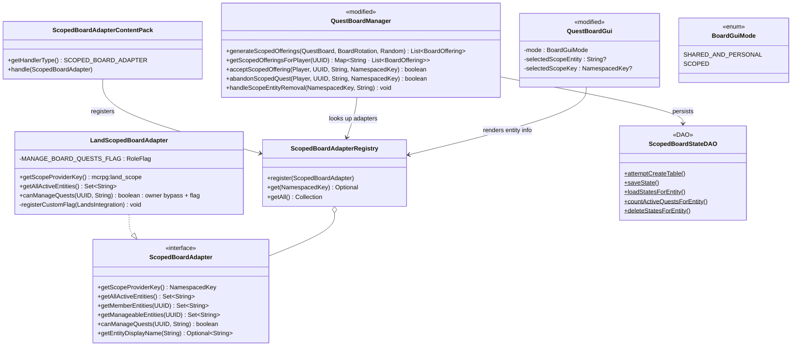

# Phase 3 LLD: Land Board Quests and Reward Distribution

> **HLD Reference:** [docs/hld/quest-board.md](../../hld/quest-board.md)
> **Phase 1 LLD:** [phase-1-core-board-infrastructure.md](phase-1-core-board-infrastructure.md)
> **Phase 2 LLD:** [phase-2-per-player-slots-and-templates.md](phase-2-per-player-slots-and-templates.md)
> **Status:** DRAFT

## Scope

Phase 3 adds two major capabilities on top of the Phase 1/2 board infrastructure: **scoped board quests** (generic per-entity offering generation via a `ScopedBoardAdapter` interface, with a built-in Lands implementation) and **contribution-based reward distribution** (a configurable tiered system that distributes rewards at any level of the quest hierarchy based on individual player contributions).

The scoped board quest infrastructure is designed so that the `QuestBoardManager` treats all scoped categories identically -- it never references Lands (or any specific group plugin) directly. A `ScopedBoardAdapter` interface provides the scope-specific operations (entity enumeration, permission checks, display names), and a `LandScopedBoardAdapter` is the built-in implementation registered by `LandsHook`. Third-party plugins can register their own adapters for Factions, Towny, parties, etc. via the same mechanism.

All database schemas and class constructors assume a **fresh installation** -- no migration logic, no backwards-compatibility constraints with prior schema versions.

**In scope:**
- `ScopedBoardAdapter` interface + `ScopedBoardAdapterRegistry` for generic scoped board operations
- `ScopedBoardAdapterContentPack` -- formalized adapter registration via the `ContentExpansion` system
- `LandScopedBoardAdapter` (built-in Lands implementation, registered by `LandsHook`)
- Custom Lands permission flag (`MANAGE_BOARD_QUESTS`) registered at startup with owner bypass; requires Lands-side allowlisting for delegation to non-owner roles
- Scoped board offering generation at rotation time (per-entity, not lazy)
- Scoped entity permission checks for acceptance and abandonment (via adapter)
- Per-scope-type slot limits -- configurable `max-active-per-entity` per `BoardSlotCategory`, with a global default fallback in `board.yml`
- `ScopedBoardStateDAO` persistence (generic, not land-specific)
- Scope entity removal listener pattern (Lands: `LandDeleteEvent` → generic `handleScopeEntityRemoval`)
- Board GUI scoped tab (entity selector for multi-entity players)
- `board.yml` additions for scoped quest configuration (`max-scoped-quests-per-entity` global default)
- Default `land-daily.yml` category file
- `RewardDistribution` data model (TOP_PLAYERS, CONTRIBUTION_THRESHOLD, PARTICIPATED, MEMBERSHIP)
- `RewardSplitMode` -- per-tier reward scaling (`INDIVIDUAL`, `SPLIT_EVEN`, `SPLIT_PROPORTIONAL`) for "pot"-style distribution where a fixed reward pool is divided among qualifying players
- `QuestRewardType.withAmountMultiplier(double)` -- enables reward scaling for split modes
- `QuestRewardDistributionResolver` -- pure contribution math, no Bukkit dependency
- `RewardDistributionType` interface for extensibility + content pack
- Rarity-conditional distribution tiers (`min-rarity`, `required-rarity`)
- Multi-level reward distribution at quest, phase, stage, and objective levels
- `QuestContributionAggregator` for contribution aggregation across hierarchy levels
- `reward-distribution` YAML parsing in `QuestConfigLoader` and `QuestTemplateConfigLoader`
- Modifications to all four completion listeners to delegate to `QuestRewardDistributionResolver`
- Offline player rewards queued via existing `PendingRewardDAO`
- Unit tests: distribution resolver (all types, edge cases, multi-level, rarity gating, split modes), scoped acceptance flow, scoped offering generation, scope entity removal, contribution aggregation, per-scope-type limits

**Out of scope (later phases):**
- Conditional objectives in templates (Phase 4)
- Cross-referencing between templates (Phase 4)
- Board GUI polish -- rarity animations, hover previews, timer displays (Phase 4)
- Distribution preview in GUI -- showing players what they'd earn at current contribution level (Phase 4)
- Factions/Towny scope adapter implementations (Phase 4 -- third-party plugin teams can implement `ScopedBoardAdapter` using the framework from this phase)
- Advanced split-mode reward handling -- per-reward `pot-behavior`, `ScalableCommandRewardType`, remainder strategies, `min-scaled-amount`, composite pot bundles (Phase 4)
- Multi-scope distribution -- a single quest counting contributions across multiple scope types simultaneously (future consideration)
- Reputation system (Phase 5)

---

## Class Diagrams

### Diagram 1: Reward Distribution Type Hierarchy



### Diagram 2: Reward Distribution Data Model



### Diagram 3: Scoped Board Infrastructure



### Diagram 4: Modified Definition Hierarchy (Reward Distribution)

```mermaid
classDiagram
    direction TB

    class QuestDefinition {
        <<modified>>
        +rewardDistribution : RewardDistributionConfig?
        +getRewardDistribution() Optional
    }

    class QuestPhaseDefinition {
        <<modified>>
        +rewardDistribution : RewardDistributionConfig?
        +getRewardDistribution() Optional
    }

    class QuestStageDefinition {
        <<modified>>
        +rewardDistribution : RewardDistributionConfig?
        +getRewardDistribution() Optional
    }

    class QuestObjectiveDefinition {
        <<modified>>
        +rewardDistribution : RewardDistributionConfig?
        +getRewardDistribution() Optional
    }

    class QuestCompleteListener {
        <<modified>>
        +onQuestComplete() delegates to resolver
    }

    class QuestPhaseCompleteListener {
        <<modified>>
        +onPhaseComplete() delegates to resolver
    }

    class QuestStageCompleteListener {
        <<modified>>
        +onStageComplete() delegates to resolver
    }

    class QuestObjectiveCompleteListener {
        <<modified>>
        +onObjectiveComplete() delegates to resolver
    }

    QuestCompleteListener --> QuestRewardDistributionResolver
    QuestPhaseCompleteListener --> QuestRewardDistributionResolver
    QuestStageCompleteListener --> QuestRewardDistributionResolver
    QuestObjectiveCompleteListener --> QuestRewardDistributionResolver
```



---

## 1. New Classes -- Reward Distribution

### 1.1 `RewardDistributionType` -- Distribution Type Interface

**Package:** `us.eunoians.mcrpg.quest.board.distribution`
**File:** `src/main/java/us/eunoians/mcrpg/quest/board/distribution/RewardDistributionType.java`

Defines a pluggable reward distribution strategy. Given a contribution snapshot and tier configuration, returns the set of player UUIDs who qualify for that tier's rewards. Implements `McRPGContent` for registration via the expansion system.

```java
public interface RewardDistributionType extends McRPGContent {

    @NotNull NamespacedKey getKey();

    /**
     * Resolves the set of player UUIDs that qualify for rewards under this
     * distribution type, given the contribution snapshot and tier config.
     *
     * @param snapshot the contribution data for the relevant scope
     * @param tier     the tier configuration (contains type-specific params)
     * @return the set of qualifying player UUIDs
     */
    @NotNull Set<UUID> resolve(@NotNull ContributionSnapshot snapshot,
                               @NotNull DistributionTierConfig tier);
}
```

### 1.2 Built-in Distribution Types

**Package:** `us.eunoians.mcrpg.quest.board.distribution.builtin`

All built-in implementations are final classes in the `builtin` subpackage. Each returns `McRPGExpansion.EXPANSION_KEY` from `getExpansionKey()`.

**`TopPlayersDistributionType`** (`mcrpg:top_players`):

Returns the top `topPlayerCount` contributors ranked by total contribution. Ties at the boundary are resolved by including all tied players (e.g., if `topPlayerCount=1` and two players tie for first place, both qualify).

```java
public final class TopPlayersDistributionType implements RewardDistributionType {

    @Override
    @NotNull
    public Set<UUID> resolve(@NotNull ContributionSnapshot snapshot,
                             @NotNull DistributionTierConfig tier) {
        int count = tier.getTopPlayerCount().orElse(1);
        // Sort contributions descending, take top N (with tie-inclusive boundary)
    }
}
```

**`ContributionThresholdDistributionType`** (`mcrpg:contribution_threshold`):

Returns all players whose contribution is >= `minContributionPercent` of the total progress.

```java
public final class ContributionThresholdDistributionType implements RewardDistributionType {

    @Override
    @NotNull
    public Set<UUID> resolve(@NotNull ContributionSnapshot snapshot,
                             @NotNull DistributionTierConfig tier) {
        double threshold = tier.getMinContributionPercent().orElse(0.0);
        long total = snapshot.totalProgress();
        if (total == 0) return Set.of();
        // Include players where (contribution / total) * 100 >= threshold
    }
}
```

**`ParticipatedDistributionType`** (`mcrpg:participated`):

Returns all players who made at least one contribution (contribution > 0).

```java
public final class ParticipatedDistributionType implements RewardDistributionType {

    @Override
    @NotNull
    public Set<UUID> resolve(@NotNull ContributionSnapshot snapshot,
                             @NotNull DistributionTierConfig tier) {
        return snapshot.contributions().entrySet().stream()
                .filter(e -> e.getValue() > 0)
                .map(Map.Entry::getKey)
                .collect(Collectors.toUnmodifiableSet());
    }
}
```

**`MembershipDistributionType`** (`mcrpg:membership`):

Returns all players who are members of the group (e.g., land members) at the time of completion, regardless of contribution.

```java
public final class MembershipDistributionType implements RewardDistributionType {

    @Override
    @NotNull
    public Set<UUID> resolve(@NotNull ContributionSnapshot snapshot,
                             @NotNull DistributionTierConfig tier) {
        return Set.copyOf(snapshot.groupMembers());
    }
}
```

### 1.3 `RewardDistributionTypeRegistry`

**Package:** `us.eunoians.mcrpg.quest.board.distribution`
**File:** `src/main/java/us/eunoians/mcrpg/quest/board/distribution/RewardDistributionTypeRegistry.java`

Standard `Registry<RewardDistributionType>` pattern. Not cleared on reload -- types are registered at startup via content packs.

```java
public class RewardDistributionTypeRegistry implements Registry<RewardDistributionType> {

    private final Map<NamespacedKey, RewardDistributionType> types = new LinkedHashMap<>();

    public void register(@NotNull RewardDistributionType type) { ... }
    public Optional<RewardDistributionType> get(@NotNull NamespacedKey key) { ... }
    public Collection<RewardDistributionType> getAll() { ... }
}
```

**Registry key:** Add `REWARD_DISTRIBUTION_TYPE` to `McRPGRegistryKey`.

### 1.4 `ContributionSnapshot` -- Contribution Data Container

**Package:** `us.eunoians.mcrpg.quest.board.distribution`
**File:** `src/main/java/us/eunoians/mcrpg/quest/board/distribution/ContributionSnapshot.java`

An immutable snapshot of contribution data for a given scope, passed to each `RewardDistributionType.resolve()` call. This is a pure data record -- no Bukkit dependency.

```java
public record ContributionSnapshot(
    @NotNull Map<UUID, Long> contributions,
    long totalProgress,
    @NotNull Set<UUID> groupMembers
) {
    public ContributionSnapshot {
        contributions = Map.copyOf(contributions);
        groupMembers = Set.copyOf(groupMembers);
    }
}
```

- `contributions`: per-player contribution amounts for the relevant scope
- `totalProgress`: the sum of all contributions (or total objective progress if untracked contributions exist)
- `groupMembers`: the full set of group members (e.g., `Land.getTrustedPlayers()`), used by `MEMBERSHIP`. For solo quests, this is just the single player.

### 1.5 `DistributionTierConfig` -- Single Tier Configuration

**Package:** `us.eunoians.mcrpg.quest.board.distribution`
**File:** `src/main/java/us/eunoians/mcrpg/quest/board/distribution/DistributionTierConfig.java`

Immutable config for one distribution tier, parsed from YAML. Contains the type key, split mode, rewards, and type-specific parameters.

```java
public final class DistributionTierConfig {

    private final String tierKey;
    private final NamespacedKey typeKey;
    private final RewardSplitMode splitMode;
    private final List<QuestRewardType> rewards;
    private final Integer topPlayerCount;           // TOP_PLAYERS only
    private final Double minContributionPercent;    // CONTRIBUTION_THRESHOLD only
    private final NamespacedKey minRarity;           // nullable
    private final NamespacedKey requiredRarity;      // nullable

    public DistributionTierConfig(@NotNull String tierKey,
                                  @NotNull NamespacedKey typeKey,
                                  @NotNull RewardSplitMode splitMode,
                                  @NotNull List<QuestRewardType> rewards,
                                  @Nullable Integer topPlayerCount,
                                  @Nullable Double minContributionPercent,
                                  @Nullable NamespacedKey minRarity,
                                  @Nullable NamespacedKey requiredRarity) { ... }

    @NotNull public String getTierKey() { return tierKey; }
    @NotNull public NamespacedKey getTypeKey() { return typeKey; }
    @NotNull public RewardSplitMode getSplitMode() { return splitMode; }
    @NotNull public List<QuestRewardType> getRewards() { return rewards; }
    @NotNull public Optional<Integer> getTopPlayerCount() { return Optional.ofNullable(topPlayerCount); }
    @NotNull public Optional<Double> getMinContributionPercent() { return Optional.ofNullable(minContributionPercent); }

    /**
     * Checks whether a quest instance's rarity passes this tier's rarity gate.
     * If no rarity gate is configured, always returns true.
     * {@code min-rarity} includes the specified rarity and all higher tiers.
     * {@code required-rarity} requires an exact match.
     *
     * @param questRarity the rarity key of the quest instance, or null for non-board quests
     * @param rarityRegistry used to resolve ordering for min-rarity comparison
     * @return true if the rarity gate is satisfied
     */
    public boolean passesRarityGate(@Nullable NamespacedKey questRarity,
                                    @NotNull QuestRarityRegistry rarityRegistry) { ... }
}
```

**Rarity gating logic:**
- `min-rarity`: The tier applies if the quest's rarity weight is **less than or equal to** the `min-rarity` weight (lower weight = higher rarity). This means `min-rarity: RARE` includes RARE (weight 10) and LEGENDARY (weight 5) but not UNCOMMON (weight 25).
- `required-rarity`: Exact match only.
- If neither is set, the tier applies to all rarities.
- If `questRarity` is null (non-board quest with no rarity), rarity-gated tiers are skipped and non-gated tiers apply.

### 1.6 `RewardSplitMode` -- Pot Distribution Enum

**Package:** `us.eunoians.mcrpg.quest.board.distribution`
**File:** `src/main/java/us/eunoians/mcrpg/quest/board/distribution/RewardSplitMode.java`

Controls how a tier's reward amounts are distributed among qualifying players. The default `INDIVIDUAL` mode preserves existing behavior. The two "pot" modes divide a fixed reward pool among qualifying players, preventing large groups from generating unbounded total reward value.

```java
public enum RewardSplitMode {

    /**
     * Each qualifying player receives the full reward amount (default).
     * If 10 players qualify for a tier with 1000 XP, each gets 1000 XP (10,000 total).
     */
    INDIVIDUAL,

    /**
     * The reward amount is a fixed pot divided equally among qualifying players.
     * If 10 players qualify for a tier with 1000 XP, each gets 100 XP (1000 total).
     */
    SPLIT_EVEN,

    /**
     * The reward amount is a fixed pot divided proportionally by contribution.
     * If 2 players qualify (60% and 40% contribution) for a tier with 1000 XP,
     * they get 600 XP and 400 XP respectively (1000 total).
     * Falls back to SPLIT_EVEN if contribution data is unavailable.
     */
    SPLIT_PROPORTIONAL
}
```

**YAML mapping:**

| YAML `split-mode` value | Enum |
|---|---|
| *(omitted or `INDIVIDUAL`)* | `INDIVIDUAL` |
| `SPLIT_EVEN` | `SPLIT_EVEN` |
| `SPLIT_PROPORTIONAL` | `SPLIT_PROPORTIONAL` |

**Design rationale:** This is a composable modifier, not a separate distribution type. Any distribution type (`TOP_PLAYERS`, `PARTICIPATED`, etc.) can become a "pot" variant by setting `split-mode`. This avoids a combinatorial explosion of distribution types (e.g., no need for `TOP_PLAYERS_POT`, `PARTICIPATED_POT`, etc.).

### 1.7 `RewardDistributionConfig` -- Full Distribution Block

**Package:** `us.eunoians.mcrpg.quest.board.distribution`
**File:** `src/main/java/us/eunoians/mcrpg/quest/board/distribution/RewardDistributionConfig.java`

Wraps the full `reward-distribution` YAML block for a single level (quest, phase, stage, or objective).

```java
public final class RewardDistributionConfig {

    private final List<DistributionTierConfig> tiers;

    public RewardDistributionConfig(@NotNull List<DistributionTierConfig> tiers) {
        this.tiers = List.copyOf(tiers);
    }

    @NotNull
    public List<DistributionTierConfig> getTiers() { return tiers; }

    public boolean isEmpty() { return tiers.isEmpty(); }
}
```

### 1.8 `QuestRewardDistributionResolver` -- Pure Resolution Logic

**Package:** `us.eunoians.mcrpg.quest.board.distribution`
**File:** `src/main/java/us/eunoians/mcrpg/quest/board/distribution/QuestRewardDistributionResolver.java`

Stateless utility that performs the distribution resolution. No Bukkit dependency -- takes pure data inputs and returns a map of player UUIDs to their earned reward lists. Handles `RewardSplitMode` scaling: for `SPLIT_EVEN` and `SPLIT_PROPORTIONAL` tiers, reward amounts are divided among qualifying players via `QuestRewardType.withAmountMultiplier()`.

```java
public final class QuestRewardDistributionResolver {

    private QuestRewardDistributionResolver() {}

    /**
     * Evaluates all tiers in the distribution config against the contribution
     * snapshot and returns a map of player UUID → list of rewards earned.
     * A player can match multiple tiers; rewards stack.
     *
     * For SPLIT_EVEN tiers, each qualifying player receives rewards scaled by
     * 1.0 / qualifyingPlayerCount. For SPLIT_PROPORTIONAL tiers, each player's
     * rewards are scaled by their contribution percentage. Non-scalable reward
     * types (where withAmountMultiplier returns the same instance) are granted
     * unscaled with a logged warning.
     *
     * @param config       the reward distribution configuration
     * @param snapshot     the contribution snapshot for the relevant scope
     * @param questRarity  the rarity key of the quest instance (nullable for non-board quests)
     * @param rarityRegistry the rarity registry for ordering comparisons
     * @param typeRegistry the distribution type registry
     * @return map of player UUID to the list of rewards earned across all matched tiers
     */
    @NotNull
    public static Map<UUID, List<QuestRewardType>> resolve(
            @NotNull RewardDistributionConfig config,
            @NotNull ContributionSnapshot snapshot,
            @Nullable NamespacedKey questRarity,
            @NotNull QuestRarityRegistry rarityRegistry,
            @NotNull RewardDistributionTypeRegistry typeRegistry) {

        Map<UUID, List<QuestRewardType>> result = new HashMap<>();

        for (DistributionTierConfig tier : config.getTiers()) {
            if (!tier.passesRarityGate(questRarity, rarityRegistry)) {
                continue;
            }
            Optional<RewardDistributionType> type = typeRegistry.get(tier.getTypeKey());
            if (type.isEmpty()) {
                // Log warning: unrecognized distribution type
                continue;
            }
            Set<UUID> qualifyingPlayers = type.get().resolve(snapshot, tier);
            if (qualifyingPlayers.isEmpty()) continue;

            switch (tier.getSplitMode()) {
                case INDIVIDUAL -> {
                    for (UUID playerUUID : qualifyingPlayers) {
                        result.computeIfAbsent(playerUUID, k -> new ArrayList<>())
                                .addAll(tier.getRewards());
                    }
                }
                case SPLIT_EVEN -> {
                    double multiplier = 1.0 / qualifyingPlayers.size();
                    List<QuestRewardType> scaledRewards = scaleRewards(tier.getRewards(), multiplier);
                    for (UUID playerUUID : qualifyingPlayers) {
                        result.computeIfAbsent(playerUUID, k -> new ArrayList<>())
                                .addAll(scaledRewards);
                    }
                }
                case SPLIT_PROPORTIONAL -> {
                    long totalContribution = qualifyingPlayers.stream()
                            .mapToLong(uuid -> snapshot.contributions().getOrDefault(uuid, 0L))
                            .sum();
                    if (totalContribution == 0) {
                        // Fall back to SPLIT_EVEN when no contribution data
                        double fallback = 1.0 / qualifyingPlayers.size();
                        List<QuestRewardType> scaledRewards = scaleRewards(tier.getRewards(), fallback);
                        for (UUID playerUUID : qualifyingPlayers) {
                            result.computeIfAbsent(playerUUID, k -> new ArrayList<>())
                                    .addAll(scaledRewards);
                        }
                    } else {
                        for (UUID playerUUID : qualifyingPlayers) {
                            long playerContribution = snapshot.contributions().getOrDefault(playerUUID, 0L);
                            double multiplier = (double) playerContribution / totalContribution;
                            List<QuestRewardType> scaledRewards = scaleRewards(tier.getRewards(), multiplier);
                            result.computeIfAbsent(playerUUID, k -> new ArrayList<>())
                                    .addAll(scaledRewards);
                        }
                    }
                }
            }
        }

        return result;
    }

    @NotNull
    private static List<QuestRewardType> scaleRewards(@NotNull List<QuestRewardType> rewards,
                                                       double multiplier) {
        return rewards.stream()
                .map(reward -> reward.withAmountMultiplier(multiplier))
                .toList();
    }
}
```

### 1.9 `QuestContributionAggregator` -- Contribution Aggregation Utility

**Package:** `us.eunoians.mcrpg.quest.board.distribution`
**File:** `src/main/java/us/eunoians/mcrpg/quest/board/distribution/QuestContributionAggregator.java`

Stateless utility that aggregates per-player contributions at different levels of the quest hierarchy.

```java
public final class QuestContributionAggregator {

    private QuestContributionAggregator() {}

    @NotNull
    public static Map<UUID, Long> fromObjective(@NotNull QuestObjectiveInstance objective) {
        return objective.getPlayerContributions();
    }

    @NotNull
    public static Map<UUID, Long> fromStage(@NotNull QuestStageInstance stage) {
        Map<UUID, Long> aggregated = new HashMap<>();
        for (QuestObjectiveInstance objective : stage.getObjectiveInstances()) {
            objective.getPlayerContributions().forEach(
                    (uuid, amount) -> aggregated.merge(uuid, amount, Long::sum));
        }
        return aggregated;
    }

    @NotNull
    public static Map<UUID, Long> fromPhase(@NotNull QuestInstance quest, int phaseIndex) {
        Map<UUID, Long> aggregated = new HashMap<>();
        for (QuestStageInstance stage : quest.getStagesForPhase(phaseIndex)) {
            fromStage(stage).forEach(
                    (uuid, amount) -> aggregated.merge(uuid, amount, Long::sum));
        }
        return aggregated;
    }

    @NotNull
    public static Map<UUID, Long> fromQuest(@NotNull QuestInstance quest) {
        Map<UUID, Long> aggregated = new HashMap<>();
        for (QuestStageInstance stage : quest.getAllStages()) {
            fromStage(stage).forEach(
                    (uuid, amount) -> aggregated.merge(uuid, amount, Long::sum));
        }
        return aggregated;
    }

    @NotNull
    public static ContributionSnapshot toSnapshot(@NotNull Map<UUID, Long> contributions,
                                                   @NotNull Set<UUID> groupMembers) {
        long total = contributions.values().stream().mapToLong(Long::longValue).sum();
        return new ContributionSnapshot(contributions, total, groupMembers);
    }
}
```

### 1.10 `RewardDistributionGranter` -- Reward Granting Bridge

**Package:** `us.eunoians.mcrpg.quest.board.distribution`
**File:** `src/main/java/us/eunoians/mcrpg/quest/board/distribution/RewardDistributionGranter.java`

Bridge between the pure `QuestRewardDistributionResolver` output and the Bukkit reward granting pipeline. This is the only class in the distribution package that interacts with Bukkit. Handles online/offline player detection and delegates offline rewards to `PendingRewardDAO`.

```java
public final class RewardDistributionGranter {

    private RewardDistributionGranter() {}

    /**
     * Grants resolved distribution rewards to qualifying players. Online players
     * receive rewards immediately; offline players have them queued via
     * {@link PendingRewardDAO}.
     *
     * @param resolvedRewards map of player UUID → rewards from the resolver
     * @param questKey        the quest definition key (for pending reward tracking)
     */
    public static void grant(@NotNull Map<UUID, List<QuestRewardType>> resolvedRewards,
                             @NotNull NamespacedKey questKey) {
        for (Map.Entry<UUID, List<QuestRewardType>> entry : resolvedRewards.entrySet()) {
            UUID playerUUID = entry.getKey();
            List<QuestRewardType> rewards = entry.getValue();
            if (rewards.isEmpty()) continue;

            Player player = Bukkit.getPlayer(playerUUID);
            if (player != null && player.isOnline()) {
                for (QuestRewardType reward : rewards) {
                    reward.grant(player);
                }
            } else {
                queueForOffline(playerUUID, rewards, questKey);
            }
        }
    }

    private static void queueForOffline(@NotNull UUID playerUUID,
                                        @NotNull List<QuestRewardType> rewards,
                                        @NotNull NamespacedKey questKey) {
        // Follows the same pattern as QuestInstance.queueRewardsForOfflinePlayer()
        // Uses PendingRewardDAO with configurable expiry
    }
}
```

---

## 2. New Classes -- Scoped Board Infrastructure

### 2.1 `ScopedBoardAdapter` -- Generic Scope Adapter Interface

**Package:** `us.eunoians.mcrpg.quest.board.scope`
**File:** `src/main/java/us/eunoians/mcrpg/quest/board/scope/ScopedBoardAdapter.java`

Defines the board-specific operations that a scoped group plugin must provide. Each adapter is keyed by a `QuestScopeProvider` key (e.g., `mcrpg:land_scope`). The `QuestBoardManager` uses this interface exclusively -- it never references Lands, Factions, or any specific plugin directly. A third-party plugin registering a `QuestScopeProvider` for its group system simply also registers a `ScopedBoardAdapter` to get full board integration.

```java
public interface ScopedBoardAdapter {

    /**
     * The scope provider key this adapter handles (e.g., {@code mcrpg:land_scope}).
     * Must match a registered {@link QuestScopeProvider} key.
     */
    @NotNull NamespacedKey getScopeProviderKey();

    /**
     * Returns identifiers for all active entities of this scope type (e.g., all
     * active land names). Used during rotation to generate scoped offerings.
     *
     * @return set of entity identifiers
     */
    @NotNull Set<String> getAllActiveEntities();

    /**
     * Returns the entities the player is a member of (e.g., lands they are
     * trusted in). Used to determine which scoped offerings to show on the board.
     *
     * @param playerUUID the player
     * @return set of entity identifiers
     */
    @NotNull Set<String> getMemberEntities(@NotNull UUID playerUUID);

    /**
     * Returns the entities the player has management permissions for (e.g.,
     * lands where they are owner/admin). Used to determine which scoped
     * quests the player can accept or abandon.
     *
     * @param playerUUID the player
     * @return set of entity identifiers
     */
    @NotNull Set<String> getManageableEntities(@NotNull UUID playerUUID);

    /**
     * Checks whether a specific player can manage (accept/abandon) scoped
     * quests for a specific entity.
     *
     * @param playerUUID the player
     * @param entityId   the scope entity identifier
     * @return true if the player can manage quests for this entity
     */
    boolean canManageQuests(@NotNull UUID playerUUID, @NotNull String entityId);

    /**
     * Returns a human-readable display name for the entity (e.g., "Kingdom of Elara").
     * Used in the GUI and localization.
     *
     * @param entityId the scope entity identifier
     * @return the display name, or empty if the entity is no longer valid
     */
    @NotNull Optional<String> getEntityDisplayName(@NotNull String entityId);
}
```

### 2.2 `ScopedBoardAdapterRegistry`

**Package:** `us.eunoians.mcrpg.quest.board.scope`
**File:** `src/main/java/us/eunoians/mcrpg/quest/board/scope/ScopedBoardAdapterRegistry.java`

Standard registry pattern. Adapters are registered at startup by plugin hooks and are not reloaded.

```java
public class ScopedBoardAdapterRegistry implements Registry<ScopedBoardAdapter> {

    private final Map<NamespacedKey, ScopedBoardAdapter> adapters = new LinkedHashMap<>();

    public void register(@NotNull ScopedBoardAdapter adapter) { ... }
    public Optional<ScopedBoardAdapter> get(@NotNull NamespacedKey scopeProviderKey) { ... }
    public Collection<ScopedBoardAdapter> getAll() { ... }
}
```

**Registry key:** Add `SCOPED_BOARD_ADAPTER` to `McRPGRegistryKey`.

### 2.3 `LandScopedBoardAdapter` -- Lands Implementation

**Package:** `us.eunoians.mcrpg.external.lands`
**File:** `src/main/java/us/eunoians/mcrpg/external/lands/LandScopedBoardAdapter.java`

Lives in the `external.lands` package alongside `LandsHook` and `LandQuestScopeProvider`. Delegates all operations to the Lands API via `LandsIntegration`. Registers a custom Lands role flag (`MANAGE_BOARD_QUESTS`) at startup so land owners can optionally delegate quest management to other roles.

**Custom flag and Lands allowlisting:**
McRPG registers the `manage_board_quests` flag programmatically via the Lands API at startup. However, Lands requires the server owner to **allowlist** custom flags in Lands' configuration (`roles.yml` or equivalent) before they appear in the in-game role editor. Until the server owner adds the flag to the Lands allowlist, it will not be visible or configurable in the role editor, and `hasFlag()` will return the default value (`false`) for all roles.

**Default behavior (zero configuration -- flag NOT allowlisted):**
- **Land owner**: always permitted (hardcoded UUID bypass -- does not depend on the flag at all)
- **All other roles**: `hasFlag()` returns `false` → cannot manage board quests
- This is the safe, expected default. The feature works out of the box for the most common case (owner manages their own land's quests).

**If the server owner wants to delegate (flag allowlisted):**
1. The server owner adds `manage_board_quests` to the Lands custom flag allowlist (Lands config)
2. The flag then appears in the Lands role editor for every land
3. Individual land owners enable it on the desired roles (e.g., Admin, Quartermaster)
4. McRPG picks it up automatically via `hasFlag()` -- no McRPG restart needed

**Startup logging:** `LandsHook` logs an `INFO` message at startup noting that the `manage_board_quests` flag has been registered with Lands, and that server owners can allowlist it in Lands' configuration to enable delegation. This guides admins who want the feature without being noisy for those who don't.

```java
public final class LandScopedBoardAdapter implements ScopedBoardAdapter {

    /**
     * Custom Lands role flag registered at adapter creation time. Land owners
     * can allowlist this flag in Lands' configuration to expose it in the
     * role editor, giving fine-grained control over who can accept/abandon
     * scoped quests for their land.
     *
     * Default value is {@code false} for all roles. The land owner always
     * bypasses this check (hardcoded in {@link #canManageQuests}).
     * If the flag is not allowlisted in Lands, {@code hasFlag()} returns
     * {@code false} for all non-owner roles, which is the intended safe default.
     */
    private static final RoleFlag MANAGE_BOARD_QUESTS_FLAG = RoleFlag.of(
            "manage_board_quests", RoleFlag.Category.ACTION, false);

    private final LandsIntegration landsIntegration;

    public LandScopedBoardAdapter(@NotNull LandsIntegration landsIntegration) {
        this.landsIntegration = landsIntegration;
        registerCustomFlag(landsIntegration);
    }

    /**
     * Registers the custom MANAGE_BOARD_QUESTS flag with the Lands API.
     * Called once at adapter construction (during LandsHook initialization).
     *
     * The flag is registered programmatically but will NOT appear in the
     * Lands role editor until the server owner adds it to the Lands custom
     * flag allowlist. This is a Lands-side requirement, not a McRPG limitation.
     */
    private void registerCustomFlag(@NotNull LandsIntegration landsIntegration) {
        landsIntegration.getLandsAPI().registerRoleFlag(MANAGE_BOARD_QUESTS_FLAG);
    }

    @NotNull
    @Override
    public NamespacedKey getScopeProviderKey() {
        return LandQuestScope.LAND_SCOPE_KEY;
    }

    @NotNull
    @Override
    public Set<String> getAllActiveEntities() {
        return landsIntegration.getLands().stream()
                .map(Land::getName)
                .collect(Collectors.toUnmodifiableSet());
    }

    @NotNull
    @Override
    public Set<String> getMemberEntities(@NotNull UUID playerUUID) {
        return landsIntegration.getLands().stream()
                .filter(land -> land.isTrusted(playerUUID))
                .map(Land::getName)
                .collect(Collectors.toUnmodifiableSet());
    }

    @NotNull
    @Override
    public Set<String> getManageableEntities(@NotNull UUID playerUUID) {
        return landsIntegration.getLands().stream()
                .filter(land -> canManageQuests(playerUUID, land.getName()))
                .map(Land::getName)
                .collect(Collectors.toUnmodifiableSet());
    }

    @Override
    public boolean canManageQuests(@NotNull UUID playerUUID, @NotNull String entityId) {
        Land land = landsIntegration.getLandByName(entityId);
        if (land == null) return false;
        if (!land.isTrusted(playerUUID)) return false;
        // Owner always bypasses the flag check -- this is the zero-config safety net.
        // Even if the flag is never configured, the owner can manage their land's quests.
        if (land.getOwnerUID().equals(playerUUID)) return true;
        // Non-owners require the flag to be explicitly enabled on their role
        return land.getRole(playerUUID).hasFlag(MANAGE_BOARD_QUESTS_FLAG);
    }

    @NotNull
    @Override
    public Optional<String> getEntityDisplayName(@NotNull String entityId) {
        Land land = landsIntegration.getLandByName(entityId);
        return Optional.ofNullable(land).map(Land::getName);
    }
}
```

### 2.4 `LandDeleteListener` -- Land Disbandment Handler

**Package:** `us.eunoians.mcrpg.listener.board`
**File:** `src/main/java/us/eunoians/mcrpg/listener/board/LandDeleteListener.java`

Registered conditionally when the Lands plugin is present (same pattern as `LandQuestScopeProvider`). Listens for `LandDeleteEvent` (from the Lands API) and delegates to the generic `handleScopeEntityRemoval` on `QuestBoardManager`.

```java
public class LandDeleteListener implements Listener {

    @EventHandler(priority = EventPriority.MONITOR)
    public void onLandDelete(@NotNull LandDeleteEvent event) {
        String landName = event.getLand().getName();
        QuestBoardManager boardManager = RegistryAccess.registryAccess()
                .registry(RegistryKey.MANAGER)
                .manager(McRPGManagerKey.QUEST_BOARD);
        boardManager.handleScopeEntityRemoval(LandQuestScope.LAND_SCOPE_KEY, landName);
    }
}
```

`QuestBoardManager.handleScopeEntityRemoval(scopeProviderKey, entityId)` is fully generic:
1. Query `ScopedBoardStateDAO` for any `ACCEPTED` offerings for this entity
2. For each active scoped quest instance:
   a. Cancel the quest via `QuestManager.cancelQuest()` (no rewards distributed)
   b. Transition the `BoardOffering` to `EXPIRED`
   c. Update `ScopedBoardStateDAO` to `EXPIRED`
3. Prune any `VISIBLE` scoped offerings to `EXPIRED`
4. Remove appearance/acceptance cooldowns for this entity from `BoardCooldownDAO`
5. Log the cleanup

A future Factions plugin hook would register a `FactionDisbandListener` that calls the same `handleScopeEntityRemoval` method with `factions:faction_scope` and the faction name. No `QuestBoardManager` changes required.

### 2.5 Scoped Board GUI Classes

**Package:** `us.eunoians.mcrpg.gui.board`

#### `BoardGuiMode` -- GUI Tab Enum

```java
public enum BoardGuiMode {
    SHARED_AND_PERSONAL,
    SCOPED
}
```

#### `ScopedEntitySelectorGui` -- Entity Selection GUI

A secondary GUI that opens when a player with multiple manageable scope entities clicks the scoped tab. Lists all manageable entities (across all scope types) as clickable items. Selecting an entity navigates to the `QuestBoardGui` in `SCOPED` mode for that entity.

```java
public class ScopedEntitySelectorGui extends McRPGPaginatedGui {

    private final List<ScopedEntityEntry> manageableEntities;

    public ScopedEntitySelectorGui(@NotNull McRPGPlayer player) {
        super(player);
        // Iterate all ScopedBoardAdapters, collect manageable entities
        // Each entry stores the scope provider key + entity ID + display name
    }

    @Override
    protected void paintInventoryForPage(@NotNull Inventory inventory, int page) {
        // Paint each entity as a ScopedEntitySelectSlot
    }
}
```

**`ScopedEntityEntry`** (inner record):
```java
record ScopedEntityEntry(NamespacedKey scopeProviderKey, String entityId, String displayName) {}
```

#### New Slot Classes (in `gui/board/slot/`)

- **`ScopedTabSlot`**: Shown in the navigation bar of `QuestBoardGui` (shared/personal view). Click opens `ScopedEntitySelectorGui` if the player has multiple manageable entities, or directly switches to scoped mode if only one entity. Only visible if at least one `ScopedBoardAdapter` is registered and the player has at least one manageable entity.

- **`ScopedEntitySelectSlot`**: Shown in `ScopedEntitySelectorGui`. Each slot represents one scope entity. Displays entity name (via adapter) and current quest count. Click opens `QuestBoardGui` in `SCOPED` mode.

- **`ScopedOfferingSlot`**: Extends `BoardOfferingSlot` behavior for scoped offerings. Click triggers `QuestBoardManager.acceptScopedOffering()`.

- **`ScopedBackSlot`**: Back button in scoped mode -- returns to `ScopedEntitySelectorGui` or shared/personal mode.

- **`ScopedNoOfferingsSlot`**: Displayed when the entity has no current offerings. Shows informational text: "No scoped quests available. New offerings are generated daily at [rotation time]."

---

## 3. Modifications to Existing Classes

### 3.1 `QuestDefinition` -- Add `rewardDistribution`

Add an optional `RewardDistributionConfig` field:

```java
private final RewardDistributionConfig rewardDistribution; // nullable

@NotNull
public Optional<RewardDistributionConfig> getRewardDistribution() {
    return Optional.ofNullable(rewardDistribution);
}
```

The constructor gains an additional `@Nullable RewardDistributionConfig rewardDistribution` parameter.

### 3.2 `QuestPhaseDefinition` -- Add `rewardDistribution`

```java
private final RewardDistributionConfig rewardDistribution; // nullable

@NotNull
public Optional<RewardDistributionConfig> getRewardDistribution() {
    return Optional.ofNullable(rewardDistribution);
}
```

### 3.3 `QuestStageDefinition` -- Add `rewardDistribution`

```java
private final RewardDistributionConfig rewardDistribution; // nullable

@NotNull
public Optional<RewardDistributionConfig> getRewardDistribution() {
    return Optional.ofNullable(rewardDistribution);
}
```

### 3.4 `QuestObjectiveDefinition` -- Add `rewardDistribution`

```java
private final RewardDistributionConfig rewardDistribution; // nullable

@NotNull
public Optional<RewardDistributionConfig> getRewardDistribution() {
    return Optional.ofNullable(rewardDistribution);
}
```

### 3.5 `QuestInstance` -- Add `boardRarityKey` Accessor

To support rarity-conditional distribution tiers, `QuestInstance` needs to expose the rarity key of the board offering that spawned it (if applicable).

```java
private NamespacedKey boardRarityKey; // nullable -- only set for board-sourced quests

@Nullable
public NamespacedKey getBoardRarityKey() { return boardRarityKey; }

public void setBoardRarityKey(@Nullable NamespacedKey rarityKey) { this.boardRarityKey = rarityKey; }
```

Set during `QuestBoardManager.acceptOffering()` and `acceptScopedOffering()`. Persisted in `QuestInstanceDAO` as a nullable `VARCHAR(256)` column `board_rarity_key`.

### 3.6 `QuestRewardType` -- Add `withAmountMultiplier`

Add a default method to the `QuestRewardType` interface that returns a new reward instance with its numeric amount scaled by the given multiplier. Used by `QuestRewardDistributionResolver` for `SPLIT_EVEN` and `SPLIT_PROPORTIONAL` pot distribution.

```java
/**
 * Returns a new reward instance with any numeric amount scaled by the multiplier.
 * For example, an experience reward of 1000 with multiplier 0.25 returns a reward
 * granting 250 XP. Implementations that have no numeric amount (e.g., command rewards)
 * return {@code this} unchanged -- the resolver logs a warning for non-scalable
 * rewards used in split-mode tiers.
 *
 * @param multiplier the scaling factor (e.g., 0.5 for half, 0.1 for one-tenth)
 * @return a scaled copy, or {@code this} if the reward type is not scalable
 */
@NotNull
default QuestRewardType withAmountMultiplier(double multiplier) {
    return this;
}
```

Built-in reward types that support scaling override this method:

- **`ExperienceRewardType`**: returns a new instance with `amount = (long)(amount * multiplier)`, minimum 1
- **`ItemRewardType`**: returns a new instance with `amount = (int)(amount * multiplier)`, minimum 1
- **`CurrencyRewardType`** (if present): returns a new instance with `amount = amount * multiplier`
- **`CommandRewardType`**: returns `this` (not scalable -- command strings are opaque)

### 3.7 `QuestCompleteListener` -- Delegate to Distribution Resolver

After granting the standard quest-level rewards (existing behavior), check for a `RewardDistributionConfig` on the quest definition and delegate to the resolver:

```java
@EventHandler(priority = EventPriority.MONITOR)
public void onQuestComplete(@NotNull QuestCompleteEvent event) {
    QuestInstance questInstance = event.getQuestInstance();
    QuestDefinition definition = event.getQuestDefinition();

    // Existing: grant standard rewards
    questInstance.grantRewards(definition.getRewards());

    // New: resolve and grant distribution rewards at quest level
    definition.getRewardDistribution().ifPresent(distConfig -> {
        Map<UUID, Long> contributions = QuestContributionAggregator.fromQuest(questInstance);
        Set<UUID> groupMembers = questInstance.getQuestScope()
                .map(scope -> scope.getCurrentPlayersInScope())
                .orElse(Set.of());
        ContributionSnapshot snapshot = QuestContributionAggregator.toSnapshot(contributions, groupMembers);

        Map<UUID, List<QuestRewardType>> rewards = QuestRewardDistributionResolver.resolve(
                distConfig, snapshot, questInstance.getBoardRarityKey(),
                rarityRegistry(), distributionTypeRegistry());
        RewardDistributionGranter.grant(rewards, questInstance.getQuestKey());
    });

    logCompletionForAllScopePlayers(questInstance);
    // ... existing retire and ephemeral cleanup
}
```

### 3.8 `QuestObjectiveCompleteListener` -- Delegate to Distribution Resolver

After granting objective-level rewards, check for `RewardDistributionConfig` on the objective definition:

```java
@EventHandler(priority = EventPriority.MONITOR)
public void onObjectiveComplete(@NotNull QuestObjectiveCompleteEvent event) {
    QuestInstance quest = event.getQuestInstance();
    // ... existing state check ...

    QuestObjectiveInstance objective = event.getObjectiveInstance();
    QuestStageInstance stage = event.getStageInstance();

    definition.flatMap(def -> def.findObjectiveDefinition(objective.getQuestObjectiveKey()))
            .ifPresent(objectiveDef -> {
                // Existing: grant standard objective rewards
                quest.grantRewards(objectiveDef.getRewards());

                // New: resolve distribution at objective level
                objectiveDef.getRewardDistribution().ifPresent(distConfig -> {
                    Map<UUID, Long> contributions = QuestContributionAggregator.fromObjective(objective);
                    Set<UUID> groupMembers = quest.getQuestScope()
                            .map(QuestScope::getCurrentPlayersInScope).orElse(Set.of());
                    ContributionSnapshot snapshot = QuestContributionAggregator.toSnapshot(contributions, groupMembers);

                    Map<UUID, List<QuestRewardType>> rewards = QuestRewardDistributionResolver.resolve(
                            distConfig, snapshot, quest.getBoardRarityKey(),
                            rarityRegistry(), distributionTypeRegistry());
                    RewardDistributionGranter.grant(rewards, quest.getQuestKey());
                });
            });

    // ... existing stage completion cascade ...
}
```

### 3.9 `QuestStageCompleteListener` -- Delegate to Distribution Resolver

```java
questManager.getQuestDefinition(quest.getQuestKey())
        .flatMap(def -> def.findStageDefinition(stage.getStageKey()))
        .ifPresent(stageDef -> {
            stageDef.getRewardDistribution().ifPresent(distConfig -> {
                Map<UUID, Long> contributions = QuestContributionAggregator.fromStage(stage);
                Set<UUID> groupMembers = quest.getQuestScope()
                        .map(QuestScope::getCurrentPlayersInScope).orElse(Set.of());
                ContributionSnapshot snapshot = QuestContributionAggregator.toSnapshot(contributions, groupMembers);

                Map<UUID, List<QuestRewardType>> rewards = QuestRewardDistributionResolver.resolve(
                        distConfig, snapshot, quest.getBoardRarityKey(),
                        rarityRegistry(), distributionTypeRegistry());
                RewardDistributionGranter.grant(rewards, quest.getQuestKey());
            });
        });
```

**Important**: The stage-level distribution is resolved **before** the phase cascade check. This ensures stage rewards are granted even for `ANY`-mode phases where sibling stages are cancelled.

### 3.10 `QuestPhaseCompleteListener` -- Delegate to Distribution Resolver

```java
definition.getPhase(phaseIndex).ifPresent(phaseDef -> {
    phaseDef.getRewardDistribution().ifPresent(distConfig -> {
        Map<UUID, Long> contributions = QuestContributionAggregator.fromPhase(quest, phaseIndex);
        Set<UUID> groupMembers = quest.getQuestScope()
                .map(QuestScope::getCurrentPlayersInScope).orElse(Set.of());
        ContributionSnapshot snapshot = QuestContributionAggregator.toSnapshot(contributions, groupMembers);

        Map<UUID, List<QuestRewardType>> rewards = QuestRewardDistributionResolver.resolve(
                distConfig, snapshot, quest.getBoardRarityKey(),
                rarityRegistry(), distributionTypeRegistry());
        RewardDistributionGranter.grant(rewards, quest.getQuestKey());
    });
});
```

### 3.11 `QuestBoardManager` -- Generic Scoped Offering Support

The `QuestBoardManager` has no land-specific logic. All scoped operations delegate to the `ScopedBoardAdapterRegistry` and use the generic `ScopedBoardStateDAO`. The methods are parameterized by `NamespacedKey scopeProviderKey` so the manager treats every scope identically.

```java
/**
 * Generates scoped offerings for all active scope entities during rotation.
 * Iterates every registered ScopedBoardAdapter, resolves active entities,
 * and rolls offerings for each SCOPED category matching the refresh type.
 */
@NotNull
public List<BoardOffering> generateScopedOfferings(@NotNull QuestBoard board,
                                                    @NotNull BoardRotation rotation,
                                                    @NotNull Random random) {
    BoardSlotCategoryRegistry categoryRegistry = plugin().registryAccess()
            .registry(McRPGRegistryKey.BOARD_SLOT_CATEGORY);
    QuestRarityRegistry rarityRegistry = plugin().registryAccess()
            .registry(McRPGRegistryKey.QUEST_RARITY);
    ScopedBoardAdapterRegistry adapterRegistry = plugin().registryAccess()
            .registry(McRPGRegistryKey.SCOPED_BOARD_ADAPTER);

    List<BoardSlotCategory> scopedCategories = categoryRegistry
            .getByVisibility(BoardSlotCategory.Visibility.SCOPED).stream()
            .filter(c -> c.getRefreshTypeKey().equals(rotation.getRefreshTypeKey()))
            .toList();

    if (scopedCategories.isEmpty()) return List.of();

    int hcWeight = boardConfig.getInt(BoardConfigFile.SOURCE_WEIGHT_HAND_CRAFTED, 50);
    int tmplWeight = boardConfig.getInt(BoardConfigFile.SOURCE_WEIGHT_TEMPLATE, 50);

    List<BoardOffering> offerings = new ArrayList<>();
    for (BoardSlotCategory category : scopedCategories) {
        Optional<ScopedBoardAdapter> adapter = adapterRegistry.get(category.getScopeProviderKey());
        if (adapter.isEmpty()) continue; // scope provider plugin not present

        Set<String> activeEntities = adapter.get().getAllActiveEntities();
        for (String entityId : activeEntities) {
            Map<NamespacedKey, Integer> slotCounts = SlotGenerationLogic.computeSlotCounts(
                    List.of(category), 0, random,
                    key -> isCategoryOnCooldownForEntity(key, entityId));

            int count = slotCounts.getOrDefault(category.getKey(), 0);
            for (int i = 0; i < count; i++) {
                QuestRarity rarity = rarityRegistry.rollRarity(random);
                Optional<SlotSelection> selection = questPool.selectForSlot(
                        rarity.getKey(), random, templateEngine, hcWeight, tmplWeight);
                selection.ifPresent(sel -> offerings.add(
                        toScopedOffering(sel, rotation, category, offerings.size(), entityId)));
            }
        }
    }
    return offerings;
}

/**
 * Accepts a scoped offering for a player. Validates management permission
 * via the adapter for the offering's scope provider.
 */
public boolean acceptScopedOffering(@NotNull Player player, @NotNull UUID offeringId,
                                    @NotNull String entityId,
                                    @NotNull NamespacedKey scopeProviderKey) { ... }

/**
 * Abandons a scoped quest. Validates management permission via the adapter.
 */
public boolean abandonScopedQuest(@NotNull Player player, @NotNull UUID questInstanceUUID,
                                  @NotNull String entityId,
                                  @NotNull NamespacedKey scopeProviderKey) { ... }

/**
 * Gets scoped offerings for all entities the player is a member of,
 * across all registered scope adapters.
 */
@NotNull
public Map<String, List<BoardOffering>> getScopedOfferingsForPlayer(@NotNull UUID playerUUID) { ... }

/**
 * Counts active scoped quests for a specific entity.
 */
public int getActiveScopedQuestCount(@NotNull String entityId) { ... }

/**
 * Handles scope entity removal: cancels active quests, expires offerings,
 * cleans up cooldowns. Called by scope-specific event listeners
 * (e.g., LandDeleteListener, FactionDisbandListener).
 */
public void handleScopeEntityRemoval(@NotNull NamespacedKey scopeProviderKey,
                                     @NotNull String entityId) { ... }
```

**Rotation integration**: The existing `triggerRotation()` method calls `generateScopedOfferings()` alongside `generateSharedOfferings()`. Scoped offerings are persisted in the same `BoardOfferingDAO.saveOfferings()` call, distinguished by `scope_target_id` (set to the entity identifier).

### 3.12 `QuestBoardGui` -- Add Scoped Tab

The GUI gains mode awareness:

```java
public class QuestBoardGui extends McRPGPaginatedGui {

    private BoardGuiMode mode = BoardGuiMode.SHARED_AND_PERSONAL;
    private String selectedScopeEntity;       // non-null when mode == SCOPED
    private NamespacedKey selectedScopeKey;    // non-null when mode == SCOPED

    public QuestBoardGui(@NotNull McRPGPlayer player) {
        super(player);
        // Load shared + personal offerings (existing)
        // Check if any ScopedBoardAdapter has manageable entities -- if so, show ScopedTabSlot
    }

    public QuestBoardGui(@NotNull McRPGPlayer player,
                         @NotNull NamespacedKey scopeKey,
                         @NotNull String entityId) {
        super(player);
        this.mode = BoardGuiMode.SCOPED;
        this.selectedScopeKey = scopeKey;
        this.selectedScopeEntity = entityId;
        // Load offerings for this specific entity
    }

    @Override
    protected void paintInventoryForPage(@NotNull Inventory inventory, int page) {
        if (mode == BoardGuiMode.SHARED_AND_PERSONAL) {
            paintSharedAndPersonalOfferings(inventory, page);
            // Add ScopedTabSlot to navigation bar (if player has scoped entities)
        } else {
            paintScopedOfferings(inventory, page);
            // Add ScopedBackSlot to navigation bar
        }
    }
}
```

### 3.13 `QuestBoardRotationTask` -- Trigger Scoped Offering Generation

Extend the rotation to call `generateScopedOfferings()`:

```java
@Override
protected void onIntervalComplete() {
    // ... existing time-based refresh type iteration ...
    // When a rotation triggers:
    //   1. Generate shared offerings (existing)
    //   2. Generate scoped offerings (new -- iterates all adapters generically)
    //   3. Persist all offerings together
    //   4. Prune cooldowns
}
```

### 3.14 `QuestConfigLoader` -- Parse `reward-distribution` Blocks

Extend the quest YAML parser to read the optional `reward-distribution` section at all four levels:

```java
@Nullable
private RewardDistributionConfig parseRewardDistribution(@NotNull Section section) {
    if (!section.contains("reward-distribution")) {
        return null;
    }
    Section distSection = section.getSection("reward-distribution");
    List<DistributionTierConfig> tiers = new ArrayList<>();
    for (String tierKey : distSection.getRoutesAsStrings(false)) {
        Section tierSection = distSection.getSection(tierKey);
        NamespacedKey typeKey = resolveDistributionTypeKey(tierSection.getString("type"));
        RewardSplitMode splitMode = tierSection.contains("split-mode")
                ? RewardSplitMode.valueOf(tierSection.getString("split-mode"))
                : RewardSplitMode.INDIVIDUAL;
        List<QuestRewardType> rewards = parseRewards(tierSection.getSection("rewards"));
        Integer topPlayerCount = tierSection.contains("top-player-count")
                ? tierSection.getInt("top-player-count") : null;
        Double minContribPercent = tierSection.contains("min-contribution-percent")
                ? tierSection.getDouble("min-contribution-percent") : null;
        NamespacedKey minRarity = tierSection.contains("min-rarity")
                ? resolveRarityKey(tierSection.getString("min-rarity")) : null;
        NamespacedKey requiredRarity = tierSection.contains("required-rarity")
                ? resolveRarityKey(tierSection.getString("required-rarity")) : null;

        tiers.add(new DistributionTierConfig(tierKey, typeKey, splitMode, rewards,
                topPlayerCount, minContribPercent, minRarity, requiredRarity));
    }
    return new RewardDistributionConfig(tiers);
}
```

This parser is called from `parseQuestDefinition()`, `parsePhase()`, `parseStage()`, and `parseObjective()`.

The same parsing logic is added to `QuestTemplateConfigLoader` for template definitions.

### 3.15 `QuestInstanceDAO` -- Add `board_rarity_key` Column

Add a nullable `board_rarity_key VARCHAR(256)` column to the `mcrpg_quest_instances` table.

- `saveQuestInstance()`: stores `boardRarityKey.toString()` or null
- `loadQuestInstance()`: reads and sets `boardRarityKey` via `setBoardRarityKey()`

### 3.16 `LandsHook` -- Register Adapter and Listener

Extend the `LandsHook` constructor to register the `LandScopedBoardAdapter` and `LandDeleteListener`:

```java
public LandsHook(@NotNull McRPG plugin) {
    super(plugin);
    this.landsIntegration = LandsIntegration.of(plugin);
    registerLandQuestScopeProvider(plugin);
    registerLandScopedBoardAdapter(plugin);
    registerLandDeleteListener(plugin);
}

private void registerLandScopedBoardAdapter(@NotNull McRPG plugin) {
    plugin.registryAccess()
            .registry(McRPGRegistryKey.SCOPED_BOARD_ADAPTER)
            .register(new LandScopedBoardAdapter(landsIntegration));
}

private void registerLandDeleteListener(@NotNull McRPG plugin) {
    Bukkit.getPluginManager().registerEvents(new LandDeleteListener(), plugin);
}
```

### 3.17 `McRPGRegistryKey` -- Add New Registry Keys

```java
RegistryKey<RewardDistributionTypeRegistry> REWARD_DISTRIBUTION_TYPE =
    create(RewardDistributionTypeRegistry.class);
RegistryKey<ScopedBoardAdapterRegistry> SCOPED_BOARD_ADAPTER =
    create(ScopedBoardAdapterRegistry.class);
```

### 3.18 `McRPGBootstrap` -- Register New Components

```java
// With existing registries:
registryAccess.register(new RewardDistributionTypeRegistry());
registryAccess.register(new ScopedBoardAdapterRegistry());
```

### 3.19 Content Pack Additions

**`RewardDistributionTypeContentPack`** -- registers `RewardDistributionType` implementations into `RewardDistributionTypeRegistry`. Handler type: `ContentHandlerType.REWARD_DISTRIBUTION_TYPE`.

**`ScopedBoardAdapterContentPack`** -- registers `ScopedBoardAdapter` implementations into `ScopedBoardAdapterRegistry`. Handler type: `ContentHandlerType.SCOPED_BOARD_ADAPTER`. This formalizes adapter registration via the `ContentExpansion` system alongside the existing plugin hook pattern. Third-party plugins can register adapters either via their plugin hook (for tight lifecycle coupling) or via a content pack (for looser integration). The `LandScopedBoardAdapter` uses the plugin hook pattern since it depends on `LandsIntegration` being initialized first.

```java
public class ScopedBoardAdapterContentPack implements ContentPack<ScopedBoardAdapter> {

    @Override
    @NotNull
    public ContentHandlerType<ScopedBoardAdapter> getHandlerType() {
        return ContentHandlerType.SCOPED_BOARD_ADAPTER;
    }

    @Override
    public void handle(@NotNull ScopedBoardAdapter adapter) {
        RegistryAccess.registryAccess()
                .registry(McRPGRegistryKey.SCOPED_BOARD_ADAPTER)
                .register(adapter);
    }
}
```

**`McRPGExpansion` updates:**
- `getRewardDistributionTypeContent()` -- provides `TopPlayersDistributionType`, `ContributionThresholdDistributionType`, `ParticipatedDistributionType`, `MembershipDistributionType`

**`ContentHandlerType` additions:**
- `SCOPED_BOARD_ADAPTER` -- for `ScopedBoardAdapterContentPack`

### 3.20 `McRPGDatabase` -- Register Scoped Board State DAO

Add to `populateCreateFunctions()`:
- `ScopedBoardStateDAO::attemptCreateTable`

Add to `populateUpdateFunctions()`:
- `ScopedBoardStateDAO::updateTable` -- no-op

### 3.21 `BoardConfigFile` -- Add Scoped Quest Configuration Routes

```java
public static final Route MAX_SCOPED_QUESTS_PER_ENTITY =
    Route.fromString("max-scoped-quests-per-entity");
```

This is the global default. Individual `BoardSlotCategory` instances can override this with `max-active-per-entity` in their category YAML (see section 3.22).

### 3.22 `BoardSlotCategory` -- Add Per-Scope-Type Slot Limit

Add an optional `maxActivePerEntity` field to `BoardSlotCategory`:

```java
private final Integer maxActivePerEntity; // nullable -- falls back to global default

@NotNull
public OptionalInt getMaxActivePerEntity() {
    return maxActivePerEntity != null ? OptionalInt.of(maxActivePerEntity) : OptionalInt.empty();
}
```

When `QuestBoardManager.acceptScopedOffering()` checks the slot limit, it resolves the effective limit per category:

```java
int effectiveLimit = category.getMaxActivePerEntity()
        .orElse(board.getMaxScopedQuestsPerEntity());
```

This allows different scope types (or even different categories within the same scope type) to have different active quest limits. For example, a `land-daily` category might allow 1 active quest per land, while a hypothetical `faction-weekly` category allows 3.

**Category YAML addition:**
```yaml
land-daily:
  visibility: SCOPED
  scope: mcrpg:land_scope
  max-active-per-entity: 1   # optional -- overrides global default
  # ... other fields ...
```

### 3.23 `LocalizationKey` -- Add Scoped Board GUI Keys

```java
public static final Route QUEST_BOARD_SCOPED_TAB = Route.fromString("gui.quest-board.scoped-tab");
public static final Route QUEST_BOARD_SCOPED_SELECTOR_TITLE = Route.fromString("gui.quest-board.scoped-selector-title");
public static final Route QUEST_BOARD_SCOPED_NO_OFFERINGS = Route.fromString("gui.quest-board.scoped-no-offerings");
public static final Route QUEST_BOARD_SCOPED_ACCEPT = Route.fromString("gui.quest-board.scoped-accept");
public static final Route QUEST_BOARD_SCOPED_ABANDON = Route.fromString("gui.quest-board.scoped-abandon");
public static final Route QUEST_BOARD_SCOPED_NO_PERMISSION = Route.fromString("gui.quest-board.scoped-no-permission");
public static final Route QUEST_BOARD_SCOPED_SLOTS_FULL = Route.fromString("gui.quest-board.scoped-slots-full");
public static final Route QUEST_BOARD_DISTRIBUTION_HEADER = Route.fromString("gui.quest-board.distribution-header");
```

---

## 4. New DAO Classes

### 4.1 `ScopedBoardStateDAO`

**Package:** `us.eunoians.mcrpg.database.table.board`
**File:** `src/main/java/us/eunoians/mcrpg/database/table/board/ScopedBoardStateDAO.java`

Generic scoped board state persistence -- not land-specific. Uses `scope_entity_id` as the entity identifier (land name, faction name, party ID, etc.).

```
mcrpg_scoped_board_state
  scope_entity_id      VARCHAR(255) NOT NULL
  scope_provider_key   VARCHAR(256) NOT NULL
  board_key            VARCHAR(256) NOT NULL
  offering_id          VARCHAR(36) NOT NULL
  state                VARCHAR(32) NOT NULL
  accepted_at          BIGINT
  accepted_by          VARCHAR(36)
  quest_instance_uuid  VARCHAR(36)
  PRIMARY KEY (scope_entity_id, board_key, offering_id)
```

**Indexes:**
- `idx_scoped_board_state_entity` on `(scope_entity_id, board_key)` -- efficient queries for a specific entity's board state
- `idx_scoped_board_state_quest` on `(quest_instance_uuid)` -- reverse lookup from quest instance

**Methods:**
- `attemptCreateTable(Connection, Database): boolean`
- `updateTable(Connection, Database): void` -- no-op
- `saveState(Connection, String entityId, NamespacedKey scopeProviderKey, NamespacedKey boardKey, UUID offeringId, String state, Long acceptedAt, UUID acceptedBy, UUID questInstanceUUID): List<PreparedStatement>`
- `loadStatesForEntity(Connection, String entityId, NamespacedKey boardKey): List<ScopedBoardStateRecord>`
- `countActiveQuestsForEntity(Connection, String entityId, NamespacedKey boardKey): int`
- `updateState(Connection, String entityId, NamespacedKey boardKey, UUID offeringId, String state): PreparedStatement`
- `deleteStatesForEntity(Connection, String entityId): List<PreparedStatement>`

**`ScopedBoardStateRecord`** (inner record):
```java
public record ScopedBoardStateRecord(
    String scopeEntityId,
    NamespacedKey scopeProviderKey,
    NamespacedKey boardKey,
    UUID offeringId,
    String state,
    Long acceptedAt,
    UUID acceptedBy,
    UUID questInstanceUUID
) {}
```

---

## 5. YAML Configuration

### 5.1 `board.yml` Additions

```yaml
# Global default: maximum active scoped quests per scope entity (e.g., per land, per faction)
# Separate from personal max-accepted-quests
# Individual categories can override this with 'max-active-per-entity' in their YAML
max-scoped-quests-per-entity: 1
```

### 5.2 Default Land Category File

**File:** `src/main/resources/quest-board/categories/land-daily.yml`

Shipped as a default resource. If Lands is not installed, the server admin deletes this file -- no warnings, no leftover config.

```yaml
land-daily:
  visibility: SCOPED
  refresh-type: DAILY
  refresh-interval: 1d
  completion-time: 3d
  scope: mcrpg:land_scope
  max-active-per-entity: 1     # overrides global max-scoped-quests-per-entity for this category
  min: 0
  max: 1
  chance-per-slot: 0.15
  appearance-cooldown: 7d
  priority: 5
```

### 5.3 `reward-distribution` in Quest YAML

The `reward-distribution` block can appear at quest, phase, stage, and objective levels. Example showing all four:

```yaml
quests:
  mcrpg:land_megaproject:
    scope: mcrpg:land_scope
    expiration: 7d
    board-metadata:
      board-eligible: true
      supported-rarities: [COMMON, UNCOMMON, RARE, LEGENDARY]
      acceptance-cooldown: 30d
      cooldown-scope: SCOPE_ENTITY

    # Quest-level reward distribution (aggregated across all objectives)
    reward-distribution:
      top-contributor:
        type: TOP_PLAYERS
        top-player-count: 1
        rewards:
          bonus-xp:
            type: mcrpg:experience
            skill: MINING
            amount: 1000
      legendary-top-contributor:
        type: TOP_PLAYERS
        top-player-count: 1
        min-rarity: LEGENDARY
        rewards:
          legendary-bonus:
            type: mcrpg:command
            commands:
              - "give {player} diamond_block 5"
      major-contributor:
        type: CONTRIBUTION_THRESHOLD
        min-contribution-percent: 20
        rewards:
          threshold-reward:
            type: mcrpg:experience
            skill: MINING
            amount: 500
      active-participant:
        type: PARTICIPATED
        rewards:
          participation:
            type: mcrpg:experience
            skill: MINING
            amount: 100
      scope-member:
        type: MEMBERSHIP
        rewards:
          membership-bonus:
            type: mcrpg:experience
            skill: MINING
            amount: 25

      # "Pot" tier: 5000 XP total divided proportionally by contribution
      contribution-pot:
        type: PARTICIPATED
        split-mode: SPLIT_PROPORTIONAL
        rewards:
          xp-pot:
            type: mcrpg:experience
            skill: MINING
            amount: 5000

      # "Even pot" tier: 10 diamonds split evenly among top 3
      top-three-pot:
        type: TOP_PLAYERS
        top-player-count: 3
        split-mode: SPLIT_EVEN
        rewards:
          diamond-pot:
            type: mcrpg:item
            item: DIAMOND
            amount: 10

    # Standard rewards (granted to all scope players equally, as before)
    rewards:
      completion-xp:
        type: mcrpg:experience
        skill: MINING
        amount: 200

    phases:
      mine-phase:
        completion-mode: ALL
        reward-distribution:
          phase-top:
            type: TOP_PLAYERS
            top-player-count: 3
            rewards:
              phase-bonus:
                type: mcrpg:experience
                skill: MINING
                amount: 150
        stages:
          mine-stage:
            key: mcrpg:land_mine_stage
            reward-distribution:
              stage-participant:
                type: PARTICIPATED
                rewards:
                  stage-reward:
                    type: mcrpg:experience
                    skill: MINING
                    amount: 50
            objectives:
              break-blocks:
                key: mcrpg:land_break_blocks
                type: mcrpg:block_break
                required-progress: 1000
                config:
                  blocks:
                    - STONE
                    - DEEPSLATE
                reward-distribution:
                  obj-top:
                    type: TOP_PLAYERS
                    top-player-count: 1
                    rewards:
                      obj-bonus:
                        type: mcrpg:experience
                        skill: MINING
                        amount: 75
```

**Key semantics:**
- **Standard `rewards`** (existing): granted to all scope players equally via `QuestInstance.grantRewards()`. Unchanged behavior.
- **`reward-distribution`** (new): contribution-based distribution. Rewards are granted only to qualifying players based on their contribution ranking/percentage/participation.
- Both can coexist at the same level. Standard rewards fire first (existing flow), then distribution rewards fire.
- A player can earn rewards from multiple distribution tiers and from multiple levels (objective + stage + phase + quest).

### 5.4 Distribution Type YAML Mapping

In YAML, distribution types are referenced by short names (auto-namespaced to `mcrpg:`):

| YAML `type` value | Resolved Key |
|---|---|
| `TOP_PLAYERS` | `mcrpg:top_players` |
| `CONTRIBUTION_THRESHOLD` | `mcrpg:contribution_threshold` |
| `PARTICIPATED` | `mcrpg:participated` |
| `MEMBERSHIP` | `mcrpg:membership` |

Third-party plugins use fully qualified keys (e.g., `mythic:raid_contribution`).

---

## 6. Key Flows

### 6.1 Scoped Offering Generation (at Rotation Time)

```
QuestBoardRotationTask.onIntervalComplete()
  └─> For each time-based RefreshType that triggers:
      └─> QuestBoardManager.triggerRotation(type.getKey())
          ├─> [Existing] Generate shared offerings
          ├─> [New] Generate scoped offerings:
          │   ├─> Get SCOPED categories matching this refreshTypeKey
          │   ├─> For each SCOPED category:
          │   │   ├─> Look up ScopedBoardAdapter via category.getScopeProviderKey()
          │   │   ├─> If adapter not registered: skip category (scope plugin absent)
          │   │   ├─> adapter.getAllActiveEntities() → Set<String>
          │   │   ├─> For each active entity:
          │   │   │   ├─> Check appearance cooldown for this entity + category
          │   │   │   ├─> SlotGenerationLogic.computeSlotCounts(...)
          │   │   │   ├─> For each slot:
          │   │   │   │   ├─> Roll rarity
          │   │   │   │   ├─> QuestPool.selectForSlot(...)
          │   │   │   │   └─> Create BoardOffering with scopeTargetId = entityId
          │   │   │   └─> Write appearance cooldown for this entity + category
          │   │   └─> [end entity loop]
          │   └─> [end category loop]
          ├─> Persist all offerings (shared + scoped) to BoardOfferingDAO
          ├─> Create ScopedBoardState records (VISIBLE) for each scoped offering
          └─> Prune expired cooldowns
```

### 6.2 Scoped Board Open

```
Player opens board GUI
  └─> QuestBoardGui constructor
      ├─> Load shared + personal offerings (existing)
      ├─> For each registered ScopedBoardAdapter:
      │   ├─> adapter.getMemberEntities(playerUUID)
      │   └─> If any non-empty: show ScopedTabSlot in navigation bar
      └─> Paint offerings
```

```
Player clicks ScopedTabSlot
  └─> Collect manageable entities from all adapters
      ├─> If exactly 1 entity total: open QuestBoardGui(player, scopeKey, entityId)
      └─> If multiple: open ScopedEntitySelectorGui
```

### 6.3 Scoped Quest Acceptance

```
Player clicks ScopedOfferingSlot
  └─> QuestBoardManager.acceptScopedOffering(player, offeringId, entityId, scopeKey)
      ├─> Look up ScopedBoardAdapter for scopeKey
      ├─> adapter.canManageQuests(playerUUID, entityId)
      │   └─> If false: reject with "no permission" message
      ├─> Check slot limit: getActiveScopedQuestCount(entityId, category)
      │   < category.getMaxActivePerEntity().orElse(board.getMaxScopedQuestsPerEntity())
      ├─> Validate offering.canTransitionTo(ACCEPTED)
      ├─> Look up QuestDefinition from registry
      ├─> Create QuestInstance with:
      │   ├─> questSource = BoardLandQuestSource (or appropriate scoped source)
      │   ├─> scope via QuestScopeProvider for this scope key
      │   ├─> boardRarityKey = offering.rarityKey
      │   ├─> expirationTime = now + category.completionTime
      │   └─> scopeDisplayName = adapter.getEntityDisplayName(entityId)
      ├─> QuestManager.startQuest()
      ├─> offering.accept(now, questInstanceUUID)
      ├─> BoardOfferingDAO.updateOfferingState()
      ├─> ScopedBoardStateDAO.saveState(...)
      ├─> If acceptance-cooldown: BoardCooldownDAO.saveCooldown()
      └─> Confirm to player
```

### 6.4 Scope Entity Removal (Generic)

```
Scope-specific event fires (e.g., LandDeleteEvent)
  └─> Scope-specific listener (e.g., LandDeleteListener)
      └─> QuestBoardManager.handleScopeEntityRemoval(scopeProviderKey, entityId)
          ├─> ScopedBoardStateDAO.loadStatesForEntity(entityId)
          ├─> For each ACCEPTED state:
          │   ├─> QuestManager.cancelQuest(questInstanceUUID) -- no rewards
          │   ├─> Update offering to EXPIRED
          │   └─> Update ScopedBoardState to EXPIRED
          ├─> For each VISIBLE state:
          │   └─> Update ScopedBoardState to EXPIRED
          ├─> BoardCooldownDAO: prune cooldowns for entity (scope_identifier = entityId)
          └─> Log cleanup summary
```

### 6.5 Reward Distribution at Quest Completion

```
QuestCompleteEvent fires
  └─> QuestCompleteListener.onQuestComplete()
      ├─> [Existing] questInstance.grantRewards(definition.getRewards())
      ├─> [New] definition.getRewardDistribution().ifPresent:
      │   ├─> QuestContributionAggregator.fromQuest(questInstance)
      │   ├─> questInstance.getQuestScope().getCurrentPlayersInScope()
      │   ├─> QuestContributionAggregator.toSnapshot(contributions, groupMembers)
      │   ├─> QuestRewardDistributionResolver.resolve(config, snapshot, rarityKey, ...)
      │   └─> RewardDistributionGranter.grant(resolvedRewards, questKey)
      ├─> [Existing] logCompletionForAllScopePlayers()
      └─> [Existing] retire and ephemeral cleanup
```

---

## 7. Reload Strategy

### 7.1 New Components on Reload

| Component | Behavior |
|-----------|----------|
| **`RewardDistributionTypeRegistry`** | Not reloaded -- types registered at startup via content packs |
| **`ScopedBoardAdapterRegistry`** | Not reloaded -- adapters registered at startup by plugin hooks |
| **`max-scoped-quests-per-entity`** | New `ReloadableInteger` on `QuestBoard`, re-reads from `board.yml` on reload |
| **Per-category `max-active-per-entity`** | Reloaded as part of `ReloadableCategoryConfig`. Takes effect for new acceptances immediately |
| **Scoped category files** | Reloaded by existing `ReloadableCategoryConfig`. SCOPED categories take effect on next rotation |
| **`reward-distribution` in quest YAML** | Reloaded by existing `QuestConfigLoader` path. Updated distributions take effect for newly started quests |
| **Scoped offering cache** | Not cleared on reload. Current offerings persist until next rotation |
| **`ScopedBoardStateDAO`** | Stateless DAO -- no reload needed |

### 7.2 `QuestBoard` Additions

```java
private final ReloadableInteger maxScopedQuestsPerEntity;

public QuestBoard(@NotNull NamespacedKey boardKey, @NotNull YamlDocument boardConfig) {
    // ... existing ...
    this.maxScopedQuestsPerEntity = new ReloadableInteger(
        boardConfig, BoardConfigFile.MAX_SCOPED_QUESTS_PER_ENTITY);
}

public int getMaxScopedQuestsPerEntity() { return maxScopedQuestsPerEntity.getContent(); }

@NotNull
@Override
public Set<ReloadableContent<?>> getReloadableContent() {
    return Set.of(maxAcceptedQuests, minimumTotalOfferings, maxScopedQuestsPerEntity);
}
```

---

## 8. Implementation Order

1. **`RewardDistributionType`** interface + four built-in implementations + `RewardDistributionTypeRegistry`
2. **`RewardSplitMode`** enum
3. **`ContributionSnapshot`** record
4. **`DistributionTierConfig`** + **`RewardDistributionConfig`** (including `splitMode` field)
5. **`QuestRewardType.withAmountMultiplier()`** -- default method + built-in overrides (`ExperienceRewardType`, `ItemRewardType`, etc.)
6. **`QuestRewardDistributionResolver`** -- pure logic with split mode handling, no Bukkit dependency
7. **`QuestContributionAggregator`** -- contribution math at all levels
8. **`RewardDistributionGranter`** -- Bukkit bridge
9. **`QuestDefinition` / `QuestPhaseDefinition` / `QuestStageDefinition` / `QuestObjectiveDefinition`** -- add `rewardDistribution` field
10. **`QuestConfigLoader`** -- parse `reward-distribution` blocks at all levels (including `split-mode`)
11. **`QuestTemplateConfigLoader`** -- parse `reward-distribution` in template definitions
12. **Completion listener modifications** -- all four listeners delegate to resolver
13. **`QuestInstance`** -- add `boardRarityKey` field + `QuestInstanceDAO` column
14. **Content packs** -- `RewardDistributionTypeContentPack` + `ScopedBoardAdapterContentPack` + handler types + `McRPGExpansion` updates
15. **`McRPGRegistryKey`** + **`McRPGBootstrap`** wiring for new registries
16. **Unit tests for reward distribution** (resolver, aggregator, types, rarity gating, split modes)
17. **`ScopedBoardAdapter`** interface + **`ScopedBoardAdapterRegistry`**
18. **`LandScopedBoardAdapter`** (Lands implementation with custom `MANAGE_BOARD_QUESTS` role flag)
19. **`ScopedBoardStateDAO`** + `McRPGDatabase` registration
20. **`BoardSlotCategory`** -- add `maxActivePerEntity` field + category YAML parsing
21. **`QuestBoardManager`** scoped offering generation + scoped acceptance/abandonment (with per-category slot limits) + entity removal
22. **`QuestBoardRotationTask`** -- scoped offering generation in rotation
23. **`LandDeleteListener`** + `LandsHook` registration (adapter + listener + custom flag)
24. **`board.yml` additions** (`max-scoped-quests-per-entity` global default) + `BoardConfigFile` route + `QuestBoard` reloadable field
25. **Default `land-daily.yml`** category file (with `max-active-per-entity`)
26. **GUI classes** -- `BoardGuiMode`, `ScopedEntitySelectorGui`, `ScopedTabSlot`, `ScopedOfferingSlot`, `ScopedEntitySelectSlot`, `ScopedBackSlot`, `ScopedNoOfferingsSlot`
27. **`QuestBoardGui` modifications** -- scoped mode, scoped offerings loading
28. **`LocalizationKey` additions** for scoped board GUI
29. **Unit tests for scoped board** (generation, acceptance, per-category limits, custom permission flag, entity removal, GUI modes)

---

## 9. Unit Tests

### 9.1 `TopPlayersDistributionTypeTest`
- Single contributor → that player qualifies
- Multiple contributors → top N selected correctly
- Tie at boundary → all tied players included (e.g., top 1 with tie → both qualify)
- `topPlayerCount` exceeds contributor count → all contributors qualify
- Zero contributions → empty result
- Null or missing `topPlayerCount` → defaults to 1

### 9.2 `ContributionThresholdDistributionTypeTest`
- Single player with 100% contribution → qualifies for any threshold
- Three players: 50%, 30%, 20% with threshold 20 → all qualify
- Three players: 50%, 30%, 20% with threshold 25 → first two qualify
- Zero total progress → empty result
- Player with exactly threshold percentage → qualifies (inclusive)
- Threshold of 0 → all contributors qualify

### 9.3 `ParticipatedDistributionTypeTest`
- Single contributor → qualifies
- Multiple contributors → all qualify
- Player with 0 contribution (not in map) → does not qualify
- Empty contributions → empty result

### 9.4 `MembershipDistributionTypeTest`
- Group with 3 members, 1 contributed → all 3 qualify
- Group with 3 members, none contributed → all 3 qualify
- Empty group → empty result
- Non-members who contributed do NOT appear (only group members qualify)

### 9.5 `ContributionSnapshotTest`
- Constructor creates defensive copies (modifications to input don't affect snapshot)
- `totalProgress` matches sum of contributions
- Empty contributions → totalProgress = 0

### 9.6 `DistributionTierConfigTest`
- `passesRarityGate` with no rarity gate → always true
- `passesRarityGate` with `min-rarity: RARE` and quest rarity LEGENDARY → true
- `passesRarityGate` with `min-rarity: RARE` and quest rarity UNCOMMON → false
- `passesRarityGate` with `required-rarity: RARE` and quest rarity RARE → true
- `passesRarityGate` with `required-rarity: RARE` and quest rarity LEGENDARY → false
- `passesRarityGate` with quest rarity null → rarity-gated tiers skipped, non-gated tiers pass

### 9.7 `QuestRewardDistributionResolverTest`
- Single tier, single player → correct reward assignment
- Multiple tiers, player matches multiple → rewards stack
- Rarity-gated tier excluded when quest rarity doesn't match
- Unknown distribution type key → skipped with warning (no crash)
- Empty config → empty result
- Multiple players, stacking tiers: verify TOP_PLAYERS + PARTICIPATED + MEMBERSHIP all resolve independently
- Zero total progress → only MEMBERSHIP tier applies
- Offline players present in result map (granter handles offline logic)
- `SPLIT_EVEN`: 1000 XP pot with 4 qualifying players → each gets 250 XP reward instance
- `SPLIT_EVEN`: 10 items with 3 players → each gets 3 items (integer truncation, minimum 1)
- `SPLIT_PROPORTIONAL`: 1000 XP pot with 60%/40% contribution → 600 and 400 XP respectively
- `SPLIT_PROPORTIONAL`: zero total contribution among qualifying players → falls back to SPLIT_EVEN
- `SPLIT_PROPORTIONAL`: single player at 100% → receives full pot
- Split mode with `CommandRewardType` (non-scalable) → reward granted unscaled, warning logged
- `INDIVIDUAL` mode (default) → unchanged behavior, each player gets full reward amount

### 9.8 `QuestContributionAggregatorTest`
- `fromObjective` returns exact objective contributions
- `fromStage` sums across multiple objectives for the same player
- `fromPhase` sums across all stages in the phase
- `fromQuest` sums across all stages in the quest
- Empty objectives → empty map
- Single objective, single player → correct aggregation
- Multiple objectives, overlapping players → contributions summed
- `toSnapshot` correctly computes totalProgress and preserves groupMembers

### 9.9 `QuestRewardTypeScalingTest`
- `ExperienceRewardType.withAmountMultiplier(0.5)` → new instance with half the amount
- `ExperienceRewardType.withAmountMultiplier(0.01)` → minimum 1 (never zero)
- `ItemRewardType.withAmountMultiplier(0.25)` → new instance with scaled item count, minimum 1
- `CommandRewardType.withAmountMultiplier(0.5)` → returns same instance (not scalable)
- `withAmountMultiplier(1.0)` → returns equivalent instance (identity multiplier)
- `withAmountMultiplier(0.0)` → minimum 1 for numeric types

### 9.10 `RewardDistributionConfigParsingTest`
- Parse single tier with `TOP_PLAYERS` type
- Parse multiple tiers in order
- Parse `min-rarity` and `required-rarity`
- Missing `reward-distribution` section → null (not empty config)
- Unknown type key → logged warning, tier skipped
- Empty rewards → tier parsed but with empty reward list

### 9.11 `RewardDistributionGranterTest` (mocked Bukkit)
- Online player → `reward.grant()` called
- Offline player → `PendingRewardDAO.savePendingReward()` called
- Mix of online/offline → each handled correctly
- Empty rewards map → no-op

### 9.12 Multi-Level Distribution Integration Test
- Quest with distribution at objective AND quest level:
  - Objective completes → objective-level distribution fires
  - Quest completes → quest-level distribution fires (using quest-wide aggregation)
  - Player receives rewards from both levels
- Quest with distribution at stage level only:
  - Objective completes → no distribution (no distribution on objective)
  - Stage completes → stage-level distribution fires
  - Quest completes → no distribution (no distribution on quest)

### 9.13 `ScopedBoardAdapterTest`
- `LandScopedBoardAdapter.canManageQuests` with land owner → true (always, regardless of flag state)
- `LandScopedBoardAdapter.canManageQuests` with non-owner whose role has `MANAGE_BOARD_QUESTS` flag → true
- `LandScopedBoardAdapter.canManageQuests` with non-owner whose role lacks the flag → false
- `LandScopedBoardAdapter.canManageQuests` with non-member → false
- Flag not allowlisted in Lands config: `hasFlag()` returns `false` for all non-owner roles → only owner can manage (safe default)
- Flag allowlisted and enabled on admin role: admin can manage → true
- Custom `MANAGE_BOARD_QUESTS` flag registered with Lands API at adapter construction
- `getAllActiveEntities` returns correct land names
- `getManageableEntities` returns correct subset
- `getMemberEntities` returns all lands player is trusted in
- `getEntityDisplayName` returns land name, empty for nonexistent land

### 9.14 `ScopedBoardAdapterRegistryTest`
- Register and retrieve adapter by scope provider key
- Unregistered key returns empty
- Multiple adapters for different scope keys coexist

### 9.15 `ScopedBoardStateDAOTest` (mocked JDBC)
- Save and load state for an entity
- `countActiveQuestsForEntity` returns correct count
- `deleteStatesForEntity` removes all entries for entity
- Table creation includes indexes

### 9.16 `QuestBoardManagerTest` (extended -- scoped offerings)
- `generateScopedOfferings` with adapter returning 3 entities and 15% chance → correct distribution
- `generateScopedOfferings` with no adapters registered → empty list (no crash)
- `generateScopedOfferings` with adapter returning empty entities → empty list
- `generateScopedOfferings` respects appearance cooldown per entity
- `acceptScopedOffering` with valid permissions → quest instance created
- `acceptScopedOffering` without permissions → rejected
- `acceptScopedOffering` when per-category `maxActivePerEntity` reached → rejected
- `acceptScopedOffering` when category has no `maxActivePerEntity` → falls back to global default
- `abandonScopedQuest` with permissions → quest cancelled
- `abandonScopedQuest` without permissions → rejected
- `handleScopeEntityRemoval` cancels active quests, expires visible offerings, prunes cooldowns
- `getScopedOfferingsForPlayer` returns offerings only for player's member entities

### 9.17 `LandDeleteListenerTest` (mocked)
- `LandDeleteEvent` fires → `handleScopeEntityRemoval` called with correct scope key and entity ID
- Active scoped quest auto-cancelled (no rewards distributed)
- Visible scoped offerings expired
- Cooldowns for entity cleaned up

### 9.18 Content Pack Tests
- `RewardDistributionTypeContentPack` registers all four built-in types
- `ScopedBoardAdapterContentPack` registers adapter into `ScopedBoardAdapterRegistry`
- Third-party distribution types registered via content pack work correctly
- Third-party scoped board adapters registered via content pack are discoverable by `QuestBoardManager`

### 9.19 Completion Listener Tests (extended)
- `QuestCompleteListener` with `reward-distribution` present → resolver called, rewards granted
- `QuestCompleteListener` without `reward-distribution` → only standard rewards (existing behavior)
- `QuestObjectiveCompleteListener` with objective-level distribution → resolver called at objective level
- `QuestStageCompleteListener` with stage-level distribution → resolver called at stage level
- `QuestPhaseCompleteListener` with phase-level distribution → resolver called at phase level
- Distribution rewards for offline players queued via `PendingRewardDAO`

---

## 10. Resolved Design Decisions

1. **Reward distribution as a separate config block, not replacing standard rewards**: Standard `rewards` (granted equally to all scope players) and `reward-distribution` (contribution-based) coexist at the same level. Existing quests with only `rewards` continue to work identically. Adding `reward-distribution` is purely additive.

2. **`RewardDistributionType` as an interface**: Distribution types are pluggable via `RewardDistributionTypeRegistry` and `RewardDistributionTypeContentPack`, following the same pattern as `QuestObjectiveType` and `QuestRewardType`. Third-party plugins can add custom distribution strategies (e.g., `mythic:raid_contribution` that factors in DPS meters).

3. **Pure resolver with separate granter**: `QuestRewardDistributionResolver` is a stateless utility with no Bukkit dependency -- it takes pure data inputs and returns a player→rewards map. `RewardDistributionGranter` is the bridge to Bukkit that handles online/offline detection and pending reward queuing. This separation enables comprehensive unit testing of the distribution logic without mocking Bukkit.

4. **`ContributionSnapshot` as a record**: Immutable, defensive-copy snapshot of contribution data. Avoids race conditions from mutating contribution maps during resolution. The `groupMembers` set is resolved from the scope provider at resolution time (not cached), so it reflects the current membership at the moment of completion.

5. **Rarity gating via weight comparison**: `min-rarity` compares rarity weights (lower weight = rarer). This is correct because the HLD defines rarity weights as inverse to rarity (LEGENDARY has weight 5, COMMON has weight 60). `min-rarity: RARE` (weight 10) includes LEGENDARY (weight 5) because 5 <= 10. This matches the HLD's "more flexible than exact match" design intent.

6. **Scoped offerings generated at rotation time, not lazily**: Unlike personal offerings (lazy per-player), scoped offerings are generated server-side during the rotation pass. All active entities are queried from the `ScopedBoardAdapter`, and offerings are rolled for each. This matches the HLD design: "Land/scoped quest slots are rolled once per day per land during the same rotation cycle as shared quests."

7. **Generic `ScopedBoardAdapter` instead of land-specific classes**: The `QuestBoardManager` never references Lands (or any group plugin) directly. All scoped board operations go through the `ScopedBoardAdapter` interface, looked up by scope provider key from `ScopedBoardAdapterRegistry`. `LandScopedBoardAdapter` is simply the built-in implementation registered by `LandsHook`. A third-party Factions plugin registers its own `FactionScopedBoardAdapter` via `FactionPluginHook` -- no McRPG code changes needed. This means scoped board quests are a generic capability, not a land-specific feature.

8. **`ScopedBoardStateDAO` is scope-agnostic**: The `scope_entity_id` column stores whatever identifier the adapter uses (land name, faction ID, party UUID). The `scope_provider_key` column enables filtering by scope type. A single DAO and table serves all scope types.

9. **Scope entity removal is a generic manager method**: `QuestBoardManager.handleScopeEntityRemoval(scopeProviderKey, entityId)` contains no plugin-specific logic. Scope-specific event listeners (e.g., `LandDeleteListener`) translate their plugin-specific events into this generic call. Adding a new scope type requires only: (a) a `ScopedBoardAdapter` implementation, (b) a scope-specific event listener that calls `handleScopeEntityRemoval`, and (c) registering both during the plugin hook's initialization.

10. **`boardRarityKey` on `QuestInstance`**: Stored on the quest instance at acceptance time so distribution tiers can check rarity gating without traversing back to the board offering. This is a denormalized convenience field -- the source of truth remains the offering, but accessing it at completion time would require a DB lookup.

11. **Distribution fires at each level independently**: A quest can have distribution at the objective level AND the quest level. When an objective completes, the objective-level distribution fires using that objective's contributions. When the quest completes, the quest-level distribution fires using aggregated contributions across all objectives. The player can earn rewards from both. They do not interact or cancel each other.

12. **`MEMBERSHIP` type uses live scope membership**: The `groupMembers` set in `ContributionSnapshot` is resolved from `QuestScope.getCurrentPlayersInScope()` at the time of completion. If a player was removed from the group between quest start and completion, they are NOT included in the `MEMBERSHIP` tier. This is intentional -- membership rewards go to current members, not historical participants.

13. **Tie-inclusive boundary for `TOP_PLAYERS`**: If `topPlayerCount=1` and two players tie for the top spot, both receive the reward. This prevents arbitrary exclusion and is the least-surprising behavior for server admins.

14. **`QuestStageCompleteListener` distribution fires before phase cascade**: Stage-level distribution rewards are resolved before the stage completion cascades to the phase (and potentially triggers phase completion). This ensures stage-level rewards are granted even for `ANY`-mode phases where sibling stages are about to be cancelled.

15. **Single-entity fast path in GUI**: If a player has management permissions in exactly one scope entity (across all adapters), clicking the `ScopedTabSlot` skips the `ScopedEntitySelectorGui` and goes directly to the scoped board view.

16. **`RewardSplitMode` as a composable modifier, not a distribution type**: Split modes (`SPLIT_EVEN`, `SPLIT_PROPORTIONAL`) compose with any `RewardDistributionType` rather than being standalone types. This avoids a combinatorial explosion (no `TOP_PLAYERS_POT`, `PARTICIPATED_POT`, etc.) and keeps the type system clean. The split happens at the resolver level after the type determines qualifying players.

17. **`withAmountMultiplier` as a best-effort default method**: Not all reward types have numeric amounts (e.g., `CommandRewardType` executes opaque command strings). The default `withAmountMultiplier` returns `this` unchanged, and the resolver logs a warning when a non-scalable reward is used in a split-mode tier. This keeps the interface backward-compatible while enabling pot distribution for the common numeric reward types.

18. **Custom Lands permission flag with owner bypass**: `LandScopedBoardAdapter` registers a `MANAGE_BOARD_QUESTS` flag (default `false`) with the Lands role system, but the land **owner always bypasses** the flag check via a hardcoded UUID comparison. This means zero-config works (owner can manage immediately) even though Lands requires the server owner to **allowlist custom flags** before they appear in the role editor. If the flag is never allowlisted, `hasFlag()` returns `false` for all non-owner roles, so only the owner can manage -- which is the safe, expected default. Delegation is a two-step opt-in: (1) server owner allowlists the flag in Lands config, (2) individual land owners enable it on their desired roles. `LandsHook` logs an `INFO` at startup guiding admins toward the allowlisting step.

19. **Per-category slot limits with global fallback**: `BoardSlotCategory.maxActivePerEntity` overrides the global `max-scoped-quests-per-entity` from `board.yml`. This supports different limits for different scope types (1 for lands, 3 for factions) and even different limits within the same scope type (1 for daily, 2 for weekly). The global default ensures backward-compatible behavior when categories omit the override.

20. **`ScopedBoardAdapterContentPack` alongside plugin hook registration**: Both paths coexist. Plugin hooks (like `LandsHook`) are preferred when the adapter depends on the plugin's lifecycle (e.g., `LandsIntegration` must be initialized first). Content packs are better for looser integrations or pure McRPG expansions that don't need a custom plugin hook. The adapter registry is the single source of truth regardless of registration path.

---

## 11. Open Items / Future Considerations

1. **Reward multiplier integration with distribution tiers**: Phase 3 does not apply the board rarity `rewardMultiplier` to distribution tier reward amounts. Template-generated quests already have their reward amounts scaled by difficulty/rarity during generation. Hand-crafted quests with distribution tiers use static reward amounts from YAML. A future enhancement could apply the rarity reward multiplier to distribution rewards, but this requires changes to the reward granting pipeline and careful consideration of double-scaling for template quests.

2. **Distribution analytics**: Tracking which distribution tiers fire most frequently, average reward amounts per tier, and player satisfaction with reward fairness. Useful for content balancing but not required for core functionality.

3. **Multi-scope distribution**: A single quest counting contributions across multiple scope types simultaneously (e.g., a land quest where faction members can also contribute). This would require changes to `ContributionSnapshot` construction and scope resolution, and is deferred to a future phase.

4. **Split mode with non-numeric and compound rewards**: Phase 3's `withAmountMultiplier` works well for simple numeric rewards but has rough edges with non-scalable types, integer truncation, and mixed-reward tiers. A future phase could address these:

   **a) Non-scalable reward types in split tiers:**
   `CommandRewardType` (e.g., `give {player} diamond 10`) returns `this` unchanged from `withAmountMultiplier()` because the command string is opaque. If 5 players qualify for a `SPLIT_EVEN` tier with that command, each gets 10 diamonds (50 total instead of the intended 10 total). Two possible fixes:

   - *Scalable command template*: A variant `ScalableCommandRewardType` that separates amount from template -- `command: "give {player} diamond {amount}"` with `base-amount: 10`. The `{amount}` token is computed at grant time after scaling.
   - *Per-reward pot behavior flag*: A `pot-behavior` field on each reward in a split tier: `SCALE` (default for numeric types), `TOP_ONLY` (grant only to the top contributor instead of scaling), or `ALL` (grant unchanged to everyone, ignoring split mode). Example:
     ```yaml
     rewards:
       xp-pot:
         type: mcrpg:experience
         amount: 1000
         pot-behavior: SCALE           # 1000 / N players
       title:
         type: mcrpg:command
         commands: ["title grant {player} land_hero"]
         pot-behavior: TOP_ONLY        # only the #1 contributor gets the title
     ```

   **b) Integer truncation loss:**
   10 diamonds split across 3 players = 3 each = 9 granted (1 lost). A remainder strategy could distribute extras to top contributors:
   - `remainder-strategy: DISCARD` (default, current behavior with `min 1` clamping)
   - `remainder-strategy: TOP_CONTRIBUTOR` (remainder items go to the top contributor)
   - `remainder-strategy: RANDOM` (remainder items distributed randomly among qualifying players)

   **c) Minimum-1 clamping can exceed pot total:**
   If 20 players qualify for a pot of 5 items, the current `min 1` clamping means 20 items are granted (4x the intended pot). A future `min-scaled-amount` config per reward (defaulting to `0` instead of `1`) would let the tier skip granting entirely when the scaled amount rounds to zero, preserving the pot's total budget:
   ```yaml
   rewards:
     rare-item-pot:
       type: mcrpg:item
       item: NETHERITE_INGOT
       amount: 3
       min-scaled-amount: 0    # if 3/20 rounds to 0, skip this player entirely
   ```

   **d) Composite pot bundles:**
   Rather than scaling each reward independently, a `CompositePotReward` type could define a pot as a single logical unit that is decomposed intelligently. For example, a pot of "1000 XP + 10 diamonds + 1 title" could be configured to distribute the XP and diamonds proportionally, the title to the top contributor only, and handle remainders holistically rather than per-reward. This is the most complex option and may not be worth the config complexity.
