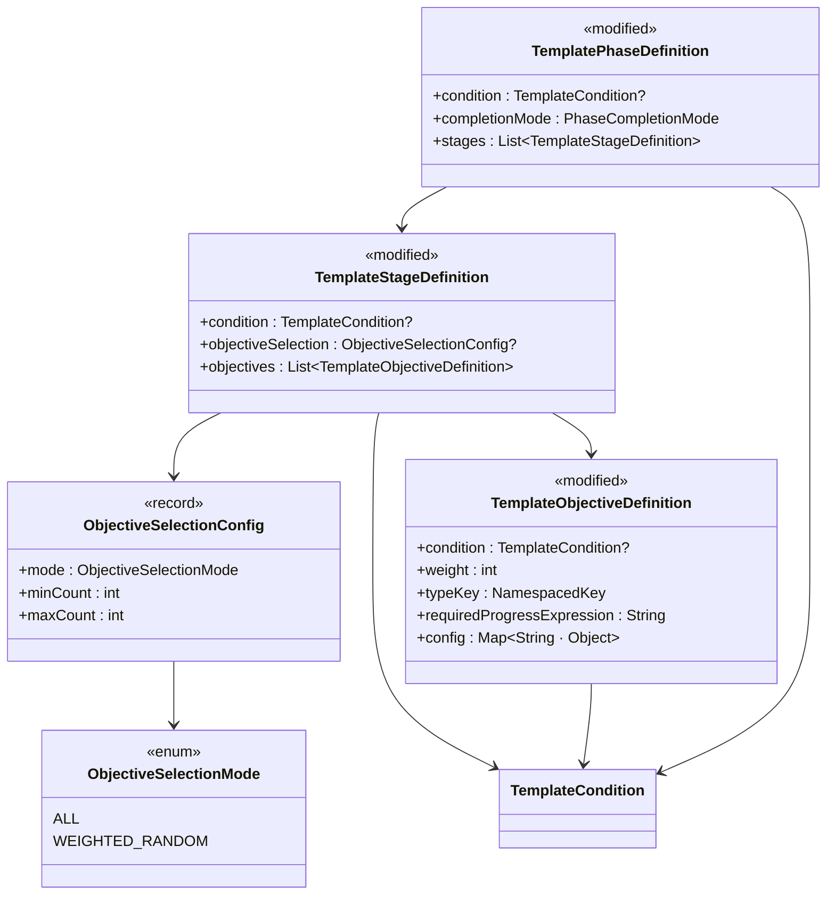
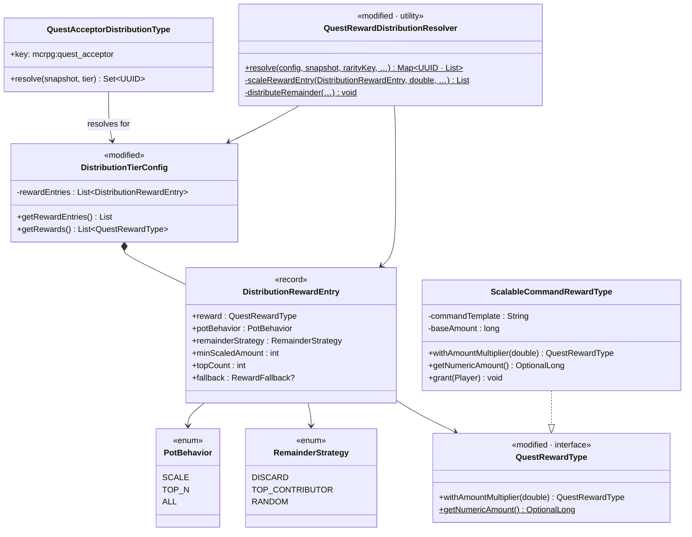
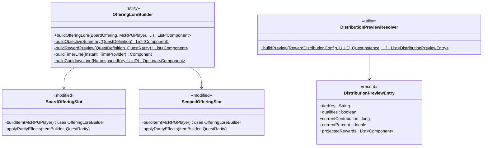

# Phase 4 LLD: Advanced Templates and Polish

> **HLD Reference:** [docs/hld/quest-board.md](../../hld/quest-board.md)
> **Phase 1 LLD:** [phase-1-core-board-infrastructure.md](phase-1-core-board-infrastructure.md)
> **Phase 2 LLD:** [phase-2-per-player-slots-and-templates.md](phase-2-per-player-slots-and-templates.md)
> **Phase 3 LLD:** [phase-3-land-quests-and-rewards.md](phase-3-land-quests-and-rewards.md)
> **Status:** DESIGN

## Scope

Phase 4 adds four categories of enhancements on top of the Phase 1–3 board infrastructure: **advanced template features** (conditional objectives, weighted objective selection from pools, variable-dependent stage gating, completion prerequisites, and permission-based gating), **reward fallback system** (per-reward conditional substitution when a player already has the primary reward), **advanced split-mode reward handling** (per-reward pot behavior, scalable commands, remainder strategies, and minimum scaling thresholds), and **board GUI polish** (rich offering lore, timer displays, rarity visual effects, and contribution-based distribution previews).

This phase also closes the testing debt deferred from Phase 3: multi-level distribution integration tests and completion listener distribution tests.

All database schemas and class constructors assume a **fresh installation** -- no migration logic, no backwards-compatibility constraints with prior schema versions.

**In scope:**
- `TemplateCondition` extensible interface with `TemplateConditionRegistry` and `TemplateConditionContentPack` for third-party condition registration
- Built-in condition types: `RarityCondition`, `ChanceCondition`, `VariableCondition`, `CompoundCondition`
- `ConditionContext` record -- unified evaluation context supporting template generation, prerequisite checks, and reward grant-time evaluation
- `PermissionCondition` (`mcrpg:permission_check`) -- built-in condition checking Bukkit permission nodes (for fallback rewards and prerequisites)
- `CompletionPrerequisiteCondition` (`mcrpg:completion_prerequisite`) -- built-in condition gating templates/categories behind quest completion requirements (filtered by board category and min-rarity)
- Template-level and category-level `prerequisite:` sections for personal offering eligibility gating
- `RewardFallback` record -- per-reward conditional fallback for both standard rewards and distribution tiers (when a condition passes, substitute a fallback reward)
- `QuestRewardEntry` wrapper for standard rewards carrying optional `RewardFallback`
- Conditional objectives, stages, and phases in template definitions (evaluated during `QuestTemplateEngine.generate()`)
- `ObjectiveSelectionConfig` -- weighted random objective selection from pools within a template stage
- Per-objective `weight` field in `TemplateObjectiveDefinition` (for weighted random selection)
- Variable-dependent stage gating (conditions that reference resolved variable values)
- `DistributionRewardEntry` -- per-reward wrapper within distribution tiers, carrying `PotBehavior`, `RemainderStrategy`, and `minScaledAmount`
- `PotBehavior` enum (`SCALE`, `TOP_N`, `ALL`) -- per-reward control of how split-mode tiers handle non-scalable rewards
- `topCount` field on `DistributionRewardEntry` -- configures how many top contributors receive the reward when `pot-behavior: TOP_N` (defaults to 1)
- `QuestAcceptorDistributionType` (`mcrpg:quest_acceptor`) -- distribution type that resolves exclusively to the player who accepted a scoped quest, for "leader bonus" rewards
- `RemainderStrategy` enum (`DISCARD`, `TOP_CONTRIBUTOR`, `RANDOM`) -- integer truncation remainder distribution
- `ScalableCommandRewardType` (`mcrpg:scalable_command`) -- command reward with `{amount}` token for pot distribution
- `min-scaled-amount` per-reward config to prevent minimum-1 clamping from exceeding pot totals
- `QuestRewardType.getNumericAmount()` default method for remainder calculation
- Board GUI polish: enhanced offering lore (objective summary, reward preview, timer countdowns), rarity visual effects (enchantment glint, custom model data)
- `OfferingLoreBuilder` utility for rich, localized offering lore generation
- `DistributionPreviewResolver` utility for live contribution preview in GUI
- Distribution preview lore on active scoped quest display
- Objective-level `reward-distribution` serialization in `GeneratedQuestDefinitionSerializer` (gap from Phase 3)
- Multi-level distribution integration tests (deferred from Phase 3)
- Completion listener distribution tests (deferred from Phase 3)
- Edge case hardening: concurrent acceptance races, server restart mid-rotation recovery, offering state consistency validation
- Integration test suite for end-to-end board flows

**Out of scope (future phases / community-driven):**
- Cross-referencing between templates -- composing smaller templates into larger quests (high complexity, deferred to future phase; see section 15.1)
- Composite pot bundles -- holistic multi-reward decomposition (config complexity outweighs value; see section 15.2)
- Factions/Towny scope adapter implementations -- reference implementation pattern documented in section 15.3; actual implementations are community-driven using the generic `ScopedBoardAdapter` framework from Phase 3
- Reputation system (Phase 5)
- NPC-bound boards (Phase 5)

---

## Class Diagrams

### Diagram 1: Template Condition Hierarchy (Extensible)

```mermaid
classDiagram
    direction TB

    class TemplateCondition {
        <<interface>>
        +getKey() NamespacedKey
        +evaluate(ConditionContext) boolean
        +getExpansionKey() NamespacedKey
    }

    class TemplateConditionRegistry {
        +register(TemplateCondition)
        +get(NamespacedKey) Optional
        +getAll() Collection
    }

    class TemplateConditionContentPack {
        +getHandlerType() TEMPLATE_CONDITION
        +handle(TemplateCondition)
    }

    class ConditionContext {
        <<record>>
        +rolledRarity : NamespacedKey?
        +rarityRegistry : QuestRarityRegistry?
        +random : Random?
        +resolvedVariables : ResolvedVariableContext?
        +playerUUID : UUID?
        +completionHistory : QuestCompletionHistory?
        +forTemplateGeneration(…)$ ConditionContext
        +forPersonalGeneration(…)$ ConditionContext
        +forPrerequisiteCheck(…)$ ConditionContext
        +forRewardGrant(…)$ ConditionContext
    }

    class QuestCompletionHistory {
        <<interface>>
        +countCompletedQuests(UUID, NamespacedKey?, NamespacedKey?) int
    }

    class RarityCondition {
        +key: mcrpg:rarity_gate
        +minimumRarity : NamespacedKey
        +evaluate(ctx) boolean
    }

    class ChanceCondition {
        +key: mcrpg:chance
        +chance : double
        +evaluate(ctx) boolean
    }

    class VariableCondition {
        +key: mcrpg:variable_check
        +variableName : String
        +check : VariableCheck
        +evaluate(ctx) boolean
    }

    class PermissionCondition {
        +key: mcrpg:permission_check
        +permission : String
        +evaluate(ctx) boolean
    }

    class CompletionPrerequisiteCondition {
        +key: mcrpg:completion_prerequisite
        +minCompletions : int
        +categoryKey : NamespacedKey?
        +minRarity : NamespacedKey?
        +evaluate(ctx) boolean
    }

    class CompoundCondition {
        +key: mcrpg:compound
        +conditions : Map~String · TemplateCondition~
        +mode : LogicMode
        +evaluate(ctx) boolean
    }

    class LogicMode {
        <<enum>>
        ALL
        ANY
    }

    class VariableCheck {
        <<sealed interface>>
    }

    class ContainsAny {
        <<record>>
        +values : List~String~
    }

    class NumericComparison {
        <<record>>
        +operator : ComparisonOperator
        +threshold : double
    }

    class ComparisonOperator {
        <<enum>>
        GREATER_THAN
        LESS_THAN
        GREATER_THAN_OR_EQUAL
        LESS_THAN_OR_EQUAL
    }

    class RewardFallback {
        <<record>>
        +condition : TemplateCondition
        +fallbackReward : QuestRewardType
    }

    class QuestRewardEntry {
        <<record>>
        +reward : QuestRewardType
        +fallback : RewardFallback?
    }

    class ConditionEntry {
        <<record>>
        +conditionKey : NamespacedKey
        +parameters : Map~String · Object~
    }

    RarityCondition ..|> TemplateCondition
    ChanceCondition ..|> TemplateCondition
    VariableCondition ..|> TemplateCondition
    PermissionCondition ..|> TemplateCondition
    CompletionPrerequisiteCondition ..|> TemplateCondition
    CompoundCondition ..|> TemplateCondition
    CompoundCondition --> LogicMode
    CompoundCondition *-- ConditionEntry
    VariableCondition --> VariableCheck
    ContainsAny ..|> VariableCheck
    NumericComparison ..|> VariableCheck
    NumericComparison --> ComparisonOperator
    TemplateCondition --> ConditionContext : evaluates against
    ConditionContext --> QuestCompletionHistory
    TemplateConditionRegistry o-- TemplateCondition
    TemplateConditionContentPack --> TemplateConditionRegistry : registers
    RewardFallback --> TemplateCondition : triggers on
    QuestRewardEntry --> RewardFallback
```



### Diagram 2: Weighted Objective Selection



### Diagram 3: Advanced Split-Mode Reward Handling



### Diagram 4: Board GUI Polish



---

## 1. New Classes -- Template Conditionals

### 1.1 `TemplateCondition` -- Extensible Condition Interface

**Package:** `us.eunoians.mcrpg.quest.board.template.condition`
**File:** `src/main/java/us/eunoians/mcrpg/quest/board/template/condition/TemplateCondition.java`

Defines a condition that can be attached to any template element (phase, stage, or objective). Evaluated during `QuestTemplateEngine.generate()` to determine whether the element is included in the generated `QuestDefinition`. The interface is **extensible** -- third-party plugins can register custom condition types via `TemplateConditionRegistry` and `TemplateConditionContentPack`, following the same pattern as `RewardDistributionType`, `QuestObjectiveType`, and `QuestRewardType`. Each condition type is identified by a `NamespacedKey` and must provide a `fromConfig()` factory method that parses condition-specific parameters from a YAML `Section`.

```java
public interface TemplateCondition extends McRPGContent {

    /**
     * The unique key identifying this condition type (e.g., {@code mcrpg:rarity_gate}).
     */
    @NotNull NamespacedKey getKey();

    /**
     * Evaluates this condition against the current generation context.
     *
     * @param context the template generation context (rarity, random, resolved variables)
     * @return true if the condition is met and the element should be included
     */
    boolean evaluate(@NotNull ConditionContext context);

    /**
     * Creates a configured instance of this condition type from the given YAML section.
     * Called during template parsing to construct condition instances from config.
     *
     * @param section the YAML section containing condition-specific parameters
     * @return a configured condition instance
     */
    @NotNull TemplateCondition fromConfig(@NotNull Section section);
}
```

**Why extensible (not sealed)?** The codebase's registry pattern is consistently used for all pluggable types (`QuestObjectiveType`, `QuestRewardType`, `RewardDistributionType`, `QuestSource`, `RefreshType`). A sealed interface would be the only exception. Third-party plugins have legitimate condition needs that cannot be composed from built-in types:

- **Permission conditions**: "Only include this objective if the player has `vip.mining.bonus`" (requires Bukkit permission check -- cannot be expressed via rarity, chance, or variable conditions)
- **Plugin integration conditions**: "Only include this phase if MythicMobs is loaded" (server-level check)
- **Economy conditions**: "Only include this reward tier if the player's balance exceeds 10,000" (requires Vault/economy hook)
- **Custom progression conditions**: "Only include this bonus stage if the player has unlocked the Mining mastery" (requires custom plugin state)

### 1.1a `TemplateConditionRegistry`

**Package:** `us.eunoians.mcrpg.quest.board.template.condition`
**File:** `src/main/java/us/eunoians/mcrpg/quest/board/template/condition/TemplateConditionRegistry.java`

Standard `Registry<TemplateCondition>` pattern. Condition types are registered at startup via content packs and are not reloaded.

```java
public class TemplateConditionRegistry implements Registry<TemplateCondition> {

    private final Map<NamespacedKey, TemplateCondition> conditions = new LinkedHashMap<>();

    public void register(@NotNull TemplateCondition condition) { ... }
    public Optional<TemplateCondition> get(@NotNull NamespacedKey key) { ... }
    public Collection<TemplateCondition> getAll() { ... }
}
```

**Registry key:** Add `TEMPLATE_CONDITION` to `McRPGRegistryKey`.

### 1.1b `TemplateConditionContentPack`

**Package:** `us.eunoians.mcrpg.expansion.content`

Registers `TemplateCondition` implementations into `TemplateConditionRegistry`. Handler type: `ContentHandlerType.TEMPLATE_CONDITION`. Built-in conditions are registered by `McRPGExpansion`.

```java
public class TemplateConditionContentPack implements ContentPack<TemplateCondition> {

    @Override
    @NotNull
    public ContentHandlerType<TemplateCondition> getHandlerType() {
        return ContentHandlerType.TEMPLATE_CONDITION;
    }

    @Override
    public void handle(@NotNull TemplateCondition condition) {
        RegistryAccess.registryAccess()
                .registry(McRPGRegistryKey.TEMPLATE_CONDITION)
                .register(condition);
    }
}
```

### 1.2 `ConditionContext` -- Unified Condition Evaluation Context

**Package:** `us.eunoians.mcrpg.quest.board.template.condition`
**File:** `src/main/java/us/eunoians/mcrpg/quest/board/template/condition/ConditionContext.java`

Unified context passed to every `TemplateCondition.evaluate()` call. Different evaluation sites populate different fields -- conditions handle missing fields gracefully by returning a context-appropriate default. This enables the same condition interface to serve template generation, prerequisite checks, and reward grant-time evaluation without separate interfaces.

```java
public record ConditionContext(
    @Nullable NamespacedKey rolledRarity,
    @Nullable QuestRarityRegistry rarityRegistry,
    @Nullable Random random,
    @Nullable ResolvedVariableContext resolvedVariables,
    @Nullable UUID playerUUID,
    @Nullable QuestCompletionHistory completionHistory
) {
    /**
     * Context for template generation (shared offerings). Has rarity, random, and
     * resolved variables. No player data -- player-dependent conditions return true
     * (include by default) so they don't inadvertently filter shared content.
     */
    public static ConditionContext forTemplateGeneration(
            @NotNull NamespacedKey rarity, @NotNull QuestRarityRegistry registry,
            @NotNull Random random, @NotNull ResolvedVariableContext vars) {
        return new ConditionContext(rarity, registry, random, vars, null, null);
    }

    /**
     * Context for personal offering generation. Has everything template generation
     * has, plus the player UUID and their completion history for prerequisite
     * and player-dependent conditions.
     */
    public static ConditionContext forPersonalGeneration(
            @NotNull NamespacedKey rarity, @NotNull QuestRarityRegistry registry,
            @NotNull Random random, @NotNull ResolvedVariableContext vars,
            @NotNull UUID playerUUID, @NotNull QuestCompletionHistory history) {
        return new ConditionContext(rarity, registry, random, vars, playerUUID, history);
    }

    /**
     * Context for prerequisite evaluation (template/category eligibility).
     * Has player UUID and completion history. No generation-specific fields.
     */
    public static ConditionContext forPrerequisiteCheck(
            @NotNull UUID playerUUID, @NotNull QuestCompletionHistory history) {
        return new ConditionContext(null, null, null, null, playerUUID, history);
    }

    /**
     * Context for reward grant-time evaluation (fallback reward checks).
     * Has the player UUID and optionally the quest's rarity key.
     */
    public static ConditionContext forRewardGrant(
            @NotNull UUID playerUUID, @Nullable NamespacedKey rarity,
            @Nullable QuestRarityRegistry registry) {
        return new ConditionContext(rarity, registry, null, null, playerUUID, null);
    }
}
```

**Missing-field behavior per condition type:**

| Condition | Required fields | If missing | Rationale |
|-----------|----------------|------------|-----------|
| `RarityCondition` | `rolledRarity`, `rarityRegistry` | returns `true` | Don't exclude elements when rarity isn't available |
| `ChanceCondition` | `random` | returns `true` | Don't exclude elements without a random source |
| `VariableCondition` | `resolvedVariables` | returns `true` | Don't exclude elements without variable data |
| `PermissionCondition` | `playerUUID` | returns `false` | Safely deny access when no player context |
| `CompletionPrerequisiteCondition` | `playerUUID`, `completionHistory` | returns `false` | Safely deny access when no player/history |
| `CompoundCondition` | *(delegates to children)* | *(delegates)* | Each child handles its own missing fields |

**`QuestCompletionHistory`** is a read-only interface that abstracts over `QuestCompletionLogDAO`, providing query methods for condition evaluation without coupling conditions to the database layer:

```java
public interface QuestCompletionHistory {

    /**
     * Counts quests this player has completed, optionally filtered by
     * board category key and minimum rarity.
     */
    int countCompletedQuests(@NotNull UUID playerUUID,
                            @Nullable NamespacedKey categoryKey,
                            @Nullable NamespacedKey minRarity);
}
```

### 1.3 `RarityCondition` -- Rarity Gate (`mcrpg:rarity_gate`)

**Package:** `us.eunoians.mcrpg.quest.board.template.condition`
**File:** `src/main/java/us/eunoians/mcrpg/quest/board/template/condition/RarityCondition.java`

Evaluates to `true` if the rolled rarity is at least as rare as the specified minimum. Uses the same weight comparison logic as `DistributionTierConfig.passesRarityGate()`: lower weight = rarer, so the condition passes when `rolledWeight <= minimumWeight`.

**Use cases:**

| Scenario | Config | Effect |
|----------|--------|--------|
| **Bonus boss objective** | `rarity-at-least: RARE` on a kill-boss objective | COMMON and UNCOMMON quests are simpler (just mine blocks). RARE+ quests add a boss fight, making them feel special and justifying their higher rewards. |
| **Legendary bonus phase** | `rarity-at-least: LEGENDARY` on a second phase | Most quests are single-phase. LEGENDARY quests get an entire bonus phase (e.g., "Smelt the ores you mined"), making them feel like epic multi-part adventures. |
| **Harder mob targets** | `rarity-at-least: UNCOMMON` on a mob kill objective | COMMON quests are pure mining. UNCOMMON+ quests add a combat component, scaling the quest's breadth with its rarity tier. |
| **Rare reward tier** | `rarity-at-least: RARE` on a reward entry | The reward (e.g., bonus command) is only included in the quest definition when generated at RARE or higher. Players see richer reward lists on rarer quests. |

```java
public final class RarityCondition implements TemplateCondition {

    public static final NamespacedKey KEY = NamespacedKey.of("mcrpg", "rarity_gate");

    private final NamespacedKey minimumRarity;

    public RarityCondition(@NotNull NamespacedKey minimumRarity) {
        this.minimumRarity = minimumRarity;
    }

    @Override
    public boolean evaluate(@NotNull ConditionContext context) {
        if (context.rolledRarity() == null || context.rarityRegistry() == null) return true;
        Optional<QuestRarity> rolled = context.rarityRegistry().get(context.rolledRarity());
        Optional<QuestRarity> minimum = context.rarityRegistry().get(minimumRarity);
        if (rolled.isEmpty() || minimum.isEmpty()) return false;
        return rolled.get().getWeight() <= minimum.get().getWeight();
    }

    @NotNull @Override public NamespacedKey getKey() { return KEY; }
    @NotNull @Override public NamespacedKey getExpansionKey() { return McRPGExpansion.EXPANSION_KEY; }

    @NotNull
    @Override
    public TemplateCondition fromConfig(@NotNull Section section) {
        NamespacedKey rarityKey = parseNamespacedKey(section.getString("min-rarity"))
                .orElseThrow(() -> new IllegalArgumentException("Missing 'min-rarity' in rarity_gate condition"));
        return new RarityCondition(rarityKey);
    }
}
```

**YAML (shorthand):** `rarity-at-least: RARE`
**YAML (explicit):**

```yaml
condition:
  type: mcrpg:rarity_gate
  min-rarity: RARE
```

### 1.4 `ChanceCondition` -- Random Chance Gate (`mcrpg:chance`)

**Package:** `us.eunoians.mcrpg.quest.board.template.condition`
**File:** `src/main/java/us/eunoians/mcrpg/quest/board/template/condition/ChanceCondition.java`

Evaluates to `true` with the given probability. Uses the generation context's `Random` instance for deterministic seeding consistency.

**Use cases:**

| Scenario | Config | Effect |
|----------|--------|--------|
| **Surprise bonus objective** | `chance: 0.2` on a crafting objective | 20% of generated quests include a "craft the items you gathered" bonus objective. Players occasionally get longer, more rewarding quests. |
| **Rare bonus stage** | `chance: 0.1` on a bonus stage | 10% of quests get an entire bonus stage. Keeps the board feeling varied even across the same template. |
| **Optional combat component** | `chance: 0.5` on a mob kill objective | Half the mining quests also require killing mobs. Players learn that the same template can produce different quest shapes. |
| **Easter egg phase** | `chance: 0.01` on a secret phase | 1% of quests from this template include a secret phase with unique rewards. Creates excitement and word-of-mouth among players. |

```java
public final class ChanceCondition implements TemplateCondition {

    public static final NamespacedKey KEY = NamespacedKey.of("mcrpg", "chance");

    private final double chance;

    public ChanceCondition(double chance) {
        if (chance < 0.0 || chance > 1.0) {
            throw new IllegalArgumentException("Chance must be between 0.0 and 1.0, got: " + chance);
        }
        this.chance = chance;
    }

    @Override
    public boolean evaluate(@NotNull ConditionContext context) {
        if (context.random() == null) return true;
        return context.random().nextDouble() < chance;
    }

    @NotNull @Override public NamespacedKey getKey() { return KEY; }
    @NotNull @Override public NamespacedKey getExpansionKey() { return McRPGExpansion.EXPANSION_KEY; }

    @NotNull
    @Override
    public TemplateCondition fromConfig(@NotNull Section section) {
        return new ChanceCondition(section.getDouble("chance"));
    }
}
```

**YAML (shorthand):** `chance: 0.3`
**YAML (explicit):**

```yaml
condition:
  type: mcrpg:chance
  chance: 0.3
```

### 1.5 `VariableCondition` -- Variable-Dependent Gate (`mcrpg:variable_check`)

**Package:** `us.eunoians.mcrpg.quest.board.template.condition`
**File:** `src/main/java/us/eunoians/mcrpg/quest/board/template/condition/VariableCondition.java`

Evaluates to `true` if a resolved template variable satisfies the specified check. Enables multi-stage templates where later stages depend on earlier variable rolls (HLD Phase 2 -- "Multi-stage templates where later stages depend on earlier variable rolls").

**Use cases:**

| Scenario | Config | Effect |
|----------|--------|--------|
| **Precious ore smelting** | `contains-any: [DIAMOND_ORE, EMERALD_ORE]` on `target_blocks` | If the pool roll selected precious ores, add a "smelt the ores" phase. Ensures the smelting phase only appears when it makes thematic sense. |
| **High-volume bonus** | `greater-than: 50` on `block_count` | If the RANGE variable rolled a high target count, add a bonus reward objective. Rewards players facing harder quests with extra opportunity. |
| **Boss encounter** | `contains-any: ["mythicmobs:fire_elemental"]` on `target_mobs` | If the custom mob pool was selected, add a "defeat the boss" stage with special loot. Ties quest structure to the specific content rolled. |
| **Small batch shortcut** | `less-than: 20` on `block_count` | If the target is small, skip the "gather supplies" phase and go straight to the main objective. Prevents trivially-small quests from feeling padded. |
| **Difficulty-gated stage** | `at-least: 2.5` on `difficulty` | If the combined difficulty scalar is high enough, add an expert-tier bonus stage. Uses the built-in `difficulty` variable. |

```java
public final class VariableCondition implements TemplateCondition {

    public static final NamespacedKey KEY = NamespacedKey.of("mcrpg", "variable_check");

    private final String variableName;
    private final VariableCheck check;

    public VariableCondition(@NotNull String variableName, @NotNull VariableCheck check) {
        this.variableName = variableName;
        this.check = check;
    }

    @Override
    public boolean evaluate(@NotNull ConditionContext context) {
        if (context.resolvedVariables() == null) return true;
        Object value = context.resolvedVariables().resolvedValues().get(variableName);
        if (value == null) return false;
        return check.test(value);
    }

    @NotNull @Override public NamespacedKey getKey() { return KEY; }
    @NotNull @Override public NamespacedKey getExpansionKey() { return McRPGExpansion.EXPANSION_KEY; }

    @NotNull
    @Override
    public TemplateCondition fromConfig(@NotNull Section section) {
        String name = section.getString("name");
        VariableCheck check = parseVariableCheck(section);
        return new VariableCondition(name, check);
    }
}
```

**`VariableCheck` -- sealed check interface:**

```java
public sealed interface VariableCheck {

    boolean test(@NotNull Object resolvedValue);

    /**
     * Checks whether a resolved POOL variable's merged value list contains
     * any of the specified values. For example, checking if the selected
     * blocks include DIAMOND_ORE.
     */
    record ContainsAny(@NotNull List<String> values) implements VariableCheck {
        @Override
        public boolean test(@NotNull Object resolvedValue) {
            if (resolvedValue instanceof List<?> list) {
                return list.stream()
                        .map(Object::toString)
                        .anyMatch(values::contains);
            }
            return values.contains(resolvedValue.toString());
        }
    }

    /**
     * Checks whether a resolved RANGE variable's numeric value satisfies
     * a comparison against a threshold.
     */
    record NumericComparison(
        @NotNull ComparisonOperator operator,
        double threshold
    ) implements VariableCheck {
        @Override
        public boolean test(@NotNull Object resolvedValue) {
            if (resolvedValue instanceof Number n) {
                return operator.compare(n.doubleValue(), threshold);
            }
            return false;
        }
    }
}
```

**`ComparisonOperator`:**

```java
public enum ComparisonOperator {
    GREATER_THAN { boolean compare(double a, double b) { return a > b; } },
    LESS_THAN { boolean compare(double a, double b) { return a < b; } },
    GREATER_THAN_OR_EQUAL { boolean compare(double a, double b) { return a >= b; } },
    LESS_THAN_OR_EQUAL { boolean compare(double a, double b) { return a <= b; } };

    abstract boolean compare(double a, double b);
}
```

**YAML examples:**

```yaml
# Include bonus stage only if precious ores were selected
condition:
  variable:
    name: target_blocks
    contains-any: [DIAMOND_ORE, EMERALD_ORE]

# Include hard objective only if block_count rolled above 50
condition:
  variable:
    name: block_count
    greater-than: 50
```

### 1.6 `CompoundCondition` -- Logical Combination (`mcrpg:compound`)

**Package:** `us.eunoians.mcrpg.quest.board.template.condition`
**File:** `src/main/java/us/eunoians/mcrpg/quest/board/template/condition/CompoundCondition.java`

Combines multiple conditions with `ALL` (AND) or `ANY` (OR) logic. Child conditions are stored as a named map of `TemplateCondition` instances, keyed by arbitrary human-readable labels. Conditions are resolved from the `TemplateConditionRegistry` at parse time, enabling compound conditions to compose third-party condition types.

**Use cases:**

| Scenario | Config | Effect |
|----------|--------|--------|
| **Precious ore bonus phase** | `all: {rarity-check: RARE, variable-check: target_blocks contains DIAMOND_ORE}` | Only RARE+ quests that also rolled precious ores get the bonus smelting phase. Prevents the phase from appearing on a RARE quest that rolled common stone. |
| **Challenge-or-lucky gate** | `any: {legendary-gate: LEGENDARY, lucky-roll: 0.05}` | 5% of all quests OR any LEGENDARY quest gets the bonus objective. Creates rare surprises at any rarity while guaranteeing it on LEGENDARY. |
| **High-difficulty expert stage** | `all: {uncommon-gate: UNCOMMON, difficulty-check: at-least 2.0}` | Both rarity AND difficulty must be elevated. Prevents easy UNCOMMON quests (low pool difficulty) from getting expert content. |
| **Third-party compound** | `all: {vip-check: vip:has_rank, rarity-gate: RARE}` | A VIP plugin's condition composed with a built-in rarity gate. Demonstrates third-party conditions working inside compound conditions. |

```java
public final class CompoundCondition implements TemplateCondition {

    public static final NamespacedKey KEY = NamespacedKey.of("mcrpg", "compound");

    private final Map<String, TemplateCondition> conditions;
    private final LogicMode mode;

    public enum LogicMode { ALL, ANY }

    public CompoundCondition(@NotNull Map<String, TemplateCondition> conditions, @NotNull LogicMode mode) {
        this.conditions = Map.copyOf(conditions);
        this.mode = mode;
        if (conditions.isEmpty()) {
            throw new IllegalArgumentException("CompoundCondition requires at least one child condition");
        }
    }

    @Override
    public boolean evaluate(@NotNull ConditionContext context) {
        return switch (mode) {
            case ALL -> conditions.values().stream().allMatch(c -> c.evaluate(context));
            case ANY -> conditions.values().stream().anyMatch(c -> c.evaluate(context));
        };
    }

    @NotNull @Override public NamespacedKey getKey() { return KEY; }
    @NotNull @Override public NamespacedKey getExpansionKey() { return McRPGExpansion.EXPANSION_KEY; }

    @NotNull
    @Override
    public TemplateCondition fromConfig(@NotNull Section section) {
        LogicMode mode = section.contains("all") ? LogicMode.ALL : LogicMode.ANY;
        String key = mode == LogicMode.ALL ? "all" : "any";
        Section children = section.getSection(key);
        Map<String, TemplateCondition> parsed = new LinkedHashMap<>();
        for (String label : children.getRoutesAsStrings(false)) {
            parsed.put(label, ConditionParser.parseSingle(children.getSection(label)));
        }
        return new CompoundCondition(parsed, mode);
    }
}
```

**YAML (named keys -- each child has a human-readable label):**

```yaml
# AND -- all children must pass
condition:
  all:
    rarity-check:
      rarity-at-least: RARE
    block-check:
      variable:
        name: target_blocks
        contains-any: [DIAMOND_ORE, EMERALD_ORE]

# Third-party conditions work inside compound blocks
condition:
  all:
    vip-rank-check:
      type: vip:rank_check
      min-rank: gold
    rarity-check:
      rarity-at-least: RARE
```

The child labels (e.g. `rarity-check`, `block-check`, `vip-rank-check`) are arbitrary -- they exist purely for readability and are not used programmatically. Each child's value is a standard condition block (shorthand or explicit).

### 1.7 `PermissionCondition` -- Bukkit Permission Gate (`mcrpg:permission_check`)

**Package:** `us.eunoians.mcrpg.quest.board.template.condition`
**File:** `src/main/java/us/eunoians/mcrpg/quest/board/template/condition/PermissionCondition.java`

Evaluates to `true` if the player in the context has the specified Bukkit permission node. This is the primary condition for **fallback rewards** (e.g., "player already has this title, give XP instead") and can also be used in prerequisites or compound conditions for VIP gating.

Requires player context -- returns `false` when no player UUID is available (safe default: deny access).

**Use cases:**

| Scenario | Config | Effect |
|----------|--------|--------|
| **Fallback reward trigger** | `permission: mcrpg.title.land_hero` on a title reward's fallback | If the player already has the title (permission granted by the title system), they receive a fallback XP reward instead of a duplicate title. |
| **VIP-only bonus objective** | `permission: mcrpg.vip.bonus_objectives` on a bonus objective | Only VIP players see the bonus objective in their generated quest. Non-VIP players get a simpler quest shape. |
| **Tiered prerequisite** | `permission: mcrpg.tier.advanced` on a template prerequisite | Templates gated behind an advancement tier. Players must earn the permission through progression before the template enters their pool. |
| **Compound with rarity** | Inside `all:` with `rarity-at-least: RARE` | Only VIP players AND only on RARE+ quests get the special phase. Combines player-dependent and generation-time checks. |

```java
public final class PermissionCondition implements TemplateCondition {

    public static final NamespacedKey KEY = NamespacedKey.of("mcrpg", "permission_check");

    private final String permission;

    public PermissionCondition(@NotNull String permission) {
        this.permission = permission;
    }

    @Override
    public boolean evaluate(@NotNull ConditionContext context) {
        if (context.playerUUID() == null) return false;
        Player player = Bukkit.getPlayer(context.playerUUID());
        if (player == null) return false;
        return player.hasPermission(permission);
    }

    @NotNull @Override public NamespacedKey getKey() { return KEY; }
    @NotNull @Override public NamespacedKey getExpansionKey() { return McRPGExpansion.EXPANSION_KEY; }

    @NotNull
    @Override
    public TemplateCondition fromConfig(@NotNull Section section) {
        String perm = section.getString("permission");
        if (perm == null || perm.isBlank()) {
            throw new IllegalArgumentException("Missing 'permission' in permission_check condition");
        }
        return new PermissionCondition(perm);
    }
}
```

**YAML (shorthand):** `permission: mcrpg.title.land_hero`
**YAML (explicit):**

```yaml
condition:
  type: mcrpg:permission_check
  permission: mcrpg.title.land_hero
```

### 1.8 `CompletionPrerequisiteCondition` -- Quest Completion Gate (`mcrpg:completion_prerequisite`)

**Package:** `us.eunoians.mcrpg.quest.board.template.condition`
**File:** `src/main/java/us/eunoians/mcrpg/quest/board/template/condition/CompletionPrerequisiteCondition.java`

Evaluates to `true` if the player has completed at least `minCompletions` quests, optionally filtered by **board category** (e.g., `personal-daily`, `land-weekly`) and/or **minimum rarity** (at-least semantics). This condition is designed primarily for the `prerequisite:` section on templates and categories to gate personal offerings behind progression milestones.

**Scope:** Personal offerings only. Shared offerings cannot be player-filtered at generation time, so this condition should only be used on `PERSONAL` visibility templates or in category-level prerequisites. If evaluated without player context (e.g., shared template generation), returns `false` to safely exclude the template.

**Use cases:**

| Scenario | Config | Effect |
|----------|--------|--------|
| **New player ramp-up** | `min-completions: 5` (no category/rarity filter) | Players must complete 5 quests of any kind before this template enters their pool. Prevents overwhelming new players with complex quests. |
| **Category progression** | `min-completions: 10, category: personal-daily` | Must complete 10 personal daily quests before unlocking this weekly template. Creates a natural progression arc from dailies to weeklies. |
| **Rarity gating** | `min-completions: 3, min-rarity: RARE` | Must complete 3 RARE+ quests before this elite template unlocks. Ensures players have demonstrated competence at higher difficulty. |
| **Combined gate** | `min-completions: 5, category: personal-weekly, min-rarity: UNCOMMON` | Must complete 5 UNCOMMON+ personal weekly quests. Tight gate for late-game content. |
| **Category-level gate** | On a category's `prerequisite:` section: `min-completions: 20` | The entire personal-weekly category is hidden until the player completes 20 quests total. Introduces board categories gradually. |

```java
public final class CompletionPrerequisiteCondition implements TemplateCondition {

    public static final NamespacedKey KEY = NamespacedKey.of("mcrpg", "completion_prerequisite");

    private final int minCompletions;
    @Nullable private final NamespacedKey categoryKey;
    @Nullable private final NamespacedKey minRarity;

    public CompletionPrerequisiteCondition(int minCompletions,
                                           @Nullable NamespacedKey categoryKey,
                                           @Nullable NamespacedKey minRarity) {
        if (minCompletions < 1) {
            throw new IllegalArgumentException("minCompletions must be >= 1, got: " + minCompletions);
        }
        this.minCompletions = minCompletions;
        this.categoryKey = categoryKey;
        this.minRarity = minRarity;
    }

    @Override
    public boolean evaluate(@NotNull ConditionContext context) {
        if (context.playerUUID() == null || context.completionHistory() == null) return false;
        int completed = context.completionHistory().countCompletedQuests(
                context.playerUUID(), categoryKey, minRarity);
        return completed >= minCompletions;
    }

    @NotNull @Override public NamespacedKey getKey() { return KEY; }
    @NotNull @Override public NamespacedKey getExpansionKey() { return McRPGExpansion.EXPANSION_KEY; }

    @NotNull
    @Override
    public TemplateCondition fromConfig(@NotNull Section section) {
        int count = section.getInt("min-completions");
        NamespacedKey category = section.contains("category")
                ? parseNamespacedKey(section.getString("category")).orElse(null)
                : null;
        NamespacedKey rarity = section.contains("min-rarity")
                ? parseNamespacedKey(section.getString("min-rarity")).orElse(null)
                : null;
        return new CompletionPrerequisiteCondition(count, category, rarity);
    }
}
```

**YAML (shorthand):**

```yaml
prerequisite:
  min-completions: 5
  category: personal-daily
  min-rarity: UNCOMMON
```

**YAML (explicit):**

```yaml
prerequisite:
  type: mcrpg:completion_prerequisite
  min-completions: 5
  category: personal-daily
  min-rarity: UNCOMMON
```

**Prerequisite stacking:** Multiple prerequisites can be combined using `CompoundCondition`:

```yaml
prerequisite:
  all:
    total-gate:
      min-completions: 10
    rare-gate:
      min-completions: 3
      min-rarity: RARE
    category-gate:
      min-completions: 5
      category: personal-daily
```

This requires the player to have completed 10 quests total AND 3 RARE+ quests AND 5 personal-daily quests before the template/category unlocks.

### 1.9 `RewardFallback` and `QuestRewardEntry` -- Conditional Fallback Rewards

**Package:** `us.eunoians.mcrpg.quest.board.template.condition`
**File:** `src/main/java/us/eunoians/mcrpg/quest/board/template/condition/RewardFallback.java`

When a reward is granted, the system first checks whether the reward has a `fallback` block. If it does, the fallback's `condition` is evaluated with a grant-time `ConditionContext` (has player UUID, quest rarity). If the condition evaluates to `true` -- meaning the player already has the reward or meets the condition -- the fallback reward is granted instead of the primary.

This solves the "duplicate reward" problem: if a quest grants a title and the player already has it, they receive XP instead. The same mechanism works for any condition type -- permissions, completion counts, or third-party checks.

**`RewardFallback`:**

```java
public record RewardFallback(
    @NotNull TemplateCondition condition,
    @NotNull QuestRewardType fallbackReward
) {
    public QuestRewardType resolveReward(@NotNull ConditionContext context,
                                         @NotNull QuestRewardType primaryReward) {
        return condition.evaluate(context) ? fallbackReward : primaryReward;
    }
}
```

**`QuestRewardEntry` -- Standard reward wrapper:**

Standard quest rewards (non-distribution) gain a wrapper that optionally carries a fallback. This replaces raw `List<QuestRewardType>` in `QuestDefinition` with `List<QuestRewardEntry>`.

```java
public record QuestRewardEntry(
    @NotNull QuestRewardType reward,
    @Nullable RewardFallback fallback
) {
    public QuestRewardType resolveForPlayer(@NotNull ConditionContext context) {
        if (fallback == null) return reward;
        return fallback.resolveReward(context, reward);
    }
}
```

**Updated `DistributionRewardEntry`** (adds fallback field):

```java
public record DistributionRewardEntry(
    @NotNull QuestRewardType reward,
    @NotNull PotBehavior potBehavior,
    @NotNull RemainderStrategy remainderStrategy,
    int minScaledAmount,
    int topCount,
    @Nullable RewardFallback fallback
) {
    public DistributionRewardEntry {
        if (topCount < 1) throw new IllegalArgumentException("topCount must be >= 1, got: " + topCount);
    }

    public QuestRewardType resolveForPlayer(@NotNull ConditionContext context) {
        if (fallback == null) return reward;
        return fallback.resolveReward(context, reward);
    }
}
```

The `topCount` field is only meaningful when `potBehavior` is `TOP_N`. Defaults to `1` when omitted in YAML. Validated at construction time.

**Use cases:**

| Scenario | Primary reward | Condition | Fallback reward | Effect |
|----------|---------------|-----------|-----------------|--------|
| **Duplicate title prevention** | `/title grant {player} land_hero` | `permission: mcrpg.title.land_hero` | 500 Mining XP | Player already has the title → gets XP instead |
| **Cosmetic already owned** | Custom model item (hat) | `permission: mcrpg.cosmetic.miner_hat` | 3 rare crafting materials | Player already unlocked the cosmetic → gets materials |
| **Rank-based scaling** | 100 XP reward | `permission: mcrpg.rank.veteran` | 200 XP reward | Veterans get double XP since they need more to level |
| **Achievement gating** | Achievement unlock command | `type: mcrpg:completion_prerequisite` with `min-completions: 1` for the same achievement quest | Bonus currency | Already completed the achievement → bonus reward |
| **Economy fallback** | Rare item grant | `type: economy:balance_check` (third-party) | Gold equivalent | If player's inventory is full, give gold instead (third-party condition) |

**YAML -- standard reward with fallback:**

```yaml
rewards:
  hero-title:
    type: mcrpg:command
    commands:
      - "title grant {player} land_hero"
    fallback:
      condition:
        permission: mcrpg.title.land_hero
      reward:
        type: mcrpg:experience
        skill: MINING
        amount: 500

  mining-xp:
    type: mcrpg:experience
    skill: MINING
    amount: 200
```

**YAML -- distribution tier reward with fallback:**

```yaml
reward-distribution:
  top-contributor:
    type: TOP_PLAYERS
    top-player-count: 1
    rewards:
      hero-title:
        type: mcrpg:command
        pot-behavior: TOP_N
        top-count: 1
        commands:
          - "title grant {player} land_hero"
        fallback:
          condition:
            permission: mcrpg.title.land_hero
          reward:
            type: mcrpg:experience
            skill: MINING
            amount: 500
      bonus-xp:
        type: mcrpg:experience
        pot-behavior: SCALE
        skill: MINING
        amount: 1000
```

**Grant-time flow:**

1. Quest completes → reward grant phase begins
2. For each reward entry (standard or distribution-resolved):
   a. If no fallback → grant primary reward as normal
   b. If fallback exists → build `ConditionContext.forRewardGrant(playerUUID, rarity, registry)`
   c. Evaluate fallback condition
   d. If condition is `true` → grant fallback reward
   e. If condition is `false` → grant primary reward

---

## 2. New Classes -- Weighted Objective Selection

### 2.1 `ObjectiveSelectionConfig` -- Selection Mode Configuration

**Package:** `us.eunoians.mcrpg.quest.board.template`
**File:** `src/main/java/us/eunoians/mcrpg/quest/board/template/ObjectiveSelectionConfig.java`

Configures how objectives are selected within a template stage. The default mode (`ALL`) preserves existing behavior -- all objectives in the stage are included. The `WEIGHTED_RANDOM` mode selects a random subset by weight without replacement.

```java
public record ObjectiveSelectionConfig(
    @NotNull ObjectiveSelectionMode mode,
    int minCount,
    int maxCount
) {
    public ObjectiveSelectionConfig {
        if (minCount < 1) throw new IllegalArgumentException("minCount must be >= 1, got: " + minCount);
        if (maxCount < minCount) throw new IllegalArgumentException(
                "maxCount must be >= minCount, got: max=" + maxCount + ", min=" + minCount);
    }

    public enum ObjectiveSelectionMode {
        ALL,
        WEIGHTED_RANDOM
    }
}
```

**YAML:**

```yaml
stages:
  varied-stage:
    objective-selection:
      mode: WEIGHTED_RANDOM
      min-count: 2
      max-count: 3
    objectives:
      break-blocks:
        weight: 80
        type: mcrpg:block_break
        # ...
      kill-mobs:
        weight: 60
        type: mcrpg:mob_kill
        # ...
      craft-items:
        weight: 40
        type: mcrpg:craft
        # ...
```

### 2.2 `WeightedObjectiveSelector` -- Selection Algorithm

**Package:** `us.eunoians.mcrpg.quest.board.template`
**File:** `src/main/java/us/eunoians/mcrpg/quest/board/template/WeightedObjectiveSelector.java`

Stateless utility that performs weighted random selection of objectives from a candidate pool. Selection is without replacement -- an objective is never selected twice. Uses the generation context's `Random` for deterministic seeding.

```java
public final class WeightedObjectiveSelector {

    private WeightedObjectiveSelector() {}

    /**
     * Selects a random subset of objectives from the candidates using weighted
     * random selection without replacement.
     *
     * @param candidates       objectives that passed condition evaluation
     * @param selectionConfig  min/max count and mode
     * @param random           seeded random for deterministic generation
     * @return the selected subset, preserving relative order from the candidate list
     * @throws QuestGenerationException if fewer candidates exist than minCount
     */
    @NotNull
    public static List<TemplateObjectiveDefinition> select(
            @NotNull List<TemplateObjectiveDefinition> candidates,
            @NotNull ObjectiveSelectionConfig selectionConfig,
            @NotNull Random random) {

        if (candidates.size() < selectionConfig.minCount()) {
            throw new QuestGenerationException(
                    "Weighted objective selection requires at least " + selectionConfig.minCount()
                    + " candidates, but only " + candidates.size() + " passed condition evaluation");
        }

        int count = random.nextInt(selectionConfig.minCount(), selectionConfig.maxCount() + 1);
        count = Math.min(count, candidates.size());

        List<TemplateObjectiveDefinition> pool = new ArrayList<>(candidates);
        Set<Integer> selectedIndices = new LinkedHashSet<>();

        for (int i = 0; i < count; i++) {
            int totalWeight = pool.stream().mapToInt(TemplateObjectiveDefinition::getWeight).sum();
            int roll = random.nextInt(totalWeight);
            int cumulative = 0;
            for (int j = 0; j < pool.size(); j++) {
                cumulative += pool.get(j).getWeight();
                if (roll < cumulative) {
                    selectedIndices.add(candidates.indexOf(pool.get(j)));
                    pool.remove(j);
                    break;
                }
            }
        }

        return selectedIndices.stream()
                .sorted()
                .map(candidates::get)
                .toList();
    }
}
```

---

## 3. New Classes -- Advanced Split-Mode Reward Handling

### 3.1 `PotBehavior` -- Per-Reward Split Behavior

**Package:** `us.eunoians.mcrpg.quest.board.distribution`
**File:** `src/main/java/us/eunoians/mcrpg/quest/board/distribution/PotBehavior.java`

Controls how an individual reward within a split-mode distribution tier is handled. Only meaningful when the tier's `RewardSplitMode` is `SPLIT_EVEN` or `SPLIT_PROPORTIONAL`; ignored for `INDIVIDUAL` tiers.

```java
public enum PotBehavior {

    /**
     * Scale the reward amount by the split multiplier (default).
     * 1000 XP pot with 4 players → 250 XP each.
     * Non-scalable reward types (where {@code withAmountMultiplier} returns {@code this})
     * fall back to {@code ALL} behavior with a logged warning.
     */
    SCALE,

    /**
     * Grant the full, unscaled reward to the top N contributors in the tier.
     * The number of recipients is controlled by {@code topCount} on the reward entry
     * (defaults to 1). Useful for non-divisible rewards like titles or one-time
     * commands. If fewer players qualify than {@code topCount}, all qualifying
     * players receive it. Ties are broken by UUID natural ordering.
     */
    TOP_N,

    /**
     * Grant the full, unscaled reward to all qualifying players (ignoring split mode).
     * Useful for participation tokens or achievement flags that should not be divided.
     */
    ALL
}
```

`TOP_N` replaces the previous `TOP_ONLY` concept and generalizes it. Setting `top-count: 1` (the default) produces the same behavior as the old `TOP_ONLY`. Setting `top-count: 3` grants the reward to the top 3 contributors.

**YAML mapping:**

| YAML `pot-behavior` value | Enum | Notes |
|---|---|---|
| *(omitted)* | `SCALE` | Default |
| `SCALE` | `SCALE` | |
| `TOP_N` | `TOP_N` | Uses `top-count` field (default 1) |
| `ALL` | `ALL` | |

#### PotBehavior × RewardSplitMode Interaction Matrix

The following examples use a consistent scenario: **a tier with 1000 XP and a "land_hero" title command, qualifying 4 players** (Alice: 50% contribution, Bob: 30%, Carol: 15%, Dave: 5%).

**`INDIVIDUAL` (each player gets the full reward -- PotBehavior is ignored):**

| Reward | PotBehavior | Alice | Bob | Carol | Dave | Total Granted |
|--------|-------------|-------|-----|-------|------|---------------|
| 1000 XP | *(any)* | 1000 XP | 1000 XP | 1000 XP | 1000 XP | 4000 XP |
| title cmd | *(any)* | title | title | title | title | 4 titles |

PotBehavior has no effect in `INDIVIDUAL` mode. Every qualifying player receives the full, unmodified reward. This is the Phase 3 default behavior.

---

**`SPLIT_EVEN` (fixed pot divided equally -- PotBehavior controls per-reward handling):**

| Reward | PotBehavior | top-count | Alice | Bob | Carol | Dave | Total Granted |
|--------|-------------|-----------|-------|-----|-------|------|---------------|
| 1000 XP | `SCALE` | — | 250 XP | 250 XP | 250 XP | 250 XP | 1000 XP |
| 1000 XP | `TOP_N` | 1 | 1000 XP | — | — | — | 1000 XP |
| 1000 XP | `TOP_N` | 2 | 1000 XP | 1000 XP | — | — | 2000 XP |
| 1000 XP | `ALL` | — | 1000 XP | 1000 XP | 1000 XP | 1000 XP | 4000 XP |
| title cmd | `SCALE` | — | title* | title* | title* | title* | 4 titles* |
| title cmd | `TOP_N` | 1 | title | — | — | — | 1 title |
| title cmd | `TOP_N` | 3 | title | title | title | — | 3 titles |
| title cmd | `ALL` | — | title | title | title | title | 4 titles |

\* Non-scalable reward (`CommandRewardType.withAmountMultiplier` returns `this`): SCALE falls back to ALL behavior with a logged warning. Use `ScalableCommandRewardType` for commands that should actually scale, or set `pot-behavior: TOP_N` for exclusive rewards.

**With `RemainderStrategy` (10 diamonds, SPLIT_EVEN, SCALE, 3 players):**

| RemainderStrategy | Alice | Bob | Carol | Total |
|-------------------|-------|-----|-------|-------|
| `DISCARD` | 3 | 3 | 3 | 9 (1 lost) |
| `TOP_CONTRIBUTOR` | 4 | 3 | 3 | 10 |
| `RANDOM` | 3 or 4 | 3 or 4 | 3 or 4 | 10 |

---

**`SPLIT_PROPORTIONAL` (fixed pot divided by contribution % -- PotBehavior controls per-reward handling):**

| Reward | PotBehavior | top-count | Alice (50%) | Bob (30%) | Carol (15%) | Dave (5%) | Total Granted |
|--------|-------------|-----------|-------------|-----------|-------------|-----------|---------------|
| 1000 XP | `SCALE` | — | 500 XP | 300 XP | 150 XP | 50 XP | 1000 XP |
| 1000 XP | `TOP_N` | 1 | 1000 XP | — | — | — | 1000 XP |
| 1000 XP | `TOP_N` | 2 | 1000 XP | 1000 XP | — | — | 2000 XP |
| 1000 XP | `ALL` | — | 1000 XP | 1000 XP | 1000 XP | 1000 XP | 4000 XP |
| title cmd | `SCALE` | — | title* | title* | title* | title* | 4 titles* |
| title cmd | `TOP_N` | 1 | title | — | — | — | 1 title |
| title cmd | `TOP_N` | 3 | title | title | title | — | 3 titles |
| title cmd | `ALL` | — | title | title | title | title | 4 titles |

\* Same fallback behavior as SPLIT_EVEN -- non-scalable rewards can't be divided.

**With `min-scaled-amount` (5 diamonds, SPLIT_PROPORTIONAL, SCALE, 4 players):**

| min-scaled-amount | Alice (50%→2) | Bob (30%→1) | Carol (15%→0) | Dave (5%→0) | Total |
|-------------------|---------------|-------------|---------------|-------------|-------|
| `1` (default) | 2 | 1 | 1 | 1 | 5 (budget met) |
| `0` | 2 | 1 | — | — | 3 (budget preserved) |

With `min-scaled-amount: 1` (Phase 3 default), Carol and Dave's shares round up from 0 to 1, totalling 5 -- which happens to match the pot. But with 20 players, 15 of whom contribute <5%, each gets 1, totalling 20 (4x the pot). Setting `min-scaled-amount: 0` skips zero-share players, preserving the pot budget.

---

**Summary of when to use each PotBehavior:**

| PotBehavior | When to use | Example reward |
|-------------|-------------|----------------|
| `SCALE` | Numeric rewards that should be divided among players | XP, money, items, `ScalableCommandRewardType` |
| `TOP_N` | Non-divisible rewards that should go to the best contributor(s) | Titles (top-count: 1), bonus items for top 3 (top-count: 3), achievement unlocks |
| `ALL` | Rewards that every qualifying player should receive in full regardless of split mode | Participation flags, event tokens, progress markers |

### 3.2 `RemainderStrategy` -- Integer Truncation Handling

**Package:** `us.eunoians.mcrpg.quest.board.distribution`
**File:** `src/main/java/us/eunoians/mcrpg/quest/board/distribution/RemainderStrategy.java`

Controls how integer truncation remainders are distributed when splitting integral reward amounts. For example, 10 diamonds split among 3 players yields 3 each (9 total) with 1 remainder.

```java
public enum RemainderStrategy {

    /**
     * The remainder is lost (default). Simple, predictable.
     * 10 diamonds / 3 players = 3 each, 1 discarded.
     */
    DISCARD,

    /**
     * The remainder goes to the top contributor by contribution amount.
     * 10 diamonds / 3 players = top gets 4, others get 3.
     * If contributions are equal, the first by UUID natural ordering receives extra.
     */
    TOP_CONTRIBUTOR,

    /**
     * The remainder is distributed randomly among qualifying players.
     * 10 diamonds / 3 players = 3 each + 1 random player gets +1.
     */
    RANDOM
}
```

### 3.3 `DistributionRewardEntry` -- Per-Reward Configuration Wrapper

**Package:** `us.eunoians.mcrpg.quest.board.distribution`
**File:** `src/main/java/us/eunoians/mcrpg/quest/board/distribution/DistributionRewardEntry.java`

Wraps a single `QuestRewardType` within a distribution tier, carrying per-reward split behavior, remainder handling, minimum scaling threshold, and optional top-N count. Replaces the raw `List<QuestRewardType>` in `DistributionTierConfig`.

```java
public record DistributionRewardEntry(
    @NotNull QuestRewardType reward,
    @NotNull PotBehavior potBehavior,
    @NotNull RemainderStrategy remainderStrategy,
    int minScaledAmount,
    int topCount,
    @Nullable RewardFallback fallback
) {
    public DistributionRewardEntry {
        if (minScaledAmount < 0) {
            throw new IllegalArgumentException("minScaledAmount must be >= 0, got: " + minScaledAmount);
        }
        if (topCount < 1) {
            throw new IllegalArgumentException("topCount must be >= 1, got: " + topCount);
        }
    }

    /**
     * Convenience constructor with defaults: SCALE behavior, DISCARD remainder,
     * min 1, top-count 1, no fallback. Preserves backward compatibility with Phase 3 behavior.
     */
    public DistributionRewardEntry(@NotNull QuestRewardType reward) {
        this(reward, PotBehavior.SCALE, RemainderStrategy.DISCARD, 1, 1, null);
    }
}
```

**Default values match Phase 3 behavior:** `PotBehavior.SCALE`, `RemainderStrategy.DISCARD`, `minScaledAmount = 1`, `topCount = 1`, `fallback = null`. Existing configs without the new fields work identically to before.

### 3.4 `ScalableCommandRewardType` -- Scalable Command Reward

**Package:** `us.eunoians.mcrpg.quest.reward.builtin`
**File:** `src/main/java/us/eunoians/mcrpg/quest/reward/builtin/ScalableCommandRewardType.java`

A variant of `CommandRewardType` that supports an `{amount}` placeholder in the command template. When used in a split-mode distribution tier, the `{amount}` token is replaced with the scaled amount at grant time. This bridges the gap between opaque command strings and pot distribution.

```java
public final class ScalableCommandRewardType implements QuestRewardType {

    public static final NamespacedKey KEY = NamespacedKey.of("mcrpg", "scalable_command");

    private final NamespacedKey key;
    private final NamespacedKey expansionKey;
    private final String commandTemplate;
    private final long baseAmount;

    public ScalableCommandRewardType(@NotNull NamespacedKey key,
                                     @NotNull NamespacedKey expansionKey,
                                     @NotNull String commandTemplate,
                                     long baseAmount) {
        this.key = key;
        this.expansionKey = expansionKey;
        this.commandTemplate = commandTemplate;
        this.baseAmount = baseAmount;
    }

    @NotNull
    @Override
    public QuestRewardType withAmountMultiplier(double multiplier) {
        long scaled = Math.max(1, Math.round(baseAmount * multiplier));
        return new ScalableCommandRewardType(key, expansionKey, commandTemplate, scaled);
    }

    @NotNull
    @Override
    public OptionalLong getNumericAmount() {
        return OptionalLong.of(baseAmount);
    }

    @Override
    public void grant(@NotNull Player player) {
        String resolved = commandTemplate
                .replace("{player}", player.getName())
                .replace("{amount}", String.valueOf(baseAmount));
        Bukkit.dispatchCommand(Bukkit.getConsoleSender(), resolved);
    }

    @NotNull @Override public NamespacedKey getKey() { return key; }
    @NotNull @Override public NamespacedKey getExpansionKey() { return expansionKey; }

    // ... fromConfig, serialize methods following existing QuestRewardType patterns ...
}
```

**YAML:**

```yaml
type: mcrpg:scalable_command
command: "give {player} diamond {amount}"
base-amount: 10
```

### 3.5 `QuestRewardType.getNumericAmount()` -- Amount Accessor

Added as a default method to the `QuestRewardType` interface. Returns the reward's numeric amount if applicable, enabling the resolver to calculate exact remainders. Reward types without a meaningful numeric amount return `OptionalLong.empty()` (the default).

```java
/**
 * Returns the numeric amount of this reward, if applicable. Used by the
 * distribution resolver for remainder calculations in split-mode tiers.
 * Reward types without a numeric amount (e.g., ability upgrades) return empty.
 *
 * @return the numeric amount, or empty if not applicable
 */
@NotNull
default OptionalLong getNumericAmount() {
    return OptionalLong.empty();
}
```

**Built-in overrides:**
- `ExperienceRewardType`: returns `OptionalLong.of(amount)`
- `ScalableCommandRewardType`: returns `OptionalLong.of(baseAmount)`
- `CommandRewardType`, `AbilityUpgradeRewardType`, `AbilityUpgradeNextTierRewardType`: return empty (default)

### 3.6 `QuestAcceptorDistributionType` -- Acceptor-Only Distribution (`mcrpg:quest_acceptor`)

**Package:** `us.eunoians.mcrpg.quest.board.distribution.builtin`
**File:** `src/main/java/us/eunoians/mcrpg/quest/board/distribution/builtin/QuestAcceptorDistributionType.java`

A distribution type that resolves exclusively to the player who accepted the scoped quest. Designed for "leader bonus" rewards -- powerful items or privileges that go to the player who initiated the quest on behalf of their group. The group implicitly trusts the acceptor to manage or distribute the reward as they see fit.

**Restrictions:**
- **Scoped quests only.** Validated at config load time: if a `QUEST_ACCEPTOR` tier appears in a non-scoped quest's distribution config, `QuestConfigLoader` logs a validation error and skips the tier. Personal quests have no distinct "acceptor" concept (the owner is the sole participant).
- **Offline handling.** If the acceptor is offline at completion, the reward is queued via the existing `PendingRewardDAO` pattern, identical to other distribution rewards.
- **Single recipient.** Since the tier always resolves to exactly one player, `RewardSplitMode` and `PotBehavior` are effectively irrelevant (one player receives the full reward). The resolver short-circuits to grant the full reward without splitting.

```java
public final class QuestAcceptorDistributionType implements RewardDistributionType {

    public static final NamespacedKey KEY = NamespacedKey.of("mcrpg", "quest_acceptor");

    @NotNull
    @Override
    public NamespacedKey getKey() { return KEY; }

    @NotNull
    @Override
    public NamespacedKey getExpansionKey() { return McRPGExpansion.EXPANSION_KEY; }

    @NotNull
    @Override
    public Set<UUID> resolve(@NotNull ContributionSnapshot snapshot,
                             @NotNull DistributionTierConfig tier) {
        UUID acceptor = snapshot.getQuestAcceptorUUID();
        if (acceptor == null) return Set.of();
        return Set.of(acceptor);
    }

    @NotNull
    @Override
    public RewardDistributionType fromConfig(@NotNull Section section) {
        return this;
    }
}
```

**`ContributionSnapshot` modification:** Add `getQuestAcceptorUUID()` accessor. For scoped quests, this is the UUID of the player who clicked "Accept" on the offering. For non-scoped quests, returns `null`.

**Use cases:**

| Scenario | Config | Effect |
|----------|--------|--------|
| **Leader bonus cache** | `type: QUEST_ACCEPTOR` with item reward (Netherite ingots) | The quest acceptor receives a cache of valuable items. It's their responsibility to share with the group. |
| **Management title** | `type: QUEST_ACCEPTOR` with title command | The player who organized the quest for their land/group gets a leadership title. |
| **Bonus currency** | `type: QUEST_ACCEPTOR` with scalable command (economy deposit) | The acceptor receives a bonus currency payout as a "finder's fee" for initiating the quest. |
| **Combined tiers** | `QUEST_ACCEPTOR` tier + `PARTICIPATED` tier on same quest | The acceptor gets a leader bonus AND participates in the normal distribution with everyone else. Both tiers fire independently at completion. |

**YAML:**

```yaml
reward-distribution:
  leader-bonus:
    type: QUEST_ACCEPTOR
    rewards:
      netherite-cache:
        type: mcrpg:item
        item: NETHERITE_INGOT
        amount: 3
      leader-title:
        type: mcrpg:command
        commands:
          - "title grant {player} quest_leader"
        fallback:
          condition:
            permission: mcrpg.title.quest_leader
          reward:
            type: mcrpg:experience
            skill: MINING
            amount: 1000

  contribution-pot:
    type: PARTICIPATED
    split-mode: SPLIT_PROPORTIONAL
    rewards:
      shared-xp:
        type: mcrpg:experience
        amount: 5000
        pot-behavior: SCALE
        remainder-strategy: TOP_CONTRIBUTOR
```

In this example, the quest acceptor receives the Netherite cache and leader title (or fallback XP if they already have the title), **plus** their proportional share of the 5000 XP contribution pot from the `PARTICIPATED` tier.

---

## 4. New Classes -- Board GUI Polish

### 4.1 `OfferingLoreBuilder` -- Rich Offering Lore Generation

**Package:** `us.eunoians.mcrpg.gui.board`
**File:** `src/main/java/us/eunoians/mcrpg/gui/board/OfferingLoreBuilder.java`

Stateless utility that builds rich, localized lore for board offering items. Replaces the simple lore construction currently inline in `BoardOfferingSlot` and `ScopedOfferingSlot`. Produces a structured lore list with:
1. Rarity display (with MiniMessage formatting from localization)
2. Category name
3. Objective summary (type and target count for each objective)
4. Reward preview (type and amount, scaled by rarity)
5. Timer line (time remaining until offering expires or next rotation)
6. Acceptance cooldown info (if the quest has an active cooldown for this player)
7. Distribution tier preview (if distribution is configured)

```java
public final class OfferingLoreBuilder {

    private OfferingLoreBuilder() {}

    /**
     * Builds the full lore for a board offering item.
     *
     * @param offering       the board offering
     * @param player         the viewing player
     * @param definition     the resolved quest definition
     * @param rarity         the offering's quest rarity
     * @param timeProvider   the time provider for countdown calculations
     * @param localization   the localization manager for MiniMessage resolution
     * @return ordered list of lore components
     */
    @NotNull
    public static List<Component> buildOfferingLore(
            @NotNull BoardOffering offering,
            @NotNull McRPGPlayer player,
            @NotNull QuestDefinition definition,
            @NotNull QuestRarity rarity,
            @NotNull TimeProvider timeProvider,
            @NotNull McRPGLocalizationManager localization) {

        List<Component> lore = new ArrayList<>();

        // 1. Rarity line
        lore.add(localization.resolve(rarity.getDisplayNameRoute()));

        // 2. Category
        lore.add(localization.resolve(LocalizationKey.QUEST_BOARD_OFFERING_CATEGORY,
                Placeholder.parsed("category", offering.getCategory().getKey().value())));

        // 3. Blank separator
        lore.add(Component.empty());

        // 4. Objective summary
        lore.addAll(buildObjectiveSummary(definition, localization));

        // 5. Blank separator
        lore.add(Component.empty());

        // 6. Reward preview
        lore.addAll(buildRewardPreview(definition, rarity, localization));

        // 7. Timer line
        buildTimerLine(offering.getExpiresAt(), timeProvider, localization)
                .ifPresent(lore::add);

        // 8. Action prompt
        lore.add(Component.empty());
        lore.add(localization.resolve(LocalizationKey.QUEST_BOARD_CLICK_TO_ACCEPT));

        return lore;
    }

    @NotNull
    private static List<Component> buildObjectiveSummary(
            @NotNull QuestDefinition definition,
            @NotNull McRPGLocalizationManager localization) {
        List<Component> lines = new ArrayList<>();
        lines.add(localization.resolve(LocalizationKey.QUEST_BOARD_OBJECTIVES_HEADER));
        for (QuestObjectiveDefinition objective : definition.getAllObjectives()) {
            lines.add(localization.resolve(LocalizationKey.QUEST_BOARD_OBJECTIVE_LINE,
                    Placeholder.parsed("type", objective.getObjectiveTypeKey().value()),
                    Placeholder.parsed("progress", String.valueOf(objective.getRequiredProgress()))));
        }
        return lines;
    }

    @NotNull
    private static List<Component> buildRewardPreview(
            @NotNull QuestDefinition definition,
            @NotNull QuestRarity rarity,
            @NotNull McRPGLocalizationManager localization) {
        List<Component> lines = new ArrayList<>();
        lines.add(localization.resolve(LocalizationKey.QUEST_BOARD_REWARDS_HEADER));
        for (QuestRewardType reward : definition.getRewards()) {
            reward.getNumericAmount().ifPresentOrElse(
                    amount -> lines.add(localization.resolve(LocalizationKey.QUEST_BOARD_REWARD_LINE,
                            Placeholder.parsed("type", reward.getKey().value()),
                            Placeholder.parsed("amount", String.valueOf(amount)))),
                    () -> lines.add(localization.resolve(LocalizationKey.QUEST_BOARD_REWARD_LINE_NO_AMOUNT,
                            Placeholder.parsed("type", reward.getKey().value())))
            );
        }
        return lines;
    }

    @NotNull
    private static Optional<Component> buildTimerLine(
            @NotNull Instant expiresAt,
            @NotNull TimeProvider timeProvider,
            @NotNull McRPGLocalizationManager localization) {
        long remainingMs = expiresAt.toEpochMilli() - timeProvider.currentTimeMillis();
        if (remainingMs <= 0) return Optional.empty();
        String formatted = DurationFormatUtils.formatDurationWords(remainingMs, true, true);
        return Optional.of(localization.resolve(LocalizationKey.QUEST_BOARD_EXPIRES_IN,
                Placeholder.parsed("time", formatted)));
    }
}
```

### 4.2 `DistributionPreviewResolver` -- Live Contribution Preview

**Package:** `us.eunoians.mcrpg.quest.board.distribution`
**File:** `src/main/java/us/eunoians/mcrpg/quest/board/distribution/DistributionPreviewResolver.java`

Stateless utility that computes a live preview of which distribution tiers a player currently qualifies for and what rewards they would receive at their current contribution level. Used by the board GUI when viewing active scoped quests with distribution configs.

```java
public final class DistributionPreviewResolver {

    private DistributionPreviewResolver() {}

    /**
     * Builds a preview of distribution tiers for the given player based on
     * their current contribution to the quest.
     *
     * @param config       the reward distribution configuration
     * @param playerUUID   the player to preview for
     * @param quest        the active quest instance
     * @param rarityKey    the quest's rarity key (nullable for non-board quests)
     * @param rarityRegistry     rarity registry for gate comparisons
     * @param typeRegistry       distribution type registry
     * @param groupMembers       current group members for MEMBERSHIP evaluation
     * @return ordered list of preview entries, one per configured tier
     */
    @NotNull
    public static List<DistributionPreviewEntry> buildPreview(
            @NotNull RewardDistributionConfig config,
            @NotNull UUID playerUUID,
            @NotNull QuestInstance quest,
            @Nullable NamespacedKey rarityKey,
            @NotNull QuestRarityRegistry rarityRegistry,
            @NotNull RewardDistributionTypeRegistry typeRegistry,
            @NotNull Set<UUID> groupMembers) {

        Map<UUID, Long> contributions = QuestContributionAggregator.fromQuest(quest);
        long totalProgress = contributions.values().stream().mapToLong(Long::longValue).sum();
        long playerContribution = contributions.getOrDefault(playerUUID, 0L);
        double playerPercent = totalProgress > 0 ? (double) playerContribution / totalProgress * 100 : 0;
        ContributionSnapshot snapshot = QuestContributionAggregator.toSnapshot(contributions, groupMembers);

        List<DistributionPreviewEntry> entries = new ArrayList<>();
        for (DistributionTierConfig tier : config.getTiers()) {
            boolean passesRarity = tier.passesRarityGate(rarityKey, rarityRegistry);
            boolean qualifies = false;
            if (passesRarity) {
                typeRegistry.get(tier.getTypeKey()).ifPresent(type -> {
                    Set<UUID> qualifying = type.resolve(snapshot, tier);
                    // Check inline via local variable
                });
                Optional<RewardDistributionType> type = typeRegistry.get(tier.getTypeKey());
                if (type.isPresent()) {
                    qualifies = type.get().resolve(snapshot, tier).contains(playerUUID);
                }
            }

            entries.add(new DistributionPreviewEntry(
                    tier.getTierKey(),
                    qualifies,
                    playerContribution,
                    playerPercent,
                    qualifies ? buildRewardPreviewComponents(tier) : List.of()
            ));
        }
        return entries;
    }

    @NotNull
    private static List<Component> buildRewardPreviewComponents(
            @NotNull DistributionTierConfig tier) {
        return tier.getRewardEntries().stream()
                .map(entry -> Component.text(
                        entry.reward().getKey().value()
                        + entry.reward().getNumericAmount()
                                .stream().mapToObj(a -> " x" + a).findFirst().orElse("")))
                .toList();
    }
}
```

### 4.3 `DistributionPreviewEntry` -- Preview Data Record

**Package:** `us.eunoians.mcrpg.quest.board.distribution`
**File:** `src/main/java/us/eunoians/mcrpg/quest/board/distribution/DistributionPreviewEntry.java`

Immutable data record for one distribution tier's preview state.

```java
public record DistributionPreviewEntry(
    @NotNull String tierKey,
    boolean qualifies,
    long currentContribution,
    double currentPercent,
    @NotNull List<Component> projectedRewards
) {
    public DistributionPreviewEntry {
        projectedRewards = List.copyOf(projectedRewards);
    }
}
```

---

## 5. Modifications to Existing Classes

### 5.1 `TemplateObjectiveDefinition` -- Add Condition and Weight

Add optional condition and weight fields to the template objective data class:

```java
private final TemplateCondition condition; // nullable
private final int weight; // default 1

@NotNull
public Optional<TemplateCondition> getCondition() {
    return Optional.ofNullable(condition);
}

public int getWeight() { return weight; }
```

**Constructor** gains `@Nullable TemplateCondition condition` and `int weight` parameters. Existing callers pass `null` and `1`.

### 5.2 `TemplateStageDefinition` -- Add Condition and Objective Selection

```java
private final TemplateCondition condition; // nullable
private final ObjectiveSelectionConfig objectiveSelection; // nullable

@NotNull
public Optional<TemplateCondition> getCondition() {
    return Optional.ofNullable(condition);
}

@NotNull
public Optional<ObjectiveSelectionConfig> getObjectiveSelection() {
    return Optional.ofNullable(objectiveSelection);
}
```

### 5.3 `TemplatePhaseDefinition` -- Add Condition

```java
private final TemplateCondition condition; // nullable

@NotNull
public Optional<TemplateCondition> getCondition() {
    return Optional.ofNullable(condition);
}
```

### 5.3a `QuestTemplate` -- Add Prerequisite

```java
private final TemplateCondition prerequisite; // nullable

@NotNull
public Optional<TemplateCondition> getPrerequisite() {
    return Optional.ofNullable(prerequisite);
}
```

Evaluated during personal offering generation via `ConditionContext.forPrerequisiteCheck()`. If the prerequisite evaluates to `false`, the template is excluded from the player's candidate pool. Shared templates ignore this field (no player context available at shared generation time).

### 5.3b `QuestDefinition` -- Use `QuestRewardEntry` for Standard Rewards

The standard rewards list changes from `List<QuestRewardType>` to `List<QuestRewardEntry>`:

```java
private final List<QuestRewardEntry> rewards; // was List<QuestRewardType>

@NotNull
public List<QuestRewardEntry> getRewardEntries() {
    return rewards;
}
```

Existing `QuestDefinition` instances without fallbacks wrap each `QuestRewardType` in a `QuestRewardEntry` with null fallback (backward compatible).

### 5.4 `QuestTemplateEngine` -- Condition Evaluation and Weighted Selection

The `generate()` method gains a new step between variable resolution and definition construction: **condition evaluation and objective selection**.

**Modified flow:**

```
generate(template, rarityKey, random):
  1. Resolve variables (existing — Pool, Range)
  2. NEW: Build ConditionContext
  3. NEW: Filter phases by condition evaluation
  4. NEW: For each surviving phase, filter stages by condition evaluation
  5. NEW: For each surviving stage, filter objectives by condition evaluation
  6. NEW: For each surviving stage with ObjectiveSelectionConfig, apply weighted selection
  7. Validate: at least one phase with at least one stage with at least one objective survives
  8. Build QuestDefinition from surviving elements (existing, with filtered inputs)
  9. Return GeneratedQuestResult
```

```java
@NotNull
public GeneratedQuestResult generate(@NotNull QuestTemplate template,
                                     @NotNull NamespacedKey rarityKey,
                                     @NotNull Random random) {
    // 1. Resolve variables (existing)
    ResolvedVariableContext variableContext = resolveVariables(template, rarityKey, random);

    // 2. Build condition context
    ConditionContext genContext = ConditionContext.forTemplateGeneration(
            rarityKey, rarityRegistry, random, variableContext);

    // 3-6. Filter and select
    List<TemplatePhaseDefinition> filteredPhases = filterPhases(template.getPhases(), genContext, random);

    // 7. Validate
    if (filteredPhases.isEmpty()) {
        throw new QuestGenerationException("Template '" + template.getKey()
                + "' generated zero phases after condition evaluation for rarity " + rarityKey);
    }

    // 8. Build definition (existing, using filteredPhases)
    return buildDefinition(template, rarityKey, variableContext, filteredPhases, random);
}

@NotNull
private List<TemplatePhaseDefinition> filterPhases(
        @NotNull List<TemplatePhaseDefinition> phases,
        @NotNull ConditionContext context,
        @NotNull Random random) {

    List<TemplatePhaseDefinition> result = new ArrayList<>();
    for (TemplatePhaseDefinition phase : phases) {
        if (phase.getCondition().map(c -> c.evaluate(context)).orElse(true)) {
            List<TemplateStageDefinition> filteredStages = filterStages(phase.getStages(), context, random);
            if (!filteredStages.isEmpty()) {
                result.add(phase.withStages(filteredStages));
            }
        }
    }
    return result;
}

@NotNull
private List<TemplateStageDefinition> filterStages(
        @NotNull List<TemplateStageDefinition> stages,
        @NotNull ConditionContext context,
        @NotNull Random random) {

    List<TemplateStageDefinition> result = new ArrayList<>();
    for (TemplateStageDefinition stage : stages) {
        if (stage.getCondition().map(c -> c.evaluate(context)).orElse(true)) {
            List<TemplateObjectiveDefinition> filteredObjectives = filterObjectives(
                    stage.getObjectives(), context);

            // Apply weighted random selection if configured
            stage.getObjectiveSelection().ifPresent(selConfig -> {
                if (selConfig.mode() == ObjectiveSelectionMode.WEIGHTED_RANDOM) {
                    filteredObjectives = WeightedObjectiveSelector.select(
                            filteredObjectives, selConfig, random);
                }
            });

            if (!filteredObjectives.isEmpty()) {
                result.add(stage.withObjectives(filteredObjectives));
            }
        }
    }
    return result;
}

@NotNull
private List<TemplateObjectiveDefinition> filterObjectives(
        @NotNull List<TemplateObjectiveDefinition> objectives,
        @NotNull ConditionContext context) {

    return objectives.stream()
            .filter(obj -> obj.getCondition().map(c -> c.evaluate(context)).orElse(true))
            .toList();
}
```

**Validation at template load time**: `QuestTemplateConfigLoader` validates that for any stage with `WEIGHTED_RANDOM` objective selection, `min-count` does not exceed the number of defined objectives. This is a static check -- runtime may still fail if conditions filter out too many objectives, but the static check catches obvious misconfiguration.

### 5.5 `QuestTemplateConfigLoader` -- Parse Conditions, Weights, and Selection Config

Extend the template YAML parser to read condition blocks, objective weights, and objective selection config.

**New parser method -- `parseCondition`:**

```java
@Nullable
private static TemplateCondition parseCondition(@NotNull Section section,
                                                @NotNull String fileName,
                                                @NotNull String contextKey) {
    if (!section.contains("condition")) return null;

    Section condSection = section.getSection("condition");

    // Compound conditions
    if (condSection.contains("all")) {
        return parseCompoundCondition(condSection.getSection("all"), LogicMode.ALL, fileName, contextKey);
    }
    if (condSection.contains("any")) {
        return parseCompoundCondition(condSection.getSection("any"), LogicMode.ANY, fileName, contextKey);
    }

    // Atomic conditions
    if (condSection.contains("rarity-at-least")) {
        NamespacedKey rarityKey = parseNamespacedKey(condSection.getString("rarity-at-least"))
                .orElseThrow(() -> new IllegalArgumentException(
                        "Invalid rarity key in condition at " + contextKey + " in " + fileName));
        return new RarityCondition(rarityKey);
    }
    if (condSection.contains("chance")) {
        return new ChanceCondition(condSection.getDouble("chance"));
    }
    if (condSection.contains("variable")) {
        return parseVariableCondition(condSection.getSection("variable"), fileName, contextKey);
    }

    LOGGER.warn("[{}] Unknown condition format at '{}', ignoring", fileName, contextKey);
    return null;
}

@NotNull
private static VariableCondition parseVariableCondition(@NotNull Section section,
                                                        @NotNull String fileName,
                                                        @NotNull String contextKey) {
    String name = section.getString("name");
    VariableCheck check;

    if (section.contains("contains-any")) {
        check = new VariableCheck.ContainsAny(section.getStringList("contains-any"));
    } else if (section.contains("greater-than")) {
        check = new VariableCheck.NumericComparison(ComparisonOperator.GREATER_THAN,
                section.getDouble("greater-than"));
    } else if (section.contains("less-than")) {
        check = new VariableCheck.NumericComparison(ComparisonOperator.LESS_THAN,
                section.getDouble("less-than"));
    } else if (section.contains("at-least")) {
        check = new VariableCheck.NumericComparison(ComparisonOperator.GREATER_THAN_OR_EQUAL,
                section.getDouble("at-least"));
    } else if (section.contains("at-most")) {
        check = new VariableCheck.NumericComparison(ComparisonOperator.LESS_THAN_OR_EQUAL,
                section.getDouble("at-most"));
    } else {
        throw new IllegalArgumentException(
                "Variable condition at '" + contextKey + "' in " + fileName + " has no recognized check");
    }

    return new VariableCondition(name, check);
}
```

**Objective selection parsing:**

```java
@Nullable
private static ObjectiveSelectionConfig parseObjectiveSelection(@NotNull Section stageSection) {
    if (!stageSection.contains("objective-selection")) return null;
    Section selSection = stageSection.getSection("objective-selection");
    ObjectiveSelectionMode mode = ObjectiveSelectionMode.valueOf(
            selSection.getString("mode", "ALL"));
    int min = selSection.getInt("min-count", 1);
    int max = selSection.getInt("max-count", min);
    return new ObjectiveSelectionConfig(mode, min, max);
}
```

**Objective weight parsing** (added to existing objective parsing):

```java
int weight = objectiveSection.getInt("weight", 1);
```

### 5.6 `DistributionTierConfig` -- Upgrade to `DistributionRewardEntry`

Replace `List<QuestRewardType> rewards` with `List<DistributionRewardEntry> rewardEntries`:

```java
private final List<DistributionRewardEntry> rewardEntries; // replaces rewards

@NotNull
public List<DistributionRewardEntry> getRewardEntries() {
    return rewardEntries;
}

/**
 * Convenience accessor returning the raw reward types without entry metadata.
 * Preserves backward compatibility with callers that don't need pot-behavior info.
 */
@NotNull
public List<QuestRewardType> getRewards() {
    return rewardEntries.stream()
            .map(DistributionRewardEntry::reward)
            .toList();
}
```

**Constructor updated** to accept `List<DistributionRewardEntry> rewardEntries`. The `typeParameters` map is unchanged. The generic parameter accessors (`getTopPlayerCount`, `getMinContributionPercent`) are unchanged.

### 5.7 `QuestRewardDistributionResolver` -- Advanced Pot Distribution

The resolver's `resolve()` method is updated to handle `PotBehavior`, `RemainderStrategy`, and `minScaledAmount` per reward entry. The main `resolve()` signature is unchanged; the internal split handling becomes more granular.

**Updated split handling in `resolve()`:**

```java
case SPLIT_EVEN -> {
    double baseMultiplier = 1.0 / qualifyingPlayers.size();
    for (DistributionRewardEntry entry : tier.getRewardEntries()) {
        distributeRewardEntry(entry, baseMultiplier, qualifyingPlayers,
                snapshot, result, random);
    }
}
case SPLIT_PROPORTIONAL -> {
    long totalContribution = qualifyingPlayers.stream()
            .mapToLong(uuid -> snapshot.contributions().getOrDefault(uuid, 0L))
            .sum();
    if (totalContribution == 0) {
        // Fall back to SPLIT_EVEN
        double fallback = 1.0 / qualifyingPlayers.size();
        for (DistributionRewardEntry entry : tier.getRewardEntries()) {
            distributeRewardEntry(entry, fallback, qualifyingPlayers,
                    snapshot, result, random);
        }
    } else {
        for (DistributionRewardEntry entry : tier.getRewardEntries()) {
            distributeProportional(entry, qualifyingPlayers, snapshot,
                    totalContribution, result, random);
        }
    }
}
```

**New private methods:**

```java
private static void distributeRewardEntry(
        @NotNull DistributionRewardEntry entry,
        double baseMultiplier,
        @NotNull Set<UUID> qualifyingPlayers,
        @NotNull ContributionSnapshot snapshot,
        @NotNull Map<UUID, List<QuestRewardType>> result,
        @NotNull Random random) {

    switch (entry.potBehavior()) {
        case ALL -> {
            for (UUID playerUUID : qualifyingPlayers) {
                result.computeIfAbsent(playerUUID, k -> new ArrayList<>())
                        .add(entry.reward());
            }
        }
        case TOP_N -> {
            List<UUID> topN = findTopContributors(qualifyingPlayers, snapshot, entry.topCount());
            for (UUID top : topN) {
                result.computeIfAbsent(top, k -> new ArrayList<>())
                        .add(entry.reward());
            }
        }
        case SCALE -> {
            QuestRewardType scaled = entry.reward().withAmountMultiplier(baseMultiplier);
            boolean isScalable = scaled != entry.reward();

            if (!isScalable) {
                // Non-scalable reward in SCALE mode: fall back to ALL with warning
                LOGGER.warn("Non-scalable reward '{}' used with SCALE pot-behavior; "
                        + "granting unscaled to all qualifying players", entry.reward().getKey());
                for (UUID playerUUID : qualifyingPlayers) {
                    result.computeIfAbsent(playerUUID, k -> new ArrayList<>())
                            .add(entry.reward());
                }
                return;
            }

            // Check min-scaled-amount
            OptionalLong scaledAmount = scaled.getNumericAmount();
            if (scaledAmount.isPresent() && scaledAmount.getAsLong() < entry.minScaledAmount()) {
                // Scaled amount below minimum: skip all players for this reward
                return;
            }

            for (UUID playerUUID : qualifyingPlayers) {
                result.computeIfAbsent(playerUUID, k -> new ArrayList<>()).add(scaled);
            }

            // Handle remainder
            if (entry.remainderStrategy() != RemainderStrategy.DISCARD) {
                distributeRemainder(entry, baseMultiplier, qualifyingPlayers,
                        snapshot, result, random);
            }
        }
    }
}

private static void distributeRemainder(
        @NotNull DistributionRewardEntry entry,
        double baseMultiplier,
        @NotNull Set<UUID> qualifyingPlayers,
        @NotNull ContributionSnapshot snapshot,
        @NotNull Map<UUID, List<QuestRewardType>> result,
        @NotNull Random random) {

    OptionalLong originalAmount = entry.reward().getNumericAmount();
    if (originalAmount.isEmpty()) return;

    long total = originalAmount.getAsLong();
    long perPlayer = Math.max(entry.minScaledAmount(),
            Math.round(total * baseMultiplier));
    long distributed = perPlayer * qualifyingPlayers.size();
    long remainder = total - distributed;

    if (remainder <= 0) return;

    switch (entry.remainderStrategy()) {
        case TOP_CONTRIBUTOR -> {
            findTopContributor(qualifyingPlayers, snapshot).ifPresent(top -> {
                QuestRewardType extra = entry.reward().withAmountMultiplier(
                        (double) remainder / total);
                result.computeIfAbsent(top, k -> new ArrayList<>()).add(extra);
            });
        }
        case RANDOM -> {
            List<UUID> shuffled = new ArrayList<>(qualifyingPlayers);
            Collections.shuffle(shuffled, random);
            for (int i = 0; i < remainder && i < shuffled.size(); i++) {
                QuestRewardType extra = entry.reward().withAmountMultiplier(1.0 / total);
                result.computeIfAbsent(shuffled.get(i), k -> new ArrayList<>()).add(extra);
            }
        }
        case DISCARD -> {} // no-op
    }
}

@NotNull
private static Optional<UUID> findTopContributor(
        @NotNull Set<UUID> qualifyingPlayers,
        @NotNull ContributionSnapshot snapshot) {
    return qualifyingPlayers.stream()
            .max(Comparator.comparingLong(
                    uuid -> snapshot.contributions().getOrDefault(uuid, 0L)));
}
```

### 5.8 `QuestConfigLoader` -- Parse `DistributionRewardEntry` Fields

Extend `parseRewardDistribution` to parse `pot-behavior`, `remainder-strategy`, and `min-scaled-amount` per reward within a distribution tier:

```java
List<DistributionRewardEntry> rewardEntries = new ArrayList<>();
Section rewardsSection = tierSection.getSection("rewards");
for (String rewardKey : rewardsSection.getRoutesAsStrings(false)) {
    Section rewardSection = rewardsSection.getSection(rewardKey);
    QuestRewardType reward = parseReward(rewardSection, fileName, contextKey + "." + rewardKey);

    PotBehavior potBehavior = rewardSection.contains("pot-behavior")
            ? PotBehavior.valueOf(rewardSection.getString("pot-behavior"))
            : PotBehavior.SCALE;
    RemainderStrategy remainder = rewardSection.contains("remainder-strategy")
            ? RemainderStrategy.valueOf(rewardSection.getString("remainder-strategy"))
            : RemainderStrategy.DISCARD;
    int minScaled = rewardSection.getInt("min-scaled-amount", 1);

    rewardEntries.add(new DistributionRewardEntry(reward, potBehavior, remainder, minScaled));
}
```

### 5.9 `QuestTemplateConfigLoader` -- Parse `DistributionRewardEntry` Fields

Same parsing additions as `QuestConfigLoader` (section 5.8), applied within the template config loader's `parseRewardDistribution` call.

### 5.10 `GeneratedQuestDefinitionSerializer` -- Objective-Level Distribution

Close the Phase 3 gap: add `reward_distribution` serialization/deserialization at the objective level.

**In `serializeObjective()`:**

```java
// After existing objective fields
objectiveDefinition.getRewardDistribution().ifPresent(dist ->
        objectiveJson.add("reward_distribution", serializeDistribution(dist)));
```

**In `deserializeObjective()`:**

```java
// After existing objective fields
RewardDistributionConfig objDistribution = null;
if (objectiveJson.has("reward_distribution")) {
    objDistribution = deserializeDistribution(
            objectiveJson.getAsJsonObject("reward_distribution"), rewardTypeRegistry);
}
```

**Extend `serializeDistribution()` and `deserializeDistribution()`** to include the new `DistributionRewardEntry` fields (`pot-behavior`, `remainder-strategy`, `min-scaled-amount`):

```java
// In serializeDistribution, per reward entry:
rewardJson.addProperty("pot_behavior", entry.potBehavior().name());
rewardJson.addProperty("remainder_strategy", entry.remainderStrategy().name());
rewardJson.addProperty("min_scaled_amount", entry.minScaledAmount());

// In deserializeDistribution, per reward entry:
PotBehavior potBehavior = rewardObj.has("pot_behavior")
        ? PotBehavior.valueOf(rewardObj.get("pot_behavior").getAsString())
        : PotBehavior.SCALE;
RemainderStrategy remainder = rewardObj.has("remainder_strategy")
        ? RemainderStrategy.valueOf(rewardObj.get("remainder_strategy").getAsString())
        : RemainderStrategy.DISCARD;
int minScaled = rewardObj.has("min_scaled_amount")
        ? rewardObj.get("min_scaled_amount").getAsInt() : 1;
```

### 5.11 `BoardOfferingSlot` -- Rich Lore and Rarity Effects

Replace inline lore construction with `OfferingLoreBuilder` delegation and add rarity-based visual effects:

```java
@Override
@NotNull
public ItemStack getItem(@NotNull McRPGPlayer player) {
    QuestDefinition definition = resolveDefinition();
    QuestRarity rarity = resolveRarity();

    ItemBuilder builder = ItemBuilder.of(Material.PAPER)
            .name(resolveDisplayName(definition));

    // Delegate lore to builder
    List<Component> lore = OfferingLoreBuilder.buildOfferingLore(
            offering, player, definition, rarity, timeProvider(), localization());
    builder.lore(lore);

    // Apply rarity visual effects
    applyRarityEffects(builder, rarity);

    return builder.build();
}

private void applyRarityEffects(@NotNull ItemBuilder builder, @NotNull QuestRarity rarity) {
    // Enchantment glint for configured rarity weight threshold
    if (rarity.getWeight() <= rarityGlintThreshold()) {
        builder.enchantGlint(true);
    }
    // Custom model data for per-rarity item appearances (if configured in localization)
    rarity.getCustomModelData().ifPresent(builder::customModelData);
}
```

**`QuestRarity` addition:** An optional `customModelData` field (nullable `Integer`) parsed from `board.yml` under each rarity entry. Enables resource pack integration for per-rarity item appearances.

```yaml
rarities:
  COMMON:
    weight: 60
    difficulty-multiplier: 1.0
    reward-multiplier: 1.0
  RARE:
    weight: 10
    difficulty-multiplier: 1.5
    reward-multiplier: 2.0
    custom-model-data: 1001
    glint: true
  LEGENDARY:
    weight: 5
    difficulty-multiplier: 2.0
    reward-multiplier: 3.0
    custom-model-data: 1002
    glint: true
```

### 5.12 `ScopedOfferingSlot` -- Rich Lore, Rarity Effects, and Distribution Preview

Same `OfferingLoreBuilder` integration as `BoardOfferingSlot`, plus a distribution preview section in the lore when the offering's quest definition has a `reward-distribution` block.

```java
// After standard offering lore:
definition.getRewardDistribution().ifPresent(distConfig -> {
    lore.add(Component.empty());
    lore.add(localization.resolve(LocalizationKey.QUEST_BOARD_DISTRIBUTION_HEADER));
    for (DistributionTierConfig tier : distConfig.getTiers()) {
        lore.add(localization.resolve(LocalizationKey.QUEST_BOARD_DISTRIBUTION_TIER,
                Placeholder.parsed("tier", tier.getTierKey()),
                Placeholder.parsed("type", tier.getTypeKey().value())));
    }
});
```

### 5.13 `QuestRarity` -- Add Visual Configuration Fields

```java
private final Integer customModelData; // nullable
private final boolean glint;

@NotNull
public Optional<Integer> getCustomModelData() {
    return Optional.ofNullable(customModelData);
}

public boolean hasGlint() { return glint; }
```

Parsed from `board.yml` rarity entries.

### 5.14 `ExperienceRewardType` -- Override `getNumericAmount`

```java
@NotNull
@Override
public OptionalLong getNumericAmount() {
    return OptionalLong.of(amount);
}
```

### 5.15 `LocalizationKey` -- Add GUI Polish Keys

```java
public static final Route QUEST_BOARD_OBJECTIVES_HEADER =
    Route.fromString("gui.quest-board.objectives-header");
public static final Route QUEST_BOARD_OBJECTIVE_LINE =
    Route.fromString("gui.quest-board.objective-line");
public static final Route QUEST_BOARD_REWARDS_HEADER =
    Route.fromString("gui.quest-board.rewards-header");
public static final Route QUEST_BOARD_REWARD_LINE =
    Route.fromString("gui.quest-board.reward-line");
public static final Route QUEST_BOARD_REWARD_LINE_NO_AMOUNT =
    Route.fromString("gui.quest-board.reward-line-no-amount");
public static final Route QUEST_BOARD_EXPIRES_IN =
    Route.fromString("gui.quest-board.expires-in");
public static final Route QUEST_BOARD_OFFERING_CATEGORY =
    Route.fromString("gui.quest-board.offering-category");
public static final Route QUEST_BOARD_CLICK_TO_ACCEPT =
    Route.fromString("gui.quest-board.click-to-accept");
public static final Route QUEST_BOARD_DISTRIBUTION_TIER =
    Route.fromString("gui.quest-board.distribution-tier");
public static final Route QUEST_BOARD_PREVIEW_QUALIFIES =
    Route.fromString("gui.quest-board.preview-qualifies");
public static final Route QUEST_BOARD_PREVIEW_NOT_QUALIFIES =
    Route.fromString("gui.quest-board.preview-not-qualifies");
public static final Route QUEST_BOARD_PREVIEW_CONTRIBUTION =
    Route.fromString("gui.quest-board.preview-contribution");
```

### 5.16 `McRPGExpansion` -- Register New Content

- Add `ScalableCommandRewardType` to the quest reward type content pack alongside existing built-in reward types.
- Add `QuestAcceptorDistributionType` to the reward distribution type content pack alongside existing built-in distribution types (`TOP_PLAYERS`, `CONTRIBUTION_THRESHOLD`, `PARTICIPATED`, `MEMBERSHIP`).
- Add `getTemplateConditionContent()` method returning all six built-in condition types: `RarityCondition`, `ChanceCondition`, `VariableCondition`, `CompoundCondition`, `PermissionCondition`, `CompletionPrerequisiteCondition`.

### 5.17 `McRPGRegistryKey` -- Add Template Condition Registry Key

```java
RegistryKey<TemplateConditionRegistry> TEMPLATE_CONDITION =
    create(TemplateConditionRegistry.class);
```

### 5.18 `McRPGBootstrap` -- Register Template Condition Registry

```java
registryAccess.register(new TemplateConditionRegistry());
```

---

## 6. YAML Configuration

### 6.1 Template Condition YAML Syntax

Conditions are specified via a `condition:` block on phases, stages, or objectives within a template definition. The parser supports two syntax modes:

1. **Shorthand syntax** -- compact keys for built-in condition types (parsed first)
2. **Explicit syntax** -- `type: <namespaced_key>` + parameters for any registered condition (built-in or third-party)

The parser tries shorthand keys first; if none match, it looks for a `type:` key and resolves the condition from `TemplateConditionRegistry`. This means built-in conditions have clean, concise YAML while third-party conditions use the standard registry pattern.

**Built-in shorthand conditions:**

```yaml
# Rarity gate: include if rolled rarity is at least as rare as UNCOMMON
condition:
  rarity-at-least: UNCOMMON

# Random chance: include with 30% probability
condition:
  chance: 0.3

# Variable check (list): include if selected pool values contain specific items
condition:
  variable:
    name: target_blocks
    contains-any: [DIAMOND_ORE, EMERALD_ORE]

# Variable check (numeric): include if resolved range exceeds threshold
condition:
  variable:
    name: block_count
    greater-than: 50

# Permission check: include if player has the specified permission node
condition:
  permission: mcrpg.vip.bonus_objectives

# Completion prerequisite: include if player has completed enough quests
condition:
  min-completions: 5
  category: personal-daily
  min-rarity: UNCOMMON
```

**Explicit syntax (any registered condition):**

```yaml
# Built-in condition using explicit syntax (equivalent to shorthand)
condition:
  type: mcrpg:rarity_gate
  min-rarity: RARE

# Third-party condition (requires the plugin to register the condition type)
condition:
  type: vip:rank_check
  min-rank: gold

# Another third-party example
condition:
  type: mythicmobs:plugin_loaded
```

**Compound conditions (named-key children -- both syntaxes can be mixed inside):**

```yaml
# ALL (AND): all children must pass
condition:
  all:
    rarity-check:
      rarity-at-least: RARE
    block-check:
      variable:
        name: target_blocks
        contains-any: [DIAMOND_ORE]

# ANY (OR): at least one child must pass
condition:
  any:
    legendary-gate:
      rarity-at-least: LEGENDARY
    lucky-roll:
      chance: 0.1

# Compound with third-party conditions mixed in
condition:
  all:
    rarity-check:
      rarity-at-least: RARE
    vip-rank-check:
      type: vip:rank_check
      min-rank: gold
```

**Prerequisite syntax (template or category level):**

```yaml
# Simple prerequisite on a template
quest-templates:
  mcrpg:advanced-mining:
    prerequisite:
      min-completions: 5
      category: personal-daily

# Prerequisite on a board category
board:
  categories:
    personal-weekly:
      prerequisite:
        min-completions: 20

# Stacked prerequisites using compound condition
quest-templates:
  mcrpg:elite-quest:
    prerequisite:
      all:
        total-gate:
          min-completions: 10
        rare-gate:
          min-completions: 3
          min-rarity: RARE
```

**Reward fallback syntax:**

```yaml
# Fallback on a standard reward
rewards:
  hero-title:
    type: mcrpg:command
    commands:
      - "title grant {player} land_hero"
    fallback:
      condition:
        permission: mcrpg.title.land_hero
      reward:
        type: mcrpg:experience
        skill: MINING
        amount: 500

# Fallback on a distribution reward
reward-distribution:
  top-contributor:
    type: TOP_PLAYERS
    top-player-count: 1
    rewards:
      hero-title:
        type: mcrpg:command
        pot-behavior: TOP_N
        top-count: 1
        commands:
          - "title grant {player} land_hero"
        fallback:
          condition:
            permission: mcrpg.title.land_hero
          reward:
            type: mcrpg:experience
            skill: MINING
            amount: 500
```

### 6.2 Full Template Example with Phase 4 Features

```yaml
quest-templates:
  mcrpg:advanced-mining:
    display-name-route: "quests.templates.advanced-mining.display-name"
    board-eligible: true
    scope: mcrpg:single_player
    supported-rarities: [COMMON, UNCOMMON, RARE, LEGENDARY]

    prerequisite:
      min-completions: 3
      category: personal-daily

    rarity-overrides:
      LEGENDARY:
        difficulty-multiplier: 2.5
        reward-multiplier: 4.0

    variables:
      target_blocks:
        type: POOL
        min-selections: 1
        max-selections: 2
        pools:
          stone:
            difficulty: 1.0
            weight: { COMMON: 80, UNCOMMON: 20, RARE: 0, LEGENDARY: 0 }
            values: [STONE, COBBLESTONE, ANDESITE]
          ores:
            difficulty: 1.5
            weight: { COMMON: 15, UNCOMMON: 60, RARE: 30, LEGENDARY: 10 }
            values: [IRON_ORE, COPPER_ORE, COAL_ORE]
          precious:
            difficulty: 3.0
            weight: { COMMON: 0, UNCOMMON: 5, RARE: 40, LEGENDARY: 60 }
            values: [DIAMOND_ORE, EMERALD_ORE]

      block_count:
        type: RANGE
        base: { min: 32, max: 64 }

      target_mobs:
        type: POOL
        min-selections: 1
        max-selections: 1
        pools:
          undead:
            difficulty: 1.0
            weight: { COMMON: 70, UNCOMMON: 20, RARE: 0, LEGENDARY: 0 }
            values: [ZOMBIE, SKELETON]
          hostile:
            difficulty: 1.5
            weight: { COMMON: 25, UNCOMMON: 50, RARE: 30, LEGENDARY: 10 }
            values: [CREEPER, WITCH]
          bosses:
            difficulty: 4.0
            weight: { COMMON: 0, UNCOMMON: 0, RARE: 20, LEGENDARY: 50 }
            values: ["mythicmobs:fire_elemental"]

      mob_count:
        type: RANGE
        base: { min: 10, max: 25 }

    phases:
      # Phase 1: Core mining -- always present
      mine-phase:
        completion-mode: ALL
        stages:
          mine-stage:
            objective-selection:
              mode: WEIGHTED_RANDOM
              min-count: 1
              max-count: 2
            objectives:
              break-blocks:
                weight: 80
                type: mcrpg:block_break
                required-progress: "block_count"
                config:
                  blocks: target_blocks
              kill-mobs:
                weight: 50
                condition:
                  rarity-at-least: UNCOMMON
                type: mcrpg:mob_kill
                required-progress: "mob_count"
                config:
                  entities: target_mobs
              craft-pickaxes:
                weight: 30
                type: mcrpg:craft
                required-progress: "block_count * 0.1"
                config:
                  items: [IRON_PICKAXE, DIAMOND_PICKAXE]

      # Phase 2: Bonus phase -- only for RARE+ with precious ores
      bonus-phase:
        condition:
          all:
            rarity-check:
              rarity-at-least: RARE
            ore-check:
              variable:
                name: target_blocks
                contains-any: [DIAMOND_ORE, EMERALD_ORE]
        completion-mode: ALL
        stages:
          smelt-stage:
            objectives:
              smelt-ores:
                type: mcrpg:smelt
                required-progress: "block_count * 0.5"
                config:
                  items: target_blocks

    rewards:
      xp-reward:
        type: mcrpg:experience
        skill: MINING
        amount: "block_count * 5 * difficulty"
      miner-title:
        type: mcrpg:command
        commands:
          - "title grant {player} expert_miner"
        fallback:
          condition:
            permission: mcrpg.title.expert_miner
          reward:
            type: mcrpg:experience
            skill: MINING
            amount: 200
      legendary-bonus:
        condition:
          rarity-at-least: LEGENDARY
        type: mcrpg:scalable_command
        command: "give {player} netherite_ingot {amount}"
        base-amount: 3
```

### 6.3 Advanced Distribution YAML with Phase 4 Features

```yaml
reward-distribution:
  contribution-pot:
    type: PARTICIPATED
    split-mode: SPLIT_PROPORTIONAL
    rewards:
      xp-pot:
        type: mcrpg:experience
        amount: 5000
        pot-behavior: SCALE
        remainder-strategy: TOP_CONTRIBUTOR
      title:
        type: mcrpg:command
        commands: ["title grant {player} land_hero"]
        pot-behavior: TOP_N
        top-count: 1
      participation-token:
        type: mcrpg:scalable_command
        command: "give {player} emerald {amount}"
        base-amount: 10
        pot-behavior: SCALE
        remainder-strategy: RANDOM
        min-scaled-amount: 0

  top-three-pot:
    type: TOP_PLAYERS
    top-player-count: 3
    split-mode: SPLIT_EVEN
    rewards:
      diamond-pot:
        type: mcrpg:item
        item: DIAMOND
        amount: 10
        pot-behavior: SCALE
        remainder-strategy: TOP_CONTRIBUTOR
        min-scaled-amount: 1
      victory-announcement:
        type: mcrpg:command
        commands: ["broadcast {player} earned a top contributor spot!"]
        pot-behavior: ALL

  leader-bonus:
    type: QUEST_ACCEPTOR
    rewards:
      netherite-cache:
        type: mcrpg:item
        item: NETHERITE_INGOT
        amount: 3
      leader-title:
        type: mcrpg:command
        commands:
          - "title grant {player} quest_leader"
        fallback:
          condition:
            permission: mcrpg.title.quest_leader
          reward:
            type: mcrpg:experience
            skill: MINING
            amount: 1000
```

### 6.4 Localization Additions (`en_gui.yml`)

```yaml
gui:
  quest-board:
    # Offering lore structure
    objectives-header: "<gray>Objectives:"
    objective-line: "  <white>• <objective_type>: <gold><progress>"
    rewards-header: "<gray>Rewards:"
    reward-line: "  <white>• <reward_type>: <gold><amount>"
    reward-line-no-amount: "  <white>• <reward_type>"
    expires-in: "<gray>Expires in: <yellow><time>"
    offering-category: "<gray>Category: <white><category>"
    click-to-accept: "<green>Click to accept"

    # Distribution preview
    distribution-tier: "  <white>• <tier>: <gray><type>"
    preview-qualifies: "  <green>✓ <tier> — <rewards>"
    preview-not-qualifies: "  <red>✗ <tier> — Need <threshold>"
    preview-contribution: "<gray>Your contribution: <gold><amount> <gray>(<percent>%)"
```

### 6.5 `board.yml` Rarity Visual Configuration

```yaml
rarities:
  COMMON:
    weight: 60
    difficulty-multiplier: 1.0
    reward-multiplier: 1.0
  UNCOMMON:
    weight: 25
    difficulty-multiplier: 1.25
    reward-multiplier: 1.5
  RARE:
    weight: 10
    difficulty-multiplier: 1.5
    reward-multiplier: 2.0
    glint: true
    custom-model-data: 1001
  LEGENDARY:
    weight: 5
    difficulty-multiplier: 2.0
    reward-multiplier: 3.0
    glint: true
    custom-model-data: 1002
```

---

## 7. Key Flows

### 7.1 Template Generation with Conditions and Weighted Selection

```
QuestTemplateEngine.generate(template, rarityKey, random)
  ├─> resolveVariables(template, rarityKey, random) → ResolvedVariableContext
  │   ├─> Resolve POOL variables (rarity-weighted selection)
  │   ├─> Compute pool difficulty
  │   ├─> Resolve RANGE variables (scaled by difficulty)
  │   └─> Inject built-in "difficulty" variable
  │
  ├─> [NEW] Build ConditionContext.forTemplateGeneration(rarityKey, registry, random, variables)
  │
  ├─> [NEW] filterPhases(template.phases, context, random)
  │   └─> For each phase:
  │       ├─> Evaluate phase.condition (if present)
  │       │   └─> If false: exclude entire phase
  │       └─> filterStages(phase.stages, context, random)
  │           └─> For each stage:
  │               ├─> Evaluate stage.condition (if present)
  │               │   └─> If false: exclude entire stage
  │               ├─> filterObjectives(stage.objectives, context)
  │               │   └─> For each objective:
  │               │       └─> Evaluate objective.condition (if present)
  │               │           └─> If false: exclude objective
  │               └─> [NEW] If stage has ObjectiveSelectionConfig(WEIGHTED_RANDOM):
  │                   └─> WeightedObjectiveSelector.select(filtered, config, random)
  │
  ├─> Validate: at least one phase → stage → objective survives
  │   └─> If empty: throw QuestGenerationException
  │
  └─> buildDefinition(template, rarityKey, variables, filteredPhases, random)
      └─> (existing flow with filtered inputs)
```

### 7.2 Prerequisite Filtering During Personal Offering Generation

```
QuestBoardManager.generatePersonalOfferings(playerUUID)
  ├─> Build ConditionContext.forPrerequisiteCheck(playerUUID, completionHistory)
  │
  ├─> [NEW] Filter categories by prerequisite
  │   └─> For each category in board config:
  │       ├─> Evaluate category.prerequisite (if present)
  │       │   └─> If false: skip entire category for this player
  │       └─> Category passes → include in candidate categories
  │
  ├─> For each candidate category:
  │   ├─> [NEW] Filter templates by prerequisite
  │   │   └─> For each template in category pool:
  │   │       ├─> Evaluate template.prerequisite (if present)
  │   │       │   └─> If false: exclude from this player's pool
  │   │       └─> Template passes → include in candidate templates
  │   │
  │   ├─> Select template (weighted random from candidates)
  │   ├─> Roll rarity
  │   ├─> Build ConditionContext.forPersonalGeneration(rarity, registry, random, vars, playerUUID, history)
  │   └─> QuestTemplateEngine.generate(template, rarity, random)  [uses personal context]
  │
  └─> Return generated personal offerings
```

### 7.3 Reward Fallback Evaluation at Grant Time

```
Quest completes → grant rewards
  └─> For each QuestRewardEntry in definition.rewards:
      ├─> Build ConditionContext.forRewardGrant(playerUUID, rarityKey, registry)
      ├─> entry.resolveForPlayer(context)
      │   ├─> If no fallback → return primary reward
      │   └─> If fallback exists:
      │       ├─> Evaluate fallback.condition against context
      │       ├─> If true (player already has it) → return fallback reward
      │       └─> If false → return primary reward
      └─> Grant the resolved reward

  └─> For distribution rewards (after tier resolution):
      └─> For each DistributionRewardEntry resolved for this player:
          ├─> Build ConditionContext.forRewardGrant(playerUUID, rarityKey, registry)
          ├─> entry.resolveForPlayer(context)
          │   └─> Same fallback logic as above
          └─> Grant the resolved reward (after pot scaling, if applicable)
```

### 7.4 Advanced Pot Distribution at Quest Completion

```
QuestCompleteEvent fires
  └─> QuestCompleteListener
      ├─> [Existing] Grant standard rewards (now via QuestRewardEntry with fallback)
      └─> definition.getRewardDistribution().ifPresent:
          ├─> Build ContributionSnapshot
          └─> QuestRewardDistributionResolver.resolve(config, snapshot, ...)
              └─> For each tier in config:
                  ├─> Check rarity gate
                  ├─> Resolve qualifying players via distribution type
                  └─> For each DistributionRewardEntry in tier:
                      └─> switch(tier.splitMode):
                          case INDIVIDUAL:
                            └─> Grant full reward to all qualifying players
                          case SPLIT_EVEN / SPLIT_PROPORTIONAL:
                            └─> switch(entry.potBehavior):
                                case SCALE:
                                  ├─> Compute scaled reward via withAmountMultiplier
                                  ├─> Check minScaledAmount (skip if below)
                                  ├─> Grant scaled to each qualifying player
                                  └─> Handle remainder via entry.remainderStrategy
                                case TOP_N:
                                  └─> Grant unscaled to top N contributors (by entry.topCount)
                                case ALL:
                                  └─> Grant unscaled to all qualifying players
```

### 7.5 Distribution Preview Rendering in GUI

```
Player opens active scoped quest in board GUI
  └─> ScopedOfferingSlot.getItem(player)
      ├─> [Existing] Build offering lore via OfferingLoreBuilder
      └─> [NEW] If quest has reward-distribution:
          ├─> DistributionPreviewResolver.buildPreview(config, playerUUID, questInstance, ...)
          ├─> For each DistributionPreviewEntry:
          │   ├─> If qualifies: show green check + tier name + projected rewards
          │   └─> If not: show red cross + tier name + what's needed
          └─> Append "Your contribution: X (Y%)" line
```

---

## 8. Reload Strategy

### 8.1 New Components on Reload

| Component | Behavior |
|-----------|----------|
| **`TemplateCondition` classes** | Stateless records -- no reload needed |
| **`ConditionContext`** | Stateless record -- no reload needed |
| **`QuestCompletionHistory`** | DAO-backed, no cached state -- no reload needed |
| **`RewardFallback` / `QuestRewardEntry`** | Parsed as part of quest/template config; reloaded by existing config loaders |
| **`ObjectiveSelectionConfig`** | Parsed as part of template; reloaded by existing `ReloadableTemplateConfig` |
| **`PotBehavior` / `RemainderStrategy` / `DistributionRewardEntry`** | Parsed as part of quest/template config; reloaded by existing config loaders |
| **`ScalableCommandRewardType`** | Registered at startup via content pack; not reloaded |
| **`QuestAcceptorDistributionType`** | Registered at startup via content pack; not reloaded |
| **`OfferingLoreBuilder`** | Stateless utility -- no reload needed |
| **`DistributionPreviewResolver`** | Stateless utility -- no reload needed |
| **Template conditions and objective selection** | Reloaded by existing `ReloadableTemplateConfig`. Takes effect for newly generated offerings on next rotation |
| **Rarity visual config (glint, custom-model-data)** | Part of `QuestRarity` config in `board.yml`; reloaded by existing `ReloadableRarityConfig` |
| **Advanced distribution config fields** | Reloaded by existing `QuestConfigLoader` path. Updated configs take effect for newly started quests |
| **Localization additions** | Reloaded by existing localization reload path |

### 8.2 Backward Compatibility

All new YAML fields have defaults that match Phase 3 behavior:
- `condition`: absent → unconditional (always included)
- `weight`: absent → `1` (equal weight)
- `objective-selection`: absent → `ALL` mode (all objectives included)
- `pot-behavior`: absent → `SCALE`
- `remainder-strategy`: absent → `DISCARD`
- `min-scaled-amount`: absent → `1` (current Phase 3 minimum)
- `glint`: absent → `false`
- `custom-model-data`: absent → none

Existing template and quest YAML files work identically without modification.

---

## 9. Edge Case Hardening

### 9.1 Concurrent Acceptance Races

When two players click the same shared offering simultaneously, both may pass the `canTransitionTo(ACCEPTED)` check before either writes to the database.

**Solution:** `QuestBoardManager.acceptOffering()` uses a synchronized block on the offering UUID:

```java
private final ConcurrentHashMap<UUID, Object> offeringLocks = new ConcurrentHashMap<>();

public boolean acceptOffering(@NotNull Player player, @NotNull UUID offeringId) {
    Object lock = offeringLocks.computeIfAbsent(offeringId, k -> new Object());
    synchronized (lock) {
        BoardOffering offering = getOffering(offeringId);
        if (offering == null || !offering.canTransitionTo(OfferingState.ACCEPTED)) {
            return false;
        }
        // ... existing acceptance flow ...
    }
}
```

The lock map is cleaned up during rotation (stale entries removed for expired offerings).

### 9.2 Server Restart Mid-Rotation

If the server crashes or restarts between generating offerings and the next rotation trigger, the `QuestBoardRotationTask` must detect and handle the stale state.

**Solution:** On startup, `QuestBoardManager.initialize()` checks the latest rotation timestamp from the database. If the current time has passed the next expected rotation time, an immediate rotation is triggered:

```java
public void initialize() {
    Optional<BoardRotation> lastRotation = BoardRotationDAO.loadLatestRotation(boardKey);
    if (lastRotation.isPresent()) {
        Instant nextExpectedRotation = lastRotation.get().getExpiresAt();
        if (timeProvider.now().isAfter(nextExpectedRotation)) {
            LOGGER.info("Detected missed rotation (last: {}, now: {}). Triggering catch-up rotation.",
                    lastRotation.get().getStartedAt(), timeProvider.now());
            triggerRotation(lastRotation.get().getRefreshTypeKey());
        }
    }
}
```

### 9.3 Offering State Consistency Validation

On board open, validate that offerings loaded from cache or database are in a consistent state. Detect and repair orphaned states (e.g., an offering marked `ACCEPTED` but with no corresponding `QuestInstance`):

```java
private void validateOfferingStates(@NotNull List<BoardOffering> offerings) {
    for (BoardOffering offering : offerings) {
        if (offering.getState() == OfferingState.ACCEPTED
                && offering.getQuestInstanceUUID() != null) {
            Optional<QuestInstance> instance = questManager.getQuestInstance(
                    offering.getQuestInstanceUUID());
            if (instance.isEmpty()) {
                LOGGER.warn("Offering {} is ACCEPTED but quest instance {} not found. "
                        + "Transitioning to EXPIRED.", offering.getOfferingId(),
                        offering.getQuestInstanceUUID());
                offering.transitionTo(OfferingState.EXPIRED);
                BoardOfferingDAO.updateOfferingState(offering);
            }
        }
    }
}
```

### 9.4 Template Condition Evaluation Safety

If a condition references an unresolved variable (e.g., a typo in the variable name), `VariableCondition.evaluate()` returns `false` (element excluded). A warning is logged at template load time during validation if a variable condition references a variable not defined in the template's `variables` section.

### 9.5 Weighted Selection Minimum Enforcement

If condition evaluation filters out enough objectives that a stage's `min-count` cannot be satisfied, `WeightedObjectiveSelector.select()` throws `QuestGenerationException`. The template engine catches this and either:
1. Excludes the stage (if the parent phase has other stages), or
2. Propagates the exception if no phases survive (logged as a template misconfiguration warning).

---

## 10. Implementation Order

1. **`TemplateCondition`** extensible interface + `TemplateConditionRegistry` + `TemplateConditionContentPack` + `McRPGRegistryKey.TEMPLATE_CONDITION`
2. **`ConditionContext`** record with factory methods (`forTemplateGeneration`, `forPersonalGeneration`, `forPrerequisiteCheck`, `forRewardGrant`)
3. **`QuestCompletionHistory`** interface + DAO-backed implementation
4. **Built-in conditions:** `RarityCondition`, `ChanceCondition`, `VariableCondition`, `CompoundCondition`, `PermissionCondition`, `CompletionPrerequisiteCondition` (registered by `McRPGExpansion`)
5. **`TemplateObjectiveDefinition`** -- add `condition` and `weight` fields
6. **`TemplateStageDefinition`** -- add `condition` and `objectiveSelection` fields
7. **`TemplatePhaseDefinition`** -- add `condition` field
8. **`QuestTemplate`** -- add optional `prerequisite` field; **category config** -- add optional `prerequisite` field
9. **`ObjectiveSelectionConfig`** record and `WeightedObjectiveSelector` utility
10. **`QuestTemplateEngine`** -- condition evaluation, prerequisite filtering, and weighted selection in `generate()`
11. **`QuestTemplateConfigLoader`** -- parse conditions (shorthand + explicit via named-key maps), weights, selection config, and prerequisites
12. **Unit tests: template conditions** (all 6 condition types, compound logic, variable checks, permission checks, completion prerequisites, third-party conditions via registry)
13. **Unit tests: weighted objective selection** (weighted random, min/max bounds, exhaustion)
14. **Unit tests: template engine with conditions** (phase/stage/objective filtering, prerequisite gating, edge cases)
15. **`RewardFallback`** record + **`QuestRewardEntry`** wrapper for standard rewards
16. **`PotBehavior`** enum
17. **`RemainderStrategy`** enum
18. **`DistributionRewardEntry`** record (with `topCount`, optional `RewardFallback`)
19. **`DistributionTierConfig`** -- upgrade to `DistributionRewardEntry` list
20. **`QuestRewardType.getNumericAmount()`** default method + built-in overrides
21. **`ScalableCommandRewardType`** reward type implementation
22. **`QuestAcceptorDistributionType`** (`mcrpg:quest_acceptor`) + `ContributionSnapshot.getQuestAcceptorUUID()`
23. **`McRPGExpansion`** -- register `ScalableCommandRewardType` + `QuestAcceptorDistributionType` + all 6 built-in condition types
24. **`QuestRewardDistributionResolver`** -- advanced pot distribution (pot-behavior with TOP_N, remainder, min-scaled-amount) + fallback evaluation at grant time
25. **`QuestConfigLoader`** -- parse `DistributionRewardEntry` fields (including `top-count`) + fallback blocks + validate `QUEST_ACCEPTOR` is scoped-only
26. **`QuestTemplateConfigLoader`** -- parse `DistributionRewardEntry` fields + fallback blocks + `QuestRewardEntry` for standard rewards
27. **`GeneratedQuestDefinitionSerializer`** -- objective-level distribution + new reward entry fields + fallback serialization
28. **Unit tests: advanced pot distribution** (TOP_N with various counts, remainder strategies, min-scaled-amount, ScalableCommandRewardType)
29. **Unit tests: reward fallback** (fallback condition evaluation, primary vs fallback resolution, standard + distribution contexts)
30. **Unit tests: prerequisite conditions** (template-level, category-level, stacking, personal-only enforcement)
31. **Unit tests: QUEST_ACCEPTOR distribution** (scoped quest resolution, offline handling, non-scoped validation error)
32. **`QuestRarity`** -- add `glint` and `customModelData` fields
33. **`OfferingLoreBuilder`** utility
34. **`DistributionPreviewResolver`** utility + `DistributionPreviewEntry` record
35. **`BoardOfferingSlot`** -- rich lore via `OfferingLoreBuilder`, rarity visual effects
36. **`ScopedOfferingSlot`** -- rich lore, rarity effects, distribution preview
37. **`LocalizationKey`** additions for GUI polish
38. **`en_gui.yml`** localization entries
39. **Edge case hardening** -- concurrent acceptance locks, restart recovery, state validation
40. **Multi-level distribution integration tests** (deferred from Phase 3)
41. **Completion listener distribution tests** (deferred from Phase 3)
42. **Integration test suite** -- end-to-end board flows

---

## 11. Unit Tests

### 11.1 `RarityConditionTest`
- Rolled LEGENDARY (weight 5) with `rarity-at-least: RARE` (weight 10) → true
- Rolled COMMON (weight 60) with `rarity-at-least: RARE` (weight 10) → false
- Rolled RARE (weight 10) with `rarity-at-least: RARE` (weight 10) → true (exact match passes)
- Unknown rarity key → false (defensive)

### 11.2 `ChanceConditionTest`
- `chance: 1.0` → always true
- `chance: 0.0` → always false
- `chance: 0.5` with seeded random → deterministic result
- `chance: -0.1` → IllegalArgumentException at construction
- `chance: 1.5` → IllegalArgumentException at construction

### 11.3 `VariableConditionTest`
- `ContainsAny` with pool variable containing matching value → true
- `ContainsAny` with pool variable containing no matching values → false
- `ContainsAny` with scalar variable matching → true
- `NumericComparison(GREATER_THAN, 50)` with resolved value 60 → true
- `NumericComparison(GREATER_THAN, 50)` with resolved value 50 → false
- `NumericComparison(GREATER_THAN_OR_EQUAL, 50)` with resolved value 50 → true
- `NumericComparison(LESS_THAN, 50)` with resolved value 30 → true
- Unresolved variable (not in context) → false
- Non-numeric variable with numeric comparison → false

### 11.4 `CompoundConditionTest`
- `ALL` with two true conditions → true
- `ALL` with one true, one false → false
- `ANY` with one true, one false → true
- `ANY` with two false conditions → false
- `ALL` with single condition → behaves as atomic
- Empty condition list → IllegalArgumentException at construction
- Nested compound conditions (compound within compound) → correct evaluation

### 11.5 `PermissionConditionTest`
- Player with permission `mcrpg.title.hero` → evaluates to true
- Player without permission → evaluates to false
- Null player UUID in context → evaluates to false (safe default)
- Offline player (UUID present but `Bukkit.getPlayer()` returns null) → evaluates to false
- Empty permission string → IllegalArgumentException at construction

### 11.6 `CompletionPrerequisiteConditionTest`
- Player with 10 completed quests, `min-completions: 5` → true
- Player with 3 completed quests, `min-completions: 5` → false
- Category filter: 8 personal-daily completions, `min-completions: 5, category: personal-daily` → true
- Category filter: 2 personal-daily completions, `min-completions: 5, category: personal-daily` → false (even if total is 10)
- Min-rarity filter: 3 RARE+ completions, `min-completions: 3, min-rarity: RARE` → true
- Min-rarity filter: 2 RARE+ completions, `min-completions: 3, min-rarity: RARE` → false
- Combined filter: `min-completions: 5, category: personal-weekly, min-rarity: UNCOMMON` → only counts UNCOMMON+ personal-weekly quests
- Null player UUID in context → false
- Null completion history in context → false
- `min-completions: 0` → IllegalArgumentException at construction

### 11.7 `WeightedObjectiveSelectorTest`
- 3 objectives (weights 80, 60, 40), select 2 → returns exactly 2 objectives
- Relative selection frequency matches weight distribution over many trials (statistical test with tolerance)
- `min-count: 3`, 3 candidates → all selected
- `min-count: 2`, `max-count: 3`, 5 candidates → between 2 and 3 selected
- `min-count: 3`, 2 candidates → QuestGenerationException
- All equal weights → uniform selection
- Single candidate, select 1 → returns that candidate
- Selection is without replacement (no duplicates in result)
- Selected objectives preserve relative order from candidate list

### 11.8 `QuestTemplateEngineConditionTest`
- Template with unconditional phase → phase always included
- Template with `rarity-at-least: RARE` phase, rolled COMMON → phase excluded
- Template with `rarity-at-least: RARE` phase, rolled LEGENDARY → phase included
- Template with conditional stage inside unconditional phase → stage filtered, phase survives if other stages exist
- Template with conditional objective → objective filtered, stage survives if other objectives exist
- Template where all phases are excluded → QuestGenerationException
- Template where all objectives in a stage are excluded → stage excluded
- Weighted objective selection with condition filtering first → conditions narrow pool, then weighted selection picks from survivors
- Variable condition: pool containing DIAMOND_ORE with `contains-any: [DIAMOND_ORE]` → true
- Variable condition: block_count = 60 with `greater-than: 50` → true
- Template with prerequisite, player meets requirement → template included in pool
- Template with prerequisite, player doesn't meet requirement → template excluded from pool
- Shared template with prerequisite → prerequisite ignored (personal-only enforcement)

### 11.9 `TemplateConditionParsingTest`
- Parse shorthand `rarity-at-least: RARE` → `RarityCondition` with correct key
- Parse shorthand `chance: 0.3` → `ChanceCondition` with correct probability
- Parse shorthand `variable: { name: target_blocks, contains-any: [X] }` → `VariableCondition` with `ContainsAny`
- Parse shorthand `variable: { name: block_count, greater-than: 50 }` → `VariableCondition` with `NumericComparison`
- Parse shorthand `permission: mcrpg.title.hero` → `PermissionCondition` with correct permission
- Parse shorthand `min-completions: 5` → `CompletionPrerequisiteCondition` with correct count
- Parse `all:` with named-key children → `CompoundCondition` with `ALL` mode, children parsed by label
- Parse `any:` with named-key children → `CompoundCondition` with `ANY` mode
- Parse explicit `type: mcrpg:rarity_gate` with `min-rarity: RARE` → `RarityCondition` (same as shorthand)
- Parse explicit `type: myplugin:custom_check` → resolved from `TemplateConditionRegistry`
- Compound with mixed shorthand + explicit named children → both resolved correctly
- Missing condition block → null (unconditional)
- Unknown `type:` key not in registry → warning logged, null returned
- Parse `prerequisite:` block on template → `CompletionPrerequisiteCondition` with category + min-rarity

### 11.9a `TemplateConditionRegistryTest`
- Register and retrieve built-in condition types by key
- Register third-party condition type → discoverable by key
- Unregistered key returns empty
- `McRPGExpansion` registers all six built-in condition types
- `TemplateConditionContentPack` registers conditions into registry

### 11.10 `ObjectiveSelectionConfigParsingTest`
- Parse `mode: WEIGHTED_RANDOM, min-count: 2, max-count: 3` → correct config
- Missing `objective-selection` → null (ALL mode default)
- `min-count > max-count` → validation error at load time
- `min-count > number of defined objectives` → validation warning at load time

### 11.11 `RewardFallbackTest`
- Primary reward with no fallback → primary granted
- Primary reward with fallback, condition evaluates to false → primary granted
- Primary reward with fallback, condition evaluates to true → fallback granted
- `RewardFallback.resolveReward()` delegates to `TemplateCondition.evaluate()` correctly
- Permission-based fallback: player has permission → fallback; player missing permission → primary
- Standard `QuestRewardEntry.resolveForPlayer()` with null fallback → returns primary
- Distribution `DistributionRewardEntry.resolveForPlayer()` with fallback condition → correct substitution
- Fallback condition evaluated with `ConditionContext.forRewardGrant()` → player UUID present, generation fields null
- Fallback reward type can differ from primary (e.g., command → experience)
- Fallback with compound condition (permission AND rarity gate) → both must pass for fallback

### 11.12 `PrerequisiteGatingTest`
- Template with prerequisite, player meets requirement → template included in personal offering pool
- Template with prerequisite, player doesn't meet requirement → template excluded from personal offering pool
- Category with prerequisite, player meets requirement → category offerings generated
- Category with prerequisite, player doesn't meet requirement → entire category hidden
- Stacked prerequisites (compound all) → all sub-conditions must pass
- Shared template with prerequisite → prerequisite ignored (personal-only, shared offerings always generated)
- Prerequisite with category filter: counts only the specified category's completions
- Prerequisite with min-rarity filter: counts only quests at or above the specified rarity
- Prerequisite context uses `ConditionContext.forPrerequisiteCheck()` → player UUID + completion history present

### 11.13 `PotBehaviorDistributionTest`
- `SCALE` with scalable reward → scaled amount for each player
- `SCALE` with non-scalable reward (CommandRewardType) → falls back to ALL with warning
- `TOP_N` with `top-count: 1` → only top contributor receives reward
- `TOP_N` with `top-count: 3`, 5 qualifying players → top 3 receive reward
- `TOP_N` with `top-count: 3`, 2 qualifying players → both receive reward (fewer than N)
- `TOP_N` with tied top contributors → ties broken by UUID natural ordering
- `ALL` → all qualifying players receive full unscaled reward
- `INDIVIDUAL` tier split mode → pot-behavior ignored, full rewards to all

### 11.14 `RemainderStrategyTest`
- `DISCARD`: 10 / 3 = 3 each, 1 discarded → total distributed = 9
- `TOP_CONTRIBUTOR`: 10 / 3 → top gets 4, others get 3 → total = 10
- `TOP_CONTRIBUTOR` with tied contributions → first by UUID receives extra
- `RANDOM`: 10 / 3 → 3 each + 1 random player gets +1 → total = 10
- `RANDOM` with seeded random → deterministic recipient

### 11.15 `MinScaledAmountTest`
- `min-scaled-amount: 1` with 1000 / 20 = 50 → granted (50 >= 1)
- `min-scaled-amount: 0` with 3 / 20 = 0 → skipped (0 < 0 check passes, but amount is 0 so nothing to grant)
- `min-scaled-amount: 10` with 3 / 5 = 0.6 → 1 (minimum 1 from withAmountMultiplier) → skipped (1 < 10)
- `min-scaled-amount: 0` prevents pot overrun: 20 players qualifying for pot of 5 → those with 0 share get nothing

### 11.16 `ScalableCommandRewardTypeTest`
- `withAmountMultiplier(0.5)` with base-amount 10 → new instance with amount 5
- `withAmountMultiplier(0.1)` with base-amount 10 → new instance with amount 1 (minimum 1)
- `getNumericAmount()` returns base amount
- `grant()` replaces `{player}` and `{amount}` tokens correctly
- `fromConfig()` parses command template and base amount

### 11.17 `QuestAcceptorDistributionTypeTest`
- Scoped quest with `QUEST_ACCEPTOR` tier → resolves to acceptor UUID only
- Acceptor UUID present in snapshot → `Set.of(acceptorUUID)` returned
- Acceptor UUID null (non-scoped quest) → empty set returned (no rewards granted)
- Acceptor is offline at completion → reward queued via `PendingRewardDAO`
- Acceptor also appears in `PARTICIPATED` tier → receives leader bonus AND participation rewards
- Config validation: `QUEST_ACCEPTOR` on non-scoped quest → `QuestConfigLoader` logs error and skips tier
- Config validation: `QUEST_ACCEPTOR` on scoped quest → accepted normally
- Split mode and pot-behavior are effectively no-ops (single recipient): reward granted in full regardless of settings
- `ContributionSnapshot.getQuestAcceptorUUID()` returns correct UUID from scoped quest acceptance

### 11.18 `OfferingLoreBuilderTest`
- Offering with single objective → lore contains objective summary
- Offering with rewards → lore contains reward preview
- Offering with distribution config → lore contains distribution tier preview
- Timer countdown formatting: 2h 30m remaining → "2 hours 30 minutes"
- Timer at 0 → no timer line

### 11.19 `DistributionPreviewResolverTest`
- Player is top contributor → qualifies for TOP_PLAYERS tier
- Player has 50% contribution → qualifies for CONTRIBUTION_THRESHOLD(20%) tier
- Player has no contribution → does not qualify for PARTICIPATED tier
- Player is group member → qualifies for MEMBERSHIP tier
- Player is quest acceptor → qualifies for QUEST_ACCEPTOR tier
- Player is NOT quest acceptor → does not qualify for QUEST_ACCEPTOR tier
- Preview reflects live contribution data

### 11.20 `GeneratedQuestDefinitionSerializerTest` (extended)
- Serialize/deserialize objective-level `reward-distribution` → round-trip preserved
- Serialize/deserialize `DistributionRewardEntry` with `pot-behavior`, `remainder-strategy`, `min-scaled-amount` → round-trip preserved
- Serialize/deserialize `RewardFallback` block → round-trip preserved
- Serialize/deserialize `QuestRewardEntry` with and without fallback → round-trip preserved
- Backward compatibility: deserialize JSON without new fields → defaults applied

### 11.21 Multi-Level Distribution Integration Test (deferred from Phase 3)
- Quest with distribution at objective AND quest level:
  - Objective completes → objective-level distribution fires with objective-only contributions
  - Quest completes → quest-level distribution fires with quest-wide aggregated contributions
  - Player receives rewards from both levels
  - Rewards from objective level and quest level are independent (no double-counting)
- Quest with distribution at stage AND phase level:
  - Stage completes → stage-level distribution fires before phase cascade
  - Phase completes → phase-level distribution fires with phase-wide contributions
  - In ANY-mode phase: stage distribution fires even if sibling stages get cancelled
- Four-level distribution (objective + stage + phase + quest):
  - Each level fires independently at its completion point
  - Player accumulates rewards from all four levels
  - Contributions are scoped correctly at each level (objective vs stage vs phase vs quest)

### 11.22 Completion Listener Distribution Tests (deferred from Phase 3)
- `QuestCompleteListener` with `reward-distribution` present → resolver called, rewards granted
- `QuestCompleteListener` without `reward-distribution` → only standard rewards
- `QuestObjectiveCompleteListener` with objective-level distribution → resolver called at objective level
- `QuestStageCompleteListener` with stage-level distribution → resolver called before phase cascade
- `QuestPhaseCompleteListener` with phase-level distribution → resolver called at phase level
- Distribution rewards for offline players queued via `PendingRewardDAO`
- Non-board quests (null rarity key) → rarity-gated tiers skipped, non-gated tiers apply

### 11.23 Edge Case Hardening Tests
- Concurrent acceptance: two threads accept same offering → only one succeeds
- Server restart recovery: missed rotation detected → catch-up rotation triggered
- Orphaned offering state: ACCEPTED with no QuestInstance → repaired to EXPIRED
- Template condition referencing undefined variable → element excluded, warning logged

### 11.24 Integration Test Suite
- Full rotation lifecycle: rotation triggers → shared/personal/scoped offerings generated → player opens board → offerings displayed with rich lore → player accepts → quest instance created → quest completes → distribution rewards granted
- Template generation with conditions: template with RARE-gated bonus phase → COMMON generation excludes bonus → RARE generation includes bonus
- Weighted objective selection: same template generates different objective combinations across multiple generations (statistical variation test)
- Advanced pot distribution end-to-end: scoped quest with SPLIT_PROPORTIONAL tier → three players contribute 50%/30%/20% → rewards distributed proportionally with TOP_CONTRIBUTOR remainder strategy
- Prerequisite gating end-to-end: template with `min-completions: 5` → new player sees empty slot → player completes 5 quests → next rotation shows the template
- Reward fallback end-to-end: quest with title reward + permission-based fallback → first completion grants title → second completion (player now has permission) grants fallback XP
- Category prerequisite: `personal-weekly` with `min-completions: 20` → new player doesn't see weekly tab → after 20 completions, weekly offerings appear
- QUEST_ACCEPTOR end-to-end: scoped quest with `QUEST_ACCEPTOR` + `PARTICIPATED` tiers → quest completes → acceptor receives leader bonus + proportional share → other participants receive proportional share only
- TOP_N end-to-end: scoped quest with `TOP_N` (top-count: 3) on a title reward → 5 contributors → top 3 receive title, others don't

---

## 12. Resolved Design Decisions

1. **`TemplateCondition` as an extensible interface with registry**: Conditions follow the same registry + content pack pattern as every other pluggable type in the codebase (`QuestObjectiveType`, `QuestRewardType`, `RewardDistributionType`). Third-party plugins register custom condition types via `TemplateConditionContentPack`. YAML supports both a shorthand syntax for built-in conditions (`rarity-at-least: RARE`) and an explicit `type:` key syntax for any registered condition (`type: vip:rank_check`). This enables plugin-specific conditions (permission checks, economy gates, progression requirements) that cannot be expressed through built-in condition composition.

2. **Unified `ConditionContext` rather than separate interfaces per evaluation site**: The same `TemplateCondition` interface serves template generation, prerequisite checks, and reward grant-time evaluation. Rather than creating separate `RewardCondition` or `PrerequisiteCondition` interfaces (which would fragment the registry and force third-party devs to implement multiple interfaces), a single `ConditionContext` record carries nullable fields for each evaluation context. Factory methods (`forTemplateGeneration`, `forPersonalGeneration`, `forPrerequisiteCheck`, `forRewardGrant`) enforce which fields are populated. Conditions handle missing fields gracefully: generation-time conditions return `true` when missing (include by default), player-dependent conditions return `false` when missing (deny by default).

3. **Conditions evaluated after variable resolution, not before**: `VariableCondition` requires access to resolved variable values (e.g., "did the selected pool contain DIAMOND_ORE?"). This means conditions cannot influence variable resolution -- they only filter the structural output. This ordering is intentional: variables define the quest's mechanical parameters, conditions select which structural elements use those parameters.

4. **Weighted objective selection is per-stage, not per-phase**: Objective selection operates within a single stage because objectives within a stage run concurrently. Selecting which stages to include is handled by conditions (binary include/exclude), not weighted selection, because stages represent sequential progression steps that should be deliberately designed, not randomly combined.

5. **`DistributionRewardEntry` wraps rewards rather than extending `QuestRewardType`**: Pot behavior, remainder strategy, and minimum scaling are distribution-tier concerns, not reward type concerns. A `CommandRewardType` doesn't "know" it's in a split-mode tier -- the resolver handles the behavioral differences. This keeps `QuestRewardType` focused on grant semantics.

6. **`PotBehavior` is per-reward, `RemainderStrategy` is per-reward**: Both are per-reward within a tier because different rewards in the same tier may need different handling. For example, a tier's XP reward should `SCALE` while its title command should go `TOP_N` (top-count: 1), and the diamond pot should use `TOP_CONTRIBUTOR` remainder while XP can safely `DISCARD`.

7. **`min-scaled-amount: 0` (not 1) prevents pot overrun**: The Phase 3 hard-coded `Math.max(1, ...)` causes a pot of 5 items split among 20 players to grant 20 items. Setting `min-scaled-amount: 0` means players whose share rounds to zero receive nothing, preserving the pot's total budget. The default of `1` preserves backward compatibility with Phase 3 behavior.

8. **`ScalableCommandRewardType` as a new type, not modifying `CommandRewardType`**: Existing `CommandRewardType` handles opaque command strings (e.g., `"broadcast {player} wins!"`). Adding `{amount}` parsing would break backward compatibility for commands without amounts. A separate `mcrpg:scalable_command` type makes the amount-awareness opt-in and explicit.

9. **Rich offering lore via `OfferingLoreBuilder` utility, not per-slot inline construction**: Centralizing lore generation in a utility ensures consistency between `BoardOfferingSlot` and `ScopedOfferingSlot`, reduces code duplication, and makes the lore structure easy to modify or extend.

10. **Distribution preview is lore-based, not a separate GUI**: Opening a separate GUI for distribution preview adds navigation friction. Embedding the preview as lore lines on the offering/quest item keeps information contextual and accessible. The trade-off is limited screen space, but distribution configs rarely have more than 5-6 tiers, which fits comfortably in lore.

11. **Rarity visual effects via `QuestRarity` config, not hardcoded tiers**: Glint thresholds and custom model data are configured per rarity in `board.yml`, not derived from rarity weight thresholds. This gives server admins full control over which rarities get visual effects without relying on McRPG's rarity ordering assumptions.

12. **Concurrent acceptance uses per-offering synchronized locks**: A `ConcurrentHashMap<UUID, Object>` provides fine-grained locking per offering, avoiding global contention on the board manager. The lock map is cleaned up during rotation alongside offering expiry.

13. **Missed rotation recovery at startup**: Rather than requiring manual intervention after a crash, the board manager detects missed rotations by comparing the last persisted rotation timestamp with the current time and triggers a catch-up rotation immediately. This ensures players always see fresh offerings after a restart.

14. **Reward fallback via condition reuse, not a separate system**: Rather than introducing a parallel `RewardCondition` interface, the fallback system reuses `TemplateCondition` with a grant-time `ConditionContext`. This means any registered condition (built-in or third-party) can trigger fallbacks. A `PermissionCondition` checking if the player already has a title, a `CompletionPrerequisiteCondition` checking if they already completed an achievement, or a third-party economy check can all serve as fallback triggers without any new interface.

15. **Prerequisites are personal-only**: Completion prerequisites apply only to personal offerings. Shared offerings are generated once for all players and cannot be player-filtered at generation time. This constraint is enforced by convention (documented) rather than code (no runtime check), because prerequisite conditions safely return `false` without player context and the template selection logic only passes player context for personal generation.

16. **`TOP_N` generalizes `TOP_ONLY` rather than coexisting**: A separate `TOP_ONLY` value alongside `TOP_N` would be redundant (`TOP_N` with `top-count: 1` is identical). Keeping one enum value with a configurable count reduces the API surface. The `top-count` field defaults to `1` when omitted, so existing mental models ("this reward goes to the top contributor") still apply with minimal YAML. The field is validated at construction time (`>= 1`) and ignored for `SCALE` and `ALL` behaviors.

17. **`QUEST_ACCEPTOR` as a `RewardDistributionType`, not a special reward delivery mechanism**: Routing the acceptor-only reward through the existing distribution system means it composes naturally with other tiers (a quest can have both `QUEST_ACCEPTOR` and `PARTICIPATED` tiers), benefits from existing offline handling (`PendingRewardDAO`), and requires no changes to the reward grant pipeline. The alternative -- a separate reward delivery path -- would duplicate infrastructure and add special cases to the completion listener.

18. **`QUEST_ACCEPTOR` restricted to scoped quests**: Personal quests have no meaningful "acceptor" distinct from the owner. Allowing `QUEST_ACCEPTOR` on personal quests would either be a silent no-op (confusing) or require special-casing (complexity). Config validation at load time catches this misuse early with a clear error message.

19. **`RewardSplitMode.INDIVIDUAL` and `PotBehavior.ALL` coexist**: `INDIVIDUAL` is a tier-level shortcut meaning "all rewards to all players, no splitting." `PotBehavior.ALL` is a per-reward override within a split-mode tier. The overlap is intentional: `INDIVIDUAL` is the right choice for simple "everyone gets everything" tiers (like `MEMBERSHIP`), while `ALL` serves the mixed-tier case where most rewards scale but a specific reward (achievement flag, participation token) should go to everyone in full. Removing either would force unnecessary verbosity or lose per-reward granularity.

20. **Named-key YAML maps instead of lists for complex config entries**: Compound condition children, template-includes, and any multi-entry config blocks use named-key maps instead of YAML lists. The keys are arbitrary human-readable labels that serve as documentation aids but are not used programmatically. This improves readability for non-technical server admins who find the `-` list marker and indentation rules confusing, and aligns with the existing pattern used throughout the codebase (e.g., `reward-distribution` tier keys, `rewards` entry keys, `variables` definition keys).

---

## 13. Open Items / Future Considerations

### 13.1 Cross-Referencing Between Templates

The HLD describes composing smaller templates into larger quests (e.g., a "weekly mega-quest" template that includes sub-templates for mining, combat, and crafting). This feature is deferred because:

- It requires a template dependency resolution system (detecting circular references, ordering composition)
- Variable namespace conflicts between composed templates need scoping rules
- The complexity is disproportionate to the immediate value for v1
- Phase 4's conditional objectives and weighted selection cover the most common "template variety" use cases

A future implementation could use a `template-includes` section with named keys:

```yaml
# Future syntax -- NOT implemented in Phase 4
quest-templates:
  mcrpg:weekly-mega:
    template-includes:
      mining-fragment:
        template: mcrpg:mining-fragment
        phase-key: mining-phase
      combat-fragment:
        template: mcrpg:combat-fragment
        phase-key: combat-phase
        condition:
          rarity-at-least: RARE
```

### 13.2 Composite Pot Bundles

Rather than scaling each reward independently, a `CompositePotReward` type could define a pot as a single logical unit that is decomposed intelligently. For example, a pot of "1000 XP + 10 diamonds + 1 title" could distribute XP and diamonds proportionally, the title to the top contributor only, and handle remainders holistically.

This is deferred because the per-reward `PotBehavior` field in Phase 4 achieves the same result with simpler, more transparent configuration. Each reward in a tier already specifies its own pot behavior independently. Composite bundles would only add value if the server admin wants *cross-reward* remainder sharing (e.g., excess from diamond truncation converts to bonus XP), which is an edge case with high implementation and configuration complexity.

### 13.3 Factions/Towny Scope Adapter Reference Pattern

Phase 3 established the generic `ScopedBoardAdapter` interface and `ScopedBoardAdapterRegistry`. Any group plugin can integrate with the board by implementing this interface and registering via either a plugin hook or `ScopedBoardAdapterContentPack`.

A reference implementation for Factions would follow the identical pattern as `LandScopedBoardAdapter`:

```java
// Reference pattern -- not shipped in McRPG core
public final class FactionScopedBoardAdapter implements ScopedBoardAdapter {

    private static final RoleFlag MANAGE_BOARD_QUESTS_FLAG = /* ... */;

    @NotNull @Override
    public NamespacedKey getScopeProviderKey() {
        return NamespacedKey.of("factions", "faction_scope");
    }

    @NotNull @Override
    public Set<String> getAllActiveEntities() {
        // Return all active faction names/IDs from the Factions API
    }

    @Override
    public boolean canManageQuests(@NotNull UUID playerUUID, @NotNull String entityId) {
        // Check faction leader/officer role
    }

    // ... remaining methods delegate to the Factions API ...
}
```

**Registration follows the same pattern as `LandsHook`:**

```java
public class FactionsHook extends PluginHook {
    public FactionsHook(@NotNull McRPG plugin) {
        super(plugin);
        registerFactionScopeProvider(plugin);
        registerFactionBoardAdapter(plugin);
        registerFactionDisbandListener(plugin);
    }
}
```

Third-party plugin developers or the community can create these adapters as separate McRPG expansion plugins. No McRPG core code changes are needed.

### 13.4 Distribution Analytics

Tracking which distribution tiers fire most frequently, average reward amounts per tier, and player satisfaction with reward fairness would be valuable for content balancing. A future phase could add a `DistributionAnalyticsDAO` that logs tier resolutions for reporting.

### 13.5 Reward Multiplier Integration with Distribution Tiers

Phase 3 does not apply the board rarity `rewardMultiplier` to distribution tier reward amounts. Template-generated quests already have their reward amounts scaled by difficulty/rarity during generation. Hand-crafted quests with distribution tiers use static reward amounts from YAML. A future enhancement could apply the rarity reward multiplier to distribution rewards, but this requires careful consideration of double-scaling for template quests.
