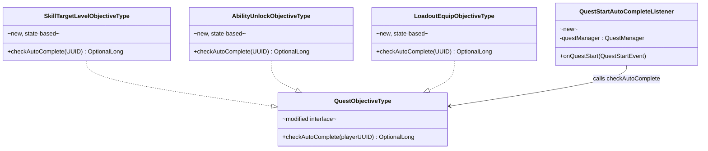
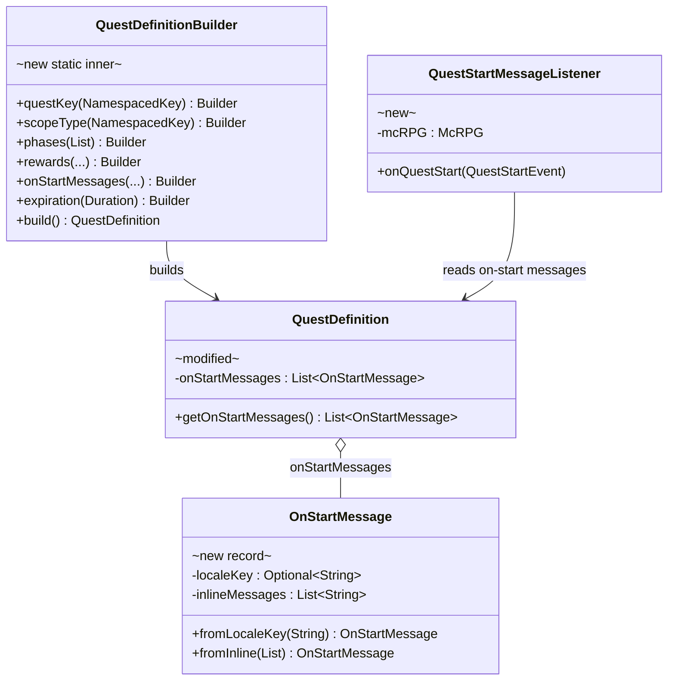
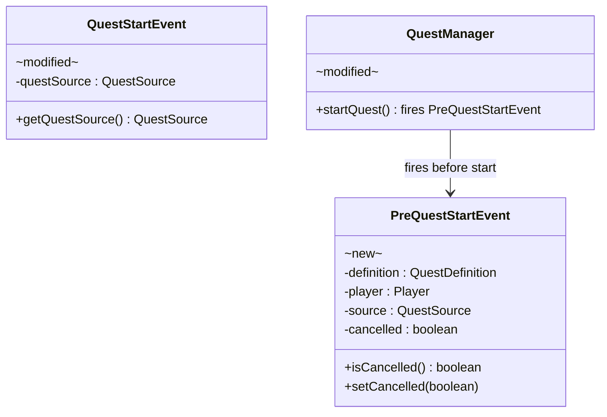
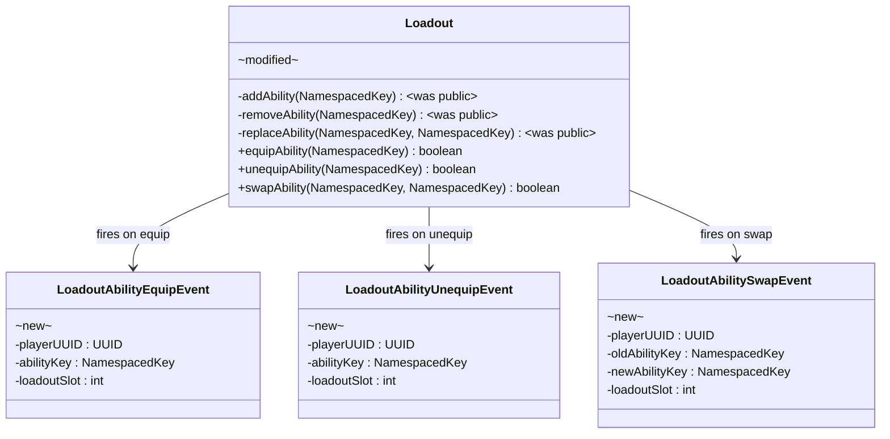
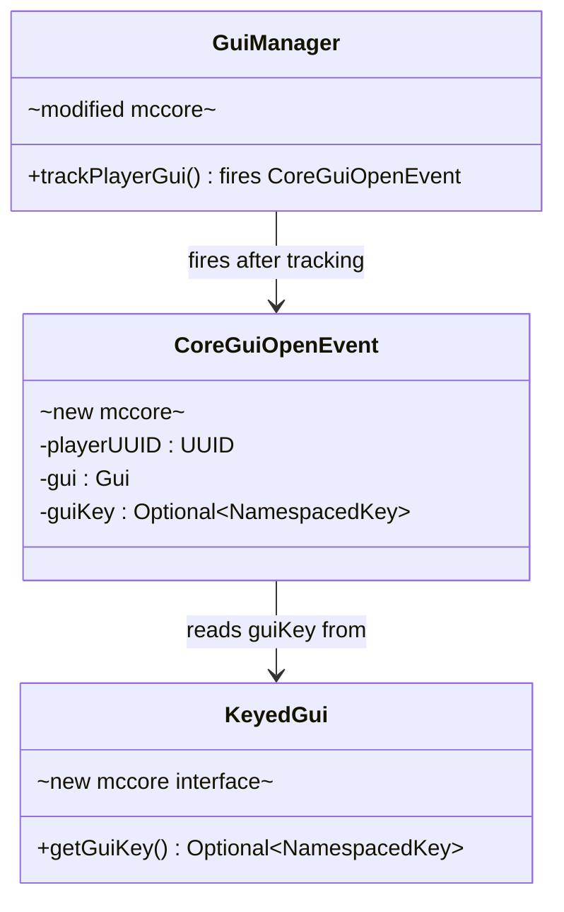

# Phase 1 LLD: Quest Engine Extensions + McCore Hook

> **HLD Reference:** [docs/hld/tutorial/tutorial-quest-system.md](../../hld/tutorial/tutorial-quest-system.md)
> **Status:** Pending implementation

## Scope

Phase 1 delivers foundational quest engine extensions that unlock new objective and reward types independently of the chain system. It includes: McCore `KeyedGui` interface and `CoreGuiOpenEvent`, `PreQuestStartEvent` (cancellable gate in `QuestManager`), `on-start-messages` on `QuestDefinition` with a `QuestDefinition.Builder` refactor, four new reward types (Message, Boosted Experience, Redeemable Experience, Redeemable Levels), seven new objective types with progress listeners and auto-complete infrastructure for state-based objectives, `LoadoutAbilityEquipEvent`/`LoadoutAbilityUnequipEvent`/`LoadoutAbilitySwapEvent` on `Loadout` (raw mutation methods made private; DB loading via constructor), `KeyedGui` retrofit on all McRPG GUI classes, and `QuestStartEvent` augmentation with `QuestSource`.

**In scope:**
- McCore: `KeyedGui` interface, `CoreGuiOpenEvent` fired from `GuiManager.trackPlayerGui()`
- McCore: publish to Maven local, bump dependency in McRPG
- `PreQuestStartEvent` (cancellable, from `QuestManager.startQuest()`)
- `QuestDefinition.Builder` replacing constructor overloads
- `on-start-messages` field on `QuestDefinition` + `QuestStartMessageListener`
- `QuestStartEvent` augmented with `QuestSource`
- Auto-complete infrastructure: `QuestObjectiveType.checkAutoComplete()` + `QuestStartAutoCompleteListener`
- Retrofit all GUI classes to implement `KeyedGui` with `GUI_KEY` constants
- `Loadout.equipAbility()` / `unequipAbility()` + events; raw `addAbility()`/`removeAbility()`/`replaceAbility()` made private; DB loading via `Loadout(UUID, int, Set<NamespacedKey>)` constructor
- 4 new reward types (Message, Boosted XP, Redeemable XP, Redeemable Levels)
- 7 new objective types + progress listeners
- Localization keys for new reward types and objective descriptions
- Unit tests for all new types
- Builder pattern rules added to `core.mdc` and `CLAUDE.md`

**Out of scope (later phases):**
- Quest chain system (Phase 2)
- Tutorial quest content, `TutorialQuestSource`, `DisableTutorialSetting` (Phase 3)
- Auto-complete delay and chain cascade batching (Phase 3)
- Admin commands for chains (Phase 2)
- Quest history GUI chain grouping (Phase 2)

---

## Class Diagrams

**Legend:** Abstract classes annotated `abstract` · Interfaces annotated `interface` · Records annotated `record` · McCore classes annotated `mccore` · Phase 1 additions annotated `new` · Existing modified classes annotated `modified` · `*--` composition · `o--` association · `-->` dependency · `..|>` implements · `--|>` extends

### Diagram 1: New Objective Types

Seven new objective types implementing the existing `QuestObjectiveType` interface. Types with `checkAutoComplete` are state-based and can resolve immediately on quest start.

```mermaid
classDiagram
    direction TB

    class QuestObjectiveType {
        ~modified interface~
        +getKey() NamespacedKey
        +parseConfig(Section) QuestObjectiveType
        +canProcess(context) boolean
        +processProgress(instance, context) long
        +describeObjective(player, progress) String
        +checkAutoComplete(playerUUID) OptionalLong
    }

    class SkillLevelUpObjectiveType {
        ~new~
        -skillFilter : Optional~NamespacedKey~
        -minLevelsPerEvent : int
    }

    class SkillTargetLevelObjectiveType {
        ~new~
        -skillFilter : Optional~NamespacedKey~
        -targetLevel : int
        +checkAutoComplete(UUID) OptionalLong
    }

    class GuiOpenObjectiveType {
        ~new~
        -guiType : NamespacedKey
    }

    class AbilityUnlockObjectiveType {
        ~new~
        -abilityTypeFilter : Optional~String~
        -abilityFilter : Optional~NamespacedKey~
        +checkAutoComplete(UUID) OptionalLong
    }

    class AbilityActivateObjectiveType {
        ~new~
        -abilityTypeFilter : Optional~String~
        -abilityFilter : Optional~NamespacedKey~
    }

    class LoadoutEquipObjectiveType {
        ~new~
        -abilityTypeFilter : Optional~String~
        -abilityFilter : Optional~NamespacedKey~
        +checkAutoComplete(UUID) OptionalLong
    }

    class QuestBoardAcceptObjectiveType {
        ~new~
        -boardFilter : Optional~NamespacedKey~
    }

    SkillLevelUpObjectiveType ..|> QuestObjectiveType
    SkillTargetLevelObjectiveType ..|> QuestObjectiveType
    GuiOpenObjectiveType ..|> QuestObjectiveType
    AbilityUnlockObjectiveType ..|> QuestObjectiveType
    AbilityActivateObjectiveType ..|> QuestObjectiveType
    LoadoutEquipObjectiveType ..|> QuestObjectiveType
    QuestBoardAcceptObjectiveType ..|> QuestObjectiveType
```



### Diagram 2: Progress Context Classes

Each context wraps a Bukkit event and is consumed by one or more objective types via `canProcess()` + `processProgress()`.

```mermaid
classDiagram
    direction TB

    class QuestObjectiveProgressContext {
        ~abstract~
    }

    class SkillLevelQuestContext {
        ~new~
        -event : SkillGainLevelEvent
        +getSkillKey() NamespacedKey
        +getLevelsGained() int
    }

    class GuiOpenQuestContext {
        ~new~
        -guiKey : Optional~NamespacedKey~
        -playerUUID : UUID
    }

    class AbilityUnlockQuestContext {
        ~new~
        -event : AbilityUnlockEvent
        +getAbilityHolder() AbilityHolder
        +getAbility() UnlockableAbility
    }

    class AbilityActivateQuestContext {
        ~new~
        -event : AbilityActivateEvent
        +getAbilityHolder() AbilityHolder
        +getAbility() Ability
    }

    class LoadoutEquipQuestContext {
        ~new~
        -event : LoadoutAbilityEquipEvent
        +getAbilityKey() NamespacedKey
        +getPlayerUUID() UUID
    }

    class QuestBoardAcceptQuestContext {
        ~new~
        -event : BoardOfferingAcceptEvent
        +getBoardKey() Optional~NamespacedKey~
        +getPlayerUUID() UUID
    }

    SkillLevelQuestContext --|> QuestObjectiveProgressContext
    GuiOpenQuestContext --|> QuestObjectiveProgressContext
    AbilityUnlockQuestContext --|> QuestObjectiveProgressContext
    AbilityActivateQuestContext --|> QuestObjectiveProgressContext
    LoadoutEquipQuestContext --|> QuestObjectiveProgressContext
    QuestBoardAcceptQuestContext --|> QuestObjectiveProgressContext
```



### Diagram 3: Auto-Complete Infrastructure

`QuestStartAutoCompleteListener` listens for `QuestStartEvent` and delegates to each objective type's `checkAutoComplete()` method. State-based types return progress; event-based types return empty.



### Diagram 4: New Reward Types

Four new completion reward types implementing the existing `QuestRewardType` interface.


### Diagram 5: On-Start Messages and QuestDefinition Builder

`OnStartMessage` is a dedicated message-only concept (not a reward). `QuestDefinition.Builder` replaces all existing constructor overloads.



### Diagram 6: Quest Events

`PreQuestStartEvent` is a cancellable gate fired from `QuestManager`. `QuestStartEvent` is augmented with `QuestSource`.



### Diagram 7: Loadout Changes and Events

Raw mutation methods made private. Public API is event-firing methods only. DB loading uses the constructor.



### Diagram 8: McCore Changes

New `KeyedGui` interface and `CoreGuiOpenEvent` added to McCore.



---

## 1. McCore Changes

### 1.1 `KeyedGui` — GUI Type Identification Interface

**Package:** `com.diamonddagger590.mccore.gui`
**File:** McCore `src/main/java/.../gui/KeyedGui.java`

An optional interface that `Gui` implementations can adopt to declare a type-level `NamespacedKey` identifying what kind of GUI they are (e.g., `mcrpg:home`, `mcrpg:loadout_selection`). Distinct from `Gui.getUUID()`, which returns the *creating player's UUID* (instance identity), not a type key.

```java
public interface KeyedGui {

    /**
     * Returns the type-level key identifying this GUI's purpose.
     * GUIs that do not implement this interface (or return empty) are
     * still tracked by {@link GuiManager} but are not identifiable by key.
     *
     * @return the GUI's type key, or empty if unkeyed
     */
    @NotNull
    Optional<NamespacedKey> getGuiKey();
}
```

### 1.2 `CoreGuiOpenEvent` — GUI Open Notification

**Package:** `com.diamonddagger590.mccore.event.gui`
**File:** McCore `src/main/java/.../event/gui/CoreGuiOpenEvent.java`

Fired from `GuiManager.trackPlayerGui()` after tracking completes. "Open" means any GUI creation tracked by the manager — including back-button navigation re-opens (intentional for quest objective purposes; objectives can use `required-progress: 1` to trigger only once).

```java
public class CoreGuiOpenEvent extends Event {

    private static final HandlerList HANDLER_LIST = new HandlerList();

    private final UUID playerUUID;
    private final Gui<?> gui;
    private final Optional<NamespacedKey> guiKey;

    /**
     * @param playerUUID the UUID of the player whose GUI was tracked
     * @param gui        the GUI instance being tracked
     * @param guiKey     the GUI's type key if it implements {@link KeyedGui}, or empty
     */
    public CoreGuiOpenEvent(@NotNull UUID playerUUID,
                            @NotNull Gui<?> gui,
                            @NotNull Optional<NamespacedKey> guiKey) {
        this.playerUUID = playerUUID;
        this.gui = gui;
        this.guiKey = guiKey;
    }

    @NotNull public UUID getPlayerUUID() { return playerUUID; }
    @NotNull public Gui<?> getGui() { return gui; }
    @NotNull public Optional<NamespacedKey> getGuiKey() { return guiKey; }

    @NotNull @Override public HandlerList getHandlers() { return HANDLER_LIST; }
    @NotNull public static HandlerList getHandlerList() { return HANDLER_LIST; }
}
```

### 1.3 `GuiManager.trackPlayerGui()` — Fire Event After Tracking

Add event firing at the end of the existing `trackPlayerGui()` method:

```java
public <P extends CorePlayer> void trackPlayerGui(@NotNull UUID uuid, @NotNull Gui<P> gui) {
    // ... existing tracking logic (stopTrackingPlayer, put in maps, registerListeners) ...

    Optional<NamespacedKey> guiKey = (gui instanceof KeyedGui keyed) ? keyed.getGuiKey() : Optional.empty();
    Bukkit.getPluginManager().callEvent(new CoreGuiOpenEvent(uuid, gui, guiKey));
}
```

### 1.4 McCore Release

After these three changes:
1. Publish McCore to Maven local: `./gradlew publishToMavenLocal`
2. Bump McCore version in McRPG's `build.gradle.kts`

---

## 2. New Classes

### 2.1 `PreQuestStartEvent` — Cancellable Quest Gate

**Package:** `us.eunoians.mcrpg.event.quest`
**File:** `src/main/java/us/eunoians/mcrpg/event/quest/PreQuestStartEvent.java`

A cancellable Bukkit event fired from `QuestManager.startQuest()` before the quest instance is created. Enables third-party plugins (and future internal systems like the tutorial opt-out) to veto quest starts.

```java
public class PreQuestStartEvent extends Event implements Cancellable {

    private static final HandlerList HANDLER_LIST = new HandlerList();

    private final QuestDefinition definition;
    private final Player player;
    private final QuestSource source;
    private boolean cancelled;

    /**
     * @param definition the quest definition about to be instantiated
     * @param player     the player initiating or being assigned the quest
     * @param source     the source that originated this quest start
     */
    public PreQuestStartEvent(@NotNull QuestDefinition definition,
                              @NotNull Player player,
                              @NotNull QuestSource source) {
        this.definition = definition;
        this.player = player;
        this.source = source;
    }

    @NotNull public QuestDefinition getDefinition() { return definition; }
    @NotNull public Player getPlayer() { return player; }
    @NotNull public QuestSource getSource() { return source; }

    @Override public boolean isCancelled() { return cancelled; }
    @Override public void setCancelled(boolean cancel) { this.cancelled = cancel; }

    @NotNull @Override public HandlerList getHandlers() { return HANDLER_LIST; }
    @NotNull public static HandlerList getHandlerList() { return HANDLER_LIST; }
}
```

**Firing site:** `QuestManager.startQuest()`, before `new QuestInstance(...)` (see section 3.2).

### 2.2 `QuestDefinition.Builder` — Replaces Constructor Overloads

**File:** Inner static class on `us.eunoians.mcrpg.quest.definition.QuestDefinition`

Replaces all four public constructors and the `withEntries()` factory method. Required parameters are set via the builder constructor; optional parameters have sensible defaults.

```java
public static final class Builder {

    private final NamespacedKey questKey;
    private final NamespacedKey scopeType;
    private final List<QuestPhaseDefinition> phases;

    private Duration expiration;
    private List<QuestRewardEntry> rewardEntries = List.of();
    private List<OnStartMessage> onStartMessages = List.of();
    private QuestRepeatMode repeatMode = QuestRepeatMode.ONCE;
    private Duration repeatCooldown;
    private int repeatLimit = -1;
    private NamespacedKey expansionKey;
    private Map<NamespacedKey, QuestDefinitionMetadata> metadata;
    private RewardDistributionConfig rewardDistribution;
    private Map<String, String> inlineDisplay;

    /**
     * @param questKey  the unique key identifying this quest
     * @param scopeType the scope provider key
     * @param phases    the ordered phase list (must contain at least one)
     */
    public Builder(@NotNull NamespacedKey questKey,
                   @NotNull NamespacedKey scopeType,
                   @NotNull List<QuestPhaseDefinition> phases) {
        this.questKey = questKey;
        this.scopeType = scopeType;
        this.phases = phases;
    }

    /**
     * Sets the quest-level completion rewards from raw reward types (auto-wrapped).
     *
     * @param rewards the completion reward types
     * @return this builder
     */
    @NotNull
    public Builder rewards(@NotNull List<QuestRewardType> rewards) {
        this.rewardEntries = rewards.stream().map(QuestRewardEntry::new).toList();
        return this;
    }

    /**
     * Sets the quest-level completion reward entries (with optional fallbacks).
     *
     * @param entries the completion reward entries
     * @return this builder
     */
    @NotNull
    public Builder rewardEntries(@NotNull List<QuestRewardEntry> entries) {
        this.rewardEntries = entries;
        return this;
    }

    /**
     * Sets messages sent to players when the quest starts (before objectives begin).
     * These are informational messages only — not tangible rewards. This allows
     * chain cascade auto-complete in Phase 3 to cleanly skip messages without risking
     * dropped rewards.
     *
     * @param messages the on-start messages
     * @return this builder
     */
    @NotNull
    public Builder onStartMessages(@NotNull List<OnStartMessage> messages) {
        this.onStartMessages = messages;
        return this;
    }

    @NotNull public Builder expiration(@Nullable Duration expiration) { this.expiration = expiration; return this; }
    @NotNull public Builder repeatMode(@NotNull QuestRepeatMode mode) { this.repeatMode = mode; return this; }
    @NotNull public Builder repeatCooldown(@Nullable Duration cooldown) { this.repeatCooldown = cooldown; return this; }
    @NotNull public Builder repeatLimit(int limit) { this.repeatLimit = limit; return this; }
    @NotNull public Builder expansionKey(@Nullable NamespacedKey key) { this.expansionKey = key; return this; }
    @NotNull public Builder metadata(@Nullable Map<NamespacedKey, QuestDefinitionMetadata> metadata) { this.metadata = metadata; return this; }
    @NotNull public Builder rewardDistribution(@Nullable RewardDistributionConfig config) { this.rewardDistribution = config; return this; }
    @NotNull public Builder inlineDisplay(@Nullable Map<String, String> display) { this.inlineDisplay = display; return this; }

    /**
     * Builds and returns a new immutable {@link QuestDefinition}.
     *
     * @return the quest definition
     * @throws IllegalArgumentException if phases is empty
     */
    @NotNull
    public QuestDefinition build() {
        return new QuestDefinition(questKey, scopeType, expiration, phases,
                rewardEntries, onStartMessages, repeatMode, repeatCooldown,
                repeatLimit, expansionKey, metadata, rewardDistribution, inlineDisplay);
    }
}
```

**Migration:** Existing public constructors and `withEntries()` are **removed**. The private canonical constructor is updated to accept `onStartMessages`. `QuestConfigLoader` and all programmatic callsites are migrated to the builder in the same PR.

### 2.3 `OnStartMessage` — Quest Start Message Record

**Package:** `us.eunoians.mcrpg.quest.definition`
**File:** `src/main/java/us/eunoians/mcrpg/quest/definition/OnStartMessage.java`

Immutable record holding a single message entry sent to players when a quest starts. Each entry is either a locale key (resolved via `McRPGLocalizationManager`) or a list of inline MiniMessage strings. Locale keys take priority — if present, inline messages are ignored.

```java
/**
 * A message sent to players when a quest starts. This is not a reward — on-start messages
 * are informational only, allowing chain cascade auto-complete to cleanly skip them
 * without risking dropped tangible rewards.
 *
 * @param localeKey       optional locale route key resolved via the localization manager;
 *                        if present, {@code inlineMessages} is ignored
 * @param inlineMessages  fallback MiniMessage strings sent directly when no locale key is set
 */
public record OnStartMessage(
        @NotNull Optional<String> localeKey,
        @NotNull List<String> inlineMessages
) {

    /**
     * Creates an on-start message backed by a locale key.
     *
     * @param localeKey the locale route key
     * @return a new {@link OnStartMessage}
     */
    @NotNull
    public static OnStartMessage fromLocaleKey(@NotNull String localeKey) {
        return new OnStartMessage(Optional.of(localeKey), List.of());
    }

    /**
     * Creates an on-start message with inline MiniMessage strings.
     *
     * @param messages the inline messages
     * @return a new {@link OnStartMessage}
     */
    @NotNull
    public static OnStartMessage fromInline(@NotNull List<String> messages) {
        return new OnStartMessage(Optional.empty(), messages);
    }
}
```

### 2.4 `QuestStartMessageListener` — On-Start Message Delivery

**Package:** `us.eunoians.mcrpg.listener.quest`
**File:** `src/main/java/us/eunoians/mcrpg/listener/quest/QuestStartMessageListener.java`

Listens for `QuestStartEvent` and sends on-start messages to all online scope members. If the `OnStartMessage` has a `localeKey`, the message is resolved per-player via `McRPGLocalizationManager`. Otherwise, inline messages are parsed as MiniMessage and sent directly.

```java
public class QuestStartMessageListener implements Listener {

    private final McRPG mcRPG;

    public QuestStartMessageListener(@NotNull McRPG mcRPG) {
        this.mcRPG = mcRPG;
    }

    /**
     * Sends on-start messages from the quest definition to all online
     * players in the quest's scope.
     *
     * @param event the quest start event
     */
    @EventHandler(priority = EventPriority.MONITOR, ignoreCancelled = true)
    public void onQuestStart(@NotNull QuestStartEvent event) {
        QuestDefinition definition = event.getQuestDefinition();
        List<OnStartMessage> messages = definition.getOnStartMessages();
        if (messages.isEmpty()) {
            return;
        }

        McRPGLocalizationManager locManager = mcRPG.registryAccess()
                .registry(RegistryKey.MANAGER)
                .manager(McRPGManagerKey.LOCALIZATION);

        QuestInstance instance = event.getQuestInstance();
        for (UUID playerUUID : instance.getQuestScope().getPlayerUUIDs()) {
            Player player = Bukkit.getPlayer(playerUUID);
            if (player == null || !player.isOnline()) {
                continue;
            }
            Optional<McRPGPlayer> mcRPGPlayerOpt = mcRPG.registryAccess()
                    .registry(RegistryKey.MANAGER)
                    .manager(McRPGManagerKey.PLAYER)
                    .getPlayer(playerUUID);
            for (OnStartMessage msg : messages) {
                if (msg.localeKey().isPresent() && mcRPGPlayerOpt.isPresent()) {
                    Component resolved = locManager.getLocalizedMessageAsComponent(
                            mcRPGPlayerOpt.get(), Route.fromString(msg.localeKey().get()));
                    player.sendMessage(resolved);
                } else {
                    for (String inline : msg.inlineMessages()) {
                        player.sendMessage(McRPGMethods.getMiniMessage().deserialize(inline));
                    }
                }
            }
        }
    }
}
```

### 2.5 `QuestStartAutoCompleteListener` — State-Based Objective Resolution

**Package:** `us.eunoians.mcrpg.listener.quest`
**File:** `src/main/java/us/eunoians/mcrpg/listener/quest/QuestStartAutoCompleteListener.java`

Listens for `QuestStartEvent` and immediately completes any IN_PROGRESS objectives whose state-based auto-complete check passes. No delay in Phase 1 — both on-start messages and completion rewards fire. The chain cascade batching in Phase 3 will suppress on-start messages for auto-completed chain steps and send a configurable batch summary via the localization system instead.

```java
public class QuestStartAutoCompleteListener implements Listener {

    private final QuestManager questManager;

    public QuestStartAutoCompleteListener(@NotNull QuestManager questManager) {
        this.questManager = questManager;
    }

    /**
     * Checks all IN_PROGRESS objectives in the newly started quest for
     * auto-complete eligibility. State-based objectives that are already
     * satisfied complete immediately.
     *
     * @param event the quest start event
     */
    @EventHandler(priority = EventPriority.MONITOR, ignoreCancelled = true)
    public void onQuestStart(@NotNull QuestStartEvent event) {
        QuestInstance instance = event.getQuestInstance();
        QuestDefinition definition = event.getQuestDefinition();
        Collection<UUID> scopePlayerUUIDs = instance.getQuestScope().getPlayerUUIDs();

        for (var stage : instance.getActiveQuestStages()) {
            for (var objective : stage.getQuestObjectives()) {
                if (objective.getQuestObjectiveState() != QuestObjectiveState.IN_PROGRESS) {
                    continue;
                }
                definition.findObjectiveDefinition(objective.getQuestObjectiveKey())
                        .ifPresent(objDef -> {
                            QuestObjectiveType type = objDef.getObjectiveType();
                            for (UUID playerUUID : scopePlayerUUIDs) {
                                OptionalLong autoProgress = type.checkAutoComplete(playerUUID);
                                if (autoProgress.isPresent()) {
                                    long progress = autoProgress.getAsLong();
                                    if (progress >= objDef.getRequiredProgress()) {
                                        objective.progress(objDef.getRequiredProgress(), playerUUID);
                                    }
                                }
                            }
                        });
            }
        }
    }
}
```

### 2.6 Reward Types

All four reward types follow the existing immutable configured-instance pattern established by `ExperienceRewardType`. Each has: an unconfigured base instance for registry registration, a private configured constructor, and `parseConfig()` returning a new configured instance.

#### 2.5.1 `MessageRewardType`

**Package:** `us.eunoians.mcrpg.quest.reward.builtin`
**File:** `src/main/java/us/eunoians/mcrpg/quest/reward/builtin/MessageRewardType.java`
**Key:** `mcrpg:message`

Sends player-facing messages. Supports locale route lookup and/or inline MiniMessage strings with palette resolution.

```yaml
# Route-based (preferred for translatable text)
welcome:
  type: mcrpg:message
  key: tutorial.welcome-message

# Inline fallback
hint:
  type: mcrpg:message
  messages:
    - "<primary>Tip:</primary> <body>Run /mcrpg to open your menu!"

# Both (route lookup with inline fallback)
greeting:
  type: mcrpg:message
  key: tutorial.greeting
  messages:
    - "<primary>Welcome!</primary> <body>Your adventure begins."
```

**Fields:** `@NotNull Optional<String> localeKey`, `@NotNull List<String> inlineMessages`

**`grant(Player)`:** Resolution order:
1. If `localeKey` is set, attempt locale route lookup via `McRPGLocalizationManager`. If lookup succeeds, send the resolved component(s) to the player.
2. If lookup fails or `localeKey` is absent, iterate `inlineMessages`, apply palette resolution and MiniMessage parsing, send each as a component.
3. Standard placeholders (`<player>`) are resolved.

**`describeForDisplay()`:** Returns `"Message"` (or the locale key if set). Not the full message list — messages can be multi-line and aren't suitable for reward slot lore.

**`withAmountMultiplier()`:** Returns `this` (messages are not scalable).

**`getNumericAmount()`:** Returns `OptionalLong.empty()`.

**`serializeConfig()` / `fromSerializedConfig()`:** Serializes `localeKey` and `inlineMessages` for pending reward queue. A message delivered to a player logging in after being offline is still useful (e.g., tutorial welcome message on delayed start).

#### 2.5.2 `BoostedExperienceRewardType`

**Key:** `mcrpg:boosted_experience`

```yaml
boosted_xp:
  type: mcrpg:boosted_experience
  amount: 500
```

**Fields:** `int amount`

**`grant(Player)`:** Resolves `McRPGPlayer` from `McRPGManagerKey.PLAYER`, calls `mcRPGPlayer.getExperienceExtras().modifyBoostedExperience(amount)`.

**`withAmountMultiplier(double)`:** Returns new instance with `Math.max(1, (int)(amount * multiplier))`.

**`getNumericAmount()`:** `OptionalLong.of(amount)`.

**`describeForDisplay(McRPGPlayer)`:** Resolves `LocalizationKey.QUEST_REWARD_BOOSTED_EXPERIENCE_FORMAT` with `<amount>` placeholder. Fallback: `"<amount> Boosted XP"`.

#### 2.5.3 `RedeemableExperienceRewardType`

**Key:** `mcrpg:redeemable_experience`

Identical pattern to `BoostedExperienceRewardType`. Calls `modifyRedeemableExperience(amount)`.

#### 2.5.4 `RedeemableLevelsRewardType`

**Key:** `mcrpg:redeemable_levels`

Identical pattern. Calls `modifyRedeemableLevels(amount)`.

### 2.7 Objective Types

All seven objective types follow the existing pattern established by `BlockBreakObjectiveType`: unconfigured base instance for registry, `parseConfig()` returns configured copy, `canProcess()` checks context type, `processProgress()` returns delta.

State-based types additionally override `checkAutoComplete(UUID)` to return `OptionalLong.of(1)` when the player's current state satisfies the objective.

#### 2.6.1 `SkillLevelUpObjectiveType`

**Key:** `mcrpg:skill_level_up` · **Kind:** Event-only
**Trigger:** `SkillGainLevelEvent` via `SkillLevelQuestProgressListener`

**Config filters:**
- `skill` (optional `NamespacedKey`; omit for any skill)
- `levels` (optional `int`, default 1; minimum levels per event to count)

**`processProgress()`:** If skill matches filter and `event.getLevels() >= minLevelsPerEvent`, returns `event.getLevels()`. Otherwise 0.

**`describeObjective()`:** `"Level up <count> time(s)"` or `"Level up <skill> <count> time(s)"`.

#### 2.6.2 `SkillTargetLevelObjectiveType`

**Key:** `mcrpg:skill_target_level` · **Kind:** State + Event
**Trigger:** `SkillGainLevelEvent` via `SkillLevelQuestProgressListener` · **Auto-complete:** Check player skill levels

**Config filters:**
- `skill` (optional `NamespacedKey`; omit for any skill)
- `target-level` (required `int`)

**`processProgress()`:** After a level-up event, check if the player now has any skill (or the filtered skill) at or above `targetLevel`. If yes, return 1. Otherwise 0.

The context must carry the `SkillHolder` reference (resolved from UUID within the listener) so that `processProgress` can check current levels. The `SkillLevelQuestContext` wraps the event and exposes the player UUID for holder resolution.

**`checkAutoComplete(UUID)`:** Resolves `McRPGPlayer`, iterates skill data. If any matching skill's level >= `targetLevel`, returns `OptionalLong.of(1)`. Otherwise empty.

**`describeObjective()`:** `"Reach level <level> in any skill"` or `"Reach level <level> in <skill>"`.

**Note:** `required-progress` for this type is always `1` (binary: condition met or not).

#### 2.6.3 `GuiOpenObjectiveType`

**Key:** `mcrpg:gui_open` · **Kind:** Event-only
**Trigger:** `CoreGuiOpenEvent` (McCore) via `GuiOpenQuestProgressListener`

**Config filters:**
- `gui-type` (required `NamespacedKey`; matches `KeyedGui.getGuiKey()`)

**`processProgress()`:** If `context.getGuiKey()` is present and matches `guiType`, return 1. Otherwise 0.

**`describeObjective()`:** `"Open the <gui-name>"`. The GUI display name is resolved from a localization route derived from the key: `gui.<namespace>.<key>.display-name`.

#### 2.6.4 `AbilityUnlockObjectiveType`

**Key:** `mcrpg:ability_unlock` · **Kind:** State + Event
**Trigger:** `AbilityUnlockEvent` via `AbilityUnlockQuestProgressListener` · **Auto-complete:** Check player's unlocked abilities

**Config filters:**
- `ability-type` (optional `String`: `"PASSIVE"`, `"ACTIVE"`; determines filter via `instanceof PassiveAbility` / `instanceof ComboActivatable`)
- `ability` (optional `NamespacedKey`; specific ability key)

**`processProgress()`:** If the unlocked ability matches the type and/or specific key filter, return 1. Otherwise 0.

**`checkAutoComplete(UUID)`:** Resolves `McRPGPlayer`, iterates ability data. Checks if any ability matching the filter has `ABILITY_UNLOCKED_ATTRIBUTE` set to `true`. If found, returns `OptionalLong.of(1)`.

**`describeObjective()`:** `"Unlock a passive ability"`, `"Unlock an active ability"`, or `"Unlock <ability>"`.

#### 2.6.5 `AbilityActivateObjectiveType`

**Key:** `mcrpg:ability_activate` · **Kind:** Event-only
**Trigger:** `AbilityActivateEvent` (polymorphic) via `AbilityActivateQuestProgressListener`

**Config filters:**
- `ability-type` (optional `String`: `"PASSIVE"`, `"ACTIVE"`, `"INNATE"`)
- `ability` (optional `NamespacedKey`; specific ability key)

**`processProgress()`:** Checks the `Ability` from the event. If `ability-type` is set:
- `"ACTIVE"`: `ability instanceof ComboActivatable`
- `"PASSIVE"`: `ability instanceof PassiveAbility`
- `"INNATE"`: neither `ComboActivatable` nor `PassiveAbility` with `ABILITY_UNLOCKED_ATTRIBUTE`

If filter matches, return 1. Otherwise 0.

**`describeObjective()`:** `"Activate an active ability"`, `"Activate <ability>"`, etc.

#### 2.6.6 `LoadoutEquipObjectiveType`

**Key:** `mcrpg:loadout_equip` · **Kind:** State + Event
**Trigger:** `LoadoutAbilityEquipEvent` via `LoadoutEquipQuestProgressListener` · **Auto-complete:** Check player's current loadout

**Config filters:**
- `ability-type` (optional `String`: `"PASSIVE"`, `"ACTIVE"`)
- `ability` (optional `NamespacedKey`; specific ability key)

**`processProgress()`:** If the equipped ability matches the filter, return 1. Otherwise 0.

**`checkAutoComplete(UUID)`:** Resolves `McRPGPlayer` as `LoadoutHolder`, checks current loadout for any ability matching the filter. If found, returns `OptionalLong.of(1)`.

**`describeObjective()`:** `"Equip a passive ability"`, `"Equip <ability>"`, etc.

#### 2.6.7 `QuestBoardAcceptObjectiveType`

**Key:** `mcrpg:quest_board_accept` · **Kind:** Event-only
**Trigger:** `BoardOfferingAcceptEvent` via `QuestBoardAcceptQuestProgressListener`

**Config filters:**
- `board` (optional `NamespacedKey`; specific board key, omit for any board)

**`processProgress()`:** If board filter matches (or no filter), return 1. Otherwise 0.

**`describeObjective()`:** `"Accept a quest from the quest board"`.

### 2.8 Progress Context Classes

Each context wraps the relevant event data. All extend `QuestObjectiveProgressContext`.

| Context | File suffix | Wraps | Key accessors |
|---|---|---|---|
| `SkillLevelQuestContext` | `SkillLevelQuestContext.java` | `SkillGainLevelEvent` | `getSkillKey()`, `getLevelsGained()`, `getPlayerUUID()` |
| `GuiOpenQuestContext` | `GuiOpenQuestContext.java` | `CoreGuiOpenEvent` | `getGuiKey()`, `getPlayerUUID()` |
| `AbilityUnlockQuestContext` | `AbilityUnlockQuestContext.java` | `AbilityUnlockEvent` | `getAbility()`, `getAbilityHolder()` |
| `AbilityActivateQuestContext` | `AbilityActivateQuestContext.java` | `AbilityActivateEvent` | `getAbility()`, `getAbilityHolder()` |
| `LoadoutEquipQuestContext` | `LoadoutEquipQuestContext.java` | `LoadoutAbilityEquipEvent` | `getAbilityKey()`, `getPlayerUUID()` |
| `QuestBoardAcceptQuestContext` | `QuestBoardAcceptQuestContext.java` | `BoardOfferingAcceptEvent` | `getBoardKey()`, `getPlayerUUID()` |

All placed in `us.eunoians.mcrpg.quest.objective.type.builtin`.

`SkillLevelQuestContext` is shared by both `SkillLevelUpObjectiveType` and `SkillTargetLevelObjectiveType` — both react to `SkillGainLevelEvent` and handle their own logic in `processProgress()`.

### 2.9 Progress Listeners

All follow the `BlockBreakQuestProgressListener` pattern: implement `QuestProgressListener`, inject `QuestManager` in constructor, listen at `MONITOR` priority with `ignoreCancelled = true`, construct context, call `progressQuests(questManager, playerUUID, context)`.

| Listener | Event | Context | Objective types served |
|---|---|---|---|
| `SkillLevelQuestProgressListener` | `SkillGainLevelEvent` | `SkillLevelQuestContext` | `skill_level_up`, `skill_target_level` |
| `GuiOpenQuestProgressListener` | `CoreGuiOpenEvent` | `GuiOpenQuestContext` | `gui_open` |
| `AbilityUnlockQuestProgressListener` | `AbilityUnlockEvent` | `AbilityUnlockQuestContext` | `ability_unlock` |
| `AbilityActivateQuestProgressListener` | `AbilityActivateEvent` | `AbilityActivateQuestContext` | `ability_activate` |
| `LoadoutEquipQuestProgressListener` | `LoadoutAbilityEquipEvent` | `LoadoutEquipQuestContext` | `loadout_equip` |
| `QuestBoardAcceptQuestProgressListener` | `BoardOfferingAcceptEvent` | `QuestBoardAcceptQuestContext` | `quest_board_accept` |

**Player UUID resolution:** Each listener extracts the player UUID from the event. For `AbilityActivateEvent` and `AbilityUnlockEvent`, this comes from `event.getAbilityHolder().getUUID()`. For McCore's `CoreGuiOpenEvent`, directly from `event.getPlayerUUID()`.

### 2.10 Loadout Events

Three new events in `us.eunoians.mcrpg.event.loadout`:

#### `LoadoutAbilityEquipEvent`

```java
public class LoadoutAbilityEquipEvent extends Event {

    private static final HandlerList HANDLER_LIST = new HandlerList();

    private final UUID playerUUID;
    private final NamespacedKey abilityKey;
    private final int loadoutSlot;

    /**
     * @param playerUUID  the UUID of the player whose loadout changed
     * @param abilityKey  the key of the ability that was equipped
     * @param loadoutSlot the loadout slot index the ability was added to
     */
    public LoadoutAbilityEquipEvent(@NotNull UUID playerUUID,
                                    @NotNull NamespacedKey abilityKey,
                                    int loadoutSlot) { ... }

    // getters, HandlerList boilerplate
}
```

#### `LoadoutAbilityUnequipEvent`

Same structure as equip, fired when an ability is removed from a loadout slot.

#### `LoadoutAbilitySwapEvent`

```java
public class LoadoutAbilitySwapEvent extends Event {

    private final UUID playerUUID;
    private final NamespacedKey oldAbilityKey;
    private final NamespacedKey newAbilityKey;
    private final int loadoutSlot;

    // ...
}
```

---

## 3. Modifications to Existing Classes

### 3.1 `QuestDefinition` — Add On-Start Messages, Builder, Deprecate Constructors

**New field:** `private final List<OnStartMessage> onStartMessages`

**New accessor:**

```java
/**
 * Gets the messages sent to players when this quest starts.
 *
 * @return an immutable list of on-start messages (empty if none configured)
 */
@NotNull
public List<OnStartMessage> getOnStartMessages() {
    return onStartMessages;
}
```

**Private canonical constructor:** Updated to accept `onStartMessages` (between `rewardEntries` and `repeatMode`).

**Existing public constructors and `withEntries()`:** Removed. All callsites are migrated to the builder in the same PR.

**Inner `Builder` class:** Added as described in section 2.2.

### 3.2 `QuestManager.startQuest()` — Fire PreQuestStartEvent

The two-parameter overload delegates to the four-parameter version. The four-parameter version gains `PreQuestStartEvent` firing at the top, before `QuestInstance` construction:

```java
@NotNull
public Optional<QuestInstance> startQuest(@NotNull QuestDefinition definition,
                                          @NotNull UUID initialPlayerUUID,
                                          @NotNull Map<String, Object> variables,
                                          @NotNull QuestSource questSource) {
    Player player = Bukkit.getPlayer(initialPlayerUUID);
    if (player == null) {
        return Optional.empty();
    }

    PreQuestStartEvent preEvent = new PreQuestStartEvent(definition, player, questSource);
    Bukkit.getPluginManager().callEvent(preEvent);
    if (preEvent.isCancelled()) {
        return Optional.empty();
    }

    // ... existing scope resolution, instance creation, start, tracking ...
}
```

### 3.3 `QuestStartEvent` — Add QuestSource

**New field:** `private final QuestSource questSource`

**Updated constructor:**

```java
public QuestStartEvent(@NotNull QuestInstance questInstance,
                       @NotNull QuestDefinition questDefinition,
                       @NotNull QuestSource questSource) {
    super(questInstance);
    this.questDefinition = questDefinition;
    this.questSource = questSource;
}
```

**New accessor:**

```java
@NotNull
public QuestSource getQuestSource() {
    return questSource;
}
```

**Callsite update:** `QuestInstance.start()` must now receive and pass the `QuestSource`. Since `QuestInstance` already stores the source (constructor parameter), `start()` passes `this.questSource` to the event constructor.

### 3.4 `QuestObjectiveType` — Add `checkAutoComplete` Default Method

```java
/**
 * Checks whether the given player's current state already satisfies this
 * configured objective. State-based objective types override this to query
 * player data (skill levels, unlocked abilities, loadout contents, etc.).
 * <p>
 * Returns the progress value to apply if the state check passes, or empty
 * if this objective type does not support auto-complete or the player's
 * state does not satisfy the condition.
 *
 * @param playerUUID the UUID of the player to check
 * @return the progress to apply, or empty if auto-complete does not apply
 */
@NotNull
default OptionalLong checkAutoComplete(@NotNull UUID playerUUID) {
    return OptionalLong.empty();
}
```

### 3.5 `QuestConfigLoader` — Parse `on-start-messages` Section

In the quest definition parsing method, after parsing `rewards:`, parse `on-start-messages:`. Each entry is either a `key:` (locale route) or a `messages:` list (inline MiniMessage strings). Pass the result to the builder:

```java
List<OnStartMessage> onStartMessages = List.of();
if (section.contains("on-start-messages")) {
    Section msgSection = section.getSection("on-start-messages");
    List<OnStartMessage> parsed = new ArrayList<>();
    for (String entryKey : msgSection.getKeys()) {
        Section entry = msgSection.getSection(entryKey);
        if (entry.contains("key")) {
            parsed.add(OnStartMessage.fromLocaleKey(entry.getString("key")));
        } else if (entry.contains("messages")) {
            parsed.add(OnStartMessage.fromInline(entry.getStringList("messages")));
        }
    }
    onStartMessages = List.copyOf(parsed);
}

return new QuestDefinition.Builder(questKey, scopeType, phases)
        .rewardEntries(completionRewards)
        .onStartMessages(onStartMessages)
        .expiration(expiration)
        .repeatMode(repeatMode)
        // ... remaining builder calls ...
        .build();
```

**YAML schema:**

```yaml
on-start-messages:
  welcome:
    key: tutorial.first-steps.welcome
  explain_skills:
    messages:
      - "<primary>As you play, your skills will level up automatically."
      - "<body>Try breaking some blocks to see your Mining skill grow."
```

### 3.6 `Loadout` — Private Raw Methods, Public Event-Firing Methods

The existing `addAbility()`, `removeAbility()`, and `replaceAbility()` are changed from `public` to `private`. They are now internal implementation details called only by the new event-firing methods. No external class needs direct access to raw mutations:

- **DB loading** already has a constructor `Loadout(UUID, int, Set<NamespacedKey>)` that accepts initial abilities. `LoadoutAbilityDAO.getLoadout()` is updated to collect abilities into a `LinkedHashSet` first, then pass them to the constructor (see section 3.7).
- **`copyLoadout()`** accesses the `abilities` field directly (same class) — unaffected.
- **`swapActivePositions()`** manipulates the `abilities` list directly — unaffected.

New public methods wrap the now-private mutations and fire events:

```java
/**
 * Equips an ability to this loadout and fires a {@link LoadoutAbilityEquipEvent}.
 *
 * @param key the ability to equip
 * @return {@code true} if the ability was successfully equipped
 */
public boolean equipAbility(@NotNull NamespacedKey key) {
    try {
        addAbility(key);
    } catch (LoadoutMaxSizeExceededException | InvalidAbilityForLoadoutException e) {
        return false;
    }
    Bukkit.getPluginManager().callEvent(
            new LoadoutAbilityEquipEvent(loadoutHolder, key, loadoutSlot));
    return true;
}

/**
 * Unequips an ability from this loadout and fires a {@link LoadoutAbilityUnequipEvent}.
 *
 * @param key the ability to unequip
 * @return {@code true} if the ability was present and removed
 */
public boolean unequipAbility(@NotNull NamespacedKey key) {
    if (!abilities.contains(key)) {
        return false;
    }
    removeAbility(key);
    Bukkit.getPluginManager().callEvent(
            new LoadoutAbilityUnequipEvent(loadoutHolder, key, loadoutSlot));
    return true;
}

/**
 * Swaps an ability in this loadout and fires a {@link LoadoutAbilitySwapEvent}.
 * If the new ability is already in the loadout, both swap positions.
 *
 * @param oldAbility the ability to replace
 * @param newAbility the replacement ability
 * @return {@code true} if the swap was successful
 */
public boolean swapAbility(@NotNull NamespacedKey oldAbility, @NotNull NamespacedKey newAbility) {
    try {
        replaceAbility(oldAbility, newAbility);
    } catch (InvalidAbilityForLoadoutException e) {
        return false;
    }
    Bukkit.getPluginManager().callEvent(
            new LoadoutAbilitySwapEvent(loadoutHolder, oldAbility, newAbility, loadoutSlot));
    return true;
}
```

### 3.7 `LoadoutAbilityDAO` — Constructor-Based Loading

`LoadoutAbilityDAO.getLoadout()` currently creates an empty `Loadout` and calls `addAbility()` in a loop. Since `addAbility()` is now private, the DAO must collect abilities first and pass them to the existing `Loadout(UUID, int, Set<NamespacedKey>)` constructor:

```java
@NotNull
public static Loadout getLoadout(@NotNull Connection connection, @NotNull UUID holderUUID, int loadoutId) {
    AbilityRegistry abilityRegistry = McRPG.getInstance().registryAccess().registry(McRPGRegistryKey.ABILITY);
    Set<NamespacedKey> loadedAbilities = new LinkedHashSet<>();
    try (PreparedStatement preparedStatement = connection.prepareStatement(
            "SELECT ability_id FROM " + TABLE_NAME + " WHERE holder_uuid = ? AND loadout_id = ? ORDER BY slot_number ASC;")) {
        preparedStatement.setString(1, holderUUID.toString());
        preparedStatement.setInt(2, loadoutId);
        try (ResultSet resultSet = preparedStatement.executeQuery()) {
            while (resultSet.next()) {
                String abilityId = resultSet.getString("ability_id");
                NamespacedKey namespacedKey = new NamespacedKey(McRPG.getInstance(), abilityId);
                if (abilityRegistry.registered(namespacedKey)) {
                    loadedAbilities.add(namespacedKey);
                }
            }
        }
    } catch (SQLException e) {
        McRPG.getInstance().getLogger().log(Level.SEVERE, "Failed to load loadout abilities", e);
    }
    return new Loadout(holderUUID, loadoutId, loadedAbilities);
}
```

`LinkedHashSet` preserves insertion order from the `ORDER BY slot_number ASC` query, so ability ordering is maintained. This also fixes the existing `e.printStackTrace()` anti-pattern in the DAO.

### 3.8 Loadout Callsite Retrofits

All callsites that currently call `addAbility()`, `removeAbility()`, or `replaceAbility()` are updated to use the event-firing methods:

| Callsite | Current call | New call |
|---|---|---|
| `LoadoutSelectAbilitySlot.onClick()` | `loadout.addAbility(key)` or `loadout.replaceAbility(old, new)` | `loadout.equipAbility(key)` or `loadout.swapAbility(old, new)` |
| `LoadoutAbilitySlot.onClick()` (remove) | `loadout.removeAbility(key)` | `loadout.unequipAbility(key)` |
| `OnAbilityUnlockListener` (auto-equip) | `loadout.addAbility(key)` | `loadout.equipAbility(key)` |
| `ActiveAbilityComboSlot` (reorder) | `loadout.replaceAbility(old, new)` | `loadout.swapAbility(old, new)` |
| `LoadoutAbilityDAO.getLoadout()` | `loadout.addAbility(key)` in loop | Constructor `new Loadout(uuid, slot, abilities)` (see section 3.7) |

No external callsite retains access to the raw methods.

### 3.9 GUI KeyedGui Retrofit

All concrete GUI classes implement `KeyedGui` and declare a `public static final NamespacedKey GUI_KEY`. The interface implementation is a one-line method returning `Optional.of(GUI_KEY)`.

| GUI Class | Key |
|---|---|
| `HomeGui` | `mcrpg:home` |
| `AbilityGui` | `mcrpg:abilities` |
| `InnateAbilityGui` | `mcrpg:innate_abilities` |
| `AbilityAttributeEditGui` | `mcrpg:ability_edit` |
| `RemoteTransferGui` | `mcrpg:remote_transfer` |
| `SkillGui` | `mcrpg:skills` |
| `LoadoutSelectionGui` | `mcrpg:loadout_selection` |
| `LoadoutGui` | `mcrpg:loadout` |
| `LoadoutAbilitySelectGui` | `mcrpg:loadout_ability_select` |
| `LoadoutDisplayHomeGui` | `mcrpg:loadout_display` |
| `LoadoutDisplayItemInputGui` | `mcrpg:loadout_display_input` |
| `ExperienceBankGui` | `mcrpg:experience_bank` |
| `RedeemableSkillSelectionGui` | `mcrpg:redeemable_skill_selection` |
| `RedeemableExperienceGui` | `mcrpg:redeemable_experience` |
| `RedeemableLevelsGui` | `mcrpg:redeemable_levels` |
| `PlayerSettingGui` | `mcrpg:settings` |
| `QuestBoardGui` | `mcrpg:board` |
| `ScopedEntitySelectorGui` | `mcrpg:board_entity_selector` |
| `ActiveQuestGui` | `mcrpg:active_quests` |
| `QuestHistoryGui` | `mcrpg:quest_history` |
| `QuestDetailGui` | `mcrpg:quest_detail` |
| `QuestAbandonConfirmGui` | `mcrpg:quest_abandon_confirm` |

**Mechanical pattern for each class:**

```java
public class HomeGui extends BaseGui<McRPGPlayer> implements FillerItemGui, KeyedGui {

    public static final NamespacedKey GUI_KEY =
            new NamespacedKey(McRPGMethods.getMcRPGNamespace(), "home");

    @Override
    @NotNull
    public Optional<NamespacedKey> getGuiKey() {
        return Optional.of(GUI_KEY);
    }

    // ... rest unchanged ...
}
```

### 3.10 `McRPGExpansion` — Register New Types

**`getQuestObjectiveTypeContent()`** — add 7 new types:

```java
pack.addContent(new SkillLevelUpObjectiveType());
pack.addContent(new SkillTargetLevelObjectiveType());
pack.addContent(new GuiOpenObjectiveType());
pack.addContent(new AbilityUnlockObjectiveType());
pack.addContent(new AbilityActivateObjectiveType());
pack.addContent(new LoadoutEquipObjectiveType());
pack.addContent(new QuestBoardAcceptObjectiveType());
```

**`getQuestRewardTypeContent()`** — add 4 new types:

```java
pack.addContent(new MessageRewardType());
pack.addContent(new BoostedExperienceRewardType());
pack.addContent(new RedeemableExperienceRewardType());
pack.addContent(new RedeemableLevelsRewardType());
```

### 3.11 `McRPGListenerRegistrar` — Register New Listeners

```java
// Quest progress listeners
Bukkit.getPluginManager().registerEvents(
        new SkillLevelQuestProgressListener(questManager), plugin);
Bukkit.getPluginManager().registerEvents(
        new GuiOpenQuestProgressListener(questManager), plugin);
Bukkit.getPluginManager().registerEvents(
        new AbilityUnlockQuestProgressListener(questManager), plugin);
Bukkit.getPluginManager().registerEvents(
        new AbilityActivateQuestProgressListener(questManager), plugin);
Bukkit.getPluginManager().registerEvents(
        new LoadoutEquipQuestProgressListener(questManager), plugin);
Bukkit.getPluginManager().registerEvents(
        new QuestBoardAcceptQuestProgressListener(questManager), plugin);

// Quest lifecycle listeners
Bukkit.getPluginManager().registerEvents(
        new QuestStartMessageListener(mcRPG), plugin);
Bukkit.getPluginManager().registerEvents(
        new QuestStartAutoCompleteListener(questManager), plugin);
```

---

## 4. Key Flows

### 4.1 Quest Start Flow (Updated)

```
QuestManager.startQuest(definition, playerUUID, variables, questSource)
  ├─> Resolve Player from Bukkit.getPlayer(playerUUID)
  │   └─> If null → return empty
  ├─> Fire PreQuestStartEvent(definition, player, questSource)
  │   └─> If cancelled → return empty (third-party veto)
  ├─> Resolve QuestScopeProvider from definition.getScopeType()
  │   └─> If missing → log warning, return empty
  ├─> new QuestInstance(definition, null, variables, questSource, null)
  │   └─> Builds stage/objective tree, resolves expression-based required-progress
  ├─> provider.createNewScope(instance.getQuestUUID())
  │   └─> For SinglePlayerQuestScope: setPlayerInScope(playerUUID)
  ├─> instance.setQuestScope(scope)
  ├─> instance.start(definition)
  │   ├─> activate() — NOT_STARTED → IN_PROGRESS, set startTime
  │   ├─> Activate phase-0 stages
  │   └─> Fire QuestStartEvent(this, definition, questSource)
  │       ├─> [MONITOR] QuestStartMessageListener
  │       │   └─> Send on-start messages to online scope members
  │       ├─> [MONITOR] QuestStartAutoCompleteListener
  │       │   └─> For each IN_PROGRESS objective:
  │       │       ├─> type.checkAutoComplete(playerUUID)
  │       │       └─> If satisfied → objective.progress(required, playerUUID)
  │       └─> [MONITOR] QuestStartListener (existing)
  ├─> trackActiveQuest(instance)
  └─> return Optional.of(instance)
```

### 4.2 Objective Progress Flow (New Types)

```
Bukkit event fires (SkillGainLevelEvent, CoreGuiOpenEvent, etc.)
  └─> Specific progress listener handles event (MONITOR, ignoreCancelled=true)
      ├─> Extract player UUID from event
      ├─> Construct type-specific context (e.g., SkillLevelQuestContext)
      └─> progressQuests(questManager, playerUUID, context)
          └─> For each active quest for the player:
              └─> For each IN_PROGRESS objective in active stages:
                  ├─> type.canProcess(context) → instanceof check
                  ├─> type.processProgress(instance, context) → delta
                  └─> If delta > 0 → objective.progress(delta, playerUUID)
```

### 4.3 Auto-Complete Flow (State-Based Objectives)

```
QuestStartEvent fires
  └─> QuestStartAutoCompleteListener.onQuestStart()
      └─> For each active stage in quest instance:
          └─> For each IN_PROGRESS objective in stage:
              ├─> Resolve objective definition from quest definition
              └─> For each player UUID in quest scope:
                  ├─> type.checkAutoComplete(playerUUID)
                  │   └─> State-based types:
                  │       ├─> SkillTargetLevel: resolve McRPGPlayer, check skill levels
                  │       ├─> AbilityUnlock: check ABILITY_UNLOCKED_ATTRIBUTE
                  │       └─> LoadoutEquip: check current loadout contents
                  └─> If autoProgress >= requiredProgress:
                      └─> objective.progress(requiredProgress, playerUUID)
                          └─> Triggers normal objective completion pipeline
```

### 4.4 Loadout Equip Flow (Updated)

```
Player clicks ability in LoadoutAbilitySelectGui
  └─> LoadoutSelectAbilitySlot.onClick()
      ├─> loadout.equipAbility(key)  [was: loadout.addAbility(key)]
      │   ├─> addAbility(key) — private mutation
      │   └─> Fire LoadoutAbilityEquipEvent(playerUUID, key, slot)
      │       └─> [MONITOR] LoadoutEquipQuestProgressListener
      │           └─> progressQuests(manager, playerUUID, LoadoutEquipQuestContext)
      └─> Open refreshed LoadoutGui
```

---

## 5. Localization

### 5.1 New Locale Keys — Reward Type Formats

```yaml
# en_quest.yml — new entries under quest-reward-types
quest-reward-types:
  boosted-experience:
    format: "<body><amount> <primary>Boosted XP"
  redeemable-experience:
    format: "<body><amount> <primary>Redeemable XP"
  redeemable-levels:
    format: "<body><amount> <primary>Redeemable Level(s)"
  message:
    format: "<body>Message"
```

### 5.2 New Locale Keys — Objective Type Descriptions

```yaml
# en_quest.yml — new entries under quest-objective-types
quest-objective-types:
  skill-level-up:
    any: "<body>Level up <primary><count></primary> time(s)"
    specific: "<body>Level up <primary><skill></primary> <primary><count></primary> time(s)"
  skill-target-level:
    any: "<body>Reach level <primary><level></primary> in any skill"
    specific: "<body>Reach level <primary><level></primary> in <primary><skill>"
  gui-open:
    format: "<body>Open the <primary><gui>"
  ability-unlock:
    any: "<body>Unlock any ability"
    passive: "<body>Unlock a passive ability"
    active: "<body>Unlock an active ability"
    specific: "<body>Unlock <primary><ability>"
  ability-activate:
    any: "<body>Activate any ability"
    passive: "<body>Activate a passive ability"
    active: "<body>Activate an active ability"
    specific: "<body>Activate <primary><ability>"
  loadout-equip:
    any: "<body>Equip an ability to your loadout"
    passive: "<body>Equip a passive ability"
    active: "<body>Equip an active ability"
    specific: "<body>Equip <primary><ability>"
  quest-board-accept:
    format: "<body>Accept a quest from the quest board"
```

### 5.3 `LocalizationKey.java` Additions

Add route constants for all new locale keys:

```java
// Reward type format keys
private static final String QUEST_REWARD_TYPE_HEADER = toRoutePath(QUEST_HEADER, "quest-reward-types");
public static final Route QUEST_REWARD_BOOSTED_EXPERIENCE_FORMAT =
        Route.fromString(toRoutePath(toRoutePath(QUEST_REWARD_TYPE_HEADER, "boosted-experience"), "format"));
public static final Route QUEST_REWARD_REDEEMABLE_EXPERIENCE_FORMAT =
        Route.fromString(toRoutePath(toRoutePath(QUEST_REWARD_TYPE_HEADER, "redeemable-experience"), "format"));
public static final Route QUEST_REWARD_REDEEMABLE_LEVELS_FORMAT =
        Route.fromString(toRoutePath(toRoutePath(QUEST_REWARD_TYPE_HEADER, "redeemable-levels"), "format"));
public static final Route QUEST_REWARD_MESSAGE_FORMAT =
        Route.fromString(toRoutePath(toRoutePath(QUEST_REWARD_TYPE_HEADER, "message"), "format"));

// Objective type description keys (per-type sections follow same pattern)
private static final String QUEST_OBJECTIVE_TYPE_HEADER = toRoutePath(QUEST_HEADER, "quest-objective-types");
// ... skill-level-up, skill-target-level, gui-open, ability-unlock, ability-activate,
//     loadout-equip, quest-board-accept (each with sub-keys)
```

---

## 6. Implementation Order

1. **McCore: `KeyedGui` interface** — new interface in McCore `gui/` package
2. **McCore: `CoreGuiOpenEvent`** — new event in McCore `event/gui/`
3. **McCore: `GuiManager.trackPlayerGui()` update** — fire event after tracking
4. **McCore: publish to Maven local** — `./gradlew publishToMavenLocal`
5. **McRPG: bump McCore dependency** — update `build.gradle.kts`
6. **`QuestDefinition.Builder`** — inner static class, remove existing constructors
7. **`OnStartMessage` record** — new record in `quest/definition/`
8. **`QuestDefinition` on-start messages field** — new field, accessor, builder integration
9. **`QuestConfigLoader` update** — parse `on-start-messages:` section, migrate to builder
10. **Migrate all `QuestConfigLoader` callsites** to builder (and `QuestTemplateEngine`, `GeneratedQuestDefinitionCodec`, etc.)
11. **`PreQuestStartEvent`** — new cancellable event class
12. **`QuestManager.startQuest()` update** — fire `PreQuestStartEvent` before instance creation
13. **`QuestStartEvent` augmentation** — add `QuestSource` field, update `QuestInstance.start()` call
14. **`QuestObjectiveType.checkAutoComplete()` default method** — add to interface
15. **GUI KeyedGui retrofit** — implement `KeyedGui` + `GUI_KEY` on all 22 concrete GUI classes
16. **Loadout events** — `LoadoutAbilityEquipEvent`, `LoadoutAbilityUnequipEvent`, `LoadoutAbilitySwapEvent`
17. **`Loadout` raw methods → private** — `addAbility()`, `removeAbility()`, `replaceAbility()` made private
18. **`Loadout` equip/unequip/swap methods** — public event-firing methods wrapping private mutations
19. **`LoadoutAbilityDAO` update** — constructor-based loading with `LinkedHashSet` (section 3.7)
20. **Retrofit loadout callsites** — GUI slots, commands, `OnAbilityUnlockListener`
21. **4 reward types** — `MessageRewardType`, `BoostedExperienceRewardType`, `RedeemableExperienceRewardType`, `RedeemableLevelsRewardType`
22. **7 objective types** — all types with `parseConfig()`, `processProgress()`, `checkAutoComplete()` (where applicable), `describeObjective()`
23. **6 progress context classes** — `SkillLevelQuestContext`, `GuiOpenQuestContext`, etc.
24. **6 progress listeners** — one per event source
25. **`QuestStartMessageListener`** — sends on-start messages on `QuestStartEvent`
26. **`QuestStartAutoCompleteListener`** — auto-completes state-based objectives on quest start
27. **`McRPGExpansion` registration** — add new reward types and objective types to content packs
28. **`McRPGListenerRegistrar`** — register all new listeners
29. **`LocalizationKey` additions** — route constants for new locale keys
30. **Locale YAML additions** — `en_quest.yml` entries for reward formats, objective descriptions, and on-start message keys
31. **Builder pattern rules** — ✅ already added to `core.mdc` and `CLAUDE.md`
32. **Unit tests**

---

## 7. Unit Tests

### 7.1 `PreQuestStartEventTest`
- Event carries correct definition, player, and source
- Cancellation prevents quest from starting
- Uncancelled event allows normal quest start
- Multiple listeners can inspect and modify cancellation state

### 7.2 `QuestStartEventSourceTest`
- `QuestStartEvent` exposes `getQuestSource()` matching the source passed to `startQuest()`
- Different source types (board, manual, ability upgrade) are correctly propagated

### 7.3 `QuestDefinitionBuilderTest`
- Builder with required fields only produces valid definition
- Builder with all optional fields produces definition with correct values
- Builder with empty phases throws `IllegalArgumentException`
- `rewards()` auto-wraps `QuestRewardType` list into `QuestRewardEntry` list
- `rewardEntries()` preserves fallback conditions
- `onStartMessages()` sets the on-start messages
- Default values: `repeatMode` = `ONCE`, `rewardEntries` = empty, `onStartMessages` = empty
- Old constructors are removed; only the builder can construct definitions

### 7.4 `OnStartMessageTest`
- `fromLocaleKey()` creates record with non-null locale key and empty inline messages
- `fromInline()` creates record with null locale key and provided inline messages
- Record equality and immutability hold

### 7.5 `QuestStartMessageListenerTest`
- On-start messages with locale key are resolved via `McRPGLocalizationManager` and sent to the player
- On-start messages with inline MiniMessage strings are parsed and sent when no locale key is set
- Empty on-start messages list results in no messages sent
- Multiple on-start messages are all sent in order
- Messages are sent to all online scope members, not just the initiating player
- Offline scope members receive no messages (no pending message queue)

### 7.6 `QuestStartAutoCompleteListenerTest`
- State-based objective auto-completes when condition is met at quest start
- Event-based objective does NOT auto-complete (returns `OptionalLong.empty()`)
- Mixed objectives: only state-based ones auto-complete, event-based ones remain IN_PROGRESS
- Auto-complete fires normal objective completion pipeline (QuestObjectiveCompleteEvent, etc.)
- Auto-complete with `checkAutoComplete` returning progress < required: no completion

### 7.7 Objective Type Tests (one per type)

#### `SkillLevelUpObjectiveTypeTest`
- `parseConfig` with `skill` filter produces configured instance matching only that skill
- `parseConfig` without `skill` filter matches any skill level-up
- `processProgress` returns `event.getLevels()` when skill matches
- `processProgress` returns 0 when skill does not match
- `levels` filter: events with fewer levels than `minLevelsPerEvent` return 0
- `checkAutoComplete` returns empty (event-only type)

#### `SkillTargetLevelObjectiveTypeTest`
- `processProgress` returns 1 when player's skill level >= target after level-up
- `processProgress` returns 0 when player's skill level < target
- `checkAutoComplete` returns `OptionalLong.of(1)` when player already has skill >= target
- `checkAutoComplete` returns empty when player has no skills at target level
- Unfiltered skill: any skill reaching target counts
- Specific skill filter: only that skill counts

#### `GuiOpenObjectiveTypeTest`
- `processProgress` returns 1 when GUI key matches configured `gui-type`
- `processProgress` returns 0 when GUI key does not match
- `processProgress` returns 0 when GUI key is empty (non-keyed GUI)
- `checkAutoComplete` returns empty (event-only type)

#### `AbilityUnlockObjectiveTypeTest`
- `processProgress` returns 1 when unlocked ability matches type filter
- `processProgress` returns 0 when ability type does not match
- `ability-type: PASSIVE` matches `PassiveAbility` with `ABILITY_UNLOCKED_ATTRIBUTE`
- `ability-type: ACTIVE` matches `ComboActivatable`
- Specific `ability` key filter narrows to one ability
- `checkAutoComplete` returns `OptionalLong.of(1)` when player has matching unlocked ability
- `checkAutoComplete` returns empty when no matching unlocked ability exists

#### `AbilityActivateObjectiveTypeTest`
- `processProgress` returns 1 when activated ability matches type filter
- `ability-type: ACTIVE` matches abilities where `instanceof ComboActivatable`
- `ability-type: PASSIVE` matches abilities where `instanceof PassiveAbility`
- No filter: any activation counts
- `checkAutoComplete` returns empty (event-only type)

#### `LoadoutEquipObjectiveTypeTest`
- `processProgress` returns 1 when equipped ability matches filter
- `checkAutoComplete` returns `OptionalLong.of(1)` when loadout contains matching ability
- `checkAutoComplete` returns empty when loadout has no matching ability
- Type filter (`PASSIVE`, `ACTIVE`) correctly classifies abilities

#### `QuestBoardAcceptObjectiveTypeTest`
- `processProgress` returns 1 on board acceptance
- Board filter restricts to specific board key
- No filter: any board acceptance counts
- `checkAutoComplete` returns empty (event-only type)

### 7.8 Progress Listener Tests (one per listener)

Each test verifies:
- Progress is applied when event fires for a player with an active matching objective
- Progress is NOT applied when the player has no active quest with matching objectives
- Progress is NOT applied when the objective is already COMPLETED
- The correct context type is constructed from the Bukkit event

### 7.9 Reward Type Tests

#### `MessageRewardTypeTest`
- `parseConfig` with `key` only uses locale route
- `parseConfig` with `messages` only uses inline messages
- `parseConfig` with both uses route first, falls back to inline
- `grant()` sends messages to the player
- `describeForDisplay()` returns short summary, not full messages
- `serializeConfig()` / `fromSerializedConfig()` round-trips correctly
- `withAmountMultiplier()` returns `this` (not scalable)
- `getNumericAmount()` returns empty

#### `BoostedExperienceRewardTypeTest`
- `parseConfig` reads `amount` from YAML
- `grant()` calls `modifyBoostedExperience(amount)` on the player's extras
- `withAmountMultiplier(0.5)` halves the amount (minimum 1)
- `getNumericAmount()` returns the amount
- `serializeConfig()` / `fromSerializedConfig()` round-trips correctly
- `describeForDisplay(McRPGPlayer)` resolves localized format

#### `RedeemableExperienceRewardTypeTest` / `RedeemableLevelsRewardTypeTest`
- Same pattern as boosted experience, calling the appropriate `modify*` method

### 7.10 Loadout Event Tests

#### `LoadoutEquipEventTest`
- `equipAbility()` fires `LoadoutAbilityEquipEvent` with correct player UUID, ability key, and slot
- `equipAbility()` returns `false` when loadout is full (no event fired)
- `equipAbility()` returns `false` when ability is already present (no event fired)

#### `LoadoutUnequipEventTest`
- `unequipAbility()` fires `LoadoutAbilityUnequipEvent`
- `unequipAbility()` returns `false` when ability is not in loadout (no event fired)

#### `LoadoutSwapEventTest`
- `swapAbility()` fires `LoadoutAbilitySwapEvent` with old and new keys
- `swapAbility()` returns `false` on invalid swap (no event fired)

#### `LoadoutPrivateMethodsTest`
- `addAbility()`, `removeAbility()`, `replaceAbility()` are not accessible from outside `Loadout` (reflection-based visibility check)
- Constructor `Loadout(UUID, int, Set<NamespacedKey>)` correctly initializes abilities without events

### 7.11 `KeyedGuiRetrofitTest`
- Each concrete GUI class implements `KeyedGui`
- Each `GUI_KEY` constant uses the `mcrpg` namespace
- No duplicate `GUI_KEY` values across GUI classes

### 7.12 `CoreGuiOpenEventTest`
- `GuiManager.trackPlayerGui()` fires `CoreGuiOpenEvent` after tracking
- Event carries correct player UUID and GUI instance
- GUI implementing `KeyedGui` produces event with non-empty `guiKey`
- GUI not implementing `KeyedGui` produces event with empty `guiKey`

---

## 8. Resolved Design Decisions

1. **`PreQuestStartEvent` in manager, `QuestStartEvent` in instance**: `PreQuestStartEvent` is a cancellable gate that prevents quest creation — it belongs in the orchestrator (`QuestManager.startQuest()`). `QuestStartEvent` is a lifecycle notification that the quest DID start — it belongs where the state transition happens (`QuestInstance.start()`). Different responsibilities, different locations.

2. **Builder over constructor overloads for `QuestDefinition`**: The class had 4 public constructors with up to 12 parameters and a `boolean ignored` disambiguator. Adding `onStartMessages` would worsen this. The builder pattern cleanly separates required fields (constructor) from optional fields (fluent setters), validates invariants in `build()`, and makes callsites self-documenting. Existing constructors and `withEntries()` are removed outright — no backwards compatibility is needed since McRPG owns all callsites. All callsites are migrated to the builder in the same PR.

3. **No `LoadoutManager`, raw methods private**: The `Loadout` class already owns its data. Adding event-firing `equipAbility()` / `unequipAbility()` / `swapAbility()` methods directly on `Loadout` avoids introducing a manager that would just delegate to `Loadout` methods. The raw mutation methods (`addAbility()`, `removeAbility()`, `replaceAbility()`) are made **private** — no external class needs event-free mutations. DB loading uses the existing `Loadout(UUID, int, Set<NamespacedKey>)` constructor to pass initial abilities at construction time, and `LoadoutAbilityDAO.getLoadout()` is updated to collect abilities into a `LinkedHashSet` before constructing. This eliminates the dual-API confusion of "when do I call `addAbility()` vs `equipAbility()`?" — the answer is: you always call `equipAbility()`.

4. **`combo_activate` merged into `ability_activate`**: Both types would listen for ability activation events. The combo-pattern filter on `combo_activate` adds complexity without clear value — the tutorial Q6 ("cast any active ability") is equally served by `ability_activate` with `ability-type: ACTIVE`. Having 7 types instead of 8 reduces the implementation surface.

5. **Shared `SkillLevelQuestContext` for two types**: `SkillLevelUpObjectiveType` and `SkillTargetLevelObjectiveType` both react to `SkillGainLevelEvent`. A single listener constructing one context class avoids duplicate event handlers and is consistent with the existing pattern where multiple objective types can process the same context.

6. **Auto-complete without delay in Phase 1**: The 2-second delay described in the HLD is a chain cascade concern — it prevents the "instant spam" feeling when a returning player's chain rapidly advances through already-satisfied steps. For standalone Phase 1 quests, immediate completion is correct behavior. Phase 3 owns the delay and message suppression via the chain manager's cascade batching, which skips `QuestInstance` creation entirely for auto-completed chain steps.

7. **`checkAutoComplete` on `QuestObjectiveType` interface**: The auto-complete check is a property of the objective type, not external logic. State-based types know how to query player state; event-based types return empty. The `QuestStartAutoCompleteListener` orchestrates the check but delegates the domain logic to the type. This is extensible — third-party objective types can override `checkAutoComplete` for their own state checks.

8. **GUI KeyedGui on all GUIs, not just tutorial-referenced ones**: The Phase 1 shippable value includes enabling server owners to create custom quests with `mcrpg:gui_open` objectives referencing any GUI. Retrofitting all 22 GUIs now means every GUI is immediately available as a quest objective target. The mechanical change is small (constant + one-line method per class).

9. **`QuestStartEvent` augmented with `QuestSource`**: The existing `QuestStartEvent` lacked source information. Adding it enables listeners (like the future `TutorialPreQuestStartListener` in Phase 3 and the `QuestStartMessageListener` in Phase 1) to make source-specific decisions without re-resolving the source from the instance.

10. **On-start messages (not rewards) on `QuestDefinition`**: The original HLD used `on-start-rewards` with `MessageRewardType` entries. This was narrowed to `on-start-messages` — a dedicated message-only concept — to avoid the Phase 3 problem of chain cascade auto-complete suppressing tangible rewards. Every on-start "reward" in the tutorial is a message; by making this explicitly a message concept, Phase 3's chain cascade can cleanly skip messages for auto-completed steps without risking dropped rewards. `MessageRewardType` still exists as a general-purpose completion reward type.

11. **On-start messages fire on `QuestStartEvent` via listener**: `QuestStartMessageListener` handles message delivery on `QuestStartEvent`, consistent with how completion rewards are granted via `QuestCompleteListener`. Separating message delivery from the quest start path keeps `QuestManager.startQuest()` focused on orchestration.

12. **Builder pattern project guidelines codified**: Builder pattern rules have been added to `core.mdc` and `CLAUDE.md` as part of this phase. Thresholds: 6+ total params OR 3+ optional/nullable params. Required structure: static inner `Builder` class, required fields in Builder constructor, fluent optional setters, `build()` validates invariants, target constructor is private. Not used for: ≤5 all-required params, mutable classes, single-callsite construction, simple records.

---

## 9. Open Items / Future Considerations

1. **Auto-complete delay and batch summary for chain cascade (Phase 3)**: Phase 3's chain manager will check auto-complete eligibility BEFORE creating a `QuestInstance` for each chain step. If all objectives are already satisfied, the step is a pure chain-state transition — no `QuestInstance`, no `QuestStartEvent`, no on-start messages. The chain manager collects all skipped steps and sends a single **configurable batch summary message** resolved via the localization system. The summary uses a locale key (e.g., `tutorial.chain.auto-complete-summary`) with placeholders for `<completed_steps>` (comma-separated list of completed quest names) and `<next_step>` (the name of the first non-auto-complete quest). The locale key and placeholder format are defined in the global quest config, with per-chain overrides possible. This ensures server owners can customize the returning-player experience.

2. **Builder pattern audit backlog**: A backlog ticket should track a broader pass over other classes with large constructor parameter lists to determine if they should also adopt builders (using the now-codified builder pattern rules in `core.mdc`).

3. **`INNATE` filter on `ability_activate`**: Included for forward-compatibility, but no built-in innate ability currently fires `AbilityActivateEvent`. Third-party expansions may register innate abilities with activation events. If the filter produces confusing results for server owners (no activations ever matching), consider adding documentation or a warning in the objective type's `describeObjective()`.

4. **`MessageRewardType` for offline players**: If a `MessageRewardType` completion reward is queued as a pending reward for an offline player, the message will be sent when they next log in. On-start messages (which are now a separate concept from rewards) are only sent to online players and are never queued.

5. **HLD update needed**: The HLD should be updated to:
   - Explicitly note that Phase 1 owns the `checkAutoComplete` infrastructure and Phase 3 owns the delay and cascade batching
   - Replace `on-start-rewards` with `on-start-messages` throughout
   - Mark the `combo_activate` type as merged into `ability_activate`, reducing the count from 8 to 7 objective types
   - Note that the batch summary for chain cascade auto-complete must be configurable and use the localization system

6. **Loadout swap edge case**: When `replaceAbility()` (now private) is called via `swapAbility()` and both abilities are already in the loadout (positional swap), the `LoadoutAbilitySwapEvent` fires once. The `LoadoutEquipQuestProgressListener` should check the `newAbilityKey` field against the objective's filter — the "new" ability in the swap position counts as an equip for quest purposes.

7. **`LoadoutAbilityDAO.getLoadout()` order preservation**: The migration to `LinkedHashSet` + constructor preserves insertion order from the `ORDER BY slot_number ASC` query. The existing `Loadout(UUID, int, Set<NamespacedKey>)` constructor creates the internal `ArrayList` from the set, so `LinkedHashSet` ordering is maintained. Verify this in tests.
