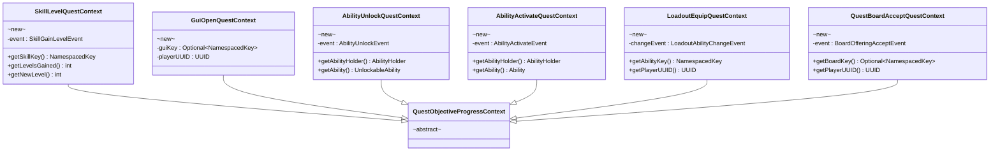
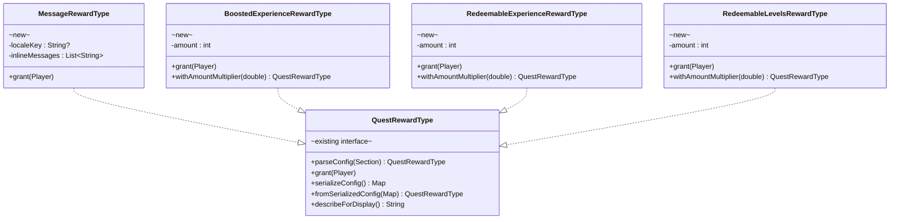
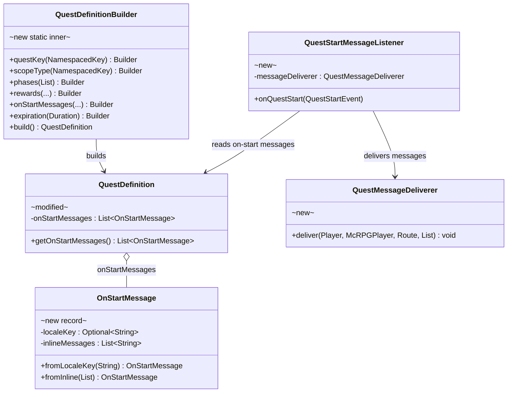
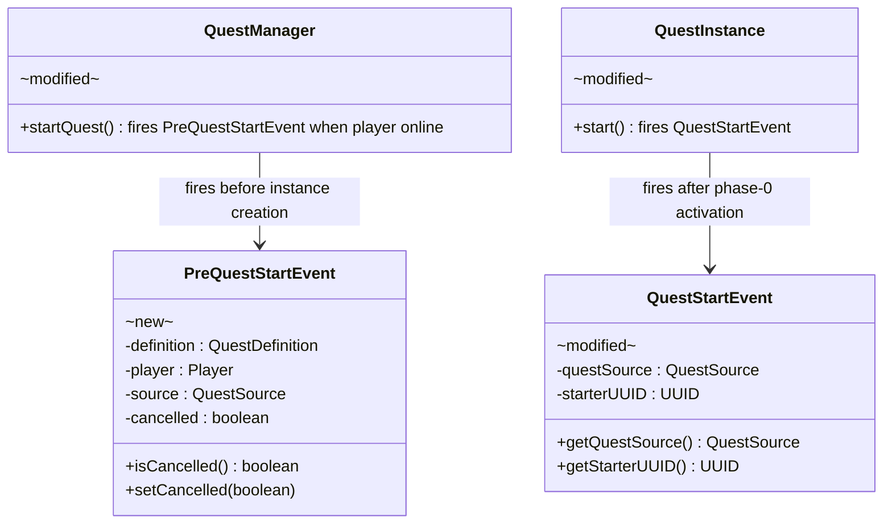
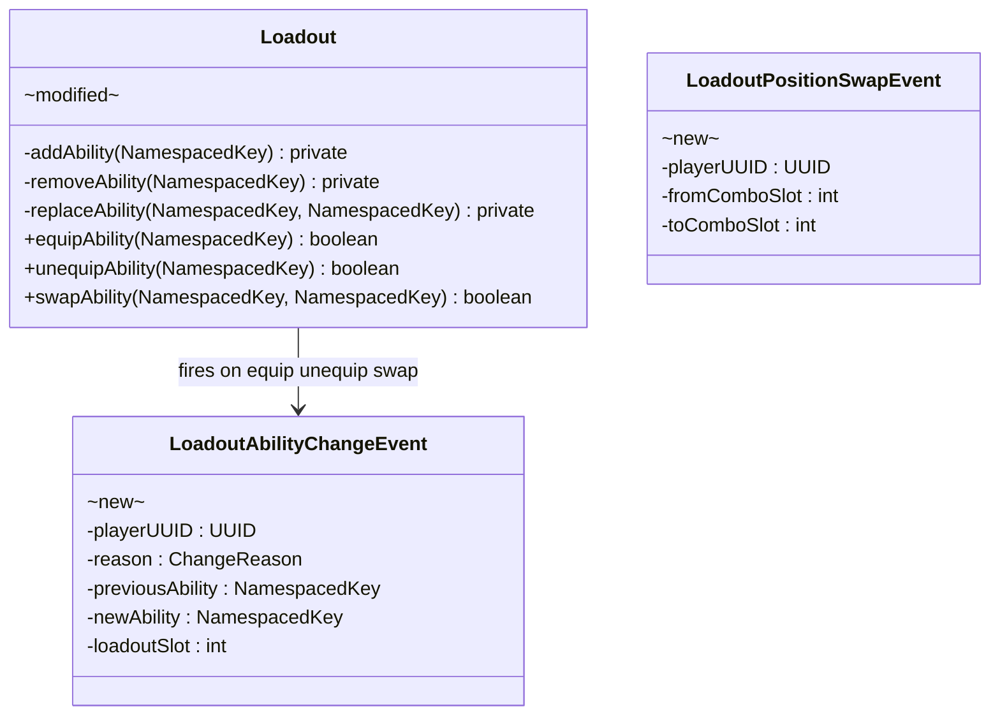
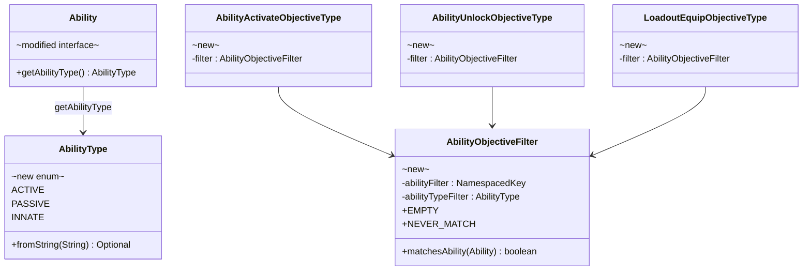
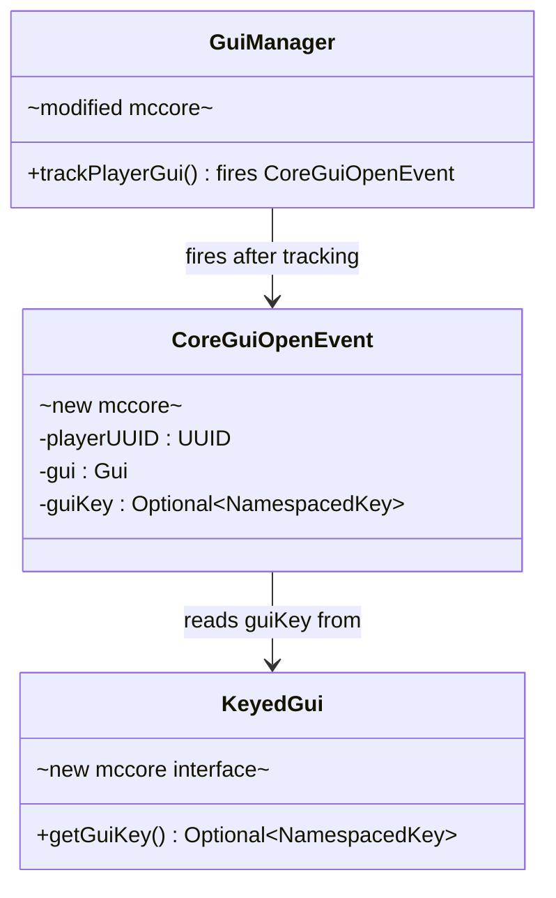

# Phase 1 LLD: Quest Engine Extensions + McCore Hook

> **HLD Reference:** [docs/hld/tutorial/tutorial-quest-system.md](../../hld/tutorial/tutorial-quest-system.md)
> **Status:** Implemented (Phases 2–3 pending)

## Scope

Phase 1 delivers foundational quest engine extensions that unlock new objective and reward types independently of the chain system. It includes: McCore `KeyedGui` interface and `CoreGuiOpenEvent` (consumed via McCore `1.0.0.17-SNAPSHOT`), `PreQuestStartEvent` (cancellable gate in `QuestManager` when the starting player is online), `on-start-messages` on `QuestDefinition` with a `QuestDefinition.Builder` refactor, four new reward types (Message, Boosted Experience, Redeemable Experience, Redeemable Levels), seven new objective types with progress listeners and auto-complete infrastructure for state-based objectives, `LoadoutAbilityChangeEvent` / `LoadoutPositionSwapEvent` on `Loadout` (raw mutation methods made private; DB loading via constructor), `AbilityType` + `AbilityObjectiveFilter`, `QuestMessageDeliverer`, objective index on `QuestDefinition`, `KeyedGui` retrofit on all McRPG GUI classes, and `QuestStartEvent` augmentation with `QuestSource` and `starterUUID`.

**In scope:**
- McCore: `KeyedGui` interface, `CoreGuiOpenEvent` fired from `GuiManager.trackPlayerGui()` (shipped in McCore `1.0.0.17-SNAPSHOT`)
- `PreQuestStartEvent` (cancellable, from `QuestManager.startQuest()` when the initiating player is online)
- `QuestDefinition.Builder` replacing constructor overloads; objective index built at `build()` time
- `on-start-messages` field on `QuestDefinition` + `QuestStartMessageListener` + `QuestMessageDeliverer`
- `QuestStartEvent` augmented with `QuestSource` and `starterUUID`
- Auto-complete infrastructure: `QuestObjectiveType.checkAutoComplete()` + `QuestStartAutoCompleteListener` (starter-scoped, immediate — no delay)
- `AbilityType` enum + `Ability.getAbilityType()`; `AbilityObjectiveFilter` shared by ability-based objective types
- Retrofit all GUI classes to implement `KeyedGui` with `GUI_KEY` constants
- `Loadout.equipAbility()` / `unequipAbility()` / `swapAbility()` firing `LoadoutAbilityChangeEvent`; `LoadoutPositionSwapEvent` for combo-slot reorder; raw `addAbility()`/`removeAbility()`/`replaceAbility()` made private; DB loading via `Loadout(UUID, int, Set<NamespacedKey>)` constructor
- 4 new reward types (Message, Boosted XP, Redeemable XP, Redeemable Levels)
- 7 new objective types + progress listeners
- Localization keys for new reward types and objective descriptions
- Unit tests for all new types (see section 7)
- Builder pattern rules added to `core.mdc` and `CLAUDE.md`

**Out of scope (later phases):**
- Quest chain system (Phase 2)
- Tutorial quest content, `TutorialQuestSource`, `DisableTutorialSetting` (Phase 3)
- Auto-complete delay and chain cascade batching (Phase 3)
- Admin commands for chains (Phase 2)
- Quest history GUI chain grouping (Phase 2)

---

## Class Diagrams

**Legend:** Abstract classes annotated `abstract` · Interfaces annotated `interface` · Records annotated `record` · McCore classes annotated `mccore` · Phase 1 additions annotated `new` · Existing modified classes annotated `modified` · `*--` composition · `o--` association · `-->` dependency · `..|>` implements · `--|>` extends

### Diagram 1: New Objective Types

Seven new objective types implementing the existing `QuestObjectiveType` interface. Types with `checkAutoComplete` are state-based and can resolve immediately on quest start.

```mermaid
classDiagram
    direction TB

    class QuestObjectiveType {
        ~modified interface~
        +getKey() NamespacedKey
        +parseConfig(Section) QuestObjectiveType
        +canProcess(context) boolean
        +processProgress(instance, context) long
        +describeObjective(player, progress) String
        +checkAutoComplete(playerUUID) OptionalLong
    }

    class SkillLevelUpObjectiveType {
        ~new~
        -skillFilter : Optional~NamespacedKey~
        -minLevelsPerEvent : int
    }

    class SkillTargetLevelObjectiveType {
        ~new~
        -skillFilter : Optional~NamespacedKey~
        -targetLevel : int
        +checkAutoComplete(UUID) OptionalLong
    }

    class GuiOpenObjectiveType {
        ~new~
        -guiType : NamespacedKey
    }

    class AbilityUnlockObjectiveType {
        ~new~
        -filter : AbilityObjectiveFilter
        +checkAutoComplete(UUID) OptionalLong
    }

    class AbilityActivateObjectiveType {
        ~new~
        -filter : AbilityObjectiveFilter
    }

    class LoadoutEquipObjectiveType {
        ~new~
        -filter : AbilityObjectiveFilter
        +checkAutoComplete(UUID) OptionalLong
    }

    class QuestBoardAcceptObjectiveType {
        ~new~
        -boardFilter : Optional~NamespacedKey~
    }

    SkillLevelUpObjectiveType ..|> QuestObjectiveType
    SkillTargetLevelObjectiveType ..|> QuestObjectiveType
    GuiOpenObjectiveType ..|> QuestObjectiveType
    AbilityUnlockObjectiveType ..|> QuestObjectiveType
    AbilityActivateObjectiveType ..|> QuestObjectiveType
    LoadoutEquipObjectiveType ..|> QuestObjectiveType
    QuestBoardAcceptObjectiveType ..|> QuestObjectiveType
```



### Diagram 2: Progress Context Classes

Each context wraps a Bukkit event and is consumed by one or more objective types via `canProcess()` + `processProgress()`.



### Diagram 3: Auto-Complete Infrastructure

`QuestStartAutoCompleteListener` listens for `QuestStartEvent` and delegates to each objective type's `checkAutoComplete()` method. State-based types return progress; event-based types return empty.


### Diagram 4: New Reward Types

Four new completion reward types implementing the existing `QuestRewardType` interface.



### Diagram 5: On-Start Messages and QuestDefinition Builder

`OnStartMessage` is a dedicated message-only concept (not a reward). `QuestDefinition.Builder` replaces all existing constructor overloads.



### Diagram 6: Quest Events

`PreQuestStartEvent` is a cancellable gate fired from `QuestManager` when the initiating player is online. `QuestStartEvent` is fired from `QuestInstance.start()` with `QuestSource` and `starterUUID`.



### Diagram 7: Loadout Changes and Events

Raw mutation methods made private. Public API is event-firing methods only. DB loading uses the constructor. Ability equip/unequip/swap share one change event distinguished by `ChangeReason`.



### Diagram 9: Ability Classification and Filters

`AbilityType` centralizes ability classification. `AbilityObjectiveFilter` encapsulates the shared key/type/any filter pattern for ability-based objective types.



### Diagram 8: McCore Changes

New `KeyedGui` interface and `CoreGuiOpenEvent` added to McCore.



---

## 1. McCore Changes

### 1.1 `KeyedGui` — GUI Type Identification Interface

**Package:** `com.diamonddagger590.mccore.gui`
**File:** McCore `src/main/java/.../gui/KeyedGui.java`

An optional interface that `Gui` implementations can adopt to declare a type-level `NamespacedKey` identifying what kind of GUI they are (e.g., `mcrpg:home`, `mcrpg:loadout_selection`). Distinct from `Gui.getUUID()`, which returns the *creating player's UUID* (instance identity), not a type key.

```java
public interface KeyedGui {

    /**
     * Returns the type-level key identifying this GUI's purpose.
     * GUIs that do not implement this interface (or return empty) are
     * still tracked by {@link GuiManager} but are not identifiable by key.
     *
     * @return the GUI's type key, or empty if unkeyed
     */
    @NotNull
    Optional<NamespacedKey> getGuiKey();
}
```

### 1.2 `CoreGuiOpenEvent` — GUI Open Notification

**Package:** `com.diamonddagger590.mccore.event.gui`
**File:** McCore `src/main/java/.../event/gui/CoreGuiOpenEvent.java`

Fired from `GuiManager.trackPlayerGui()` after tracking completes. "Open" means any GUI creation tracked by the manager — including back-button navigation re-opens (intentional for quest objective purposes; objectives can use `required-progress: 1` to trigger only once).

```java
public class CoreGuiOpenEvent extends Event {

    private static final HandlerList HANDLER_LIST = new HandlerList();

    private final UUID playerUUID;
    private final Gui<?> gui;
    private final Optional<NamespacedKey> guiKey;

    /**
     * @param playerUUID the UUID of the player whose GUI was tracked
     * @param gui        the GUI instance being tracked
     * @param guiKey     the GUI's type key if it implements {@link KeyedGui}, or empty
     */
    public CoreGuiOpenEvent(@NotNull UUID playerUUID,
                            @NotNull Gui<?> gui,
                            @NotNull Optional<NamespacedKey> guiKey) {
        this.playerUUID = playerUUID;
        this.gui = gui;
        this.guiKey = guiKey;
    }

    @NotNull public UUID getPlayerUUID() { return playerUUID; }
    @NotNull public Gui<?> getGui() { return gui; }
    @NotNull public Optional<NamespacedKey> getGuiKey() { return guiKey; }

    @NotNull @Override public HandlerList getHandlers() { return HANDLER_LIST; }
    @NotNull public static HandlerList getHandlerList() { return HANDLER_LIST; }
}
```

### 1.3 `GuiManager.trackPlayerGui()` — Fire Event After Tracking

Add event firing at the end of the existing `trackPlayerGui()` method:

```java
public <P extends CorePlayer> void trackPlayerGui(@NotNull UUID uuid, @NotNull Gui<P> gui) {
    // ... existing tracking logic (stopTrackingPlayer, put in maps, registerListeners) ...

    Optional<NamespacedKey> guiKey = (gui instanceof KeyedGui keyed) ? keyed.getGuiKey() : Optional.empty();
    Bukkit.getPluginManager().callEvent(new CoreGuiOpenEvent(uuid, gui, guiKey));
}
```

### 1.4 McCore Dependency

`KeyedGui` and `CoreGuiOpenEvent` ship in McCore `1.0.0.17-SNAPSHOT`, which McRPG already depends on via `build.gradle.kts`. No separate McRPG version bump was required for Phase 1 beyond consuming that artifact.

---

## 2. New Classes

### 2.1 `PreQuestStartEvent` — Cancellable Quest Gate

**Package:** `us.eunoians.mcrpg.event.quest`
**File:** `src/main/java/us/eunoians/mcrpg/event/quest/PreQuestStartEvent.java`

A cancellable Bukkit event fired from `QuestManager.startQuest()` before the quest instance is created, **only when the initiating player is online** (`Bukkit.getPlayer(initialPlayerUUID) != null`). Offline or system-initiated starts skip this event and proceed through the normal scope pipeline. Enables third-party plugins (and future internal systems like the tutorial opt-out) to veto quest starts.

```java
public class PreQuestStartEvent extends Event implements Cancellable {

    private static final HandlerList HANDLER_LIST = new HandlerList();

    private final QuestDefinition definition;
    private final Player player;
    private final QuestSource source;
    private boolean cancelled;

    /**
     * @param definition the quest definition about to be instantiated
     * @param player     the player initiating or being assigned the quest
     * @param source     the source that originated this quest start
     */
    public PreQuestStartEvent(@NotNull QuestDefinition definition,
                              @NotNull Player player,
                              @NotNull QuestSource source) {
        this.definition = definition;
        this.player = player;
        this.source = source;
    }

    @NotNull public QuestDefinition getDefinition() { return definition; }
    @NotNull public Player getPlayer() { return player; }
    @NotNull public QuestSource getSource() { return source; }

    @Override public boolean isCancelled() { return cancelled; }
    @Override public void setCancelled(boolean cancel) { this.cancelled = cancel; }

    @NotNull @Override public HandlerList getHandlers() { return HANDLER_LIST; }
    @NotNull public static HandlerList getHandlerList() { return HANDLER_LIST; }
}
```

**Firing site:** `QuestManager.startQuest()`, before `new QuestInstance(...)`, when the initiating player is online (see section 3.2). On cancellation, the manager logs an info line and returns `Optional.empty()` with no player feedback from the quest system.

### 2.2 `QuestDefinition.Builder` — Replaces Constructor Overloads

**File:** Inner static class on `us.eunoians.mcrpg.quest.definition.QuestDefinition`

Replaces all four public constructors and the `withEntries()` factory method. Required parameters are set via the builder constructor; optional parameters have sensible defaults.

```java
public static final class Builder {

    private final NamespacedKey questKey;
    private final NamespacedKey scopeType;
    private final List<QuestPhaseDefinition> phases;

    private Duration expiration;
    private List<QuestRewardEntry> rewardEntries = List.of();
    private List<OnStartMessage> onStartMessages = List.of();
    private QuestRepeatMode repeatMode = QuestRepeatMode.ONCE;
    private Duration repeatCooldown;
    private int repeatLimit = -1;
    private NamespacedKey expansionKey;
    private Map<NamespacedKey, QuestDefinitionMetadata> metadata;
    private RewardDistributionConfig rewardDistribution;
    private Map<String, String> inlineDisplay;

    /**
     * @param questKey  the unique key identifying this quest
     * @param scopeType the scope provider key
     * @param phases    the ordered phase list (must contain at least one)
     */
    public Builder(@NotNull NamespacedKey questKey,
                   @NotNull NamespacedKey scopeType,
                   @NotNull List<QuestPhaseDefinition> phases) {
        this.questKey = questKey;
        this.scopeType = scopeType;
        this.phases = phases;
    }

    /**
     * Sets the quest-level completion rewards from raw reward types (auto-wrapped).
     *
     * @param rewards the completion reward types
     * @return this builder
     */
    @NotNull
    public Builder rewards(@NotNull List<QuestRewardType> rewards) {
        this.rewardEntries = rewards.stream().map(QuestRewardEntry::new).toList();
        return this;
    }

    /**
     * Sets the quest-level completion reward entries (with optional fallbacks).
     *
     * @param entries the completion reward entries
     * @return this builder
     */
    @NotNull
    public Builder rewardEntries(@NotNull List<QuestRewardEntry> entries) {
        this.rewardEntries = entries;
        return this;
    }

    /**
     * Sets messages sent to players when the quest starts (before objectives begin).
     * These are informational messages only — not tangible rewards. This allows
     * chain cascade auto-complete in Phase 3 to cleanly skip messages without risking
     * dropped rewards.
     *
     * @param messages the on-start messages
     * @return this builder
     */
    @NotNull
    public Builder onStartMessages(@NotNull List<OnStartMessage> messages) {
        this.onStartMessages = messages;
        return this;
    }

    @NotNull public Builder expiration(@Nullable Duration expiration) { this.expiration = expiration; return this; }
    @NotNull public Builder repeatMode(@NotNull QuestRepeatMode mode) { this.repeatMode = mode; return this; }
    @NotNull public Builder repeatCooldown(@Nullable Duration cooldown) { this.repeatCooldown = cooldown; return this; }
    @NotNull public Builder repeatLimit(int limit) { this.repeatLimit = limit; return this; }
    @NotNull public Builder expansionKey(@Nullable NamespacedKey key) { this.expansionKey = key; return this; }
    @NotNull public Builder metadata(@Nullable Map<NamespacedKey, QuestDefinitionMetadata> metadata) { this.metadata = metadata; return this; }
    @NotNull public Builder rewardDistribution(@Nullable RewardDistributionConfig config) { this.rewardDistribution = config; return this; }
    @NotNull public Builder inlineDisplay(@Nullable Map<String, String> display) { this.inlineDisplay = display; return this; }

    /**
     * Builds and returns a new immutable {@link QuestDefinition}.
     *
     * @return the quest definition
     * @throws IllegalArgumentException if phases is empty
     */
    @NotNull
    public QuestDefinition build() {
        // Builds objectiveIndex: Map<NamespacedKey, QuestObjectiveDefinition> for O(1) lookup.
        // Duplicate objective keys across phases/stages throw IllegalStateException.
        return new QuestDefinition(questKey, scopeType, expiration, phases,
                rewardEntries, onStartMessages, repeatMode, repeatCooldown,
                repeatLimit, expansionKey, metadata, rewardDistribution, inlineDisplay,
                objectiveIndex);
    }
}
```

**Migration:** Existing public constructors and `withEntries()` are **removed**. The private canonical constructor accepts `onStartMessages` and `objectiveIndex`. `QuestConfigLoader` and all programmatic callsites are migrated to the builder.

### 2.3 `OnStartMessage` — Quest Start Message Record

**Package:** `us.eunoians.mcrpg.quest.definition`
**File:** `src/main/java/us/eunoians/mcrpg/quest/definition/OnStartMessage.java`

Immutable record holding a single message entry sent to players when a quest starts. Each entry is either a locale key (resolved via `QuestMessageDeliverer`) or a list of inline MiniMessage strings. At delivery time, locale resolution is attempted first; **inline messages are used as fallback** when resolution fails or no key is set.

```java
/**
 * A message sent to players when a quest starts. This is not a reward — on-start messages
 * are informational only, allowing chain cascade auto-complete to cleanly skip them
 * without risking dropped tangible rewards.
 *
 * @param localeKey       optional locale route key resolved via the localization manager;
 *                        inline messages are fallback when resolution fails
 * @param inlineMessages  fallback MiniMessage strings when no locale key is set or resolution fails
 */
public record OnStartMessage(
        @NotNull Optional<String> localeKey,
        @NotNull List<String> inlineMessages
) {

    /**
     * Creates an on-start message backed by a locale key.
     *
     * @param localeKey the locale route key
     * @return a new {@link OnStartMessage}
     */
    @NotNull
    public static OnStartMessage fromLocaleKey(@NotNull String localeKey) {
        return new OnStartMessage(Optional.of(localeKey), List.of());
    }

    /**
     * Creates an on-start message with inline MiniMessage strings.
     *
     * @param messages the inline messages
     * @return a new {@link OnStartMessage}
     */
    @NotNull
    public static OnStartMessage fromInline(@NotNull List<String> messages) {
        return new OnStartMessage(Optional.empty(), messages);
    }
}
```

### 2.4 `QuestMessageDeliverer` — Shared Message Delivery

**Package:** `us.eunoians.mcrpg.quest.message`
**File:** `src/main/java/us/eunoians/mcrpg/quest/message/QuestMessageDeliverer.java`

Delivers quest-related messages to players using locale resolution with inline MiniMessage fallback. Shared by `QuestStartMessageListener` and `MessageRewardType.grant()`.

**Resolution order:**
1. If a pre-parsed `Route` (or locale key string) is provided and `McRPGPlayer` is available, resolve via `McRPGLocalizationManager.getLocalizedMessageAsComponent`. On success, send and return.
2. On resolution failure (logged at `WARNING`), or if no key/route, parse and send each inline MiniMessage string independently (malformed strings log `WARNING` but do not abort subsequent messages).

**Hot-path overload:** `deliver(Player, McRPGPlayer, Route, List<String>)` accepts a pre-parsed `Route` so `QuestStartMessageListener` can call `Route.fromString()` once per message before the per-player loop.

### 2.5 `QuestStartMessageListener` — On-Start Message Delivery

**Package:** `us.eunoians.mcrpg.listener.quest`
**File:** `src/main/java/us/eunoians/mcrpg/listener/quest/QuestStartMessageListener.java`

Listens for `QuestStartEvent` and delivers on-start messages to all **online** players in the quest scope via `QuestMessageDeliverer`. Pre-parses locale routes once before the player loop. Uses `instance.getQuestScope().map(QuestScope::getCurrentPlayersInScope)`.

### 2.6 `QuestStartAutoCompleteListener` — State-Based Objective Resolution

**Package:** `us.eunoians.mcrpg.listener.quest`
**File:** `src/main/java/us/eunoians/mcrpg/listener/quest/QuestStartAutoCompleteListener.java`

Listens for `QuestStartEvent` and immediately completes any IN_PROGRESS objectives whose state-based auto-complete check passes for the **quest starter only** (`event.getStarterUUID()`). Returns immediately when `starterUUID` is null (system-initiated starts). No delay in Phase 1 — both on-start messages and completion rewards fire. The chain cascade batching in Phase 3 will suppress on-start messages for auto-completed chain steps and send a configurable batch summary via the localization system instead.

```java
@EventHandler(priority = EventPriority.MONITOR, ignoreCancelled = true)
public void onQuestStart(@NotNull QuestStartEvent event) {
    UUID starterUUID = event.getStarterUUID();
    if (starterUUID == null) {
        return;
    }
    // For each IN_PROGRESS objective: type.checkAutoComplete(starterUUID)
    // If autoProgress >= requiredProgress → objective.progress(required, starterUUID)
}
```

### 2.7 `AbilityType` — Ability Classification Enum

**Package:** `us.eunoians.mcrpg.ability`
**File:** `src/main/java/us/eunoians/mcrpg/ability/AbilityType.java`

Enum: `ACTIVE` (implements `ComboActivatable`), `PASSIVE` (`PassiveAbility` + `UnlockableAbility`), `INNATE` (everything else). `Ability.getAbilityType()` provides the default classification; individual abilities may override. `AbilityType.fromString(String)` parses YAML `ability-type` config values case-insensitively.

Replaces the removed `PassiveAbility.isPassive()` / `ActiveAbility.isPassive()` defaults — there is no `isPassive()` API on abilities.

### 2.8 `AbilityObjectiveFilter` — Shared Ability Filter Logic

**Package:** `us.eunoians.mcrpg.quest.objective.type.builtin`
**File:** `src/main/java/us/eunoians/mcrpg/quest/objective/type/builtin/AbilityObjectiveFilter.java`

Encapsulates the key / type / any filter priority used by `AbilityActivateObjectiveType`, `AbilityUnlockObjectiveType`, and `LoadoutEquipObjectiveType`:

1. Specific `ability` key — matches only that ability
2. `ability-type` (`AbilityType`) — matches abilities of that classification via `ability.getAbilityType()`
3. No filter — matches any ability

Sentinels: `EMPTY` (matches all), `NEVER_MATCH` (used when config parsing fails).

### 2.9 Reward Types

All four reward types follow the existing immutable configured-instance pattern established by `ExperienceRewardType`. Each has: an unconfigured base instance for registry registration, a private configured constructor, and `parseConfig()` returning a new configured instance.

#### 2.9.1 `MessageRewardType`

**Package:** `us.eunoians.mcrpg.quest.reward.builtin`
**File:** `src/main/java/us/eunoians/mcrpg/quest/reward/builtin/MessageRewardType.java`
**Key:** `mcrpg:message`

Sends player-facing messages. Supports locale route lookup and/or inline MiniMessage strings with palette resolution.

```yaml
# Route-based (preferred for translatable text)
welcome:
  type: mcrpg:message
  key: tutorial.welcome-message

# Inline fallback
hint:
  type: mcrpg:message
  messages:
    - "<primary>Tip:</primary> <body>Run /mcrpg to open your menu!"

# Both (route lookup with inline fallback)
greeting:
  type: mcrpg:message
  key: tutorial.greeting
  messages:
    - "<primary>Welcome!</primary> <body>Your adventure begins."
```

**Fields:** `@NotNull Optional<String> localeKey`, `@NotNull List<String> inlineMessages`

**`grant(Player)`:** Delegates to `QuestMessageDeliverer` with the same locale-first, inline-fallback resolution order as on-start messages.

**`describeForDisplay()`:** Returns `"Message"` (or the locale key if set). Not the full message list — messages can be multi-line and aren't suitable for reward slot lore.

**`withAmountMultiplier()`:** Returns `this` (messages are not scalable).

**`getNumericAmount()`:** Returns `OptionalLong.empty()`.

**`serializeConfig()` / `fromSerializedConfig()`:** Serializes `localeKey` and `inlineMessages` for pending reward queue. A message delivered to a player logging in after being offline is still useful (e.g., tutorial welcome message on delayed start).

#### 2.9.2 `BoostedExperienceRewardType`

**Key:** `mcrpg:boosted_experience`

```yaml
boosted_xp:
  type: mcrpg:boosted_experience
  amount: 500
```

**Fields:** `int amount`

**`grant(Player)`:** Resolves `McRPGPlayer` from `McRPGManagerKey.PLAYER`, calls `mcRPGPlayer.getExperienceExtras().modifyBoostedExperience(amount)`.

**`withAmountMultiplier(double)`:** Returns new instance with `Math.max(1, (int)(amount * multiplier))`.

**`getNumericAmount()`:** `OptionalLong.of(amount)`.

**`describeForDisplay(McRPGPlayer)`:** Resolves `LocalizationKey.QUEST_REWARD_BOOSTED_EXPERIENCE_FORMAT` with `<amount>` placeholder. Fallback: `"<amount> Boosted XP"`.

#### 2.9.3 `RedeemableExperienceRewardType`

**Key:** `mcrpg:redeemable_experience`

Identical pattern to `BoostedExperienceRewardType`. Calls `modifyRedeemableExperience(amount)`.

#### 2.9.4 `RedeemableLevelsRewardType`

**Key:** `mcrpg:redeemable_levels`

Identical pattern. Calls `modifyRedeemableLevels(amount)`.

### 2.10 Objective Types

All seven objective types follow the existing pattern established by `BlockBreakObjectiveType`: unconfigured base instance for registry, `parseConfig()` returns configured copy, `canProcess()` checks context type, `processProgress()` returns delta.

State-based types additionally override `checkAutoComplete(UUID)` to return `OptionalLong.of(1)` when the player's current state satisfies the objective.

#### 2.10.1 `SkillLevelUpObjectiveType`

**Key:** `mcrpg:skill_level_up` · **Kind:** Event-only
**Trigger:** `SkillGainLevelEvent` via `SkillLevelQuestProgressListener`

**Config filters:**
- `skill` (optional `NamespacedKey`; omit for any skill)
- `levels` (optional `int`, default 1; minimum levels gained **per event** to count)

**`processProgress()`:** If skill matches filter and `context.getLevelsGained() >= minLevelsPerEvent`, returns `getLevelsGained()` as the delta. `required-progress` is the total levels to accumulate across events. Otherwise 0.

**`describeObjective()`:** `"Level up <count> time(s)"` or `"Level up <skill> <count> time(s)"`.

#### 2.10.2 `SkillTargetLevelObjectiveType`

**Key:** `mcrpg:skill_target_level` · **Kind:** State + Event
**Trigger:** `SkillGainLevelEvent` via `SkillLevelQuestProgressListener` · **Auto-complete:** Check player skill levels

**Config filters:**
- `skill` (optional `NamespacedKey`; omit for any skill)
- `target-level` (optional `int`, default 1)

**`processProgress()`:** After a level-up event, if `SkillLevelQuestContext.getNewLevel() >= targetLevel` (with optional skill filter), return 1. Otherwise 0.

**`checkAutoComplete(UUID)`:** Resolves `McRPGPlayer`, iterates skill data. If any matching skill's level >= `targetLevel`, returns `OptionalLong.of(1)`. Otherwise empty.

**`describeObjective()`:** `"Reach level <level> in any skill"` or `"Reach level <level> in <skill>"`.

**Note:** `required-progress` for this type is always `1` (binary: condition met or not).

#### 2.10.3 `GuiOpenObjectiveType`

**Key:** `mcrpg:gui_open` · **Kind:** Event-only
**Trigger:** `CoreGuiOpenEvent` (McCore) via `GuiOpenQuestProgressListener`

**Config filters:**
- `gui-type` (required `NamespacedKey`; matches `KeyedGui.getGuiKey()`)

**`processProgress()`:** If `context.getGuiKey()` is present and matches `guiType`, return 1. Otherwise 0.

**`describeObjective()`:** `"Open the <gui-name>"`. The GUI display name is resolved from a localization route derived from the key: `gui.<namespace>.<key>.display-name`.

#### 2.10.4 `AbilityUnlockObjectiveType`

**Key:** `mcrpg:ability_unlock` · **Kind:** State + Event
**Trigger:** `AbilityUnlockEvent` via `AbilityUnlockQuestProgressListener` · **Auto-complete:** Check player's unlocked abilities

**Config filters:** Parsed into `AbilityObjectiveFilter`:
- `ability-type` (optional: `ACTIVE`, `PASSIVE`, `INNATE` via `AbilityType.fromString`)
- `ability` (optional `NamespacedKey`; specific ability key — takes priority over type)

**`processProgress()`:** If the unlocked ability passes `filter.matchesAbility()`, return 1. Otherwise 0.

**`checkAutoComplete(UUID)`:** Resolves `McRPGPlayer`, iterates ability data. Checks if any ability matching the filter has `ABILITY_UNLOCKED_ATTRIBUTE` set to `true`. If found, returns `OptionalLong.of(1)`.

**`describeObjective()`:** `"Unlock a passive ability"`, `"Unlock an active ability"`, or `"Unlock <ability>"`.

#### 2.10.5 `AbilityActivateObjectiveType`

**Key:** `mcrpg:ability_activate` · **Kind:** Event-only
**Trigger:** `AbilityActivateEvent` (polymorphic) via `AbilityActivateQuestProgressListener`

**Config filters:** Parsed into `AbilityObjectiveFilter` (`ability-type`: `ACTIVE`, `PASSIVE`, or `INNATE`; optional specific `ability` key).

**`processProgress()`:** If `filter.matchesAbility(event.getAbility())`, return 1. Otherwise 0.

Covers combo-activated active abilities (tutorial Q6 uses `ability-type: ACTIVE` instead of a separate `combo_activate` type).

**`describeObjective()`:** `"Activate an active ability"`, `"Activate <ability>"`, etc.

#### 2.10.6 `LoadoutEquipObjectiveType`

**Key:** `mcrpg:loadout_equip` · **Kind:** State + Event
**Trigger:** `LoadoutAbilityChangeEvent` (`EQUIP` or `SWAP`) via `LoadoutEquipQuestProgressListener` · **Auto-complete:** Check player's **active** loadout

**Config filters:** Parsed into `AbilityObjectiveFilter` (`ability-type`: `ACTIVE` or `PASSIVE`; optional specific `ability` key).

**`processProgress()`:** If the new ability in the change event passes `filter.matchesAbility()`, return 1. Otherwise 0. Progress listener only fires for the player's **currently active loadout** (`getCurrentLoadoutSlot() == event.getLoadoutSlot()`); edits to non-active presets do not count.

**`checkAutoComplete(UUID)`:** Resolves `McRPGPlayer` as `LoadoutHolder`, checks active loadout for any ability matching the filter. If found, returns `OptionalLong.of(1)`.

**`describeObjective()`:** `"Equip a passive ability"`, `"Equip <ability>"`, etc.

#### 2.10.7 `QuestBoardAcceptObjectiveType`

**Key:** `mcrpg:quest_board_accept` · **Kind:** Event-only
**Trigger:** `BoardOfferingAcceptEvent` via `QuestBoardAcceptQuestProgressListener`

**Config filters:**
- `board` (optional `NamespacedKey`; specific board key, omit for any board)

**`processProgress()`:** If board filter matches (or no filter), return 1. Otherwise 0.

**`describeObjective()`:** `"Accept a quest from the quest board"`.

### 2.11 Progress Context Classes

Each context wraps the relevant event data. All extend `QuestObjectiveProgressContext`.

| Context | File suffix | Wraps | Key accessors |
|---|---|---|---|
| `SkillLevelQuestContext` | `SkillLevelQuestContext.java` | `SkillGainLevelEvent` | `getSkillKey()`, `getLevelsGained()`, `getNewLevel()`, `getPlayerUUID()` |
| `GuiOpenQuestContext` | `GuiOpenQuestContext.java` | `CoreGuiOpenEvent` | `getGuiKey()`, `getPlayerUUID()` |
| `AbilityUnlockQuestContext` | `AbilityUnlockQuestContext.java` | `AbilityUnlockEvent` | `getAbility()`, `getAbilityHolder()` |
| `AbilityActivateQuestContext` | `AbilityActivateQuestContext.java` | `AbilityActivateEvent` | `getAbility()`, `getAbilityHolder()` |
| `LoadoutEquipQuestContext` | `LoadoutEquipQuestContext.java` | `LoadoutAbilityChangeEvent` | `getAbilityKey()` (new ability), `getPlayerUUID()` |
| `QuestBoardAcceptQuestContext` | `QuestBoardAcceptQuestContext.java` | `BoardOfferingAcceptEvent` | `getBoardKey()`, `getPlayerUUID()` |

All placed in `us.eunoians.mcrpg.quest.objective.type.builtin`.

`SkillLevelQuestContext` is shared by both `SkillLevelUpObjectiveType` and `SkillTargetLevelObjectiveType` — both react to `SkillGainLevelEvent` and handle their own logic in `processProgress()`.

### 2.12 Progress Listeners

All follow the `BlockBreakQuestProgressListener` pattern: implement `QuestProgressListener`, inject `QuestManager` in constructor, listen at `MONITOR` priority with `ignoreCancelled = true`, construct context, call `progressQuests(questManager, playerUUID, context)`.

| Listener | Event | Context | Objective types served |
|---|---|---|---|
| `SkillLevelQuestProgressListener` | `SkillGainLevelEvent` | `SkillLevelQuestContext` | `skill_level_up`, `skill_target_level` |
| `GuiOpenQuestProgressListener` | `CoreGuiOpenEvent` | `GuiOpenQuestContext` | `gui_open` |
| `AbilityUnlockQuestProgressListener` | `AbilityUnlockEvent` | `AbilityUnlockQuestContext` | `ability_unlock` |
| `AbilityActivateQuestProgressListener` | `AbilityActivateEvent` | `AbilityActivateQuestContext` | `ability_activate` |
| `LoadoutEquipQuestProgressListener` | `LoadoutAbilityChangeEvent` | `LoadoutEquipQuestContext` | `loadout_equip` |
| `QuestBoardAcceptQuestProgressListener` | `BoardOfferingAcceptEvent` | `QuestBoardAcceptQuestContext` | `quest_board_accept` |

**Player UUID resolution:** Each listener extracts the player UUID from the event. For `AbilityActivateEvent` and `AbilityUnlockEvent`, from `event.getAbilityHolder().getUUID()`. For `CoreGuiOpenEvent`, from `event.getPlayerUUID()`. For `LoadoutAbilityChangeEvent`, from `event.getPlayerUUID()`.

**Loadout equip listener:** Ignores `ChangeReason.UNEQUIP`. Only credits progress when the change affects the player's **active** loadout slot.

### 2.13 Loadout Events

Two new events in `us.eunoians.mcrpg.event.loadout`:

#### `LoadoutAbilityChangeEvent`

Unified event for equip, unequip, and swap. Distinguished by `ChangeReason` enum (`EQUIP`, `UNEQUIP`, `SWAP`). Carries `previousAbility` and `newAbility` as nullable `Optional<NamespacedKey>` — present fields depend on reason (see class Javadoc).

Fired from `Loadout.equipAbility()`, `unequipAbility()`, and `swapAbility()`.

#### `LoadoutPositionSwapEvent`

Fired when combo-slot positions are reordered within the active loadout. No ability enters or leaves the loadout — only ordering changes. Not used by quest progress listeners in Phase 1.

---

## 3. Modifications to Existing Classes

### 3.1 `QuestDefinition` — Add On-Start Messages, Builder, Objective Index

**New fields:** `private final List<OnStartMessage> onStartMessages`, `private final Map<NamespacedKey, QuestObjectiveDefinition> objectiveIndex`

**New accessor for on-start messages:**

```java
/**
 * Gets the messages sent to players when this quest starts.
 *
 * @return an immutable list of on-start messages (empty if none configured)
 */
@NotNull
public List<OnStartMessage> getOnStartMessages() {
    return onStartMessages;
}
```

**New accessor for objective lookup:**

```java
@NotNull
public Optional<QuestObjectiveDefinition> findObjectiveDefinition(@NotNull NamespacedKey objectiveKey) {
    return Optional.ofNullable(objectiveIndex.get(objectiveKey));
}
```

**Private canonical constructor:** Updated to accept `onStartMessages` and `objectiveIndex`.

**Builder `build()`:** Constructs `objectiveIndex` from all objectives across phases/stages. Duplicate objective keys throw `IllegalStateException`.

**Existing public constructors and `withEntries()`:** Removed. All callsites are migrated to the builder.

**Inner `Builder` class:** Added as described in section 2.2.

### 3.2 `QuestManager.startQuest()` — Fire PreQuestStartEvent

The four-parameter overload fires `PreQuestStartEvent` only when the initiating player is **online**. Offline players skip the pre-event; scope resolution and instance creation proceed normally.

```java
Player player = Bukkit.getPlayer(initialPlayerUUID);
if (player != null) {
    PreQuestStartEvent preEvent = new PreQuestStartEvent(definition, player, questSource);
    Bukkit.getPluginManager().callEvent(preEvent);
    if (preEvent.isCancelled()) {
        // logs info, returns Optional.empty()
        return Optional.empty();
    }
}
// ... scope resolution, new QuestInstance(...), instance.start(definition, initialPlayerUUID), track ...
```

Note: `player == null` does **not** abort the start — only pre-event cancellation or scope provider failure returns empty.

### 3.3 `QuestStartEvent` — Add QuestSource and Starter UUID

**New fields:** `private final QuestSource questSource`, `@Nullable private final UUID starterUUID`

**Constructors:**

```java
public QuestStartEvent(@NotNull QuestInstance questInstance,
                       @NotNull QuestDefinition questDefinition,
                       @NotNull QuestSource questSource,
                       @Nullable UUID starterUUID);

// Overload without starterUUID (system-initiated) delegates with null starter
```

**Accessors:** `getQuestSource()`, `getStarterUUID()` (nullable).

**Firing site:** `QuestInstance.start(definition, starterUUID)` — marked `@ApiStatus.Internal`. Passes `this.questSource` and the initiating player's UUID. `QuestStartAutoCompleteListener` uses `starterUUID` for auto-complete checks.

### 3.4 `QuestObjectiveType` — Add `checkAutoComplete` Default Method

```java
/**
 * Checks whether the given player's current state already satisfies this
 * configured objective. State-based objective types override this to query
 * player data (skill levels, unlocked abilities, loadout contents, etc.).
 * <p>
 * Returns the progress value to apply if the state check passes, or empty
 * if this objective type does not support auto-complete or the player's
 * state does not satisfy the condition.
 *
 * @param playerUUID the UUID of the player to check
 * @return the progress to apply, or empty if auto-complete does not apply
 */
@NotNull
default OptionalLong checkAutoComplete(@NotNull UUID playerUUID) {
    return OptionalLong.empty();
}
```

### 3.5 `Ability` — `getAbilityType()` and Removed `isPassive()`

**`AbilityType` enum** (`ACTIVE`, `PASSIVE`, `INNATE`) with `fromString()` for YAML config.

**Default on `Ability`:**

```java
default AbilityType getAbilityType() {
    if (this instanceof ComboActivatable) return AbilityType.ACTIVE;
    if (this instanceof PassiveAbility && this instanceof UnlockableAbility) return AbilityType.PASSIVE;
    return AbilityType.INNATE;
}
```

**Removed:** `PassiveAbility.isPassive()` and `ActiveAbility.isPassive()` default methods — classification uses `getAbilityType()` exclusively.

### 3.6 `QuestConfigLoader` — Parse `on-start-messages` Section

Implemented via `parseOnStartMessages(Section)`: iterates `messagesSection.getRoutesAsStrings(false)`. Skips entries with blank `key` or empty `messages` list (logs warnings). Each entry is either `key:` (locale route) or `messages:` (inline MiniMessage strings).

```java
return new QuestDefinition.Builder(questKey, scopeType, phases)
        .rewards(rewards)
        .onStartMessages(onStartMessages)
        .expiration(expiration)
        .repeatMode(repeatMode)
        // ... remaining builder calls ...
        .build();
```

**YAML schema:**

```yaml
on-start-messages:
  welcome:
    key: tutorial.first-steps.welcome
  explain_skills:
    messages:
      - "<primary>As you play, your skills will level up automatically."
      - "<body>Try breaking some blocks to see your Mining skill grow."
```

### 3.7 `Loadout` — Private Raw Methods, Public Event-Firing Methods

The existing `addAbility()`, `removeAbility()`, and `replaceAbility()` are changed from `public` to `private`. They are now internal implementation details called only by the new event-firing methods. No external class needs direct access to raw mutations:

- **DB loading** already has a constructor `Loadout(UUID, int, Set<NamespacedKey>)` that accepts initial abilities. `LoadoutAbilityDAO.getLoadout()` is updated to collect abilities into a `LinkedHashSet` first, then pass them to the constructor (see section 3.8).
- **`copyLoadout()`** accesses the `abilities` field directly (same class) — unaffected.
- **`swapActivePositions()`** manipulates the `abilities` list directly — unaffected.

New public methods wrap the now-private mutations and fire events:

```java
Each public method fires `LoadoutAbilityChangeEvent` with the appropriate `ChangeReason`:

```java
// EQUIP: previousAbility=null, newAbility=key
new LoadoutAbilityChangeEvent(loadoutHolder, ChangeReason.EQUIP, null, key, loadoutSlot);

// UNEQUIP: previousAbility=key, newAbility=null
new LoadoutAbilityChangeEvent(loadoutHolder, ChangeReason.UNEQUIP, key, null, loadoutSlot);

// SWAP: previousAbility=oldAbility, newAbility=newAbility
new LoadoutAbilityChangeEvent(loadoutHolder, ChangeReason.SWAP, oldAbility, newAbility, loadoutSlot);
```

`replaceAbility()` when both abilities are already in the loadout swaps their positions in the internal list (both remain in the loadout).

### 3.8 `LoadoutAbilityDAO` — Constructor-Based Loading

`LoadoutAbilityDAO.getLoadout()` currently creates an empty `Loadout` and calls `addAbility()` in a loop. Since `addAbility()` is now private, the DAO must collect abilities first and pass them to the existing `Loadout(UUID, int, Set<NamespacedKey>)` constructor:

```java
@NotNull
public static Loadout getLoadout(@NotNull Connection connection, @NotNull UUID holderUUID, int loadoutId) {
    AbilityRegistry abilityRegistry = McRPG.getInstance().registryAccess().registry(McRPGRegistryKey.ABILITY);
    Set<NamespacedKey> loadedAbilities = new LinkedHashSet<>();
    try (PreparedStatement preparedStatement = connection.prepareStatement(
            "SELECT ability_id FROM " + TABLE_NAME + " WHERE holder_uuid = ? AND loadout_id = ? ORDER BY slot_number ASC;")) {
        preparedStatement.setString(1, holderUUID.toString());
        preparedStatement.setInt(2, loadoutId);
        try (ResultSet resultSet = preparedStatement.executeQuery()) {
            while (resultSet.next()) {
                String abilityId = resultSet.getString("ability_id");
                NamespacedKey namespacedKey = new NamespacedKey(McRPG.getInstance(), abilityId);
                if (abilityRegistry.registered(namespacedKey)) {
                    loadedAbilities.add(namespacedKey);
                }
            }
        }
    } catch (SQLException e) {
        McRPG.getInstance().getLogger().log(Level.SEVERE, "Failed to load loadout abilities", e);
    }
    return new Loadout(holderUUID, loadoutId, loadedAbilities);
}
```

`LinkedHashSet` preserves insertion order from the `ORDER BY slot_number ASC` query, so ability ordering is maintained. This also fixes the existing `e.printStackTrace()` anti-pattern in the DAO.

### 3.9 Loadout Callsite Retrofits

All callsites that currently call `addAbility()`, `removeAbility()`, or `replaceAbility()` are updated to use the event-firing methods:

| Callsite | Current call | New call |
|---|---|---|
| `LoadoutSelectAbilitySlot.onClick()` | `loadout.addAbility(key)` or `loadout.replaceAbility(old, new)` | `loadout.equipAbility(key)` or `loadout.swapAbility(old, new)` |
| `LoadoutAbilitySlot.onClick()` (remove) | `loadout.removeAbility(key)` | `loadout.unequipAbility(key)` |
| `OnAbilityUnlockListener` (auto-equip) | `loadout.addAbility(key)` | `loadout.equipAbility(key)` |
| `ActiveAbilityComboSlot` (reorder) | `loadout.replaceAbility(old, new)` | `loadout.swapAbility(old, new)` |
| `LoadoutAbilityDAO.getLoadout()` | `loadout.addAbility(key)` in loop | Constructor `new Loadout(uuid, slot, abilities)` (see section 3.8) |

No external callsite retains access to the raw methods.

### 3.10 GUI KeyedGui Retrofit

All concrete GUI classes implement `KeyedGui` and declare a `public static final NamespacedKey GUI_KEY`. The interface implementation is a one-line method returning `Optional.of(GUI_KEY)`.

| GUI Class | Key |
|---|---|
| `HomeGui` | `mcrpg:home` |
| `AbilityGui` | `mcrpg:abilities` |
| `InnateAbilityGui` | `mcrpg:innate_abilities` |
| `AbilityAttributeEditGui` | `mcrpg:ability_edit` |
| `RemoteTransferGui` | `mcrpg:remote_transfer` |
| `SkillGui` | `mcrpg:skills` |
| `LoadoutSelectionGui` | `mcrpg:loadout_selection` |
| `LoadoutGui` | `mcrpg:loadout` |
| `LoadoutAbilitySelectGui` | `mcrpg:loadout_ability_select` |
| `LoadoutDisplayHomeGui` | `mcrpg:loadout_display` |
| `LoadoutDisplayItemInputGui` | `mcrpg:loadout_display_input` |
| `ExperienceBankGui` | `mcrpg:experience_bank` |
| `RedeemableSkillSelectionGui` | `mcrpg:redeemable_skill_selection` |
| `RedeemableExperienceGui` | `mcrpg:redeemable_experience` |
| `RedeemableLevelsGui` | `mcrpg:redeemable_levels` |
| `PlayerSettingGui` | `mcrpg:settings` |
| `QuestBoardGui` | `mcrpg:board` |
| `ScopedEntitySelectorGui` | `mcrpg:board_entity_selector` |
| `ActiveQuestGui` | `mcrpg:active_quests` |
| `QuestHistoryGui` | `mcrpg:quest_history` |
| `QuestDetailGui` | `mcrpg:quest_detail` |
| `QuestAbandonConfirmGui` | `mcrpg:quest_abandon_confirm` |

**Mechanical pattern for each class:**

```java
public class HomeGui extends BaseGui<McRPGPlayer> implements FillerItemGui, KeyedGui {

    public static final NamespacedKey GUI_KEY =
            new NamespacedKey(McRPGMethods.getMcRPGNamespace(), "home");

    @Override
    @NotNull
    public Optional<NamespacedKey> getGuiKey() {
        return Optional.of(GUI_KEY);
    }

    // ... rest unchanged ...
}
```

### 3.11 `McRPGExpansion` — Register New Types

**`getQuestObjectiveTypeContent()`** — add 7 new types:

```java
pack.addContent(new SkillLevelUpObjectiveType());
pack.addContent(new SkillTargetLevelObjectiveType());
pack.addContent(new GuiOpenObjectiveType());
pack.addContent(new AbilityUnlockObjectiveType());
pack.addContent(new AbilityActivateObjectiveType());
pack.addContent(new LoadoutEquipObjectiveType());
pack.addContent(new QuestBoardAcceptObjectiveType());
```

**`getQuestRewardTypeContent()`** — add 4 new types:

```java
pack.addContent(new MessageRewardType());
pack.addContent(new BoostedExperienceRewardType());
pack.addContent(new RedeemableExperienceRewardType());
pack.addContent(new RedeemableLevelsRewardType());
```

### 3.12 `McRPGListenerRegistrar` — Register New Listeners

```java
// Quest progress listeners
Bukkit.getPluginManager().registerEvents(
        new SkillLevelQuestProgressListener(questManager), plugin);
Bukkit.getPluginManager().registerEvents(
        new GuiOpenQuestProgressListener(questManager), plugin);
Bukkit.getPluginManager().registerEvents(
        new AbilityUnlockQuestProgressListener(questManager), plugin);
Bukkit.getPluginManager().registerEvents(
        new AbilityActivateQuestProgressListener(questManager), plugin);
Bukkit.getPluginManager().registerEvents(
        new LoadoutEquipQuestProgressListener(questManager), plugin);
Bukkit.getPluginManager().registerEvents(
        new QuestBoardAcceptQuestProgressListener(questManager), plugin);

// Quest lifecycle listeners
Bukkit.getPluginManager().registerEvents(
        new QuestStartMessageListener(mcRPG), plugin);
Bukkit.getPluginManager().registerEvents(
        new QuestStartAutoCompleteListener(questManager), plugin);
```

---

## 4. Key Flows

### 4.1 Quest Start Flow (Updated)

```
QuestManager.startQuest(definition, playerUUID, variables, questSource)
  ├─> If Bukkit.getPlayer(playerUUID) != null:
  │   ├─> Fire PreQuestStartEvent(definition, player, questSource)
  │   └─> If cancelled → return empty (log info)
  ├─> Resolve QuestScopeProvider (return empty if missing)
  ├─> new QuestInstance(...) — builds objective tree + objectiveIndex in definition
  ├─> provider.createNewScope + setPlayerInScope (SinglePlayer)
  ├─> instance.start(definition, initialPlayerUUID)
  │   ├─> activate() + activate phase-0 stages
  │   └─> Fire QuestStartEvent(this, definition, questSource, starterUUID)
  │       ├─> [MONITOR] QuestStartMessageListener → QuestMessageDeliverer → online scope
  │       ├─> [MONITOR] QuestStartAutoCompleteListener → checkAutoComplete(starterUUID) only
  │       └─> [MONITOR] QuestStartListener (existing)
  ├─> trackActiveQuest(instance)
  └─> return Optional.of(instance)
```

### 4.2 Objective Progress Flow (New Types)

```
Bukkit event fires (SkillGainLevelEvent, CoreGuiOpenEvent, etc.)
  └─> Specific progress listener handles event (MONITOR, ignoreCancelled=true)
      ├─> Extract player UUID from event
      ├─> Construct type-specific context (e.g., SkillLevelQuestContext)
      └─> progressQuests(questManager, playerUUID, context)
          └─> For each active quest for the player:
              └─> For each IN_PROGRESS objective in active stages:
                  ├─> type.canProcess(context) → instanceof check
                  ├─> type.processProgress(instance, context) → delta
                  └─> If delta > 0 → objective.progress(delta, playerUUID)
```

### 4.3 Auto-Complete Flow (State-Based Objectives)

```
QuestStartEvent fires (with starterUUID)
  └─> QuestStartAutoCompleteListener.onQuestStart()
      ├─> If starterUUID == null → return (no auto-complete)
      └─> For each IN_PROGRESS objective in active stages:
          ├─> definition.findObjectiveDefinition(objectiveKey)
          ├─> type.checkAutoComplete(starterUUID)
          │   └─> State-based types: skill level, unlock attribute, active loadout
          └─> If autoProgress >= requiredProgress:
              └─> objective.progress(required, starterUUID)
```

### 4.4 Loadout Equip Flow (Updated)

```
Player clicks ability in LoadoutAbilitySelectGui
  └─> LoadoutSelectAbilitySlot.onClick()
      ├─> loadout.equipAbility(key)  [was: loadout.addAbility(key)]
      │   ├─> addAbility(key) — private mutation
      │   └─> Fire LoadoutAbilityChangeEvent(EQUIP, null, key, slot)
      │       └─> [MONITOR] LoadoutEquipQuestProgressListener
      │           ├─> Skip if not player's active loadout
      │           └─> progressQuests(manager, playerUUID, LoadoutEquipQuestContext)
      └─> Open refreshed LoadoutGui
```

---

## 5. Localization

### 5.1 New Locale Keys — Reward Type Formats

```yaml
# en_quest.yml — new entries under quest-reward-types
quest-reward-types:
  boosted-experience:
    format: "<body><amount> <primary>Boosted XP"
  redeemable-experience:
    format: "<body><amount> <primary>Redeemable XP"
  redeemable-levels:
    format: "<body><amount> <primary>Redeemable Level(s)"
  message:
    format: "<body>Message"
```

### 5.2 New Locale Keys — Objective Type Descriptions

```yaml
# en_quest.yml — new entries under quest-objective-types
quest-objective-types:
  skill-level-up:
    any: "<body>Level up <primary><count></primary> time(s)"
    specific: "<body>Level up <primary><skill></primary> <primary><count></primary> time(s)"
  skill-target-level:
    any: "<body>Reach level <primary><level></primary> in any skill"
    specific: "<body>Reach level <primary><level></primary> in <primary><skill>"
  gui-open:
    format: "<body>Open the <primary><gui>"
  ability-unlock:
    any: "<body>Unlock any ability"
    passive: "<body>Unlock a passive ability"
    active: "<body>Unlock an active ability"
    specific: "<body>Unlock <primary><ability>"
  ability-activate:
    any: "<body>Activate any ability"
    passive: "<body>Activate a passive ability"
    active: "<body>Activate an active ability"
    specific: "<body>Activate <primary><ability>"
  loadout-equip:
    any: "<body>Equip an ability to your loadout"
    passive: "<body>Equip a passive ability"
    active: "<body>Equip an active ability"
    specific: "<body>Equip <primary><ability>"
  quest-board-accept:
    format: "<body>Accept a quest from the quest board"
```

### 5.3 `LocalizationKey.java` Additions

Add route constants for all new locale keys:

```java
// Reward type format keys
private static final String QUEST_REWARD_TYPE_HEADER = toRoutePath(QUEST_HEADER, "quest-reward-types");
public static final Route QUEST_REWARD_BOOSTED_EXPERIENCE_FORMAT =
        Route.fromString(toRoutePath(toRoutePath(QUEST_REWARD_TYPE_HEADER, "boosted-experience"), "format"));
public static final Route QUEST_REWARD_REDEEMABLE_EXPERIENCE_FORMAT =
        Route.fromString(toRoutePath(toRoutePath(QUEST_REWARD_TYPE_HEADER, "redeemable-experience"), "format"));
public static final Route QUEST_REWARD_REDEEMABLE_LEVELS_FORMAT =
        Route.fromString(toRoutePath(toRoutePath(QUEST_REWARD_TYPE_HEADER, "redeemable-levels"), "format"));
public static final Route QUEST_REWARD_MESSAGE_FORMAT =
        Route.fromString(toRoutePath(toRoutePath(QUEST_REWARD_TYPE_HEADER, "message"), "format"));

// Objective type description keys (per-type sections follow same pattern)
private static final String QUEST_OBJECTIVE_TYPE_HEADER = toRoutePath(QUEST_HEADER, "quest-objective-types");
// ... skill-level-up, skill-target-level, gui-open, ability-unlock, ability-activate,
//     loadout-equip, quest-board-accept (each with sub-keys)
```

---

## 6. Implementation Order

All steps below are **complete** in the current working tree unless noted.

1. ✅ McCore: `KeyedGui`, `CoreGuiOpenEvent`, `GuiManager` update (McCore `1.0.0.17-SNAPSHOT`)
2. ✅ `QuestDefinition.Builder` + objective index + removed constructors
3. ✅ `OnStartMessage` record
4. ✅ `QuestMessageDeliverer`
5. ✅ `QuestConfigLoader` — `parseOnStartMessages()`, builder migration
6. ✅ Migrate template codec, `QuestTemplateEngine`, test helpers to builder
7. ✅ `PreQuestStartEvent` (online player only)
8. ✅ `QuestManager.startQuest()` pre-event gate
9. ✅ `QuestStartEvent` — `QuestSource` + `starterUUID`; `QuestInstance.start(definition, starterUUID)`
10. ✅ `QuestObjectiveType.checkAutoComplete()` default method
11. ✅ `AbilityType` enum + `Ability.getAbilityType()`
12. ✅ `AbilityObjectiveFilter`
13. ✅ GUI `KeyedGui` retrofit (22 classes)
14. ✅ `LoadoutAbilityChangeEvent`, `LoadoutPositionSwapEvent`
15. ✅ `Loadout` private mutations + public equip/unequip/swap
16. ✅ `LoadoutAbilityDAO` constructor-based loading
17. ✅ Loadout callsite retrofits
18. ✅ 4 reward types
19. ✅ 7 objective types + 6 contexts + 6 listeners
20. ✅ `QuestStartMessageListener`, `QuestStartAutoCompleteListener`
21. ✅ `McRPGExpansion`, `McRPGListenerRegistrar`, `LocalizationKey`, `en_quest.yml`
22. ✅ Builder pattern rules in `core.mdc` and `CLAUDE.md`
23. ✅ Unit tests (see section 7; `KeyedGuiRetrofitTest` / `CoreGuiOpenEventTest` deferred)

---

## 7. Unit Tests

### 7.1 `PreQuestStartEventTest`
- Event carries correct definition, player, and source
- Cancellation prevents quest from starting
- Uncancelled event allows normal quest start
- Multiple listeners can inspect and modify cancellation state

### 7.2 `QuestStartEvent` source and starter coverage
- `QuestInstanceTest` — `getQuestSource()` returns source from construction
- `QuestStartAutoCompleteListenerTest` — null `starterUUID` skips auto-complete
- `QuestStartMessageListenerTest` — passes `starterUUID` to event constructor

### 7.3 `QuestDefinitionTest` / `QuestDefinitionObjectiveIndexTest`
- Builder with required fields only produces valid definition
- Builder with all optional fields produces definition with correct values
- Builder with empty phases throws `IllegalArgumentException`
- `rewards()` auto-wraps `QuestRewardType` list into `QuestRewardEntry` list
- `onStartMessages()` sets the on-start messages
- `findObjectiveDefinition()` returns correct definition by key
- Duplicate objective keys in builder throw `IllegalStateException`

### 7.4 `OnStartMessageTest`
- `fromLocaleKey()` creates record with non-null locale key and empty inline messages
- `fromInline()` creates record with null locale key and provided inline messages
- Record equality and immutability hold

### 7.5 `QuestStartMessageListenerTest` / `QuestMessageDelivererTest`
- `QuestMessageDeliverer` — locale resolution, inline fallback, malformed inline handling
- Empty on-start messages → no delivery
- Online scope members receive messages via injected deliverer
- Offline scope members skipped

### 7.6 `QuestStartAutoCompleteListenerTest`
- State-based objective auto-completes for **starter UUID** when condition met
- **Null `starterUUID`** → no objectives progressed
- Event-based types skipped (`checkAutoComplete` empty)

### 7.7 Objective Type Tests (one per type)

#### `SkillLevelUpObjectiveTypeTest`
- `parseConfig` with `skill` filter produces configured instance matching only that skill
- `parseConfig` without `skill` filter matches any skill level-up
- `processProgress` returns `getLevelsGained()` when skill matches and meets per-event floor
- `processProgress` returns 0 when skill does not match
- `levels` filter: events with fewer levels than `minLevelsPerEvent` return 0
- `checkAutoComplete` returns empty (event-only type)

#### `SkillTargetLevelObjectiveTypeTest`
- `processProgress` returns 1 when player's skill level >= target after level-up
- `processProgress` returns 0 when player's skill level < target
- `checkAutoComplete` returns `OptionalLong.of(1)` when player already has skill >= target
- `checkAutoComplete` returns empty when player has no skills at target level
- Unfiltered skill: any skill reaching target counts
- Specific skill filter: only that skill counts

#### `GuiOpenObjectiveTypeTest`
- `processProgress` returns 1 when GUI key matches configured `gui-type`
- `processProgress` returns 0 when GUI key does not match
- `processProgress` returns 0 when GUI key is empty (non-keyed GUI)
- `checkAutoComplete` returns empty (event-only type)

#### `AbilityUnlockObjectiveTypeTest` / `AbilityObjectiveFilterTest`
- Filter priority: specific key > type > any
- `AbilityType` parsing from config strings
- Unlock auto-complete checks `ABILITY_UNLOCKED_ATTRIBUTE`
- Specific `ability` key filter narrows to one ability
- `checkAutoComplete` returns `OptionalLong.of(1)` when player has matching unlocked ability
- `checkAutoComplete` returns empty when no matching unlocked ability exists

#### `AbilityActivateObjectiveTypeTest`
- `processProgress` returns 1 when activated ability matches `AbilityObjectiveFilter`
- `ability-type: ACTIVE` matches `AbilityType.ACTIVE` via `getAbilityType()`
- No filter: any activation counts
- `checkAutoComplete` returns empty (event-only type)

#### `LoadoutEquipObjectiveTypeTest`
- `processProgress` returns 1 when equipped ability matches filter
- `checkAutoComplete` returns `OptionalLong.of(1)` when loadout contains matching ability
- `checkAutoComplete` returns empty when loadout has no matching ability
- Type filter (`PASSIVE`, `ACTIVE`) correctly classifies abilities

#### `QuestBoardAcceptObjectiveTypeTest`
- `processProgress` returns 1 on board acceptance
- Board filter restricts to specific board key
- No filter: any board acceptance counts
- `checkAutoComplete` returns empty (event-only type)

### 7.8 Progress Listener Tests

- `QuestProgressListenerWiringTest` — all six listeners construct without error
- `LoadoutEquipQuestProgressListenerTest` — progress on equip; active loadout filter
- Per-type objective tests cover `canProcess` / `processProgress` with mocked contexts

### 7.9 Reward Type Tests

#### `MessageRewardTypeTest`
- `parseConfig` with `key` only uses locale route
- `parseConfig` with `messages` only uses inline messages
- `parseConfig` with both uses route first, falls back to inline
- `grant()` sends messages to the player
- `describeForDisplay()` returns short summary, not full messages
- `serializeConfig()` / `fromSerializedConfig()` round-trips correctly
- `withAmountMultiplier()` returns `this` (not scalable)
- `getNumericAmount()` returns empty

#### `BoostedExperienceRewardTypeTest`
- `parseConfig` reads `amount` from YAML
- `grant()` calls `modifyBoostedExperience(amount)` on the player's extras
- `withAmountMultiplier(0.5)` halves the amount (minimum 1)
- `getNumericAmount()` returns the amount
- `serializeConfig()` / `fromSerializedConfig()` round-trips correctly
- `describeForDisplay(McRPGPlayer)` resolves localized format

#### `RedeemableExperienceRewardTypeTest` / `RedeemableLevelsRewardTypeTest`
- Same pattern as boosted experience, calling the appropriate `modify*` method

### 7.10 Loadout Event Tests

- `LoadoutAbilityChangeEventTest` — event fields per `ChangeReason`
- `LoadoutPositionSwapEventTest` — combo slot reorder event
- `LoadoutTest` — equip/unequip/swap fire change events; private methods not externally accessible; constructor loading without events

### 7.11 Deferred tests

- **`KeyedGuiRetrofitTest`** — not implemented; manual verification via GUI retrofit
- **`CoreGuiOpenEventTest`** — belongs in McCore test suite if added

---

## 8. Resolved Design Decisions

1. **`PreQuestStartEvent` in manager, `QuestStartEvent` in instance**: `PreQuestStartEvent` is a cancellable gate that prevents quest creation — it belongs in the orchestrator (`QuestManager.startQuest()`). `QuestStartEvent` is a lifecycle notification that the quest DID start — it belongs where the state transition happens (`QuestInstance.start()`). Different responsibilities, different locations.

2. **Builder over constructor overloads for `QuestDefinition`**: The class had 4 public constructors with up to 12 parameters and a `boolean ignored` disambiguator. Adding `onStartMessages` would worsen this. The builder pattern cleanly separates required fields (constructor) from optional fields (fluent setters), validates invariants in `build()`, and makes callsites self-documenting. Existing constructors and `withEntries()` are removed outright — no backwards compatibility is needed since McRPG owns all callsites. All callsites are migrated to the builder in the same PR.

3. **No `LoadoutManager`, raw methods private**: The `Loadout` class already owns its data. Adding event-firing `equipAbility()` / `unequipAbility()` / `swapAbility()` methods directly on `Loadout` avoids introducing a manager that would just delegate to `Loadout` methods. The raw mutation methods (`addAbility()`, `removeAbility()`, `replaceAbility()`) are made **private** — no external class needs event-free mutations. DB loading uses the existing `Loadout(UUID, int, Set<NamespacedKey>)` constructor to pass initial abilities at construction time, and `LoadoutAbilityDAO.getLoadout()` is updated to collect abilities into a `LinkedHashSet` before constructing. This eliminates the dual-API confusion of "when do I call `addAbility()` vs `equipAbility()`?" — the answer is: you always call `equipAbility()`.

4. **`combo_activate` merged into `ability_activate`**: Both types would listen for ability activation events. The combo-pattern filter on `combo_activate` adds complexity without clear value — the tutorial Q6 ("cast any active ability") is equally served by `ability_activate` with `ability-type: ACTIVE`. Having 7 types instead of 8 reduces the implementation surface.

5. **Shared `SkillLevelQuestContext` for two types**: `SkillLevelUpObjectiveType` and `SkillTargetLevelObjectiveType` both react to `SkillGainLevelEvent`. A single listener constructing one context class avoids duplicate event handlers and is consistent with the existing pattern where multiple objective types can process the same context.

6. **Auto-complete without delay in Phase 1**: The 2-second delay described in the HLD is a chain cascade concern — it prevents the "instant spam" feeling when a returning player's chain rapidly advances through already-satisfied steps. For standalone Phase 1 quests, immediate completion is correct behavior. Phase 3 owns the delay and message suppression via the chain manager's cascade batching, which skips `QuestInstance` creation entirely for auto-completed chain steps.

7. **`checkAutoComplete` on `QuestObjectiveType` interface**: The auto-complete check is a property of the objective type, not external logic. State-based types know how to query player state; event-based types return empty. The `QuestStartAutoCompleteListener` orchestrates the check but delegates the domain logic to the type. This is extensible — third-party objective types can override `checkAutoComplete` for their own state checks.

8. **GUI KeyedGui on all GUIs, not just tutorial-referenced ones**: The Phase 1 shippable value includes enabling server owners to create custom quests with `mcrpg:gui_open` objectives referencing any GUI. Retrofitting all 22 GUIs now means every GUI is immediately available as a quest objective target. The mechanical change is small (constant + one-line method per class).

9. **`QuestStartEvent` augmented with `QuestSource`**: The existing `QuestStartEvent` lacked source information. Adding it enables listeners (like the future `TutorialPreQuestStartListener` in Phase 3 and the `QuestStartMessageListener` in Phase 1) to make source-specific decisions without re-resolving the source from the instance.

10. **On-start messages (not rewards) on `QuestDefinition`**: The original HLD used `on-start-rewards` with `MessageRewardType` entries. This was narrowed to `on-start-messages` — a dedicated message-only concept — to avoid the Phase 3 problem of chain cascade auto-complete suppressing tangible rewards. Every on-start "reward" in the tutorial is a message; by making this explicitly a message concept, Phase 3's chain cascade can cleanly skip messages for auto-completed steps without risking dropped rewards. `MessageRewardType` still exists as a general-purpose completion reward type.

11. **On-start messages fire on `QuestStartEvent` via listener + deliverer**: `QuestStartMessageListener` delegates to `QuestMessageDeliverer`, shared with `MessageRewardType`. Locale resolution falls back to inline messages on failure.

12. **Builder pattern project guidelines codified**: Builder pattern rules in `core.mdc` and `CLAUDE.md`.

13. **`AbilityType` centralization**: Replaces per-type `instanceof` string checks and removed `isPassive()` API on `PassiveAbility`/`ActiveAbility`.

14. **Unified loadout change event**: One `LoadoutAbilityChangeEvent` with `ChangeReason` instead of three separate event classes.

15. **Starter-scoped auto-complete**: Only `event.getStarterUUID()` is checked — avoids completing scoped quests for all members based on one player's state.

16. **Active-loadout-only equip progress**: `LoadoutEquipQuestProgressListener` ignores changes to non-active loadout presets.

17. **PreQuestStartEvent only when player online**: Offline/system starts skip the cancellable gate; only cancellation or missing scope provider aborts the start.

---

## 9. Open Items / Future Considerations

1. **Auto-complete delay and batch summary for chain cascade (Phase 3)**: Phase 3's chain manager will check auto-complete eligibility BEFORE creating a `QuestInstance` for each chain step. If all objectives are already satisfied, the step is a pure chain-state transition — no `QuestInstance`, no `QuestStartEvent`, no on-start messages. The chain manager collects all skipped steps and sends a single **configurable batch summary message** resolved via the localization system. The summary uses a locale key (e.g., `tutorial.chain.auto-complete-summary`) with placeholders for `<completed_steps>` (comma-separated list of completed quest names) and `<next_step>` (the name of the first non-auto-complete quest). The locale key and placeholder format are defined in the global quest config, with per-chain overrides possible. This ensures server owners can customize the returning-player experience.

2. **Builder pattern audit backlog**: A backlog ticket should track a broader pass over other classes with large constructor parameter lists to determine if they should also adopt builders (using the now-codified builder pattern rules in `core.mdc`).

3. **`INNATE` filter on `ability_activate`**: Included for forward-compatibility, but no built-in innate ability currently fires `AbilityActivateEvent`. Third-party expansions may register innate abilities with activation events. If the filter produces confusing results for server owners (no activations ever matching), consider adding documentation or a warning in the objective type's `describeObjective()`.

4. **`MessageRewardType` for offline players**: If a `MessageRewardType` completion reward is queued as a pending reward for an offline player, the message will be sent when they next log in. On-start messages (which are now a separate concept from rewards) are only sent to online players and are never queued.

5. **Loadout swap edge case**: When `replaceAbility()` is called via `swapAbility()` and both abilities are already in the loadout, a `LoadoutAbilityChangeEvent` with `ChangeReason.SWAP` fires. `LoadoutEquipQuestProgressListener` credits the `newAbility` against the filter.

6. **`LoadoutAbilityDAO.getLoadout()` order preservation**: `LinkedHashSet` + constructor preserves `ORDER BY slot_number ASC` ordering (verified in `LoadoutTest`).

7. **AbilityType refactor follow-ups**: See [chain-system-backlog.md](../../hld/tutorial/chain-system-backlog.md) section 8 (`LoadoutHolder.getAvailableDefaultAbilities`, `resolveAbilityName` SRP, additional filter tests).
