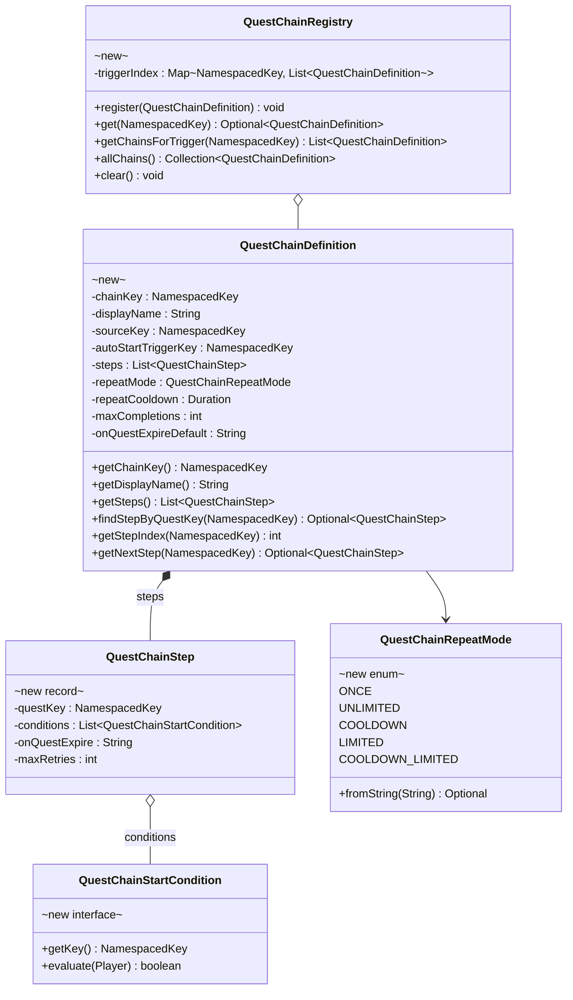
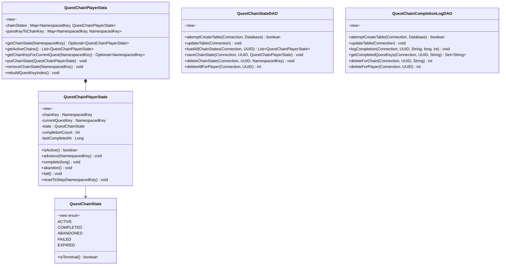
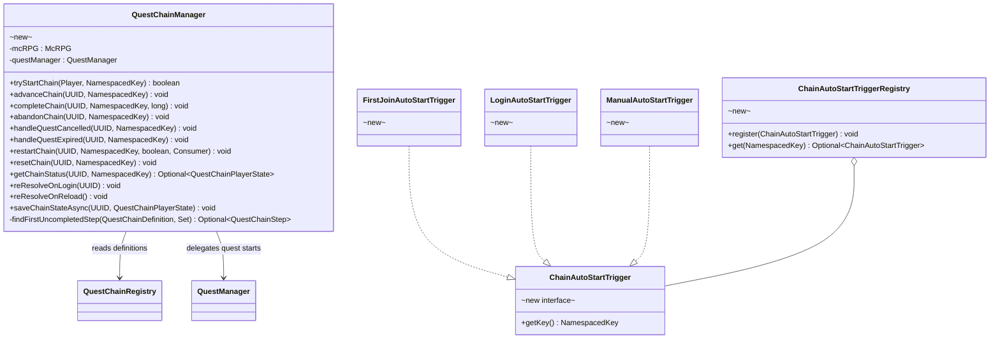
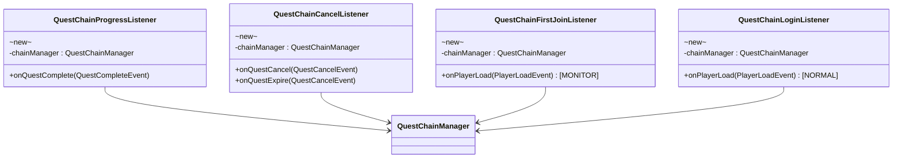
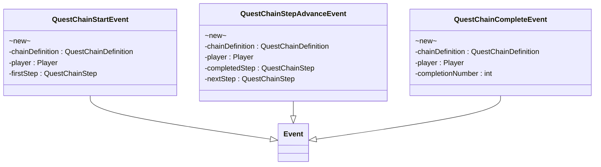
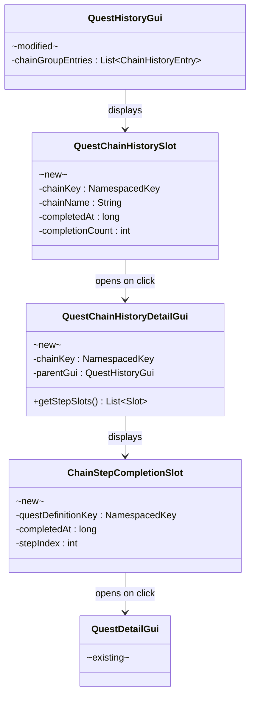

# Phase 2 LLD: Quest Chain System

> **HLD Reference:** [docs/hld/tutorial/tutorial-quest-system.md](../../hld/tutorial/tutorial-quest-system.md)
> **Phase 1 LLD:** [phase-1-quest-engine-extensions.md](phase-1-quest-engine-extensions.md) (implemented)
> **Backlog:** [chain-system-backlog.md](../../hld/tutorial/chain-system-backlog.md)
> **Status:** Implemented

## Scope

Phase 2 delivers the quest chain orchestration layer — a first-class system that manages ordered sequences of quest definitions with auto-advancement, persisted per-player state, extensible auto-start triggers, and admin tooling. Chains are independent of quest definitions: a chain references existing quest definitions by key and orchestrates when they start for a player. Individual quest definitions remain unaware that they belong to a chain.

**In scope:**
- `QuestChainDefinition`, `QuestChainStep`, `QuestChainState` enum, `QuestChainRepeatMode` enum
- `QuestChainRegistry` (registered in `McRPGRegistryKey`)
- `QuestChainManager` (registered in `McRPGManagerKey.QUEST_CHAIN`)
- `QuestChainConfigLoader` — YAML parsing with `quest-chain-file: true` marker key
- `QuestChainStartCondition` interface (extensible, no built-in implementations)
- `ChainAutoStartTrigger` interface + `ChainAutoStartTriggerRegistry` + 3 built-in triggers (`first_join`, `login`, `manual`)
- `QuestChainStateDAO` + `QuestChainCompletionLogDAO` — SQL persistence
- `QuestChainPlayerData` — per-player chain state loaded eagerly at join
- `QuestChainProgressListener` — advances chain on `QuestCompleteEvent`
- `QuestChainCancelListener` — propagates quest cancel/expire into chain state (ABANDONED/FAILED)
- `QuestChainFirstJoinListener`, `QuestChainLoginListener` — trigger listeners
- Chain lifecycle events: `QuestChainStartEvent`, `QuestChainStepAdvanceEvent`, `QuestChainCompleteEvent`
- `ContentHandlerType.QUEST_CHAIN`, `ContentHandlerType.CHAIN_AUTO_START_TRIGGER`
- `QuestChainContentPack`, `ChainAutoStartTriggerContentPack`
- Admin commands: `chain status`, `chain advance`, `chain restart` (with `--force`), `chain reset`
- Quest history GUI chain grouping: `QuestChainHistoryDetailGui`, `QuestChainHistorySlot`
- Reload re-resolution + login re-resolution
- Repeat mode field (parsed, only `ONCE` functional initially)
- `on-quest-expire` field on step (parsed, only `fail-chain` functional initially)
- Localization keys for chain events, commands, and GUI
- Unit tests with explicit commit boundaries

**Out of scope (later phases / backlog):**
- Tutorial content, `TutorialQuestSource`, `DisableTutorialSetting` (Phase 3)
- Auto-complete cascade batching and delay (Phase 3)
- Availability windows (backlog §1)
- Repeat modes beyond `ONCE` (backlog §2)
- Quest expiration behaviors beyond `fail-chain` (backlog §3)
- Built-in `QuestChainStartCondition` implementations like `TimeGateChainCondition` (backlog §6)
- Content expansion introspection commands (backlog §7)

---

## Class Diagrams

**Legend:** Abstract classes annotated `abstract` · Interfaces annotated `interface` · Records annotated `record` · Enums annotated `enum` · McCore classes annotated `mccore` · New classes annotated `new` · Existing modified classes annotated `modified` · `*--` composition · `o--` association · `-->` dependency · `..|>` implements · `--|>` extends

### Diagram 1: Chain Definition Model

The chain definition is an immutable model loaded from YAML. Each chain contains an ordered list of steps referencing quest definitions by key.



### Diagram 2: Chain State and Persistence

Per-player chain state is loaded eagerly at join and persisted on mutation. The state DAO mirrors the existing `QuestCompletionLogDAO` pattern.



### Diagram 3: Chain Manager and Triggers

The manager orchestrates chain lifecycle. Auto-start triggers are extensible via content pack and registry.



### Diagram 4: Chain Listeners

Four listeners handle chain lifecycle events: progress (advancement on quest complete), cancel (chain state propagation on quest cancel/expire), first join (tutorial trigger via `PlayerLoadEvent` at MONITOR), and login (re-resolution + re-evaluation via `PlayerLoadEvent` at NORMAL — runs before first-join).



### Diagram 5: Chain Lifecycle Events

Three lifecycle events for third-party integration. All are non-cancellable notification events.



### Diagram 6: Chain GUI Integration

`QuestHistoryGui` shows chain entries as grouped slots. Clicking opens `QuestChainHistoryDetailGui`.



---

## 1. New Classes

### 1.1 `QuestChainDefinition` — Immutable Chain Blueprint

**Package:** `us.eunoians.mcrpg.quest.chain`
**File:** `src/main/java/us/eunoians/mcrpg/quest/chain/QuestChainDefinition.java`

Immutable definition loaded from YAML. Holds the chain key, display name, source key, auto-start trigger, and an ordered list of steps. Each step references a quest definition by `NamespacedKey`.

Uses the Builder pattern (9 parameters, 5 optional — exceeds the project's 6+ threshold).

```java
public final class QuestChainDefinition {

    private final NamespacedKey chainKey;
    private final String displayName;
    private final NamespacedKey sourceKey;
    private final NamespacedKey autoStartTriggerKey;
    private final List<QuestChainStep> steps;
    private final QuestChainRepeatMode repeatMode;
    private final Duration repeatCooldown;
    private final int maxCompletions;
    private final String onQuestExpireDefault;

    // Derived lookup: questKey -> stepIndex for O(1) resolution
    private final Map<NamespacedKey, Integer> stepIndex;

    // Private constructor — use Builder
    private QuestChainDefinition(...) { ... }

    @NotNull public NamespacedKey getChainKey() { ... }

    /**
     * Returns the player-facing display name for this chain. Used in GUIs
     * and messages. Falls back to the chain key's value portion (e.g.,
     * {@code "tutorial_chain"} from {@code mcrpg:tutorial_chain}) if no
     * explicit display name is configured.
     *
     * @return the display name
     */
    @NotNull public String getDisplayName() { ... }
    @NotNull public NamespacedKey getSourceKey() { ... }
    @NotNull public NamespacedKey getAutoStartTriggerKey() { ... }
    @NotNull public List<QuestChainStep> getSteps() { ... }
    @NotNull public QuestChainRepeatMode getRepeatMode() { ... }
    @Nullable public Duration getRepeatCooldown() { ... }
    public int getMaxCompletions() { ... }
    @NotNull public String getOnQuestExpireDefault() { ... }

    public static final class Builder {

        // Required fields (builder constructor)
        private final NamespacedKey chainKey;
        private final NamespacedKey sourceKey;
        private final NamespacedKey autoStartTriggerKey;
        private final List<QuestChainStep> steps;

        // Optional fields with defaults
        private String displayName;
        private QuestChainRepeatMode repeatMode = QuestChainRepeatMode.ONCE;
        private Duration repeatCooldown;
        private int maxCompletions = -1;
        private String onQuestExpireDefault = "fail-chain";

        /**
         * @param chainKey            unique key for this chain
         * @param sourceKey           the quest source key for chain-managed quests
         * @param autoStartTriggerKey the auto-start trigger key
         * @param steps               ordered step list (at least one)
         */
        public Builder(@NotNull NamespacedKey chainKey,
                       @NotNull NamespacedKey sourceKey,
                       @NotNull NamespacedKey autoStartTriggerKey,
                       @NotNull List<QuestChainStep> steps) { ... }

        /**
         * Sets the player-facing display name. If not set, defaults to the
         * chain key's value portion (e.g., {@code "tutorial_chain"}).
         *
         * @param displayName the display name
         * @return this builder
         */
        @NotNull public Builder displayName(@Nullable String displayName) { ... }
        @NotNull public Builder repeatMode(@NotNull QuestChainRepeatMode mode) { ... }
        @NotNull public Builder repeatCooldown(@Nullable Duration cooldown) { ... }
        @NotNull public Builder maxCompletions(int max) { ... }
        @NotNull public Builder onQuestExpireDefault(@NotNull String behavior) { ... }

        /**
         * Builds the chain definition. Validates that steps is non-empty and
         * contains no duplicate quest keys. Builds the stepIndex map. If
         * {@code displayName} was not set, defaults to the chain key's value
         * portion (e.g., {@code "tutorial_chain"} from {@code mcrpg:tutorial_chain}).
         *
         * @return the immutable chain definition
         * @throws IllegalArgumentException if steps is empty
         * @throws IllegalStateException    if duplicate quest keys exist in steps
         */
        @NotNull
        public QuestChainDefinition build() { ... }
    }

    /**
     * Finds the step that references the given quest definition key.
     *
     * @param questKey the quest definition key
     * @return the step, or empty if no step references this quest
     */
    @NotNull
    public Optional<QuestChainStep> findStepByQuestKey(@NotNull NamespacedKey questKey) { ... }

    /**
     * Returns the 0-based index of the step referencing the given quest key,
     * or -1 if not found.
     *
     * @param questKey the quest definition key
     * @return the step index, or -1
     */
    public int getStepIndex(@NotNull NamespacedKey questKey) { ... }

    /**
     * Returns the step after the one referencing the given quest key,
     * or empty if this is the last step.
     *
     * @param questKey the quest definition key of the current step
     * @return the next step, or empty
     */
    @NotNull
    public Optional<QuestChainStep> getNextStep(@NotNull NamespacedKey questKey) { ... }
}
```

**Design note:** The `stepIndex` map enables O(1) quest-to-step resolution during chain advancement. Built at construction time from the step list.

### 1.2 `QuestChainStep` — Single Chain Step

**Package:** `us.eunoians.mcrpg.quest.chain`
**File:** `src/main/java/us/eunoians/mcrpg/quest/chain/QuestChainStep.java`

```java
/**
 * A single step in a quest chain, referencing a quest definition by key.
 * Steps may have optional start conditions (deferred to backlog) and
 * expiration behaviors.
 *
 * @param questKey       the quest definition key this step starts
 * @param conditions     optional conditions that must pass before this step starts
 *                       (interface ships, no built-in implementations initially)
 * @param onQuestExpire  what happens when this step's quest expires
 *                       (only "fail-chain" functional initially)
 * @param maxRetries     max retry count for "retry" expire behavior (-1 for unlimited)
 */
public record QuestChainStep(
        @NotNull NamespacedKey questKey,
        @NotNull List<QuestChainStartCondition> conditions,
        @NotNull String onQuestExpire,
        int maxRetries
) {

    /**
     * Creates a step with no conditions and default expiration behavior.
     *
     * @param questKey the quest definition key
     * @return a new step
     */
    @NotNull
    public static QuestChainStep simple(@NotNull NamespacedKey questKey) {
        return new QuestChainStep(questKey, List.of(), "fail-chain", -1);
    }
}
```

### 1.3 `QuestChainState` — Chain Lifecycle States

**Package:** `us.eunoians.mcrpg.quest.chain`
**File:** `src/main/java/us/eunoians/mcrpg/quest/chain/QuestChainState.java`

```java
public enum QuestChainState {

    ACTIVE,
    COMPLETED,
    ABANDONED,
    FAILED,
    EXPIRED;

    /**
     * Terminal states cannot be re-activated without explicit admin intervention
     * or repeat-mode re-evaluation.
     *
     * @return {@code true} if this state represents a terminal chain lifecycle point
     */
    public boolean isTerminal() {
        return this != ACTIVE;
    }

    /**
     * States eligible for repeat-mode re-start evaluation. All terminal states
     * except {@code ACTIVE} are repeat-eligible — the repeat mode on the chain
     * definition controls whether re-start actually happens ({@code ONCE} chains
     * remain permanently terminal for all terminal states including {@code ABANDONED}).
     *
     * @return {@code true} if repeat-mode re-start should be considered
     */
    public boolean isRepeatEligible() {
        return this == COMPLETED || this == FAILED || this == EXPIRED || this == ABANDONED;
    }
}
```

### 1.4 `QuestChainRepeatMode` — Chain Repeat Modes

**Package:** `us.eunoians.mcrpg.quest.chain`
**File:** `src/main/java/us/eunoians/mcrpg/quest/chain/QuestChainRepeatMode.java`

```java
public enum QuestChainRepeatMode {

    ONCE,
    UNLIMITED,
    COOLDOWN,
    LIMITED,
    COOLDOWN_LIMITED;

    /**
     * Parses a repeat mode from a YAML string value, case-insensitively.
     * Hyphens are converted to underscores for matching.
     *
     * @param value the YAML string (e.g., "once", "cooldown-limited")
     * @return the parsed mode, or empty if unrecognized
     */
    @NotNull
    public static Optional<QuestChainRepeatMode> fromString(@NotNull String value) { ... }
}
```

**Implementation note:** All modes are parsed from YAML and stored in chain state, but only `ONCE` is functionally enforced in Phase 2. Non-`ONCE` modes are treated identically to `ONCE` until the repeatability backlog work lands (backlog §2). This means `ABANDONED` chains are effectively permanent for all chains until that work ships, even though `isRepeatEligible()` includes `ABANDONED` — the forward-compatible enum is intentional so no code changes are needed when repeat modes become functional.

### 1.5 `QuestChainStartCondition` — Extensible Condition Interface

**Package:** `us.eunoians.mcrpg.quest.chain`
**File:** `src/main/java/us/eunoians/mcrpg/quest/chain/QuestChainStartCondition.java`

```java
/**
 * An extensible condition that gates whether a chain step can be started for a player.
 * No built-in implementations ship in Phase 2 — the interface is provided for
 * third-party extensibility and future built-in conditions (see backlog §6).
 */
public interface QuestChainStartCondition {

    /**
     * Gets the unique key identifying this condition type.
     *
     * @return the condition type key
     */
    @NotNull
    NamespacedKey getKey();

    /**
     * Evaluates whether the given player satisfies this condition.
     *
     * @param player the player to evaluate
     * @return {@code true} if the condition is satisfied
     */
    boolean evaluate(@NotNull Player player);
}
```

### 1.6 `QuestChainRegistry` — Chain Definition Registry

**Package:** `us.eunoians.mcrpg.quest.chain`
**File:** `src/main/java/us/eunoians/mcrpg/quest/chain/QuestChainRegistry.java`

Follows the existing `QuestDefinitionRegistry` pattern — a typed registry of `QuestChainDefinition` keyed by `NamespacedKey`. Supports the same clear-and-replace reload pattern. Maintains a secondary `triggerIndex` for O(1) trigger-to-chain lookups.

```java
/**
 * Registry holding all loaded {@link QuestChainDefinition} instances.
 * Uses the same clear-and-replace pattern as {@link QuestDefinitionRegistry}
 * for reloads.
 * <p>
 * Maintains a secondary {@code triggerIndex} mapping auto-start trigger keys
 * to the chain definitions that use them. Both indexes are rebuilt from
 * scratch on reload when {@link #clear()} is called followed by
 * re-registration.
 */
public class QuestChainRegistry implements Registry<QuestChainDefinition> {

    private final Map<NamespacedKey, QuestChainDefinition> chains = new HashMap<>();
    private final Map<NamespacedKey, List<QuestChainDefinition>> triggerIndex = new HashMap<>();

    /**
     * Registers a chain definition. Also adds the chain to the
     * {@code triggerIndex} under its auto-start trigger key via
     * {@code triggerIndex.computeIfAbsent(chain.getAutoStartTriggerKey(), k -> new ArrayList<>()).add(chain)}.
     *
     * @param definition the chain definition to register
     * @throws IllegalStateException if a definition with the same key is already registered
     */
    public void register(@NotNull QuestChainDefinition definition) { ... }

    /**
     * Returns the chain definition for the given key.
     *
     * @param chainKey the chain key
     * @return the definition, or empty if not registered
     */
    @NotNull
    public Optional<QuestChainDefinition> get(@NotNull NamespacedKey chainKey) { ... }

    /**
     * Clears all registered definitions and the trigger index (used during
     * reload). Both the main {@code chains} map and the {@code triggerIndex}
     * are cleared.
     */
    public void clear() { ... }

    /**
     * Returns all chain definitions whose auto-start trigger matches the
     * given key. O(1) lookup via the pre-built {@code triggerIndex}.
     *
     * @param triggerKey the trigger key to filter by
     * @return chains using this trigger, or an empty list if none
     */
    @NotNull
    public List<QuestChainDefinition> getChainsForTrigger(@NotNull NamespacedKey triggerKey) {
        return triggerIndex.getOrDefault(triggerKey, List.of());
    }
}
```

### 1.7 `QuestChainPlayerState` — Per-Player Mutable Chain State

**Package:** `us.eunoians.mcrpg.quest.chain`
**File:** `src/main/java/us/eunoians/mcrpg/quest/chain/QuestChainPlayerState.java`

Mutable runtime state for a single chain per player. Mirrors the SQL `mcrpg_quest_chain_state` table columns.

```java
/**
 * Mutable per-player state for a single quest chain. Loaded eagerly at join
 * from {@link QuestChainStateDAO} and mutated by {@link QuestChainManager}.
 */
public class QuestChainPlayerState {

    private final NamespacedKey chainKey;
    private NamespacedKey currentQuestKey;
    private QuestChainState state;
    private int completionCount;
    private Long lastCompletedAt;
    private boolean dirty;

    /**
     * Constructs a new player chain state from DB values. Nullable parameters are
     * stored internally and exposed as {@link Optional} via getters.
     *
     * @param chainKey        the chain definition key
     * @param currentQuestKey the current step's quest key ({@code null} for terminal states)
     * @param state           the chain state
     * @param completionCount the number of times this chain has been completed
     * @param lastCompletedAt the last completion timestamp in epoch millis ({@code null} if never completed)
     */
    public QuestChainPlayerState(@NotNull NamespacedKey chainKey,
                                 @Nullable NamespacedKey currentQuestKey,
                                 @NotNull QuestChainState state,
                                 int completionCount,
                                 @Nullable Long lastCompletedAt) { ... }

    /**
     * Creates a new ACTIVE state for starting a chain at the given first step.
     *
     * @param chainKey     the chain definition key
     * @param firstQuestKey the first step's quest key
     * @return a new active state
     */
    @NotNull
    public static QuestChainPlayerState newActive(@NotNull NamespacedKey chainKey,
                                                   @NotNull NamespacedKey firstQuestKey) { ... }

    @NotNull public NamespacedKey getChainKey() { ... }
    @NotNull public Optional<NamespacedKey> getCurrentQuestKey() { ... }
    @NotNull public QuestChainState getState() { ... }
    public int getCompletionCount() { ... }
    @NotNull public Optional<Long> getLastCompletedAt() { ... }
    public boolean isDirty() { ... }
    public void clearDirty() { ... }

    /**
     * Advances to the next step in the chain.
     *
     * @param nextQuestKey the next step's quest key
     */
    public void advance(@NotNull NamespacedKey nextQuestKey) { ... }

    /**
     * Marks the chain as completed.
     *
     * @param completedAt the completion timestamp
     */
    public void complete(long completedAt) { ... }

    /**
     * Marks the chain as abandoned. Terminal for {@code ONCE} chains; repeat-eligible
     * for non-{@code ONCE} chains (re-start governed by repeat mode evaluation).
     */
    public void abandon() { ... }

    /**
     * Marks the chain as failed (terminal unless repeat-eligible).
     */
    public void fail() { ... }

    /**
     * Resets the chain to a specific step (for restart/re-resolution).
     *
     * @param questKey the quest key to reset to
     */
    public void resetToStep(@NotNull NamespacedKey questKey) { ... }

    /**
     * Fully resets the chain state — clears completion count, last completed,
     * and sets state to ACTIVE at the given first step.
     *
     * @param firstQuestKey the first step's quest key
     */
    public void hardReset(@NotNull NamespacedKey firstQuestKey) { ... }
}
```

### 1.8 `QuestChainPlayerData` — Per-Player Chain State Container

**Package:** `us.eunoians.mcrpg.quest.chain`
**File:** `src/main/java/us/eunoians/mcrpg/quest/chain/QuestChainPlayerData.java`

Container for all chain states belonging to a single player. Stored on `McRPGPlayer` and loaded eagerly at join.

Maintains a secondary `questKeyToChainKey` reverse index mapping each ACTIVE chain's `currentQuestKey` to its `chainKey` for O(1) lookups. This index is rebuilt whenever a chain state's `currentQuestKey` changes — in `putChainState`, and whenever `advanceChain`/`reResolveOnLogin` in `QuestChainManager` updates `currentQuestKey` (the manager calls `rebuildQuestKeyIndex()` after updating `currentQuestKey`).

```java
/**
 * Container holding all {@link QuestChainPlayerState} instances for a single player.
 * Loaded eagerly from the database at join time and stored on {@link McRPGPlayer}.
 * <p>
 * Maintains a reverse index ({@code questKeyToChainKey}) from each ACTIVE chain's
 * {@code currentQuestKey} to its {@code chainKey}. This enables O(1) lookup when
 * a quest completes and the chain system needs to find which chain (if any)
 * owns that quest. The index is rebuilt by {@link #rebuildQuestKeyIndex()} which
 * is called by {@link QuestChainManager#advanceChain} after updating
 * {@code currentQuestKey}, and internally by {@link #putChainState} and
 * {@link #removeChainState}.
 */
public class QuestChainPlayerData {

    private final Map<NamespacedKey, QuestChainPlayerState> chainStates;
    private final Map<NamespacedKey, NamespacedKey> questKeyToChainKey;

    public QuestChainPlayerData() {
        this.chainStates = new HashMap<>();
        this.questKeyToChainKey = new HashMap<>();
    }

    @NotNull
    public Optional<QuestChainPlayerState> getChainState(@NotNull NamespacedKey chainKey) { ... }

    @NotNull
    public List<QuestChainPlayerState> getActiveChains() { ... }

    @NotNull
    public Collection<QuestChainPlayerState> getAllStates() { ... }

    /**
     * Adds or replaces a chain state and rebuilds the quest key index.
     *
     * @param state the chain state to add
     */
    public void putChainState(@NotNull QuestChainPlayerState state) { ... }

    /**
     * Removes a chain state and rebuilds the quest key index.
     *
     * @param chainKey the chain key to remove
     */
    public void removeChainState(@NotNull NamespacedKey chainKey) { ... }

    /**
     * Returns all dirty states that need persistence.
     *
     * @return dirty chain states
     */
    @NotNull
    public List<QuestChainPlayerState> getDirtyStates() { ... }

    /**
     * Returns the chain key that currently owns the given quest key,
     * or empty if no ACTIVE chain has this quest as its current step.
     * O(1) via the {@code questKeyToChainKey} reverse index.
     *
     * @param questKey the quest definition key to look up
     * @return the chain key, or empty
     */
    @NotNull
    public Optional<NamespacedKey> getChainKeyForCurrentQuest(@NotNull NamespacedKey questKey) {
        return Optional.ofNullable(questKeyToChainKey.get(questKey));
    }

    /**
     * Rebuilds the {@code questKeyToChainKey} reverse index by iterating
     * all ACTIVE chain states and mapping their {@code currentQuestKey}
     * to their {@code chainKey}. Called after any operation that changes
     * a chain state's {@code currentQuestKey} (advance, re-resolution,
     * put, remove).
     */
    public void rebuildQuestKeyIndex() {
        questKeyToChainKey.clear();
        for (QuestChainPlayerState state : chainStates.values()) {
            if (state.isActive()) {
                state.getCurrentQuestKey().ifPresent(questKey ->
                    questKeyToChainKey.put(questKey, state.getChainKey()));
            }
        }
    }
}
```

### 1.9 `QuestChainManager` — Runtime Chain Orchestrator

**Package:** `us.eunoians.mcrpg.quest.chain`
**File:** `src/main/java/us/eunoians/mcrpg/quest/chain/QuestChainManager.java`

The central manager for chain lifecycle. Accessed via `McRPGManagerKey.QUEST_CHAIN`. Delegates quest starts to `QuestManager` — never creates `QuestInstance` objects directly.

```java
/**
 * Manages quest chain lifecycle: starting, advancing, completing, and
 * persisting chain state. Delegates individual quest starts to
 * {@link QuestManager}.
 */
public class QuestChainManager extends Manager<McRPG> {

    public QuestChainManager(@NotNull McRPG plugin) {
        super(plugin);
    }

    /**
     * Attempts to start a chain for a player. Evaluates whether the chain
     * can be started (state check, repeat mode, server config) and starts
     * the first step if eligible.
     *
     * @param player   the player
     * @param chainKey the chain definition key
     * @return {@code true} if the chain was started
     */
    public boolean tryStartChain(@NotNull Player player, @NotNull NamespacedKey chainKey) { ... }

    /**
     * Advances a player's chain to the next step after their current quest completed.
     * If the current step is the last step, completes the chain.
     *
     * @param playerUUID the player UUID
     * @param completedQuestKey the quest definition key that was just completed
     */
    public void advanceChain(@NotNull UUID playerUUID, @NotNull NamespacedKey completedQuestKey) { ... }

    /**
     * Force-advances a player's chain by completing their current quest and
     * starting the next step, bypassing normal quest completion flow.
     *
     * @param playerUUID the player UUID
     * @param chainKey   the chain definition key
     * @return {@code true} if the advancement succeeded
     */
    public boolean forceAdvanceChain(@NotNull UUID playerUUID, @NotNull NamespacedKey chainKey) { ... }

    /**
     * Restarts a player's chain from step 1. Cancels any active chain quest.
     * When {@code force} is false, reads the completion log async and skips
     * completed steps. When {@code force} is true, all steps are replayed
     * (log entries preserved as historical records).
     *
     * @param playerUUID the player UUID
     * @param chainKey   the chain definition key
     * @param force      if true, replay all steps regardless of completion log
     * @param callback   invoked on the main thread with {@code true} if restart
     *                   succeeded, {@code false} if all steps completed or failed
     */
    public void restartChain(@NotNull UUID playerUUID,
                             @NotNull NamespacedKey chainKey,
                             boolean force,
                             @NotNull Consumer<Boolean> callback) { ... }

    /**
     * Hard-resets a player's chain state — clears chain state, completion log
     * entries, and completion count. Player experiences the chain as new.
     *
     * @param playerUUID the player UUID
     * @param chainKey   the chain definition key
     * @return {@code true} if the reset succeeded
     */
    public boolean resetChain(@NotNull UUID playerUUID, @NotNull NamespacedKey chainKey) { ... }

    /**
     * Abandons a player's chain. Sets state to ABANDONED. For {@code ONCE} chains,
     * this is permanently terminal. For non-{@code ONCE} chains, the chain can be
     * re-started when repeat-mode evaluation runs.
     * Cancels any active chain quest.
     *
     * @param playerUUID the player UUID
     * @param chainKey   the chain definition key
     * @return {@code true} if the abandonment succeeded
     */
    public boolean abandonChain(@NotNull UUID playerUUID, @NotNull NamespacedKey chainKey) { ... }

    /**
     * Handles a cancelled quest that may belong to an active chain.
     * If the cancelled quest is the current step of an ACTIVE chain,
     * transitions the chain to ABANDONED.
     *
     * @param playerUUID       the player UUID
     * @param cancelledQuestKey the cancelled quest's definition key
     */
    public void handleQuestCancelled(@NotNull UUID playerUUID,
                                      @NotNull NamespacedKey cancelledQuestKey) { ... }

    /**
     * Handles an expired quest that may belong to an active chain.
     * Checks the step's {@code on-quest-expire} setting. For {@code fail-chain},
     * transitions the chain to FAILED.
     *
     * @param playerUUID     the player UUID
     * @param expiredQuestKey the expired quest's definition key
     */
    public void handleQuestExpired(@NotNull UUID playerUUID,
                                    @NotNull NamespacedKey expiredQuestKey) { ... }

    /**
     * Re-resolves chain state for a player on login. Handles definition changes
     * since the player was last online. Reads completion logs asynchronously
     * via the database executor and resolves chains on the main thread.
     *
     * @param playerUUID the player UUID
     */
    public void reResolveOnLogin(@NotNull UUID playerUUID) { ... }

    /**
     * Re-resolves chain state for all online players after a reload.
     * Submits one batched DB task per player and resolves on the main thread.
     */
    public void reResolveOnReload() { ... }

    /**
     * Persists a chain state asynchronously via the database executor.
     * Snapshots the state values before submitting to prevent read/write races.
     * Only clears the dirty flag on successful write.
     *
     * @param playerUUID the player UUID
     * @param state      the chain state to persist
     */
    public void saveChainStateAsync(@NotNull UUID playerUUID,
                                    @NotNull QuestChainPlayerState state) { ... }

    /**
     * Finds the first step in the chain whose quest key is not in the completed set.
     *
     * @param definition         the chain definition
     * @param completedQuestKeys quest keys already completed by this player for this chain
     * @return the first uncompleted step, or empty if all steps are completed
     */
    @NotNull
    private Optional<QuestChainStep> findFirstUncompletedStep(
            @NotNull QuestChainDefinition definition,
            @NotNull Set<NamespacedKey> completedQuestKeys) { ... }
}
```

**Thread safety:**

All `QuestChainManager` methods that mutate `QuestChainPlayerState` or fire events MUST run on the main Bukkit thread. All current callsites naturally satisfy this (Bukkit event handlers, `PlayerLoadEvent` handlers, and Cloud commands all execute on the main thread).

All DAO read operations run on the database executor thread. Main-thread code receives results via `Bukkit.getScheduler().runTask()` callbacks. This includes `reResolveOnLogin` (batched completion log reads for all active chains in one `Connection`), `restartChain` (single completion log read with `Consumer<Boolean>` callback), and `reResolveOnReload` (one batched task per online player).

DB write operations (save, delete) are submitted to the database executor service (`database.getDatabaseExecutorService().submit(...)`) — never blocking the main thread. The dirty flag on `QuestChainPlayerState` ensures that periodic save sweeps (if added) can efficiently batch only changed states.

**`saveChainStateAsync` snapshot pattern:** Before submitting to the executor, `saveChainStateAsync` snapshots the current state values (`chainKey`, `state`, `currentQuestKey`, `completionCount`, `lastCompletedAt`, dirty flag) into immutable local variables or a snapshot record. The DB write uses the snapshot, not the live mutable `QuestChainPlayerState` object. This prevents read/write races between the main thread (which may continue mutating state after the submit call returns) and the DB thread (which persists it). The dirty flag is only cleared on successful write. On `SQLException`, a `SEVERE` log with the throwable is recorded and the dirty flag is left set so the next save attempt retries persistence.

**Key implementation details:**

**`tryStartChain` flow:**
1. Resolve `QuestChainDefinition` from `QuestChainRegistry`. If not found: `WARNING` "Attempted to start unknown chain '{chainKey}' for player {uuid}", return false.
2. Resolve `McRPGPlayer` from `McRPGManagerKey.PLAYER`. If not found: `WARNING` "Player {uuid} not loaded, cannot start chain '{chainKey}'", return false.
3. Check `QuestChainPlayerData` for existing state:
   - If `ACTIVE`: return false (silent — normal expected case from trigger listeners evaluating all chains)
   - If terminal + `ONCE` repeat mode: return false (silent — same reason)
   - If terminal + non-`ONCE` repeat mode + `isRepeatEligible()`: evaluate repeat conditions (future — treat as `ONCE` for now, return false, silent)
   - If no state exists: eligible for start
4. Resolve `QuestSource` from `QuestSourceRegistry` using `definition.getSourceKey()`. If not found: `WARNING` "Chain '{chainKey}' references unknown source '{sourceKey}'", return false.
5. Resolve first step's `QuestDefinition` from `QuestDefinitionRegistry`. If not found: `SEVERE` "Chain '{chainKey}' step 0 references unknown quest '{questKey}' — cannot start chain", return false. No state is created.
6. Create `QuestChainPlayerState.newActive(chainKey, firstStep.questKey())`
7. Put state on `QuestChainPlayerData`
8. Fire `QuestChainStartEvent`
9. Call `questManager.startQuest(firstStepDefinition, player.getUniqueId(), Map.of(), questSource)`. If returns empty: remove state from `QuestChainPlayerData`, `WARNING` "Chain '{chainKey}' startQuest returned empty for quest '{questKey}' and player {uuid} — rolling back chain state", return false.
10. `INFO` "Started chain '{chainKey}' for player {uuid} at step '{questKey}'"
11. Persist state async
12. Return true

**`advanceChain` flow:**
1. Resolve `McRPGPlayer` and `QuestChainPlayerData`. If player not found: `WARNING` "Player {uuid} not loaded, cannot advance chain for quest '{completedQuestKey}'", return.
2. Look up `chainKey` via `questChainPlayerData.getChainKeyForCurrentQuest(completedQuestKey)` (O(1) reverse index lookup)
3. If no match found: return (silent — the completed quest isn't chain-managed)
4. If match found:
   a. Get `QuestChainDefinition` from registry. If missing: `WARNING` "Chain '{chainKey}' definition missing during advancement for player {uuid} — state left as ACTIVE (inert)", return.
   b. Find next step via `definition.getNextStep(completedQuestKey)`
   c. If next step exists:
      - Resolve next step's `QuestDefinition`. If not found: `SEVERE` "Chain '{chainKey}' next step references unknown quest '{nextQuestKey}' — advancement halted for player {uuid}", return.
      - Call `questManager.startQuest(nextStepDef, playerUUID, {}, source)`. If returns empty: `SEVERE` "Chain '{chainKey}' failed to start next quest '{nextQuestKey}' for player {uuid}", do NOT advance `currentQuestKey`, return.
      - Log completed step to `QuestChainCompletionLogDAO` (async) — only after `startQuest` succeeds
      - Advance state (`currentQuestKey` = nextStep.questKey), call `questChainPlayerData.rebuildQuestKeyIndex()`, fire `QuestChainStepAdvanceEvent`, persist async
      - `INFO` "Advanced chain '{chainKey}' for player {uuid} to step '{nextQuestKey}'"
   d. If no next step (last step):
      - Log completed step to `QuestChainCompletionLogDAO` (async)
      - Set state to `COMPLETED`, increment `completionCount`, set `lastCompletedAt`
      - Fire `QuestChainCompleteEvent`, persist async
      - `INFO` "Completed chain '{chainKey}' for player {uuid} (completion #{count})"

**`reResolveOnLogin` flow:**
1. Resolve `McRPGPlayer` and `QuestChainPlayerData`. If player not found: return (silent — load task handles this).
2. Collect all `ACTIVE` chain states that need re-resolution into a list. A chain needs re-resolution if its `QuestChainDefinition` is missing from the registry, or if its `currentQuestKey` is no longer in the chain definition's step list.
3. If no chains need re-resolution: return.
4. Submit ONE task to the database executor that reads ALL needed completion logs in a single `Connection`:
   - For each chain needing re-resolution, call `QuestChainCompletionLogDAO.getCompletedQuestKeys(connection, uuid, chainKey)`
   - Collect results into a `Map<NamespacedKey, Set<String>>` (chainKey → completedQuestKeys)
5. Schedule ONE `Bukkit.getScheduler().runTask()` back to the main thread with all results:
   - For each chain needing re-resolution:
     a. Resolve `QuestChainDefinition`. If missing: `WARNING` "Chain '{chainKey}' definition not found during login re-resolution for player {uuid} — state left as ACTIVE (inert)". Continue.
     b. If `currentQuestKey` is still in the chain: no action needed (silent). Continue.
     c. If `currentQuestKey` is NOT in the chain (removed/reordered):
        - Cancel active quest instance if exists in `QuestManager`
        - Call `findFirstUncompletedStep(definition, completedQuestKeys)` (see shared helper below)
        - If uncompleted step found: resolve step's `QuestDefinition`. If not found: `SEVERE` "Chain '{chainKey}' step references unknown quest '{questKey}' during re-resolution for player {uuid}". Continue.
        - Call `questManager.startQuest(stepDef, playerUUID, {}, source)`. If returns empty: `SEVERE` "Chain '{chainKey}' failed to start quest '{questKey}' during re-resolution for player {uuid} — chain left in current state". Continue.
        - Reset state to that step, persist async. `INFO` "Re-resolved chain '{chainKey}' for player {uuid}: advanced to step '{questKey}' (previous step removed)"
        - If all steps completed (empty from `findFirstUncompletedStep`): set state to `COMPLETED`, persist async. `INFO` "Re-resolved chain '{chainKey}' for player {uuid}: all steps completed, marking COMPLETED"
   - After all chains are processed: call `questChainPlayerData.rebuildQuestKeyIndex()` to reconcile the reverse index with any currentQuestKey changes made during re-resolution

**`restartChain` flow (async pattern):**
1. Resolve `QuestChainDefinition` and `QuestChainPlayerState`. If either missing: return false.
2. Cancel active chain quest (if exists in `QuestManager`).
3. If `force`: reset state to first step on the main thread, start quest, persist async, invoke callback with `true`. Return.
4. If not `force`: submit to database executor:
   - Read completed quest keys via `QuestChainCompletionLogDAO.getCompletedQuestKeys(connection, uuid, chainKey)`
5. Schedule `Bukkit.getScheduler().runTask()` back to the main thread with results:
   - Call `findFirstUncompletedStep(definition, completedQuestKeys)` (see shared helper below)
   - If found: reset state to that step, start it, persist async, invoke callback with `true`.
   - If all completed: set state to `COMPLETED`, persist async, invoke callback with `false` (message "all steps done").
6. The `Consumer<Boolean>` callback is used by the admin command to send feedback to the admin after the async operation completes.

**`reResolveOnReload` flow:**
1. Collect all online players with `ACTIVE` chain states.
2. Submit ONE task per player (batched across their chains) to the database executor.
3. Each task reads completion logs for all that player's active chains in a single `Connection`.
4. Schedule main-thread resolution per player via `Bukkit.getScheduler().runTask()`, using the same per-chain logic as `reResolveOnLogin`.

**`findFirstUncompletedStep` — shared helper method:**

Both `reResolveOnLogin` and `restartChain` share the same logic: given a chain definition and a set of completed quest keys, find the first step whose quest key is not in the completed set. This is extracted as a private helper:

```java
/**
 * Finds the first step in the chain whose quest key is not in the completed set.
 *
 * @param definition         the chain definition
 * @param completedQuestKeys quest keys already completed by this player for this chain
 * @return the first uncompleted step, or empty if all steps are completed
 */
@NotNull
private Optional<QuestChainStep> findFirstUncompletedStep(
        @NotNull QuestChainDefinition definition,
        @NotNull Set<NamespacedKey> completedQuestKeys) { ... }
```

### 1.10 `QuestChainConfigLoader` — YAML Parsing

**Package:** `us.eunoians.mcrpg.configuration`
**File:** `src/main/java/us/eunoians/mcrpg/configuration/QuestChainConfigLoader.java`

Chain files live in the same directory tree as quest files. To guarantee that all quest definitions are registered before chain validation runs, the loading is split into two phases:

**Phase A (during quest walk):** `QuestConfigLoader.loadQuestsFromDirectory()` already walks the directory tree filtering for `.yml`/`.yaml` files. When `loadQuestsFromFile()` opens a YAML file and finds `quest-chain-file: true` at the root (instead of a `quests` section), it silently skips the file and adds its `Path` to a collected list. No "No 'quests' section found" warning is logged for chain files.

**Phase B (after quest loading):** `QuestManager.loadQuestDefinitions()` calls `QuestChainConfigLoader.loadChains(flaggedPaths, plugin)` with the collected chain file paths. At this point all quest definitions are in the registry, so chain step validation against `QuestDefinitionRegistry` is reliable.

```java
/**
 * Loads {@link QuestChainDefinition} instances from pre-flagged YAML files.
 * Called after all quest definitions are loaded, so step quest key validation
 * against {@link QuestDefinitionRegistry} is reliable.
 */
public class QuestChainConfigLoader {

    /**
     * Loads chain definitions from pre-identified chain YAML files.
     * These files were flagged during the quest directory walk by
     * {@link QuestConfigLoader} (files with {@code quest-chain-file: true}).
     *
     * @param chainFiles the chain YAML file paths flagged during quest loading
     * @param plugin     the McRPG plugin instance
     * @return loaded chain definitions (invalid files are skipped with warnings)
     */
    @NotNull
    public static List<QuestChainDefinition> loadChains(@NotNull List<Path> chainFiles,
                                                         @NotNull McRPG plugin) { ... }

    /**
     * Parses all chain definitions from a single YAML file's {@code chains:} section.
     * Mirrors the {@link QuestConfigLoader#loadQuestsFromFile} pattern: iterates
     * each keyed entry under the section, parsing and accumulating valid definitions.
     *
     * @param document    the YAML document
     * @param file        the source file (for error reporting)
     * @param plugin      the McRPG plugin instance
     * @param accumulator the map to add parsed definitions to (duplicate keys are skipped with a warning)
     */
    static void parseChainsFromFile(@NotNull YamlDocument document,
                                    @NotNull File file,
                                    @NotNull McRPG plugin,
                                    @NotNull Map<NamespacedKey, QuestChainDefinition> accumulator) { ... }
}
```

**YAML schema:**

Mirrors the quest file pattern: a `chains:` section containing one or more chain definitions keyed by `NamespacedKey` string.

```yaml
# quests/tutorial/chains.yml
quest-chain-file: true
chains:
  mcrpg:tutorial_chain:
    # Optional: player-facing name shown in GUIs and messages.
    # Falls back to the chain key's value portion (e.g., "tutorial_chain") if omitted.
    display-name: "Tutorial Chain"
    source: mcrpg:tutorial
    auto-start:
      trigger: mcrpg:first_join
    repeat-mode: once
    steps:
      first_steps:
        quest: mcrpg:tutorial_first_steps
      explore_menu:
        quest: mcrpg:tutorial_explore_menu
      passive_unlock:
        quest: mcrpg:tutorial_passive_unlock
        # Optional: override default expiration behavior for this step
        # on-quest-expire: fail-chain

  mcrpg:tutorial_advanced_chain:
    display-name: "Advanced Tutorial"
    source: mcrpg:tutorial
    auto-start:
      trigger: mcrpg:manual
    repeat-mode: once
    steps:
      combo_training:
        quest: mcrpg:tutorial_combo_training
      loadout_training:
        quest: mcrpg:tutorial_loadout_training
```

**Validation rules:**
- `quest-chain-file: true` must be present at the root (files without it are silently skipped during quest loading)
- `chains` section is required — files with the marker but no `chains` section log a `WARNING` and are skipped
- Each key under `chains:` must be a valid `NamespacedKey` (invalid keys are skipped with a `WARNING`)
- Duplicate chain keys across files are skipped with a `WARNING` (first-loaded wins, matching quest behavior)
- Per chain entry:
  - `display-name` is optional (falls back to the chain key's value portion if omitted)
  - `source` is required, validated against `QuestSourceRegistry` at load time (warning if not registered yet — sources may register later via content expansion)
  - `auto-start.trigger` is required, validated against `ChainAutoStartTriggerRegistry`
  - `steps` is required, must contain at least one entry
  - Each step's `quest` value is validated against `QuestDefinitionRegistry` (warning if not found)
  - `repeat-mode` defaults to `once` if omitted
  - `on-quest-expire` defaults to `fail-chain` per step if omitted
  - Duplicate step quest keys within a single chain are rejected (a chain cannot reference the same quest twice)

### 1.11 `ChainAutoStartTrigger` — Extensible Trigger Interface

**Package:** `us.eunoians.mcrpg.quest.chain.trigger`
**File:** `src/main/java/us/eunoians/mcrpg/quest/chain/trigger/ChainAutoStartTrigger.java`

```java
/**
 * An extensible trigger that defines <em>when</em> the chain system evaluates
 * whether to start a chain for a player. Triggers are independent of
 * conditions (which define <em>if</em> the chain should start).
 * <p>
 * Each trigger is identified by a {@link NamespacedKey} and is registered in the
 * {@link ChainAutoStartTriggerRegistry}. Third-party plugins register custom
 * triggers via {@link ChainAutoStartTriggerContentPack}.
 * <p>
 * Built-in triggers have their evaluation logic in dedicated listeners
 * (e.g., {@code QuestChainFirstJoinListener}), not in the trigger itself.
 * The trigger serves only as a registry marker that chains reference by key.
 */
public interface ChainAutoStartTrigger {

    /**
     * Gets the unique key identifying this trigger type.
     *
     * @return the trigger key
     */
    @NotNull
    NamespacedKey getKey();
}
```

### 1.12 `ChainAutoStartTriggerRegistry`

**Package:** `us.eunoians.mcrpg.quest.chain.trigger`
**File:** `src/main/java/us/eunoians/mcrpg/quest/chain/trigger/ChainAutoStartTriggerRegistry.java`

Standard typed registry following the `QuestSourceRegistry` pattern.

```java
public class ChainAutoStartTriggerRegistry implements Registry<ChainAutoStartTrigger> {

    private final Map<NamespacedKey, ChainAutoStartTrigger> triggers = new LinkedHashMap<>();

    /**
     * Registers a trigger. Throws if a trigger with the same key is already registered.
     *
     * @param trigger the trigger to register
     * @throws IllegalStateException if a trigger with the same key is already registered
     */
    public void register(@NotNull ChainAutoStartTrigger trigger) { ... }

    /**
     * Returns the trigger for the given key.
     *
     * @param key the trigger key
     * @return the trigger, or empty if not registered
     */
    @NotNull
    public Optional<ChainAutoStartTrigger> get(@NotNull NamespacedKey key) { ... }
}
```

### 1.13 Built-in Auto-Start Triggers

Three trigger marker classes in `us.eunoians.mcrpg.quest.chain.trigger.builtin`:

| Class | Key | Purpose |
|---|---|---|
| `FirstJoinAutoStartTrigger` | `mcrpg:first_join` | Marker for first-join evaluation |
| `LoginAutoStartTrigger` | `mcrpg:login` | Marker for every-login evaluation |
| `ManualAutoStartTrigger` | `mcrpg:manual` | Marker for API/command-only starts |

Each is a simple implementation returning its key. The actual event handling lives in dedicated listeners (see §1.17–1.18).

### 1.14 `QuestChainStateDAO` — Chain State Persistence

**Package:** `us.eunoians.mcrpg.database.table.quest`
**File:** `src/main/java/us/eunoians/mcrpg/database/table/quest/QuestChainStateDAO.java`

Follows the `QuestCompletionLogDAO` pattern: static methods, `attemptCreateTable`, `updateTable`, CRUD operations.

```sql
CREATE TABLE mcrpg_quest_chain_state (
    player_uuid       VARCHAR(36) NOT NULL,
    chain_key         VARCHAR(255) NOT NULL,
    current_quest     VARCHAR(255),
    state             VARCHAR(32) NOT NULL,
    completion_count  INTEGER NOT NULL DEFAULT 0,
    last_completed_at BIGINT,
    PRIMARY KEY (player_uuid, chain_key)
);
```

**Methods:**

```java
public class QuestChainStateDAO {

    public static final String TABLE_NAME = "mcrpg_quest_chain_state";
    private static final int CURRENT_TABLE_VERSION = 1;

    public static boolean attemptCreateTable(@NotNull Connection connection,
                                              @NotNull Database database) { ... }

    public static void updateTable(@NotNull Connection connection) { ... }

    /**
     * Loads all chain states for a player.
     *
     * @param connection the database connection
     * @param playerUUID the player UUID
     * @return all chain states (may be empty)
     */
    @NotNull
    public static List<QuestChainPlayerState> loadAllChainStates(
            @NotNull Connection connection,
            @NotNull UUID playerUUID) { ... }

    /**
     * Saves or upserts a single chain state.
     *
     * @param connection the database connection
     * @param playerUUID the player UUID
     * @param state      the chain state to save
     */
    public static void saveChainState(@NotNull Connection connection,
                                       @NotNull UUID playerUUID,
                                       @NotNull QuestChainPlayerState state) { ... }

    /**
     * Deletes a specific chain state for a player.
     *
     * @param connection the database connection
     * @param playerUUID the player UUID
     * @param chainKey   the chain key
     */
    public static void deleteChainState(@NotNull Connection connection,
                                         @NotNull UUID playerUUID,
                                         @NotNull NamespacedKey chainKey) { ... }

    /**
     * Deletes all chain states for a player.
     *
     * @param connection the database connection
     * @param playerUUID the player UUID
     * @return number of deleted rows
     */
    public static int deleteAllForPlayer(@NotNull Connection connection,
                                          @NotNull UUID playerUUID) { ... }
}
```

**Upsert strategy:** `saveChainState` uses `INSERT OR REPLACE` (SQLite) / `INSERT ... ON DUPLICATE KEY UPDATE` (MySQL) to handle both inserts and updates.

### 1.15 `QuestChainCompletionLogDAO` — Chain Step Completion History

**Package:** `us.eunoians.mcrpg.database.table.quest`
**File:** `src/main/java/us/eunoians/mcrpg/database/table/quest/QuestChainCompletionLogDAO.java`

Tracks which quests a player has completed as part of a specific chain. Used for restart re-resolution (skipping already-completed steps).

```sql
CREATE TABLE mcrpg_quest_chain_completion_log (
    player_uuid       VARCHAR(36) NOT NULL,
    chain_key         VARCHAR(255) NOT NULL,
    quest_key         VARCHAR(255) NOT NULL,
    completed_at      BIGINT NOT NULL,
    completion_number INTEGER NOT NULL,
    PRIMARY KEY (player_uuid, chain_key, quest_key, completion_number)
);

CREATE INDEX IF NOT EXISTS idx_chain_log_player_chain
    ON mcrpg_quest_chain_completion_log (player_uuid, chain_key);
```

**Methods:**

```java
public class QuestChainCompletionLogDAO {

    public static final String TABLE_NAME = "mcrpg_quest_chain_completion_log";

    public static boolean attemptCreateTable(@NotNull Connection connection,
                                              @NotNull Database database) { ... }

    public static void updateTable(@NotNull Connection connection) { ... }

    /**
     * Records a chain step completion.
     *
     * @param connection       the database connection
     * @param playerUUID       the player UUID
     * @param chainKey         the chain key (string form)
     * @param questKey         the completed quest key (string form)
     * @param completedAt      the completion timestamp in epoch millis
     * @param completionNumber which chain completion this belongs to (1-based)
     */
    public static void logCompletion(@NotNull Connection connection,
                                      @NotNull UUID playerUUID,
                                      @NotNull String chainKey,
                                      @NotNull String questKey,
                                      long completedAt,
                                      int completionNumber) { ... }

    /**
     * Returns the set of quest definition keys a player has completed
     * within a specific chain (across all completion numbers).
     *
     * @param connection the database connection
     * @param playerUUID the player UUID
     * @param chainKey   the chain key
     * @return set of completed quest keys
     */
    @NotNull
    public static Set<String> getCompletedQuestKeys(@NotNull Connection connection,
                                                     @NotNull UUID playerUUID,
                                                     @NotNull String chainKey) { ... }

    /**
     * Deletes all completion log entries for a specific chain for a player.
     * Used by the hard reset admin command.
     *
     * @param connection the database connection
     * @param playerUUID the player UUID
     * @param chainKey   the chain key
     * @return number of deleted rows
     */
    public static int deleteForChain(@NotNull Connection connection,
                                      @NotNull UUID playerUUID,
                                      @NotNull String chainKey) { ... }

    /**
     * Deletes all chain completion log entries for a player.
     *
     * @param connection the database connection
     * @param playerUUID the player UUID
     * @return number of deleted rows
     */
    public static int deleteForPlayer(@NotNull Connection connection,
                                       @NotNull UUID playerUUID) { ... }
}
```

### 1.16 `QuestChainProgressListener` — Chain Advancement on Quest Complete

**Package:** `us.eunoians.mcrpg.listener.quest`
**File:** `src/main/java/us/eunoians/mcrpg/listener/quest/QuestChainProgressListener.java`

Listens for `QuestCompleteEvent` and delegates to `QuestChainManager.advanceChain()`. The listener's responsibility is mapping a completed quest back to its chain; the manager handles all state transitions.

```java
/**
 * Listens for quest completions and advances any chain whose current step
 * matches the completed quest. Delegates chain advancement to
 * {@link QuestChainManager}.
 */
public class QuestChainProgressListener implements Listener {

    private final QuestChainManager chainManager;

    public QuestChainProgressListener(@NotNull QuestChainManager chainManager) {
        this.chainManager = chainManager;
    }

    /**
     * On quest complete, checks if the completed quest is the current step
     * of any chain for any player in the quest's scope, and advances if so.
     *
     * @param event the quest complete event
     */
    @EventHandler(priority = EventPriority.MONITOR, ignoreCancelled = true)
    public void onQuestComplete(@NotNull QuestCompleteEvent event) {
        NamespacedKey completedQuestKey = event.getQuestDefinition().getQuestKey();
        QuestInstance instance = event.getQuestInstance();

        // Get all players in the quest scope and advance their chains
        instance.getQuestScope().ifPresent(scope ->
            scope.getCurrentPlayersInScope().forEach(playerUUID ->
                chainManager.advanceChain(playerUUID, completedQuestKey)
            )
        );
    }
}
```

### 1.17 `QuestChainFirstJoinListener` — First-Join Trigger

**Package:** `us.eunoians.mcrpg.listener.quest`
**File:** `src/main/java/us/eunoians/mcrpg/listener/quest/QuestChainFirstJoinListener.java`

Fires on `PlayerLoadEvent` (not `PlayerJoinEvent`). `PlayerLoadEvent` fires from `McRPGPlayerLoadTask.onPlayerLoadSuccessfully()` on the main thread, after all async data loading completes — including the new `loadChainStates()` step. This guarantees that `QuestChainPlayerData` is populated before any chain evaluation runs.

A player is considered a "first join" for a chain if they have no existing `QuestChainPlayerState` for that chain key in their `QuestChainPlayerData`.

```java
/**
 * Evaluates first-join chains for players who have no prior chain state.
 * Listens on {@link PlayerLoadEvent} rather than {@code PlayerJoinEvent} to guarantee
 * that the player's {@link QuestChainPlayerData} is fully loaded (the async
 * {@link McRPGPlayerLoadTask} populates it before this event fires).
 */
public class QuestChainFirstJoinListener implements Listener {

    private final QuestChainManager chainManager;

    public QuestChainFirstJoinListener(@NotNull QuestChainManager chainManager) {
        this.chainManager = chainManager;
    }

    @EventHandler(priority = EventPriority.MONITOR, ignoreCancelled = true)
    public void onPlayerLoad(@NotNull PlayerLoadEvent event) {
        CorePlayer corePlayer = event.getCorePlayer();
        if (!(corePlayer instanceof McRPGPlayer mcRPGPlayer)) {
            return;
        }
        Player player = mcRPGPlayer.getAsBukkitPlayer().orElse(null);
        if (player == null) {
            return;
        }
        QuestChainRegistry chainRegistry = McRPG.getInstance().registryAccess()
                .registry(McRPGRegistryKey.QUEST_CHAIN);
        NamespacedKey firstJoinKey = new NamespacedKey(
                McRPGMethods.getMcRPGNamespace(), "first_join");

        for (QuestChainDefinition chain : chainRegistry.getChainsForTrigger(firstJoinKey)) {
            chainManager.tryStartChain(player, chain.getChainKey());
        }
    }
}
```

**Design note:** `tryStartChain` internally checks whether the player already has state for this chain. If they do (returning player), it returns false. This makes the first-join listener idempotent — it runs every login but only starts chains the player hasn't seen before. Because it listens on `PlayerLoadEvent` (not `PlayerJoinEvent`), `McRPGPlayer` and `QuestChainPlayerData` are guaranteed to be fully loaded before any chain evaluation runs.

### 1.18 `QuestChainLoginListener` — Login Re-Resolution

**Package:** `us.eunoians.mcrpg.listener.quest`
**File:** `src/main/java/us/eunoians/mcrpg/listener/quest/QuestChainLoginListener.java`

Listens on `PlayerLoadEvent` (same as `QuestChainFirstJoinListener`). Handles both re-resolution of ACTIVE chains whose definitions may have changed while the player was offline, and login-triggered chain evaluation for the `mcrpg:login` trigger.

**Must run at a higher priority than `QuestChainFirstJoinListener`** so re-resolution completes before first-join evaluation. Use `EventPriority.NORMAL` for this listener and `EventPriority.MONITOR` for first-join, ensuring re-resolution runs first.

```java
/**
 * On player load, performs two actions in order:
 * 1. Re-resolves all ACTIVE chain states against current chain definitions
 *    (handles definition changes during offline period)
 * 2. Evaluates login-triggered chains for repeatable re-start eligibility
 *
 * Listens on {@link PlayerLoadEvent} at {@link EventPriority#NORMAL} — runs before
 * {@link QuestChainFirstJoinListener} (MONITOR) so re-resolution completes before
 * first-join chains are evaluated.
 */
public class QuestChainLoginListener implements Listener {

    private final QuestChainManager chainManager;

    public QuestChainLoginListener(@NotNull QuestChainManager chainManager) {
        this.chainManager = chainManager;
    }

    @EventHandler(priority = EventPriority.NORMAL, ignoreCancelled = true)
    public void onPlayerLoad(@NotNull PlayerLoadEvent event) {
        CorePlayer corePlayer = event.getCorePlayer();
        if (!(corePlayer instanceof McRPGPlayer mcRPGPlayer)) {
            return;
        }
        Player player = mcRPGPlayer.getAsBukkitPlayer().orElse(null);
        if (player == null) {
            return;
        }

        // Re-resolve existing ACTIVE chains
        chainManager.reResolveOnLogin(player.getUniqueId());

        // Evaluate login-triggered chains (for repeatable chains — future)
        QuestChainRegistry chainRegistry = McRPG.getInstance().registryAccess()
                .registry(McRPGRegistryKey.QUEST_CHAIN);
        NamespacedKey loginKey = new NamespacedKey(
                McRPGMethods.getMcRPGNamespace(), "login");
        for (QuestChainDefinition chain : chainRegistry.getChainsForTrigger(loginKey)) {
            chainManager.tryStartChain(player, chain.getChainKey());
        }
    }
}
```

### 1.19 `QuestChainCancelListener` — Chain State on Quest Cancel/Expire

**Package:** `us.eunoians.mcrpg.listener.quest`
**File:** `src/main/java/us/eunoians/mcrpg/listener/quest/QuestChainCancelListener.java`

Propagates quest cancellation and expiration into chain state transitions. When a quest managed by an active chain is cancelled or expires, the chain must transition to the appropriate terminal state.

```java
/**
 * Listens for {@link QuestCancelEvent} and quest expiration, propagating
 * cancellation/expiration into the owning chain's state. When a chain-managed
 * quest is cancelled, the chain transitions to {@link QuestChainState#ABANDONED}.
 * When a chain-managed quest expires, the step's {@code on-quest-expire} setting
 * controls the chain's transition (only {@code fail-chain} is functional initially).
 */
public class QuestChainCancelListener implements Listener {

    private final QuestChainManager chainManager;

    public QuestChainCancelListener(@NotNull QuestChainManager chainManager) {
        this.chainManager = chainManager;
    }

    /**
     * When a quest is cancelled, checks if it belongs to an ACTIVE chain
     * (by matching the cancelled quest's definition key against each chain state's
     * {@code currentQuestKey}). If found, transitions the chain to ABANDONED,
     * fires a chain state change event, and persists the state async.
     *
     * @param event the quest cancel event
     */
    @EventHandler(priority = EventPriority.MONITOR, ignoreCancelled = true)
    public void onQuestCancel(@NotNull QuestCancelEvent event) {
        NamespacedKey cancelledQuestKey = event.getQuestDefinition().getQuestKey();
        QuestInstance instance = event.getQuestInstance();

        instance.getQuestScope().ifPresent(scope ->
            scope.getCurrentPlayersInScope().forEach(playerUUID -> {
                // Look up the player's chain data
                // For each ACTIVE chain state, check if currentQuestKey matches
                // If match: transition chain to ABANDONED, save async
                chainManager.handleQuestCancelled(playerUUID, cancelledQuestKey);
            })
        );
    }

    /**
     * When a chain-managed quest expires, checks the step's {@code on-quest-expire}
     * setting. For the initial implementation, only {@code fail-chain} is functional —
     * the chain transitions to {@link QuestChainState#FAILED}.
     *
     * @param event the quest cancel event (expiration is a cancellation with
     *              {@link QuestState#CANCELLED} and an expiration flag)
     */
    @EventHandler(priority = EventPriority.MONITOR, ignoreCancelled = true)
    public void onQuestExpire(@NotNull QuestCancelEvent event) {
        if (!event.isExpiration()) {
            return;
        }
        NamespacedKey expiredQuestKey = event.getQuestDefinition().getQuestKey();
        QuestInstance instance = event.getQuestInstance();

        instance.getQuestScope().ifPresent(scope ->
            scope.getCurrentPlayersInScope().forEach(playerUUID ->
                chainManager.handleQuestExpired(playerUUID, expiredQuestKey)
            )
        );
    }
}
```

**`QuestChainManager` additions for cancel/expire handling:**

```java
/**
 * Handles a cancelled quest that may belong to an active chain.
 * If the cancelled quest is the current step of an ACTIVE chain,
 * transitions the chain to ABANDONED.
 *
 * @param playerUUID       the player UUID
 * @param cancelledQuestKey the cancelled quest's definition key
 */
public void handleQuestCancelled(@NotNull UUID playerUUID,
                                  @NotNull NamespacedKey cancelledQuestKey) { ... }

/**
 * Handles an expired quest that may belong to an active chain.
 * Checks the step's {@code on-quest-expire} setting. For {@code fail-chain},
 * transitions the chain to FAILED.
 *
 * @param playerUUID     the player UUID
 * @param expiredQuestKey the expired quest's definition key
 */
public void handleQuestExpired(@NotNull UUID playerUUID,
                                @NotNull NamespacedKey expiredQuestKey) { ... }
```

**`handleQuestCancelled` flow:**
1. Resolve `McRPGPlayer` and `QuestChainPlayerData`. If not found: return.
2. Find ACTIVE chain state where `currentQuestKey` matches `cancelledQuestKey`. If none: return (not chain-managed).
3. Call `state.abandon()` — sets state to `ABANDONED`, nulls `currentQuestKey`, marks dirty.
4. `INFO` "Chain '{chainKey}' abandoned for player {uuid} — quest '{cancelledQuestKey}' was cancelled"
5. Persist state async.

**`handleQuestExpired` flow:**
1. Resolve `McRPGPlayer` and `QuestChainPlayerData`. If not found: return.
2. Find ACTIVE chain state where `currentQuestKey` matches `expiredQuestKey`. If none: return.
3. Resolve `QuestChainDefinition`. If missing: `WARNING`, return.
4. Find the step for `expiredQuestKey`. Read its `onQuestExpire` setting.
5. If `fail-chain` (the only functional behavior): call `state.fail()` — sets state to `FAILED`, nulls `currentQuestKey`, marks dirty. `INFO` "Chain '{chainKey}' failed for player {uuid} — quest '{expiredQuestKey}' expired (on-quest-expire: fail-chain)"
6. For other `on-quest-expire` values: `WARNING` "Chain '{chainKey}' step '{expiredQuestKey}' has unsupported on-quest-expire value '{value}' — defaulting to fail-chain". Treat as `fail-chain`.
7. Persist state async.

### 1.20 Chain Lifecycle Events

**Package:** `us.eunoians.mcrpg.event.quest`

Three non-cancellable notification events for third-party integration. All extend Bukkit `Event`.

#### `QuestChainStartEvent`

```java
/**
 * Fired when a quest chain starts for a player (first step is about to begin).
 * Non-cancellable — the start has already been validated by the chain manager.
 */
public class QuestChainStartEvent extends Event {

    private final QuestChainDefinition chainDefinition;
    private final Player player;
    private final QuestChainStep firstStep;

    public QuestChainStartEvent(@NotNull QuestChainDefinition chainDefinition,
                                @NotNull Player player,
                                @NotNull QuestChainStep firstStep) { ... }
    // Standard getters + HandlerList
}
```

#### `QuestChainStepAdvanceEvent`

```java
/**
 * Fired when a chain advances from one step to the next after quest completion.
 */
public class QuestChainStepAdvanceEvent extends Event {

    private final QuestChainDefinition chainDefinition;
    private final Player player;
    private final QuestChainStep completedStep;
    private final QuestChainStep nextStep;

    // Standard constructor, getters, HandlerList
}
```

#### `QuestChainCompleteEvent`

```java
/**
 * Fired when all steps in a chain have been completed.
 */
public class QuestChainCompleteEvent extends Event {

    private final QuestChainDefinition chainDefinition;
    private final Player player;
    private final int completionNumber;

    // Standard constructor, getters, HandlerList
}
```

### 1.21 Content Packs

Two new content packs following the existing pattern.

#### `QuestChainContentPack`

**Package:** `us.eunoians.mcrpg.expansion.content`

```java
public class QuestChainContentPack extends McRPGContentPack<QuestChainDefinition> { }
```

#### `ChainAutoStartTriggerContentPack`

**Package:** `us.eunoians.mcrpg.expansion.content`

```java
public class ChainAutoStartTriggerContentPack extends McRPGContentPack<ChainAutoStartTrigger> { }
```

#### `QuestChainStartConditionContentPack`

**Package:** `us.eunoians.mcrpg.expansion.content`

Ships but is unused in Phase 2 — provided for third-party extensibility.

```java
public class QuestChainStartConditionContentPack extends McRPGContentPack<QuestChainStartCondition> { }
```

### 1.22 Admin Commands

Four admin commands registered via the Cloud command framework (`org.incendo.cloud`). All extend `AdminBaseCommand`.

**Base class:** `ChainAdminCommandBase`

**Package:** `us.eunoians.mcrpg.command.admin.chain`

```java
public class ChainAdminCommandBase extends AdminBaseCommand {

    protected static final Permission CHAIN_ADMIN_BASE_PERMISSION =
            Permission.of("mcrpg.quest.admin.chain.*");
}
```

#### Command: `/mcrpg quest admin chain status <player> <chain>`

**Permission:** `mcrpg.quest.admin.chain.status`

Displays a player's chain state including: current state, current step, completion count, last completed timestamp (formatted), and step progress (completed/total).

#### Command: `/mcrpg quest admin chain advance <player> <chain>`

**Permission:** `mcrpg.quest.admin.chain.advance`

Force-completes the current step's quest (granting rewards) and starts the next step. If on the last step, completes the chain. Calls `chainManager.forceAdvanceChain()`.

#### Command: `/mcrpg quest admin chain restart <player> <chain> [--force]`

**Permission:** `mcrpg.quest.admin.chain.restart`

Restarts a chain from step 1. Without `--force`, skips completed steps (checked against completion log). With `--force`, replays all steps. Calls `chainManager.restartChain(uuid, key, force)`.

#### Command: `/mcrpg quest admin chain reset <player> <chain>`

**Permission:** `mcrpg.quest.admin.chain.reset`

Hard-wipes chain state and completion log. Player experiences the chain as if for the first time. Calls `chainManager.resetChain()`.

**Tab completion:**
- `<player>`: online player names via `PlayerParser`
- `<chain>`: registered chain keys from `QuestChainRegistry` via a custom `ChainKeyParser` suggestion provider

**Fail cases:** See HLD §Admin Commands for the complete error handling matrix.

### 1.23 Quest History GUI — Chain Grouping

#### `QuestChainHistorySlot`

**Package:** `us.eunoians.mcrpg.gui.quest.slot`
**File:** `src/main/java/us/eunoians/mcrpg/gui/quest/slot/QuestChainHistorySlot.java`

A slot representing a completed chain in `QuestHistoryGui`. Displays the chain name, completion timestamp, and step count. Clicking opens `QuestChainHistoryDetailGui`.

```java
public class QuestChainHistorySlot extends Slot {

    private final NamespacedKey chainKey;
    private final String chainName;
    private final long completedAt;
    private final int totalSteps;
    private final int completionNumber;

    // Material: KNOWLEDGE_BOOK for tutorial chains, BOOK for others
    // Lore: chain name, completion date, step count, click hint
}
```

#### `QuestChainHistoryDetailGui`

**Package:** `us.eunoians.mcrpg.gui.quest`
**File:** `src/main/java/us/eunoians/mcrpg/gui/quest/QuestChainHistoryDetailGui.java`

Sub-GUI showing individual quest completions within a chain run. Navigated to from `QuestChainHistorySlot` click. Has a back button returning to `QuestHistoryGui`.

```java
/**
 * Detail GUI showing individual quest completions within a specific
 * chain run. Opened by clicking a {@link QuestChainHistorySlot} in
 * the quest history GUI.
 */
public class QuestChainHistoryDetailGui extends McRPGPaginatedGui implements KeyedGui {

    public static final NamespacedKey GUI_KEY =
            new NamespacedKey(McRPGMethods.getMcRPGNamespace(), "chain_history_detail");

    private final NamespacedKey chainKey;
    private final int completionNumber;
    // Loads chain completion log entries and creates ChainStepCompletionSlots
}
```

#### `ChainStepCompletionSlot`

Individual step within the chain detail view. Displays the quest name, step number, and completion timestamp. Clicking a `ChainStepCompletionSlot` opens `QuestDetailGui` for that completed quest (same pattern as `CompletedQuestSlot`), providing drill-down into individual quest details from the chain history view.

---

## 2. Modifications to Existing Classes

### 2.1 `McRPGRegistryKey` — Add Chain Registries

```java
RegistryKey<QuestChainRegistry> QUEST_CHAIN = create(QuestChainRegistry.class);
RegistryKey<ChainAutoStartTriggerRegistry> CHAIN_AUTO_START_TRIGGER =
        create(ChainAutoStartTriggerRegistry.class);
```

### 2.2 `McRPGManagerKey` — Add Chain Manager

```java
ManagerKey<QuestChainManager> QUEST_CHAIN = create(QuestChainManager.class);
```

### 2.3 `ContentHandlerType` — Add Chain Processors

```java
QUEST_CHAIN((mcRPG, mcRPGContent) -> {
    if (mcRPGContent instanceof QuestChainContentPack chainContent) {
        chainContent.getContent().forEach(chain ->
                mcRPG.registryAccess().registry(McRPGRegistryKey.QUEST_CHAIN).register(chain));
        return true;
    }
    return false;
}),

CHAIN_AUTO_START_TRIGGER((mcRPG, mcRPGContent) -> {
    if (mcRPGContent instanceof ChainAutoStartTriggerContentPack triggerContent) {
        triggerContent.getContent().forEach(trigger ->
                mcRPG.registryAccess().registry(McRPGRegistryKey.CHAIN_AUTO_START_TRIGGER)
                        .register(trigger));
        return true;
    }
    return false;
}),
```

### 2.4 `McRPGExpansion` — Register Chain Content

Add two new content methods:

```java
@Override
@NotNull
public QuestChainContentPack getQuestChainContent() {
    QuestChainContentPack pack = new QuestChainContentPack(getExpansionKey());
    // Chain definitions loaded by QuestChainConfigLoader and registered via content pack
    QuestChainConfigLoader.loadChains(questDirectory, mcRPG)
            .forEach(pack::addContent);
    return pack;
}

@Override
@NotNull
public ChainAutoStartTriggerContentPack getChainAutoStartTriggerContent() {
    ChainAutoStartTriggerContentPack pack = new ChainAutoStartTriggerContentPack(getExpansionKey());
    pack.addContent(new FirstJoinAutoStartTrigger());
    pack.addContent(new LoginAutoStartTrigger());
    pack.addContent(new ManualAutoStartTrigger());
    return pack;
}
```

### 2.5 `ContentExpansion` — Add Chain Content Pack Methods

Add default methods returning empty packs for the two new content types:

```java
@NotNull
default QuestChainContentPack getQuestChainContent() {
    return new QuestChainContentPack(getExpansionKey());
}

@NotNull
default ChainAutoStartTriggerContentPack getChainAutoStartTriggerContent() {
    return new ChainAutoStartTriggerContentPack(getExpansionKey());
}
```

### 2.6 `QuestConfigLoader` — Flag Chain Files During Walk

Modify `loadQuestsFromFile()` to detect and collect chain files:

```java
// In loadQuestsFromDirectory():
List<Path> chainFilePaths = new ArrayList<>();
paths.filter(Files::isRegularFile)
        .filter(path -> { ... })
        .sorted()
        .forEach(path -> loadQuestsFromFile(path.toFile(), definitions, chainFilePaths));

// In loadQuestsFromFile():
private void loadQuestsFromFile(@NotNull File file,
                                @NotNull Map<NamespacedKey, QuestDefinition> definitions,
                                @NotNull List<Path> chainFilePaths) {
    YamlDocument yaml = YamlDocument.create(file);
    if (yaml.getBoolean("quest-chain-file", false)) {
        chainFilePaths.add(file.toPath());
        return; // silently skip — chain loader handles these later
    }
    Section questsSection = yaml.getSection("quests");
    if (questsSection == null) {
        logger.warning("No 'quests' section found in " + file.getName() + ", skipping file");
        return;
    }
    // ... existing quest parsing
}
```

`loadQuestsFromDirectory()` returns a new result type (or a `Pair<Map<...>, List<Path>>`) carrying both the quest definitions and the flagged chain file paths.

### 2.7 `QuestManager.loadQuestDefinitions()` — Two-Phase Loading

Update `loadQuestDefinitions()` to perform chain loading after quest definitions are registered:

```java
public void loadQuestDefinitions() {
    File questsDir = new File(plugin().getDataFolder(), QUESTS_DIRECTORY);
    // Phase A: load quest definitions, flag chain files
    QuestLoadResult result = configLoader.loadQuestsFromDirectory(questsDir);
    Map<NamespacedKey, QuestDefinition> allDefinitions = new LinkedHashMap<>(result.definitions());
    List<Path> chainFiles = new ArrayList<>(result.chainFiles());

    File boardQuestsDir = new File(plugin().getDataFolder(), "quest-board/quests");
    if (boardQuestsDir.exists() && boardQuestsDir.isDirectory()) {
        QuestLoadResult boardResult = configLoader.loadQuestsFromDirectory(boardQuestsDir);
        allDefinitions.putAll(boardResult.definitions());
        chainFiles.addAll(boardResult.chainFiles());
    }

    questDefinitionRegistry.replaceConfigDefinitions(allDefinitions);
    enforceTierableAbilityUpgradeQuestConfiguration();

    // Phase B: load chain definitions (quest definitions already in registry)
    QuestChainRegistry chainRegistry = plugin().registryAccess()
            .registry(McRPGRegistryKey.QUEST_CHAIN);
    List<QuestChainDefinition> chains = QuestChainConfigLoader.loadChains(chainFiles, plugin());
    chainRegistry.clear();
    chains.forEach(chainRegistry::register);
}
```

### 2.8 `McRPGPlayer` — Add Chain Data Field

Add a `QuestChainPlayerData` field to `McRPGPlayer`, initialized in the constructor and populated during the join pipeline.

```java
private final QuestChainPlayerData chainData;

public McRPGPlayer(@NotNull Player player, @NotNull McRPG mcRPG) {
    super(player.getUniqueId(), mcRPG);
    // ... existing field initialization ...
    this.chainData = new QuestChainPlayerData();
}

@NotNull
public QuestChainPlayerData getChainData() { return chainData; }
```

### 2.9 `McRPGPlayerLoadTask` — Load Chain States

Add a new `loadChainStates()` step to the `loadPlayer()` pipeline. This follows the exact same pattern as the other load steps: DB query on the executor thread, main-thread population via `UpdatePlayerDataSyncFunction`.

```java
// In loadPlayer(), add to the updatePlayerDataSyncFunctions list:
updatePlayerDataSyncFunctions.add(loadChainStates(connection));

/**
 * Loads all persisted chain states for this player from the database.
 *
 * @param connection the database connection (on the DB executor thread)
 * @return sync function that populates the player's chain data on the main thread
 */
@NotNull
private UpdatePlayerDataSyncFunction loadChainStates(@NotNull Connection connection) {
    UUID uuid = getCorePlayer().getUUID();
    List<QuestChainPlayerState> states =
            QuestChainStateDAO.loadAllChainStates(connection, uuid);
    return () -> {
        QuestChainPlayerData chainData = getCorePlayer().getChainData();
        states.forEach(chainData::putChainState);
    };
}
```

**Pipeline position:** Added after `loadBoardQuestCount` — chain state loading has no dependency on other load steps and no other step depends on it. The `CoreTask` that runs all sync functions on the main thread ensures all data is populated before `onPlayerLoadSuccessfully()` fires `PlayerLoadEvent`, which is when chain listeners begin evaluating.

### 2.10 `DatabaseManager` — Create Chain Tables

Add chain table creation calls to the existing table initialization flow:

```java
QuestChainStateDAO.attemptCreateTable(connection, database);
QuestChainStateDAO.updateTable(connection);
QuestChainCompletionLogDAO.attemptCreateTable(connection, database);
QuestChainCompletionLogDAO.updateTable(connection);
```

### 2.11 `McRPGListenerRegistrar` — Register Chain Listeners

```java
QuestChainManager chainManager = mcRPG.registryAccess()
        .registry(RegistryKey.MANAGER).manager(McRPGManagerKey.QUEST_CHAIN);
Bukkit.getPluginManager().registerEvents(
        new QuestChainProgressListener(chainManager), plugin);
Bukkit.getPluginManager().registerEvents(
        new QuestChainCancelListener(chainManager), plugin);
Bukkit.getPluginManager().registerEvents(
        new QuestChainFirstJoinListener(chainManager), plugin);
Bukkit.getPluginManager().registerEvents(
        new QuestChainLoginListener(chainManager), plugin);
```

### 2.12 `QuestHistoryGui` — Chain Grouping

Modify `QuestHistoryGui` to:
1. Query chain completion data alongside individual quest completion records
2. Group completed quests that belong to chains into `QuestChainHistorySlot` entries
3. Individual quests NOT part of any chain continue showing as independent `CompletedQuestSlot` entries
4. Chain entries sort by `completedAt`; within the chain detail, quests sort by step order

The loading method adds a second async query to `QuestChainCompletionLogDAO` to identify which completed quests belong to chains.

### 2.13 `plugin.yml` — Chain Admin Permissions

Add to the existing permission hierarchy. All new permission nodes must include `description:` fields.

```yaml
permissions:
  mcrpg.*:
    children:
      mcrpg.admin.*: true
  mcrpg.admin.*:
    children:
      mcrpg.quest.admin.*: true
  mcrpg.quest.admin.*:
    children:
      mcrpg.quest.admin.chain.*: true
  mcrpg.quest.admin.chain.*:
    description: Grants all chain admin subcommands
    children:
      mcrpg.quest.admin.chain.status: true
      mcrpg.quest.admin.chain.advance: true
      mcrpg.quest.admin.chain.restart: true
      mcrpg.quest.admin.chain.reset: true
  mcrpg.quest.admin.chain.status:
    description: View a player's quest chain status
    default: op
  mcrpg.quest.admin.chain.advance:
    description: Force-advance a player's quest chain to the next step
    default: op
  mcrpg.quest.admin.chain.restart:
    description: Restart a player's quest chain from step 1
    default: op
  mcrpg.quest.admin.chain.reset:
    description: Hard-reset a player's quest chain state and history
    default: op
  mcrpg.tutorial.bypass:
    description: Bypass tutorial quest chains
    default: op
```

### 2.14 `SERVER-OWNER-GUIDE.md` — Chain Documentation

Update the server owner guide to document:

- **Chain file discovery:** Quest chain files are discovered alongside quest files in the `quests/` directory tree. Any `.yml`/`.yaml` file with `quest-chain-file: true` at the root is treated as a chain file. Chain files can have any name and be placed in any subdirectory.
- **Admin chain commands:** `/mcrpg quest admin chain status <player> <chain>`, `/mcrpg quest admin chain advance <player> <chain>`, `/mcrpg quest admin chain restart <player> <chain> [--force]`, `/mcrpg quest admin chain reset <player> <chain>`.
- **Reload behavior:** Chains are reloaded with quests via `/mcrpg admin reload`. Quest definitions load first, then chain definitions. Active chains are re-resolved for all online players after reload.
- **Step ordering:** Steps are executed in the order they appear as map keys under the `steps:` section in YAML. YAML map key order is preserved by the parser.
- **Example file:** Link to `quests/example_chain.yml` as a starting point for server owners.

### 2.15 Reload Handler — Chain Re-Resolution and Atomicity

The existing `/mcrpg admin reload` handler must call chain reloading as part of the reload sequence. **Reload ordering is critical and must be treated as atomic from the perspective of chain evaluation.**

**Required ordering guarantee:**

```
1. Reload quest definitions           (QuestManager.loadQuestDefinitions())
   ├─ Phase A: walk directories, load quests, flag chain files
   ├─ questDefinitionRegistry.replaceConfigDefinitions(allDefinitions)
   └─ Phase B: load chain definitions from flagged files
      └─ chainRegistry.clear() + register new chains
2. Re-resolve active chains           (chainManager.reResolveOnReload())
   └─ For each online player with ACTIVE chain states:
      └─ Validate current step against new definitions, advance if needed
```

**Why this ordering matters:** Between step 1 finishing and step 2 running, no chain evaluation should occur. Because both steps run on the main thread (reload commands execute synchronously on the main thread), this is naturally atomic — no `QuestCompleteEvent` can fire between them, so chain listeners won't evaluate against stale definitions.

**Failure modes the implementer must handle:**
- **Quest definition removed but referenced by a chain step:** Log a `WARNING` naming the chain key and step index. The chain definition should still load (fail-soft), but `QuestChainManager` should skip that step during advancement and log when it's encountered at runtime.
- **Chain definition removed entirely:** Online players with ACTIVE state for the removed chain keep their state in `QuestChainPlayerData` (don't delete state on reload — the admin may re-add the chain). Log a `WARNING` per affected player.
- **All steps of an ACTIVE chain are now completed (per completion log):** Re-resolution should set the chain state to `COMPLETED` and fire `QuestChainCompleteEvent`.

**Contrast with player login:** Login re-resolution (`QuestChainLoginListener`) uses the same `reResolve()` logic but runs after `PlayerLoadEvent` fires, which guarantees the player's chain data is loaded. Reload re-resolution iterates already-loaded online players, so no load ordering concern exists.

---

## 3. Key Flows

### 3.1 Chain Start Flow (First Join)

```
McRPGPlayerLoadTask completes async data loading
  └─> onPlayerLoadSuccessfully() (main thread)
      └─> Fires PlayerLoadEvent
          └─> QuestChainLoginListener.onPlayerLoad() [NORMAL] — re-resolves ACTIVE chains first
          └─> QuestChainFirstJoinListener.onPlayerLoad() [MONITOR]
              └─> For each chain with trigger mcrpg:first_join:
              └─> chainManager.tryStartChain(player, chainKey)
                  ├─> Resolve QuestChainDefinition from registry
                  ├─> Resolve McRPGPlayer → QuestChainPlayerData
                  ├─> Check: no existing state for this chain? → eligible
                  ├─> Resolve QuestSource from source registry
                  ├─> Resolve first step's QuestDefinition from QuestDefinitionRegistry
                  │   └─> If not found: SEVERE log, return false (no state created)
                  ├─> Create QuestChainPlayerState.newActive(chainKey, firstStep.questKey)
                  ├─> Put on QuestChainPlayerData
                  ├─> Fire QuestChainStartEvent
                  ├─> questManager.startQuest(firstStepDef, playerUUID, {}, source)
                  │   ├─> Normal quest start flow (PreQuestStartEvent, QuestStartEvent, etc.)
                  │   └─> If returns empty: remove state from QuestChainPlayerData, WARNING log, return false
                  ├─> Save chain state async
                  ├─> INFO "Started chain '{chainKey}' for player {uuid} at step '{questKey}'"
                  └─> return true
```

### 3.2 Chain Advancement Flow (Quest Complete)

```
QuestCompleteEvent fires
  └─> QuestChainProgressListener.onQuestComplete() [MONITOR]
      └─> For each player in quest scope:
          └─> chainManager.advanceChain(playerUUID, completedQuestKey)
              ├─> Resolve McRPGPlayer → QuestChainPlayerData
              ├─> Find ACTIVE chain state where currentQuestKey == completedQuestKey
              ├─> Resolve QuestChainDefinition from registry
              ├─> Get next step:
              │   ├─> If next step exists:
              │   │   ├─> Resolve next step's QuestDefinition
              │   │   │   └─> If not found: SEVERE log, do NOT advance, return
              │   │   ├─> questManager.startQuest(nextStepDef, playerUUID, {}, source)
              │   │   │   └─> If returns empty: SEVERE log, do NOT advance currentQuestKey, return
              │   │   ├─> Log completed step to QuestChainCompletionLogDAO (async) — only after startQuest succeeds
              │   │   ├─> Advance state (currentQuestKey = nextStep.questKey)
              │   │   ├─> Fire QuestChainStepAdvanceEvent
              │   │   └─> Save chain state async
              │   └─> If no next step (last step):
              │       ├─> Log completed step to QuestChainCompletionLogDAO (async)
              │       ├─> Set state to COMPLETED
              │       ├─> Set lastCompletedAt, increment completionCount
              │       ├─> Fire QuestChainCompleteEvent
              │       └─> Save chain state async
```

### 3.3 Login Re-Resolution Flow

```
McRPGPlayerLoadTask completes async data loading (including loadChainStates)
  └─> onPlayerLoadSuccessfully() (main thread)
      └─> Fires PlayerLoadEvent
          └─> QuestChainLoginListener.onPlayerLoad() [NORMAL]
              └─> chainManager.reResolveOnLogin(playerUUID)
                  ├─> Collect ACTIVE chains needing re-resolution (definition missing or currentQuestKey removed)
                  ├─> If none: return
                  ├─> Submit ONE task to DB executor:
                  │   └─> Read completion logs for ALL chains needing re-resolution in single Connection
                  └─> Schedule ONE runTask back to main thread with all results:
                      └─> For each chain needing re-resolution:
                          ├─> Resolve QuestChainDefinition from registry
                          │   ├─> If definition missing:
                          │   │   └─> Log WARNING, leave state ACTIVE (inert)
                          │   └─> If definition found:
                          │       ├─> If currentQuestKey still in chain → no action
                          │       └─> If currentQuestKey NOT in chain:
                          │           ├─> Cancel active quest instance (if exists)
                          │           ├─> findFirstUncompletedStep(definition, completedQuestKeys)
                          │           │   ├─> If found: resolve QuestDefinition, call startQuest
                          │           │   │   ├─> If startQuest returns empty: SEVERE log, leave chain in current state
                          │           │   │   └─> If startQuest succeeds: reset state to that step
                          │           │   └─> If all completed: set state to COMPLETED
                          │           └─> Save state async
              └─> Evaluate mcrpg:login trigger chains
          └─> QuestChainFirstJoinListener.onPlayerLoad() [MONITOR]
              └─> Evaluate mcrpg:first_join trigger chains (runs AFTER re-resolution)
```

**Event ordering guarantee:** `QuestChainLoginListener` registers at `EventPriority.NORMAL` and `QuestChainFirstJoinListener` at `EventPriority.MONITOR`. Bukkit fires handlers for the same event in priority order (LOWEST → MONITOR), so re-resolution always completes before first-join chain evaluation. This prevents a race where a first-join check sees stale state that re-resolution would have corrected.

### 3.4 Player Join Pipeline (Chain Integration Points)

This documents exactly where chain data loading and evaluation hooks into the existing `McRPGPlayerLoadTask` pipeline:

```
PlayerJoinEvent fires (Bukkit)
  └─> McCore PlayerManager creates McRPGPlayer (constructor initializes empty QuestChainPlayerData)
      └─> McRPGPlayerLoadTask starts on DB executor thread
          └─> loadPlayer() — single Connection, all queries happen here:
              ├─> loadPlayerSkills(connection)              → UpdatePlayerDataSyncFunction
              ├─> loadPlayerLoadouts(connection)             → UpdatePlayerDataSyncFunction
              ├─> loadPlayerSettings(connection)             → UpdatePlayerDataSyncFunction
              ├─> loadPlayerExperienceExtras(connection)     → UpdatePlayerDataSyncFunction
              ├─> loadPlayerStatistics(connection)           → UpdatePlayerDataSyncFunction
              ├─> loadPlayerStats(connection)                → UpdatePlayerDataSyncFunction
              ├─> awardRestedExperience(connection)          → UpdatePlayerDataSyncFunction
              ├─> loadBoardQuestCount(connection)            → UpdatePlayerDataSyncFunction
              ├─> loadChainStates(connection) ★ NEW          → UpdatePlayerDataSyncFunction
              │   └─> QuestChainStateDAO.loadAllChainStates(connection, uuid)
              └─> updatePlayerLoginTimes(connection, loginTime) [direct, no sync function]
          └─> CoreTask runs on main thread:
              └─> All UpdatePlayerDataSyncFunctions.updateData()
                  └─> loadChainStates sync: populates QuestChainPlayerData from DB rows
          └─> onPlayerLoadSuccessfully() (main thread):
              ├─> Adds player to PlayerManager, tracks holders
              ├─> Calls questManager.rescopePlayer()
              ├─> Fires PlayerLoadEvent ← chain listeners hook here
              │   ├─> QuestChainLoginListener.onPlayerLoad() [NORMAL]
              │   │   └─> Re-resolves ACTIVE chains, evaluates login triggers
              │   └─> QuestChainFirstJoinListener.onPlayerLoad() [MONITOR]
              │       └─> Evaluates first_join triggers for chains without existing state
              └─> sendLoginNearExpiryReminder()
```

**Key guarantee:** By the time `PlayerLoadEvent` fires, `QuestChainPlayerData` is fully populated with all persisted chain states. The login re-resolution listener runs at `NORMAL` priority and the first-join listener at `MONITOR`, ensuring re-resolution completes first.

### 3.5 Reload Re-Resolution Flow

```
/mcrpg admin reload (main thread — synchronous)
  └─> Reload handler
      ├─> Step 1: QuestManager.loadQuestDefinitions()
      │   ├─> Phase A: walk directories, load quests, flag chain files
      │   ├─> questDefinitionRegistry.replaceConfigDefinitions(allDefinitions)
      │   └─> Phase B: QuestChainConfigLoader.loadChains(flaggedFiles)
      │       ├─> chainRegistry.clear()
      │       └─> Register new chain definitions
      └─> Step 2: chainManager.reResolveOnReload()
          └─> For each online player with ACTIVE chain states:
              ├─> Submit ONE task per player (batched across their chains) to DB executor
              │   └─> Read completion logs for all that player's active chains in single Connection
              └─> Schedule main-thread resolution per player via runTask()
                  └─> Same per-chain logic as reResolveOnLogin (findFirstUncompletedStep, startQuest checks)
```

**Atomicity:** Both steps execute on the main thread in a single synchronous call chain. No Bukkit event (including `QuestCompleteEvent`) can fire between the registry replacement and the re-resolution pass, so chain listeners never evaluate against stale definitions.

### 3.6 Admin Chain Reset Flow

```
/mcrpg quest admin chain reset <player> <chain>
  └─> chainManager.resetChain(playerUUID, chainKey)
      ├─> Cancel active chain quest (if exists)
      ├─> DB async: delete chain state
      ├─> DB async: delete chain completion log entries
      ├─> Remove chain state from QuestChainPlayerData
      └─> Success message
```

### 3.7 Admin Chain Restart Flow

```
/mcrpg quest admin chain restart <player> <chain> [--force]
  └─> chainManager.restartChain(playerUUID, chainKey, force, callback)
      ├─> Cancel active chain quest (if exists)
      ├─> If --force:
      │   ├─> Reset state to first step (main thread)
      │   ├─> Start quest, save state async
      │   └─> Invoke callback(true) — admin receives success message
      └─> If not --force:
          ├─> Submit to DB executor: read completion log
          └─> Schedule runTask back to main thread:
              ├─> findFirstUncompletedStep(definition, completedQuestKeys)
              │   ├─> If all completed: set COMPLETED, invoke callback(false) — "all steps done"
              │   └─> If found: reset to that step, start quest
              │       ├─> If startQuest returns empty: SEVERE log, invoke callback(false)
              │       └─> If startQuest succeeds: save state async, invoke callback(true)
              └─> Consumer<Boolean> callback lets admin command send feedback after async completes
```

---

## 4. Localization

### 4.1 New Locale Keys — Chain System

```yaml
# en_quest.yml — chain event and admin messages
quest-chain:
  events:
    # Placeholders: <chain> = chain display name
    chain-start: "<primary><chain> <body>quest chain started!"
    # Placeholders: <chain> = chain display name, <step> = current step quest name, <total> = total step count
    chain-advance: "<body>Quest chain <primary><chain> <body>advanced to step <primary><step>/<total>"
    # Placeholders: <chain> = chain display name
    chain-complete: "<positive>Congratulations! <body>You've completed the <primary><chain> <body>quest chain!"
  admin:
    status:
      # Placeholders: <chain> = chain key
      header: "<primary>Chain Status: <body><chain>"
      # Placeholders: <state> = chain state name
      state: "<body>State: <primary><state>"
      # Placeholders: <step> = current quest name, <step_number> = 1-based index, <total> = total steps
      current-step: "<body>Current Step: <primary><step> <body>(<primary><step_number>/<total>)"
      # Placeholders: <count> = completion count
      completions: "<body>Completions: <primary><count>"
      # Placeholders: <time> = formatted timestamp
      last-completed: "<body>Last Completed: <primary><time>"
      # Placeholders: <chain> = chain key
      no-state: "<body>Player has no state for chain '<primary><chain><body>'."
    advance:
      # Placeholders: <player> = player name, <chain> = chain key, <step> = next step quest name
      success: "<positive>Advanced <primary><player><body>'s chain <primary><chain> <body>to step <primary><step>"
      # Placeholders: <player> = player name, <chain> = chain key
      complete: "<positive>Completed <primary><player><body>'s chain <primary><chain><body>!"
      # Placeholders: <chain> = chain key
      error-no-state: "<negative>Player has no active state for chain '<primary><chain><body>'."
      # Placeholders: <chain> = chain key, <state> = current state name
      error-terminal: "<negative>Player's chain '<primary><chain><body>' is in state <primary><state><body>. Use reset to clear it."
      # Placeholders: <chain> = chain key
      error-no-chain: "<negative>No chain definition found for '<primary><chain><body>'."
      error-offline: "<negative>Player must be online."
    restart:
      # Placeholders: <player> = player name, <chain> = chain key, <step> = step quest name
      success: "<positive>Restarted <primary><player><body>'s chain <primary><chain> <body>from step <primary><step>"
      all-completed: "<body>All steps already completed; chain marked complete."
      forced: "<warning>Force-restarting chain — all steps will be replayed."
    reset:
      # Placeholders: <player> = player name, <chain> = chain key
      success: "<positive>Hard reset <primary><player><body>'s chain <primary><chain><body>. All state and history cleared."
      # Placeholders: <chain> = chain key
      no-state: "<body>Player has no state for chain '<primary><chain><body>' — nothing to reset."
```

```yaml
# en_gui.yml — chain GUI strings (under gui section, consistent with gui.quest-history-gui)
gui:
  quest-chain-history-gui:
    # Placeholders: <chain> = chain display name
    title: "<gui-title><chain> Details"
    # Shown when the player has no chain history entries
    empty-state: "<body>No quest chains completed yet."
    chain-slot:
      # Placeholders: <chain> = chain display name
      name: "<primary><chain>"
      lore:
        # Placeholders: <date> = formatted completion date
        - "<body>Completed: <primary><date>"
        # Placeholders: <completed> = completed step count, <total> = total steps
        - "<body>Steps: <primary><completed>/<total>"
        - ""
        - "<hint>Click <body>to view details."
    step-slot:
      # Placeholders: <quest> = quest display name, <step_number> = 1-based step index
      name: "<primary><quest> <body>(Step <primary><step_number>)"
      lore:
        # Placeholders: <date> = formatted completion date
        - "<body>Completed: <primary><date>"
        - ""
        - "<hint>Click <body>to view quest details."
    # Back button (same pattern as gui.quest-detail-gui.previous-gui-button)
    previous-gui-button:
      name: "<primary>Back"
      lore:
        - "<hint>Click <body>to return to history."
```

### 4.2 `LocalizationKey.java` Additions

Add `Route` constants for all new locale keys under new chain headers for both files:

```java
// en_quest.yml keys — chain events and admin messages
private static final String QUEST_CHAIN_HEADER = toRoutePath(QUEST_HEADER, "quest-chain");
private static final String CHAIN_EVENTS_HEADER = toRoutePath(QUEST_CHAIN_HEADER, "events");
private static final String CHAIN_ADMIN_HEADER = toRoutePath(QUEST_CHAIN_HEADER, "admin");
// ... route constants for each event/admin key

// en_gui.yml keys — chain GUI strings
private static final String CHAIN_GUI_HEADER = toRoutePath(GUI_HEADER, "quest-chain-history-gui");
public static final Route CHAIN_GUI_TITLE = Route.fromString(toRoutePath(CHAIN_GUI_HEADER, "title"));
public static final Route CHAIN_GUI_EMPTY_STATE = Route.fromString(toRoutePath(CHAIN_GUI_HEADER, "empty-state"));
// ... route constants for chain-slot, step-slot, previous-gui-button
```

---

## 5. Implementation Order (Commit Boundaries)

Each commit boundary represents a point where the project compiles and all existing tests pass. New tests are included in the commit that introduces the code they test.

### Commit 1: Data Model + Enums

**New files:**
- `quest/chain/QuestChainState.java`
- `quest/chain/QuestChainRepeatMode.java`
- `quest/chain/QuestChainStartCondition.java`
- `quest/chain/QuestChainStep.java`
- `quest/chain/QuestChainDefinition.java`
- `quest/chain/QuestChainPlayerState.java`
- `quest/chain/QuestChainPlayerData.java`

**Tests:**
- `QuestChainStateTest` — `isTerminal()`, `isRepeatEligible()` for all states
- `QuestChainRepeatModeTest` — `fromString()` parsing, case insensitivity, hyphen conversion
- `QuestChainStepTest` — `simple()` factory, record equality
- `QuestChainDefinitionTest` — construction, `findStepByQuestKey()`, `getStepIndex()`, `getNextStep()`, duplicate step rejection, `getDisplayName()` with and without explicit value
- `QuestChainPlayerStateTest` — `newActive()`, `advance()`, `complete()`, `abandon()`, `fail()`, `resetToStep()`, `hardReset()`, dirty tracking
- `QuestChainPlayerDataTest` — `putChainState`/`getChainState`/`removeChainState`, `getActiveChains` filters, `getDirtyStates`, `questKeyToChainKey` reverse index accuracy, `rebuildQuestKeyIndex` correctness

**Compile check:** Project compiles. All existing tests pass. No wiring yet.

---

### Commit 2: DAOs + Database Table Creation

**New files:**
- `database/table/quest/QuestChainStateDAO.java`
- `database/table/quest/QuestChainCompletionLogDAO.java`

**Modified files:**
- `DatabaseManager` (or equivalent table init location) — add table creation calls

**Tests:**
- `QuestChainStateDAOTest` — `attemptCreateTable`, `saveChainState`/`loadAllChainStates` round-trip, `deleteChainState`, `deleteAllForPlayer`, upsert behavior
- `QuestChainCompletionLogDAOTest` — `attemptCreateTable`, `logCompletion`/`getCompletedQuestKeys` round-trip, `deleteForChain`, `deleteForPlayer`

**Compile check:** Project compiles. All existing + new DAO tests pass.

---

### Commit 3: Registry + Manager Skeleton + Player Data Wiring

**New files:**
- `quest/chain/QuestChainRegistry.java`
- `quest/chain/QuestChainManager.java` (skeleton with constructor and `tryStartChain` stub)

**Modified files:**
- `McRPGRegistryKey.java` — add `QUEST_CHAIN`
- `McRPGManagerKey.java` — add `QUEST_CHAIN`
- `McRPGPlayer.java` — add `QuestChainPlayerData` field + getter
- Player join pipeline — load chain states from DAO into `QuestChainPlayerData`

**Tests:**
- `QuestChainRegistryTest` — register, get, clear, `getChainsForTrigger()` via trigger index, `clear()` clears both maps

**Compile check:** Project compiles. Chain data loads at join but no chains are registered yet.

---

### Commit 4: Config Loader + YAML Parsing

**New files:**
- `configuration/QuestChainConfigLoader.java`
- `src/main/resources/quests/example_chain.yml` — default example chain file shipped alongside `example_quest.yml` for server owner discoverability

**Example chain file contents:**

```yaml
# example_chain.yml — Example quest chain definition
# This file demonstrates how to define a quest chain.
# Place chain files in the quests/ directory alongside quest files.

# Required: marks this file as a chain file (not parsed as a quest file)
quest-chain-file: true

chains:
  # Chain key — must be a valid NamespacedKey (namespace:value)
  mcrpg:example_chain:
    # Optional: player-facing name shown in GUIs and messages.
    # Falls back to "example_chain" if omitted.
    display-name: "Example Chain"

    # Required: the quest source key used for chain-managed quests.
    # mcrpg:manual means the chain is only started via API/command.
    source: mcrpg:manual

    # Required: determines when the chain system evaluates starting this chain.
    # mcrpg:manual = only via command/API, mcrpg:first_join = new player join,
    # mcrpg:login = every login
    auto-start:
      trigger: mcrpg:manual

    # Optional: controls whether the chain can be repeated after completion.
    # Values: once (default), unlimited, cooldown, limited, cooldown-limited
    # Only "once" is functional initially.
    repeat-mode: once

    # Required: ordered list of steps. Each step references a quest definition.
    # Step order is determined by YAML map key order.
    steps:
      example_step:
        # Required: quest definition key that this step starts
        quest: mcrpg:example_quest
        # Optional: what happens when this step's quest expires
        # Values: fail-chain (default). Other values reserved for future use.
        # on-quest-expire: fail-chain
```

**Tests:**
- `QuestChainConfigLoaderTest` — valid chain YAML parses correctly, missing marker key skips file, missing required fields log warnings, duplicate step quest keys rejected, default values applied for optional fields

**Compile check:** Chain YAML files can be parsed. No chains wired to the registry yet.

---

### Commit 5: Auto-Start Triggers + Content Packs + Content Handler Types

**New files:**
- `quest/chain/trigger/ChainAutoStartTrigger.java`
- `quest/chain/trigger/ChainAutoStartTriggerRegistry.java`
- `quest/chain/trigger/builtin/FirstJoinAutoStartTrigger.java`
- `quest/chain/trigger/builtin/LoginAutoStartTrigger.java`
- `quest/chain/trigger/builtin/ManualAutoStartTrigger.java`
- `expansion/content/QuestChainContentPack.java`
- `expansion/content/ChainAutoStartTriggerContentPack.java`
- `expansion/content/QuestChainStartConditionContentPack.java`

**Modified files:**
- `ContentHandlerType.java` — add `QUEST_CHAIN`, `CHAIN_AUTO_START_TRIGGER`
- `McRPGRegistryKey.java` — add `CHAIN_AUTO_START_TRIGGER`
- `McRPGExpansion.java` — add `getQuestChainContent()`, `getChainAutoStartTriggerContent()`
- `ContentExpansion.java` — add default methods for chain content packs

**Tests:**
- `ChainAutoStartTriggerRegistryTest` — register and retrieve triggers
- `QuestChainContentPackTest` — content pack registration flow

**Compile check:** Chains and triggers load via content expansion system.

---

### Commit 6: Chain Lifecycle Events

**New files:**
- `event/quest/QuestChainStartEvent.java`
- `event/quest/QuestChainStepAdvanceEvent.java`
- `event/quest/QuestChainCompleteEvent.java`

**Tests:**
- `QuestChainStartEventTest` — event carries correct definition, player, and first step
- `QuestChainStepAdvanceEventTest` — event carries completed and next steps
- `QuestChainCompleteEventTest` — event carries completion number

**Compile check:** Events compile. No listeners fire them yet.

---

### Commit 7: Chain Manager Implementation + Progress/Cancel Listeners

**Modified files:**
- `quest/chain/QuestChainManager.java` — full implementation of `tryStartChain`, `advanceChain`, `forceAdvanceChain`, `restartChain`, `resetChain`, `abandonChain`, `saveChainStateAsync`, `handleQuestCancelled`, `handleQuestExpired`, `findFirstUncompletedStep`

**New files:**
- `listener/quest/QuestChainProgressListener.java`
- `listener/quest/QuestChainCancelListener.java`

**Modified files:**
- `McRPGListenerRegistrar.java` — register `QuestChainProgressListener` and `QuestChainCancelListener`

**Tests:**
- `QuestChainManagerTest` — `tryStartChain` (new player, already active, abandoned+ONCE blocked, completed+ONCE blocked, quest definition missing returns false without state, startQuest empty rolls back state), `advanceChain` (middle step, last step → complete, startQuest empty does not advance, completion log only written after startQuest succeeds), chain complete increments count
- `QuestChainProgressListenerTest` — quest complete for chain quest triggers advancement, quest complete for non-chain quest is a no-op
- `QuestChainCancelListenerTest` — quest cancel for chain quest transitions chain to ABANDONED, quest cancel for non-chain quest is no-op, quest expire with fail-chain transitions chain to FAILED, quest expire for non-chain quest is no-op
- `QuestChainManagerRestartTest` — restart skips completed steps, restart with force replays all, restart when all completed, restart uses async DB read with callback
- `QuestChainManagerResetTest` — hard reset clears state and log

**Compile check:** Chain orchestration is functional. Chains can be started, advanced, completed, and cancelled/expired.

---

### Commit 8: Login Listeners + Re-Resolution

**New files:**
- `listener/quest/QuestChainFirstJoinListener.java`
- `listener/quest/QuestChainLoginListener.java`

**Modified files:**
- `McRPGListenerRegistrar.java` — register both listeners

**Tests:**
- `QuestChainFirstJoinListenerTest` — first join starts eligible chains, returning player (has state) does not re-start
- `QuestChainLoginListenerTest` — login triggers re-resolution, missing definition logs warning, removed step re-resolves to first uncompleted
- `QuestChainReResolutionTest` — full re-resolution scenarios: step removed, step reordered, all steps completed, definition removed

**Compile check:** Chains auto-start on `PlayerLoadEvent` and re-resolve on login. Event priority ordering guarantees re-resolution before first-join evaluation.

---

### Commit 9: Reload Handler Integration

**Modified files:**
- `QuestConfigLoader.java` — return `QuestLoadResult` (definitions + flagged chain file paths) from `loadQuestsFromDirectory()`
- `QuestManager.java` — two-phase loading in `loadQuestDefinitions()`: load quests → register → load chains from flagged files
- `QuestChainManager.java` — add `reResolveOnReload()` method
- Reload command handler — chain re-resolution runs immediately after `loadQuestDefinitions()` completes (same synchronous call chain, guaranteeing atomicity)

**Tests:**
- `QuestChainReloadTest` — reload replaces definitions, re-resolution fires for online players, removed definition logs warning, reload atomicity: no stale definition window

**Compile check:** `/mcrpg admin reload` correctly reloads chain definitions. Quest definitions load before chain definitions. Re-resolution runs after both.

---

### Commit 10: Admin Commands

**New files:**
- `command/admin/chain/ChainAdminCommandBase.java`
- `command/admin/chain/ChainStatusCommand.java`
- `command/admin/chain/ChainAdvanceCommand.java`
- `command/admin/chain/ChainRestartCommand.java`
- `command/admin/chain/ChainResetCommand.java`

**Modified files:**
- `plugin.yml` — chain admin permissions

**Tests:**
- `ChainStatusCommandTest` — displays correct state for active/completed/no-state players
- `ChainAdvanceCommandTest` — advances, completes on last step, error on terminal state
- `ChainRestartCommandTest` — restart with and without force, error on no state
- `ChainResetCommandTest` — hard reset clears all, idempotent for no-state player

**Compile check:** All four admin commands functional.

---

### Commit 11: Quest History GUI Chain Grouping

**New files:**
- `gui/quest/slot/QuestChainHistorySlot.java`
- `gui/quest/slot/ChainStepCompletionSlot.java`
- `gui/quest/QuestChainHistoryDetailGui.java`

**Modified files:**
- `QuestHistoryGui.java` — chain grouping logic, mixed slot generation

**Tests:**
- `QuestChainHistorySlotTest` — slot renders correct material, lore, and click behavior
- `QuestChainHistoryDetailGuiTest` — detail GUI loads chain steps in order, back button returns to history

**Compile check:** Quest history shows chain entries as grouped slots.

---

### Commit 12: Localization + Final Wiring

**Modified files:**
- `LocalizationKey.java` — all new route constants (both en_quest.yml and en_gui.yml keys)
- `en_quest.yml` — chain event and admin message locale entries
- `en_gui.yml` — chain GUI locale entries (title, slots, empty state, back button)
- Any remaining wiring fixes discovered during integration testing

**Tests:**
- Full test suite pass (`./gradlew verifiedShadowJar`)
- `LocalizationKeyCoverageTest` (if exists) — new keys have corresponding YAML entries

**Compile check:** All tests pass. Phase 2 is complete and shippable.

---

## 6. Unit Tests (Detailed)

### Test Conventions

**Structural requirements for all test classes:**

- All test classes must extend `McRPGBaseTest` when requiring MockBukkit or `McRPGPlayer` setup
- Every test method must use `@DisplayName` with Given/When/Then format (e.g., `@DisplayName("Given an ACTIVE chain, When advanceChain is called with matching questKey, Then chain advances to next step")`)
- Test method names use `action_outcome_whenCondition` convention (e.g., `advanceChain_advancesToNextStep_whenQuestKeyMatchesActiveChain`)
- Shared chain test helpers belong in `src/testFixtures/java/` — create a `QuestChainTestHelper` class for common chain/state/definition construction utilities

**TimeProvider requirement:**

- All time-dependent logic must use `McRPG.getInstance().getTimeProvider()` (or an injected `TimeProvider`), never `System.currentTimeMillis()` or `Instant.now()`
- Test classes that assert time-dependent behavior must inject a mock/stub `TimeProvider` to control the clock
- Applies to: `QuestChainPlayerState.complete()` (sets `lastCompletedAt`), `QuestChainManager` advancement/completion timestamps, and `QuestChainCompletionLogDAO.logCompletion` (records `completedAt`)

### 6.1 Data Model Tests

#### `QuestChainStateTest`
- `ACTIVE.isTerminal()` returns false
- All other states `isTerminal()` returns true
- `COMPLETED`, `FAILED`, `EXPIRED` are repeat-eligible
- `ABANDONED` is repeat-eligible
- `ACTIVE` is not repeat-eligible

#### `QuestChainRepeatModeTest`
- `fromString("once")` returns `ONCE`
- `fromString("cooldown-limited")` returns `COOLDOWN_LIMITED`
- `fromString("ONCE")` returns `ONCE` (case insensitive)
- `fromString("invalid")` returns empty

#### `QuestChainDefinitionTest`
- Construction with valid steps builds step index
- `getDisplayName` returns configured display name
- `getDisplayName` falls back to chain key value portion when not set
- `findStepByQuestKey` returns correct step
- `findStepByQuestKey` returns empty for unknown key
- `getStepIndex` returns correct index
- `getStepIndex` returns -1 for unknown key
- `getNextStep` returns next step
- `getNextStep` returns empty for last step
- Constructor throws on empty step list
- Constructor throws on duplicate quest keys in steps

#### `QuestChainPlayerStateTest`
- `newActive` creates state with ACTIVE, completion count 0
- `advance` updates currentQuestKey and marks dirty
- `complete` sets COMPLETED, increments count, sets timestamp, marks dirty
- `abandon` sets ABANDONED, nulls currentQuestKey, marks dirty
- `fail` sets FAILED, nulls currentQuestKey, marks dirty
- `resetToStep` sets ACTIVE, updates currentQuestKey, marks dirty
- `hardReset` clears count, timestamp, sets ACTIVE, marks dirty

### 6.2 DAO Tests

#### `QuestChainStateDAOTest`
- Table creation succeeds
- Save and load round-trip preserves all fields
- Upsert updates existing row
- Load for player with no state returns empty list
- Delete specific chain state removes only that chain
- Delete all for player removes all chains
- Null `currentQuestKey` is persisted and loaded correctly

#### `QuestChainCompletionLogDAOTest`
- Table creation succeeds
- Log completion and get completed quest keys round-trip
- Multiple completions for different quests tracked correctly
- Delete for specific chain removes only that chain's entries
- Delete for player removes all entries
- Empty set returned for player/chain with no completions

### 6.3 Manager Tests

#### `QuestChainManagerTest`

**`tryStartChain`:**
- Starts chain for new player, creates state, fires event
- Returns false for already ACTIVE chain
- Returns false for ABANDONED chain with ONCE repeat mode (terminal)
- Returns false for COMPLETED chain with ONCE repeat mode
- Returns false when chain definition not found
- Returns false for FAILED chain with ONCE repeat mode
- Returns false for EXPIRED chain with ONCE repeat mode
- Returns false when player not loaded (McRPGPlayer not found)
- Returns false when QuestSource not found in registry (unknown source key)
- Returns false when first step's QuestDefinition not found (no state created)

**`advanceChain`:**
- Advances to next step, fires step advance event
- On last step completes chain, fires complete event, increments count
- For non-chain quest is a no-op (silent, no error)
- Player not loaded: logs WARNING, no-op
- Chain definition missing mid-advance: logs WARNING, state left ACTIVE (inert)
- Next step's quest definition missing: logs SEVERE, no advance (currentQuestKey unchanged)
- `startQuest` returns empty: logs SEVERE, no advance (currentQuestKey unchanged)

**`forceAdvanceChain`:**
- Completes current quest and starts next
- On last step completes chain
- Returns false for terminal state
- Returns false for missing chain state
- Returns false for unknown chain definition key

**`abandonChain`:**
- Success: sets state to ABANDONED, cancels active quest, returns true
- Returns false when chain state is already terminal
- Returns false when player has no state for chain (unknown chain)
- ONCE chain: ABANDONED is permanently terminal (tryStartChain returns false)
- Non-ONCE chain: ABANDONED is repeat-eligible (state stored, future re-evaluation possible)

**`saveChainStateAsync`:**
- Dirty flag cleared only on successful DB write
- SEVERE logged on SQLException (dirty flag retained for retry)

**Multiple concurrent ACTIVE chains:**
- Two chains advance independently (each targeting different currentQuestKey)
- `advanceChain` with matching questKey targets correct chain via reverse index

#### `QuestChainManagerRestartTest`
- Restart without force skips completed steps
- Restart without force when all completed sets COMPLETED
- Restart with force replays all steps from step 1
- Restart cancels currently active quest
- Restart on terminal state returns false

#### `QuestChainManagerResetTest`
- Reset clears chain state from player data
- Reset deletes chain state from DB
- Reset deletes chain completion log from DB
- Reset on player with no state returns success (idempotent)

#### `QuestChainPlayerDataTest`
- `putChainState` adds state, retrievable via `getChainState`
- `getChainState` returns empty for unknown chain key
- `removeChainState` removes state, subsequent `getChainState` returns empty
- `getActiveChains` returns only ACTIVE states (excludes COMPLETED, ABANDONED, FAILED, EXPIRED)
- `getDirtyStates` returns only states with dirty flag set
- `questKeyToChainKey` reverse index accurate after `putChainState` (ACTIVE state maps questKey → chainKey)
- `questKeyToChainKey` not populated for terminal states (currentQuestKey is null)
- `rebuildQuestKeyIndex` correctness: after manually advancing a state's `currentQuestKey`, calling `rebuildQuestKeyIndex()` updates the index
- `removeChainState` rebuilds index (removed chain's questKey no longer in index)
- Multiple active chains: each chain's currentQuestKey maps to correct chainKey in index

### 6.4 Listener Tests

#### `QuestChainProgressListenerTest`
- Quest complete for chain-managed quest triggers chain advancement
- Quest complete for non-chain quest does not trigger advancement
- Quest complete with multiple players in scope advances all

#### `QuestChainFirstJoinListenerTest`
- First join starts first_join-triggered chains
- Returning player (has chain state) does not re-start chain
- Chain without first_join trigger is not evaluated

#### `QuestChainCancelListenerTest`
- Quest cancel for chain-managed quest transitions chain to ABANDONED
- Quest cancel for non-chain quest does not affect any chain state
- Quest expire with `fail-chain` behavior transitions chain to FAILED
- Quest expire for non-chain quest does not affect any chain state
- Quest expire with unsupported `on-quest-expire` value defaults to `fail-chain` with WARNING log
- Cancel/expire with missing chain definition logs WARNING, leaves state unchanged

#### `QuestChainLoginListenerTest`
- Login triggers re-resolution for ACTIVE chains
- Re-resolution with missing definition logs warning
- Re-resolution with removed step advances to first uncompleted
- Re-resolution with all steps completed sets COMPLETED
- Login-triggered chains are evaluated after re-resolution

#### Join Pipeline Test (`McRPGPlayerLoadTaskChainTest`)
- `loadChainStates` populates `QuestChainPlayerData` before `PlayerLoadEvent` fires
- Chain states loaded from DB are available in `McRPGPlayer.getChainData()` when `QuestChainLoginListener.onPlayerLoad()` runs
- Empty DB returns empty `QuestChainPlayerData` (no error)

### 6.5 Config Loader Tests

#### `QuestChainConfigLoaderTest`
- Valid chain YAML parses to correct `QuestChainDefinition`
- File without `quest-chain-file: true` is skipped silently
- Missing `key` field logs warning and skips
- Missing `steps` field logs warning and skips
- Empty steps section logs warning and skips
- Default `repeat-mode` is `ONCE`
- Default `on-quest-expire` is `fail-chain`
- `repeat-mode: cooldown-limited` parses correctly
- Invalid `NamespacedKey` under `chains:` map logs WARNING and skips that entry
- Duplicate chain keys across files: second file's duplicate is skipped with WARNING (first-loaded wins)
- Missing `auto-start.trigger` logs WARNING and skips chain
- Invalid `auto-start.trigger` (not registered in `ChainAutoStartTriggerRegistry`) logs WARNING but still loads chain (soft validation)
- Unknown `source` key (not registered in `QuestSourceRegistry`) logs WARNING but still loads chain (soft validation — source may register later)
- Unknown step `quest` key (not in `QuestDefinitionRegistry`) logs WARNING but still loads chain (soft validation — quest may register later)
- Duplicate step quest keys within a single chain are rejected with WARNING
- Invalid `repeat-mode` value (e.g., `repeat-mode: invalid`) logs WARNING and defaults to `ONCE`
- Invalid `on-quest-expire` value (e.g., `on-quest-expire: invalid`) logs WARNING (stored as-is for forward compatibility)
- `display-name` parsed when present; absent `display-name` results in key-value fallback

#### `QuestConfigLoader` Chain-File Flagging Tests
- Chain files with `quest-chain-file: true` are not parsed as quests (no "No 'quests' section" warning)
- Chain file paths are collected and returned in `QuestLoadResult.chainFiles()`
- Non-chain files (without marker) are parsed normally as quests
- File with both `quest-chain-file: true` and a `quests:` section is treated as a chain file (marker takes precedence)

### 6.6 Event Tests

#### `QuestChainStartEventTest`
- Event carries correct chain definition, player, and first step
- Handler list is accessible

#### `QuestChainStepAdvanceEventTest`
- Event carries completed step and next step

#### `QuestChainCompleteEventTest`
- Event carries completion number

### 6.7 Command Tests

#### `ChainStatusCommandTest`
- Shows correct output for ACTIVE chain (state, current step, completions)
- Shows "no state" message for player without chain state
- Error message for offline player

#### `ChainAdvanceCommandTest`
- Advances active chain, sends success message
- Completes chain when on last step
- Error for terminal state
- Error for no chain state
- Error for unknown chain key

#### `ChainRestartCommandTest`
- Restart skips completed steps, starts at first uncompleted
- Restart with --force replays from step 1
- Error for terminal state without reset
- Error for unknown chain key

#### `ChainResetCommandTest`
- Hard reset clears state and history
- No-op for player without state (success message, not error)
- Error for unknown chain key

### 6.8 GUI Tests

#### `QuestChainHistorySlotTest`
- Slot renders with correct material (KNOWLEDGE_BOOK for tutorial source)
- Lore displays chain name, completion date, step count
- Click opens QuestChainHistoryDetailGui

#### `QuestChainHistoryDetailGuiTest`
- Detail GUI loads step completion slots in step order
- Back button navigation returns to QuestHistoryGui
- GUI implements KeyedGui with correct key

#### `ChainStepCompletionSlotTest`
- Slot renders with correct quest name and step number
- Click opens `QuestDetailGui` for the completed quest (same behavior as `CompletedQuestSlot`)
- Lore displays completion date

---

## 7. Resolved Design Decisions

1. **Chain YAML discovery via marker key, not filename convention:** The `quest-chain-file: true` marker allows chain files to have any name and live anywhere in the quest directory tree. This avoids rigid naming conventions and lets server owners organize files however they prefer. The config loader checks for the marker before attempting to parse a file as a chain — files without it are silently skipped and passed to the quest config loader.

2. **Eager chain state loading at player join:** Chain state is loaded alongside other player data (skills, abilities) in the async join pipeline. This avoids lazy-loading DB calls on the main thread during chain evaluation (which happens at join + 1 tick). The `QuestChainPlayerData` container on `McRPGPlayer` mirrors the existing pattern of `AbilityData` and `SkillHolderData`.

3. **Chain quests exempt from board limit, but board-sourced chains count:** The only active quest limit in the system is the board offering limit. Chain-managed quests don't count against this limit (they're orchestrated by the chain, not the board). However, if a chain is accepted via a board offering (future use case), the board offering counts toward the board limit for the chain's duration.

4. **Multiple concurrent ACTIVE chains supported:** A player can have multiple active chains simultaneously (e.g., tutorial + event chain). The SQL schema uses `PRIMARY KEY (player_uuid, chain_key)` which naturally supports this. The `QuestChainPlayerData` container holds a map of chain states keyed by chain key.

5. **Triggers as registry markers, not event handlers:** `ChainAutoStartTrigger` is a registry marker interface — it doesn't contain evaluation logic. The evaluation logic lives in dedicated listeners (`QuestChainFirstJoinListener`, `QuestChainLoginListener`) registered via `McRPGListenerRegistrar`. This separates the "what triggers should we register" concern from the "how do we evaluate triggers" concern, and keeps the trigger registry clean for third-party extensibility.

6. **All built-in trigger listeners registered statically:** All three built-in trigger listeners are registered at startup regardless of whether any chain uses them. The overhead is negligible (one `PlayerJoinEvent` handler per trigger), and dynamic registration based on loaded chains would add complexity for no practical benefit.

7. **Re-resolution handles all definition mutation scenarios:** Both login and reload re-resolution handle: step removed (advance to first uncompleted), step reordered (player picks up from new position), all steps completed (set COMPLETED), definition removed entirely (leave ACTIVE but inert with warning). This ensures players always converge to consistent state regardless of when definition changes happen.

8. **Admin `restart` with `--force` flag:** The `--force` flag addresses the gap between `restart` (skip completed) and `reset` (wipe everything). `--force` replays all steps without wiping the completion log — useful for testing or letting a player re-experience content without losing historical records.

9. **`QuestChainPlayerState.currentQuestKey` nullable for terminal states:** When a chain reaches a terminal state (`COMPLETED`, `ABANDONED`, `FAILED`, `EXPIRED`), `currentQuestKey` is set to null. This is semantically correct (there is no "current" quest in a terminal state) and avoids confusion in the admin status command and GUI display.

10. **`ABANDONED` is repeat-eligible, not permanently terminal:** A player who abandons a chain retains the `ABANDONED` state record (preserving history), but the chain is eligible for repeat-mode re-evaluation. For `ONCE` chains (like tutorials), abandonment is still effectively permanent because `ONCE` blocks all re-starts regardless of terminal state. For non-`ONCE` chains (like board-offered chains using `UNLIMITED` or `COOLDOWN`), the chain can be re-offered on a future rotation. This means board-offered chains should use a non-`ONCE` repeat mode if the designer wants players to be able to re-attempt after abandoning.

10. **Chain completion log uses quest keys (not step index):** Storing quest definition keys (strings) rather than step indices in the completion log makes the log resilient to chain definition changes. If steps are reordered, the log entries remain valid because they reference quest keys, not positional indices.

11. **Commit granularity aligned with dependency graph:** The 12 commit boundaries follow the dependency graph: data model → persistence → registry/wiring → config loading → triggers/content → events → manager logic → listeners → reload → commands → GUI → localization. Each commit compiles and passes all tests.

12. **`QuestChainHistoryDetailGui` as a separate GUI (not inline expansion):** A separate detail GUI provides clear navigation semantics (back button → history), avoids complex state management in the already-paginated `QuestHistoryGui`, and allows the detail view to be paginated independently (future chains with many steps).

---

## 8. Open Items / Future Considerations

1. **Auto-complete cascade batching (Phase 3):** When the tutorial chain starts for a returning player who already satisfies early objectives, the chain manager should batch-complete auto-satisfiable steps without creating `QuestInstance` objects. On-start messages for skipped steps are suppressed; a single batch summary message is sent. This requires `QuestChainManager` to call `checkAutoComplete` on each step's quest objectives before deciding to create an instance.

2. **Board-sourced chains (future):** If a chain is accepted via a board offering, the chain should set the offering state to `ACCEPTED` and maintain it until the chain completes. This requires coordination between `QuestChainManager` and `QuestBoardManager`.

3. **Non-`ONCE` repeat modes (backlog §2):** The `QuestChainRepeatMode` enum and `completionCount`/`lastCompletedAt` columns are present but only `ONCE` is enforced. Future work enables the other modes.

4. **Quest expiration behaviors beyond `fail-chain` (backlog §3):** The `on-quest-expire` field on `QuestChainStep` is parsed and stored but only `fail-chain` is functional. Future work adds `retry`, `restart-chain`, and `skip`.

5. **Third-party chain start conditions (backlog §6):** The `QuestChainStartCondition` interface ships but has no built-in implementations. The `conditions` list on `QuestChainStep` is always empty in the initial release. Future work adds `TimeGateChainCondition` and content pack registration.

6. **Chain-aware Active Quest GUI:** Currently, active chain quests appear in `ActiveQuestGui` like any other quest. Future work could add chain progress indicators (step X/Y) to the quest slot and group chain quests visually.

7. **Dirty-state batching:** `QuestChainManager.saveChainStateAsync` saves individual states. If multiple chain state mutations happen in the same tick (e.g., cascade auto-complete), consider batching saves.

---

## File Changes Summary

### New Files (36)

**Data model (7):**
- `quest/chain/QuestChainDefinition.java`
- `quest/chain/QuestChainStep.java`
- `quest/chain/QuestChainState.java`
- `quest/chain/QuestChainRepeatMode.java`
- `quest/chain/QuestChainStartCondition.java`
- `quest/chain/QuestChainPlayerState.java`
- `quest/chain/QuestChainPlayerData.java`

**Registry + Manager (2):**
- `quest/chain/QuestChainRegistry.java`
- `quest/chain/QuestChainManager.java`

**Config (2):**
- `configuration/QuestChainConfigLoader.java`
- `src/main/resources/quests/example_chain.yml`

**Triggers (5):**
- `quest/chain/trigger/ChainAutoStartTrigger.java`
- `quest/chain/trigger/ChainAutoStartTriggerRegistry.java`
- `quest/chain/trigger/builtin/FirstJoinAutoStartTrigger.java`
- `quest/chain/trigger/builtin/LoginAutoStartTrigger.java`
- `quest/chain/trigger/builtin/ManualAutoStartTrigger.java`

**DAOs (2):**
- `database/table/quest/QuestChainStateDAO.java`
- `database/table/quest/QuestChainCompletionLogDAO.java`

**Content packs (3):**
- `expansion/content/QuestChainContentPack.java`
- `expansion/content/ChainAutoStartTriggerContentPack.java`
- `expansion/content/QuestChainStartConditionContentPack.java`

**Events (3):**
- `event/quest/QuestChainStartEvent.java`
- `event/quest/QuestChainStepAdvanceEvent.java`
- `event/quest/QuestChainCompleteEvent.java`

**Listeners (4):**
- `listener/quest/QuestChainProgressListener.java`
- `listener/quest/QuestChainCancelListener.java`
- `listener/quest/QuestChainFirstJoinListener.java`
- `listener/quest/QuestChainLoginListener.java`

**Commands (5):**
- `command/admin/chain/ChainAdminCommandBase.java`
- `command/admin/chain/ChainStatusCommand.java`
- `command/admin/chain/ChainAdvanceCommand.java`
- `command/admin/chain/ChainRestartCommand.java`
- `command/admin/chain/ChainResetCommand.java`

**GUI (3):**
- `gui/quest/slot/QuestChainHistorySlot.java`
- `gui/quest/slot/ChainStepCompletionSlot.java`
- `gui/quest/QuestChainHistoryDetailGui.java`

**Total new production files: 36**

### Modified Files (16)

- `McRPGRegistryKey.java` — `QUEST_CHAIN`, `CHAIN_AUTO_START_TRIGGER`
- `McRPGManagerKey.java` — `QUEST_CHAIN`
- `ContentHandlerType.java` — `QUEST_CHAIN`, `CHAIN_AUTO_START_TRIGGER` processors
- `ContentExpansion.java` — default chain content pack methods
- `McRPGExpansion.java` — chain content + trigger content registration
- `QuestConfigLoader.java` — flag chain files during directory walk, return `QuestLoadResult`
- `QuestManager.java` — two-phase loading in `loadQuestDefinitions()` (quests first, then chains)
- `McRPGPlayer.java` — `QuestChainPlayerData` field + getter
- `McRPGPlayerLoadTask.java` — `loadChainStates()` step in player join pipeline
- `DatabaseManager` — chain table creation
- `McRPGListenerRegistrar.java` — chain listener registration
- `QuestHistoryGui.java` — chain grouping logic
- `plugin.yml` — chain admin permissions (with `description:` on all new nodes)
- `LocalizationKey.java` — chain route constants (en_quest.yml + en_gui.yml keys)
- `en_quest.yml` — chain event and admin message locale entries
- `en_gui.yml` — chain GUI locale entries (title, slots, empty state, back button)
- `SERVER-OWNER-GUIDE.md` — chain file discovery, admin commands, reload behavior, step ordering, link to example

### Test Files (~26)

One test class per major component (see §6 for details). Approximately 26 test files under `src/test/java/` mirroring the main source structure.

---

## Related Documents

- [HLD — Tutorial Quest System](../../hld/tutorial/tutorial-quest-system.md)
- [Phase 1 LLD — Quest Engine Extensions](phase-1-quest-engine-extensions.md) (implemented)
- [Chain System Backlog](../../hld/tutorial/chain-system-backlog.md) — deferred features
- [Quest OBJECTIVES.md](../../../src/main/java/us/eunoians/mcrpg/quest/OBJECTIVES.md)
- [Quest REWARDS.md](../../../src/main/java/us/eunoians/mcrpg/quest/REWARDS.md)
- [Quest System Architecture](../../hld/quest/quest-system-architecture.md)
