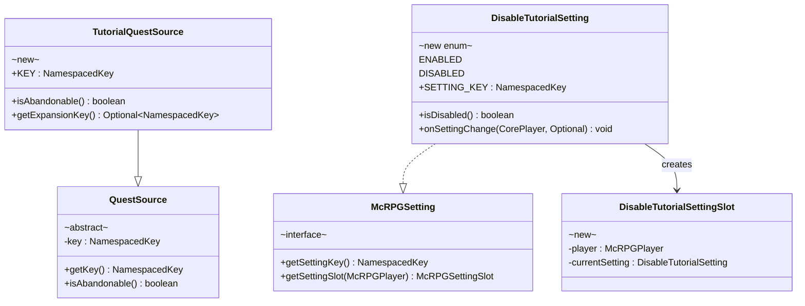
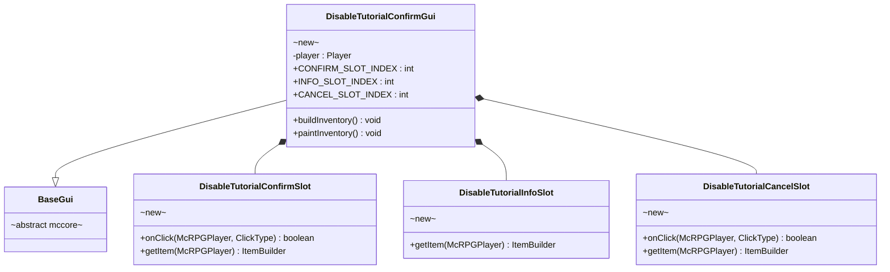
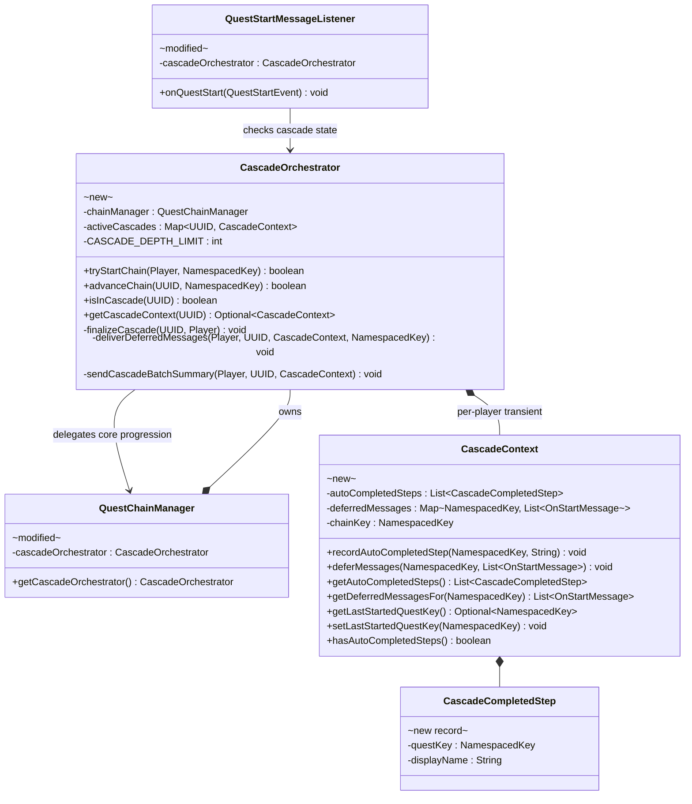
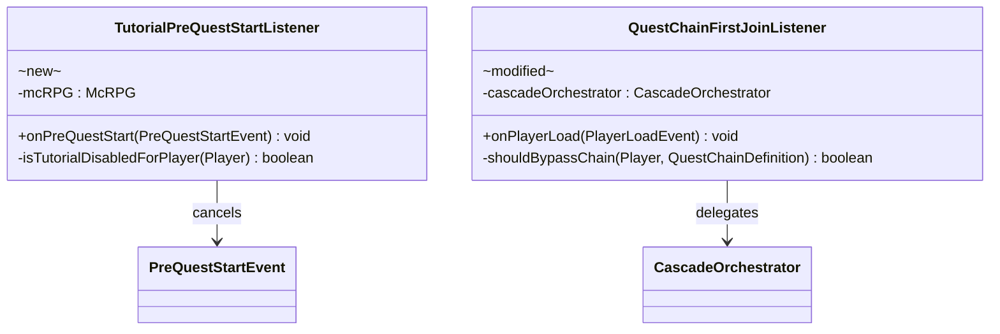
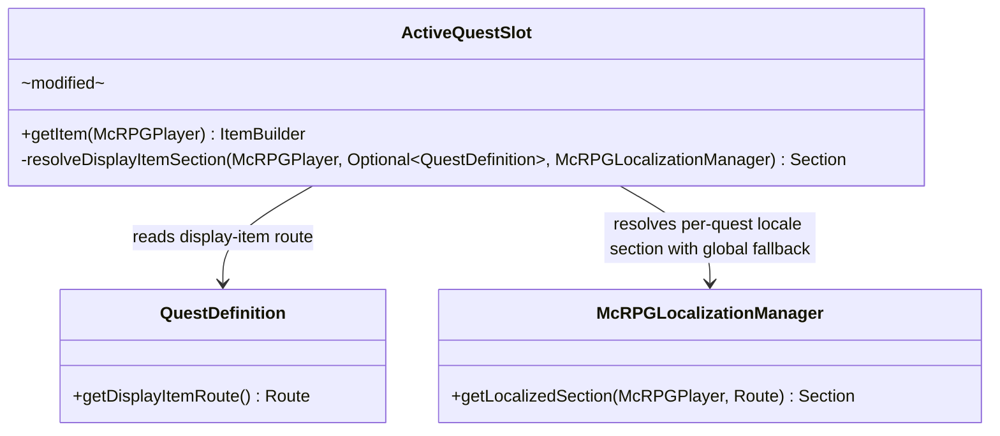

# Phase 3 LLD: Tutorial Content

> **HLD Reference:** [docs/hld/tutorial/tutorial-quest-system.md](../../hld/tutorial/tutorial-quest-system.md)
> **Phase 1 LLD:** [phase-1-quest-engine-extensions.md](phase-1-quest-engine-extensions.md) (implemented)
> **Phase 2 LLD:** [phase-2-quest-chain-system.md](phase-2-quest-chain-system.md) (implemented)
> **Backlog:** [chain-system-backlog.md](../../hld/tutorial/chain-system-backlog.md)
> **Status:** Implemented

## Scope

Phase 3 delivers the player-facing tutorial system — the content layer that leverages the Phase 1 objective/reward types and the Phase 2 chain orchestration system to onboard new players. It introduces the tutorial quest source, opt-out mechanisms, cascade batching for auto-completable chain steps, and all 7 tutorial quest definitions.

**In scope:**
- `TutorialQuestSource` — non-abandonable `QuestSource` subclass (`mcrpg:tutorial`)
- `DisableTutorialSetting` — player setting (enum: ENABLED, DISABLED); one-way door from GUI
- `DisableTutorialSettingSlot` — GUI slot (opens confirm when ENABLED; deny sound when DISABLED)
- `DisableTutorialConfirmGui` — confirmation GUI before disabling (mirrors `QuestAbandonConfirmGui`)
- `TutorialPreQuestStartListener` — cancels `PreQuestStartEvent` for tutorial quests when disabled/bypassed
- `CascadeContext` — per-player cascade state tracked by `CascadeOrchestrator`
- `CascadeOrchestrator` — cascade lifecycle management collaborator, delegates core chain progression to `QuestChainManager`
- Cascade batching in `CascadeOrchestrator` — message suppression for auto-completed chain steps, generic batch summary delivery
- Cascade depth limit (hard-coded 50) with developer-report warning log
- Generic cascade batch summary locale keys (usable by any chain, not tutorial-specific)
- `QuestStartMessageListener` modification — defer messages when cascade is active
- `QuestChainFirstJoinListener` modification — bypass permission check
- `ActiveQuestSlot` modification — per-quest display-item via locale route + non-abandonable lore
- `SoundRewardType` — new reward type (`mcrpg:sound`) for playing sounds on quest completion
- `TitleRewardType` — new reward type (`mcrpg:title_message`) for sending title/subtitle on completion
- Admin command: `/mcrpg quest chain skip <player> <chain>` — force-complete all remaining steps
- Admin `chain reset` command modification — also resets `DisableTutorialSetting` to ENABLED
- `config.yml` additions: `tutorial.enabled` toggle + `palette.tutorial` color entry
- 7 tutorial quest YAML definitions (`src/main/resources/quests/tutorial/*.yml`)
- Tutorial chain YAML definition (`src/main/resources/quests/tutorial/chain.yml`)
- Locale entries in `en_quest.yml` and `en_gui.yml` for all tutorial text
- `LocalizationKey.java` additions for all new keys
- Unit tests

**Out of scope (backlog):**
- Auto-complete delay (beyond same-tick recursive cascade)
- Availability windows (backlog §1)
- Repeat modes beyond `ONCE` (backlog §2)
- Quest expiration behaviors beyond `fail-chain` (backlog §3)
- Built-in `QuestChainStartCondition` implementations (backlog §6)
- Re-enable tutorial from player GUI (one-way door; admin reset is the only path back)

---

## Class Diagrams

**Legend:** Abstract classes annotated `abstract` · Interfaces annotated `interface` · Records annotated `record` · Enums annotated `enum` · New classes annotated `new` · Existing modified classes annotated `modified` · `*--` composition · `o--` association · `-->` dependency · `..|>` implements · `--|>` extends

### Diagram 1: Tutorial Quest Source and Setting



### Diagram 2: Tutorial Disable Confirmation GUI



### Diagram 3: Cascade Batching



### Diagram 4: Tutorial Listener



### Diagram 5: Active Quest GUI Display Item Resolution



---

## 1. New Classes

### 1.1 `TutorialQuestSource` — Non-Abandonable Tutorial Source

**Package:** `us.eunoians.mcrpg.quest.source.builtin`
**File:** `src/main/java/us/eunoians/mcrpg/quest/source/builtin/TutorialQuestSource.java`

Non-abandonable quest source for tutorial chain-managed quests. Tutorial quests are visually distinct in the Active Quest GUI via per-quest `display-item` locale sections (defaulting to `KNOWLEDGE_BOOK` material) and cannot be abandoned by the player.

```java
/**
 * Quest source for tutorial quests managed by the tutorial quest chain.
 * Non-abandonable — players must use the {@link DisableTutorialSetting}
 * to opt out, which triggers chain abandonment through
 * {@link QuestChainManager#abandonChain}.
 */
public final class TutorialQuestSource extends QuestSource {

    public static final NamespacedKey KEY = new NamespacedKey(McRPGMethods.getMcRPGNamespace(), "tutorial");

    public TutorialQuestSource() {
        super(KEY);
    }

    @Override
    public boolean isAbandonable() {
        return false;
    }

    @NotNull
    @Override
    public Optional<NamespacedKey> getExpansionKey() {
        return Optional.of(McRPGExpansion.EXPANSION_KEY);
    }
}
```

### 1.2 `DisableTutorialSetting` — Player Opt-Out Setting

**Package:** `us.eunoians.mcrpg.setting.impl`
**File:** `src/main/java/us/eunoians/mcrpg/setting/impl/DisableTutorialSetting.java`

Boolean-style enum setting. Default is `ENABLED`. When the player attempts to cycle to `DISABLED`, the setting slot opens `DisableTutorialConfirmGui` instead of immediately cycling the value.

```java
/**
 * Player setting controlling whether the tutorial quest chain is active.
 * Default is {@link #ENABLED}. Toggling to {@link #DISABLED} triggers a
 * confirmation GUI that, on confirm, abandons the active tutorial chain
 * and prevents future tutorial quest starts for this player.
 * <p>
 * Once disabled and confirmed, toggling back to {@link #ENABLED} does NOT
 * restart the chain or grant missed rewards — the chain remains
 * {@link QuestChainState#ABANDONED}.
 */
public enum DisableTutorialSetting implements McRPGSetting {

    ENABLED,
    DISABLED;

    private static final LinkedNode<DisableTutorialSetting> FIRST_SETTING = new LinkedNode<>(ENABLED);
    private static final Map<DisableTutorialSetting, LinkedNode<DisableTutorialSetting>> SETTINGS = new HashMap<>();
    public static final NamespacedKey SETTING_KEY = new NamespacedKey(McRPGMethods.getMcRPGNamespace(), "disable-tutorial-setting");

    static {
        SETTINGS.put(FIRST_SETTING.getNodeValue(), FIRST_SETTING);
        LinkedNode<DisableTutorialSetting> prev = FIRST_SETTING;
        for (DisableTutorialSetting setting : values()) {
            if (setting != FIRST_SETTING.getNodeValue()) {
                LinkedNode<DisableTutorialSetting> next = new LinkedNode<>(setting);
                prev.setNext(next);
                prev = next;
                SETTINGS.put(setting, prev);
            }
        }
        prev.setNext(FIRST_SETTING);
    }

    @NotNull
    @Override
    public NamespacedKey getSettingKey() {
        return SETTING_KEY;
    }

    @NotNull
    @Override
    public LinkedNode<DisableTutorialSetting> getFirstSetting() {
        return FIRST_SETTING;
    }

    @NotNull
    @Override
    public LinkedNode<DisableTutorialSetting> getNextSetting() {
        return SETTINGS.get(this).getNextNode();
    }

    @NotNull
    @Override
    public DisableTutorialSettingSlot getSettingSlot(@NotNull McRPGPlayer player) {
        return new DisableTutorialSettingSlot(player, this);
    }

    @Override
    public void onSettingChange(@NotNull CorePlayer player, @NotNull Optional<PlayerSetting> oldSetting) {
        // No-op — confirmation GUI handles the actual chain abandonment.
        // This callback fires after the setting value is persisted.
    }

    @NotNull
    @Override
    public Optional<DisableTutorialSetting> fromString(@NotNull String setting) {
        return Arrays.stream(values())
                .filter(s -> s.toString().equalsIgnoreCase(setting))
                .findFirst();
    }

    /**
     * Returns {@code true} when tutorials are disabled for this player.
     *
     * @return {@code true} if this is {@link #DISABLED}
     */
    public boolean isDisabled() {
        return this == DISABLED;
    }
}
```

### 1.3 `DisableTutorialSettingSlot` — Setting GUI Slot

**Package:** `us.eunoians.mcrpg.gui.setting.slot`
**File:** `src/main/java/us/eunoians/mcrpg/gui/setting/slot/DisableTutorialSettingSlot.java`

Disabling the tutorial is a **one-way door** from the player's perspective. When ENABLED, clicking opens `DisableTutorialConfirmGui`. When DISABLED, clicking plays a deny sound and shows an action bar message — the player cannot re-enable from the GUI. Only the admin `chain reset` command (which also resets the setting) can restore the tutorial for a player.

```java
/**
 * GUI slot for the {@link DisableTutorialSetting}. Disabling the tutorial is
 * a one-way player decision — re-enabling requires admin intervention via
 * {@code /mcrpg quest chain reset}.
 * <p>
 * Click behavior:
 * <ul>
 *   <li>When ENABLED → opens {@link DisableTutorialConfirmGui} (destructive, one-way)</li>
 *   <li>When DISABLED → plays deny sound + action bar message (no toggle back)</li>
 * </ul>
 */
public class DisableTutorialSettingSlot extends McRPGSettingSlot<DisableTutorialSetting> {

    public DisableTutorialSettingSlot(@NotNull McRPGPlayer player,
                                      @NotNull DisableTutorialSetting currentSetting) {
        super(player, currentSetting);
    }

    @Override
    public boolean onClick(@NotNull McRPGPlayer mcRPGPlayer, @NotNull ClickType clickType) {
        if (currentSetting == DisableTutorialSetting.ENABLED) {
            // Destructive toggle — open confirmation GUI
            mcRPGPlayer.getAsBukkitPlayer().ifPresent(player -> {
                DisableTutorialConfirmGui confirmGui = new DisableTutorialConfirmGui(mcRPGPlayer);
                McRPG.getInstance().registryAccess().registry(RegistryKey.MANAGER)
                        .manager(McRPGManagerKey.GUI).trackPlayerGui(player, confirmGui);
                player.openInventory(confirmGui.getInventory());
            });
            return true;
        }
        // DISABLED — one-way door, play deny feedback
        mcRPGPlayer.getAsBukkitPlayer().ifPresent(player -> {
            player.playSound(player.getLocation(), Sound.ENTITY_VILLAGER_NO, 1.0f, 1.0f);
            McRPGLocalizationManager locManager = RegistryAccess.registryAccess()
                    .registry(RegistryKey.MANAGER).manager(McRPGManagerKey.LOCALIZATION);
            player.sendActionBar(McRPG.getInstance().getMiniMessage().deserialize(
                    locManager.getLocalizedMessage(mcRPGPlayer,
                            LocalizationKey.TUTORIAL_SETTING_DISABLED_DENY_MESSAGE)));
        });
        return true;
    }

    @NotNull
    @Override
    public ItemBuilder getItem(@NotNull McRPGPlayer mcRPGPlayer) {
        McRPGLocalizationManager locManager = RegistryAccess.registryAccess()
                .registry(RegistryKey.MANAGER).manager(McRPGManagerKey.LOCALIZATION);

        if (currentSetting == DisableTutorialSetting.ENABLED) {
            return ItemBuilder.from(locManager.getLocalizedSection(
                    mcRPGPlayer, LocalizationKey.TUTORIAL_SETTING_SLOT_ENABLED_DISPLAY_ITEM))
                    .applyTagReplacements(locManager.getPaletteReplacements());
        }
        return ItemBuilder.from(locManager.getLocalizedSection(
                mcRPGPlayer, LocalizationKey.TUTORIAL_SETTING_SLOT_DISABLED_DISPLAY_ITEM))
                .applyTagReplacements(locManager.getPaletteReplacements());
    }
}
```

### 1.4 `DisableTutorialConfirmGui` — Confirmation GUI

**Package:** `us.eunoians.mcrpg.gui.tutorial`
**File:** `src/main/java/us/eunoians/mcrpg/gui/tutorial/DisableTutorialConfirmGui.java`

Mirrors `QuestAbandonConfirmGui`: 3-row layout with confirm (slot 11), info (slot 13), and cancel (slot 15). On confirm: sets setting to `DISABLED`, calls `chainManager.abandonChain()` for the tutorial chain, closes the GUI.

```java
/**
 * Confirmation GUI shown before disabling the tutorial.
 * Displays a confirm button (slot 11), info panel (slot 13), and
 * cancel button (slot 15) in a 3-row layout.
 * <p>
 * On confirm:
 * <ol>
 *   <li>Sets {@link DisableTutorialSetting} to {@link DisableTutorialSetting#DISABLED}</li>
 *   <li>Calls {@link QuestChainManager#abandonChain} for the tutorial chain</li>
 *   <li>Closes the inventory</li>
 * </ol>
 */
public class DisableTutorialConfirmGui extends BaseGui<McRPGPlayer> implements FillerItemGui, KeyedGui {

    public static final NamespacedKey GUI_KEY = new NamespacedKey(McRPGMethods.getMcRPGNamespace(), "disable_tutorial_confirm");

    private static final int CONFIRM_SLOT_INDEX = 11;
    private static final int INFO_SLOT_INDEX = 13;
    private static final int CANCEL_SLOT_INDEX = 15;

    private final Player player;

    public DisableTutorialConfirmGui(@NotNull McRPGPlayer mcRPGPlayer) {
        super(mcRPGPlayer);
        this.player = mcRPGPlayer.getAsBukkitPlayer()
                .orElseThrow(() -> new CorePlayerOfflineException(mcRPGPlayer));
    }

    @Override
    protected void buildInventory() {
        if (this.inventory != null) {
            throw new InventoryAlreadyExistsForGuiException(this);
        }
        this.inventory = Bukkit.createInventory(player, 27,
                RegistryAccess.registryAccess()
                        .registry(RegistryKey.MANAGER)
                        .manager(McRPGManagerKey.LOCALIZATION)
                        .getLocalizedMessageAsComponent(getCreatingPlayer(),
                                LocalizationKey.DISABLE_TUTORIAL_CONFIRM_GUI_TITLE));
        paintInventory();
    }

    @Override
    public void paintInventory() {
        Slot<McRPGPlayer> fillerSlot = getFillerItemSlot();
        for (int i = 0; i < inventory.getSize(); i++) {
            setSlot(i, fillerSlot);
        }
        setSlot(CONFIRM_SLOT_INDEX, new DisableTutorialConfirmSlot());
        setSlot(INFO_SLOT_INDEX, new DisableTutorialInfoSlot());
        setSlot(CANCEL_SLOT_INDEX, new DisableTutorialCancelSlot());
    }

    @Override
    public void registerListeners() {
        Bukkit.getPluginManager().registerEvents(this, McRPG.getInstance());
    }

    @Override
    public void unregisterListeners() {
        InventoryClickEvent.getHandlerList().unregister(this);
    }

    @Override
    @NotNull
    public Optional<NamespacedKey> getGuiKey() {
        return Optional.of(GUI_KEY);
    }
}
```

### 1.5 `DisableTutorialConfirmSlot`

**Package:** `us.eunoians.mcrpg.gui.tutorial.slot`
**File:** `src/main/java/us/eunoians/mcrpg/gui/tutorial/slot/DisableTutorialConfirmSlot.java`

```java
/**
 * Confirm button in {@link DisableTutorialConfirmGui}.
 * On click: sets the tutorial setting to DISABLED, abandons the
 * tutorial chain, and closes the inventory.
 */
public class DisableTutorialConfirmSlot implements McRPGSlot {

    private static final NamespacedKey TUTORIAL_CHAIN_KEY =
            new NamespacedKey(McRPGMethods.getMcRPGNamespace(), "tutorial_chain");

    @Override
    public boolean onClick(@NotNull McRPGPlayer mcRPGPlayer, @NotNull ClickType clickType) {
        // 1. Set the player setting to DISABLED
        mcRPGPlayer.setSetting(DisableTutorialSetting.DISABLED);

        // 2. Abandon the tutorial chain
        QuestChainManager chainManager = RegistryAccess.registryAccess()
                .registry(RegistryKey.MANAGER)
                .manager(McRPGManagerKey.QUEST_CHAIN);
        chainManager.abandonChain(mcRPGPlayer.getUUID(), TUTORIAL_CHAIN_KEY);

        // 3. Close the GUI
        mcRPGPlayer.getAsBukkitPlayer().ifPresent(Player::closeInventory);
        return true;
    }

    @NotNull
    @Override
    public ItemBuilder getItem(@NotNull McRPGPlayer mcRPGPlayer) {
        McRPGLocalizationManager locManager = RegistryAccess.registryAccess()
                .registry(RegistryKey.MANAGER).manager(McRPGManagerKey.LOCALIZATION);
        return ItemBuilder.from(locManager.getLocalizedSection(
                mcRPGPlayer, LocalizationKey.DISABLE_TUTORIAL_CONFIRM_SLOT_DISPLAY_ITEM))
                .applyTagReplacements(locManager.getPaletteReplacements());
    }

    @NotNull
    @Override
    public Set<Class<?>> getValidGuiTypes() {
        return Set.of(DisableTutorialConfirmGui.class);
    }
}
```

### 1.6 `DisableTutorialInfoSlot`

**Package:** `us.eunoians.mcrpg.gui.tutorial.slot`
**File:** `src/main/java/us/eunoians/mcrpg/gui/tutorial/slot/DisableTutorialInfoSlot.java`

```java
/**
 * Informational slot in {@link DisableTutorialConfirmGui}. Non-interactive.
 * Displays a warning about what disabling the tutorial entails.
 */
public class DisableTutorialInfoSlot implements McRPGSlot {

    @Override
    public boolean onClick(@NotNull McRPGPlayer mcRPGPlayer, @NotNull ClickType clickType) {
        return false;
    }

    @NotNull
    @Override
    public ItemBuilder getItem(@NotNull McRPGPlayer mcRPGPlayer) {
        McRPGLocalizationManager locManager = RegistryAccess.registryAccess()
                .registry(RegistryKey.MANAGER).manager(McRPGManagerKey.LOCALIZATION);
        return ItemBuilder.from(locManager.getLocalizedSection(
                mcRPGPlayer, LocalizationKey.DISABLE_TUTORIAL_INFO_SLOT_DISPLAY_ITEM))
                .applyTagReplacements(locManager.getPaletteReplacements());
    }

    @NotNull
    @Override
    public Set<Class<?>> getValidGuiTypes() {
        return Set.of(DisableTutorialConfirmGui.class);
    }
}
```

### 1.7 `DisableTutorialCancelSlot`

**Package:** `us.eunoians.mcrpg.gui.tutorial.slot`
**File:** `src/main/java/us/eunoians/mcrpg/gui/tutorial/slot/DisableTutorialCancelSlot.java`

```java
/**
 * Cancel button in {@link DisableTutorialConfirmGui}.
 * Returns the player to the settings GUI without changing the setting.
 */
public class DisableTutorialCancelSlot implements McRPGSlot {

    @Override
    public boolean onClick(@NotNull McRPGPlayer mcRPGPlayer, @NotNull ClickType clickType) {
        mcRPGPlayer.getAsBukkitPlayer().ifPresent(player -> {
            PlayerSettingGui settingGui = new PlayerSettingGui(mcRPGPlayer);
            McRPG.getInstance().registryAccess().registry(RegistryKey.MANAGER)
                    .manager(McRPGManagerKey.GUI).trackPlayerGui(player, settingGui);
            player.openInventory(settingGui.getInventory());
        });
        return true;
    }

    @NotNull
    @Override
    public ItemBuilder getItem(@NotNull McRPGPlayer mcRPGPlayer) {
        McRPGLocalizationManager locManager = RegistryAccess.registryAccess()
                .registry(RegistryKey.MANAGER).manager(McRPGManagerKey.LOCALIZATION);
        return ItemBuilder.from(locManager.getLocalizedSection(
                mcRPGPlayer, LocalizationKey.DISABLE_TUTORIAL_CANCEL_SLOT_DISPLAY_ITEM))
                .applyTagReplacements(locManager.getPaletteReplacements());
    }

    @NotNull
    @Override
    public Set<Class<?>> getValidGuiTypes() {
        return Set.of(DisableTutorialConfirmGui.class);
    }
}
```

### 1.8 `TutorialPreQuestStartListener` — Tutorial Start Gating

**Package:** `us.eunoians.mcrpg.listener.quest`
**File:** `src/main/java/us/eunoians/mcrpg/listener/quest/TutorialPreQuestStartListener.java`

Listens to `PreQuestStartEvent` and cancels quest starts for tutorial-sourced quests when the player has disabled tutorials, has the bypass permission, or the server-wide toggle is off. When cancelling a mid-chain quest start (bypass permission granted after chain started), schedules a next-tick task to abandon the tutorial chain.

```java
/**
 * Cancels {@link PreQuestStartEvent} for tutorial-sourced quests when:
 * <ul>
 *   <li>The player's {@link DisableTutorialSetting} is {@code DISABLED}</li>
 *   <li>The player has the {@code mcrpg.tutorial.bypass} permission</li>
 *   <li>The server-wide {@code tutorial.enabled} config toggle is {@code false}</li>
 * </ul>
 * <p>
 * When cancelling a mid-chain start (the tutorial chain is already ACTIVE for this
 * player), schedules a next-tick task to call
 * {@link QuestChainManager#abandonChain(UUID, NamespacedKey)} to transition the
 * chain to ABANDONED state. The next-tick scheduling avoids mutating chain state
 * during event dispatch within {@code startQuest()}.
 */
public class TutorialPreQuestStartListener implements Listener {

    private static final NamespacedKey TUTORIAL_CHAIN_KEY =
            new NamespacedKey(McRPGMethods.getMcRPGNamespace(), "tutorial_chain");
    private static final String BYPASS_PERMISSION = "mcrpg.tutorial.bypass";

    private final McRPG mcRPG;

    public TutorialPreQuestStartListener(@NotNull McRPG mcRPG) {
        this.mcRPG = mcRPG;
    }

    @EventHandler(priority = EventPriority.NORMAL, ignoreCancelled = true)
    public void onPreQuestStart(@NotNull PreQuestStartEvent event) {
        if (!(event.getSource() instanceof TutorialQuestSource)) {
            return;
        }

        Player player = event.getPlayer();
        if (!isTutorialDisabledForPlayer(player)) {
            return;
        }

        event.setCancelled(true);

        // Schedule chain abandonment on next tick to avoid mutating state
        // during the event dispatch stack of startQuest()
        Bukkit.getScheduler().runTask(mcRPG, () -> {
            QuestChainManager chainManager = mcRPG.registryAccess()
                    .registry(RegistryKey.MANAGER)
                    .manager(McRPGManagerKey.QUEST_CHAIN);
            chainManager.abandonChain(player.getUniqueId(), TUTORIAL_CHAIN_KEY);
        });
    }

    /**
     * Checks whether tutorials are disabled for the given player through any mechanism.
     *
     * @param player the player to check
     * @return {@code true} if tutorial quests should be blocked for this player
     */
    private boolean isTutorialDisabledForPlayer(@NotNull Player player) {
        // Server-wide toggle
        YamlDocument config = mcRPG.registryAccess().registry(RegistryKey.MANAGER)
                .manager(McRPGManagerKey.FILE).getFile(FileType.MAIN_CONFIG);
        if (!config.getBoolean(MainConfigFile.TUTORIAL_ENABLED)) {
            return true;
        }

        // Permission bypass
        if (player.hasPermission(BYPASS_PERMISSION)) {
            return true;
        }

        // Player setting
        Optional<McRPGPlayer> mcRPGPlayerOpt = mcRPG.registryAccess()
                .registry(RegistryKey.MANAGER)
                .manager(McRPGManagerKey.PLAYER).getPlayer(player.getUniqueId());
        if (mcRPGPlayerOpt.isPresent()) {
            McRPGPlayer mcRPGPlayer = mcRPGPlayerOpt.get();
            PlayerSetting setting = mcRPGPlayer.getSetting(DisableTutorialSetting.SETTING_KEY);
            if (setting instanceof DisableTutorialSetting tutorialSetting && tutorialSetting.isDisabled()) {
                return true;
            }
        }

        return false;
    }
}
```

### 1.9 `CascadeContext` — Per-Player Cascade State

**Package:** `us.eunoians.mcrpg.quest.chain`
**File:** `src/main/java/us/eunoians/mcrpg/quest/chain/CascadeContext.java`

Short-lived per-player state that exists only during a cascade within a single tick. Tracks auto-completed steps and deferred on-start messages. Created by `CascadeOrchestrator` before delegating to `QuestChainManager.tryStartChain()` or `advanceChain()`, and finalized after the delegation returns at the root call site.

```java
/**
 * Transient per-player state tracking a cascade of auto-completed chain steps
 * within a single tick. Lifetime:
 * <ol>
 *   <li>Created by {@link CascadeOrchestrator} before delegating to the chain manager
 *       at the root cascade site (either {@code tryStartChain} or {@code advanceChain})</li>
 *   <li>Populated by recursive {@code advanceChain} calls (recording auto-completed steps)
 *       and by {@link QuestStartMessageListener} (deferring on-start messages)</li>
 *   <li>Finalized by {@link CascadeOrchestrator#finalizeCascade} after the root
 *       delegation returns — sends batch summary and delivers
 *       the final (non-auto-completed) step's deferred messages</li>
 *   <li>Removed from the orchestrator's {@code activeCascades} map</li>
 * </ol>
 * <p>
 * Not thread-safe — all access is on the main Bukkit thread within a single tick.
 */
public class CascadeContext {

    private final NamespacedKey chainKey;
    private final List<CascadeCompletedStep> autoCompletedSteps;
    private final Map<NamespacedKey, List<OnStartMessage>> deferredMessages;
    private NamespacedKey lastStartedQuestKey;

    /**
     * Creates a new cascade context for the given chain.
     *
     * @param chainKey the chain being cascaded
     */
    public CascadeContext(@NotNull NamespacedKey chainKey) {
        this.chainKey = chainKey;
        this.autoCompletedSteps = new ArrayList<>();
        this.deferredMessages = new LinkedHashMap<>();
    }

    /**
     * Returns the key of the chain this cascade belongs to.
     *
     * @return the chain key
     */
    @NotNull
    public NamespacedKey getChainKey() {
        return chainKey;
    }

    /**
     * Records that a step auto-completed during this cascade. Steps are stored
     * in encounter order for the batch summary.
     *
     * @param questKey    the quest definition key of the completed step
     * @param displayName the resolved display name for the batch summary
     */
    public void recordAutoCompletedStep(@NotNull NamespacedKey questKey, @NotNull String displayName) {
        autoCompletedSteps.add(new CascadeCompletedStep(questKey, displayName));
    }

    /**
     * Defers on-start messages for a quest that is starting during a cascade.
     * Messages are stored keyed by quest key so {@link CascadeOrchestrator#finalizeCascade}
     * can selectively deliver only the final step's messages.
     *
     * @param questKey the quest whose messages are being deferred
     * @param messages the on-start messages to defer
     */
    public void deferMessages(@NotNull NamespacedKey questKey, @NotNull List<OnStartMessage> messages) {
        deferredMessages.put(questKey, new ArrayList<>(messages));
    }

    /**
     * Tracks the most recently started quest key. Updated each time a new step
     * quest is started during the cascade. Used by {@code finalizeCascade} to identify
     * which step's deferred messages should be delivered (the final non-auto-completed step).
     *
     * @param questKey the quest key being started
     */
    public void setLastStartedQuestKey(@NotNull NamespacedKey questKey) {
        this.lastStartedQuestKey = questKey;
    }

    /**
     * Returns the most recently started quest key, or empty if no quest
     * has been started during this cascade yet.
     *
     * @return the last started quest key, or empty
     */
    @NotNull
    public Optional<NamespacedKey> getLastStartedQuestKey() {
        return Optional.ofNullable(lastStartedQuestKey);
    }

    /**
     * Returns an unmodifiable view of all auto-completed steps recorded during
     * this cascade, in the order they completed.
     *
     * @return unmodifiable list of auto-completed steps
     */
    @NotNull
    public List<CascadeCompletedStep> getAutoCompletedSteps() {
        return Collections.unmodifiableList(autoCompletedSteps);
    }

    /**
     * Returns the deferred on-start messages for the given quest key, or an empty
     * list if no messages were deferred for that key.
     *
     * @param questKey the quest definition key to look up
     * @return the deferred messages, or an empty list
     */
    @NotNull
    public List<OnStartMessage> getDeferredMessagesFor(@NotNull NamespacedKey questKey) {
        return deferredMessages.getOrDefault(questKey, List.of());
    }

    /**
     * Returns {@code true} if at least one step auto-completed during this cascade.
     *
     * @return {@code true} if auto-completed steps were recorded
     */
    public boolean hasAutoCompletedSteps() {
        return !autoCompletedSteps.isEmpty();
    }

    /**
     * Immutable record of a single auto-completed step within a cascade.
     *
     * @param questKey    the quest definition key
     * @param displayName the resolved display name for summary messages
     */
    public record CascadeCompletedStep(
            @NotNull NamespacedKey questKey,
            @NotNull String displayName
    ) {}
}
```

### 1.10 `CascadeOrchestrator` — Cascade Lifecycle Management

**Package:** `us.eunoians.mcrpg.quest.chain`
**File:** `src/main/java/us/eunoians/mcrpg/quest/chain/CascadeOrchestrator.java`

Owns the cascade lifecycle: creates/finalizes `CascadeContext` instances, enforces depth limits, delivers batch summaries, and delegates core chain progression to `QuestChainManager`. All callers that previously invoked `QuestChainManager.tryStartChain()` or `advanceChain()` now call this orchestrator instead.

```java
/**
 * Manages cascade lifecycle around chain start/advance operations. A cascade occurs
 * when a chain step auto-completes immediately upon starting (because the player
 * already satisfies the objective), triggering a recursive advance that starts and
 * potentially auto-completes the next step, and so on within a single tick.
 * <p>
 * This class owns the {@code activeCascades} map and provides the public API that
 * listeners and commands call. It delegates actual chain state progression to
 * {@link QuestChainManager}, keeping cascade bookkeeping separate from core
 * chain logic.
 * <p>
 * Not thread-safe — all access is on the main Bukkit thread.
 */
public class CascadeOrchestrator {

    private static final int CASCADE_DEPTH_LIMIT = 50;

    private final QuestChainManager chainManager;
    private final McRPG plugin;
    private final Map<UUID, CascadeContext> activeCascades = new HashMap<>();

    /**
     * Creates a new cascade orchestrator.
     *
     * @param plugin       the McRPG plugin instance
     * @param chainManager the chain manager to delegate core progression to
     */
    public CascadeOrchestrator(@NotNull McRPG plugin, @NotNull QuestChainManager chainManager) {
        this.plugin = plugin;
        this.chainManager = chainManager;
    }

    /**
     * Attempts to start a chain for a player, wrapping the operation in a cascade
     * context. If the first quest auto-completes and triggers recursive
     * {@link #advanceChain} calls, all auto-completed steps are batched into a
     * single summary message delivered after the root call returns.
     *
     * @param player   the player
     * @param chainKey the chain definition key
     * @return {@code true} if the chain was started
     */
    public boolean tryStartChain(@NotNull Player player, @NotNull NamespacedKey chainKey) {
        UUID playerUUID = player.getUniqueId();
        boolean isRoot = !activeCascades.containsKey(playerUUID);
        if (isRoot) {
            activeCascades.put(playerUUID, new CascadeContext(chainKey));
        }

        boolean result = chainManager.tryStartChain(player, chainKey);

        if (!result && isRoot) {
            activeCascades.remove(playerUUID);
            return false;
        }

        if (isRoot) {
            finalizeCascade(playerUUID, player);
        }
        return result;
    }

    /**
     * Advances a player's chain after a quest completes, wrapping the operation
     * in a cascade context. Records the completed step in the context and enforces
     * the cascade depth limit.
     *
     * @param playerUUID        the player UUID
     * @param completedQuestKey the quest definition key that was just completed
     * @return {@code true} if the chain advanced or completed
     */
    public boolean advanceChain(@NotNull UUID playerUUID, @NotNull NamespacedKey completedQuestKey) {
        boolean isRoot = !activeCascades.containsKey(playerUUID);
        if (isRoot) {
            activeCascades.put(playerUUID, new CascadeContext(resolveChainKey(playerUUID, completedQuestKey)));
        }

        CascadeContext cascadeContext = activeCascades.get(playerUUID);

        if (cascadeContext.getAutoCompletedSteps().size() >= CASCADE_DEPTH_LIMIT) {
            plugin.getLogger().warning("[CascadeOrchestrator] Cascade depth limit ("
                    + CASCADE_DEPTH_LIMIT + ") reached for chain '" + cascadeContext.getChainKey()
                    + "' player " + playerUUID + ". This likely indicates a chain configuration "
                    + "error — please report to the McRPG developers with your chain YAML.");
            if (isRoot) {
                finalizeCascade(playerUUID, Bukkit.getPlayer(playerUUID));
            }
            return false;
        }

        String completedDisplayName = resolveQuestDisplayName(completedQuestKey, playerUUID);
        cascadeContext.recordAutoCompletedStep(completedQuestKey, completedDisplayName);

        boolean result = chainManager.advanceChain(playerUUID, completedQuestKey);

        if (isRoot) {
            finalizeCascade(playerUUID, Bukkit.getPlayer(playerUUID));
        }
        return result;
    }

    /**
     * Returns {@code true} if the given player is currently in a chain cascade
     * (auto-completing steps within a single tick).
     *
     * @param playerUUID the player UUID
     * @return {@code true} if a cascade is active
     */
    public boolean isInCascade(@NotNull UUID playerUUID) {
        return activeCascades.containsKey(playerUUID);
    }

    /**
     * Returns the active cascade context for the player, if one exists.
     *
     * @param playerUUID the player UUID
     * @return the cascade context, or empty if no cascade is active
     */
    @NotNull
    public Optional<CascadeContext> getCascadeContext(@NotNull UUID playerUUID) {
        return Optional.ofNullable(activeCascades.get(playerUUID));
    }

    /**
     * Notifies the orchestrator that a new step quest has been started during
     * the current cascade. Called by the chain manager after successfully
     * starting a step quest.
     *
     * @param playerUUID the player UUID
     * @param questKey   the quest key that was started
     */
    public void notifyStepStarted(@NotNull UUID playerUUID, @NotNull NamespacedKey questKey) {
        CascadeContext context = activeCascades.get(playerUUID);
        if (context != null) {
            context.setLastStartedQuestKey(questKey);
        }
    }

    /**
     * Finalizes a cascade after the root call returns. If auto-completed steps
     * were recorded, sends a batch summary and delivers only the final step's
     * deferred messages.
     *
     * @param playerUUID the player UUID
     * @param player     the Bukkit player (may be null if disconnected mid-cascade)
     */
    private void finalizeCascade(@NotNull UUID playerUUID, @Nullable Player player) {
        CascadeContext context = activeCascades.remove(playerUUID);
        if (context == null || player == null || !player.isOnline()) {
            return;
        }

        if (!context.hasAutoCompletedSteps()) {
            context.getLastStartedQuestKey()
                    .ifPresent(key -> deliverDeferredMessages(player, playerUUID, context, key));
            return;
        }

        // Cascade occurred:
        // 1. Deliver the final step's on-start messages
        context.getLastStartedQuestKey()
                .ifPresent(key -> deliverDeferredMessages(player, playerUUID, context, key));

        // 2. Send batch summary for auto-completed steps
        sendCascadeBatchSummary(player, playerUUID, context);
    }

    /**
     * Delivers deferred on-start messages for a specific quest key.
     *
     * @param player     the player to deliver to
     * @param playerUUID the player UUID
     * @param context    the cascade context holding deferred messages
     * @param questKey   the quest key whose messages to deliver
     */
    private void deliverDeferredMessages(@NotNull Player player, @NotNull UUID playerUUID,
                                          @NotNull CascadeContext context, @NotNull NamespacedKey questKey) {
        List<OnStartMessage> messages = context.getDeferredMessagesFor(questKey);
        if (messages.isEmpty()) {
            return;
        }
        McRPGLocalizationManager locManager = plugin.registryAccess()
                .registry(RegistryKey.MANAGER).manager(McRPGManagerKey.LOCALIZATION);
        Optional<McRPGPlayer> mcRPGPlayerOpt = plugin.registryAccess()
                .registry(RegistryKey.MANAGER).manager(McRPGManagerKey.PLAYER).getPlayer(playerUUID);
        QuestMessageDeliverer deliverer = new QuestMessageDeliverer(
                locManager, plugin.getMiniMessage(), plugin.getLogger());
        for (OnStartMessage msg : messages) {
            Route route = msg.localeKey().map(Route::fromString).orElse(null);
            deliverer.deliver(player, mcRPGPlayerOpt.orElse(null), route, msg.inlineMessages());
        }
    }

    /**
     * Sends a localized batch summary message listing all auto-completed steps.
     * Uses generic locale keys (under quest-chain.cascade) so this works for
     * any chain, not just the tutorial.
     *
     * @param player     the player to send the summary to
     * @param playerUUID the player UUID
     * @param context    the cascade context with completed steps
     */
    private void sendCascadeBatchSummary(@NotNull Player player, @NotNull UUID playerUUID,
                                          @NotNull CascadeContext context) {
        McRPGLocalizationManager locManager = plugin.registryAccess()
                .registry(RegistryKey.MANAGER).manager(McRPGManagerKey.LOCALIZATION);
        Optional<McRPGPlayer> mcRPGPlayerOpt = plugin.registryAccess()
                .registry(RegistryKey.MANAGER).manager(McRPGManagerKey.PLAYER).getPlayer(playerUUID);
        if (mcRPGPlayerOpt.isEmpty()) {
            return;
        }
        McRPGPlayer mcRPGPlayer = mcRPGPlayerOpt.get();

        String chainDisplayName = resolveChainDisplayName(context.getChainKey(), mcRPGPlayer);

        String header = locManager.getLocalizedMessage(mcRPGPlayer,
                LocalizationKey.QUEST_CHAIN_CASCADE_BATCH_HEADER)
                .replace("<chain>", chainDisplayName);
        player.sendMessage(plugin.getMiniMessage().deserialize(header));

        for (CascadeContext.CascadeCompletedStep step : context.getAutoCompletedSteps()) {
            String entry = locManager.getLocalizedMessage(mcRPGPlayer,
                    LocalizationKey.QUEST_CHAIN_CASCADE_BATCH_STEP_ENTRY)
                    .replace("<quest>", step.displayName());
            player.sendMessage(plugin.getMiniMessage().deserialize(entry));
        }
    }

    /**
     * Resolves the chain key for a completed quest via the player's chain data
     * reverse index.
     *
     * @param playerUUID        the player UUID
     * @param completedQuestKey the completed quest key
     * @return the chain key, or a synthetic key if resolution fails
     */
    @NotNull
    private NamespacedKey resolveChainKey(@NotNull UUID playerUUID, @NotNull NamespacedKey completedQuestKey) {
        Optional<McRPGPlayer> playerOpt = RegistryAccess.registryAccess().registry(RegistryKey.MANAGER)
                .manager(McRPGManagerKey.PLAYER).getPlayer(playerUUID);
        if (playerOpt.isPresent()) {
            Optional<NamespacedKey> chainKeyOpt = playerOpt.get().getChainData()
                    .getChainKeyForCurrentQuest(completedQuestKey);
            if (chainKeyOpt.isPresent()) {
                return chainKeyOpt.get();
            }
        }
        return completedQuestKey;
    }

    /**
     * Resolves the display name for a quest definition key.
     *
     * @param questKey   the quest definition key
     * @param playerUUID the player UUID (for locale resolution)
     * @return the resolved display name
     */
    @NotNull
    private String resolveQuestDisplayName(@NotNull NamespacedKey questKey, @NotNull UUID playerUUID) {
        // Delegates to localization for the quest's display-name key
        McRPGLocalizationManager locManager = plugin.registryAccess()
                .registry(RegistryKey.MANAGER).manager(McRPGManagerKey.LOCALIZATION);
        Optional<McRPGPlayer> playerOpt = plugin.registryAccess()
                .registry(RegistryKey.MANAGER).manager(McRPGManagerKey.PLAYER).getPlayer(playerUUID);
        if (playerOpt.isEmpty()) {
            return questKey.getKey();
        }
        var definitionRegistry = RegistryAccess.registryAccess().registry(McRPGRegistryKey.QUEST_DEFINITION);
        return definitionRegistry.get(questKey)
                .map(def -> def.getDisplayName(playerOpt.get()))
                .orElse(questKey.getKey());
    }

    /**
     * Resolves the display name for a chain definition key.
     *
     * @param chainKey    the chain definition key
     * @param mcRPGPlayer the player (for locale resolution)
     * @return the resolved chain display name
     */
    @NotNull
    private String resolveChainDisplayName(@NotNull NamespacedKey chainKey, @NotNull McRPGPlayer mcRPGPlayer) {
        var chainRegistry = RegistryAccess.registryAccess().registry(McRPGRegistryKey.QUEST_CHAIN);
        return chainRegistry.get(chainKey)
                .map(def -> def.getDisplayName(mcRPGPlayer))
                .orElse(chainKey.getKey());
    }
}
```

### 1.11 `SoundRewardType` — Play Sound on Completion

**Package:** `us.eunoians.mcrpg.quest.reward.builtin`
**File:** `src/main/java/us/eunoians/mcrpg/quest/reward/builtin/SoundRewardType.java`

New reward type (`mcrpg:sound`) that plays a configurable sound to the player on quest completion. Supports Bukkit `Sound` enum values, volume, and pitch.

```java
/**
 * Reward type that plays a sound to the rewarded player.
 * <p>
 * YAML configuration:
 * <pre>
 * celebration_sound:
 *   type: mcrpg:sound
 *   sound: ENTITY_PLAYER_LEVELUP
 *   volume: 1.0    # optional, default 1.0
 *   pitch: 1.0     # optional, default 1.0
 * </pre>
 */
public final class SoundRewardType implements QuestRewardType {

    public static final NamespacedKey KEY = new NamespacedKey(McRPGMethods.getMcRPGNamespace(), "sound");

    @NotNull
    @Override
    public NamespacedKey getKey() {
        return KEY;
    }

    @Override
    public void grant(@NotNull Player player, @NotNull Map<String, Object> config) {
        String soundName = (String) config.get("sound");
        if (soundName == null) {
            McRPG.getInstance().getLogger().warning("[SoundRewardType] Missing 'sound' in reward config");
            return;
        }
        Sound sound;
        try {
            sound = Sound.valueOf(soundName.toUpperCase());
        } catch (IllegalArgumentException e) {
            McRPG.getInstance().getLogger().warning("[SoundRewardType] Unknown sound: " + soundName);
            return;
        }
        float volume = ((Number) config.getOrDefault("volume", 1.0)).floatValue();
        float pitch = ((Number) config.getOrDefault("pitch", 1.0)).floatValue();
        player.playSound(player.getLocation(), sound, volume, pitch);
    }

    @NotNull
    @Override
    public String describeForDisplay(@NotNull Map<String, Object> config, @NotNull McRPGPlayer player) {
        return ""; // Sound rewards are invisible in GUI — no lore line
    }

    @Override
    public boolean isVisibleInGui() {
        return false;
    }

    @NotNull
    @Override
    public Optional<NamespacedKey> getExpansionKey() {
        return Optional.of(McRPGExpansion.EXPANSION_KEY);
    }
}
```

### 1.12 `TitleRewardType` — Send Title/Subtitle on Completion

**Package:** `us.eunoians.mcrpg.quest.reward.builtin`
**File:** `src/main/java/us/eunoians/mcrpg/quest/reward/builtin/TitleRewardType.java`

New reward type (`mcrpg:title_message`) that sends a title and/or subtitle to the player. Supports configurable fade-in, stay, and fade-out durations. Messages pass through palette resolution and MiniMessage parsing.

```java
/**
 * Reward type that sends a title and/or subtitle to the rewarded player.
 * <p>
 * YAML configuration:
 * <pre>
 * graduation_title:
 *   type: mcrpg:title_message
 *   title: "<primary>Tutorial Complete!"     # optional (empty if omitted)
 *   subtitle: "<body>You're ready to explore McRPG."  # optional
 *   fade-in: 10    # ticks, default 10
 *   stay: 70       # ticks, default 70
 *   fade-out: 20   # ticks, default 20
 * </pre>
 * <p>
 * Both {@code title} and {@code subtitle} pass through palette replacement
 * and MiniMessage parsing before display.
 */
public final class TitleRewardType implements QuestRewardType {

    public static final NamespacedKey KEY = new NamespacedKey(McRPGMethods.getMcRPGNamespace(), "title_message");

    private static final long MILLIS_PER_TICK = 50L;

    @NotNull
    @Override
    public NamespacedKey getKey() {
        return KEY;
    }

    @Override
    public void grant(@NotNull Player player, @NotNull Map<String, Object> config) {
        String titleStr = (String) config.getOrDefault("title", "");
        String subtitleStr = (String) config.getOrDefault("subtitle", "");
        int fadeInTicks = ((Number) config.getOrDefault("fade-in", 10)).intValue();
        int stayTicks = ((Number) config.getOrDefault("stay", 70)).intValue();
        int fadeOutTicks = ((Number) config.getOrDefault("fade-out", 20)).intValue();

        McRPGLocalizationManager locManager = McRPG.getInstance().registryAccess()
                .registry(RegistryKey.MANAGER).manager(McRPGManagerKey.LOCALIZATION);
        var paletteReplacements = locManager.getPaletteReplacements();
        MiniMessage miniMessage = McRPG.getInstance().getMiniMessage();

        String resolvedTitle = applyPalette(titleStr, paletteReplacements);
        String resolvedSubtitle = applyPalette(subtitleStr, paletteReplacements);

        Component titleComponent = miniMessage.deserialize(resolvedTitle);
        Component subtitleComponent = miniMessage.deserialize(resolvedSubtitle);

        player.showTitle(Title.title(titleComponent, subtitleComponent,
                Title.Times.times(
                        Duration.ofMillis(fadeInTicks * MILLIS_PER_TICK),
                        Duration.ofMillis(stayTicks * MILLIS_PER_TICK),
                        Duration.ofMillis(fadeOutTicks * MILLIS_PER_TICK))));
    }

    @NotNull
    @Override
    public String describeForDisplay(@NotNull Map<String, Object> config, @NotNull McRPGPlayer player) {
        return ""; // Title rewards are invisible in GUI — no lore line
    }

    @Override
    public boolean isVisibleInGui() {
        return false;
    }

    @NotNull
    @Override
    public Optional<NamespacedKey> getExpansionKey() {
        return Optional.of(McRPGExpansion.EXPANSION_KEY);
    }

    private String applyPalette(@NotNull String input, @NotNull Map<String, String> palette) {
        String result = input;
        for (Map.Entry<String, String> entry : palette.entrySet()) {
            result = result.replace("<" + entry.getKey() + ">", entry.getValue());
        }
        return result;
    }
}
```

### 1.13 `ChainSkipCommand` — Force-Complete All Remaining Steps

**Package:** `us.eunoians.mcrpg.command.admin.chain`
**File:** `src/main/java/us/eunoians/mcrpg/command/admin/chain/ChainSkipCommand.java`

Admin command: `/mcrpg quest chain skip <player> <chain>`. Force-completes all remaining steps in a chain by iteratively calling `QuestChainManager.forceAdvanceChain()` in a loop until the chain leaves the `ACTIVE` state. Each step goes through the normal chain-completion path — rewards fire, events fire, completions are logged. Distinct from `advance` (one step) and `reset` (wipe history).

The `DisableTutorialSetting` is NOT modified by skip (the player has the tutorial "completed", which is a valid end state). Only `chain reset` resets the setting.

**Implementation:** The static `skipChain(McRPGPlayer, QuestChainDefinition)` method validates state, then loops:

```java
while (stepsSkipped < maxIterations) {
    Optional<QuestChainPlayerState> currentState = chainData.getChainState(chain.getChainKey());
    if (currentState.isEmpty() || currentState.get().getState() != QuestChainState.ACTIVE) {
        break;
    }
    boolean advanced = chainManager.forceAdvanceChain(mcRPGPlayer.getUUID(), chain.getChainKey());
    if (!advanced) {
        break;
    }
    stepsSkipped++;
}
```

Returns the number of steps skipped on success, `SKIP_ERROR_NO_STATE` (-1) if the player has no chain state, or `SKIP_ERROR_TERMINAL` (-2) if the chain is already in a terminal state.

**Permission:** `mcrpg.quest.chain.skip` (child of `mcrpg.quest.chain.*`)

**Fail cases:**
- Chain key not in registry → error message (handled by `ChainKeyParser`)
- Player not loaded as `McRPGPlayer` → error message
- Player has no chain state → error message with `QUEST_CHAIN_ADMIN_SKIP_ERROR_NO_STATE` locale key
- Chain state is already terminal → error message with `QUEST_CHAIN_ADMIN_SKIP_ERROR_TERMINAL` locale key (use `reset` first)

---

## 2. Modifications to Existing Classes

### 2.1 `QuestChainManager` — Orchestrator Composition

**File:** `src/main/java/us/eunoians/mcrpg/quest/chain/QuestChainManager.java`

The manager creates and holds a `CascadeOrchestrator` instance. No cascade logic lives on `QuestChainManager` — its `tryStartChain()` and `advanceChain()` methods remain unchanged from Phase 2. The orchestrator wraps these calls with cascade bookkeeping.

**New field + constructor change:**

```java
private final CascadeOrchestrator cascadeOrchestrator;

public QuestChainManager(@NotNull McRPG plugin) {
    super(plugin);
    this.persistenceService = new ChainPersistenceService(plugin);
    this.chainQuestStarter = new ChainQuestStarter(plugin);
    this.cascadeOrchestrator = new CascadeOrchestrator(plugin, this);
}
```

**New public getter:**

```java
/**
 * Returns the cascade orchestrator that wraps chain start/advance with
 * cascade batching. All callers that need cascade-aware chain operations
 * should call through this orchestrator rather than calling
 * {@link #tryStartChain} or {@link #advanceChain} directly.
 *
 * @return the cascade orchestrator
 */
@NotNull
public CascadeOrchestrator getCascadeOrchestrator() {
    return cascadeOrchestrator;
}
```

**No other changes to `QuestChainManager`.** The existing `tryStartChain()` and `advanceChain()` methods stay exactly as they are in Phase 2 — single-responsibility, focused on validation, state mutation, events, and persistence.

### 2.2 `QuestStartMessageListener` — Cascade Deferral

**File:** `src/main/java/us/eunoians/mcrpg/listener/quest/QuestStartMessageListener.java`

Modify `onQuestStart()` to defer messages when a cascade is active for the quest starter. References `CascadeOrchestrator` (via the chain manager's getter) for cascade state checks.

**New constructor parameter:**

```java
private final CascadeOrchestrator cascadeOrchestrator;

public QuestStartMessageListener(@NotNull McRPG mcRPG) {
    this.mcRPG = mcRPG;
    // ... existing messageDeliverer initialization ...
    QuestChainManager chainManager = mcRPG.registryAccess().registry(RegistryKey.MANAGER)
            .manager(McRPGManagerKey.QUEST_CHAIN);
    this.cascadeOrchestrator = chainManager.getCascadeOrchestrator();
}
```

**Modified `onQuestStart()`:**

```java
@EventHandler(priority = EventPriority.MONITOR, ignoreCancelled = true)
public void onQuestStart(@NotNull QuestStartEvent event) {
    QuestDefinition definition = event.getQuestDefinition();
    List<OnStartMessage> messages = definition.getOnStartMessages();
    if (messages.isEmpty()) {
        return;
    }

    UUID starterUUID = event.getStarterUUID();

    // If the starter is in a cascade, defer messages to the cascade context
    if (starterUUID != null && cascadeOrchestrator.isInCascade(starterUUID)) {
        Optional<CascadeContext> contextOpt = cascadeOrchestrator.getCascadeContext(starterUUID);
        if (contextOpt.isPresent()) {
            contextOpt.get().deferMessages(definition.getKey(), messages);
            return;
        }
    }

    // ... existing immediate delivery logic (unchanged for non-cascade) ...
}
```

### 2.3 `QuestChainFirstJoinListener` — Bypass Permission Check

**File:** `src/main/java/us/eunoians/mcrpg/listener/quest/QuestChainFirstJoinListener.java`

Add a bypass check before calling `tryStartChain()` for the tutorial chain. This prevents chain state from ever being created for bypassed players. The listener now holds a reference to `CascadeOrchestrator` rather than `QuestChainManager` directly, since all start/advance calls go through the orchestrator.

**Modified field and `onPlayerLoad()`:**

```java
private final CascadeOrchestrator cascadeOrchestrator;

@EventHandler(priority = EventPriority.MONITOR, ignoreCancelled = true)
public void onPlayerLoad(@NotNull PlayerLoadEvent event) {
    Player player = event.getPlayer();

    // ... existing chain iteration ...
    for (QuestChainDefinition chain : chainsForTrigger) {
        // Skip if player already has state for this chain
        if (chainData.getChainState(chain.getChainKey()).isPresent()) {
            continue;
        }

        // NEW: Check bypass for tutorial chains
        if (shouldBypassChain(player, chain)) {
            continue;
        }

        cascadeOrchestrator.tryStartChain(player, chain.getChainKey());
    }
}

/**
 * Checks whether a player should bypass a specific chain's auto-start.
 * Currently only checks the tutorial bypass permission for tutorial-sourced chains.
 *
 * @param player the player
 * @param chain  the chain definition
 * @return {@code true} if the chain should not auto-start for this player
 */
private boolean shouldBypassChain(@NotNull Player player, @NotNull QuestChainDefinition chain) {
    if (TutorialQuestSource.KEY.equals(chain.getSourceKey())
            && player.hasPermission("mcrpg.tutorial.bypass")) {
        return true;
    }
    return false;
}
```

### 2.4 `ActiveQuestSlot` — Per-Quest Display Item + Non-Abandonable Lore

**File:** `src/main/java/us/eunoians/mcrpg/gui/quest/slot/ActiveQuestSlot.java`

Resolve the display item per-quest via the locale system using `QuestDefinition.getDisplayItemRoute()`. Falls back to the global `ACTIVE_QUEST_GUI_QUEST_SLOT_DISPLAY_ITEM` template when no per-quest section exists. Add a non-abandonable lore line when the quest source is not abandonable.

**New `QuestDefinition.getDisplayItemRoute()`:**

```java
@NotNull
public Route getDisplayItemRoute() {
    return Route.fromString("quests." + questKey.getNamespace() + "." + questKey.getKey() + ".display-item");
}
```

**Modified `getItem()`:**

```java
@NotNull
@Override
public ItemBuilder getItem(@NotNull McRPGPlayer mcRPGPlayer) {
    // ... existing logic ...

    Section displayItemSection = resolveDisplayItemSection(mcRPGPlayer, defOpt, localizationManager);
    ItemBuilder builder = ItemBuilder.from(displayItemSection)
            .addPlaceholders(placeholders);
    builder.applyTagReplacements(localizationManager.getPaletteReplacements());

    // ... existing lore building ...

    if (questInstance.getQuestSource().isAbandonable()) {
        builder.addDisplayLore(localizationManager.getLocalizedMessage(
                mcRPGPlayer,
                LocalizationKey.ACTIVE_QUEST_GUI_RIGHT_CLICK_TO_ABANDON));
    } else {
        builder.addDisplayLore(localizationManager.getLocalizedMessage(
                mcRPGPlayer,
                LocalizationKey.ACTIVE_QUEST_GUI_NON_ABANDONABLE));
    }

    return builder;
}

@NotNull
private Section resolveDisplayItemSection(@NotNull McRPGPlayer mcRPGPlayer,
                                          @NotNull Optional<QuestDefinition> defOpt,
                                          @NotNull McRPGLocalizationManager localizationManager) {
    if (defOpt.isPresent()) {
        try {
            return localizationManager.getLocalizedSection(mcRPGPlayer, defOpt.get().getDisplayItemRoute());
        } catch (Exception ignored) {
        }
    }
    return localizationManager.getLocalizedSection(mcRPGPlayer, LocalizationKey.ACTIVE_QUEST_GUI_QUEST_SLOT_DISPLAY_ITEM);
}
```

**Locale entry (en_quest.yml) — per tutorial quest:**

```yaml
quests:
  mcrpg:
    tutorial_first_steps:
      display-item:
        material: KNOWLEDGE_BOOK
        item-flags:
          - 'HIDE_ATTRIBUTES'
        name: "<tutorial><quest_name>"
```

### 2.5 `McRPGExpansion` — Register Tutorial Content

**File:** `src/main/java/us/eunoians/mcrpg/expansion/McRPGExpansion.java`

Register `TutorialQuestSource` in `getQuestSourceContent()` and `DisableTutorialSetting` in `getPlayerSettingContent()`.

### 2.6 `McRPGListenerRegistrar` — Register Tutorial Listener

**File:** `src/main/java/us/eunoians/mcrpg/bootstrap/McRPGListenerRegistrar.java`

Register `TutorialPreQuestStartListener`.

### 2.7 `MainConfigFile` — Tutorial Route Constants

**File:** `src/main/java/us/eunoians/mcrpg/configuration/file/MainConfigFile.java`

```java
public static final Route TUTORIAL_ENABLED = Route.fromString("tutorial.enabled");
```

### 2.8 `ChainResetCommand` — Reset DisableTutorialSetting on Chain Reset

**File:** `src/main/java/us/eunoians/mcrpg/command/admin/chain/ChainResetCommand.java`

The existing `chain reset` command (Phase 2) is modified to also reset the `DisableTutorialSetting` to `ENABLED` when resetting the tutorial chain. This ensures the one-way-door player setting can be undone via admin intervention.

Implemented as a `static void resetTutorialSettingIfNeeded(McRPGPlayer, QuestChainDefinition)` helper method called in the `resetChain` callback after a successful reset:

```java
static void resetTutorialSettingIfNeeded(@NotNull McRPGPlayer mcRPGPlayer,
                                         @NotNull QuestChainDefinition chain) {
    if (!chain.getSourceKey().equals(TutorialQuestSource.KEY)) {
        return;
    }
    mcRPGPlayer.setPlayerSetting(DisableTutorialSetting.ENABLED);
}
```

### 2.9 Chain Admin Commands — Remove `admin` Literal from Command Path + Delegate to CascadeOrchestrator

**Files:** All existing chain admin commands in `src/main/java/us/eunoians/mcrpg/command/admin/chain/`

The existing chain commands (`advance`, `reset`, `restart`, `status`) currently register as `/mcrpg quest admin chain <subcommand>`. Remove the `.literal("admin")` from all command builder chains so they register as `/mcrpg quest chain <subcommand>`. The new `skip` command also uses this path.

Additionally, `ChainAdvanceCommand` calls through `CascadeOrchestrator` rather than `QuestChainManager` directly, ensuring cascade detection and batch summaries work for admin-triggered advances. `ChainSkipCommand` calls `QuestChainManager.forceAdvanceChain()` directly in a loop (see §1.13).

```java
// ChainAdvanceCommand delegates to CascadeOrchestrator:
CascadeOrchestrator orchestrator = chainManager.getCascadeOrchestrator();
orchestrator.forceAdvanceChain(playerUUID, chainKey);
```

```java
// Before (all chain admin commands):
commandManager.commandBuilder("mcrpg")
        .literal("quest")
        .literal("admin")
        .literal("chain")
        .literal("advance")
        // ...

// After:
commandManager.commandBuilder("mcrpg")
        .literal("quest")
        .literal("chain")
        .literal("advance")
        // ...
```

Permission names remain unchanged (`mcrpg.quest.chain.*`) — only the command literal path changes.

### 2.10 `McRPGExpansion` — Register New Reward Types

**File:** `src/main/java/us/eunoians/mcrpg/expansion/McRPGExpansion.java`

Register `SoundRewardType` and `TitleRewardType` in `getQuestRewardTypeContent()`.

---

## 3. Key Flows

### 3.1 Tutorial Chain Start (First Join — No Cascade)

Normal first-join for a brand new player:

```
McRPGPlayerLoadTask completes → PlayerLoadEvent fires
  └─> QuestChainFirstJoinListener.onPlayerLoad() [MONITOR]
      └─> Tutorial chain has trigger mcrpg:first_join, player has no chain state
      └─> shouldBypassChain(player, chain) → false (no bypass permission)
      └─> cascadeOrchestrator.tryStartChain(player, mcrpg:tutorial_chain)
          ├─> isRoot=true, create CascadeContext(tutorial_chain)
          ├─> chainManager.tryStartChain(player, tutorial_chain)
          │   ├─> Existing validation passes (no state, first time)
          │   ├─> QuestChainPlayerState.newActive(tutorial_chain, tutorial_first_steps)
          │   ├─> chainQuestStarter.startStepQuest(uuid, definition, firstStep)
          │   │   └─> QuestManager.startQuest(tutorial_first_steps_def, uuid, {}, TutorialQuestSource)
          │   │       ├─> PreQuestStartEvent fires → TutorialPreQuestStartListener:
          │   │       │   source is TutorialQuestSource, player setting is ENABLED → not cancelled
          │   │       ├─> QuestInstance created, QuestStartEvent fires
          │   │       │   ├─> QuestStartMessageListener: cascade active → defer messages to context
          │   │       │   └─> QuestStartAutoCompleteListener: skill_level_up does not support auto-complete → skipped
          │   │       └─> Returns QuestInstance (non-empty)
          │   ├─> Fire QuestChainStartEvent
          │   ├─> Save chain state async
          │   └─> return true
          ├─> finalizeCascade(uuid, player):
          │   ├─> context.hasAutoCompletedSteps() → false
          │   └─> deliverDeferredMessages for tutorial_first_steps → sends welcome messages
          └─> return true
```

### 3.2 Tutorial Chain Advance (Cascade After Q1 Completion)

Returning player who already has opened home GUI and unlocked a passive. They complete Q1 normally by gaining a skill level, then Q2–Q3 auto-complete in a cascade:

```
Player gains a skill level → SkillLevelUpEvent fires
  └─> SkillLevelUpQuestProgressListener progresses Q1 objective
      └─> objective.progress(1, uuid) → quest completes → QuestCompleteEvent
          └─> QuestChainProgressListener.onQuestComplete():
              └─> cascadeOrchestrator.advanceChain(uuid, tutorial_first_steps):
                  ├─> isRoot=true, create CascadeContext(tutorial_chain)
                  ├─> record Q1 as auto-completed step
                  ├─> chainManager.advanceChain(uuid, tutorial_first_steps):
                  │   ├─> Next step = explore_menu (Q2)
                  │   ├─> startStepQuest(uuid, def, step2=explore_menu)
                  │   │   └─> QuestStartEvent:
                  │   │       ├─> QuestStartMessageListener: cascade active → defer Q2 messages
                  │   │       └─> AutoComplete: gui_open mcrpg:home → player HAS opened → auto-complete
                  │   │           └─> QuestCompleteEvent → cascadeOrchestrator.advanceChain(uuid, tutorial_explore_menu):
                  │   │               ├─> isRoot=false, record Q2 as auto-completed
                  │   │               ├─> chainManager.advanceChain(uuid, tutorial_explore_menu):
                  │   │               │   ├─> Next step = passive_unlock (Q3)
                  │   │               │   ├─> startStepQuest(uuid, def, step3=passive_unlock)
                  │   │               │   │   └─> QuestStartEvent:
                  │   │               │   │       ├─> QuestStartMessageListener: defer Q3 messages
                  │   │               │   │       └─> AutoComplete: ability_unlock PASSIVE → player HAS passive → auto-complete
                  │   │               │   │           └─> QuestCompleteEvent → cascadeOrchestrator.advanceChain(uuid, tutorial_passive_unlock):
                  │   │               │   │               ├─> isRoot=false, record Q3
                  │   │               │   │               ├─> chainManager.advanceChain(uuid, tutorial_passive_unlock):
                  │   │               │   │               │   ├─> Next step = open_loadout (Q4)
                  │   │               │   │               │   ├─> startStepQuest(uuid, def, step4=open_loadout)
                  │   │               │   │               │   │   └─> QuestStartEvent:
                  │   │               │   │               │   │       ├─> Defer Q4 messages
                  │   │               │   │               │   │       └─> AutoComplete: gui_open loadout → NOT opened → no auto-complete
                  │   │               │   │               │   │   └─> Returns instance (Q4 running)
                  │   │               │   │               │   └─> return true
                  │   │               │   │               ├─> orchestrator.notifyStepStarted(uuid, Q4)
                  │   │               │   │               └─> return true (advanceChain Q3)
                  │   │               └─> return true (advanceChain Q2)
                  │   └─> return true (advanceChain Q1 inside chainManager)
                  ├─> finalizeCascade(uuid, player):
                  │   ├─> context.hasAutoCompletedSteps() → true (Q1, Q2, Q3)
                  │   ├─> Deliver deferred messages for Q4 (the final non-auto-completed step)
                  │   └─> sendCascadeBatchSummary: header + Q1 entry + Q2 entry + Q3 entry
                  └─> return true
```

Player sees:
1. Q4's on-start messages ("Loadouts and auto-equip behavior...")
2. Batch summary: "You've already completed: First Steps, The McRPG Menu, Natural Talent"

Note: Q1 (`first_steps`) uses `mcrpg:skill_level_up` which does NOT support auto-complete — the player must actually gain a level while the quest is active. The cascade only begins once Q1 completes normally.

### 3.3 Tutorial Disable Flow (Setting Toggle)

```
Player opens Player Settings GUI
  └─> Clicks DisableTutorialSettingSlot (currently ENABLED)
      └─> onClick: currentSetting == ENABLED → open confirmation GUI
          └─> DisableTutorialConfirmGui opens
              ├─> Slot 11: DisableTutorialConfirmSlot (green wool, "Confirm Disable")
              ├─> Slot 13: DisableTutorialInfoSlot (paper, warning lore)
              └─> Slot 15: DisableTutorialCancelSlot (red wool, "Cancel")

Player clicks confirm:
  └─> DisableTutorialConfirmSlot.onClick():
      ├─> mcRPGPlayer.setSetting(DisableTutorialSetting.DISABLED)
      ├─> chainManager.abandonChain(uuid, tutorial_chain):
      │   ├─> Get chain state → ACTIVE
      │   ├─> Cancel active quest instance (via QuestManager)
      │   ├─> state.abandon() → sets ABANDONED, nulls currentQuestKey, marks dirty
      │   ├─> Fire QuestChainAbandonEvent
      │   └─> Save chain state async
      └─> player.closeInventory()
```

### 3.4 Bypass Permission Granted Mid-Chain

```
Admin grants mcrpg.tutorial.bypass to player who has active tutorial chain at Q4

Player completes Q4 (opens loadout GUI) → QuestCompleteEvent
  └─> QuestChainProgressListener → cascadeOrchestrator.advanceChain(uuid, Q4)
      ├─> isRoot=true, create CascadeContext
      ├─> chainManager.advanceChain(uuid, Q4):
      │   ├─> Next step = Q5 (active_unlock)
      │   ├─> chainQuestStarter.startStepQuest(uuid, def, step5=active_unlock)
      │   │   └─> QuestManager.startQuest(active_unlock_def, uuid, {}, TutorialQuestSource)
      │   │       └─> PreQuestStartEvent fires:
      │   │           └─> TutorialPreQuestStartListener.onPreQuestStart():
      │   │               ├─> source instanceof TutorialQuestSource → yes
      │   │               ├─> isTutorialDisabledForPlayer: player.hasPermission(bypass) → true
      │   │               ├─> event.setCancelled(true)
      │   │               └─> Schedule next-tick: chainManager.abandonChain(uuid, tutorial_chain)
      │   │       └─> startQuest returns Optional.empty() (event was cancelled)
      │   └─> startStepQuest returns false
      │       └─> advanceChain: startQuest empty → log SEVERE, do NOT advance
      │           (state stays ACTIVE with currentQuestKey=Q4 momentarily)
      └─> finalizeCascade(uuid, player): no auto-completed steps, noop

Next tick:
  └─> chainManager.abandonChain(uuid, tutorial_chain):
      ├─> state.abandon() → ABANDONED
      ├─> Fire QuestChainAbandonEvent
      └─> Save state async
```

### 3.5 Server-Wide Tutorial Disabled (New Player Join)

```
config.yml: tutorial.enabled: false

New player joins → QuestChainFirstJoinListener → tryStartChain:
  └─> chainQuestStarter.startStepQuest(uuid, def, step1):
      └─> QuestManager.startQuest(first_steps_def, uuid, {}, TutorialQuestSource):
          └─> PreQuestStartEvent fires:
              └─> TutorialPreQuestStartListener:
                  ├─> source is TutorialQuestSource
                  ├─> config tutorial.enabled = false → disabled
                  ├─> event.setCancelled(true)
                  └─> Schedule next-tick abandonChain (will find no active state, no-op)
          └─> Returns Optional.empty()
      └─> startStepQuest returns false
  └─> tryStartChain: rollback state (removeChainState), return false
```

---

## 4. Localization

### 4.1 New Locale Keys — Tutorial System

```yaml
# en_quest.yml — tutorial quest messages
tutorial:
  chain:
    display-name: "McRPG Tutorial"

  quests:
    first-steps:
      display-name: "First Steps"
      on-start:
        - "<primary>Welcome to McRPG! <body>As you play, your skills will level up automatically."
        - "<body>Try breaking blocks, chopping trees, or harvesting crops to see your skills grow."
      objective-description: "Gain a skill level"

    mcrpg-menu:
      display-name: "The McRPG Menu"
      on-start:
        - "<primary>Your skills are growing! <body>Open the McRPG menu to see your progress."
        - "<body>Type <hint>/mcrpg<body> or use the configured keybind to open your menu."
      objective-description: "Open the McRPG menu"

    natural-talent:
      display-name: "Natural Talent"
      on-start:
        - "<primary>Passive abilities <body>trigger automatically as you play."
        - "<body>Keep leveling your skills — passives unlock at certain level thresholds."
      objective-description: "Unlock a passive ability"

    your-arsenal:
      display-name: "Your Arsenal"
      on-start:
        - "<primary>Your loadout <body>determines which abilities are active at any time."
        - "<body>Open the loadout menu to see your available slots and equipped abilities."
      objective-description: "Open the loadout menu"

    unleashed-power:
      display-name: "Unleashed Power"
      on-start:
        - "<primary>Active abilities <body>are powerful skills you trigger with click combos."
        - "<body>Keep leveling — active abilities unlock at higher skill levels than passives."
      objective-description: "Unlock an active ability"

    combo-strike:
      display-name: "Combo Strike"
      on-start:
        - "<primary>Time to unleash! <body>Active abilities activate via click combos."
        - "<body>Hold an allowed weapon and perform <hint>RRR<body>, <hint>RRL<body>, or <hint>RLR<body> (right/left clicks)."
        - "<body>Each combo costs <mana>mana<body> — watch your mana bar and plan your casts."
      objective-description: "Cast an active ability using a combo"

    quest-board:
      display-name: "The Quest Board"
      on-start:
        - "<primary>Congratulations! <body>You've mastered the basics of McRPG."
        - "<body>The <hint>Quest Board<body> offers rotating challenges with bonus rewards."
        - "<body>Type <hint>/mcrpg board<body> to browse available quests and accept one."
      objective-description: "Accept a quest from the quest board"

# Generic cascade batch summary (under quest-chain section, usable by any chain)
quest-chain:
  cascade:
    # Placeholders: <chain> = chain display name
    batch-header: "<primary><chain>: <body>You've already completed these steps!"
    # Placeholders: <quest> = quest display name
    batch-step-entry: "<body>  ✓ <primary><quest>"
  admin:
    skip:
      # Placeholders: <player> = player name, <chain> = chain key, <count> = steps skipped
      success: "<positive>Skipped <primary><player><body>'s chain <primary><chain><body> — <primary><count><body> remaining steps completed with rewards."
      error-no-state: "<negative>Player has no active state for chain '<primary><chain><body>'."
      error-terminal: "<negative>Player's chain '<primary><chain><body>' is in state <primary><state><body>. Use reset first."
```

```yaml
# en_gui.yml — tutorial GUI strings
gui:
  disable-tutorial-confirm-gui:
    title: "<gui-title>Disable Tutorial?"
    confirm-slot:
      display-item:
        material: LIME_WOOL
        name: "<negative>Disable Tutorial"
        lore:
          - "<body>This will cancel your active tutorial quest"
          - "<body>and prevent future tutorial steps from starting."
          - ""
          - "<body>You will <negative>not<body> receive unclaimed rewards."
          - "<body>This action <negative>cannot<body> be undone."
          - ""
          - "<negative>Click <body>to confirm."
    info-slot:
      display-item:
        material: PAPER
        name: "<warning>Warning"
        lore:
          - "<body>Disabling the tutorial will:"
          - "<body>  • Cancel your current tutorial quest"
          - "<body>  • Skip all remaining tutorial steps"
          - "<body>  • Forfeit unclaimed tutorial rewards"
          - ""
          - "<body>You can still access all features normally."
          - "<body>The tutorial just provides guided learning."
    cancel-slot:
      display-item:
        material: RED_WOOL
        name: "<primary>Cancel"
        lore:
          - "<body>Return to settings without changes."
          - ""
          - "<hint>Click <body>to go back."

  player-setting-gui:
    tutorial-setting:
      enabled:
        display-item:
          material: KNOWLEDGE_BOOK
          name: "<primary>Tutorial"
          lore:
            - "<body>Status: <positive>Enabled"
            - ""
            - "<body>The tutorial guides you through McRPG's"
            - "<body>skills, abilities, and quest systems."
            - ""
            - "<negative>Click <body>to disable."
      disabled:
        display-item:
          material: BARRIER
          name: "<primary>Tutorial"
          lore:
            - "<body>Status: <negative>Disabled"
            - ""
            - "<body>The tutorial has been permanently disabled."
            - "<body>Contact an admin to reset if needed."
        deny-message: "<negative>Tutorial is permanently disabled. Ask an admin to reset it."

  active-quest-gui:
    # New key for non-abandonable quests (replaces right-click-to-abandon)
    non-abandonable: "<body>This quest cannot be abandoned."
```

### 4.2 `LocalizationKey.java` Additions

```java
// en_quest.yml — tutorial keys
private static final String TUTORIAL_HEADER = toRoutePath(QUEST_HEADER, "tutorial");
private static final String TUTORIAL_CHAIN_HEADER = toRoutePath(TUTORIAL_HEADER, "chain");
public static final Route TUTORIAL_CHAIN_DISPLAY_NAME = Route.fromString(toRoutePath(TUTORIAL_CHAIN_HEADER, "display-name"));

// Generic cascade batch summary keys (under quest-chain section from Phase 2)
public static final Route QUEST_CHAIN_CASCADE_BATCH_HEADER = Route.fromString(toRoutePath(QUEST_CHAIN_HEADER, "cascade.batch-header"));
public static final Route QUEST_CHAIN_CASCADE_BATCH_STEP_ENTRY = Route.fromString(toRoutePath(QUEST_CHAIN_HEADER, "cascade.batch-step-entry"));

// Chain admin skip command
public static final Route CHAIN_ADMIN_SKIP_SUCCESS = Route.fromString(toRoutePath(CHAIN_ADMIN_HEADER, "skip.success"));
public static final Route CHAIN_ADMIN_SKIP_ERROR_NO_STATE = Route.fromString(toRoutePath(CHAIN_ADMIN_HEADER, "skip.error-no-state"));
public static final Route CHAIN_ADMIN_SKIP_ERROR_TERMINAL = Route.fromString(toRoutePath(CHAIN_ADMIN_HEADER, "skip.error-terminal"));

// Per-quest keys (7 quests)
private static final String TUTORIAL_QUESTS_HEADER = toRoutePath(TUTORIAL_HEADER, "quests");
// ... route constants for each quest's display-name, on-start, and objective-description

// en_gui.yml — disable tutorial GUI keys
private static final String DISABLE_TUTORIAL_GUI_HEADER = toRoutePath(GUI_HEADER, "disable-tutorial-confirm-gui");
public static final Route DISABLE_TUTORIAL_CONFIRM_GUI_TITLE = Route.fromString(toRoutePath(DISABLE_TUTORIAL_GUI_HEADER, "title"));
public static final Route DISABLE_TUTORIAL_CONFIRM_SLOT_DISPLAY_ITEM = Route.fromString(toRoutePath(DISABLE_TUTORIAL_GUI_HEADER, "confirm-slot.display-item"));
public static final Route DISABLE_TUTORIAL_INFO_SLOT_DISPLAY_ITEM = Route.fromString(toRoutePath(DISABLE_TUTORIAL_GUI_HEADER, "info-slot.display-item"));
public static final Route DISABLE_TUTORIAL_CANCEL_SLOT_DISPLAY_ITEM = Route.fromString(toRoutePath(DISABLE_TUTORIAL_GUI_HEADER, "cancel-slot.display-item"));

// Tutorial setting slot keys
private static final String TUTORIAL_SETTING_HEADER = toRoutePath(GUI_HEADER, "player-setting-gui.tutorial-setting");
public static final Route TUTORIAL_SETTING_SLOT_ENABLED_DISPLAY_ITEM = Route.fromString(toRoutePath(TUTORIAL_SETTING_HEADER, "enabled.display-item"));
public static final Route TUTORIAL_SETTING_SLOT_DISABLED_DISPLAY_ITEM = Route.fromString(toRoutePath(TUTORIAL_SETTING_HEADER, "disabled.display-item"));
public static final Route TUTORIAL_SETTING_DISABLED_DENY_MESSAGE = Route.fromString(toRoutePath(TUTORIAL_SETTING_HEADER, "disabled.deny-message"));

// Active quest GUI — non-abandonable line
public static final Route ACTIVE_QUEST_GUI_NON_ABANDONABLE = Route.fromString(toRoutePath(ACTIVE_QUEST_GUI_HEADER, "non-abandonable"));
```

---

## 5. Tutorial Quest YAML Definitions

### 5.1 Chain Definition

**File:** `src/main/resources/quests/tutorial/chain.yml`

```yaml
quest-chain-file: true

chains:
  mcrpg:tutorial_chain:
    display-name: "McRPG Tutorial"
    source: mcrpg:tutorial
    auto-start:
      trigger: mcrpg:first_join
    repeat-mode: once
    steps:
      first_steps:
        quest: mcrpg:tutorial_first_steps
      explore_menu:
        quest: mcrpg:tutorial_explore_menu
      passive_unlock:
        quest: mcrpg:tutorial_passive_unlock
      open_loadout:
        quest: mcrpg:tutorial_open_loadout
      active_unlock:
        quest: mcrpg:tutorial_active_unlock
      combo_strike:
        quest: mcrpg:tutorial_combo_strike
      quest_board:
        quest: mcrpg:tutorial_quest_board
```

### 5.2 Quest 1: "First Steps"

**File:** `src/main/resources/quests/tutorial/first_steps.yml`

```yaml
quests:
  mcrpg:tutorial_first_steps:
    display:
      name: "<tutorial>First Steps"
    scope-type: mcrpg:single_player
    repeat-mode: once
    on-start-messages:
      welcome:
        key: tutorial.quests.first-steps.on-start
    phases:
      phase_1:
        completion-mode: ALL
        stages:
          stage_1:
            objectives:
              gain_a_level:
                type: mcrpg:skill_level_up
                required-progress: 1
    rewards:
      boosted_xp:
        type: mcrpg:boosted_experience
        amount: 1000
```

### 5.3 Quest 2: "The McRPG Menu"

**File:** `src/main/resources/quests/tutorial/mcrpg_menu.yml`

```yaml
quests:
  mcrpg:tutorial_explore_menu:
    display:
      name: "<tutorial>The McRPG Menu"
    scope-type: mcrpg:single_player
    repeat-mode: once
    on-start-messages:
      hint:
        key: tutorial.quests.mcrpg-menu.on-start
    phases:
      phase_1:
        completion-mode: ALL
        stages:
          stage_1:
            objectives:
              open_home:
                type: mcrpg:gui_open
                gui-type: mcrpg:home
                required-progress: 1
    rewards:
      boosted_xp:
        type: mcrpg:boosted_experience
        amount: 1000
```

### 5.4 Quest 3: "Natural Talent"

**File:** `src/main/resources/quests/tutorial/natural_talent.yml`

```yaml
quests:
  mcrpg:tutorial_passive_unlock:
    display:
      name: "<tutorial>Natural Talent"
    scope-type: mcrpg:single_player
    repeat-mode: once
    on-start-messages:
      explain:
        key: tutorial.quests.natural-talent.on-start
    phases:
      phase_1:
        completion-mode: ALL
        stages:
          stage_1:
            objectives:
              unlock_passive:
                type: mcrpg:ability_unlock
                ability-type: PASSIVE
                required-progress: 1
    rewards:
      boosted_xp:
        type: mcrpg:boosted_experience
        amount: 1500
      redeemable_level:
        type: mcrpg:redeemable_levels
        amount: 1
```

### 5.5 Quest 4: "Your Arsenal"

**File:** `src/main/resources/quests/tutorial/your_arsenal.yml`

```yaml
quests:
  mcrpg:tutorial_open_loadout:
    display:
      name: "<tutorial>Your Arsenal"
    scope-type: mcrpg:single_player
    repeat-mode: once
    on-start-messages:
      explain:
        key: tutorial.quests.your-arsenal.on-start
    phases:
      phase_1:
        completion-mode: ALL
        stages:
          stage_1:
            objectives:
              open_loadout:
                type: mcrpg:gui_open
                gui-type: mcrpg:loadout_selection
                required-progress: 1
    rewards:
      boosted_xp:
        type: mcrpg:boosted_experience
        amount: 1000
      redeemable_xp:
        type: mcrpg:redeemable_experience
        amount: 1500
```

### 5.6 Quest 5: "Unleashed Power"

**File:** `src/main/resources/quests/tutorial/unleashed_power.yml`

```yaml
quests:
  mcrpg:tutorial_active_unlock:
    display:
      name: "<tutorial>Unleashed Power"
    scope-type: mcrpg:single_player
    repeat-mode: once
    on-start-messages:
      explain:
        key: tutorial.quests.unleashed-power.on-start
    phases:
      phase_1:
        completion-mode: ALL
        stages:
          stage_1:
            objectives:
              unlock_active:
                type: mcrpg:ability_unlock
                ability-type: ACTIVE
                required-progress: 1
    rewards:
      boosted_xp:
        type: mcrpg:boosted_experience
        amount: 2000
      redeemable_level:
        type: mcrpg:redeemable_levels
        amount: 1
```

### 5.7 Quest 6: "Combo Strike"

**File:** `src/main/resources/quests/tutorial/combo_strike.yml`

```yaml
quests:
  mcrpg:tutorial_combo_strike:
    display:
      name: "<tutorial>Combo Strike"
    scope-type: mcrpg:single_player
    repeat-mode: once
    on-start-messages:
      explain:
        key: tutorial.quests.combo-strike.on-start
    phases:
      phase_1:
        completion-mode: ALL
        stages:
          stage_1:
            objectives:
              activate_ability:
                type: mcrpg:ability_activate
                ability-type: ACTIVE
                required-progress: 1
    rewards:
      boosted_xp:
        type: mcrpg:boosted_experience
        amount: 2000
      redeemable_level:
        type: mcrpg:redeemable_levels
        amount: 1
```

### 5.8 Quest 7: "The Quest Board"

**File:** `src/main/resources/quests/tutorial/quest_board.yml`

```yaml
quests:
  mcrpg:tutorial_quest_board:
    display:
      name: "<tutorial>The Quest Board"
    scope-type: mcrpg:single_player
    repeat-mode: once
    on-start-messages:
      explain:
        key: tutorial.quests.quest-board.on-start
    phases:
      phase_1:
        completion-mode: ALL
        stages:
          stage_1:
            objectives:
              accept_board_quest:
                type: mcrpg:quest_board_accept
                required-progress: 1
    rewards:
      boosted_xp:
        type: mcrpg:boosted_experience
        amount: 2500
      redeemable_xp:
        type: mcrpg:redeemable_experience
        amount: 2500
      redeemable_level:
        type: mcrpg:redeemable_levels
        amount: 1
      celebration_sound:
        type: mcrpg:sound
        sound: UI_TOAST_CHALLENGE_COMPLETE
        volume: 1.0
        pitch: 1.0
      graduation_title:
        type: mcrpg:title_message
        title: "<primary>Tutorial Complete!"
        subtitle: "<body>You're ready to explore McRPG."
        fade-in: 10
        stay: 70
        fade-out: 20
```

---

## 6. Configuration Changes

### 6.1 `config.yml` — Tutorial Toggle

```yaml
# ─── Tutorial ───
# Whether the tutorial quest chain auto-starts for new players.
# When disabled, no new tutorial chains will start. Existing active
# tutorial quests are NOT cancelled — only new starts are suppressed.
# Requires restart to take effect.
tutorial:
  enabled: true
```

### 6.2 `config.yml` — Palette Entry

```yaml
palette:
  # ... existing entries ...
  # Tutorial quest names and chain-related UI elements
  tutorial: "<color:#E8C97A>"
```

### 6.3 `plugin.yml` — Permission Update

The `mcrpg.tutorial.bypass` permission already exists in `plugin.yml` as reserved. Update its description and add the skip permission:

```yaml
mcrpg.tutorial.bypass:
  description: Exempt from tutorial chain auto-start. If granted mid-chain, the next step start is blocked and the chain is abandoned.
  default: op

mcrpg.quest.chain.skip:
  description: Allows use of /mcrpg quest chain skip to force-complete all remaining steps in a chain.
  default: op
```

---

## 7. Implementation Order (Commit Boundaries)

Each commit boundary represents a point where the project compiles and all existing tests pass. New tests are included in the commit that introduces the code they test.

### Commit 1: TutorialQuestSource + Registration

**New files:**
- `quest/source/builtin/TutorialQuestSource.java`

**Modified files:**
- `McRPGExpansion.java` — register `TutorialQuestSource` in quest source content pack

**Tests:**
- `TutorialQuestSourceTest` — `isAbandonable()` returns false, key is `mcrpg:tutorial`, expansion key present

**Compile check:** Project compiles. TutorialQuestSource registered. All existing tests pass.

---

### Commit 2: DisableTutorialSetting + Setting Slot

**New files:**
- `setting/impl/DisableTutorialSetting.java`
- `gui/setting/slot/DisableTutorialSettingSlot.java`

**Modified files:**
- `McRPGExpansion.java` — register `DisableTutorialSetting` in player setting content pack

**Tests:**
- `DisableTutorialSettingTest` — `isDisabled()` returns correct values, `fromString()` parsing, linked node cycling, setting key correct

**Compile check:** Project compiles. Setting registered but slot confirmation GUI not yet implemented.

---

### Commit 3: DisableTutorialConfirmGui + Slots

**New files:**
- `gui/tutorial/DisableTutorialConfirmGui.java`
- `gui/tutorial/slot/DisableTutorialConfirmSlot.java`
- `gui/tutorial/slot/DisableTutorialInfoSlot.java`
- `gui/tutorial/slot/DisableTutorialCancelSlot.java`

**Tests:**
- `DisableTutorialConfirmGuiTest` — GUI builds with correct size (27), correct slot placement (11, 13, 15), implements `KeyedGui`
- `DisableTutorialConfirmSlotTest` — click sets setting to DISABLED, calls abandonChain, closes inventory
- `DisableTutorialCancelSlotTest` — click opens PlayerSettingGui

**Compile check:** Project compiles. Confirmation GUI fully wired. DisableTutorialSettingSlot now opens it.

---

### Commit 4: SoundRewardType + TitleRewardType

**New files:**
- `quest/reward/builtin/SoundRewardType.java`
- `quest/reward/builtin/TitleRewardType.java`

**Modified files:**
- `McRPGExpansion.java` — register both reward types in quest reward type content pack

**Tests:**
- `SoundRewardTypeTest` — plays correct sound with volume/pitch, logs warning for missing sound field, logs warning for invalid sound name, default volume/pitch when omitted, `isVisibleInGui()` returns false
- `TitleRewardTypeTest` — sends title and subtitle with correct timings, handles empty title or subtitle, applies palette replacements, default timings when omitted, `isVisibleInGui()` returns false

**Compile check:** Project compiles. New reward types registered and testable.

---

### Commit 5: CascadeContext + CascadeOrchestrator + QuestChainManager Composition

**New files:**
- `quest/chain/CascadeContext.java`
- `quest/chain/CascadeOrchestrator.java`

**Modified files:**
- `quest/chain/QuestChainManager.java` — create and hold `CascadeOrchestrator` as a collaborator, expose via `getCascadeOrchestrator()` getter

**Tests:**
- `CascadeContextTest` — `recordAutoCompletedStep` adds to list, `deferMessages` stores keyed by quest, `hasAutoCompletedSteps` returns correct boolean, `setLastStartedQuestKey`/`getLastStartedQuestKey` round-trip, empty context has no auto-completed steps
- `CascadeOrchestratorTest` — cascade context created during `tryStartChain`, cascade context created during `advanceChain` when root, nested `advanceChain` reuses existing context, finalizeCascade removes context, finalizeCascade sends batch summary when auto-completed steps exist, finalizeCascade delivers final step messages, no cascade context when quest does not auto-complete, cascade depth limit stops cascade at 50 steps, `notifyStepStarted` records last started key

**Compile check:** Project compiles. Cascade orchestrator integrated as a collaborator on `QuestChainManager`. `QuestChainManager.tryStartChain()` and `advanceChain()` remain unchanged from Phase 2. Message delivery still immediate (listener not modified yet).

---

### Commit 6: QuestStartMessageListener Cascade Deferral

**Modified files:**
- `listener/quest/QuestStartMessageListener.java` — add `cascadeOrchestrator` field (via `chainManager.getCascadeOrchestrator()`), defer messages when cascade active

**Tests:**
- `QuestStartMessageListenerCascadeTest` — messages deferred when cascade active, messages delivered immediately when no cascade, deferred messages stored correctly in cascade context keyed by quest key

**Compile check:** Project compiles. Full cascade batching functional. On-start messages suppressed during cascade, generic batch summary sent.

> **AUDIT GATE:** After Commits 5 and 6 are implemented, run full review audits (`/review-architecture`, `/review-error-handling`, `/review-extensibility`, `/review-testing`) against the cascade infrastructure code before proceeding to Commit 7+. Stop and triage findings with the project owner.

---

### Commit 7: TutorialPreQuestStartListener

**New files:**
- `listener/quest/TutorialPreQuestStartListener.java`

**Modified files:**
- `McRPGListenerRegistrar.java` — register `TutorialPreQuestStartListener`

**Tests:**
- `TutorialPreQuestStartListenerTest` — cancels event for tutorial source when setting disabled, cancels when bypass permission present, cancels when config toggle off, does NOT cancel for non-tutorial sources, does NOT cancel when setting is ENABLED and no bypass, schedules abandonChain on next tick when cancelling

**Compile check:** Project compiles. Tutorial start gating functional.

---

### Commit 8: QuestChainFirstJoinListener Bypass Check

**Modified files:**
- `listener/quest/QuestChainFirstJoinListener.java` — hold `CascadeOrchestrator` reference, add `shouldBypassChain()` method, call `cascadeOrchestrator.tryStartChain()` instead of `chainManager.tryStartChain()`

**Tests:**
- `QuestChainFirstJoinListenerBypassTest` — bypass permission prevents tutorial chain start, non-tutorial chains unaffected by bypass permission, no bypass permission allows normal start

**Compile check:** Project compiles. Bypass permission prevents chain state creation at join.

---

### Commit 9: ActiveQuestSlot Per-Quest Display Item + Non-Abandonable Lore

**Modified files:**
- `gui/quest/slot/ActiveQuestSlot.java` — per-quest display-item via locale route, non-abandonable lore line

**Tests:**
- `ActiveQuestSlotTutorialTest` — tutorial quest renders with KNOWLEDGE_BOOK material via per-quest locale display-item section, quest without per-quest display-item falls back to global template, non-abandonable lore line shown instead of right-click-to-abandon, right-click does NOT open abandon confirm for non-abandonable quests

**Compile check:** Project compiles. Tutorial quests visually distinct in Active Quest GUI.

---

### Commit 10: Config + Palette + Permission Updates

**Modified files:**
- `config.yml` — `tutorial.enabled` toggle + `palette.tutorial` entry
- `MainConfigFile.java` — `TUTORIAL_ENABLED` route constant
- `plugin.yml` — updated `mcrpg.tutorial.bypass` description

**Tests:**
- `MainConfigFileTutorialTest` — route resolves to correct default value (true)

**Compile check:** Project compiles. Config toggle and palette entry available.

---

### Commit 11: Tutorial Quest YAML Definitions + Chain Definition

**New files:**
- `src/main/resources/quests/tutorial/chain.yml`
- `src/main/resources/quests/tutorial/first_steps.yml`
- `src/main/resources/quests/tutorial/mcrpg_menu.yml`
- `src/main/resources/quests/tutorial/natural_talent.yml`
- `src/main/resources/quests/tutorial/your_arsenal.yml`
- `src/main/resources/quests/tutorial/unleashed_power.yml`
- `src/main/resources/quests/tutorial/combo_strike.yml`
- `src/main/resources/quests/tutorial/quest_board.yml`

**Tests:**
- `TutorialQuestYamlValidationTest` — all 7 quest YAMLs parse without error via QuestConfigLoader, chain YAML parses without error via QuestChainConfigLoader, chain references all 7 quest keys, quest keys match chain step quest keys, all objectives reference registered objective types, all rewards reference registered reward types

**Compile check:** Project compiles. Tutorial quests and chain load correctly.

---

### Commit 12: ChainSkipCommand + ChainResetCommand Setting Reset + Command Path Restructure

**New files:**
- `command/admin/chain/ChainSkipCommand.java`

**Modified files:**
- `command/admin/chain/ChainResetCommand.java` — also resets `DisableTutorialSetting` to ENABLED for tutorial chain
- `command/admin/chain/ChainAdvanceCommand.java` — remove `admin` literal from path, delegate to `CascadeOrchestrator`
- `command/admin/chain/ChainRestartCommand.java` — remove `admin` literal from path
- `command/admin/chain/ChainStatusCommand.java` — remove `admin` literal from path
- `plugin.yml` — add `mcrpg.quest.chain.skip` permission

**Tests:**
- `ChainSkipCommandTest` — skips all remaining steps, grants rewards, sets chain COMPLETED, fires QuestChainCompleteEvent, error when no chain state, error when chain already terminal, rejects offline player
- `ChainResetCommandTutorialTest` — reset for tutorial chain resets DisableTutorialSetting, reset for non-tutorial chain does not touch setting

**Compile check:** Project compiles. Admin skip command functional. All chain commands at `/mcrpg quest chain <subcommand>` path.

---

### Commit 13: Localization + Final Wiring

**Modified files:**
- `LocalizationKey.java` — all new route constants
- `en_quest.yml` — tutorial quest messages (on-start, display-names, generic cascade batch summary, admin skip messages)
- `en_gui.yml` — disable tutorial GUI, setting slot (with deny message), active quest non-abandonable line

**Tests:**
- Full test suite pass (`./gradlew verifiedShadowJar`)
- Verify all new locale keys have corresponding YAML entries

**Compile check:** All tests pass. Phase 3 is complete and shippable.

---

## 8. Unit Tests (Detailed)

### Test Conventions

- All test classes extend `McRPGBaseTest` when requiring MockBukkit or McRPGPlayer setup
- Every test method uses `@DisplayName` with Given/When/Then format
- Test method names use `action_outcome_whenCondition` convention
- Shared helpers for creating tutorial chain state go in `src/testFixtures/java/` as a `TutorialTestHelper` class

### 8.1 Source Tests

#### `TutorialQuestSourceTest`
- `isAbandonable` returns false
- `getKey` returns `mcrpg:tutorial`
- `getExpansionKey` returns McRPGExpansion key

### 8.2 Setting Tests

#### `DisableTutorialSettingTest`
- `ENABLED.isDisabled()` returns false
- `DISABLED.isDisabled()` returns true
- `fromString("ENABLED")` returns ENABLED
- `fromString("DISABLED")` returns DISABLED
- `fromString("invalid")` returns empty
- Setting key is `mcrpg:disable-tutorial-setting`
- Linked node cycling: ENABLED → DISABLED → ENABLED

### 8.3 GUI Tests

#### `DisableTutorialConfirmGuiTest`
- GUI size is 27
- Confirm slot at index 11
- Info slot at index 13
- Cancel slot at index 15
- Implements KeyedGui with correct key

#### `DisableTutorialConfirmSlotTest`
- Click sets setting to DISABLED on player
- Click calls chainManager.abandonChain with tutorial chain key
- Click closes player inventory

#### `DisableTutorialCancelSlotTest`
- Click opens PlayerSettingGui for the player

#### `DisableTutorialSettingSlotTest`
- Click when ENABLED opens DisableTutorialConfirmGui (does NOT cycle setting directly)
- Click when DISABLED plays deny sound (does NOT cycle back to ENABLED)
- Click when DISABLED sends action bar deny message

### 8.4 Cascade Tests

#### `CascadeContextTest`
- New context has no auto-completed steps
- `recordAutoCompletedStep` adds step to list in order
- `deferMessages` stores messages keyed by quest key
- `getDeferredMessagesFor` returns empty list for unknown key
- `hasAutoCompletedSteps` returns false initially, true after recording
- `setLastStartedQuestKey` / `getLastStartedQuestKey` round-trip

#### `CascadeOrchestratorTest`

**Mocks:** `QuestChainManager` (verify `tryStartChain`/`advanceChain` called with correct args)

- `tryStartChain` creates cascade context before delegating to chain manager
- `tryStartChain` removes cascade context on chain manager failure (rollback)
- `tryStartChain` calls `finalizeCascade` after chain manager returns (root call)
- `advanceChain` creates cascade context when no existing cascade (root call)
- `advanceChain` reuses existing cascade context for nested calls (non-root)
- `advanceChain` records auto-completed step with resolved display name
- `advanceChain` enforces depth limit — returns false and logs warning at 50 steps
- `advanceChain` still finalizes after depth limit hit (root call only)
- `isInCascade` returns true during cascade, false after finalize
- `getCascadeContext` returns Optional.empty() when no cascade active
- `finalizeCascade` sends batch summary when auto-completed steps exist
- `finalizeCascade` delivers only the final step's deferred messages
- `finalizeCascade` delivers all deferred messages when no auto-complete occurred
- `finalizeCascade` is a noop when player is null or offline
- `notifyStepStarted` sets last started quest key on active cascade context

#### `QuestStartMessageListenerCascadeTest`

**Mocks:** `CascadeOrchestrator` (stub `isInCascade`, `getCascadeContext`)

- Messages deferred to cascade context when `isInCascade` returns true
- Messages delivered immediately when `isInCascade` returns false
- Deferred messages keyed by correct quest definition key
- Existing non-chain quest starts unaffected by cascade system

### 8.5 Listener Tests

#### `TutorialPreQuestStartListenerTest`
- Cancels event when source is TutorialQuestSource and setting is DISABLED
- Cancels event when source is TutorialQuestSource and bypass permission present
- Cancels event when source is TutorialQuestSource and config toggle is false
- Does NOT cancel when source is not TutorialQuestSource (e.g., ManualQuestSource)
- Does NOT cancel when setting is ENABLED and no bypass and config enabled
- Schedules next-tick abandonChain call when cancelling
- Multiple conditions: setting disabled + bypass permission → still only one cancel

#### `QuestChainFirstJoinListenerBypassTest`
- Player with bypass permission: tutorial chain NOT started (tryStartChain not called)
- Player without bypass permission: tutorial chain started normally
- Bypass permission only affects tutorial-sourced chains (non-tutorial chains unaffected)

#### `ActiveQuestSlotTutorialTest`
- Tutorial quest slot renders with KNOWLEDGE_BOOK material via per-quest locale display-item section
- Quest without a per-quest display-item section falls back to global template (WRITABLE_BOOK)
- Non-abandonable quest shows "cannot be abandoned" lore line
- Non-abandonable quest does NOT show right-click-to-abandon line
- Right-click on non-abandonable quest does NOT open abandon confirm GUI

### 8.6 YAML Validation Tests

#### `TutorialQuestYamlValidationTest`
- All 7 tutorial quest YAML files parse without error
- Tutorial chain.yml parses without error
- Chain definition has 7 steps in correct order
- Each chain step references a quest key that exists in the parsed definitions
- All objective types referenced are registered in QuestObjectiveTypeRegistry
- All reward types referenced are registered in QuestRewardTypeRegistry
- Chain source key is `mcrpg:tutorial`
- Chain trigger is `mcrpg:first_join`
- Chain repeat-mode is `ONCE`

### 8.7 Reward Type Tests

#### `SoundRewardTypeTest`
- `grant` plays correct sound with specified volume and pitch
- `grant` uses default volume/pitch (1.0) when not specified in config
- `grant` logs warning and returns gracefully when `sound` field missing
- `grant` logs warning for invalid/unknown sound name
- `getKey()` returns `mcrpg:sound`
- `isVisibleInGui()` returns false
- `getExpansionKey()` returns McRPGExpansion key

#### `TitleRewardTypeTest`
- `grant` sends title and subtitle with specified fade-in/stay/fade-out
- `grant` uses default timings (10/70/20 ticks) when not specified
- `grant` handles empty title string (subtitle only)
- `grant` handles empty subtitle string (title only)
- `grant` applies palette replacements before MiniMessage parsing
- `getKey()` returns `mcrpg:title_message`
- `isVisibleInGui()` returns false
- `getExpansionKey()` returns McRPGExpansion key

### 8.8 Command Tests

#### `ChainSkipCommandTest`
- Skip completes all remaining chain steps
- Skip grants each step's quest rewards to the player
- Skip sets chain state to COMPLETED
- Skip fires QuestChainCompleteEvent with correct completionCount
- Skip cancels the currently active quest instance
- Skip errors when player has no chain state for the key
- Skip errors when chain state is already terminal (COMPLETED, FAILED, etc.)
- Skip errors when player is offline
- Skip errors when chain key not found in registry
- Skip for tutorial chain does NOT modify DisableTutorialSetting (tutorial "complete" is valid)

#### `ChainResetCommandTutorialTest`
- Reset for tutorial chain also sets DisableTutorialSetting back to ENABLED
- Reset for non-tutorial chain does NOT touch DisableTutorialSetting

### 8.9 Integration Tests

#### `TutorialCascadeIntegrationTest`
- No cascade on first join: Q1 (skill_level_up) does not auto-complete, player stays at Q1
- Cascade after Q1 completion: player who has opened GUI and unlocked passive gains a level → Q1 completes → Q2, Q3 auto-complete → Q4 started
- Batch summary sent after cascade with correct step names (Q1, Q2, Q3)
- Final step's on-start messages delivered (not suppressed)
- Rewards granted for all auto-completed steps (via normal quest completion)
- Chain state after cascade: ACTIVE, currentQuestKey = first non-auto-completable step
- Full cascade through all 7 steps (player satisfies Q2–Q7 objectives): chain completes after Q1 level-up

#### `TutorialDisableIntegrationTest`
- Toggle setting to DISABLED via confirm slot: chain state becomes ABANDONED
- Active tutorial quest cancelled on disable
- No new tutorial quest started after disable (PreQuestStartEvent cancelled)
- Click on setting slot when DISABLED plays deny sound (does not re-enable)
- Admin chain reset also resets DisableTutorialSetting to ENABLED

---

## 9. Resolved Design Decisions

1. **Same-tick recursive cascade:** The cascade operates synchronously within a single tick via recursive Bukkit event dispatch. Seven levels of nested `callEvent()` is within safe JVM stack depth. This avoids the complexity of deferred scheduling and ensures all state mutations happen atomically before any other event can fire.

2. **CascadeContext is per-player, not per-chain:** A player can only be in one cascade at a time (chain operations are synchronous on the main thread). The context is identified by player UUID and lives in a `HashMap` on `CascadeOrchestrator`.

3. **Message deferral in QuestStartMessageListener, not message suppression:** Rather than suppressing messages and regenerating them later, messages are deferred (stored in the cascade context) and selectively delivered or discarded at finalization. This preserves the original message objects without needing to re-resolve locale keys.

4. **QuestInstances created for all cascade steps:** Every auto-completed step creates a real `QuestInstance`, fires `QuestCompleteEvent`, and goes through the normal reward-granting path. This ensures rewards are properly tracked, statistics are updated, quest history is populated, and third-party listeners observing `QuestCompleteEvent` work correctly.

5. **Bypass permission checked in FirstJoinListener, not PreQuestStartEvent only:** Checking in the listener prevents chain state from ever being created, which is cleaner than creating state and immediately abandoning. The `TutorialPreQuestStartListener` serves as a safety net for mid-chain bypass grants and setting toggles.

6. **Next-tick abandon scheduling for mid-chain PreQuestStartEvent cancellation:** When `TutorialPreQuestStartListener` cancels a quest start that's inside `advanceChain()`'s `startQuest()` call, the chain state is already mid-mutation. Scheduling `abandonChain()` on the next tick avoids mutating state within the event dispatch stack of `startQuest()`, preventing re-entrant issues.

7. **Tutorial disable is a one-way door from the player GUI:** Once a player confirms disabling the tutorial, the setting stays `DISABLED` permanently from the player's perspective. The `DisableTutorialSettingSlot` shows a deny sound and action bar message on click when already DISABLED. Only the admin `chain reset` command can restore the setting to ENABLED (it also clears chain state, effectively restarting the tutorial). This prevents player confusion from re-enabling a setting that has no gameplay effect (chain remains ABANDONED).

8. **Tutorial palette color `<tutorial>` vs reusing `<hint>`:** Although both default to `#E8C97A`, they are semantically distinct. `<tutorial>` identifies tutorial quest names; `<hint>` is for click instructions. Server owners might want to change one without affecting the other.

9. **Per-quest display-item via locale route:** Rather than using `instanceof` checks to override materials per source, `QuestDefinition.getDisplayItemRoute()` returns a locale route (`quests.{ns}.{key}.display-item`). `ActiveQuestSlot` tries `getLocalizedSection()` at this route first, falling back to the global `ACTIVE_QUEST_GUI_QUEST_SLOT_DISPLAY_ITEM` template. Tutorial quests define a `display-item:` section in `en_quest.yml` with `material: KNOWLEDGE_BOOK`. This keeps the `QuestSource` interface clean, avoids `instanceof` checks, and makes per-quest display fully localizable — any key supported by `ItemBuilder.from(Section)` is honored.

10. **`tutorial.enabled` config requires restart:** The check runs in `TutorialPreQuestStartListener` which reads config on every event, so technically it's hot-reloadable for *blocking* new starts. However, for enabling (changing from false to true), the `first_join` trigger has already passed for online players — they'd need to relog. Documenting "requires restart" sets correct expectations. Server owners who disable mid-session still get immediate blocking of new starts.

11. **Existing players eligible on deploy:** The `mcrpg:first_join` trigger evaluates "no chain state exists for this chain." Since `QuestChainFirstJoinListener` fires at `MONITOR` priority on every `PlayerLoadEvent`, any player without tutorial chain state — including existing players after the tutorial feature deploys — will have the chain started on their next login. This is intentional: existing players benefit from guided discovery of features they may not have explored.

12. **Cascade batch summary is chat-only:** The summary is a sequence of chat messages (header + per-step entries). No action bar, title, or sound. This keeps it unobtrusive and consistent with `QuestMessageDeliverer`'s existing behavior.

13. **Cascade depth limit is hard-coded at 50, not configurable:** Cascades exceeding 50 steps indicate a chain configuration error, not a tuning knob. The limit is a `private static final int CASCADE_DEPTH_LIMIT = 50` on `CascadeOrchestrator`. When reached, the cascade breaks (chain stays ACTIVE at the last successfully started step) and a `WARNING` is logged directing the server owner to report the issue to the dev. No player-visible error is shown.

14. **Generic cascade batch summary (not tutorial-specific):** The batch summary locale keys live under `quest-chain.cascade.*` (not `tutorial.cascade.*`) so any chain with auto-completable steps gets a batch summary automatically. The `<chain>` placeholder in the header resolves to the chain's display name. Third-party chains benefit from this with zero additional configuration.

15. **SoundRewardType and TitleRewardType are GUI-invisible:** Both reward types return `isVisibleInGui() = false` and produce empty `describeForDisplay()` strings. Sound/title rewards are experiential — they don't need to show in quest reward lore. If future use cases want visibility (e.g., "Celebration!" label in lore), `isVisibleInGui()` can be made configurable per-instance.

16. **Chain skip command uses `forceAdvanceChain()` in a loop:** The skip command iteratively calls `QuestChainManager.forceAdvanceChain()` until the chain leaves the `ACTIVE` state. Each call advances one step through the normal chain-completion path — creating `QuestInstance` objects, granting rewards, logging completions, and firing per-step events. A `maxIterations` guard (chain step count + 1) prevents infinite loops from misconfigured chains. The method returns the number of steps skipped, or sentinel values (`SKIP_ERROR_NO_STATE`, `SKIP_ERROR_TERMINAL`) for error conditions. This approach reuses the existing chain advancement infrastructure rather than implementing a separate bulk-completion path.

---

## 10. Open Items / Future Considerations

No remaining open items — all feedback items have been resolved into in-scope work or resolved design decisions.

---

## File Changes Summary

### New Files (25)

**Source + Setting (2):**
- `quest/source/builtin/TutorialQuestSource.java`
- `setting/impl/DisableTutorialSetting.java`

**Reward Types (2):**
- `quest/reward/builtin/SoundRewardType.java`
- `quest/reward/builtin/TitleRewardType.java`

**Events (4):**
- `event/quest/CascadeStartEvent.java`
- `event/quest/CascadeFinalizeEvent.java`
- `event/quest/CascadeCompletedStep.java`
- `event/quest/CascadeOutcome.java`

**GUI (5):**
- `gui/setting/slot/DisableTutorialSettingSlot.java`
- `gui/tutorial/DisableTutorialConfirmGui.java`
- `gui/tutorial/slot/DisableTutorialConfirmSlot.java`
- `gui/tutorial/slot/DisableTutorialInfoSlot.java`
- `gui/tutorial/slot/DisableTutorialCancelSlot.java`

**Listener (1):**
- `listener/quest/TutorialPreQuestStartListener.java`

**Chain infrastructure (2):**
- `quest/chain/CascadeOrchestrator.java`
- `quest/chain/CascadeContext.java`

**Command (1):**
- `command/admin/chain/ChainSkipCommand.java`

**Quest definitions (8):**
- `src/main/resources/quests/tutorial/chain.yml`
- `src/main/resources/quests/tutorial/first_steps.yml`
- `src/main/resources/quests/tutorial/mcrpg_menu.yml`
- `src/main/resources/quests/tutorial/natural_talent.yml`
- `src/main/resources/quests/tutorial/your_arsenal.yml`
- `src/main/resources/quests/tutorial/unleashed_power.yml`
- `src/main/resources/quests/tutorial/combo_strike.yml`
- `src/main/resources/quests/tutorial/quest_board.yml`

### Modified Files (16)

- `quest/chain/QuestChainManager.java` — compose CascadeOrchestrator, expose via getter
- `listener/quest/QuestStartMessageListener.java` — cascade deferral via CascadeOrchestrator
- `listener/quest/QuestChainFirstJoinListener.java` — bypass check, call CascadeOrchestrator
- `gui/quest/slot/ActiveQuestSlot.java` — per-quest display-item via locale route, non-abandonable lore
- `expansion/McRPGExpansion.java` — register source + setting + reward types
- `bootstrap/McRPGListenerRegistrar.java` — register TutorialPreQuestStartListener
- `configuration/file/MainConfigFile.java` — TUTORIAL_ENABLED route
- `configuration/file/localization/LocalizationKey.java` — all new route constants
- `command/admin/chain/ChainResetCommand.java` — reset DisableTutorialSetting on tutorial chain reset
- `command/admin/chain/ChainAdvanceCommand.java` — remove `admin` literal, delegate to CascadeOrchestrator
- `command/admin/chain/ChainRestartCommand.java` — remove `admin` literal from command path
- `command/admin/chain/ChainStatusCommand.java` — remove `admin` literal from command path
- `src/main/resources/localization/english/en_quest.yml` — tutorial messages + generic cascade keys
- `src/main/resources/localization/english/en_gui.yml` — GUI locale entries
- `src/main/resources/config.yml` — tutorial toggle + palette entry
- `src/main/resources/plugin.yml` — updated bypass permission + skip permission

### Test Files (11)

- `CascadeContextTest.java`
- `CascadeOrchestratorTest.java`
- `CascadeStartEventTest.java`
- `CascadeFinalizeEventTest.java`
- `TutorialPreQuestStartListenerTest.java`
- `QuestChainFirstJoinListenerBypassTest.java`
- `ActiveQuestSlotTutorialTest.java`
- `MainConfigFileTutorialTest.java`
- `TutorialQuestYamlValidationTest.java`
- `ChainSkipCommandTest.java`
- `ChainResetCommandTutorialTest.java`

---

## Related Documents

- [HLD — Tutorial Quest System](../../hld/tutorial/tutorial-quest-system.md)
- [Phase 1 LLD — Quest Engine Extensions](phase-1-quest-engine-extensions.md) (implemented)
- [Phase 2 LLD — Quest Chain System](phase-2-quest-chain-system.md) (implemented)
- [Chain System Backlog](../../hld/tutorial/chain-system-backlog.md)
- [Quest OBJECTIVES.md](../../../src/main/java/us/eunoians/mcrpg/quest/OBJECTIVES.md)
- [Quest REWARDS.md](../../../src/main/java/us/eunoians/mcrpg/quest/REWARDS.md)
- [GUI/UX System & Color Palette](../../hld/gui-ux-system.md)
