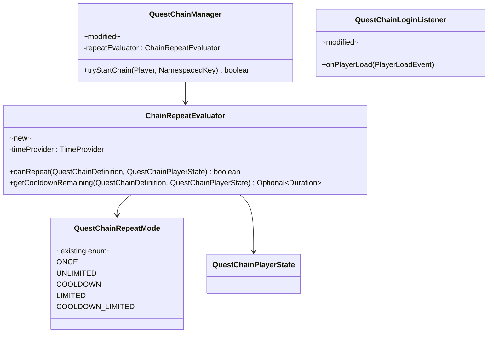
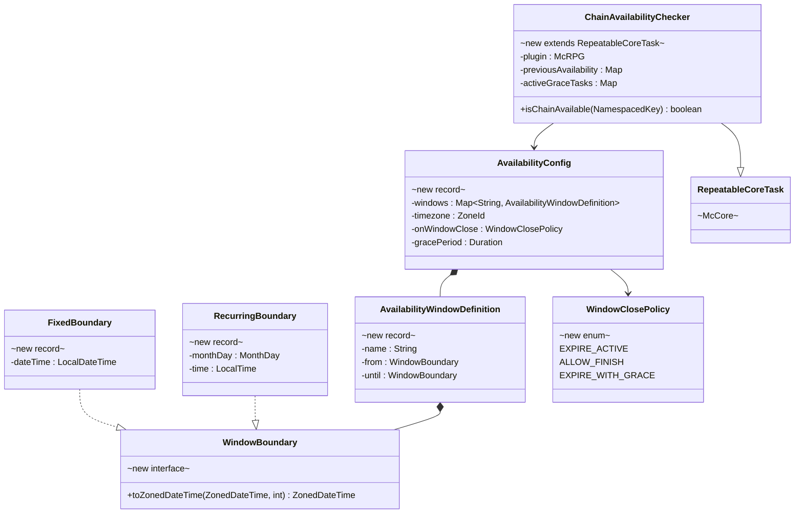
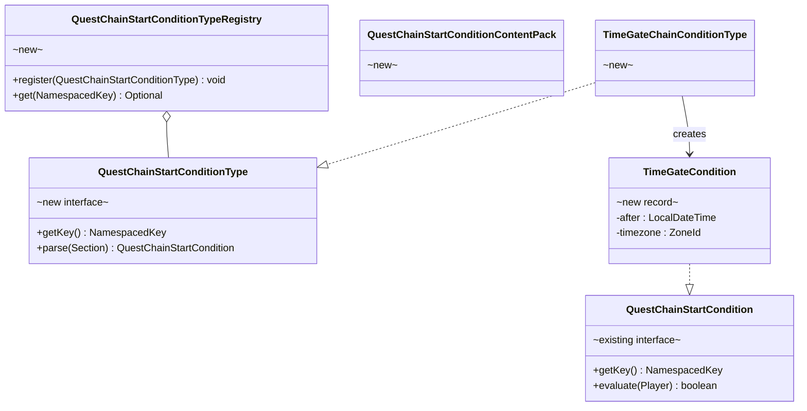

# Phase 4 LLD: Chain System Backlog

> **HLD Reference:** [docs/hld/tutorial/tutorial-quest-system.md](../../hld/tutorial/tutorial-quest-system.md)
> **Backlog:** [chain-system-backlog.md](../../hld/tutorial/chain-system-backlog.md)
> **Phase 2 LLD:** [phase-2-quest-chain-system.md](phase-2-quest-chain-system.md) (implemented)
> **Phase 3 LLD:** [phase-3-tutorial-content.md](phase-3-tutorial-content.md) (implemented)
> **Status:** Not Started

## Scope

Phase 4 delivers all remaining backlog items from `chain-system-backlog.md`: functional repeat modes beyond `ONCE`, time-based availability windows for chains, board templates, and standalone quests, quest expiration behaviors (retry/restart-chain/skip), the first built-in `QuestChainStartCondition`, content introspection commands, timestamp modernization, reload safety fixes, and ability unregistration reversibility. This is a single LLD covering 13 backlog items with a unified implementation order.

**In scope:**
- Chain availability windows with three on-window-close policies (backlog §1)
- Chain repeat modes: `UNLIMITED`, `COOLDOWN`, `LIMITED`, `COOLDOWN_LIMITED` (backlog §2)
- Quest expiration behaviors within chains: `retry`, `restart-chain`, `skip` (backlog §3)
- Availability windows on quest board templates (backlog §4)
- Availability windows on standalone quest definitions (gates `QuestManager.startQuest()`)
- Chain lifecycle events: `QuestChainExpireEvent`, `QuestChainRestartEvent`, `QuestChainStepRetryEvent` (backlog §5)
- `TimeGateChainCondition` — first built-in `QuestChainStartCondition` + wiring (backlog §6)
- Content expansion introspection commands (backlog §7)
- Timestamp refactor: `Long` epoch millis → `Instant` across quest/chain APIs (backlog §8)
- AbilityType refactor deferred items (backlog §9)
- Quest reload — cancel stale instances on definition change (backlog §10)
- Quest reload — finished quest cache invalidation (backlog §11)
- Ability unregistration reversibility via soft-disable set (backlog §12)
- Tutorial bypass scope fix (backlog §13)

**Out of scope:**
- Per-chain `bypassable` YAML flag or custom `bypass-permission` field (not needed — bypass is tutorial-specific)
- New quest objective types or reward types
- GUI changes beyond what introspection commands require (chat-based output)

---

## Table of Contents

1. [Timestamp Refactor](#1-timestamp-refactor)
2. [Quest Reload Fixes](#2-quest-reload-fixes)
3. [Ability Unregistration Reversibility](#3-ability-unregistration-reversibility)
4. [Tutorial Bypass Scope Fix](#4-tutorial-bypass-scope-fix)
5. [AbilityType Refactor Deferred Items](#5-abilitytype-refactor-deferred-items)
6. [Chain Repeatability](#6-chain-repeatability)
7. [Availability Windows](#7-availability-windows)
8. [Quest Expiration Behaviors](#8-quest-expiration-behaviors)
9. [Chain Start Conditions and TimeGateChainCondition](#9-chain-start-conditions-and-timegatechaincondition)
10. [Chain Lifecycle Events](#10-chain-lifecycle-events)
11. [Content Introspection Commands](#11-content-introspection-commands)
12. [Implementation Order](#12-implementation-order)
13. [New Files Summary](#13-new-files-summary)
14. [Modified Files Summary](#14-modified-files-summary)
15. [Resolved Questions](#15-resolved-questions)

---

## 1. Timestamp Refactor

**Backlog reference:** §8

Migrate all quest and chain timestamp fields from `Long` (epoch millis) to `Instant`. The SQL schema retains `BIGINT` columns — conversion happens at the Java boundary. `TimeProvider.now()` already returns `Instant`, so most callsites simplify.

### 1.1 `QuestInstance` Timestamp Changes

**File:** `src/main/java/us/eunoians/mcrpg/quest/impl/QuestInstance.java`

| Field | Before | After |
|-------|--------|-------|
| `startTime` | `Long` | `Instant` |
| `endTime` | `Long` | `Instant` |
| `expirationTime` | `Long` | `Instant` |

```java
private Instant startTime;
private Instant endTime;
private Instant expirationTime;

@NotNull public Optional<Instant> getStartTime() { return Optional.ofNullable(startTime); }
@NotNull public Optional<Instant> getEndTime() { return Optional.ofNullable(endTime); }
@NotNull public Optional<Instant> getExpirationTime() { return Optional.ofNullable(expirationTime); }
```

**Expiration calculation** (currently in constructor):

```java
// Before
long now = McRPG.getInstance().getTimeProvider().now().toEpochMilli();
this.expirationTime = now + expiration.toMillis();

// After
Instant now = McRPG.getInstance().getTimeProvider().now();
this.expirationTime = now.plus(expiration);
```

**Activation** (`activate()` method): `this.startTime = plugin.getTimeProvider().now();`

**Completion** (`markAsCompleted()` method): `this.endTime = plugin.getTimeProvider().now();`

### 1.2 `QuestChainPlayerState` Timestamp Changes

**File:** `src/main/java/us/eunoians/mcrpg/quest/chain/QuestChainPlayerState.java`

| Field | Before | After |
|-------|--------|-------|
| `lastCompletedAt` | `Long` | `Instant` |

```java
private Instant lastCompletedAt;

@NotNull public Optional<Instant> getLastCompletedAt() { return Optional.ofNullable(lastCompletedAt); }

public void complete(@NotNull Instant completedAt) {
    this.state = QuestChainState.COMPLETED;
    this.currentQuestKey = null;
    this.completionCount++;
    this.lastCompletedAt = completedAt;
    dirtyVersion.incrementAndGet();
}
```

### 1.3 DAO Boundary Conversions

All DAOs continue to use `BIGINT` in SQL. Conversions happen in the Java read/write methods:

**Read pattern:**
```java
long millis = resultSet.getLong("start_time");
Instant startTime = resultSet.wasNull() ? null : Instant.ofEpochMilli(millis);
```

**Write pattern:**
```java
if (startTime != null) {
    statement.setLong(index, startTime.toEpochMilli());
} else {
    statement.setNull(index, Types.BIGINT);
}
```

**Affected DAOs:**
- `QuestInstanceDAO` — `startTime`, `endTime`, `expirationTime`
- `QuestChainStateDAO` — `lastCompletedAt`
- `QuestChainCompletionLogDAO` — `completedAt` parameter

### 1.4 Caller Migration

All callsites that pass `System.currentTimeMillis()` or `TimeProvider.now().toEpochMilli()` → pass `TimeProvider.now()` directly (returns `Instant`).

| Callsite | Before | After |
|----------|--------|-------|
| `QuestChainManager.completeChain()` | `complete(System.currentTimeMillis())` | `complete(plugin.getTimeProvider().now())` |
| `QuestChainManager.advanceChain()` | `System.currentTimeMillis()` for log entries | `plugin.getTimeProvider().now()` |
| `QuestInstance` constructor | `now.toEpochMilli()` | `now` directly |
| `QuestInstance.activate()` | `System.currentTimeMillis()` | `plugin.getTimeProvider().now()` |

### 1.5 Cooldown Math Simplification

Used by §6 (Chain Repeatability):

```java
// Before (raw subtraction)
long elapsed = System.currentTimeMillis() - lastCompletedAt;
boolean cooldownMet = elapsed >= repeatCooldown.toMillis();

// After
Duration elapsed = Duration.between(lastCompletedAt, Instant.now());
boolean cooldownMet = elapsed.compareTo(repeatCooldown) >= 0;
```

### 1.6 Tests

- `QuestInstanceTimestampTest` — verify `Instant` getters, expiration calculation, and `Optional.empty()` for unset fields
- `QuestChainPlayerStateTimestampTest` — verify `complete(Instant)`, `getLastCompletedAt()`
- Update all existing tests that construct `QuestInstance` or `QuestChainPlayerState` with `Long` timestamps to use `Instant`

---

## 2. Quest Reload Fixes

**Backlog references:** §10 (active instance reconciliation), §11 (cache invalidation)

### 2.1 Finished Quest Cache Invalidation (§11)

**File:** `src/main/java/us/eunoians/mcrpg/quest/QuestManager.java`

One-line fix: call `cachedFinishedQuests.invalidateAll()` at the start of `loadQuestDefinitions()`, before `replaceConfigDefinitions()`. The cache is a performance optimization; invalidation forces a DB re-read on next access.

```java
public void loadQuestDefinitions() {
    cachedFinishedQuests.invalidateAll();
    // ... existing loading logic ...
}
```

### 2.2 Active Instance Staleness on Reload (§10)

**Approach:** Accept staleness — preserve the original HLD design. Active quest instances keep running with the definition snapshot they were created from. The registry is updated for new quest starts, but existing instances are not cancelled or reconciled.

This is the explicit design from the quest system HLD:

> Active quest instances keep running (they reference definitions by key; if a definition is removed, warn in console but don't kill active instances).

**Rationale:** Cancelling active instances during a reload disrupts actively playing users. Instances carry their own objective thresholds and state set at creation time, so they remain internally consistent even when the registry changes. Progress listeners already resolve definitions from the registry at runtime and silently skip progress if the definition is absent — the only missing piece is a console warning.

**File:** `src/main/java/us/eunoians/mcrpg/quest/QuestManager.java`

Add a `warnStaleDefinitions()` method called from `loadQuestDefinitions()` after `replaceConfigDefinitions()`:

```java
public void loadQuestDefinitions() {
    cachedFinishedQuests.invalidateAll();

    // ... existing loading logic ...

    questDefinitionRegistry.replaceConfigDefinitions(allDefinitions);

    warnStaleDefinitions(allDefinitions);
    enforceTierableAbilityUpgradeQuestConfiguration();

    // ... chain loading and re-resolution ...
}
```

```java
/**
 * Logs a console warning for each active quest instance whose definition
 * key is no longer present in the registry after a reload. Active instances
 * are NOT cancelled — they continue running with their creation-time
 * definition snapshot. Progress listeners already handle the missing-
 * definition case by silently skipping progress.
 *
 * @param newDefinitions the post-reload definition map
 */
private void warnStaleDefinitions(
        @NotNull Map<NamespacedKey, QuestDefinition> newDefinitions) {

    for (Map.Entry<UUID, QuestInstance> entry : activeQuests.entrySet()) {
        QuestInstance instance = entry.getValue();
        NamespacedKey questKey = instance.getQuestDefinition().getQuestKey();

        if (!newDefinitions.containsKey(questKey)) {
            plugin().getLogger().warning("[QuestManager] Active quest instance '"
                    + questKey + "' for player " + entry.getKey()
                    + " references a definition that was removed during reload. "
                    + "The instance will continue running with its original "
                    + "definition but new progress will not be tracked.");
        }
    }
}
```

No player-facing notification is sent — the quest continues silently with its snapshot. The console warning alerts the server owner that a definition was removed while instances are still active.

### 2.3 Tests

- `QuestCacheInvalidationTest` — verify `cachedFinishedQuests.invalidateAll()` is called on reload
- `WarnStaleDefinitionsTest` — verify console warning is logged for removed definitions, no warning for unchanged definitions, and no active instances are cancelled

---

## 3. Ability Unregistration Reversibility

**Backlog reference:** §12

**Approach:** Track soft-disabled abilities in `AbilityRegistry` instead of permanently unregistering them. On reload, attempt re-registration if the required quest definition is restored.

### 3.1 `AbilityRegistry` Changes

**File:** `src/main/java/us/eunoians/mcrpg/ability/AbilityRegistry.java`

Add a `softDisabledAbilities` set that retains `Ability` instances removed due to missing upgrade quest definitions. These abilities are removed from the active registry (so they don't appear in loadouts or activate) but are tracked for re-registration.

```java
/**
 * Abilities removed from the active registry because their required upgrade
 * quest definition was missing at load time. Retained for re-registration
 * on reload if the quest definition reappears.
 */
private final Map<NamespacedKey, Ability> softDisabledAbilities = new LinkedHashMap<>();

/**
 * Soft-disables an ability by removing it from the active registry and
 * retaining it in the soft-disabled set. Fires {@link AbilityUnregisterEvent}.
 *
 * @param abilityKey the ability key to soft-disable
 */
public void softDisableAbility(@NotNull NamespacedKey abilityKey) {
    Ability ability = abilities.remove(abilityKey);
    if (ability == null) {
        return;
    }
    if (ability instanceof SkillAbility skillAbility) {
        // cleanup skill associations (same as unregisterAbility)
    } else {
        abilitiesWithoutSkills.remove(abilityKey);
    }
    softDisabledAbilities.put(abilityKey, ability);
    Bukkit.getPluginManager().callEvent(new AbilityUnregisterEvent(ability));
}

/**
 * Returns all soft-disabled abilities for re-registration evaluation.
 *
 * @return unmodifiable view of soft-disabled abilities
 */
@NotNull
public Map<NamespacedKey, Ability> getSoftDisabledAbilities() {
    return Collections.unmodifiableMap(softDisabledAbilities);
}

/**
 * Re-registers a previously soft-disabled ability. Removes it from the
 * soft-disabled set and adds it back to the active registry.
 *
 * @param abilityKey the ability key to re-register
 * @return true if the ability was re-registered, false if not found in soft-disabled set
 */
public boolean reEnableAbility(@NotNull NamespacedKey abilityKey) {
    Ability ability = softDisabledAbilities.remove(abilityKey);
    if (ability == null) {
        return false;
    }
    register(ability);
    return true;
}
```

### 3.2 `QuestManager.enforceTierableAbilityUpgradeQuestConfiguration()` Changes

**File:** `src/main/java/us/eunoians/mcrpg/quest/QuestManager.java`

Replace `unregisterAbility()` with `softDisableAbility()`:

```java
private void enforceTierableAbilityUpgradeQuestConfiguration() {
    AbilityRegistry abilityRegistry = RegistryAccess.registryAccess()
            .registry(McRPGRegistryKey.ABILITY);

    // Re-enable pass: check soft-disabled abilities whose quest definitions may have returned
    for (NamespacedKey abilityKey : new ArrayList<>(abilityRegistry.getSoftDisabledAbilities().keySet())) {
        Ability ability = abilityRegistry.getSoftDisabledAbilities().get(abilityKey);
        if (!(ability instanceof TierableAbility tierableAbility)) {
            continue;
        }
        Optional<QuestDefinition> defOpt = resolveUpgradeQuestDefinition(tierableAbility, 2);
        if (defOpt.isPresent()) {
            abilityRegistry.reEnableAbility(abilityKey);
            plugin().getLogger().info("[QuestManager] Re-enabled ability '"
                    + abilityKey + "' — upgrade quest definition restored");
        }
    }

    // Disable pass: check active abilities whose quest definitions are missing
    for (NamespacedKey abilityKey : new ArrayList<>(abilityRegistry.getAllAbilities())) {
        Ability ability = abilityRegistry.getRegisteredAbility(abilityKey);
        if (!(ability instanceof TierableAbility tierableAbility)) {
            continue;
        }
        if (tierableAbility.getMaxTier() < 2) {
            continue;
        }
        Optional<QuestDefinition> defOpt = resolveUpgradeQuestDefinition(tierableAbility, 2);
        if (defOpt.isEmpty()) {
            abilityRegistry.softDisableAbility(abilityKey);
            plugin().getLogger().warning("[QuestManager] Soft-disabled ability '"
                    + abilityKey + "' — upgrade quest definition not found. "
                    + "Fix the quest YAML and run /mcrpg admin reload to restore.");
        }
    }
}
```

**Key change:** The re-enable pass runs FIRST, before the disable pass. This handles the case where a server owner fixes a YAML file and reloads — the ability is re-enabled before any new disable checks run.

### 3.3 Tests

- `AbilityRegistrySoftDisableTest` — verify `softDisableAbility()`, `reEnableAbility()`, `getSoftDisabledAbilities()`
- `AbilityReEnableOnReloadTest` — verify the re-enable pass in `enforceTierableAbilityUpgradeQuestConfiguration()` restores abilities when quest definitions reappear

---

## 4. Tutorial Bypass Scope Fix

**Backlog reference:** §13

Two complementary mechanisms for disabling the tutorial:

1. **Server-wide config toggle** (`tutorial.enabled` in `config.yml`) — already implemented in Phase 3. When `false`, the tutorial chain is never started for any player. This section documents the interaction with the bypass permission and ensures the config check is evaluated before the permission check.
2. **Per-player bypass permission** (`mcrpg.tutorial.bypass`) — allows individual players to skip the tutorial while it remains enabled server-wide (e.g., for experienced players or alt accounts).

The bypass permission should only apply to the built-in tutorial chain, not to any chain that happens to use the tutorial source. The current implementation checks `chain.getSourceKey()` against `TutorialQuestSource.KEY`. For correctness and future-proofing, change the check to reference the tutorial chain key constant directly.

### 4.1 `QuestChainFirstJoinListener` Change

**File:** `src/main/java/us/eunoians/mcrpg/listener/quest/QuestChainFirstJoinListener.java`

```java
// Before
private boolean shouldBypassChain(@NotNull Player player, @NotNull QuestChainDefinition chain) {
    return TutorialQuestSource.KEY.equals(chain.getSourceKey())
            && player.hasPermission("mcrpg.tutorial.bypass");
}

// After — config toggle check + chain-key-based bypass
private static final NamespacedKey TUTORIAL_CHAIN_KEY =
        new NamespacedKey(McRPGMethods.getMcRPGNamespace(), "tutorial_chain");

private boolean shouldBypassChain(@NotNull Player player, @NotNull QuestChainDefinition chain) {
    if (!TUTORIAL_CHAIN_KEY.equals(chain.getChainKey())) {
        return false;
    }
    // Server-wide toggle (tutorial.enabled in config.yml) takes precedence
    if (!isTutorialEnabled()) {
        return true;
    }
    // Per-player permission bypass
    return player.hasPermission("mcrpg.tutorial.bypass");
}
```

No other changes needed. The bypass is intentionally hardcoded to the tutorial chain. Per-chain bypass infrastructure is explicitly out of scope.

### 4.2 Config Reference

The `tutorial.enabled` config route already exists from Phase 3. `isTutorialEnabled()` reads it via `MainConfigFile.TUTORIAL_ENABLED`. When `false`, `shouldBypassChain` returns `true` for the tutorial chain regardless of player permissions.

---

## 5. AbilityType Refactor Deferred Items

**Backlog reference:** §9

Three sub-items from the AbilityType enum refactor audit. None are regressions.

### 5.1 `LoadoutHolder.getAvailableDefaultAbilities()` Partial Migration

**File:** `src/main/java/us/eunoians/mcrpg/entity/holder/LoadoutHolder.java`

`getAvailableDefaultAbilities()` is a private method with semantically different intent — it returns non-unlockable abilities (always available, not gated by skill level). Migrating it to use `AbilityType` would change its filtering behavior because `AbilityType` classifies by activation pattern, not by unlock gating. Tierability is also orthogonal — a tierable ability could still be always-available if it has no unlock gate.

**Change:** Extract the "non-unlockable" concept into a dedicated predicate method on `Ability`. The check is purely about the unlock attribute — tierability is irrelevant:

```java
/**
 * Returns whether this ability is always available to its holder without
 * requiring an explicit unlock (e.g., innate abilities that are granted
 * at skill level 0). Distinct from {@code AbilityType} which classifies
 * by activation pattern, and from {@code TierableAbility} which controls
 * tier progression.
 *
 * @return true if this ability does not require unlocking
 */
default boolean isAlwaysAvailable() {
    return !AbilityData.hasAttribute(this, AbilityData.ABILITY_UNLOCKED_ATTRIBUTE);
}
```

Then `getAvailableDefaultAbilities()` uses `ability.isAlwaysAvailable()` instead of its current inline filter logic. This makes the intent explicit without conflating it with `AbilityType` or `TierableAbility`.

### 5.2 `resolveAbilityName` Inline Cleanup

**File:** `src/main/java/us/eunoians/mcrpg/quest/objective/type/builtin/AbilityObjectiveFilter.java`

`Ability` already provides `getDisplayName(McRPGPlayer)` and `getDisplayName()`. The inline `resolveAbilityName` in the filter should call the existing method instead of re-implementing name resolution. No new class needed — just replace the inline logic with a call to `ability.getDisplayName()` on the resolved ability.

### 5.3 New `LoadoutHolder` / Filter Tests

**New test files:**

| File | Covers |
|------|--------|
| `LoadoutHolderAvailableAbilitiesTest` | `getAvailableActiveAbilities()`, `getAvailableDefaultAbilities()`, `isAlwaysAvailable()` |
| `PassiveAbilityFilterTest` | Filter matching with various `AbilityType` and ability key combinations |
| `ActiveAbilityFilterTest` | Filter matching with various `AbilityType` and ability key combinations |

Tests use `McRPGBaseTest` with mocked abilities and loadout holders.

---

## 6. Chain Repeatability

**Backlog reference:** §2

Makes repeat modes beyond `ONCE` functional. The `QuestChainRepeatMode` enum and `QuestChainPlayerState` schema columns (`completion_count`, `last_completed_at`) already exist from Phase 2.

### 6.1 Class Diagram



### 6.2 `ChainRepeatEvaluator` — Repeat Eligibility Logic

**Package:** `us.eunoians.mcrpg.quest.chain`
**File:** `src/main/java/us/eunoians/mcrpg/quest/chain/ChainRepeatEvaluator.java`

Named `ChainRepeatEvaluator` (not `RepeatEvaluator`) to clearly scope it to the chain system. The quest board has structurally similar repeat logic (`QuestRepeatMode` shares the same mode names) but uses different state shapes — board cooldowns are tracked per-slot via `BoardCooldownDAO`, while chain cooldowns use `QuestChainPlayerState.lastCompletedAt`. The boolean evaluation math (mode + count + cooldown → can-repeat) is identical, but extracting a shared utility now would require retrofitting the board's inline logic for marginal gain. If a third repeat context appears, factor out a shared `RepeatEligibility` utility then.

Stateless collaborator owned by `QuestChainManager`. Extracted to keep repeat logic testable without needing a full manager.

```java
/**
 * Evaluates whether a chain in a terminal state is eligible for repeat re-start
 * based on the chain definition's repeat mode, cooldown, and completion limits.
 */
public class ChainRepeatEvaluator {

    private final TimeProvider timeProvider;

    public ChainRepeatEvaluator(@NotNull TimeProvider timeProvider) {
        this.timeProvider = timeProvider;
    }

    /**
     * Determines whether a chain can be re-started for a player based on
     * the chain's repeat mode and the player's chain state.
     *
     * @param definition the chain definition
     * @param state      the player's current chain state (must be terminal)
     * @return true if the chain can be re-started
     */
    public boolean canRepeat(@NotNull QuestChainDefinition definition,
                             @NotNull QuestChainPlayerState state) {
        if (!state.getState().isTerminal() || !state.getState().isRepeatEligible()) {
            return false;
        }

        return switch (definition.getRepeatMode()) {
            case ONCE -> false;
            case UNLIMITED -> true;
            case COOLDOWN -> isCooldownMet(definition, state);
            case LIMITED -> isUnderLimit(definition, state);
            case COOLDOWN_LIMITED -> isCooldownMet(definition, state)
                    && isUnderLimit(definition, state);
        };
    }

    /**
     * Returns the remaining cooldown duration, or empty if no cooldown applies
     * or the cooldown has elapsed.
     *
     * @param definition the chain definition
     * @param state      the player's chain state
     * @return remaining cooldown, or empty
     */
    @NotNull
    public Optional<Duration> getCooldownRemaining(@NotNull QuestChainDefinition definition,
                                                    @NotNull QuestChainPlayerState state) {
        if (definition.getRepeatCooldown() == null) {
            return Optional.empty();
        }
        return state.getLastCompletedAt().map(lastCompleted -> {
            Duration elapsed = Duration.between(lastCompleted, timeProvider.now());
            Duration remaining = definition.getRepeatCooldown().minus(elapsed);
            return remaining.isNegative() ? null : remaining;
        });
    }

    private boolean isCooldownMet(@NotNull QuestChainDefinition definition,
                                   @NotNull QuestChainPlayerState state) {
        Duration cooldown = definition.getRepeatCooldown();
        if (cooldown == null) {
            return true;
        }
        return state.getLastCompletedAt()
                .map(last -> Duration.between(last, timeProvider.now()).compareTo(cooldown) >= 0)
                .orElse(true);
    }

    private boolean isUnderLimit(@NotNull QuestChainDefinition definition,
                                  @NotNull QuestChainPlayerState state) {
        int max = definition.getMaxCompletions();
        return max < 0 || state.getCompletionCount() < max;
    }
}
```

### 6.3 `QuestChainManager.tryStartChain()` Changes

**File:** `src/main/java/us/eunoians/mcrpg/quest/chain/QuestChainManager.java`

Replace the current repeat-mode stub (which blocks all terminal states for non-ONCE chains) with actual `ChainRepeatEvaluator` evaluation:

```java
// Current (Phase 2 — lines 125-130):
if (state.getState().isTerminal() && definition.getRepeatMode() == QuestChainRepeatMode.ONCE) {
    return false;
}
if (state.getState().isTerminal() && state.getState().isRepeatEligible()) {
    return false;  // stub: blocks all non-ONCE repeat-eligible terminals
}

// After:
if (state.getState().isTerminal()) {
    if (!repeatEvaluator.canRepeat(definition, state)) {
        return false;
    }
    // Repeat allowed — reset state for new run
    state.resetToStep(definition.getSteps().getFirst().questKey());
    // completionCount is NOT reset — it tracks lifetime completions
    // lastCompletedAt is preserved for future cooldown checks
}
```

### 6.4 Re-Start Flow

When a chain in a terminal state is re-started:

1. `tryStartChain` detects terminal + repeat-eligible + `canRepeat() == true`
2. State is reset: `state.resetToStep(firstStep.questKey())` sets `state = ACTIVE`, `currentQuestKey = firstStep.questKey()`
3. Fire `QuestChainRestartEvent` (see §10)
4. Start first step quest via `QuestManager`
5. Persist state async
6. Completion log entries from previous runs are retained (historical record, keyed by `completion_number`)

### 6.5 `QuestChainLoginListener` Changes

**File:** `src/main/java/us/eunoians/mcrpg/listener/quest/QuestChainLoginListener.java`

The login listener already evaluates login-triggered chains. The existing `tryStartChain` call handles repeat evaluation automatically after the manager changes above. No listener changes needed beyond what `tryStartChain` now handles internally.

### 6.6 Tests

- `ChainRepeatEvaluatorTest` — all 5 repeat modes with various state combinations:
  - `ONCE` → always false
  - `UNLIMITED` → true for all terminal states
  - `COOLDOWN` → false when within cooldown, true after cooldown elapses
  - `LIMITED` → false when at max completions, true when under
  - `COOLDOWN_LIMITED` → both conditions must pass
  - Verify ABANDONED is repeat-eligible for non-ONCE chains
- `ChainRepeatIntegrationTest` — verify `tryStartChain` resets state and starts first step on repeat

---

## 7. Availability Windows

**Backlog references:** §1 (chain windows), §4 (board template windows)

### 7.1 Class Diagram



### 7.2 `WindowBoundary` — Extensible Boundary Type

**Package:** `us.eunoians.mcrpg.quest.chain.availability`
**File:** `src/main/java/us/eunoians/mcrpg/quest/chain/availability/WindowBoundary.java`

The interface is **not sealed** — third-party plugins may implement custom boundary types (e.g., a boundary that resolves from an external calendar API or a cron expression). The two built-in implementations (`Fixed` and `Recurring`) cover the common cases:

- **`Fixed`** — A one-time boundary with a specific date and time (includes year). Use for events that happen exactly once, like a server launch celebration or a one-time promotional event. Once the date passes, the window is permanently closed.
- **`Recurring`** — A yearly repeating boundary defined by month-day and time (no year). Use for seasonal or holiday events that repeat every year without config changes. The YAML format uses a `--` prefix to indicate no year (e.g., `--12-01T00:00:00`).

```java
/**
 * Represents one boundary (start or end) of an availability window.
 * Fixed boundaries have a specific year; recurring boundaries repeat yearly.
 * Third-party plugins may implement custom boundary types for advanced
 * scheduling needs (e.g., cron-based or external-calendar-driven boundaries).
 */
public interface WindowBoundary {

    /**
     * Resolves this boundary to a concrete {@link ZonedDateTime} in the context
     * of the given reference time. Fixed boundaries ignore the reference year.
     * Recurring boundaries resolve to the given year.
     *
     * @param referenceNow the current time for year context
     * @param yearOffset   offset from the reference year (0 = same year, 1 = next year)
     * @return the resolved datetime
     */
    @NotNull
    ZonedDateTime toZonedDateTime(@NotNull ZonedDateTime referenceNow, int yearOffset);

    /**
     * A one-time boundary at a specific date and time (includes year).
     * Once the date passes, the window is permanently closed.
     *
     * @param dateTime the specific date and time for this boundary
     */
    record Fixed(@NotNull LocalDateTime dateTime) implements WindowBoundary {
        @Override
        @NotNull
        public ZonedDateTime toZonedDateTime(@NotNull ZonedDateTime referenceNow, int yearOffset) {
            return dateTime.atZone(referenceNow.getZone());
        }
    }

    /**
     * A yearly repeating boundary defined by month-day and time (no year).
     * Resolves to the reference year plus the given offset, enabling
     * year-wrapping windows (e.g., December 1 to January 3).
     *
     * @param monthDay the month and day for this boundary
     * @param time     the time of day for this boundary
     */
    record Recurring(@NotNull MonthDay monthDay, @NotNull LocalTime time) implements WindowBoundary {
        @Override
        @NotNull
        public ZonedDateTime toZonedDateTime(@NotNull ZonedDateTime referenceNow, int yearOffset) {
            int year = referenceNow.getYear() + yearOffset;
            return monthDay.atYear(year).atTime(time).atZone(referenceNow.getZone());
        }
    }
}
```

### 7.3 `AvailabilityWindowDefinition` — Named Window

**Package:** `us.eunoians.mcrpg.quest.chain.availability`
**File:** `src/main/java/us/eunoians/mcrpg/quest/chain/availability/AvailabilityWindowDefinition.java`

```java
/**
 * A named time window with a start and end boundary. Handles year-wrapping
 * for recurring windows (e.g., December 1 to January 3).
 *
 * @param name  server-owner-defined name for this window
 * @param from  the window start boundary
 * @param until the window end boundary
 */
public record AvailabilityWindowDefinition(
        @NotNull String name,
        @NotNull WindowBoundary from,
        @NotNull WindowBoundary until
) {

    /**
     * Checks whether the given time falls within this window.
     * For recurring windows that wrap around the year (e.g., Dec 1 to Jan 3):
     * resolves both boundaries in the reference year first. If from > until
     * in the same year, the window wraps: {@code now >= from || now <= until}.
     *
     * @param now      the current time in the window's timezone
     * @return true if the current time is within the window
     */
    public boolean isActive(@NotNull ZonedDateTime now) { ... }
}
```

**Year-wrapping logic for recurring windows:**

```java
public boolean isActive(@NotNull ZonedDateTime now) {
    ZonedDateTime start = from.toZonedDateTime(now, 0);
    ZonedDateTime end = until.toZonedDateTime(now, 0);

    if (!start.isAfter(end)) {
        // Normal range: from <= now <= until
        return !now.isBefore(start) && !now.isAfter(end);
    } else {
        // Year-wrapping range (e.g., Dec 1 to Jan 3): now >= from OR now <= until
        return !now.isBefore(start) || !now.isAfter(end);
    }
}
```

### 7.4 `AvailabilityConfig` — Chain/Template Availability Configuration

**Package:** `us.eunoians.mcrpg.quest.chain.availability`
**File:** `src/main/java/us/eunoians/mcrpg/quest/chain/availability/AvailabilityConfig.java`

```java
/**
 * Configuration for time-based availability on a chain or board template.
 *
 * @param windows       named windows (at least one required)
 * @param timezone      the timezone for evaluating window boundaries
 * @param onWindowClose policy for active instances when the window closes
 *                      (only applicable to chains, ignored for board templates)
 * @param gracePeriod   grace period duration for {@code EXPIRE_WITH_GRACE} policy
 *                      (null unless policy is EXPIRE_WITH_GRACE)
 */
public record AvailabilityConfig(
        @NotNull Map<String, AvailabilityWindowDefinition> windows,
        @NotNull ZoneId timezone,
        @NotNull WindowClosePolicy onWindowClose,
        @Nullable Duration gracePeriod
) {

    /**
     * Checks whether any window in this config is currently active.
     *
     * @return true if at least one window is active
     */
    public boolean isCurrentlyAvailable() {
        ZonedDateTime now = ZonedDateTime.now(timezone);
        return windows.values().stream().anyMatch(w -> w.isActive(now));
    }
}
```

### 7.5 `WindowClosePolicy` Enum

**Package:** `us.eunoians.mcrpg.quest.chain.availability`
**File:** `src/main/java/us/eunoians/mcrpg/quest/chain/availability/WindowClosePolicy.java`

```java
public enum WindowClosePolicy {

    EXPIRE_ACTIVE,
    ALLOW_FINISH,
    EXPIRE_WITH_GRACE;

    @NotNull
    public static Optional<WindowClosePolicy> fromString(@NotNull String value) {
        try {
            return Optional.of(valueOf(value.toUpperCase().replace('-', '_')));
        } catch (IllegalArgumentException e) {
            return Optional.empty();
        }
    }
}
```

### 7.6 `ChainAvailabilityChecker` — Scheduled Task

**Package:** `us.eunoians.mcrpg.quest.chain.availability`
**File:** `src/main/java/us/eunoians/mcrpg/quest/chain/availability/ChainAvailabilityChecker.java`

Extends `RepeatableCoreTask` to use McCore's task system for state tracking, pause/resume, and consistent second-based timing. Checks chain availability windows at a configurable interval (default 60 seconds). When a window closes, applies the configured `WindowClosePolicy` to active chain instances.

```java
/**
 * Scheduled task that checks chain availability windows at a configurable
 * interval. When a window closes, applies the configured
 * {@link WindowClosePolicy} to all active chain instances.
 *
 * <p>Extends {@link RepeatableCoreTask} to use McCore's task system for
 * state tracking, pause/resume, and consistent second-based timing.
 */
public class ChainAvailabilityChecker extends RepeatableCoreTask {

    private final McRPG plugin;
    private final Map<NamespacedKey, Boolean> previousAvailability = new HashMap<>();
    private final Map<NamespacedKey, Integer> activeGraceTasks = new HashMap<>();

    /**
     * Constructs a new availability checker.
     *
     * @param plugin          the plugin instance
     * @param checkIntervalSeconds the interval in seconds between availability checks
     */
    public ChainAvailabilityChecker(@NotNull McRPG plugin, double checkIntervalSeconds) {
        super(plugin, 0, checkIntervalSeconds);
        this.plugin = plugin;
    }

    /**
     * Called when the initial delay completes (delay is 0, so this fires
     * immediately). Performs startup reconciliation to detect windows that
     * closed while the server was offline.
     */
    @Override
    protected void onDelayComplete() {
        reconcileOnStartup();
    }

    /**
     * Called at the start of each check interval. No-op — all work is done
     * on interval completion.
     */
    @Override
    protected void onIntervalStart() {
        // No-op
    }

    /**
     * Called at the end of each interval. Checks all chains with availability
     * configs, detects window transitions (open → closed, closed → open),
     * and applies the appropriate policy.
     */
    @Override
    protected void onIntervalComplete() {
        checkAllChains();
    }

    /**
     * Called when the task is paused. Cancels any pending grace period tasks.
     */
    @Override
    protected void onIntervalPause() {
        activeGraceTasks.values().forEach(id -> Bukkit.getScheduler().cancelTask(id));
        activeGraceTasks.clear();
    }

    /**
     * Called when the task is resumed. Re-snapshots current availability state
     * so the first post-resume check detects transitions correctly.
     */
    @Override
    protected void onIntervalResume() {
        snapshotCurrentAvailability();
    }

    /**
     * Detects windows that closed while the server was offline and applies
     * the configured close policy. Called once on task startup. Iterates all
     * chains with availability configs: if a chain is currently unavailable
     * but has active player states, the window must have closed during downtime.
     */
    private void reconcileOnStartup() { ... }

    /**
     * Checks all chains with availability configs. Detects window transitions
     * (open → closed, closed → open) and applies the appropriate policy.
     */
    private void checkAllChains() { ... }

    /**
     * Snapshots the current availability state of all chains with configs
     * into {@code previousAvailability}. Used on startup and resume to
     * establish a baseline for transition detection.
     */
    private void snapshotCurrentAvailability() { ... }

    /**
     * Applies the window-close policy to all active instances of a chain.
     *
     * @param chainKey   the chain key
     * @param definition the chain definition
     */
    private void applyWindowClosePolicy(@NotNull NamespacedKey chainKey,
                                         @NotNull QuestChainDefinition definition) {
        AvailabilityConfig config = definition.getAvailabilityConfig();
        switch (config.onWindowClose()) {
            case EXPIRE_ACTIVE -> expireActiveInstances(chainKey);
            case ALLOW_FINISH -> blockNewStarts(chainKey);
            case EXPIRE_WITH_GRACE -> startGracePeriod(chainKey, definition);
        }
    }

    /**
     * Expires all active instances of a chain across all online players.
     * Sets chain state to EXPIRED, cancels active quest instances, fires
     * {@link QuestChainExpireEvent}.
     *
     * @param chainKey the chain key to expire
     */
    private void expireActiveInstances(@NotNull NamespacedKey chainKey) { ... }

    /**
     * The ALLOW_FINISH policy does not cancel active instances. It only
     * blocks new starts — this is handled by {@code tryStartChain}'s
     * availability check. No active instance mutation needed.
     *
     * @param chainKey the chain key (unused — documented for policy completeness)
     */
    private void blockNewStarts(@NotNull NamespacedKey chainKey) {
        // No-op: tryStartChain already checks isChainAvailable()
    }

    /**
     * Starts a grace period for the chain. Sends warning messages to affected
     * players immediately. After the grace period, applies EXPIRE_ACTIVE.
     *
     * @param chainKey   the chain key
     * @param definition the chain definition (provides grace period duration)
     */
    private void startGracePeriod(@NotNull NamespacedKey chainKey,
                                   @NotNull QuestChainDefinition definition) { ... }

    /**
     * Public API for checking chain availability. Used by
     * {@link QuestChainManager#tryStartChain}.
     *
     * @param chainKey the chain key
     * @return true if the chain is currently available (no availability config,
     *         or at least one window is active)
     */
    public boolean isChainAvailable(@NotNull NamespacedKey chainKey) {
        QuestChainRegistry registry = plugin.registryAccess()
                .registry(McRPGRegistryKey.QUEST_CHAIN);
        return registry.get(chainKey)
                .map(def -> def.getAvailabilityConfig()
                        .map(AvailabilityConfig::isCurrentlyAvailable)
                        .orElse(true))
                .orElse(false);
    }
}
```

**Startup reconciliation:** When the server starts (or the task is created on reload), `reconcileOnStartup()` runs once in `onDelayComplete()`. It iterates all chains with availability configs: if a chain is currently unavailable but has online players with active chain states, the window closed during server downtime. The configured `WindowClosePolicy` is applied retroactively. For `EXPIRE_WITH_GRACE`, the grace period starts from the reconciliation time (not from when the window actually closed, since that time is unknown).

**Eviction strategy:** `previousAvailability` is bounded by the number of chains with availability configs (small, finite set defined by YAML). `activeGraceTasks` entries are removed when the grace period completes or the task is paused/stopped.

### 7.7 `QuestChainDefinition` Changes

**File:** `src/main/java/us/eunoians/mcrpg/quest/chain/QuestChainDefinition.java`

Add optional `AvailabilityConfig` field:

```java
private final AvailabilityConfig availabilityConfig;

/**
 * Returns the availability window configuration for this chain, if any.
 *
 * @return the availability config, or empty if the chain has no time restrictions
 */
@NotNull public Optional<AvailabilityConfig> getAvailabilityConfig() {
    return Optional.ofNullable(availabilityConfig);
}

// Builder addition:
private AvailabilityConfig availabilityConfig;

/**
 * Sets the availability window configuration for this chain.
 *
 * @param config the availability config, or null for no time restrictions
 * @return this builder
 */
@NotNull public Builder availabilityConfig(@Nullable AvailabilityConfig config) { ... }
```

### 7.8 `QuestChainManager.tryStartChain()` — Availability Check

Add availability check before repeat evaluation:

```java
// After resolving definition, before state check:
if (definition.getAvailabilityConfig()
        .map(config -> !config.isCurrentlyAvailable())
        .orElse(false)) {
    return false;
}
```

### 7.9 `QuestChainConfigLoader` — Availability Parsing

**File:** `src/main/java/us/eunoians/mcrpg/configuration/QuestChainConfigLoader.java`

Parse the `availability:` section from chain YAML:

```java
/**
 * Parses an availability configuration from a YAML section.
 *
 * @param section the "availability" YAML section
 * @param file    source file for error reporting
 * @return the parsed config, or null if invalid
 */
@Nullable
private static AvailabilityConfig parseAvailabilityConfig(
        @NotNull Section section, @NotNull File file) { ... }
```

**Window boundary parsing:**
- Strings starting with `--` (e.g., `--12-01T00:00:00`) → `RecurringBoundary`
- Full ISO-8601 strings (e.g., `2026-12-01T00:00:00`) → `FixedBoundary`
- Invalid formats → `WARNING` log, skip the window

### 7.10 YAML Schema (Chains)

```yaml
key: mcrpg:christmas_event
source: mcrpg:manual
repeat-mode: unlimited
auto-start:
  trigger: mcrpg:login
availability:
  windows:
    holiday-period:
      from: "--12-01T00:00:00"
      until: "--01-03T23:59:59"
  timezone: "America/New_York"
  on-window-close: expire-active
  grace-period: 48h
```

**Defaults:**
- `timezone`: server timezone (`ZoneId.systemDefault()`) if omitted
- `on-window-close`: `expire-active` if omitted
- `grace-period`: required only when `on-window-close` is `expire-with-grace`

### 7.11 Board Template Availability (§4)

**File:** `src/main/java/us/eunoians/mcrpg/quest/board/template/QuestTemplate.java`

Add optional `AvailabilityConfig` field to `QuestTemplate`:

```java
private final AvailabilityConfig availabilityConfig;

/**
 * Returns the availability window configuration for this template, if any.
 *
 * @return the availability config, or empty if the template has no time restrictions
 */
@NotNull public Optional<AvailabilityConfig> getAvailabilityConfig() {
    return Optional.ofNullable(availabilityConfig);
}
```

**File:** `src/main/java/us/eunoians/mcrpg/quest/board/generation/QuestPool.java`

Filter templates by availability before weighted selection:

```java
// In template selection logic, before adding to eligible pool:
if (template.getAvailabilityConfig()
        .map(config -> !config.isCurrentlyAvailable())
        .orElse(false)) {
    continue;
}
```

No on-window-close policy for board templates — they simply stop appearing in new rotations. Existing accepted quest instances follow normal quest expiration rules.

**YAML schema (templates):**

```yaml
templates:
  christmas_gathering:
    availability:
      windows:
        holiday:
          from: "--12-01T00:00:00"
          until: "--01-03T23:59:59"
      timezone: "America/New_York"
    # ... rest of template definition
```

### 7.12 Standalone Quest Availability

**File:** `src/main/java/us/eunoians/mcrpg/quest/definition/QuestDefinition.java`

Add optional `AvailabilityConfig` field to `QuestDefinition`:

```java
private final AvailabilityConfig availabilityConfig;

/**
 * Returns the availability window configuration for this quest, if any.
 * When present and no window is currently active, {@link QuestManager#startQuest}
 * will refuse to start new instances.
 *
 * @return the availability config, or empty if the quest has no time restrictions
 */
@NotNull public Optional<AvailabilityConfig> getAvailabilityConfig() {
    return Optional.ofNullable(availabilityConfig);
}

// Builder addition:
private AvailabilityConfig availabilityConfig;

/**
 * Sets the availability window configuration for this quest.
 *
 * @param config the availability config, or null for no time restrictions
 * @return this builder
 */
@NotNull public Builder availabilityConfig(@Nullable AvailabilityConfig config) { ... }
```

**File:** `src/main/java/us/eunoians/mcrpg/quest/QuestManager.java`

Add availability check at the top of `startQuest()` (the 4-parameter overload), before the `PreQuestStartEvent`:

```java
@NotNull
public Optional<QuestInstance> startQuest(@NotNull QuestDefinition definition,
                                          @NotNull UUID initialPlayerUUID,
                                          @NotNull Map<String, Object> variables,
                                          @NotNull QuestSource questSource) {
    // Availability window gate
    if (definition.getAvailabilityConfig()
            .map(config -> !config.isCurrentlyAvailable())
            .orElse(false)) {
        plugin().getLogger().info("[QuestManager] Quest '" + definition.getQuestKey()
                + "' is outside its availability window — start blocked.");
        return Optional.empty();
    }

    // ... existing PreQuestStartEvent, scope resolution, etc. ...
}
```

No `WindowClosePolicy` is applied to standalone quests — active instances follow their own expiration rules (the `expiration` `Duration` on `QuestDefinition`). When the window closes, the quest simply stops being startable. This is consistent with the board template approach and the "accept staleness" model from §2.2.

**YAML schema (quest definitions):**

```yaml
quests:
  christmas_delivery:
    key: mcrpg:christmas_delivery
    scope: mcrpg:single_player
    expiration: 168h
    availability:
      windows:
        holiday:
          from: "--12-01T00:00:00"
          until: "--01-03T23:59:59"
      timezone: "America/New_York"
    phases:
      # ... normal phase definition ...
```

The `on-window-close` and `grace-period` fields are ignored on standalone quests — those are chain-only settings. If present in quest YAML, the parser logs a warning and skips them.

**File:** `src/main/java/us/eunoians/mcrpg/configuration/QuestConfigLoader.java`

Parse the `availability:` section when loading quest definitions. Reuses the same `parseAvailabilityConfig()` helper from `QuestChainConfigLoader` — extract it to a shared static utility on `AvailabilityConfig` or a common loader helper:

```java
/**
 * Parses an availability configuration from a YAML section. Shared
 * between quest and chain config loaders.
 *
 * @param section the "availability" YAML section
 * @param file    source file for error reporting
 * @param logger  logger for warning messages
 * @return the parsed config, or null if invalid
 */
@Nullable
static AvailabilityConfig parseAvailabilityConfig(
        @NotNull Section section, @NotNull File file, @NotNull Logger logger) { ... }
```

### 7.14 Config Route

**File:** `src/main/java/us/eunoians/mcrpg/configuration/file/MainConfigFile.java`

```java
public static final Route AVAILABILITY_CHECK_INTERVAL_SECONDS =
        Route.fromString("quest-chain.availability.check-interval-seconds");
```

**`config.yml` addition:**

```yaml
quest-chain:
  availability:
    check-interval-seconds: 60
```

### 7.15 Locale Keys

| Key | Text |
|-----|------|
| `quest-chain.availability.grace-period-warning` | `"<warning>The '<primary><chain_name></primary>' event is ending soon! You have <primary><duration></primary> to finish."` |
| `quest-chain.availability.expired` | `"<warning>The '<primary><chain_name></primary>' event has ended. Your progress has been expired."` |

### 7.16 Bootstrap Wiring

`ChainAvailabilityChecker` is created in `QuestChainManager`'s initialization after chain definitions are loaded, with the interval from `MainConfigFile.AVAILABILITY_CHECK_INTERVAL_SECONDS`. Started via `runTask()` (sync, main thread). On shutdown, cancelled via `cancelTask()`. On reload: cancel the existing task, create a new `ChainAvailabilityChecker` instance, and start it — the new instance runs `reconcileOnStartup()` in `onDelayComplete()` to pick up any window changes from the reloaded config.

**Server restart behavior:** On fresh server start, `reconcileOnStartup()` detects chains whose windows closed during downtime by checking all chains with availability configs against currently loaded player states. Any chain that is currently unavailable but has active player states gets the configured `WindowClosePolicy` applied retroactively.

### 7.17 Tests

- `WindowBoundaryTest` — fixed and recurring boundary resolution
- `AvailabilityWindowDefinitionTest` — `isActive()` for normal ranges, year-wrapping ranges, edge cases (midnight, year boundaries)
- `AvailabilityConfigTest` — `isCurrentlyAvailable()` with multiple windows
- `ChainAvailabilityCheckerTest` — window transition detection, policy application, startup reconciliation (chain unavailable with active states → policy applied on startup)
- `ChainRepeatEvaluatorAvailabilityTest` — repeat evaluation respects availability windows
- `QuestDefinitionAvailabilityTest` — `startQuest()` returns empty when quest is outside its availability window; succeeds when window is active; no availability config always permits start

---

## 8. Quest Expiration Behaviors

**Backlog reference:** §3

Makes `on-quest-expire` behaviors beyond `fail-chain` functional: `retry`, `restart-chain`, `skip`.

### 8.1 `QuestChainManager.handleQuestExpired()` Rewrite

**File:** `src/main/java/us/eunoians/mcrpg/quest/chain/QuestChainManager.java`

Replace the current stub (which logs a warning for non-`fail-chain` values and defaults to `fail-chain`) with full behavior dispatch:

```java
/**
 * Handles an expired quest that belongs to an active chain. Dispatches
 * to the step's configured on-quest-expire behavior.
 *
 * @param playerUUID     the player UUID
 * @param expiredQuestKey the expired quest's definition key
 */
public void handleQuestExpired(@NotNull UUID playerUUID,
                                @NotNull NamespacedKey expiredQuestKey) {
    // ... resolve chain state and definition (existing code) ...

    String expireAction = definition.findStepByQuestKey(expiredQuestKey)
            .map(QuestChainStep::onQuestExpire)
            .orElse("fail-chain");

    switch (expireAction) {
        case "fail-chain" -> handleExpireFail(playerUUID, chainKey, state);
        case "retry" -> handleExpireRetry(playerUUID, chainKey, definition, state, expiredQuestKey);
        case "restart-chain" -> handleExpireRestartChain(playerUUID, chainKey, definition, state);
        case "skip" -> handleExpireSkip(playerUUID, chainKey, definition, state, expiredQuestKey);
        default -> {
            plugin().getLogger().warning("[QuestChainManager] Unknown on-quest-expire value '"
                    + expireAction + "' for chain '" + chainKey + "' step '"
                    + expiredQuestKey + "' — defaulting to fail-chain");
            handleExpireFail(playerUUID, chainKey, state);
        }
    }
}
```

### 8.2 `fail-chain` (Existing)

```java
private void handleExpireFail(@NotNull UUID playerUUID,
                               @NotNull NamespacedKey chainKey,
                               @NotNull QuestChainPlayerState state) {
    state.fail();
    fireEvent(new QuestChainFailEvent(/* ... */));
    saveChainStateAsync(playerUUID, state);
}
```

### 8.3 `retry` Behavior

**Retry counter:** In-memory map on `QuestChainManager`. Not persisted — server restart resets retry counters (intentional: avoids permanent lockout from misconfigured quest durations).

```java
/**
 * Retry counter key: (player UUID, chain key, step quest key).
 */
private record RetryKey(@NotNull UUID playerUUID,
                        @NotNull NamespacedKey chainKey,
                        @NotNull NamespacedKey questKey) {}

private final Map<RetryKey, Integer> retryCounters = new HashMap<>();
```

**Eviction:** Entries are removed when:
- The chain advances past the step (in `advanceChain`)
- The chain reaches a terminal state (in any terminal handler)
- The player disconnects (in `QuestChainPlayerData` cleanup)

```java
private void handleExpireRetry(@NotNull UUID playerUUID,
                                @NotNull NamespacedKey chainKey,
                                @NotNull QuestChainDefinition definition,
                                @NotNull QuestChainPlayerState state,
                                @NotNull NamespacedKey expiredQuestKey) {
    QuestChainStep step = definition.findStepByQuestKey(expiredQuestKey).orElseThrow();
    RetryKey retryKey = new RetryKey(playerUUID, chainKey, expiredQuestKey);

    int maxRetries = step.maxRetries();
    int used = retryCounters.getOrDefault(retryKey, 0);

    if (maxRetries >= 0 && used >= maxRetries) {
        // Retries exhausted — fall through to fail-chain
        retryCounters.remove(retryKey);
        handleExpireFail(playerUUID, chainKey, state);
        return;
    }

    retryCounters.put(retryKey, used + 1);

    // Re-start the same quest
    QuestDefinition questDef = resolveQuestDefinition(expiredQuestKey);
    if (questDef == null) {
        handleExpireFail(playerUUID, chainKey, state);
        return;
    }

    startQuestForChain(playerUUID, questDef, definition);
    fireEvent(new QuestChainStepRetryEvent(/* ... retryNumber: used + 1, maxRetries ... */));
    plugin().getLogger().info("[QuestChainManager] Retrying step '"
            + expiredQuestKey + "' for chain '" + chainKey
            + "' (attempt " + (used + 2) + "/" + (maxRetries < 0 ? "unlimited" : maxRetries + 1) + ")");
}
```

### 8.4 `restart-chain` Behavior

```java
private void handleExpireRestartChain(@NotNull UUID playerUUID,
                                      @NotNull NamespacedKey chainKey,
                                      @NotNull QuestChainDefinition definition,
                                      @NotNull QuestChainPlayerState state) {
    // Clear completion log for this chain (all entries, all completion numbers)
    clearCompletionLogAsync(playerUUID, chainKey);

    // Clear retry counters for this chain
    retryCounters.entrySet().removeIf(e ->
            e.getKey().playerUUID().equals(playerUUID)
            && e.getKey().chainKey().equals(chainKey));

    // Reset to first step
    QuestChainStep firstStep = definition.getSteps().getFirst();
    state.resetToStep(firstStep.questKey());

    // Start first step quest
    QuestDefinition questDef = resolveQuestDefinition(firstStep.questKey());
    if (questDef == null) {
        state.fail();
        saveChainStateAsync(playerUUID, state);
        return;
    }

    startQuestForChain(playerUUID, questDef, definition);
    fireEvent(new QuestChainRestartEvent(/* ... */));
    saveChainStateAsync(playerUUID, state);
}
```

### 8.5 `skip` Behavior

```java
private void handleExpireSkip(@NotNull UUID playerUUID,
                               @NotNull NamespacedKey chainKey,
                               @NotNull QuestChainDefinition definition,
                               @NotNull QuestChainPlayerState state,
                               @NotNull NamespacedKey skippedQuestKey) {
    // Log the skip in the completion log with skipped=true
    logStepSkippedAsync(playerUUID, chainKey, skippedQuestKey);

    // Advance to next step
    Optional<QuestChainStep> nextStep = definition.getNextStep(skippedQuestKey);
    if (nextStep.isEmpty()) {
        // Skipped the last step — complete the chain
        state.complete(plugin().getTimeProvider().now());
        fireEvent(new QuestChainCompleteEvent(/* ... */));
        saveChainStateAsync(playerUUID, state);
        return;
    }

    QuestDefinition nextDef = resolveQuestDefinition(nextStep.get().questKey());
    if (nextDef == null) {
        state.fail();
        saveChainStateAsync(playerUUID, state);
        return;
    }

    state.advance(nextStep.get().questKey());
    startQuestForChain(playerUUID, nextDef, definition);
    fireEvent(new QuestChainStepAdvanceEvent(/* ... */));
    saveChainStateAsync(playerUUID, state);
}
```

**No quest-level rewards are granted for skipped steps.** The step is logged in the completion log with a `skipped` flag. On admin restart (non-force), skipped steps are treated as NOT completed and replayed.

### 8.6 `QuestChainCompletionLogDAO` Schema Change

**File:** `src/main/java/us/eunoians/mcrpg/database/table/quest/QuestChainCompletionLogDAO.java`

Add `skipped` column:

```sql
CREATE TABLE mcrpg_quest_chain_completion_log (
    player_uuid       VARCHAR(36) NOT NULL,
    chain_key         VARCHAR(255) NOT NULL,
    quest_key         VARCHAR(255) NOT NULL,
    completed_at      BIGINT NOT NULL,
    completion_number INTEGER NOT NULL,
    skipped           BOOLEAN NOT NULL DEFAULT FALSE,
    PRIMARY KEY (player_uuid, chain_key, quest_key, completion_number)
);
```

**New method:**

```java
/**
 * Records a chain step as skipped (expired quest with "skip" behavior).
 * Logged with {@code skipped = true} and the current timestamp.
 *
 * @param connection       the database connection
 * @param playerUUID       the player UUID
 * @param chainKey         the chain key
 * @param questKey         the skipped quest key
 * @param skippedAt        the skip timestamp in epoch millis
 * @param completionNumber which chain run this belongs to
 * @return prepared statements for transaction use
 */
@NotNull
public static List<PreparedStatement> logSkip(@NotNull Connection connection,
                                               @NotNull UUID playerUUID,
                                               @NotNull String chainKey,
                                               @NotNull String questKey,
                                               long skippedAt,
                                               int completionNumber) { ... }
```

**Modified `getCompletedQuestKeys`:** Rename to `getNonSkippedCompletedQuestKeys` and add a filter to exclude skipped entries:

```java
/**
 * Returns the set of quest definition keys a player has completed
 * (not skipped) within a specific chain. Skipped entries are excluded
 * so that admin restart replays skipped steps.
 */
@NotNull
public static Set<String> getNonSkippedCompletedQuestKeys(
        @NotNull Connection connection,
        @NotNull UUID playerUUID,
        @NotNull String chainKey) {
    // WHERE skipped = FALSE
    ...
}
```

### 8.7 Tests

- `HandleExpireRetryTest` — retry counter tracking, retry limit exhaustion, fallback to fail-chain
- `HandleExpireRestartChainTest` — completion log cleared, state reset to first step, first quest started
- `HandleExpireSkipTest` — skip logged, next step started, no rewards granted, chain completes if last step skipped
- `SkipAndRestartInteractionTest` — skipped steps are replayed on admin restart (non-force)
- `RetryCounterEvictionTest` — counters cleared on chain advance, terminal state, player disconnect

---

## 9. Chain Start Conditions and TimeGateChainCondition

**Backlog reference:** §6

Wires `QuestChainStartCondition` into the chain manager and provides the first built-in implementation: `TimeGateChainCondition`.

### 9.1 Class Diagram



### 9.2 `QuestChainStartConditionType` — Factory Interface

**Package:** `us.eunoians.mcrpg.quest.chain.condition`
**File:** `src/main/java/us/eunoians/mcrpg/quest/chain/condition/QuestChainStartConditionType.java`

```java
/**
 * Factory for creating {@link QuestChainStartCondition} instances from YAML.
 * Each type is identified by a {@link NamespacedKey} and registered in
 * {@link QuestChainStartConditionTypeRegistry}. Third-party plugins register
 * custom condition types via {@link QuestChainStartConditionContentPack}.
 */
public interface QuestChainStartConditionType {

    /**
     * @return the unique type key (e.g., {@code mcrpg:time_gate})
     */
    @NotNull
    NamespacedKey getKey();

    /**
     * Parses a condition instance from a YAML config section.
     *
     * @param config the YAML section under the condition entry
     * @return the parsed condition
     * @throws IllegalArgumentException if the config is invalid
     */
    @NotNull
    QuestChainStartCondition parse(@NotNull Section config);
}
```

### 9.3 `QuestChainStartConditionTypeRegistry`

**Package:** `us.eunoians.mcrpg.quest.chain.condition`
**File:** `src/main/java/us/eunoians/mcrpg/quest/chain/condition/QuestChainStartConditionTypeRegistry.java`

Standard typed registry following existing patterns. Registered in `McRPGRegistryKey.QUEST_CHAIN_CONDITION_TYPE`.

```java
public class QuestChainStartConditionTypeRegistry
        implements Registry<QuestChainStartConditionType> {

    private final Map<NamespacedKey, QuestChainStartConditionType> types = new LinkedHashMap<>();

    public void register(@NotNull QuestChainStartConditionType type) { ... }

    @NotNull
    public Optional<QuestChainStartConditionType> get(@NotNull NamespacedKey key) { ... }
}
```

### 9.4 `QuestChainStartConditionContentPack`

**Package:** `us.eunoians.mcrpg.expansion.content`
**File:** `src/main/java/us/eunoians/mcrpg/expansion/content/QuestChainStartConditionContentPack.java`

```java
public class QuestChainStartConditionContentPack
        extends McRPGContentPack<QuestChainStartConditionType> {

    @Override
    @NotNull
    public ContentHandlerType getContentHandlerType() {
        return ContentHandlerType.QUEST_CHAIN_START_CONDITION;
    }
}
```

Add `QUEST_CHAIN_START_CONDITION` to `ContentHandlerType` enum.

### 9.5 `TimeGateChainConditionType` — Built-in Implementation

**Package:** `us.eunoians.mcrpg.quest.chain.condition.builtin`
**File:** `src/main/java/us/eunoians/mcrpg/quest/chain/condition/builtin/TimeGateChainConditionType.java`

```java
/**
 * Condition type that gates a chain step on a specific date/time.
 * The step cannot start until the configured time is reached.
 */
public class TimeGateChainConditionType implements QuestChainStartConditionType {

    public static final NamespacedKey KEY =
            new NamespacedKey(McRPGMethods.getMcRPGNamespace(), "time_gate");

    @Override
    @NotNull
    public NamespacedKey getKey() {
        return KEY;
    }

    @Override
    @NotNull
    public QuestChainStartCondition parse(@NotNull Section config) {
        String afterStr = config.getString("after");
        if (afterStr == null) {
            throw new IllegalArgumentException("time_gate condition requires 'after' field");
        }
        LocalDateTime after = LocalDateTime.parse(afterStr);
        String tzStr = config.getString("timezone");
        ZoneId timezone = tzStr != null ? ZoneId.of(tzStr) : ZoneId.systemDefault();
        return new TimeGateCondition(after, timezone);
    }
}
```

**File:** `src/main/java/us/eunoians/mcrpg/quest/chain/condition/builtin/TimeGateCondition.java`

```java
/**
 * A condition that evaluates to true when the current time is at or after
 * the configured datetime in the configured timezone.
 *
 * @param after    the datetime after which this condition passes
 * @param timezone the timezone for evaluation
 */
public record TimeGateCondition(
        @NotNull LocalDateTime after,
        @NotNull ZoneId timezone
) implements QuestChainStartCondition {

    @Override
    @NotNull
    public NamespacedKey getKey() {
        return TimeGateChainConditionType.KEY;
    }

    @Override
    public boolean evaluate(@NotNull Player player) {
        ZonedDateTime now = ZonedDateTime.now(timezone);
        return !now.toLocalDateTime().isBefore(after);
    }
}
```

### 9.6 Condition Wiring in `QuestChainManager`

**Advancement:** When advancing to the next step, evaluate its conditions. If conditions are not met, set `conditionsPending = true` on the player state.

**File:** `src/main/java/us/eunoians/mcrpg/quest/chain/QuestChainManager.java`

In `advanceChain`, after finding the next step:

```java
Optional<QuestChainStep> nextStepOpt = definition.getNextStep(completedQuestKey);
if (nextStepOpt.isPresent()) {
    QuestChainStep nextStep = nextStepOpt.get();
    Player player = Bukkit.getPlayer(playerUUID);

    if (player != null && !nextStep.conditions().isEmpty()
            && !evaluateConditions(player, nextStep.conditions())) {
        // Conditions not met — park at this step without starting the quest
        state.advance(nextStep.questKey());
        state.setConditionsPending(true);
        questChainPlayerData.rebuildQuestKeyIndex();
        saveChainStateAsync(playerUUID, state);
        return;
    }
    // ... normal advancement (start quest, fire event, etc.) ...
}
```

**Login re-evaluation:** In `reResolveOnLogin`, check conditions-pending states:

```java
// For each ACTIVE chain with conditionsPending = true:
if (state.isConditionsPending()) {
    QuestChainStep currentStep = definition.findStepByQuestKey(
            state.getCurrentQuestKey().orElse(null)).orElse(null);
    if (currentStep != null && evaluateConditions(player, currentStep.conditions())) {
        state.setConditionsPending(false);
        // Start the step's quest
        startQuestForChain(playerUUID, questDef, definition);
        saveChainStateAsync(playerUUID, state);
    }
}
```

### 9.7 `QuestChainPlayerState` — `conditionsPending` Field

**File:** `src/main/java/us/eunoians/mcrpg/quest/chain/QuestChainPlayerState.java`

```java
private boolean conditionsPending;

public boolean isConditionsPending() { return conditionsPending; }

public void setConditionsPending(boolean pending) {
    this.conditionsPending = pending;
    dirtyVersion.incrementAndGet();
}
```

### 9.8 `QuestChainStateDAO` Schema Change

Add `conditions_pending` column:

```sql
CREATE TABLE mcrpg_quest_chain_state (
    player_uuid        VARCHAR(36) NOT NULL,
    chain_key          VARCHAR(255) NOT NULL,
    current_quest      VARCHAR(255),
    state              VARCHAR(32) NOT NULL,
    completion_count   INTEGER NOT NULL DEFAULT 0,
    last_completed_at  BIGINT,
    conditions_pending BOOLEAN NOT NULL DEFAULT FALSE,
    PRIMARY KEY (player_uuid, chain_key)
);
```

### 9.9 `QuestChainConfigLoader` — Condition Parsing

Parse the `conditions:` section on each step:

```java
// For each step entry under steps:
Section conditionsSection = stepSection.getSection("conditions");
List<QuestChainStartCondition> conditions = new ArrayList<>();
if (conditionsSection != null) {
    for (String conditionName : conditionsSection.getRoutesAsStrings(false)) {
        Section condConfig = conditionsSection.getSection(conditionName);
        String typeStr = condConfig.getString("type");
        NamespacedKey typeKey = NamespacedKey.fromString(typeStr, McRPGMethods.getMcRPGNamespace());
        QuestChainStartConditionTypeRegistry registry = /* resolve */;
        Optional<QuestChainStartConditionType> typeOpt = registry.get(typeKey);
        if (typeOpt.isEmpty()) {
            plugin.getLogger().warning("Unknown condition type '" + typeStr + "'");
            continue;
        }
        conditions.add(typeOpt.get().parse(condConfig));
    }
}
```

### 9.10 YAML Schema

```yaml
steps:
  part_two:
    quest: mcrpg:event_part_2
    conditions:
      time-gate:
        type: mcrpg:time_gate
        after: "2026-06-15T00:00:00"
        timezone: "America/New_York"
```

### 9.11 Tests

- `TimeGateConditionTest` — evaluates true after time, false before
- `TimeGateConditionTypeParseTest` — parses YAML correctly, defaults timezone
- `ConditionPendingAdvancementTest` — chain parks at step when conditions not met
- `ConditionPendingLoginResolutionTest` — conditions re-evaluated on login, quest started when met

---

## 10. Chain Lifecycle Events

**Backlog reference:** §5

Three new events. All are non-cancellable notification events fired after the state transition has occurred.

### 10.1 `QuestChainExpireEvent`

**Package:** `us.eunoians.mcrpg.event.quest`
**File:** `src/main/java/us/eunoians/mcrpg/event/quest/QuestChainExpireEvent.java`

Fired when a chain transitions to `EXPIRED` state via `ChainAvailabilityChecker`.

```java
/**
 * Fired when a chain transitions to {@link QuestChainState#EXPIRED} because
 * its availability window closed. Non-cancellable.
 */
public class QuestChainExpireEvent extends Event {

    private final QuestChainDefinition chainDefinition;
    private final UUID playerUUID;
    private final Player player;

    /**
     * @param chainDefinition the chain definition
     * @param playerUUID      the affected player's UUID
     * @param player          the Bukkit player (null if offline at expiration time)
     */
    public QuestChainExpireEvent(@NotNull QuestChainDefinition chainDefinition,
                                  @NotNull UUID playerUUID,
                                  @Nullable Player player) { ... }

    @NotNull public QuestChainDefinition getChainDefinition() { ... }
    @NotNull public UUID getPlayerUUID() { ... }
    @NotNull public Optional<Player> getPlayer() { return Optional.ofNullable(player); }
}
```

### 10.2 `QuestChainRestartEvent`

**File:** `src/main/java/us/eunoians/mcrpg/event/quest/QuestChainRestartEvent.java`

Fired when a repeatable chain is re-started from step 1, or when `restart-chain` on-quest-expire behavior fires.

```java
/**
 * Fired when a chain is re-started from step 1. Occurs either from repeat-mode
 * re-evaluation or from the {@code restart-chain} on-quest-expire behavior.
 * Non-cancellable.
 */
public class QuestChainRestartEvent extends Event {

    private final QuestChainDefinition chainDefinition;
    private final Player player;
    private final RestartReason reason;

    public enum RestartReason {
        REPEAT_MODE,
        QUEST_EXPIRE_RESTART_CHAIN
    }

    public QuestChainRestartEvent(@NotNull QuestChainDefinition chainDefinition,
                                   @NotNull Player player,
                                   @NotNull RestartReason reason) { ... }

    @NotNull public QuestChainDefinition getChainDefinition() { ... }
    @NotNull public Player getPlayer() { ... }
    @NotNull public RestartReason getReason() { ... }
}
```

### 10.3 `QuestChainStepRetryEvent`

**File:** `src/main/java/us/eunoians/mcrpg/event/quest/QuestChainStepRetryEvent.java`

Fired when a step's quest is retried after expiration.

```java
/**
 * Fired when a chain step's quest is retried after expiration.
 * Non-cancellable.
 */
public class QuestChainStepRetryEvent extends Event {

    private final QuestChainDefinition chainDefinition;
    private final Player player;
    private final QuestChainStep step;
    private final int retryNumber;
    private final int maxRetries;

    public QuestChainStepRetryEvent(@NotNull QuestChainDefinition chainDefinition,
                                     @NotNull Player player,
                                     @NotNull QuestChainStep step,
                                     int retryNumber,
                                     int maxRetries) { ... }

    @NotNull public QuestChainDefinition getChainDefinition() { ... }
    @NotNull public Player getPlayer() { ... }
    @NotNull public QuestChainStep getStep() { ... }
    public int getRetryNumber() { ... }
    /**
     * @return the max retry count, or -1 for unlimited
     */
    public int getMaxRetries() { ... }
}
```

---

## 11. Content Introspection Commands

**Backlog reference:** §7

Admin commands for listing registered content expansions, packs, and keys.

### 11.1 Commands

| Command | Permission | Output |
|---------|------------|--------|
| `/mcrpg admin content expansions` | `mcrpg.admin.content` | Lists all registered `ContentExpansion` instances |
| `/mcrpg admin content packs <expansion>` | `mcrpg.admin.content` | Lists all content packs for a specific expansion |
| `/mcrpg admin content keys <pack-type>` | `mcrpg.admin.content` | Lists all registered keys for a content pack type across all expansions |
| `/mcrpg admin content keys <pack-type> <expansion>` | `mcrpg.admin.content` | Lists registered keys for a pack type from a specific expansion |

### 11.2 `ContentExpansionManager` Introspection Methods

**File:** `src/main/java/us/eunoians/mcrpg/expansion/ContentExpansionManager.java`

```java
/**
 * Returns all registered content expansions.
 *
 * @return unmodifiable collection of registered expansions
 */
@NotNull
public Collection<ContentExpansion> getRegisteredExpansions() {
    return Collections.unmodifiableCollection(contentExpansions.values());
}

/**
 * Returns all content packs provided by a specific expansion.
 *
 * @param expansionKey the expansion key
 * @return the expansion's content packs, or empty if not found
 */
@NotNull
public Optional<List<McRPGContentPack<?>>> getContentPacks(
        @NotNull NamespacedKey expansionKey) {
    return Optional.ofNullable(contentExpansions.get(expansionKey))
            .map(ContentExpansion::getExpansionContent);
}
```

### 11.3 Command Classes

**Package:** `us.eunoians.mcrpg.command.admin.content`

| File | Class | Purpose |
|------|-------|---------|
| `ContentExpansionsCommand.java` | `ContentExpansionsCommand` | Lists expansions with pack counts |
| `ContentPacksCommand.java` | `ContentPacksCommand` | Lists packs for a given expansion |
| `ContentKeysCommand.java` | `ContentKeysCommand` | Lists keys for a given pack type, optionally filtered by expansion |

**Tab completion:**
- Expansion names: resolved from `ContentExpansionManager.getRegisteredExpansions()`
- Pack type names: uses the simple class name (e.g., `QuestObjectiveTypeContentPack`) or short aliases

**Short aliases for common pack types:**

| Alias | Full Class Name |
|-------|-----------------|
| `abilities` | `AbilityContentPack` |
| `skills` | `SkillContentPack` |
| `objective-types` | `QuestObjectiveTypeContentPack` |
| `reward-types` | `QuestRewardTypeContentPack` |
| `sources` | `QuestSourceContentPack` |
| `triggers` | `ChainAutoStartTriggerContentPack` |
| `chains` | `QuestChainContentPack` |
| `conditions` | `QuestChainStartConditionContentPack` |
| `statistics` | `StatisticContentPack` |

**Output formatting:** Chat-based paginated output using MiniMessage. Each page shows up to 10 entries with clickable `[Next]` / `[Previous]` navigation via ClickEvent commands.

### 11.4 Permission

**`plugin.yml` addition:**

```yaml
mcrpg.admin.content:
  description: View registered content expansions and packs
  default: op
```

### 11.5 Locale Keys

| Key | Text |
|-----|------|
| `admin.content.expansions-header` | `"<gui-title>Registered Expansions:"` |
| `admin.content.expansion-entry` | `"  <primary><name></primary> <body>(<count> content packs)"` |
| `admin.content.packs-header` | `"<gui-title>Content packs for '<primary><expansion></primary>':"` |
| `admin.content.pack-entry` | `"  <primary><pack_type></primary> <body>(<count> entries)"` |
| `admin.content.keys-header` | `"<gui-title>Registered <primary><pack_type></primary> keys:"` |
| `admin.content.key-entry` | `"  <primary><key></primary> <body>(<expansion>)"` |
| `admin.content.no-expansion` | `"<negative>No expansion found with key '<primary><key></primary>'."` |
| `admin.content.page-nav` | `"<hint>[Previous] <body>Page <primary><page></primary>/<primary><total></primary> <hint>[Next]"` |

### 11.6 Tests

- `ContentExpansionManagerIntrospectionTest` — verify `getRegisteredExpansions()`, `getContentPacks()`
- `ContentKeysCommandParsingTest` — verify alias resolution and tab completion

---

## 12. Implementation Order

Dependencies are documented inline. Items without dependencies can be implemented in parallel.

| # | Section | Backlog § | Dependencies | Est. Scope |
|---|---------|-----------|-------------|------------|
| 1 | Timestamp Refactor | §8 | None | Medium |
| 2 | Cache Invalidation | §11 | None | Trivial |
| 3 | Tutorial Bypass Fix | §13 | None | Trivial |
| 4 | Ability Unregistration | §12 | None | Small |
| 5 | Quest Reload Stale Warnings | §10 | None | Small |
| 6 | AbilityType Deferred | §9 | None | Small |
| 7 | Chain Repeatability | §2 | §8 (Instant for cooldown math) | Medium |
| 8 | Availability Windows (chains) | §1 | §7 (repeat evaluation for window reopen) | Large |
| 9 | Quest Expiration Behaviors | §3 | §7 (restart-chain interacts with repeat) | Large |
| 10 | Chain Start Conditions + TimeGate | §6 | None (independent) | Medium |
| 11 | Board Template Availability | §4 | §8 (shared AvailabilityConfig) | Small |
| 12 | Chain Lifecycle Events | §5 | §8, §9 (events fired by new behaviors) | Small |
| 13 | Content Introspection Commands | §7 | None (independent) | Medium |

**Recommended implementation sequence:**

1. **Foundation pass** (items 1–6): Timestamp refactor, all small fixes, and independent cleanups. These have no inter-dependencies and can largely be parallelized.
2. **Chain feature pass** (items 7–9): Repeatability first (enables the repeat flow), then availability windows (uses repeat evaluation), then expiration behaviors (uses restart-chain from repeatability).
3. **Condition and event pass** (items 10, 12): TimeGateChainCondition and new lifecycle events. Events depend on the behaviors they fire from (§8, §9) being implemented first.
4. **Board and tooling pass** (items 11, 13): Board template availability (reuses AvailabilityConfig from §8) and content introspection commands (fully independent).

---

## 13. New Files Summary

| Path | Type | Section |
|------|------|---------|
| `quest/chain/ChainRepeatEvaluator.java` | Class | §6 |
| `quest/chain/availability/WindowBoundary.java` | Interface | §7 |
| `quest/chain/availability/AvailabilityWindowDefinition.java` | Record | §7 |
| `quest/chain/availability/AvailabilityConfig.java` | Record | §7 |
| `quest/chain/availability/WindowClosePolicy.java` | Enum | §7 |
| `quest/chain/availability/ChainAvailabilityChecker.java` | Class | §7 |
| `quest/chain/condition/QuestChainStartConditionType.java` | Interface | §9 |
| `quest/chain/condition/QuestChainStartConditionTypeRegistry.java` | Class | §9 |
| `quest/chain/condition/builtin/TimeGateChainConditionType.java` | Class | §9 |
| `quest/chain/condition/builtin/TimeGateCondition.java` | Record | §9 |
| `expansion/content/QuestChainStartConditionContentPack.java` | Class | §9 |
| `event/quest/QuestChainExpireEvent.java` | Class | §10 |
| `event/quest/QuestChainRestartEvent.java` | Class | §10 |
| `event/quest/QuestChainStepRetryEvent.java` | Class | §10 |
| `command/admin/content/ContentExpansionsCommand.java` | Class | §11 |
| `command/admin/content/ContentPacksCommand.java` | Class | §11 |
| `command/admin/content/ContentKeysCommand.java` | Class | §11 |

**New test files (mirror main package under `src/test/java/`):**

| Path | Covers |
|------|--------|
| `quest/impl/QuestInstanceTimestampTest.java` | §1 |
| `quest/chain/QuestChainPlayerStateTimestampTest.java` | §1 |
| `quest/chain/ChainRepeatEvaluatorTest.java` | §6 |
| `quest/chain/availability/WindowBoundaryTest.java` | §7 |
| `quest/chain/availability/AvailabilityWindowDefinitionTest.java` | §7 |
| `quest/chain/availability/AvailabilityConfigTest.java` | §7 |
| `quest/chain/availability/ChainAvailabilityCheckerTest.java` | §7 |
| `quest/QuestDefinitionAvailabilityTest.java` | §7 |
| `quest/chain/condition/builtin/TimeGateConditionTest.java` | §9 |
| `quest/chain/condition/builtin/TimeGateConditionTypeParseTest.java` | §9 |
| `quest/chain/ConditionPendingTest.java` | §9 |
| `quest/chain/HandleExpireRetryTest.java` | §8 |
| `quest/chain/HandleExpireRestartChainTest.java` | §8 |
| `quest/chain/HandleExpireSkipTest.java` | §8 |
| `quest/QuestReloadStaleWarningTest.java` | §2 |
| `ability/AbilityRegistrySoftDisableTest.java` | §3 |
| `entity/holder/LoadoutHolderAvailableAbilitiesTest.java` | §5 |
| `quest/objective/type/builtin/PassiveAbilityFilterTest.java` | §5 |
| `quest/objective/type/builtin/ActiveAbilityFilterTest.java` | §5 |
| `expansion/ContentExpansionManagerIntrospectionTest.java` | §11 |

---

## 14. Modified Files Summary

| Path | Changes | Section |
|------|---------|---------|
| `quest/impl/QuestInstance.java` | `Long` → `Instant` timestamps | §1 |
| `quest/chain/QuestChainPlayerState.java` | `Long` → `Instant`, `conditionsPending` field | §1, §9 |
| `database/table/quest/QuestInstanceDAO.java` | Boundary conversion to `Instant` | §1 |
| `database/table/quest/QuestChainStateDAO.java` | Boundary conversion, `conditions_pending` column | §1, §9 |
| `database/table/quest/QuestChainCompletionLogDAO.java` | `skipped` column, `logSkip()`, rename `getCompletedQuestKeys` | §8 |
| `quest/QuestManager.java` | Cache invalidation, stale definition warnings, `enforceTierableAbilityUpgradeQuestConfiguration` re-enable pass, availability check in `startQuest()` | §2, §3, §7 |
| `quest/definition/QuestDefinition.java` | `availabilityConfig` field + builder setter | §7 |
| `ability/AbilityRegistry.java` | `softDisabledAbilities` map, `softDisableAbility()`, `reEnableAbility()` | §3 |
| `listener/quest/QuestChainFirstJoinListener.java` | Chain-key-based bypass check | §4 |
| `entity/holder/LoadoutHolder.java` | `isAlwaysAvailable()` predicate | §5 |
| `quest/objective/type/builtin/AbilityObjectiveFilter.java` | Extract `resolveAbilityName` to `AbilityNameResolver` | §5 |
| `quest/chain/QuestChainDefinition.java` | `availabilityConfig` field + builder setter | §7 |
| `quest/chain/QuestChainManager.java` | Repeat evaluation, availability check, expiration behaviors, condition wiring, retry counters | §6, §7, §8, §9 |
| `quest/chain/QuestChainConfigLoader.java` | Parse `availability:` and `conditions:` sections, extract shared availability parser | §7, §9 |
| `configuration/QuestConfigLoader.java` | Parse `availability:` section on quest definitions | §7 |
| `listener/quest/QuestChainLoginListener.java` | Conditions-pending re-evaluation on login | §9 |
| `quest/board/template/QuestTemplate.java` | `availabilityConfig` field | §7 |
| `quest/board/generation/QuestPool.java` | Filter by template availability | §7 |
| `expansion/ContentExpansionManager.java` | `getRegisteredExpansions()`, `getContentPacks()` | §11 |
| `registry/McRPGRegistryKey.java` | `QUEST_CHAIN_CONDITION_TYPE` key | §9 |
| `expansion/content/ContentHandlerType.java` | `QUEST_CHAIN_START_CONDITION` entry | §9 |
| `expansion/McRPGExpansion.java` | Register `TimeGateChainConditionType`, `QuestChainStartConditionContentPack` | §9 |
| `bootstrap/McRPGCommandRegistrar.java` | Register content introspection commands | §11 |
| `configuration/file/MainConfigFile.java` | `AVAILABILITY_CHECK_INTERVAL_SECONDS` route | §7 |
| `configuration/file/localization/LocalizationKey.java` | New locale key constants for all sections | All |
| `src/main/resources/localization/english/en_quest.yml` | Locale entries for availability, expiration, introspection | All |
| `src/main/resources/config.yml` | `quest-chain.availability.check-interval-seconds` | §7 |
| `plugin.yml` | `mcrpg.admin.content` permission | §11 |

---

## 15. Resolved Questions

| # | Question | Decision | Rationale |
|---|----------|----------|-----------|
| 1 | How should quest reload handle active instances with changed definitions? | Accept staleness — active instances keep running with their creation-time snapshot | Matches the original HLD design. Active instances are internally consistent (thresholds set at creation). Progress listeners already skip missing definitions. Console warnings alert the server owner. Avoids disrupting actively playing users. |
| 2 | How should ability unregistration reversibility work? | Soft-disable via tracked set in `AbilityRegistry` with re-enable on reload | Preserves ability objects for re-registration. No new `AbilityState` needed — the registry's `softDisabledAbilities` map is the tracking mechanism. |
| 3 | Should `ABANDONED` chains be repeat-eligible? | Yes, for non-ONCE chains | The repeat mode controls whether re-start happens, not the terminal state. For event chains, "abandon" means "gave up this attempt" not "never again." |
| 4 | How should skip interact with restart? | Skipped steps are replayed on restart | Skip entries use a `skipped` flag in the completion log. Admin restart (non-force) treats skipped entries as NOT completed, so players get another chance at missed steps. `restart-chain` (on-quest-expire) clears the entire log, so skipped steps are replayed regardless. |
| 5 | What scope should the tutorial bypass have? | Hardcoded to the tutorial chain key | Bypass is only needed for the one tutorial chain. Per-chain bypass infrastructure is over-engineering for the current use case. The check references the chain key constant directly. |
| 6 | Should the LLD be multi-phase or single? | Single LLD | Dependencies between items are documented in the implementation order. A single document is easier to reference during implementation. |
| 7 | How should retry counters be persisted? | In-memory only (intentional) | Server restart resets counters, preventing permanent lockout from misconfigured quest durations. Counters are evicted on chain advance, terminal state, or player disconnect. |
| 8 | How should grace period warnings be delivered? | Chat message via localization system | Consistent with other player-facing chain messages. Uses `<warning>` palette tag for urgency. |
